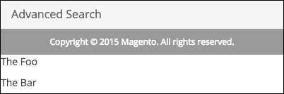
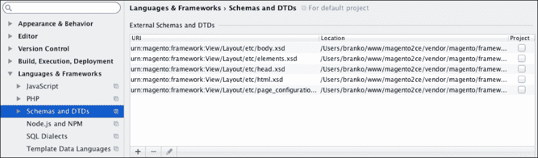
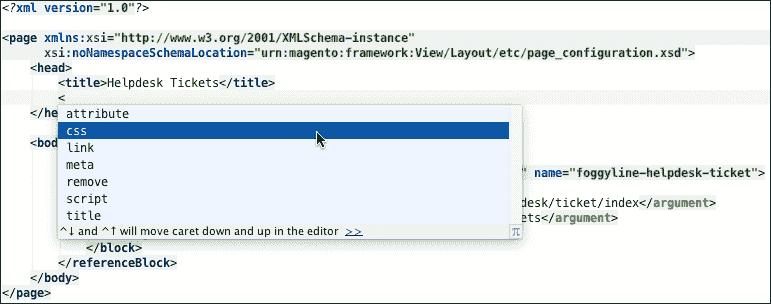
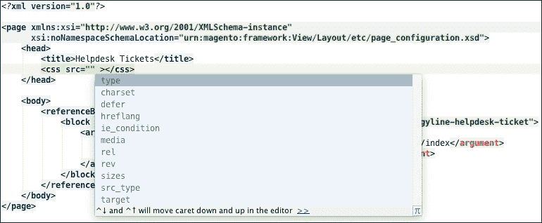
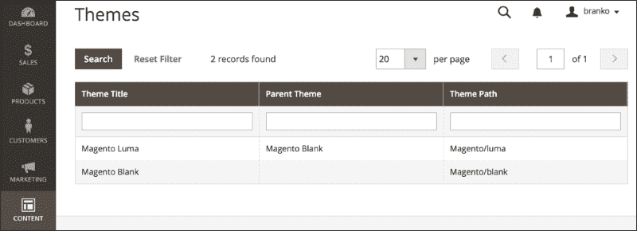
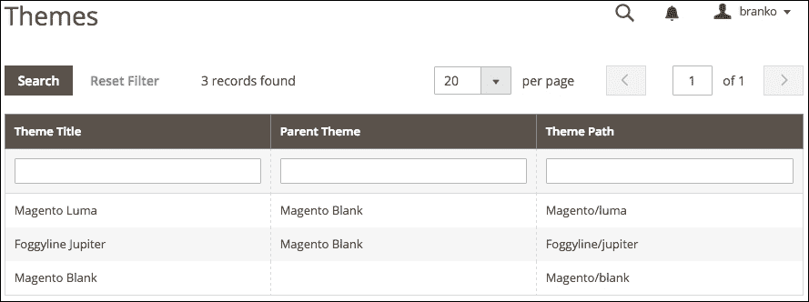
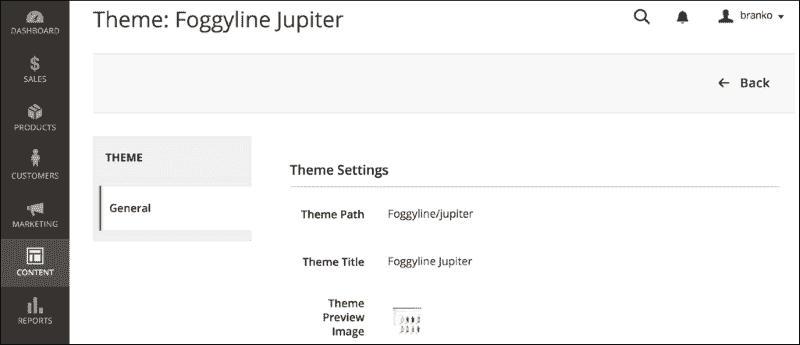
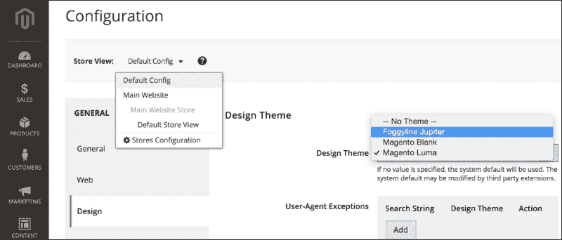

# 第八章. 前端开发

前端开发是一个与生产网站或 Web 应用程序的 HTML、CSS 和 JavaScript 紧密相关的术语。它可以互换地涉及可访问性、可用性和性能，以达到令人满意的用户体验。我们想要应用到我们的网店的各种定制级别需要不同的开发技能水平。我们可以仅使用 CSS 对我们的网店进行相对简单的更改。这些更改将是我们接受网店结构，仅关注视觉上的更改，如更改颜色和图像。这可能是一个对经验较少的开发者和新接触 Magento 平台的人来说的好起点。更复杂的方法是对由 Magento 模块生成的输出进行更改。这通常意味着需要一点 PHP 知识，主要是对现有代码片段的*复制-粘贴-修改*。高于这个技能水平意味着我们需要了解如何对我们的网店进行结构性的更改。这通常意味着掌握 Magento 的相对复杂的布局引擎，通过 XML 定义进行更改。Magento 前端开发的最终和最高技能水平意味着对现有或新的自定义功能进行修改。

在本章中，我们将深入以下部分：

+   渲染流程

+   视图元素

+   块架构和生命周期

+   模板

+   XML 布局

+   主题

+   JavaScript

+   CSS

# 渲染流程

Magento 应用程序的入口点是它的`index.php`文件。所有的 HTTP 请求都通过它进行。

让我们按照以下方式分析`index.php`文件的（裁剪）版本：

```php
//PART-1-1
require __DIR__ . '/app/bootstrap.php';

//PART-1-2
$bootstrap = \Magento\Framework\App\Bootstrap::create(BP, $_SERVER);

//PART-1-3
$app = $bootstrap-> createApplication('Magento\Framework\App\Http');

//PART-1-4
$bootstrap->run($app);
```

前面的代码中的`PART-1-1`只是将`/app/bootstrap.php`包含到代码中。在引导过程中发生的事情是包含`app/autoload.php`和`app/functions.php`。函数文件包含一个`__()`函数，用于翻译目的，返回`\Magento\Framework\Phrase`对象的实例。不深入自动加载文件的细节，只需说它处理了所有我们的类文件在 Magento 中的自动加载。

`PART-1-2`只是一个静态的创建方法调用，用于获取`\Magento\Framework\App\Bootstrap`对象的实例，并将其存储到`$bootstrap`变量中。

`PART-1-3`在`$bootstrap`对象上调用`createApplication`方法。在`createApplication`内部发生的事情不过是使用对象管理器创建并返回我们传递给它的类的对象实例。由于我们将`\Magento\Framework\App\Http`类的名称传递给`createApplication`方法，我们的`$app`变量就变成了该类的实例。这意味着，实际上，我们的网店应用是`Magento\Framework\App\Http`类的实例。

`PART-1-4` 正在调用 `$bootstrap` 对象的 `run` 方法，并传递 `Magento\Framework\App\Http` 类的实例。尽管这看起来像一行简单的代码，但正如我们很快将看到的，事情变得复杂起来。

让我们按照以下方式分析 `\Magento\Framework\App\Bootstrap` 的 `->` `run` 方法的（裁剪）版本：

```php
public function run(\Magento\Framework\AppInterface $application)
{
    //PART-2-1
    $this->initErrorHandler();
    $this->initObjectManager();
    $this->assertMaintenance();
    $this->assertInstalled();

    //PART-2-2
    $response = $application->launch();

    //PART-2-3
    $response->sendResponse();
}
```

在前面的代码中，`PART-2-1` 处理了一些家务事。它初始化了自定义错误处理器，初始化了对象管理器，检查我们的应用程序是否处于维护模式，并检查它是否已安装。

`PART-2-2` 看起来像一行简单的代码。在这里，我们正在调用 `$application` 的 `launch` 方法，而 `$application` 是 `Magento\Framework\App\Http` 实例。暂时不深入探讨 `launch` 方法的内部工作原理，我们只需说它返回了在 `var/generation/Magento/Framework/App/Response/Http/Interceptor.php` 下定义的 `Magento\Framework\App\Response\Http\Interceptor` 类的实例。请注意，这是一个自动生成的包装类，它扩展了 `\Magento\Framework\App\Response\Http` 类。实际上，忽略 `Interceptor`，我们可以这样说，`$response` 是 `\Magento\Framework\App\Response.Http` 类的实例。

最后，`PART-2-3` 调用了 `$response` 的 `sendResponse` 方法。尽管 `$response` 是 `\Magento\Framework\App\Response.Http` 类的实例，但实际的 `sendResponse` 方法是在父类树中的 `\Magento\Framework\HTTP\PhpEnvironment\Response` 类中找到的。`sendResponse` 方法调用另一个父类方法，即 `send` 方法。`send` 方法可以在 `Zend\Http\PhpEnvironment\Response` 类下找到。它触发了 `sendHeaders` 和 `sendContent` 方法。这是实际输出被发送到浏览器的地方，因为 `sendHeaders` 方法使用了 PHP 的 `header` 函数和 `echo` 构造来推送输出。

重申前面的内容，我们理解的执行流程归结如下：

+   `index.php`

+   `\Magento\Framework\App\Bootstrap` `->` `run`

+   `\Magento\Framework\App\Http` `->` `launch`

+   `\Magento\Framework\App\Response\Http` `->` `sendResponse`

尽管我们已经到达了引导的 `run` 方法的末尾，但如果我们说我们已经涵盖了渲染流程，那是不公平的，因为我们几乎没触及它。

我们需要退后一步，详细查看 `PART-2-2`，即 `launch` 方法的内部工作原理。让我们看一下 `\Magento\Framework\App\Http` `->` `launch` 方法的（裁剪）版本如下：

```php
public function launch()
{
    //PART-3-1
    $frontController = $this->_objectManager->get ('Magento\Framework\App\FrontControllerInterface');

    //PART-3-2
    $result = $frontController->dispatch($this->_request);

    if ($result instanceof \Magento\Framework\Controller \ResultInterface) {
        //PART-3-3
        $result->renderResult($this->_response);
    } elseif ($result instanceof \Magento\Framework\App \Response\HttpInterface) {
        $this->_response = $result;
    } else {
        throw new \InvalidArgumentException('Invalid return type');
    }

    //PART-3-4
    return $this->_response;
}
```

`PART-3-1` 创建了一个符合 `\Magento\Framework\App\FrontControllerInterface` 类的对象实例。如果我们查看 `app/etc/di.xml`，我们可以看到对 `FrontControllerInterface` 的偏好设置是为了 `\Magento\Framework\App\FrontController` 类。然而，如果我们调试代码并检查实际的实例类，它将显示为 `Magento\Framework\App\FrontController\Interceptor`。这是 Magento 添加了一个拦截器包装器，然后扩展了 `\Magento\Framework\App\FrontController`，这是我们根据 `di.xml` 偏好条目所期望的。

现在我们知道了 `$frontController` 实例背后的真实类，我们知道在哪里查找 `dispatch` 方法。`dispatch` 方法是理解渲染流程过程中的另一个重要步骤。我们将在稍后更详细地探讨其内部工作原理。现在，让我们回到 `PART-3-2` 的 `$result` 变量。如果我们调试这个变量，直接在其背后的类将显示为 `Magento\Framework\View\Result\Page\Interceptor`，定义在动态创建的 `var/generation/Magento/Framework/View/Result/Page/Interceptor.php` 文件中。`Interceptor` 是 `\Magento\Framework\View\Result\Page` 类的包装器。因此，可以说我们的 `$result` 变量是 `Page` 类的实例。

`Page` 类扩展了 `\Magento\Framework\View\Result\Layout`，它进一步扩展了 `\Magento\Framework\Controller\AbstractResult` 并实现了 `\Magento\Framework\Controller\ResultInterface`。这里有一个相当长的链，但理解它很重要。

注意 `PART-3-3`。由于我们的 `$result` 是 `\Magento\Framework\Controller\ResultInterface` 的实例，我们进入了第一个 `if` 条件，调用了 `renderResult` 方法。`renderResult` 方法本身是在 `\Magento\Framework\View\Result\Layout` 类中声明的。不深入探讨 `renderResult` 的细节，只需说它添加了 HTTP 头和内容到传递给它的 `$this->_response` 对象。正如我们在 `PART-2-2` 中所描述的，相同的响应对象是 `launch` 方法返回的。

虽然 `PART-3-3` 没有描绘任何返回值，但表达式 `$result->renderResult($this->_response)` 本身并不进行任何输出。它修改了 `$this->_response`，这是我们最终从 `launch` 方法返回的，正如我们在 `PART-3-4` 中所展示的。

重申前面的内容，我们理解的执行流程归结如下：

+   `index.php`

+   `\Magento\Framework\App\Bootstrap` `->` `run`

+   `\Magento\Framework\App\Http` `->` `launch`

+   `\Magento\Framework\App\FrontController` `->` `dispatch`

+   `\Magento\Framework\View\Result\Page` `->` `renderResult`

+   `\Magento\Framework\App\Response\Http` `->` `sendResponse`

正如我们在解释 `PART-3-2` 时提到的，`dispatch` 方法是渲染流程过程中的另一个重要步骤。让我们看一下 `\Magento\Framework\App\FrontController` 的 `->` `dispatch` 方法的（裁剪）版本，如下所示：

```php
public function dispatch(\Magento\Framework\App\RequestInterface $request)
{
    //PART-4-1
    while (!$request->isDispatched() && $routingCycleCounter++ < 100) {
        //PART-4-2
        foreach ($this->_routerList as $router) {
            try {
                //PART-4-3
                $actionInstance = $router->match($request);
                if ($actionInstance) {
                    $request->setDispatched(true);
                    //PART-4-4
                    $result = $actionInstance->dispatch($request);
                    break;
                }
            } catch (\Magento\Framework\Exception \NotFoundException $e) {}
        }
    }
    //PART-4-4
    return $result;
}
```

上一段代码中的 `PART-4-1` 和 `PART-4-2` 展示了（几乎）整个 `dispatch` 方法体包含在一个循环中。循环进行了 100 次迭代，进一步遍历所有可用的路由器类型，从而给每个路由器 100 次找到路由匹配的机会。

路由列表循环包括以下类类型的路由器：

+   `Magento\Framework\App\Router\Base`

+   `Magento\UrlRewrite\Controller\Router`

+   `Magento\Cms\Controller\Router`

+   `Magento\Framework\App\Router\DefaultRouter`

所有的列表路由器都实现了 `\Magento\Framework\App\RouterInterface`，这使得它们都具有 `match` 方法的实现。

如果模块选择这样做，可以进一步定义新的路由器。例如，如果我们正在开发一个 `Blog` 模块，我们希望我们的模块捕获所有以 `/blog/` 部分开始的 URL 请求。这可以通过指定自定义路由器来实现，然后它将出现在前面的列表中。

`PART-4-3` 展示了 `$actionInstance` 变量存储了路由器 `match` 方法调用的结果。根据 `RouterInterface` 的要求，`match` 方法必须返回一个实现了 `\Magento\Framework\App\ActionInterface` 的类的实例。让我们想象一下，我们现在正在从我们在 第四章 中编写的模块中访问 URL `/foggyline_office/test/crud/`，*模型和集合*。在这种情况下，我们的 `$router` 类将是 `\Magento\Framework\App\Router\Base`，我们的 `$actionInstance` 将是 `\Foggyline\Office\Controller\Test\Crud\Interceptor` 类。Magento 自动通过动态生成的 `var/generation/Foggyline/Office/Controller/Test/Crud/Interceptor.php` 文件添加 `Interceptor`。这个 `Interceptor` 类进一步扩展了我们的模块 `\Foggyline\Office\Controller\Test\Crud` 类文件。`Crud` 类扩展了 `\Foggyline\Office\Controller\Test`，它进一步扩展了 `\Magento\Framework\App\Action\Action`，它实现了 `\Magento\Framework\App\ActionInterface`。经过一段漫长的父子树，我们最终到达了 `ActionInterface`，这正是我们的 `match` 方法需要返回的。

`PART-4-4` 展示了在 `$actionInstance` 上调用 `dispatch` 方法。这个方法在 `\Magento\Framework\App\Action\Action` 中实现，并期望返回一个实现了 `\Magento\Framework\App\ResponseInterface` 的对象。在 `dispatch` 内部，调用 `execute` 方法，从而运行我们 `Crud` 控制器动作 `execute` 方法中的代码。

假设我们的`Crud`控制器操作执行方法没有返回任何内容，`$result`对象将变为`Magento\Framework\App\Response\Http\Interceptor`的实例，它围绕`\Magento\Framework\App\Response\Http`进行包装。

让我们假设我们的`Crud`类已经定义如下：

```php
/**
 * @var \Magento\Framework\View\Result\PageFactory
 */
protected $resultPageFactory;

public function __construct(
    \Magento\Framework\App\Action\Context $context,
    \Magento\Framework\View\Result\PageFactory $resultPageFactory
)
{
    $this->resultPageFactory = $resultPageFactory;
    return parent::__construct($context);
}

public function execute()
{
    $resultPage = $this->resultPageFactory->create();
    //...
    return $resultPage;
}
```

现在调试`$result`变量显示它是一个`\Magento\Framework\View\Result\Page\Interceptor`的实例。这个`Interceptor`由 Magento 在`var/generation/Magento/Framework/View/Result/Page/Interceptor.php`下动态生成，并且仅仅是`\Magento\Framework\View\Result\Page`的包装器。这个`Page`类进一步扩展了`\Magento\Framework\View\Result\Layout`类，并实现了`\Magento\Framework\App\ResponseInterface`。

最后，`PART-4-4`展示了从`FrontController`的`dispatch`方法返回的`$result`对象，其类型为`\Magento\Framework\View\Result\Page`。

再次强调前面提到的，我们理解的执行流程如下：

+   `index.php`

+   `\Magento\Framework\App\Bootstrap` `->` `run`

+   `\Magento\Framework\App\Http` `->` `launch`

+   `\Magento\Framework\App\FrontController` `->` `dispatch`

+   `\Magento\Framework\App\Router\Base` `->` `match`

+   `\Magento\Framework\App\Action\Action` `->` `dispatch`

+   `\Magento\Framework\View\Result\Page` `->` `renderResult`

+   `\Magento\Framework\App\Response\Http` `->` `sendResponse`

简而言之，作为前端开发者，我们应该知道，从我们的控制器操作中返回页面类型对象将自动调用该对象上的`renderResult`方法。`Page`和`Layout`是所有主题翻译、布局和模板加载触发的地方。

# 视图元素

Magento 的主要视图元素是其 UI 组件、容器和块。以下是对每个元素的简要概述。

## Ui 组件

在`vendor/magento/framework/View/Element/`文件夹下，我们可以找到`UiComponentInterface`和`UiComponentFactory`。完整的`Ui`组件集合位于`vendor/magento/framework/View/Element/`目录下。Magento 通过一个名为`Magento_Ui`的独立模块实现了`UiComponent`。因此，组件本身位于`vendor/magento/module-ui/Component/`目录下。

组件实现`UiComponentInterface`，该接口定义在`vendor/magento/framework/View/Element/UiComponentInterface.php`文件中，如下所示：

```php
namespace Magento\Framework\View\Element;

use Magento\Framework\View\Element\UiComponent\ContextInterface;

interface UiComponentInterface extends BlockInterface
{
    public function getName();
    public function getComponentName();
    public function getConfiguration();
    public function render();
    public function addComponent($name, UiComponentInterface $component);
    public function getComponent($name);
    public function getChildComponents();
    public function getTemplate();
    public function getContext();
    public function renderChildComponent($name);
    public function setData($key, $value = null);
    public function getData($key = '', $index = null);
    public function prepare();
    public function prepareDataSource(array & $dataSource);
    public function getDataSourceData();
}
```

注意`BlockInterface`如何扩展`BlockInterface`，而`BlockInterface`只定义了一个方法要求，如下所示：

```php
namespace Magento\Framework\View\Element;

interface BlockInterface
{
    public function toHtml();
}
```

由于`Block`是界面元素的一部分，`UiComponent`可以被视为一个高级块。让我们快速查看`\Magento\Framework\View\Layout`类中的`_renderUiComponent`方法，部分定义如下：

```php
protected function _renderUiComponent($name)
{
    $uiComponent = $this->getUiComponent($name);
    return $uiComponent ? $uiComponent->toHtml() : '';
}
```

这表明 `UiComponent` 与块以相同的方式渲染，通过在组件上调用 `toHtml` 方法。`vendor/magento/module-ui/view/base/ui_component/etc/definition.xml` 文件包含了一个广泛的 `UiComponents` 列表，如下所示：

+   `dataSource`: `Magento\Ui\Component\DataSource`

+   `listing`: `Magento\Ui\Component\Listing`

+   `paging`: `Magento\Ui\Component\Paging`

+   `filters`: `Magento\Ui\Component\Filters`

+   `container`: `Magento\Ui\Component\Container`

+   `form`: `Magento\Ui\Component\Form`

+   `price`: `Magento\Ui\Component\Form\Element\DataType\Price`

+   `image`: `Magento\Ui\Component\Form\Element\DataType\Media`

+   `nav`: `Magento\Ui\Component\Layout\Tabs\Nav`

…以及更多

这些组件主要用于在管理区域构建列表和过滤器。如果我们对整个 Magento 进行 `uiComponent` 的字符串搜索，我们通常会找到类似 `vendor/magento/module-cms/view/adminhtml/layout/cms_block_index.xml` 中的条目，内容如下：

```php
<page  xsi:noNamespaceSchemaLocation="urn:magento:framework:View/Layout /etc/page_configuration.xsd">
    <body>
        <referenceContainer name="content">
            <uiComponent name="cms_block_listing"/>
        </referenceContainer>
    </body>
</page>
```

`uiComponent` 的 `name` 属性的值 `cms_block_listing` 指的是 `vendor/magento/module-cms/view/adminhtml/ui_component/cms_block_listing.xml` 文件的名字。在 `cms_block_listing.xml` 文件中，我们定义了一个跨越数百行 XML 的列表组件。列表组件然后是 `dataSource`、`container`、`bookmark`、`filterSearch`、`filters` 等等。我们不会深入这些声明的细节，因为我们的重点是更通用的前端部分。

## 容器

容器没有与之相关的块类。容器会自动渲染其所有子元素。它们允许配置一些属性。只需将任何元素附加到容器上，它就会自动渲染。使用容器，我们可以定义包装标签、CSS 类等。

我们不能创建容器的实例，因为它们是一个抽象概念，而我们可以创建块实例。

容器是通过 `Magento\Framework\View\Layout` 类的 `_renderContainer` 方法渲染的，定义如下：

```php
protected function _renderContainer($name)
{
    $html = '';
    $children = $this->getChildNames($name);
    foreach ($children as $child) {
        $html .= $this->renderElement($child);
    }
    if ($html == '' || !$this->structure->getAttribute($name, Element::CONTAINER_OPT_HTML_TAG)) {
        return $html;
    }

    $htmlId = $this->structure->getAttribute($name, Element::CONTAINER_OPT_HTML_ID);
    if ($htmlId) {
        $htmlId = ' id="' . $htmlId . '"';
    }

    $htmlClass = $this->structure->getAttribute($name, Element::CONTAINER_OPT_HTML_CLASS);
    if ($htmlClass) {
        $htmlClass = ' class="' . $htmlClass . '"';
    }

    $htmlTag = $this->structure->getAttribute($name, Element::CONTAINER_OPT_HTML_TAG);

    $html = sprintf('<%1$s%2$s%3$s>%4$s</%1$s>', $htmlTag, $htmlId, $htmlClass, $html);

    return $html;
}
```

容器支持以下额外属性：`htmlTag`、`htmlClass`、`htmlId` 和 `label`。为了演示容器在实际操作中的效果，让我们确保我们有一个来自 第四章，*模型和集合* 的模块，并在模块根目录 `app/code/Foggyline/Office/` 中创建 `view/frontend/layout/foggyline_office_test_crud.xml` 文件，内容如下：

```php
<page  layout="1column"
      xsi:noNamespaceSchemaLocation="urn:magento:framework:View /Layout/etc/page_configuration.xsd">
    <head>
        <title>Office CRUD #layout</title>
    </head>
    <body>
        <container name="foobar" htmlTag="div" htmlClass="foo- bar">
            <block class="Magento\Framework\View\Element\Text" name="foo">
                <action method="setText">
                    <argument name="text" xsi:type="string"> <![CDATA[<p>The Foo</p>]]></argument>
                </action>
            </block>
            <block class="Magento\Framework\View\Element\Text" name="bar">
                <action method="setText">
                    <argument name="text" xsi:type="string"> <![CDATA[<p>The Bar</p>]]></argument>
                </action>
            </block>
        </container>
    </body>
</page>
```

上述 XML 定义了一个名为 `foobar` 的单个容器，容器内有两个名为 `foo` 和 `bar` 的块元素。当我们在浏览器中打开 `http://{我们的商店网址}/index.php/foggyline_office/test/crud/` 时，它应该会启动。

注意容器本身并没有嵌套在任何其他元素中，而是直接嵌入到主体中。我们本可以轻松地嵌套到其他容器中，如下所示：

```php
<body>
    <referenceContainer name="content">
        <container name="foobar" htmlTag="div" htmlClass="foo- bar">
```

无论哪种方式，我们都应该在浏览器中看到 **The Foo** 和 **The Bar** 这两个字符串，以及加载了全页布局，如下截图所示：



## 块

尽管容器决定了页面的布局，但它们并不直接包含实际内容。包含内容并嵌套在容器内的部分被称为 **块**。每个块可以包含任意数量的子内容块或子容器。因此，几乎每个 Magento 中的网页都是由块和容器的混合体构成的。布局定义了页面上块的顺序，而不是它们的位置。块的外观和感觉由 CSS 和页面的渲染方式决定。当我们提到块时，我们几乎总是隐含地指模板。模板是实际在页面内绘制元素的东西；块是包含数据的东西。换句话说，模板是 PHTML 或 HTML 文件，通过变量或方法从链接的 PHP 块类中提取数据。

Magento 在 `app/etc/di.xml` 中定义了 `Magento\Framework\View\Result\Page` 类型，如下所示：

```php
<type name="Magento\Framework\View\Result\Page">
    <arguments>
        <argument name="layoutReaderPool" xsi:type="object">pageConfigRenderPool</argument>
        <argument name="generatorPool" xsi:type="object">pageLayoutGeneratorPool</argument>
        <argument name="template" xsi:type="string">Magento_Theme::root.phtml</argument>
    </arguments>
</type>
```

注意模板参数设置为 `Magento_Theme::root.phtml`。当 `Page` 被初始化时，它会选择 `vendor/magento/module-theme/view/base/templates/root.phtml` 文件。`root.phtml` 定义如下：

```php
<!doctype html>
<html <?php echo $htmlAttributes ?>>
    <head <?php echo $headAttributes ?>>
        <?php echo $requireJs ?>
        <?php echo $headContent ?>
        <?php echo $headAdditional ?>
    </head>
    <body data-container="body" data-mage-init='{"loaderAjax": {}, "loader": { "icon": "<?php echo $loaderIcon; ?>"}}' <?php echo $bodyAttributes ?>>
        <?php echo $layoutContent ?>
    </body>
</html>
```

在 `root.phtml` 中的变量在 `Magento\Framework\View\Result\Page` 渲染方法调用期间分配（部分）如下：

```php
protected function render(ResponseInterface $response)
{
    $this->pageConfig->publicBuild();
    if ($this->getPageLayout()) {
        $config = $this->getConfig();
        $this->addDefaultBodyClasses();
        $addBlock = $this->getLayout()->getBlock ('head.additional');
        $requireJs = $this->getLayout()->getBlock('require.js');
        $this->assign([
            'requireJs' => $requireJs ? $requireJs->toHtml() : null,
            'headContent' => $this->pageConfigRenderer-> renderHeadContent(),
            'headAdditional' => $addBlock ? $addBlock->toHtml() : null,
            'htmlAttributes' => $this->pageConfigRenderer-> renderElementAttributes($config::ELEMENT_TYPE_HTML),
            'headAttributes' => $this->pageConfigRenderer-> renderElementAttributes($config::ELEMENT_TYPE_HEAD),
            'bodyAttributes' => $this->pageConfigRenderer-> renderElementAttributes($config::ELEMENT_TYPE_BODY),
            'loaderIcon' => $this->getViewFileUrl('images/loader- 2.gif'),
        ]);

        $output = $this->getLayout()->getOutput();
        $this->assign('layoutContent', $output);
        $output = $this->renderPage();
        $this->translateInline->processResponseBody($output);
        $response->appendBody($output);
    } else {
        parent::render($response);
    }
    return $this;
}
```

表达式 `$this->assign` 用于将变量如 `layoutContent` 分配给 `root.phtml` 模板。`layoutContent` 是基于基本布局生成的，包括当前页面的所有布局更新。

基础布局包括以下 XML 文件在 `vendor/magento/module-theme/view/` 目录下：

+   `base/page_layout/empty.xml`

+   `frontend/page_layout/1column.xml`

+   `frontend/page_layout/2columns-left.xml`

+   `frontend/page_layout/2columns-right.xml`

+   `frontend/page_layout/3columns.xml`

表达式 `$this->getLayout()->getOutput()` 用于获取所有标记为输出的块。它基本上在布局中查找元素，渲染它们，并返回带有输出的字符串。在这个过程中，会触发 `core_layout_render_element` 事件，这为我们影响输出结果提供了一种可能的方式。此时，页面上的大多数元素都已渲染。这很重要，因为块在这里扮演着重要角色。渲染系统会考虑 `empty.xml`，因为它也由一个容器列表组成，每个容器都通过其他布局更新附加了一些块。

### 注意

简而言之，每个容器都分配了相应的块。每个块通常（但不总是）渲染一个模板。模板本身可能调用也可能不调用其他块，依此类推。块在从模板调用时被渲染。

## 块架构和生命周期

块是 Magento 中主要的视图元素之一。在父树结构的根处，块从 `Magento\Framework\View\Element\AbstractBlock` 类扩展并实现 `Magento\Framework\View\Element\BlockInterface`。

`BlockInterface` 只设置了一个要求，即实现 `toHtml` 方法。此方法应返回块的 HTML 输出。

在查看 `AbstractBlock` 的内部结构时，我们可以看到它声明了许多方法。其中最重要的方法如下：

+   `_prepareLayout`：准备全局布局。我们可以在子类中重新定义此方法以更改布局。

+   `addChild`：创建一个新的块，将其设置为当前块的子块，并返回新创建的块。

+   `_toHtml`：返回一个空字符串。我们需要在子类中重写此方法以生成 HTML。

+   `_beforeToHtml`：返回 `$this`。在渲染 HTML 之前执行，但在尝试加载缓存之后。

+   `_afterToHtml`：在渲染后处理块 HTML。返回一个 HTML 字符串。

+   `toHtml:` 生成并返回一个块的 HTML 输出。此方法不应被重写。如果需要，我们可以在子类中重写 `_toHtml` 方法。

`AbstractBlock` 的执行流程可以描述如下：

+   `_prepareLayout`

+   `toHtml`

+   `_beforeToHtml`

+   `_toHtml`

+   `_afterToHtml`

它从 `_prepareLayout` 开始，通过一系列方法直到达到 `_afterToHtml`。本质上，这是我们关于块执行流程需要了解的内容。

最重要的块类型是：

+   `Magento\Framework\View\Element\Text`

+   `Magento\Framework\View\Element\Text\ListText`

+   `Magento\Framework\View\Element\Messages`

+   `Magento\Framework\View\Element\Template`

所有这些块基本上都是抽象块的实现。由于 `AbstractBlock` 中的 `_toHtml` 方法仅返回一个空字符串，因此所有这些子类都实现了它们自己的 `_toHtml` 方法。

为了演示这些块的使用，我们可以使用之前创建的 `app/code/Foggyline/Office/view/frontend/layout/foggyline_office_test_crud.xml` 文件。

`Text` 块有一个 `setText` 方法，我们可以使用它来设置其内容。我们通过布局文件实例化 `Text` 块并设置其文本值的示例如下：

```php
<block class="Magento\Framework\View\Element\Text" name="example_1">
    <action method="setText">
        <argument name="text" xsi:type="string"><![CDATA[<p>Text_1</p>]]></argument>
    </action>
</block>
```

`ListText` 块从 `Text` 类扩展而来。然而，它实际上并不支持使用 `setText` 来设置其内容。这仅从其代码中就可以明显看出，在其 `_toHtml` 方法的实现中，`$this->setText('')` 表达式立即被调用。相反，实际上发生的情况是 `_toHtml` 方法遍历它可能拥有的任何子块，并在其上调用布局的 `renderElement` 方法。基本上，我们可以将 `ListText` 块与 `container` 进行比较，因为它们具有几乎相同的目的。然而，与容器不同，块是一个类，因此我们可以从 PHP 中操作它。以下是一个使用 `ListText` 的示例，其中包含几个子 `Text` 块：

```php
<block class="Magento\Framework\View\Element\Text\ListText" name="example_2">
    <block class="Magento\Framework\View\Element\Text" name="example_2a">
        <action method="setText">
            <argument name="text" xsi:type="string"> <![CDATA[<p>Text_2A</p>]]></argument>
        </action>
    </block>
    <block class="Magento\Framework\View\Element\Text" name="example_2b">
        <action method="setText">
            <argument name="text" xsi:type="string"> <![CDATA[<p>Text_2B</p>]]></argument>
        </action>
    </block>
</block>
```

`Messages` 块支持四种我们可以用来向输出添加内容的方法：`addSuccess`、`addNotice`、`addWarning` 和 `addError`。以下是通过布局更新文件实例化 `Messages` 块的示例：

```php
<block class="Magento\Framework\View\Element\Messages" name="example_3">
    <action method="addSuccess">
        <argument name="text" xsi:type="string"> <![CDATA[<p>Text_3A: Success</p>]]></argument>
    </action>
    <action method="addNotice">
        <argument name="text" xsi:type="string"> <![CDATA[<p>Text_3B: Notice</p>]]></argument>
    </action>
    <action method="addWarning">
        <argument name="text" xsi:type="string"> <![CDATA[<p>Text_3C: Warning</p>]]></argument>
    </action>
    <action method="addError">
        <argument name="text" xsi:type="string"> <![CDATA[<p>Text_3D: Error</p>]]></argument>
    </action>
</block>
```

上述示例应谨慎对待，因为在布局中调用这些设置方法不是正确的方式。默认的 `Magento_Theme` 模块已经定义了使用 `vendor/magento/module-theme/view/frontend/templates/messages.phtml` 进行消息渲染的 `Messages` 块。因此，在大多数情况下，没有必要定义我们自己的消息块。

最后，让我们看看以下 `Template` 块的示例：

```php
<block class="Magento\Framework\View\Element\Template"
    name="example_4" template="Foggyline_Office::office /no4/template.phtml"/>
```

上述 XML 将实例化 `Template` 类型的块，并在 `app/code/Foggyline/Office/` 目录下渲染 `view/frontend/templates/office/no4/template.phtml` 文件的内容。

在 PHP 层面上，使用布局对象或直接通过对象管理器实例化一个新的块可以完成。布局方法是首选方法。关于之前在 XML 中的示例，让我们看看它们的 PHP 替代方案（假设 `$resultPage` 是 `\Magento\Framework\View\Result\PageFactory` 的一个实例）。

以下是一个实例化 `Text` 类型的块并将其添加到内容容器中的示例：

```php
$block = $resultPage->getLayout()->createBlock(
    'Magento\Framework\View\Element\Text',
    'example_1'
)->setText(
    '<p>Text_1</p>'
);

$resultPage->getLayout()->setChild(
    'content',
    $block->getNameInLayout(),
    'example_1_alias'
);
```

`ListText` 版本在 PHP 中的实现如下：

```php
$blockLT = $resultPage->getLayout()->createBlock(
    'Magento\Framework\View\Element\Text\ListText',
    'example_2'
);

$resultPage->getLayout()->setChild(
    'content',
    $blockLT->getNameInLayout(),
    'example_2_alias'
);

$block2A = $resultPage->getLayout()->createBlock(
    'Magento\Framework\View\Element\Text',
    'example_2a'
)->setText(
    '<p>Text_2A</p>'
);

$resultPage->getLayout()->setChild(
    'example_2',
    $block2A->getNameInLayout(),
    'example_2a_alias'
);

$block2B = $resultPage->getLayout()->createBlock(
    'Magento\Framework\View\Element\Text',
    'example_2b'
)->setText(
    '<p>Text_2B</p>'
);

$resultPage->getLayout()->setChild(
    'example_2',
    $block2B->getNameInLayout(),
    'example_2b_alias'
);
```

注意我们首先创建了一个 `ListText` 块的实例，并将其分配给名为 `content` 的元素作为子元素。然后我们创建了两个单独的 `Text` 块，并将它们分配给名为 `example_2` 的元素作为子元素，即我们的 `ListText`。

接下来，让我们定义以下 `Messages` 块：

```php
$messagesBlock = $resultPage->getLayout()->createBlock(
    'Magento\Framework\View\Element\Messages',
    'example_3'
);

$messagesBlock->addSuccess('Text_3A: Success');
$messagesBlock->addNotice('Text_3B: Notice');
$messagesBlock->addWarning('Text_3C: Warning');
$messagesBlock->addError('Text_3D: Error');

$resultPage->getLayout()->setChild(
    'content',
    $messagesBlock->getNameInLayout(),
    'example_3_alias'
);
```

最后，让我们看看如何初始化 `Template` 块类型，如下所示：

```php
$templateBlock = $resultPage->getLayout()->createBlock(
    'Magento\Framework\View\Element\Template',
    'example_3'
)->setTemplate(
    'Foggyline_Office::office/no4/template.phtml'
);

$resultPage->getLayout()->setChild(
    'content',
    $templateBlock->getNameInLayout(),
    'example_4_alias'
);
```

在可能的情况下，我们应该使用 XML 布局来设置我们的块。

现在我们知道了如何利用最常用的 Magento 块类型，让我们看看我们如何创建自己的块类型。

定义我们自己的 `block` 类就像创建一个扩展 `Template` 的自定义类文件一样简单。这个 `block` 类应该放在我们的模块 `Block` 目录下。使用我们的 `Foggyline_Office` 模块，让我们创建一个文件，`Block/Hello.php`，内容如下：

```php
namespace Foggyline\Office\Block;

class Hello extends \Magento\Framework\View\Element\Template
{
    public function helloPublic()
    {
        return 'Hello #1';
    }

    protected function helloProtected()
    {
        return 'Hello #2';
    }

    private function helloPrivate()
    {
        return 'Hello #3';
    }
}
```

上述代码仅仅创建了一个新的自定义块类。然后我们可以通过布局文件调用这个 `block` 类，如下所示：

```php
<block class="Foggyline\Office\Block\Hello"
    name="office.hello" template="office/hello.phtml"/>
```

最后，在我们的模块 `app/code/Foggyline/Office/` 目录中，我们创建一个模板文件，`view/frontend/templates/office/hello.phtml`，内容如下：

```php
<?php /* @var $block Foggyline\Office\Block\Hello */ ?>
<h1>Hello</h1>
<p><?php echo $block->helloPublic() ?></p>
<p><?php //echo $block->helloProtected() ?></p>
<p><?php //echo $block->helloPrivate() ?></p>
```

为了进一步了解模板文件中的情况，让我们深入了解一下模板本身。

## 模板

**模板**是混合了 HTML 和 PHP 的代码片段。PHP 部分包括变量、表达式和 `class` 方法调用等元素。Magento 使用 PHTML 文件扩展名作为模板文件。模板位于单个模块的 `view/{_area_}/templates/` 目录下。

在我们之前的例子中，我们使用类似于 `Foggyline_Office::office/hello.phtml` 的表达式来引用我们的模块模板文件。由于模板可能属于不同的模块，我们应该将模板名称作为前缀来使用，这是一个最佳实践。这将帮助我们定位模板文件并避免文件冲突。

一个简单的命名公式是这样的：我们输入模块的名称，然后是双冒号，接着是名称。这样，模板路径 `office/hello.phtml` 就等于 `Foggyline_Office::office/hello.phtml`。

在 PHTML 模板文件中，我们经常有各种 PHP 表达式，如 `$block->helloPublic()`。注意前面 XML 中的块类 `Foggyline\Office\Block\Hello`。这个块类的实例通过 `$block` 变量在 `hello.phtml` 中对我们可用。因此，像 `$block->helloPublic()` 这样的表达式实际上是调用 `Hello` 类的 `helloPublic` 方法。`Hello` 类不是 Magento 核心类之一，但它扩展了 `\Magento\Framework\View\Element\Template`。

我们的 `hello.phtml` 模板还有另外两个表达式：`$block->helloProtected()` 和 `$block->helloPrivate()`。然而，这些表达式不会被执行，因为模板只能看到它们 `$block` 实例的公共方法。

`$this` 变量在 PHTML 模板中也是可用的，它是 `Magento\Framework\View\TemplateEngine\Php` 类的一个实例。

在前面的模板代码示例中，我们可以轻松地将 `$block->helloPublic()` 替换为 `$this->helloPublic()` 表达式。这样做的原因在于模板引擎 `Php` 类，部分定义如下：

```php
public function __call($method, $args)
{
    return call_user_func_array([$this->_currentBlock, $method], $args);
}

public function __isset($name)
{
    return isset($this->_currentBlock->{$name});
}

public function __get($name)
{
    return $this->_currentBlock->{$name};
}
```

由于模板是在引擎的上下文中而不是在块的上下文中包含的，`__call` 将方法调用重定向到当前块。同样，`__isset` 将 `isset` 调用重定向到当前块，而 `__get` 允许读取当前块的属性。

虽然我们可以在模板文件中为同一目的使用 `$block` 和 `$this`，但我们实际上应该选择使用 `$block`。

模板的重要方面之一是它们的回退机制。回退是指仅给定相对路径时定义完整模板路径的过程。例如，`office/hello.phtml` 会回退到 `app/code/Foggyline/Office/view/frontend/templates/office/hello.phtml` 文件。

路径解析从定义在`Magento\Framework\View\Element\Template`类上的`_toHtml`方法开始。然后`_toHtml`方法在同一类中调用`getTemplateFile`，它反过来在`resolver`上调用`getTemplateFileName`，`resolver`是`\Magento\Framework\View\Element\Template\File\Resolver`的一个实例。进一步查看，`resolver`的`getTemplateFileName`进一步在`_viewFileSystem`上调用`getTemplateFileName`，`_viewFileSystem`是`\Magento\Framework\View\FileSystem`的一个实例。在`\Magento\Framework\View\Design\FileResolution\Fallback\TemplateFile`的一个实例上进一步调用`getFile`方法。`getFile`进一步触发`Magento\Framework\View\Design\FileResolution\Fallback\Resolver\Simple`实例上的 resolve 方法，该实例进一步在`Magento\Framework\View\Design\Fallback\RulePool`实例上调用`getRule`方法。`RulePoll`类是链中的最后一个类。`getRule`最终调用`createTemplateFileRule`方法，该方法创建检测文件位置的规则。

在运行`getRule`方法时，Magento 会检查以下类型的回退规则：

+   `file`

+   `locale`

+   `template`

+   `static`

+   `email`

值得花些时间研究`RulePool`类的内部工作原理，因为它展示了所列规则的详细回退。

## 布局

到目前为止，我们简要介绍了布局 XML。布局 XML 是一种工具，以模块化和灵活的方式构建 Magento 应用程序的页面。它使我们能够描述页面布局和内容放置。查看 XML 根节点，我们可以区分两种类型的布局：

+   `layout`: 包裹在`<layout>`中的 XML

+   `page`: 包裹在`<page>`中的 XML

`Page`布局代表一个完整的 HTML 页面，而`layout`布局代表页面的一部分。`layout`类型是`page`布局类型的子集。这两种类型的布局 XML 文件都由位于`vendor/magento/framework/View/Layout/etc/`目录下的 XSD 模式进行验证：

+   `layout` – `layout_generic.xsd`

+   `page` – `page_configuration.xsd`

根据提供`<layout>`和`<page>`元素的应用程序组件，我们可以进一步将它们分为基础布局和主题布局。

基础布局由模块提供，通常位于以下位置：

+   `<module_dir>/view/frontend/layout`: 页面配置和通用布局文件

+   `<module_dir>/view/frontend/page_layout`: 页面布局文件

主题布局由主题提供，通常位于以下位置：

+   `<theme_dir>/<Namespace>_<Module>/layout`: 页面配置和通用布局文件

+   `<theme_dir>/<Namespace>_<Module>/page_layout`: 页面布局文件

Magento 将在适当的页面上加载并合并所有模块和主题 XML 文件。一旦文件合并并处理了 XML 指令，结果将被渲染并发送到浏览器进行显示。如果存在两个不同的布局 XML 文件，且两者都引用了相同的块，则序列中具有相同名称的第二个文件将替换第一个文件。

当加载 XML 文件时，Magento 同时应用一个继承主题。我们可以应用一个主题，并且它将查找父主题，直到找到一个没有父主题的主题。

除了合并每个模块的文件外，模块目录内的布局文件也可以被主题扩展或覆盖。覆盖布局 XML 不是一种好的做法，但有时可能是必要的。

要**覆盖**在`<module_dir>/view/frontend/layout/`目录内由模块提供的基布局文件。

我们需要在`app/design/frontend/<vendor>/<theme>/<Namespace_Module>/layout/override/base/`目录中创建一个具有相同名称的 XML 文件。

要**覆盖**在`<parent_theme_dir>/<Namespace>_<Module>/layout/`目录内由父主题提供的主题布局文件。

我们需要在`app/design/frontend/<vendor>/<theme>/<Namespace_Module>/layout/override/theme/<Parent_Vendor>/<parent_theme>/`目录中创建一个具有相同名称的 XML 文件。

布局既可以被覆盖也可以被扩展。

定制布局的推荐方法是通过对自定义主题进行扩展。我们可以通过在`app/design/frontend/{vendorName}/{theme}/{vendorName}_{moduleName}/layout/`目录中添加一个具有相同名称的自定义 XML 布局文件来实现这一点。

如前例所示，布局支持大量指令：页面、头部、块等。这些指令的实际用途以及它们如何混合在一起本身就是一个挑战。详细说明每个指令超出了本书的范围。然而，我们可以展示如何确定某个特定指令的使用，这可能在我们某个特定时刻需要。为此，强烈建议使用像**NetBeans PHP**或**PhpStorm**这样的 IDE 环境，这些环境为包含 XSD 的 XML 提供自动完成功能。

以下是一个为 PhpStorm 定义外部架构的示例，我们只是简单地说`urn:magento:framework:View/Layout/etc/page_configuration.xsd`别名属于`vendor/magento/framework/View/Layout/etc/page_configuration.xsd`文件：



这样，当我们在 XML 文件周围键入时，PhpStorm 将知道如何提供自动完成功能。

例如，让我们看看我们如何使用`css`指令将外部 CSS 文件添加到我们的页面中。使用支持自动完成的 IDE，当我们开始在`page` | `head`元素中键入`css`指令时，自动完成可能会抛出以下内容：



显示了可用的属性列表，例如 `src`、`sizes`、`ie_condition`、`src_type` 等。像 PhpStorm 这样的 IDE 将允许我们右键单击一个元素或其属性，并 *转到定义*。查看 `src` 属性的定义将带我们进入 `vendor/magento/framework/View/Layout/etc/head.xsd` 文件，该文件定义了 `css` 元素如下：

```php
<xs:complexType name="linkType">
    <xs:attribute name="src" type="xs:string" use="required"/>
    <xs:attribute name="defer" type="xs:string"/>
    <xs:attribute name="ie_condition" type="xs:string"/>
    <xs:attribute name="charset" type="xs:string"/>
    <xs:attribute name="hreflang" type="xs:string"/>
    <xs:attribute name="media" type="xs:string"/>
    <xs:attribute name="rel" type="xs:string"/>
    <xs:attribute name="rev" type="xs:string"/>
    <xs:attribute name="sizes" type="xs:string"/>
    <xs:attribute name="target" type="xs:string"/>
    <xs:attribute name="type" type="xs:string"/>
    <xs:attribute name="src_type" type="xs:string"/>
</xs:complexType>
```

所有这些都是我们可以设置在 `css` 元素上的属性，因此它们会显示自动完成，如下所示：



虽然使用强大的 IDE 不是使用 Magento 的必需条件，但拥有一个能够理解 XML 和 XSD 文件并提供自动完成和验证功能的 IDE 当然是有帮助的。

## 主题

默认情况下，Magento 附带两个主题，分别命名为 `Blank` 和 `Luma`。如果我们登录到 Magento 管理区域，我们可以在 **内容** | **设计** | **主题** 菜单下看到可用的主题列表，如下截图所示：



Magento 主题支持父子关系，这是我们之前提到的，在上一张图片的 **父主题** 列表中可以看到。

### 创建新主题

以下步骤概述了创建我们自己的主题的过程：

1.  在 `{Magento` `根` `目录}/app/design/frontend` 下，创建一个以我们供应商名称命名的新的目录，名为 `Foggyline`。

1.  在 `vendor` 目录下，创建一个以主题名称命名的新的目录，名为 `jupiter`。

1.  在 `jupiter` 目录下，创建 `registration.php` 文件，内容如下：

    ```php
    <?php
    \Magento\Framework\Component\ComponentRegistrar::register(
        \Magento\Framework\Component\ComponentRegistrar::THEME,
        'frontend/Foggyline/jupiter',
        __DIR__
    );
    ```

1.  将 `vendor/magento/theme-frontend-blank/theme.xml` 复制到我们的主题中，`app/design/frontend/Foggyline/jupiter/theme.xml`，并按以下内容修改：

    ```php
    <theme  xsi:noNamespaceSchemaLocation="urn:magento: framework:Config/etc/theme.xsd">
        <title>Foggyline Jupiter</title>
        <parent>Magento/blank</parent>
        <media>
            <preview_image>media/preview.jpg</preview_image>
        </media>
    </theme>
    ```

1.  创建 `app/design/frontend/Foggyline/jupiter/media/preview.jpg` 图像文件作为主题预览图像（在管理区域中使用的图像）。

1.  可选地，为静态文件如样式、字体、JavaScript 和图像创建单独的目录。这些文件存储在我们的主题 `app/design/frontend/Foggyline/jupiter/` 文件夹的 `web` 子目录中，如下所示：

    +   `web/css/`

    +   `web/css/source/`

    +   `web/css/source/`

    +   `web/images/`

    +   `web/js/`

    在主题 `web` 目录下，我们存储通用的主题静态文件。如果我们的主题包含特定模块的静态文件，这些文件将存储在相应的 `vendor` 模块子目录下，例如 `app/design/frontend/Foggyline/jupiter/{vendorName_moduleName}/web/`。

1.  可选地，我们可以在主题 `web/images/` 文件夹下创建主题 `logo.svg` 图像。

完成前面的步骤后，回顾到管理区域下的 **内容** | **设计** | **主题** 菜单，我们现在应该可以看到我们的主题列在以下截图所示：



而点击表格中我们主题名称旁边的行将打开如下屏幕：



注意前两个屏幕没有显示任何应用主题的选项。它们只是列出可用的主题以及每个主题旁边的一些基本信息。我们的自定义主题显示了有趣的父子关系，其中父主题和子主题可以属于不同的供应商。

应用主题需要以下额外步骤：

1.  确保我们的主题出现在 **内容** | **设计** | **主题** 菜单下的主题列表中。

1.  前往 **商店** | **设置** | **配置** | **常规** | **设计**。

1.  在 **商店视图** 下拉字段中，我们选择要应用主题的商店视图，如以下图片的左上角所示：

1.  在 **设计主题** 选项卡中，我们在 **设计主题** 下拉列表中选择我们新创建的主题，如前一张图片的右侧所示。点击 **保存配置**。

1.  在 **系统** | **工具** | **缓存管理** 下，选择并刷新无效的缓存类型，然后点击 **清除目录图片缓存**、**清除 JavaScript/CSS 缓存** 和 **清除静态文件缓存** 按钮。

1.  最后，为了看到我们的更改已应用，请在浏览器中重新加载店面页面。

关于主题还有很多可以说的，可以写成一本书。然而，我们将继续讨论其他重要部分。

## JavaScript

Magento 使用了相当多的 JavaScript 库，例如：

+   Knockout: [`knockoutjs.com`](http://knockoutjs.com)

+   Ext JS: [`www.sencha.com/products/extjs/`](https://www.sencha.com/products/extjs/)

+   jQuery: [`jquery.com/`](https://jquery.com/)

+   jQuery UI: [`jqueryui.com/`](https://jqueryui.com/)

+   modernizr: [`www.modernizr.com/`](http://www.modernizr.com/)

+   Prototype: [`www.prototypejs.org/`](http://www.prototypejs.org/)

+   RequireJS: [`requirejs.org/`](http://requirejs.org/)

+   script.aculo.us: [`script.aculo.us/`](http://script.aculo.us/)

+   moment.js: [`momentjs.com/`](http://momentjs.com/)

+   Underscore.js: [`underscorejs.org/`](http://underscorejs.org/)

+   gruntjs: [`gruntjs.com/`](http://gruntjs.com/)

+   AngularJS: [`angularjs.org/`](https://angularjs.org/)

+   jasmine: [`jasmine.github.io/`](http://jasmine.github.io/)

…以及一些其他库

虽然前端开发者不需要了解每个库的细节，但至少对其中大多数有一个基本的了解是推荐的。

### 提示

值得在控制台运行 `find` `{MAGENTO-DIR}/` `-name` `\*.js` `>` `js-list.txt` 来获取 Magento 中每个 JavaScript 文件的全列表。花几分钟浏览这个列表，可能会在将来处理 Magento 中的 JavaScript 时作为一个不错的备忘录。

RequireJS 和 jQuery 库可能是*最有趣*的，因为它们经常在前端开发中成为焦点。RequireJS 在 Magento 中扮演着重要角色，因为它加载其他 JavaScript 文件。使用像 RequireJS 这样的模块化脚本加载器可以提高代码的运行速度。速度的提升来自于从头部移除 JavaScript，并在后台异步或延迟加载 JavaScript 资源。

可以如下指定 JavaScript 资源：

+   Magento 代码库中所有库的库级别（`lib/web`）。

+   模块级别的一个模块中所有库的级别（`app/code/{vendorName}/{moduleName}/view/{area}/web`）。

+   主题级别的一个主题中所有库的级别（`app/design/{area}/{vendorName}/{theme}/{vendorName}_{moduleName}/web`）。

+   主题中所有库（`app/design/{area}/{vendorName}/{theme}/web`）。尽管可能，但建议不要使用此级别来指定 JavaScript 资源。

建议在模板中而不是在布局更新中指定 JavaScript 资源。这样，我们确保通过 RequireJS 处理资源。

要与 RequireJS 库一起工作，指定 JavaScript 资源的映射；即分配别名给资源。使用`requires-config.js`创建映射。

为了使我们的配置更加精确和针对不同的模块/主题，我们可以根据需要，在`requires-config.js`文件中识别多个级别的映射。配置按照以下顺序收集和执行：

+   库配置

+   模块级别的配置

+   主题模块级别的祖先主题配置

+   当前主题的主题模块级别的配置

+   主题级别的祖先主题配置

+   当前主题的主题级别的配置

当我们谈论 Magento 中的 JavaScript 时，我们可以听到各种术语，如组件和小部件。我们可以通过以下列表描述 Magento 中 JavaScript 的类型来轻松区分这些术语：

+   **JavaScript 组件（JS 组件）**：这可以是任何装饰为**AMD**（异步模块定义的缩写）模块的单个 JavaScript 文件

+   **UI 组件**：位于`Magento_Ui`模块中的 JavaScript 组件

+   **jQuery UI 小部件**：由 jQuery UI 库提供的，在 Magento 中使用的 JavaScript 组件/小部件

+   **jQuery 小部件**：使用 jQuery UI Widget Factory 创建的自定义小部件，并装饰为 AMD 模块

我们有两种方法可以在模板文件中初始化 JavaScript 组件：

+   使用`data-mage-init`属性

+   使用`<script>`标签

`data-mage-init`属性在 DOM 就绪事件上解析。由于它是在某个特定元素上初始化的，因此脚本只为该特定元素调用，不会自动初始化页面上相同类型的其他元素。`data-mage-init`使用的一个例子可能如下所示：

```php
<div data-mage-init='{ "<componentName>": {...} }'></div>
```

`<script>`标签的初始化与任何特定元素无关，或者与特定元素相关但无法直接访问该元素。脚本标签必须有一个属性，`type="text/x-magento-init"`。一个`<script>`标签初始化的例子可能如下所示：

```php
<script type="text/x-magento-init">
    // specific element but no direct access to the element
    "<element_selector>": {
        "<jsComponent1>": ...,
        "<jsComponent2>": ...
    },
    // without relation to any specific element
    "*": {
        "<jsComponent3">: ...
    }
</script>
```

根据具体情况和所需的表达程度，我们可以选择使用`data-mage-init`属性或`<script>`标签。

### 创建自定义 JS 组件

让我们通过一个实际例子来创建`Foggyline_Office`模块中的 JS 组件，形式如下 jQuery 小部件：

首先，我们将条目添加到`app/code/Foggyline/Office/view/frontend/requirejs-config.js`中，如下所示：

```php
var config = {
    map: {
        '*': {
            foggylineHello: 'Foggyline_Office/js/foggyline-hello'
        }
    }
};
```

然后我们添加实际的 JavaScript 文件`app/code/Foggyline/Office/view/frontend/web/js/foggyline-hello.js`，内容如下：

```php
define([
    "jquery",
    "jquery/ui"
], function($){
    "use strict";

    $.widget('mage.foggylineHello', {
        options: {
        },
        _create: function () {
            alert(this.options);
            //my code here
        }
    });

    return $.mage.foggylineHello;
});
```

最后，我们在某个 PHTML 模板中调用我们的 JavaScript 组件，例如`app/code/Foggyline/Office/view/frontend/templates/office/hello.phtml`，如下所示：

```php
<div data-mage-init='{"foggylineHello":{"myVar1": "myValue1", "myVar2": "myValue2"}}'>Foggyline</div>
```

刷新前端后，我们应该在浏览器中看到`alert(this.options)`的结果，显示`myVar1`和`myVar2`。

`data-mage-init`部分基本上在页面加载时触发。它不是通过在`div`元素上的一些点击或类似事件触发的；它是在页面加载时触发的。

如果我们在浏览器中没有看到期望的结果，我们可能需要在管理区域完全清除缓存。

## CSS

Magento 使用官方 LESS 处理器的 PHP 端口将`.less`文件解析为`.css`文件。LESS 是一个 CSS 预处理器，通过向 CSS 语言添加各种功能来扩展它，如变量、混合和函数。所有这些使得 CSS 更易于维护、扩展和主题化。因此，前端开发者应编写 LESS 文件，然后由 Magento 转换为适当的 CSS 变体。

### 小贴士

值得在控制台中运行`find `{MAGENTO-DIR}/` `-name` `\*.less` `>` `less-list.txt`来获取 Magento 中每个 LESS 文件的全列表。花几分钟浏览这个列表可能会在处理 Magento 中的样式表片段时作为一个很好的未来备忘录。

我们可以通过以下方法之一来定制店面外观和感觉：

+   覆盖默认的 LESS 文件——只有当我们的主题继承自默认主题或任何其他主题时，我们才能覆盖实际的 LESS 文件

+   使用内置的 LESS 预处理器创建我们自己的 LESS 文件

+   创建我们自己的 CSS 文件，可选地使用第三方 CSS 预处理器编译它们

在单独的前端主题目录中，我们可以在以下位置找到样式表：

+   `{vendorName}_{moduleName}/web/css/source/`

+   `{vendorName}_{moduleName}/web/css/source/module/`

+   `web/css/`

+   `web/css/source/`

CSS 文件可以通过模板和布局文件包含在页面中。一种推荐的方法是通过布局文件包含它们。如果我们想让我们的样式表在前端的所有页面上都可用，我们可以通过添加 `default_head_blocks.xml` 文件来实现。如果我们查看 `blank` 主题，它使用 `vendor/magento/theme-frontend-blank/Magento_Theme/layout/default_head_blocks.xml`，如下定义：

```php
<page  xsi:noNamespaceSchemaLocation="urn:magento:framework:View/Layout /etc/page_configuration.xsd">
    <head>
        <css src="img/styles-m.css"/>
        <css src="img/styles-l.css" media="screen and (min-width: 768px)"/>
        <css src="img/print.css" media="print"/>
    </head>
</page>
```

所需的只是将此文件复制到我们自定义主题的相同位置；假设它是前面示例中的 `jupiter` 主题，那么就是 `app/design/frontend/Foggyline/jupiter/Magento_Theme/layout/default_head_blocks.xml`。然后我们只需修改文件以包含我们的 CSS。

当运行时，Magento 将尝试查找包含的 CSS 文件。如果找不到 CSS 文件，它将搜索具有 `.less` 扩展名的同名文件。这是内置的预处理机制的一部分。

# 摘要

在本章中，我们首先探讨了渲染流程过程的三个方面：视图、结果对象和页面。然后我们详细研究了三个主要视图元素：`ui-components`、`containers` 和 `blocks`。我们进一步深入研究了块，探讨了它们的架构和生命周期。然后我们转向模板，探讨了它们的定位、渲染和回退。接下来是 XML 布局，它是块和模板之间的粘合剂。所有这些都为我们进一步研究主题结构、JavaScript 组件和 CSS 奠定了基础。在这个过程中，我们还进行了一些关于自定义主题和 JavaScript 组件创建的动手实践。CSS 和 JavaScript 只是 Magento 前端的一部分。从技术角度来看，对 XML 的扎实理解，甚至一些 PHP，对于前端相关开发来说，更多的是一种要求而不是例外。

下一章将介绍 Magento 的 Web API，我们将学习如何进行身份验证、进行 API 调用，甚至构建我们自己的 API。
