# 第一章：更快速的网络-入门

更快速的网络是一个已经存在几年的表达，用来指代网络性能的许多不同方面。在本书中，我们将更仔细地看看它是什么。为什么它重要？它和性能是一样的吗？我们如何测量它？在开发新项目时何时应该开始考虑它？底层技术是什么，我们如何利用这些技术的力量，使我们的网络项目成为更快速的网络的一部分？

在本章中，我们将首先定义更快速的网络是什么，并尝试更好地了解其正式方面。

此外，在整本书中，我们将提供许多代码示例，以帮助我们更好地理解更快速的网络背后的概念。我们将花时间回顾其起源，评估其当前发展，并展望未来，以了解其下一个重要的里程碑。

目前，我们将从在*Docker*容器中安装基准测试和分析工具开始，以便学会如何使用它们。此外，我们将花时间了解如何测量性能，并确定网站或 Web 应用程序是否属于更快速的网络。

因此，本章将涵盖以下几点：

+   了解更快速的网络是什么，以及为什么它很重要

+   学会区分更快速的网络和性能

+   知道如何测量更快速的网络

+   安装、配置和使用基准测试和分析工具

# 什么是更快速的网络？

2009 年，谷歌宣布其意图使网络更快[1]，并启动了相应的倡议，邀请网络社区想出使互联网更快的方法。宣布称“人们更喜欢更快速、更具响应性的应用程序”，这是谷歌倡议的主要原因。该公告还包括谷歌确定的许多挑战的清单，这些挑战被视为该倡议的首要任务。主要挑战包括：

+   更新老化的协议

+   解决 JavaScript 性能不足的问题

+   寻找新的测量、诊断和优化工具

+   为全球范围内提供更多宽带安装的机会

# 更快速的网络和性能

更快速的网络可以被定义为在所有网络技术领域中发展的一系列特质，以加快客户端和服务器之间的任何交易速度。

但速度有多重要？谷歌在 2010 年发现，任何减速都会直接影响公司的网站流量和广告收入。事实上，谷歌成功地建立了流量和广告收入与结果数量和获取结果所需时间之间的统计相关性。他们的研究结果表明，当在 0.9 秒内获得更多结果与在页面上仅在 0.4 秒内获得更少结果时，流量和广告收入可能会减少 20%。雅虎也证实，约 5%至 9%的用户会放弃加载时间超过 400 毫秒的网页。微软必应在搜索结果交付时额外延迟 2 秒时，收入减少了 4%。显然，速度不仅确保用户参与度，而且对公司的收入和整体表现都有重大影响。

乍一看，更快速的网络似乎与网络性能完全相同。但真的是这样吗？

性能被定义为机制的执行方式。根据*André B. Bondi[2]*的说法，"*计算机系统的性能通常以其以快速速率执行定义的一组活动的能力和快速响应时间来表征*。" 正如*J. D. Meier 等人*在他们关于性能测试的书中所述，"*性能测试是一种旨在确定系统在给定工作负载下的响应性*、*吞吐量*、*可靠性*和/或可扩展性的测试类型*。"

因此，很明显，网站性能是更快网络的核心概念。但是，我们总是期望这些特征是唯一的吗？如果一个应用程序承诺对硬盘进行彻底分析并在不到五秒的时间内完成任务，我们肯定会认为出了问题。根据*Denys Mishunov[4]*的说法，性能也与感知有关。正如*Stéphanie Walter[5]*在她关于感知性能的演讲中所述，"*时间的测量取决于测量的时刻，可以根据要执行的任务的复杂性、用户的心理状态（压力）以及用户根据他认为是执行某项任务时的参考软件所定义的期望而变化*。" 因此，应用程序执行任务的良好方式也意味着软件必须满足用户对计算机程序应该如何执行任务的期望。

尽管更快的网络倡议最初集中精力使不同的网络技术变得更快，但不同的研究使研究人员重新回到了主观时间或感知时间与客观时间或计时时间的概念，以便充分衡量网站性能如何影响用户在浏览网页时的习惯和一般行为。

因此，在本书中，我们将涵盖更快的网络，因为它适用于所有主要的网络技术，也就是说，在全球 70%至 80%的网络服务器上运行的技术以及所有主要的浏览器，即 Apache、PHP、MySQL 和 JavaScript。此外，我们不仅将从开发人员的角度讨论这些主要的网络技术，还将在最后几章中从系统管理员的角度讨论更快的网络，包括 HTTP/2 和反向代理缓存。尽管本书的大部分内容将只涉及网站性能的问题，但最后一章将涵盖更快网络的另一个方面，即通过良好的**用户界面**（**UI**）设计来满足用户的期望。

# 测量更快的网络

现在我们更好地理解了网站性能如何成为更快网络作为整体的一个非常重要部分，更快网络不仅关注效率和速度，还关注完全满足用户的期望，我们现在可以问自己如何客观地衡量更快的网络以及哪些工具最适合这样做。

# 在测量之前

在讨论速度测量时，始终重要的是要记住速度最终取决于硬件，如果在性能不佳的硬件基础设施上运行性能不佳的软件并不一定是问题。

当然，**输入和输出**（**I/O**）始终占据硬件基础设施总延迟的大部分。网络和文件系统是可能出现最糟糕性能的两个主要瓶颈，例如，访问磁盘上的数据可能比**随机存取内存**（**RAM**）慢上百倍，而繁忙的网络可能使网络服务几乎无法访问。

RAM 限制也迫使我们在速度、可伸缩性和准确性方面做出某些权衡。通过缓存应用程序数据的大部分并将所有内容加载到内存中，总是可以获得最高速度的性能。但在所有情况下，这是否是最佳解决方案？在重负载情况下，它是否仍然保持速度？在高度不稳定的数据情况下，数据是否得到了充分的刷新？对这些问题的明显答案可能是否定的。因此，最佳速度是纯速度、合理的内存消耗和可接受的数据陈旧之间的平衡。

为了确定计算机程序的最佳速度而进行性能测量，是通过实施适当的权衡并在之后进行微调来在特定业务规则和可用资源的情况下找到完美平衡的艺术。

因此，评估速度性能的第一步将是分析可用资源，并确定硬件速度性能的上限和下限。由于我们正在处理 Web 性能，这一步将通过对 Web 服务器本身进行基准测试来完成。

第二步将包括对 Web 应用程序进行分析，以分析其内部工作的每个部分的性能，并确定应用程序代码的哪些部分缺乏完美的平衡并应进行优化。

# 基准测试和分析

Web 服务器基准测试是评估 Web 服务器在特定工作负载下的性能的过程。软件分析是分析计算机程序在内存使用和执行时间方面的过程，以优化程序的内部结构。

在本章的这一部分，我们将设置和测试一些工具，这些工具将允许我们对我们的 Web 服务器进行基准测试和对我们将在本书的后续章节中分析的源代码进行分析。

# 实际先决条件

为了运行本书中包含的源代码，我们建议您首先在计算机上安装 Docker（[`docs.docker.com/engine/installation/`](https://docs.docker.com/engine/installation/)）。 Docker 是一个软件容器平台，允许您在隔离和复杂的 chroot-like 环境中轻松连接到计算机的设备。与虚拟机不同，容器不附带完整的操作系统，而是附带所需的二进制文件以运行某些软件。您可以在 Windows、Mac 或 Linux 上安装 Docker。然而，需要注意的是，在 macOS 上运行 Docker 时，一些功能，如全功能网络，仍然不可用（[`docs.docker.com/docker-for-mac/networking/#known-limitations-use-cases-and-workarounds`](https://docs.docker.com/docker-for-mac/networking/#known-limitations-use-cases-and-workarounds)）。

我们将在本书中使用的主要 Docker 镜像是*Linux for PHP* 8.1（[`linuxforphp.net/`](https://linuxforphp.net/)），其中包含 PHP 7.1.16 的非线程安全版本和*MariaDB*（*MySQL*）10.2.8（asclinux/linuxforphp-8.1:7.1.16-nts）。一旦在您的计算机上安装了 Docker，请在类似 bash 的终端中运行以下命令，以获取本书代码示例的副本并启动适当的 Docker 容器：

```php
# git clone https://github.com/andrewscaya/fasterweb 
# cd fasterweb  
# docker run --rm -it \ 
 -v ${PWD}/:/srv/fasterweb \ 
 -p 8181:80 \ 
 asclinux/linuxforphp-8.1:7.1.16-nts \ 
 /bin/bash 
```

运行这些命令后，您应该会得到以下命令提示符：

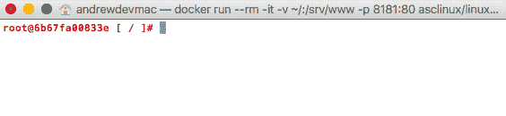Linux for PHP 容器的命令行界面（CLI）**Windows 用户请注意：**请确保在以前的 Docker 命令中的共享卷选项中用您的工作目录的完整路径（例如'/c/Users/fasterweb'）替换'${PWD}'部分，否则您将无法启动容器。此外，您应该确保在 Docker 设置中启用了卷共享。此外，如果您在 Windows 7 或 8 上运行 Docker，您只能在地址 http://192.168.99.100:8181 访问容器，而不能在'localhost:8181'上访问。

本书中提供的所有代码示例都可以在代码存储库中的一个名为根据章节编号命名的文件夹中找到。因此，预计您在每章开始时更改工作目录，以便运行其中给出的代码示例。因此，对于本章，您应该在容器的 CLI 上输入以下命令：

```php
# mv /srv/www /srv/www.OLD
# ln -s /srv/fasterweb/chapter_1 /srv/www
```

对于下一章，您应该输入以下命令：

```php
# rm /srv/www
# ln -s /srv/fasterweb/chapter_2 /srv/www
```

接下来的章节也是如此。

此外，如果您在优化代码时更喜欢使用多线程技术，可以通过运行*Linux for PHP*的线程安全版本（asclinux/linuxforphp-8.1:7.0.29-zts）来实现。

如果您希望以分离模式（`-d`开关）运行容器，请这样做。这将允许您在同一个容器上保持运行并且独立于您是否有运行的终端而运行`docker exec`多个命令 shell。

此外，您应该`docker commit`您对容器所做的任何更改，并创建其新图像，以便以后可以`docker run`它。如果您不熟悉 Docker 命令行及其`run`命令，请在以下地址找到文档：[`docs.docker.com/engine/reference/run/`](https://docs.docker.com/engine/reference/run/)。

最后，Packt Publishing 出版了许多关于 Docker 的优秀书籍和视频，我强烈建议您阅读它们以掌握这个优秀的工具。 

现在，输入以下命令以启动本书中将需要的所有服务，并创建一个测试脚本，以确保一切都按预期工作：

```php
# cd /srv/www
# /etc/init.d/mysql start 
# /etc/init.d/php-fpm start 
# /etc/init.d/httpd start 
# touch /srv/www/index.php 
# echo -e "<?php phpinfo();" > /srv/www/index.php 
```

当您完成这些命令后，您应该将您喜欢的浏览器指向`http://localhost:8181/`，并查看以下结果：

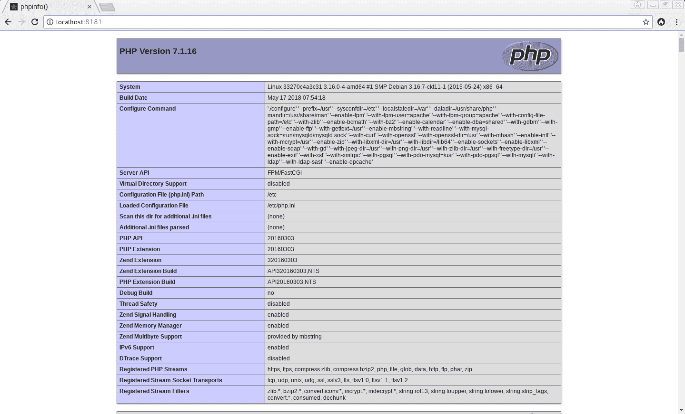phpinfo 页面

如果您没有看到此页面，请尝试排除您的 Docker 安装问题。

此外，请注意，如果您不`docker commit`您的更改，并且希望在开始使用本书中包含的代码示例时使用原始的 Linux for PHP 基础镜像，那么以前的命令将需要每次都重复。

我们现在准备对我们的服务器进行基准测试。

# 了解 Apache Bench（AB）

有许多工具可用于对 Web 服务器进行基准测试。其中较为知名的是 Apache Bench（AB）、Siege、JMeter 和 Tsung。尽管 JMeter（[`jmeter.apache.org/`](https://jmeter.apache.org/)）和 Tsung（[`tsung.erlang-projects.org/`](http://tsung.erlang-projects.org/)）是非常有趣的负载测试工具，并且在进行更高级别的系统管理上的测试时应该进行探索，但我们将专注于 AB 和 Siege 以满足我们的开发需求。

AB 包含在 Apache Web 服务器的开发工具中，并且默认安装在包含 PHP 二进制文件的 Linux for PHP 镜像中。否则，AB 可以在大多数 Linux 发行版的单独 Apache 开发工具安装包中找到。重要的是要注意，Apache Bench 不支持多线程，这可能会在运行高并发测试时造成问题。

此外，在进行基准测试时有一些常见的陷阱需要避免。主要的是：

+   避免同时在正在进行基准测试的计算机上运行其他资源密集型应用程序

+   避免对远程服务器进行基准测试，因为网络，特别是在并发测试中，可能成为测得的延迟的主要原因

+   避免在通过 HTTP 加速器或代理缓存的网页上进行测试，因为结果将会被扭曲，并且不会显示实际的服务器速度性能

+   不要认为基准测试和负载测试会完美地代表用户与服务器的交互，因为结果只是指示性的

+   请注意，基准测试结果是针对正在测试的硬件架构的，并且会因计算机而异

对于我们的测试，我们将使用 *Apache Bench* 的 `-k`、`-l`、`-c` 和 `-n` 开关。以下是这些开关的定义：

+   -k 启用 KeepAlive 功能，以便在一个单一的 HTTP 会话中执行多个请求

+   -l 当内容长度从一个响应到另一个响应的大小不同时，禁用错误报告

+   -c 启用并发，以便同时执行多个请求

+   -n 确定当前基准测试会话中要执行的请求数

有关 AB 选项的更多信息，请参阅 *Apache* 文档中的相应条目 ([`httpd.apache.org/docs/2.4/programs/ab.html`](https://httpd.apache.org/docs/2.4/programs/ab.html))。

在启动基准测试之前，打开一个新的终端窗口，并通过 `docker exec` 运行一个新的 bash 终端到容器中。这样，您将能够通过 top 实用程序查看资源消耗。首先，获取容器的名称。它将出现在此命令返回的列表中：

```php
# docker ps 
```

然后，您将能够进入容器并开始使用以下命令观察资源消耗：

```php
# docker exec -it [name_of_your_container_here] /bin/bash 
```

并且在容器的新获得的命令行上，请运行 `top` 命令：

```php
# top 
```

现在，从第一个终端窗口启动一个基准测试：

```php
# ab -k -l -c 2 -n 2000 localhost/index.html 
```

然后，您将获得一个基准测试报告，其中包含服务器能够响应的平均请求数 (`每秒请求数`)、每个请求的平均响应时间 (`每个请求的时间`) 和响应时间的标准偏差 (`在特定时间内服务的请求的百分比 (ms)`) 的信息。

报告应该类似于以下内容：

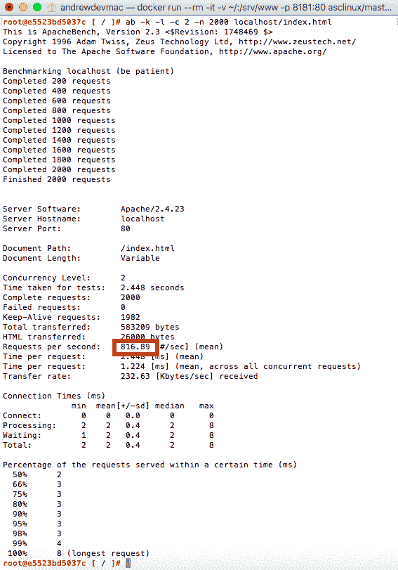基准测试报告显示，Apache 平均每秒提供约 817 个请求

现在，通过请求 `index.php` 文件来尝试新的基准测试：

```php
# ab -k -l -c 2 -n 2000 localhost/index.php 
```

您会注意到每秒平均请求数已经下降，平均响应时间和标准偏差更高。在我的情况下，平均值从大约 800 下降到我的计算机上的约 300，平均响应时间从 2 毫秒增加到 6 毫秒，响应时间的标准偏差现在从 100% 的请求在 8 毫秒内被服务，增加到 24 毫秒：

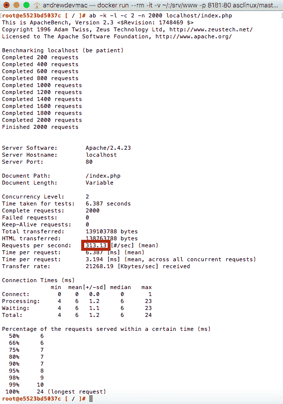基准测试报告显示，Apache 平均每秒大约提供 313 个请求

这些结果使我们能够对硬件性能限制有一个大致的了解，并确定在扩展生成一些动态内容的 PHP 脚本性能时，我们将不得不处理的不同阈值。

现在，让我们通过 Siege 进一步深入了解我们的 Web 服务器性能，这是基准测试和负载测试时的首选工具。

# 了解 Siege

Siege 是一个负载测试和基准测试工具，它允许我们进一步分析我们的 Web 服务器性能。让我们开始在 Docker 容器中安装 Siege。

请从容器的命令行下载并解压 Siege 的 4.0.2 版本：

```php
# wget -O siege-4.0.2.tar.gz http://download.joedog.org/siege/siege-4.0.2.tar.gz 
# tar -xzvf siege-4.0.2.tar.gz 
```

然后，请进入 Siege 的源代码目录以编译和安装软件：

```php
# cd siege-4.0.2 
# ./configure 
# make 
# make install 
```

对于这些 Siege 测试，我们将使用`-b`，`-c`和`-r`开关。以下是这些开关的定义：

+   -b，启用基准测试模式，这意味着迭代之间没有延迟

+   `-c`，启用并发以同时执行多个请求

+   `-r`，确定每个并发用户执行的请求数

当然，您可以通过在容器的命令行中调用手册来获取有关 Siege 命令行选项的更多信息：

```php
# man siege  
```

现在启动 Siege 基准测试：

```php
# siege -b -c 3000 -r 100 localhost/index.html 
```

然后您将获得类似这样的基准测试报告：

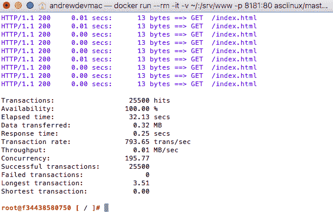Siege 基准测试报告确认了从 AB 获得的结果

如您所见，结果与我们之前从 AB 获得的结果相匹配。我们的测试显示每秒近 800 次的事务率。

Siege 还配备了一个方便的工具，名为 Bombard，可以自动化测试并帮助验证可伸缩性。Bombard 允许您使用 Siege 和不断增加的并发用户数量。它可以带有一些可选参数。这些参数是：包含在执行测试时使用的 URL 的文件的名称，初始并发客户端的数量，每次调用 Siege 时要添加的并发客户端的数量，Bombard 应该调用 Siege 的次数以及每个请求之间的时间延迟（以秒为单位）。

因此，我们可以尝试通过在容器内部发出以下命令来确认我们之前测试的结果：

```php
# cd /srv/www
# touch urlfile.txt 
# for i in {1..4}; do echo "http://localhost/index.html" >> urlfile.txt ; done  
# bombardment urlfile.txt 10 100 4 0 
```

完成后，您应该获得类似以下的报告：

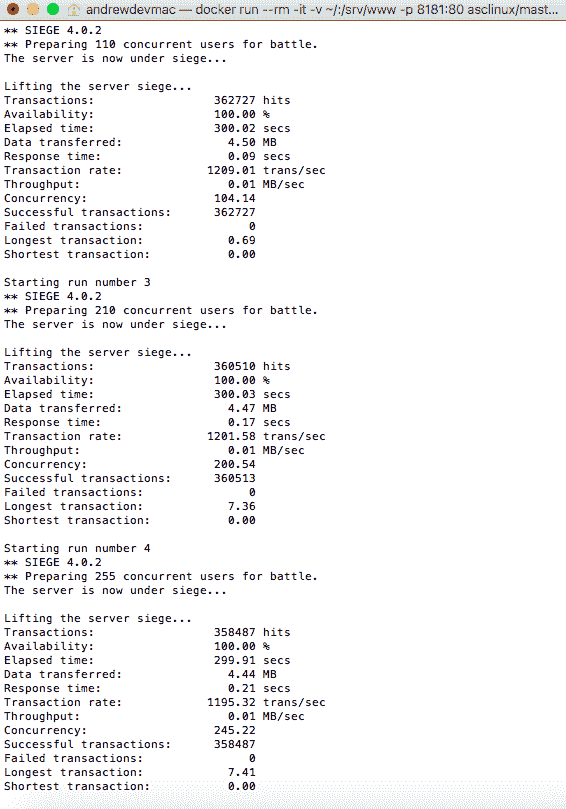结果显示，当有 210 个或更多并发用户时，最长的事务要高得多

再试一次，但请求 PHP 文件：

```php
# echo "http://localhost/index.php" > urlfile.txt 
# for i in {1..3}; do echo "http://localhost/index.php" >> urlfile.txt ;  done 
# bombardment urlfile.txt 10 100 4 0 
```

这个测试应该提供类似这样的结果：

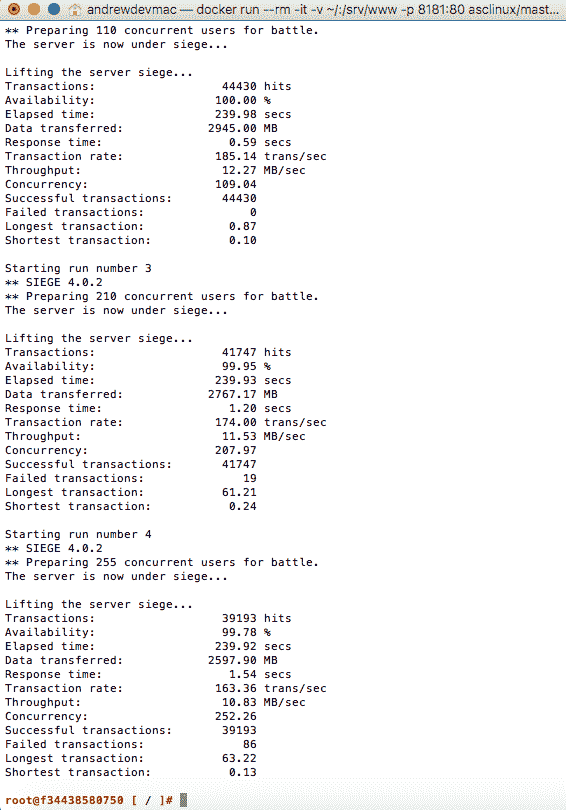提供动态内容的效率类似于提供静态内容的效率，但事务率要低得多

现在运行`top`的第二个终端窗口显示了两个可用处理器的 50%使用率和我电脑上几乎 50%的 RAM 使用率：

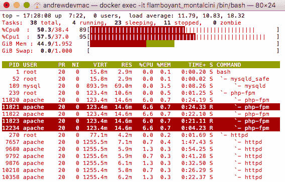容器在提交基准测试时使用的 CPU 和内存资源

我们现在知道，当并发请求不多时，这台硬件可以在小规模上表现良好，静态文件可以达到每秒 800 次的事务率，动态生成内容的页面大约为每秒 200 次的事务率。

现在，我们对基于硬件资源的基本速度性能有了更好的了解，现在我们可以开始真正测量通过性能分析来衡量 Web 服务器动态生成内容的速度和效率。我们现在将继续安装和配置工具，以便我们对 PHP 代码进行性能分析和优化。

# 安装和配置有用的工具

现在我们将安装和配置 MySQL 基准测试和 JavaScript 性能分析工具。但首先，让我们从安装和配置 xdebug 开始，这是一个 PHP 调试器和性能分析工具。

# 性能分析 PHP – xdebug 安装和配置

我们将安装和配置的第一个工具是 xdebug，这是一个用于 PHP 的调试和性能分析工具。这个扩展可以通过使用 PHP 附带的 PECL 实用程序（[`pecl.php.net/`](https://pecl.php.net/)）以非常简单的方式下载、解压缩、配置、编译和安装。要做到这一点，请在容器的终端窗口中输入以下命令：

```php
# pecl install xdebug 
# echo -e "zend_extension=$( php -i | grep extensions | awk '{print $3}' )/xdebug.so\n" >> /etc/php.ini
# echo -e "xdebug.remote_enable = 1\n" >> /etc/php.ini 
# echo -e "xdebug.remote_enable_trigger = 1\n" >> /etc/php.ini 
# echo -e "xdebug.remote_connect_back = 1\n" >> /etc/php.ini 
# echo -e "xdebug.idekey = PHPSTORM\n" >> /etc/php.ini 
# echo -e "xdebug.profiler_enable = 1\n" >> /etc/php.ini 
# echo -e "xdebug.profiler_enable_trigger = 1\n" >> /etc/php.ini 
# /etc/init.d/php-fpm restart
# tail -50 /etc/php.ini
```

您容器的`/etc/php.ini`文件的最后几行现在应该是这样的：

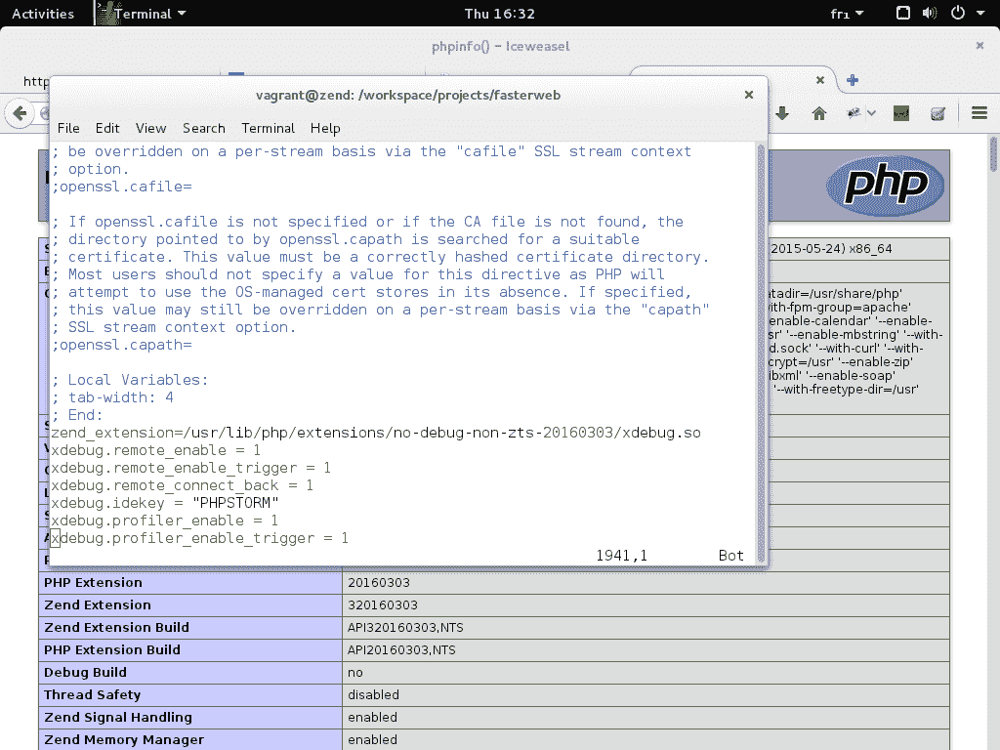在 php.ini 文件中新增的行

完成后，请在您喜爱的浏览器中重新加载`http://localhost:8181`页面。它现在应该显示如下：

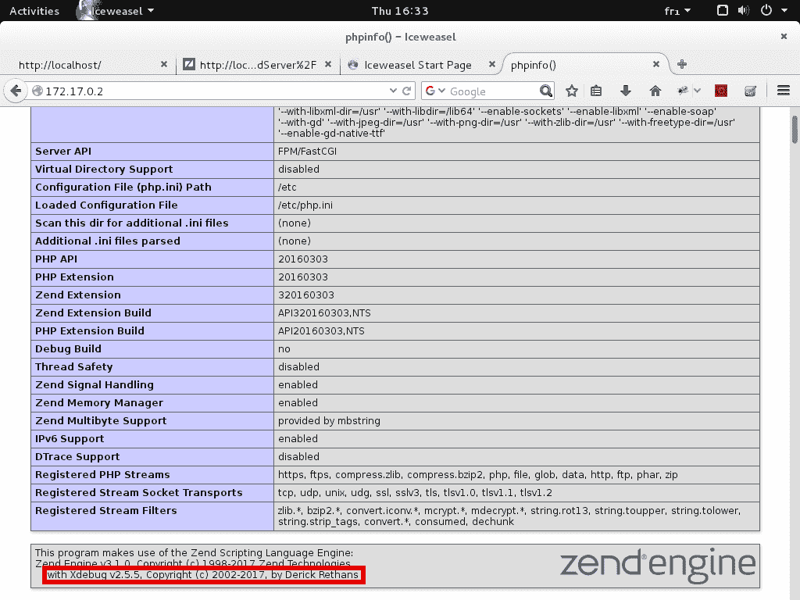确认 xdebug 扩展已加载

如果您向页面朝向滚动，现在应该会看到 xdebug 部分：

phpinfo 页面的 xdebug 部分

您还应该注意，在 xdebug 条目下现在启用了性能分析器选项：

确认 xdebug 代码分析已启用

我们现在将配置 PHPStorm 作为调试服务器。这将允许我们将 IDE 用作调试会话的控制中心。

在开始之前，我们将通过在容器内输入以下命令将整个`fasterweb`文件夹作为服务器的网站根目录可用：

```php
# rm /srv/www
# ln -s /srv/fasterweb /srv/www
# cd /srv/www
```

现在，启动*PHPStorm*，并将我们的`fasterweb`目录设置为此项目的主目录。为此，请选择**从现有文件创建新项目**，**源文件位于本地目录**，并在单击**完成**之前将我们的`fasterweb`目录指定为**项目根目录**。

创建后，从“文件”菜单中选择“设置”。在“语言和框架”部分下，展开 PHP 菜单条目，然后单击“服务器”条目。请根据您的设置的具体情况输入所有适当的信息。主机选项必须包含 Linux 的 PHP 容器的 IP 地址值。如果您不确定 Docker 容器的 IP 地址是什么，请在容器的命令行上输入以下命令以获取它：

```php
# ifconfig 
```

完成后，您可以通过单击“应用”和“确定”按钮进行确认：

配置 PHPStorm 以连接到 Web 服务器和 xdebug

然后，在“运行”菜单下，您将找到“编辑配置...”条目。它也可以在 IDE 屏幕的右侧找到：

“编辑配置...”设置

然后，通过单击窗口左上角的绿色加号添加 PHP 远程调试条目。请选择我们在上一步中创建的服务器，并确保将 Ide 密钥（会话 ID）设置为 PHPSTORM：

配置调试会话

现在，通过单击主 PHPStorm 屏幕右上角菜单中的“监听调试器连接”按钮来激活 PHPStorm 调试服务器，通过单击`index.php`文件的任何行号右侧的空白处设置断点，并启动我们在上一步中创建的`index.php`配置对应的调试工具。

如果您的屏幕上没有显示右上方的工具栏菜单，请单击“查看”菜单的“工具栏”条目，以使它们显示在您的屏幕上。这些按钮也可以作为“运行”菜单中的条目进行访问。

激活 PHPStorm 调试服务器，设置断点并启动调试工具

现在，打开您喜欢的浏览器，并通过输入 Docker 容器的 IP 地址请求相同的网页：`http://[IP_ADDRESS]/?XDEBUG_SESSION_START=PHPSTORM`。

然后您会注意到浏览器陷入了无限循环：

浏览器正在等待调试会话恢复或结束

您还会注意到调试信息现在显示在 IDE 中。我们还可以在 IDE 内控制会话，并确定何时会话将从中恢复。请在允许执行恢复之前检查变量的内容，方法是单击屏幕左侧的绿色播放按钮。您还可以通过单击同一图标菜单中的粉红色停止按钮来结束调试会话：

调试会话允许在运行时详细检查变量

调试会话结束后，我们现在可以检查容器的`/tmp`目录，并应该在名为`cachegrind.out`的文件中找到分析器输出。然后，您可以通过您喜欢的文本编辑器直接检查此文件，或者通过安装专门的软件，如您的 Linux 发行版的软件包管理器中的 Kcachegrind 来检查此文件。以下是使用 Kcachegrind 时的示例输出：

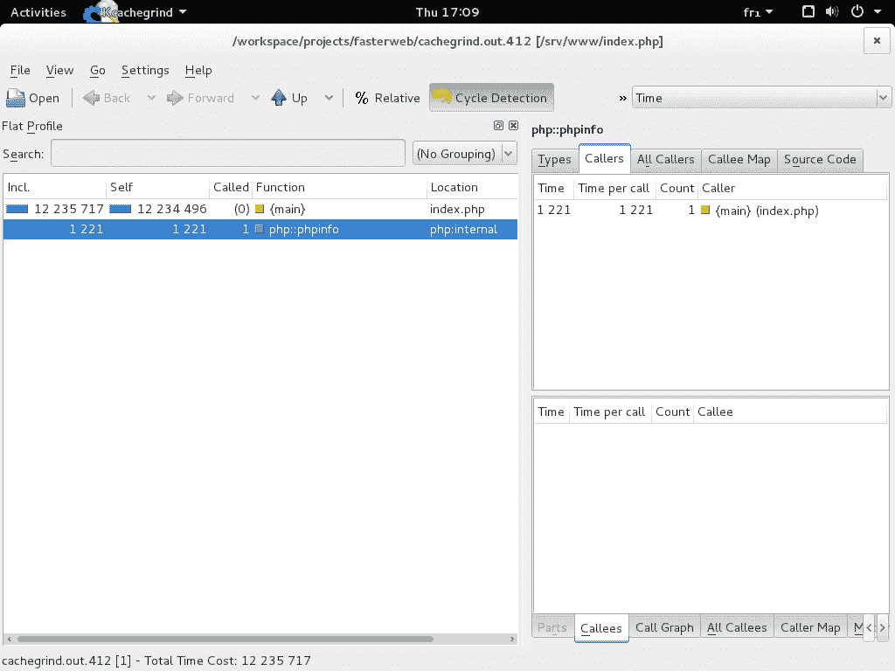使用 Kcachegrind 查看 xdebug 分析报告

因此，如果您希望在我们将在接下来的章节中使用的工具之上使用 xdebug 的分析工具，它将对您可用。话虽如此，在下一章中，我们将研究更高级的分析工具，如`Blackfire.io`。

在测试 xdebug 完成后，您可以将`chapter_1`文件夹恢复为服务器的网站根目录：

```php
# rm /srv/www
# ln -s /srv/fasterweb/chapter_1 /srv/www
# cd /srv/www
```

现在，让我们继续看一下 SQL 速度测试工具。

# SQL – 速度测试

尽管 PostgreSQL 服务器通常被认为是继*Oracle Database*之后世界上最快的 RDBMS，但*MariaDB*（*MySQL*的分支）服务器仍然是最快和最受欢迎的 RDBMS 之一，特别是在处理简单的 SQL 查询时。因此，在本书中讨论 SQL 优化时，我们将主要使用*MariaDB*。

为了对我们的*MariaDB*服务器进行基准测试，我们将使用自*MySQL*服务器 5.1.4 版本以来包含的`mysqlslap`实用程序。为了运行测试，我们将首先加载`Sakila`测试数据库。在容器的命令行上，输入以下命令：

```php
# wget -O sakila-db.tar.gz \ 
> https://downloads.mysql.com/docs/sakila-db.tar.gz 
# tar -xzvf sakila-db.tar.gz 
# mysql -uroot < sakila-db/sakila-schema.sql 
# mysql -uroot < sakila-db/sakila-data.sql 
```

数据库加载完成后，您可以启动第一个基准测试：

```php
# mysqlslap --user=root --host=localhost --concurrency=20 --number-of-queries=1000 --create-schema=sakila --query="SELECT * FROM film;" --delimiter=";" --verbose --iterations=2 --debug-info  
```

然后，您应该获得类似于这样的结果：

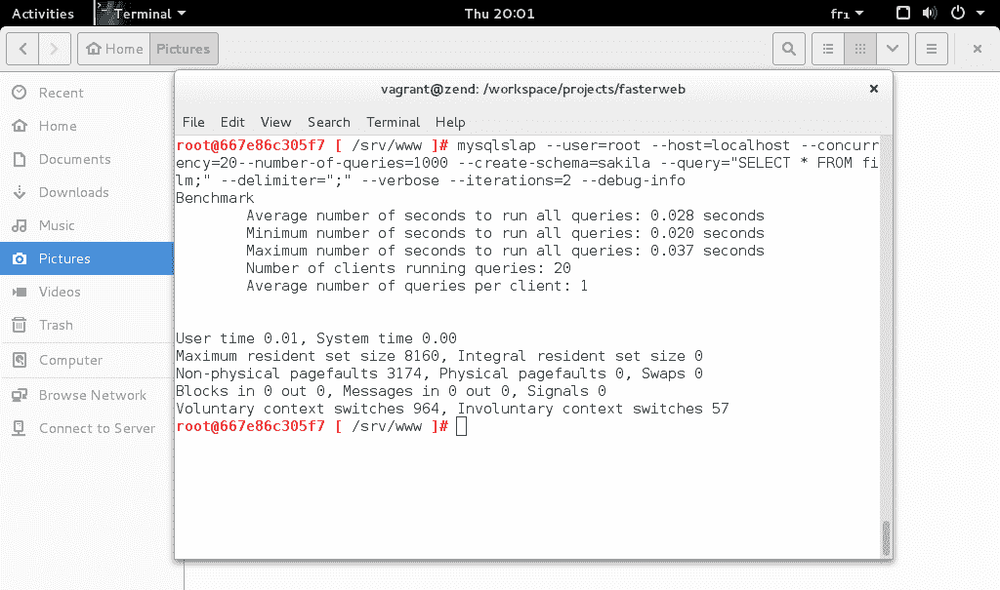使用 mysqlslap 工具对 MariaDB 服务器进行基准测试

然后，您可以运行第二个基准测试，但使用不同的并发级别来比较结果：

```php
# mysqlslap --user=root --host=localhost --concurrency=50 --number-of-queries=1000 --create-schema=sakila --query="SELECT * FROM film;" --delimiter=";" --verbose --iterations=2 --debug-info 
```

以下是第二次测试的结果：

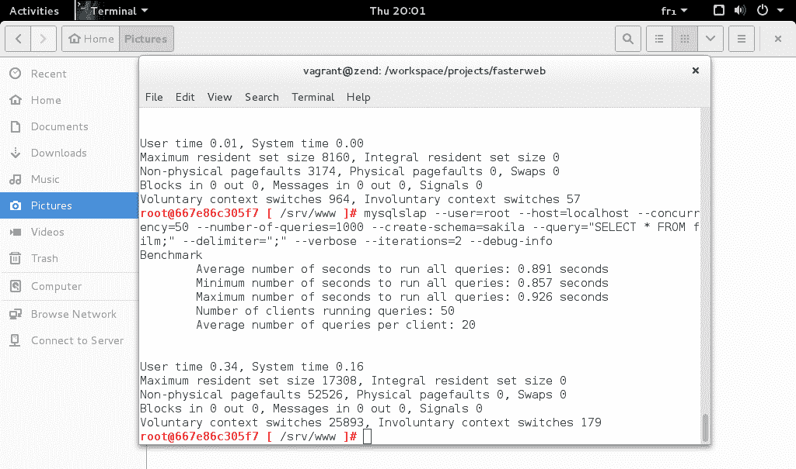使用更高的并发性对 MariaDB 服务器进行基准测试

我的测试结果表明，对于具有大约 1,000 条记录的表的全表扫描查询，在向服务器发送 50 个或更多并发查询时，性能会急剧下降。

我们将看到这些类型的测试以及许多其他更高级的测试在专门讨论此主题的章节中将特别有用。

# JavaScript – 开发者工具

为了衡量性能并分析本书中包含的 JavaScript 代码，我们将使用 Google Chrome 内置的开发者工具。具体来说，Chrome 包括时间线记录器和 JavaScript CPU 分析器，这将允许您识别 JavaScript 代码中的瓶颈。要激活这些工具，请单击浏览器右上角的三个点，然后单击“更多工具”子菜单中的“开发者工具”，如下所示：

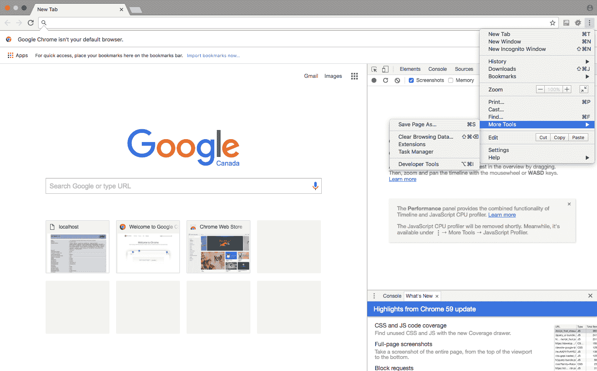在 Chrome 的主菜单的“更多工具”部分中找到“开发者工具”条目

使用分析工具就像点击记录按钮并刷新要分析的页面一样简单。然后，您可以分析结果以识别代码中的潜在问题：

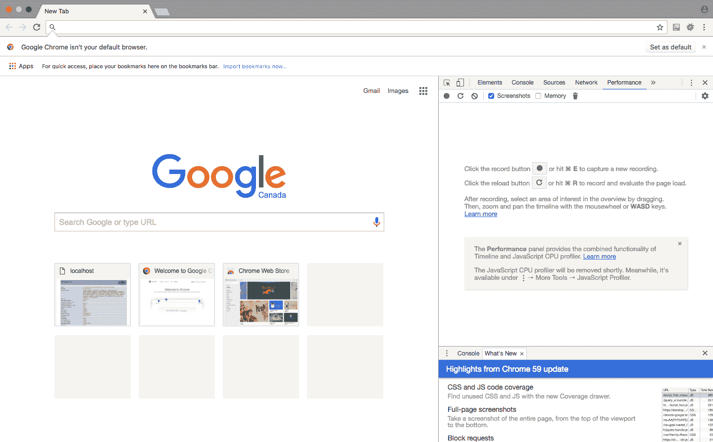Chrome 的时间线记录器和 JavaScript CPU 分析器

在第七章中，*JavaScript 和“危险驱动开发”*，以及第八章中，*函数式 JavaScript*，我们将更广泛地使用此工具，以便全面衡量和优化 JavaScript 代码的性能。

# 摘要

在本章中，我们定义了更快的 Web 是什么，为什么它很重要，它如何与纯速度性能区分开来，以及如何安装、配置和使用基准测试和分析工具来衡量它。

在下一章中，我们将了解使用`Blackfire.io`进行自动分析。此外，我们将通过在一个虚构的生产服务器上安装和配置 TICK 堆栈与 Grafana 来学习监控，该服务器将部署为另一个 Docker 容器。

# 参考文献

[1] [`googleblog.blogspot.ca/2009/06/lets-make-web-faster.html`](https://googleblog.blogspot.ca/2009/06/lets-make-web-faster.html)

[2] BONDI, André B. Foundations of Software and System Performance Engineering: Process, Performance Modeling, Requirements, Testing, Scalability, and Practice. Upper Saddle River, NJ: Addison-Wesley, 2015.

[3] MEIER, J. D. et al. Performance Testing Guidance for Web Applications. Redmond, WA: Microsoft Corporation, 2007.

[4] [`www.smashingmagazine.com/2015/11/why-performance-matters-part-2-perception-management/`](https://www.smashingmagazine.com/2015/11/why-performance-matters-part-2-perception-management/)

[5] [`speakerd.s3.amazonaws.com/presentations/2ece664392024e9da39ea82e3d9f1139/perception-performance-ux-confoo-3-4.pdf`](https://speakerd.s3.amazonaws.com/presentations/2ece664392024e9da39ea82e3d9f1139/perception-performance-ux-confoo-3-4.pdf)
