# 第三章：利用 PHP 7 数据结构和函数的强大功能

在本章中，我们将学习如何利用 PHP 7 的性能优化。

此外，我们将探讨更好地理解数据结构和数据类型，以及如何使用简化的函数可以帮助 PHP 应用程序在其关键执行路径上提高全局性能。

此外，我们将学习如何避免在 PHP 代码中使用效率低下的结构，比如大多数动态结构。

最后，尽管 PHP 不是一种函数式语言，但我们将看到一些函数式技术在优化 PHP 代码时可以立即提供帮助。

因此，在本章中，我们将涵盖以下几点：

+   PHP 7 的优化

+   识别可能的优化并避免动态结构

+   函数式编程和记忆化

# PHP 7 的优化

PHP 7 本身就是一个重大的优化。PHP 的大部分代码库都是为了这个版本而重写的，大多数官方基准测试显示，一般来说，几乎任何 PHP 代码在 PHP 7 上运行的速度都比以前的版本快两倍或更多。

PHP 是用 C 编程的，优化 Zend 的**Ahead-Of-Time**（**AOT**）编译器的性能最终取决于以优化的方式使用 C 编译器的内部逻辑。PHP 7 的最新版本是 Zend 多年研究和实验的结果。这些优化的大部分是通过消除由某些 PHP 内部结构构造和数据结构产生的性能开销来实现的。根据*Dmitry Stogov[1]*的说法，*典型的现实生活中的 PHP 应用程序大约有 20%的 CPU 时间用于内存管理器，10%用于哈希表操作，30%用于内部函数，只有 30%用于虚拟机。*为了优化 PHP 代码的执行，PHP 7 的 Zend 引擎的新版本必须首先将源代码表示为**抽象语法树**（**AST**），从而使引擎能够生成更高质量的**中间表示**（**IR**）源代码，并且自 PHP 7.1 以来，能够删除死代码并尽可能将许多表达式转换为它们的静态表示形式，通过**静态单赋值**（**SSA**）形式和类型推断。反过来，这使得引擎只需在运行时将必要的数据结构分配到堆栈而不是内存中的堆中。

这对于理解本章的其余部分非常重要，因为它让我们看到为什么数据类型转换和动态结构通常会通过在运行时膨胀内存分配来创建大部分开销，为什么必须重新实现某些数据结构以实现 C 级性能，以及为什么不可变性是开发人员在努力实现更好代码性能时的盟友。让我们更仔细地看看这些元素。

# 严格类型

当一种语言是动态类型的，也就是说，它具有松散类型的变量，它提供了更高级的抽象，提高了开发人员的生产力，但在尝试确定变量的数据类型时，编译器需要更多的工作，因此性能并不是最佳的。毫不奇怪，强类型语言在运行时的性能总是比松散类型的语言更好。这个结论得到了 Facebook 的 HipHop 项目的证实，该项目对不同语言进行了基准测试，并得出结论：静态编译的语言总是比动态语言执行更快，消耗的内存也更少。

尽管 PHP 7 仍然是一种松散类型的语言，但现在它提供了严格类型化变量和函数签名的可能性。可以通过执行以下代码示例来轻松测试。让我们运行以下代码来查看其当前性能：

```php
// chap3_strict_typing.php 

declare(strict_types = 0); 

$start = microtime(true); 

function test ($variable) 
{ 
    $variable++; 

    return "$variable is a test."; 
} 

ob_start(); 

for ($x = 0; $x < 1000000; $x++) { 

    $array[$x] = (string) $x; 

    echo test($array[$x]) . PHP_EOL; 

} 

$time = microtime(true) - $start; 

ob_clean(); 

ob_end_flush(); 

echo 'Time elapsed: ' . $time . PHP_EOL; 
```

以下是使用`Blackfire.io`运行此脚本的结果：

省略变量和函数签名的严格类型化时的分析报告

现在，让我们用以下代码替换原来的代码：

```php
// chap3_strict_typing_modified.php 

declare(strict_types = 1); 

$start = microtime(true); 

function test (int $variable) : string 
{ 
    $variable++; 

    return $variable . ' is a test.'; 
} 

ob_start(); 

for ($x = 0; $x < 1000000; $x++) { 

    $array[$x] = (int) $x; 

    echo test($array[$x]) . PHP_EOL; 

} 

$time = microtime(true) - $start; 

ob_clean(); 

ob_end_flush(); 

echo 'Time elapsed: ' . $time . PHP_EOL; 
```

如果我们执行它，我们会立即看到性能上的差异：

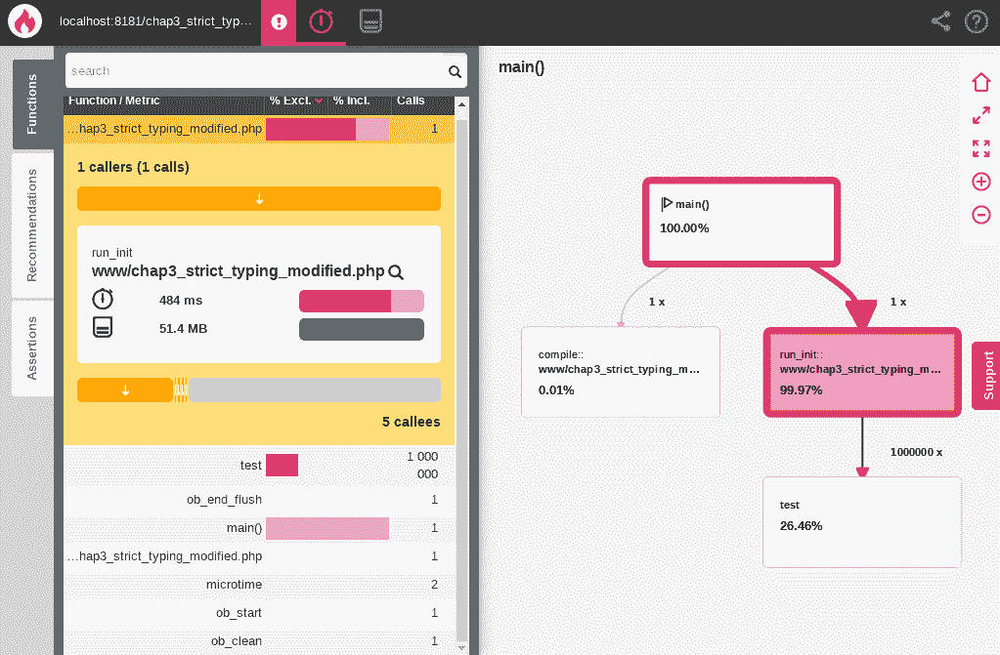在严格类型变量和函数签名的性能分析报告

使用`microtime()`函数也可以看到性能提升。让我们运行我们脚本的两个版本，看看结果：

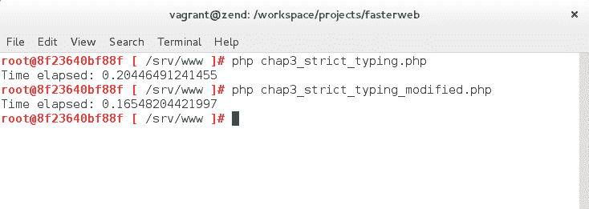使用 microtime()函数比较脚本性能

为了充分利用 PHP 的新 AST 和 SSA 功能，开发人员应尽可能严格地对变量和函数签名进行类型限定。当 Zend 引擎在未来版本中获得**即时**（**JIT**）编译器时，这将变得尤为重要，因为这将允许基于类型推断进行进一步的优化。

严格类型的另一个附加优势是，它让编译器管理代码质量的一个方面，消除了需要进行单元测试来确保函数在接收到意外输入时表现如预期的必要性。

# 不可变和紧凑数组

正如我们将在本章后面看到的，不可变性不仅有助于开发人员在编程时减轻认知负担，提高代码质量和一般单元测试的质量，而且还将允许编译器进行更好的代码优化。从 PHP 7 开始，任何静态数组都会被 OPcache 缓存，并且指向数组的指针将与尝试访问它的代码的任何部分共享。此外，PHP 7 为紧凑数组提供了一个非常重要的优化，这些数组只使用升序整数进行索引。让我们拿以下代码来对比在启用 OPcache 的 PHP 5.6 和 PHP 7 上执行的结果：

```php
// chap3_immutable_arrays.php 

$start = microtime(true); 

for ($x = 0; $x < 10000; $x++) { 
    $array[] = [ 
        'key1' => 'This is the first key', 
        'key2' => 'This is the second key', 
        'key3' => 'This is the third key', 
    ]; 
} 

echo $array[8181]['key2'] . PHP_EOL; 

$time = microtime(true) - $start; 

echo 'Time elapsed: ' . $time . PHP_EOL; 

echo memory_get_usage() . ' bytes' . PHP_EOL; 
```

如果我们用 PHP 5.6 运行之前的代码，我们会消耗近 7.4MB 的内存，耗时为 0.005 秒：

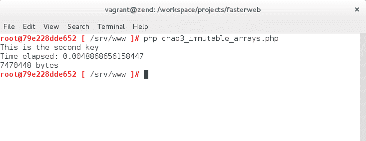在 PHP 5.6 上运行脚本时的结果

如果我们用 PHP 7 运行相同的代码，我们会得到以下结果：

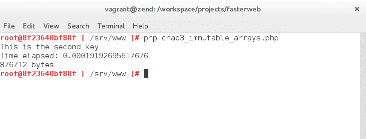在 PHP 7.1 上运行相同脚本时的结果

结果令人印象深刻。相同的脚本快了 40 倍，内存消耗几乎减少了 10 倍。因此，不可变数组提供了更快的速度，开发人员应该避免修改大数组，并在处理大数组时尽可能使用紧凑数组，以优化内存分配并最大化运行时速度。

# 整数和浮点数的内存分配

PHP 7 引入的另一个优化是重用先前分配的变量容器。如果你需要创建大量的变量，你应该尝试重用它们，因为 PHP 7 的编译器将避免重新分配内存，并重用已经分配的内存槽。让我们看下面的例子：

```php
// chap3_variables.php 

$start = microtime(true); 

for ($x = 0; $x < 10000; $x++) { 
    $$x = 'test'; 
} 

for ($x = 0; $x < 10000; $x++) { 
    $$x = $x; 
} 

$time = microtime(true) - $start; 

echo 'Time elapsed: ' . $time . PHP_EOL; 

echo memory_get_usage() . ' bytes' . PHP_EOL; 
```

让我们运行这段代码，以便看到内存消耗的差异。让我们从 PHP 5.6 开始：

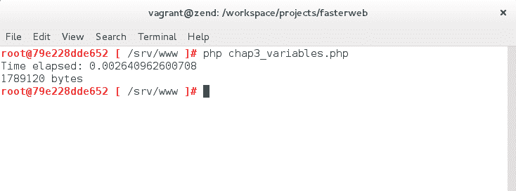在 PHP 5.6 上运行脚本时的结果

现在，让我们用 PHP 7 运行相同的脚本：

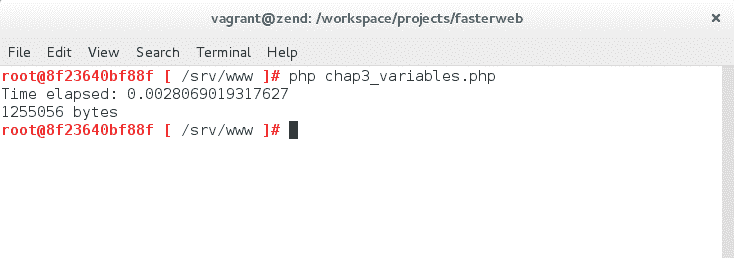在 PHP 7.1 上运行相同脚本时的结果

正如你所看到的，结果显示内存消耗减少了近三分之一。尽管这违背了变量不可变的原则，但当你必须在内存中分配大量变量时，这仍然是一个非常重要的优化。

# 字符串插值和连接

在 PHP 7 中，使用新的字符串分析算法对字符串插值进行了优化。这意味着字符串插值现在比连接快得多，过去关于连接和性能的说法不再成立。让我们拿以下代码示例来衡量新算法的性能：

```php
// chap3_string_interpolation.php

$a = str_repeat(chr(rand(48, 122)), rand(1024, 3000));

$b = str_repeat(chr(rand(48, 122)), rand(1024, 3000));

$start = microtime(true);

for ($x = 0; $x < 10000; $x++) {
    $$x = "$a is not $b";
}

$time = microtime(true) - $start;

echo 'Time elapsed: ' . $time . PHP_EOL;

echo memory_get_usage() . ' bytes' . PHP_EOL; 
```

在运行这段代码时，以下是对 PHP 5.6 的性能测量：

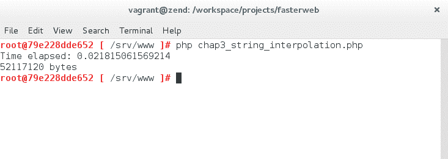针对 PHP 5.6 运行相同脚本的结果

以下是使用 PHP 7 的相同脚本：

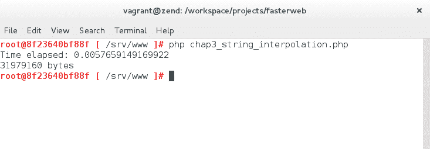针对 PHP 7.1 运行相同脚本的结果

PHP 7 大约快三到四倍，并且消耗的内存比少了三分之一。这里要学到的教训是，在处理字符串时，尽量使用 PHP 7 的字符串插值算法。

# 参数引用

尽管最好避免将变量通过引用传递给函数，以避免在函数外部改变应用程序的状态，但 PHP 7 使得以高度优化的方式传递变量给函数成为可能，即使引用不匹配。让我们看下面的代码示例，以更好地理解 PHP 7 在这方面比 PHP 5 更有效率：

```php
// chap3_references.php 

$start = microtime(true); 

function test (&$byRefVar) 
{ 
    $test = $byRefVar; 
} 

$variable = array_fill(0, 10000, 'banana'); 

for ($x = 0; $x < 10000; $x++) { 
    test($variable); 
} 

$time = microtime(true) - $start; 

echo 'Time elapsed: ' . $time . PHP_EOL; 

echo memory_get_usage() . ' bytes' . PHP_EOL; 
```

让我们用 PHP 5 二进制运行这段代码：

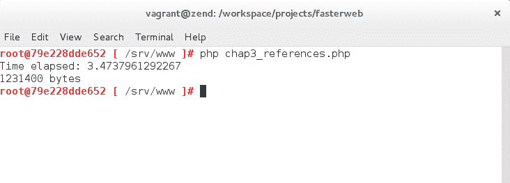针对 PHP 5.6 运行脚本的结果

在执行相同的代码时，PHP 7 的结果如下：

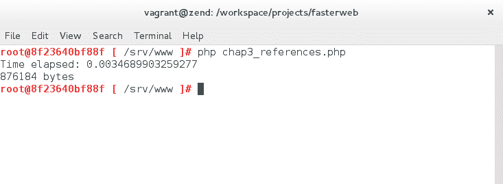针对 PHP 7.1 运行相同脚本的结果

PHP 7 的结果再次非常令人印象深刻，它几乎以三分之一的内存分配和 1000 倍的速度完成了相同的工作！在幕后发生的是，当引用不匹配时，PHP 7 不再在内存中复制变量。因此，新的编译器避免了为无用的内存分配膨胀，并加快了任何 PHP 脚本的执行，其中引用不匹配是一个问题。

# 识别更多可能的优化。

在优化应用程序时，您将首先确定最耗时的函数，特别是沿着应用程序的关键路径。正如前一章所述，大多数这些函数将是 I/O 函数，因为这些函数对计算机来说总是最昂贵的操作。大多数情况下，您会看到优化循环和减少系统调用的可能性，但很快您会意识到，无论您希望对其进行何种优化，I/O 操作始终是昂贵的。不过，有时您可能会遇到非常慢的 PHP 结构，可以简单地用更快的结构替换，或者您可能会意识到，设计不良的代码可以很容易地重构为更节约资源，比如用更简单的静态结构替换动态结构。

的确，除非绝对必要，应避免使用动态结构。现在我们来看一个非常简单的例子。我们将使用三种不同的方法编写相同的功能四次：函数和动态、函数和静态，最后是结构和静态。让我们从函数和动态方法开始：

```php
// chap3_dynamic_1.php 

$start = microtime(true); 

$x = 1; 

$data = []; 

$populateArray = function ($populateArray, $data, $x) { 

    $data[$x] = $x; 

    $x++; 

    return $x <= 1000 ? $populateArray($populateArray, $data, $x) : $data; 

}; 

$data = $populateArray($populateArray, $data, $x); 

$time = microtime(true) - $start; 

echo 'Time elapsed: ' . $time . PHP_EOL; 

echo memory_get_usage() . ' bytes' . PHP_EOL; 
```

这段代码通过递归调用相同的闭包来创建一个包含 1,000 个元素的数组。如果我们运行这段代码，我们会得到以下结果：

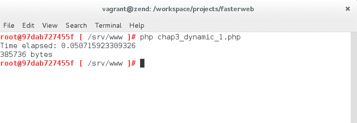使用函数和动态方法编写的脚本运行时所消耗的时间和内存

让我们看看使用`Blackfire.io`运行此脚本的结果：

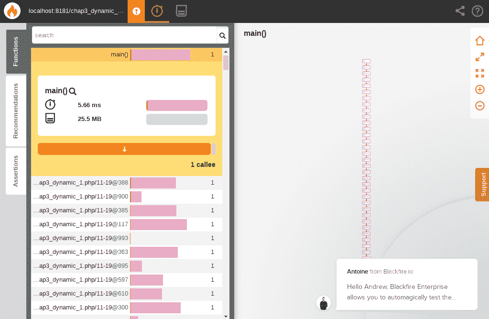使用函数和动态方法编写的脚本运行时的性能报告

让我们以更静态的方式编写相同的功能，使用经典的命名函数：

```php
// chap3_dynamic_2.php 

$start = microtime(true); 

$x = 1; 

$data = []; 

function populateArray(Array $data, $x) 
{ 
    $data[$x] = $x; 

    $x++; 

    return $x <= 1000 ? populateArray($data, $x) : $data; 
} 

$data = populateArray($data, $x); 

$time = microtime(true) - $start; 

echo 'Time elapsed: ' . $time . PHP_EOL; 

echo memory_get_usage() . ' bytes' . PHP_EOL; 
```

如果我们执行这个版本的代码，我们会得到以下结果：

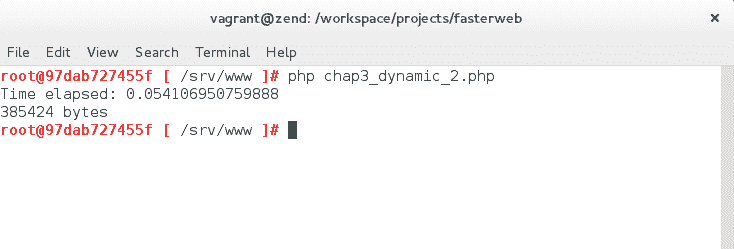使用函数和静态方法编写的脚本运行时所消耗的时间和内存

使用`Blackfire.io`分析器运行脚本产生了以下结果：

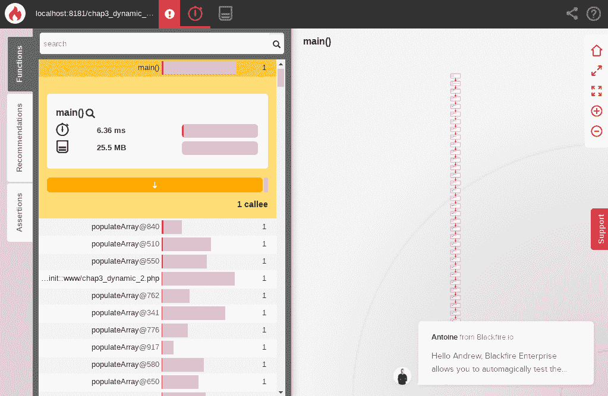使用函数和静态方法编写的脚本运行时的性能报告

最后，让我们再次以非常结构化和静态的方式编写这个功能，而不是通过尾递归调用函数：

```php
// chap3_dynamic_3.php 

$start = microtime(true); 

$data = []; 

function populateArray(Array $data) 
{ 
    static $x = 1; 

    $data[$x] = $x; 

    $x++; 

    return $data; 
} 

for ($x = 1; $x <= 1000; $x++) { 
    $data = populateArray($data); 
} 

$time = microtime(true) - $start; 

echo 'Time elapsed: ' . $time . PHP_EOL; 

echo memory_get_usage() . ' bytes' . PHP_EOL; 
```

在执行代码的最新版本后，以下是结果：

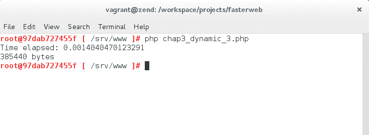运行使用结构化和静态方法编程的脚本时所消耗的时间和内存

使用`Blackfire.io`对这个脚本版本进行分析的结果如下：

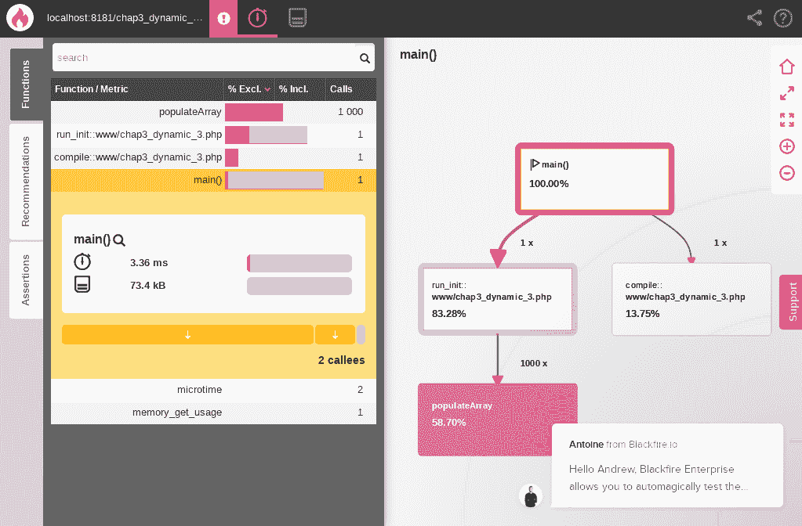运行使用结构化和静态方法编程的脚本时的分析报告

结果清楚地显示了结构化方法是最快的。如果我们现在沿着结构化的路线再走一小步，只是稍微使用一点功能性编程，并尝试使用生成器来迭代创建数组，我们对将获得的高性能结果不应感到惊讶。以下是我们代码的最新版本：

```php
// chap3_dynamic_4.php

$start = microtime(true);

$data = [];

function populateArray()
{
    for ($i = 1; $i <= 1000; $i++) {

        yield $i => $i;

    }

    return;
}

foreach (populateArray() as $key => $value) {

    $data[$key] = $value;

}

$time = microtime(true) - $start;

echo 'Time elapsed: ' . $time . PHP_EOL;

echo memory_get_usage() . ' bytes' . PHP_EOL;
```

这是运行我们代码的最新版本的结果：

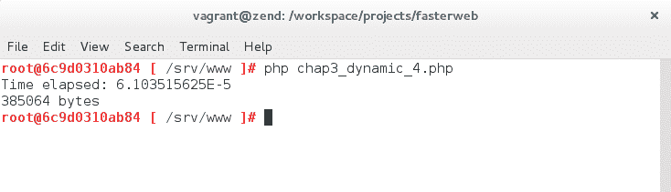运行使用非常结构化和静态方法编程的脚本时所消耗的时间和内存

使用`Blackfire.io`的结果如下：

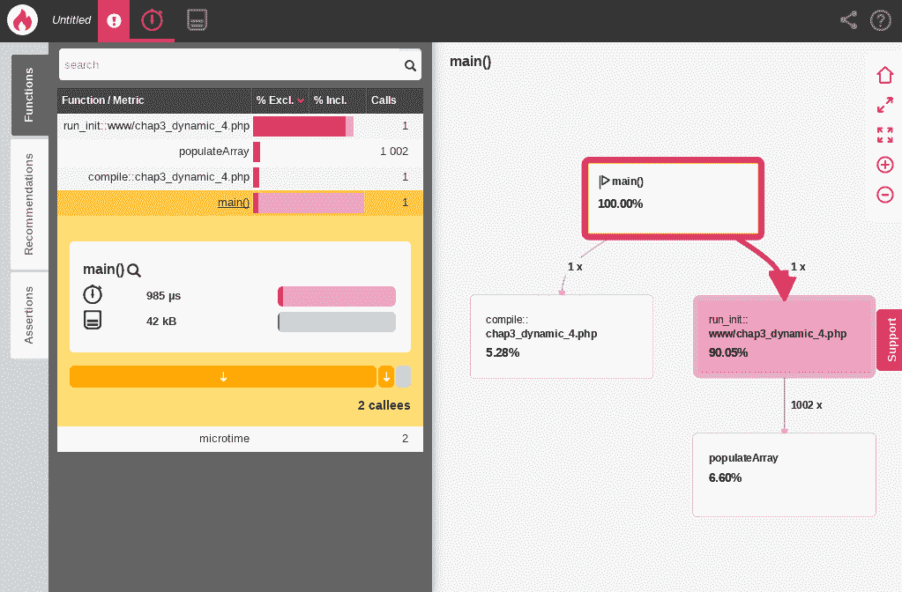运行使用非常结构化和静态方法编程的脚本时的分析报告

结果清楚地显示了我们代码的这个最新版本确实优于其他版本。事实上，PHP 仍然是一种非常结构化的语言，因为它的编译器仍然没有完全优化尾递归调用，并且如果以结构化方式编写程序，则完成程序执行所需的时间更短。这是否意味着 PHP 永远不会成为一种功能性语言，最好避免在 PHP 中以功能性方式编程？简短的答案是否定的。这是否意味着使用 PHP 进行功能性编程只是未来的事情？同样，答案也是否定的。有一些功能性编程技术可以立即使用，并且将帮助我们的脚本更具性能。让我们特别看一下其中一种技术，即记忆化。

# 函数式编程和记忆化

PHP 是一种命令式而不是声明式语言，这意味着编程是通过改变程序状态的语句来完成的，就像 C 语言系列中的其他语言一样，它不是由无状态表达式或声明组成的，比如 SQL。尽管 PHP 主要是一种结构化（过程式）和面向对象的编程语言，但自 PHP 5.3 以来，我们已经看到越来越多的请求要求更多的功能性结构，比如生成器和 lambda 函数（匿名函数）。然而，就性能而言，PHP 目前仍然是一种结构化语言。

话虽如此，大多数功能性编程技术将在未来几年内产生成果，但仍然有一些功能性编程技术可以立即在 PHP 中使用，一旦在项目的代码库中实施，就会提高性能。其中一种技术就是记忆化。

记忆化是一种函数式编程技术，它将昂贵的函数计算的结果存储并在同一程序中每次调用时重复使用。其思想是在接收特定输入时返回函数的静态值。显然，为了避免值的失效，函数应该是引用透明的，这意味着当给定特定输入时，它应该始终返回相同的输出。当你意识到引用透明函数在应用程序的关键路径上被多次调用并且每次都被计算时，这就派上了用场。记忆化是一种简单的优化实现，因为它只是创建一个缓存来存储计算的结果。

让我们来看一个简单的例子，这将帮助我们轻松地理解其背后的思想。假设我们有以下代码沿着应用程序的关键路径：

```php
// chap3_memoization_before.php 

$start = microtime(true); 

$x = 1; 

$data = []; 

function populateArray(Array $data, $x) 
{ 
    $data[$x] = $x; 

    $x++; 

    return $x <= 1000 ? populateArray($data, $x) : $data; 
} 

$data = populateArray($data, $x); 

$data = populateArray($data, $x); 

$data = populateArray($data, $x); 

$data = populateArray($data, $x); 

$data = populateArray($data, $x); 

$time = microtime(true) - $start; 

echo 'Time elapsed: ' . $time . PHP_EOL; 

echo memory_get_usage() . ' bytes' . PHP_EOL; 
```

在这里，我们看到同一个函数被递归调用了很多次。而且，它是一个引用透明的函数。因此，它是记忆化的一个完美候选者。

让我们从检查其性能开始。如果我们执行代码，我们将得到以下结果：

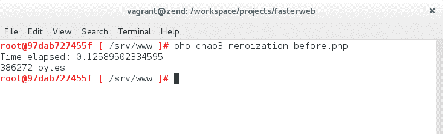在实施记忆化之前的结果

现在，让我们实施一个缓存来记忆化结果：

```php
// chap3_memoization_after.php 

$start = microtime(true); 

$x = 1; 

$data = []; 

function populateArray(Array $data, $x) 
{ 
    static $cache = []; 

    static $key; 

    if (!isset($key)) { 
        $key = md5(serialize($x)); 
    } 

    if (!isset($cache[$key])) { 

        $data[$x] = $x; 

        $x++; 

        $cache[$key] = $x <= 1000 ? populateArray($data, $x) : $data; 

    } 

    return $cache[$key]; 

} 

$data = populateArray($data, $x); 

$data = populateArray($data, $x); 

$data = populateArray($data, $x); 

$data = populateArray($data, $x); 

$data = populateArray($data, $x); 

$time = microtime(true) - $start;
```

```php
echo 'Time elapsed: ' . $time . PHP_EOL; 

echo memory_get_usage() . ' bytes' . PHP_EOL; 
```

以下是执行相同代码的新版本时的结果：

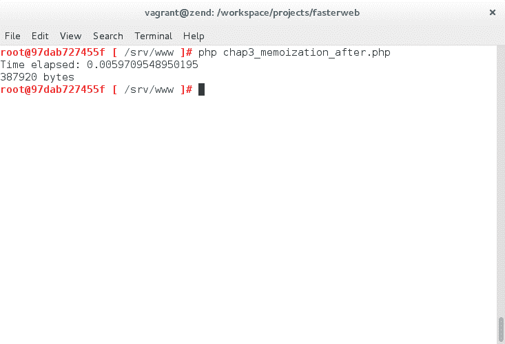在实施记忆化后的结果

正如我们所看到的，PHP 脚本现在运行得更快了。当在应用程序的关键路径上调用引用透明函数的次数越多时，使用记忆化时速度就会增加得越多。让我们使用`Blackfire.io`来查看我们脚本的性能。

以下是在没有使用记忆化时执行脚本的结果：

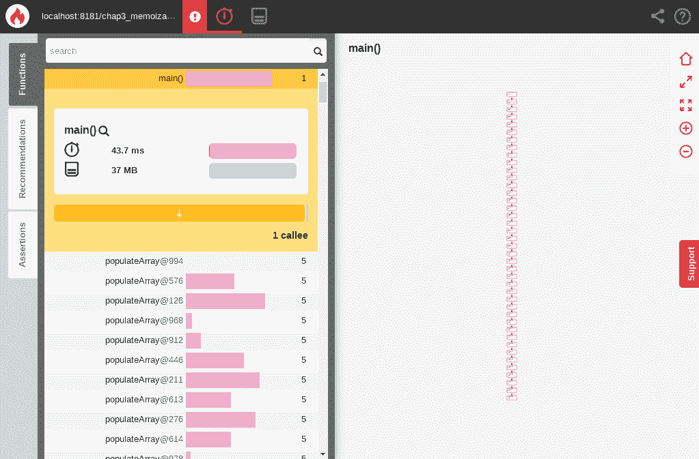在不使用记忆化时的性能分析报告

以下是使用记忆化后的结果：

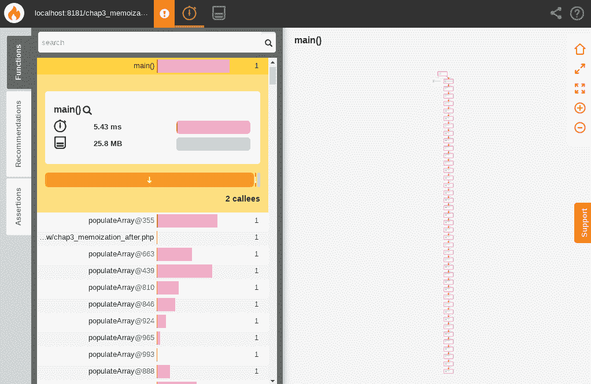使用记忆化时的性能分析报告

比较显示，脚本的记忆化版本运行大约快了八倍，并且消耗的内存少了三分之一。对于这样一个简单的实现来说，性能上的重要提升。

关于记忆化的最后一个问题可能是：我们可以在同一个脚本的多次运行之间缓存结果吗？当然可以。由你来确定最佳的缓存方式。你可以使用任何标准的缓存结果的方式。此外，至少有一个库可以用来在 PHP 中缓存记忆化的结果。你可以在以下地址找到它：[`github.com/koktut/php-memoize`](https://github.com/koktut/php-memoize)。请注意，这个库对于我们上一个脚本来说不是一个好的选择，因为它与递归尾调用不兼容。

# 摘要

在本章中，我们学习了 PHP 7 本身是一个优化，如何避免一般动态结构总是会提升 PHP 脚本的性能，以及某些函数式编程技术，比如记忆化，在优化代码性能时可以是强大的盟友。

在下一章中，我们将学习如何通过学习生成器和异步非阻塞代码、使用 POSIX 线程（`pthreads`）库进行多线程处理，以及使用`ReactPHP`库进行多任务处理来应对输入和输出（I/O）延迟较大的情况。

# 参考

[`news.php.net/php.internals/73888`](http://news.php.net/php.internals/73888)
