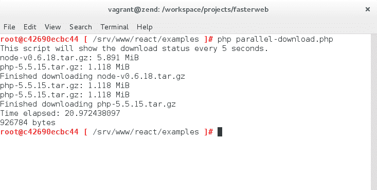
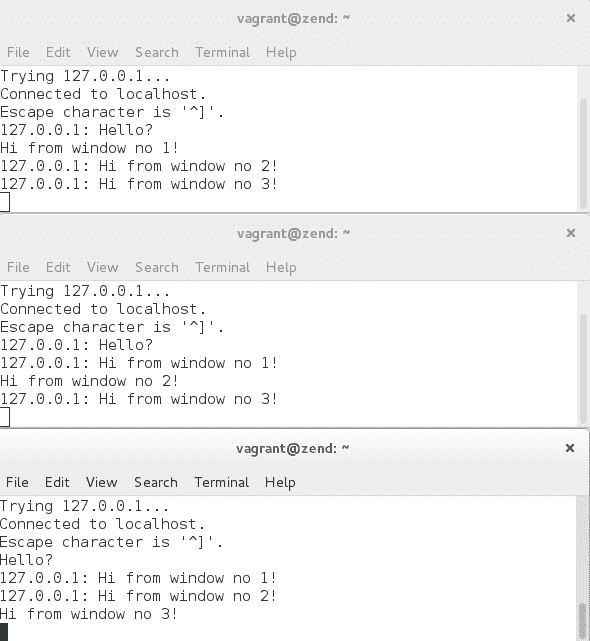
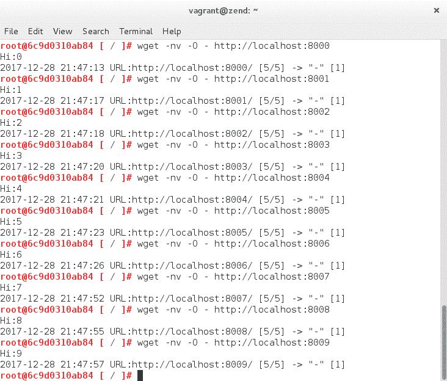
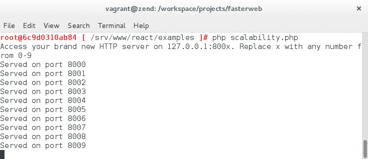

# 使用异步 PHP 构想未来

在本章中，我们将学习如何确定在处理 I/O 调用时什么是最佳策略，以及如何实施这些策略。我们将看到多线程与多任务处理的区别，何时实施其中一个，以及如何实施。

此外，我们将学习如何使用`ReactPHP`库，并在处理异步 I/O 调用时如何从事件驱动编程中受益。

因此，在本章中，我们将涵盖以下几点：

+   使用异步非阻塞代码优化 I/O 调用

+   使用`POSIX Threads`库进行多线程

+   实施`ReactPHP`解决方案

# 异步非阻塞 I/O 调用

正如我们在本书的前几章中所看到的，由于建立、使用和关闭流和套接字的基础延迟，I/O 调用始终会提供最差的性能。由于 PHP 基本上是一种同步语言，它在恢复代码执行之前等待被调用的函数返回，因此如果被调用的函数必须等待流关闭才能返回到调用代码，I/O 调用尤其成问题。当一个 PHP 应用程序例如每隔几分钟需要进行数千次 I/O 调用时，情况会变得更糟。

自 PHP 5.3 以来，通过使用生成器中断 PHP 的正常执行流程成为可能，从而异步执行代码。正如我们之前所看到的，即使动态结构在一般情况下可能性能较差，它们仍然可以用于加速阻塞代码。这对于通常具有非常高延迟的 I/O 调用尤其如此。为了更好地掌握 I/O 延迟的数量级，我们可以查看谷歌发布的以下著名图表：

| 延迟比较数字--------------------------L1 缓存引用 0.5 ns 分支错误预测 5 nsL2 缓存引用 7 ns 14 倍 L1 缓存互斥锁定/解锁 25 ns 主存储器引用 100 ns 20 倍 L2 缓存，200 倍 L1 缓存使用 Zippy 压缩 1K 字节 3,000 ns 3 us 通过 1 Gbps 网络发送 1K 字节 10,000 ns 10 us 从 SSD*随机读取 4K150,000 ns 150 us 〜1GB/秒 SSD 从内存顺序读取 1 MB250,000 ns 250 us 在同一数据中心的往返 500,000 ns 500 us 从 SSD*顺序读取 1 MB1,000,000 ns 1,000 us 1 ms 〜1GB/秒 SSD，4 倍内存磁盘查找 10,000,000 ns 10,000 us 10 ms 20 倍数据中心往返从磁盘顺序读取 1 MB20,000,000 ns 20,000 us 20 ms 80 倍内存，20 倍 SSD 发送数据包 CA->荷兰->CA150,000,000 ns 150,000 us 150 ms 注释-----1 ns = 10^-9 秒 1 us = 10^-6 秒 = 1,000 ns1 ms = 10^-3 秒 = 1,000 us = 1,000,000 ns 来源------Jeff Dean：[`research.google.com/people/jeff/`](http://research.google.com/people/jeff/)Peter Norvig 原作：[`norvig.com/21-days.html#answers`](http://norvig.com/21-days.html#answers)贡献-------------来自：[`gist.github.com/2843375`](https://gist.github.com/2843375)"人性化"比较：[`gist.github.com/2843375`](https://gist.github.com/2843375)可视化比较图表：[`i.imgur.com/k0t1e.png`](http://i.imgur.com/k0t1e.png)动画演示：[`prezi.com/pdkvgys-r0y6/latency-numbers-for-programmers-web-development/latency.txt`](http://prezi.com/pdkvgys-r0y6/latency-numbers-for-programmers-web-development/latency.txt)[`gist.github.com/jboner/2841832`](https://gist.github.com/jboner/2841832)[`gist.github.com/andrewscaya/2f9e68d4b41f9d747b92fb26b1b60d9f`](https://gist.github.com/andrewscaya/2f9e68d4b41f9d747b92fb26b1b60d9f) |
| --- |

毫无疑问，从磁盘读取始终比从内存读取慢，网络 I/O 调用仍然是最慢的。

让我们深入一点，看一下一些进行一系列 I/O 调用的代码。我们的第一个例子将使用`cURL`。让我们看一下以下代码：

```php
// chap4_IO_blocking.php 

$start = microtime(true); 

$i = 0; 

$responses = []; 

while ($i < 10) { 

    $curl = curl_init(); 

    curl_setopt_array($curl, array( 
        CURLOPT_RETURNTRANSFER => 1, 
        CURLOPT_URL => 'http://www.google.ca', 
        CURLOPT_USERAGENT => 'Faster Web cURL Request' 
    )); 

    $responses[] = curl_exec($curl); 

    curl_close($curl); 

    $i++; 
} 

$time = microtime(true) - $start; 

echo 'Time elapsed: ' . $time . PHP_EOL; 

echo memory_get_usage() . ' bytes' . PHP_EOL; 
```

现在，让我们执行 PHP 脚本。我们现在应该看到以下结果：

运行阻塞代码脚本时经过的时间和消耗的内存

由于访问网络的高延迟，这段代码需要很长时间才能完成。

如果我们使用`Blackfire.io`对先前的代码进行性能分析，我们会看到 10 次`cURL`调用需要超过一秒才能完成：

对代码进行性能分析显示，10 次 cURL 调用占据了脚本总执行时间的大部分

让我们修改我们的 PHP 脚本，以使用异步代码同时运行我们的`cURL`请求。以下是先前 PHP 代码的新版本：

```php
// chap4_IO_non_blocking.php 

$start = microtime(true); 

$i = 0; 

$curlHandles = []; 

$responses = []; 

$multiHandle = curl_multi_init(); 

for ($i = 0; $i < 10; $i++) { 

    $curlHandles[$i] = curl_init(); 

    curl_setopt_array($curlHandles[$i], array( 
        CURLOPT_RETURNTRANSFER => 1, 
        CURLOPT_URL => 'http://www.google.ca', 
        CURLOPT_USERAGENT => 'Faster Web cURL Request' 
    )); 

    curl_multi_add_handle($multiHandle, $curlHandles[$i]); 
} 

$running = null; 

do { 
    curl_multi_exec($multiHandle, $running); 
} while ($running); 

for ($i = 0; $i < 10; $i++) { 
    curl_multi_remove_handle($multiHandle, $curlHandles[$i]); 

    $responses[] = curl_multi_getcontent($curlHandles[$i]); 
} 

curl_multi_close($multiHandle); 

$time = microtime(true) - $start; 

echo 'Time elapsed: ' . $time . PHP_EOL; 

echo memory_get_usage() . ' bytes' . PHP_EOL; 
```

执行代码后，我们现在得到了以下结果：

运行非阻塞代码脚本时经过的时间和消耗的内存

正如预期的那样，PHP 脚本更快，因为它不再需要等待 I/O 调用完成后才能继续执行其余的代码。实际上，在幕后发生的是在同一线程内的多任务处理。事实上，代码的执行流程实际上被中断，以允许许多 I/O 调用的并发执行。这是由于非阻塞代码会在等待某个任务完成时将控制权交还给调用者代码，并在完成时可能调用回调函数。如果我们使用`Blackfire.io`对先前的代码进行性能分析，我们将看到这种循环的执行——为了完成所有 10 个请求，yielding 函数实际上被调用了 45000 多次：

为了完成所有 10 个 cURL 请求，yielding 函数被调用了 45000 多次

在 PHP 5.5 中引入的生成器允许代码的不同部分似乎同时执行，从而更容易进行异步编程。生成器实际上是一个实现了迭代器接口的可调用对象。其基本原则是有一个循环，将重复调用一个生成器函数，然后将控制权交还给循环，直到没有东西可处理为止，此时生成器函数将返回。

现在，让我们通过一个简单的代码示例深入了解异步编程。为此，让我们使用以下代码编写一个基本的汽车比赛：

```php
// chap4_async_race.php

$laps[] = 0;
$laps[] = 0;
$laps[] = 0;

function car1(int &$lap) {
    while ($lap <= 10) {
        for ($x = 0; $x <= 200; $x++) {
            yield 0;
        }

        yield 1;
    }

    // If the car has finished its race, return null in order to remove the car from the race
    return;
}

function car2(int &$lap) {
    while ($lap <= 10) {
        for ($x = 0; $x <= 220; $x++) {
            yield 0;
        }

        yield 1;
    }

    // If the car has finished its race, return null in order to remove the car from the race
    return;
}

function car3(int &$lap) {
    while ($lap <= 10) {
        for ($x = 0; $x <= 230; $x++) {
            yield 0;
        }

        yield 1;
    }

    // If the car has finished its race, return null in order to remove the car from the race
    return;
}

function runner(array $cars, array &$laps) {
    $flag = FALSE;

    while (TRUE) {
        foreach ($cars as $key => $car) {
            $penalty = rand(0, 8);
            if($key == $penalty) {
                // We must advance the car pointer in order to truly apply the penalty 
                                                                to the "current" car
                $car->next();
            } else {
                // Check if the "current" car pointer points to an active race car
                if($car->current() !== NULL) {
                    // Check if the "current" car pointer points to a car that has  
                                                                    completed a lap
                    if($car->current() == 1) {
                        $lapNumber = $laps[$key]++;
                        $carNumber = $key + 1;
                        if ($lapNumber == 10 && $flag === FALSE) {
                            echo "*** Car $carNumber IS THE WINNER! ***\n";
                            $flag = TRUE;
                        } else {
                            echo "Car $carNumber has completed lap $lapNumber\n";
                        }
                    }
                    // Advance the car pointer
                    $car->next();
                    // If the next car is no longer active, remove the car from the 
                                                                              race
                    if (!$car->valid()) {
                        unset($cars[$key]);
                    }
                }
            }
        }

```

```php
        // No active cars left! The race is over!
        if (empty($cars)) return;
    }
}

runner(array(car1($laps[0]), car2($laps[1]), car3($laps[2])), $laps); 
```

正如你所看到的，主循环中的 runner 函数以随机顺序处理三个生成器函数，直到它们没有任何东西可处理为止。最终结果是，我们永远不知道哪辆车会赢得比赛，尽管其中一些车似乎比其他车快！让我们运行这段代码三次。以下是第一次运行的结果：

汽车 2 赢得了比赛！

以下是第二次运行的结果：

汽车 3 赢得了比赛！

以下是第三次也是最后一次运行的结果：

汽车 1 赢得了比赛！

最终结果是似乎在同一线程内同时执行三个不同函数。这正是异步编程的基本原则。事实上，很容易理解多任务处理是如何被用来帮助减轻单个 PHP 脚本的重负，通过中断脚本的执行来使用第三方软件（如 RabbitMQ 和 Redis）排队一些任务，从而延迟处理这些任务，直到适当的时候。

现在我们已经看过了多任务处理，让我们来看看多线程处理。

# 使用 pthreads 进行多线程

`POSIX Threads`，更为人所知的是`pthreads`，是一个允许计算机程序通过从其父进程分叉子进程来同时执行多个进程或线程的库。`pthreads`库可以在 PHP 中使用，因此可以在执行其他操作的同时在后台分叉进程。因此，多线程是另一种处理 I/O 调用延迟的方法。为了实现这一点，我们需要一个带有`pthreads`扩展启用的线程安全版本的 PHP。在我们的情况下，我们将使用运行**Zend 线程安全**（**ZTS**）版本的 PHP 7.0.29 的 Linux for PHP 容器。打开一个新的终端窗口，`cd`到项目的目录，并输入以下命令：

```php
# docker run -it --rm \
> -p 8282:80 \
> -v ${PWD}/:/srv/fasterweb \
> asclinux/linuxforphp-8.1:7.0.29-zts \
> /bin/bash
```

输入此命令后，如果在 CLI 中输入`php -v`命令，您应该会看到以下信息：

ZTS 容器的命令行界面（CLI）

这条消息确认我们正在使用线程安全（ZTS）版本的 PHP。然后，在容器的 CLI 中，输入这些命令：

```php
# mv /srv/www /srv/www.OLD
# ln -s /srv/fasterweb/chapter_4 /srv/www
# cd /srv/www
# pecl install pthreads
# echo "extension=pthreads.so" >> /etc/php.ini
```

您现在可以通过输入命令`php -i`来检查`pthreads`扩展是否已正确安装。最后一个命令应该让您看到扩展的版本号。如果是这样，那么扩展已正确安装：

pthread 扩展的 3.1.6 版本现已安装

现在`pthreads`库已安装并启用，让我们继续使用它，尝试在计算机的 CPU 上创建多个线程，这些线程将真正同时执行。为此，我们将使用以下源代码：

```php
// chap4_pthreads.php 

$start = microtime(true); 

class TestThreads extends Thread { 

    protected $arg; 

    public function __construct($arg) { 
        $this->arg = $arg; 
    } 

    public function run() { 
        if ($this->arg) { 
            $sleep = mt_rand(1, 10); 
            printf('%s: %s  -start -sleeps %d' . "\n", date("g:i:sa"), $this->arg, 
                                                                          $sleep); 
            sleep($sleep); 
            printf('%s: %s  -finish' . "\n", date("g:i:sa"), $this->arg); 
        } 
    } 
} 

$stack = array(); 

// Create Multiple Thread 
foreach ( range('1', '9') as $id ) { 
    $stack[] = new TestThreads($id); 
} 

// Execute threads 
foreach ( $stack as $thread ) { 
    $thread->start(); 
} 

sleep(1); 

$time = microtime(true) - $start; 

echo 'Time elapsed: ' . $time . PHP_EOL; 

echo memory_get_usage() . ' bytes' . PHP_EOL; 
```

执行后，我们获得以下输出：

线程同时执行

结果清楚地表明，线程是同时执行的，因为脚本的总经过时间为 10 秒，即使每个线程至少睡了几秒。如果没有使用多线程执行此同步阻塞代码，完成执行可能需要大约 40 秒。在这种情况下，多任务处理不是一个合适的解决方案，因为对`sleep()`函数的阻塞调用将阻止每个生成器将控制权让给主循环。

现在我们已经看到了通过异步编程进行多任务处理和通过`POSIX Threads`库进行多线程处理，我们将把注意力转向一个在编程异步时非常有用的 PHP 库，即`ReactPHP`库。

# 使用 ReactPHP 库

`ReactPHP`是一个事件驱动的、非阻塞 I/O 库。这个库基本上依赖于一个事件循环，它轮询文件描述符，使用定时器，并通过在每次循环迭代中注册和执行未完成的 tick 来推迟回调。

`ReactPHP`基于 Reactor 模式，根据 Douglas C. Schmidt 的说法，Reactor 模式是“*一种处理一个或多个客户端并发传递给应用程序的服务请求的设计模式。应用程序中的每个服务可能由多个方法组成，并由一个单独的事件处理程序表示，负责分派特定于服务的请求。事件处理程序的分派由一个初始化分派器执行，该分派器管理注册的事件处理程序。服务请求的多路复用由同步事件多路复用器执行*。”在 Schmidt 的原始论文*Reactor: An Object Behavioral Pattern for Demultiplexing and Dispatching Handles for Synchronous Events*中，我们可以找到这种模式的 UML 表示：

根据 Douglas C. Schmidt 的说法，Reactor 模式

让我们通过在我们的代码库中安装它来开始探索这个异步编程库。在容器的 CLI 中，输入以下命令：

```php
# cd /srv/www/react 
# php composer.phar self-update
# php composer.phar install 
# cd examples 
```

一旦库通过 Composer 安装，你可以尝试 examples 目录中找到的任何示例脚本。这些代码示例来自*ReactPHP*的主代码库。在我们的例子中，我们将首先看一下`parallel-download.php`脚本。以下是它的源代码：

```php
// parallel-download.php 

$start = microtime(true); 

// downloading the two best technologies ever in parallel 

require __DIR__ 
    . DIRECTORY_SEPARATOR 
    .'..' 
    . DIRECTORY_SEPARATOR 
    . 'vendor' 
    . DIRECTORY_SEPARATOR 
    .'autoload.php'; 

$loop = React\EventLoop\Factory::create(); 

$files = array( 
    'node-v0.6.18.tar.gz' => 'http://nodejs.org/dist/v0.6.18/node-v0.6.18.tar.gz', 
    'php-5.5.15.tar.gz' => 'http://it.php.net/get/php-5.5.15.tar.gz/from/this/mirror', 
); 

foreach ($files as $file => $url) {
    $readStream = fopen($url, 'r'); 
    $writeStream = fopen($file, 'w'); 

    stream_set_blocking($readStream, 0); 
    stream_set_blocking($writeStream, 0); 

    $read = new React\Stream\Stream($readStream, $loop); 
    $write = new React\Stream\Stream($writeStream, $loop); 

    $read->on('end', function () use ($file, &$files) { 
        unset($files[$file]); 
        echo "Finished downloading $file\n"; 
    }); 

    $read->pipe($write);

} 

$loop->addPeriodicTimer(5, function ($timer) use (&$files) { 
    if (0 === count($files)) { 
        $timer->cancel(); 
    } 

    foreach ($files as $file => $url) {

        $mbytes = filesize($file) / (1024 * 1024); 
        $formatted = number_format($mbytes, 3); 
        echo "$file: $formatted MiB\n"; 
    } 
}); 

echo "This script will show the download status every 5 seconds.\n"; 

$loop->run(); 

$time = microtime(true) - $start; 

echo 'Time elapsed: ' . $time . PHP_EOL; 

echo memory_get_usage() . ' bytes' . PHP_EOL; 
```

基本上，这个脚本创建了两个流，将它们设置为非阻塞模式，并将这些流注册到循环中。定时器被添加到循环中，以便每 5 秒回显一条消息。最后，它运行了循环。

让我们通过以下命令来看一下这个脚本的运行情况：

```php
 # php parallel-download.php 
```

以下是结果：

这两个包是异步下载的

正如你所看到的，下载是以并行、异步和反应式的方式执行的。

让我们继续通过在代码示例中包含的`tcp-chat.php`脚本来继续我们对 ReactPHP 世界的短暂旅程。以下是这个代码示例的源代码：

```php
// tcp-chat.php 

// socket based chat

require __DIR__ 
    . DIRECTORY_SEPARATOR 
    .'..' 
    . DIRECTORY_SEPARATOR 
    . 'vendor' 
    . DIRECTORY_SEPARATOR 
    .'autoload.php';

$loop = React\EventLoop\Factory::create();
$socket = new React\Socket\Server($loop);

$conns = new \SplObjectStorage();

$socket->on('connection', function ($conn) use ($conns) {
    $conns->attach($conn);

    $conn->on('data', function ($data) use ($conns, $conn) {
        foreach ($conns as $current) {

            if ($conn === $current) {
               continue;
            }

            $current->write($conn->getRemoteAddress().': ');
            $current->write($data);
        }

    });

    $conn->on('end', function () use ($conns, $conn) {
        $conns->detach($conn);
    });
});

echo "Socket server listening on port 4000.\n";
echo "You can connect to it by running: telnet localhost 4000\n";

$socket->listen(4000);
$loop->run();
```

该脚本创建了一个在 4000 端口监听的套接字服务器，并通过监听连接事件被循环通知有新连接。在收到事件通知后，套接字服务器将连接对象注入处理程序。连接对象然后开始监听数据事件，这将触发它对从套接字服务器客户端接收的数据进行处理。在这个聊天脚本的情况下，连接对象将触发`SplObjectStorage`对象中所有注册连接对象的写入方法，从而有效地将消息发送给当前连接的所有聊天客户端。

首先，通过运行脚本启动聊天服务器：

```php
 # php tcp-chat.php 
```

然后，打开三个新的终端窗口，并通过在每个窗口中输入以下命令来连接到我们的*Linux for PHP* *Docker*容器：

```php
 # **docker exec -it $( docker ps -q | awk '{ print $1 }' ) /bin/bash** 
```

在每个容器的 CLI 中，输入以下命令：

```php
# telnet localhost 4000
```

通过`telnet`连接后，只需在一个终端窗口和另一个终端窗口之间来回发送消息，玩得开心：

从一个终端窗口向其他终端窗口发送消息

显然，通过同一个容器内的终端窗口所做的工作也可以通过网络连接到不同计算机上的终端窗口来完成。这个例子向我们展示了异步编程有多么强大。

让我们通过查看`scalability.php`脚本来完成我们对*ReactPHP*代码示例的调查。以下是它的源代码：

```php
// scalability.php 

// a simple, single-process, horizontal scalable http server listening on 10 ports

require __DIR__ 
    . DIRECTORY_SEPARATOR 
    .'..' 
    . DIRECTORY_SEPARATOR 
    . 'vendor' 
    . DIRECTORY_SEPARATOR 
    .'autoload.php';

$loop = React\EventLoop\Factory::create();

for ($i = 0; $i < 10; ++$i) {

    $s = stream_socket_server('tcp://127.0.0.1:' . (8000 + $i));
    $loop->addReadStream($s, function ($s) use ($i) {
        $c = stream_socket_accept($s);
        $len = strlen($i) + 4;
        fwrite($c,"HTTP/1.1 200 OK\r\nContent-Length: $len\r\n\r\nHi:$i\n");
        echo "Served on port 800$i\n";
    });

}

echo "Access your brand new HTTP server on 127.0.0.1:800x. Replace x with any number from 0-9\n";

$loop->run();
```

该脚本创建了一个套接字服务器，然后将其附加到主事件循环中，以便在向服务器发送请求时调用一个 lambda 函数。然后，lambda 函数执行将答复发送回客户端的代码，通过将其写入接受的流套接字。

让我们通过以下命令运行这段代码：

```php
 # php scalability.php
```

然后，打开另一个终端窗口，并将其连接到我们的*Linux for PHP* *Docker*容器：

```php
 # **docker exec -it $( docker ps -q | awk '{ print $1 }' ) /bin/bash** 
```

然后，使用`wget`查询服务器：

```php
# wget -nv -O - http://localhost:8000
# wget -nv -O - http://localhost:8001
# wget -nv -O - http://localhost:8002
# wget -nv -O - http://localhost:8003
# wget -nv -O - http://localhost:8004
# wget -nv -O - http://localhost:8005
# wget -nv -O - http://localhost:8006
# wget -nv -O - http://localhost:8007
# wget -nv -O - http://localhost:8008
# wget -nv -O - http://localhost:8009
```

完成后，你应该得到每个请求的以下响应：

连接到 Web 服务器的每个可用端口

这是你在服务器端应该看到的：

服务器确认已在所有这些端口上为所有这些请求提供服务

再次，你可以看到*ReactPHP*有多么强大，只需几行代码就足以创建一个可扩展的 Web 服务器。

此外，我们强烈建议探索并尝试我们存储库中包含的*ReactPHP*项目的所有文件，这样你就可以充分体会到这个库在异步编程方面为开发者能做些什么。

此外，还有其他出色的异步 PHP 库可以帮助您掌握这种新的开发方式，并加速高延迟 I/O 应用程序。其中一个这样的库是*Amp*（[`amphp.org/`](https://amphp.org/)）。在掌握异步编程艺术的过程中，探索这些非常有用的库是非常值得的。

最后，要了解有关 PHP 异步编程的更多信息，您可以听*Christopher Pitt*在*Nomad PHP*上关于这个主题的精彩演讲（[`nomadphp.com/asynchronous-php/`](https://nomadphp.com/asynchronous-php/)）。

# 总结

在本章中，我们学习了如何确定应对 I/O 调用的最佳策略以及如何实施这些策略。此外，我们还了解了如何使用`ReactPHP`库以及在处理异步 I/O 调用时如何从事件驱动编程中获益。

在下一章中，我们将学习如何测量数据库性能，从应用简单的测量技术到使用高级基准测试工具。
