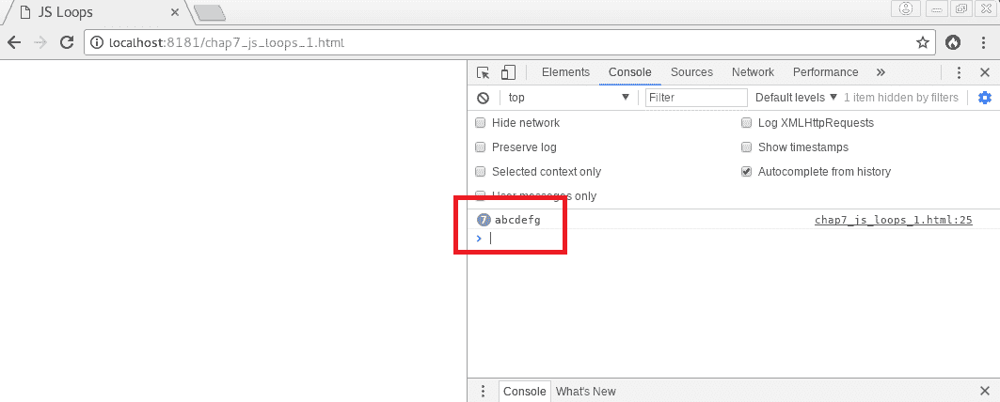
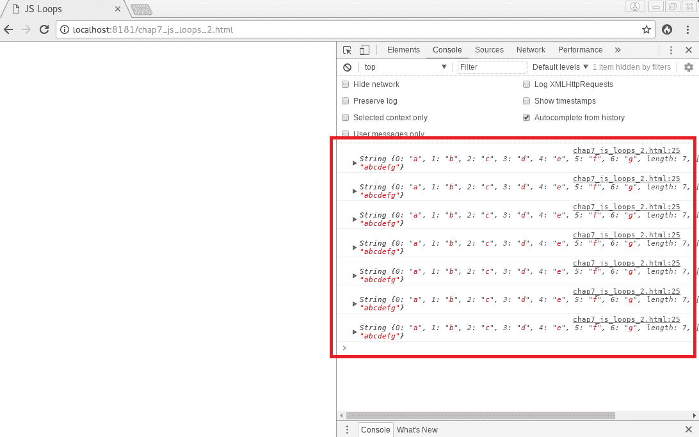

# JavaScript 和危险驱动开发

“在 JavaScript 中，有一种美丽、优雅、高度表达的语言，被一堆良好意图和失误所掩盖。”

- Douglas Crockford，《JavaScript：精粹》

这段引语基本上表达了优化 JavaScript 代码的全部内容。

开发人员常常被最新的闪亮功能所吸引，或者出于需要故意或假装展示自己的能力，他们的思维有时会陷入一种神秘的清醒睡眠状态，因此他们会被展示过于复杂的代码或者使用最新功能的欲望所克服，尽管他们心里清楚，这意味着他们将不得不牺牲长期稳定性和计算机程序的效率。这种构建应用程序的方式我们可以称之为“危险驱动开发”。JavaScript 有很多非常糟糕的部分，但也有足够多的好部分来抵消坏部分。话虽如此，危险驱动开发的问题在于开发人员听从 JavaScript 糟糕部分的诱惑，而忽视了最终用户的满意度。

在本章中，我们将涵盖一些 JavaScript 的最好和最坏的部分，特别是与代码效率和整体性能有关的部分，以及开发人员应该始终编写安全、可靠和高效的 JavaScript 代码，即使这样做并不像编写最新的闪亮代码那样迷人。

因此，我们将涵盖以下几点：

+   全局对象和局部变量

+   避免不良习惯，并密切关注非常糟糕的部分

+   高效使用 DOM

+   构建和加载 JavaScript 应用程序

# 全局对象和局部变量

JavaScript 的全局对象是所有全局变量的容器。任何编译单元的顶级变量都将存储在全局对象中。当全局对象未被正确使用时，全局对象是 JavaScript 中最糟糕的部分之一，因为它很容易因不需要的变量而膨胀，并且在 JavaScript 默认行为被大量依赖时，开发人员可能会无意中滥用它。以下是两个这种滥用的例子：

+   当运行一个简单的代码，比如`total = add(3, 4);`，实际上是在全局对象中创建了一个名为`total`的属性。这对性能来说并不是一件好事，因为您可能会在堆上保留大量变量，而其中大部分只在应用程序执行的某个时刻需要。

+   当忽略使用`new`关键字来创建对象时，JavaScript 将执行普通的函数调用，并将`this`变量绑定到全局对象。这是一件非常糟糕的事情，不仅出于安全原因，因为可能会破坏其他变量，而且出于性能原因，因为开发人员可能会认为他正在将值存储在对象的属性中，而实际上，他正在直接将这些值存储在全局对象中，从而使全局对象膨胀，并在代码的其他地方已经实例化了所需的对象的情况下，在两个不同的内存空间中存储这些值。

为了有效地使用全局对象，您应该将所有变量封装在一个单一的应用对象中，根据需要对其应用函数，在应用到应用对象的函数中强制执行类型验证，以确保它被正确实例化，并将全局对象视为一种不可变对象，并将其视为一种具有一些副作用函数的应用对象。

# 避免全局变量

全局变量可以在应用程序的任何作用域中进行读取或写入。它们是必要的恶。实际上，任何应用程序都需要组织其代码结构，以处理输入值并返回适当的响应或输出。当代码组织不良时，以及代码的任何部分因此可以修改应用程序的全局状态并修改程序的整体预期行为时，问题和错误开始出现。

首先，组织不良的代码意味着脚本引擎或解释器在尝试查找变量名时需要做更多的工作，因为它将不得不通过许多作用域直到在全局作用域中找到它。

其次，组织不良的代码意味着内存中的堆总是比运行相同功能所需的堆要大，因为许多多余的变量将一直保留在内存中，直到脚本执行结束。

解决这个问题的方法是尽量避免使用全局变量，并几乎始终使用命名空间变量。此外，使用局部作用域变量的额外优势是确保在丢失局部作用域时变量会自动取消设置。

以下示例（`chap7_js_variables_1.html`）向我们展示了全局变量的使用可能非常问题，并且最终非常低效，特别是在复杂应用程序中：

```php
<!DOCTYPE html>

<html lang="en">
<head>
    <meta charset="UTF-8">
    <title>JS Variables</title>

    <meta name="viewport" content="width=device-width, initial-scale=1">
</head>

<body onload="myJS()" style="margin:0;">

<div id="main"></div>

<script type="text/javascript">

    function Sum(n1, n2)
    {
        // These will be global when called from the myJSAgain() function.
        this.number1 = Number(n1);
        this.number2 = Number(n2);

        return this.number1 + this.number2;
    }

    function myJS()
    {
        // Side-effect: creates a global variable named 'total'.
        total = new Sum(3, 4);
        alert( window.total ); // Object

        // Side-effect: modifies the global variable named 'total'.
        myJSAgain();

        // Global 'total' variable got clobbered.
        alert( window.total ); // 3
    }

    function myJSAgain()
    {
        // Missing 'new' keyword. Will clobber the global 'total' variable.
        total = Sum(1, 2);

        // There are now two sets of 'number1' and 'number2' variables!
        alert( window.number2 ); // 2
    }

</script>

</body>

</html>
```

简单的解决方案是通过使用模块和命名空间来组织代码。这可以通过将所有变量和函数包装在单个应用程序对象中来轻松实现，以强制在设置或修改变量时产生某种关联行为，并将应用程序的机密信息保留在全局对象中。闭包也可以用于隐藏全局作用域中的重要值。让我们在考虑命名空间的情况下修改我们之前的脚本：

```php
function myJS()
    {
        function MyJSObject(n1, n2)
        {
            let number1 = Number(n1);
            let number2 = Number(n2);

            return {
                set_number1: function (n1) {
                    number1 = Number(n1);
                },
                set_number2: function (n2) {
                    number2 = Number(n2);
                },
                sum: function ( ) {
                    return number1 + number2;
                }
            };
        }

        let oApp1 = new MyJSObject(3, 4);
        alert( oApp1.sum() ); // 7

        let app2 = MyJSObject(1, 2);
        alert( app2.sum() ); // 3
        alert( oApp1.sum() ); // 7
        alert( window.number1 ); // undefined
    }
```

通过这种方式使用`let`关键字，开发人员仍然可以获得正确的值，同时避免破坏全局变量并无意中修改整个应用程序的全局状态，即使他忘记使用`new`关键字。此外，通过避免不必要的膨胀和减少在命名空间查找中花费的时间，全局对象保持精简和高效。

# 评估局部变量

正如我们在前面的示例中所看到的，省略局部变量声明前的`let`或`var`关键字会使其变成全局变量。在所有情况下，函数和对象都不应该能够通过修改其局部作用域外的变量的值来创建功能性副作用。因此，在函数或结构的作用域内声明变量时，应始终使用`let`关键字。例如，将全局变量简单地移动到在本地循环中使用它们的函数的局部作用域中，可以使大多数浏览器的性能提高近 30%。

此外，使用`let`关键字声明变量时，可以使用块作用域，应尽可能使用。因此，在`for`循环中使用的变量在循环结束后不会保持在作用域内。这允许更好的变量封装和隔离，更有效的垃圾回收和更好的性能。

轻松跟踪变量声明的一种方法是使用 JavaScript 的严格模式。我们将在本章的下一节中更详细地解释这个 ES5 特性。

# 避免坏习惯并注意非常糟糕的部分

与大多数基于 C 的编程语言一样，最好避免某些常见的坏习惯，这些习惯经常导致代码效率低下和错误。

# 坏习惯

以下是一些应该被视为有问题的坏习惯：

+   在 JavaScript 中，首次使用时声明变量是一个坏主意，因为开发人员很可能会给变量全局范围，以便以后访问它。最好从项目开始组织代码，并使用直观和有意义的命名空间，以便在整个应用程序中组织变量的使用。

+   在任何情况下都应该避免以不明确或原本不打算的方式使用结构。例如，让`switch`语句穿透或在条件语句的条件中给变量赋值都是非常糟糕的习惯，不应该使用。

+   依赖自动分号插入是一个坏主意，可能导致代码被错误解释。应该始终避免。

+   数组和对象中的尾随逗号是一个坏主意，因为一些浏览器可能无法正确解释它们。

+   当使用一个带有一个单一命令行的`block`语句时，应该始终避免省略花括号。

当然，适当构造代码的艺术首先取决于对结构本身的良好了解。在 JavaScript 中有一些不好的结构应该在任何时候都避免。让我们花点时间来看看其中的一些。

# 不好的结构 - with 语句

这些不好的结构之一是`with`语句。`with`语句的最初意图是帮助开发人员在不必每次键入整个命名空间的情况下访问对象属性。它旨在成为一种`use`语句，就像我们在其他语言（如 PHP）中可能遇到的那样。例如，你可以以以下方式使用`with`语句：

```php
foo.bar.baz.myVar    = false;
foo.bar.baz.otherVar = false;

with (foo.bar.baz) {
    myVar = true;
    otherVar = true;
}
```

问题在于，当我们查看这段代码时，我们并不确定引擎是否会覆盖名为`myVar`和`otherVar`的全局变量。处理长命名空间的最佳方法是将它们分配给本地变量，然后在之后使用它们：

```php
let fBrBz = foo.bar.baz;

fBrBz.myVar = true;
fBrBz.otherVar = true;
```

# 不好的结构 - eval 语句

另一个不好的例子是`eval()`语句。这个语句不仅非常低效，而且大多数时候是没有用的。事实上，人们经常认为使用`eval()`语句是处理提供的字符串的正确方式。但事实并非如此。你可以简单地使用数组语法来做同样的事情。例如，我们可以以以下方式使用`eval()`语句：

```php
function getObjectProperty(oString)
{
    let oRef;
    eval("oRef = foo.bar.baz." + oString);
    return oRef;
}
```

要获得大幅度的速度提升（从 80%到 95%更快），你可以用以下代码替换前面的代码：

```php
function getObjectProperty(oString)
{
    return foo.bar.baz[oString];
}
```

# 不好的结构 - try-catch-finally 结构

重要的是要注意，应该避免在性能关键的函数内部使用 try-catch-finally 结构。原因与这个结构必须创建一个运行时变量来捕获异常对象有关。这种运行时创建是 JavaScript 中的一个特殊情况，并非所有浏览器都以相同的效率处理它，这意味着这个操作可能会在应用程序的关键路径上造成麻烦，特别是在性能至关重要的情况下。你可以用简单的测试条件替换这个结构，并在一个对象中插入错误消息，这个对象将作为应用程序的错误注册表。

# 避免低效的循环

嵌套循环是在 JavaScript 中编写这些类型结构时要避免的第一件事。

此外，大多数情况下，使用`for-in`循环也不是一个好主意，因为引擎必须创建一个可枚举属性的完整列表，这并不是非常高效的。大多数情况下，`for`循环会完美地完成任务。这在应用程序的关键路径上找到的性能关键函数中尤其如此。

此外，在处理循环时要注意隐式对象转换。通常，乍一看，很难看出在重复访问对象的`length`属性时发生了什么。但有些情况下，当对象没有事先被明确创建时，JavaScript 会在循环的每次迭代中创建一个对象。请参阅以下代码示例（`chap7_js_loops_1.html`）：

```php
function myJS()
{
    let myString = "abcdefg";

    let result = "";

    for(let i = 0; i < myString.length; i++) {
        result += i + " = " + myString.charAt(i) + ", ";
        console.log(myString);
    }

    alert(result);
}
```

在查看谷歌 Chrome 开发者工具中的控制台结果时，我们得到了以下结果：

总共创建了七个字符串对象，每次迭代都创建了一个

在 JavaScript 引擎内部，实际上是在循环的每次迭代中创建了一个字符串对象。为了避免这个问题，我们将在进入循环之前显式实例化一个字符串对象（`chap7_js_loops_2.html`）：

```php
function myJS()
{
    let oMyString = new String("abcdefg");

    let result = "";

    for(let i = 0; i < oMyString.length; i++) {
        result += i + " = " + oMyString.charAt(i) + ", ";
        console.log(oMyString);
    }

    alert(result);
}
```

新脚本的结果如下所示：

只创建了一个对象，并显示了七次

控制台现在显示了同一个对象七次。很容易理解这如何可以优化循环的性能，特别是当循环可能导致引擎创建数十、数百甚至数千个对象以完成其工作时。

# 代码检查工具和严格模式

JavaScript 中还有一些其他不好的部分，可能会在某些情况下导致性能问题。为了密切关注所有这些不好的部分，并用 JavaScript 的好部分替换它们，强烈建议您使用一个工具，即使在第一次运行代码之前，也可以找到代码的问题。这些工具就是代码检查工具。

*JSLint*、*ESLint*和*Prettier*是可以帮助您找到松散代码并修复它的工具，甚至在某些情况下可以自动修复。一些代码检查工具，如*ESLint*，甚至可以通过减少语句数量、通过函数和 Promises 替换结构的嵌套、识别圈复杂度（衡量单个结构代码的分支数量）来帮助您改进代码，也许还可以允许您用更功能性的代码替换这些结构性的代码，正如我们将在下一章中看到的那样。您可以在以下地址找到这些工具：

+   [`www.jslint.com/`](http://www.jslint.com/)

+   [`eslint.org/`](https://eslint.org/)

+   [`github.com/prettier/prettier`](https://github.com/prettier/prettier)

使用代码检查工具的一个额外好处是它们使 JavaScript 代码与 ES5 的严格模式兼容。在可能的情况下，应该使用严格模式。只需在脚本或函数的开头添加一个`use strict;`语句即可使用它。使用严格模式的许多好处之一是简化变量名称与变量定义的映射（优化的命名空间查找）、禁止`with`语句、通过`eval`语句防止意外引入变量到当前作用域、保护`this`变量免受"装箱"（强制实例化）的影响，当它不包含对象并且传递给函数时，可以大大减少性能成本，并消除大多数性能限制，例如访问函数调用者的变量和在运行时"遍历"JavaScript 堆栈。

Packt Publishing 出版了许多关于 JavaScript 性能的优秀书籍和视频，我强烈建议您阅读它们，以掌握所有这些优秀的工具。

# 高效使用 DOM

**文档对象模型**（**DOM**）操作仍然是 JavaScript 中成本最高的操作之一。事实上，应该尽量减少重绘或回流，以避免一般性能问题。

尽管如此，还有其他必须避免的陷阱，以保持脚本在需要 DOM 操作并导致重绘或回流时的速度。这些陷阱涉及如何修改文档树，如何更新不可见元素，如何进行样式更改，如何搜索节点，如何管理从一个文档到另一个文档的引用，以及在检查大量节点时该怎么做。

# 修改文档树

重要的是要知道，在遍历树时进行修改是非常昂贵的。最好创建一个临时集合来处理，而不是在循环遍历所有节点时直接修改树。

事实上，最好的方法是使用非显示的 DOM 树片段，一次性进行所有更改，然后一起显示它们。以下是一个理论示例，说明如何实现这一点：

```php
function myJS()
{
    let docFragment = document.createDocumentFragment();
    let element, content;

    for(let i = 0; i < list.length; i++) {
        element = document.createElement("p");
        content = document.createTextNode(list[i]);
        element.appendChild(content);
        docFragment.appendChild(element);
    }

    document.body.appendChild(docFragment);
}
```

还可以克隆一个元素，以便在触发页面回流之前完全修改它。以下代码显示了如何实现这一点：

```php
function myJS()
{
    let container = document.getElementById("container1");

    let cloned = container.cloneNode(true);

    cloned.setAttribute("width", "50%");

    let element, content;

    for(let i = 0; i < list.length; i++) {
        element = document.createElement("p");
        content = document.createTextNode(list[i]);
        element.appendChild(content);
        cloned.appendChild(element);
    }

    container.parentNode.replaceChild(cloned, container);
}
```

通过使用这些技术，开发人员可以避免 JavaScript 中一些性能方面最昂贵的操作。

# 更新不可见元素

另一种技术是将元素的显示样式设置为`none`。因此，在更改其内容时，它不需要重绘。以下是一个显示如何实现这一点的代码示例：

```php
function myJS()
{
    let container = document.getElementById("container1");

    container.style.display = "none";
    container.style.color = "red";
    container.appendChild(moreNodes);
    container.style.display = "block";
}
```

这是一种简单快速的方法，可以修改节点而避免多次重绘或回流。

# 进行样式更改

与我们提到如何在遍历 DOM 树时一次修改多个节点类似，也可以在文档片段上同时进行多个样式更改，以最小化重绘或回流的次数。以下代码片段是一个例子：

```php
function myJS()
{
    let container = document.getElementById("container1");
    let modifStyle = "background: " + newBackgound + ";" +
        "color: " + newColor + ";" +
        "border: " + newBorder + ";";
    if(typeof(container.style.cssText) != "undefined") {
        container.style.cssText = modifStyle;
    } else {
        container.setAttribute("style", modifStyle);
    }
}
```

正如我们所看到的，通过这种方式可以修改任意数量的样式属性，以便触发只有一个重绘或回流。

# 搜索节点

在整个 DOM 中搜索节点时，最好使用 XPath 来进行。通常会使用`for`循环，如下面的示例，其中正在搜索`h2`、`h3`和`h4`元素：

```php
function myJS()
{
    let elements = document.getElementsByTagName("*");

    for(let i = 0; i < elements.length; i++) {
        if(elements[i].tagName.match("/^h[2-4]$/i")) {
            // Do something with the node that was found
        }
    }
}
```

可以使用 XPath 迭代器对象来获取相同的结果，只是效率更高：

```php
function myJS()
{
    let allHeadings = document.evaluate("//h2|//h3|//h4", document, null, XPathResult.ORDERED_NODE_ITERATOR_TYPE, null);
    let singleheading;

    while(singleheading = allHeadings.iterateNext()) {
        // Do something with the node that was found
    }
}
```

在包含超过一千个节点的 DOM 中使用 XPath 肯定会在性能上有所不同。

# 检查大量节点

另一个要避免的陷阱是一次检查大量节点。更好的方法是将搜索范围缩小到特定的节点子集，然后使用内置方法找到所需的节点。例如，如果我们知道要查找的节点可以在特定的`div`元素内找到，那么我们可以使用以下代码示例：

```php
function myJS()
{
    let subsetElements = document.getElementById("specific-div").getElementsByTagName("*");

    for(let i = 0; i < subsetElements.length; i++) {
        if(subsetElements[i].hasAttribute("someattribute")) {
            // Do something with the node that was found...
            break;
        }
    }
}
```

因此，这种搜索将比我们在大量节点中搜索它要高效得多，并且返回结果更快。

# 管理从一个文档到另一个文档的引用

在 JavaScript 中管理对许多文档的引用时，当不再需要文档时，销毁这些引用是很重要的。例如，如果一个文档在弹出窗口中，在框架中，在内联框架中或在对象中，并且用户关闭了文档，则文档的节点将保留在内存中，并将继续膨胀 DOM。销毁这些未使用的引用可以显著提高性能。

# 缓存 DOM 值

当重复访问对象时，将其存储在本地变量中以便反复使用会更有效。例如，以下代码将对分组的 DOM 值进行本地复制，而不是分别访问每个值：

```php
function myJS()
{
    let group = document.getElementById("grouped");

    group.property1 = "value1";
    group.property2 = "value2";
    group.property3 = "value3";
    group.property4 = "value4";

    // Instead of:
    //
    // document.getElementById("grouped").property1 = "value1";
    // document.getElementById("grouped").property2 = "value2";
    // document.getElementById("grouped").property3 = "value3";
    // document.getElementById("grouped").property4 = "value4";

}
```

这样做将使您避免与动态查找相关的性能开销。

# 构建和加载 JavaScript 应用程序

在考虑如何构建和加载 JavaScript 应用程序时，重要的是要记住某些重要原则。

# 最小化昂贵的操作

在 JavaScript 中成本最高的操作是：

+   通过网络 I/O 请求资源

+   重绘，也称为重新绘制，由于动态内容更改，例如使元素可见。

+   重排，可能是由于窗口调整大小

+   DOM 操作或页面样式的动态更改

显然，最重要的是要尽量减少所有这些操作，以保持良好的性能。在处理执行速度过慢的脚本时，这些都是要在 Google Chrome 的时间轴工具中查找的最重要元素，可以通过 Chrome 的开发者工具访问，如本书的第一章 *更快的 Web-入门*中所述。

# 清理，缩小和压缩资源

当然，从捆绑包中排除未使用的导出，也称为摇树，通过清理死代码来缩小脚本，然后压缩脚本文件，在处理 JavaScript 性能时总是一个好事，特别是在处理网络延迟时。在这方面，*Webpack*（[`webpack.js.org/`](https://webpack.js.org/)）是一个非常好的工具，结合*UglifyJS*插件（[`github.com/webpack-contrib/uglifyjs-webpack-plugin`](https://github.com/webpack-contrib/uglifyjs-webpack-plugin)）和其压缩插件（[`github.com/webpack-contrib/compression-webpack-plugin`](https://github.com/webpack-contrib/compression-webpack-plugin)），它将摇树您的代码，通过删除任何未使用或死代码来缩小您的脚本，并压缩生成的文件。

摇树的优势主要体现在使用摇树的第三方依赖时。为了更好地理解如何使用这些工具，强烈建议您查看以下教程：

+   [`2ality.com/2015/12/webpack-tree-shaking.html`](http://2ality.com/2015/12/webpack-tree-shaking.html)

+   [`medium.com/@roman01la/dead-code-elimination-and-tree-shaking-in-javascript-build-systems-fb8512c86edf`](https://medium.com/@roman01la/dead-code-elimination-and-tree-shaking-in-javascript-build-systems-fb8512c86edf)

另一个优化 JavaScript 代码（摇树，缩小和压缩）的好工具是 Google 的*Closure*，尽管它是用 Java 构建的。您可以在以下地址找到这个工具：[`developers.google.com/closure/`](https://developers.google.com/closure/)。

# 加载页面资源

在 HTML 文档的头部加载脚本文件时，重要的是要避免阻塞页面的渲染。脚本应始终在 body 部分的末尾加载，以确保渲染不会依赖于在获取所需的 JavaScript 文件时可能发生的网络延迟。

此外，重要的是要知道最好将内联脚本放在 CSS 样式表之前，因为 CSS 通常会阻止脚本运行，直到它们完成下载。

此外，在为性能构建 JavaScript 应用程序时，拆分脚本文件负载和异步下载脚本都是必须考虑的技术。

此外，*Steve Souders*已经写了很多关于提升网页性能的优秀书籍和文章，您应该阅读这些书籍，以获取有关这些非常重要的技术和原则的更多信息（[`stevesouders.com/`](https://stevesouders.com/)）。

# 缓存页面资源

另一件重要的事情要记住，正如我们将在第九章 *提高 Web 服务器性能*中更详细地看到的，服务器端和客户端的缓存技术将帮助您显著提高网页的性能。利用这些技术将使您能够减少简单地一遍又一遍地获取相同的 JavaScript 文件所需的请求数量。

# 总结

在本章中，我们已经涵盖了一些 JavaScript 的优点和缺点，特别是可能导致性能问题的陷阱。我们已经看到，编写安全、可靠和高效的 JavaScript 代码可能并不像使用最新的闪亮特性或懒惰编码那样令人兴奋，但肯定会帮助任何 JavaScript 应用程序成为更快速的 Web 的一部分。

在下一章中，我们将看到 JavaScript 如何越来越成为一种函数式语言，以及这种编程范式将成为未来性能的一个向量。我们将快速了解即将推出的语言特性，这些特性将有助于改善 JavaScript 应用程序的性能。
