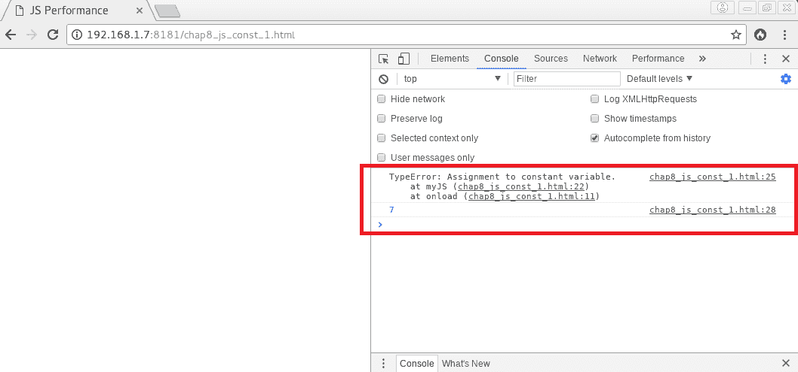

# 第八章：函数式 JavaScript

JavaScript 的未来将是函数式的。事实上，过去几年对语言所做的许多更改都使得在使用函数式编程技术时更容易、更高效的实现成为可能。

在本章中，我们将看到 JavaScript 如何越来越成为一种函数式语言，以及这种编程范式如何成为性能的一个向量。我们将学习如何用简化的函数版本替换过于复杂的代码，以及如何使用不可变性和尾调用优化将有助于使 JavaScript 在长期内更加高效。因此，我们将涵盖以下几点：

+   简化函数

+   函数式编程技术

+   更多即将推出的 JavaScript 功能

# 简化函数

传统上，计算机科学学生被告知保持他们的函数简单。经常说一个函数应该对应一个单一的动作。事实上，函数的圈复杂度越高，它就越难以重用、维护和测试。函数变得越来越纯粹的逻辑实体，没有真实世界中清晰可识别的动作根源，它就越难以理解和与其他函数结合使用。

# 函数式编程原则

**函数式编程**（**FP**）范式通过将计算设计视为基于数学函数和状态和数据的不可变性而进一步推动这种推理。FP 的指导原则是整个计算机程序应该是一个单一的、引用透明的表达式。在其核心，FP 的概念要求函数是纯的、引用透明的，并且没有副作用。当给定相同的输入时，函数是纯的，它总是返回相同的输出。当其函数表达式可以在计算机程序的任何地方与其相应的值互换时，它是引用透明的。当它不修改其范围之外的应用程序状态时，它是没有副作用的。因此，例如，修改在其范围之外声明的变量或向屏幕回显消息被认为是必须尽可能避免的函数副作用。

纯函数的一个例子如下：

```php
function myJS()
{
    function add(n1, n2)
    {
        let number1 = Number(n1);
        let number2 = Number(n2);

        return number1 + number2;
    }

}
```

下一个函数不是纯的，因为有两个副作用：

```php
function myJS()
{
    function add(n1, n2)
    {
        // 1\. Modifies the global scope
        number1 = Number(n1);
        number2 = Number(n2);

        // 2\. The alert function
        alert( number1 + number2 );
    }

}
```

引用透明函数可以在代码的任何地方替换为等于函数表达式计算值的常量：

```php
4 === addTwo(2);
```

例如，这个函数不是引用透明的：

```php
function myJS()
{
    function addRandom(n1)
    {
        let number1 = Number(n1);

        return number1 + Math.random();
    }

}
```

在最显著的 JavaScript 函数中，不是引用透明的并且产生副作用的有：`Date`、`Math.random`、`delete`、`Object.assign`、`Array.splice`、`Array.sort`和`RegExp.exec`。

保持函数简单和纯净有许多优点。最重要的是：

+   简化关键路径，开发人员在尝试维护或更新应用程序时减少认知负担

+   更容易测试函数

+   免费编译器优化，编译器可能决定在编译时用相应的常量值替换函数表达式，而不是每次计算函数

+   未来由于运行时优化而提高的性能

+   通过避免应用程序状态的可变性而实现安全的多线程（JavaScript 目前是单线程的，但谁知道未来会发生什么）

# 函数作为一等公民

函数作为一等公民是一个原则，它规定函数应该被视为与任何其他数据类型一样。当语言允许这种情况时，函数可以成为高阶函数，其中任何函数都可以作为参数接收，并且可以从任何其他函数返回计算值，就像任何其他数据类型一样。

当函数是纯的并且引用透明时，它们可以更容易地被用作一等公民函数。因此，更容易将函数组合在一起以动态产生其他函数。这就是所谓的函数组合。柯里化是一种动态生成新函数的方法，将其单个参数的评估转换为具有多个参数的另一个函数，并且部分应用是一种新动态生成的函数，其参数数量较少将修复另一个函数的参数数量。正如我们将在本章后面看到的，ES2020 正准备将这些概念引入 JavaScript 编程语言中。

# 处理副作用

如果需要避免所有形式的副作用，我们应该如何处理输入和输出、网络、用户输入和用户界面？根据 FP 原则，与现实世界的这些交互应该封装在特殊的数据结构中。即使包含的值在运行时仍然是未知的，这些特殊的数据结构使得可以将函数映射到一个或多个包装值（函子），将包装函数映射到一个或多个包装值（应用程序）或将返回其自身数据结构类型实例的包装函数映射到一个或多个包装值（单子）。这样，副作用就与纯函数分离开来。

# 不可变性

FP 的另一个重要原则是不可变性。修改状态和数据会产生圈复杂度，并使任何计算机程序容易出现错误和低效。事实上，所有变量实际上都应该是不可变的。变量从分配到内存的时刻直到释放的时刻都不应该改变其值，以避免改变应用程序的状态。

自 ES6 以来，现在可以使用`const`关键字来定义常量或不可变变量。以下是一个示例：

```php
function myJS()
{
    const number = 7;

    try {
        number = 9;
    } catch(err) {
```

```php
        // TypeError: invalid assignment to const 'number'
        console.log(err);
    }
  }
```

这个新增的功能现在可以防止通过赋值修改变量。这样，就可以在整个运行时期保护 JavaScript 应用程序的状态免受突变的影响。

在可能的情况下，开发人员应始终优先使用`const`而不是`let`或`var`。尝试修改使用`const`关键字声明的变量将导致以下错误（`chap8_js_const_1.html`）：

给常量变量赋值会导致'TypeError'

# 函数式编程技术

自 ES6 以来，JavaScript 已经更容易使用 FP 实现软件解决方案。许多引擎优化已经添加，使得根据 FP 原则编程 JavaScript 时可以获得更好的性能。映射、过滤、减少和尾调用优化是其中的一些技术。

# 映射

映射是一种高阶函数，它允许我们将回调映射到集合的每个元素。当将数组的所有元素从一组值转换为另一组值时，它特别有用。以下是一个简单的代码示例：

```php
function myJS()
{
    let array = [1, 2, 3];

    let arrayPlusTwo = array.map(current => current + 2);

    // arrayPlusTwo == [3, 4, 5]

}
```

这种技术使得在简单修改数组的值时尽可能避免使用结构循环成为可能。

# 过滤

过滤是一种高阶函数，它允许我们根据布尔谓词区分和保留集合中的某些元素。当根据特定条件从集合中移除某些元素时，过滤当然是非常有用的。以以下代码为例：

```php
function myJS()
{
    let array = [1, 2, 3];

    let arrayEvenNumbers = array.filter(current => current % 2 == 0);

    // arrayEvenNumbers == [2]

}
```

过滤是避免循环和嵌套条件以提取所需数据集的一种很好的方法。

# 减少

Reduce 是一个高阶函数，它允许我们根据组合函数将集合的元素合并为一个返回值。当处理累积或连接值时，这种技术非常有用。在下面的例子中，我们正在计算数组元素的总和：

```php
function myJS()
{
    let array = [1, 2, 3];

    let sum = array.reduce((cumul, current) => cumul + current, 0);

    // sum == 6;

}
```

我们将再看一种 FP 技术，即尾调用优化。

# 尾调用优化

为了更好地理解**尾调用优化**（**TCO**）是什么，我们需要定义它是什么，了解它是如何工作的，并学习如何确定一个函数是否被尾调用。

# 什么是尾调用优化？

尾调用或尾递归是一种函数式编程技术，其中一个函数在返回控制权给自己的调用者之前调用一个子例程函数作为其最终过程。如果一个函数递归地调用自身，则发生直接递归。如果一个函数调用另一个函数，而另一个函数又调用原始函数，则递归是相互的或间接的。

因此，例如，当一个函数尾调用自身时，它会一遍又一遍地将自己堆叠，直到满足某个条件为止，此时它一定会返回，从而有效地弹出整个调用堆栈。

优化尾调用包括在执行尾调用之前从调用堆栈中弹出当前函数，并将当前函数的调用者地址保留为尾调用的返回地址。因此，堆栈的内存占用保持较小，实际上完全避免了堆栈溢出。

# 尾调用优化的工作原理

让我们比较两个堆栈帧，一个没有尾调用优化，另一个有尾调用优化。首先让我们看一下以下代码：

```php
function a(x)
{
    y = x + 2;
    return b(y);
}

function b(y)
{
    z = y + 3;
    return z;
}

console.log(a(1)); // 6
```

在没有使用尾调用优化的情况下，分配给内存后，前面代码的三个堆栈帧将如下图所示：

典型的后进先出（LIFO）调用堆栈

一旦将值 6 分配给变量`z`，堆栈帧就准备好被弹出。在这种情况下，堆栈帧**2**仅保留在内存中，只是为了保留`console.log()`的地址。这就是尾调用优化可以产生差异的地方。如果在调用`b()`之前，堆栈帧**2**被从堆栈中弹出，同时保持原始调用者的返回地址不变，那么在运行时只会有一个函数被堆叠，堆栈空间将会减少。

无论函数被尾调用多少次，整个堆栈只会计算两个堆栈帧。因此，经过尾调用优化的堆栈看起来会像这样：

尾调用优化的调用堆栈

一些人声称，在某些 JavaScript 实现中实现尾调用优化会是一个坏主意，因为这样做会破坏应用程序的实际执行流程，使调试变得更加困难，并且一般会破坏遥测软件。在某些 JavaScript 实现中，这可能是真的，但绝对不是绝对的。从技术上讲，由于某些 JavaScript 实现中存在技术债务，实现尾调用优化可能会很困难，但绝对不需要为某些应该在任何语言中都是隐含的东西而要求一个语法标志，特别是在使用严格模式标志时。

话虽如此，并非所有浏览器和 JavaScript 项目都已经实现了这个 ES6 功能，但它只是时间问题，他们迟早都得这么做，开发人员应该为这一重大变化做好准备。事实上，从结构范式到函数范式的这一变化将使得使用函数而不是众所周知的循环结构来制作非常高效的循环成为可能。根据这些新原则进行编程的主要优势将是：

+   通过消耗更少的内存和花费更少的时间来完成大型循环，从而提高效率

+   减少圈复杂度和简化关键路径

+   代码行数减少，开发人员的认知负担减轻

+   封装和组织良好的代码

+   一般来说，更好地测试代码

截至撰写本文时，只有 Safari 11、iOS 11、Kinoma XS6 和 Duktape 2.2 完全支持尾调用优化。

让我们来看看两个代码示例（`chap8_js_performance_1.html`和`chap8_js_performance_2.html`），以比较传统的`for`循环与尾调用优化函数的性能。以下是第一个示例：

```php
function myJS()
{
    "use strict";

    function incrementArrayBy2(myArray, len = 1, index = 0)
    {
        myArray[index] = index;
        myArray[index] += 2;
        return (index === len - 1) ? myArray : incrementArrayBy2(myArray, len, index + 
                                                                     1); // tail call
    }

    let myArray = [];

    for(let i = 0; i < 100000000; i++) {
        myArray[i] = i;
        myArray[i] += 2;
    }

    console.log(myArray);
}
```

以下是第二个：

```php
function myJS()
{
    "use strict";

    function incrementArrayBy2(myArray, len = 1, index = 0)
    {
        myArray[index] = index;
        myArray[index] += 2;
        return (index === len - 1) ? myArray :    
       incrementArrayBy2(myArray, len, index +  
                                                                     1); // tail call
    }

    let myArray = [];

    myArray = incrementArrayBy2(myArray, 100000000);

    console.log(myArray);
}

```

如果我们对这两个脚本进行基准测试，我们会注意到它们之间没有太大的区别，除了使用尾调用的那个更容易进行单元测试，具有非常简单的关键路径，并且即使出于明显的原因而不是纯的，它仍然可以很容易地进行记忆化。

以下是第一个脚本的结果：

使用结构化'for'循环时的结果

第二个脚本的结果是：

使用经过尾调用优化的堆叠函数时的结果

现在，让我们通过一些代码示例更好地了解这个 ES6 功能，以便更好地识别尾调用的不同用法。

# 识别尾调用

如前所述，尾调用发生在子例程被调用为当前函数的最后一个过程时。这种情况有很多种。

如果您以以下方式使用三元运算符，则`one()`和`two()`函数都是尾调用：

```php
function myFunction()
{
    // Both one() and two() are in tail positions
    return (x === 1) ? one() : two();
}
```

以下代码示例不是尾调用，因为被调用者是从函数体内部调用的，可以用于进一步计算，而不仅仅是返回给调用者：

```php
function myFunction()
{
    // Not in a tail position
    one();
}
```

以下是另一个示例，其中一个被调用者不处于尾调用位置：

```php
function myFunction()
{
    // Only two() is in a tail position
    const a = () => (one() , two());
}
```

原因是在这种情况下，`one()`函数可以与其他计算结合在一起，而`two()`函数不能，其返回值将简单地分配给`a`常量。如果我们使用逻辑运算符而不是逗号，那么同样的情况也会发生。

让我们继续了解其他即将推出的 JavaScript 功能。

# 更多即将推出的 JavaScript 功能

许多其他功能将很快添加到 JavaScript 中，这将进一步推动语言朝着功能性和异步编程的方向发展。让我们来看看其中的一些。

# 异步函数

由于异步编程，当生成器用于此目的时，对 FP 的需求将会更加迫切，避免竞争条件将变得比现在更加重要。

确实，ES2017 引入了`async` / `await`函数。这些函数将允许我们轻松创建一个`event`循环，并在循环内部进行异步 I/O 调用，以获得非阻塞代码。这将有许多实际应用，包括在渲染完成后异步下载补充的 JavaScript 文件以加快网页加载时间的可能性。以下是使用这些类型函数的代码示例：

```php
async function createEntity(req, res) {
    try {
        const urlResponse = await fetch(req.body.url)
        const html = await urlResponse.text()
        const entity = await Entity.post({ // POST request })
        // More stuff here
    } catch (error) {
        req.flash('error', `An error occurred : ${error.message}`)
        res.redirect('/entity/new')
    }
}
```

# 异步生成器和 for-await-of 循环

ES2018 定义了异步生成器和`for-await-of`循环的规范。这些功能已经在大多数浏览器中可用，并且在 JavaScript 中进行异步编程时将非常有帮助。它们将大大简化在异步请求上进行迭代时创建队列和循环。此外，使用异步迭代器、可迭代对象和生成器与异步调用将通过使用 promises 变得非常容易。以下是使用这些新功能的简单代码示例：

```php
async function* readLines(path) {
    let file = await fileOpen(path);

    try {
        while (!file.EOF) {
            yield await file.readLine();
        }
```

```php
    } finally {
        await file.close();
    }
}
```

# 管道操作符

ES2020 提案正在制定中，其中包括更多 FP 概念，例如使用管道操作符进行简单的函数链接。因此，链接函数将变得更加简单。而不是做类似于这样的事情：

```php
const text = capitalize(myClean(myTrim(' hAhaHAhA ')));
```

我们只需要这样做：

```php
const text = ' hAhaHAhA '
|> myTrim
|> myClean
|> capitalize
```

# 部分应用

ES2020 提案中还有一个非常重要的 FP 技术：部分应用。如前所述，这种 FP 技术可以通过生成一个参数更少的新动态生成的函数，来固定函数的一些参数。以下是一个简单的代码示例：

```php
function add(num1, num2) {
    return num1 + num2;
}

function add1(num2) {
    return add(1, num2);
}
```

ES2020 提案建议，可以通过以下方式执行部分应用：

```php
const add = (x, y) => x + y
const add1 = add(?, 1)
```

当然，我们还可以提到许多其他 FP 技术，这些技术可能会出现在 ES2020 规范中，比如函数绑定、柯里化和模式匹配，但必须知道的是，JavaScript 越来越成为一种函数式语言，并且许多未来的引擎优化将自动增强任何执行的代码的整体性能，如果它是根据 FP 原则编写的。

有关函数式编程和函数式 JavaScript 的更多信息，请阅读 Packt Publishing 近年来出版的许多优秀书籍和视频。

# 总结

我们现在更好地理解了为什么 JavaScript 越来越成为一种函数式语言，以及这种编程范式如何成为性能的一个向量。我们了解了如何用简化的函数式版本替换过于复杂的代码，以及如何使用不可变性和尾调用优化来提高 JavaScript 的效率。我们还简要了解了 JavaScript 语言即将推出的功能。

在下一章中，我们将看一些项目，这些项目多年来一直与谷歌的更快网络计划一起进行，并且我们将看到如何结合这些技术以提高整体网络服务器性能。
