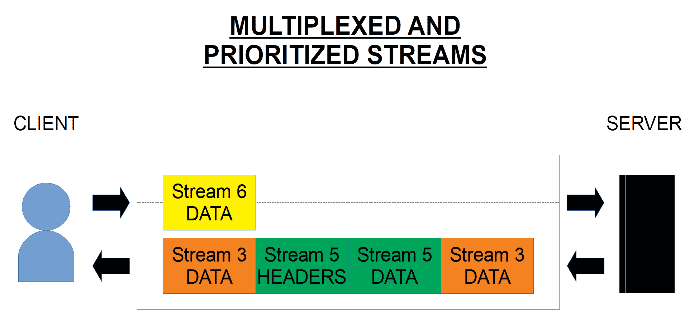
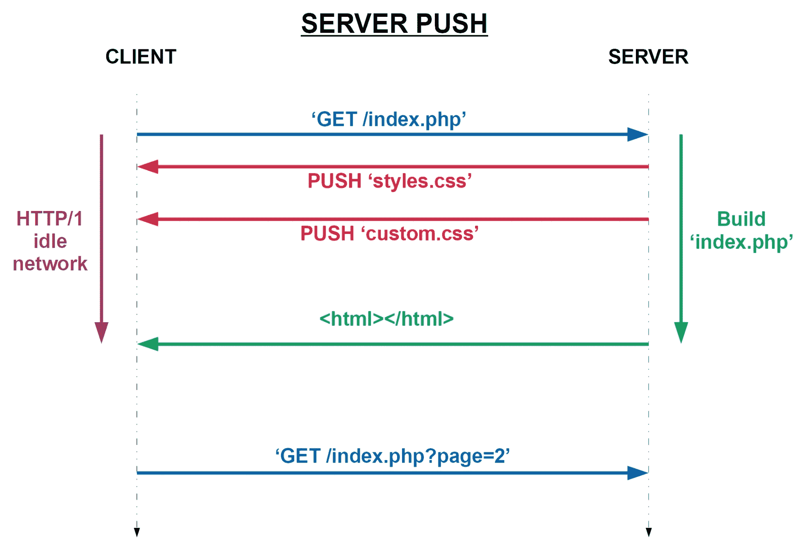
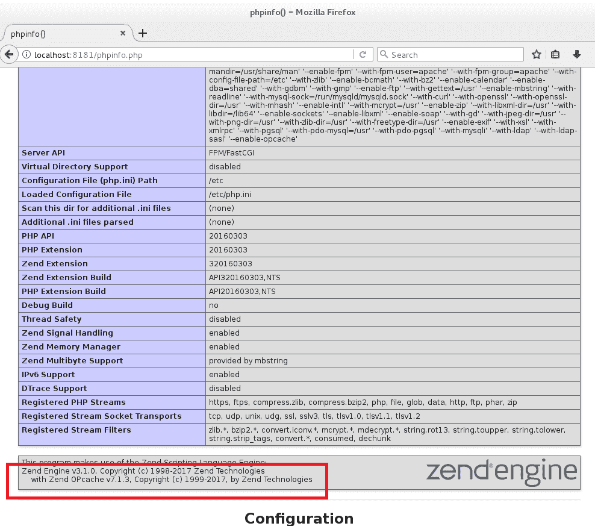
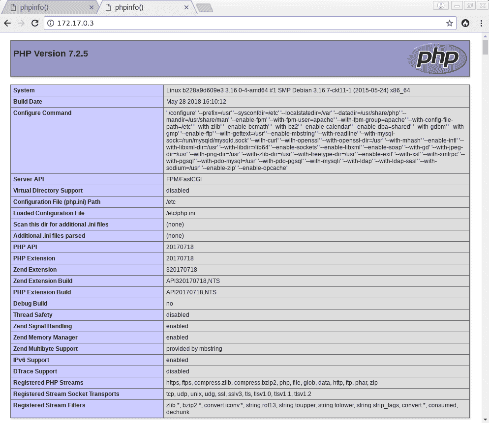
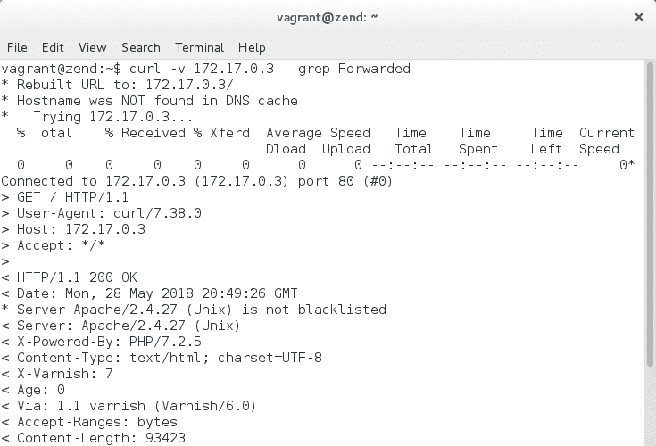
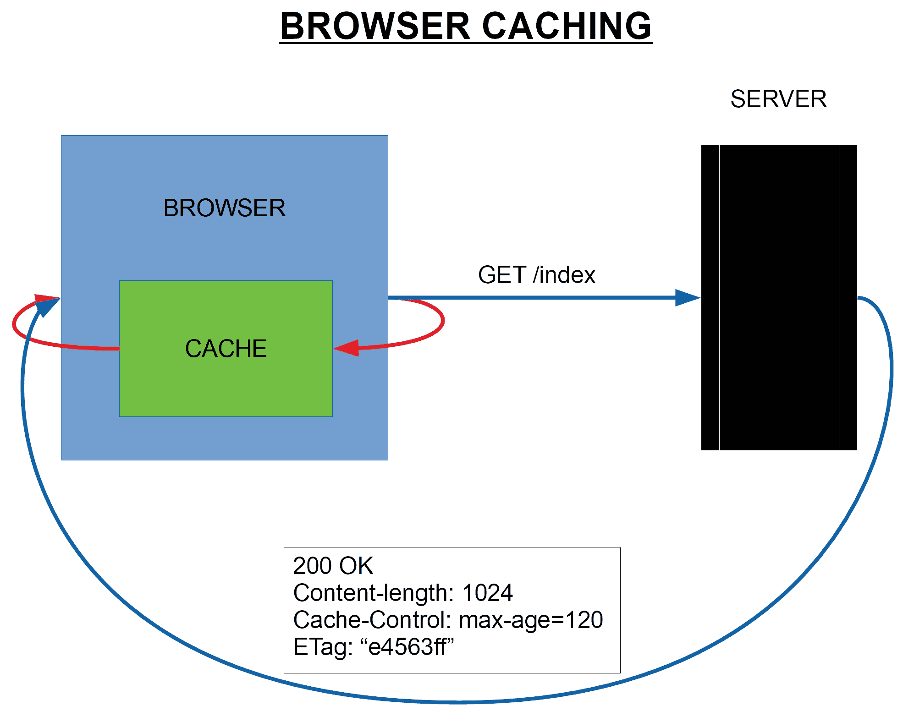
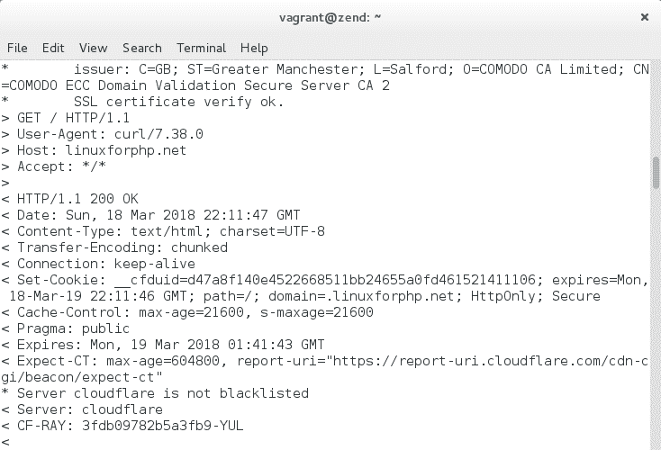
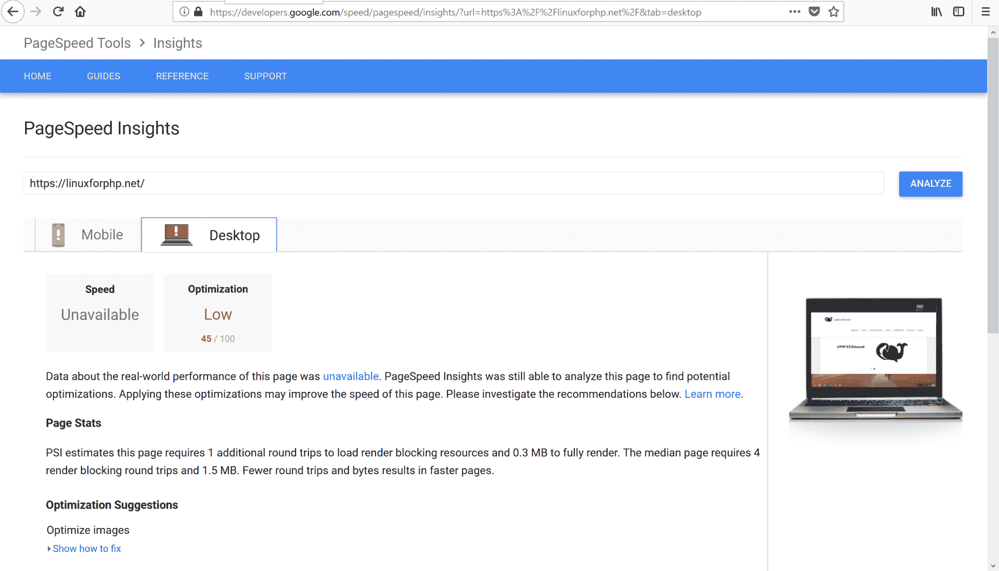
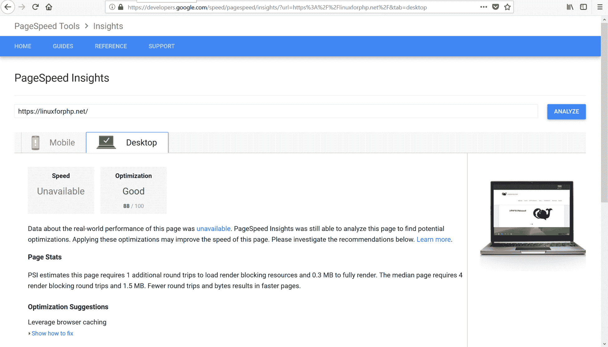

# 第九章：提升 Web 服务器性能

谷歌确定其更快 Web 计划的首要任务之一是更新老化的 Web 协议。全球范围内已经有许多项目正在进行，因为 Web 开发的新重点正在从为用户提供更多功能（即使这些功能很慢）转向提供与 Web 性能不相冲突的功能。谷歌的倡议有助于改变 Web 开发的优先事项，从而使现有项目得以光明，新项目得以创建。

在本章中，我们将介绍一些与谷歌新的 Web 倡议一起进行的项目。因此，我们将涵盖以下几点：

+   MOD_SPDY 和 HTTP/2

+   PHP-FPM 和 OPCache

+   ESI 和 Varnish Cache

+   客户端缓存

+   其他更快 Web 工具

# MOD_SPDY 和 HTTP/2

2009 年，谷歌宣布将寻找更新 HTTP 协议的方法，通过使用名为 SPDY（`SPeeDY`）的新会话协议。这个新的会话协议在底层 TLS 表示层上工作，并允许在应用层进行许多 HTTP 速度优化。使用 SPDY 就像激活 SSL 一样简单，在 Web 服务器上安装`mod_spdy`模块并激活它。为了从其功能中受益，不需要对网站进行任何修改。

此外，所有主要浏览器都支持它。SPDY 迅速成为更快 Web 的核心元素，并在 2012 年 11 月成为下一次重大 HTTP 协议修订的基础。然后，在 2015 年，它被弃用，改为使用新的 HTTP/2 协议。SPDY 引入的最重要的优化措施，并将其纳入新的 HTTP 协议规范的是多路复用和优先级流、服务器推送和头部压缩。在我们深入了解 HTTP/2 协议的一些具体内容之前，让我们更详细地看看这些优化措施中的每一个。

# 多路复用和优先级流

SPDY 的多路复用流功能允许将多个请求映射到单个连接上的多个流。这些流是双向的，可以由客户端或服务器（服务器推送功能）发起。在单个连接上打开多个流可以避免在每个客户端/服务器交换时建立新连接的开销，特别是在并行下载多个资源以完成单个页面的渲染时。因此，这个第一个功能使得在使用 HTTP/1 协议时摆脱了可能的连接数量限制：

多路复用和优先级流的工作原理

此外，SPDY 的流是有优先级的。这个额外的功能允许客户端确定哪些资源应该首先发送到网络上。因此，SPDY 避免了在 HTTP/1 协议中进行服务器管线化（即`KeepAlive`指令）时出现的**先进先出**（FIFO）问题。

# 服务器推送

正如已经提到的，SPDY 的新流特性使得服务器能够在不响应客户端请求的情况下向客户端推送数据。这使得通信变得双向，并允许 Web 服务器预测客户端的需求。事实上，甚至在客户端解析 HTML 并确定渲染页面所需的所有文件之前，Web 服务器就可以将文件推送到客户端，从而减少客户端发送请求以获取所有必要资源的次数：

“服务器推送”功能的工作原理

通过了解许多研究显示，平均而言，大多数页面需要 70 到 100 个请求，涉及 20 到 30 个域名，才能完成其渲染，我们可以很容易地看出这个功能如何使 Web 变得更简洁，并显著减少网络延迟。

# 头部压缩

SPDY 的第三个重要特性是使用`gzip`进行标头压缩。通过压缩通常较多的 HTTP 标头，并将其平均减少 85%的原始大小，SPDY 可以在网络上将大多数 HTTP 事务的加载时间缩短整整一秒。尽管使用`gzip`动态压缩标头被发现是不安全的，但标头压缩的概念仍然存在，并且由于对整体网络性能的巨大益处，它在 HTTP/2 协议中得到了重新实现。

# HTTP/2

作为 RFC 7540 [1]于 2015 年 5 月发布的 HTTP/2 是 HTTP 协议的最新主要修订版。它主要基于 Google 的 SPDY 协议，并提供了一个新的二进制帧层，与 HTTP/1 不兼容。正如之前提到的，它的大部分功能是通过 SPDY 项目开发的。SPDY 和 HTTP/2 之间最显著的区别是新协议压缩其标头的方式。而 SPDY 依赖于使用`gzip`动态压缩标头，HTTP/2 协议使用了一种名为`HPACK`的新方法，该方法利用了固定的 Huffman 编码算法。为了避免 SPDY 发现的数据压缩导致可能泄露私人数据的问题，需要这种新方法。

尽管新协议将大多数网页的加载时间缩短了一倍，许多批评者对此表示失望，指出谷歌对更新 HTTP 协议项目施加的不切实际的最后期限使得新协议版本不可能基于其他任何东西而不是其 SPDY 项目，并因此错失了进一步改进新 HTTP 协议的许多机会。*Poul-Henning Kamp*，*Varnish Cache*的开发者，甚至表示 HTTP/2 是不一致的，过于复杂且不必要。此外，他指出它违反了协议分层的原则，通过复制应该在传输层正常进行的流量控制 [2]。最后，在这个新协议中发现了许多安全漏洞，其中最显著的是由网络安全公司 Imperva 在 2016 年 Black Hat USA 会议上披露的那些 [3]。这些漏洞包括慢速读取攻击、依赖循环攻击、流复用滥用和 HPACK 炸弹。基本上，所有这些攻击向量都可以用来通过提交**拒绝服务**（**DoS**）攻击或通过饱和其内存来使服务器下线。

尽管存在许多与加密相关的问题，但所有主要的网络服务器和浏览器都已经采用并提供了对其的支持。大多数情况下，如果您的网络服务器已经配置并编译了 HTTP/2 标志，您只需要在服务器的`/etc/httpd/httpd.conf`文件中激活模块即可开始使用它。在 Apache Web 服务器的情况下，您还必须在服务器的配置文件中添加`Protocols`指令。请注意，在服务器上激活 HTTP/2 协议将对资源消耗产生重大影响。例如，在 Apache Web 服务器上启用此功能将导致创建许多线程，因为服务器将通过创建专用工作程序来处理和流式传输结果以响应客户端的 HTTP/2 请求。以下是如何在 Apache 的`httpd.conf`和`httpd-ssl.conf`配置文件中启用 HTTP/2 模块的示例（假设`mod_ssl`模块也已启用）：

```php
# File: /etc/httpd/httpd.conf
[...]
LoadModule ssl_module /usr/lib/httpd/modules/mod_ssl.so
LoadModule http2_module /usr/lib/httpd/modules/mod_http2.so
[...]

# File: /etc/httpd/extra/httpd-ssl.conf
[...]
<VirtualHost _default_:443>

Protocols h2 http/1.1

#   General setup for the virtual host
DocumentRoot "/srv/www"
[...]
```

有关 HTTP/2 协议的更多信息，请访问以下网址：

+   [`developers.google.com/web/fundamentals/performance/http2/`](https://developers.google.com/web/fundamentals/performance/http2/)

要了解 Apache 对相同协议的实现更多信息，请访问以下链接：

+   [`httpd.apache.org/docs/2.4/howto/http2.html`](https://httpd.apache.org/docs/2.4/howto/http2.html)

+   [`httpd.apache.org/docs/2.4/mod/mod_http2.html`](https://httpd.apache.org/docs/2.4/mod/mod_http2.html)

最后，要了解 NGINX 提供的实现更多信息，请参阅他们的文档：

+   [`nginx.org/en/docs/http/ngx_http_v2_module.html`](http://nginx.org/en/docs/http/ngx_http_v2_module.html)

# PHP-FPM 和 OPCache

谈到更快的 Web 时，考虑如何确保 PHP 二进制本身在 Web 服务器上以优化的方式运行是非常重要的，考虑到 PHP 安装在全球 70%至 80%的服务器上。

# PHP-FPM

自 PHP 5.3 以来，PHP 现在包括一个 FastCGI 进程管理器，允许您在 Web 服务器上运行更安全、更快速和更可靠的 PHP 代码。在 PHP-FPM 之前，在 Web 服务器上运行 PHP 代码的默认方式通常是通过`mod_php`模块。PHP-FPM 如此有趣的原因在于它可以根据传入请求的数量自适应，并在工作池中生成新进程，以满足不断增长的需求。此外，以这种方式运行 PHP 允许更好的脚本终止、更优雅的服务器重启、更高级的错误报告和服务器日志记录，以及通过守护进程化 PHP 二进制对每个 PHP 工作池进行 PHP 环境的精细调整。

许多高流量网站报告称，他们在将生产服务器上的 `mod_php` 更改为 `PHP-FPM` 后，看到了高达 300%的速度提升。当然，正如 Ilia Alshanetsky 在他的一个演示中提到的那样[4]，在提供静态内容时，像 lighttpd、thttpd、Tux 或 Boa 这样的许多其他服务器，可能比 Apache 快 400%。但是，当涉及到动态内容时，没有任何服务器可以比 Apache 或 NGINX 更快，特别是当它们与 PHP-FPM 结合使用时。

在服务器上启用 PHP-FPM 就像在编译时使用 `--enable-fpm` 开关配置 PHP 一样简单。从那里开始，问题就是确定如何运行 PHP-FPM，这取决于性能和安全问题。例如，如果您在生产环境中，您可能决定在许多服务器上运行许多工作池的 PHP-FPM，以分发工作负载。此外，出于性能和安全原因，您可能更喜欢在服务器上通过 UNIX 套接字而不是网络环回(`127.0.0.1`)运行 PHP-FPM。事实上，在任何情况下，UNIX 套接字都更快，并且将提供更好的安全性，以防止本地网络攻击者，可能始终尝试使用域授权通过强制适当的访问控制来破坏环回的套接字监听器以确保连接机密性。

# Zend OPcache

自 PHP 5.5 以来，当在编译时向配置脚本添加 `--enable-opcache` 开关时，opcode 缓存现在可以在 PHP 的核心功能中使用。

一般来说，Zend OPcache 将使任何脚本的运行速度提高 8%至 80%。脚本的墙时间由 PHP 二进制引起的时间越长，OPcache 的差异就越大。但是，如果脚本的 PHP 代码非常基本，或者如果 PHP 由于 I/O 引起的延迟而减慢，例如对文件的流或对数据库的连接，OPcache 只会轻微提高脚本性能。

在所有情况下，Zend OPcache 将优化 PHP 脚本性能，并应默认在所有生产服务器上启用。

让我们看看如何配置运行 PHP 7.1.16 (NTS) 的 Linux 中包含的 PHP-FPM 服务器，以使用 UNIX 套接字而不是网络环回来建立 Apache 和 PHP 之间的连接。此外，让我们配置 PHP-FPM 以使用 Zend OPcache。

请确保您的容器仍在运行，并在其 CLI 上输入以下命令：

```php
# rm /srv/www
# ln -s /srv/fasterweb/chapter_9 /srv/www
# cd /srv/www
# cat >>/etc/php.ini << EOF 
> [OpCache] 
> zend_extension = $( php -i | grep extensions | awk '{print $3}' )/opcache.so 
> EOF 
# sed -i 's/;opcache.enable=1/opcache.enable=1/' /etc/php.ini 
# sed -i 's/Proxy "fcgi://127.0.0.1:9000"/Proxy "unix:/run/php-fpm.sock|fcgi://localhost/"/' /etc/httpd/httpd.conf 
# sed -i 's/# SetHandler "proxy:unix:/SetHandler "proxy:unix:/' /etc/httpd/httpd.conf 
# sed -i 's/SetHandler "proxy:fcgi:/# SetHandler "proxy:fcgi:/' /etc/httpd/httpd.conf 
# sed -i 's/listen = 127.0.0.1:9000/; listen = 127.0.0.1:9000nlisten = /run/php-fpm.sock/' /etc/php-fpm.d/www.conf 
# /etc/init.d/php-fpm restart 
# chown apache:apache /run/php-fpm.sock 
# /etc/init.d/httpd restart 
```

现在，您可以使用*vi*编辑器查看修改后的`php.ini`文件，以确保以前的设置不再被注释掉，并且新的`[OPcache]`部分已添加到文件中。然后，在您喜欢的浏览器中，当访问`http://localhost:8181/phpinfo.php`时，您应该会看到以下屏幕：

确认 Zend Opcache 已启用并正在运行

如果您看到上一个屏幕，那么您已成功将*Apache*服务器通过 UNIX 套接字连接到 PHP-FPM，并启用了*Zend OPcache*。

如果您希望在*Linux for PHP*基础镜像（`asclinux/linuxforphp-8.1:src`）中使用 FPM 和*OPCache*配置开关从头开始编译 PHP，请在新的终端窗口中输入以下命令：

```php
# docker run --rm -it -p 8383:80 asclinux/linuxforphp-8.1:src /bin/bash -c "cd ; wget -O tmp http://bit.ly/2jheBrr ; /bin/bash ./tmp 7.2.5 nts ; echo '<?php phpinfo();' > /srv/www/index.php ; /bin/bash"
```

如果您希望手动完成相同的操作，请访问*Linux for PHP*网站以获取进一步的说明（[`linuxforphp.net/cookbook/production`](https://linuxforphp.net/cookbook/production)）。

# ESI 和 Varnish 缓存

另一种更快的 Web 技术是**边缘包含**（**ESI**）标记语言和 HTTP 缓存服务器。

# 边缘包含（ESI）

最初作为**万维网联盟**（**W3C**）于 2001 年批准的规范，ESI 被认为是通过将边缘计算应用于 Web 基础设施扩展的一种方式。边缘计算是一种通过在数据源附近进行数据处理来优化云计算的方法，而不是将所有数据处理集中在数据中心。在 ESI 的情况下，想法是将 Web 页面内容分散到网络的逻辑极端，以避免每次都将所有内容请求发送到 Web 服务器。

规范要求新的 HTML 标记，这些标记将允许 HTTP 缓存服务器确定页面的某些部分是否需要从原始 Web 服务器获取，或者这些部分的缓存版本是否可以发送回客户端，而无需查询服务器。可以将 ESI 视为一种 HTML 包含功能，用于从不同的外部来源组装网页的动态内容。

许多 HTTP 缓存服务器开始使用新的标记语言。一些**内容交付网络**（**CDN**），如 Akamai，以及许多 HTTP 代理服务器，如 Varnish、Squid 和 Mongrel ESI，多年来开始实施该规范，尽管大多数并未实施整个规范。此外，一些服务器，如 Akamai，添加了原始规范中没有的其他功能。

此外，重要的 PHP 框架，如*Symfony*，开始在其核心配置中添加 ESI 功能，从而使 PHP 开发人员在开发应用程序时立即开始考虑 ESI。

此外，浏览器开始鼓励 ESI 的使用，通过在 Web 上保留所有获取的文件的本地缓存，并在其他网站请求相同文件时重复使用它们。因此，在您的网站上使用 CDN 托管的 JavaScript 文件可以减少客户端请求您的 Web 服务器的次数，只需一次获取相同的文件。

使用`esi:include`标记在 HTML 中开始缓存网页的部分非常容易。例如，您可以这样使用：

```php
<!DOCTYPE html>
<html>
    <body>
        ... content ...

        <!-- Cache part of the page here -->
        <esi:include src="http://..." />

        ... content continued ...
    </body>
</html>
```

另一个例子是使用 PHP 和*Symfony*框架自动生成 ESI 包含标记。这可以通过让*Symfony*信任*Varnish Cache*服务器，在 YAML 配置文件中启用 ESI，在其控制器方法中设置网页的共享最大年龄限制，并在相应的模板中添加所需的渲染辅助方法来轻松实现。让我们一步一步地进行这些步骤。

首先让*Symfony*信任*Varnish Cache*服务器。在*Symfony*的最新版本中，您必须调用`Request`类的静态`setTrustedProxies()`方法。在*Symfony*安装的`public/index.php`文件中，添加以下行：

```php
# public/index.php

[...]

$request = Request::createFromGlobals();

// Have Symfony trust your reverse proxy
Request::setTrustedProxies(

    // the IP address (or range) of your proxy
    ['192.0.0.1', '10.0.0.0/8'],

    // Trust the "Forwarded" header
    Request::HEADER_FORWARDED

    // or, trust *all* "X-Forwarded-*" headers
    // Request::HEADER_X_FORWARDED_ALL

    // or, trust headers when using AWS ELB
    // Request::HEADER_X_FORWARDED_AWS_ELB

); }

[...]
```

根据您使用的*Symfony*版本和*Varnish*版本，您可能需要遵循不同的步骤才能完成此操作。请参阅*Symfony*文档的以下页面以完成此第一步：[`symfony.com/doc/current/http_cache/varnish.html`](https://symfony.com/doc/current/http_cache/varnish.html)。

然后，将以下行添加到您的*Symfony*配置文件中：

```php
# config/packages/framework.yaml

framework:
    # ...
    esi: { enabled: true }
    fragments: { path: /_fragment }
```

完成后，修改一些控制器如下：

```php
# src/Controller/SomeController.php

namespace App\Controller;

...

class SomeController extends Controller
{
    public function indexAction()
    {
        $response = $this->render('static/index.html.twig');

        $response->setSharedMaxAge(600);

        return $response;
    }
}
```

第二个应该修改如下：

```php
# src/Controller/OtherController.php

namespace App\Controller;

...

class OtherController extends Controller
{
    public function recentAction($maxPerPage)
    {
        ...

        $response->setSharedMaxAge(30);

        return $response;
    }
}
```

最后，在您的 Twig 模板中执行以下修改：

```php
{# templates/static/index.html.twig #}

{{ render_esi(controller('App\Controller\OtherController::recent', { 'maxPerPage': 5 })) }}
```

现在，您应该能够在加载*Symfony*应用程序的页面时看到 ESI 的效果。

为了更好地理解 ESI 的内部工作原理，让我们尝试安装和运行部分实现 ESI 规范的 HTTP 反向代理服务器。

# Varnish Cache

部分实现 ESI 的 HTTP 反向代理服务器之一是*Varnish Cache*。这个 HTTP 缓存服务器最初是由其创始人*Poul-Henning Kamp*、*Anders Berg*和*Dag-Erling Smørgrav*构思的，作为* Squid *的一个非常需要的[5]替代品，* Squid *是一个著名的 HTTP 转发代理服务器（客户端代理）。*Squid*可以作为反向代理（服务器代理）工作，但很难设置它以这种方式工作。

导致创建*Varnish Cache*的原始会议于 2006 年 2 月在奥斯陆举行。该项目背后的基本概念是找到一种快速操纵从通过网络流量获取的字节的方法，以及确定何时何地以及何时缓存这些字节。多年后，*Varnish Cache*已成为 Web 上最重要的 HTTP 缓存服务器之一，几乎有三百万个网站在生产中使用它[6]。

为了更好地理解*Varnish Cache*的工作原理，让我们花点时间在 Linux for the PHP 基础容器中安装它。

在新的终端窗口中，请输入以下 Docker 命令：

```php
# docker run -it -p 6082:6082 -p 8484:80 asclinux/linuxforphp-8.1:src /bin/bash 
```

然后，输入以下命令：

```php
# pip install --upgrade pip
# pip install docutils sphinx
```

您现在应该在 CLI 上看到以下消息：

！[](assets/b7dd6cc4-a249-4d3e-aa18-52ff033a7293.png)确认所请求的 Python 模块已安装

然后，输入以下命令：

```php
# cd /tmp
# wget https://github.com/varnishcache/varnish-cache/archive/varnish-6.0.0.tar.gz
```

安装完成后，您应该看到类似于这样的屏幕：

！[](assets/93630a61-7072-4df1-865e-0fd84744a58c.png)下载包含 Varnish Cache 源代码的存档已完成

最后，请通过以下命令完成安装解压缩、配置和安装*Varnish Cache*：

```php
# tar -xvf varnish-6.0.0.tar.gz
# cd varnish-cache-varnish-6.0.0/
# sh autogen.sh
# sh configure
# make
# make install
# varnishd -a 0.0.0.0:80 -T 0.0.0.0:6082 -b [IP_ADDRESS_OR_DOMAIN_NAME_OF_WEB_SERVER]:80
```

完成后，您应该收到以下消息：

！[](assets/3a80a169-63f6-4e67-80d5-b349edbecf52.png)Varnish Cache 守护程序现在正在运行并等待连接

正如我们在本书的第二章“持续分析和监控”中提到的，当我们通过*Docker*容器安装*TICK*堆栈时，您可以通过发出此命令来获取两个容器（运行*Apache*服务器和运行*Varnish*服务器的新容器）的 IP 地址：

```php
# docker network inspect bridge 
```

获得结果后，您可以将前一个命令中的[IP_ADDRESS_OR_DOMAIN_NAME_OF_WEB_SERVER]占位符替换为运行*Apache*（*Linux for PHP*容器）的容器的 IP 地址。在我的情况下，*Apache* Web 服务器的 IP 地址是`172.17.0.2`，*Varnish Cache*服务器的 IP 地址是`172.17.0.3`。因此，命令将是：

```php
# varnishd -a 0.0.0.0:80 -T 0.0.0.0:6082 -b 172.17.0.2:80 
```

一旦启动，您可以将浏览器指向*Varnish Cache*服务器的 IP 地址，您应该会得到*Apache* Web 服务器的内容。在我的情况下，当我将浏览器指向`172.17.0.3`时，我得到了预期的结果：

Varnish 正在缓存并返回从 Apache 服务器获取的响应

我们可以通过在新的终端窗口中发出以下`curl`命令并将结果传输到`grep`来确认*Varnish Cache*服务器是否正在使用我们的*Apache* Web 服务器作为其后端，以查看请求和响应头：

```php
# curl -v 172.17.0.3 | grep Forwarded 
```

结果应该类似于以下截图：

Varnish Cache 头部被添加到 Apache 头部中

正如我们所看到的，头部显示*Apache*服务器正在通过*Varnish Cache*服务器响应。

因此，通过正确的 DNS 配置，将所有的网络流量重定向到*Varnish Cache*服务器，并将 Web 服务器仅用作其后端成为可能。

这个例子向我们展示了配置*Varnish Cache*服务器是多么容易，以及开始使用它并立即从中受益以快速提升 Web 服务器性能是多么简单。

# 客户端缓存

让我们继续介绍另一种更快的 Web 技术，即客户端缓存。这种形式的 HTTP 缓存专注于减少呈现页面所需的请求次数，以尽量避免网络延迟。事实上，大型响应通常需要在网络上进行多次往返。HTTP 客户端缓存试图最小化这些请求的数量，以完成页面的呈现。如今，所有主要浏览器都支持这些技术，并且在您的网站上启用这些技术就像发送一些额外的头部或使用已经在**内容交付网络**（**CDN**）上可用的库文件一样简单。让我们看看这两种技术：浏览器缓存头部和 CDN。

# 浏览器缓存

浏览器缓存的基本思想是，如果在一定时间内某些文件完全相同，就不必获取响应中包含的所有文件。它的工作方式是通过服务器发送给浏览器的头部，以指示浏览器在一定时间内避免获取某些页面或文件。因此，浏览器将显示保存在其缓存中的内容，而不是在一定时间内通过网络获取资源，或者直到资源发生变化。

因此，浏览器缓存依赖于缓存控制评估（过期模型）和响应验证（验证模型）。缓存控制评估被定义为一组指令，它们告知浏览器谁可以缓存响应，在什么情况下以及多长时间。响应验证依赖于哈希令牌，以确定响应的内容是否已更改。它还使浏览器能够避免再次获取结果，即使缓存控制指示缓存的内容已过期。实际上，收到来自服务器的响应，指示内容未被修改，基于发送的令牌在服务器上未更改的事实，浏览器只需更新缓存控制并重置到期前的时间延迟。

这是通过使用某些响应头部来实现的。这些是**Cache-Control**和**ETag**头部。以下是在响应中接收到的这些头部的示例：

浏览器缓存的工作原理

在这个例子中，Cache-Control 指示**最大年龄**为**120**秒，并设置了值为**"e4563ff"**的**ETag**。有了这两个头部，浏览器就能够充分管理其缓存。因此，启用浏览器缓存就像将这些响应头部添加到 Web 服务器返回的响应中一样简单。对于*Apache*来说，只需确保 FileETag 指令已添加到服务器的配置文件中即可。

在 PHP 中，也可以直接使用*Symfony*框架设置 Cache-Control 和 Expires 头。具体来说，*Symfony*的响应对象允许您使用其`setCache()`方法设置所有 Cache-Control 头。以下是使用此方法的示例：

```php
# src/Controller/SomeController.php

...

class SomeController extends Controller
{
    public function indexAction()
    {
        $response = $this->render('index.html.twig');

        $response->setCache(array(
            'etag'          => $etag,
            'last_modified' => $date,
            'max_age'       => 10,
            's_maxage'      => 10,
            'public'        => true,
         // 'private'       => true,
        ));

        return $response;
    }
}
```

看到了开始使用浏览器 HTTP 缓存是多么容易和简单，让我们花点时间来看看当与 HTTP 反向代理服务器技术结合时，HTTP 缓存还有其他好处。

# 内容传送网络（CDN）

内容传送网络是分布式代理服务器网络，允许常见或流行的网页资源高可用和高性能分发。这些资源可以是文本、图像和脚本等网页对象，包括 CSS 和 JavaScript 库，可下载的对象，如文件和软件，以及实时流或点播流媒体。CDN 因此可以被用作一种互联网公共缓存。通过使用 CDN 托管所有库文件，您将浏览器 HTTP 缓存与 HTTP 反向代理缓存结合在一起。这意味着如果另一个网站或网页应用程序使用与您相同的库文件，您的用户浏览器将使用其缓存版本的库文件或提交一个请求到 CDN 而不是您的网页服务器来刷新文件。这不仅通过减少全球渲染相同内容所需的请求数量来减少网络延迟，还通过将刷新过期浏览器缓存的责任委托给 CDN 的反向代理缓存，从您的网页服务器中减轻了一部分工作负载。

这个更快的网络解决方案非常容易实现。通常只需要通过修改 DNS 配置将网页流量重定向到 CDN。例如，*Cloudflare* ([`www.cloudflare.com/`](https://www.cloudflare.com/)) 不需要对您的网页服务器配置进行任何更改就可以开始使用其 HTTP 反向代理缓存。一旦您在*Cloudflare*界面中注册了原始域名和您的网页服务器的 IP 地址，您只需要通过将域名指向*Cloudflare*服务器来修改您的 DNS 设置，就可以立即开始使用它。让我们使用 cURL 来查询使用*Cloudflare*的[`linuxforphp.net/`](https://linuxforphp.net/)网站：

```php
# curl -v https://linuxforphp.net 
```

查询网站应该产生以下结果，确认它现在只能通过*Cloudflare*访问：

确认 linuxforphp.net 网站可以通过 Cloudflare 访问

正如我们所看到的，*Cloudflare*确实已启用，并已将 Cache-Control 和 Expires 添加到响应头中。

# 其他更快的网络工具

还有许多其他更快的网络工具可以帮助您优化您的网页应用程序和网站的性能。在这些众多工具中，有一些是谷歌在其开发者更快的网络网站上建议的（[`developers.google.com/speed/`](https://developers.google.com/speed/)）。其中一个工具将帮助您进一步分析网页应用程序的性能问题，那就是*PageSpeed Insights*。

这个工具可以快速识别您的网页应用可能的性能优化，基于您提交的 URL。为了进一步分析在*Linux for PHP*网站上使用*Cloudflare*的效果，让我们把 URL 提交到*PageSpeed Insights*工具。

以下是在使用*Cloudflare*之前的初始结果：

在不使用 Cloudflare 时对 linuxforphp.net 网站性能分析的结果

接下来是添加*Cloudflare*反向代理服务器后的结果：

使用 Cloudflare 时对 linuxforphp.net 网站性能分析的结果

我们不仅可以看到网站的总体性能要好得多，而且*PageSpeed Insights*还提出了关于如何进一步优化 Web 应用程序的建议。

在切换到*Cloudflare*之前，该工具的初始建议如下：

建议在不使用 Cloudflare 时优化 linuxforphp.net 网站的性能

然后，在切换到*Cloudflare*之后：

建议在使用 Cloudflare 时优化 linuxforphp.net 网站的性能

正如我们所看到的，优化建议的列表要短得多，但如果我们利用浏览器缓存特定的图像文件，消除一些阻塞渲染的 JavaScript 和 CSS，减小图像大小，并尝试减少服务器响应时间，我们肯定会得到一个完美的分数！

# 总结

在这一章中，我们涵盖了一些与*Google*的新倡议“更快的网络”相关的项目。我们已经了解了 HTTP/2 协议的内容以及 SPDY 项目是如何实现的，PHP-FPM 和 Zend OPCache 如何帮助您提高 PHP 脚本的性能，如何通过设置 Varnish Cache 服务器来使用 ESI 技术，如何使用客户端缓存，以及其他更快的网络工具在优化 Web 服务器性能时如何帮助您。

在下一章中，我们将看到即使一切似乎已经完全优化，我们仍然可以超越性能。

# 参考资料

[1] [`tools.ietf.org/html/rfc7540`](https://tools.ietf.org/html/rfc7540)

[2] [`queue.acm.org/detail.cfm?id=2716278`](https://queue.acm.org/detail.cfm?id=2716278)

[3] [`www.imperva.com/docs/Imperva_HII_HTTP2.pdf`](https://www.imperva.com/docs/Imperva_HII_HTTP2.pdf)

[4] [`ilia.ws/files/zend_performance.pdf`](https://ilia.ws/files/zend_performance.pdf)

[5][ https://varnish-cache.org/docs/trunk/phk/firstdesign.html](https://varnish-cache.org/docs/trunk/phk/firstdesign.html)

[6][ https://trends.builtwith.com/web-server](https://trends.builtwith.com/web-server)，2018 年 3 月。
