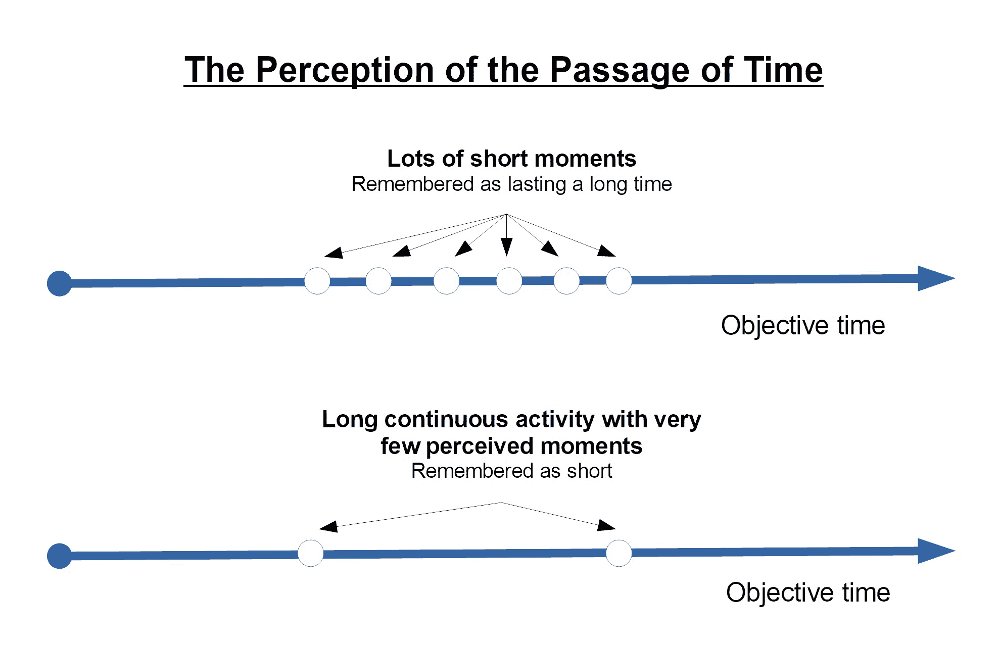
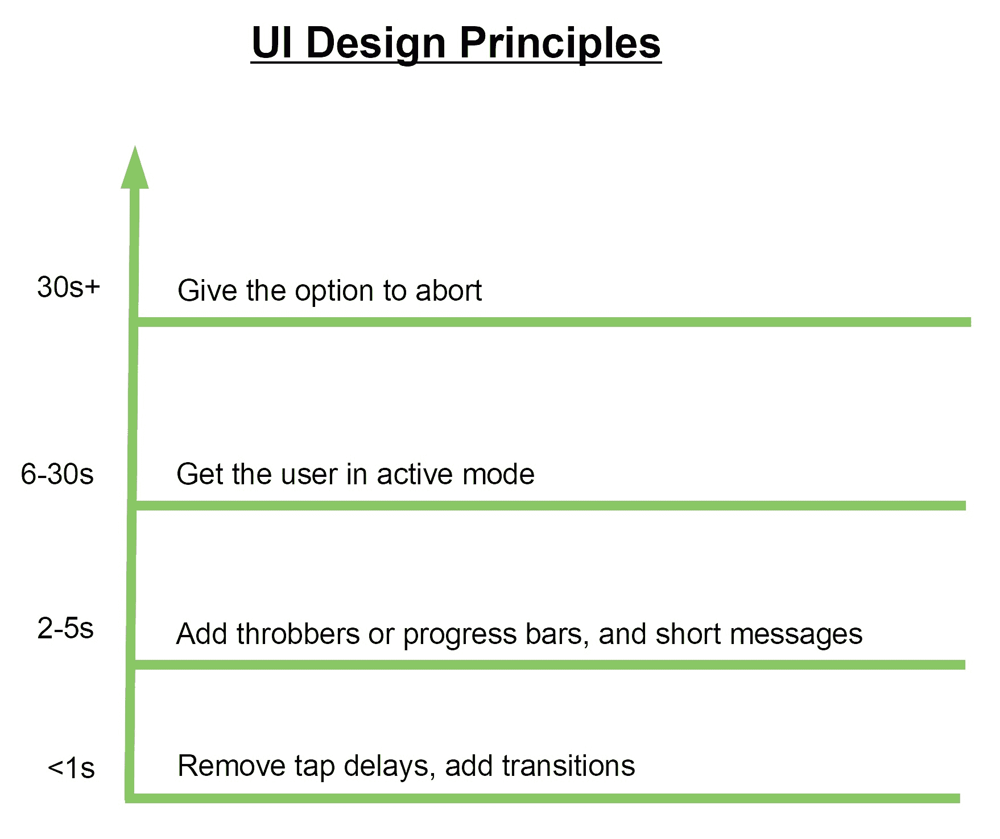
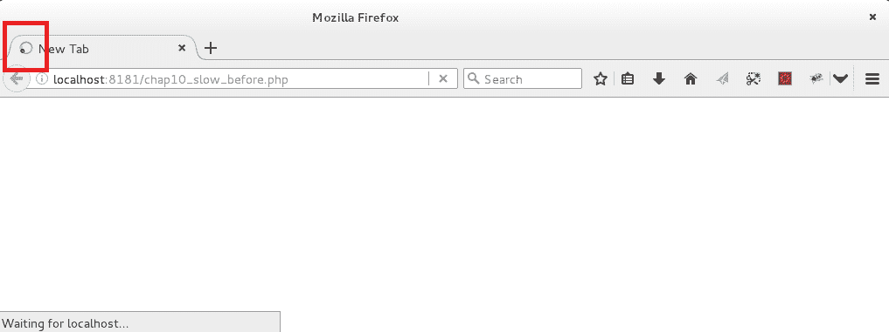
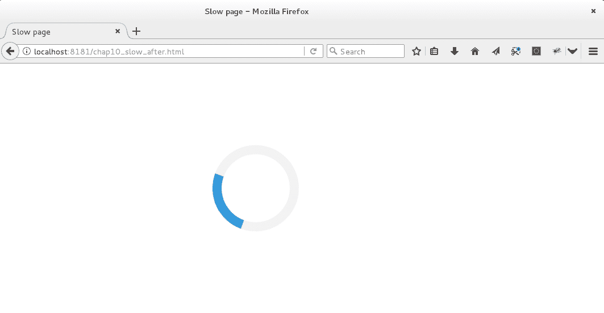
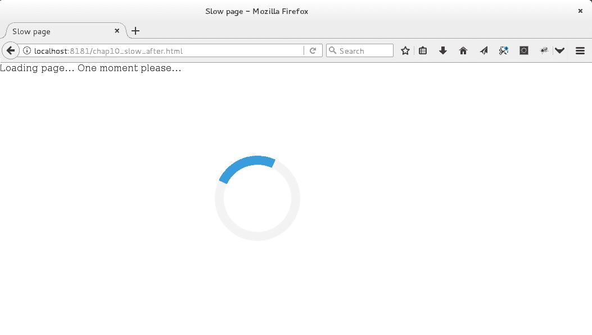
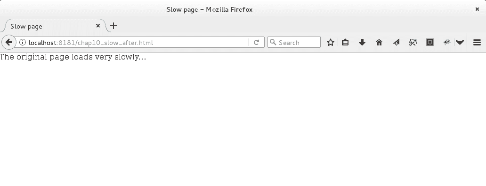
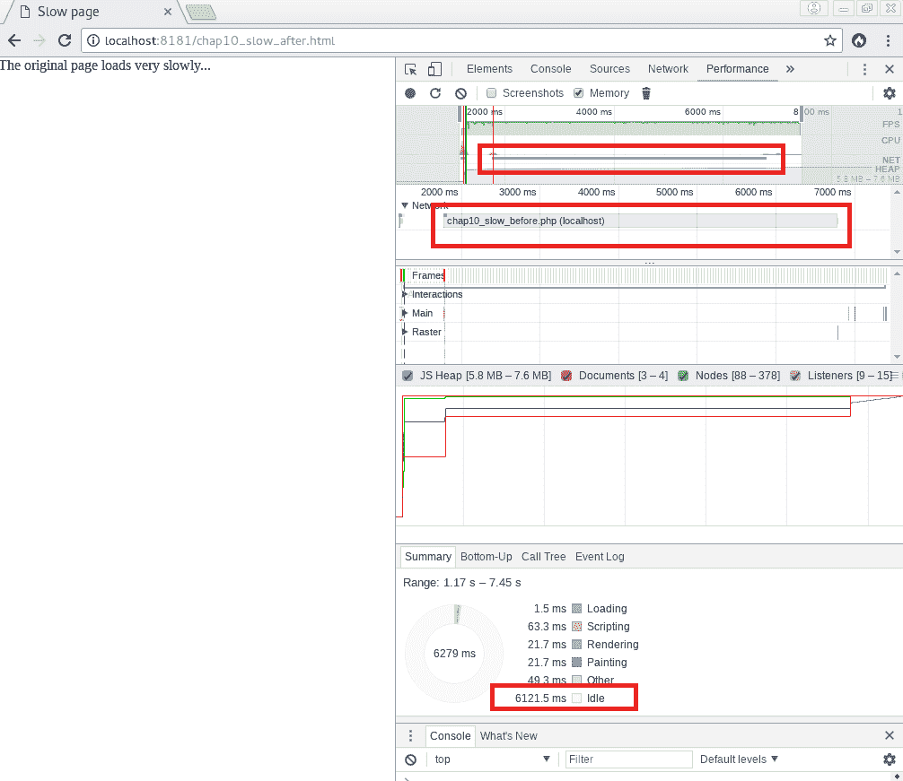

# 第十章：超越性能

在本书的第一章《更快的网络-入门》中，我们提到性能也与感知有关。事实上，正如前面所述，时间的测量取决于测量时刻，并且可以根据要执行的任务的复杂性、用户的心理状态以及用户的期望而变化，因为用户可能已经根据他认为是参考软件的标准来定义他们的期望。因此，应用程序完成其任务的良好方式也意味着软件必须满足用户对计算机程序应该如何执行任务的期望。因此，更快并不总是更好。

在本章中，我们将尝试更好地理解 UI 设计背后的原则，特别是在感知性能方面。我们将看到这些设计原则如何对用户对时间的主观感知产生真正的影响，并在没有真正的优化余地时改善感知性能。

因此，我们将涵盖以下要点：

+   计时和感知时间

+   速度感知

+   合理的延迟和响应时间

+   UI 设计原则和模式

+   超越性能工具

# 计时和感知时间

在之前的章节中，我们已经讨论了性能如何通过客观时间来衡量。客观时间是通过工具来测量的，它将一个即将到来的未来和一个即将到来的过去之间的持续时间分割成相等的测量单位，这些部分处于持续不断的存在流中。

客观时间的这一定义告诉我们，时间是存在的运动的效果，它将我们从一个不确定的未来状态带到一个冻结的过去状态，通过一个恒定的现在。它是客观的，因为第三方被用作见证这种存在从一个状态到另一个状态的流逝，通过将其分割成相等的测量单位。这就是为什么客观时间经常被称为计时时间，因为它指的是将时间分割成相等的测量单位的概念（例如秒、分钟、小时等）。显然，研究客观时间的科学领域是物理学。

话虽如此，毫无疑问，人类感知两个时刻之间的持续时间是一个可变的事物。事实上，我们都知道玩得开心时时间过得很快。在心理学领域，主观或感知时间因此被定义为心智对两个或多个连续事件之间实际时间流逝的意识水平所留下的印象。意识水平越高，时间被感知为持续时间越长。意识水平越低，时间似乎过得更快：

心智感知的时间流逝

许多因素可以影响心智感知持续时间。其中最显著的因素包括个人的情绪状态、对过去和预期事件的感知、压力水平、体温、药物的存在以及年龄对个人心智状态的一般影响。

将这些概念应用于计算机科学，特别是用户界面设计时，感知时间研究背后的概念成为引导我们发现如何影响用户对持续时间的感知以及这种感知如何影响用户整体满意度的原则。

当然，其中许多因素超出了计算机程序员的控制范围，但在设计用户界面时有一些因素需要考虑，以积极影响用户满意度。

# 速度感知

首先，根据 Paul Bakaus 的说法，一个人的意识滞后于当前发生的事情大约 80 毫秒。事实上，主观的现在总是客观的过去。此外，如果当前事件在智力上更加复杂，一个人需要更多的时间来理解和完全感知。这些因素适用于任何人。因此，所有用户都会在无意识中为计算机处理提供这种免费的启动时间。

其次，用户的情绪状态对时间的感知有很大影响。根据 Awwwards 和 Google 最近的一项研究，焦虑或匆忙的用户会认为超过 50%的网站加载速度慢，而冷静放松的用户则不到 25%。对于在移动中的用户和舒适坐着的用户同样适用：

一个人的情绪状态或活动水平对速度感知的影响

第三，年龄是考虑时间感知的重要因素。用户年龄越小，他对持续时间的感知就越强烈。根据 Awwwards 的同一项研究，18-24 岁的用户只认为一半的访问网站速度快，而 25 至 44 岁的用户则认为几乎四分之三的相同网站加载速度快：

一个人的年龄对速度感知的影响

最后，即使应用程序尚未加载完成，所有用户在开始有效使用应用程序时都会对持续时间的感知减少。缓慢的零售网站通常因为用户可以开始购物所需的商品，即使浏览器尚未完成整个页面的渲染，而获得了高度赞扬。

因此，有关速度感知的某些元素适用于所有用户，而其他元素则取决于特定用户的个人资料。开发人员需要发现这些特定元素，以更好地了解如何对整体用户满意度产生最佳影响。

# 合理的延迟和响应时间

另一个因素是用户认为合理的延迟。正如第一章中所述，“更快的 Web—入门”，这直接与用户认为某种类型应用程序的最佳性能有关。这种最佳性能通常根据用户可能认为是参考应用程序来确定。在基于 Web 的应用程序和网站的情况下，有一些阈值需要考虑，因为它们在平均所有 Web 用户之间是共享的。

首先，大多数用户认为 300 毫秒或更短的响应时间是即时的。这在很大程度上可以解释前面提到的“意识滞后”。至于 300 毫秒到 1 秒之间的响应时间，这被认为是合理的延迟，并给用户以平稳过渡的印象。除非有某种用户流程，许多用户在响应时间超过三秒的延迟后会开始失去注意力并感到不耐烦。此外，Google 最近的一项研究显示，超过 50%的用户会在移动网站的页面加载时间超过三秒时离开。超过八秒后，用户的注意力被认为已经丧失：

大多数用户认为在使用 Web 应用程序或浏览网站时，合理的延迟是多少

其次，所有已完成设定目标或在以前访问网站时有良好的感知速度体验的用户，在未来访问网站时更愿意宽容，并更有可能对持续时间有积极的感知。

最后，良好的速度体验不仅会确认用户对网站本身的满意度，还会影响用户对在线访问的最终结果以及对企业品牌的整体欣赏。

# UI 设计原则和模式

考虑到所有先前的因素和概念，现在可以提炼和理解某些 UI 设计原则。

首先，速度对用户很重要。因此，如果您的应用程序没有其他优化，确保用户在初始页面完成渲染之前就可以开始使用应用程序。这意味着尽快实现页面的**首次有意义绘制**（**FMP**），以减少到达“可交互时间”的时间，这是用户可以开始与应用程序交互的第一时刻。一个基本的技术可以帮助您在任何其他内容之前加载页面的“以上折叠”内容，即将所有阻塞 JavaScript 放在页面主体的末尾。此外，页面的某些部分可以进行缓存以加快渲染，或者可以通过定期定时器触发的 AJAX 请求在浏览器中加载。最后，HTTP/2 的服务器推送功能和 HTTP 反向代理服务器在处理依赖许多 CSS 和 JavaScript 库和框架的网页渲染时可能非常有用。

其次，即使网站加载任何页面的时间少于一秒，也可以通过去除移动浏览器的点击延迟来加快速度。这可以通过在页面的头部添加 HTML meta 标签来实现：

```php
<meta name="viewport" content="width=device-width">
```

此外，您可以使用*Chrome* CSS 规则来实现相同的效果：

```php
touch-action: manipulation
```

对于旧版浏览器，请查看 FT Labs 的*FastClick*（[`github.com/ftlabs/fastclick`](https://github.com/ftlabs/fastclick)）。

出于页面加载速度如此之快的原因，可以选择添加简单的动画，以使页面转换更加流畅。最好在提示用户时缓慢开始，在需要立即反应的按钮和菜单时缓慢结束。这些基本的过渡动画应该持续 200 到 500 毫秒，当使用弹跳或弹性效果时，过渡应该持续 800 到 1,200 毫秒。尽管这些类型的视觉效果会给用户留下应用程序是高质量产品的印象，但不要过度使用网页过渡动画，并尽量避免在页面加载未知图像大小时出现内容跳动，以使整个用户体验尽可能流畅和简化。

第三，如果您的页面加载需要两到五秒，建议通过进度条、加载指示器或任何其他智能分心来向用户发送一些反馈。同时，确保通过使用简单的表达方式来解释正在发生的事情，例如“32MB 中的％已上传”，“正在发送电子邮件”或“剩余时间：1 分钟”。

最后，如果页面加载时间超过五秒，应该让用户进入活跃模式，让他们玩一个简单的游戏，例如。当然，您可以继续使用加载指示器、进度条和显示简短消息来解释正在发生的事情。但是让用户进入活跃模式将使他们对时间的流逝不那么敏感。这对于需要非常长的加载时间的页面特别有用。事实上，非常活跃的用户完全可能失去时间感，并对手头的愉快游戏感到高兴。如果您知道用户在查看您的应用程序时会感到焦虑、匆忙或在移动中，也可以使用这种技术。此外，当页面需要非常长的加载时间时，用户应该始终有可能中止操作并稍后重试。

这也将对用户的整体满意度产生积极影响，因为它允许用户完全控制这个漫长的操作：

根据预期的时间延迟适用的 UI 设计原则

现在，让我们看看如何使用先前的原则和模式来实现简单的 UI 设计。

# “超越性能”工具

为了更好地了解如何实现这些类型的解决方案，我们将创建一个动画过渡，将其包装在一个非常慢的 PHP 脚本周围。因此，我们将尝试影响原始脚本的感知速度。

我们的原始 PHP 脚本将通过运行一个睡眠命令来模拟缓慢执行。以下是原始脚本的内容：

```php
<?php

// chap10_slow_before.php

sleep(5);

echo 'The original page loads very slowly...';
```

如果我们立即运行这个脚本，我们肯定会感到脚本很慢，经过的时间可能会让我们相信出了什么问题：

脚本的缓慢执行可能会让我们相信出了什么问题

这个脚本确实给我们一种瞬间挂起的印象。

我们现在将创建一个 HTML 脚本，将查询原始 PHP 脚本，并通过 AJAX 请求获取脚本的输出。这个新的 HTML 脚本还将添加一些过渡动画，以影响原始脚本速度的用户感知。

为了实现这一点，我们将添加一个完全由 CSS 生成的脉动图标，并使用`jQuery`和`Modernizr`库来进行 AJAX 调用。这些库文件托管在 CDN 上，以便从 HTTP 反向代理缓存和浏览器缓存中受益。以下是第二个脚本的内容（`chap10_slow_after.html`）：

```php
<!DOCTYPE html>

<html lang="en">
<head>
    <meta charset="UTF-8">
    <title>Slow page</title>

    <meta name="viewport" content="width=device-width, initial-scale=1">
    <style>
        /* Center the loader */
        #se-pre-con {
            position: absolute;
            left: 50%;
            top: 50%;
            z-index: 1;
            width: 150px;
            height: 150px;
            margin: -75px 0 0 -75px;
            border: 16px solid #f3f3f3;
            border-radius: 50%;
            border-top: 16px solid #3498db;
            width: 120px;
            height: 120px;
            -webkit-animation: spin 2s linear infinite;
            animation: spin 2s linear infinite;
        }

        @-webkit-keyframes spin {
            0% { -webkit-transform: rotate(0deg); }
            100% { -webkit-transform: rotate(360deg); }
        }

        @keyframes spin {
            0% { transform: rotate(0deg); }
            100% { transform: rotate(360deg); }
        }

        /* Add animation to "page content" */
        .animate-bottom {
            position: relative;
            -webkit-animation-name: animatebottom;
            -webkit-animation-duration: 1s;
            animation-name: animatebottom;
            animation-duration: 1s
        }

        @-webkit-keyframes animatebottom {
            from { bottom:-100px; opacity:0 }
            to { bottom:0px; opacity:1 }
        }

        @keyframes animatebottom {
            from{ bottom:-100px; opacity:0 }
            to{ bottom:0; opacity:1 }
        }

        #contents {
            display: none;
            text-align: left;
        }
    </style>
</head>

<body onload="myAnimatedAjax()" style="margin:0;">

<div id="se-pre-con"></div>

<div id="contents"></div>

<script type="text/javascript" src="http://ajax.googleapis.com/ajax/libs/jquery/1.5.2/jquery.min.js"></script>
<script type="text/javascript" src="http://cdnjs.cloudflare.com/ajax/libs/modernizr/2.8.2/modernizr.js"></script>

<script type="text/javascript">

    jQuery.ajaxSetup({
        beforeSend: function() {
            $("#contents").html("Loading page... One moment please...").toggle();
        },
        complete: function(){
            $("#se-pre-con").fadeOut("slow"); //toggle visibility: off
        },
        success: function(result) {
            $("#contents").html(result);
        }
    });

    function myAnimatedAjax() {
        var myVar = setTimeout(animatedAjax, 500);
    }

    function animatedAjax() {
        $.ajax({
            type: "GET",
            url: "/chap10_slow_before.php"
        });
    }

</script>

</body>

</html>
```

运行这个新脚本时，您应该会看到一个脉动图标出现：



脉动图标通知用户正在发生某事。

然后，几秒钟后，您会看到一条消息，说明正在加载所需的页面：

新消息会分散用户的注意力，并部分重置用户对时间流逝的感知

这条新消息旨在分散用户的注意力，并导致用户对时间的感知部分重置。最后，当 AJAX 请求完成时，脉动图标和消息都会消失，以显示其他页面的内容：

脉动图标和消息都消失了，原始脚本的输出显示出来了

当让新脚本运行时，我们确实会得到这样的印象，即原始脚本的墙时间已经减少，而实际上，由于在进行 AJAX 请求的 JavaScript 函数中添加了 0.5 秒的超时，它已经增加。如果您在这个新脚本上运行我们在前几章中提到的 JavaScript 性能分析器，您将看到幕后发生了什么：

大部分执行时间（六秒）都是在等待原始脚本完成执行

性能分析器证实，这个脚本大部分的墙时间都是由于网络 I/O 到原始脚本所解释的，它花费的时间与以前一样多。但是，通过新的包装脚本，我们给最终用户的印象是我们已经成功地实现了“超越性能”。

# 总结

在本章中，我们更好地理解了 UI 设计在性能感知方面的原则。我们已经看到这些设计原则如何对用户对时间的主观感知产生实际影响，以及在没有真正的优化余地时，它们如何改善了感知性能。

希望您发现本书对于更好地理解性能和效率概念、发现构成今天互联网的大部分新的基础网络技术以及帮助您掌握更快速的网络方面是有用的。

# 参考资料

[1] [`www.awwwards.com/brainfood-mobile-performance-vol3.pdf`](https://www.awwwards.com/brainfood-mobile-performance-vol3.pdf)
