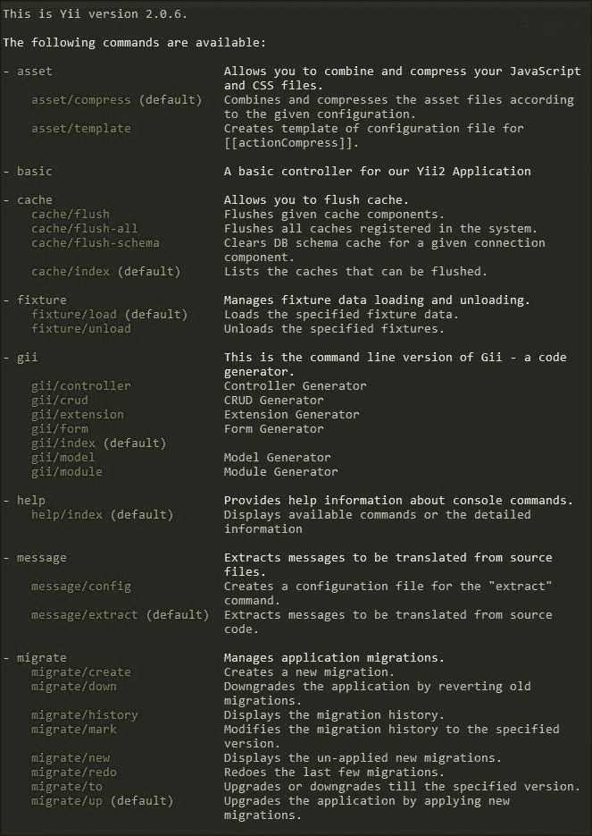
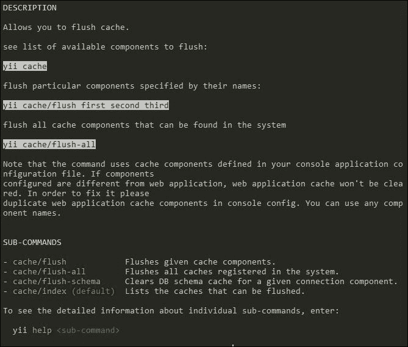
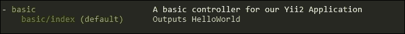
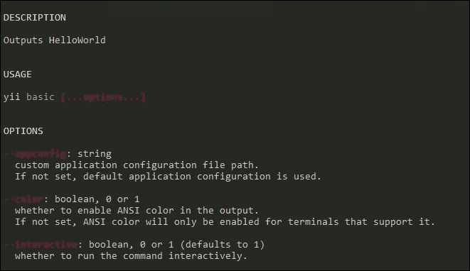
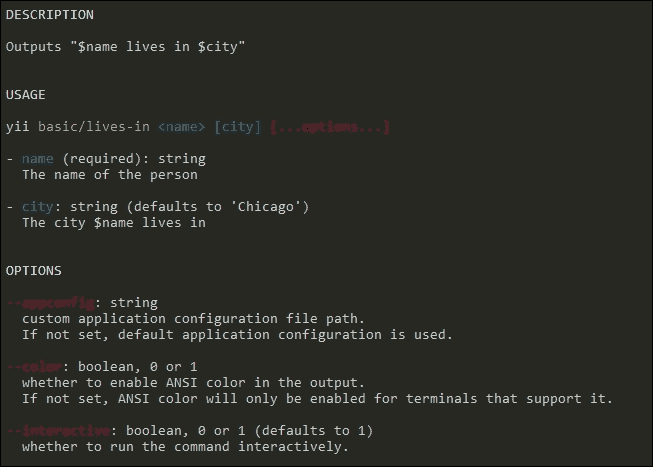
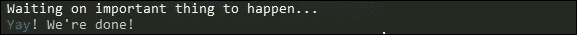

# 第二章. 控制台命令和应用

在构建现代 Web 应用程序时，我们通常需要编写后台和运维任务来支持我们的主应用程序。这些任务可能包括生成报告、通过队列系统发送电子邮件，甚至运行可能导致基于 Web 的端点超时的数据分析。使用 Yii2，我们可以通过编写控制台命令甚至完整的控制台应用程序将这些工具和脚本直接构建到我们的应用程序中。

# 配置和使用

Yii2 控制台应用程序的基本结构与在 Web 应用程序中使用的结构非常相似。在 Yii2 中，从 `yii\console\Controller` 继承的控制台命令几乎与 `yii\web\Controller` 相同。

## 入口脚本

在继续配置文件本身之前，让我们先看看控制台入口脚本，它是名为 `yii` 的文件的一部分。这个入口脚本作为所有控制台命令的启动器，通常可以通过调用以下命令来运行：

```php
$ ./yii

```

此命令将输出系统当前所有可用的命令。尽管如此，与 `web/index.php` 入口脚本一样，它还没有意识到其环境。我们可以通过将 `yii` 替换为以下代码块来改变这一点：

```php
#!/usr/bin/env php
<?php
/**
 * Yii console bootstrap file.
 */

// Define our application_env variable as provided by nginx/apache
if (!defined('APPLICATION_ENV'))
{
 if (getenv('APPLICATION_ENV') != false)
 define('APPLICATION_ENV', getenv('APPLICATION_ENV'));
 else 
 define('APPLICATION_ENV', 'prod');
}

$env = require(__DIR__ . '/config/env.php');

defined('YII_DEBUG') or define('YII_DEBUG', $env['debug']);

// fcgi doesn't have STDIN and STDOUT defined by default
defined('STDIN') or define('STDIN', fopen('php://stdin', 'r'));
defined('STDOUT') or define('STDOUT', fopen('php://stdout', 'w'));

require(__DIR__ . '/vendor/autoload.php');
require(__DIR__ . '/vendor/yiisoft/yii2/Yii.php');

$config = require(__DIR__ . '/config/console.php');

$application = new yii\console\Application($config);
$exitCode = $application->run();
exit($exitCode);
```

### 注意

此脚本适用于类 Linux 环境。Yii2 还提供了一个 `yii.bat` 文件，可以在 Windows 上运行。如果您在 Windows 计算机上操作，请确保除了 `yii` 文件外，还要更改 `yii.bat`。

在配置了入口脚本文件后，我们就可以查看我们的应用程序配置文件了。

### 小贴士

您可能还会注意到在 `web/` 文件夹中，有一个名为 `index-test.php` 的单独入口脚本。此脚本由 Codeception 测试框架使用，该框架用于在 Yii2 中运行单元、功能性和验收测试。我们将在 第十章 *使用 Codeception 进行测试* 中介绍如何配置和使用此入口脚本以及 Codeception。

## 配置

在 Yii2 中，控制台配置文件位于 `config/console.php`，并且几乎与我们的 Web 配置文件相同：

```php
<?php

Yii::setAlias('@tests', dirname(__DIR__) . '/tests');

return [
    'id' => 'basic-console',
    'basePath' => dirname(__DIR__),
    'bootstrap' => ['log'],
    'controllerNamespace' => 'app\commands',
    'components' => [
        'cache' => [
            'class' => 'yii\caching\FileCache',
        ],
        'log' => [
            'targets' => [
                [
                    'class' => 'yii\log\FileTarget',
                    'levels' => ['error', 'warning'],
                ],
            ],
        ],
        'db' => require(__DIR__ . '/db.php'),
    ],
    'params' => require(__DIR__ . '/params.php'),
];
```

与我们的 Web 配置文件一样，我们可以使用我们在 第一章 *Composer、配置、类和路径别名* 中编写的环境感知配置来包含我们的数据库和参数配置文件。实际上，我们 Web 和控制台配置之间的主要区别是显式声明我们的控制台命令命名空间和显式声明 `@test` 别名，它定义了我们的测试文件将位于何处。

### 小贴士

由于 Yii 极其灵活的结构，我们可以重新组织我们的引导和入口脚本文件，使它们位于文件系统的许多不同物理位置。正因为这种灵活性，控制台配置文件期望我们显式声明 `@test` 别名，这样我们就可以运行我们的控制台测试。

## 设置控制台环境

按照我们为我们的 Web 应用程序设置的相同约定，我们现在需要指示我们的控制台将 `APPLICATION_ENV` 变量传递给我们的控制台应用程序。从命令行，我们可以轻松地通过导出一个变量来更改环境：

```php
export APPLICATION_ENV="dev"
```

### 小贴士

如果我们想将此更改永久应用于我们正在工作的服务器，我们可以将此变量存储在我们的 `~/.bash_profile` 文件中，或者我们可以将其存储在 `/etc/profile` 中，以便为所有用户全局存储。通过将这些命令添加到这些文件之一，下次我们登录到 shell 时，此变量将自动导出。请注意，如果你使用 Windows，你需要将此变量导出到你的 `%path%` 变量中。

好吧，试试看！退出并再次登录到你的 shell，然后运行以下命令：

```php
echo $APPLICATION_ENV

```

如果你的计算机配置正确，你应该会在屏幕上看到环境输出。

```php
dev

```

## 运行控制台命令

现在我们已经配置了控制台应用程序，我们可以通过运行以下命令轻松运行我们的控制台命令：

```php
$ ./yii

```

### 小贴士

在 Windows 上，此命令是 `yii.bat`。

如果你熟悉 Yii1，此命令已取代了 `/yiic` 命令。

如果没有提供任何参数，这等同于运行 `/yii help` 并输出帮助菜单，列出我们应用程序的所有内置控制台命令：

```php
$ ./yii

```



Yii 为每个默认命令提供了额外的帮助信息。例如，如果我们想查看缓存命令的子命令，我们可以运行以下命令：

```php
$ ./yii help cache

```



通常，我们可以将 Yii 控制台的使用减少到以下模式：

```php
$ ./yii <route> [--option1=value1 --option2=value2 ... \
argument1 argument2 ...]

```

在这里，`<route>` 指的是我们想要运行的特定控制器和操作。例如，如果我们想从控制台刷新我们应用程序的整个缓存，我们可以运行以下命令：

```php
$ ./yii cache/flush-all

```

这是我们的输出结果：

```php
The following cache components were processed:
 * cache (yii\caching\FileCache)

```

`./yii` 命令还允许你从同一命令使用替代的控制台配置文件：

```php
$ ./yii <route> --appconfig=path/to/config.php

```

不需要修改我们的代码，我们只需指示 Yii 使用一个替代的配置文件，这个文件可以包含任何内容，从简单的引用另一个数据库或缓存到更复杂的，如完全不同的控制器命名空间。这个选项在创建具有前端和后端的应用程序时特别有用，因为它们可能包含不同的缓存或数据库组件。

# 内置控制台命令

现在我们知道了如何运行控制台命令，让我们来看看内置命令的工作方式。如前所述，Yii2 有七个内置控制台命令：`help`、`asset`、`cache`、`fixtures`、`gii`、`message`和`migrate`。在我们应用程序的开发过程中，我们可能会使用所有七个命令来使我们的应用程序更加健壮。让我们更详细地查看每一个。

## 帮助命令

建入 Yii2 的第一个命令是`help`命令。在运行控制台命令时，您可能不知道某个命令需要哪些选项。与其参考 Yii2 文档，您可以使用`help`命令来提供您所需的所有核心信息。

在最基本的情况下，`help`命令将输出所有当前可用的控制台命令：

```php
$ ./yii help

```

一些命令包含可以运行的附加子命令。要查看给定命令的所有可用子命令的列表，您可以运行此命令：

```php
$ ./yii help <command>

```

一些子命令，例如在 Gii 工具中找到的，需要传递额外的选项以便它们能够运行。要查看给定子命令的所有必需和可选标志的列表，您可以运行以下命令：

```php
$ ./yii help <command/sub>

```

随着我们进入下一部分，请确保您使用`help`命令来查看每个命令的所有可能选项和需求。

## 资产命令

我们工具箱中的第二套默认命令集是`asset`命令集，包括`asset/template`和`asset/compress`。

第一个命令`asset/template`用于生成一个配置文件来自动化压缩和最小化 JavaScript 和 CSS 资源，其用法如下：

```php
$ ./yii asset/template path/to/asset.php

```

运行此命令将在`path/to/asset.php`生成一个新文件，其中包含由下一个命令`asset/compress`使用的构建指令。此文件概述了要使用的 CSS 和 JavaScript 压缩器、要压缩的资源包列表、压缩资源将输出的目标集合以及针对我们的`assetManager`的任何自定义配置。

下一个命令`asset/compress`读取我们生成的配置文件，构建压缩的资源文件和一个可引用的资源包配置，我们可以将其加载到我们的布局和/或视图中。此命令的调用方式如下：

```php
$ ./yii asset/compress path/to/asset.php path/to/asset-bundle.php

```

### 注意

在第六章中，我们将深入探讨我们如何使用这些命令以及`assetManager`类来更详细地管理我们的资源。

## 缓存命令

我们工具箱中的第三个内置命令是`cache`命令。`cache`命令提供了清除由我们的应用程序生成的缓存的功能。这些命令是`cache`、`cache/flush`、`cache/flush-all`和`cache/flush-schema`。

第一个命令`cache`返回配置文件中定义的所有可用缓存的命名列表，可以使用以下命令运行：

```php
$ ./yii cache

```

这里是输出结果：

```php
The following caches were found in the system:
 * cache (yii\caching\FileCache)

```

此命令的输出格式如下，以便我们可以识别正在使用的缓存。在我们的默认应用程序中，只有一个缓存被预定义：我们的文件缓存。

```php
<cache_name> (<cache_type>)
```

一旦我们知道正在使用哪些缓存，我们就可以使用`cache/flush`命令通过名称刷新该缓存。使用上一条命令的输出，我们可以通过运行以下命令来按名称清除缓存组件：

```php
./yii cache/flush cache

```

这里是输出结果：

```php
The following cache components will be flushed:
 * cache
The following cache components were processed:
 * cache (yii\caching\FileCache)

```

### 小贴士

Yii2 中的一些命令是交互式的，在运行前会提示确认。当你需要自动化命令的使用时，例如在部署时，这可能会出现问题。你可以通过在命令后附加`--interactive=0`来绕过此行为。在非交互式运行命令时，可能需要额外的参数。确保你参考`help`命令，以确定在运行非交互式命令时需要传递哪些参数。

或者，如果我们想刷新我们应用程序的整个缓存，我们可以使用`cache/flush-all`选项：

```php
$ ./yii cache/flush-all

```

在我们的生产环境中，我们希望通过缓存数据库模式来减少数据库服务器的负载。当被指示时，Yii2 将维护当前活动的`db`组件（数据库）和数据库模式的缓存。当进行模式更改，例如应用新的迁移时，我们需要清除此缓存，以便 Yii2 能够意识到我们的更新后的数据库结构。我们可以通过运行以下命令来清除数据库模式缓存：

```php
$ ./yii cache/flush-schema

```

### 小贴士

我们将在下一章中介绍如何启用模式缓存并提高数据库的性能。

## 固定数据命令

在测试我们的应用程序时，我们通常会想要设置数据库，以便我们的测试始终以可预测和可重复的方式进行。我们可以做到这一点的一种方式是创建**固定数据**，这将在我们的应用程序中代表测试中的数据库对象。Yii2 提供了一套命令来加载和卸载数据固定数据；这些命令是`fixture/load`和`fixture/unload`，它们确实如你所期望的那样工作。

当使用固定数据时，我们的典型测试流程如下：

1.  应用数据库迁移。

1.  按以下方式执行我们的测试用例：

    1.  加载我们的数据库固定数据。

    1.  执行特定的测试。

    1.  卸载我们的数据库固定数据。

1.  按需重复，直到所有测试都运行完毕。

`fixture/load`和`fixture/unload`命令以相同的方式从命令行调用：

```php
$ ./yii fixture/load <FixtureName>
$ ./yii fixture/unload <FixtureName>

```

### 小贴士

固定数据是创建我们应用程序可重复测试的强大方式。此外，`yii2-codeception`包在测试运行时提供了加载和卸载固定数据的额外支持。在第十章，*使用 Codeception 进行测试*中，我们将介绍如何创建新的固定数据以及如何将其与 Codeception 集成。

## Gii 命令

我们工具箱中的下一组命令是 `Gii` 命令。如果你熟悉 Yii1，Gii 提供了生成控制器、模型、表单以及基本的 CRUD 功能性。在 Yii2 中，Gii 已从 Web 应用程序模块扩展到 Web 和控制台应用程序，并增加了额外的功能。

Yii2 中的 `Gii` 模块提供了以下控制台命令来自动生成代码：`gii/controller`、`gii/model`、`gii/crud`、`gii/form`、`gii/extension` 和 `gii/module`。这些命令中的每一个，当提供正确的选项时，都会生成由子命令标识的相应项目。有关完整的要求和选项列表，请确保使用 `Gii` 子命令上的 `help` 命令。

### 小贴士

作为开发工具，Gii 有能力任意生成和覆盖你应用程序中的现有代码。出于安全考虑，你应该只在开发环境中有条件地加载 `Gii` 模块。此外，`Gii` 模块本身永远不应该部署到你的生产环境中。因此，建议你只在 `composer.json` 文件的 `require-dev` 部分加载 `Gii` 模块。

`require-dev` 部分是 `composer.json` 文件中的一个特殊部分，它允许我们将我们的开发依赖项与生产依赖项分开。默认情况下，运行 Composer 会安装 `require` 和 `require-dev` 部分中的所有包。在生产环境中，我们希望通过将 `--no-dev` 标志传递给 Composer 安装命令来排除开发环境。有关 Composer CLI 的更多信息，请确保参考 Composer 文档：[`getcomposer.org/doc/03-cli.md`](https://getcomposer.org/doc/03-cli.md)。

## 消息命令

下一个命令集是 `message` 命令，它提供了自动为我们的应用程序以各种不同格式生成消息翻译的功能性。

第一个子命令是 `message/config` 命令，它生成一个配置文件，`message/extract` 命令将使用该文件输出翻译文件。在生成任何翻译之前，我们必须按照以下方式运行 `message/config` 命令：

```php
$ ./yii message/config /path/to/translation/config.php

```

此命令在 `/path/to/translation/config.php` 生成一个配置文件，其中包含 `message/extract` 生成消息输出文件所需的所有信息。

在配置好你的消息配置文件后，你可以运行以下 `message/extract` 命令：

```php
$ ./yii message /path/to/translation/config.php

```

根据你的配置文件和 `\Yii::t()` 的使用，此命令将生成包含消息列表的 PHP 文件、`.po` 文件和命令翻译文件格式，或者将必要的消息列表填充到你的数据库中的指定表中。

### 小贴士

在第十一章中，我们将更深入地介绍如何使用这些命令生成 PHP 消息文件和`.po`文件，以及如何填充我们的数据库。我们还将详细介绍`Yii::t()`方法的使用。

## 迁移命令

Yii2 的最终内置命令集是`migration`命令。`migration`命令提供了生成、应用、回滚和审查数据库迁移的功能。这个工具提供了以下子命令：`migrate/create`、`migrate/history`、`migrate/mark`、`migrate/up`、`migrate/down`、`migrate/to`、`migrate/new`和`migrate/redo`。

### 小贴士

我们将在第三章中更详细地介绍如何完全使用这个工具以及如何一般性地与数据库工作，*迁移、DAO 和查询构建*。现在，请使用`./yii help migrate`命令来查看有关迁移工具的更多信息。

# 创建控制台命令

现在我们知道了 Yii2 提供的内置命令，让我们开始添加我们自己的命令。在 Yii2 中，我们编写的任何自定义命令都将存储在我们应用程序的`/commands`子文件夹中。如果这个文件夹还不存在，请创建它：

```php
mkdir commands

```

现在，让我们编写一个基本的控制台命令，它只是输出一些文本：

1.  首先，我们将在`commands`文件夹中创建一个名为`BasicController.php`的新文件：

    ```php
    touch commands/BasicController.php

    ```

1.  现在，让我们编写一些 PHP 代码。首先，我们需要声明我们的`BasicController`所在的命名空间。这个命名空间直接对应于我们在`config/console.php`中定义的`controllerNamespace`参数：

    ```php
    <?php

    namespace app\commands;
    ```

1.  然后，我们将声明我们想在新的控制器中使用`\yii\console\Controller`类：

    ```php
    use \yii\console\Controller;
    ```

1.  接下来，我们将声明我们的控制器类如下：

    ```php
    class BasicController extends Controller { }
    ```

1.  最后，在我们的类中，我们将创建一个`actionIndex()`方法，该方法将简单地输出`HelloWorld`，然后优雅地返回一个成功的错误代码。默认情况下，`actionIndex()`方法是当未指定控制器中的操作时被调用的方法：

    ```php
    public function actionIndex()
    {
      echo "HelloWorld";
      return 0;
    }
    ```

我们已经有了第一个控制台命令！现在，如果我们运行`help`命令，你可以在可用命令列表中看到我们的命令：

```php
$ ./yii help

```



此外，我们现在可以执行我们的命令来验证它是否正常工作：

```php
$ ./yii basic

```

这是输出：

```php
HelloWorld

```

## 生成帮助信息

虽然我们现在可以运行我们的命令，但全局帮助菜单和操作帮助菜单的`help`命令目前不提供任何有用的信息。在 Yii2 中，这些信息直接从我们在`BasicController`类和`actionIndex()`方法之前使用的文档块注释（也称为`DocBlock`注释）中提取。例如，考虑我们在类声明之前添加以下内容：

```php
/**
 * A basic controller for our Yii2 Application
 */
class BasicController extends \yii\console\Controller {}
```

我们还可以通过在方法之前指定`DocBlock`注释来向我们的`actionIndex()`方法提供更多信息：

```php
/**
 * Outputs HelloWorld
 */
public function actionIndex() {}
```

在基本控制器上运行`help`命令将显示以下内容：

```php
$ ./yii help basic

```



## 传递命令行参数

就像我们的 Web 控制器（`yii\web\Controller`）一样，我们也可以通过命令行将参数传递给我们的控制台命令。而不是使用`$_GET`参数来确定正在使用的参数，Yii2 将直接从命令行界面提取参数。以我们的`BasicController`的以下方法为例：

```php
/**
 * Outputs "$name lives in $city"
 * @param string $name	  The name of the person
 * @param string $city  The city $name lives in
 * @return 0
 */
public function actionLivesIn($name, $city="Chicago")
{
  echo "$name lives in $city.\n";
  return 0;
}
```

`help`命令现在显示我们所需的新方法的必需参数和可选参数：

```php
$ ./yii help basic/lives-in

```



### 小贴士

到现在为止，你可能已经注意到控制台命令可以接受两种类型的输入：参数，(在这个例子中，`name`和`city`)，和选项。参数作为我们提供给动作的数据。另一方面，选项允许我们为我们的控制器指定额外的配置。例如，如前所述，我们可以通过传递`--interactve=0`标志选项来非交互式地运行我们的命令。我们创建和使用的每个控制台应用程序都可能有自己的选项，我们可以设置。确保你参考该类的 Yii2 文档，并使用`help`命令来确定每个命令可用的选项。

如果没有参数，此命令将抛出以下错误，指示`name`参数是必需的：

```php
Error: Missing required arguments: name

```

一旦我们提供了名称，控制台就会按预期输出结果：

```php
$ ./yii basic/lives-in Alice

```

这就是输出结果：

```php
Alice lives in Chicago.

```

通过为`city`参数提供默认值，该选项对于我们的命令执行不是必需的。然而，如果我们作为第二个参数传递一个值，它将按预期覆盖我们的默认值：

```php
$ ./yii basic/lives-in Alice California

```

这里是输出结果：

```php
Alice lives in California.

```

### 小贴士

根据您的 shell 配置，您可能无法从命令行传递某些字符（如`$`或`*`）。确保将使用特殊字符的任何字符串用引号括起来，以确保完整的参数传递给您的应用程序。

除了简单的字符串外，Yii2 还将接受以逗号分隔列表形式的数组。以以下方法为例：

```php
/**
 * Outputs each element of the input $array on a new line
 * @param array $array A comma separated list of elements
 * @return 0
 */
public function actionListElements(array $array)
{
  foreach ($array as $$k)
    echo "$$k\n";

  return 0;
}
```

通过使用数组`type-hint`对第一个参数进行类型提示，我们可以通知 Yii 将命令行参数转换为可用的 PHP 数组。从命令行，我们可以通过将其表示为逗号分隔列表来指定元素为数组：

```php
$ ./yii basic/list-elements these,are,separate,items

```

这将是出现的输出结果：

```php
these
are
separate
items

```

### 小贴士

Yii2 不支持从命令行使用多维数组。如果您需要从命令行传递多维数组的数据，您可以传递配置文件的路径，然后在控制器动作中加载该文件。

存储这些数据的选项从返回数据数组的 PHP 文件，到在控制器操作中加载并转换为 PHP 数组的 JSON 或 YAML 格式文件。

## 退出代码

如我们之前的示例所示，我们迄今为止编写的每个操作都有一个返回值`0`。虽然从控制器操作返回不是强制性的，但被认为是一种最佳实践，以便我们的 shell 可以通知我们的控制台命令是否已成功执行。按照惯例，退出代码`0`表示我们的命令没有错误地运行，而任何大于零的正整数都会表示发生了特定的错误。返回的数字将是返回给 shell 的错误代码，并且可以由我们的最终用户用来参考我们的应用程序文档或支持论坛以确定出了什么问题。

假设，例如，我们想要验证我们的输入而不需要深入自定义表单和验证器。在这个例子中，我们希望我们的`$shouldRun`输入是一个正的非零整数。如果这个整数小于零，我们可以返回一个错误代码，我们的文档将能够引用：

```php
/**
 * Returns successfully IFF $shouldRun is set to any 
 * positive integer greater than 0
 *
 * @param integer $shouldRun
 * @return integer
 */
public function actionConditionalExit($shouldRun=0)
{
  if ((int)$shouldRun < 0)
  {
    echo 'The $shouldRun argument must be an positive non-zero integer' . "\n";
    return 1;
  }

  return 0;
}
```

此外，Yii2 为我们提供了一些预定义的常量，我们可以使用它们：`Controller::EXIT_CODE_NORMAL`，其值为`0`，以及`Controller::EXIT_CODE_ERROR`，其值为`1`。如果您有多个返回代码，定义有意义的常量以识别您的错误代码是一种良好的做法。

## 格式化

Yii2 为我们提供了对控制台命令输出格式的支持。这是通过`yii\helpers\Console`辅助器提供的。在我们能够使用这个辅助器之前，我们需要将其导入到我们的类中：

```php
<?php

namespace app\commands;
use yii\helpers\Console;
```

在加载了这个辅助器之后，我们现在可以使用`\yii\console\Controller`中的`stdout()`方法或`ansiFormat()`方法。虽然两种方法都会格式化文本，但`ansiFormat()`方法可以用来动态地组合具有不同格式的多个字符串：

```php
/**
 * Outputs text in bold and cyan
 * @return 0
 */
public function actionColors()
{
  $this->stdout("Waiting on important thing to happen...\n", Console::BOLD);

  $yay = $this->ansiFormat('Yay', Console::FG_CYAN);
  echo "$yay! We're done!\n";
  return 0;
}
```

然后，如果我们运行我们的新控制台命令，我们可以看到我们的输出文本是如何变化的：

```php
$ ./yii basic/colors

```



### 注意

可用的完整常量列表可在 Yii2 文档中找到，链接为[`www.yiiframework.com/doc-2.0/yii-helpers-baseconsole.html`](http://www.yiiframework.com/doc-2.0/yii-helpers-baseconsole.html)。

# 摘要

在本章中，我们介绍了如何配置 Yii 以与我们的 Web 应用程序一致的方式运行控制台命令。我们还简要介绍了七个内置的控制台命令。此外，我们还介绍了如何创建自己的控制台命令，如何向我们的命令传递参数，如何在代码中正确返回值，以及如何格式化命令的输出。

在下一章中，我们将通过学习如何使用和编写迁移、如何使用**数据库访问对象**（**DAO**）以及如何使用 Yii 的内置查询构建器来扩展我们对 Yii 的掌握。
