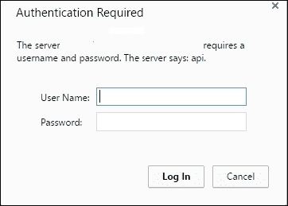

# 第九章。RESTful API

**表征状态转移**（**REST**）是客户端-服务器通信的现代方法，它将客户端（如 Bowers 和移动应用程序）与应用程序的服务器组件解耦。RESTful 实现使后端实现能够使用一种通用语言（通常是 XML 或 JSON）进行通信，同时充分利用 HTTP 动词，如`GET`、`POST`、`PUT`和`DELETE`。RESTful 应用程序使我们能够构建无状态、可扩展和统一的应用程序，我们可以将其分发给我们的客户端。使用 Yii2，我们可以快速实现 RESTful API，作为我们应用程序的一部分或全部。

# ActiveController

在 Yii2 中创建 RESTful API 的最简单方法是利用`yii\rest\ActiveController`。像`yii\web\Controller`一样，`yii\rest\ActiveController`提供了一个控制器接口，我们可以在我们的`./controllers`目录中实现。与`yii\web\Controller`不同，使用`yii\rest\ActiveController`和`yii\db\ActiveRecord`模型实现将立即为该模型创建一个完整的 REST API，而无需编写大量代码。使用`yii\rest\ActiveController`实现的模型还提供了以下附加功能：

+   XML 和 JSON 响应格式

+   速率限制

+   数据和 HTTP 缓存

+   认证

+   完全支持 HTTP 动词（`GET`、`POST`、`PATCH`、`HEAD`和`OPTIONS`）

+   数据验证

+   分页

+   支持 HATEOAS

例如，让我们公开我们在第四章中创建的用户模型，*活动记录、模型和表单*。要开始使用`yii\rest\ActiveController`，我们首先需要在`controllers/`目录中创建一个名为`UserController.php`的控制器，它引用我们之前创建的用户模型：

```php
<?php

namespace app\controllers;

use yii\rest\ActiveController;

class UserController extends ActiveController
{
    public $modelClass = 'app\models\User';
}
```

接下来，我们需要对我们的`config/web.php`配置文件进行一些配置更改，以便 Yii2 可以将正确的路由路由到我们新创建的控制器，并确保我们的应用程序可以接受 JSON 输入。因为我们已经启用了美观的 URL 并禁用了在`urlManager`组件中显示脚本名称，所以我们只需要为我们的用户类添加一个自定义 URL 规则。这个 URL 规则是`yii\rest\UrlRule`的一个实例，它将处理我们控制器所需的所有路由：

```php
return [
    // [...],
    'components' => [
        // [...],
            'urlManager' => [
                'enablePrettyUrl' => true,
                'enableStrictParsing' => true,
                'showScriptName' => false,
                'rules' => [
                    ['class' => 'yii\rest\UrlRule', 'controller' => 'user'],
               ],
        ],
    ]
];
```

接下来，我们需要修改我们的应用程序使用的基请求对象，以便它可以解析 JSON 输入：

```php
return [
    // [...],
    'components' => [
        // [...],
        'request' => [
            'parsers' => [
                'application/json' => 'yii\web\JsonParser',
            ]
        ]
    ]
];
```

### 小贴士

对请求解析器的更改是为了方便，因为 JSON 是一种易于处理的输入类型。如果没有这个更改，我们的应用程序将只能解析`application/x-www-form-urlencoded`和`multipart/form-data`请求格式。

通过简单地添加几行代码，我们现在已经为我们的`Users`模型实现了一个完整的 REST API。以下表格展示了`yii\rest\ActiveController`为我们提供的完整方法列表：

| HTTP 方法 | 端点 | 结果 |
| --- | --- | --- |
| `GET` | `/users` | 这是一个所有用户的列表 |
| `GET` | `/users/<id>` | 这包含具有给定 `<id>` 标签的用户的详细信息 |
| `POST` | `/users` | 这使用请求体中的数据创建一个新用户 |
| `PATCH` | `/users/<id>` | 这使用请求体中的数据修改具有给定 `<id>` 标签的用户 |
| `DELETE` | `/users/<id>` | 这将删除具有给定 `<id>` 标签的用户 |
| `HEAD` | `/users` | 这检索头部信息 |
| `HEAD` | `/users/<idl>` | 这检索给定 `<id>` 标签用户的头部信息 |
| `OPTIONS` | `/users` | 这检索类似 Ajax 的请求的 HTTP 选项 |
| `OPTIONS` | `/users/<id>` | 这检索具有给定 `<id>` 标签的用户的类似 Ajax 的请求的 HTTP 选项 |

查询我们新创建的 REST API 的简单方法是使用名为 CURL 的命令行工具。例如，为了检索 `/users` 端点的头部，我们可以运行以下命令：

```php
$ curl -i -X HEAD https://www.example.com/users

```

您将得到类似以下输出的结果：

```php
HTTP/1.1 200 OK
Content-Type: application/json; charset=UTF-8
Transfer-Encoding: chunked
Connection: keep-alive
Vary: Accept-Encoding
X-Pagination-Total-Count: 4
X-Pagination-Page-Count: 1
X-Pagination-Current-Page: 1
X-Pagination-Per-Page: 20
Link: <https://www.example.com/users?page=1>; rel=self
Access-Control-Allow-Origin: *
```

如前所述，`yii\rest\ActiveRecord` 立即为我们提供了一组有用的信息，例如 CORS 头和分页详情。

使用 CURL，我们还可以查询原始数据本身。我们的 API 可以根据我们随请求一起提交的 `Accept` 头部以 JSON 或 XML 格式响应。下一个示例演示了一个将以 JSON 格式响应的请求：

```php
$ curl –I -H "Accept:application/json" https://www.example.com/users | jq .
[
  {
    "updated_at": 1442602004,
    "created_at": 1442602004,
    "role_id": 1,
    "last_name": "Joe",
    "first_name": "Jane",
    "password": "$2y$13$pc0TEJged1BwmqpGL7dywupNzG6bCBWRjBbDMzBXhv7FewvUR/qqm",
    "email": "jane.doe@example.com",
    "id": 1
  },
  {...}
]
```

### 小贴士

默认情况下，CURL 将数据作为单行返回。如前一个命令所示，我们将 cURL 请求的 JSON 响应通过管道传输到名为 **jq**（[`stedolan.github.io/jq/`](https://stedolan.github.io/jq/)) 的工具，该工具用于以易于阅读的格式格式化数据。或者，您可以选择安装一个基于图形的工具来提交和以易于阅读的格式显示响应。

此外，我们还可以通过在请求中传递它们作为 `GET` 参数来过滤特定的字段。例如，如果我们只想检索数据库中 ID 为 `1` 的用户的姓氏和名字，我们可以执行以下命令：

```php
$ curl -H "Accept:application/json" /
https://www.example.com/users/1?fields=id,first_name,last_name | jq .

```

这将返回以下响应：

```php
{
  "last_name": "Joe",
  "first_name": "Jane",
  "id": 1
}
```

## 配置 ActiveController 显示字段

如您可能已注意到，`yii\rest\ActiveController` 只返回从数据库中填充的字段，并且不会返回您可能已创建的额外字段（例如，将姓氏和名字连接起来的 `full_name` 字段）或关系。此外，它还公开数据库中的每个字段，包括敏感数据，如加密的密码散列。绕过这种限制的一种方法是我们修改模型中的 `fields()` 方法。

例如，为了防止意外在我们的 API 中公开散列密码，我们可以在 `User` 模型中实现自定义的 `fields` 方法，如下所示。我们还可以更改某些字段的显示名称：

```php
class User extends \yii\db\ActiveRecord implements \yii\web\IdentityInterface
{
    /**
     * API safe fields
     */
    public function fields()
    {
        return [
            'id',
            'email_address' => 'email',
            'first_name',
            'last_name',
            'full_name' => function($model) {
                return $model->getFullName();
            },
            'updated_at',
            'created_at'
        ];
    }
}
```

现在，让我们按照以下方式查询我们的 API：

```php
$ curl -H "Accept:application/json" https://www.example.com/users/1 /
| jq .

```

我们检索以下响应：

```php
{
  "created_at": 1442602004,
  "updated_at": 1442602004,
  "full_name": "Jane Joe",
  "last_name": "Joe",
  "first_name": "Jane",
  "email_address": "jane.doe@example.com",
  "id": 1
}
```

此外，我们可以通过实现模型的`extraFields()`方法来公开关系数据，如下一个示例所示：

```php
public function extraFields()
{
    // Expose the 'role' relation
    return ['role'];
}
```

### 小贴士

`extraFields()`方法将在我们的响应中公开整个模型关系，如果我们的关系包含敏感信息，则可能存在安全风险。请确保您在相关属性中使用`fields()`方法来限制将返回的数据。

我们可以通过在`GET`参数中添加`expand=role`来扩展这些数据，如下面的示例所示：

```php
$ curl -H "Accept:application/json" /
https://www.example.com/users/1?expand=role | jq .

```

```php
{
  "role": {
 "name": "User",
 "id": 1
 },
  "created_at": 1442602004,
  "updated_at": 1442602004,
  "full_name": "Jane Joe",
  "last_name": "Joe",
  "first_name": "Jane",
  "email_address": "jane.doe@example.com",
  "id": 1
}
```

## 响应中的数据序列化

除了修改我们响应中显示的字段外，我们还可以修改我们的响应以包含有用的信息，例如在头信息中发送的信息（例如分页信息和链接），并将我们的响应包装在一个易于在响应中识别的容器中。我们可以通过在`yi\rest\ActiveController`中添加并指定序列化器来完成此操作，如下面的示例所示：

```php
<?php

namespace app\controllers;

use yii\rest\ActiveController;

class UserController extends ActiveController
{
    public $modelClass = 'app\models\User';

 public $serializer = [
 'class' => 'yii\rest\Serializer',
 'collectionEnvelope' => 'users',
 ];
}
```

现在，当我们查询我们的`/users`端点时，我们将得到以下响应：

```php
$ curl -H "Accept:application/json" https://www.example.com /users /
| jq .

```

```php
{
 "_meta": {
 "perPage": 20,
 "currentPage": 1,
 "pageCount": 2,
 "totalCount": 21
 },
 "_links": {
 "self": {
 "href": "https://www.example.com/users?page=1"
 },
 "next": {
 "href": "https://www.example.com/users?page=2"
 }

 },
  "users": [
    {
      "created_at": 1442602004,
      "updated_at": 1442602004,
      "full_name": "Jane Joe",
      "last_name": "Joe",
      "first_name": "Jane",
      "email_address": "jane.doe@example.com",
      "id": 1
    },
    {...},
    {...}
  ]
}
```

## 禁用 ActiveController 动作

虽然`yii\rest\ActiveController`提供了许多有用的动作，但可能存在您不希望公开默认暴露的每个方法的情况。以下动作由`yii\rest\ActiveController`自动暴露：

| 动作名称 | 结果 |
| --- | --- |
| `index` | 这将列出模型提供的所有资源，并支持分页 |
| `view` | 这将返回特定模型的详细信息 |
| `create` | 这将创建一个新的模型实例 |
| `update` | 这将更新现有的模型实例 |
| `delete` | 这将删除模型 |
| `options` | 这将返回可用的方法 |

除了重写动作方法外，还有几种不同的方法可以禁用动作。可以通过从控制器中的`actions()`方法内的动作列表中移除它们来禁用动作。例如，要禁用`delete`和`create`，我们可以按照以下方式移除它们：

```php
<?php

namespace app\controllers;

use yii\rest\ActiveController;

class UserController extends ActiveController
{
    public $modelClass = 'app\models\User';

    public function actions()
    {
        $actions = parent::actions();

        // disable the "delete" and "create" actions
        unset($actions['delete'], $actions['create']);
        return $actions;
    }
}
```

或者，可以通过从我们的网络配置中的`yii\rest\UrlRule`移除路由来禁用动作，通过设置规则的`only`或`except`参数。在以下示例中，我们的路由器中已禁用了`delete`、`create`和`update`动作：

```php
[
    'class' => 'yii\rest\UrlRule',
    'controller' => 'user',
    // 'only' => [ 'index' ], // Only allow index 
    'except' => ['delete', 'create', 'update'], // Disabled
]
```

## 自定义 ActiveController 动作

有几种方法可以修改`yii\rest\ActiveController`提供的每个动作返回的数据。除了直接重载特定方法外，还可以修改每个动作的数据提供者。例如，要更改索引动作的数据提供者，我们可以编写类似于以下代码块的代码：

```php
<?php

namespace app\controllers;

use yii\rest\ActiveController;

class UserController extends ActiveController
{

    public function actions()
    {
        $actions = parent::actions();

        // Customize the data provider preparation with the "prepareDataProvider()" method
        $actions['index']['prepareDataProvider'] = [$this, 'prepareDataProvider'];

        return $actions;
    }

    private function prepareDataProvider()
    {
        // Prepare a new data provider
    }
}
```

# 认证过滤器

在第七章，*认证和授权用户*中，我们介绍了用户访问控制过滤器的基础知识，以控制哪些用户可以访问我们的控制器。与依赖于会话数据以在每次请求之间持久化用户数据的面向状态的程序不同，RESTful API 本质上是无状态的，这意味着每个请求都必须提供所需的信息以对每个用户进行身份验证。为了帮助我们通过 API 进行用户认证，Yii2 提供了三个内置方法来控制对 API 的访问：

+   HTTP 基本认证

+   查询参数认证

+   OAuth2 认证

此外，我们还可以定义我们自己的自定义认证方法。

要开始在我们的 API 中认证用户，我们需要对我们的应用程序进行以下更改：

+   通过以下方式配置我们的配置中的用户组件：

    +   通过将`enableSession`设置为`false`来禁用会话

    +   将`loginUrl`属性设置为 null 以防止重定向到登录页面

+   在我们的控制器`behaviors()`方法中指定认证方法

+   在我们的用户身份类中实现`yii\web\IdentityInterface::findIdentityByAccessToken()`

### 小贴士

如果您将 REST API 与您的正常 Yii2 应用程序混合使用，可能会遇到问题。因此，强烈建议您将 API 作为与 Yii2 应用程序分开的独立应用程序运行。

## HTTP 基本认证

处理认证的最基本方法是实现 HTTP 基本认证。HTTP 基本认证由`the yii\filters\auth\HttpBasicAuth`类提供，可以按以下方式实现：

```php
<?php

namespace app\controllers;
use yii\filters\auth\HttpBasicAuth;
use yii\rest\ActiveController;

class UserController extends ActiveController
{
    public function behaviors()
    {
        $behaviors = parent::behaviors();
        $behaviors['authenticator'] = [
            'class' => HttpBasicAuth::className(),
        ];
        return $behaviors;
    }
}
```

现在，如果我们尝试在没有足够凭据的情况下查询我们的 API，我们将收到以下响应：

```php
{
    "name": "Unauthorized",
    "message": "You are requesting with an invalid credential.",
    "code": 0,
    "status": 401,
    "type": "yii\\web\\UnauthorizedHttpException"
}
```

如果我们尝试导航到应用程序中的任何端点，我们将收到以下弹出窗口，要求我们进行身份验证：



默认情况下，Yii2 将仅将用户名作为令牌传递给`yii\web\IdentityInterface::findIdentityByAccessToken()`。通常，用户名不足以对用户进行身份验证。可以通过指定`yii\filters\auth\HttpBasicAuth`的`auth`属性来覆盖此行为，这将允许我们将用户名和密码传递到我们选择的功能中：

```php
public function behaviors()
{
    $behaviors = parent::behaviors();
    $behaviors['authenticator'] = [
        'auth'  => ['app\models\User', 'httpBasicAuth' ],
        'class' => HttpBasicAuth::className(),
    ];
    return $behaviors;
}
```

在我们的用户模型中，我们可以定义`httpBasicAuth()`方法如下：

```php
/**
* Handle HTTP basic auth
* @param string $email
* @param string $password
* @return static self
*/
public function httpBasicAuth($email, $password)
{
    $model = static::findOne(['email' => $email]);
    if ($model == NULL)
        return NULL;

    if (password_verify($password, $model->password))
        return $model;

    return NULL;
}
```

### 小贴士

在所示示例中，我们正在验证用户名和密码与我们创建在第四章的用户，*活动记录、模型和表单*。在这种情况下，我们正在将密码与先前创建的 bcrypt 散列进行验证。确保您参考该章节中列出的凭据以获取示例。

现在，如果我们查询我们的 API，如果我们有有效的凭据，我们将收到有效的响应；如果我们提供错误的凭据，我们将收到错误。

## 查询参数认证

作为查询参数认证的替代方案，我们可以通过指定查询参数来授权访问我们的 API。这可以是一个全局查询参数，我们将其视为密钥，或者它可以是我们在登录请求上签发的每个用户的令牌。查询参数认证可以通过实现 `yii\filters\auth\QueryParamAuth` 来实现。在以下示例中，我们正在寻找一个名为 `token` 的 `GET` 参数，其中包含我们的令牌：

```php
<?php

namespace app\controllers;
use yii\filters\auth\QueryParamAuth;

use yii\rest\ActiveController;

class UserController extends ActiveController
{
    public function behaviors()
    {
        $behaviors = parent::behaviors();
        $behaviors['authenticator'] = [
            'tokenParam'  => 'token',
            'class' => QueryParamAuth::className(),
        ];
        return $behaviors;
    }
}
```

认证可以通过在我们的模型中实现 `yii\web\IdentityInterface::findIdentityByAccessToken()` 来执行。最简单的例子是创建一个新的迁移，为我们的用户表添加一个名为 `access_token` 的新列，该列在我们认证请求时被填充。然后我们可以通过向我们的 `User` 模型添加以下代码来对其进行验证：

```php
/** 
 * @inheritdoc
 */
public static function findIdentityByAccessToken($token, $type=null)
{
    return static::findOne(['access_token' => $token]);
}
```

## OAuth2 认证

在 Yii2 中，最复杂的认证方法是 OAuth2 认证，这是通过 `yii\auth\filters\HttpBearerAuth` 实现的。与 `yii\auth\filters\QueryParamAuth` 类似，`yii\auth\filters\HttpBearerAuth` 可以通过在 `behaviors()` 方法中设置适当的行为，然后实现 `yii\web\IdentityInterface::findIdentityByAccessToken()` 来实现。

```php
<?php

namespace app\controllers;
use yii\filters\auth\HttpBearerAuth;

use yii\rest\ActiveController;

class UserController extends ActiveController
{    
    public function behaviors()
    {
        $behaviors = parent::behaviors();
        $behaviors['authenticator'] = [
            'class' => HttpBearerAuth::className(),
        ];
        return $behaviors;
    }
}
```

如果您不熟悉 OAuth2 的工作流程，可以通过设置带有特定 Bearer 令牌的 `Authorization` 标头来模拟登录请求，如下所示：

```php
Headers:
    Authorization: Bearer <token>
```

标头中的 `<token>` 部分最终将被传递给 `yii\web\IdentityInterface::findIdentityByAccessToken()`。

## 复合认证

为了提高我们 API 的安全性，我们可以通过实现 `yii\filters\auth\CompositeAuth` 将几个不同的认证过滤器捆绑在一起。为了认证我们的 API，我们需要满足 `behaviors()` 方法中列出的所有认证要求。复合认证可以在我们的控制器中按如下方式配置：

```php
<?php

namespace app\controllers;
use yii\filters\auth\CompositeAuth;
use yii\filters\auth\HttpBasicAuth;
use yii\filters\auth\QueryParamAuth;

use yii\rest\ActiveController;

class UserController extends ActiveController
{
    public function behaviors()
    {
        $behaviors = parent::behaviors();
        $behaviors['authenticator'] = [
            'class' => CompositeAuth::className(),
 'authMethods' => [
 HttpBasicAuth::className(),
 QueryParamAuth::className(),
 ],
        ];
        return $behaviors;
    }
}
```

## 自定义认证过滤器

作为内置认证提供程序的替代方案，我们还可以定义我们自己的认证过滤器。例如，作为我们登录请求的一部分，我们可能为用户生成一个唯一的令牌，以便对所有附加请求进行操作。而不是要求我们的 API 客户端存储用户的原始密码或将凭据作为可能出现在我们服务器日志文件中的 `GET` 参数传递，我们可以让我们的用户提交他们的认证令牌作为唯一的标头。以下是如何实现此功能的示例类：

```php
<?php

namespace app\filters\auth;

use yii\filters\auth\AuthMethod;
use yii\web\UnauthorizedHttpException;
/**
 * HeaderParamAuth is an action filter that supports the authentication based on the access token passed through a query parameter.
 */
class HeaderParamAuth extends AuthMethod
{
    /**
     * @var string the parameter name for passing the access token
     */
    public $tokenParam = 'x-auth-token';

    /**
     * @inheritdoc
     */
    public function authenticate($user, $request, $response)
    {
        $accessToken = $request->getHeaders()[$this->tokenParam];

        if (is_string($accessToken))
        {
            $identity = $user->loginByAccessToken($accessToken, get_class($this));

            if ($identity !== null)
                return $identity;
        }

        if ($accessToken !== null)
            $this->handleFailure($response);

        return null;
    }

    /**
     * @inheritdoc
     */
    public function handleFailure($response)
    {
        throw new UnauthorizedHttpException('The token you are using has is either invalid, or has expired. Please re-authenticate to continue your session.');
    }
}
```

然后，我们可以在我们的控制器中实现我们的自定义认证方法，如下所示：

```php
<?php

namespace app\controllers;
use app\filters\auth\HeaderParamAuth;

use yii\rest\ActiveController;

class UserController extends ActiveController
{
    public function behaviors()
    {
        $behaviors = parent::behaviors();
        $behaviors['authenticator'] = [
            'class' => HeaderParamAuth::className(),
        ];
        return $behaviors;
    }
}
```

如您所预期，`x-auth-token` 参数将是传递给 `yii\web\IdentityInterface::findIdentityByAccessToken()` 的令牌。

## 动作特定认证

使用`only`和`except`关键字作为验证器行为的一部分，可以将身份验证限制为某些操作。例如，使用我们之前创建的`HeaderParamAuth`类，我们只能要求对`delete`、`create`和`update`操作进行身份验证，同时允许未经身份验证的用户访问主索引操作：

```php
<?php

namespace app\controllers;
use app\filters\auth\HeaderParamAuth;

use yii\rest\ActiveController;

class UserController extends ActiveController
{
    public function behaviors()
    {
        $behaviors = parent::behaviors();
        $behaviors['authenticator'] = [
            'class' => HeaderParamAuth::className(),
            'only' => [ 'delete', 'update', 'create' ]
        ];
        return $behaviors;
    }
}
```

## 检查访问

当公开 API 端点时，您通常需要捆绑身份验证和授权。使用`yii\rest\Controller`，这可以通过覆盖`yii\rest\Controller::checkAccess()`方法来处理：

```php
/**
 * Checks the privilege of the current user.
 *
 * This method should be overridden to check whether the current user has the privilege
 * to run the specified action against the specified data model.
 * If the user does not have access, a [[ForbiddenHttpException]] should be thrown.
 *
 * @param string $action the ID of the action to be executed
 * @param \yii\base\Model $model the model to be accessed. If null, it means no specific model is being accessed.
 * @param array $params additional parameters
 * @throws ForbiddenHttpException if the user does not have access
 */
public function checkAccess($action, $model = null, $params = [])
{
    // check if the user can access $action or $model
    // throw ForbiddenHttpException if access should be denied
}
```

或者，您可以使用访问控制过滤器，如第七章，*验证和授权用户*中所示。

### 注意

授权确定哪些操作需要经过身份验证的访问。当与 API 一起工作时，您需要正确实现身份验证以确定哪些用户或用户组可以访问特定的命令。有关如何在您的应用程序中验证用户的详细信息，请参阅第七章，*验证和授权用户*。

# 动词过滤器

在创建自定义 API 端点时，您可能只想允许某些 HTTP 动词针对这些操作发出。例如，向删除用户的端点发出 PUT 请求没有太多意义。控制可以对我们的操作执行哪些 HTTP 动词的一种方法是通过使用`yii\filters\VerbFilter`。在使用`yii\filters\VerbFilter`时，我们只需指定每个公共操作将接受哪些 HTTP 动词。以下示例显示了`yii\rest\ActiveController`使用的默认动词过滤器：

```php
public function behaviors()
{
    return [
        'verbs' => [
            'class' => \yii\filters\VerbFilter::className(),
            'actions' => [
                'index'  => ['get'],
                'view'   => ['get'],
                'create' => ['get', 'post'],
                'update' => ['get', 'put', 'post'],
                'delete' => ['post', 'delete'],
            ],
        ],
    ];
}
```

# 跨源资源头部

当与对您的 API 发出 AJAX 请求的 JavaScript 应用程序一起工作时，您可能希望使用**跨源资源共享**（**CORS**）头部以确保只有您指定的域可以运行。可以通过将`yii\filters\Cors`添加到您的`behaviors()`方法来实现 CORS 头部，如下例所示：

```php
public function behaviors()
{
    return [
        'corsFilter' => [
            'class' => \yii\filters\Cors::className(),
        ],
    ];
}
```

通过设置特定的 CORS 头部，您可以扩展此行为，这些头部是您希望为您的控制器指定的：

```php
public function behaviors()
{
    return [
        'corsFilter' => [
            'class' => \yii\filters\Cors::className(),
            'cors' => [
                // Only allow https://www.example.com to execute against your domain in AJAX
                'Origin' => ['https://www.example.com'],
                // Only allow POST and DELETE methods from the domain
                'Access-Control-Request-Method' => ['POST', 'DELETE'],
                // Set cache control headers
                'Access-Control-Max-Age' => 3600,
                // Allow the X-Pagination-Current-Page header to be exposed to the browser.
                'Access-Control-Expose-Headers' => ['X-Pagination-Current-Page'],
            ],

        ],
    ];
}
```

### 注意

当涉及到防止来自浏览器和其他域的 AJAX 请求访问您的域内容时，CORS（跨源资源共享）头部具有一个非常具体的目的，并且它们旨在作为对您的最终用户的安全预防措施，而不是您的 API。CORS 头部不会阻止 CURL 等工具或不符合规范的浏览器访问您的 API。在实施 CORS 之前，请确保您对它们有具体的理解，了解它们保护什么，以及使用哪些头部。有关 CORS 的更多信息，请参阅 W3C 参考指南[`www.w3.org/TR/cors/`](http://www.w3.org/TR/cors/)。

# 速率限制

在创建 API 时，您可能希望在 API 中实现速率限制，以防止对 API 进行过多的请求并耗尽服务器资源。如果您的 API 依赖于已经设置了速率限制的另一个 API，这一点尤为重要。在 Yii2 中，速率限制是通过 `yii\filters\RateLimiter` 和 `yii\filters\RateLimitInterface` 实现的。

要开始使用速率限制，我们首先需要将 `yii\filters\Ratelimiter` 添加到我们的控制器行为中。`yii\filters\RateLimiter` 类与我们的用户身份类耦合。因此，速率限制只会应用于受认证保护的操作。任何未受认证过滤器保护的操作都不会应用速率限制。以下示例说明了在控制器中实现 `yii\filters\RateLimiter` 所需的代码块：

```php
<?php

namespace app\controllers;
use yii\filters\auth\HttpBasicAuth;
use yii\filters\RateLimiter;
use yii\rest\ActiveController;

class UserController extends ActiveController
{
    public function behaviors()
    {
        $behaviors = parent::behaviors();
        $behaviors['authenticator'] = [
            'class' => HttpBasicAuth::className(),
            'auth' => [ 'app\models\User', 'httpBasicAuth'],
            'only' => [ 'delete', 'update', 'create', 'index']
        ];
        $behaviors['rateLimiter'] = [
 'class' => RateLimiter::className(),
 'enableRateLimitHeaders' => true,
 ];

        return $behaviors;
    }
}
```

接下来，我们需要在我们的用户身份类中实现 `yii\filters\RateLimitInterface` 接口所需的方法。第一个方法 `yii\filters\RateLimitInterface::getRateLimit()` 定义了我们在单位时间内可以发出的请求数量。对于全局速率限制，我们可以简单地返回 `[100, 600]`，这将允许在 600 秒内发出 100 个请求。然而，由于完整的请求和操作都传递给了 `yii\filters\RateLimitInterface::getRateLimit()` 方法，因此我们可以进一步细化每个控制器和操作配对的速率限制：

```php
/**
 * Returns the rate limit
 * @param yii\web\Request $request
 * @param yii\base\Action $action
 * @return array
 */
public function getRateLimit($request, $action)
{
  return [100, 600];    
}
```

### 小贴士

`yii\filters\RateLimiter` 与您的用户身份耦合。如果您想为未认证的用户实现速率限制，您需要实现一个自定义过滤器。

接下来，我们需要实现两种方法来加载可用的速率限制，并在每次请求后更新可用的速率限制。这两种方法是 `yii\filters\RateLimitInterface::loadAllowance()` 和 `yii\filters\RateLimitInterface::saveAllowance()`。由于速率限制数据并不被视为敏感信息，并且如果数据意外删除，对我们的应用程序也不会有重大影响，因此这些数据可以存储在我们的缓存组件中，或者存储在 NoSQL 解决方案中，例如 MongoDB 或 Redis。方法签名定义如下：

```php
/**
 * Returns the rate limit allowance
 * @param yii\web\Request $request
 * @param yii\base\Action $action
 * @return array
 */
public function loadAllowance($request, $action)
{ 
    $allowance = 100; // Fetch the allowance from a datasource
    return [$allowance, time()];
}

/**
 * Saves the rate limit allowance
 * @param yii\web\Request $request
 * @param yii\base\Action $action
 * @param integer $allowance
 * @param Integer $timestamp
 * @return array
 */
public function saveAllowance($request, $action, $allowance, $timestamp)
{
    // Update a NoSQL solution or a cache
    return true;
}
```

结合起来，我们的扩展类将如下所示：

```php
<?php

namespace app\models;

use Yii;
class User extends \yii\db\ActiveRecord implements \yii\web\IdentityInterface, \yii\filters\RateLimitInterface
{

    public function getRateLimit( $request, $action )
    {
        return [100, 600];    
    }

    public function loadAllowance( $request, $action )
    {
        return [100, time();
    }

    public function saveAllowance( $request, $action, $allowance, $timestamp )
    {
        return true;
    }
}
```

现在，当您查询受保护的 API 端点时，响应将返回以下附加头信息：

```php
x-rate-limit-remaining: <remaining_rate_limts>
x-rate-limit-limit: <rate_limit_upper_bound>
x-rate-limit-reset: <seconds_until_rate_limit_reset>
```

### 小贴士

现在您已经安装了 MinGW 和 MSYS，您不再需要羡慕那些拥有 Linux 安装的用户了，因为它们在您的系统中实现了 Linux 开发环境的最重要部分。

# 错误处理

通过扩展 `yii\rest\Controller`（或 `yii\rest\ActiveController`），我们可以在配置中定义适当的错误处理器，从而轻松地在我们的应用程序中实现错误处理，如前几章所示：

```php
<?php return [
    // [...],
    'components' => [
        // [...],
        'errorHandler' => [
            'errorAction' => 'user/error',
        ],
        // [...]
    ],
];
```

与基于视图的响应不同，我们不需要在我们的控制器`actions()`方法中包含我们想要使用的错误处理程序的定义。相反，我们可以简单地返回发生的错误，或者我们可以覆盖错误以显示更通用的响应：

```php
<?php

namespace app\controllers;
use yii\rest\ActiveController;

class UserController extends ActiveController
{
    public function actionError()
    {
        $exception = Yii::$app->errorHandler->exception;

        if ($exception !== null)
            return ['exception' => $exception];

    }
}
```

# 自定义 API 控制器

虽然方便，但`yii\rest\ActiveController`并不能解决创建 API 时遇到的每一个问题。当不使用`yii\rest\ActiveController`时，您可能希望从`yii\rest\Controller`扩展您的控制器类，以充分利用`yii\rest\Controller`实现的内置 REST API 默认值。以下部分说明了创建自定义 API 控制器的一些附加信息。

## 返回数据

在 Yii2 中，我们可以以几种方式考虑自定义 API 控制器。考虑将数据传递给客户端的最简单方法是通过绕过 MVC 模型中的视图部分，直接从我们的控制器返回数据。例如，如果我们要在我们的控制器命名空间内创建一个名为`SiteController`的新控制器，我们可以直接从我们新创建的控制器返回数据，如下所示：

```php
<?php

namespace app\controllers;

use Yii;

class SiteController extends \yii\rest\Controller
{
    public function actionIndex()
    {
        return [ 'foo' => 'bar'];
    }
}
```

### 小贴士

记住，一旦我们开始修改我们的默认 URL 管理器规则，我们就需要添加将数据路由到其他控制器的所需规则。此规则将确保`site/<action> maps`回我们的`site`控制器：`['class' => 'yii\web\UrlRule', 'pattern' => 'site/<action>', 'route' => 'site/index']`。

对我们 API 的`site/index`端点进行 Curl 请求将返回以下内容：

```php
$ curl –I -H "Accept:application/json" /
https://www.example.com/site/index | jq .

```

```php
{
    "foo": "bar"
}
```

## 响应格式化

Yii2 有一个非常具体的响应结构，它将使用默认的`yii\rest\Controller`返回。当创建 API 时，您可能已经有一个特定的响应结构您可能想要使用（例如，如果您正在重构一个现有的但过时的 API，并使用 Yii2 API）。您可能还希望您的 API 响应具有统一的格式，因为`yii\rest\Controller`和`yii\rest\ActiveController`提供的响应不匹配（如前几节所示）。

在这些情况下，您需要修改响应结构。为此，我们只需覆盖我们应用程序的`response`组件，并在`beforeSend`事件中修改`$response->data`变量，以包含我们想要的实际响应。在这个例子中，我们将有以下响应结构：

```php
{
    "status": <http_status_code>,
    "message": <exceptions_or_messages>,
    "response": <response_data_from_controllers>
}
```

实现此更改所需的代码如下所示：

```php
<?php return [
    // [...],
    'components' => [
        // [...],
        'response' => [
            'format'  => yii\web\Response::FORMAT_JSON,
            'charset' => 'UTF-8',
               'on beforeSend'  => function ($event) {
                $response = $event->sender;

                if ($response->data !== null)
                {
                    $return = ($response->statusCode == 200 ? $response->data : $response->data['message']);

                    $response->data = [
                        'success'   => ($response->statusCode === 200),
                        'status'    => $response->statusCode,
                        'response'  => $return
                    ];
                }
            }
        ],
        // [...],
    ]
];
```

现在，如果我们查询我们的 API，我们将为我们的`SiteController`和`UserController`都收到一个统一响应结构。这是针对`SiteController`的：

```php
$ curl –I -H "Accept:application/json" /
https://www.example.com/site/index | jq .

```

```php
{
    "success": true,
    "status": 200,
    "response": {
        "foo": "bar"
    }
}
```

本查询涉及`UserController`:

```php
$ curl –I -H "Accept:application/json" /
https://www.example.com/users | jq .

```

```php
{
    "success": true,
    "status": 200,
    "response": {
        "users": [
            {
                "id": 1,
                "email_address": "jane.doe@example.com",
                "first_name": "Jane",
                "last_name": "Joe",
                "full_name": "Jane Joe",
                "updated_at": 1442602004,
                "created_at": 1442602004
            },
          {...},
        ],
        "_links": {
            "self": {
                "href": "https://www.example.com/users?page=1"
            }
        },
        "_meta": {
            "totalCount": 4,
            "pageCount": 1,
            "currentPage": 1,
            "perPage": 20
        }
    }
}
```

# 摘要

在本章中，我们扩展了我们迄今为止所学的所有知识，并学习了如何在 Yii2 中创建 RESTful JSON 和 XML API。首先，我们介绍了`yii\rest\ActiveController`的用法，这使得我们能够快速基于我们的模型类创建 CRUD API。然后，我们介绍了 Yii2 的内置身份验证过滤器，并介绍了我们如何通过要求身份验证来保护我们的资源。我们还介绍了创建自己的身份验证过滤器以支持不同的身份验证方案。接着，我们介绍了几个其他有用的 API 类，包括`yii\filters\VerbFilter`、`yii\filters\Cors`，并学习了如何在我们的 API 中处理错误。此外，我们还详细介绍了通过扩展`yii\rest\Controller`来创建自己的 API 端点的一些重要信息。

在涵盖了构建 Yii2 应用程序所需的所有信息之后，我们将花费本书剩余的章节来探讨如何增强我们的应用程序。在下一章中，我们将具体介绍构建应用程序最重要的一个方面：测试。我们将介绍如何使用强大的 Codeception 工具在我们的应用程序中设置测试，并详细说明如何设置和创建功能测试、单元测试和验收测试，以及如何创建用于测试的数据固定值。
