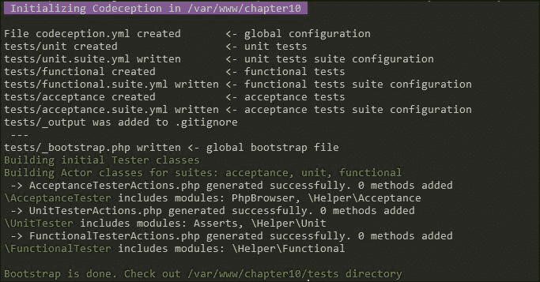
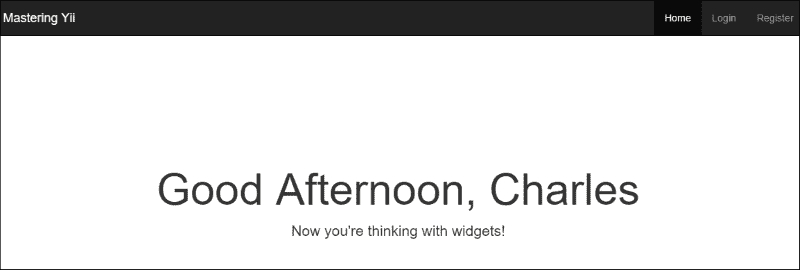

# 第十章。使用 Codeception 进行测试

软件开发的一个重要但常常被忽视的方面是测试我们的应用程序以确保它按预期运行。我们可以以三种基本方式测试我们的应用程序：

+   单元测试

+   功能测试

+   接受测试

**单元测试**使我们能够在将代码与我们的应用程序耦合之前测试代码的各个部分。**功能测试**允许我们在模拟浏览器中测试代码的功能方面，而**接受测试**允许我们在真实浏览器中测试我们的应用程序并验证它是否做了我们构建它要做的事情。使用 Yii2，我们可以使用一个名为 Codeception 的工具来创建和执行单元、功能和接受测试。在本章中，我们将介绍如何在 Yii2 中创建和运行单元、功能和接受测试。除了这三种类型的测试之外，我们还可以使用固定数据（fixtures）来模拟数据，这可以帮助我们在测试之前将应用程序置于一个固定的状态。

### 小贴士

在我们完成本章的过程中，我们将使用前几章中的大量代码。为了您的方便，本章的源代码已提供在 GitHub 上[`github.com/masteringyii/chapter10`](https://github.com/masteringyii/chapter10)，并分为三个不同的分支。我们将使用单元测试部分的`unit`分支，功能测试和接受测试部分的`functional_and_acceptance`分支，以及固定部分（fixtures）的`fixture`分支。

# 测试的原因

大多数软件开发者都会承认测试是一件好事，但许多开发者由于各种原因（如下所述）没有为他们的应用程序编写测试：

+   测试的恐惧

+   不知如何编写测试

+   认为他们的应用程序太小而不适合测试

+   时间不足

+   预算原因

虽然许多这些原因都是合理的，但测试可以对你的应用程序产生深远的影响，并极大地提高你代码的质量。以下列表提供了几个为什么应该在代码库中添加测试的原因：

+   在添加新功能时，测试可以减少错误

+   测试验证了你的代码确实做了你认为它做的事情

+   测试验证了你的代码确实做了你的客户想要的事情

+   测试可以限制功能

+   测试迫使我们放慢速度，并将我们的应用程序分解成具有约束特征的小型、可管理的组件

+   通过确保对单个功能的更改不会破坏另一个功能，测试可以降低更改的成本

+   测试提供了我们代码预期行为的文档

+   测试减少了更改会破坏我们应用程序中某些内容的恐惧

## 如何进行测试

现代开发中涉及许多因素，成本和开发时间是最主要的。我们可以采取几种现实的方法来测试，以克服这些限制。

### 手动测试

我们可以采取的最基本的测试方法是边编写代码边手动测试。无论你是否意识到，每次你进行代码更改并重新加载浏览器时，你都在测试你的代码。粗略一看，手动测试让我们能够验证新功能和已修复的 bug，但它要求我们在每次更改后手动验证应用程序的状态。此外，手动测试要求我们记住我们创建的每一个测试用例。使用 Codeception 等工具进行自动化测试可以减少这种认知负担，并释放我们的时间来执行其他任务。

## 测试几个核心组件

一种更好的测试方法是自动化测试我们应用程序的核心组件。采用这种方法，我们只为应用程序中的关键路径添加测试，这使我们能够在其他地方减少测试的情况下验证应用程序的重要部分。在时间和预算受限但你想自动化验证重要流程和路径的情况下，这种方法是完全没有测试的现实的替代方案。

### 测试驱动开发

**测试驱动开发**（**TDD**）是一种哲学，即我们在构建应用程序的同时为它创建测试。TDD 背后的主要思想是，我们可以通过事先编写一个测试来验证我们的代码是否正常工作。使用 TDD，我们通常先编写一个测试（它将失败），然后编写代码使其通过测试，然后我们在测试和代码之间不断迭代，直到我们的功能完成且测试通过。TDD 还强迫我们在将代码检查到版本控制系统之前通过测试来确保我们编写的代码是可用的，这鼓励我们编写好的测试。

使用 TDD（测试驱动开发），我们的目标是每个特性和组件都有一个测试，并且有许多测试能够彻底覆盖我们的应用程序。在理想的世界里，TDD 是在进行测试工作时采取的最佳方法，尽管这需要更多的时间和预算来实现。

# 配置 Codeception 与 Yii2

在我们能够使用 Codeception 测试我们的代码之前，我们首先需要配置 Codeception 以与 Yii2 一起工作：

1.  在 Yii2 中设置 Codeception 的首选方式是使用 Composer 安装`yii2-codeception`包和 Codeception 基础包：

    ```php
    $ composer require --dev codeception/codeception
    $ composer require --dev yiisoft/yii2-codeception
    $ composer require --dev yiisoft/yii2-faker

    ```

    ### 小贴士

    我们 Composer 命令中的`--dev`标志确保开发包不会安装到我们的生产环境中。使用`–dev`安装的包将被添加到`composer.json`文件的`require-dev`部分。存储 Codeception 和其他测试代码减少了生产环境中所需的依赖，并使我们的代码更加安全。

    第一个包包含我们将用于生成和执行测试的 Codeception 二进制文件，而第二个包包含 Codeception 将用于紧密集成到 Yii2 中的 Yii2 特定辅助器和绑定。

    ### 注意

    这个过程可能需要很长时间，因为 Codeception 依赖于许多不同的包，包括 PHPUnit。

1.  安装 Codeception 后，我们可以通过运行以下命令来执行命令：

    ```php
    $ ./vendor/bin/codecept

    ```

    单独的`codecept`将输出 Codeception 提供的所有可用命令。

    

1.  在验证 Codeception 已安装后，我们需要通过运行以下命令来引导 Codeception：

    ```php
    $ ./vendor/bin/codecept bootstrap

    ```

    

1.  引导过程将创建几个文件。第一个文件被称为`codeception.yml`，位于我们应用程序的根目录中。其余的文件存在于`tests`文件夹中，我们将添加我们的`tests`到该目录。

1.  接下来，我们需要在`codeception.yml`文件中配置 Codeception 以与我们的 Yii2 Codeception 模块一起工作。以下代码块中突出显示了所需添加的内容：

    ```php
    actor: Tester
    paths:
        tests: tests
        log: tests/_output
        data: tests/_data
        support: tests/_support
        envs: tests/_envs
    settings:
        bootstrap: _bootstrap.php
        colors: true
        memory_limit: 1024M
    extensions:
        enabled:
            - Codeception\Extension\RunFailed
    ```

1.  此外，我们需要告诉 Codeception 自动加载我们的 composer 依赖和 Yii2。我们可以通过更新`tests/_bootstrap.php`文件来实现。为了确保我们以类似于`web/index.php`加载数据的方式测试我们的应用程序，我们应该添加以下内容：

    ```php
    <?php

    // Define our application_env variable as provided by nginx/apache
    if (!defined('APPLICATION_ENV'))
    {
        if (getenv('APPLICATION_ENV') != false)
            define('APPLICATION_ENV', getenv('APPLICATION_ENV'));
        else 
           define('APPLICATION_ENV', 'prod');
    }

    $env = require(__DIR__ . '/../config/env.php');

    // comment out the following two lines when deployed to production
    defined('YII_DEBUG') or define('YII_DEBUG', $env['debug']);
    defined('YII_ENV') or define('YII_ENV', APPLICATION_ENV);

    require(__DIR__ . '/../vendor/autoload.php');
    require(__DIR__ . '/../vendor/yiisoft/yii2/Yii.php');
    $config = require(__DIR__ . '/../config/web.php');

    (new yii\web\Application($config));
    ```

1.  现在 Codeception 已经配置好了，我们可以通过运行以下命令来运行所有的测试：

    ```php
    $ ./vendor/bin/codecept run

    ```

    运行命令将输出以下内容：

    

# 单元测试

我们可以创建的最基本的测试类型被称为单元测试。正如其名所示，**单元测试**旨在测试一个工作单元（无论是单个方法、函数还是更大的工作单元），然后检查对该工作单元的单个假设。一个好的单元测试将由以下组件组成：

+   **完全自动化**：一个好的单元测试是可以完全自动化的测试，无需人工干预。

+   **全面性**：全面的单元测试提供了对它们所测试的代码块的良好的覆盖率。

+   **独立性**：好的单元测试可以按任何顺序运行，并且它们的输出不应影响或对其他测试产生副作用。此外，每个单元测试应仅测试单个逻辑代码单元。失败的测试应精确指出失败的代码部分。

+   **一致性和可重复性**：单元测试应该始终产生相同的结果，并且应该依赖于静态数据，而不是生成或随机数据。

+   **快速**：单元测试需要快速执行。长时间运行的测试意味着在给定时间内运行的测试较少，执行时间过长的测试会鼓励开发者要么编写较少的测试，要么完全跳过编写测试。由于单元测试旨在测试小的单个代码单元，长时间运行的测试也可以是糟糕或不完整的测试的指标。

+   **可读性**：好的单元测试应该是可读的，并且应该是自我解释的，或者如果需要额外的解释，应该有详细的文档。

+   **可维护性**：最后，好的单元测试应该是可维护的。我们不维护的测试就是我们不使用或不与之工作的测试。

### 小贴士

在本节中，我们将使用位于 [`github.com/masteringyii/chapter10`](https://github.com/masteringyii/chapter10) 的 `unit` 分支中的源代码。

## 生成单元测试

如果你熟悉 PHPUnit，使用 Codeception 编写测试应该会感觉非常熟悉。对于单元测试，Codeception 可以生成类似 PHPUnit 的测试，但它也可以生成一个 Codeception 特定的单元测试，该测试不需要 PHPUnit 来执行。

要生成 PHPUnit 特定的测试，我们可以运行以下命令，这将生成一个名为 `Example` 的 PHPUnit 单元测试：

```php
$ ./vendor/bin/codecept generate:phpunit unit Example

```

或者，我们可以通过运行以下命令来生成一个名为 `Example` 的 Codeception 特定测试：

```php
$ ./vendor/bin/codecept generate:test unit Example

```

### 小贴士

除非你有特定的需要 PHPUnit 类似的测试，否则应该优先考虑 Codeception 单元测试。

在生成我们的 Codeception 测试后，将生成一个名为 `tests/unit/ExampleTest.php` 的文件，它将包含以下代码。在我们开始为我们的应用程序编写单元测试之前，让我们探索一下 Codeception 单元测试类的结构：

```php
<?php

class ExampleTest extends \Codeception\TestCase\Test
{
    /**
     * @var \UnitTester
     */
    protected $tester;

    protected function _before()
    {
    }

    protected function _after()
    {
    }

    // tests
    public function testMe()
    {

    }
}
```

默认情况下，我们的 Codeception 单元测试将扩展 `\Codeception\TestCase\Test`，并实现两个受保护的方法（`_before()` 和 `_after()`）和一个名为 `$tester` 的受保护属性，供 Codeception 内部使用。`_before()` 和 `_after()` 方法旨在设置和清理在类中每个预定义测试之前和之后立即执行的任务。

在 `_before()` 和 `_after()` 方法之后，我们有我们想要运行的所有的测试。一般来说，我们想要运行的任何测试都应该在一个以 `test` 为前缀的公共方法中。任何具有此签名的公共方法都将作为测试执行。作为一个简短的例子，让我们修改我们的 `testMe()` 方法以进行一个简单的断言（一个关于给定谓词（一个函数、方法或变量）评估为布尔值的陈述，我们可以验证它是否为真）：

```php
public function testMe()
{
    // Assert that the boolean value "true" is indeed true
    $this->assertTrue(true);
}
```

以这个简单的断言为例，我们可以通过运行以下命令来验证我们的测试是否运行：

```php
$ ./vendor/bin/codecept run

```

或者，我们只需运行以下命令来运行我们的单元测试：

```php
$ ./vendor/bin/codecept run unit

```


如前一个截图所示，我们的单元测试案例已成功执行。我们可以通过定义额外的测试方法来添加额外的单元测试，如下例所示：

```php
public function testMeToo()
{
    $this->assertFalse(false);
}
```

运行第二个测试将在我们的 Codeception 输出中显示。


## 单元测试示例

现在我们已经了解了使用 Codeception 进行单元测试的基础知识，让我们探索一些我们可以在之前构建的应用程序中测试的例子。从我们在 第九章 中开发的源代码开始，*RESTful APIs*，让我们为我们的模型编写一些单元测试。

### 测试用户模型方法

1.  我们的`User`模型是我们应用程序的重要组成部分。由于我们添加了自定义代码和自定义验证器，我们可以编写单元测试来验证我们的验证器是否准确，以及我们的自定义代码是否按预期工作。为了开始，让我们为我们的`User`模型创建一个新的单元测试：

    ```php
    $ ./vendor/bin/codecept generate:test unit User

    ```

1.  由于我们正在测试我们的用户模型，我们需要明确指定我们想要在测试中使用该模型：

    ```php
    <?php

    namespace app\tests\unit\UserTest;

    use Codeception\TestCase\Test;
    use app\models\User;
    use Yii;

    class UserTest extends Test {}
    ```

1.  接下来，让我们定义一个方法来测试我们的`app\models\User::setFullName()`方法是否正常工作：

    ```php
    public function testSetFullName()
    {   
        $user = new User;
        $user->setFullName('John Doe');

        // Asser the setFullName method works
        $this->assertTrue($user->first_name == "John");
        $this->assertTrue($user->last_name == "Doe");
        $this->assertFalse($user->first_name == "Jane");
        unset($user);

        $user = new User;
        $user->fullName = 'John Doe';

        // Asser the full_name setter method works
        $this->assertTrue($user->first_name == "John");
        $this->assertTrue($user->last_name == "Doe");
        $this->assertFalse($user->first_name == "Jane");

        unset($user);
    }
    ```

1.  执行我们的测试后，我们可以通过查看输出来验证我们新通过的测试用例。

    ### 小贴士

    这里展示的测试用例非常基础。尝试扩展这个测试用例以确保此方法的完整代码覆盖率。

让我们为`app\models\User::validatePassword()`方法编写另一个测试用例，以正确验证现有用户的密码：

1.  对于这个测试用例，我们将依赖于我们的迁移提供的数据。在创建测试之前，请确保您已迁移数据库：

    ```php
    $ ./yii migrate/up --interactive=0

    ```

1.  接下来，我们将添加一个测试用例，该测试用例将加载我们的四个默认用户并验证它们的密码是否匹配，正如我们所期望的那样：

    ```php
    public function testValidatePassword()
    {   
        $user = User::find()->where(['id' => 1])->one();
        $this->assertTrue($user->validatePassword('password1'));
        $this->assertFalse($user->validatePassword('password2'));

        $user = User::find()->where(['id' => 2])->one();
        $this->assertTrue($user->validatePassword('password2'));
        $this->assertFalse($user->validatePassword('password1'));

        $user = User::find()->where(['id' => 3])->one();
        $this->assertTrue($user->validatePassword('password3'));
        $this->assertFalse($user->validatePassword('password4'));

        $user = User::find()->where(['id' => 4])->one();
        $this->assertTrue($user->validatePassword('admin'));
        $this->assertFalse($user->validatePassword('notadmin'));
    }
    ```

    ### 小贴士

    在这种情况下，我们的用户信息是从我们的迁移中加载的，在某些情况下，如果我们想为最终用户提供合理的默认值，这是有意义的。在本章的后面部分，我们将探讨如何使用固定值来创建和填充测试的默认值，这将消除在迁移文件中包含这些默认值的需求。

1.  运行我们的单元测试后，我们应该看到以下输出：

### 小贴士

注意在先前的测试用例中，我们测试了预期的结果以及我们预期会失败的几个结果。单元测试的一个重要部分是验证预期的通过用例都通过了，并且无效或错误输入不被接受。这确保了我们的应用程序按预期工作，同时不允许恶意或不良输入被接受。

你已经掌握了单元测试了吗？在继续进行功能测试之前，让我们编写一个测试用例来验证我们的验证器是否正常工作：

1.  由于我们的`User`模型验证了多个不同的属性，我们将检查我们的`app\models\User::validate()`方法是否返回预期的`true`或`false`结果，以及是否调用了适当的验证器。

1.  为了使我们的测试输出更易于阅读，我们可以在项目中包含`codeception/specify` composer 模块，这将允许我们在测试输出中指定每个测试部分的预期结果，以防测试失败。可以通过运行以下命令来安装此包：

    ```php
    $ composer require codeception/specify

    ```

    要使用`specify`，我们需要在`UserTest`类内部使用它，如下例所示：

    ```php
    <?php

    namespace app\tests\unit\UserTest;

    use Codeception\TestCase\Test;

    use app\models\User;
    use yii\codeception\TestCase;
    use Yii;

    class UserTest extends Test
    {
        use \Codeception\Specify;
    }
    ```

1.  然后`specify`可以按以下方式使用：

    ```php
    public function testValidate()
    {
        $this->specify('false is false', function() {
            $this->assertFalse(false);
        });
    }
    ```

    现在如果我们运行我们的测试用例，我们应该看到以下输出，具体表明我们的“false is false”测试用例失败了：

    ```php
    Test validate (app\tests\unit\UserTest\UserTest::/
    testValidate)            Ok

    ```

1.  现在我们知道了如何使用指定模块，让我们为我们的验证器编写几个测试用例：

    ```php
    public function testValidate()
    {
        $this->specify('email and password are required', function() {
            $user = new User;
            // Verify our validation fails as we didn't provide any attributes
            $this->assertFalse($user->validate());

            // Verify that the email and password properties are required
            $this->assertTrue($user->hasErrors('email'));
            $this->assertTrue($user->hasErrors('password'));
            $user->email = 'user@example.com';
            $user->password =  password_hash('example', PASSWORD_BCRYPT, ['cost' => 13]);
            $this->assertTrue($user->validate());
        });

        $this->specify('email is unique', function() {
            $user = new User;
            // Verify email is unique
            $user->email = 'jane.doe@example.com';
            $user->password =  password_hash('example', PASSWORD_BCRYPT, ['cost' => 13]);
            $this->assertFalse($user->validate());
            $this->assertTrue($user->hasErrors('email'));
        });

        $this->specify('first and last name are strings', function() {
            $user = new User;
            $user->email = 'user@example.com';
            $user->password =  password_hash('example', PASSWORD_BCRYPT, ['cost' => 13]);
            // Verify first and last name has to be strings
            $user->first_name = (int)7;
            $user->last_name = (int)5;

            $this->assertFalse($user->validate());
            $this->assertTrue($user->hasErrors('first_name'));
            $this->assertTrue($user->hasErrors('last_name'));

            // Verify that strings work
            $user->setFullName('Example User');
            $this->assertTrue($user->validate());
        });
    }
    ```

1.  在运行我们的单元测试后，我们应该看到以下输出，表明我们的测试已通过。如果我们的测试在任何时候失败，指定的模块将输出第一个参数，指示测试的哪个具体部分失败了。随着我们的测试通过，我们将看到以下输出：

    ### 小贴士

    Yii2 已经有一个针对`yii\db\ActiveRecord::validate()`的测试用例。添加我们自己的测试用例并不是为了验证这个方法是否工作，而是为了验证我们是否放置了正确的验证器。

    关于指定模块的更多信息，请参阅[`github.com/Codeception/Specify`](https://github.com/Codeception/Specify)。

# 功能测试

我们可以生成的下一类测试被称为功能测试。**功能测试**允许我们在不通过 Web 服务器运行应用程序的情况下模拟我们的应用程序。这为我们提供了一种快速测试应用程序输出的方法，而不会引入 Web 服务器的开销。

这种模拟过程是通过在执行我们的应用程序之前直接操作`$_REQUEST`、`$_POST`和`$_GET`参数来实现的。然而，这种行为的副作用是，某些变量，如`$_SESSION`和`$_COOKIE`，以及头部信息，可能会导致抛出`junk`错误，这在真实环境中不一定会发生。此外，使用 Codeception，我们的功能测试将在单个内存容器中执行，这可能导致当作为一组测试运行时测试失败，而不是单独运行一个测试。此外，与验收测试不同，功能测试无法模拟 JavaScript 和 Ajax 请求。

总体而言，功能测试为我们提供了一种快速且简单的方法来证明我们的代码输出既实现了我们编程时想要的功能，也符合我们的最终用户和客户的期望。尽管功能测试可能会提出一些小问题，但在高层次上，它提供的报告可以让我们对我们的代码按预期工作以及代码库未来的更改不会显著改变我们的应用程序充满信心。在本节中，我们将介绍如何在我们的应用程序中生成和运行功能测试。

### 小贴士

在本节中，我们将使用位于[`github.com/masteringyii/chapter10`](https://github.com/masteringyii/chapter10)的`functional_and_acceptance`分支中的源代码。

## 设置功能测试

由于功能测试和 API 实际上并不搭配，我们将使用我们在第六章中编写的代码来编写功能测试，*资产管理*，因为该章节中的代码包含了一些我们可以测试的良好组件。功能测试的行为与单元测试大不相同，因此在我们开始编写测试代码之前，我们需要对我们的测试配置做一些更改：

1.  要开始进行功能测试，我们首先需要确保 Codeception 已经初始安装并配置。这个过程与我们之前章节中执行的过程相同：

    +   安装所需的 composer 依赖项：

        ```php
        $ composer require --dev codeception/codeception
        $ composer require --dev yiisoft/yii2-codeception
        $ composer require --dev yiisoft/yii2-faker
        $ composer require --dev codeception/specify

        ```

    +   安装 Bootstrap Codeception：

        ```php
        $ ./vendor/bin/codecept bootstrap

        ```

    +   将所需的配置添加到 `tests/_bootstrap.php`。请注意，因为我们正在模拟完整的请求流程，我们需要预先填充几个变量，例如 `$_SERVER['SCRIPT_FILENAME']` 和 `$_SERVER['SCRIPT_NAME']`。相关的部分如下所示：

        ```php
        <?php
        define('DS', DIRECTORY_SEPARATOR);

        defined('YII_TEST_ENTRY_URL') or define('YII_TEST_ENTRY_URL', parse_url(\Codeception\Configuration::config()['config']['test_entry_url'], PHP_URL_PATH));
        defined('YII_TEST_ENTRY_FILE') or define('YII_TEST_ENTRY_FILE', dirname(__DIR__) . '/web/index-test.php');

        // Define our application_env variable as provided by nginx/apache
        if (!defined('APPLICATION_ENV'))
        {
            if (getenv('APPLICATION_ENV') != false)
                define('APPLICATION_ENV', getenv('APPLICATION_ENV'));
            else 
               define('APPLICATION_ENV', 'prod');
        }
        $env = require(__DIR__ . '/../config/env.php');
        // comment out the following two lines when deployed to production
        defined('YII_DEBUG') or define('YII_DEBUG', $env['debug']);
        defined('YII_ENV') or define('YII_ENV', APPLICATION_ENV);
        require(__DIR__ . '/../vendor/autoload.php');
        require(__DIR__ . '/../vendor/yiisoft/yii2/Yii.php');
        $config = require(__DIR__ . '/../config/web.php');

        $_SERVER['SCRIPT_FILENAME'] = YII_TEST_ENTRY_FILE;
        $_SERVER['SCRIPT_NAME'] = YII_TEST_ENTRY_URL;
        $_SERVER['SERVER_NAME'] = parse_url(\Codeception\Configuration::config()['config']['test_entry_url'], PHP_URL_HOST);
        $_SERVER['SERVER_PORT'] =  parse_url(\Codeception\Configuration::config()['config']['test_entry_url'], PHP_URL_PORT) ?: '80';

        Yii::setAlias('@tests', dirname(__DIR__));

        (new yii\web\Application($config));
        ```

    +   验证 Codeception 是否正在运行：

        ```php
        $ ./vendor/bin/codecept bootstrap
        ```

1.  我们需要做的第一个更改是包含 Yii2 Codeception 模块。此模块将使我们能够在测试中利用 Yii2 特定的绑定，这将帮助我们更好地测试我们的 Yii2 应用程序。我们不需要为所有测试类型启用我们的模块，我们只需通过在 `tests/functional.suite.yml` 中添加以下内容来为我们的功能测试启用它：

    ```php
    # Codeception Test Suite Configuration
    #
    # Suite for functional (integration) tests
    # Emulate web requests and make application process them
    # Include one of framework modules (Symfony2, Yii2, Laravel5) to use it

    class_name: FunctionalTester
    modules:
        enabled:
          - Filesystem
          - Yii2
        config:
            Yii2:
                configFile: 'tests/config/functional.php'
    ```

1.  接下来，我们需要在我们的表单上禁用跨站请求伪造（CSRF）验证。而不是对我们的 `config/web.php` 文件进行全局配置更改，我们可以在 `tests/config/functional.php` 中创建一个自定义配置，该配置包括我们的 `config/web.php` 文件并在该文件中禁用 CSRF 验证：

    ```php
    <?php
    $_SERVER['SCRIPT_FILENAME'] = YII_TEST_ENTRY_FILE;
    $_SERVER['SCRIPT_NAME'] = YII_TEST_ENTRY_URL;
    /**
     * Application configuration for functional tests
     */
    return yii\helpers\ArrayHelper::merge(
        require(__DIR__ . '/../../config/web.php'),
        [
            'components' => [
                'request' => [
                    'enableCsrfValidation' => false,
                ],
            ],
        ]
    );
    ```

1.  接下来，我们需要启用我们的 Yii2 模块。要在 Codeception 中启用一个新模块，我们只需运行以下命令：

    ```php
    $ ./vendor/bin/codecept build

    ```

    

1.  最后，我们可以执行 Codeception 的运行命令来验证我们的更改是否已发生：

    ```php
    $ ./vendor/bin/codecept run

    ```

1.  如果成功，我们应该看到类似于以下图示的输出：

## 生成功能测试

与单元测试不同，功能测试不是在生成的类中执行的。相反，它们在 `tests/functional` 文件夹中的一个普通 PHP 文件中运行。要开始生成功能测试，我们需要再次使用 `generate:cept` 命令：

```php
$ ./vendor/bin/codecept generate:cept functional Page

```

我们的功能测试将在 `tests/functional/PageCept.php` 中生成，并将包含以下内容：

```php
<?php 
$I = new FunctionalTester($scenario);
$I->wantTo('perform actions and see result');
```

现在，如果我们再次执行测试，我们应该看到以下内容：


## 功能测试的示例

现在我们已经知道了如何生成功能测试，让我们探索一些功能测试的示例。如果你还记得第六章中的内容，*资产管理*，我们的主页看起来如下：



让我们快速编写一个功能测试来验证我们的主页是否加载并且包含我们在屏幕上看到的元素：

1.  使用 Yii2 的 Codeception 绑定，我们有几种方法可以导航到页面并加载数据。在我们的`tests/functional/PageCept.php`测试中，我们可以编写以下内容来验证主页是否加载。我们可以使用`FunctionalTester::amOnPage()`方法来完成此操作，该方法验证`FunctionalTester`是否能够访问给定的页面：

    ```php
    <?php 
    $I = new FunctionalTester($scenario);
    $I->wantTo('Verify that homepage loads');
    $I->amOnPage('/');
    $I->amOnPage('site/index');
    $I->amOnPage(['/site/index']);

    ```

1.  如您所见，我们可以通过查询根 URI 或`site/index`操作来加载主页，无论是作为字符串还是数组。如果我们使用数组语法，我们可以将额外的参数作为 GET 参数传递给我们的页面。

1.  现在我们已经验证了我们位于主页上，让我们验证`'Now you're thinking with widgets!'`字符串是否显示。使用 Codeception，以下代码行可以非常容易地做到这一点：

    ```php
    $I->see('Now you\'re thinking with widgets!');
    ```

1.  我们还可以通过使用`FunctionalTester::see()`方法来验证`'Home'`、`'Register'`和`'Login'`链接文本是否显示，该方法会扫描请求的文档以检查提供的文本是否存在：

    ```php
    $I->see('Home');
    $I->see('Register');
    $I->see('Login');
    ```

1.  现在我们来运行我们的功能测试。作为每次运行时同时运行我们的单元测试和验收测试的替代方案，我们可以通过指定我们想要运行的测试类型来仅运行我们的功能测试，如下面的示例所示：

    ```php
    $ ./vendor/bin/codecept run functional

    ```

    

    ### 小贴士

    尽管我们正在运行多个不同的测试，但 Codeception 只为整个测试文件报告通过或失败的结果。为了更深入地了解 Codeception 正在做什么，我们可以通过将“-v”标志传递给我们的命令来告诉 Codeception 更加详细。可以通过添加更多的“v”标志来添加额外的详细程度（例如，“-vv”或甚至“-vvv”）：

    ```php
    $ ./vendor/bin/codecept run functional –vv

    ```

    

1.  由于我们正在创建一个新的测试，我们应该首先为我们创建一个新的功能测试文件来工作。运行以下命令将在`tests/functional/LoginCept.php`生成一个测试文件：

    ```php
    $ ./vendor/bin/codecept generate:cept functional Login

    ```

1.  首先，让我们编写一个测试来验证我们是否可以点击主页上的“登录”链接并导航到登录页面：

    ```php
    <?php 
    $I = new FunctionalTester($scenario);
    $I->wantTo('Verify login page');

    // Verify homepage link works
    $I->amOnPage('/');
    $I->click('Login');
    $I->amOnPage(['site/login']);
    ```

1.  在验证我们的测试通过之后，我们可以使用`seeElement()`和`dontSeeElement()`方法来验证表单是否存在以及没有错误：

    ```php
    // Verify form is present
    $I->seeElement('input', ['id' => 'userform-email']);
    $I->seeElement('input', ['id' => 'userform-password']);
    ```

1.  然后，在验证我们可以在页面上看到表单元素之后，让我们通过首先提交无效的用户名和密码，然后提交有效的用户名和密码组合来测试我们的表单是否工作：

    ```php
    // Verify bad user/pass fails
    $I->fillField(['id' => 'userform-email'], 'foo');
    $I->fillField(['id' => 'userform-password'], 'bar');
    $I->click("Submit");

    $I->SeeCurrentUrlEquals('/site/login');

    // Verify bad user/pass fails
    $I->fillField(['id' => 'userform-email'], 'admin@example.com');
    $I->fillField(['id' => 'userform-password'], 'admin');
    $I->click("Submit");

    $I->SeeCurrentUrlEquals('/site/index');
    ```

1.  现在我们来运行我们的登录测试。我们可以通过直接调用它来独立运行此测试，如下面的示例所示：

    ```php
    $ ./vendor/bin/codecept functional LoginCept –vv

    ```

1.  如以下截图所示，我们的功能测试遍历所有测试并验证登录表单流程是否按预期工作：

### 小贴士

Yii2 模块提供了一些方法，可以在运行功能测试和单元测试时使用。要获取 Yii2 Codeception 模块提供的所有方法的完整列表，请确保您参考了 Yii2 Codeception 模块页面[`codeception.com/docs/modules/Yii2`](http://codeception.com/docs/modules/Yii2)。

# 验收测试

我们可以使用 Codeception 自动化的最后一种测试类型称为验收测试。它与功能测试非常相似，区别在于你的应用程序是使用真实浏览器而不是模拟浏览器进行测试。这提供了完全模拟最终用户行为的优势。验收测试不像功能测试那样有许多限制，例如内存限制、`$_COOKIE`、`$_SESSION`和头部限制。此外，验收测试可以由团队中的任何人执行，因为使用验收测试测试的内容与手动测试所做的工作是相同的。实际上，运行验收测试的唯一缺点是由于整个浏览器流程，对于特定的测试，验收测试可能会非常慢。在本节中，我们将介绍如何使用 Codeception 设置和运行验收测试。

### 小贴士

在本节中，我们将使用位于[`github.com/masteringyii/chapter10`](https://github.com/masteringyii/chapter10)的`functional_and_acceptance`分支上的源代码。

## 设置验收测试

与功能测试一样，验收测试需要一些设置才能与 Yii2 一起工作：

1.  要开始，我们首先需要指定我们想要使用的浏览器。在我们的例子中，我们将使用 PHP 和浏览器的组合。为此，我们首先需要将以下内容添加到我们的`tests/acceptance.suite.yml`文件中。此外，由于我们想利用 Yii2 特定的插件，我们还将启用 Yii2 模块：

    ```php
    --- 
    class_name: AcceptanceTester
    modules: 
      enabled: 
        - 
          PhpBrowser: 
            url: "http://localhost:8082"
        - \Helper\Acceptance
        - Yii2
      config:
            Yii2:
                configFile: 'tests/config/acceptance.php'
    ```

    ### 小贴士

    如果我们想使用真实浏览器，可以通过在`modules:enabled`部分添加以下内容来启用 WebDriver 模块：

    ```php
    - WebDriver:
        url: http://localhost
        browser: firefox
        restart: true
    ```

1.  接下来，我们需要重新构建我们的测试以包含添加的模块：

    ```php
    $ ./vendor/bin/codecept build

    ```

1.  然后，我们需要配置我们的`tests/acceptance/_bootstrap.php`文件，以便我们可以在测试中加载我们的 Yii2 应用程序。幸运的是，这基本上与我们的功能测试引导文件相同：

    ```php
    <?php
        define('DS', DIRECTORY_SEPARATOR);

        defined('YII_TEST_ENTRY_URL') or define('YII_TEST_ENTRY_URL', parse_url(\Codeception\Configuration::config()['config']['test_entry_url'], PHP_URL_PATH));
            defined('YII_TEST_ENTRY_FILE') or define('YII_TEST_ENTRY_FILE', dirname(dirname(__DIR__)) . '/web/index-test.php');

        // Define our application_env variable as provided by nginx/apache
        if (!defined('APPLICATION_ENV'))
        {
            if (getenv('APPLICATION_ENV') != false)
                define('APPLICATION_ENV', getenv('APPLICATION_ENV'));
            else 
            define('APPLICATION_ENV', 'prod');
         }
         $env = require(__DIR__ . '/../../config/env.php');

        // comment out the following two lines when deployed to production
        defined('YII_DEBUG') or define('YII_DEBUG', $env['debug']);
        defined('YII_ENV') or define('YII_ENV', APPLICATION_ENV);
        require(__DIR__ . '/../../vendor/autoload.php');
        require(__DIR__ . '/../../vendor/yiisoft/yii2/Yii.php');
        $config = require(__DIR__ . '/../../config/web.php');

        Yii::setAlias('@tests', dirname(__DIR__));

        (new yii\web\Application($config));
    ```

1.  接下来，我们需要按照以下方式定义我们的`tests/config/acceptance.php`文件：

    ```php
    <?php
    $_SERVER['SCRIPT_FILENAME'] = YII_TEST_ENTRY_FILE;
    $_SERVER['SCRIPT_NAME'] = YII_TEST_ENTRY_URL;

    /**
     * Application configuration for functional tests
     */
    return require(__DIR__ . '/../../config/web.php');
    ```

1.  然后，我们需要使用`generate:cept`命令生成我们的第一个验收测试：

    ```php
    $ ./vendor/bin/codecept generate:cept acceptance Page

    ```

1.  最后，我们可以通过运行 run 命令来运行我们新创建的测试：

    ```php
    $ ./vendor/bin/codecept run acceptance

    ```

    

    ### 小贴士

    注意，我们正在传递必要的`APPLICATION_ENV`变量到我们的内置服务器。此外，我们正在使用一个`8082`的高端口，如之前在`tests/acceptance.suite.yml`文件中定义的那样。使用高端口是为了避免需要以 root 权限运行 PHP 的内置服务器，这对于低于`1024`的端口是必需的。

## 验收测试的示例

由于接受测试与功能测试极其相似，我们可以重用之前章节中使用的大多数相同工具和方法。例如，我们可以编写一个接受测试来检查主页上的链接和文本，这些链接和文本我们在先前的功能测试中已经查找过，如下所示：

```php
<?php 
$I = new AcceptanceTester($scenario);
$I->wantTo('Verify that homepage loads');
$I->amOnPage('/');
$I->amOnPage('site/index');
$I->see('Now you\'re thinking with widgets!');
$I->see('Home');
$I->see('Login');
$I->see('Register');
```

注意，这里唯一的实质性区别是使用`AcceptanceTester`而不是`FunctionalTester`。现在以详细模式运行我们的测试将揭示以下内容：

```php
$ ./vendor/bin/codecept run acceptance –vv

```


# 测试数据

在本章中，我们将讨论的最后一个是测试数据。**测试数据**是测试的重要组成部分，因为它们使我们能够在运行单元测试之前将应用程序状态设置到一个已知且精确的状态。然而，与这些其他测试类型不同，测试数据是由 Yii2 直接提供的，并通过 Yii2 Codeception 模块集成到 Codeception 中。

### 小贴士

在本节中，我们将使用位于[`github.com/masteringyii/chapter10`](https://github.com/masteringyii/chapter10)的`fixtures`分支上的源代码。

## 创建测试数据

要开始使用测试数据，我们首先需要安装所需的 composer 依赖项，然后向我们的`config/console.php`文件中添加一些配置：

1.  首先，我们需要确保已经安装了`yii2-faker composer`包：

    ```php
    $ composer require --dev yii2-faker

    ```

1.  或者，可以通过将以下内容添加到`composer.json`的`require-dev`部分，然后执行`composer update`来安装`yii2-faker`扩展：

    ```php
    "yiisoft/yii2-faker": "*",
    ```

1.  然后，我们需要向我们的控制台配置文件中添加相关部分：

    ```php
    <?php

    Yii::setAlias('@tests', dirname(__DIR__) . '/tests');

    return [
        // [...],
        'controllerMap' => [
     'fixture' => [
     'class' => 'yii\faker\FixtureController',
     ],
     ],
        'controllerNamespace' => 'app\commands',
        // [...]
    ];
    ```

1.  最后，我们需要为我们的单元测试定义一个配置文件，以便从`tests/config/unit.php`加载。为了保持简单，我们将只加载我们的 Web 配置文件：

    ```php
    <?php
    /**
     * Application configuration for functional tests
     */
    return require(__DIR__ . '/../../config/web.php');
    ```

在安装了所需的扩展后，我们可以通过`./yii`命令行工具创建和加载测试数据到我们的应用程序中：

```php
./yii help fixture

```


## 定义测试数据

要定义新的测试数据，我们可以通过扩展`yii\test\Fixture`（用于通用测试数据）或`yii\test\ActiveFixture`（用于 ActiveRecord 条目）并将我们新创建的类放置在我们的应用程序的`tests/fixtures`文件夹中。定义了新的测试数据后，我们接下来将想要声明我们将用于测试数据的模型类。例如，让我们创建一个`app\models\User`类的测试数据，如下面的示例所示：

```php
<?php
namespace app\tests\fixtures;

use yii\test\ActiveFixture;

class UserFixture extends ActiveFixture
{
    public $modelClass = 'app\models\User';
}
```

现在我们已经定义了我们的测试数据类，我们需要创建我们的测试数据将填充的数据。当使用`yii\test\ActiveFixture`时，我们希望将我们的数据文件放置在`@tests/fixtures/data/<database_table_name>.php`或`@tests/fixtures/data/user.php`中，在我们的例子中。在这个测试数据文件中，我们将提供所有我们想要测试的模拟数据：

```php
<?php return [
    'user1' => [
        'id'       => 1,
        'email'        => 'jane.doe@example.com',
        'password' => '$2y$13$iqINH3RvfW29zPupoz2Zeu9cTXUPosjn1V
.yhihP0iZEWFkEPSl6.',
        'first_name'  => 'Jane',
        'last_name'  => 'Doe',
        'role_id'     => 1,
        'created_at'  => 1448926013,
        'updated_at'  => 1448926013
    ],
    'admin' => [ 
        'id'       => 4,
        'email'     => 'admin@example.com',
        'password'     => '$2y$13$uHCvsJWJr.M0vRcDlhWhVO9tTPLh8qD9.ngnhwThzzwGNC62.Ugl6',
        'first_name' 	=> 'Site',
        'last_name' 	=> 'Administrator',
        'role_id' 		=> 2,
        'created_at' 	=> 1448926013,
        'updated_at' 	=> 1448926013
    ]
];
```

我们可以通过调用带有适当命名空间的`fixture`命令来加载我们的测试数据：

```php
$ ./yii fixture/load User --namespace=app/tests/fixtures

```

可以使用`fixture/unload`命令来卸载测试数据：

```php
$ ./yii fixture/unload User --namespace=app/tests/fixtures

```

默认情况下，Yii2 将尝试从`@app/tests/unit/fixtures`文件夹加载我们的固定装置。在之前的示例中，我们通过提供`--namespace`参数覆盖了这种行为。为了避免每次都写这个，我们可以修改我们的控制台配置文件如下：

```php
<?php

Yii::setAlias('@tests', dirname(__DIR__) . '/tests');

return [
    // [...],
    'controllerMap' => [
        'fixture' => [
            'class' => 'yii\faker\FixtureController',
            'namespace' => 'tests\fixtures',
        ],
    ],
    // [...]
];
```

通过这个更改，我们可以加载和卸载固定装置，而无需指定命名空间。

## 在单元测试中使用固定装置

现在我们知道了如何创建和加载固定装置，让我们来看看如何将它们作为测试的一部分加载。要开始使用固定装置进行测试，我们首先需要为我们的固定装置创建一个新的单元测试来运行。作为提醒，Codeception 中的新单元测试可以按照以下方式生成：

```php
$ ./vendor/bin/codecept generate:test un it UserFixture

```

在创建我们的单元测试后，我们需要修改我们在`tests/unit/UnitFixtureTest.php`中创建的`UserFixtureTest`，进行几个更改：

1.  首先，我们需要正确命名空间我们的测试并包含我们的`UserFixture`类：

    ```php
    <?php

    namespace app\tests\unit\UserFixtureTest;

    use app\tests\fixtures\UserFixture;
    use app\models\User;
    use Yii;
    ```

1.  接下来，我们需要让我们的`UserFixtureTest`扩展`\yii\codeception\DbTestCase`并包含我们之前创建的单元测试配置文件：

    ```php
    class UserFixtureTest extends \yii\codeception\DbTestCase
    {
        /**
         * @var \UnitTester
         */
        protected $tester;

        public $appConfig = "@app/tests/config/unit.php";
    }
    ```

1.  最后，我们需要告诉我们的测试用例加载我们的`UserFixture`类：

    ```php
    public function fixtures()
    {
        return [
            'users' => UserFixture::className(),
        ];
    }
    ```

现在，在我们在新创建的`UserFixtureTest`类中创建的每个测试之后，我们之前创建的固定装置将在每个测试之前加载到我们的数据库中，然后在测试完成后删除。例如，我们可以创建以下测试来验证密码验证是否工作：

```php
public function testValidatePassword()
{
    $user = User::find()->where(['id' => 1])->one();
    $this->assertTrue($user->validatePassword('password1'));
    $this->assertFalse($user->validatePassword('password2'));
    unset($user);

    $user = User::find()->where(['id' => 4])->one();
    $this->assertTrue($user->validatePassword('admin'));
    $this->assertFalse($user->validatePassword('notadmin'));
    unset($user);
}
```

我们新创建的测试和固定装置可以通过以下命令运行：

```php
$ ./vendor/bin/codecept run unit

```


在这个测试的开始，我们的固定装置将被加载，然后我们的测试将运行。在测试运行后，我们的固定装置将被卸载，然后我们可以运行另一个测试。在这种情况下使用固定装置可以防止一个测试的结果影响另一个测试的结果。

# 自动更改测试

测试的一个重要方面是确保你的测试定期和经常运行。如果你遵循测试驱动开发哲学，你应该在编写代码之前编写测试，并在添加新代码时调整测试。虽然这会给你一个很好的想法，知道什么在起作用，什么不起作用，但它可能非常耗时，并且它不涵盖团队成员进行更改但既没有编写测试也没有在提交和推送到你的 DCVS 仓库之前运行测试的情况。

确保每次更改后都运行测试的最佳方式是使用第三方服务，例如 Travis CI。像 Travis CI 这样的工具将为你的仓库添加一个 webhook，每次提交后，它可以配置为运行所有测试，并在测试开始失败时通知你。

### 小贴士

通常，你应该在将代码提交到你的仓库之前，始终验证你的代码是否运行良好，并且测试是否通过。

以 Travis CI 为例，让我们将我们的仓库添加到 Travis CI 并启用自动构建：

1.  要开始使用 Travis CI，我们首先需要用我们的 GitHub 账户登录到[`travis-ci.org`](https://travis-ci.org)，然后导航到我们的个人资料[`travis-ci.org/profile`](https://travis-ci.org/profile)。

    ### 小贴士

    Travis CI 与 GitHub 紧密耦合，不与其他服务（如 GitLab 或 Bitbucket）一起工作。该服务仅对公共仓库免费。然而，还有许多其他服务可以执行与 Travis CI 相同的服务，例如 Atlassian Bamboo、drone.io、circleci.com、GitLab CI 等。在使用持续集成工具之前，请确保你进行了研究，以确定最适合你团队的工具。对于你不在乎公开的项目，Travis CI 提供了一个很好的免费选项。

1.  在导航到你的个人资料后，你需要为你的仓库启用 Travis CI。由于 Travis CI 与 GitHub 的紧密耦合，这只需要切换一个开关。

1.  在建立与 Travis CI 的连接后，你需要在你的仓库中创建一个`.travis.yml`文件。这个文件包含了如何构建和测试你的项目的说明。虽然 Travis CI 可以与许多不同的配置和矩阵一起工作，但我们将使用一个相对简单的配置，如下一节所示：

    ```php
    sudo: false

    env:
      - "APPLICATION_ENV=dev"

    language: php

    cache:
      directories:
        - vendor

    php:
      - 5.6
      - 7

    install:
      - composer selfupdate
      - composer global require "fxp/composer-asset-plugin:~1.0"
      - composer install -o -n

    before_script:
      - ./yii migrate/up --interactive=0

    script: 
      - ./vendor/bin/codecept run
    ```

1.  我们的`.travis.yml`文件包含几个部分：

    +   `language`部分定义了当 Travis CI 运行我们的构建时想要使用的语言。

    +   `cache`选项的存在只是为了加快我们的构建和测试过程。在每次构建成功结束时，Travis CI 将缓存我们`vendor/folder`的内容，这将减少 Composer 安装所有必需依赖项所需的时间。

    +   `php`部分列出了我们想要测试的所有 PHP 版本。通常，我们希望测试当前和下一个版本的 PHP，以便在那个版本发布时，我们可以开始使用它。测试未来的 PHP 版本使我们能够快速适应代码，以利用新 PHP 版本的新性能增强。

    +   `install`部分允许我们定义在构建运行之前需要安装的软件。在这个部分中，我们定义了诸如 composer-asset-plugin 和我们的 composer 依赖项等。

    +   `before_script`部分定义了在`build/test`脚本执行之前应该发生的事情。

    +   最后，`script`部分定义了我们想要构建或测试的内容。

1.  在定义了我们的 `.travis.yml` 文件之后，我们只需简单地将文件提交到我们的仓库。由于我们已将 Travis CI 连接到我们的 GitHub 项目，推送我们的项目将自动触发一个构建，我们可以在 Travis CI 上查看。在 Travis CI 上，我们可以查看我们项目发生的所有构建的历史记录。如果有人向我们的仓库推送的代码破坏了我们的构建，我们将收到通知，并可以通知破坏测试的人修复他们的代码后再尝试。此外，我们还可以查看每个提交的完整构建输出，这让我们能够深入了解每个构建中发生的情况。

    ### 小贴士

    例如，本章的仓库已链接到 Travis CI。您可以通过导航到 [`travis-ci.org/masteringyii`](https://travis-ci.org/masteringyii) 来查看构建的实际操作。

# 摘要

在本章中，我们学到了很多关于测试的知识！我们首先介绍了如何在项目中设置和配置 Codeception 以运行。然后，我们介绍了如何设置单元测试、功能测试和验收测试，以确保我们对代码库有足够的测试覆盖率。接下来，我们介绍了如何创建和使用 fixtures 来模拟数据，以便我们的测试在一致的测试基础上运行。最后，我们介绍了如何使用 Travis CI，一个第三方持续集成服务来自动化我们的代码测试。

在下一章中，我们将介绍如何使用 Yii2 的国际化本地化功能，使我们的应用程序能够在多种语言中运行。
