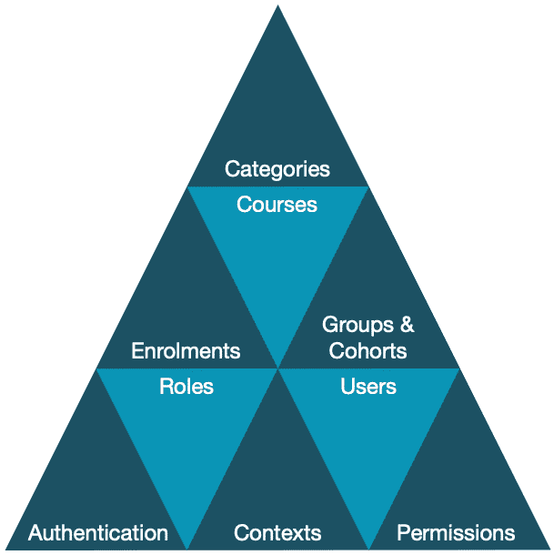
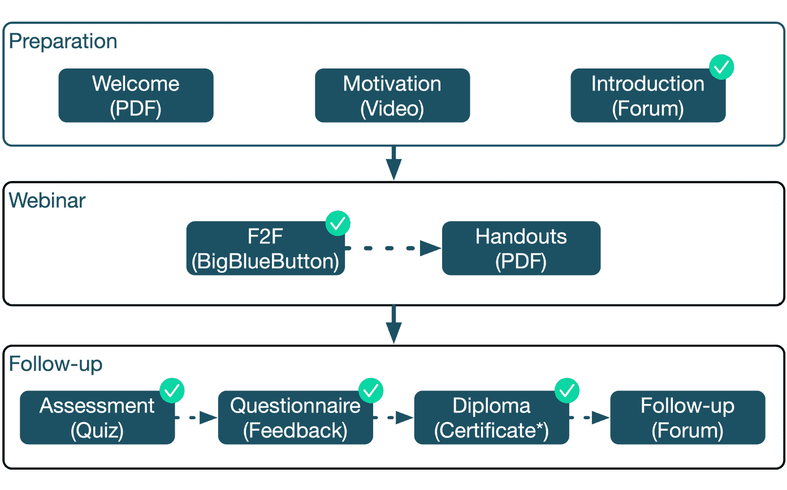
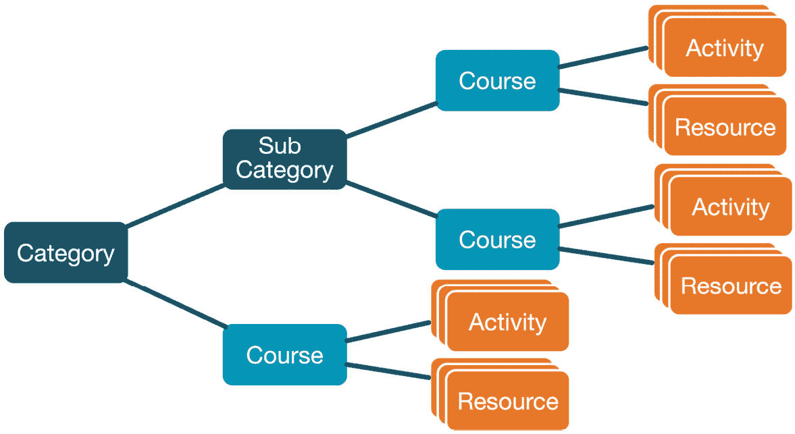
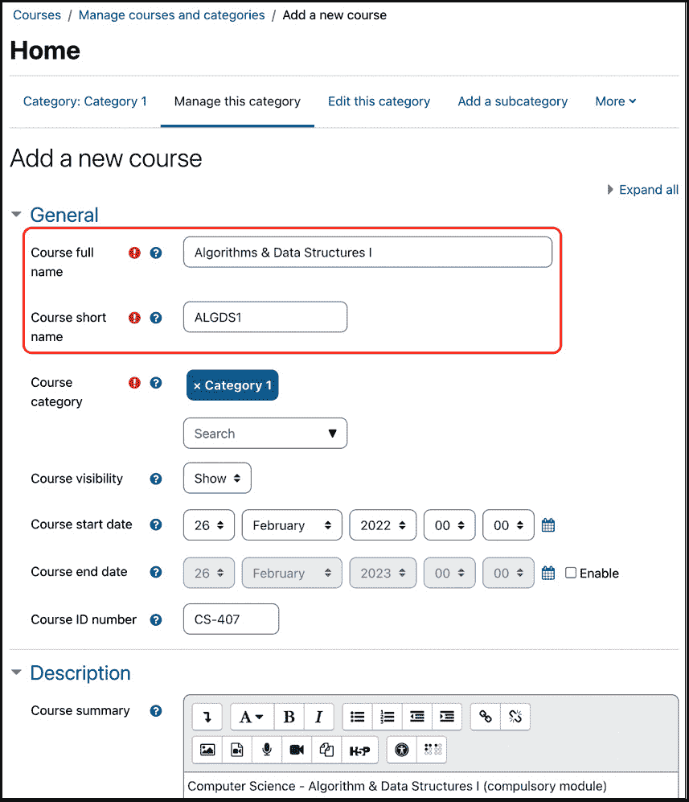
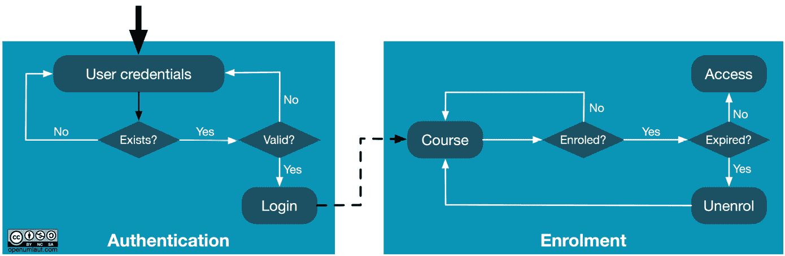
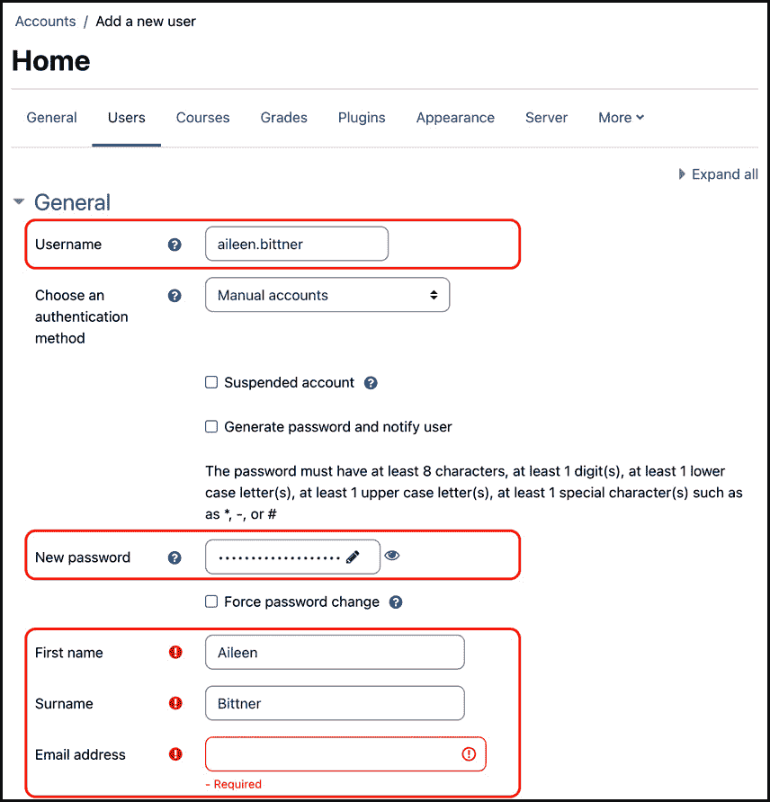
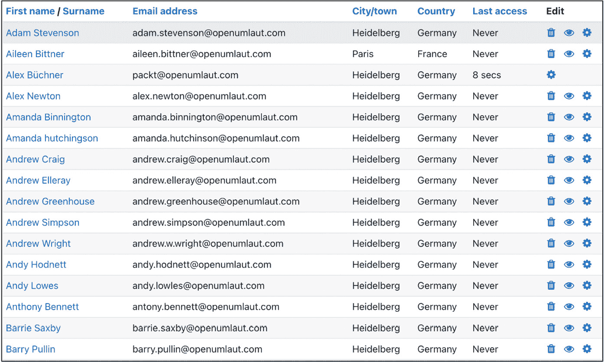
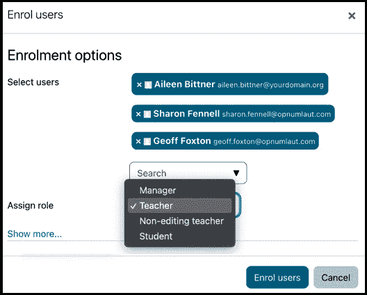
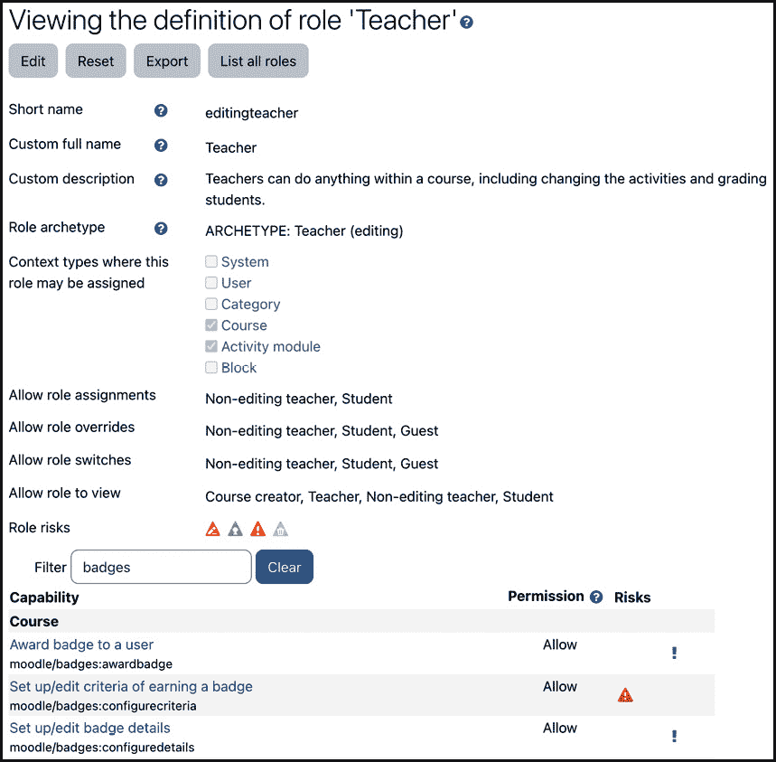

# 第三章：探索课程、用户和角色

本章的目标是快速概述 Moodle 的基础：课程、用户和角色。

这三个概念本质上是相互交织的，任何其中一个都不能在没有其他两个的情况下使用。我们将处理这三个核心元素的基本知识，并展示它们是如何协同工作的。

**Moodle 课程**是 Moodle 的核心，因为学习在这里进行。教师上传学习资源，创建活动，协助学习，评分工作，监控进度等。另一方面，学生阅读、收听或观看学习资源，参与活动，提交作业，与他人协作等。您将了解课程及其在类别中的组织方式。您还将了解课程的关键组成部分，即活动和资源。

**Moodle 用户**是访问我们 Moodle 系统的个人。典型的用户是学生和教师/培训师，但还有其他人，如教学助理、经理、家长、评估者、考官或访客。当然，还有管理员！在简要介绍两种不同类型的用户集合：班级和组之前，我们将介绍身份验证的基本概念——如何获取访问 Moodle 的权限，以及注册——如何获取访问课程的权限。

**Moodle 角色**实际上是权限，它指定了用户可以访问哪些功能，以及他们可以在哪里和何时（在 Moodle 中）访问它们。您将熟悉角色、上下文和能力等概念，这些对于控制 Moodle 中的权限至关重要。

请记住，本章仅涵盖这三个核心元素的基本概念。专门的章节——*第四章*，*管理课程和注册*，*第五章*，*管理用户、班级和身份验证*，以及*第六章*，*管理权限、角色和能力*——将更详细地处理这三个概念。

在本章中，我们将涵盖以下内容：

+   核心 Moodle 概念的概述

+   探索 Moodle 课程

+   探索 Moodle 用户

+   探索 Moodle 角色

到本章结束时，您将很好地理解 Moodle 的三个核心概念：课程、用户和角色。

# 核心 Moodle 概念的概述

让我们看一下以下图表，以给您一个课程、用户和角色的概述。它显示了这三个概念的核心地位以及其他功能如何与之相关。再次强调，所有这些复杂性都将适时处理，所以现在，请先熟悉一些 Moodle 术语。

图 3.1 – 核心 Moodle 概念

让我们从左下角开始，以大约顺时针的方向遍历金字塔。用户必须通过**身份验证**过程才能获得访问 Moodle 的权限。然后他们必须通过**注册**步骤来参加**课程**，这些课程本身被组织成**类别**。**分组**和**群体**是分别在课程级别或网站范围内分组用户的不同方式。**用户**被授予**角色**，特别是**上下文**，这些是 Moodle 的封闭区域；角色的范围通过配置**权限**来指定。

图表还展示了鸡生蛋，蛋生鸡的情况。如果我们从用户开始，我们就没有课程可以让他们注册；如果我们从课程开始，我们就没有可以参加的用户。不过不用担心——Moodle 允许我们在管理区域之间来回切换，并且经常同时执行多个任务。

一篇关于**enrol vs enroll**语言争议的简短笔记，这个争议似乎和 Moodle 本身一样古老。虽然这本书必须用美式英语编写，但我们决定使用英国英语拼写这个术语，主要有两个原因：首先，在 Moodle 内部，*enrolment*一词被广泛使用——例如，作为批处理文件中的参数——其次，Moodle Docs 使用*enrol*（毕竟 Moodle 是澳大利亚的）。所以，*enrol*和*enrolment*就这样定了！如果你因此发疯。或者疯狂。或者两者兼而有之。

现在你已经得到了一个高级概述，让我们从三角形的顶部角落开始，处理课程。

# 探索 Moodle 课程

课程是 Moodle 的核心，因为这是内容呈现给学习者并且大多数学习和协作发生的地方。

在接下来的部分中，首先，我们将介绍课程中最基本的两个学习元素：资源和活动。然后，我们将查看组织课程层次结构的类别。最后，你将创建你的第一个课程。

重要注意事项

Moodle 是一个以课程为中心的系统。

## 资源和活动

Moodle 管理活动并在课程中存储资源，大多数学习都发生在这里：

+   **资源**是学习元素，其中学习者是被动的一例如，可以阅读 PDF 文档，可以导航到 URL，可以收听播客，或者可以观看视频

+   **活动**是学习元素，其中学习者是活跃的并且更加投入——例如，在讨论论坛中发帖，回答反馈问卷，与他人合作编写 FAQ，或者在基于 SCORM 的测验中回答问题

资源和活动可以按任何顺序排列，并且可以通过访问限制和活动完成标准的组合来指定依赖关系。为了说明内容的顺序与非顺序工作原理，让我们看看一个示例混合学习课程。在我们的例子中，这包括三个阶段（在 Moodle 中称为主题），但任何其他结构都是可能的：*准备*（研讨会前）、*网络研讨会*（面对面）、*后续*（研讨会后）：

图 3.2 – 样本课程内容

在准备部分，参与者可以阅读提供的 PDF 文档并观看激励视频。他们还被要求在论坛中介绍自己，以便与会者在活动开始前开始建立联系。虽然前两个活动是可选的，但介绍是强制性的，并且是参加研讨会的先决条件。在提供讲义之前，培训师必须标记网络研讨会活动已完成。后续活动包括四个活动：必须达到测验的一定百分比才能完成评估，必须在颁发文凭（通过第三方插件）之前提交反馈问卷。只有当所有三个活动都完成后，才会授予校友论坛的访问权限。

## 课程分类

分类作为课程的容器，并且可以拥有子分类、子子分类等。这种层次结构类似于您计算机上文件和文件夹的排列，其中分类类似于文件夹，课程类似于文件：

图 3.3 – 分类、课程、活动和资源

Moodle 随带一个默认分类，称为 **分类 1**，足以展示课程的基础知识。我们将在 *第四章* *管理课程* 和 *注册* 中更详细地讨论分类。

重要提示

一门课程始终属于一个分类。它不能属于多个分类，也不能没有分类。

## 创建 Moodle 课程

创建新课程的最快方式是通过 **网站管理** | **课程** | **添加新课程**。现在，让我们专注于两个必填字段，即 **课程全名** 和 **课程简称**：

1.  输入课程全名（在此，我们使用了 `算法与数据结构 I`），该名称将在 Moodle 的多个位置显示。

1.  输入课程简称（在此，我们使用了 `ALGDS1`），该简称默认用于识别课程。

图 3.4 – 创建 Moodle 课程

您还可以看到已提到的默认课程分类，**分类 1**。要更改其名称或添加其他分类和子分类，您需要在顶部菜单中选择相应的选项。

目前，我们将保留所有其他字段为空或使用其默认值，并通过点击底部**保存并显示**按钮来保存课程。显示的屏幕显示了课程的基本框架，没有任何内容，除了一个公告论坛。

当你选择**参与者**标签时，你会看到你的账户已经被添加。Moodle 会自动这样做。然而，我们目前还不能添加任何更多的学习者到课程中，因为我们还没有向我们的系统中添加任何用户。让我们通过添加一些用户来纠正这种情况，然后再返回到这个屏幕。

# 探索 Moodle 用户

Moodle 中的每个用户都表示为一个**用户账户**，其中包含有关个人资料的信息。在以下小节中，我们将在创建第一个用户账户（们）并注册这些用户到课程之前，简要解释用户认证和注册之间的区别。

## 认证和注册

在我们开始之前，理解认证和注册之间的区别至关重要。用户必须通过认证才能登录到 Moodle，而**认证**通过登录授予用户访问系统，需要提供用户名和密码。Moodle 支持大量的认证机制，例如 MS-AD、LDAP 和 SAML。目前，让我们使用所谓的手动认证来简化整体用户管理。

**注册**发生在课程层面。然而，在课程注册之前，用户必须在系统中进行认证。房屋和钥匙的类比可能会有所帮助：你需要一个进入房屋（Moodle）的钥匙（认证），然后你需要为每个房间（课程）单独的钥匙（注册）。

因此，一个典型的流程如下（尽管总是有例外，但这对目前来说已经足够了）：

1.  创建您的课程（和类别）

1.  创建用户账户

1.  将用户与课程关联并分配角色

再次，这个顺序很好地展示了在 Moodle 中课程、用户和角色是如何相互交织的。另一种看待认证和注册之间区别的方法是用户如何获得课程的访问权限。请记住，这是一个非常简化的观点，它忽略了支持的功能，如外部认证、访客访问和自助注册：

图 3.5 – 认证和注册

在认证阶段，用户输入他们的凭据（用户名和密码），或者通过单点登录自动输入。如果账户存在于本地（即在 Moodle 内部）且密码有效，则用户将被授予访问权限。如果账户在外部持有（例如，在活动目录中），则检查将在远程进行。

一旦成功，下一个阶段就是注册。如果用户已注册且注册尚未过期，则允许访问课程，可以在其中处理资源和活动。如前所述，此图形仅显示非常基础的内容，但希望现在它能够展示认证和注册之间的区别。您将在*第四章*，*管理和注册课程*中遇到这些图形的更详细版本，当我们处理各种注册方法时。

## 添加用户账户

要手动添加用户账户，请转到**网站管理** | **用户** | **添加新用户**。与课程一样，我们只会关注必填字段，这些字段应该是自解释的：

1.  提供一个*唯一的*用户名。

1.  设置新密码。如果已设置密码策略，则可能适用某些规则。

1.  输入用户的姓氏和名字。

1.  提供用户的电子邮件地址。它必须是唯一的，尽管有绕过此限制的方法。

1.  确保通过在页面底部选择**创建用户**来保存账户信息：

图 3.6 – 添加 Moodle 用户账户

在这里，通过批量上传创建了几个更多账户，这些将在*第五章*，*管理和认证用户、群体*中处理。要查看谁可以访问您的 Moodle 系统，请从**网站管理**菜单中选择**用户** | **浏览用户列表**，您将看到所有用户：

图 3.7 – Moodle 用户账户

现在我们系统中有一些用户了，让我们回到我们之前创建的课程，并手动注册新的参与者。

## 用户注册

要实现这一点，请转到**网站菜单**中的**我的课程**。为什么课程会出现在我的课程列表中？记住，当我们之前创建课程时，Moodle 自动将我们的账户添加到了课程中。点击一个课程，再次选择**参与者**标签页，然后点击**注册用户**按钮以添加更多用户。将出现一个弹出窗口，您可以通过**搜索**字段选择一个或多个用户：

图 3.8 – 注册用户

您可能已经注意到在所选用户账户列表下方有一个**分配角色**下拉菜单。这就是您选择所选用户（们）将被授予的角色的地方，这引出了我们三角形的第三个顶点：*角色*。

# 探索 Moodle 角色

角色定义了用户可以在您的 Moodle 系统中看到和执行什么操作。Moodle 附带一些预定义的角色 – 我们已经看到了**学生**和**教师** – 但它还允许我们创建自己的角色 – 例如，监护人或外部评估员。

## 将角色置于上下文中

每个角色都有一个特定的范围（称为其**上下文**），由一组权限（表示为**能力**）定义。例如，教师可以批改作业，而学生则不能。或者，学生可以提交作业，而教师则不能。

重要提示

角色是在上下文中分配给用户的。

好的，那么什么是上下文呢？上下文是在 Moodle 中分配角色给用户的一个隔离区域。用户可以在不同的上下文中被分配不同的角色。上下文可以是课程、类别、活动模块、另一个用户、一个块、主页或 Moodle 本身。例如，你被分配了整个系统的**管理员**角色，但除此之外，你可能在负责的任何课程中都被分配了**教师**角色；或者一个学习者在一个课程中被分配了**学生**角色，但在论坛中可能被授予了**教师**角色以充当（临时的）版主。

## 定义角色

为了让你了解角色是如何定义的，让我们转到**网站管理** | **用户** | **权限** | **定义角色**。点击**教师**角色，经过一些基本设置后，你会看到一个（非常）长的能力列表：

图 3.9 – 角色、权限和能力

我们将在*第六章*中更详细地处理所有这些内容，*管理权限、角色和能力*，所以没有必要恐慌！

目前，我们只想坚持使用本章中使用的示例。既然我们已经知道了角色的概念，我们可以稍微修改一下我们之前所说的内容。与其说“我们已经将用户`aileen.bittner`注册为`ALGDS1`课程的学员”，我们可以说“我们在`ALGDS1`课程中为用户`aileen.bittner`分配了学员角色。”

在授予和拒绝用户权限时，角色至关重要。然而，当你开始使用 Moodle 时，尽量坚持使用预配置的角色，因为它们在大多数设置中已被证明是足够的。如果需要，你可以在稍后阶段调整角色。

这完成了关于权限的部分，完成了课程、用户和角色的三角形。掌握了这些知识，你现在可以更详细地了解三个核心概念。

# 摘要

本章简要介绍了 Moodle 课程、用户和角色的概念。我们还看到了它们在 Moodle 中的核心地位以及它们是如何内在交织在一起的。任何一个概念都不能没有其他两个而单独存在，这是你应该记住的。

只为了回顾，本章的三个关键要点如下：

+   课程包括活动和资源，这是学生学习的场所。课程按照层级组织成类别。

+   用户通过账户来表示；通过身份验证获得系统访问权限，通过注册获得课程访问权限。

+   角色在特定上下文中（如课程）为某些用户授予某些功能的权限。

如果你没有完全理解这三个领域的任何一个，不要担心。目的是为你提供一个三个核心组件的高级概述，并简要介绍基础知识。

每个概念都有专门的章节，希望这能澄清任何悬而未决的问题，并更深入地探讨它们。在下一章中，我们将讨论课程及其管理。
