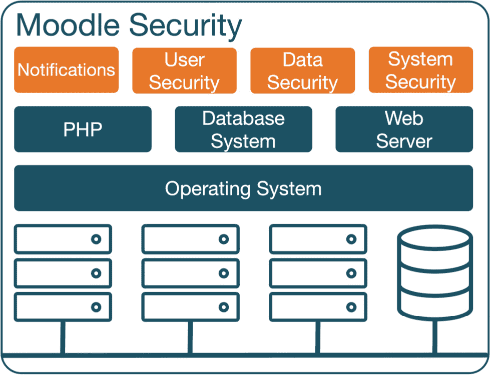
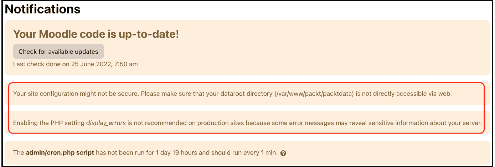
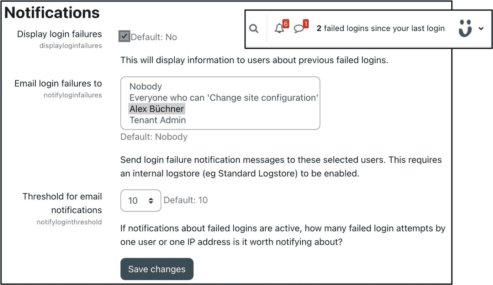
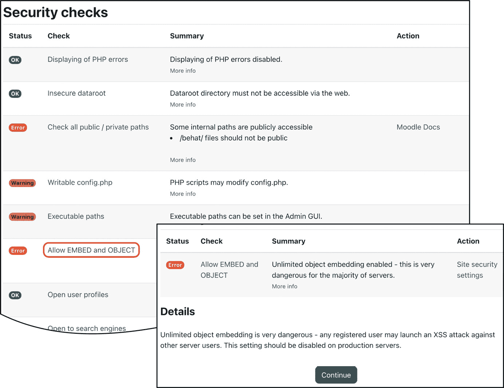
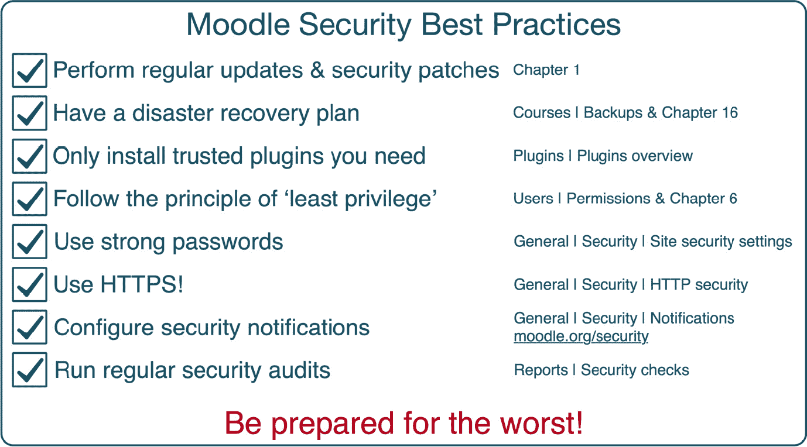

# 第十三章：确保 Moodle 安全

Moodle，就像任何其他网络应用一样，存在被滥用的潜在风险。Moodle 专门设置了一个章节，用于安全设置，管理员可以使用这些设置来精细调整其安全性。在概述 Moodle 的安全设置之后，你将了解以下主题：

+   **安全通知**：你将学习如何设置 Moodle 的通知机制，以警告你潜在的安全问题，并检查内置的安全报告。

+   **用户安全**：我们将探讨 Moodle 密码配置、用户详细信息保护和垃圾邮件预防。

+   **内容安全**：我们将处理在 Moodle 内创建的内容的潜在问题及其可见性。你将学习如何限制 Moodle 内创建的内容、设置内容可见性以及配置防病毒扫描器。

+   `root`目录和 cron 执行）、支持 HTTPS 以及与 IP 阻止器协同工作。

在我们介绍上述四个主题之前，让我们先概述一下 Moodle 的安全设置，涉及技术栈的所有层次。

# Moodle 安全 – 概述

Moodle 对安全极为重视，任何潜在问题都得到最高优先级处理。严重问题的修复漏洞通常会导致小版本的发布，强调该主题的重要性。

以下图表展示了典型 Moodle 设置的层次结构，其中必须确保每个组件的安全性：



图 13.1 – Moodle 安全

系统的安全性与其最薄弱的环节一样好。由于 Moodle 依赖于底层软件、硬件和网络基础设施，安全可能在这些多个领域中被破坏。由于本书专注于 Moodle 管理，我们只涵盖 Moodle 本身的安全元素。以下领域**不**涉及，需要咨询相关文档和安全问题专家：

+   **软件**：如*第二章*《探索 Moodle 系统》所述，Moodle 的关键组件包括一个**Web 服务器**（通常是 Apache 或 Microsoft IIS）、一个**数据库服务器**（MySQL、Microsoft SQL Server、PostgreSQL、MariaDB 或 Oracle）以及一种编程语言（**PHP**）。还需要额外的 PHP 和操作系统扩展，例如，以支持上述数据库系统。

+   **操作系统**：操作系统的安全性始终面临被恶意利用的威胁。操作系统加固是系统管理员的一项关键任务。

+   **硬件**：Moodle 运行在内部或外部托管的服务器上（物理或虚拟）。在这些系统中，持续的安全和改进正在进行，这反映在数据中心和托管提供商采取的日益扩大的预防措施中。

+   **网络**：任何属于网络系统的系统都可能存在潜在的安全漏洞。防火墙、代理服务器和路由器的配置，以及一般网络安全性，是保护您的系统免受攻击的关键方面。

许多这些主题在[docs.moodle.org/en/Security](http://docs.moodle.org/en/Security)中有详细说明。

重要提示

适用于所有元素的一条规则是应定期安装最新的软件更新。

随着 Moodle 的复杂性和受欢迎程度的增加，确保采取所有可能的措施以防止任何安全问题变得至关重要。让我们从安全通知开始。

# 配置安全通知

Moodle 已经在其网站上设立了专门的页面[`moodle.org/security`](http://moodle.org/security)，用于处理安全问题。如果您注册了您的 Moodle 实例，这是强烈推荐的，您的电子邮件地址将自动添加到安全警报邮件列表中，这将在公共发布前两天通知您有关漏洞和更新的信息。要设置此功能，请转到**站点管理** | **常规** | **注册**，填写所需信息，然后点击**注册您的站点**按钮。

或者，关注@moodlesecurity 的 Twitter 账号，以获取任何 Moodle 安全公告的通知。

一旦您了解了一般的安全问题，就需要关注您 Moodle 系统中可能存在的任何潜在问题。在本节的剩余部分，我们将讨论设置 Moodle 通知和检查内置的系统报告。

## 设置 Moodle 通知

当您导航到**站点管理** | **常规** | **通知**时，Moodle 将显示您网站上的任何潜在问题。此链接还启动了已安装的 Moodle 更新和插件（请参阅*第八章*，*理解 Moodle 插件*)。

下面的屏幕截图显示了四条消息；第二和第三个问题显然属于安全类别：



图 13.2 – Moodle 通知

Moodle 在其日志文件中监控失败的登录尝试，如第*第十二章*中所述，*通过 Moodle 报告和分析获得洞察力*。重复的登录失败可能表明未经授权的用户正在尝试访问您的系统。除了定期检查您的日志文件外，您还应在导航到**站点管理** | **常规** | **安全** | **通知**时配置设置以监控这些活动：



图 13.3 – 安全通知

您可以指定用户是否会在屏幕上看到有关之前失败的登录消息，以及谁会收到关于登录失败的电子邮件。您还可以设置从同一 IP 地址发起的失败登录次数，这将触发这些通知。

虽然这并不是一个万无一失的威胁警报，但它可能会突出您系统中的一些问题，因此建议您激活它。通过电子邮件接收这些通知的另一个好处是客户关怀方面，当合法用户在尝试访问您的网站时感到沮丧时，您可以提供帮助。

## 检查安全检查

另一种机制是我们已经在*第十二章*“通过 Moodle 报告和分析获取洞察”中提到的，那就是您在**网站管理** | **报告** | **安全检查**中找到的安全报告：



图 13.4 – 安全检查

报告显示了几个潜在的关键安全问题，其状态（**正常**、**信息**、**警告**、**关键**或**错误**）以及摘要。当您点击问题名称时，您将被重定向到一个提供有关问题的更多信息，以及（如果可用）一个进一步**操作**链接到设置页面，您可以在那里纠正情况。

**安全检查**页面是识别一些潜在问题的良好起点。然而，它不能取代一些 Moodle 合作伙伴提供的全面安全审计、渗透测试或健康检查。

了解您的 Moodle 系统中正在发生的事情与确保关键组件的安全一样重要。让我们从任何 IT 设置中最薄弱的环节——用户开始。

# 确保用户安全

一个关键的安全方面在于确保只有特权用户可以访问您的系统，一旦他们经过身份验证，他们只能访问 Moodle 中他们的特权区域。

这里是关于魔法 Moodle 三角形中安全关键要素的快速回顾——用户、课程和角色：

+   确保正确的**身份验证**设置对于确保 Moodle 系统的安全至关重要，尤其是在自我注册或访客访问已被激活的情况下。我们在*第五章*“管理用户、群体和身份验证”中处理了内部、外部、基于提供者和系统身份验证方法。

+   一旦用户通过 Moodle 进行身份验证，您就必须确保他们只能注册他们应该有权限参加的课程，这由**注册**方法控制，如在第*4 章*“管理课程和注册”中详细讨论。

+   当用户注册课程或访问 Moodle 的其他任何区域时，确保他们获得正确的**权限**至关重要，这些权限通过角色和能力进行控制，这在*第六章*中详细讨论，*管理权限、角色和能力*。能力的六种风险类型——**信任**、**配置**、**跨站脚本**、**个人**、**垃圾邮件**和**数据丢失**——提供了对可能造成的损害的良好指示。

在本节中，我们将关注三个影响用户安全性的主题：

+   Moodle 密码，处理密码策略和恢复管理员密码

+   用户详细信息保护

+   防止垃圾邮件

让我们从 Moodle 密码开始，这是一个影响所有 Moodle 用户的主题。

## 配置 Moodle 密码

Moodle 提供了一个适用于手动账户的密码策略功能，可以通过访问 **站点管理** | **常规** | **安全** | **站点安全策略** 来配置，如下面的截图所示：


图 13.5 – 密码策略

Moodle 的密码策略支持以下配置选项类型：

+   **复杂性**：支持所有常见的密码要求，包括 **密码长度**、**数字**、**小写字母**、**大写字母**、**非字母数字字符** 和 **连续** **相同字符**。

+   **有效期**：可以在 **站点管理** | **插件** | **身份验证** | **手动账户** 中为手动账户指定密码过期时间，在这里您可以配置 **启用密码过期**、**密码持续时间** 和 **通知阈值**。相关设置包括 **密码轮换限制**（用户可以重用密码的次数），**验证密码重置请求的最大时间**（当触发密码恢复时），以及 **更改密码后注销**（除当前浏览器会话外的所有浏览器会话）。

+   **后果**：在登录失败次数过多后，您可以锁定用户账户。**账户锁定阈值**允许您指定触发向用户发送重新激活电子邮件所需的登录失败次数，**账户锁定观察窗口**设置允许您指定进一步登录失败将包含在当前暂停期间的时间段，而**账户锁定持续时间**允许您指定账户自动解锁的时间。

请记住，密码策略仅适用于手动账户。如果您使用不同的身份验证方法，锁定阈值将在其他地方定义——例如，在 **轻量级目录访问协议**（**LDAP**）实例中。

重要提示

强烈建议您为 Moodle 管理员账户使用强密码（长、复杂且随机），即使密码策略已被停用。

Moodle 使用 `bcrypt` (Blowfish) 对密码进行加密哈希存储。为了进一步提高密码安全性，Moodle 支持对密码进行**加盐处理**，即在每个用户的密码哈希中添加一个单独的随机字符串。存储在 Moodle 数据库中的密码具有以下格式：

```php
$<hash_id>$<cost>$<secure salt><hash>
```

`<hash_id>` 是使用的哈希算法的 ID（`2y` 表示 bcrypt），而 `<cost>` 是使用该算法的成本（两位数字）。`<secure salt>` 是一个随机生成的 22 位字符的盐；您可以在 [docs.moodle.org/en/Password_salting](http://docs.moodle.org/en/Password_salting) 上找到有关加盐的更多详细信息。《hash>` 是实际密码的 31 位哈希值。

如果您丢失了管理员密码且无法恢复，您有两个选择：

1.  在 SQL 数据库中的 `mdl_user` 表中通过手动将旧哈希替换为新密码的 `MD5` 值来设置密码；在第一次登录后，它将被升级为强哈希值。例如，要将密码设置为 `'newpassword'`，您需要使用以下 SQL 语句：

    ```php
    UPDATE mdl_user
        SET password = MD5('newpassword')
        WHERE username = 'admin';
    ```

如果您的数据库不支持 `MD5` 函数，您必须将密码设置为实际的 `MD5` 哈希标签。例如，对于 `'newpassword'`，这将是一个 `5e9d11a14ad1c8dd77e98ef9b53fd1ba` 的标签。使用许多可用的在线生成器之一来查找标签。

1.  `reset_password.php` CLI 脚本为任何给定用户设置正确加盐的密码。将管理员密码更改为 `'newpassword'` 的语法如下：

    ```php
    sudo -u www-data /usr/bin/php admin/cli/reset_password.php --username=admin --password=newpassword --ignore-password-policy
    ```

密码防止用户未经授权访问 Moodle。一旦用户已经确认了自己的身份，下一步就是保护他们的用户详细信息，这是以下小节的主题。

## 保护用户详细信息

网络上的身份盗窃是一个普遍问题，Moodle 也不例外。为了避免欺诈者收集有关已认证用户的信息的可能性，可以通过导航到**网站管理** | **常规** | **安全** | **网站安全策略**来查看以下设置：

+   **保护用户名**：如果用户忘记了他们的用户名或密码，Moodle 提供了一个**忘记密码**界面。默认情况下，显示的消息是**如果您提供了正确的用户名或电子邮件地址，则应已向您发送电子邮件**。然而，如果保护被关闭，则消息将变为**应已向您在******@<域名>的地址发送电子邮件**，这可能会允许猜测用户名。

+   **强制用户登录**：默认情况下，Moodle 的首页对所有人均可见，即使他们未登录到网站。如果您希望强制用户在看到首页之前登录，请更改此参数。因此，您的用户在进入您的网站时将只能看到登录界面。

+   **强制用户登录以访问个人资料**：当设置为**是**（默认设置）时，用户在访问其他用户的个人资料页面之前必须使用真实账户登录。

+   **强制用户登录查看用户图片**：如果禁用（默认），访客将能够看到其个人资料中的其他用户的图片。否则，将显示默认用户图片。一些组织完全禁用用户个人资料图片，这可以通过**禁用用户个人资料图片**选项实现。

+   **对搜索引擎开放**：Moodle 可以配置为允许搜索引擎爬取具有访客访问权限的课程，并将其内容添加到其搜索引擎数据库中。此功能默认关闭。

+   **允许搜索引擎索引**：不言自明的选项是**除了登录和注册页面之外的所有地方**、**所有地方**和**任何地方**。请注意，这些设置无法强制执行，因为每个网站都会添加一个标签头，要求搜索引擎尊重它。

+   **个人资料可见角色**：任何选定的角色都将显示在用户个人资料和参与页面上。

在**站点安全设置**屏幕下方还有两个相关的参数。您可以激活**电子邮件更改确认**。如果设置为**是**，用户将收到一封电子邮件以确认他们在个人资料中更改电子邮件地址是真实的。Moodle 提供了一种通过 cookie 记住用户名的方法，当打开登录表单时，这些 cookie 将被输入。虽然这对最终用户来说很方便，但它可能存在潜在的安全风险。为了防止此功能被支持，请通过转到**站点管理** | **常规** | **安全** | **站点安全策略**来配置**记住用户名**参数。由于用户名存储在永久 cookie 中，这可能会侵犯用户隐私（参见*第十四章*，*遵守数据保护法规*)）。

默认情况下，Moodle 会在用户从新设备登录时触发通知。为了避免用户禁用此安全措施，您可能希望将**新登录通知**状态更改为**锁定**，在**站点管理** | **常规** | **消息** | **通知设置**中。

与用户详细信息保护相关的是防止个人资料垃圾邮件，这将在用户安全部分最后一个主题中介绍。

## 防止垃圾邮件

如果 Moodle 配置不正确，它将允许垃圾邮件发送者将内容插入通过自助注册创建的账户的用户个人资料中。

重要注意事项

只有在必不可少的情况下才使用基于电子邮件的自助注册。

如果您必须使用自助注册，请确保采取以下措施：

+   在**站点管理** | **插件** | **身份验证** | **管理身份验证**中启用**reCAPTCHA**。在同一页面上配置**允许的电子邮件域名**和**拒绝的电子邮件域名**。请参阅*第五章*中的*常见身份验证设置*部分，*管理用户、群体和身份验证*。许多公开在线列表包含一次性电子邮件地址的域名，您可能希望将其用于拒绝列表。

+   在**通用** | **安全** | **网站安全策略**中保持**电子邮件更改确认**启用。

+   按照本章后续部分所述配置 IP 阻止器。

为了防止**个人资料垃圾邮件**，请确保在**通用** | **安全** | **网站安全策略**中的以下设置设置正确（默认情况下是正确的）：

+   保持**强制用户登录查看个人资料**参数启用（参考*用户详细信息保护*部分）。这样，您可以防止匿名访客和搜索引擎查看用户个人资料。

+   您可以通过**仅对已注册用户启用个人资料**设置进一步限制更改个人资料的访问权限，仅限于通过课程注册的用户。

此外，请注意，合法用户可能是垃圾邮件的来源。确保没有任何用户在他们的角色中拥有任何不必要的权限，这可能导致这种情况（参考*第六章*，*管理权限、角色和功能*中的垃圾邮件风险）。

如果您的网站遭受了垃圾邮件攻击，请转到**网站管理** | **报告** | **垃圾邮件清理器**。您可以选择让 Moodle 自动检测常见的垃圾邮件模式（该列表值得一读！）或搜索您自己的关键词：


图 13.6 – 垃圾邮件清理器

任何**描述**字段包含所列关键词的用户个人资料都会显示出来。然后您可以选择删除用户账户。有关 Moodle 中垃圾邮件预防的更多信息，请参阅[docs.moodle.org/en/Reducing_spam_in_Moodle](http://docs.moodle.org/en/Reducing_spam_in_Moodle)。

这就结束了关于用户安全性的章节，其中我们涵盖了 Moodle 密码配置、用户详细信息保护和垃圾邮件预防。接下来是内容安全。

# 确保内容安全

学习者和教师创建的内容可能包含恶意代码，一旦创建，就需要防止未经授权的访问。本节将确保内容安全（即在 Moodle 中创建的内容）、内容可见性和防病毒扫描器。

## 限制 Moodle 内创建的内容

用户可以通过使用 Atto 编辑器或上传文件来创建 Moodle 内容。在**网站管理** | **通用** | **安全** | **网站安全策略**中，有两个设置可以部分防止这些内容的滥用：


图 13.7 – 内容安全设置

这两个参数如下：

+   HTML 允许嵌入使用显式`<EMBED>`和`<OBJECT>`标签的代码。潜在地，恶意代码可以放入嵌入的脚本中，这就是为什么默认情况下禁用了对其的支持。要激活它，请启用**允许 EMBED 和 OBJECT 标签**参数。

+   Atto 编辑器会自动移除任何不需要的 HTML 元素和属性。您可以绕过此清洁机制为个别用户设置。首先，您必须为每个您信任提交 JavaScript 和其他潜在恶意代码的用户设置`moodle/site:trustcontent`能力。这些用户创建或上传的文本将被标记为可信，并在显示前不会被清理。

如果您希望在论坛等活动中的学习者输入的淫秽或其他不受欢迎的词语被审查，Moodle 在`filter_censor.php`中开发了`badwords`语言字符串（请注意，此列表远非 G 级）。此外，请记住，过滤器会捕获单词中的单词，并标记有效术语，如 cocktail、sexton、sparse 和 altitude。

好的，在你完全发挥想象力之前，让我们先设置内容可见性。

## 设置内容可见性

博客、标签和评论是 Moodle 社交网络活动。博客条目、标签和评论被用于搜索、分享和执行其他协作活动以匹配兴趣。潜在问题是内容对那些不应能够分享或查看条目的用户可见。Moodle 通过提供几个设置来解决这个问题，我们已经在*第九章*的*配置协作工具*部分中处理过，*配置教育功能*。以下是需要开启和关闭相应功能性的区域列表：

+   **网站管理** | **外观** | **博客** | **博客可见性**

+   **网站管理** | **高级功能** | **启用** **标签功能**

+   **网站管理** | **外观** | **博客** | **启用评论**

如果您停用任何机制，系统上已存在或被隐藏的标签、评论和博客条目将在功能再次开启时重新出现。换句话说，关闭和重新开启功能时不会丢失数据。

您也可能考虑在您的系统上创建一个专用角色 – 例如，一个利用`moodle/blog:create`能力的博客作者角色。这将限制博客只对特定用户开放 – 那些被分配了新角色的用户。您可以在 Moodle Docs 中找到有关博客作者角色的更多详细信息，[docs.moodle.org/en/Blogger_role](http://docs.moodle.org/en/Blogger_role)。

内容安全性的最后一个组成部分是病毒扫描器的配置，将在以下子节中处理。

## 配置防病毒扫描器

Moodle 支持扫描上传文件中的病毒，这可以在**网站管理** | **插件** | **防病毒插件** | **管理** **防病毒插件**中进行配置：


图 13.8 – 管理防病毒插件

有一些通用的防病毒设置适用于所有防病毒插件。Moodle（以及大多数其他）防病毒扫描机制背后的三步流程如下：

1.  **检测**：文件将被扫描以查找潜在威胁，防病毒插件将确定检测方法。

1.  `$CFG->dataroot/antivirus_quarantine`隔离文件夹用于后续检查。

1.  **删除**：在禁用隔离时，检测到的文件将在检测后立即删除，在检查隔离文件夹后，或者当超过最大隔离时间时。

**ClamAV**是一个标准扫描器；更多防病毒插件可在 Moodle 插件目录中找到，地址为[moodle.org/plugins/?q=type:antivirus](http://moodle.org/plugins/?q=type:antivirus)。ClamAV 是一个开源防病毒引擎。有关更多详细信息、不同操作系统的下载以及如何保持病毒定义数据库更新的信息，请参阅[www.clamav.net](http://www.clamav.net)。您必须在配置扫描器通过**设置**链接之前在您的系统上安装 ClamAV。

ClamAV 有两种运行方法：

+   **通过命令行**：这是默认方法，您需要指定 ClamAV 已安装的路径。

+   **通过系统套接字**：在 Unix 系统中，可以使用 Unix 域套接字或 TCP 套接字来获得更好的性能。您需要联系系统管理员以获取这些参数的配置细节。

ClamAV 有两个限制。首先，ClamAV 不支持 Windows 服务器，您需要安装一个基于 Windows 的病毒扫描器来提供此功能并单独监控任何隔离文件。其次，ClamAV 将影响您的系统性能，如果文件上传功能被大量使用，这将成为一个问题。如果这种情况发生，您可能需要为您的服务器（s）分配 10-20%更多的 RAM。

这部分内容安全结束，我们涵盖了在 Moodle 中创建的内容、内容可见性和防病毒扫描器。最后一部分是确保系统安全。

# 确保系统安全

在本 Moodle 安全章节的最后部分，我们处理影响系统安全性的配置设置，包括对 dataroot 的访问、cron 执行、安全 HTTP 和 IP 阻止器。

## 配置对 dataroot 的访问

`dataroot`目录直接可通过互联网访问。Moodle 需要在服务器上额外空间来存储上传的文件，例如课程文档和用户图片。该目录称为`dataroot`，并且不得通过网页访问。如果此目录直接可访问，未经授权的用户可以访问内容。

重要提示

`$CFG->dataroot`不得通过网页访问！

为了防止`dataroot`目录可访问，将其移动到网站目录之外（确保不要损坏权限），并相应地修改`config.php`文件，通过更改`$CFG->dataroot`条目。

在外部托管环境中，通常无法在网页目录外找到目录。如果是这种情况，在数据目录中创建一个名为 `.htaccess` 的文件，并添加一行包含 `denyfromall` 的内容。

第二个系统安全措施是保护 cron 进程的执行，这将在下文中进行介绍。

## 保护 cron 执行

我们已经在*第一章*，“安装 Moodle”中描述了**cron**进程，并在*第十五章*，“优化 Moodle 性能”中会对此进行更详细的介绍。cron 是一个定期运行的脚本，用于执行某些操作，例如发送通知、处理统计数据和清理临时文件。在操作系统级别运行的脚本可能包含恶意代码。

可以通过在网页浏览器中输入以下 URL 来通过网页浏览器运行一个脚本：`<yourMoodlesite>/admin/cron.php`。在**站点管理** | **常规** | **安全** | **站点策略**中可以设置两个互斥的设置来防止这种情况：


图 13.9 – 配置 cron 执行

如果您只允许从命令行执行 cron 进程，则通过网页浏览器运行脚本将禁用，并显示一条消息，说明**抱歉，管理员已禁用此页面的互联网访问**。如果设置正确，cron 进程仍然可以自动执行。

如果 `<yourMoodlesite>/admin/cron.php?password=yourpassword`。如果没有提供密码或密码不正确，将显示一个错误消息，与之前我们看到的是相同的。

接下来是 HTTP 安全性的配置。

## 配置 HTTP 安全性

Moodle 提供了完整的 HTTPS 支持，它通过 SSL（一个更安全但稍微慢一点的套接字层）运行 HTTP 请求。鉴于黑客技术的快速发展和 SSL 证书的微乎其微的成本，每个包含用户数据的公开网页都应该通过 HTTPS 运行。

重要提示

跟着我重复：每个公开的 Moodle 网站都应该通过 HTTPS 运行，没有任何例外。

为了确保从用户的浏览器传输到托管 Moodle 的服务器的所有数据都经过加密，必须在您的 web 服务器上启用 HTTPS。您还必须购买或生成一个 SSL 证书。每个 web 服务器都有不同的方法来启用 HTTPS，因此您应该查阅您的服务器文档。Apache 设置 SSL/TSL 的良好起点可以在 [httpd.apache.org/docs/current/ssl/ssl_howto.xhtml](http://httpd.apache.org/docs/current/ssl/ssl_howto.xhtml) 找到。

一旦 Web 服务器被配置为使用 HTTPS，Moodle 安装脚本将使用这些详细信息（参见 *第一章*，*安装 Moodle*）。如果您需要从 HTTP 转换到 HTTPS，我们建议您遵循 Moodle Docs 上的说明 ([docs.moodle.org/en/Transitioning_to_HTTPS](http://docs.moodle.org/en/Transitioning_to_HTTPS)) 并使用 Moodle 在 **站点管理** | **常规** | **安全** | **HTTP 安全** 下方提供的 **HTTPS 转换工具**：


图 13.10 – HTTPS 转换工具

工具执行两个任务。首先，它扫描任何课程内容，并在发现任何潜在问题或冲突时通知您。其次，一旦您勾选了确认框，就会执行不可逆的转换；所有 HTTP 链接都更改为 HTTPS。

工具也可以使用以下语法在 CLI 模式下执行：

```php
sudo -u www-data /usr/bin/php admin/tool/httpsreplace/cli/url_replace.php --replace --confirm
```

关于该工具的更多详细信息，请参阅 [docs.moodle.org/en/HTTPS_conversion_tool](http://docs.moodle.org/en/HTTPS_conversion_tool)。

重要提示

如果您在没有安装相关系统组件的情况下启用 HTTPS – 即，添加 PHP 扩展以及正确的 Web 服务器配置 – 您将无法访问自己的系统！

在 **站点管理** | **常规** | **安全** | **HTTP 安全** 中有许多相关的设置，您应该仔细检查：

+   **仅支持安全 cookies**：Web 服务器可以被配置为只接受 HTTPS URL。如果您的系统是这样的，您应该启用此参数。

+   **仅支持 http cookies**：Moodle 支持指导网络浏览器仅在实际请求中发送 cookies，这可以防止一些 XSS 攻击。

+   **允许框架嵌入**：参见 *第九章* 中 *Moodle 作为 LTI 工具* 部分的提示，*配置* *教育功能*。

+   `localhost` 变体。

+   `80` 和 `443`。

HTTP 安全定义了您的 Moodle 实例通过什么协议访问以及相关的设置。最后一个系统安全主题涉及允许和阻止访问您网站的 IP 地址。

## 允许和阻止 IP 地址

用户将从固定和移动设备访问您的系统。他们共同的特点是都将通过 IP 地址访问您的网站。您可以通过在 **站点管理** | **常规** | **安全** | **IP 阻止器** 中指定允许列表和拒绝列表来限制这种访问：


图 13.11 – IP 阻止器

允许列表（**允许 IP 列表**）可以包含多种格式的 IP 地址（完整的 IP 地址、部分地址、IP 地址范围和 CDIR 表示法）。同样适用于拒绝列表（**阻止 IP 列表**）。默认情况下，拒绝列表优先于允许列表。如果您希望反转这一点，请选择 **允许列表将首先** **处理**。

重要提示

注意，在允许列表中的任何条目，其效果是只允许那些 IP 地址，并阻止所有其他地址。在使用此设置时要小心，因为有可能将自己锁在 Moodle 外面。

例如，您可能想将 `192.168.*.*` 添加到您的允许列表中，并拒绝一个特定的 IP 地址——比如，尝试多次猜测您的管理员密码的 `192.168.123.45`。

这部分关于系统安全的内容到此结束，我们讨论了 `dataroot` 的访问、cron 执行、HTTPS 和 IP 阻止器。

# 摘要

本章教您如何保护您的 Moodle 系统免受潜在的滥用，并定期检查其安全性。为了总结，以下是一个简短的检查清单，列出了以下最佳实践。虽然这份清单远非完整，但它为您作为 Moodle 管理员应负责的元素提供了指示：



图 13.12 – Moodle 安全最佳实践

强调一点很重要，Moodle 的安全性在整个方程中只是一个变量。确保所有其他底层软件、基础设施和硬件组件都正确设置。

如果出现安全威胁，强调制定应急计划的重要性。这包括识别问题的策略、解决情况的措施以及需要通知的用户名单等。

大多数 Moodle 系统运行在 LAMP 平台上，如果配置正确，已被证明非常安全。Moodle 的开发者非常清楚，在处理个人用户数据（如成绩、作业和能力）时，安全性至关重要。因此，这个主题被赋予了最高的优先级。然而，并不能保证您的系统 100%不受滥用。在当今的网络安全世界中，新的黑客技术将不断出现，用户将继续对他们的凭证疏忽大意（你们都见过键盘下的便利贴）。因此，请确保整个系统的安全补丁和更新始终是最新的，并继续教育您的用户关于这些危险。此外，考虑定期进行安全审计或健康检查，这是某些 Moodle 合作伙伴提供的。

现在您的系统已经安全，让我们确保其隐私设置符合数据保护法规。
