# 第十四章：遵守数据保护规定

数据隐私关乎个人数据的保护。根据其设置，Moodle 可能存储大量敏感数据，如 ID、地址、成绩和考试提交。随着**通用数据保护条例**（**GDPR**）的引入，一个具有法律约束力的框架已经建立，并且 Moodle 完全支持它。

本章将教会您如何配置 Moodle 站点以符合数据保护规定。

重要提示

**免责声明**：本章中提供的建议仅用于信息目的，不应被视为法律或专业建议。

在了解 GDPR 的一些法律背景之后，您将学习以下主题：

+   **指定隐私官**：您将学习如何设置隐私官角色并激活隐私官功能。

+   **管理策略**：在创建和更新版本化策略之前，我们将查看 Moodle 策略处理器的配置。我们还将进一步监控用户协议并处理 Moodle 系统中的未成年人。

+   **配置数据登记册**：在将它们分配到上下文之前，我们将设置数据登记册类别和目的。

+   **管理数据请求**：最后，我们将管理数据访问请求以处理数据更正（消息）、数据访问（导出）和数据擦除（删除）。

我们将以 Moodle 隐私检查表结束本章。在我们覆盖上述主题之前，让我们先熟悉一些法律术语。

# 理解 Moodle 隐私

**2018 年 5 月 25 日**：GDPR 适用于所有**欧盟**居民。

**提前一周**：Moodle 3.5 版本发布，支持一些但不是所有 GDPR 功能。

这是 Moodle 首次被迫实施一系列功能以符合立法规定（[gdpr-info.eu](https://gdpr-info.eu)）。所有必需的功能在 3.6 版本中完成实施，并且该功能被回滚到三个版本——这是 Moodle 的另一个首次。

虽然 GDPR 仅适用于欧盟居民或位于欧盟的网站，但有两个原因使得这些规定可能对所有 Moodle 系统都相关：

+   如果您的系统（学生、员工、供应商等）中有一个或多个用户来自欧盟，您有义务遵守该规定。或者，用更正式的法律术语来说：任何存储或处理来自欧盟成员国可识别个人信息的个人或组织（无论信息处理或存储是否发生在欧盟内）。

+   欧盟的数据保护法律长期以来一直被视为黄金标准，并且已被欧盟以外的许多国家完全或部分采用。

在我们配置您的 Moodle 系统中的隐私和政策设置之前，我需要向您介绍一些 GDPR 基础知识。GDPR 中使用了某些术语，您在配置 Moodle 隐私时可能会遇到，如下面的屏幕截图所示：

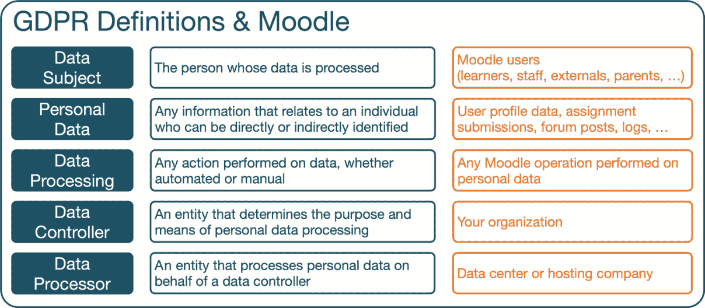

图 14.1 – GDPR 术语

总结*图 14*.1，数据主体的个人数据由数据处理者代表数据控制器进行处理。在 Moodle 的说法中，与用户相关的数据存储在您的数据中心或第三方托管公司，按照您组织的指示。

重要提示

GDPR 的主要目标是保护个人数据。

Moodle 存储个人和非个人数据，GDPR 关注的是个人数据，这是我们需要保护的数据。数据主体（Moodle 用户）对其存储和处理的具有深远权利的数据，已在以下屏幕截图和相应的 Moodle 功能中总结：

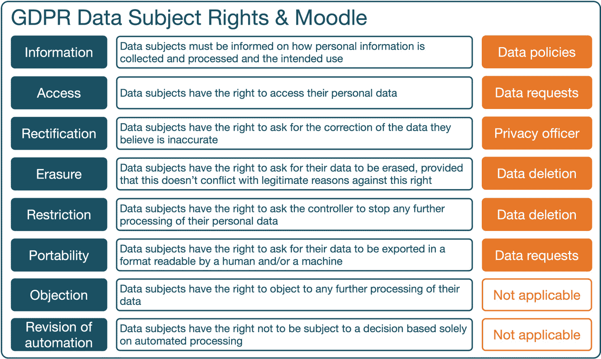

图 14.2 – GDPR 数据主体权利

从 Moodle 用户——抱歉，应该是数据主体的角度来看，可以通过用户资料中的**隐私和政策**部分获得这些权利，可能看起来像这样：

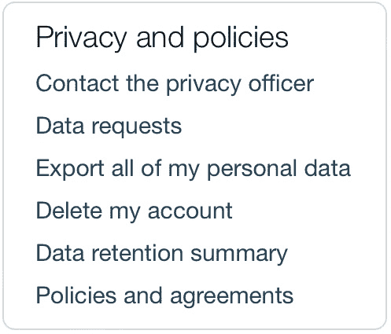

图 14.3 – GDPR 数据主体权利（Moodle 用户资料）

那么，为什么 Moodle 不能直接在其核心实现 GDPR 并标注该产品为 GDPR 合规？遗憾的是，这种硬编码的方法是不可能的，因为必须考虑和配置不同的因素。例如，用户的年龄（儿童比成人受到更好的保护），存储的数据类型（例如，年龄或性别可能在某个 Moodle 系统中是可接受的，但在另一个系统中则不是），以及本地或内部监管约束，这些约束优先于 GDPR——特别是数据的保留期限。

重要提示

并没有适合所有情况的 Moodle GDPR 设置。需要正确配置和实施流程和程序。

可能被视为 GDPR 不足之处的是其优势，因为它适应了不同背景下的各种设置。对于 Moodle 管理员来说，这有两个主要影响：

1.  您需要与法律专家联系。你知道，那些穿着灰色西装的人，他们按分钟收费。

1.  您需要根据灰色西装告诉您的内容配置 Moodle 的隐私设置、政策和流程。

GDPR 还规定了七项原则，用于合法处理个人数据。此外，在审计、违规或投诉的情况下，隐私实施必须补充必要的文件。这两项内容超出了本书的范围，本章不会涉及，但灰色西装将能够协助您在这些事项上。

足够的法律术语，让我们开始吧。Moodle 为这一主题专门设立了一个**隐私和政策**部分，我们将在本章的剩余部分进行介绍。首先，我们需要指定一个隐私官，这将在以下部分中处理。

# 指定隐私官

一旦 Moodle 的隐私功能设置完成，就需要有人处理来自用户的日常请求以及任何其他与隐私相关的问题。Moodle 将此功能命名为**隐私官**，我们在这里也将坚持使用这个术语。

Moodle 管理员通常在较小的实例中承担这一角色，在较大的系统中这通常是一个单独的功能。无论如何，我们建议设置一个专门的用户账户来处理任何与隐私相关的任务。

要在 Moodle 中建立隐私官，需要以下三个步骤：

1.  创建一个新的**隐私官**角色。

1.  在**系统**上下文中分配此角色给你的指定隐私官（们）。

1.  激活 Moodle 的隐私官功能。

分配此角色的上下文类型必须设置为`dataprivacy`和`policy`：

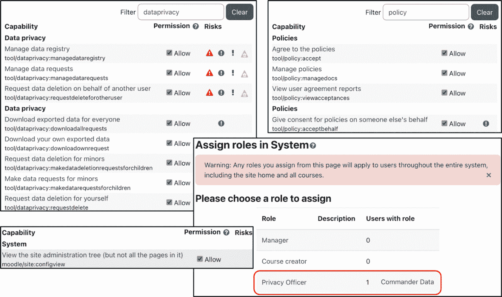

图 14.4 – 隐私官角色定义

有关创建和分配角色的更多详细信息，请参阅*第六章*，*管理权限、角色和功能*。

在`moodle/site:configview`能力中必须选择新角色，这将授予分配的隐私官访问相关网站管理菜单项的权限，如下所示：

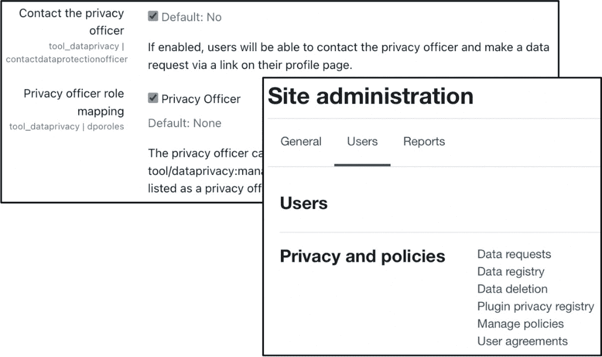

图 14.5 – 启用隐私官功能

一旦启用**联系隐私官**选项，用户将通过用户资料的**隐私和政策**部分访问该功能，如图*图 14.3*所示。建议在配置所有必需的隐私元素之前保持此功能未激活。我们将从作为政策实施的知情权开始。

# 管理政策

Moodle 实施了一个政策工具，允许你定义多个政策，支持政策版本，跟踪用户协议，并能处理未成年人的同意。

为了让您对 Moodle 政策的结构有一个初步的了解，请查看以下图表：

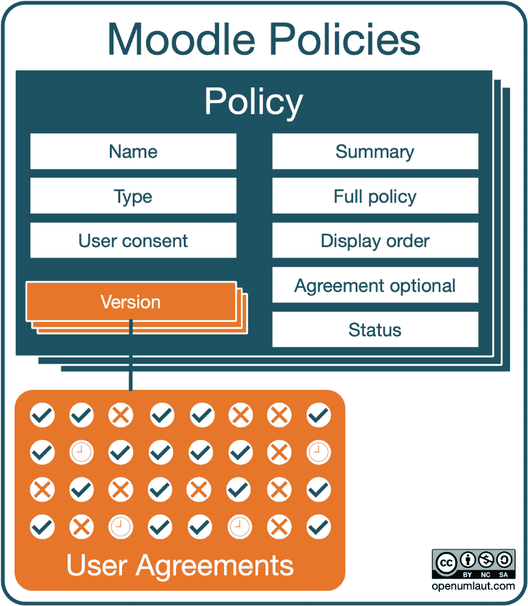

图 14.6 – Moodle 政策

一个网站可以有多个政策；例如，你可能有三个政策：一个处理用户数据隐私，一个处理 cookies，一个涵盖第三方插件和外部数据。

每个政策可以有多个版本。每次政策发生变化时，都会创建一个新的版本，可能需要用户同意。对于每个未标记为微小更改（错别字或外观调整）的版本，Moodle 都会跟踪用户协议。

在本节中，您将学习如何配置和监控以下策略功能：

+   选择站点策略处理器

+   创建和更新策略，包括策略版本

+   监控用户协议

+   处理未成年人（在 Moodle 中，而非生活中）

在我们创建第一个策略之前，我们首先需要选择一个站点策略处理器。

## 选择站点策略处理器

Moodle 站点策略处理器决定了数据策略和用户同意如何管理。Moodle 随附以下两个策略处理器：

+   **默认（核心）**：您可以指定一个**站点策略 URL**参数，该参数必须由所有注册用户同意，以及一个**访客站点策略 URL**参数

+   **策略（tool_policy）**：您可以管理多个站点、隐私和其他策略，包括策略版本，并监控不同类型的用户同意

`core`策略处理器是一种通用的方法，不支持高级策略功能。我们建议不要使用这个“旧”工具。本章的其余部分将重点介绍`tool_policy`，您必须通过在**站点管理** | **用户** | **隐私和政策** | **策略设置**中选择**站点策略处理器**类型来启用它，如下面的截图所示：

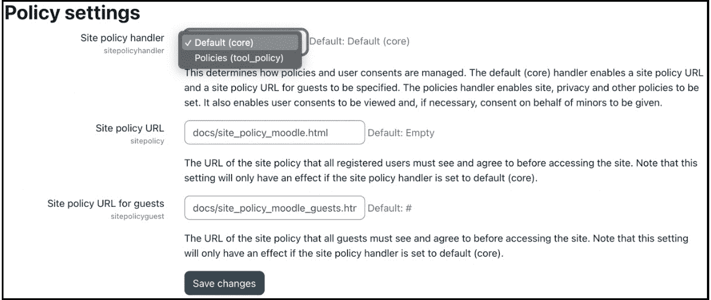

图 14.7 – 站点策略处理器

您可以在**站点管理** | **常规** | **移动应用** | **移动设置**中的**应用策略 URL**参数中为 Moodle 应用指定一个单独的隐私策略。如果留空，则将使用全局的**站点策略 URL**参数。我们已在*第十一章*中处理了应用策略，*启用* *移动学习*。

站点策略处理器已作为插件实现。技术上，未来可能开发并可在 Moodle 中提供其他法规的数据保护框架。

现在我们已经选择了正确的策略处理器，让我们创建我们的第一个策略。

## 创建策略

策略在**站点管理** | **用户** | **隐私和政策** | **管理策略**中进行管理。在我们的系统中，我们已经创建了三个策略——一个是活跃的，两个是草稿状态，如下所示：

图 14.8 – 策略和协议

每个首次登录您的 Moodle 站点的用户都必须同意任何有效的隐私通知；已有两位用户这样做，其他人仍在等待。

当您选择**新建策略**按钮时，您将看到以下屏幕：

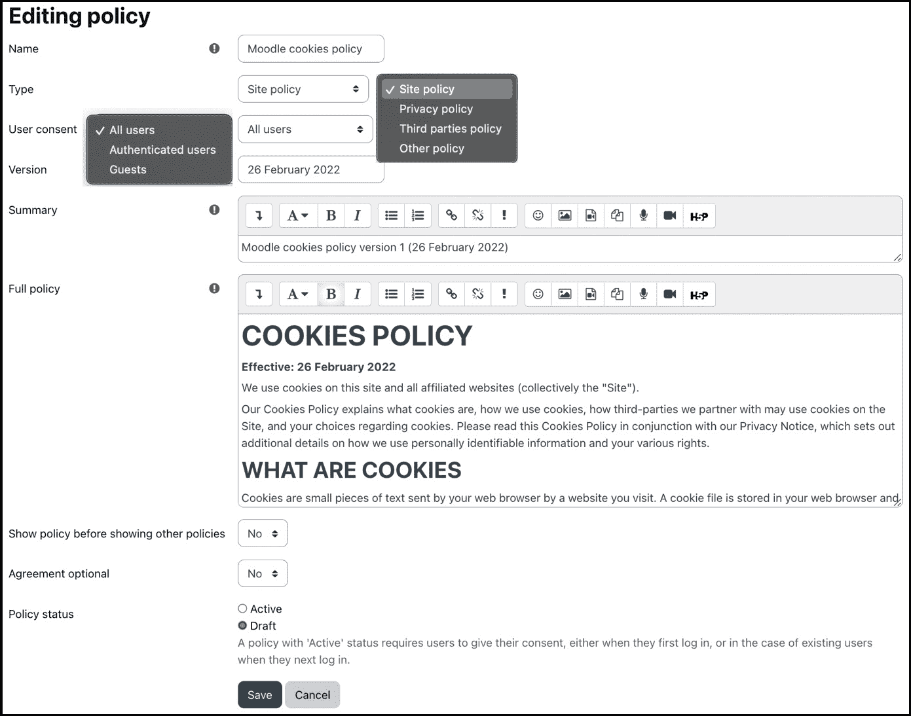

图 14.9 – 创建新策略

除了自解释的**名称**字段外，以下字段也必须提供：

+   **类型**：可用的选项有**站点策略**、**隐私策略**、**第三方策略**和**其他策略**。策略类型不会影响策略行为，仅用于显示目的。

+   **用户同意**：该政策适用于**所有用户**、**认证用户**还是仅**访客**？访客政策无需获得同意；相反，如果用户以访客身份浏览网站或登录，页面底部将显示一个模态通知窗口，其中包含指向为访客或所有用户定义的所有政策的链接：

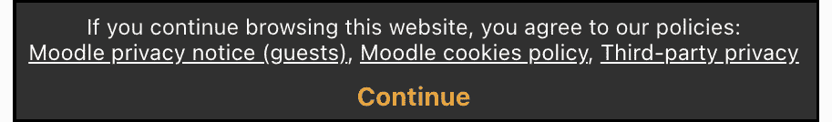

图 14.10 – 访客政策

+   **版本**：您应该制定自己的版本约定。大多数网站使用日期、版本号或两者的组合。如果编辑后的政策版本没有更改，Moodle 会自动将其附加一个版本号。

+   **摘要**：对政策的简短描述，将在确认屏幕上显示。

+   **完整政策**：这是政策的完整（法律）文本。

+   **在显示其他政策之前显示政策**：当存在多个政策时，这是否应该是第一个显示的政策？另一种更改政策顺序的方法是在**政策和协议**屏幕上使用上下箭头。

+   **协议可选**：可选协议会显示，但用户可以无后果地拒绝。

+   **政策状态**：一旦将状态从**草稿**切换到**激活**，用户（除管理员外）必须在登录时同意该政策。

在创建过多的试用政策时要小心：一旦将政策设置为**激活**状态，就再也不能删除了！您唯一能做的就是将其状态改回**草稿**，但除非您在数据库级别手动删除，否则它将无限期地保留在您的系统中。

如果您修改政策，Moodle 将创建一个新版本，我们将在以下小节中介绍。

## 更新政策（版本控制）

由于数据保护是法律要求，必须保留整个政策历史记录。这种可审计性适用于政策（首先涵盖）和用户协议（接下来涵盖）。

重要提示

当您编辑政策时，Moodle 将创建一个新版本。

在编辑用户政策时，您可能会更改其名称和/或内容（摘要或完整政策）。无论如何，有两个字段与政策处理相关：

+   **版本**：政策历史记录中的每个版本号都必须是唯一的。如果您不更改它，Moodle 会自动将其修改为版本号。

+   **政策状态**：如果政策状态为激活，您可以选择编辑的版本是微小更改还是重大更改。微小更改不需要用户同意；重大更改需要。

您可以通过**管理政策**页面上的**操作**列中的**查看先前版本**选项查看政策的版本历史。用户还可以通过其个人资料中的**隐私和政策**块中的**政策和协议**链接查看当前和过时的版本。以下是一个示例，我们的 cookies 政策有三个版本：

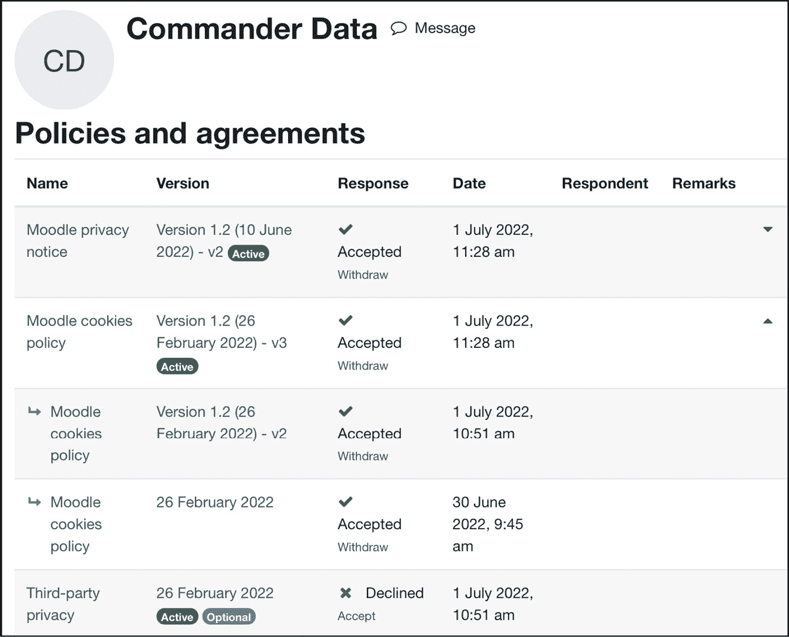

图 14.11 – 策略版本

一旦您创建并更新了您的策略，您就可以管理它们的用户协议，如下节所述。

## 监控用户协议

用户协议详细说明了所有相关方的权利和义务。

重要注意事项

用户协议是在数据主体（Moodle 用户）和网站的所有者、运营商或提供者（数据控制者或数据处理者）之间的一项**具有法律约束力的合同**。

由于用户协议具有合同性质，您，作为隐私官，或任何被授予权限（`tool/policy:viewacceptances`）的人必须跟踪用户协议。您可以在**站点管理** | **用户** | **隐私和政策** | **用户协议**中查看每个协议的状态：

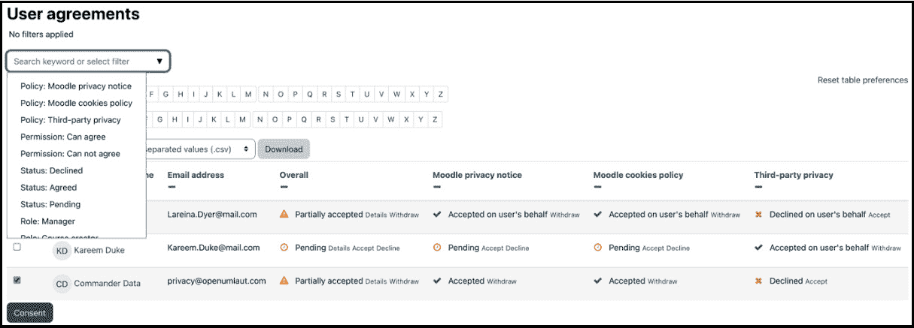

图 14.12 – 用户协议

您可以通过点击**Agreements**列中的链接，在**Manage policies**页面上查看特定策略的用户协议。您可以通过**Policy**（及其版本）、**Permission**、**Status**和**Role**来过滤表格。对于每个用户和每个策略，以下状态之一会被显示：

+   **接受**：用户已同意该策略。

+   **待定**：用户尚未（或尚未）同意该策略。

+   **拒绝**：用户已拒绝该策略。此状态仅存在于可选协议中。

任何具有`tool/policy:acceptbehalf`能力的用户都可以代表用户**同意**。此操作适用于已在线获得书面同意或需要代表未成年人同意的场景，我们将在下一部分处理。

## 处理未成年人

GDPR 特别重视保护儿童的个人信息。未成年人（年龄低于数字同意年龄的用户）可能无法同意隐私政策。相反，某人（通常是父母或监护人）必须代表他们同意。

为了处理用户同意策略的情况，您需要使用`tool/policy:accept`能力。根据您网站上未成年人的百分比，您可以选择以下两种不同的方法（部分借鉴自[docs.moodle.org/en/Policies#Minors](https://docs.moodle.org/en/Policies#Minors)）。

### 以未成年人为主要用户的网站

此方法阻止所有用户接受策略，除非您明确授予他们权限——例如，教师或员工。以下是您需要采取的步骤：

1.  将**Authenticated** **user**角色的`tool/policy:accept`能力设置为**禁止**。

1.  创建一个将`tool/policy:accept`能力设置为**允许**的新角色，并将**角色分配的上下文类型**设置为**系统**。

1.  将新角色分配给所有允许同意策略的用户。

有关修改和创建角色的说明，请参阅*第六章*，*管理权限、角色和功能*。

### 以未成年人为少数用户的网站

这种方法与之前的方法相反，防止任何人接受政策，除非个别选定的用户（未成年人）。请按照以下步骤操作：

1.  创建一个新角色，将`tool/policy:accept`能力设置为**禁止**，并将**角色可能分配的上下文类型**设置为**系统**。

1.  将新角色分配给所有不允许同意政策的用户。

为了避免处理基于纸张的政策和签名以及随后在 Moodle 上代表他们接受这些政策的开销，请考虑我们在*第六章*中介绍的**家长**角色，*管理权限、角色和功能*。

我们所讨论的场景涉及已经在你网站上认证的未成年人。当你预期未成年人注册新账户时，你还需要验证他们的数字同意年龄，我们将在下一个小节中介绍。

### 验证数字同意年龄

如果你已启用自助注册并预计未成年人将注册到你的网站，你应该在**网站管理** | **用户** | **隐私和政策** | **隐私设置**中启用**数字同意年龄验证**设置，如图下截图所示：

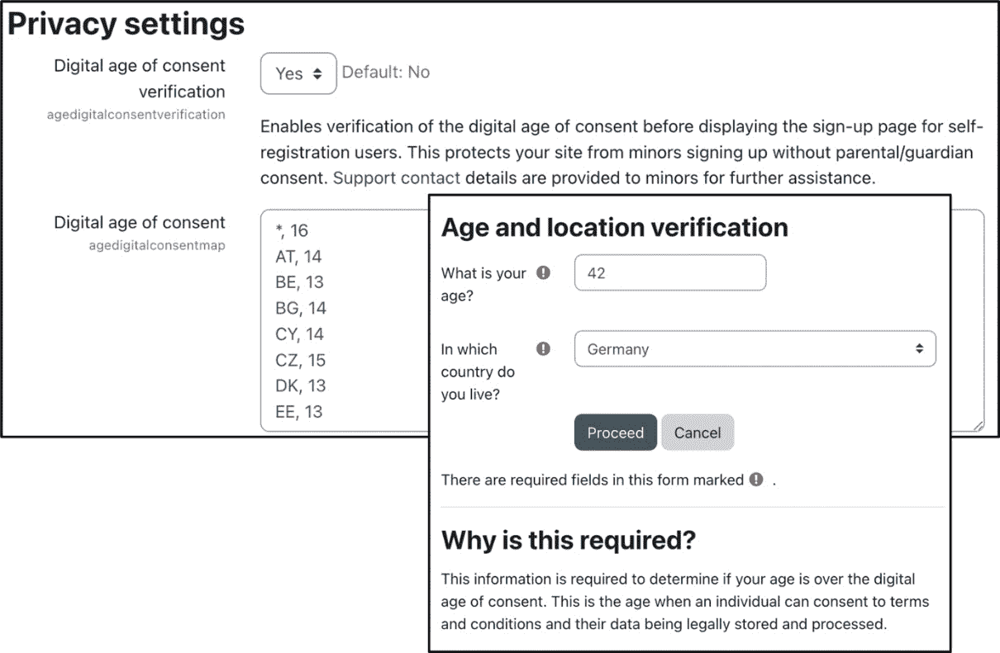

图 14.13 – 数字同意年龄

你可以进一步指定`国家代码`、`年龄`。默认年龄由`*`代替国家代码表示。两字母国家代码按照 ISO 格式指定。

一旦启用并配置，用户在允许继续之前必须提供他们的年龄并选择居住国家。

这部分关于隐私政策的讨论到此结束。本章的第二部分讨论数据登记册，这是管理数据请求所需的。

# 配置数据登记册

根据 GDPR，用户可以请求的信息类型之一是所有数据处理及其背后的推理列表，包括其保留期限。数据登记册包含这些信息，以类别和目的表示。

重要提示

**类别**用于在 Moodle 中组织数据。

**目的**描述了数据的使用（法律原因和保留期限）。

你可以在**网站管理** | **用户** | **隐私和政策** | **数据登记册**中找到数据登记册，它显示了以下说明：

*数据登记册使所有网站内容（从用户和课程到活动和块）的类别（数据类型）和目的（处理数据的原因）得以设置。对于每个目的，可以设置保留期限。当保留期限到期时，数据将被标记并列入删除名单，等待* *管理员确认* *。

这条注释完美地总结了数据登记册的目标。数据登记册的结构在以下图表中展示：

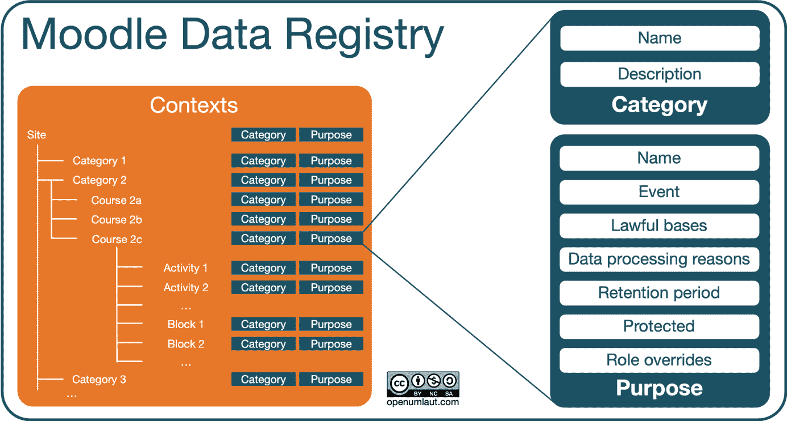

图 14.14 – 数据注册

系统中的每个上下文，从**站点**到用户和类别，一直到单个课程活动和块，都被分配了一个类别和一个目的。在我们能够管理数据请求之前，我们首先需要配置这些类别和目的，我们将在以下两个小节中介绍。

## 管理数据注册类别

从**站点管理** | **用户** | **隐私和政策** | **数据注册**中的**编辑**菜单中选择**类别**项以访问数据注册类别。使用加号按钮添加新条目；我们已创建了三个数据注册类别，如下所示：

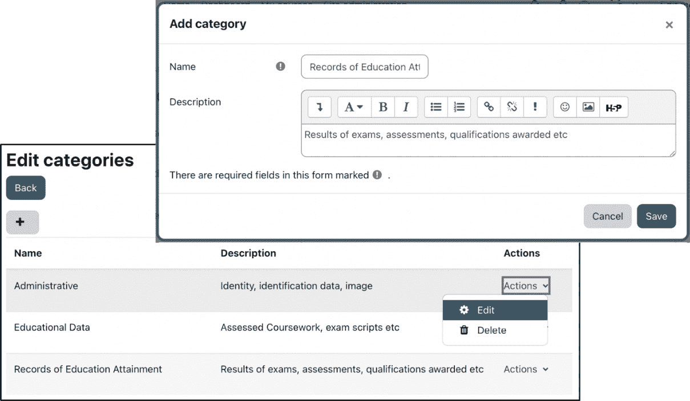

图 14.15 – 数据注册类别

在您可以将添加的类别分配给上下文之前，我们需要创建数据注册目的。

## 管理数据注册目的

从**站点管理** | **用户** | **隐私和政策** | **数据注册**中的**编辑**菜单中选择**目的**项以访问数据注册类别。使用加号按钮添加新条目；我们已创建了一些数据注册目的，如下所示：

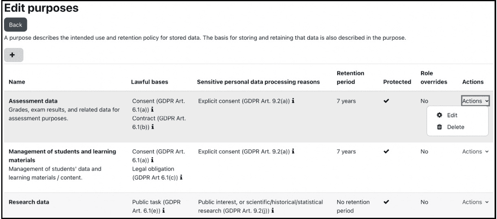

图 14.16 – 数据注册目的

每个目的都有以下属性：

+   **名称**和**描述**：这些应该是自解释的。

+   **合法基础**：选择至少一个可用的选项作为合法基础。合法性是 GDPR 的七个原则之一。

+   **敏感个人数据处理原因**：选择至少一个可用的理由，以豁免禁止处理个人数据。目的限制是 GDPR 的另一个原则。

+   **保留期**：课程内容的保留期从活动所在的课程结束日期开始计算。对于用户来说，是从最后一次登录时间开始计算，对于不再注册或已被删除的任何用户。

+   **受保护**：指定此数据是否受用户删除的保护。如果设置，则此数据的保留具有比用户请求被遗忘更高的法律优先级。这些数据只有在保留期结束后才会被删除。

+   **角色覆盖**：此选项仅在编辑目的时可用。默认保留策略可以针对特定用户角色进行覆盖，允许您指定更长的或更短的保留策略。用户账户只有在所有角色都已过期时才会过期。

选项包括它们的 GDPR 文章，用于合法基础和敏感个人数据处理原因，如下截图所示：

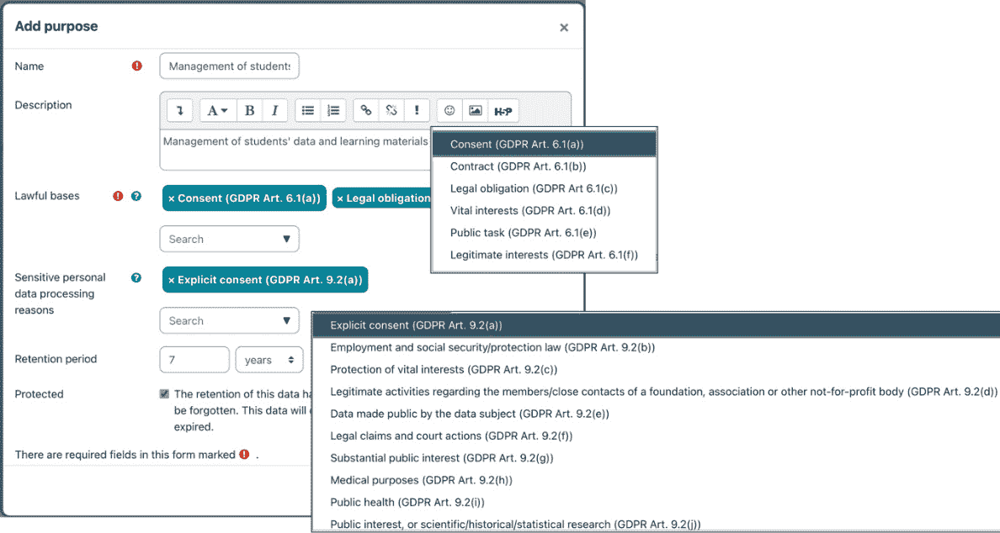

图 14.17 – 数据注册目的

现在您已创建了数据注册类别和目的，您可以将它们分配给上下文，如下所示的小节。

## 将类别和目的分配给上下文

在数据注册表中，对于您 Moodle 站点中的每个上下文，都必须设置一个类别和目的，以及因此该上下文的数据保留期。您应该在站点级别设置类别和目的；一旦设置，所有较低级别的上下文都将继承该级别的设置。

然后，您可以针对不同的上下文级别设置不同的类别和目的，例如，为特定课程设置较长的或较短的数据保留期，从而覆盖继承的值。

下面的截图显示了**数据注册表**界面：

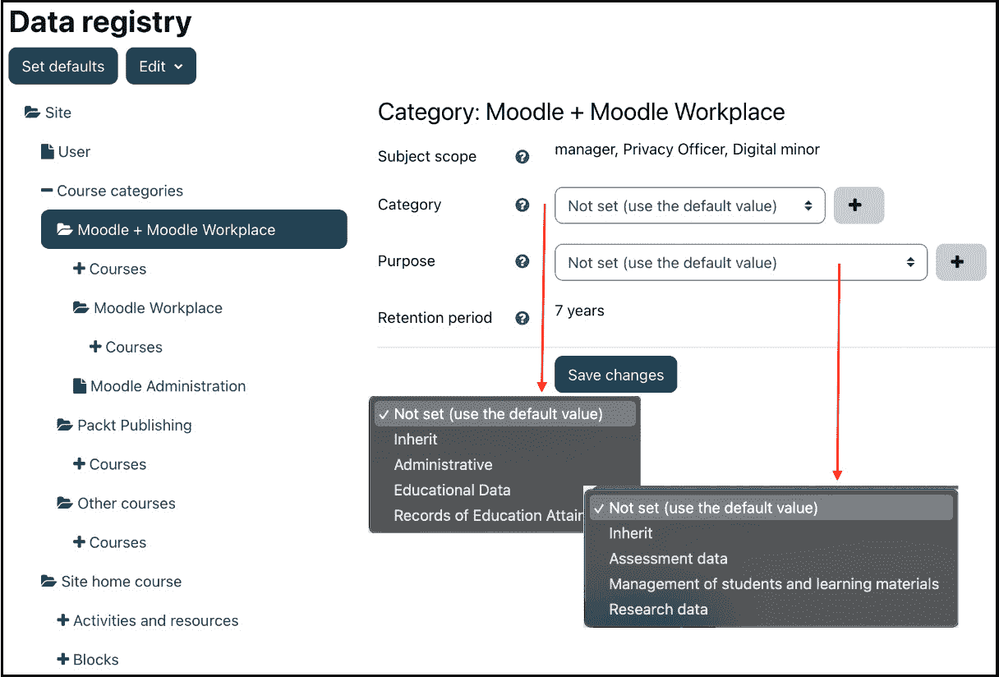

图 14.18 – 将类别和目的分配给上下文

对于每个上下文，以下值将被存储：

+   **主题范围**：在此上下文中可能分配的角色

+   **类别**：除了指定的类别外，您还有**未设置**（**使用默认值**）和**继承**（使用父上下文的类别）选项

+   **目的**：除了指定的目的外，您还有**未设置**（**使用默认值**）和**继承**（使用父上下文的目的）选项

+   **保留期**：该期限将按所选目的的指定方式显示

要指定默认值，请选择**设置默认值**按钮，在那里您可以编辑课程类别、课程、单个活动和块的默认值。上下文的层次结构是从上到下——站点、类别、课程、活动和块。我们在*第六章*中详细介绍了上下文，*管理权限、角色和功能*。

所有 Moodle 核心插件完全符合 Moodle 隐私 API（[docs.moodle.org/dev/Privacy_API](https://docs.moodle.org/dev/Privacy_API)）。强烈建议您只安装也支持隐私 API 的第三方插件，您可以在**站点管理** | **用户** | **隐私和政策** | **插件隐私注册表**中的**插件隐私合规注册表**中验证这些插件。所有已安装的 Moodle 插件都列在存储的个人数据信息和它们是否遵守隐私 API 旁边。任何标记为存储个人数据的插件将无法通过 Moodle 的隐私系统导出或删除。在 Moodle 插件数据库中，隐私友好型插件被标记为“隐私友好型”，在[moodle.org/plugins](https://moodle.org/plugins)上您可以查看此类插件的示例：

图 14.19 – 隐私友好型插件

用户可以通过其个人资料中的**数据保留摘要**链接查看数据注册表信息（核心和第三方）。您可以通过在**站点管理** | **用户** | **隐私和政策** | **隐私设置**中取消选中**显示数据保留摘要**选项来删除此链接。

一旦完成数据注册，它将被用于数据删除过程，这些过程是下一节中涵盖的数据请求的一部分。

# 管理数据请求

用户可以通过他们的个人资料菜单选择不同的选项来请求信息或对其数据进行修改：

+   联系隐私官（**消息**）

+   请求他们的个人数据副本（**导出**）

+   请求删除他们的个人数据（**删除**）

以下图表说明了数据请求的工作流程，也称为主体访问请求：

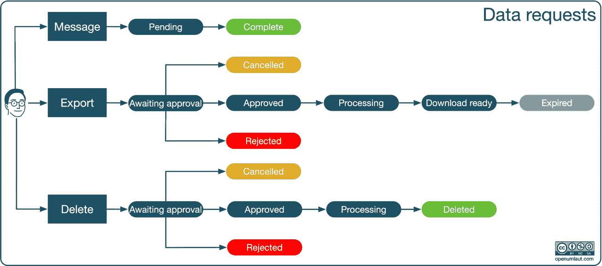

图 14.20 – 数据请求工作流程

要管理所有数据请求，请转到**网站管理** | **用户** | **隐私和政策** | **数据请求**，您将看到如下屏幕：

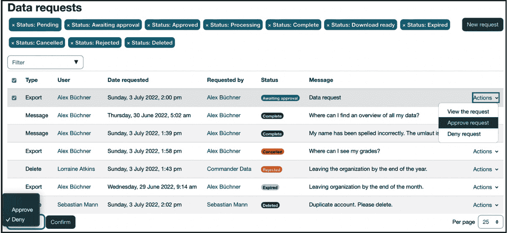

图 14.21 – 数据请求

消息工作流程很简单：用户通过其用户资料的联系方式表单联系隐私官。隐私官将收到通知，然后可以采取行动并标记请求为完成。此选项涵盖了数据主体的更正权——即请求更正他们认为不准确的数据的权利。

其他两个工作流程——导出和删除——需要更多关注，将在以下两个小节中处理。

## 数据导出

数据主体有权访问他们的个人数据，数据导出功能有助于实现这一 GDPR 权利。

用户请求导出所有数据最初标记为`cron`运行（**处理**）。完成后，用户将收到通知，数据导出状态已更改为**下载就绪**。当指定的时间过去后，状态将变为**过期**，下载将被禁用。

数据导出格式为**JSON**，符合 GDPR 的可携带性权利，即数据必须以结构化、常用和机器可读的格式存在。下载包含包含字段描述符的压缩文件包。

有三个参数会影响数据导出工作流程，您可以在**网站管理** | **用户** | **隐私和政策** | **隐私设置**中进行配置：

+   **自动数据导出请求批准**：跳过批准步骤，自动批准导出。

+   **数据请求过期**：批准的数据请求在过期前可下载的时间。如果设置为零，则没有时间限制。

+   **导出时包含日志**：是否在导出中包含与用户相关的日志条目。

数据导出涵盖了 GDPR 中的访问权。删除权由数据删除涵盖，这是下一小节的主题。

## 数据删除

数据主体有权要求删除其数据，前提是这不会与反对此权利的合法理由相冲突。这句话的后半部分有点棘手，因为“合法理由”可能不仅在不同组织之间不同，而且在 Moodle 实例、用户类型（角色）、课程以及甚至个别活动中也可能不同。我们在数据注册表中指定了这些信息，这些信息在数据删除处理过程中会被考虑。

数据删除过程的初始阶段与数据导出工作流程相同：请求被放入一个等待区，在那里它们等待批准；除非用户已取消请求，否则它们可以被隐私官批准或拒绝。

数据擦除在下一个 `cron` 运行期间进行处理，考虑到数据注册表中指定的数据保留期。根据您指定的数据保留值粒度，这可能会立即触发删除某些数据，而其他数据可能不会在数年内被删除。以下基本时间线说明了在删除处理过程中何时删除数据以及何时保留到到期期结束：

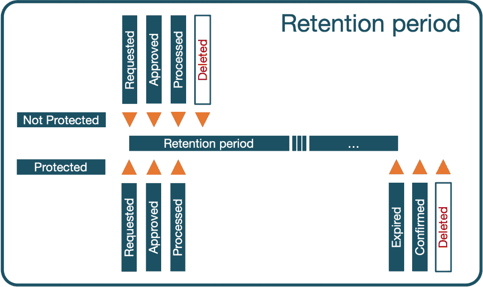

图 14.22 – 保留期 – 受保护与未受保护

您可以通过导航到 **站点管理** | **用户** | **隐私和政策** | **数据删除** 并选择一个上下文（**课程**、**用户**、**活动和资源**以及**块**）来查看已过保留期的数据。在我的系统中，个人数据的保留期为 7 年。我不想等那么久，所以我创建了一个为期一天的测试保留期来演示其行为，如下所示：

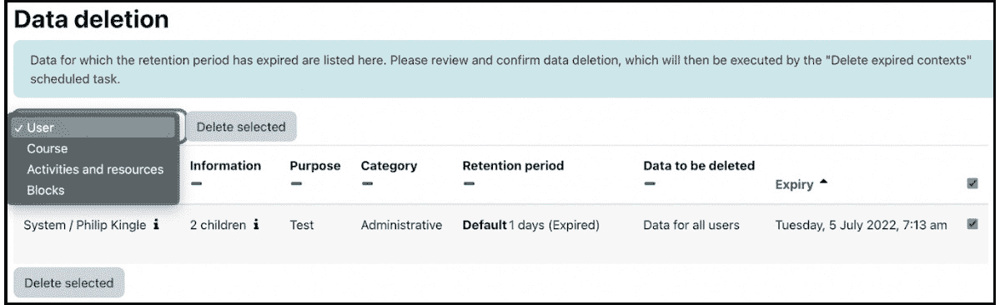

图 14.23 – 数据删除

每个条目都显示了要删除的数据的隐私相关信息——这里是一个用户。您需要确认不可逆的数据删除，该删除将在下一个 `cron` 运行期间执行。

有三个参数会影响数据删除工作流程，您可以在 **站点管理** | **用户** | **隐私和政策** | **隐私设置** 中进行配置：

+   **自动数据删除请求批准**：跳过批准步骤，自动批准删除

+   **创建自动数据删除请求**：当手动删除用户时，将自动创建数据删除请求

+   **将没有结束数据的课程视为活跃状态**：此选项已在内联帮助中详细解释，并很好地说明了课程用户的保留期是如何计算的：

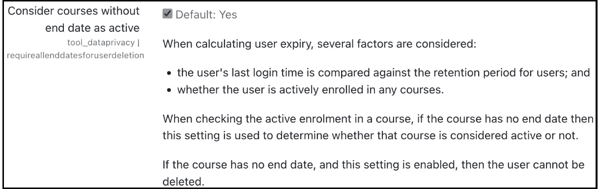

图 14.24 – 用户到期数据保留计算

这部分内容是关于管理数据请求的总结，其中我们介绍了 Moodle 的数据隐私工具来处理以下 GDPR 用户权利：

+   更正权（**消息**）

+   访问权（**导出**）

+   删除权（**删除**）

为了结束本章，我们总结了其内容，并在 Moodle 隐私清单中提供了其关键信息。

# 摘要

**2018 年 5 月 25 日**：GDPR 适用于所有欧盟居民。

**一周前**：Moodle 3.5 版本发布，支持一些但不是所有 GDPR 功能。

我们在 2018 年 5 月开始了 Moodle 隐私章节的讨论，那时发生了这两件事。现在你已经阅读了本章，并可能意识到了确保所有 IT 系统合规的复杂性，你能想象所有利益相关者配置 Moodle 系统时的忙碌一周吗？对于那些足够年长的人，处理 Y2K 错误与遵守 GDPR 相比只是小菜一碟。

本章介绍了 GDPR 的一些法律背景。然后，我们通过设置一个专用角色并激活**隐私官**功能来指定了一个隐私官。

接下来，你学习了所有你需要知道的管理策略。我们在创建和更新版本化策略之前配置了 Moodle 的策略处理器。然后，我们监控用户协议并处理 Moodle 系统中的未成年人。

然后，我们配置了你的数据登记册，在将它们分配到上下文之前设置了数据登记册类别和目的。

最后，我们管理数据请求，处理数据更正（**消息**）、数据访问（**导出**）和数据删除（**删除**）。

作为总结，这里是一个简短的 Moodle 隐私清单。虽然这个列举远非完整，但它为你作为一个 Moodle 管理员和/或 Moodle 隐私官应负责的元素提供了指示：

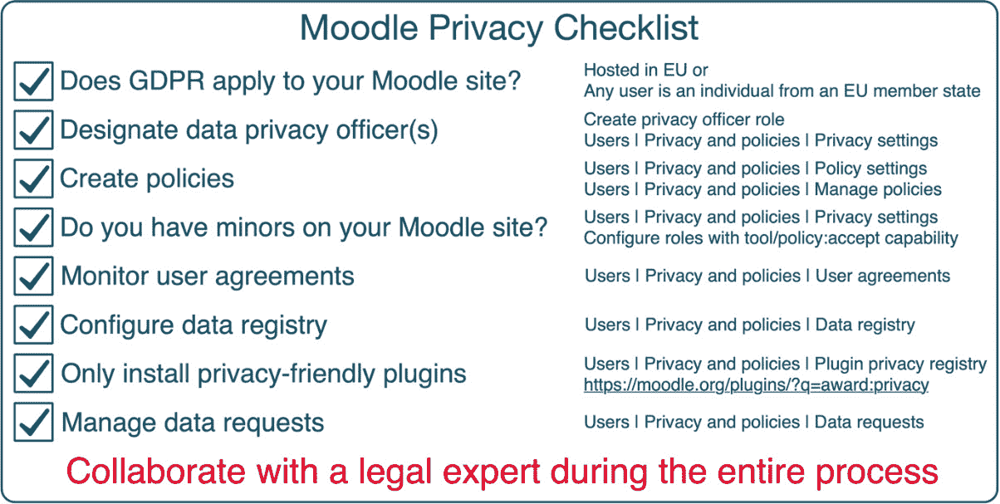

图 14.25 – Moodle 隐私清单

现在希望你的系统符合数据隐私规定，所有灰色西装的人都满意了，让我们确保 Moodle 发挥其全部潜力。在接下来的章节中，我们将优化 Moodle 以确保足够的可扩展性，从而提供良好的用户体验。
