# 第十八章：使用 Moodle Web 服务集成外部系统

在大多数组织中，LMS 很少是一个孤立、独立的系统；相反，它几乎总是包含在机构范围内的基础设施的一部分，该基础设施包含多个最佳组件。Web 服务促进了这些系统之间的交流和通信，Moodle 也不例外。在撰写本文时，Moodle 附带近 700 个 Web 服务功能，这个数字随着每个版本的发布而增长。

在简要概述 Web 服务并提供一些应用示例之后，我们将学习 Moodle Web 服务的基本概念。接下来，我们将配置不同设置所需的通用 Moodle Web 服务功能。然后，我们将学习如何为其他应用程序控制 Moodle 设置 Moodle Web 服务。最后，我们将学习如何为用户作为客户端设置 Moodle Web 服务。

本章我们将涵盖以下主题：

+   理解 Moodle Web 服务

+   配置 Moodle Web 服务

+   为外部系统启用 Web 服务

+   为用户启用 Web 服务

我们将不会涵盖 Web 服务的任何编程方面，因为这不是一个管理任务。您可以在[docs.moodle.org/en/Web_Services](http://docs.moodle.org/en/Web_Services)找到关于此主题针对用户和开发者的良好文档。

到本章结束时，您将了解什么是 Web 服务以及它们如何为外部系统和用户进行配置。

# 理解 Moodle Web 服务

本节将使您熟悉 Web 服务、它们的工作原理以及何时使用它们。

通过代码（PHP 和 JavaScript）扩展 Moodle 一直是可能的。由于 Moodle 的开源代码库，开发者可以修改或扩展的代码没有限制。作为一个管理员，这种情况并不令人满意，因为您无法控制 Moodle 的哪些部分正在被更改，以及，同样重要的是，哪些数据正在被访问或更改。

Moodle 有各种 API，为某些功能提供抽象层。例如，隐私 API、存储库 API 和文件 API。这些对于程序员来说非常好，因为它们减少了需要重写的代码量。除了这些接口之外，Moodle 还为我们提供了不断增长数量的 Web 服务。

重要提示

Web 服务使其他系统能够在 Moodle 内部执行操作，反之亦然。

我们为什么要这样做呢？好吧，我们可以想到四种场景：

+   您组织中的其他系统——例如，人力资源系统——必须在您的 LMS 中触发特定的操作；例如，一旦新员工被添加到系统中，必须在 Moodle 中创建一个账户，并且应在多个课程中进行注册。Web 服务极大地简化了这一过程。

+   存储在 Moodle 中的某些信息可能需要传输到外部应用程序。例如，课程完成情况、成绩或颁发的证书，这些都需要记录在学生信息系统中。同样，Web 服务对于传输此类敏感数据是事先安排好的。

+   我们在*第十一章*，“启用移动学习”中提到的 Moodle 应用程序内部使用 Web 服务；移动设备与 Moodle 后端之间的所有通信和数据交换都通过 Web 服务进行。

+   社区中心功能需要 Web 服务，我们将在*第十九章*，“设置 Moodle 网络”中介绍。

为什么作为管理员，你应该关心 Web 服务，尽管它们是为开发者设计的？好吧，这是 Web 服务的另一个优点。你可以控制哪些系统可以与你的 Moodle 系统通信，以及这些系统被允许使用哪些功能。这样，你可以管理谁可以访问你的系统，并限制他们能做什么。

以下图表展示了 Moodle 通过 Web 服务与外部应用程序交互的（非常）简化的概述：

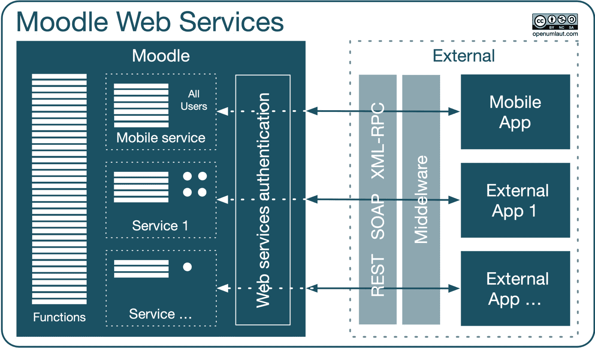

图 18.1 – Moodle Web 服务

让我们从左到右分析这个架构：许多 Moodle 功能都表示为**函数** – 例如，创建用户账户或让用户注册课程。**服务**是一组函数加上定义哪些用户可以访问所选功能。例如，Moodle 应用程序使用一个内置（即预定义）的服务，授予所有用户访问 Moodle 的权限。相反，一个自定义服务可能只允许访问单个专用账户。

重要提示

服务是一组功能。服务可以是用户受限、令牌受限、IP 受限或时间受限。

外部应用程序必须通过 Web 服务的**认证**插件与 Moodle 进行身份验证以确保安全。来自外部应用程序的通信可以是单向的或双向的，这隐含地由服务的功能决定。支持的 Web 服务**协议**包括 SOAP、REST 和 XML-RPC。

Web 服务返回有关调用或交易是否成功的反馈。例如，如果由于任何原因在 Moodle 中创建用户账户失败，人力资源系统将会收到通知，并在预定义的周期后重试。大多数基于 Web 服务的架构都需要一些**中间件**来促进排队和错误处理。

现在你对 Moodle Web 服务有了基本的了解，是时候配置协议、服务和功能了。

# 配置 Moodle Web 服务

首先，您必须通过**站点管理** | **常规** | **高级功能**中的**启用网络服务**设置来激活网络服务。此设置与同一页面上的**为移动设备启用网络服务**参数相关联；后者不能在没有前者的情况下启用。

重要提示

启用网络服务可能存在安全风险，因为您授予 Moodle 访问外部用户和系统的权限。应始终遵循“尽可能少地开放服务和功能”的原则。

其次，您必须启用**网络服务身份验证**插件（**站点管理** | **插件** | **身份验证** | **管理身份验证**）。不需要配置，因为 Moodle 内部处理所有握手操作和通信。

Moodle 支持两种可以通过网络服务连接的外部服务：

+   **内置服务**：这些是预先配置的服务，其中支持的函数集不能修改。**Moodle 移动网络服务**是 Moodle 的一部分，允许应用程序用户与 Moodle 交互。我们在*第十一章*，“启用移动学习”中介绍了应用程序的配置。第三方插件可能会向内置服务列表中添加更多条目。

+   **自定义服务**：这些是由用户定义的服务，您可以在其中配置哪些功能可以被利用。在本章中，我们将重点关注自定义服务，允许两种类型的实体访问 Moodle：外部系统和作为客户端的带有令牌的用户。

当您导航到我们系统中的 `mod_attendance` 插件时，该插件会在提到的移动网络服务旁边安装一个内置服务。我们还创建了两个自定义服务，一个用于测试目的（已禁用）和一个用于连接到我们的 HR 系统，如下面的截图所示：

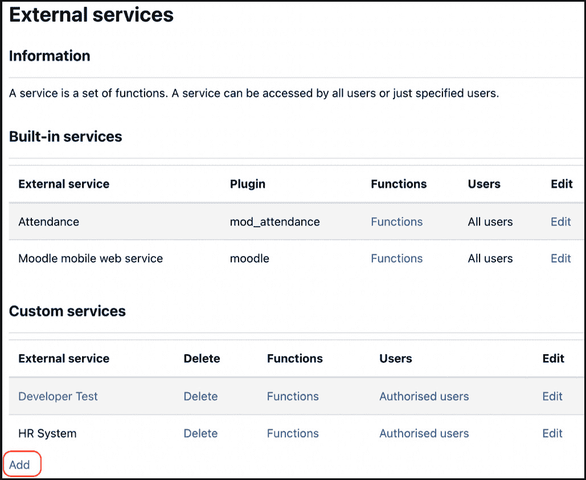

图 18.2 – 内置和自定义网络服务

要配置网络服务，最好前往**站点管理** | **服务器** | **网络服务** | **概览**，它充当设置 Moodle 网络服务的仪表板。显示了两个清单，一个用于**允许外部系统控制 Moodle**（已处理）和一个用于**作为客户端的带有令牌的用户**（稍后介绍）：

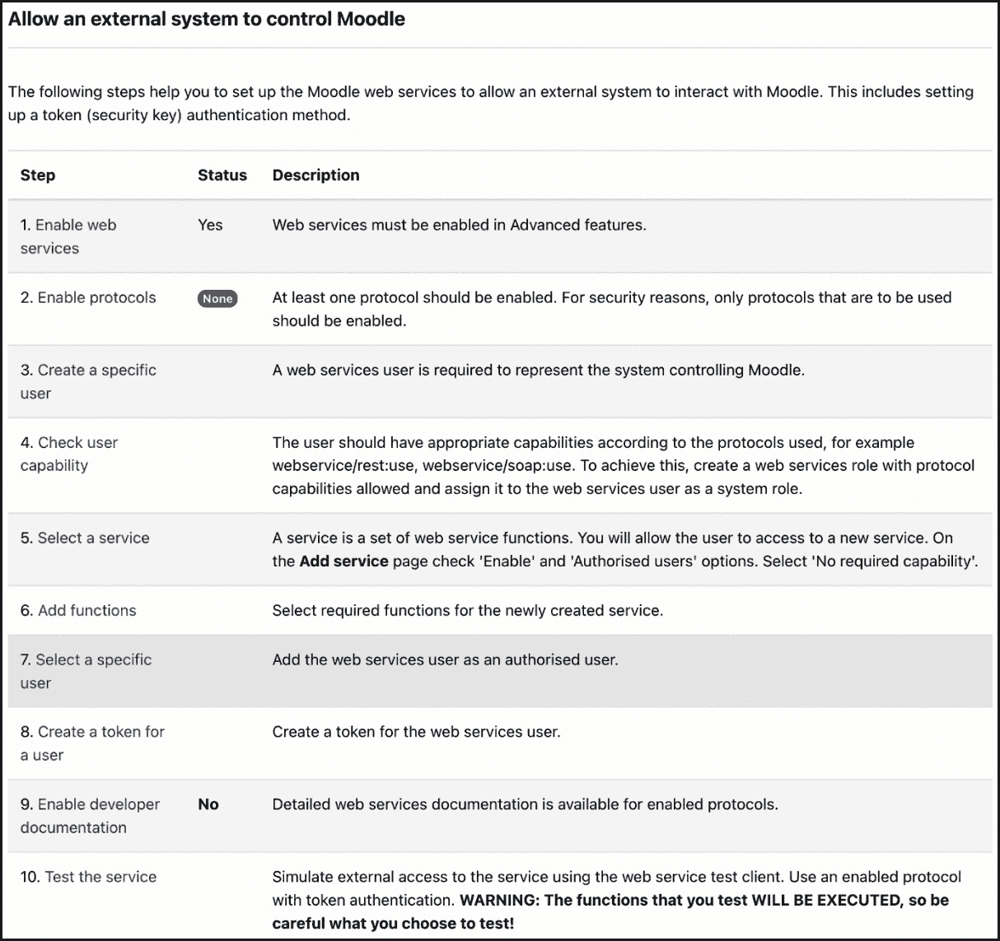

图 18.3 – 允许外部系统控制 Moodle

我们已经启用了网络服务（步骤 1）。Moodle 支持三种网络服务协议 – **SOAP**、**REST**和**XML-RPC**。我们不会提供有关这些标准的详细信息；有关更多信息，请参阅[docs.moodle.org/dev/Creating_a_web_service_client](http://docs.moodle.org/dev/Creating_a_web_service_client)。至少必须启用一个协议，这完全取决于外部应用程序、支持的协议和开发者的偏好。当您访问**站点管理** | **服务器** | **网络服务** | **管理协议**时，点击**启用协议**链接将引导您到该屏幕。通过切换**启用**列中的显示/隐藏图标来启用协议。在此，**SOAP**已被启用，这在基于 Microsoft 的环境中很常见，但不仅限于这些环境，如下面的截图所示：

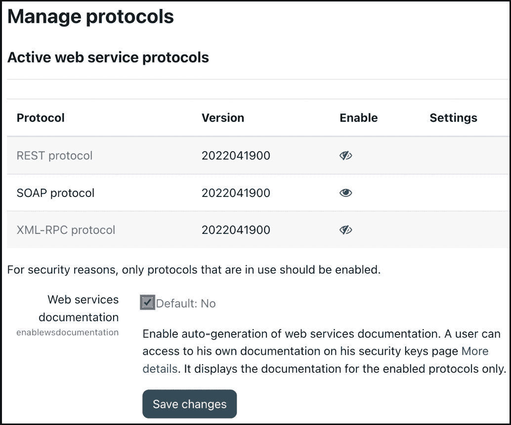

图 18.4 – 网络服务协议

从技术上讲，将来可能还会添加更多的网络服务协议，例如，与 Java 和.Net 兼容的 WSDL，但到目前为止，这还没有发生。

重要提示

根据选择的协议，您可能需要安装相应的 PHP 扩展 – 例如，`php-soap`。

现在我们已经启用了网络服务并且至少启用了一个协议，让我们来介绍两种类型网络服务访问的配置。

# 为外部系统启用网络服务

外部系统是指以某种方式访问 Moodle 及其数据的程序。要完成设置，需要进行八个步骤，这些步骤遵循网络服务概述屏幕上描述的工作流程：

1.  **创建** **特定用户**

每个应用程序都应该有一个单独的用户账户。这样，您可以控制每个外部系统将使用的功能。我们的用户被称为*webservice*。

1.  **检查** **用户能力**

根据您选择的协议，您必须为用户允许特定的权限。您可以通过创建一个具有以下三种能力之一的新角色来实现这一点，即`webservice/rest:use`、`webservice/soap:use`或`webservice/xmlrpc:use`。

此角色必须在**系统**上下文中分配给网络服务用户。

1.  **选择** **服务**

服务是一个定义的接口，外部应用程序可以连接到它，由一系列功能表示（见步骤 4）。选择服务发生在**站点管理** | **服务器** | **网络服务** | **外部服务**。您必须添加一个自定义服务：

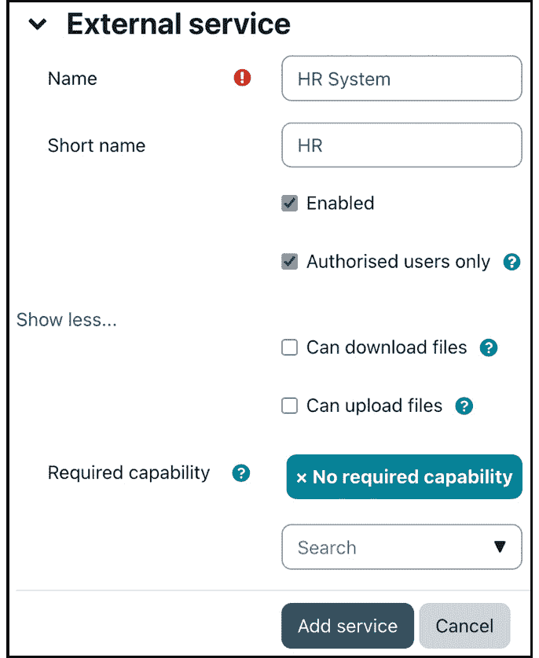

图 18.5 – 网络服务：添加自定义服务

每个外部服务都必须有一个给定的**名称**和唯一的**短名称**，一旦配置后应**启用**。服务必须通过令牌访问。**仅授权用户**设置将此访问限制为选定的用户。如果未选中，则具有令牌权限的所有用户都可以访问该服务。

您还可以使用**可以下载文件**或**可以上传文件**来指定 Web 服务的下载和上传权限。在我们的 HR 角色中，如果您还通过 Web 服务管理个人资料图片，这将很有用。您可以通过指定用户需要的必要能力来进一步限制访问。

保存服务后，选择显示的**添加功能**链接。

1.  **添加功能**

在撰写本文时，Moodle 提供了几乎 700 个(!)可以通过 Web 服务访问的功能，在 Moodle Workplace 中则更多。选择的功能取决于外部系统必须执行的任务，并且应与负责的开发人员协商设置。由于我们正在连接到 HR 系统，我们将允许以下与用户相关的功能：

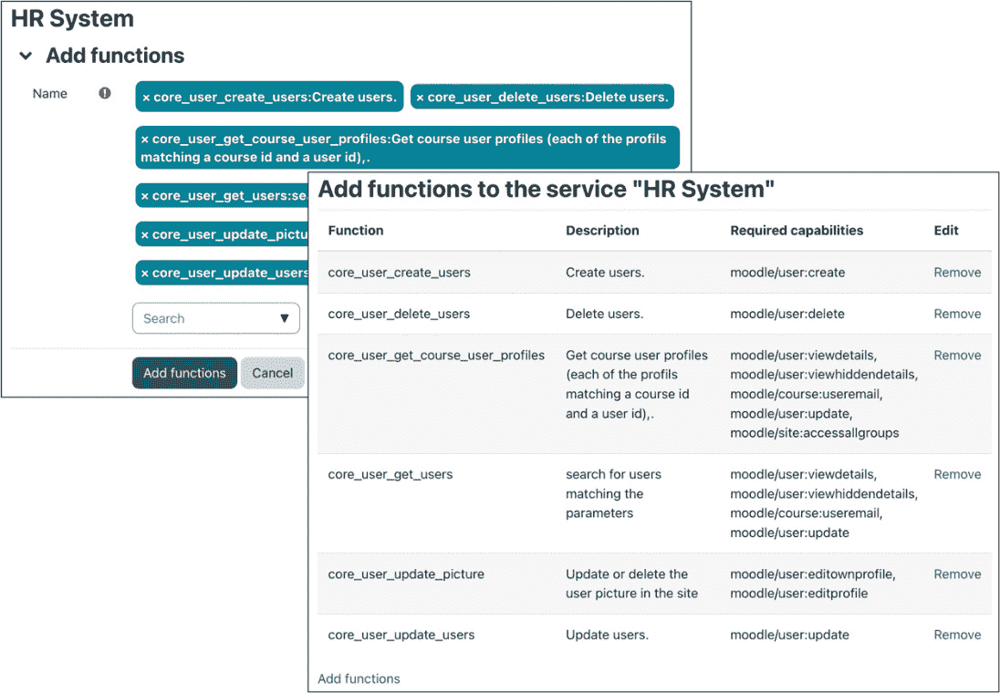

图 18.6 – Web 服务 – 添加功能

一旦添加了选定的功能，系统将显示用户必须具备的访问服务的必要能力。请确保这些能力已在分配给 Web 服务用户的角色中允许。

1.  **选择特定用户**

如果在创建前面的服务时选择了**仅授权用户**，则必须选择此用户（们），这发生在**网站管理** | **服务器** | **Web 服务** | **外部服务**，在那里您可以看到已设置的所有服务的列表。选择**授权用户**链接，它将引导您到熟悉的用户选择屏幕。选择在步骤 1 中创建的 Web 服务用户：

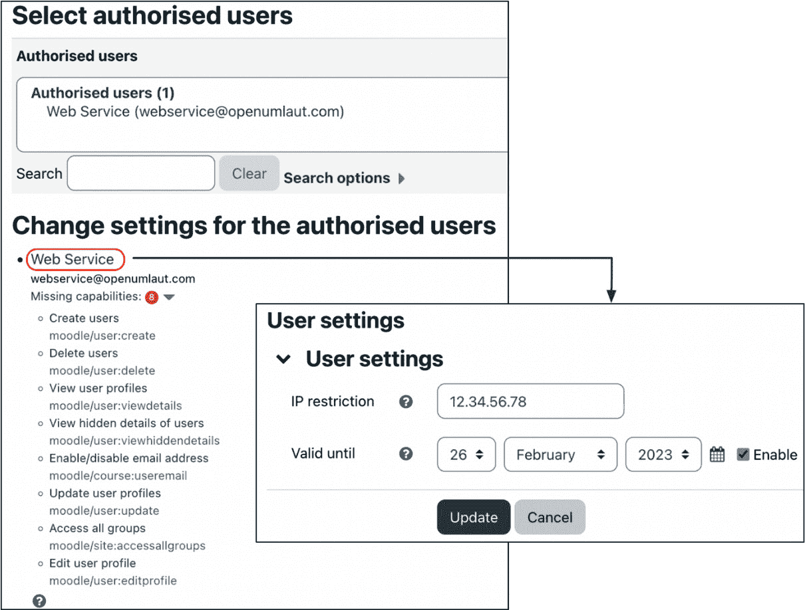

图 18.7 – Web 服务 – 选择用户

Moodle 将检查账户是否有足够的权限访问选定的功能。如果缺少任何能力，它们将在**更改授权用户设置**部分的用户选择屏幕下显示。请确保将列出的能力添加到您的 Web 服务的权限中。点击用户名将允许您限制对 IP 地址的访问并设置过期日期。

1.  **为用户创建令牌**

Web 服务使用令牌进行安全保护。这些令牌为每个用户创建，可以通过访问**网站管理** | **服务器** | **Web 服务** | **管理令牌**来添加。要添加令牌，选择一个用户（或多个用户），选择要访问的服务，并可选地指定 IP 地址（或范围）和过期日期，如以下截图所示：

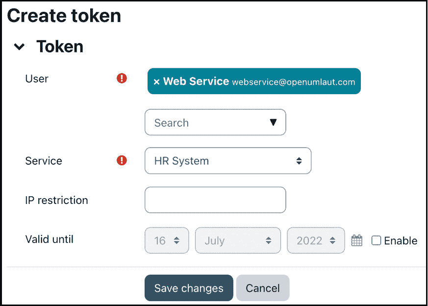

图 18.8 – Web 服务 – 创建令牌

用户可以通过访问 `moodle/webservice:createtoken` 功能来访问和重置他们的网络服务令牌。

1.  **启用开发者文档（可选）**

Moodle 可以被指示为所选协议格式中的所选功能生成开发者的文档。当您设置协议（**网站管理** | **服务器** | **网络服务** | **管理协议**）时，您必须勾选 **网络服务文档** 选项。开发者可以将其作为其安全密钥的一部分查看文档：

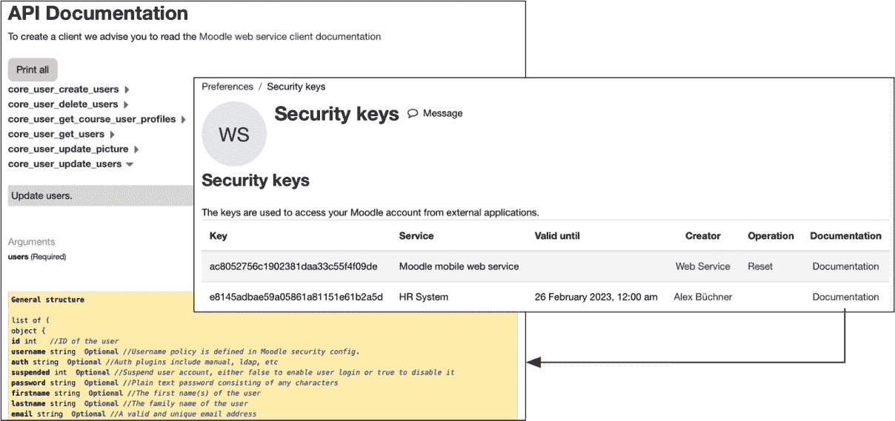

图 18.9 – 网络服务 – 安全密钥和 API 文档

1.  **测试服务**

一旦设置了网络服务，选择了功能，并分配了用户，您必须测试该服务以确保它正常工作，更重要的是，外部系统只开放了所需的功能。网络服务通过导航到 **网站管理** | **开发** | **网络服务测试客户端** 来测试。不幸的是，测试客户端仅支持一些硬编码的功能，而不是您配置的功能。我从 Moodle 文档中引用：“*测试客户端并不聪明！它允许您选择禁用/不可用的功能（尽管它在这些情况下表现良好并产生错误）。这是正常的，因为客户端有时可能会出错，因此我们需要模拟一个* *糟糕的客户端!*””

重要提示

在通过测试客户端执行函数时要小心，因为它们会像执行真实操作一样执行它们！

首先，您必须选择将 `moodle/category:manage` 权限分配给您的网络服务角色，以便此功能生效）：

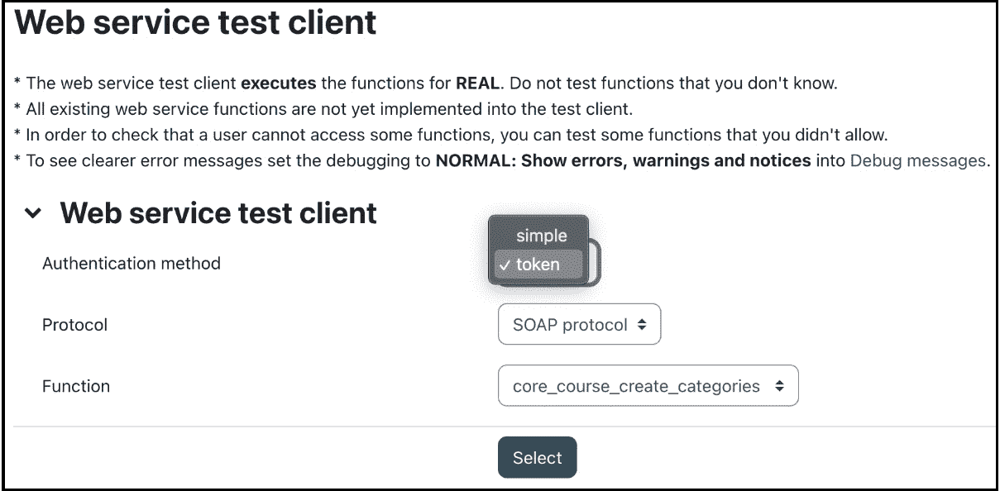

图 18.10 – 网络服务测试

一旦您填写了所需的值并执行了命令，您将看到以 XML 格式返回的值。如果您按下 **执行** 按钮，您的数据库将被修改，并且没有手动干预数据库级别，则无法撤销更改。同时，尝试一些网络服务不应能够访问的功能也是一个好习惯：

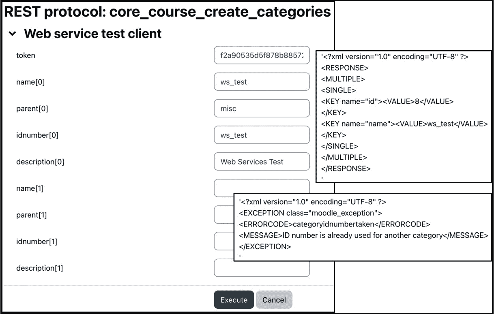

图 18.11 – 网络服务测试

要接收更有意义的信息，请通过访问 **网站管理** | **开发** | **调试** 然后转到 **开发者** 来更改 **调试消息** 设置。如果显示的结果包含包含 DEBUGINFO 元素的行，则表示发生了错误。否则，您应该检查在执行时函数是否完成了它应该完成的操作。我们执行了两次操作；第一次运行成功——也就是说，创建了类别。第二次运行失败是因为该类别已经存在。

现在我们已经介绍了如何为外部应用程序配置网络服务，让我们简要地看看它的“小兄弟”——为用户启用基于令牌的访问。

# 启用用户网络服务

有时用户需要直接访问网络服务而不是应用程序，例如，需要针对系统执行测试运行的开发者。这个过程是前一部分已涵盖的步骤的子集，并遵循网络服务概述屏幕上的**以令牌为客户端的用户**部分：

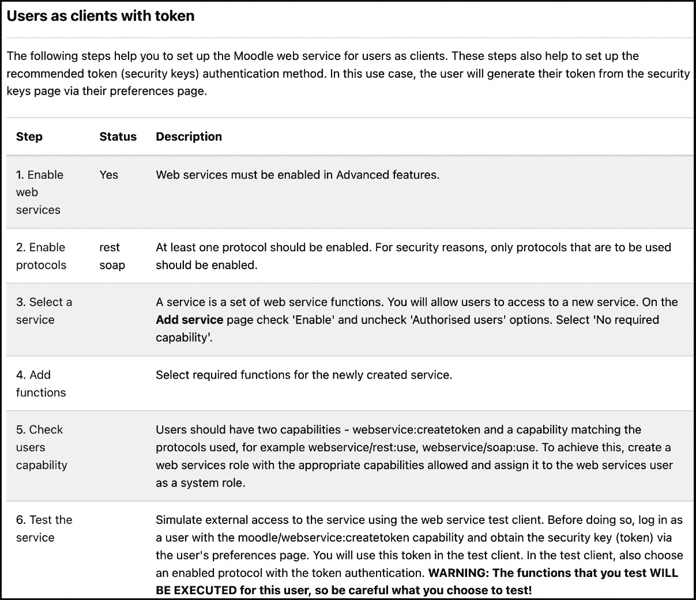

图 18.12 – 以令牌为客户端的用户网络服务

这些步骤现在应该很熟悉了；当允许外部系统而不是用户使用网络服务时，与之前的场景相比，只有两个小的偏差。

在步骤 3 中，将 `moodle/webservice:createtoken` 功能设置为允许（见步骤 5）。

要测试服务（见步骤 6），以用户身份登录，获取测试用的安全令牌，并避免在 Web 服务测试客户端中使用简单的身份验证方法。

# 摘要

在本章中，你学习了关于网络服务及其如何在 Moodle 内部配置的基本知识。我们涵盖了两个主要的管理任务：为外部应用程序设置网络服务和为用户启用基于令牌的网络服务。

本章涵盖的所有过程在 Moodle 和 Moodle Workplace 中都是相同的；唯一的区别是 Moodle Workplace 支持更多的网络服务功能。

在下一章中，我们将介绍 Moodle 与其他系统通信的另一种选项，即通过 Moodle 网络。
