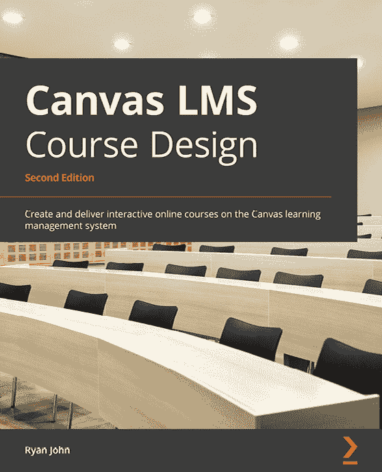
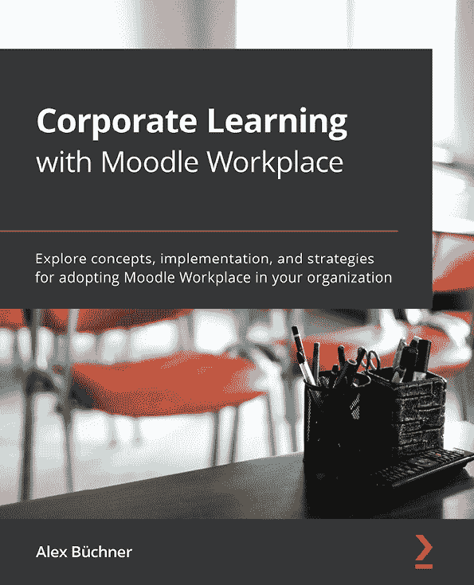

[Packt.com](http://Packt.com)

订阅我们的在线数字图书馆，全面访问超过 7,000 本书和视频，以及行业领先的工具，帮助您规划个人发展并推进您的职业生涯。更多信息，请访问我们的网站。

# 第十四章：为什么订阅？

+   使用来自 4,000 多位行业专业人士的实用电子书和视频，节省学习时间，多花时间编码

+   通过为您量身定制的技能计划提高您的学习效果

+   每月免费获得一本电子书或视频

+   全文可搜索，便于快速获取关键信息

+   复制粘贴、打印和收藏内容

您知道 Packt 为每本书都提供电子书版本，包括 PDF 和 ePub 文件吗？您可以在 [packt.com](http://packt.com) 升级到电子书版本，并且作为印刷版书籍的顾客，您有权获得电子书副本的折扣。如需了解更多详情，请联系我们 customercare@packtpub.com。

在 [www.packt.com](http://www.packt.com)，您还可以阅读一系列免费技术文章，订阅各种免费通讯，并享受 Packt 书籍和电子书的独家折扣和优惠。

# 您可能还会喜欢的其他书籍

如果您喜欢这本书，您可能会对 Packt 的其他这些书籍感兴趣：

[(https://www.packtpub.com/product/canvas-lms-course-design-second-edition/9781800568518)]

**Canvas LMS 课程设计 - 第二版**

Ryan John

ISBN: 978-1-80056-851-8

+   了解在线学习作为学生成长的有力且独特的工具

+   在 Canvas 中创建、访问并个性化您的用户账户和配置文件设置

+   为学生生成、上传和导入课程内容，让他们作为您的课程参与者参与其中

+   设计和编排课程内容，清晰简洁地呈现信息和活动

+   发现设计课程和创建活动的专家技巧

+   探索满足您教育需求的 Canvas 功能，例如在线评估和内容交付

[(https://www.packtpub.com/product/corporate-learning-with-moodle-workplace/9781800205345)]

**Moodle Workplace 企业学习**

Alex Büchner

ISBN: 978-1-80020-534-5

+   了解 Moodle Workplace 的商业模式

+   使用多租户、组织、职位、工作分配和团队支持多个业务实体

+   探索组织典型人力资源流程（如入职、合规性和报告）的最佳实践

+   使用动态规则和迁移自动化业务工作流程

+   通过研讨会管理和 Workplace 应用程序支持混合式和离线学习

+   通过证书、能力和徽章激励技能发展和学习

+   定制 Moodle Workplace 以反映组织的公司形象

+   熟悉 Moodle Workplace 网络服务

# Packt 正在寻找像您这样的作者

如果您有兴趣成为 Packt 的作者，请访问[authors.packtpub.com](http://authors.packtpub.com)并今天申请。我们已与成千上万的开发者和技术专业人士合作，就像您一样，帮助他们将见解分享给全球技术社区。您可以提交一般申请，申请我们正在招募作者的特定热门话题，或者提交您自己的想法。

嗨！

我是 Susan Smith Nash，是《Moodle 4 E-Learning 课程开发》一书的作者。我真心希望您喜欢阅读这本书，并觉得它对提高您的生产力和效率有所帮助。

如果您能在亚马逊上留下评论分享您对这本书的看法，那将真正帮助到我（以及其他潜在的读者！）。

点击下面的链接或扫描二维码留下您的评论：

[`packt.link/r/180107903X`](https://packt.link/r/180107903X)

您的评论将帮助我们了解这本书哪些地方做得好，哪些地方可以改进以供未来版本使用，所以这真的非常感谢。

祝好，

Susan Smith Nash
