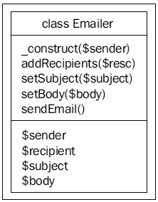

# 第二章：启动 OOP

在本章中，我们将学习如何创建对象，定义它们的属性（或属性）和方法。PHP 中的对象总是使用“class”关键字创建的。在本章中，我们将学习类、属性和方法的具体细节。我们还将学习方法的范围以及修饰符和使用接口的好处。本章还将介绍 PHP 中其他基本面向对象编程（OOP）特性。总的来说，本章是你在 PHP 中启动 OOP 的较好资源之一。

# 让我们制作一些对象

如我之前所说，你可以在 PHP 中使用`class`关键字创建一个对象。一个类由一些属性和方法组成，可以是公开的或私有的。让我们以我们在第一章中看到的`Emailer`类为例。在这里，我们将讨论它实际上做了什么：

```php
<?
//class.emailer.php
class Emailer
{
  private $sender;
  private $recipients;
  private $subject;
  private $body;

  function __construct($sender)
  {
    $this->sender = $sender;
    $this->recipients = array();
  }

  public function addRecipients($recipient)
  {
    array_push($this->recipients, $recipient);
  }

  public function setSubject($subject)
  {
    $this->subject = $subject;
  }

  public function setBody($body)
  {
    $this->body = $body;
  }

  public function sendEmail()
  {
  foreach ($this->recipients as $recipient)
  {
    $result = mail($recipient, $this->subject, $this->body, 
                              "From: {$this->sender}\r\n");
    if ($result) echo "Mail successfully sent to {$recipient}<br/>";
    }
  }
}
?>
```

在这段代码中，我们以`class` `Emailer`开始，这意味着我们类的名字是`Emailer`。在命名类时，遵循与变量相同的命名约定，即你不能以数字字母开头等。

之后，我们声明了这个类的属性。这里有四个属性，分别是`$sender`、`$recipient`、`$subject`和`$body`。请注意，我们用关键字`private`声明了它们。私有属性意味着这个属性只能从这个类内部访问。属性不过是类内部的变量。

如果你记得方法是什么，它只是类内部的一个函数。在这个类中，有五个函数，`__construct()`、`addRecipient()`、`setSubject()`、`setBody()`和`sendEmail()`。请注意，最后四个方法被声明为公开的。这意味着当有人实例化这个对象时，他们可以访问这些方法。

`__construct()`是一个类内的特殊方法，称为构造方法。每当从这个类创建一个新的对象时，这个方法将自动执行。所以如果我们需要在初始化对象时执行一些初步任务，我们将从构造方法中执行。例如，在这个`Emailer`类的构造方法中，我们只设置了`$recipients`为一个空数组，我们还设置了发件人姓名。

## 在类内部访问属性和方法

你想知道函数是如何从其内容内部访问类属性的吗？让我们用以下代码看看：

```php
  public function setBody($body)
  {
    $this->body = $body;
  }
```

在我们的类中有一个名为`$body`的私有属性，如果我们想从函数内部访问它，我们必须用`$this`来引用它。`$this`意味着对当前对象实例的引用。因此，我们可以通过`$this->body`访问`body`属性。请注意，我们必须使用一个跟在实例后面的"->"来访问类的属性（即类变量）。

同样，就像属性一样，我们可以在这种格式中从另一个成员方法内部访问任何成员方法。例如，我们可以调用`setSubject`方法为`$this->setSubject()`。

### 注意

请注意，`$this`关键字仅在方法的作用域内有效，只要它没有被声明为静态。你不能从类外部使用`$this`关键字。我们将在本章后面的“修饰符”部分更详细地学习“静态”、“私有”、“公共”这些关键字。

# 使用对象

让我们在 PHP 代码内部使用新创建的`Emailer`对象。在使用对象之前，我们必须注意一些事项。在使用对象之前，你必须初始化它。初始化之后，你可以使用"->"符号来访问其实例的所有公共属性和方法。让我们通过以下代码来看一下：

```php
<?
$emailerobject = new Emailer("hasin@pageflakes.com");
$emailerobject->addRecipients("hasin@somewherein.net");
$emailerobject->setSubject("Just a Test");
$emailerobject->setBody("Hi Hasin, How are you?");
$emailerobject->sendEmail();
?>
```

在上述代码片段中，我们首先在第一行创建了一个`Emailer`类的实例，并将其赋值给变量`$emailerobject`。在这里，有一点很重要：我们在实例化这个对象时提供了一个发送地址：

```php
$emailerobject = new Emailer("hasin@pageflakes.com");
```

记得我们类中有一个构造函数方法，名为`__construct($sender)`。当我们初始化对象时，我们说构造函数会自动调用。所以，当我们初始化这个`Emailer`类时，我们必须提供构造函数方法中声明的正确参数。例如，以下代码将创建一个警告：

```php
<?
$emailer = new emailer();
?>
```

当你执行上述代码时，会显示如下警告：

```php
Warning: Missing argument 1 for emailer::__construct(), 
called in C:\OOP with PHP5\Codes\ch1\class.emailer.php on line 42 
and defined in <b>C:\OOP with PHP5\Codes\ch1\class.emailer.php</b> 
on line <b>9</b><br />
```

看到区别了吗？如果你的类没有构造函数方法，或者有一个不带参数的构造函数，你可以使用上述代码来实例化它。

# 修饰符

你已经看到我们在类中使用了`private`或`public`等关键字。那么这些是什么，为什么我们需要使用它们呢？好吧，这些关键字被称为修饰符，并在 PHP5 中引入。它们在 PHP4 中是不可用的。这些关键字帮助你定义这些变量和属性将如何被类的用户访问。让我们看看这些修饰符实际上做了什么。

**私有（Private）**：声明为私有的属性或方法不允许从类外部调用。然而，同一类内的任何方法都可以无问题地访问它们。在我们的`Emailer`类中，我们把这些属性都声明为私有，所以如果我们执行以下代码，我们会发现一个错误。

```php
<?
include_once("class.emailer.php");
$emobject = new Emailer("hasin@somewherein.net");
$emobject->subject = "Hello world";
?>
```

执行上述代码后，会显示如下所示的致命错误：

```php
<b>Fatal error</b>: Cannot access private property emailer::$subject
 in <b>C:\OOP with PHP5\Codes\ch1\class.emailer.php</b> on line 
<b>43</><br />
```

这意味着你不能从类外部访问任何私有属性或方法。

**公共（Public）**：任何未明确声明为私有或受保护的属性或方法都是公共方法。你可以从类内部或外部访问公共方法。

**受保护（Protected）**：这是另一个在面向对象编程中有特殊意义的修饰符。如果任何属性或方法被声明为受保护，你只能从其子类中访问该方法。我们将在本章后面的部分详细学习子类。但为了看到受保护的属性或方法实际上是如何工作的，我们将使用以下示例：

首先，让我们打开`class.emailer.php`文件（`Emailer`类）并更改`$sender`变量的声明。让它如下所示：

```php
protected $sender
```

现在创建另一个名为`class.extendedemailer.php`的文件，并包含以下代码：

```php
<?
class ExtendedEmailer extends emailer 
{
function  __construct(){}
   public function setSender($sender)
  {
    $this->sender = $sender;
  }
}
?>
```

现在用这个对象这样使用：

```php
<?
include_once("class.emailer.php");
include_once("class.extendedemailer.php");
$xemailer = new ExtendedEmailer();
$xemailer->setSender("hasin@pageflakes.com");
$xemailer->addRecipients("hasin@somewherein.net");
$xemailer->setSubject("Just a Test");
$xemailer->setBody("Hi Hasin, How are you?");
$xemailer->sendEmail();
?> 
```

现在如果你仔细查看`ExtendedEmailer`类的代码，你会发现我们访问了其父类（实际上是`Emailer`类）的`$sender`属性。我们之所以能够访问这个属性，仅仅是因为它被声明为受保护的。在这里我们得到的另一个好处是，属性`$sender`仍然不能直接从这两个类的作用域之外直接访问。这意味着如果我们执行以下代码，它将生成一个致命错误。

```php
<?
include_once("class.emailer.php");
include_once("class.extendedemailer.php");
$xemailer = new ExtendedEmailer();
$xemailer->sender = "hasin@pageflakes.com";
?>
```

在执行时，它给出以下错误：

```php
<b>Fatal error</b>:  Cannot access protected property 
extendedEmailer::$sender in <b>C:\OOP with 
PHP5\Codes\ch1\test.php</b> on line <b>5</b><br />

```

# 构造函数和析构函数

我们在本章前面讨论了构造方法。构造方法是在创建类的实例时自动执行的方法。在 PHP5 中，你可以在类内部以两种方式编写构造方法。第一种是在类内部创建一个名为`__construct()`的方法。第二种是创建一个与类名完全相同名称的方法。例如，如果你的类名是`Emailer`，构造方法的名称将是`Emailer()`。让我们看看以下这个计算任何数字阶乘的类：

```php
<?
//class.factorial.php
class factorial
{
  private $result = 1;// you can initialize directly outside
  private $number;
  function __construct($number)
  {
    $this->number = $number;
    for($i=2; $i<=$number; $i++)
    {
      $this->result *= $i;
    }
  }
  public function showResult()
  {
    echo "Factorial of {$this->number} is {$this->result}. ";
  }
}
?>
```

在上面的代码中，我们使用了`__construct()`作为我们的构造函数。如果你将`__construct()`函数重命名为`factorial()`，行为将是相同的。

现在，你可能想知道一个类是否可以同时以两种风格拥有构造方法？这意味着一个名为`__construct()`的函数和一个与类名相同的函数。那么哪个构造方法会执行，或者它们都会执行吗？这是一个好问题。实际上，没有机会同时执行。如果有两种风格的构造方法，PHP5 将优先选择`__construct()`函数，另一个将被忽略。让我们通过以下示例来看看：

```php
<?
//class.factorial.php
class Factorial
{
  private $result = 1;
  private $number;

  function __construct($number)
  {
    $this->number = $number;
    for($i=2; $i<=$number; $i++)
    {
      $this->result*=$i;
    }
    echo "__construct() executed. ";
  }

  function factorial($number)
  {

    $this->number = $number;
    for($i=2; $i<=$number; $i++)
    {
      $this->result*=$i;
    }
    echo "factorial() executed. ";
  }

  public function showResult()
  {
    echo "Factorial of {$this->number} is {$this->result}. ";
  }
}
?>
```

现在如果你像下面这样使用这个类：

```php
<?
include_once("class.factorial.php");
$fact = new Factorial(5);
$fact->showResult();
?>
```

你会发现输出是：

```php
__construct() executed. Factorial of 5 is 120
```

与构造方法类似，还有一个**析构**方法，它实际上是在销毁对象时工作的。你可以通过将其命名为`__destruct()`来显式创建析构方法。这个方法将在你的脚本执行结束时由 PHP 自动调用。为了测试这一点，让我们在我们的阶乘类中添加以下代码：

```php
function __destruct()
{
  echo " Object Destroyed.";
}
```

现在再次执行使用脚本，这次你会看到以下输出：

```php
__construct() executed. Factorial of 5 is 120\. Object Destroyed.

```

# 类常量

希望你已经知道，你可以使用**define**关键字在你的 PHP 脚本中创建常量。但要在类中创建常量，你必须使用`const`关键字。这些常量实际上就像静态变量一样工作，唯一的区别是它们是只读的。让我们看看我们如何创建常量并使用它们：

```php
<?
class WordCounter
{
  const ASC=1;  //you need not use $ sign before Constants
  const DESC=2;
  private $words;

  function __construct($filename)
  {
    $file_content = file_get_contents($filename);
    $this->words = 
         (array_count_values(str_word_count(strtolower
                                           ($file_content),1)));
  }

  public function count($order)
  {
    if ($order==self::ASC)
    asort($this->words);
    else if($order==self::DESC)
    arsort($this->words);
    foreach ($this->words as $key=>$val)
    echo $key ." = ". $val."<br/>";
  }
}
?>
```

这个 `WordCounter` 类可以计算任何给定文件中单词的频率。这里我们定义了两个常量名称 `ASC` 和 `DESC`，它们的值分别是 1 和 2。要访问类内的这些常量，我们使用 `self` 关键字来引用它们。请注意，我们使用 `::` 操作符来访问它们，而不是 `->` 操作符，因为这些常量就像静态成员一样。

最后，为了使用这个类，让我们创建一个如下所示的片段。在这个片段中，我们也在访问那些常量：

```php
<?
include_once("class.wordcounter.php");
$wc = new WordCounter("words.txt");
$wc->count(WordCounter::DESC);
?>
```

请注意，我们通过在类名后直接跟随 `::` 操作符来从类外部访问类常量，而不是在类的实例之后。现在让我们测试脚本，请创建一个名为 `words.txt` 的文件，其内容如下，并将其放在放置上述脚本的同一目录中：

```php
words.txt
Wordpress is an open source blogging engine. If you are not familiar
 with blogging, it is something like keeping a diary on the web. 
A blog stands for web log. Wordpress is totally free and 
released under the GPL.
```

现在，如果你执行使用脚本，这次，你会看到以下输出。

```php
is = 3
a = 2
blogging = 2
web = 2
wordpress = 2
stands = 1
blog = 1
in = 1
diary = 1
for = 1
free = 1
under = 1
gpl = 1
released = 1
and = 1
totally = 1
log = 1
something = 1
if = 1
you = 1
engine = 1
source = 1
an= 1
open = 1
are = 1
not = 1
ï = 1
like = 1
it = 1
with = 1
familiar = 1
keeping = 1
```

很好的实用工具，您觉得呢？

# 扩展类 [继承]

面向对象编程中最伟大的特性之一是你可以扩展一个类并创建一个全新的对象。新的对象可以保留从其扩展的父对象的所有功能，或者可以覆盖。新的对象也可以引入一些特性。让我们扩展我们的 `Emailer` 类并覆盖 `sendEmail` 函数，以便它可以发送 HTML 邮件。

```php
<?
class HtmlEmailer extends emailer
{
  public function sendHTMLEmail()
  {
    foreach ($this->recipients as $recipient)
    {
      $headers  = 'MIME-Version: 1.0' . "\r\n";
      $headers .= 'Content-type: text/html; charset=iso-8859-1' . 
                                                           "\r\n";
      $headers .= 'From: {$this->sender}' . "\r\n";
      $result = mail($recipient, $this->subject, $this->body, 
                                                       $headers);
      if ($result) echo "HTML Mail successfully sent to 
                                              {$recipient}<br/>";
    }
  }
}
?>
```

由于这个类扩展了 `Emailer` 类并引入了一个新函数 `sendHTMLEmail()`，你仍然可以拥有其父类中的所有方法。这意味着以下代码是完全有效的：

```php
<?
include_once("class.htmlemailer.php");
$hm = new HtmlEmailer();
//.... do other things
$hm->sendEmail();
$hm->sendHTMLEmail();
?>
```

如果你想要访问从父类（或者你可能称之为超类）继承的任何方法，你可以使用 `parent` 关键字来调用。例如，如果你想访问一个名为 `sayHello` 的方法，你应该写 `parent::sayHello();`

请注意，我们没有在 `HtmlEmailer` 类中编写任何名为 `sendEmail()` 的函数，但该方法是从其父类 `Emailer` 中工作的。

### 注意

在上面的例子中，`HtmlEmailer` 是 `Emailer` 类的子类，而 `Emailer` 类是 `HtmlEmailer` 的超类。你必须记住，如果子类中没有构造函数，将调用超类的构造函数。在撰写本书时，类级别上没有多重继承的支持。这意味着你一次不能扩展多个类。然而，接口支持多重继承。一个接口可以一次扩展任意数量的其他接口。

## 覆盖方法

在扩展对象中，您可以覆盖任何方法（无论是声明为 `protected` 还是 `public`），并按您的意愿执行任何操作。那么您如何覆盖任何方法呢？只需创建一个与您想要覆盖的名称相同的函数即可。例如，如果您在 `HtmlEmailer` 类中创建一个名为 `sendEmail` 的函数，它将覆盖其父类 `Emailer` 中的 `sendEmail()` 方法。如果您在子类中声明任何在超类中也存在的变量，那么当您访问该变量时，将访问子类中的变量。

## 防止覆盖

如果您将任何方法声明为 `final` 方法，它就不能在其任何子类中被覆盖。所以如果您不希望有人覆盖您的类方法，请将其声明为 `final`。让我们看看以下示例：

```php
<?
class SuperClass
{
  public final function someMethod()
  {
    //..something here
  }
}

class SubClass extends SuperClass 
{
  public function someMethod()
  {
    //..something here again, but it wont run
  }
}
?>
```

如果您执行上述代码，它将生成一个致命错误，因为类 `SubClass` 尝试覆盖 `SuperClass` 中声明为 `final` 的方法。

## 防止扩展

与最终方法类似，您可以将一个类声明为 `final`，这将阻止任何人扩展它。所以如果您声明任何类，如以下示例所示，它就不再可扩展了。

```php
<?
final class aclass
{
}

class bclass extends aclass 
{
}
?>
```

如果您执行上面的代码，它将触发以下错误：

```php
<b>Fatal error</b>:  Class bclass may not inherit from final class 
(aclass) in <b>C:\OOP with PHP5\Codes\ch1\class.aclass.php</b> on 
line <b>8</b><br />
```

# 多态

如我们之前所解释的，多态是从特定的基类创建多个对象的过程。例如，看看以下案例。我们需要本章中创建的三个类，`Emailer`、`ExtendedEmailer` 和 `HtmlEmailer`。让我们看看以下代码。

```php
<?
include("class.emailer.php");
include("class.extendedemailer.php");
include("class.htmlemailer.php");

$emailer = new Emailer("hasin@somewherein.net");
$extendedemailer = new ExtendedEmailer();
$htmlemailer = new HtmlEmailer("hasin@somewherein.net");
if ($extendedemailer instanceof emailer  )
echo "Extended Emailer is Derived from Emailer.<br/>";
if ($htmlemailer instanceof emailer  )
echo "HTML Emailer is also Derived from Emailer.<br/>";
if ($emailer instanceof htmlEmailer )
echo "Emailer is Derived from HTMLEmailer.<br/>";
if ($htmlemailer instanceof extendedEmailer  )
echo "HTML Emailer is Derived from Emailer.<br/>";
?>
```

如果您执行上面的脚本，您将找到以下输出：

```php
Extended Emailer is Derived from Emailer.
HTML Emailer is also Derived from Emailer.
```

这是一个多态的例子。

### 注意

您可以使用 `instanceof` 操作符始终检查一个类是否从另一个类派生。

# 接口

接口是一个只包含方法声明的空类。所以任何实现这个接口的类都必须包含这些声明函数。所以，接口不过是一种严格的规则，它有助于扩展任何类并严格实现接口中定义的所有方法。一个类可以通过使用 `implements` 关键字使用任何接口。请注意，在接口中您只能声明方法，但不能编写它们的主体。这意味着所有方法的主体都必须保持空白。

那么，为什么接口是必要的呢？其中一个原因是它在创建类时隐含了严格的规则。例如，我们知道我们需要在我们的应用程序中创建一些处理数据库操作的驱动类。对于 MySQL，将有一个类，对于 PostgreSQL 将会有另一个，对于 SQLite，又会有另一个，以此类推。现在您的开发团队有三个开发者，他们将分别创建这三个类。

现在如果每个驱动程序都在自己的类中实现自己的风格会怎样呢？将要使用这些驱动程序类的开发者将不得不检查它们如何定义它们的方法，然后根据这些方法编写它们的代码，这既无聊又难以维护。所以如果你定义了，所有驱动程序类都必须有两个名为 `connect()` 和 `execute()` 的方法。现在开发者不需要担心在更改驱动程序时，因为他们知道所有这些类都有相同的方法定义。接口有助于这种情况。让我们在这里创建接口：

```php
<?
//interface.dbdriver.php
interface DBDriver
{
  public function connect();
  public function execute($sql);
}
?>
```

你注意到接口中的函数是空的吗？现在让我们创建我们的 `MySQLDriver` 类，它实现了这个接口：

```php
<?
//class.mysqldriver.php
include("interface.dbdriver.php");
class MySQLDriver implements DBDriver 
{

}
?>
```

现在如果你执行上面的代码，它将给出以下错误，因为 `MySQLDriver` 类没有接口中定义的 `connect()` 和 `execute()` 函数。让我们运行代码并读取错误：

```php
<b>Fatal error</b>: Class MySQLDriver contains 2 abstract methods 
and must therefore be declared abstract or implement the remaining 
methods (DBDriver::connect, DBDriver::execute) in <b>C:\OOP with 
PHP5\Codes\ch1\class.mysqldriver.php</b> on line <b>5</b><br />
```

好吧，现在我们得在我们的 `MySQLDriver` 类中添加这两种方法。让我们看看下面的代码：

```php
<?
include("interface.dbdriver.php");
class MySQLDriver implements DBDriver 
{
  public function connect()
  {
    //connect to database
  }
  public function execute()
  {
    //execute the query and output result
  }
}
?>
```

如果我们现在运行代码，我们再次得到以下错误信息：

```php
<b>Fatal error</b>:  Declaration of MySQLDriver::execute() must be 
compatible with that of DBDriver::execute() in <b>C:\OOP with 
PHP5\Codes\ch1\class.mysqldriver.php</b> on line <b>3</b><br />
```

错误信息表明我们的 `execute()` 方法与接口中定义的 `execute()` 方法结构不兼容。如果你现在查看接口，你会发现 `execute()` 方法应该有一个参数。这意味着每次我们在类中实现接口时，每个方法结构都必须与接口中定义的完全相同。让我们按照以下方式重写我们的 `MySQLDriver` 类：

```php
<?
include("interface.dbdriver.php");
class MySQLDriver implements DBDriver 
{
  public function connect()
  {
    //connect to database
  }
  public function execute($query)
  {
    //execute the query and output result
  }
}
?>
```

# 抽象类

抽象类几乎与接口相同，但现在方法可以包含主体。抽象类也必须被“扩展”，而不是“实现”。所以如果扩展的类有一些具有共同功能的方法，那么你可以在抽象类中定义这些函数。让我们看看下面的示例：

```php
<?
//abstract.reportgenerator.php
abstract class ReportGenerator
{
  public function generateReport($resultArray)
  {
    //write code to process the multidimensional result array and 
    //generate HTML Report
  }
}
?>
```

在我们的抽象类中有一个名为 `generateReport` 的方法，它接受一个多维数组作为参数，然后使用它生成一个 HTML 报告。现在，为什么我们要在这个抽象类中放置这个方法呢？因为生成报告将是所有数据库驱动程序的一个通用功能，它不会影响代码，因为它只接受一个数组作为参数，而不是与数据库本身相关的任何内容。现在我们可以在下面的 `MySQLDriver` 类中使用这个抽象类。请注意，生成报告的所有代码已经编写好了，所以我们不需要在我们的驱动程序类中再次为该方法编写代码，就像我们为接口所做的那样。

```php
<?
include("interface.dbdriver.php");
include("abstract.reportgenerator.php");
class MySQLDriver extends ReportGenerator implements DBDriver 
{
  public function connect()
  {
    //connect to database
  }
  public function execute($query)
  {
    //execute the query and output result
  }
  // You need not declare or write the generateReport method here 
  //again as it is extended from the abstract class directly."
}
?>
```

请注意，我们可以在上面的示例中同时使用抽象类和实现接口。 

### 注意

你不能声明一个抽象类为 `final`，因为抽象类意味着它必须被扩展，而 `final` 类意味着它不能被扩展。所以这两个关键字一起使用是完全没有意义的。PHP 不会允许你这样使用它们。

与声明抽象类类似，你也可以声明任何方法为抽象方法。当一个方法被声明为抽象方法时，这意味着子类必须重写该方法。抽象方法在其定义的地方不应该包含任何方法体。抽象方法可以像下面这样声明：

```php
abstract public function connectDB();
```

# 静态方法和属性

在面向对象编程中，`static` 关键字非常重要。静态方法和属性在应用程序设计和设计模式中起着至关重要的作用。那么静态方法和属性是什么呢？

你已经看到，要访问类中的任何方法或属性，你必须创建一个实例（即使用 `new` 关键字，如 `$object` `=` `new` `emailer()`），否则你不能访问它们。但是静态方法和属性有所不同。你可以直接访问静态方法或属性，而无需创建该类的任何实例。静态成员就像该类的全局成员，以及该类的所有实例。此外，静态属性会持久化其被分配的最后状态，这在某些情况下非常有用。

你可能会问为什么有人使用静态方法。嗯，大多数静态方法类似于实用方法。它们执行一个非常特定的任务，或者返回一个特定的对象（静态属性和方法在设计中使用得非常广泛，我们将在以后学习）。所以为这些工作每次都声明一个新的对象可能被认为是资源密集型的。让我们看看静态方法的例子。

考虑到在我们的应用程序中我们支持所有三种数据库，MySQL、PostgreSQL 和 SQLite。现在我们需要一次使用一个特定的驱动程序。为此，我们正在设计一个 `DBManager` 类，它可以根据需要实例化任何驱动程序并将其返回给我们。

```php
<?
//class.dbmanager.php
class DBManager
{
  public static function getMySQLDriver()
  {
    //instantiate a new MySQL Driver object and return
  }

  public static function getPostgreSQLDriver()
  {
    //instantiate a new PostgreSQL Driver object and return
  }

  public static function getSQLiteDriver()
  {
    //instantiate a new MySQL Driver object and return
  }
}
?>
```

我们如何使用这个类？你可以使用 `::` 操作符而不是 `->` 操作符来访问任何静态属性。让我们看看下面的例子：

```php
<?
//test.dbmanager.php
include_once("class.dbmanager.php");
$dbdriver = DBManager::getMySQLDriver();
//now process db operation with this $dbdriver object
?>
```

注意我们没有创建任何 `DBManager` 对象的实例，比如 `$dbmanager` `=` `new` `DBManager()`。相反，我们直接使用 `::` 操作符访问其方法之一。

这将给我们带来什么好处呢？嗯，我们只需要一个驱动程序对象，所以不需要创建一个新的 `DBManager` 对象并将其提交到内存中，只要我们的脚本在执行。静态方法通常执行一个特定的任务并完成它。

这里有一些需要注意的重要事项。在静态方法内部不能使用 `$this` 伪对象。因为类没有被实例化，所以 `$this` 在静态方法内部不存在。你最好使用 `self` 关键字。

让我们看看下面的例子。它展示了静态属性实际上是如何工作的：

```php
<?
//class.statictester.php
class StaticTester
{
  private static $id=0;

  function __construct()
  {
    self::$id +=1;
  }

  public static function checkIdFromStaticMehod()
  {
    echo "Current Id From Static Method is ".self::$id."\n";
  }

  public function checkIdFromNonStaticMethod()
  {
    echo "Current Id From Non Static Method is ".self::$id."\n";
  }
}

$st1 = new StaticTester();
StaticTester::checkIdFromStaticMehod();
$st2 = new StaticTester();
$st1->checkIdFromNonStaticMethod(); //returns the val of $id as 2
$st1->checkIdFromStaticMehod();
$st2->checkIdFromNonStaticMethod();
$st3 = new StaticTester();
StaticTester::checkIdFromStaticMehod();
?>
```

你将看到输出如下：

```php
Current Id From Static Method is 1
Current Id From Non Static Method is 2
Current Id From Static Method is 2
Current Id From Non Static Method is 2
Current Id From Static Method is 3
```

每次我们创建一个新的实例时，它都会影响所有实例，因为变量被声明为静态。使用这个特殊功能，一个特殊的设计模式“单例”在 PHP 中可以完美工作。

### 小贴士

**注意：使用静态成员**

静态成员使面向对象编程与旧的过程式编程非常相似；不创建实例，你可以直接调用任何函数，就像过去一样。这就是为什么我们谨慎地使用静态方法。过多的静态方法毫无用处。除非你有任何特定的目的，否则不要使用静态成员。

# 访问器方法

访问器方法只是专门用于获取和设置任何类属性值的简单方法。使用访问器方法而不是直接设置或获取它们的值来访问类属性是一种良好的实践。尽管访问器方法与其他方法相同，但在编写它们时有一些约定。

访问器方法有两种类型。一种被称为`getter`，其目的是返回任何类的属性值。另一种是`setter`，它将值设置到类的属性中。让我们看看如何为类属性编写`getter`和`setter`方法：

```php
<?
class Student
{
  private $name;
  private $roll;
  public function setName($name)
  {
    $this->name= $name;
  }
  public function setRoll($roll)
  {
    $this->roll =$roll;
  }

  public function getName()
  {
    return $this->name;
  }
  public function getRoll()
  {
    return $this->roll;
  }
}
?>
```

在上面的例子中，有两个`getter`方法和两个`setter`方法。在编写`accessor`方法时有一个约定。`setter`方法应该以`set`开头，属性名以第一个字母大写。`getter`方法应该以`get`开头，然后是变量名，第一个字母大写。这意味着如果我们有一个名为`email`的属性，则`getter`方法应该命名为`getEmail`，而`setter`方法应该命名为`setEmail`。就是这样。

你可能会问，为什么有人要做这些额外的工作，当他们可以轻松地将这些变量设置为公共的，并且让其他一切都保持原样。难道这些不都是一样的吗？嗯，不是的。使用访问器方法，你将获得一些额外的好处。在设置或检索任何属性的值时，你将拥有完全的控制权。“那又怎样？”你可能会问。让我们用一个场景来说明，你需要过滤用户的输入并将其设置到属性中。在这种情况下，一个`setter`可以帮助你在将它们设置到工作状态之前过滤输入。

这是否意味着如果我们类中有 100 个属性，我们就必须编写 100 个`getter`和`setter`方法？你提出了一个好问题。PHP 足够仁慈，可以让你摆脱这种无聊。如何？让我们看看下一节，我们将讨论使用魔法方法动态设置和获取属性值。这些方法可以将压力减少到 90%。你不相信我吗？让我们看看。

# 使用魔法方法设置/获取类属性

在上一节中，我们讨论了为许多属性编写访问器方法将是一场真正的噩梦。为了避免这种无聊，你可以使用魔法方法。这个过程被称为属性重载。

PHP5 在类中引入了一些魔法方法，以减少在某些情况下面向对象编程的痛苦。其中两种魔法方法被引入以在类中设置和获取动态属性值。这两个魔法方法分别命名为`__get()`和`__set()`。让我们看看如何使用它们：

```php
<?
//class.student.php
class Student
{
  private $properties = array();
  function __get($property)
  {
    return $this->properties[$property];
  }

  function __set($property, $value)
  {
    $this->properties[$property]="AutoSet {$property} as: ".$value;
  }

}
?>
```

现在，让我们看看代码的实际应用。使用上面的类，使用以下脚本：

```php
<?
$st = new Student();
$st->name = "Afif";
$st->roll=16;
echo $st->name."\n";
echo $st->roll;
?>
```

当你执行前面的代码时，PHP 会立即识别出在类中不存在名为`name`或`roll`的属性。由于没有命名属性存在，`__set()`方法被调用，然后它将值分配给类的新创建的属性，这样你就能看到以下输出：

```php
AutoSet name as: Afif
AutoSet roll as: 16
```

看起来很有趣，不是吗？使用魔法方法，你仍然可以完全控制类中设置和检索属性值。然而，如果你使用魔法方法，你有一个限制。当使用反射 API 时，你无法调查类属性（我们将在后面的章节中讨论反射 API）。此外，你的类在“可读性”和“可维护性”方面损失了很多。为什么？请看之前`Student`类和新`Student`类的代码，你就会自己理解。

# 用于重载类方法的魔法方法

与重载和访问器方法一样，还有魔法方法可以重载类中的任何方法调用。如果你还不熟悉方法重载，那么这是一个访问任何甚至不存在于类中的方法的进程。听起来很有趣，对吧？让我们更仔细地看看。

有一个魔法方法，它有助于在 PHP5 类上下文中重载任何方法调用。这个魔法方法的名称是`__call()`。这允许你在对象上调用未定义的方法时提供操作或返回值。它可以用来模拟方法重载，甚至在对象上调用未定义方法时提供平滑的错误处理。`__call`接受两个参数：方法的名称和传递给未定义方法的参数数组。

例如，请看下面的代码：

```php
<?
class Overloader
{
  function __call($method, $arguments)
  {
    echo "You called a method named {$method} with the following 
                                                arguments <br/>";
    print_r($arguments);
    echo "<br/>";
  }
}

$ol = new Overloader();
$ol->access(2,3,4);
$ol->notAnyMethod("boo");
?>
```

如果你看到上面的代码，那么你会看到没有名为`access`和`notAnyMethod`的方法。所以因此，它应该引发错误，对吧？然而，方法重载器仍然可以帮助你调用任何不存在的方法。如果你执行上面的代码，你会得到以下输出。

```php
You called a method named access with the following arguments 
Array
(
    [0] => 2
    [1] => 3
    [2] => 4
)

You called a method named notAnyMethod with the following arguments 
Array
(
    [0] => boo
)
```

这意味着你将作为一个数组获取所有参数。这本书中你将逐步学习到更多魔法方法。

# 以视觉方式表示类

在面向对象编程中，有时你必须以视觉方式表示你的类。让我们学习如何以视觉方式表示一个类。为此，我们这次将使用我们的`Emailer`类。



在这个图形表示中，有三个部分。在最上面的部分应该写上类名。在第二部分写上所有带参数或不带参数的方法。在第三部分写上所有属性。就是这样！

# 摘要

在本章中，我们学习了如何创建对象以及它们之间的交互。与 PHP4 相比，PHP5 在对象模型方面带来了惊人的改进。作为 PHP5 核心的 Zend Engine 2，在处理这些特性时也非常高效，具有出色的性能优化。

在下一章中，我们将深入了解 PHP 中面向对象编程（OOP）的更多细节和核心特性。但在开始下一章之前，请务必练习这里讨论的所有内容，否则你可能会在某些主题上感到困惑。尽可能多地练习，尝试重构你之前所有的面向对象代码。你练习得越多，效率就越高。
