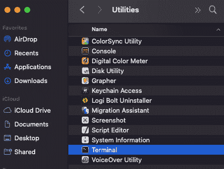
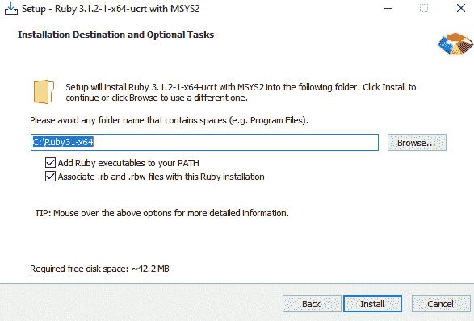
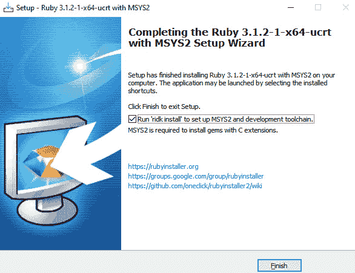
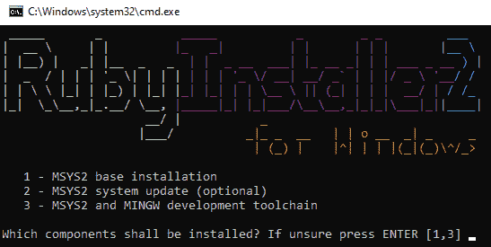

# 第二章：设置我们的本地环境

作为一名开发者，你可能已经知道，你需要掌握的关键技能之一是将编程语言本身安装到你的电脑上。我们需要一种方法来开始测试代码，除了我们的大脑，因为我们的大脑不是最好的语言编译器。但安装语言到底意味着什么呢？

来自 PHP，这可能意味着在我们的电脑上安装 PHP 的二进制解释器，以便我们可以运行 PHP，打开浏览器，然后就可以开始了。或者，这也可能意味着下载 PHP 源代码，编译它，并使用我们选择的编译选项生成自己的二进制文件。在 Ruby 中，我们不仅有与这些相似的选择，还有许多安装 Ruby 解释器到本地机器的方法。

在本章中，我们将探讨设置我们的开发环境的不同方法。我们将分析每种方法的优缺点，为您提供不同的选择，以便开发者在出现错误时能够保持一致性，从而避免所有开发者都听过并不幸使用过的讨厌短语：“*在我的机器上它运行正常。*”

因此，在本章中，我们将涵盖以下主题：

+   在本地安装 Ruby

+   使用虚拟机

+   使用 Docker

+   使用 rbenv

# 技术要求

要跟随本章内容，我们需要以下内容：

+   任何用于查看/编辑代码的 IDE（例如 SublimeText、Visual Studio Code、Notepad++ Vim、Emacs 等）

+   对于 macOS 用户，您还需要安装 Xcode 命令行工具

本章中展示的代码可在[`github.com/PacktPublishing/From-PHP-to-Ruby-on-Rails`](https://github.com/PacktPublishing/From-PHP-to-Ruby-on-Rails)找到。

# 在本地安装 Ruby

我们已经准备好设置我们的 Ruby 环境。可能在我们机器上安装 Ruby 最方便的方式是使用包管理器或安装程序，这取决于您的操作系统。

## macOS 用户

对于 macOS 用户，brew 包管理器是最佳选择。

要安装 brew，使用 Finder 窗口，导航到**应用程序**文件夹，然后到**实用工具**文件夹，然后滚动直到找到**终端**：



图 2.1：应用程序实用工具

双击**终端**图标，你应该会看到一个带有 shell 提示符的终端，等待输入命令：


图 2.2：终端

然后从 brew 主页（[`brew.sh/`](https://brew.sh/））复制以下命令：


图 2.3：Homebrew 安装说明

现在将命令粘贴到终端以安装 brew。

一旦安装了 brew，安装 Ruby（或其变体）就变得简单。如果 brew 已经安装，你可能只想通过运行 `brew update` 命令来更新它。你可能需要打开一个新的终端窗口，但一旦你做了，你只需运行以下命令即可安装 Ruby：

```php
~ $ brew install ruby
```

这将产生以下输出：

```php
Running `brew update –auto-update`…
.
.
.
==> Summary
🍺  /opt/homebrew/Cellar/ruby/3.1.2_1: 15,996 files, 42.8MB
==> Running `brew cleanup ruby`...
Disable this behaviour by setting HOMEBREW_NO_INSTALL_CLEANUP.
Hide these hints with HOMEBREW_NO_ENV_HINTS (see `man brew`).
==> `brew cleanup` has not been run in the last 30 days, running now...
Disable this behaviour by setting HOMEBREW_NO_INSTALL_CLEANUP.
.
.
.
Removing: /Users/bpineda/Library/Logs/Homebrew/gnutls... (64B)
Pruned 0 symbolic links and 6 directories from /opt/homebrew
==> Caveats
==> ruby
By default, binaries installed by gem will be placed into:
  /opt/homebrew/lib/ruby/gems/3.1.0/bin
You may want to add this to your PATh.
ruby is keg-only, which means it was not symlinked into /opt/homebrew,
because macOS already provides this software and installing another version in
parallel can cause all kinds of trouble.
If you need to have ruby first in your PATH, run:
  ec'o 'export PA"H="/opt/homebrew/opt/ruby/bin:$P"'H"' >> /Users/bpineda/.bash_profile
For compilers to find ruby you may need to set:
  export LDFLA"S="-L/opt/homebrew/opt/ruby/"ib"
  export CPPFLA"S="-I/opt/homebrew/opt/ruby/incl"de"
```

这里显示的代码已被简化以节省篇幅，并且可能与不同版本的 macOS 版本有所不同，但本质上，在安装了 brew 之后，你应该会看到相同（或非常相似）的输出。只要没有错误，你应该就可以正常使用了。作为旁注，我想强调 brew 是许多在 macOS 和一些 Linux 环境中工作的开发者使用的包管理器，但它并不是安装 Ruby 的唯一途径。

最后一步，我们应该打开一个新的终端窗口。这将重新加载 `$PATH` 变量，并使我们能够使用 Ruby。这是一种非常实用的安装 Ruby 的方法，因为我们可以直接开始使用 Ruby 解释器。

现在，让我们确认 Ruby 确实已经安装。在终端中，输入以下内容：

```php
ruby -v
```

这应该会返回已安装的 Ruby 版本：

```php
ruby 3.1.2p20 (2022-04-12 revision 4491bb740a) [arm64-darwin21]
```

我们已成功安装 Ruby。如今，大多数 Mac 电脑出厂时已经预装了 Ruby。然而，这是一个过时的 Ruby 版本，因此自己安装它仍然是一个很好的实践练习。

## Windows 用户

对于 Windows 用户，安装 Ruby 最简单的方法是使用来自 [`rubyinstaller.org/`](https://rubyinstaller.org/) 的安装程序：


图 2.4：Ruby Windows 安装程序

我选择了最新版本，因为它是最推荐的安装版本，或者至少是最新稳定版本。务必根据您的机器架构选择正确的版本（32 位或 64 位）。下载完成后，双击安装程序，你将看到这个屏幕：


图 2.5：Windows 安装程序许可协议

接受许可协议并点击**下一步**。

然后选择默认的安装位置和将二进制文件添加到我们的 PATH 中的选项：



图 2.6：Windows 安装程序安装位置

之后，选择**安装**。一旦这个过程完成，我们会看到一个**运行‘ridk install’**的选项：



图 2.7：Windows 安装程序完成设置

当 `sh`、`make` 和 `gcc` 可用。这些工具需要为一些我们可能在未来使用的库（或 gems）进行编译。通过设置此选项，将弹出一个新的提示：



图 2.8：MSYS2 安装提示

对于所有选项，按下 *Enter* 键直到安装完成。这些选项会安装和更新 MSYS2，它为与在 Windows 系统上构建的软件兼容提供了类似 Unix 的环境。

完成后，请确保 Ruby 已正确安装。为此，请打开 Windows PowerShell。然后使用 `ruby -v` 命令，你应该会看到以下内容：


图 2.9：Windows Ruby 版本确认

通过这样，我们已经确认 Ruby 已正确安装在我们的 Windows 系统上。

## Linux 用户

对于 Linux 用户，我们有不同的发行版，尽管其中一些共享包管理器，但大多数情况下，每个系列都使用自己的包管理器。例如，Red Hat 系列的发行版（Red Hat 和 CentOS）使用 `yum`，Ubuntu 使用 `apt`，而 Debian 使用 `dpk`，但也支持 `apt`。我们将重点关注作为桌面操作系统最常用的发行版，即 Ubuntu。

在 Ubuntu 中，导航到 `sudo apt install ruby`。然后 Ubuntu 将确认你确实正在尝试安装 Ruby。当出现此确认时，只需输入 *Y*，正如你所看到的那样：


图 2.10：Ruby 安装提示

我们使用 `sudo` 命令，因为我们需要在系统上安装应用程序需要 root 权限。根据我们的互联网速度和机器的配置，安装可能需要一段时间，但一旦过程完成，我们再次使用 `ruby -v` 验证安装：


图 2.11：Ubuntu Ruby 版本确认

因此，我们已经完成了，你现在知道如何在任何你使用的操作系统上安装 Ruby。现在让我们看看如何使用虚拟环境来与 Ruby 一起工作。

# 使用虚拟机

到目前为止，我们已经看到了如何在我们的本地机器上安装 Ruby，即我们每天用于工作的机器。这是开始安装 Ruby 的最佳方式，但一旦你开始处理更复杂的应用程序与其他开发者合作，你将希望确保每个人的本地环境行为的一致性。

为什么你会问？简单的答案是，我们想要避免所有开发者都曾听说过或在某些时候在我们的职业生涯中使用过的那个可怕的短语：“在我的机器上它运行正常。”重要的是要记住，每个本地环境都是不同的，从处理器到操作系统版本和 Ruby 版本，这可能会妨碍更重要的工作。

以我个人的经历为例，我们曾经在一次将 PHP 应用程序部署到在 Windows 本地机器上开发的 Linux 服务器时浪费了近一周的时间。问题是其中一位开发者忘记当时 Windows（当时）在文件夹名称中不区分大小写。虽然这听起来可能是个愚蠢的例子，但我们应尽可能避免这类问题，因为在处理这类问题时，时间会迅速被浪费。

虚拟化在创建团队中开发者的等效环境方面可以发挥重要作用，幸运的是，我们在虚拟领域有几种选项可以探索，以帮助我们实现这一点。

## VMware

第一个选项是 VMware ([`vmware.com`](https://vmware.com))。VMware 允许你在机器内模拟完整的操作系统。当然，这种设置比其他方式花费的时间更长，因为你必须首先安装 VMware，创建虚拟机，然后在虚拟机中安装操作系统，最后安装 Ruby。这确实很复杂，也很耗时，但一旦设置好并运行起来，你就可以与其他团队成员共享环境。这意味着团队中的每个人都会拥有完全相同的环境。

## VirtualBox

VirtualBox ([`www.virtualbox.org`](https://www.virtualbox.org)) 是一个 Oracle 产品，其行为和工作流程与 VMware 类似。有些人喜欢 VirtualBox，有些人喜欢 VMware。根据我个人的经验，对于初学者来说，VirtualBox 是更好的选择，因为它是开源的，免费使用，有更好的用户界面，并且非常适合小型到中型项目。

## Vagrant

Vagrant ([`www.vagrantup.com/`](https://www.vagrantup.com/)) 是一个帮助我们自动化和管理环境的工具。VMware 和 VirtualBox 都有机制可以与宿主机共享文件和其他资源；然而，它们的使用并不那么简单，有时配置它们会花费很多时间。Vagrant 出现就是为了解决这个问题：它允许我们指定本地机器和虚拟机之间的共享文件夹，允许我们通过配置文件复制配置，并且使连接到虚拟机变得更加容易。最酷的部分是 Vagrant 可以无缝地与 VMware 和 VirtualBox 一起工作。

Laravel 开发者可能对 Vagrant 很熟悉，因为 Homestead 可以与 VirtualBox 配合使用。即使你不想使用这个选项，因为它可能不太实用，我也建议至少尝试一次，以便在除你机器上安装的操作系统之外的环境中玩转 Ruby。这种虚拟化消耗大量资源，包括内存、处理器，甚至磁盘空间。为了方便而付出高昂的代价，但从长远来看是值得的。

注意

由于这超出了本书的范围，并且对于初学 Ruby 的开发者来说不是必需的；我们不会探讨如何执行此类安装。但对于一个新手 Ruby 开发者来说，至少应该熟悉这些工具，哪怕只是知道它们的名字。如果您对这些实现更感兴趣，尤其是 Vagrant 和 VirtualBox，您可能想访问以下网站：[`www.taniarascia.com/what-are-vagrant-and-virtualbox-and-how-do-i-use-them/`](https://www.taniarascia.com/what-are-vagrant-and-virtualbox-and-how-do-i-use-them/)。

最后，Docker 提供了一种不同于 VMware 和 VirtualBox 的虚拟化类型，它比两者都要轻量，这是我们接下来要探讨的内容。

# 使用 Docker

Docker([`www.docker.com/`](https://www.docker.com/))是另一种虚拟化技术，已成为许多中型和大型企业的首选选项。虽然它仍然是一个虚拟化环境，并带有它自己的缺点，但优点超过了它们。让我们看看一些优点：

+   Docker 不是完全虚拟化的——它创建了一个与运行它的主机共享资源的容器。正因为如此，它的运行速度比虚拟化环境要快得多。我在过度简化 Docker 技术，但本质上它是一个改进的（在我看来）虚拟化环境。

+   您可以将您的 Docker 环境打包成一个 Docker 镜像（类似于虚拟机），这样其他人就可以轻松地部署和使用它。

+   随着云计算的出现，Docker 变得越来越受欢迎。亚马逊（AWS）、微软（Azure）和谷歌（GCP）都支持 Docker，并且逐渐使其实现变得更加容易。

+   使用 Docker，您可以在本地复制另一台开发者的机器上发生的几乎所有错误，以及在生产环境中（在正确的情况下）。想象一个假设的开发者世界，您可以在生产服务器上进行测试，确保在向公众展示之前，过去看到的任何错误都得到了纠正。好吧，这几乎就是 Docker 所能实现的。当然，我在简化这个过程，但本质上，您在本地使用的 Docker 镜像有可能与生产环境中使用的镜像相同。

Docker 的主要缺点是，理解如何使用镜像和容器以及构建微服务更为复杂。如果您从未听说过微服务，这个概念可能会让您感到惊讶，因为它们与传统应用程序和部署不同。微服务是一种用于通过将应用程序分割成一系列服务来构建应用程序的架构风格。Docker Compose 可能会使在本地实现微服务变得更容易，但这仍然是一个复杂的话题。

注意

如果您对微服务主题更感兴趣，您应该查看[`microservices.io/`](https://microservices.io/)。

我真心认为探索 Docker 比其他虚拟化选项更有价值，因为它在开发者和基础设施社区中获得了如此多的流行。

虽然我们不会深入探讨 Docker，但我们可以迈出一些小步来学习如何在本地环境中使用它。第一步是通过安装程序或包管理器安装 Docker。根据您的操作系统和发行版，使用以下之一：

+   对于 Mac：[`docs.docker.com/desktop/install/mac-install/`](https://docs.docker.com/desktop/install/mac-install/)

+   对于 Windows：[`docs.docker.com/desktop/install/windows-install/`](https://docs.docker.com/desktop/install/windows-install/)

+   对于 Linux：[`docs.docker.com/desktop/install/linux-install/`](https://docs.docker.com/desktop/install/linux-install/)

之后，我们可以运行以下命令来验证 Docker 是否已安装：

```php
docker -v
```

这应该会返回您机器上找到的当前 Docker 版本：

```php
Docker version 20.10.17, build 100c701
```

一旦 Docker 可用，我们可以下载一个 Ruby 镜像并使用这个单行命令运行 Ruby 命令：

```php
docker run --entrypoint ruby ruby:latest -v
```

在这里，我们正在告诉 Docker 代理获取最新的 Ruby Docker 镜像，然后运行`ruby -v`。命令应该输出类似以下内容：

```php
Unable to find image 'ruby:latest' locally
latest: Pulling from library/ruby
cd84405c8b9e: Pull complete
a1d98e120b80: Pull complete
7cb6be5911b4: Pull complete
db608c3c3ce3: Pull complete
ef10f752bfb9: Pull complete
65032c8238ec: Pull complete
a6196a66f1a5: Pull complete
8f0e459675ce: Pull complete
Digest:
sha256:74f02cae856057841964d471f0a54a5957dec7079cfe18076c132ce5 c6b6ea37
Status: Downloaded newer image for ruby:latest
ruby 3.1.2p20 (2022-04-12 revision 4491bb740a) [aarch64-linux]
```

第一次运行此命令时，可能需要一段时间，因为它将不得不下载 Ruby Docker 镜像。一旦下载了 Docker 镜像，它将启动一个带有该镜像的容器并运行命令。一旦命令运行完毕，容器将被停止。

有了这些，我们已经成功使用 Docker 运行了一个 Ruby 命令。虽然实际上以更实用的方式使用 Docker 进行开发更复杂，但这是一个很好的起点。

现在我们已经看到了设置本地环境的一些选项，我们将转向 Ruby 开发的下一个基本工具，那就是 rbenv。

# 使用 rbenv

虽然强烈建议为团队的所有成员使用某种同质化环境（如之前提到的虚拟环境），但创建等效环境的一种更简单、更快捷的方法是使用某种 Ruby 版本管理工具。这类工具允许我们安装不同的 Ruby 版本，并且大部分情况下它们的行为相似，即使它们安装在不同的操作系统上。我们有几种选择，但为了简单起见，我们将使用 rbenv：[`github.com/rbenv/rbenv`](https://github.com/rbenv/rbenv)。

rbenv 允许我们安装多个版本的 Ruby 并管理这些版本。通过“管理”我指的是我们可以定义整个系统使用的 Ruby 版本（全局），或者我们可以定义每个项目使用的特定版本（局部）。对于 macOS 和 Linux 用户，您应遵循之前提到的 GitHub 仓库中的说明，该仓库也作为官方网站。如果在尝试安装工具时遇到任何问题，您还可以遵循以下两个教程来安装 rbenv：

+   [`www.digitalocean.com/community/tutorials/how-to-install-ruby-on-rails-with-rbenv-on-macos`](https://www.digitalocean.com/community/tutorials/how-to-install-ruby-on-rails-with-rbenv-on-macos)

+   [`collectionbuilder.github.io/cb-docs/docs/software/ruby_mac/`](https://collectionbuilder.github.io/cb-docs/docs/software/ruby_mac/)

最后，对于 Windows 用户，我们有 rbenv-for-windows：[`github.com/ccmywish/rbenv-for-windows`](https://github.com/ccmywish/rbenv-for-windows)。

注意，Windows 的版本可能有点有限，你可能会遇到某些 Ruby 版本的问题。

在我们安装 rbenv 之后，我们应该列出机器上安装的 Ruby 版本。让我们打开一个 shell 并运行以下命令：

```php
rbenv versions
```

这应该会显示以下输出：

```php
* system
```

上述输出意味着我们只安装了一个版本的 Ruby。让我们添加 Ruby 2.6.10 以用于本书的示例。我们将在 shell 中输入以下命令：

```php
rbenv install 2.6.10
```

这应该会抛出以下输出：

```php
To follow progress, use 'tail -f /var/folders/47/x761l7cd0419z6lzb_kt7yzc0000gn/T/ruby-build.20231019202743.61499.log' or pass –verbose
…
Downloading ruby-2.6.10.tar.bz2...
-> https://cache.ruby-lang.org/pub/ruby/2.6/ruby-2.6.10.tar.bz2
Installing ruby-2.6.10...
…
NOTE: to activate this Ruby version as the new default, run: rbenv global 2.6.10
```

现在我们已经可以使用 Ruby 2.6.10，我们可以使用以下命令开始使用该版本：

```php
rbenv local 2.6.10
```

在运行上述命令之后，请确保使用以下命令进行测试：

```php
ruby --version
```

这应该会显示当前的 Ruby 版本为 2.6.10：

```php
ruby 2.6.10p210 (2022-04-12 revision 67958) [arm64-darwin22]
```

输出可能会因系统而异，但版本应该相同。我不会过多地讨论 rbenv 的工作原理，但我会说，通过在文件夹上运行此命令，你在此文件夹（或此文件夹内的子文件夹）中进行的任何工作都将使用 Ruby 2.6.10。如果我们移动到不同的文件夹，可用的 Ruby 版本将不同。为每个项目设置 Ruby 版本而不是仅仅依赖计算机上安装的版本是一个重要的最佳实践。切换 Ruby 版本现在就像安装所需的版本并使用上述命令应用该版本一样简单。对于本书的练习，我强烈建议依赖 rbenv。

作为 rbenv 的替代方案，我们有 rvm：[`rvm.io/`](https://rvm.io/)。

然而，我强烈建议选择 rbenv 而不是 rvm，因为大多数开发者使用 rbenv。如果你愿意接受挑战，可以尝试使用 rvm。

# 摘要

到目前为止，我们已经学习了如何在 macOS、Windows 和 Linux 系统上安装 Ruby。虽然某些操作系统可能已经预装了 Ruby，但它几乎总是过时的。我们应该始终安装 Ruby 的最新版本，因为安装 Ruby 是我们作为 Ruby 开发者自身开发过程的一部分。

我们还学习了关于虚拟化的知识，包括 VMware、VirtualBox 和 Docker。我想指出，关于虚拟化技术的理论可能对初学者开发者来说有点令人难以承受——我本人刚开始学习 Ruby 时并没有使用过这些虚拟技术，主要是因为当时这并不是一个实用的选择，而且它们在那个时期还没有变得如此流行——但现在我可以自信地说，如果我当时有那些资源，将会节省我很多麻烦。话虽如此，我可以保证，它们将会非常有用（至少是 Docker），但开始用 Ruby 编程它们并不是必需的。最后，我们还学习了 rbenv 的基本命令以及为什么它已经成为 Ruby 社区中首选的 Ruby 版本管理器。

接下来，我们将进入下一章，现在我们已经准备好开始自己编写一些 Ruby 代码了。我们还将对比 PHP 和 Ruby 的语法，分析如何利用我们从 PHP 中已有的知识并将其迁移到 Ruby。最后，我们将了解 Ruby 语言中 PHP 所不具备但非常适合 Ruby 世界的增强功能。
