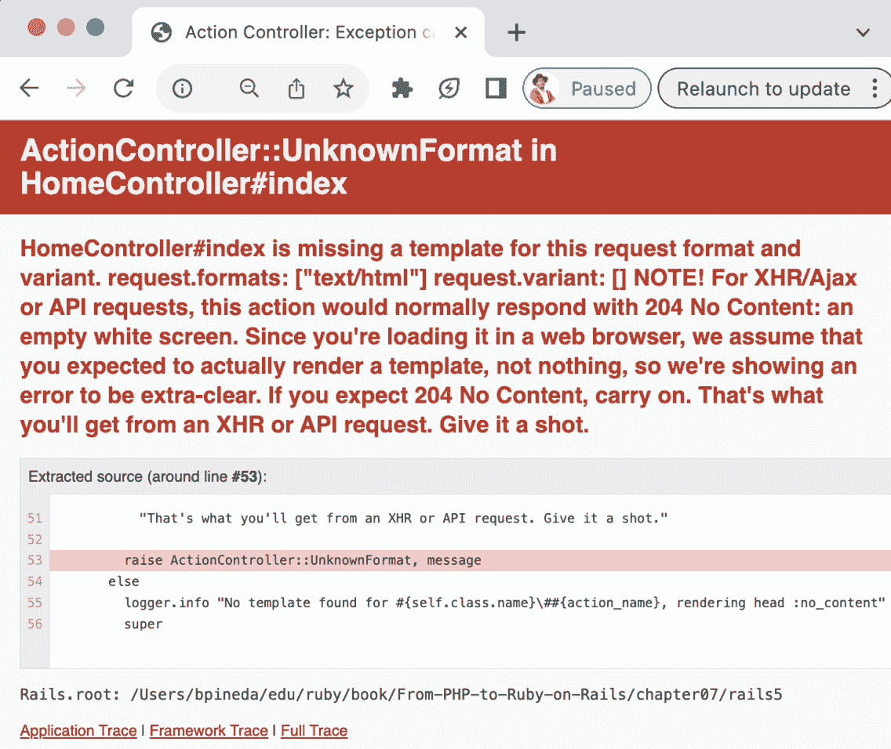

# 第七章：理解约定优于配置

一旦我们开始使用 Ruby on Rails，你将经常遇到“约定优于配置”这个短语。是的，你没听错——我们准备好开始使用 Ruby 开发者最喜爱的网页框架之一了。虽然很有趣，但在我们开始编程之前，我们确实需要了解结构和 Ruby on Rails 的配置工作方式。

在本章中，我们将介绍 Ruby on Rails 的安装及其文件结构，以便我们能够轻松地在框架中移动。一旦我们了解如何放置事物，我们将继续使用采用 MVC 模式的框架。最后，我们将学习如何通过表单和会话发送和接收数据。

考虑到 Ruby on Rails 的配置，在本章中，我们将涵盖以下主题：

+   安装 Ruby on Rails

+   Ruby on Rails 文件结构

+   Ruby on Rails 的 MVC 实现

+   用户与 Ruby on Rails 的交互

# 技术要求

为了跟随本章内容，我们需要以下内容：

+   任何用于查看/编辑代码的 IDE（SublimeText、Visual Studio Code、Notepad++、Vim、Emacs 等）

+   对于 macOS 用户，你还需要安装 XCode 命令行工具

+   已安装并准备好使用的 Ruby 版本 2.6

+   在我们的本地机器上安装 Git 客户端

本章中展示的代码可在 [`github.com/PacktPublishing/From-PHP-to-Ruby-on-Rails/`](https://github.com/PacktPublishing/From-PHP-to-Ruby-on-Rails/) 找到。

# 如果有 Ruby 魔法，就有 Rails 魔法

到目前为止，你可能已经熟悉了被亲切地称为 Ruby 魔法的概念。我们看到了一些 Ruby “神奇地”从看似合理的语法中生成输出的例子，但我们并不知道它是如何做到的（提示：元编程）。以同样的方式，Ruby on Rails（也称为 Rails 或简称 RoR）在内部使用元编程来生成我们看不到的功能。我们将通过查看更多示例来理解它，但首先，我们需要安装 Ruby on Rails。

## 安装 Ruby on Rails

就像我们迄今为止看到的库一样，Rails 是一个开源的 gem。它与我们所看到的 gem 有点不同，因为它使用了许多依赖项并且可以生成代码示例，但最终，它仍然是一个 gem。这意味着我们可以单独安装它，或者我们可以在 Gemfile 中包含它。对于本节，我们必须将过程分为三个单独的部分——macOS 安装、Windows 安装和 Linux 安装——因为每个操作系统的行为都不同。

### 在 macOS 上安装 Ruby on Rails

设置本地环境的第一个步骤是安装 `rbenv`。对于大多数 Mac 安装，`brew` 将简化此过程。让我们开始以下步骤：

1.  让我们打开一个 shell 并运行以下命令：

    ```php
    rbenv program. Now, you’ll need to add the following line to your bash profile:

    ```

    eval "$(rbenv init -)"

    ```php

    ```

1.  一旦你将这一行添加到你的配置文件中，你应该通过打开一个新的 shell 或运行以下命令来激活这个更改：

    ```php
    rbenv installed, we need to install Ruby 2.6.10 with the following command:

    ```

    rbenv install 2.6.10

    ```php

    ```

1.  一旦安装了 Ruby 2.6.10，我们必须使用以下命令设置默认的 Ruby 版本：

    ```php
    bundler. Let’s install it with the following command:

    ```

    gem install bundler

    ```php

    ```

到此为止，我们的环境已经准备好进行本章的下一步。

如果你想了解更多关于这个安装的详细信息，请参考以下网页：[`www.digitalocean.com/community/tutorials/how-to-install-ruby-on-rails-with-rbenv-on-macos`](https://www.digitalocean.com/community/tutorials/how-to-install-ruby-on-rails-with-rbenv-on-macos)。

### 在 Windows 上安装 Ruby on Rails

按照以下步骤在 Windows 上安装 Ruby on Rails：

1.  为了设置我们的本地环境，首先，我们必须为 Windows 安装 Git。我们可以从[`gitforwindows.org/`](https://gitforwindows.org/)下载安装包。

    下载完成后，我们可以运行安装程序；它应该打开安装程序应用程序：


图 7.1 – Git 安装程序

你可以安全地接受默认选项，除非你想从 Git 更改任何特定的行为。在安装过程结束时，你只需取消选择向导的所有选项，然后继续下一步：


图 7.2 – Git 最终安装

我们还需要安装 Git SDK，因为 Ruby on Rails 需要一些依赖项。我们可以从[`github.com/git-for-windows/build-extra/releases/tag/git-sdk-1.0.8`](https://github.com/git-for-windows/build-extra/releases/tag/git-sdk-1.0.8)获取安装程序。

请小心，并选择适合你平台（32 位或 64 位）的正确选项。在我的情况下，我必须选择 64 位，因此我下载了**git-sdk-installer-1.0.8.0-64.7z.exe**二进制文件：


图 7.3 – Git SDK 下载

1.  一旦下载了这个安装包，运行它；我们将被询问希望将 Git SDK 安装在哪里。默认选项是合适的（`C:\git-sdk-64`）：


图 7.4 – Git SDK 安装位置

由于需要下载其他附加包，这个安装包可能需要一些时间才能完成，但它会自动完成。请耐心等待。一旦这个安装包完成安装 SDK，它将打开一个 Git Bash 控制台，其外观类似于 Windows PowerShell。我们可以关闭这个 Git Bash 控制台窗口并打开另一个 Windows PowerShell。

1.  一旦我们打开了新窗口，我们必须输入以下命令：

    ```php
    rbenv, which allows us to install multiple versions of Ruby. However, this program wasn’t created for Windows, so its installation is a little different than in other operating systems.
    ```

1.  让我们打开一个浏览器并访问*rbenv for Windows*网页：[`github.com/ccmywish/rbenv-for-windows`](https://github.com/ccmywish/rbenv-for-windows)。

    在那个页面上，我们将找到如何安装`rbenv`的说明，我们现在将进行安装。

1.  让我们打开一个新的 Windows PowerShell 并输入以下命令：

    ```php
    rbenv installation.
    ```

1.  运行这个命令后，我们必须使用以下命令下载剩余的所需文件：

    ```php
    iwr -useb "https://github.com/ccmywish/rbenv-for-windows/raw/main/tools/install.ps1" | iex
    ```

1.  一旦这个命令从 GitHub 下载完文件，我们就可以在 Windows PowerShell 中运行以下命令来修改用户的配置文件：

    ```php
    rbenv-for-windows web page, we can see what the content of the file should be. Let’s add it with Notepad so that the profile file now looks like this:

    ```

    $env:RBENV_ROOT = "C:\Ruby-on-Windows"

    rbenv 正在运行，我们的控制台将自动安装一个默认的 Ruby 版本。这可能需要一些时间，并且会考验我们的耐心。一旦过程完成，我们应该看到类似于以下输出的内容：

    ```php

    ```


图 7.5 – rbenv 安装后脚本

现在，我们已经准备好安装其他版本的 Ruby。对于 Ruby on Rails 5，我们将安装 Ruby `2.6.10`。

1.  让我们在刚刚打开的相同 Windows Powershell 窗口中运行以下命令来安装它：

    ```php
    rbenv install 2.6.10
    ```

    程序会询问我们是否想安装轻量版还是完整版。请选择完整版。这又可能需要一些时间，所以请耐心等待。

1.  一旦这个命令运行完成，我们必须为整个系统设置这个 Ruby 版本。我们可以通过运行以下命令来完成：

    ```php
    rbenv global 2.6.10
    ```

1.  为了确认这个版本的 Ruby 已经被安装并启用，使用以下命令：

    ```php
    bundler to manage all the dependencies on our system. So, let’s install this program with the following command:

    ```

    gem install bundler

    ```php

    ```

1.  一旦安装了这个 gem，我们必须使用以下命令更新 RubyGem 系统：

    ```php
     gem update –-system 3.2.3
    ```

    这个命令的计算也会花费一些时间，但一旦完成，我们就可以在 Windows 上使用 Ruby on Rails 了。

接下来，让我们看看在 Linux 上安装 Ruby on Rails 的步骤。

### 在 Linux 上安装 Ruby on Rails

对于 Ubuntu 和 Debian Linux 发行版，我们还必须安装`rbenv`以及 Ruby on Rails 正确运行所需的依赖项：

1.  让我们先打开一个终端并运行以下命令：

    ```php
    apt, we must install our dependencies for Ruby, Ruby on Rails, and some gems that require compiling. We’ll do so by running the following command:

    ```

    使用以下命令安装 rbenv：

    ```php
    rbenv to our $PATH. Let’s do so by running the following command:

    ```

    使用以下命令将 rbenv 添加到我们的 bash 配置文件中：

    ```php
    echo 'eval "$(rbenv init -)"' >> ~/.bashrc
    ```

    ```php

    ```

    ```php

    ```

1.  接下来，运行 bash 配置文件，使用以下命令：

    ```php
    rbenv executable available to us. Now, we can install Ruby 2.6.10 on our system with the following command:

    ```

    安装 Ruby 2.6.10，我们需要将其设置为整个机器的默认 Ruby 版本。我们可以通过运行以下命令来实现：

    ```php
    rbenv global 2.6.10
    ```

    ```php

    ```

1.  我们可以通过运行以下命令来确认这个版本的 Ruby 已经被安装：

    ```php
    bundler to manage all the dependencies on our system. So, let’s install this program with the following command:

    ```

    gem install bundler

    ```php

    ```

1.  一旦安装了这个 gem，我们可以使用以下命令更新 RubyGems 系统：

    ```php
     gem update –-system 3.2.3
    ```

    这个命令的计算也会花费一些时间，但一旦完成，我们就可以在 Linux 上使用 Ruby on Rails 了。

对于其他 Linux 发行版和其他操作系统，请参阅官方 Ruby-lang 页面：[`www.ruby-lang.org/en/documentation/installation/`](https://www.ruby-lang.org/en/documentation/installation/)。

### 下载我们的 Ruby on Rails 应用程序

虽然有几种使用 Rails 代码的方法，但为了方便使用，我们将下载一个现有项目作为示例。我们将使用 Git 工具克隆项目。打开一个终端并输入以下命令：

```php
git clone https://github.com/PacktPublishing/From-PHP-to-Ruby-on-Rails.git
```

这将生成一个名为 `From-PHP-to-Ruby-on-Rails` 的文件夹。现在，让我们使用以下命令导航到项目文件夹：

```php
cd From-PHP-to-Ruby-on-Rails/chapter07/rails5/
```

一旦我们进入这个文件夹，您会注意到一个 `Gemfile`。如果我们用我们选择的 IDE 打开那个 `Gemfile`，我们会看到依赖项的开始部分：

```php
source 'https://rubygems.org'
git_source(:github) do |repo_name|
  repo_name = "#{repo_name}/#{repo_name}"
    unless repo_name.include?("/")
  "https://github.com/#{repo_name}.git"
end
# Bundle edge Rails instead: gem 'rails', github:
  'rails/rails'
gem 'rails', '~> 5.1.7'
…
```

我们不要纠结于所有细节（至少现在不要），除了那里声明的 Rails 钩子。如您从前面的章节中回忆起来，我们可以使用 `bundle` 命令安装钩子和它们的依赖项。所以，让我们就这样做。输入以下命令：

```php
bundle install
```

`bundle` 命令会获取 `Gemfile` 中声明的所有钩子，创建一个依赖映射（称为 `Gemfile.lock`），并安装这些依赖项。此命令的输出应类似于以下内容：

```php
Fetching gem metadata from https://rubygems.org/...........
Resolving dependencies...
Using rake 13.0.6
Using concurrent-ruby 1.2.2
Using minitest 5.18.1
…
Using rails 5.1.7
Using sass-rails 5.0.7
Bundle complete! 16 Gemfile dependencies, 79 gems now installed.
Use `bundle info [gemname]` to see where a bundled gem is installed.
```

为了简洁起见，输出已被截断。为了证明我们的依赖项已经正确安装，我们应该运行以下命令：

```php
bundle exec rails --version
```

我们应该获取我们刚刚安装的 Rails 版本：

```php
Rails 5.1.7
```

哇！我们已经成功安装了 Ruby on Rails。然而，在我们开始使用这个框架之前，我们还需要澄清一些事情。首先，您可能想知道为什么我们使用了 `bundle exec rails --version` 命令而不是仅仅 `rails --version`。嗯，由于 Rails 开发者必须处理 Rails 能够在不同的环境和平台上运行（无论是 Windows、Linux、macOS 还是其他），确保“bundle”的库能够正确工作的方法之一是在“bundle”的上下文中运行 rails 命令。这只是说“使用我们刚刚安装的库运行命令”的一种花哨说法。所以，从现在起，我们所有的 Rails 命令都将用 `bundle exec` 命令包装。如果您对这个命令的更多细节感兴趣，请参阅 [`bundler.io/v2.4/man/bundle-exec.1.html`](https://bundler.io/v2.4/man/bundle-exec.1.html)。

现在我们终于安装了 Ruby on Rails，我们将启动服务器并体验 Rails。

## 开始我们的 Ruby on Rails 项目

运行我们的示例 Rails 应用程序需要我们运行以下命令：

```php
bundle exec rails server
```

按下 *Enter* 键后，我们应该看到以下输出：

```php
=> Booting Puma
=> Rails 5.1.7 application starting in development
=> Run `rails server -h` for more startup options
Puma starting in single mode...
* Version 3.12.6 (ruby 2.6.10-p210), codename: Llamas in
  Pajamas
* Min threads: 5, max threads: 5
* Environment: development
* Listening on tcp://localhost:3000
Use Ctrl-C to stop
```

一旦我们看到这条消息，这意味着我们已经准备好大干一场了。打开任何网页浏览器，在地址栏中输入以下内容：

```php
http://localhost:3000
```

我们应该看到以下页面：


图 7.6 – Rails 登录页面

恭喜！我们已经成功运行了第一个 Ruby on Rails 示例应用程序。当你第一次看到这个图像时，这总是令人兴奋和神奇的（至少对我来说是这样）。而这里的“魔法”是指 Rails 配置使用网络服务器和其他工具来使这个页面成为可能。现在，在我们开始对这个示例应用程序捣鼓之前，让我们看看 Ruby on Rails 的文件结构。

# Rails 文件结构解释

当你学习 Ruby on Rails 时，你需要学习的第一件事就是了解其文件结构中各个部分的位置。以我的情况为例，我花费了很长时间才把这些点连接起来，但一旦我做到了，我就不再在放置事物上挣扎。从长远来看，当新的 Rails 版本发布时，这甚至有助于你，因为各个版本之间的文件结构非常相似。所以，让我们看看所有的文件夹。以下是文件结构：

```php
.
├── app
│    ├── assets
│    │   ├── config
│    │   ├── images
│    │   ├── javascripts
│    │   │    └── channels
│    │   └── stylesheets
│    ├── channels
│    │   └── application_cable
│    ├── controllers
│    │   └── concerns
│    ├── helpers
│    ├── jobs
│    ├── mailers
│    ├── models
│    │   └── concerns
│    └── views
│        └── layouts
├── bin
├── config
│    ├── environments
│    ├── initializers
│    └── locales
├── db
├── lib
│    ├── assets
│    └── tasks
├── log
├── public
├── test
│    ├── controllers
│    ├── fixtures
│    │   └── files
│    ├── helpers
│    ├── integration
│    ├── mailers
│    ├── models
│    └── system
├── tmp
│    ├── cache
│    │   └── assets
│    ├── pids
│    └── sockets
└── vendor
```

这可能看起来很多，甚至令人感到压倒，但我们将使用五个文件夹：`app/controllers`、`app/models`、`app/views`、`config` 和 `public`。Rails 是 `controllers` 文件夹，模型在 `models` 文件夹中，视图在 `views` 文件夹中。在 `config` 文件夹中，我们将存储配置值，例如我们定义的 URL 路由、数据库连接值以及可能因环境而异（即开发、生产测试）的值。最后但同样重要的是，在 `public` 文件夹中，我们将存储网络服务器需要访问的某些资产。我们偶尔可能需要处理其他文件夹，但作为 RoR 新手开发者，我们大部分时间将主要处理上述文件夹。

现在我们已经了解了 Rails 的文件结构，我们可以继续到下一部分，我们将深入探讨 MVC 模式是如何发挥作用的。

# MVC 之最佳实践

如前所述，Rails 是一个 MVC 控制器。如果你过去使用过 PHP 框架，例如 CodeIgniter、Symfony 或 Laravel，你可能对这个词很熟悉。如果你不熟悉，我建议查看这些页面：

+   [`www.oracle.com/technical-resources/articles/java/java-se-app-design-with-mvc.html`](https://www.oracle.com/technical-resources/articles/java/java-se-app-design-with-mvc.html)

+   [`pusher.com/blog/laravel-mvc-use/#why-use-mvc`](https://pusher.com/blog/laravel-mvc-use/#why-use-mvc)

总结来说，MVC 模式将我们的应用程序分为三个组件——模型，其中我们保存所有的业务逻辑（主要是通过连接到数据库，但不限于），视图，其中我们存放要在浏览器上显示的内容（主要是 HTML），以及控制器，它作为前两个组件的组织者。如果我们用一个例子来解释这一点，用户认证组件将如下工作：在视图中创建显示用户和密码字段的 HTML 表单。一旦用户点击按钮提交这些字段，控制器将接收表单数据（用户和密码），并将它们传递给模型。之后，模型将连接到数据库并尝试找到与用户和密码匹配的数据库条目。如果我们找到一个用户条目，模型将回传在数据库上找到的用户条目。下一步将是控制器告诉浏览器重定向到一个显示用户已登录并显示模型传递的用户数据的页面。虽然这可能听起来工作量很大，但 Rails 在抽象这些组件方面做得非常出色，几乎对我们来说是不可见的。这正是我们将看到在 Rails 中约定优于配置是如何工作的。在其他框架中，我们可能需要定义我们的控制器、模型和视图所在的位置。我们有这样的自由。然而，在 Rails 中，我们不需要这样的区分。这就像魔法一样。

让我们考虑创建一个控制器的例子。最简单的方法是使用 Rails 生成器。Rails 生成器是帮助我们生成样板控制器、模型等的工具。我们将使用这个工具来生成我们的控制器。让我们去终端，那里我们的 Rails 项目仍在运行。在那个终端内，按下（并持续按下）*Ctrl* 键。然后（仍然按住 *Ctrl* 键）按下 *C* 键。这将向我们的应用程序发送一个停止信号；终端应该会显示类似以下的内容：

```php
…
^C- Gracefully stopping, waiting for requests to finish
=== puma shutdown: 2023-07-22 21:52:24 -0700 ===
- Goodbye!
Exiting
```

现在，让我们生成一个 `Home` 控制器。我们可以通过运行以下命令来完成：

```php
bundle exec rails generate controller Home
```

这将输出以下内容：

```php
Running via Spring preloader in process 76607
      create  app/controllers/home_controller.rb
      invoke  erb
      create    app/views/home
      invoke  test_unit
      create    test/controllers/home_controller_test.rb
      invoke  helper
      create    app/helpers/home_helper.rb
      invoke    test_unit
      invoke  assets
      invoke    coffee
      create      app/assets/javascripts/home.coffee
      invoke    scss
      create      app/assets/stylesheets/home.scss
```

此过程还会生成控制器和一些其他用于测试和格式的文件；我们将忽略它们。让我们只关注在 `app/controllers/home_controller.rb` 中生成的控制器。让我们看看它的内容：

```php
class HomeController < ApplicationController
end
```

目前，它是一个空的控制器，但我们将很快用通过 Rails 路由映射的动作来填充它（[`guides.rubyonrails.org/routing.html`](https://guides.rubyonrails.org/routing.html)）。

如果你对这个概念不熟悉，`routes` 文件只是将特定的 URL 映射到控制器和动作。简单来说，这指定了当调用特定 URL 时将调用哪个控制器动作。让我们先创建一个当我们在浏览器中打开 `http://localhost:3000/home` 时将被调用的 URL。

所以，让我们首先再次启动我们的应用程序，但现在，我们不会使用 `rails server`，而是使用快捷命令，`rails s`：

```php
bundle exec rails s
```

在按下 *Enter* 键后，我们应该看到以下输出：

```php
=> Booting Puma
=> Rails 5.1.7 application starting in development
=> Run `rails server -h` for more startup options
Puma starting in single mode...
* Version 3.12.6 (ruby 2.6.10-p210), codename: Llamas in Pajamas
* Min threads: 5, max threads: 5
* Environment: development
* Listening on tcp://localhost:3000
Use Ctrl-C to stop
```

由于我们没有创建路由，如果我们现在打开我们的浏览器并访问 http://localhost:3000/home，我们会看到一个错误页面：


图 7.7 – Rails 路由错误页面

这是因为我们没有定义任何路由。让我们创建我们的 `home` 路由。我们可以通过打开 `config/routes.rb` 文件来实现：

```php
Rails.application.routes.draw do
  # For details on the DSL available within this file, see http://guides.rubyonrails.org/routing.html
end
```

所以，让我们定义一个路由。我们的代码现在应该如下所示：

```php
Rails.application.routes.draw do
  # For details on the DSL available within this file, see
    http://guides.rubyonrails.org/routing.html
  get 'home', to: 'home#index'
end
```

在这里，我们正在告诉 Rails，当应用程序接收到带有 `home` URL 的 `GET` 请求时，它将指向 `home` 控制器，并执行 `index` 动作。让我们回到我们的浏览器并刷新页面。现在，我们的错误应该如下所示：


图 7.8 – Rails 未知动作错误页面

因此，Rails 找到了 `HomeController`，但它找不到 `index` 动作，因为它还不存在。让我们创建它。打开我们的 `app/controllers/home_controller.rb` 文件，并向其中添加以下代码：

```php
class HomeController < ApplicationController
    def index
    end
end
```

这是熟悉的语法 – 这是 `HomeController` 继承自 `ApplicationController` 类，该类有一个名为 `index` 的方法。现在，我们只为这个类做这些。现在，让我们再次刷新我们的浏览器；我们将看到一个更详细的错误：



图 7.9 – Rails 未知格式错误页面

这个错误是因为 Rails 找到了控制器和 `index` 动作，但无法将视图加载到浏览器中，因为没有定义视图。让我们添加视图。我们可以通过创建包含以下内容的 `app/views/home/index.html.erb` 文件来实现：

```php
<h2>Home controller</h2>
<h3>Index Action</h3>
```

现在，让我们再次刷新浏览器；我们应该看到以下输出：


图 7.10 – 渲染的视图

这是我自从第一次运行 Rails 应用程序以来就非常喜欢的一个特性。无需任何额外配置，Rails “知道”在哪里查找视图。在这种情况下，Rails “知道”在 `views` 文件夹内应该有一个 `home` 文件夹。Rails 还“知道”在这个 `home` 文件夹内查找 `index.html.erb` 文件。在其他框架（尤其是 PHP 框架）中，你必须在控制器中指定你将渲染为视图的文件。这最终会变得重复且不实用。Rails 以非常优雅和直观的方式解决了这个问题。这就是约定优于配置所指的是的。了解约定后，我们不需要配置 Rails 应该在哪里查找视图。

现在我们已经对 MVC 模式及其组件如何构成我们的项目结构有了基本的了解，让我们继续下一部分，我们将学习如何使用 Rails 的 MVC 结构来发送、接收和保存数据。

# Rails 中的 POST、GET 和 SESSION

在进行 Web 开发时，PHP 和 Ruby 之间一个主要的不同之处在于 PHP 是开箱即用的基于 Web 的，而 Ruby 则不是。PHP 所需要的一切就是一个启用了 PHP 的 Web 服务器，我们就准备好了。对于开发，PHP 甚至自带了一个内部 Web 服务器。另一方面，Ruby 需要使用框架才能使用 Web 协议和工具。Ruby on Rails 并不是我们用于 Web 开发的唯一框架，但它是最受欢迎的一个。你也可能想了解一下 Sinatra 框架，以便有另一个不同于 Rails 的选择：[`sinatrarb.com/`](https://sinatrarb.com/)。

我们将坚持使用 Rails 进行 Web 开发。在 Web 开发中使用最流行的工具之一是表单。表单帮助我们从用户那里获取数据，并处理这些数据以完成不同的任务。我们可以设置搜索标准，验证用户，或者简单地显示之前保存的数据。在 PHP 中，我们可以通过 `$_POST`、`$_GET` 和 `$_SESSION` 数组访问这些工具。相比之下，Rails 处理这些方式略有不同，但仍然是一种有用且直观的方式。让我们从使用来自 URL 或 `$_GET` 值的值创建一些示例开始。首先，让我们通过在我们的浏览器中添加参数将值添加到 URL 中：`http://localhost:3000/home?search=php`。由于我们没有对视图进行任何更改，浏览器中的信息将保持不变。现在，让我们使用我们的 `Home` 控制器的 `index` 动作并添加这些参数。再次，我们必须打开我们的 `app/controllers/home_controller.rb` 文件，然后添加以下更改：

```php
class HomeController < ApplicationController
    def index
        search = params[:search]
        puts "GET value for search: #{search}"
    end
end
```

我们添加了一个名为 `search` 的变量，它反过来使用内部的 `params` 变量。`params` 等同于 PHP 中的 `$_REQUEST` 数组。在这个例子中，我们使用它通过 URL（搜索）获取值并将其设置为一个变量。此外，我们还会显示获取到的值。如果我们刷新浏览器，我们不会看到任何变化。再次强调，这是因为我们没有修改视图文件。然而，如果我们去应用程序仍在运行的控制台，我们会看到以下输出：

```php
Started GET "/home?search=php" for ::1 at 2023-07-22 11:48:18 -0700
Processing by HomeController#index as HTML
  Parameters: {"search"=>"php"}
GET value for search php
  Rendering home/index.html.erb within layouts/application
  Rendered home/index.html.erb within layouts/application (2.3ms)
Completed 200 OK in 21ms (Views: 19.3ms)
```

如我们所见，控制台告诉我们很多关于执行情况的信息。首先，它告诉我们我们使用什么方法（`GET`）来调用我们的 URL。然后，它告诉我们正在发送的数据（`search`）。最后，它显示我们添加到代码中的消息。虽然这不是调试 Rails 应用程序的最佳方式，但它确实让我们了解了我们的代码做了什么以及何时做了什么。在 PHP 中，每次我们写`echo`，它就会立即传递给浏览器。在这种情况下，如果我们想将数据传递给浏览器，首先，我们必须将它传递给视图。所以，让我们这么做。让我们在我们的控制器上的`index`动作中添加另一行代码，使代码现在看起来像这样：

```php
class HomeController < ApplicationController
    def index
        search = params[:search]
        puts "GET value for search #{search}"
        @search = search
    end
end
```

这种语法看起来很熟悉。如果您不记得，我们正在使用实例变量。这是将值传递给视图的最简单方法。现在，让我们打开视图并显示这个`@search`值。让我们打开`app/views/home/index.html.erb`文件并添加代码，使我们的视图现在看起来像这样：

```php
<h2>Home controller</h2>
<h3>Index Action</h3>
<p>
    <b>Search parameter</b>: <%= @search %>
</p>
```

这看起来也非常熟悉。在 PHP 中，我们会使用`<?= $search ?>`。在 Rails 中，实例变量可以立即在视图中使用。让我们最后一次刷新我们的浏览器；我们应该看到以下内容：


图 7.11 – 带有变量的渲染视图

我们已成功从 URL 中获取值。接下来，我们将查看通过`POST`方法发送的值。

`POST`方法用于发送我们不想在浏览器上显示的数据。想象一下通过浏览器发送密码。附近的人可能会发现我们的最深秘密。幸运的是，这就是`POST`值救命的地方。

首先，让我们添加`GET`和`POST`路由来渲染表单并发送表单数据。让我们打开我们的路由文件，`config/routes.rb`，并添加以下路由：

```php
Rails.application.routes.draw do
  get 'home', to: 'home#index'
  get 'user', to: 'home#user'
  post 'user', to: 'home#user'
end
```

我们必须对 http://localhost:3000/user 进行两次单独的调用——一次用于渲染表单，另一次用于获取表单数据。现在，让我们在控制器上创建一个动作。让我们打开我们的`app/controllers/home_controller.rb`文件并添加用户动作：

```php
class HomeController < ApplicationController
    def index
    …
    end
    def user
        @password = params[:password]
    end
end
```

我们只将密码传递给视图，以便我们可以将其与一个值进行比较。我想在这里指出，在现实生活中不应该这样做；我们只是在教学目的下这么做。现在，让我们在`app/views/home/user.html.erb`上创建一个视图，并添加我们将要发送数据的表单。为此，我们将使用 Rails 表单辅助工具（[`guides.rubyonrails.org/form_helpers.html`](https://guides.rubyonrails.org/form_helpers.html)）。

使用这个工具编写表单更容易，尽管一开始可能会有些困惑。所以，让我们在我们的视图中添加以下代码：

```php
<%= form_with url: "/user", method: :post do |form| %>
    <%= form.label :password, "Password:" %>
    <%= form.text_field :password %>
    <%= form.submit "SEND" %>
  <% end %>
```

通过这段代码，我们创建了一个表单，它调用相同的 URL，但使用`POST`方法。此外，我们正在发送密码的值。如果我们打开我们的浏览器并将 URL 设置为 http://localhost:3000/user，我们会看到以下表单：


图 7.12 – 渲染的 HTML 表单

然而，让我们不要立即发送它，因为我们还没有对这个值做任何事情。让我们回到视图代码，`app/views/home/user.html.erb`，并添加以下代码，以便表单看起来像这样：

```php
<%= form_with url: "/user", method: :post do |form| %>
    <%= form.label :password, "Password:" %>
    <%= form.text_field :password %>
    <%= form.submit "SEND" %>
  <% end %>
<% if @password == '1234' %>
Password is correct
<% end %>
```

现在，让我们回到浏览器，并在密码表单字段中输入 `1234`。一旦我们点击 **发送** 按钮，我们应该看到以下内容：


图 7.13 – 带有消息的渲染 HTML 表单

如果我们输入任何其他值，例如 `2345`，然后点击 **发送** 按钮，我们就不会再看到这条消息：


图 7.14 – 无消息的渲染 HTML 表单

这是因为我们输入了密码的错误值。同样，这个例子只是为了教学目的。我认为我不需要告诉你发送密码到视图（即使你不想显示密码）是个坏主意，但为了我们的目的，我认为这个例子对我们很有帮助。现在，让我们看看会话值。

会话值有助于保存对浏览器独特的唯一数据。当我们处理返回用户或甚至认证组件时，它们非常有用。现在，让我们做点简单的事情：让我们尝试查找一个会话值，然后创建它。你已经知道了步骤：首先，我们必须创建一个路由。让我们打开 `config/routes.rb` 并添加以下路由：

```php
Rails.application.routes.draw do
  …
  get 'get_name', to: 'home#name_get'
  get 'set_name', to: 'home#name_set'
end
```

现在，让我们在控制器上创建 `get` 和 `set` 动作。在我们的 `app/controllers/home_controller.rb` 文件中，添加以下内容：

```php
class HomeController < ApplicationController
    def index
    …
    end
    def user
    …
    end
    def name_get
        @name = session[:name]
    end
    def name_set
        session[:name] = "David"
    end
end
```

在这里，我们添加了 `name_get` 和 `name_set` 动作。这在控制器上可能就是最简单的情况了。除了将一个名为 `@name` 的变量设置以传递给 `name_get` 动作中的视图外，没有太多的事情要做。同时，我们将在 `name_set` 动作中将名称设置为 `"David"`。最后，让我们添加两个视图。首先，创建一个 `app/views/home/name_get.html.erb` 文件，内容如下：

```php
Getting the name from session <%= @name %>
```

使用这种方式，我们只显示从会话中获取的值。现在，让我们创建设置会话值的视图。让我们创建一个 `app/views/home/name_set.html.erb` 文件，内容如下：

```php
Setting the name for the session.
```

保存所有更改后，我们可以在浏览器中尝试运行。首先，让我们将我们的网页浏览器指向 http://localhost:3000/get_name。这应该会给我们以下输出：


图 7.15 – 名称空的页面

由于我们没有设置任何会话值，`@name` 变量是空的。现在，让我们在一个设置了 http://localhost:3000/get_name 值的浏览器中打开 URL。这个页面应该会显示以下内容：


图 7.16 – 设置会话值的页面

现在，让我们再次在浏览器中打开我们的 get name URL（http://localhost:3000/get_name）；我们现在应该看到以下输出：


图 7.17 – 获取会话值的页面

我们已经成功设置了会话名称并检索了它。这对访问我们网站的访客和可能已经创建账户的回头客很有用。正确的方法是从数据库中获取用户名，将其设置为会话值，然后显示给用户。请注意，会话是基于 cookie 的，所以如果用户在浏览器中禁用了 cookie，那么这一切都不会起作用。我们可以确认这种基于 cookie 的行为。如果我们以隐身模式打开浏览器，我们的`get_name`路由将显示一个空名称，直到我们浏览到`set_value`路由。只是要注意，就像在 PHP 中一样，会话值是基于 cookie 的。

如果你来自 PHP 背景（就像我当时的情形），我还有一些额外的注意事项想要与你分享。一点是，与 PHP 不同，你不能有一个“Ruby”网络服务器。在 Ruby 领域，你的网络服务器始终需要一个框架来执行 Ruby 代码。这让我花了一些时间来消化，但一旦我接受了这一点，Ruby on Rails 就成为了我的首选框架。第二点是更多关于设置本地环境的相关内容。我在不同的操作系统上测试了这个设置，包括不同版本的 Mac、Windows 和 Linux，结果各不相同。通过使用`rbenv`（[`github.com/rbenv/rbenv`](https://github.com/rbenv/rbenv)），我实现了最佳统一的设置。

这个工具（`rbenv`）允许你在机器上安装不同的 Ruby 版本。我发现的一个非常有用的“技巧”是，当安装 Rails 失败时，我简单地尝试使用另一个版本的 Ruby，大多数情况下，第二次尝试 Rails 都能完美运行。尝试安装不同的版本，包括新版本和旧版本，看看它们的运行情况。发现 Ruby 和 Ruby on Rails 版本之间的细微差别将使你成为一个更好的开发者。

# 摘要

在本章中，我们学习了 Rails、MVC 应用程序模式以及如何将其作为 gem 安装。我们还学习了如何生成控制器，以及在使用 Rails 时这些控制器在哪里派上用场。最后，我们学习了当开发者提到 Ruby on Rails 的“约定优于配置”范式时，他们指的是什么，以及这个特性如何使我们在使用 Rails 时生活更轻松。现在，我们准备好开始使用 Rails Models 连接和使用数据库了。
