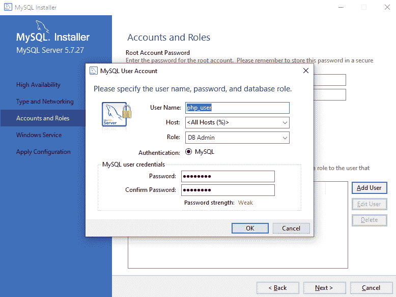

# 前言

## 关于

本节简要介绍了本书的涵盖范围，你开始学习所需的技能，以及完成所有包含的活动和练习所需的硬件和软件要求。

# 关于本书

你已经知道你想要学习 PHP 7，而更智能的学习 PHP 开发的方式是通过实践学习。*《PHP 工作坊》* 专注于提升你的实践技能，以便你可以开发前沿的、高性能的 Web 应用程序。如果你想要与现有应用程序合作，或者甚至使用 Laravel 这样的 PHP 框架开发自己的副项目，它都是理想的。你将从真实示例中学习，这些示例可以带来真实的结果。

在 *《PHP 工作坊》* 中，你将采取引人入胜的逐步方法来理解 PHP 开发。你不必忍受任何不必要的理论。如果你时间紧迫，你可以每天跳入一个练习，或者花一个周末的时间学习第三方库。由你选择。按照你的方式学习，你将建立起并加强关键技能，这种方式会让人感到有成就感。

每一份物理印刷版的 *《PHP 工作坊》* 都解锁了访问互动版权限。视频详细介绍了所有练习和活动，你将始终有一个指导性的解决方案。你还可以通过评估来衡量自己，跟踪进度，并接收内容更新。完成学习后，你甚至可以赚取一个可以在线分享和验证的安全凭证。这是包含在印刷版中的高级学习体验。要兑换，请遵循 PHP 指南开头的说明。

快速直接，*《PHP 工作坊》* 是 PHP 初学者的理想伴侣。你将像软件开发者一样构建和迭代你的代码，在学习过程中不断进步。这个过程意味着你会发现你的新技能会牢固地扎根，并作为最佳实践嵌入其中。为未来的几年打下坚实的基础。

## 关于章节

*第一章*，*介绍 PHP*，介绍了 PHP 语言，使你能够设置你的第一个开发环境并编写你的第一个 PHP 脚本。

*第二章*，*类型和运算符*，介绍了 PHP 编程中使用的不同类型。

*第三章*，*控制语句*，定义了不同分支和循环技术，以及使用不同控制结构和条件与运算符的应用场景。

*第四章*，*函数*，探讨了函数以及内置函数和自定义函数之间的区别，以及探索回调函数。

*第五章*，*面向对象编程*，解释了为了拥有坚实的面向对象编程基础，你需要了解的所有内容。你将学习接口、类、命名空间、类实例化、类字段作用域、方法、魔术方法、抽象、继承、对象组合、自动加载等内容。

*第六章*，*使用 HTTP*，探讨了 HTTP 请求，这对于理解和在实际网络应用程序中使用至关重要。你将熟悉请求类型和 URL 组件，了解万维网上的常见漏洞，并学习如何保护你的应用程序免受利用这些漏洞的攻击。

*第七章*，*数据持久性*，描述了数据库的利用，包括它们的配置和读写操作。

*第八章*，*错误处理*，解释了 PHP 中的错误级别和异常，包括它们何时触发、如何触发，以及——非常重要——当它们发生时如何处理。

*第九章*，*作曲家*，解释了如何使用 Composer 依赖管理工具以及如何将依赖自动加载到 PHP 脚本中。

*第十章*，*网络服务*，定义了通过交换数据在不同平台之间进行通信的方式。

## 习惯用法

文本中的代码单词、数据库表名、文件夹名、文件名、文件扩展名、路径名、虚拟 URL、用户输入和 Twitter 昵称如下所示：

"echo 构造是向屏幕打印的一种方式。"

你在屏幕上看到的单词，例如在菜单或对话框中，也以这种方式出现在文本中："打开 Insomnia 并点击`新建请求`按钮。"

代码块设置如下：

```php
<?php
$language = "PHP";
$version = 7.3;
echo $language;
echo $version;
?>
```

新术语和重要词汇如下所示："欢迎使用**超文本预处理器**（**PHP**）的世界。"

长代码片段被截断，GitHub 上相应代码文件的名称放置在截断代码的顶部。整个代码的永久链接放置在代码片段下方。它应该看起来如下：

```php
Example1.01.php
1 <!DOCTYPE html>
2 <html lang="en">
3 <head>
4     <meta charset="UTF-8">
5     <meta name="viewport" content="width=device-width, initial-scale=1.0">
6     <meta http-equiv="X-UA-Compatible" content="ie=edge">
7    <title>My First PHP Page</title>
8 </head>
https://packt.live/326OLKU
```

## 在开始之前

每次伟大的旅程都是从一小步开始的。我们即将在 PHP 领域的冒险也不例外。在我们能够用数据做些酷的事情之前，我们需要准备好一个高效的环境。在本节中，我们将看到如何做到这一点。

## 在 Ubuntu 上安装 PHP 7.3

本书中的所有练习都是在 Linux Ubuntu 18.10 上使用 PHP 7.3 运行的。由于 PHP 是跨平台的，你可以在 Windows 版本 7+（需要 Visual Studio 2015）和 macOS 上使用它。

Ubuntu 18.04 LTS 默认安装 PHP 7.2，因此为了安装最新的稳定 PHP 版本，你应该从源代码编译或在你的机器上安装预编译的包。从可信来源安装预编译的包通常更受欢迎，因为安装时间比从源代码编译的时间要低得多。在你的终端中运行以下命令（一次一行，需要超级用户权限）：

```php
apt-get update
apt-get install -y software-properties-common
LC_ALL=C.UTF-8 add-apt-repository -y ppa:ondrej/php
apt-get update
apt-get install -y php7.3-common php7.3-curl php7.3-mbstring php7.3-mysql
```

## 在 Mac OS X 上安装 PHP 7.3

可以使用 Liip 的 php-osx 工具轻松安装 PHP 7.3：

```php
curl -s https://php-osx.liip.ch/install.sh | bash -s 7.3
```

或者，如果你更喜欢使用 Homebrew：

```php
brew install php@7.3
```

注意

要安装 Homebrew，只需运行`/usr/bin/ruby -e "$(curl -fsSL https://raw.githubusercontent.com/Homebrew/install/master/install)"`。

## 在 Windows 上安装 PHP 7.3

在 Windows 系统上安装 PHP 7.3 的步骤如下：

1.  从 https://windows.php.net/download/下载最新的 PHP 7（非线程安全版本）ZIP 文件：

    图 0.1：下载 PHP 7

1.  将 ZIP 文件的内容提取到`C:\PHP7`中。

1.  将`C:\PHP7\php.ini-development`文件复制到`C:\PHP7\php.ini`。

1.  在文本编辑器中打开新复制的`C:\PHP7\php.ini`文件，例如 Notepad++、Atom 或 Sublime Text。

1.  将`memory_limit`从`128M`更改为`1G`（以允许 Composer 的内存需求）。

1.  搜索`extension_dir`并取消注释该行（移除前面的分号，使该行看起来像`extension_dir = "ext"`）。

1.  要将`C:\PHP7`添加到 Windows 10 的系统路径环境变量中，请打开控制面板并点击`查看高级系统设置`：

    图 0.2：检查高级系统设置

1.  点击`环境变量...`按钮：

    图 0.3：检查环境变量

1.  在`系统变量`下的`路径`行上点击，然后点击`编辑...`：

    图 0.4：编辑变量

1.  点击`新建`并添加`C:\PHP7`行：

    图 0.5：添加新行

    点击到目前为止所有打开窗口的`确定`并关闭控制面板。

1.  在命令提示符（PowerShell 或另一个终端）中，通过输入`php -v`来测试安装是否成功：


图 0.6：测试安装

## 在 Ubuntu 上安装 MySQL 5.7

要在您的系统上安装 MySQL 5.7，请在您的终端中运行以下命令：

```php
apt-get update
apt-get install -y mysql-server
```

## 以 sudo 使用 root 访问 MySQL

要以 root 用户访问 MySQL，请在您的终端中运行以下命令：

```php
sudo mysql --user=root
```

## 创建测试用户

要创建测试用户，请在 MySQL 终端中运行以下命令：

```php
create user 'php-user'@'%' identified by 'php-pass';
```

## 在测试用户上授予所有权限

要授予测试用户所有权限，请在您的终端中运行以下命令：

```php
grant all on *.* to 'php-user'@'%';
flush privileges;
```

在生产环境中，您会仔细选择应用程序所需的权限，尽可能限制权限的范围。有关 MySQL 服务器上权限的更多信息，请访问 https://dev.mysql.com/doc/refman/5.7/en/privileges-provided.html。

## 在 Ubuntu 上安装 MySQL Workbench

打开软件管理器，搜索 MySQL Workbench，然后点击`安装`按钮。

## 在 Mac OS 上安装 MySQL 5.7

要使用 Homebrew 安装 MySQL 5.7，请在您的终端中运行以下命令：

```php
brew install mysql@5.7
```

使 MySQL 始终作为服务运行：

```php
brew services start mysql@5.7
```

重复上述 Linux 安装中的“以 root 用户访问 MySQL”、“创建测试用户”和“在测试用户上授予所有权限”步骤，以添加测试用户。

## 在 Mac OS 上安装 MySQL Workbench

这里是在 Mac OS 上安装 MySQL Workbench 的步骤：

1.  访问 https://dev.mysql.com/downloads/workbench/。

1.  选择您的操作系统（macOS）并下载 DMG 文件。对于较旧的 Mac OS 版本，请考虑点击右侧框中的 "`寻找最新 GA 版本？`"。

1.  双击下载的文件。您将看到以下图中所示的安装窗口：

    图 0.7 MySQL Workbench macOS 安装窗口

1.  按照说明将 MySQL Workbench 图标拖放到应用程序图标上。MySQL Workbench 现已安装，您可以从应用程序文件夹中启动它。

## 安装 MySQL 5.7（Windows）

按以下步骤在 Windows 上安装 MySQL 5.7：

1.  访问 https://dev.mysql.com/downloads/installer/。

1.  点击以下下载框中的 `寻找以前的 GA 版本？` 链接：

    图 0.8：MySQL 安装程序

1.  选择 Windows 的最新 5.7 版本并点击 `下载` 按钮：

    图 0.9：下载适当的版本

1.  运行下载的文件以安装 MySQL Workbench。

1.  选择 `开发者默认`（包括 MySQL Workbench）并点击 `下一步`：

    图 0.10：选择适当的设置类型

1.  点击 `执行` 以安装依赖项，然后点击 `下一步`。

1.  点击 `执行` 以开始下载并安装所选组件（如果下载或安装失败，请点击 `重试`）：

    图 0.11：安装所选组件

1.  点击 `下一步` 和 `完成`，直到出现 MySQL 配置窗口 `账户和角色` 提示；输入 root 用户密码。

1.  点击 `添加用户` 按钮，输入 `php_user` 作为用户名，`php-pass` 作为密码（与之前创建用户时输入的详细信息相同），然后点击 `确定`：

    图 0.12：输入凭据

    注意

    对于 Windows 操作系统，代码片段中的数据库用户名 `php-user` 在 *第七章*，*数据持久性* 需要替换为 `php_user`。这是因为 MySQL 的 Windows 安装程序不允许用户名中包含连字符。

1.  点击 `下一步` 和 `执行`，直到安装过程完成。

## 安装 Composer

要在 Ubuntu 或 Mac 上安装 Composer，您需要访问 https://getcomposer.org/download/ 并运行给定链接中 `命令行安装` 部分下的四个 PHP 命令。命令中包含一个加密代码，用于安全目的验证下载。例如，在撰写本文时，命令如下（请确保使用为您生成的哈希值，而不是下面的一个）：![图 0.8：MySQL 安装程序

```php
php -r "copy('https://getcomposer.org/installer', 'composer-setup.php');"
php -r "if (hash_file('sha384', 'composer-setup.php') === '48e3236262b34d30969dca3c37281b3b4bbe3221bda826ac6a9a62d6444cdb0dcd061569
8a5cbe587c3f0fe57a54d8f5') { echo 'Installer verified'; } else { echo 'Installer corrupt'; unlink('composer-setup.php'); } echo PHP_EOL;"
php composer-setup.php
php -r "unlink('composer-setup.php');"
```

在 Windows 上，您可以直接从 https://getcomposer.org/Composer-Setup.exe 下载安装程序文件。

## 安装 Insomnia REST 客户端

浏览到 https://insomnia.rest/download/ 并下载适合您操作系统的安装文件。打开安装程序，通过选择默认选项完成安装向导。

如果您更喜欢命令行，可以使用 `sudo snap install insomnia` 命令在 Ubuntu 上安装客户端，或者对于 macOS 使用 `brew cask install insomnia`。

## 安装代码包

从 GitHub 下载代码文件至 https://github.com/PacktWorkshops/The-PHP-Workshop，并将它们放置在一个名为 `C:\Code` 的新文件夹中。请参考这些代码文件以获取完整的代码包。

如果您在安装过程中遇到任何问题或疑问，请通过电子邮件发送给我们 `workshops@packt.com`。
