# 第七章：7. 数据持久性

概述

到本章结束时，你将能够执行与文件系统相关的操作（读取、写入、复制、移动和删除）；逐行读取大文件，一次读取一个 CSV 文件记录；使用 PHP 通过浏览器下载文件；使用 PHP 连接到 MySQL 关系数据库管理系统；使用 PHP 创建数据库和表，并将记录插入到 MySQL 数据库中；使用 PHP 查询、更新和删除 MySQL 数据库中的数据；以及使用 PHP 中的预处理语句来确保 MySQL 查询的安全性。

# 简介

在上一章中，我们看到了如何使用 PHP 超级全局变量处理用户输入，并应用了清理和验证以确保应用程序的安全性。我们还学习了如何将用户的会话保持在服务器上，并构建了一个小型应用程序。在那个应用程序中，我们使用会话来存储数据，这些数据随着每个会话的销毁（或注销）而消失。

在本章中，我们将学习如何使用 PHP 存储和读取持久数据。具体来说，我们将学习如何处理文件 I/O（打开、读取和写入）和磁盘操作（更改当前目录、创建新文件/目录、删除文件或目录等）。当你想使用文件系统来存储重要的应用程序日志、生成各种报告、处理上传的用户图像等时，这非常有用。我们还将学习如何连接到 MySQL 数据库以及如何查询数据、插入新记录以及更新或删除数据库中的数据。当你想以结构化的方式存储数据，以便其他许多应用程序可以轻松访问时，这很有帮助；例如，用户特定的数据，如名字、姓氏、电子邮件地址和密码散列。不仅如此——很可能，你的应用程序将对存储在某个地方以备请求读取的数据进行数据操作。这类数据可能代表业务领域的元素，可能包括产品列表、价格、折扣券、订单、订阅等。我们还将在本章中处理安全问题。因此，我们将学习如何保护我们的数据库免受潜在的恶意用户输入的侵害。

# 文件 I/O 处理

文件系统操作在编程中非常重要。我们可以列举 PHP 中的会话数据存储；用户上传的文件、生成的报告文件、缓存数据、日志等，它们都使用了文件系统。当然，还有许多其他持久化存储的替代方案，但了解如何在一种语言中操作文件系统尤其重要，因为它无处不在且可以立即使用。

在处理文件系统时，有时您可能想要读取或写入存储在相对于脚本文件位置的已知位置的文件。例如，对于在 `/app/demo/` 目录中创建的脚本，它想要从相对于其位置的 `source/` 目录（换句话说，`/app/demo/source/`）读取文件，了解脚本位置会更好。

这与当前工作目录不同，因为您也可能从其他位置运行脚本。例如，如果当前工作目录是 `/root`，您可以通过提供以下之一来运行脚本：相对路径，`php ../app/demo/the-script.php`，或绝对路径，`php /app/demo/the-script.php`。在这种情况下，当前工作目录是 `/root`，而脚本目录是 `/app/demo`。

这引出了下一个要点。PHP 提供了一些“魔法常量”；它们的值根据它们的使用位置在脚本之间变化。魔法常量的列表如下：

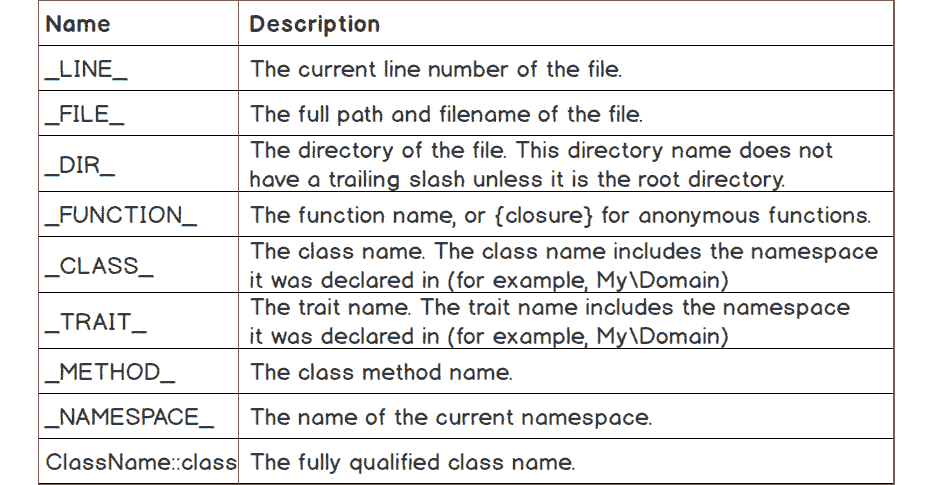


图 7.1：魔法常量和它们的描述

在我们的情况下，我们希望使用脚本中的 `__DIR__` 常量。脚本需要查找的目录将是 `$lookupDir = __DIR__ . '/source';`。

## 使用 PHP 读取文件

在 PHP 中处理文件是做起来最容易的事情之一。PHP 有几个函数用于处理文件操作，包括创建、读取和更新/编辑。使用 PHP 文件系统函数不需要额外的安装。

## 简单文件读取

用于读取文件的最简单函数之一是 `file_get_contents()`。这个函数可以用来获取文件的所有内容并将其放入一个变量中，例如。其语法如下：

```php
file_get_contents (string $filename [, bool $use_include_path = FALSE [, resource $context [, int $offset = 0 [, int $maxlen ]]]])
```

+   `$filename`: 第一个参数是必需的，应该是一个有效的文件路径，用于读取。

+   `use_include_path`: 这是一个可选参数，告诉 `file_get_contents` 在 `include_path` 目录列表中查找 `$Filename`。

+   `$context`: 这是一个可选参数，是一个使用 `stream_context_create()` 创建的有效上下文资源。

+   `$offset`: 这是一个可选参数。偏移计数从原始流开始。

+   `$maxlen`: 这是一个可选参数，表示要读取的数据的最大长度。默认情况下，它读取到文件末尾。

`file_get_contents()` 函数在给出任何输出之前将文件内容读入内存，直到整个文件被读取。这是一个缺点，使得这个函数在不知道输入文件大小时不适用。在处理大文件的情况下，比如说超过 1 GB，PHP 进程会非常快地填满分配的 RAM 内存，这会导致脚本崩溃。因此，这个函数仅在预期文件大小小于 PHP 中的 `memory_limit` 配置条目时适用。

## 练习 7.1：简单文件读取（一次性读取）

假设你需要开发一个脚本，该脚本能够从 CSV 格式的文件中导入用户列表到当前应用程序中。

首先，让我们准备环境：

1.  在当前工作目录中创建一个 `sample` 目录。

1.  从代码仓库下载名为 `users_list.csv` 的 CSV 文件，并将其放入 `sample` 目录中。

1.  在这个练习中，我们将通过提供 CSV 文件的路径来调用 `file_get_contents()`：

    ```php
    <?php echo file_get_contents(__DIR__ . '/sample/users_list.csv');
    ```

    我们正在调用 `file_get_contents()` 函数，指定文件路径，我们接收的是完整的文件内容。对于文件路径，我们使用 `__DIR__` 魔术常量，它在编译时会被替换为文件目录路径。

    将前面的 PHP 脚本保存为 `file_get_contents.php` 文件，存放在 `sample` 目录的父目录中。

1.  在你的终端中运行 `php file_get_contents.php`：

![图 7.2：打印文件内容]


![图 7.2：打印文件内容]

你将得到如上所示的 CSV 文件输出。

## 使用 fread 函数读取文件

如前所述，`file_get_contents()` 函数不适合用于处理大文件，因为它首先将整个文件内容读入内存，然后再进行任何输出，这会使脚本在资源使用和性能方面都非常低效。

在接下来的练习中，我们将探索一些函数，这些函数将允许我们解析大文件，同时确保系统内存安全。这意味着我们将使用一种技术，允许我们一次读取文件内容的一部分，这可以通过使用一组 PHP 内置函数和一个数据流 PHP 资源来实现。在 PHP 中，资源是对外部资源的引用；在我们的例子中，它将是对数据流资源的引用（例如，系统文件或 URL）。

`fopen()` 是 PHP 的内置函数之一，用于在 PHP 中创建流资源。为了在处理文件（或任何其他数据流）方面获得更大的灵活性，我们将使用 `fopen()` 函数。`fopen()` 函数接受两个必需的参数，`$filename` 是第一个参数，访问模式是第二个参数。访问模式描述了流资源的访问类型（读取、写入、读写）并在创建流时解析为一系列指令。它可以有以下值之一：

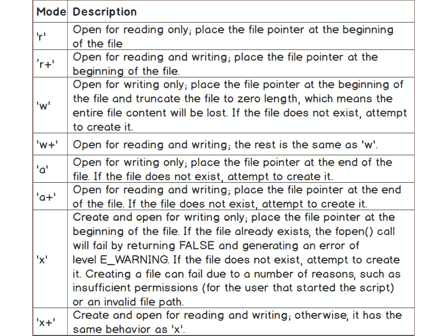

图 7.3：不同的访问模式及其描述

你会在前面的表中注意到“文件指针”的概念。你可以将这个简单而强大的概念想象成文本文件中的光标。例如，如果我们处理的是包含 `Learning PHP fundamentals` 内容的文件流资源，文件指针在位置九意味着它位于单词 PHP 之前。从该位置读取到文件末尾将产生 `PHP fundamentals` 输出。

`fopen()` 函数返回文件指针资源或 `false`，如果操作失败。

要从数据流中读取，我们将使用 `fread()` 函数。此函数需要两个参数，第一个是资源变量，第二个是要读取的字节数。如果失败，它返回读取的字符串或 `false`。

可以用于从流资源中读取的其他函数有 `fgets()` 和 `fgetcsv()`，仅举两例。`fgets()` 从文件指针返回一行；它需要流资源作为第一个参数，并接受可选的读取长度（字节）作为第二个参数。`fgetcsv()` 与 `fgets()` 类似——它返回包含读取 CSV 字段的行作为数组，但此行是解析为 CSV 的数据行（这意味着可能读取多行字符串数据，因为一个 CSV 字段可以包含多行数据）。`fgetcsv()` 函数接受多个参数，但通常只需要所需的流资源（第一个参数）就可以很好地解析并返回 CSV 行数据。

在从流中读取时，我们可能想知道何时遇到文件末尾。我们可以使用 `feof()` 函数来实现这一点，该函数将检查文件指针是否位于文件末尾（EOF）。如果文件指针位于 EOF 或发生错误，该函数返回 `true`。否则返回 `false`。

注意

`feof()` 对于无效的流也返回 `false`，因此建议在调用 `feof()` 之前测试您的流资源。

## 练习 7.2：使用 fread() 函数读取文件

假设你被要求优化用户的导入脚本，以便能够处理十几个吉字节的大数据文件：

1.  创建一个 `fread.php` 文件并插入以下内容。

1.  首先，我们定义文件路径，然后在调用 `fopen()` 获取文件指针资源时使用它。我们检查 `fopen()` 是否返回了预期的资源（不是 `false`）。如果失败，脚本将退出：

    ```php
    <?php
    $filePath = __DIR__ . '/sample/users_list.csv';
    $fileResource = fopen($filePath, 'r');
    if ($fileResource === false) {
        exit(sprintf('Cannot read [%s] file.', $filePath));
    }
    ```

1.  现在，我们将使用 `fread()` 函数，该函数将分块读取文件，允许我们依次操作小数据块，直到文件完全读取。接下来，我们定义要读取的长度，以字节为单位。

    ```php
    $readLength = 64;
    $iterations = 0;
    ```

1.  使用 `fread()` 从 `$fileResource` 资源中读取，并在 `while` 循环中使用 `feof()` 检查 EOF：

    ```php
    while (!feof($fileResource)) {
        $iterations++;
        $chunk = fread($fileResource, $readLength);
        echo $chunk;
    }
    ```

1.  最后，我们关闭文件指针资源，因为我们不再需要它，并打印迭代次数：

    ```php
    fclose($fileResource);
    echo sprintf("\n%d iteration(s)", $iterations);
    ```

1.  使用 `php fread.php` 命令在您的终端中运行文件。输出将如下所示：

![图 7.4：使用 fread() 文件读取的文件输出]


图 7.4：使用 fread() 文件读取的文件输出

由于文件包含 65 个字符，并且块大小设置为 64，因此文件被读取了两次。这意味着在第一次迭代中，`fread()`用 64 字节的数据填充内存，然后返回并释放占用的内存；在第二次迭代中，`fread()`在返回之前用 1 字节（剩余的文件内容）填充内存并释放内存。这种方法的优势在于，我们可以每次读取迭代时使用小块内容，同时使用少量的内存资源，而不是将整个文件加载到内存中，然后逐行迭代和处理内容。

## 文件读取基准测试

在前面的示例中，我们看到了两种读取文件方法的区别，但在这里，你将评估指标以基准测试每种文件读取方法。

我们将使用相同的脚本，但将添加一些测量值。

我们将使用`memory_get_peak_usage()`函数来检索某个时间点的峰值内存使用量，正如其名所示。此函数接受一个可选参数，默认设置为`false`，除非指定值；当你想要报告分配的内存时（我们将在以下练习中这样做），而不是实际的内存使用量时，你应该将其设置为`true`。

在以下练习中，我们将使用 PHP 隐含存在的`DIRECTORY_SEPARATOR`常量，它如下设置目录分隔符：

+   Windows：反斜杠字符"\\"

+   非 Windows：斜杠字符"/"

## 练习 7.3：文件读取基准测试

在这个练习中，我们将评估指标以基准测试每种文件读取方法：

1.  首先，我们需要一个相当大的文件，我们将使用`dd`命令生成它。

    注意

    `dd`是 Unix 和 Unix-like 操作系统的命令行实用程序，存在于以下任何一种发行版中。

1.  运行以下命令以在`sample/test-256-mb.txt`中生成一个充满零的文件，大小为 256 MB：

    ```php
    dd if=/dev/zero of=sample/test-256-mb.txt count=1024 bs=262144
    ```

    这个文件很可能会终止使用`file_get_contents()`读取它的脚本，因为大多数 PHP 安装默认情况下不允许每个进程超过 128 MB 的内存限制。这个限制默认存储在`php.ini`配置文件中的`memory_limit`参数下，如前所述。因此，我们将使用`dd`创建另一个文件，大小为 10 MB，命令如下：`dd if=/dev/zero of=sample/test-10-mb.txt count=1024 bs=10240`。

1.  使用以下内容创建`file_get_contents-memory.php`：

    ```php
    <?php file_get_contents(__DIR__ . DIRECTORY_SEPARATOR . $argv[1]);
    echo sprintf("--\nmemory %.2fMB\n--\n", memory_get_peak_usage(true)   / 1024 / 1024);
    ```

    在这里，我们使用第一个命令行参数（`$argv[1]`），它将是相对于脚本路径的文件路径。我们还将添加内存峰值指标，使用`memory_get_peak_usage()`函数。

1.  运行以下命令以检查资源使用情况：

    ```php
     time php file_get_contents-memory.php sample/test-10-mb.txt 
    ```

    你应该基本上得到以下输出：

    ```php
    --
    memory 12.01MB
    --
    real    0m 0.03s
    user    0m 0.02s
    sys     0m 0.01s
    ```

    注意

    我们在这里使用了`time` Linux 命令，它将运行命令并打印资源使用情况。

    在这个示例输出中，12.01 MB 的内存值是由`memory_get_peak_usage()`函数报告的，它显示这是 PHP 脚本读取 10 MB 文件所需的 RAM 内存量。

1.  现在，让我们运行相同的脚本，但针对更大的文件：

    ```php
    time php file_get_contents-memory.php sample/test-256-mb.txt. 
    ```

    在输出中，我们将看到如下错误信息：

    ```php
    PHP Fatal error: Allowed memory size of 134217728 bytes exhausted (tried to allocate 268443680 bytes) in /app/file_get_contents-memory.php on line 1
    ```

    如预期的那样，尝试将 256 MB 的文件读入内存失败，因为每个进程的 128 MB 限制被超过了。

1.  现在，让我们检查另一种方法，使用`fread()`一次读取文件中的一块数据。创建一个名为`fread-memory.php`的文件，并插入以下内容。我们根据用户的第一个输入参数存储`$filePath`变量，并为该文件路径创建资源，存储在`$fileResource`变量下：

    ```php
    <?php
    $filePath = __DIR__ . DIRECTORY_SEPARATOR . $argv[1];
    $fileResource = fopen($filePath, 'r');
    ```

1.  如果资源无效，脚本将被终止：

    ```php
    if ($fileResource === false) {
        exit(sprintf('Cannot read [%s] file.', $filePath));
    }
    ```

1.  我们将第二个输入参数存储在`$readLength`变量中，它将采用第二个参数的值，如果第二个参数不存在，则回退到`4096`。这是`fread()`函数将从`$fileResource`读取的字节长度。我们还以零为起始值初始化`$iterations`变量：

    ```php
    $readLength = $argv[2] ?? 4096;
    $iterations = 0;
    ```

1.  我们使用`while`循环读取整个文件，就像之前的练习一样。这里的区别在于`fread()`函数的输出没有被使用。对于每次迭代，我们增加`$iterations`变量：

    ```php
    while (!feof($fileResource)) {
        $iterations++;
        fread($fileResource, $readLength);
    }
    ```

1.  最后，我们关闭流并打印执行迭代次数和读取文件所需的内存使用量：

    ```php
    fclose($fileResource);
    echo sprintf("--\n%d iteration(s): memory %.2fMB\n--\n", $iterations,   memory_get_peak_usage(true) / 1024 / 1024);
    ```

    从之前的`file_get_contents-memory.php`脚本中改变的是，我们正在一次读取文件中的一块数据，使用`$readLength`变量。

1.  现在，让我们运行一些测试，读取 10 MB 的文件：

    ```php
     time php fread-memory.php sample/test-10-mb.txt 
    ```

    输出如下：

    ```php
    --
    2561 iteration(s): memory 2.00MB
    --
    real    0m 0.05s
    user    0m 0.02s
    sys     0m 0.02s
    ```

    如我们所见，为了读取整个 10 MB 文件，它进行了 2,561 次 4 KB 的读取迭代（第二个`script`参数缺失，默认将 4,096 字节设置为`$readLength`变量）。脚本的总时长为 0.05 秒，而使用`file_get_contents()`时为 0.03 秒。需要注意的是主要区别是内存使用量——2 MB，这是 PHP 脚本每个进程分配的最小内存量，而使用`file_get_contents()`函数时为 12.01 MB。

1.  如果读取 1 MB 的数据块而不是默认的 4 KB 会怎样？让我们使用 1,048,576 字节（相当于 1 MB）运行以下命令：

    ```php
    time php fread-memory.php sample/test-10-mb.txt 1048576
    ```

    输出现在如下：

    ```php
    --
    11 iteration(s): memory 4.00MB
    --
    real    0m 0.03s
    user    0m 0.02s
    sys     0m 0.01s
    ```

    现在，读取整个 10 MB 文件只用了 11 次迭代，峰值 RAM 内存为 4 MB。这次，脚本耗时 0.03 秒，与使用`file_get_contents()`函数的情况相同。

1.  现在，让我们读取大文件，该文件无法使用`file_get_contents()`读取。运行以下命令：

    ```php
    time php fread-memory.php sample/test-256-mb.txt 
    ```

    输出如下：

    ```php
    --
    65537 iteration(s): memory 2.00MB
    --
    real    0m 0.30s
    user    0m 0.16s
    sys     0m 0.13s
    ```

    在这种情况下，读取长度为 4 KB，完整文件读取需要 65,537 次迭代，使用峰值 2 MB 的内存。脚本读取整个文件耗时 0.3 秒，这并不坏，但可以通过增加读取长度到一个更大的值来改进；这正是我们下一步要做的。

1.  现在，运行相同的命令，指定 1 MB 的块大小：

    ```php
    time php fread-memory.php sample/test-256-mb.txt 1048576 
    ```

    现在的输出如下：

    ```php
    --
    257 iteration(s): memory 4.00MB
    --
    real    0m 0.08s
    user    0m 0.02s
    sys     0m 0.05s
    ```

如预期的那样，读取整个 256 MB 文件所需的时间减少了（从 0.3 秒减少到 0.08 秒），因为读取长度更高（1 MB 与 4 KB 相比，导致峰值内存使用量为 4 MB 与 2 MB），并且所需的迭代次数减少到 257 次。

现在，看看这些数据，我们可以提出自己的想法，了解幕后发生的事情。在`file_get_contents()`的情况下，读取 10 MB 文件时使用了 12.01 MB 的峰值内存；这是因为整个文件都是使用这种方法加载到内存中的。256 MB 的文件导致脚本关闭，因为达到了 128 MB 的限制。

另一方面，似乎`fread`方法在持续时间和内存使用方面都做得很好。以 4 KB 的数据块读取 10 MB 文件，脚本使用 2 MB 的内存，而`file_get_contents`的情况下为 12 MB，而读取时间显著更长（`fread()`为 0.05 秒，而`file_get_contents()`为 0.03 秒）。尽管如此，以 1 MB 的数据块读取相同的文件，我们在性能方面得到了类似的结果，但我们仍然比`file_get_contents`情况下使用的内存少得多（4 MB 与 12 MB 相比）。

现在，如果我们稍微增加一下规模，会发生什么呢？使用`file_get_contents()`读取 256 MB 文件因内存耗尽而无法完成。但看看第二种方法——不仅整个文件被读取，而且在这个过程中只使用了 2 MB 的内存！读取耗时大约 0.3 秒，这并不令人满意，但让我们看看当读取长度增加，因此迭代次数减少时会发生什么。现在我们得到了更好的结果——读取时间为 0.08 秒，内存峰值 4 MB。

正如你所见，方便的方法——使用`file_get_contents()`——更适合处理小文件或非常小的文件，而处理大文件则需要你使用不同的方法，例如`fread()`，它读取数据块；`fgets()`，它从文件指针一次读取整行；以及`fgetcsv()`，它与`fgets()`类似，但除此之外，它还将 CSV 字符串行解析成包含数据的数组。

## 逐行读取文件

如前所述，还有更多方法可以从大文件中进行优化读取。在接下来的练习中，你将学习如何使用 PHP 逐行读取文件。这特别有助于当一条记录对应一行时，例如在访问或错误日志中，这样读取文件可以一次处理一个数据记录。

## 练习 7.4：逐行读取文件

在这个练习中，我们将打开一个文件并逐行读取它：

1.  创建一个名为 `fgets.php` 的文件，并添加以下内容。和前面的例子一样，我们定义文件路径并获取文件指针。如果失败，脚本将带错误信息退出：

    ```php
    <?php
    $filePath = __DIR__ . '/sample/users_list.csv';
    $fileResource = fopen($filePath, 'r');
    if ($fileResource === false) {
        exit(sprintf('Cannot read [%s] file.', $filePath));
    }
    ```

1.  接下来，我们将 `$lineNumber` 变量初始化为值 `0`。然后，就像在 `fread()` 的情况下一样，我们执行迭代以分块读取数据。这次，使用 `fgets()`，我们将一次获取一行。然后，该行被编号并打印到输出。最后，我们关闭文件资源指针，因为我们不再需要它：

    ```php
    $lineNumber = 0;
    while (!feof($fileResource)) {
        $lineNumber++;
        $line = fgets($fileResource);
        echo sprintf("Line %d: %s", $lineNumber, $line);
    }
    fclose($fileResource);
    echo PHP_EOL;
    ```

1.  使用命令行工具 `php fgets.php` 运行前面的脚本。输出将如下所示：

    ```php
    Line 1: John,Smith,2019-03-31T10:20:30Z
    Line 2: Alice,Smith,2019-02-28T12:13:14Z
    Line 3:
    ```

    如你所注意到的，我们有一个没有内容的行——这实际上是一个 CSV 文件中的空行。在尝试处理数据时，请注意处理文件行；在继续处理之前，至少检查非空行。

## 读取 CSV 文件

之前的示例展示了逐行读取文件的一个便捷方法。在我们的案例中，这是一个 CSV 文件，一个非常简单的文件，以逗号作为分隔符，就这么多。但是，如果你必须处理一个复杂的 CSV 文档呢？幸运的是，PHP 提供了一个内置函数来处理这种情况，称为 `fgetcsv()`。使用它，我们可以一次获取一条记录；没错，一条记录，而不是一行，因为记录可以分布在多行中，包含封装的数据（例如，在引号之间包装的多行数据）。

## 练习 7.5：读取 CSV 文件

在这个练习中，我们将从 CSV 文件中读取数据：

1.  创建一个名为 `fgetcsv.php` 的文件，并添加以下内容。和之前一样，我们声明文件路径并获取文件指针。如果发生错误，脚本将带错误信息退出：

    ```php
    <?php
    $filePath = __DIR__ . '/sample/users_list_enclosed.csv';
    $fileResource = fopen($filePath, 'r');
    if ($fileResource === false) {
        exit(sprintf('Cannot read [%s] file.', $filePath));
    }
    ```

1.  然后，我们将 `$recordNumber` 变量初始化为值 `0`；我们将需要它来为每一行打印输出。然后，我们使用 `fgetcsv()` 函数在 `while` 循环中逐条读取 CSV 记录，打印记录编号及其内容：

    ```php
    $recordNumber = 0;
    while (!feof($fileResource)) {
        $recordNumber++;
        $line = fgetcsv($fileResource);
        echo sprintf("Line %d: %s", $recordNumber, print_r($line, true));
    }
    fclose($fileResource);
    echo PHP_EOL;
    ```

1.  在 `sample/` 目录下创建一个名为 `users_list_enclosed.csv` 的文件，内容如下：

    ```php
    John,Smith,2019-03-31T10:20:30Z,"4452 Norma Lane
    Alexandria
    71302 Louisiana"
    Alice,Smith,2019-02-28T12:13:14Z,"4452 Norma Lane
    Alexandria
    71302 Louisiana"
    ```

1.  使用 `php fgetcsv.php` 运行脚本，输出将如下所示：

![图 7.5：打印数组

![img/C14196_07_05.jpg]

图 7.5：打印数组

如你所注意到的，`fgetcsv()` 函数做得非常好，为我们正确地解析了 CSV 条目。无论 CSV 内容是否有自定义分隔符、封装符或转义字符，所有这些参数都可以作为函数参数传递给 `fgetcsv()`，以便解析器理解格式并执行适当的解析。

## 使用 PHP 下载文件

我们看到了如何使用各种方法让脚本读取文件，以便我们可以对内容进行操作。但还有下载的情况，当我们需要脚本读取文件并将其作为对 HTTP 请求的响应发送给用户时，我们不希望 PHP 进程因这样做而超载内存，类似于分块读取并发送用户小部分内容。幸运的是，有一个函数可以做到这一点，它被称为 `readfile()`。这个函数读取文件并将其直接写入输出缓冲区。`readfile()` 函数只需要读取的文件路径。其他可选参数是一个布尔值，它告诉函数在 PHP 的 `include_path` 中搜索文件，以及一个作为第三个参数的上下文流资源。

上下文流是一组针对特定包装器（构建其他代码的代码片段）的选项，它修改或增强流的行为。例如，当我们想使用 FTP 读取远程文件时，我们将文件路径作为 `readfile()` 函数的第一个参数传递，并将有效的 FTP 上下文流变量作为第三个参数。在接下来的练习中，我们将不会使用上下文流。

## 练习 7.6：下载文件

在这个练习中，我们将使用 PHP 下载一个文件并将其保存到指定的位置：

1.  创建一个名为 `download.php` 的文件，并插入以下内容。首先，我们定义现有文件路径，然后继续设置头部信息，在这里我们使用 `filesize()` 函数来返回正在下载的文件字节数，以及 `basename()` 函数，它返回路径的最后一个组成部分；换句话说，它将裁剪目录结构，只保留文件名。最后，我们调用 `readfile()` 函数，以便 PHP 可以将文件发送回服务器和客户端，作为对 HTTP 请求的响应：

    ```php
    <?php
    $filePath = 'sample/users_list.csv';
    header('Content-Type: text/csv');
    header('Content-Length: ' . filesize($filePath));
    header(sprintf('Content-Disposition: attachment; filename="%s"', basename($filePath)));
    readfile($filePath);
    ```

    确保您已在本目录（在我的例子中是 `/app`）中启动了内置服务器，并在终端中运行 `php -S 127.0.0.1`，并且文件确实存在。

1.  然后，访问 `http://127.0.0.1:8080/download.php` 上的脚本。您应该会看到一个弹出框询问保存 CSV 文件的位置，或者根据您的浏览器配置，它将自动保存到设置的位置：

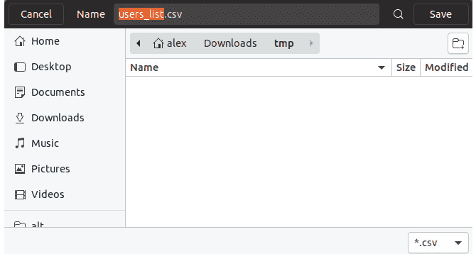

图 7.6：下载 CSV 文件

注意

应该检查文件是否在磁盘上存在，并相应地处理每种情况。当文件缺失时，`readfile()` 将不输出任何内容，浏览器可能会接收到 PHP 脚本的输出（在我们的例子中是 `download.php` 的输出）。

## 使用 PHP 写入文件

使用 PHP 写入文件是可能的，可以使用多种方法，其中大多数涉及 `fwrite()` 和 `file_put_contents()` 内置函数。

`fwrite()` 函数接受两个必需的参数，第一个是文件指针，第二个是要写入文件的字符串。函数返回写入的字节数或失败时的布尔 `false`。

`file_put_contents()` 等同于调用 `fopen()`、`fwrite()` 和 `fclose()` 序列。

注意

当在单个 PHP 进程中多次写入文件时，出于性能考虑，建议使用 `fwrite()` 方法，因为流资源被重用，并且避免了每次写入时都发生的文件打开和关闭操作（`fopen()` 和 `fclose()`）。使用 `fwrite()` 而不是 `file_put_contents()` 的一个很好的例子是文件日志记录器，在 PHP 进程的生命周期内可能会多次写入同一个文件。

第一个必需的参数是文件名，第二个是要写入文件的数据。数据可以是字符串、资源流或字符串的单维数组，行将按顺序写入。第三个参数是可选的，接受写入操作的标志。这可以是以下值的任意组合：

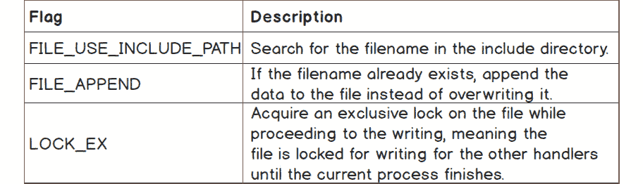

图 7.7：file_put_contents() 函数的不同标志及其描述

当使用 `fwrite` 方法时，我们可能希望使用相同的数据流资源进行读取；例如，在写入后移动文件指针到文件开头，或读取数据的最后 N 个字节。在这种情况下，我们将使用 `fseek()` 函数。此函数将文件指针（记得之前的光标类比？）设置到特定位置。函数签名如下：

```php
fseek(resource $handle, int $offset [, int $whence = SEEK_SET ]) : int
```

新位置，以字节为单位，是通过将偏移量添加到 `$whence` 指定的位置获得的。

`$whence` 的值可以是：

+   `SEEK_SET` – 将文件指针的位置设置为 `offset` 字节。如果没有指定，这是默认选项。

+   `SEEK_CUR` – 将文件指针的位置设置为当前位置加上 `offset`。

+   `SEEK_END` – 将文件指针的位置设置为 EOF 加上 `offset`。

## 练习 7.7：向文件写入

在下面的练习中，我们将使用前面描述的 `fwrite()` 和 `file_put_contents()` 函数在文件中执行写入操作：

1.  创建一个名为 `write.php` 的文件，并插入以下内容：

    ```php
    <?php
    $fileFwrite = 'sample/write-with-fwrite.txt';
    $fp = fopen($fileFwrite, 'w+');
    $written = fwrite($fp, 'File written with fwrite().' . PHP_EOL);
    ```

    首先，我们定义要写入的文件路径，然后使用 `fopen()` 函数打开文件指针。

    注意

    在尝试打开或向文件中写入内容之前，务必确保已创建目录结构。按照我们的示例，你应该确保当前工作目录中存在 `sample/` 目录。

1.  接下来，我们尝试使用 `fwrite()` 函数向文件写入，并将输出存储在 `$written` 变量中：

    ```php
    if (false === $written) {
        echo 'Error writing with fwrite.' . PHP_EOL;
    } else {
        echo sprintf("> Successfully written %d bytes to [%s] with fwrite():", $written, $fileFwrite) . PHP_EOL;
        fseek($fp, 0);
        echo fread($fp, filesize($fileFwrite)) . PHP_EOL;
    }
    ```

    如果写入失败（`$written` 是布尔值 `false`），则我们打印错误消息并继续脚本。否则，我们打印成功消息，指示写入的字节数。之后，为了从文件中读取，我们使用 `fseek()` 函数将指针移动到文件开头，位置为零。然后，我们只打印文件内容以测试写入的数据。

1.  要测试第二种方法，我们在 `sample/` 目录内定义 `write-with-fpc.txt` 文件，然后尝试使用 `file_put_contents()` 函数写入文件，并将输出存储在相同的 `$written` 变量中：

    ```php
    $fileFpc = 'sample/write-with-fpc.txt';
    $written = file_put_contents($fileFpc, 'File written with file_put_contents().' . PHP_EOL);
    ```

1.  与前一个例子一样，如果我们未能写入文件，则打印错误消息并继续脚本。在写入成功的情况下，我们打印消息，指示写入文件中的字节数，然后是实际文件内容：

    ```php
    if (false === $written) {
        echo 'Error writing with fwrite.' . PHP_EOL;
    } else {
        echo sprintf("> Successfully written %d bytes to [%s] with file_put_contents():", $written, $fileFwrite) . PHP_EOL;
        echo file_get_contents($fileFpc) . PHP_EOL;
    }
    ```

    注意

    整个脚本可以在 [`packt.live/2MCkeOJ`](https://packt.live/2MCkeOJ) 上找到。

1.  使用 `php write.php` 从命令行运行脚本。输出应该如下所示：

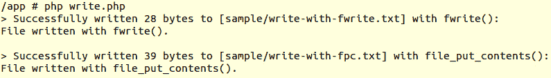

图 7.8：使用不同方法写入文件

在这个练习中，我们使用两种不同的方法——`file_put_contents()` 和 `fwrite()`——在两个不同的文件中写入字符串序列。

恭喜！你刚刚成功使用 PHP 写入了文件。

## 练习 7.8：在文件中追加内容

我们已经看到如何在文件中写入新内容，但通常，你只是想向现有文件中添加内容——比如某种日志，例如。在这个练习中，你将学习如何使用 PHP 向文件追加内容：

1.  创建一个名为 `write-append.php` 的文件，并使用前一个练习中的代码，进行两项小的修改。首先，我们想要更改 `fopen()` 模式，从 `w+` 改为 `a+`（从读写改为写入追加和读取）：

    ```php
    $fp = fopen($fileFwrite, 'a+');
    ```

1.  将 `file_put_contents()` 函数的第三个参数添加为 `FILE_APPEND` 常量：

    ```php
    $written = file_put_contents($fileFpc, 'File written with file_put_contents().' . PHP_EOL, FILE_APPEND);
    ```

1.  使用 `php write-append.php` 从命令行界面运行脚本，你将得到以下结果：

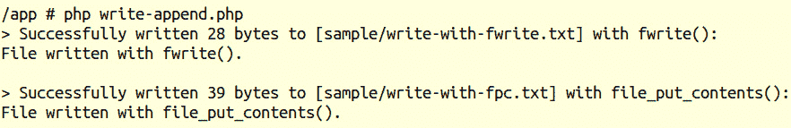

图 7.9：脚本的结果

重复运行脚本会打印相同的成功消息，并且由于 `append` 指令，每次运行后每个文件中的句子数量都会增加。

在文件中追加内容在日志记录和生成文件内容以执行进一步下载等用例中非常有用。

## 其他文件系统函数

当涉及到处理文件系统时，PHP 提供了丰富的支持。所有这些函数都可以在 [`packt.live/2MAsLmw`](https://packt.live/2MAsLmw) 上探索。此外，我们还将介绍 PHP 中一些最广泛使用的文件系统函数。

## 使用 PHP 删除文件

`unlink()`是删除文件的函数。它需要一个文件路径作为第一个参数，并接受一个可选的上下文流。如果文件成功删除，则返回`TRUE`，否则返回`FALSE`。

在删除文件之前，最好先检查文件路径是否指向一个实际的文件，为此我们可以使用`is_file()`函数。此函数只需要文件路径作为第一个参数。如果找到文件并且是常规文件，则返回`TRUE`，否则返回`FALSE`。

## 练习 7.9：使用 PHP 删除文件

当在 PHP 中处理文件内容时，你很可能想要清理一些旧文件。在这个练习中，我们将编写使用 PHP 删除文件的代码：

1.  在`sample/`目录中创建一个名为`to-delete.txt`的空文件。这是我们用 PHP 要删除的文件。

1.  创建一个名为`delete.php`的文件，并插入以下代码：

    ```php
    <?php
    $filepath = 'sample/to-delete.txt';
    if (is_file($filepath)) {
        if (unlink($filepath)) {
            echo sprintf('The [%s] file was deleted.', $filepath) . PHP_EOL;
        } else {
            echo sprintf('The [%s] file cannot be deleted.', $filepath) .           PHP_EOL;
        }
    } else {
        sprintf('The [%s] file does not exist.', $filepath) . PHP_EOL;
    }
    ```

    在这个脚本中，我们使用`is_file()`函数检查文件是否存在并且是一个常规文件。对于常规文件，接下来我们测试文件删除；即负责此操作的`unlink()`函数的输出，然后根据输出打印适当的消息。如果文件不存在，将打印一个通知此情况的提示信息。

1.  在命令行界面中运行脚本。使用`php delete.php`，你会注意到以下输出：

    ```php
    The [sample/to-delete.txt] file was deleted.
    ```

    再次运行脚本将打印以下内容：

    ```php
    The [sample/to-delete.txt] file does not exist.
    ```

    这意味着`delete`操作确实已成功执行。

在这个练习中，当第一次运行脚本时，所有条件都满足以运行文件删除，并且文件确实被删除了。当第二次运行脚本时，脚本无法找到指定路径的文件，因此脚本在退出之前立即返回`文件不存在`的消息。

## 使用 PHP 移动文件

有时，你可能需要将文件移动到新的位置，例如，移动到存档中。这可能适用于数据库数据转储或日志文件等情况。PHP 提供了一个用于移动功能的函数，称为`rename()`，它需要一个实际的文件路径作为第一个参数，以及目标文件路径作为第二个参数。此函数在成功时返回`TRUE`，在失败时返回`FALSE`，并且可以用于文件和目录。

有时，目标目录可能尚未存在，在这些情况下，应该由脚本创建。有一个用于创建目录的函数，称为`mkdir()`，它接受以下参数：要创建的目录路径、模式（默认为`0777`，意味着任何用户都有完全权限）、递归创建目录指令和上下文资源。

## 练习 7.10：创建目录并将文件移动到存档

在这个练习中，你将使用 PHP 将文件移动到本地服务器。假设你被分配了一个创建脚本的任务，该脚本将每天将生成的日志文件移动到“存档位置”：

1.  创建一个名为`to-move.txt`的空文件。这是我们使用 PHP 移动的文件，将其视为生成的日志文件。

1.  创建一个名为`move.php`的文件，并插入以下内容。首先，我们定义要移动的文件路径和文件应移动到的目标目录。然后，我们检查文件路径是否存在并且是一个常规文件，如果失败，脚本将打印错误消息并停止执行：

    ```php
    <?php
    $filePath = 'sample/to-move.txt';
    $targetDirectory = 'sample/archive/2019';
    if (!is_file($filePath)) {
        echo sprintf('The [%s] file does not exist.', $filePath) . PHP_EOL;
        return;
    }
    ```

1.  然后，我们检查目标目录是否存在并且是一个目录，如果没有这样的目录，那么我们将尝试创建一个。关于此的消息将被打印出来，让你知道目录正在被创建。然后，使用`mkdir()`函数以递归方式创建目标目录（将第三个参数设置为`true`将指示脚本在缺少的情况下创建任何父目录）。如果操作失败，则打印错误消息并停止脚本执行。否则，将打印成功的消息“完成”：

    ```php
    if (!is_dir($targetDirectory)) {
        echo sprintf('The target directory [%s] does not exist. Will create...       ', $targetDirectory);
        if (!mkdir($targetDirectory, 0777, true)) {
            echo sprintf('The target directory [%s] cannot be created.',           $targetDirectory) . PHP_EOL;
            return;
        }
        echo 'Done.' . PHP_EOL;
    }
    ```

1.  接下来，我们将定义目标文件路径，它将包括目标目录和文件基本名称。然后，使用`rename()`函数执行移动过程。对于成功或失败的操作都会打印一条消息：

    ```php
    $targetFilePath = $targetDirectory . DIRECTORY_SEPARATOR .   basename($filePath);
    if (rename($filePath, $targetFilePath)) {
        echo sprintf('The [%s] file was moved in [%s].', basename($filePath),       $targetDirectory) . PHP_EOL;
    } else {
        echo sprintf('The [%s] file cannot be moved in [%s].',       basename($filePath), $targetDirectory) . PHP_EOL;
    }
    ```

    注意

    完整的脚本文件可以参考：[`packt.live/35wmDmK`](https://packt.live/35wmDmK)。

1.  在命令行界面中运行脚本，使用`php move.php`。第一次运行时的输出应该如下所示：

    ```php
    The target directory [sample/archive/2019] does not exist. Will create... Done.
    The [to-move.txt] file was moved in [sample/archive/2019].
    ```

    检查文件树，你会发现文件确实已经移动了：

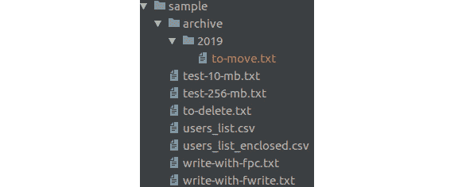

图 7.10：文件树截图

此外，当第二次运行脚本时，你应该得到以下输出：

```php
The [sample/to-move.txt] file does not exist.
```

在这个练习中，你成功使用 PHP 及其内置的文件系统函数将文件从一个位置移动到另一个位置，同时验证输入，以确保你没有尝试移动一个不存在的文件。

## 使用 PHP 复制文件

复制文件是 PHP 提供的另一个简单任务的支持。`copy()`函数接受两个必需参数——源文件路径和目标路径，以及一个可选参数——流上下文。使用`copy()`函数在以下场景中非常有用，例如从服务器上可用的图片列表中选择你的个人资料图片（在这种情况下，你希望保持图片列表完整，因此你只希望创建所选图片的副本），或者恢复从备份中复制的文件（再次，你希望保持原始文件完整，因此在这种情况下`copy()`也是合适的）。

注意

使用`copy()`函数，如果目标文件已存在，它将被覆盖。

## 练习 7.11：复制文件

你需要编写一个脚本，将特定的文件复制到备份位置。复制的文件应该具有 `.bak` 扩展名前缀：

1.  在 `sample` 目录内创建一个名为 `to-copy.txt` 的空文件。

1.  创建一个包含以下内容的 `copy.php` 文件：

    ```php
    <?php
    $sourceFilePath = 'sample/to-copy.txt';
    $targetFilePath = 'sample/to-copy.txt.bak';
    if (!is_file($sourceFilePath)) {
        echo sprintf('The [%s] file does not exist.', $sourceFilePath) .       PHP_EOL;
        return;
    }
    ```

    首先，我们定义源文件路径和目标文件路径，然后检查源文件是否存在。如果源文件不存在，会打印出错误消息，并且脚本执行停止。

1.  接下来，我们尝试使用 `copy()` 函数复制文件。根据 `copy()` 函数的响应，会打印出适当的消息：

    ```php
    if (copy($sourceFilePath, $targetFilePath)) {
        echo sprintf('The [%s] file was copied as [%s].', $sourceFilePath,       $targetFilePath) . PHP_EOL;
    } else {
        echo sprintf('The [%s] file cannot be copied as [%s].',       $sourceFilePath, $targetFilePath) . PHP_EOL;
    }
    ```

    注意

    完整的脚本可以参考 [`packt.live/2plXtXu`](https://packt.live/2plXtXu)。

1.  在命令行界面中运行文件，使用 `php copy.php` 并检查结果；在成功执行 `copy` 操作的情况下，你应该得到以下输出：

    图 7.11：成功复制文件

1.  将脚本中的 `$sourceFilePath` 改为一个不存在的文件路径（例如，`wrong-file-path.txt`），然后再次运行脚本。输出将如下所示：


图 7.12：尝试复制一个不存在的文件

如你所见，使用 PHP 复制文件是一个相当直接的过程。

在这个练习中，你学习了如何使用 PHP 处理文件，从文件创建和写入开始，继续到追加、重写和删除，然后是复制和移动，最后是逐行读取大文件并将文件发送下载。

# 数据库

在上一节中，我们看到了如何使用 PHP 操作和存储文件中的数据。但是当应用程序依赖于结构化数据时，使用文件系统会变得相当复杂，尤其是在应用程序增长，数据也随之增长的情况下。想象一下一个社交媒体网站，其中包含大量的数据关系，包括帖子评论、兴趣、友谊、群组和大量的其他关联数据。此外，随着应用程序的增长，可扩展性成为一个重要的因素。这就是你想要使用数据库的时候，以便能够以不同的方式查询数据——排序、过滤、部分数据、组合数据（连接），并且同时以非常高效的方式进行。**数据库管理系统**（**DBMS**）用于对数据库数据进行操作（创建、读取、更新和删除）。此外，由于数据库中的不同类型的数据与其他数据类型相关联，你可能希望你的数据存储具有准确性、一致性和可靠性。在这种情况下，你更倾向于使用关系型 DBMS。

MySQL 是一个**关系型数据库管理系统**（**RDBMS**），并且与 PHP 最常用。它非常快，可靠，易于使用（它使用**结构化查询语言**（**SQL**）查询），并且免费使用。它适用于从小到大的各种应用程序。它非常强大，快速，安全且可扩展。

MySQL 数据库以表格形式存储数据，就像任何其他关系型数据库一样。一个表由相关的数据组成，这些数据按行（记录）和列（记录字段）组织。

PHP 支持多种数据库，如 MySQL、PostgreSQL、SQLite、MongoDB、MSSQL 等，但在这个章节中，我们将使用 MySQL，因为它是目前与 PHP 配合使用最广泛的数据管理系统。

## 图形用户界面客户端

通常，图形用户界面（GUI 或“桌面应用程序”）客户端在执行数据库中的各种操作时非常有用，例如验证数据、更改表或列、导出或导入数据以及迁移数据库。

对于 MySQL，推荐使用三个客户端：

+   MySQL Workbench：一个桌面应用程序；跨平台；可以从[`packt.live/32iaZd6`](https://packt.live/32iaZd6)下载

+   PhpMyAdmin：一个浏览器应用程序；可以从[`packt.live/2McXnu9`](https://packt.live/2McXnu9)下载

+   Adminer：一个轻量级的浏览器应用程序；可以从[`packt.live/35yBTzB`](https://packt.live/35yBTzB)下载

此外，对于截图，我将使用 Workbench 来测试 MySQL 服务器中的数据，但可以使用这些工具中的任何一个。

## 连接到 MySQL

要使用 MySQL 服务器与 PHP 一起工作，需要安装一些扩展。通常，一个扩展是一个组件，它公开了`mysqli`和`PDO`扩展。它们在功能和语法方面非常相似，除非你需要从某个扩展中获取特定功能，否则选择要与之工作的扩展不应造成任何困难。只需选择一个即可。

由于 PDO 似乎是使用最广泛的选择，我们将选择这个扩展进行进一步的练习。

**PHP 数据对象**（**PDO**）是一个轻量级且紧凑的接口，用于通过 PHP 访问数据库。

要继续，请确保您已按照前言中描述的安装 MySQL。此外，请考虑 MySQL 服务器正在监听`127.0.0.1`，端口`3306`，用户名设置为`php-user`，密码设置为`php-pass`。

注意

对于 Windows 操作系统，第七章代码片段中的数据库用户名 php-user 需要替换为 php_user。这是因为 MySQL 的 Windows 安装程序不允许用户名中包含连字符。

确保您已安装`PDO`扩展和`pdo_mysql`驱动程序，以便建立连接并向 MySQL 服务器发送查询。

注意

`pdo_mysql`驱动程序是一个提供上述 PDO 扩展接口的扩展。此驱动程序是一个组件，它使得与 MySQL 服务器通信成为可能，在双方之间翻译指令。

在终端中通过运行`php -m`来列出所有已安装和启用的扩展，或通过`php -m | grep -i pdo`来列出仅匹配`pdo`字符串片段的条目。后者应输出以下两个条目：


图 7.13：检查已启用的扩展

注意

`grep` 是一个 Unix 函数，用于在文件或字符串输入中搜索文本，并默认通过输出返回匹配的行。`|`（管道）标记用于将前一个命令的输出（`php -m`）作为输入传递给下一个命令。

为了进一步进行，让我们创建一个新的目录，我们将在此目录中编写数据库相关的练习（例如，`database`）。

## 连接到 MySQL

MySQL 连接是通过实例化 PDO 对象来发起的。它接受数据库源（DSN）作为第一个参数，可选地，如果需要，还包括用户名、密码和 PDO 选项。

语法如下：

```php
PDO::__construct(string $dsn [, string $username [, string $password [, array   $options ]]])
```

参数：

+   数据源名称：`mysql:` 后跟由分号分隔的键值对列表；这些元素将在此列出。

+   username：用于连接数据库的用户名。

+   password：用于验证用户名的密码。

+   options: MySQL（特定驱动程序）连接选项的关联数组。

DSN 允许以下元素：

+   host：数据库所在的主机名。

+   port：数据库服务器监听此端口号。

+   dbname：数据库名称。

+   charset：连接的字符集（数据将使用此字符集传输）。

+   unix_socket：MySQL Unix 套接字；用作主机和端口连接类型的替代。

作为良好的实践，建议将连接字符集设置为 `utf8mb4`；这样，如果你必须使用此连接存储和检索 UTF-8 字符，你将避免进一步的困难（你最终必须这样做）。

`PDO` 类的一个方法是 `getAttribute()`，它返回数据库连接属性，例如服务器信息和连接状态。`PDO::getAttribute()` 方法需要并接受一个整数类型的参数；即 `PDO::ATTR_*` 常量之一。有关 PDO 属性和其他常量的完整列表，请访问官方文档页面 [`www.php.net/manual/en/pdo.constants.php`](https://www.php.net/manual/en/pdo.constants.php)。

## 练习 7.12：连接到 MySQL

在这个练习中，你将使用 PDO 连接到 MySQL 服务器。

1.  创建一个名为 `connect.php` 的文件，并添加以下内容。在我们的脚本中，我们首先定义 MySQL 数据库的 DSN，将主机指向 `127.0.0.1`，端口指向 `3306`：

    ```php
    <?php
    $dsn = "mysql:host=127.0.0.1;port=3306;charset=utf8mb4";
    ```

1.  接下来，我们设置 PDO 选项，在 `$options` 变量下，我们指定获取模式，默认将所有记录作为关联数组获取。我们还想将错误模式设置为 `Exceptions`，以便更容易处理查询错误，但到目前为止，我们将使用 `PDO::errorCode()` 和 `PDO::errorInfo()` 方法：

    ```php
    $options = [
        PDO::ATTR_DEFAULT_FETCH_MODE => PDO::FETCH_ASSOC,
    //    PDO::ATTR_ERRMODE => PDO::ERRMODE_EXCEPTION,
    ];
    ```

    注意

    我们将在下一章学习异常和错误处理。

1.  在下一行，我们调用`PDO`对象，从而使用之前定义的 DSN、用户名、密码和上述`PDO`选项建立到数据库的连接。如果连接失败，将抛出异常（`PDOException`类型）并停止脚本的执行：

    ```php
    $pdo = new PDO($dsn, "php-user", "php-pass", $options);
    ```

1.  在最后一步，我们希望打印连接信息，使用`PDO::getAttribute()`方法：

    ```php
    echo sprintf(
            "Connected to MySQL server v%s, on %s",
            $pdo->getAttribute(PDO::ATTR_SERVER_VERSION),
            $pdo->getAttribute(PDO::ATTR_CONNECTION_STATUS)
        ) . PHP_EOL;
    ```

1.  在命令行界面中运行文件`php connect.php`。当连接成功时，输出将如下所示：

    ```php
    Connected to MySQL server v5.7.23, on 127.0.0.1 via TCP/IP
    ```

    在连接失败的情况下，输出将如下所示：

    ```php
    PHP Fatal error: Uncaught PDOException: SQLSTATE[HY000] [1045] Access denied for user 'php-user'@'127.0.0.1' (using password: YES) in /app/connect.php:8
    Stack trace:
    #0 /app/connect.php(8): PDO->__construct('mysql:host=127....', 'php-user', 'wrongpwd', Array)
    #1 {main}
      thrown in /app/connect.php on line 8
    ```

    在连接失败的情况下，最好处理错误并以优雅的方式回退到一个看起来不错的错误页面，提供友好的错误信息。然而，在这种情况下，我们将保持脚本现状，因为 PHP 异常将在下一章中介绍。

这里，你使用 PDO 和用户名、密码连接到 MySQL，并且为`PDO`对象设置了一些选项。你还从 PDO 连接属性中打印了服务器版本和连接状态。

## 创建数据库

现在我们已经学习了如何与 MySQL 服务器建立连接，让我们继续看看如何创建数据库。

要做到这一点，我们不得不运行 SQL 查询；这就是我们使用`PDO`方法的地方。

我们将调用`PDO::exec()`方法将 SQL 查询发送到 MySQL 服务器。它只接受一个参数：SQL 查询字符串，在出错时返回布尔`false`，在成功时返回受影响的行数。

警告：由于此函数可以返回布尔`false`和`0`（零），它们都评估为`false`，所以在测试结果时，请确保使用`===`或`!==`运算符，以避免在检查错误时出现假阳性。

在查询失败的情况下（`PDO::exec()`返回`false`），我们可以调用`PDO::errorInfo()`方法来获取错误代码和错误信息。此方法返回一个包含以下数据的数字数组：


图 7.14：PDO::errorInfo()返回的数组中数据类型的描述

创建新数据库的查询具有以下语法：

`CREATE SCHEMA db_name`，其中`db_name`应替换为你想要创建的数据库的名称。

注意

`CREATE SCHEMA` 是一个 SQL 语句。它可以在任何 SQL 客户端中使用 SQL 服务器执行。语法和更多信息可以在官方文档页面上找到，链接为 [`packt.live/32ewQSK`](https://packt.live/32ewQSK)。

## 练习 7.13：创建数据库

在这个练习中，我们将创建一个数据库并运行查询：

1.  创建一个名为`connection-no-db.php`的文件，并插入以下代码：

    ```php
    <?php
    $dsn = "mysql:host=127.0.0.1;port=3306;charset=utf8mb4";
    $options = [
        PDO::ATTR_DEFAULT_FETCH_MODE => PDO::FETCH_ASSOC,
    ];
    $pdo = new PDO($dsn, "php-user", "php-pass", $options);
    return $pdo;
    ```

    这与我们在上一个练习中做的是类似的，只是我们不是打印连接信息，而是返回 `PDO` 实例。在这个文件中，我们没有指定数据库名，因为我们还没有创建一个。

1.  创建一个名为 `create-schema.php` 的文件，并插入以下代码。首先，我们从之前创建的 `connection-no-db.php` 文件中需要 `PDO` 实例：

    ```php
    <?php
    /** @var PDO $pdo */
    $pdo = require 'connection-no-db.php';
    ```

    然后，我们在 `$sql` 变量下编写我们的 SQL 查询，这将创建一个名为 `demo` 的数据库：

    ```php
    $dbname = 'demo';
    $sql = "CREATE SCHEMA $dbname";
    ```

1.  使用 `PDO::exec()` 方法运行查询，并检查语句执行是否成功（结果不是布尔值 `false`）。在成功的情况下，我们打印一个简单的成功消息。在出错的情况下，我们打印错误消息：

    ```php
    if ($pdo->exec($sql) !== false) {
        echo "The database '$dbname' was successfully created." . PHP_EOL;
    } else {
        list(, , $driverErrMsg) = $pdo->errorInfo();
        echo "Error creating the database: $driverErrMsg" . PHP_EOL;
    }
    ```

1.  使用命令行界面运行代码 `php create-schema.php`。当第一次运行代码时，你会得到以下输出：

图 7.15：成功创建模式

依次运行代码，你会得到以下错误消息：


图 7.16：创建模式错误

在这个练习中，你学习了我们可以如何创建数据库以及如何测试 SQL 语句 `CREATE SCHEMA` 的成功执行。

## 创建表

现在我们来看看我们如何创建一个将数据以有组织的方式存储的表。我们将使用 `CREATE TABLE` SQL 语句来实现这一点。这个语句的语法更复杂，还涉及到表列定义。

标准的 `CREATE TABLE` 语法如下：

```php
CREATE TABLE [IF NOT EXISTS] tbl_name
(
  col_name data_type [NOT NULL | NULL] [DEFAULT default_value] [AUTO_INCREMENT]    [UNIQUE [KEY]] [[PRIMARY] KEY]
  ...
)
```

参数如下：

+   `tbl_name`：要创建的表名。

+   `col_name`：列名。

+   `data_type`：列持有的数据类型，如日期、时间戳、整数、字符串和 JSON。更多信息可以在 [`packt.live/32CWosP`](https://packt.live/32CWosP) 找到。

+   `default_value`：当 `insert` 语句没有为该行列提供数据时的默认值。

一个示例 `CREATE TABLE` 查询可以如下所示：

```php
CREATE TABLE users
(
    id INT NOT NULL PRIMARY KEY AUTO_INCREMENT,
    email VARCHAR(254) NOT NULL UNIQUE,
    signup_time DATETIME DEFAULT CURRENT_TIMESTAMP NOT NULL
)
```

在这个语句中，我们指向表名 – `users`，有三个列，如下所示：

+   `id`：整数类型；不为空；自增的主键；这些约束告诉 MySQL，该列是主键，意味着它在表中是唯一的，并将用于识别表中的唯一记录。`AUTO_INCREMENT` 关键字告诉 MySQL，我们希望这个值自动设置为“自增”值，即在我们不指定它时，是最后一条插入记录 ID 的下一个更高整数。这很有用，因为我们可以在不知道下一个 ID 值的情况下执行 `INSERT` 语句。

+   `email`: 一种长度可变字符类型，最大长度为 254；不可为空；且在记录中是唯一的。关于此规则，当插入具有相同"`email`"值的另一条记录时，MySQL 服务器将拒绝该语句，并返回错误。

+   `signup_time`: 日期时间类型；默认为当前时间；不可为空。在`insert`查询中未指定此值时，MySQL 服务器将设置当前日期时间值。

    警告

    注意，“当前日期时间”将是使用 MySQL 服务器时区偏移设置的值，这可能与应用程序服务器不同。例如，当您将应用程序部署到位于不同时区的数据中心的服务器上时，远程服务器的系统时区可能设置为本地时区偏移。您可能想确保您的服务器设置不应用时区偏移——使用 UTC 时区，或者您可能想使用时间戳值而不是可读日期。

您可以在[`packt.live/2MAGloG`](https://packt.live/2MAGloG)找到完整的语法和更多信息。

## 练习 7.14：创建表

在这个练习中，我们将学习如何使用 PDO 选择数据库，以及如何使用`PDO`实例创建表：

1.  创建一个名为`create-table.php`的文件，并插入以下代码。在获取`PDO`实例后，我们定义`CREATE TABLE`语句：

    ```php
    <?php
    /** @var PDO $pdo */
    $pdo = require 'connection-no-db.php';
    $createStmt = "CREATE TABLE users
    (
        id INT NOT NULL PRIMARY KEY AUTO_INCREMENT,
        email VARCHAR(254) NOT NULL UNIQUE,
        signup_time DATETIME DEFAULT CURRENT_TIMESTAMP NOT NULL
    )";
    ```

    执行语句后，如果失败，将打印错误消息，并停止执行或脚本。否则，将打印成功消息到输出：

    ```php
    if ($pdo->exec($createStmt) === false) {
        list(, , $driverErrMsg) = $pdo->errorInfo();
        echo "Error creating the users table: $driverErrMsg" . PHP_EOL;
        return;
    }
    echo "The users table was successfully created.";
    ```

1.  在命令行界面中运行`php create-table.php`脚本。预期以下错误输出：

    图 7.17：创建表错误

    我们得到一个错误消息，指示未选择数据库。从该语句中我们了解到，MySQL 服务器可以存储多个数据库，并且在执行语句时，我们应该指明我们想要在其中运行的数据库。为了实现这一点，我们可以在 SQL 语句中包含数据库名（例如，`CREATE TABLE demo.users` ...）或在与 MySQL 服务器建立连接之前在 DSN 中指定数据库名。

1.  将`connection-no-db.php`文件复制到`connection.php`，并在`connection.php`文件中将数据库名添加到 DSN 中。将`$dsn`变量替换为以下值：

    ```php
    $dsn = "mysql:host=mysql-host;port=3306;dbname=demo;charset=utf8mb4";
    ```

    注意

    在所有练习中，我们将需要此`connection.php`文件，以重用代码，而不是在每次使用数据库连接的文件中键入此代码块。

1.  在`create-table.php`脚本中引入`connection.php`文件，而不是`connection-no-db.php`：

    ```php
    $pdo = require 'connection.php';
    ```

1.  让我们再次运行我们的脚本：`php create-table.php`。预期以下输出：


图 7.18：成功创建表

太好了！您已成功在`demo`数据库中创建了第一个表。

在这个练习中，您学习了如何在连接时选择数据库，以及如何在 SQL 数据库中创建表。请注意，查询以一个动作（`CREATE`）开始，然后是对象类型（模式/数据库或表），然后是所需的对象定义。您可能还注意到，列名称后面跟着数据类型声明（整数、字符串、日期等），然后是额外的约束（`NOT NULL`、`PRIMARY KEY`、`UNIQUE`等）。

如您所见，SQL 语句非常描述性，易于学习和记忆。所以，让我们通过更多令人兴奋的例子来继续前进！

## 向 MySQL 数据库表插入数据

由于我们已经知道如何在 MySQL 数据库中创建表，让我们向其中添加一些数据。

在将数据插入到表中之前，我们必须以这种方式编写脚本，以便要插入的数据将与表的列定义相匹配。这意味着我们无法将字符串存储在定义为整数数据类型的列中。在这种情况下，MySQL 服务器将拒绝查询并返回错误。同时，请注意，由于大部分数据将来自用户输入，因此在将其发送到数据库服务器之前，您应该始终对其进行验证，并且同时正确地转义它，以避免另一个称为 SQL 注入的安全问题，该问题将在本章后面介绍。

标准的`INSERT`语句语法如下：

```php
INSERT INTO tbl_name
  (col_name [, col_name] ...) 
  VALUES (value_list) [, (value_list)] ...
```

当前的`value_list`是：

```php
value [, value] ...
```

注意

在`value_list`中指定的值数量应与`col_name`计数匹配。`INSERT`语句的完整语法可以在官方文档页面[`packt.live/32fXkmP`](https://packt.live/32fXkmP)找到。

一个示例`INSERT`查询可能如下所示：

```php
INSERT INTO employees (email, first_name, last_name)
  VALUES ('john.smith@mail.com','John','Smith'),
         ('jane.smith@mail.com','Jane','Smith')
```

在此情况下，将在`employees`表中插入两行，将`VALUES`中的值设置到列列表中相应的位置列；例如，`john.smith@mail.com`被分配到`email`列，而`John`值被分配到`first_name`列。

## 练习 7.15：向表中插入数据

在这个练习中，我们将熟悉`INSERT`语句，了解我们如何向表中添加数据：

1.  创建一个名为`insert.php`的文件。在获取`PDO`实例后，我们将`INSERT`语句存储在`$insertStmt`变量下。此语句将值`john.smith@mail.com`插入到`users`表的`email`列中。我们没有指定 ID 值；因此，它必须使用`auto_increment`值自动设置，对于第一条记录，这将是一个`1`。我们还缺少`signup_time`列，它默认将设置记录添加时的时间。将以下代码添加到`insert.php`文件中：

    ```php
    <?php
    /** @var PDO $pdo */
    $pdo = require 'connection.php';
    $insertStmt = "INSERT INTO users (email) VALUES ('john.smith@mail.com')";
    ```

1.  如果语句执行失败，脚本将打印错误消息并不会继续执行；否则，将打印成功消息，包括刚刚插入的行的 ID，使用`PDO::lastInsertId()`方法：

    ```php
    if ($pdo->exec($insertStmt) === false) {
        list(, , $driverErrMsg) = $pdo->errorInfo();
        echo "Error inserting into the users table: $driverErrMsg" . PHP_EOL;
        return;
    }
    echo "Successfully inserted into users table the record with id " .   $pdo->lastInsertId() . PHP_EOL;
    ```

1.  使用`php insert.php`运行脚本。第一个输出将如下所示：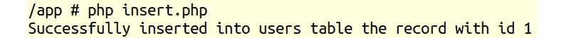

    图 7.19：向表中插入记录

1.  再次运行脚本。现在，您应该期望在输出中看到以下响应：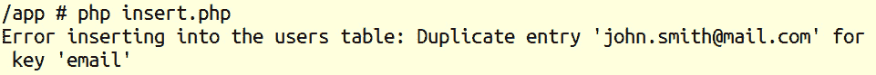

    图 7.20：重复条目错误

    这证明了之前的脚本执行成功，并且电子邮件列中的`UNIQUE`约束按预期工作。

1.  现在让我们使用 Workbench 客户端查看`users`表中的数据：

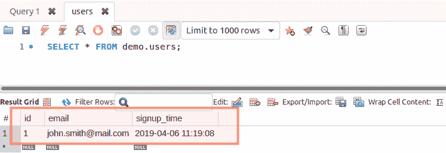

图 7.21：使用 Workbench 客户端检查数据库中的数据

如预期，我们有一行数据，`id = 1`，`email`列的`john.smith@mail.com`，以及 MySQL 服务器在行插入时设置的注册时间。

恭喜您已成功将初始数据添加到数据库表中！这很简单。现在，既然我们知道需要处理用户输入，我们必须确保脚本将以完全安全的方式运行查询，避免 SQL 注入，这可能导致数据泄露和系统被破坏。

## SQL 注入

那么，SQL 注入究竟是什么呢？SQL 注入是当今野网中最常见的漏洞之一。它是一种用于窃取数据、控制用户账户或破坏数据库的技术，通过通过 HTML 表单输入发送恶意查询片段来执行。

为了更好地理解这一点，这里有一个简单的例子，说明您如何使用 SQL 注入技术删除表，给定一个接受用户输入但不进行清理和/或验证的查询：

```php
$rawInput = $_POST['email'];
$query = "INSERT INTO users (email) VALUES ($rawInput)";
```

当电子邮件输入值为`""); DROP TABLE users; /**`时，查询将变为：

```php
INSERT INTO users (email) VALUES (""); DROP TABLE users; /**)
```

发生的事情很容易理解；执行了`INSERT`语句，将空值添加到`email`列，然后执行了删除表的查询，使`users`表消失，而`/**)`部分被忽略，因为`/**`在 SQL 查询中标记了注释的开始。

## 预处理语句

为了防止 SQL 注入，我们应该转义输入数据。PDO 提供了一个替代方案——所谓的`预处理语句`（`PDOStatement`类）。这些语句是模板，看起来像常规的 SQL 查询，不同之处在于，它们不包含值，而是包含占位符，这些占位符将在执行时被转义后的值替换。占位符的映射是通过`PDOStatement::bindParam()`方法完成的，或者通过在执行时提供映射，作为`PDOStatement::execute()`方法的参数。

占位符有两种类型：

+   位置占位符，`?`

    查询示例：

    ```php
    INSERT INTO users (email) VALUES (?);
    ```

+   命名占位符，名称前加冒号，`:`

    查询示例：

    ```php
    INSERT INTO users (email) VALUES (:email);
    ```

使用预处理语句提供了主要的好处：

+   预处理语句的参数不应加引号，因为这由 PDO 自动处理，同时它也会在必要时处理值的转义。这意味着您可以使用带有占位符的预处理语句确保没有 SQL 注入。

+   查询只由 MySQL 服务器发送和解析一次，这意味着相同的语句可以多次执行，只发送占位符的数据。这导致执行时间更快，带宽使用更低。

    备注

    默认情况下，PDO 会模拟预处理语句以支持没有此功能的数据库，如果您想在 MySQL 服务器上真正地使用预处理语句，您应该在连接选项中将`PDO::ATTR_EMULATE_PREPARES`设置为`false`。

模拟预处理语句意味着在调用`PDO::prepare()`时，查询不会被发送到服务器进行检查。相反，PDO 将在`PDO::execute()`中转义绑定参数，并自行替换占位符。然后，原始 SQL 查询被发送到数据库服务器，这意味着，这种方式下，您无法从数据库在多次执行预处理语句时可能进行的性能优化中受益。

## 使用预处理语句

要获取一个预处理语句，您必须调用`PDO::prepare()`方法，并提供语句作为第一个参数。输出是`PDOStatement`类的实例（预处理语句），然后用于绑定参数值并执行语句。

`PDO::bindParam()`用于绑定预处理语句的参数，其语法如下：

```php
PDOStatement::bindParam(mixed $parameter, mixed &$variable [, int $data_type =   PDO::PARAM_STR [, int $length [, mixed $driver_options ]]])
```

接受的输入参数：

+   `parameter`：参数标识符；对于使用命名占位符的预处理语句，这将是一个形式为`:name`的参数名称。对于使用问号占位符的预处理语句，这将是指参数的一个索引位置。

+   `variable`：要绑定到 SQL 语句参数的 PHP 变量名称；请注意，此参数是通过引用传递的，这意味着如果我们执行语句之前修改了变量，新值将在调用`PDO::execute()`时发送到服务器。

+   `data_type`：使用`PDO::PARAM_*`常量指定的参数数据类型；例如，`PDO::PARAM_INT`。

+   `length`：数据类型的长度。要表示参数是从存储过程的一个`OUT`参数，您必须显式设置长度。

+   `driver_options`：自解释。

`PDO::bindParam()`方法在成功时返回`true`，否则返回`false`。

要执行预处理语句，请使用`PDO::execute()`方法。语法如下：

```php
PDOStatement::execute([array $input_parameters])
```

唯一接受的参数是一个可选的`$input_parameters`数组，其中包含用于语句占位符的值。数组的所有值都被视为`PDO::PARAM_STR`。

此方法在成功时返回 `true`，否则返回 `false`。

下面是一个使用位置占位符的预处理语句的示例查询：

```php
$stmt = $pdo->prepare("INSERT INTO users (email) VALUES (?)");
$stmt->bindParam(1, $email);
$email = 'first@mail.com';
$stmt->execute();
$email = 'second@mail.com';
$stmt->execute();
```

或者可以写成如下形式：

```php
$stmt = $pdo->prepare("INSERT INTO users (email) VALUES (?)");
$stmt->execute(['first@mail.com']);
$stmt->execute(['second@mail.com']);
```

下面是一个使用命名占位符的预处理语句的示例查询：

```php
stmt = $pdo->prepare("INSERT INTO users (email) VALUES (:email)");
$stmt->bindParam(':email', $email);
$email = 'first@mail.com';
$stmt->execute();
$email = 'second@mail.com';
$stmt->execute();
```

或者可以写成如下形式：

```php
$stmt = $pdo->prepare("INSERT INTO users (email) VALUES (:email)");
$stmt->bindParam(':email', $email);
$stmt->execute([':email' => 'first@mail.com']);
$stmt->execute([':email' => 'second@mail.com']);
```

注意，`$email` 变量只被分配给 `:email` 占位符一次，而其数据改变了两次，每次改变后都会执行相应的语句。每个语句都会发送 `$email` 变量在该执行点的当前值，这是由于在 `PDO::bindParam()` 方法中使用变量引用而不是按值传递变量而成为可能的。

## 练习 7.16：使用预处理语句插入数据

在这个练习中，你将创建一个脚本，使用预处理语句从用户输入中插入新的用户电子邮件：

1.  创建一个名为 `insert-prepared.php` 的文件，并添加以下代码。和之前一样，我们获取 `PDO` 实例，然后是其 `prepare()` 方法，提供查询模板。作为回报，我们得到一个 `PDOStatement` 实例，我们将其存储在 `$insertStmt` 变量中：

    ```php
    <?php
    /** @var PDO $pdo */
    $pdo = require 'connection.php';
    $insertStmt = $pdo->prepare("INSERT INTO users (email) VALUES (:email)");
    ```

1.  然后，我们调用 `PDOStatement` 的 `execute()` 方法，提供占位符-值映射。在这种情况下，值将是脚本执行时提供的第一个参数。我们检查结果，如果失败，则打印错误消息并停止脚本的执行。否则，打印成功消息：

    ```php
    if ($insertStmt->execute([':email' => $argv[1] ?? null]) === false) {
        list(, , $driverErrMsg) = $insertStmt->errorInfo();
        echo "Error inserting into the users table: $driverErrMsg" . PHP_EOL;
        return;
    }
    echo "Successfully inserted into users table" . PHP_EOL;
    ```

1.  使用 `php insert-prepared.php john.smith@mail.com` 运行脚本。输出应该如下所示：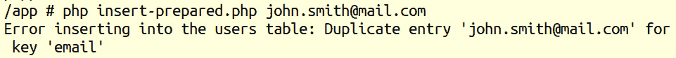

    图 7.22：重复条目错误

    这是一个预期的错误，因为我们已经添加了此电子邮件，并且 `UNIQUE` 关键字确保不会添加具有相同电子邮件地址的其他条目。有关表定义，请参阅 *练习 7.14*，*创建表*。

1.  使用 `php insert-prepared.php jane.smith@mail.com` 运行脚本。这次，你应该期望得到一个类似以下的消息输出：

    图 7.23：插入的记录

    让我们使用 Workbench 检查记录：

    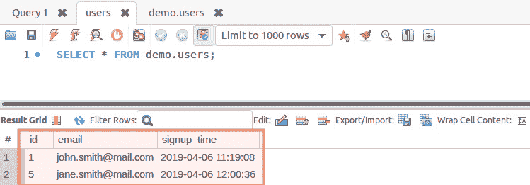

    图 7.24：Workbench 显示的记录

    看起来不错。你已经成功运行了一个 PDO 预处理语句。你会注意到 `jane.smith@mail.com` 的 ID 不是 `2`，而是 `5`。这是因为之前运行的预处理语句，即使是失败的，也增加了 `AUTO_INCREMENT` 的值。

1.  让我们通过运行包含恶意查询片段的脚本来检查对 SQL 注入的保护：

    ```php
    php insert-prepared.php '""); DROP TABLE users; /**' 
    ```

    输出类似于以下内容：


图 7.25：插入的记录

让我们使用 Workbench 检查结果：


图 7.26：使用 Workbench 客户端显示所有记录

它们看起来不错。我们已经防止了 SQL 注入，但由于在查询运行之前没有验证或清理输入，最终得到了损坏的数据。请参阅 *第六章*，*使用 HTTP* 中的 *清理和验证用户输入* 部分。

## 从 MySQL 获取数据

到目前为止，你已经学习了如何以安全的方式创建数据库和表，以及如何将数据插入到表中。现在，是时候使用 PHP 获取并显示一些数据了。

要完成这个任务，我们使用 `SELECT` 语句，它具有以下最小语法：

```php
SELECT column1 [, column2 …] FROM table
```

前面的查询将返回表中的所有记录，因为没有设置限制。因此，建议（在某些情况下可能是强制性的）在以下形式之一中使用 `LIMIT` 子句：

+   `LIMIT row_count`: 将返回前 `row_count` 行

+   `LIMIT offset`, `row_count`: 将从 `offset` 位置开始返回 `row_count` 行（例如，`LIMIT 20, 10` 将从位置 `20` 开始返回 `10` 行；另一个例子，`LIMIT 0, 10` 等同于 `LIMIT 10`，因为默认偏移量为零）

+   `LIMIT row_count OFFSET` `offset`: 与 `LIMIT` `offset`, `row_count` 相同

`LIMIT` 子句的一部分，`SELECT` 语句包含丰富的子句，可用于过滤、连接、分组或排序数据。您可以在官方文档页面检查 `SELECT` 语句的语法[`dev.mysql.com/doc/refman/5.7/en/select.html`](https://dev.mysql.com/doc/refman/5.7/en/select.html)。

一个非常简单的 `SELECT` 语句看起来像这样：

```php
SELECT * FROM employees LIMIT 10;
```

此语句查询 `employees` 表的前 10 条记录。

注意

在 `SELECT` 语句中使用星号 `*` 而不是列名，将使 MySQL 执行额外的查找查询以检索查询表的列列表，并将原始查询中的 `*` 替换为该列列表。这会对 SQL 查询的性能产生影响，对于低流量应用程序来说影响并不显著；然而，无论项目大小或估计的流量负载如何，指定列列表而不是 `*` 被认为是良好的实践。

现在，让我们一步一步地检查如何使用各种示例从 MySQL 数据库中获取我们想要的数据。

## 练习 7.17：从 MySQL 获取数据

在这个练习中，你将学习如何以最简单的方式从 MySQL 数据库查询数据，获取结果集中的记录片段，通过特定列过滤数据，并按特定列排序数据：

1.  创建 `select-all.php` 文件并添加以下代码。我们获取 `PDO` 实例并将 `SELECT` 查询存储在 `$statement` 变量中。然后，我们调用 `PDO` 对象实例的 `query()` 方法，在失败的情况下将输出一个布尔值 `false`，在成功的情况下将返回一个 `PDOStatement` 实例：

    ```php
    <?php
    /** @var PDO $pdo */
    $pdo = require 'connection.php';
    $statement = "SELECT * FROM users";
    $result = $pdo->query($statement);
    ```

1.  在查询失败的情况下，我们打印错误消息并中断脚本执行。否则，我们打印`All records`行，并遍历所有结果集记录并打印它们，使用制表符分隔记录数据：

    ```php
    if ($result === false) {
        list(, , $driverErrMsg) = $pdo->errorInfo();
        echo "Error querying the users table: $driverErrMsg" . PHP_EOL;
        return;
    }
    echo "All records" . PHP_EOL;
    while ($record = $result->fetch()) {
        echo implode("\t", $record) . PHP_EOL;
    }
    ```

1.  我们使用略微修改的查询重复此操作，添加`LIMIT`子句（并且不再检查查询失败），然后打印`Use LIMIT 2`行，随后是结果集中的所有记录：

    ```php
    $result = $pdo->query("SELECT * FROM users LIMIT 2");
    echo PHP_EOL . "Use LIMIT 2" . PHP_EOL;
    while ($record = $result->fetch()) {
        echo implode("\t", $record) . PHP_EOL;
    }
    ```

1.  我们运行另一个查询，使用`WHERE`子句过滤结果集，并仅返回 ID 值大于`3`的记录。然后，我们打印`Use WHERE id > 3`行，随后是结果集中的所有记录：

    ```php
    $result = $pdo->query("SELECT * FROM users WHERE id > 3");
    echo PHP_EOL . "Use WHERE id > 3" . PHP_EOL;
    while ($record = $result->fetch()) {
        echo implode("\t", $record) . PHP_EOL;
    }
    ```

1.  最后，我们运行另一个查询，使用`ORDER BY`子句按`id`列降序排序输出。我们打印`Use ORDER BY id DESC`行，随后是结果集中的所有记录：

    ```php
    $result = $pdo->query("SELECT * FROM users ORDER BY id DESC");
    echo PHP_EOL . "Use ORDER BY id DESC" . PHP_EOL;
    while ($record = $result->fetch()) {
        echo implode("\t", $record) . PHP_EOL;
    }
    ```

    注意

    最终文件可以在[`packt.live/31daUWP`](https://packt.live/31daUWP)中查阅。

1.  使用`php select-all.php`运行脚本。预期以下输出：

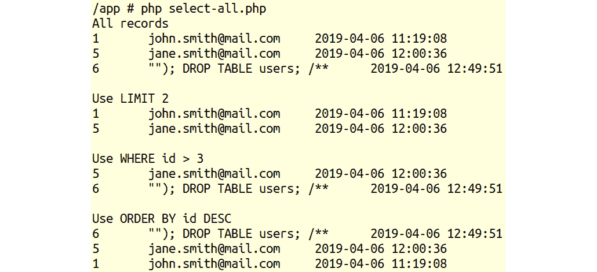


图 7.27：使用不同条件获取记录

恭喜！您已成功以不同的方式从 MySQL 数据库中获取数据：排序、过滤和切片表中的整个数据。

到目前为止，我们已经领略了数据库的强大功能。这仅仅是开始。

## MySQL 中的更新记录

要在 MySQL 中更新记录，使用`UPDATE`语句。这通常与`WHILE`子句一起使用，以过滤要应用更新的行。

警告

在`UPDATE`语句中不使用`WHERE`会导致更新应用于表中的所有记录。

`PDOStatement::rowCount()`方法返回由相应的`PDOStatement`对象执行的最后一个`INSERT`、`UPDATE`或`DELETE`语句影响的行数。

## 练习 7.18：在 MySQL 中更新记录

在这个练习中，您将学习如何对 MySQL 数据库的`users`表执行更新，将电子邮件设置为`john.doe@mail.com`，用于电子邮件列中数据不正确的记录（在我们的例子中是 ID 6）：

1.  创建一个名为`update.php`的文件，并添加以下代码。首先，我们获取`PDO`实例并更新参数。我们需要更新的记录`id`，这个值将从脚本的第一个输入参数中检索，默认为`0`（零）。我们还需要从脚本的第二个输入参数中检索`email`列的更新值。注意，这些值可以在使用网页中的 HTML 表单执行更新操作时从`$_POST`超级全局变量中检索：

    ```php
    <?php
    /** @var PDO $pdo */
    $pdo = require 'connection.php';
    $updateId = $argv[1] ?? 0;
    $updateEmail = $argv[2] ?? '';
    ```

1.  然后，我们使用两个占位符`id`和`email`准备`UPDATE`语句：

    ```php
    $updateStmt = $pdo->prepare("UPDATE users SET email = :email WHERE   id = :id");
    ```

1.  我们执行`UPDATE`语句，提供一个参数中的占位符值映射，并测试结果；如果失败，将显示错误消息，并且脚本将返回（结束执行）。否则，将显示成功消息：

    ```php
    if ($updateStmt->execute([':id' => $updateId, ':email' => $updateEmail])   === false) {
        list(, , $driverErrMsg) = $updateStmt->errorInfo();
        echo "Error running the query: $driverErrMsg" . PHP_EOL;
        return;
    }
    echo sprintf("The query ran successfully. %d row(s) were affected.",   $updateStmt->rowCount()) . PHP_EOL;
    ```

1.  使用`php update.php 6 john.doe@mail.com`运行脚本并检查结果。预期的输出如下：

    图 7.28：更新记录

1.  让我们在 Workbench 中检查结果：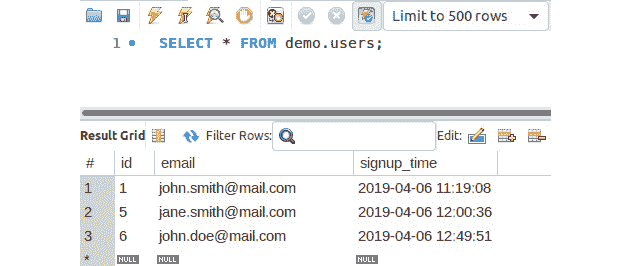

    图 7.29：使用 Workbench 客户端显示数据库表数据

    `id`为 6 的记录的电子邮件已更改为提供的值。看起来很棒！注意，如果你有另一个`id`，该记录的`email`字段中有错误数据，那么在运行命令时应该使用该`id`在*步骤 2*中。

1.  现在，让我们看看当我们为不存在的`ID`运行`UPDATE`查询时会发生什么：

    ```php
    php update.php 16 john.doe@mail.com; 
    ```

    预期以下输出：


图 7.30：UPDATE 查询的输出

我们最终发现此查询没有行受到影响，逻辑看起来相当简单：`UPDATE`语句使用`WHERE`子句中的条件过滤要更新的行；在我们的情况下，通过`id=16`过滤没有行符合更新条件。

注意

尝试使用相同的、完全相同的值更新记录列的值，将导致受影响的行聚合计数为 0；换句话说，`PDOStatement::rowCount()`将返回`0`（零）。

## 从 MySQL 中删除记录

要从 MySQL 中删除记录，我们应该使用`DELETE`语句。这通常（如果不是总是）与`WHERE`子句一起使用，以指示要删除的匹配记录。

警告

在`DELETE`语句中未提供`WHERE`子句将导致表中所有记录被删除。

通常，在`DELETE`语句的`WHERE`子句中，使用 id 列。这是精确指示删除行的情况。但`WHERE`子句也可以在`DELETE`语句中充分发挥其潜力。假设我们想要使用字符串列的部分匹配来删除记录。为了实现这一点，我们将使用`LIKE`运算符，这是一个简单而强大的模式匹配。使用此运算符，我们可以使用两个通配符：

+   `_`（下划线）：匹配恰好一个字符

+   `%`（百分号）：匹配任意数量的字符，包括没有字符

例如，`LIKE` `php_`将匹配`php7`列的值，但不会匹配`php`或`php70`。

另一方面，`LIKE` `"php7%"`将匹配`php7`、`php70`，但不会匹配`php`。

要知道删除了多少条记录，我们将使用之前提到的`PDOStatement::rowCount()`方法。

## 练习 7.19：从 MySQL 中删除记录

在这个练习中，你将学习如何使用`WHERE`子句中的部分匹配来从 MySQL 中删除记录：

1.  创建一个名为 `delete.php` 的文件。

1.  首先，我们像往常一样获取 `PDO` 实例，然后从输入参数中检索要匹配的字符串，然后使用 `:partialMatch` 占位符准备 `DELETE` 语句：

    ```php
    <?php
    /** @var PDO $pdo */
    $pdo = require 'connection.php';
    $partialMatch = $argv[1] ?? '';
    $deleteStmt = $pdo->prepare("DELETE FROM users WHERE   email LIKE :partialMatch");
    ```

1.  然后通过传递输入字符串执行该语句，在执行失败的情况下，我们打印错误信息。注意，`:partialMatch` 模式值是 `%$partialMatch` 变量值，这意味着我们将在列值中的任何位置寻找匹配，无论是开始、结束还是字符串值内部：

    ```php
    if ($deleteStmt->execute([':partialMatch' => "%$partialMatch%"]) ===   false) {
        list(, , $driverErrMsg) = $deleteStmt->errorInfo();
        echo "Error deleting from the users table: $driverErrMsg" . PHP_EOL;
        return;
    }
    ```

1.  如果语句执行成功，那么我们想知道影响了多少记录（被删除），我们将使用 `PDOStatement::rowCount()` 方法来做到这一点。我们将值存储在 `$rowCount` 变量中以便进一步使用，并评估其值。如果值为 `0`（零），则表示没有记录被删除，并且将打印出适当的消息到输出，包括查找项（部分匹配字符串）。否则，将打印出成功消息，指示删除的行数：

    ```php
    if($rowCount = $deleteStmt->rowCount()){
        echo sprintf("Successfully deleted %d records matching '%s' from users       table.", $rowCount, $partialMatch) . PHP_EOL;
    } else {
        echo sprintf("No records matching '%s' were found in users table.",       $partialMatch) . PHP_EOL;
    }
    ```

    注意

    完整脚本可参考 [`packt.live/2MCeswE`](https://packt.live/2MCeswE)。

1.  使用 `php delete.php smith` 运行文件，并期待以下输出：

    

    

1.  再次运行前面的命令。现在，你应该期待以下输出：

    

    图 7.32：删除数据错误

1.  使用 Workbench 检查记录：

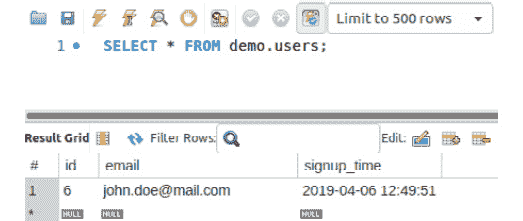


所有匹配 `smith` 的记录都已删除。

您通过使用 `LIKE` 操作符匹配记录成功完成了从数据库表中删除记录。有关操作符的完整列表，请参阅 [`packt.live/2OHMB0B`](https://packt.live/2OHMB0B)。

## 单例模式

通过定义一个私有构造函数（`private`) 并通过定义一个公共静态方法来返回该类的唯一实例。

当需要精确地一个对象（第一个实例）来在应用程序中执行操作时，这很有用。对于数据库连接类来说，这尤其有用，因为它不仅限制了类的多次实例化，还避免了与 MySQL 服务器的重复连接和断开操作，使得第一次建立的连接在整个请求-响应周期内对应用程序可用。

要测试（或演示）PHP 中的单例实现，一个简单的脚本文件就足够了：

```php
DatabaseSingleton.php
1  <?php
2 
3  class DatabaseSingleton
4 {
5      private function __construct()
6      {
7          //$this->pdo = new PDO(...);
8      }
9 
10     public static function instance()
11     {
12         static $instance;
13         if (is_null($instance)) {
14             $instance = new static;
15         }
16         return $instance;
17     }
18 }
https://packt.live/35w4dCz
```

运行前面的脚本将始终返回以下内容：


图 7.34：输出截图

注意

当使用身份运算符（`===`）比较对象时，只有当对象变量引用的是同一类的相同实例时，它们才是相同的。

到目前为止，在本章中，你已经学习了如何使用数据库，从连接开始，创建数据库和表，然后转到添加、查询、更新和删除记录，最后通过使用预处理语句和匿名或命名占位符来保护查询。毫无疑问，MySQL 还有更多要提供——它值得一本整本书，但这里简要地涵盖了所有基本内容。

## 活动 7.1：联系人管理应用程序

你需要构建一个网站，用户可以在其中创建账户并登录来管理私人联系名单。该网站将使用数据库来存储用户登录数据，以及存储每个用户的联系信息。

除了本章中学习的数据库功能外，你还需要使用之前章节中的功能来构建网站（例如，来自*第三章*，*控制语句*的条件；来自*第四章*，*函数*的函数；来自*第五章*，*面向对象编程*的 OOP；以及来自*第六章*，*使用 HTTP*的表单验证）。你可能需要参考之前的章节来提醒如何实现所需的功能。

所需的页面如下：

+   主页

+   登录和注册页面

+   个人资料页面

+   联系人列表和添加/编辑联系人表单页面

**布局和概述**

布局如下所示：

+   主页


图 7.35：主页布局

页面顶部有一个水平导航栏，左侧显示网站标题，右侧显示`登录`按钮。登录成功后，`登录`按钮将被用户名替换，该用户名将链接到个人资料页面、联系人页面链接和注销链接。

内容是一条包含两个行动号召链接的消息：`注册`和`登录`。

登录页面将如下所示：

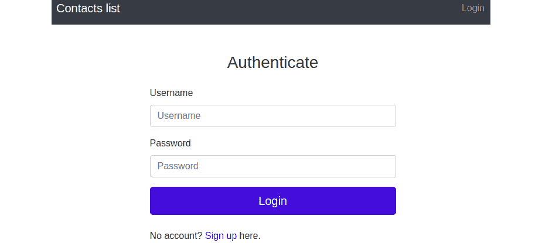

图 7.36：认证布局

登录基于用户名和密码，因此内容是一个简单的登录表单，包含`用户名`和`密码`字段，以及一个`登录`按钮。最后一句话是一个`注册`行动号召链接。

登录后，用户将被重定向到`个人资料`页面。

注册页面将如下所示：

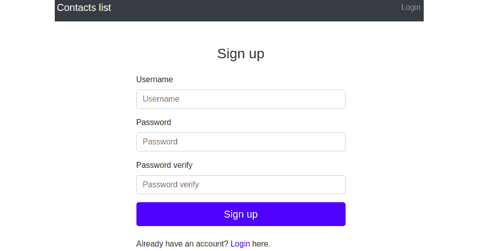

图 7.37：注册页面布局

内容是`注册`表单，包含以下输入：

+   `用户名`

+   `密码`

+   `密码` **验证**

用户名至少需要三个字符长，且仅限字母数字。密码至少需要六个字符长，并在注册时通过第二个密码输入进行验证。任何表单错误都应该显示在数据来源的输入下方，例如：


图 7.38：验证错误

注册的账户还应保留注册日期。注册后，用户将被重定向到个人资料页面：

个人资料页面将如下所示：


图 7.39：个人资料页面布局

这将包含问候语、个人资料数据和会话登录时间。虽然用户名和注册日期存储在数据库中，但会话登录时间可以存储在当前会话中。

联系人页面将如下所示：

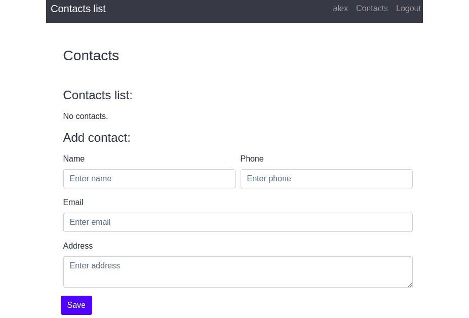

图 7.40：联系人页面布局

内容分为两部分：联系人列表和联系人添加/编辑表单：


图 7.41：数据编辑和删除选项

联系人列表将列出联系人记录，每个记录都有`编辑`和`删除`链接。如果列表为空，则显示适当的消息而不是渲染空表。

联系人表单将具有以下字段名称：

+   `姓名`：必填；至少两个字符

+   `电话`：可选；必须只允许 `+-() 1234567890`

+   `电子邮件`：必填；必须进行验证

+   `地址`：可选；最大 255 个字符

    它应该看起来类似于以下内容：

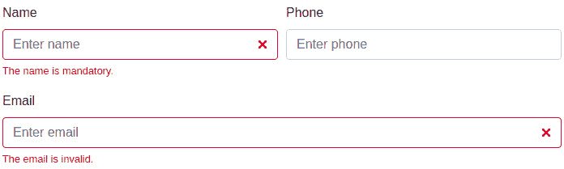

图 7.42：联系人表单

对于无效数据，错误信息应放置在数据来源的输入下方。

访问联系人页面，表单已准备好用于创建新的联系人。一旦按下联系人的**编辑**按钮，联系人信息将被填写到表单中；提交表单更新现有联系人。

当认证用户访问主页、登录页面或注册页面时，他们将被重定向到个人资料页面。

默认页面标题为“联系人列表”。

现在，你应该从哪里开始呢？虽然，在大多数情况下，框架被用来简化每个项目的“入门”过程，而且由于我们将在后面的章节中介绍框架，所以让我们继续使用我们的 Bootstrap 示例。因此，让我们以前一个活动作为这个活动的起点（请参阅*第六章*，*使用* *HTTP*）。由于当前活动的代码将会改变，你可能想要从前一个活动中复制一份代码。

话虽如此，我会在这里和那里给你一些指导。

**执行步骤**：

让我们看看与以前的活动相比，新要求需要什么：

1.  首先，有一些新的页面，例如注册页面和联系人列表页面，它们需要一个模板和请求处理器（将处理特定 URI 的 HTTP 请求的函数）。

1.  注册处理器将认证用户重定向到个人资料页面。否则，它将打印注册表单模板，并在`POST`请求的情况下处理表单。注册成功后，用户被认证并重定向到个人资料页面。

1.  联系人处理器首先检查网站上是否有已认证的用户；如果没有，它将发送登录表单。此处理器将打印当前的联系列表和联系人添加/编辑表单。此外，此处理器将负责处理提交的联系人表单数据，以及删除联系人条目。

1.  为了确保这项新功能，需要一个数据库，因此使用 PDO 与 MySQL RDBMS 一起使用可能是合适的；也许可以考虑使用数据库组件，以保持`PDO`实例，并在专用方法（函数）中执行特定的`PDO`操作。

1.  由于身份验证是在登录和注册后执行的，现在将数据身份验证保存在一个地方是个好主意，比如一个我们可以称之为`Auth`的新组件，它可能负责其他常用的身份验证相关任务。`Auth`组件将主要处理 PHP 会话，设置会话中的已认证用户 ID 和登录时间戳，从会话中获取登录时间戳，根据当前会话中存储的用户 ID 获取用户，以及其他身份验证相关任务。

1.  由于我们将在整个网站上使用用户数据，因此创建一个模型类（例如，`User`）可能是个好主意；这将包含数据库中的一行数据，并且可能包含一些相关功能（例如，检查输入密码与现有密码散列是否匹配）。我们数据库中也有联系信息，但由于我们只是在表格或表单中打印联系信息，而没有在网站的其他地方使用它们，也许我们可以跳过`Contact`模型。

1.  此外，一些处理器将需要进行重构；例如，在登录处理器中，数据源应从内联定义的数组更改为数据库。在用户资料处理器中，所有用户资料图片列表和上传功能都将消失，连同支持联系功能——现在，它将是一个简单的页面，显示从数据库中获取的用户数据。

这里是执行此活动的步骤：

1.  `创建`新的页面模板——注册和联系列表页面。

1.  为注册和联系人页面创建请求处理器。

1.  添加`Database`组件，其中将调用`PDO`对象以与 MySQL 服务器进行操作。

1.  添加`Auth`组件，它将负责其他常用的身份验证相关任务（例如，检查用户是否已登录）。

1.  创建`User`类，作为一个表格行模型（在`src/models/`目录中），它将包含一些相关功能（例如，检查输入密码与现有密码散列是否匹配）。

1.  重构登录处理器，使其使用数据库作为用户的数据源。

1.  重构用户资料处理器，使其仅从数据库中获取用户信息，然后将其发送到模板。

    注意

    此活动的解决方案可以在第 534 页找到。

# 摘要

在本章中，你学习了如何使用 PHP 处理文件，这包括创建、写入、读取以及其他与文件系统相关的操作。你还对 MySQL 数据库服务器执行了一些基本但强大的操作，创建了数据库结构，并插入、修改和删除数据。虽然一开始可能看起来有点复杂或令人不知所措，但请记住：这就像骑自行车一样——一旦练习得足够多，直到你感到舒适，你就永远不会忘记它（而且实际上它会让你从 A 点快速到达 B 点）。在下一章中，我们将介绍错误处理的概念，这对于识别应用程序中的潜在问题至关重要，并防止重要细节以令人讨厌的错误消息的形式泄露给用户。
