# 附录

## 关于

本节旨在帮助学生学习书中现有的活动。它包括学生为完成和实现本书目标而要执行的详细步骤。

# 1. PHP 简介

## 活动 1.1：在浏览器中显示查询字符串

**解决方案**

1.  创建一个名为`movies.php`的文件。

1.  在文件中捕获查询字符串数据以存储电影的详细信息，例如名称、演员和发行年份：

    ```php
    <?php 
    $name = $_GET['movieName'];
    $star = $_GET['movieStar'];
    $year = $_GET['movieYear'];
    ?>
    ```

1.  创建一个基本的 HTML 结构，然后显示捕获的查询字符串：

    ```php
    movies.php
    8      <head>
    9          <meta charset="UTF-8">
    10         <meta name="viewport" content="width=device-width, initial-scale=1.0">
    11         <meta http-equiv="X-UA-Compatible" content="ie=edge">
    12         <title><?php echo $name; ?></title>
    13     </head>
    14     <body>
    15         <div>
    16             <h1>Information about <?php  echo $name; ?></h1>
    17             <p>
    28             Based on the input, here is the information so far:
    19             <br>
    20             <?php echo $star . ' starred in the movie ' . $name .'                  which was released in year ' . $year; ?>
    21             </p>
    22         </div>
    23     </body>
    https://packt.live/2P3sZ75
    ```

1.  现在，转到终端并输入以下命令以启动内置 Web 服务器：

    ```php
    php -S localhost:8085
    ```

    你应该看到以下屏幕：

    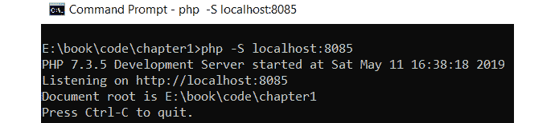

    图 1.17：启动服务器

1.  在 Web 服务器启动并运行后，打开 PHP 页面，并在浏览器中的 URL 后附加您的查询字符串：

    `http://localhost:8085/movies.php?movieName=Avengers&movieStar=IronMan&movieYear=2019`

    你可以将值更改为任何你喜欢的，以查看它们在浏览器中的显示方式。

    你应该看到以下屏幕：


图 1.18：打印电影信息

注意

确保您指定的端口没有被系统上的其他应用程序使用。

根据最后的几个练习，你现在应该知道这段代码是如何工作的。让我们来分析一下查询字符串和代码。

这次查询字符串是`movieName=Avengers&movieStar=IronMan&movieYear=2019`。这意味着 PHP 中的`$_GET`变量现在可以访问三个不同的变量，分别是`movieName`、`movieStar`和`movieYear`。

在前三行代码中，我们正在提取`movieName`、`movieStar`和`movieYear`的值，并将它们分别赋值给`$name`、`$star`和`$year`变量。

在 HTML 的头部部分，我们有一个标题。在其中，我们使用了`echo`语句来打印电影名称，它将在浏览器中显示。进一步向下，我们有一个`h1`元素，我们在其中再次打印名称。在`h1`元素之后是一个`p`元素，我们在其中创建一个动态句子。我们使用了变量和点操作符（`.`）来附加不同的字符串和变量，以创建完整的句子。

# 2. 类型与运算符

## 活动 2.1：打印用户的 BMI

**解决方案**

1.  创建一个名为`tracker.php`的新文件。然后，在 PHP 中创建一个变量来存储名称。你可以直接赋值，也就是说，`$name = 'Joe'`：

    ```php
    <?php
    $name = 'Joe';
    ```

1.  添加体重和身高的变量；再次设置默认值：

    ```php
    $weightKg = 80;
    $heightCm = 180;
    ```

1.  将`$heightCm`变量除以`100`将其转换为米，并将结果存储：

    ```php
    $heightMeters = $heightCm/100;
    ```

1.  平方身高并存储结果：

    ```php
    $heightSquared = $heightMeters * $heightMeters;
    ```

1.  通过将体重除以身高的平方来计算 BMI：

    ```php
    $bmi = $weightKg / ($heightSquared);
    ```

1.  向用户显示一条消息，显示名称和 BMI 结果：

    ```php
    echo "<p>Hello $name, your BMI is $bmi</p>";
    ```

1.  打开终端/命令提示符，导航到你的`chapter2`文件夹或存储`tracker.php`的位置。通过输入以下命令来运行服务器：

    ```php
    php -S localhost:8085
    ```

    现在，在浏览器中，转到`http://localhost:8085/tracker.php`。

    你将看到以下输出：

    

图 2.11：打印 BMI

在这个活动中，我们学习了如何将数据赋值给变量并执行计算（除法和乘法）。然后，我们将最终结果打印到屏幕上。

# 3. 控制语句

## 活动三.1：创建一个按导演打印电影的列表脚本

**解决方案**

完成活动的步骤如下：

1.  创建一个`activity-movies.php`脚本，并添加以下嵌套数组，其中包含五个导演及其相关的五个电影列表：

    ```php
    <?php
    $directors = [
    "Steven Spielberg" => ["The Terminal", "Minority Report", "Catch Me If You Can", "Lincoln", "Bridge of Spies"],
    "Christopher Nolan" => ["Dunkirk", "Interstellar", "The Dark Knight Rises", "Inception", "Memento"],
    "Martin Scorsese" => ["Silence", "Hugo", "Shutter Island", "The Departed", "Gangs of New York"],
    "Spike Lee" => ["Do the Right Thing", "Malcolm X", "Summer of Sam", "25th Hour", "Inside Man"],
    "Lynne Ramsey" => ["Ratcatcher", "Swimmer", "Morvern Callar", "We Need To Talk About Kevin", "You Were Never Really Here"]
                     ];
    ```

    在这里，我们有一个关联数组`$directors`，它包含五个导演的姓名，每个导演都用作数组的键。此外，每个导演的键都分配了另一个关联数组，该数组包含五个电影名称。

1.  使用我们之前关于嵌套循环的知识，使用两个`foreach`循环遍历嵌套数组，如下所示。正如以下所示，在`$directors`数组之后添加循环：

    ```php
    foreach ($directors as $director => $movies) {
            echo "$director's movies: " . PHP_EOL;
            foreach ($movies as $movie) {
                    echo " > $movie " . PHP_EOL;
            }
    }
    ```

    在前面的例子中，我们有一个简单的嵌套数组的循环。由于`foreach`循环是遍历关联数组的良好选择，我们在内循环和外循环中都使用了`foreach`来打印格式化的导演姓名以及他们执导的电影，每行一个。

1.  使用以下命令从终端或控制台运行 PHP 文件：

    ```php
    php activity-movies.php
    ```

    前面的命令输出了以下内容：

    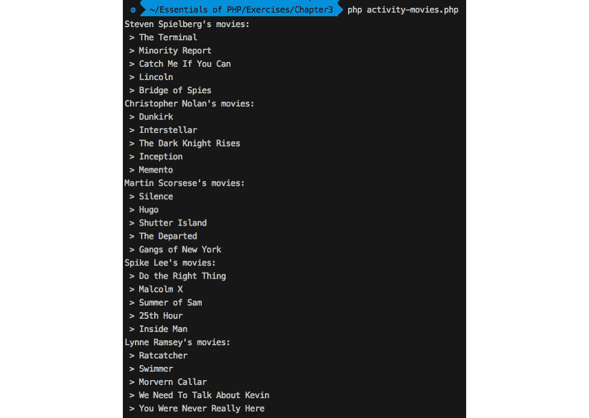

    图 3.21：使用默认参数的活动电影脚本输出

    嵌套的`foreach`循环完成了它们的工作，遍历嵌套数组以打印导演名称对应的可用电影名称。

1.  现在，是时候给我们的循环技术添加一些动态行为，以便我们可以通过命令行参数控制两个循环的迭代次数。这意味着我们将从命令行获取两个参数，如下所示：

    ```php
    php activity_movies.php 3 2
    ```

    在这里，脚本名称本身是`php`命令的一个参数，因此，第一个、第二个和第三个参数分别是`activity-movies.php`、`3`和`2`。第二个参数应该控制迭代的导演数量，第三个参数应该控制迭代的电影数量。

    可以使用系统变量`$argv`获取命令行参数，因此我们将使用`$argv[1]`和`$argv[2]`作为第二个和第三个参数。请注意，在这种情况下`$argv[0]`是脚本名称。

1.  在脚本的开头添加以下行以添加命令行参数：

    ```php
    <?php
    $directorsLimit = $argv[1] ?? 5;
    $moviesLimit = $argv[2] ?? 5;
    ```

1.  这里使用了`??`，空合并运算符，以便如果`$argv[1]`或`$argv[2]`不存在或为`NULL`，则可以将默认数字 5 分配给`$directorsLimit`和`$moviesLimit`限制变量。

1.  现在我们需要添加两个计数器，用于计算要打印的导演和电影数量，以便我们可以维护以命令行参数形式提供的导演和电影数量。让我们添加计数器和控制语句，以便嵌套循环看起来如下：

    ```php
    $directorsCounter = 1;
    foreach ($directors as $director => $movies) {
            if ($directorsCounter > $directorsLimit) {
                    break;
            }
            echo "$director's movies: " . PHP_EOL;
            $moviesCounter = 1;
            foreach ($movies as $movie) {
                    if ($moviesCounter > $moviesLimit) {
                            break;
                    }
                    echo " > $movie " . PHP_EOL;
                    $moviesCounter++;
            }
            $directorsCounter++;
    }
    ```

    在这里，我们在外循环之前添加了`$directorsCounter`，在内循环之前添加了`$moviesCounter`。它们都从`1`开始计数，并在循环内部立即检查导演或电影是否超过了`$directorsLimit`和`$moviesLimit`分别给出的限制。如果任何一个计数器超过了其限制，我们将使用`break`命令终止迭代。

    在每个循环的开始，我们使用`if`控制中的条件表达式检查计数器是否不超过限制，并且在每个循环的末尾，相应的计数器会递增。

    注意

    最终文件可以参考：[`packt.live/35QfYnp`](https://packt.live/35QfYnp)。

1.  现在运行以下命令以查看`directors`和`movies`参数的实际效果：

    ```php
    php activity_movies.php 2 1
    ```

    前面的命令应该打印出两位导演各自的一部电影，如下所示：

    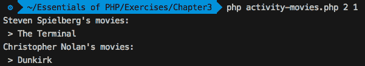

    ](img/C14196_03_23.jpg)

    图 3.22：带有自定义参数的活动电影脚本输出

1.  使用不同的参数测试前面的脚本；即`php activity-movies.php 2 3`。因为我们已经将默认限制值分配给限制变量，如果没有命令中的参数；即`php activity-movies.php`，它将完成所有迭代以循环遍历数组元素。

1.  我们也可以尝试只传递`directors`限制参数，这样`movies`限制就保持在默认的 5 个限制。以下命令将输出给定数量导演的所有电影：

    ```php
    php activity-movies.php 2
    ```

    输出如下：

    

    ](img/C14196_03_23.jpg)

图 3.23：带有第一个参数的活动电影脚本输出

恭喜！你已经使用了控制语句和循环技术来创建一个基于命令行参数的动态脚本。*控制结构用于控制程序的执行*，因此我们可以利用这样的结构来做出决定，比如执行哪个代码分支，执行重复执行，控制迭代流程等等。

# 4. 函数

## 活动 4.1：创建计算器

**解决方案**

1.  在`Chapter04`目录内创建一个名为`activity.php`的新文件。

1.  以 PHP 开头标签开始你的脚本，并将严格类型设置为`1`：

    ```php
    <?php
    declare(strict_types=1);
    ```

1.  现在，我们可以开始在这个文件中编写我们的`factorial`函数：

    ```php
    activity.php
    13 function factorial(int $number): float
    14 {
    15     $factorial = $number;
    16     while ($number > 2) {
    17         $number--;
    18         $factorial *= $number;
    19     }
    20     return $factorial;
    21 }
    https://packt.live/31nkK8E
    ```

    让我来解释这个函数的作用。首先，它接受一个整数参数；我们可以确信它始终是一个整数，因为我们添加了类型提示并声明了我们在使用严格类型。你可以用几种方式实现这个函数，所以不要让我的解决方案让你感到沮丧。

    我对它的看法是，计算中的第一个数字必须是输入数字——我们将其存储在`$factorial`中，这是我们用来保存结果的变量。然后，它乘以`$number - 1`。这个过程一直持续到`$number === 2`；当`$number`变成`3`时，`while`条件将最后一次运行；然后它将减去`1`并与`$factorial`变量相乘。最终，`$factorial`包含结果并从函数中返回。

    与使用后递减运算符`$number--;`相比，我们可以写成`$number = $number -1;`。有些人认为后者是一种更好的实践，因为它更明确。我有时更喜欢使用 PHP 提供的便捷快捷方式。因为`$number--`是一个单独的语句，我们也可以写成`--$number`。在这种情况下，两者没有区别。

    两个运算符之间的区别在于，使用`--$number`时，`$number`将在语句运行之前递减，而使用`$number--`时，它将在语句评估之后递减。在这种情况下，这种差异没有后果。

1.  接下来，我们将定义`sum`函数如下：

    ```php
    /**
     * Return the sum of its inputs. Give as many inputs as you like.
     *
     * @return float
     */
    function sum(): float
    {
        return array_sum(func_get_args());
    }
    ```

    虽然我们可以直接循环遍历`func_get_args();`并将所有数字相加得到总和，但 PHP 中已经有一个内置函数可以做到这一点。所以，为什么不使用它呢？这就是`array_sum`的作用：它将你给出的输入数组中的所有数字相加。`return`关键字使函数返回结果。

    如果你想要验证每个参数以检查它是否为数字（使用`is_numeric`），那么循环遍历参数会更好，因为你在相同的迭代中执行检查，并在参数不是数字时抛出异常。

1.  我们将要定义的最后一个数学函数是`prime`函数：

    ```php
    activity.php
    41 function prime(int $number): bool
    42 {
    43     // everything equal or smaller than 2 is not a prime number
    44     if (2 >= $number) {
    45         return false;
    46     }
    47     for ($i = 2; $i <= sqrt($number); $i++) {
    48         if ($number % $i === 0) {
    49             return false;
    50         }
    51     }
    52     return true;
    53 }
    https://packt.live/2OYdEox
    ```

    `prime`函数无疑是所有函数中最具挑战性的。直观的实现只是尝试确定`$number`输入与所有较小值的模：当模为`0`时，它不是素数。然而，已经证明你只需要检查输入的平方根以下的数字。实际上，你可以检查更少的数字，但我们还没有做到这一点。

    现在我们知道 1 不是一个质数，所以如果传入的数字是 1，我们就提前返回`false`。这也排除了 0 和负数。根据定义，质数是正数。然后，从 2 开始，直到`$number`的平方根，我们每次将`$i`增加 1，并检查`$number`除以`$i`的余数是否为 0。如果是，`$number`不是质数，我们再次提前返回`false`。模运算符写作`%`（百分比符号）。换句话说，当`$number`对`$i`取模等于 0 时，`$number`可以被`$i`整除，并且由于`$i`不等于 1 也不等于`$number`，所以`$number`不是质数。

1.  我们将要定义的最后一个主要函数是`performOperation`函数：

    ```php
    activity.php
    59 function performOperation(string $operation)
    60 {
    61     switch ($operation) {
    62         case 'factorial':
    63             // get the second parameter, it must be an int.
    64             // we will cast it to int to be sure
    65             $number = (int) func_get_arg(1);
    66             return factorial($number);
    67         case 'sum':
    68             // get all parameters
    69             $params = func_get_args();
    70             // remove the first parameter, because it is the operation
    71             array_shift($params);
    72             return call_user_func_array('sum', $params);
    73         case 'prime':
    74             $number = (int) func_get_arg(1);
    75             return prime($number);
    76     }
    77 }
    https://packt.live/31s2YB2
    ```

    这个函数只是根据你作为其第一个参数给出的`$operation`情况在三个其他函数之间切换。由于它委托工作的其中一个函数接受可变数量的参数，`performOperation`也必须接受可变数量的参数。

    你也可以选择一个实现，让`performOperation`有一个名为`$number`的第二个参数，然后可以将其原样传递给阶乘和质数。在这种情况下，你只有在`sum`操作的情况下查询`func_get_args`。你选择的方法不仅是一个口味问题，也是一个性能问题。不使用`func_get_args()`会更快，所以替代方法肯定是最快的。

1.  按以下方式打印输出：

    ```php
    echo performOperation("factorial", 3) . PHP_EOL;
    echo performOperation('sum', 2, 2, 2) . PHP_EOL;
    echo (performOperation('prime', 3)) ? "The number you entered was prime."   . PHP_EOL : "The number you entered was not prime." . PHP_EOL;
    ```

    这里是输出：

    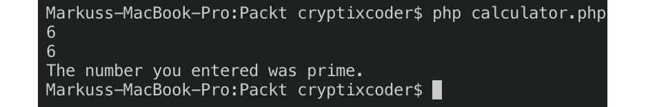

图 4.18：打印结果

# 5. 面向对象编程

## 活动 5.1：构建学生和教授对象关系

**解决方案**

完成活动的步骤如下：

1.  创建一个名为`activity1`的目录，将所有活动内容放入其中。这应该是我们的工作目录（你可以使用`cd`命令进入该目录）。

1.  在`activity1`目录下创建一个名为`Student`的目录，将命名空间为`Student`的类放入其中。

1.  在`Student`目录下创建一个名为`Student.php`的 PHP 文件。

1.  声明一个`Student`类，其中`Student`类已经被命名空间为`Student`，并且有两个成员属性，`$name`和`$title`，默认为`student`。构造函数接受学生的名字作为参数。参数通过其期望的类型`string`（任何非字符串都会产生错误）进行提示，并使用`$this->name`将其分配给`$name`属性。所以，每次我们实例化`Student`类时，我们应该通过其命名空间调用类，例如新的`Student\Student('Student Name')`命名空间：

    ```php
    <?php
    namespace Student;
    class Student
    {
        public $name;
        public $title = 'student';
        function __construct(string $name)
    {
            $this->name = $name;
        }
    }
    ```

1.  对于教授，在`activity1`目录下创建一个名为`Professor`的目录。

1.  在`Professor`目录下，创建一个名为`Professor.php`的 PHP 文件。

1.  在`Professor.php`中声明带有`Professor`命名空间的`Professor`类。`Professor`类与`Student`类类似，但有一个额外的私有属性`$students`，该属性将保存学生数组。`$students`数组被保留为私有，这样学生名单就不能在`Professor`类外部访问。教授的默认标题为`Prof.`，已在`$title`属性中分配。构造函数接受提示参数，一个名称（仅接受字符串）和学生（仅接受数组）列表作为两个参数，第一个参数`$name`已使用`$this->name`分配给`$name`属性。我们使用参数类型提示以确保不传递其他类型：

    ```php
    <?php
    namespace Professor;
    class Professor
    {
        public $name;
        public $title = 'Prof.';
        private $students = array();
        function __construct(string $name, array $students)
        {
            $this->name = $name;
        }
    }
    ```

1.  此外，我们将在`Professor`命名空间内使用`Student`类的实例，因此我们需要在`Professor.php`中通过`Student`命名空间导入`Student`类，如下所示：

    ```php
    <?php
    namespace Professor;
    use Student\Student;
    ```

    在这里，在`Professor`命名空间声明之后，我们通过`Student`命名空间导入了`Student`类，如下所示：

1.  我们需要遍历学生数组并检查每个对象——是否是`Student`类的实例。如果是有效的学生，则将其添加到教授的`$students`数组中。

    在`Professor`构造函数中添加以下对`$students`的过滤：

    ```php
        function __construct(string $name, array $students)
    {
            $this->name = $name;

            foreach ($students as $student) {
                if ($student instanceof Student) {
                    $this->students[] = $student;
                }
            }
        }
    ```

    在这里，我们使用`foreach`循环遍历`$students`，并在循环内部检查`$student`是否是`Student`类的实例，然后将其添加到`$this->students`数组中。因此，只有有效的学生才能被添加到教授的学生名单中。

1.  现在，在`Professor`类中添加以下 setter 方法以设置标题：

    ```php
        public function setTitle(string $title)
    {
            $this->title = $title;
        }
    ```

    此方法应用于设置教授的标题。如果教授是`Ph.D.`，则我们将标题设置为`Dr.`。

1.  在`Professor`类中创建一个成员方法`printStudents()`，如下所示，该方法将打印教授的标题、姓名、学生数量以及以下学生列表：

    ```php
        public function printStudents()
    {
            echo "$this->title $this->name's students (" .count($this-          >students). "): " . PHP_EOL;
            $serial = 1;
            foreach ($this->students as $student) {
                echo " $serial. $student->name " . PHP_EOL;
                $serial++;
            }
        }
    ```

    在这里，我们打印了教授的标题、姓名和学生的数量。同样，我们使用`foreach`循环遍历教授的私有属性`$students`，并在循环内部打印每个学生的姓名。此外，为了保持学生的序列顺序，我们使用了从`1`开始的`$serial`变量，每次迭代后增加一，以便在打印每个学生姓名前添加一个数字。

1.  在`activity1`目录内创建一个名为`activity-classes.php`的 PHP 文件。

1.  在文件开头添加`spl_autoload_register()`函数以自动根据它们的命名空间加载`Professor`和`Student`类：

    ```php
    <?php
    spl_autoload_register();
    ```

    在`spl_autoload_register()`函数中，我们尚未注册任何类加载方法；相反，我们保留为默认设置，根据它们的命名空间加载类。

1.  创建一个`Professor`实例，提供一个名称和一个包含`Student`实例的学生列表，如下所示：

    ```php
    $professor = new Professor\Professor('Charles Kingsfield', array(
                        new Student\Student('Elwin Ransom'),
                        new Student\Student('Maurice Phipps'),
                        new Student\Student('James Dunworthy'),
                        new Student\Student('Alecto Carrow')
                ));
    ```

    在这里，我们向数组中添加了随机数量的`Student`实例，并将它们传递给`Professor`构造函数。当我们以`new Professor\Professor()`的形式实例化`Professor`类时，这个命名空间类名告诉自动加载器从`Professor`目录加载`Professor`类。同样，这个命名空间类的加载技术也应用于`Student`类。新的`Student\Student()`命名空间告诉自动加载器在`Student`目录中期望`Student`类。

1.  现在，使用相应的 setter 方法将教授的头衔更改为`Dr.`，如下所示：

    ```php
    $professor->setTitle('Dr.');
    ```

1.  通过调用`printStudents()`方法并使用`Professor`对象来打印输出：

    ```php
    $professor->printStudents();
    ```

    最后，`activity-classes.php`看起来如下：

    ```php
    <?php
    spl_autoload_register();
    $professor = new Professor\Professor('Charles Kingsfield', array(
                        new Student\Student('Elwin Ransom'),
                        new Student\Student('Maurice Phipps'),
                        new Student\Student('James Dunworthy'),
                        new Student\Student('Alecto Carrow')
                ));
    $professor->setTitle('Dr.');
    $professor->printStudents(); 
    ```

1.  使用以下命令运行 PHP 脚本：

    ```php
    php activity-classes.php
    ```

    输出应该看起来像以下这样：

    ![图 5.30：教授的学生名单]

    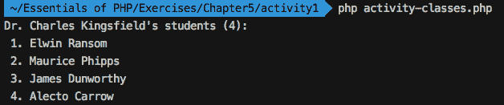

图 5.30：教授的学生名单

我们已经成功使用面向对象技术获取了一位教授的学生名单。在这个活动中，我们练习了类属性、访问修饰符、方法、类声明、类命名空间、对象实例化、自动加载命名空间类、参数中的类型提示以及使用`instanceof`的对象过滤等。

# 6. 使用 HTTP

## 活动练习 6.1：创建一个支持联系表单

**解决方案**

1.  首先跳出的就是登录处理的不同之处，因为我们现在需要验证随机用户，而不仅仅是单个用户。因此，我们需要一个方法来获取正在登录的用户名对应的数据。该方法将为现有用户返回用户数据（使用`level`和`password`散列），如果用户未找到，则返回`NULL`。由于我们将在下一章学习数据库，我们将以与之前练习相同的方式在代码中存储可用的用户列表：

    ```php
    Login.php
    37 private function getUserData(string $username): ?array
    38 {
    39     $users = [
    40         'vip' => [
    41             'level' => 'VIP',
    42             'password' => '$2y$10$JmCj4KVnBizmy6WS3I/bXuYM/yEI3dRg/IYkGdqHrBlOu4FKOliMa'                  // "vip" password hash
    43         ],
    https://packt.live/2VWoRqU
    ```

1.  然后，`\Handlers\Login::handle()`方法将稍微改变验证认证和用户会话中存储数据的方式。首先，如果我们为提供的用户名获取了用户数据，这意味着我们有一个有效的用户来自我们的*数据库*，我们可以继续下一步。密码匹配按常规进行，如果匹配成功，则我们可以通过在会话中添加用户名和用户数据来继续。在发生任何失败（如从*数据库*中获取用户或密码匹配失败）的情况下，我们应该准备将在 HTML 表单中显示的错误：

    ```php
    $username = 'admin';
    $passwordHash = '$2y$10$Y09UvSz2tQCw/454Mcuzzuo8ARAjzAGGf8OPGeBloO7j47Fb2v.  lu'; // "admin" password hash
    $formError = [];
    $userData = $this->getUserData($formUsername);
    if (!$userData) {
        $formError = ['username' => sprintf('The username [%s] was not       found.', $formUsername)];
    } elseif (!password_verify($formPassword, $userData['password'])) {
        $formError = ['password' => 'The provided password is invalid.'];
    } else {
        $_SESSION['username'] = $formUsername;
        $_SESSION['userdata'] = $userData;
        $this->requestRedirect('/profile');
        return '';
    }
    ```

    注意

    为了方便起见，使用命令行`using php -r "echo password_hash('admin', PASSWORD_BCRYPT);"`命令生成密码散列

1.  登录表单不需要任何更改；我们只需在`Authenticate`表单标题下删除`admin`用户的凭据提示：

    ```php
    <div class="text-center mb-4">
        <h1 class="h3 mb-3 mt-5 font-weight-normal">Authenticate</h1>
    </div>
    ```

1.  现在认证部分已经处理完毕。用户登录后将被重定向到`Profile`页面，因此他们将看到之前展示的布局。

    `src/templates/profile.php`文件需要从头开始重建。首先，让我们添加问候语和注销按钮部分。在浏览 Bootstrap 框架文档时，我们发现了警报组件，并看到我们可以使用此组件来完成当前目的：

    ```php
    <div class="row">
        <div class="my-5 alert alert-secondary w-100">
            <h3>Welcome, <?= $username ?>!</h3>
            <p class="mb-0"><a href="/logout">Logout</a></p>
        </div>
    </div>
    ```

1.  接下来，我们需要添加支持区域，并将其水平分为两个相等的部分：

    ```php
    <div class="row">
        <div class="col-sm-6">...</div>
        <div class="col-sm-6">...</div>
    </div>
    ```

    注意

    要了解更多关于 Bootstrap 中网格系统的信息，请点击此链接：[`packt.live/31zF72E`](https://packt.live/31zF72E)。

1.  我们将使用以下规格的支持联系表单：两个文本输入框，用于姓名和电子邮件，以及一个文本区域输入框用于消息。每个输入都将有一个相关的`<label>`元素，如果有任何错误，它们将打印在包含错误数据的输入下方：

    ```php
    profile.php
    15 <div class="form-label-group mb-3">
    16     <label for="name">Name:</label>
    17     <input type="text" name="name" id="name"
    18            class="form-control <?= isset($formErrors['name']) ?                 'is-invalid' : ''; ?>"
    19            value="<?= htmlentities($_POST['name'] ?? ''); ?>">
    20     <?php if (isset($formErrors['name'])) {
    21         echo sprintf('<div class="invalid-feedback">%s</div>',              htmlentities($formErrors['name']));
    22     } ?>
    23 </div>
    https://packt.live/33NQZ2b
    ```

1.  由于标准级别用户每天只能发送一次表单，尝试发送更多消息应该会显示错误消息，我们可以将其分配给表单级别，并直接在表单顶部显示。此外，我们还可以再次使用警报组件，这次使用`danger`红色背景：

    ```php
    <?php if (isset($formErrors['form'])) { ?>
        <div class="alert alert-danger"><?= $formErrors['form']; ?></div>
    <?php } ?>
    ```

1.  我们还需要为了安全起见，将 CSRF 令牌添加到表单中：

    ```php
    <input type="hidden" name="csrf-token" value="<?= $formCsrfToken ?>">
    ```

1.  在提交按钮上，我们可能想要添加更多表单数据，这样我们就可以确定在 PHP 脚本中处理哪个表单；当单个 HTML 页面上添加多个表单且每个表单都向同一 URL 发送数据时，这非常有用：

    ```php
    <button type="submit" name="do" value="get-support" class="btn btn-lg   btn-primary">Send</button>
    ```

1.  对于消息列表历史，我们可以选择`card`组件，并打印每条消息的详细信息。每个历史条目将包含表单数据（即`form`键）和表单发送的时间（即`timeAdded`键）：

    ```php
    <?php foreach ($sentForms as $item) { ?>
        <div class="card mb-2">
            <div class="card-body">
                <h5 class="card-text"><?= htmlentities($item['form']              ['message']) ?></h5>
                <h6 class="card-subtitle mb-2 text-muted">
                    <strong>Added:</strong> <?=                   htmlentities($item['timeAdded']) ?></h6>
                <h6 class="card-subtitle mb-2 text-muted">
                    <strong>Reply-to:</strong> <?= sprintf('%s &lt;%s&gt;',                   htmlentities($item['form']['name']),                   htmlentities($item['form']['email'])) ?>
                </h6>
            </div>
        </div>
    <?php } ?>
    ```

    注意

    在`profile.php`中的完整代码可以参考：[`packt.live/2pvh0or`](https://packt.live/2pvh0or)。

1.  现在我们已经准备好了布局，接下来让我们进入`\Handlers\Profile`处理器中的处理部分。首先，我们需要添加的是在`POST`请求情况下的处理表单。如果表单验证失败，`processContactForm()`将返回一个错误数组：

    ```php
    $formErrors = $this->processContactForm($_POST);
    ```

1.  如果没有返回错误，这意味着表单已验证并成功保存；因此，我们可以刷新页面。

    ```php
    if (!count($formErrors)) {
        $this->requestRefresh();
        return '';
    }
    ```

1.  在模板中我们需要发送的数据是用户名（即问候语）；如果有，表单错误；表单 CSRF 令牌；以及发送的表单的历史记录：

    ```php
    return (new \Components\Template('profile'))->render([
        'username' => $_SESSION['username'],
        'formErrors' => $formErrors ?? null,
        'sentForms' => $_SESSION['sentForms'] ?? [],
        'formCsrfToken' => $this->getCsrfToken(),
    ]);
    ```

1.  到目前为止，我们已经提到了三个尚不存在的方法。让我们逐一解决它们，首先是`getCsrfToken()`方法。此方法将返回存储在用户会话中的 CSRF 令牌，如果不存在，则创建并设置一个。为了生成令牌字符串，我们可以使用与*练习 6.9*中相同的方法，*防止 CSRF 攻击*：

    ```php
    private function getCsrfToken(): string
    {
        if (!isset($_SESSION['csrf-token'])) {
            $_SESSION['csrf-token'] = bin2hex(random_bytes(32));
        }
        return $_SESSION['csrf-token'];
    }
    ```

1.  `processContactForm()`方法返回表单错误列表，因此它必须首先验证数据。对`validateForm()`方法的调用应返回带有清理数据的表单以及错误列表（如果有）：

    ```php
    list($form, $errors) = $this->validateForm($data);
    ```

1.  如果`$errors`数组为空，则保存经过清理的表单数据，并附加额外信息，例如添加的时间和日期（这对于检查标准级别用户是否已经在当天添加了一条消息很有用）。由于数据持久性将在下一章中探讨，我们将使用我们已有的方法来存储数据，在这种情况下，我们将使用临时会话存储。表单将存储在`sentForms`键下；因此，`$_SESSION['sentForms']`成为已发送表单的历史记录：

    ```php
    $_SESSION['sentForms'][] = [
        'dateAdded' => date('Y-m-d'),
        'timeAdded' => date(DATE_COOKIE),
        'form' => $form,
    ];
    ```

1.  `validateForm()`方法将首先检查 CSRF 令牌：

    ```php
    if (!isset($data['csrf-token']) || $data['csrf-token'] !==   $this->getCsrfToken()) {
        $errors['form'] = 'Invalid token, please refresh the page and try       again.';
    }
    ```

1.  然后，我们检查标准级别用户的多重提交：

    ```php
    if (($_SESSION['userdata']['level'] === 'STANDARD')
        && $this->hasSentFormToday($_SESSION['sentForms'] ?? [])
    ) {
        $errors['form'] = 'You are only allowed to send one form per day.';
    }
    ```

1.  名称验证需要非空输入如下：

    ```php
    $name = trim($data['name'] ?? '');
    if (empty($name)) {
        $errors['name'] = 'The name cannot be empty.';
    }
    ```

1.  使用`filter_var()`函数和`FILTER_VALIDATE_EMAIL`验证执行电子邮件验证：

    ```php
    if (empty($data['email'] ?? '')) {
        $errors['email'] = 'The email cannot be empty.';
    } elseif (!filter_var($data['email'], FILTER_VALIDATE_EMAIL)) {
        $errors['email'] = 'The email address is invalid.';
    }
    ```

1.  消息验证需要至少 40 个字符长度的消息：

    ```php
    $message = trim($data['message'] ?? '');
    if (!$message) {
        $errors['message'] = 'The message cannot be empty.';
    }
    if (strlen($message) <= 40) {
        $errors['message'] = 'The message is too short.';
    }
    ```

1.  清理后的表单数据被收集并存储在`$form`变量中，然后与预期的`$errors`变量一起返回：

    ```php
    $form = [
        'name' => $name,
        'email' => $data['email'],
        'message' => $message,
    ];
    return [$form, $errors];
    ```

1.  我们引用了另一个方法：`hasSentFormToday()`。此方法需要表单历史记录作为第一个参数，它所做的是遍历历史记录并检查是否在当天注册了消息。一旦找到一条消息，它将立即返回`TRUE`：

    ```php
    private function hasSentFormToday(array $sentForms): bool
    {
        $today = date('Y-m-d');
        foreach ($sentForms as $sentForm) {
            if ($sentForm['dateAdded'] === $today) {
                return true;
            }
        }
        return false;
    }
    ```

1.  我们还没有介绍的是`requestRefresh()`方法。此方法将调用`requestRedirect()`方法，并提供当前请求 URI：

    ```php
    private function requestRefresh()
    {
        $this->requestRedirect($_SERVER['REQUEST_URI']);
    }
    ```

    注意

    处理器 Profile.php 中的最终代码可以参考：[`packt.live/2VREaRY`](https://packt.live/2VREaRY)。

1.  现在，我们可以测试我们的完整实现。访问`http://127.0.0.1:8080/profile`的个人资料页面：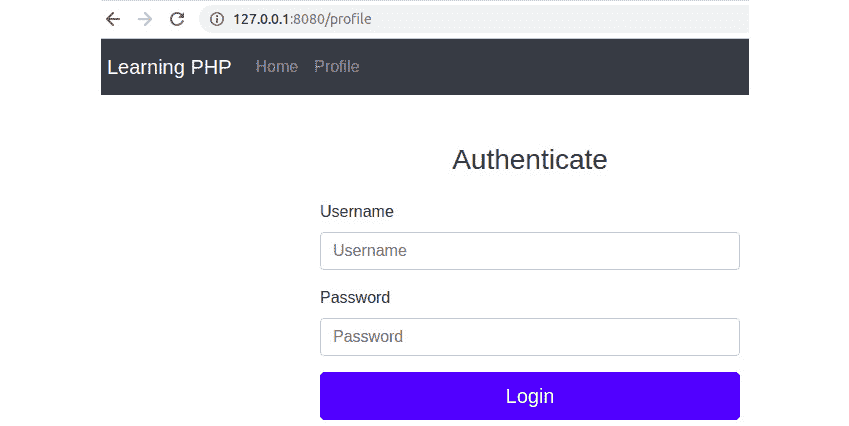

    图 6.42：个人资料页面的认证

1.  让我们以标准级别用户身份登录，为`Username`和`Password`都输入`user`：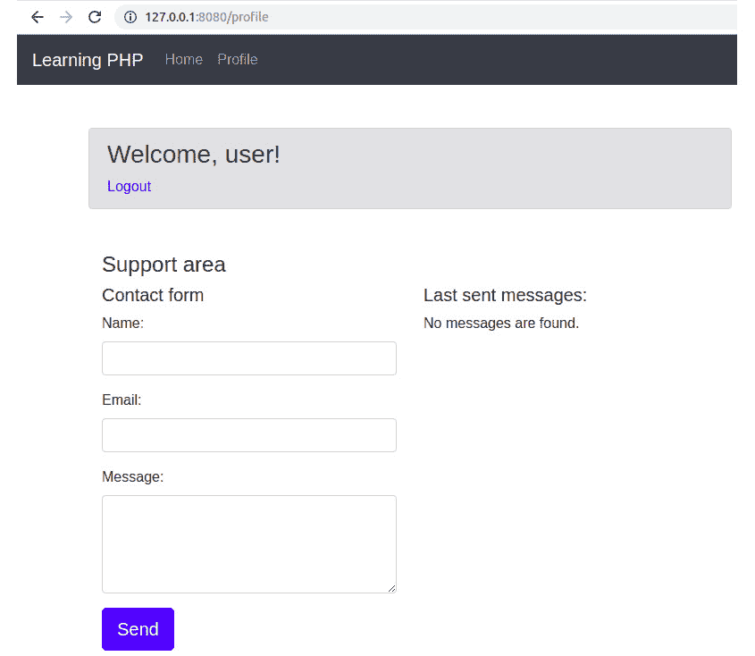

    图 6.43：登录页面

    我们被重定向到个人资料页面，并可以看到我们迄今为止所工作的 HTML 元素。

1.  通过发送一个空表单，我们应该得到所有带有错误标记的输入：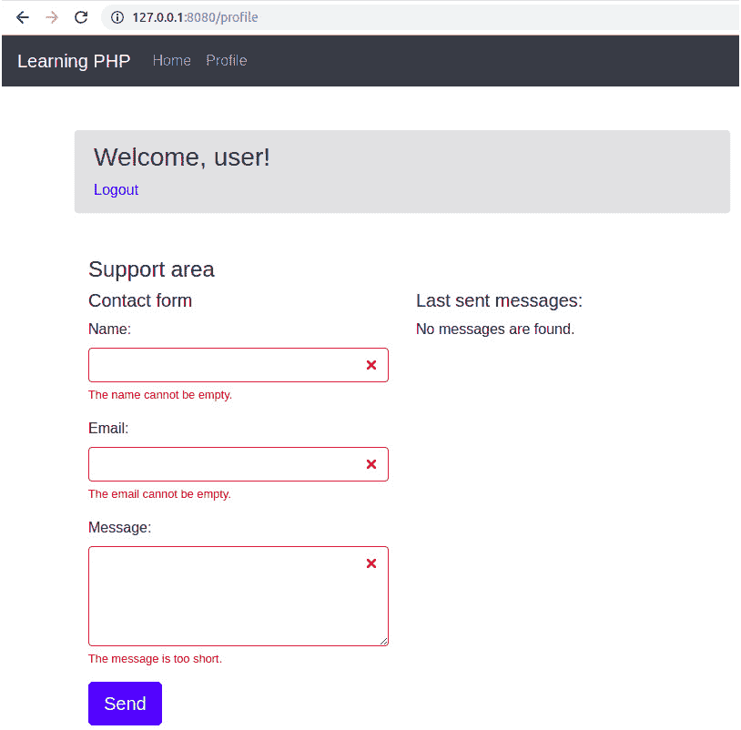

    图 6.44：发送空表单

1.  通过为`Username`和`Password`都输入`invalid@email`，以及一个简短的句子作为消息，我们应该得到另一个错误，例如`电子邮件地址无效`或`消息太短`：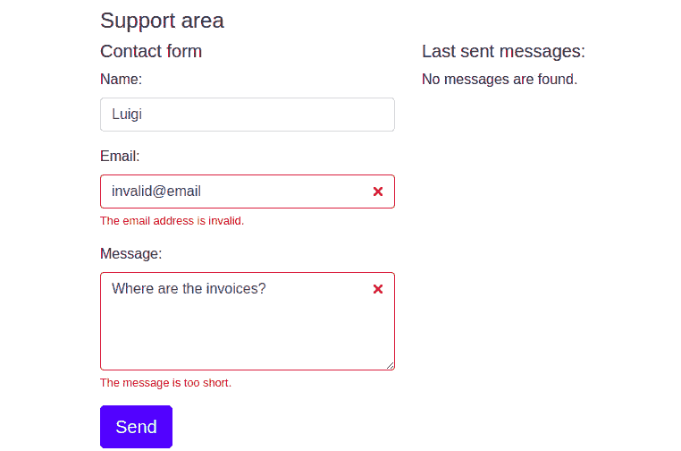

    图 6.45：无效输入的消息

1.  发送有效数据应导致成功保存表单操作，并在发送消息列表中进行列出：

    你可以尝试以下数据：

    姓名：Luigi

    电子邮件：`luigi@marionbros.mb`

    消息：`我希望能够上传个人头像。您考虑添加这个功能吗？`

    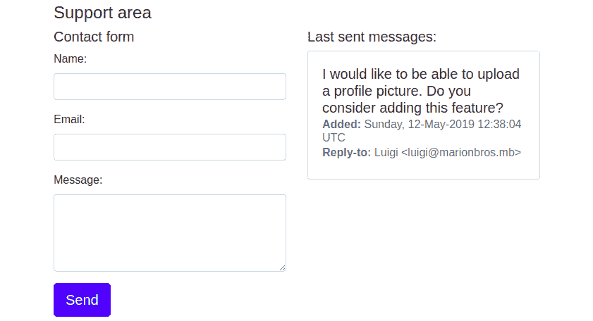

    图 4.46：显示已发送消息的列表

1.  尝试在同一天发布更多消息将导致错误：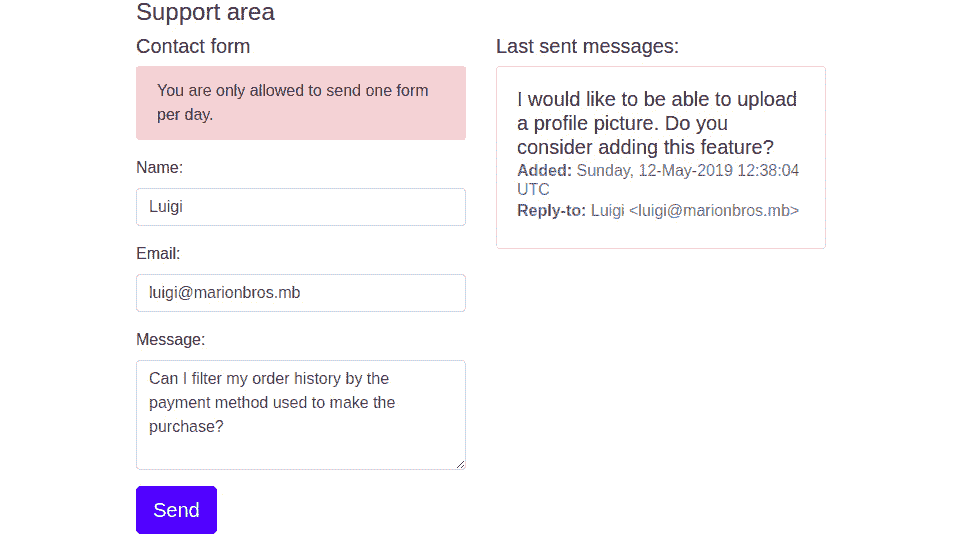

    图 6.47：发布更多消息导致错误

1.  让我们注销（为此，点击问候头部的`注销`按钮）并以 VIP 级用户身份登录，使用`vip`作为`用户名`和`密码`：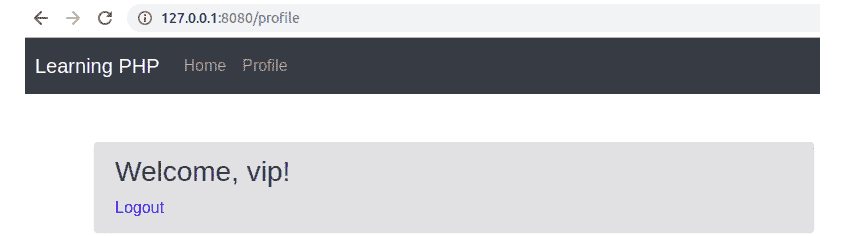

    图 6.48：VIP 用户的欢迎消息

1.  让我们添加第一条消息：

    姓名：马里奥

    电子邮件：`mario@marionbros.mb`

    消息：`我希望能够上传个人头像。您考虑添加这个功能吗？`

    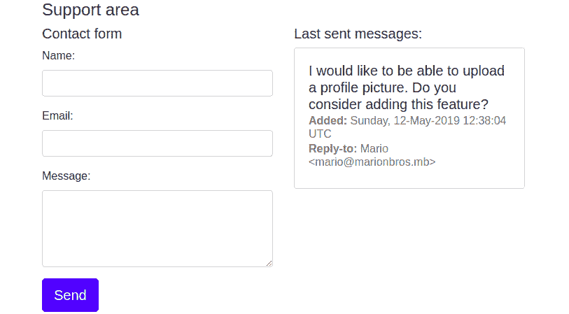

    图 6.49：添加第一条消息

    如预期的那样，看起来不错。

1.  现在，让我们尝试添加另一条消息；这次，我们应该能够无限制地添加消息：

    姓名：马里奥

    电子邮件：`mario@marionbros.mb`

    消息：`我能否通过购买时使用的支付方式来过滤我的订单历史？`

    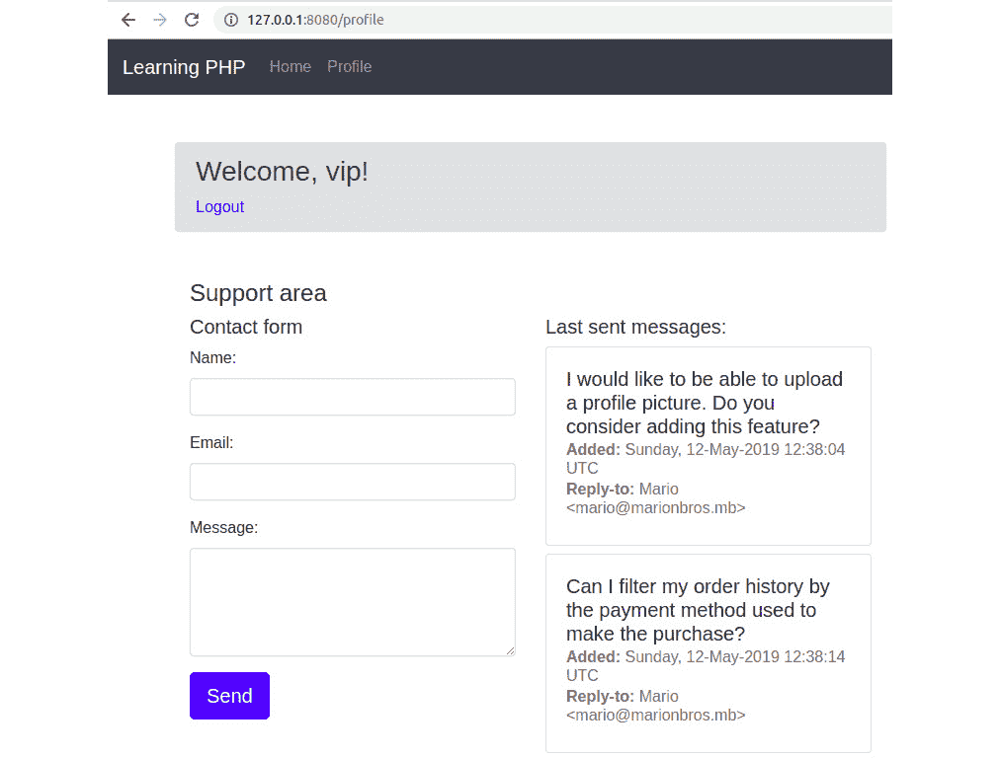

图 6.50：无限制添加消息的输出

如您所见，我们成功添加了另一个条目，正如预期的那样。

# 7. 数据持久性

## 活动 7.1：联系管理应用程序

**解决方案**

让我们讨论新或更改的项目，从最解耦的到最复杂的。

这里一个好的开始是`User`模型类，因为这个类将在每个页面上为认证用户调用；让我们把这个文件放在`src/models/`目录里：

1.  创建`src/models/User.php`文件并添加以下内容。

1.  在声明命名空间和导入（`use`关键字）之后，我们定义`User`类的属性，给定的名称类似于数据库中`users`表的列名：

    ```php
    <?php 
    declare(strict_types=1);
    namespace Models;
    use DateTime;
    class User
    {
        /** @var int */
        private $id;
        /** @var string */
        private $username;
        /** @var string */
        private $password;
        /** @var DateTime */
        private $signupTime;
    ```

1.  添加构造函数，该函数需要一个表示`users`表记录的输入数组，并且对于每个类字段，从输入数组中获取适当的值；还要添加 getter 方法：

    ```php
    User.php
    21     public function __construct(array $input)
    22     {
    23         $this->id = (int)($input['id'] ?? 0);
    24         $this->username = (string)($input['username'] ?? '');
    25         $this->password = (string)($input['password'] ?? '');
    26         $this->signupTime = new DateTime($input['signup_time'] ?? 'now',              new \DateTimeZone('UTC'));
    27     }
    28 
    29     public function getId(): int
    30     {
    31         return $this->id;
    32     }
    https://packt.live/2Br0x7k
    ```

1.  最后，添加一个执行密码匹配的方法，需要原始输入值（与登录表单一起提交的值）：

    ```php
        public function passwordMatches(string $formPassword): bool
        {
            return password_verify($formPassword, $this->password);
        }
    }
    ```

    这个类旨在表示`users`表中的数据库记录。`constructor`函数将确保每个字段都会得到其自己的数据类型。以下方法是简单的 getter，而最后一个方法`Users::passwordMatches()`是验证登录时输入密码的便捷方式。

    由于`User`实体与认证机制紧密相关，让我们看看`Auth`组件会是什么样子。

1.  创建`src/components/Auth.php`文件。

1.  声明命名空间、导入，并在 `Auth` 类中添加返回当前会话信息的 `userIsAuthenticated()` 和 `getLastLogin()` 方法。在 `src/components/Auth.php` 文件中添加以下内容：

    ```php
    <?php declare(strict_types=1);
    namespace Components;
    use DateTime;
    use Models\User;
    class Auth
    {
        public static function userIsAuthenticated(): bool
        {
            return isset($_SESSION['userid']);
        }
        public static function getLastLogin(): DateTime
        {
            return DateTime::createFromFormat('U',           (string)($_SESSION['loginTime'] ?? ''));
        }
    ```

1.  添加在用户认证时返回 `User` 实例的方法：

    ```php
        public static function getUser(): ?User
        {
            if (self::userIsAuthenticated()) {
                return Database::getUserById((int)$_SESSION['userid']);
            }
            return null;
        }
    ```

1.  添加通过认证或注销用户来修改会话状态的方法：

    ```php
        public static function authenticate(int $id)
        {
            $_SESSION['userid'] = $id;
            $_SESSION['loginTime'] = time();
        }
        public static function logout()
        {
            if (session_status() === PHP_SESSION_ACTIVE) {
                session_regenerate_id(true);
                session_destroy();
            }
        }
    }
    ```

1.  创建 `src/components/Database.php` 文件并添加以下内容。

1.  添加通常的命名空间声明和导入：

    ```php
    <?php declare(strict_types=1);
    namespace Components;
    use Models\User;
    use PDO;
    use PDOStatement;
    ```

1.  定义 `Database` 类并添加 `construct` 方法。在 `construct` 方法中，你将实例化 `PDO` 对象，建立数据库连接。为了在 `Database` 类内部重用 `PDO` 对象，你将其设置为 `Database` 类的 `$pdo` 私有字段：

    ```php
    class Database
    {
        public $pdo;
        private function __construct()
        {
            $dsn = "mysql:host=mysql-host;port=3306;dbname=app;charset=utf           8mb4";
            $options = [
                PDO::ATTR_DEFAULT_FETCH_MODE => PDO::FETCH_ASSOC,
            ];
            $this->pdo = new PDO($dsn, "php-user", "php-pass", $options);
        }
    ```

1.  添加 `instance()` 方法，当调用此方法时返回相同的 `Database` 实例（单例模式）：

    ```php
    public static function instance()
        {
            static $instance;
            if (is_null($instance)) {
                $instance = new static();
            }
            return $instance;
        }
    ```

1.  接下来，让我们添加与 `users` 表相关的方 法，让我们从 `addUser()` 方法开始；此方法将需要用户名和原始密码作为输入参数，返回值将是 `PDOStatement` 实例。对于所有涉及用户输入数据的查询，都将使用预处理语句：

    ```php
    public function addUser(string $username, string $password): PDOStatement
        {
            $stmt = $this->pdo->prepare("INSERT INTO users ('username',           'password') values (:user, :pass)");
            $stmt->execute([
                ':user' => $username,
                ':pass' => password_hash($password, PASSWORD_BCRYPT),
            ]);
            return $stmt;
        }
    ```

    注意

    在这种情况下，建议返回 `PDOStatement` 实例，而不是布尔值 `true`/`false`，因为前者在操作失败时可以提供更多信息（例如，`PDOStatement::errorInfo()`）。

1.  添加查询数据库中用户的两个方法——`getUserByUsername()` 和 `getUserById()` 方法。正如它们的名称所暗示的，一个方法需要一个用户名，另一个需要一个数值 ID。当查询的记录存在时，这两个方法都将返回 `User` 实例，否则返回 `null`：

    ```php
    Database.php
    41     public function getUserByUsername(string $formUsername): ?User
    42     {
    43         $stmt = $this->pdo->prepare("SELECT * FROM users WHERE username =              :username");
    44         if ($stmt->execute([':username' => $formUsername]) && ($data =              $stmt->fetch(PDO::FETCH_ASSOC))) {
    45             return new User($data);
    46         }
    47         return null;
    48     }
    https://packt.live/2pz4AMh
    ```

    注意到 `if (stmt->execute() && ($data = $stmt->fetch(PDO::FETCH_ASSOC))) { /* ... */ }` 这个表达式。这是一个执行评估-赋值-评估类型操作的组合表达式，并且与以下表达式相同：

    ```php
    if (stmt->execute()) { // evaluation
      $data = $stmt->fetch(PDO::FETCH_ASSOC); // assignment
      if ($data) { // evaluation
       /* ... */
     }
    }
    ```

    虽然后者块可能看起来更易读，特别是对于初学者开发者来说，但前者表达式可能看起来更简洁，特别是对于经验丰富的开发者。两种方法都是有效的，最终，这取决于主观偏好。

1.  我们已经完成了 `users` 表的处理；现在，让我们添加一些与联系人表相关的查询。添加 `getOwnContacts()` 方法，该方法需要提供要检索联系人列表的用户 ID。在这种情况下，也会返回 `PDOStatement` 实例，就像在更改数据库状态（`INSERT`/`UPDATE`/`DELETE`）的查询中一样。这种方法更受欢迎，因为它在从 `PDOStatement` 返回数据时提供了更大的灵活性——可以作为关联数组、作为类的实例等。此外，在处理大型结果集时，它有助于避免因内存耗尽而导致的高内存使用或脚本失败。逐个迭代大型结果集、加载并丢弃记录，这种方法比将整个结果集加载到内存中更节省内存：

    ```php
        public function getOwnContacts(int $uid): PDOStatement
        {
            $stmt = $this->pdo->prepare("SELECT * FROM contacts WHERE user_id           = :uid");
            $stmt->bindParam(':uid', $uid, PDO::PARAM_INT);
            $stmt->execute();
            return $stmt;
        }
    ```

1.  添加 `getOwnContactById()` 方法，当需要从数据库中检索一条记录以填充编辑联系人表单时，此方法非常有用。此方法需要两个参数，即拥有联系人的用户 ID 和联系人 ID。如果找到记录，则返回关联数组，否则返回 `null`：

    ```php
        public function getOwnContactById(int $ownerId, int $contactId):       ?array
        {
            $stmt = $this->pdo->prepare("SELECT * FROM contacts WHERE           id = :cid and user_id = :uid");
            $stmt->bindParam(':cid', $contactId, PDO::PARAM_INT);
            $stmt->bindParam(':uid', $ownerId, PDO::PARAM_INT);
            if ($stmt->execute() && ($data = $stmt->fetch(PDO::FETCH_ASSOC)))
            {
                return $data;
            }
            return null;
        }
    ```

1.  添加 `addContact()` 方法。此方法需要为 `contacts` 表的每一列提供一个参数列表，除了 `id` 列，其值由 MySQL 生成。此方法将返回 `PDOStatement` 实例：

    ```php
    Database.php
    79    public function addContact(
    80         int $ownerId,
    81         string $name,
    82         string $email,
    83         string $phone,
    84         string $address
    85     ): PDOStatement
    86     {
    87         $stmt = $this->pdo->prepare("INSERT INTO contacts (user_id,           'name', phone, email, address) " .
    88             "VALUES (:uid, :name, :phone, :email, :address)");
    https://packt.live/31rQoll
    ```

1.  添加 `updateContact()` 方法。此方法与 `addContact()` 方法类似，但还需要提供联系人 ID，用于匹配要更新的记录，以及用户 ID。此方法将返回 `PDOStatement` 实例：

    ```php
    Database.php
    98     public function updateContact(
    99         int $contactId,
    100         int $ownerId,
    111         string $name,
    112         string $email,
    113         string $phone,
    114         string $address
    115     ): PDOStatement
    https://packt.live/31oY47W
    ```

1.  添加 `deleteOwnContactById()` 方法，需要提供拥有联系人的用户 ID 和联系人 ID。这两个输入参数将用于匹配要删除的记录。此方法将返回 `PDOStatement` 实例：

    ```php
        public function deleteOwnContactById(int $ownerId, int $contactId):       PDOStatement
        {
            $stmt = $this->pdo->prepare("DELETE FROM contacts WHERE id = :cid           and user_id = :uid");
            $stmt->bindParam(':cid', $contactId, PDO::PARAM_INT);
            $stmt->bindParam(':uid', $ownerId, PDO::PARAM_INT);
            $stmt->execute();
            return $stmt;
        }
    ```

1.  `Router` 组件（`src/components/Router.php` 文件）现在将覆盖 `/signup` 和 `/contacts` URI。高亮部分是新增内容：

    ```php
    Router.php
    1  <?php declare(strict_types=1);
    2 
    3  namespace Components;
    4 
    5  use Handlers\Contacts;
    6  use Handlers\Signup;
    7  use Handlers\Login;
    8  use Handlers\Logout;
    9  use Handlers\Profile;
    10 use Handlers\Signup;
    https://packt.live/2MTj4OR
    ```

1.  在 `'/'` 路由（主页）的情况下，会执行当前认证用户的检查，如果返回值为正，则请求重定向到 `/profile`。否则，直接返回 `home` 模板：

    ```php
    Router.php
    21             case '/profile':
    22                 return new Profile();
    23             case '/login':
    24                 return new Login();
    25             case '/logout':
    26                 return new Logout();
    27             case '/':
    28                 return new class extends Handler
    29                 {
    30                     public function __invoke(): string
    31                     {
    32                         if (Auth::userIsAuthenticated()) {
    33                             $this->requestRedirect('/profile');
    34                         }
    https://packt.live/2BrvFn6
    ```

1.  让我们检查新的和修改后的处理器。首先，让我们实现联系人页面；这是列出联系人并允许添加新条目和编辑现有条目的页面。创建 `src/handlers/Contacts.php` 文件并添加以下内容。声明 `Handlers` 命名空间并添加导入：

    ```php
    <?php declare(strict_types=1);
    namespace Handlers;
    use Components\Auth;
    use Components\Database;
    use Components\Template;
    class Contacts extends Handler
    {
    ```

1.  添加 `handle()` 方法，并从身份验证检查开始。如果用户未认证，则显示登录表单；否则，检索用户：

    ```php
        public function handle(): string
        {
            if (!Auth::userIsAuthenticated()) {
                return (new Login)->handle();
            }
            $user = Auth::getUser();
    ```

1.  将 `$formError` 和 `$formData` 变量初始化为数组；它们将用于收集有用的信息，例如用于填充 HTML 表单的表单数据或错误消息：

    ```php
            $formError = [];
            $formData = [];
    ```

1.  在 `POST` HTTP 方法的情况下，处理表单（调用单独的方法，以提高当前方法的可读性）。如果没有返回错误，则将用户重定向到联系人页面（刷新页面）：

    ```php
            if ($_SERVER['REQUEST_METHOD'] === 'POST') {
                $formError = $this->processForm();
                if (!$formError) {
                    $this->requestRedirect('/contacts');
                    return '';
                }
                $formData = $_POST;
            }
    ```

1.  如果查询字符串中存在 `edit` 条目，则表单数据将是数据库中的记录——一个联系人将被编辑。表单数据在 HTML 页面的编辑联系人表单上呈现：

    ```php
    if (!empty($_GET['edit'])) {
                $formData = Database::instance()->getOwnContactById               ($user->getId(), (int)$_GET['edit']);
            }
    ```

1.  如果查询字符串中存在 `delete` 条目，则记录将被删除，并将执行重定向到联系人页面（刷新页面）：

    ```php
    if (!empty($_GET['delete'])) {
                Database::instance()->deleteOwnContactById($user->getId(),               (int)$_GET['delete']);
                $this->requestRedirect('/contacts');
                return '';
            }
    ```

1.  在 `handle()` 方法的最后部分，将渲染 `contacts` 模板（联系人页面），提供之前定义的变量中的数据，然后返回：

    ```php
            return (new Template('contacts'))->render([
                'user' => $user,
                'contacts' => Database::instance()->getOwnContacts               ($user->getId()),
                'formError' => $formError,
                'formData' => $formData,
            ]);
    ```

1.  实现上述的 `processForm()` 方法。在第一部分，按照要求验证输入数据：

    ```php
    Contacts.php
    46     private function processForm(): array
    47     {
    48         $formErrors = [];
    49         if (empty($_POST['name'])) {
    50             $formErrors['name'] = 'The name is mandatory.';
    51         } elseif (strlen($_POST['name']) < 2) {
    52             $formErrors['name'] = 'At least two characters are required                  for name.';
    53         }
    54         if (!filter_var($_POST['email'] ?? '', FILTER_VALIDATE_EMAIL)) {
    55             $formErrors['email'] = 'The email is invalid.';
    56         }
    https://packt.live/2pxEYiQ
    ```

1.  如果 `$formErrors` 数组为空，则继续更新联系人或插入新记录。为了决定是插入新记录还是更新现有记录，脚本将在 `POST` 数据中查找 ID 参数，该参数将是正在编辑的联系人 ID。最后，返回 `$formErrors` 变量：

    ```php
        if (!$formErrors) {
            if (!empty($_POST['id']) && ($contactId = (int)$_POST['id'])) {
                Database::instance()->updateContact($contactId,               Auth::getUser()->getId(), $_POST['name'], $_POST['email'],               $_POST['phone'] ?? '', $_POST['address'] ?? '');
            } else {
                Database::instance()->addContact(Auth::getUser()->getId(),               $_POST['name'], $_POST['email'], $_POST['phone'] ?? '',               $_POST['address'] ?? '');
            }
        }
        return $formErrors;
    }
    ```

1.  注册页面：此页面用于将新用户添加到数据库中。创建 `src/handlers/Signup.php` 文件，并添加以下内容。声明 `Handlers` 命名空间并添加导入。添加带有 `handle()` 方法的注册类。此方法将检查用户是否已经认证，如果是，则将他们重定向到个人资料页面。在 `POST` 请求的情况下，它们将调用 `handleSignup()` 方法来处理 `POST` 数据。最后，返回渲染的 `signup-form` 模板，提供所需的数据：

    ```php
    Signup.php
    1 <?php 
    2 declare(strict_types=1);
    3 
    4 namespace Handlers;
    5 
    6 use Components\Auth;
    7 use Components\Database;
    8 use Components\Template;
    https://packt.live/2W2TWJS
    ```

1.  添加 `handleSignup()` 方法以处理注册表单数据。首先，按照要求验证输入数据。如果验证成功，则继续插入新记录，如果查询执行成功，则验证新用户并将他们重定向到个人资料页面：

    ```php
    Signup.php
    32     private function handleSignup(): ?array
    33     {
    34         $formError = null;
    35         $formUsername = trim($_POST['username'] ?? '');
    36         $formPassword = trim($_POST['password'] ?? '');
    37         $formPasswordVerify = $_POST['passwordVerify'] ?? '';
    38         if (!$formUsername || strlen($formUsername) < 3) {
    39             $formError = ['username' => 'Please enter an username of at                  least 3 characters.'];
    40         } elseif (!ctype_alnum($formUsername)) {
    41             $formError = ['username' => 'The username should contain only                  numbers and letters.'];
    42         } elseif (!$formPassword) {
    43             $formError = ['password' => 'Please enter a password of at                  least 6 characters.'];
    44         } elseif ($formPassword !== $formPasswordVerify) {
    45             $formError = ['passwordVerify' => 'The passwords doesn\'t                  match.'];
    46         } else {
    47             $stmt = Database::instance()                 ->addUser(strtolower($formUsername), $formPassword);
    https://packt.live/32pPGX7
    ```

1.  个人资料页面是一个简单的页面，它将只显示一些用户信息和当前会话登录时间。打开个人资料页面处理程序——`src/handlers/Profile.php`——并确保只保留 `handle()` 方法，该方法只会打印个人资料页面。在未经认证的用户的情况下，它将打印登录表单：

    ```php
    <?php
    declare(strict_types=1);
    namespace Handlers;
    use Components\Auth;
    use Components\Template;
    class Profile extends Handler
    {
        public function handle(): string
        {
            if (!Auth::userIsAuthenticated()) {
                return (new Login)->handle();
            }
            return (new Template('profile'))->render();
        }
    }
    ```

1.  登出页面：此页面将用户登出。打开 `src/handlers/Logout.php` 文件，并确保使用 `Auth` 组件来登出用户：

    ```php
    <?php
    declare(strict_types=1);
    namespace Handlers;
    use Components\Auth;
    class Logout extends Handler
    {
        public function handle(): string
        {
            Auth::logout();
            $this->requestRedirect('/');
            return '';
        }
    }
    ```

1.  登录页面：这个页面验证用户名和密码。打开`src/handlers/Login.php`文件，并确保执行必要的调整。`Handlers\Login::handle()`方法将认证用户重定向到个人资料页面。否则，它将执行与上一个活动相同的流程，但在每个步骤中会以不同的方式评估数据。这是因为现在它使用数据库作为数据源，并使用具有执行密码验证的专用方法的用户模型（差异已突出显示）。因此，在`POST`请求的情况下，首先通过调用`Database::getUserByUsername()`从数据库中检索用户，然后评估他们（`$user`值可以是`User`对象或 null）。如果没有找到并返回用户，则在`$formError`变量中设置错误消息。下一步是验证登录密码，并在出错的情况下，在`$formError`变量中设置错误消息。最后，如果所有检查点都已通过，将通过调用`Auth::authenticate()`方法进行认证，然后重定向到个人资料页面。如果请求不是`POST`类型，或者用户名或密码存在问题，将渲染并返回登录表单模板（登录页面）：

    ```php
    Login.php
    1  <?php
    2  declare(strict_types=1);
    3 
    4  namespace Handlers;
    5 
    6  use Components\Auth;
    7  use Components\Database;
    8  use Components\Template;
    9 
    10 class Login extends Handler
    11 {
    12     public function handle(): string
    13     {
    14         if (Auth::userIsAuthenticated()) {
    15             $this->requestRedirect('/profile');
    16             return '';
    17         }
    https://packt.live/2JjzX4z
    ```

1.  应用的入口点（`web/index.php`）不会改变逻辑；它只会要求新的脚本文件（突出显示的行）：

    ```php
    index.php
    1  <?php
    2  declare(strict_types=1);
    3 
    4  use Components\Router;
    5  use Components\Template;
    6 
    7  const WWW_PATH = __DIR__;
    8  
    9  require_once __DIR__ . '/../src/components/Auth.php';
    10 require_once __DIR__ . '/../src/components/Database.php';
    11 require_once __DIR__ . '/../src/components/Template.php';
    12 require_once __DIR__ . '/../src/components/Router.php';
    13 require_once __DIR__ . '/../src/handlers/Handler.php';
    14 require_once __DIR__ . '/../src/handlers/Login.php';
    15 require_once __DIR__ . '/../src/handlers/Logout.php';
    https://packt.live/2P1f7ud
    ```

    现在来看一下模板——让我们看看有什么变化。

1.  首先，是`main`模板——`src/templates/main.php`文件。更改已突出显示，并进一步注释。`navbar`已更改为联系人列表。如请求，navbar 链接是用户名（链接到个人资料页面）、联系人以及已认证用户的登出，对于未认证用户是登录。默认内容现在已被`home`模板替换：

    ```php
    main.php
    1 <?php use Components\Auth; ?>
    2 <!doctype html>
    3 <html lang="en">
    4 <head>
    5     <meta charset="utf-8">
    6     <meta name="viewport" content="width=device-width, initial-scale=1, shrink-to-fit=no">
    8     <title><?= ($title ?? '(no title)') ?></title>
    https://packt.live/2VU7zuG
    ```

1.  现在，是`home`模板——`src/templates/home.php`文件。这个模板打印出两个链接——注册和登录，正如所请求的：

    ```php
    <div class="jumbotron">
        <h1 class="display-4">Hello!</h1>
        <p class="lead"><a href="/signup">Sign up</a> to start creating your       contacts list.</p>
        <p class="lead">Already have an account? <a href="/login">Login here</a>.</p>
    </div>
    ```

1.  现在，是`login-form`模板——`src/templates/login-form.php`文件。在这个模板中，只添加了指向“注册”页面的链接（突出显示）：

    ```php
    login-form.php
    1 <?php
    2 /** @var array $formError */
    3 /** @var string $formUsername */
    4 ?>
    5 <div class="d-flex justify-content-center">
    6     <form action="/login" method="post" style="width: 100%; max-width: 420px;">
    7         <div class="text-center mb-4">
    8             <h1 class="h3 mb-3 mt-5 font-weight-normal">Authenticate</h1>
    9         </div>
    https://packt.live/2MYqXTr
    ```

1.  现在，是`signup-form`模板——`src/templates/signup-form.php`文件。这个模板与`login`模板类似。唯一的不同之处在于表单操作（`/signup`）、标题（`Sign up`）、额外的输入（`Password verify`），以及链接指向登录页面：

    ```php
    signup-form.php
    1 <?php
    2 /** @var array $formError */
    3 /** @var string $formUsername */
    4 ?>
    5 <div class="d-flex justify-content-center">
    6     <form action="/signup" method="post" style="width: 100%; max-width: 420px;">
    7         <div class="text-center mb-4">
    8             <h1 class="h3 mb-3 mt-5 font-weight-normal">Sign up</h1>
    9         </div>
    https://packt.live/2MXzeXo
    ```

1.  现在，是`profile`模板——`src/templates/profile.php`文件。个人资料页面模板看起来与上一个活动中的完全不同。现在，它只是输出一个欢迎信息和一些最小限度的用户信息：用户名、注册日期和会话登录时间：

    ```php
    profile.php
    1  <?php
    2 
    3  use Components\Auth;
    4 
    5  $user = Auth::getUser();
    6  ?>
    7 
    8  <section class="my-5">
    9      <h3>Welcome, <?= $user->getUsername() ?>!</h3>
    10 </section>
    https://packt.live/2BmQRL0
    ```

1.  现在，`contacts` 模板，联系人列表 – `src/templates/contacts.php` 文件（第一部分）。联系人页面模板有两个主要区域：一方面是联系人列表，另一方面是联系人表单（具有添加/编辑操作）。在渲染联系人列表之前，`PDOStatement`（存储在 `$contacts` 变量中）被“询问”行数，如果没有行，则打印消息 `No contacts`。如果行数返回至少一行，则打印表格，使用 `while` 循环遍历 `$contacts` 的结果。为每个联系人打印 `Edit` 和 `Delete` 按钮。对于 `Delete` 按钮，使用确认对话框，利用 `onclick` 标签属性和 `confirm()` JavaScript 函数：

    ```php
    contacts.php
    1 <?php
    2 /** @var \PDOStatement $contacts */
    3 /** @var array $formError */
    4 /** @var array $formData */
    5 ?>
    6 <section class="my-5">
    7     <h3>Contacts</h3>
    8 </section>
    https://packt.live/2pDdjwF
    ```

1.  现在，`contacts` 模板，编辑表单 – `src/templates/contacts.php` 文件（第二部分）。联系人添加/编辑表单具有四个可见输入（`name`、`email`、`phone` 和 `address`），一个隐藏输入（编辑时为联系人 ID，否则为 0），以及 `Save` 按钮：

```php
contacts.php
33 <div class="col-12 col-lg-4">
34         <h4 class="mb-3">Add contact:</h4>
35         <form method="post">
36             <div class="form-row">
37                 <div class="form-group col-6">
38                     <label for="contactName">Name</label>
39                     <input type="text" class="form-control <?=                          isset($formError['name']) ? 'is-invalid' : ''; ?>"
40                            id="contactName" placeholder="Enter name"                                 name="name"
41                            value="<?= htmlentities($formData['name'] ??                                 '') ?>">
https://packt.live/2VU7UgW
```

因此，我们已创建了一个基于本章迄今为止所涵盖的概念的联系人管理系统。

# 8. 错误处理

## 活动 8.1：通过处理系统和用户级错误来改进用户体验

**解决方案**

1.  创建一个名为 `factorial.php` 的文件。

1.  首先，添加异常处理程序，以便将异常记录到日志文件中，将使用 `fopen()` 函数创建数据流资源，并将其分配给静态变量 `$fh`：

    ```php
    $exceptionHandler = function (Throwable $e) {
        static $fh;
        if (is_null($fh)) {
            $fh = fopen(__DIR__ . '/app.log', 'a');
            if (!$fh) {
                echo 'Unable to access the log file.', PHP_EOL;
                exit(1);
            }
        }
    ```

1.  使用 `fwrite()` 函数格式化日志消息并将其写入日志文件：

    ```php
        $message = sprintf('%s [%d]: %s', get_class($e), $e->getCode(),       $e->getMessage());
        $msgLength = mb_strlen($message);
        $line = str_repeat('-', $msgLength);
        $logMessage = sprintf(
            "%s\n%s\n> File: %s\n> Line: %d\n> Trace: %s\n%s\n",
            $line,
            $message,
            $e->getFile(),
            $e->getLine(),
            $e->getTraceAsString(),
            $line
        );
        fwrite($fh, $logMessage);
    };
    ```

1.  定义错误处理程序，该处理程序将错误转换为异常并将这些错误转发到异常处理程序。此错误处理程序旨在收集所有报告的系统错误，这些错误需要作为异常处理（在我们的情况下，以特定格式记录到文件中）：

    ```php
    $errorHandler = function (int $code, string $message, string $file,   int $line) use ($exceptionHandler) {
        $exception = new ErrorException($message, $code, $code, $file, $line);
        $exceptionHandler($exception);
        if (in_array($code, [E_ERROR, E_RECOVERABLE_ERROR, E_USER_ERROR])) {
            exit(1);
        }
    };
    ```

1.  使用 `set_error_handler()` 和 `set_exception_handler()` 注册这两个处理程序：

    ```php
    set_error_handler($errorHandler);
    set_exception_handler($exceptionHandler);
    ```

1.  为每个验证规则创建一个自定义异常列表：

    ```php
    class NotANumber extends Exception {}
    class DecimalNumber extends Exception {}
    class NumberIsZeroOrNegative extends Exception {}
    ```

1.  创建 `printError()` 函数，该函数将在输入消息前添加 `(!)`：

    ```php
    function printError(string $message): void
    {
        echo '(!) ', $message, PHP_EOL;
    }
    ```

1.  创建 `calculateFactorial()` 函数，该函数最初将验证输入参数。如果任何验证失败，将抛出适当的异常，包括有关验证失败的具体消息：

    ```php
    function calculateFactorial($number): int
    {
        if (!is_numeric($number)) {
            throw new NotANumber(sprintf('%s is not a number.', $number));
        }
        $number = $number * 1;
        if (is_float($number)) {
            throw new DecimalNumber(sprintf('%s is decimal; integer is           expected.', $number));
        }
        if ($number < 1) {
            throw new NumberIsZeroOrNegative(sprintf('Given %d while higher           than zero is expected.', $number));
        }
    ```

    我们使用`is_numeric()`来检查输入是否为整数或数值字符串，如果验证失败则抛出`NotANumber`异常。然后，我们验证输入是否为小数，因为我们只想允许整数。为了实现这一点，我们必须“转换”潜在的字符串数字为整数或浮点类型之一，因此我们将数字乘以数值`1`，这样 PHP 会自动为我们转换输入。检查我们是否处理小数的一种方法是在输入中查找小数分隔符，使用内置的`strpos()`函数。在十进制值的情况下，我们抛出`DecimalNumber`异常。然后，如果输入数字小于`1`，我们抛出`NumberIsZeroOrNegative`异常。到此步骤，验证结束，我们可以继续计算。

1.  一旦验证完成，继续进行阶乘数计算，然后返回：

    ```php
        $factorial = 1;
        for ($i = 2; $i <= $number; $i++) {
            $factorial *= $i;
        }
        return $factorial;
    }
    ```

    使用`for`循环将`$factorial`变量通过其迭代乘以，直到`$i`达到提供的`$number`输入值。

    注意

    我们使用`$factorial *= $i;`的表示法，这相当于更冗长的表示法——`$factorial = $factorial * $i;`

1.  考虑从第二个元素开始的输入参数，因为第一个是脚本名称。如果没有提供输入参数，则打印错误消息，要求输入参数：

    ```php
    $arguments = array_slice($argv, 1);
    if (!count($arguments)) {
        printError('At least one number is required.');
    ```

1.  否则，遍历输入参数并调用`calculateFactorial()`函数，其结果将被打印：

    ```php
    } else {
        foreach ($arguments as $argument) {
            try {
                $factorial = calculateFactorial($argument);
                echo $argument, '! = ', $factorial, PHP_EOL;
    ```

    由于我们预计会抛出异常，因此将`calculateFactorial()`函数包裹在`try`块中，我们希望最终捕获它。请记住，我们必须为每个输入参数显示一个输出值，因此，在某个参数出现错误的情况下，我们希望能够继续执行脚本到下一个参数。

1.  捕获之前定义的任何自定义异常并打印错误消息：

    ```php
            } catch (NotANumber | DecimalNumber | NumberIsZeroOrNegative $e) {
                printError(sprintf('[%s]: %s', get_class($e),               $e->getMessage()));
    ```

1.  捕获任何其他异常，并将其发送到异常处理器以记录到文件并打印一个通用的错误消息，该消息将突出显示抛出意外异常的当前参数：

    ```php
            } catch (Throwable $e) {
                printError("Unexpected error occured for [$argument]               input number.");
                $exceptionHandler($e);
            }
        }
    }
    ```

1.  执行以下命令：

    ```php
    php factorial.php; 
    ```

    输出如下：

    

    ![图 8.38：不带参数执行脚本    由于没有向脚本传递任何参数，屏幕上打印了适当的错误消息。1.  使用`php factorial.php 1 2 3 20 21 -1 4.2 4th four`运行脚本，预期以下输出：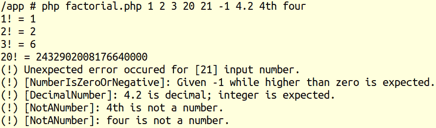

![图 8.39：打印整数值的阶乘在这种情况下，提供了一系列参数，从`1`开始，以`4`结束。正如预期的那样，对于每个参数，都会打印一行新内容，包含响应或错误。这里有趣的一行是参数`21`的行，我们得到了一个没有给出太多细节的`Unexpected error`消息。我们应该查看日志文件以查看相关数据：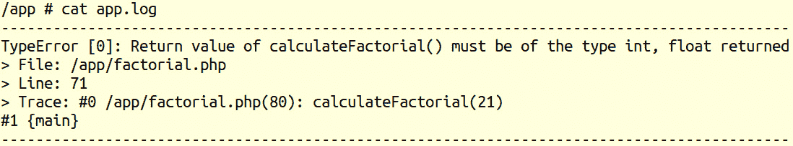

图 8.40：输入值“21”的数据

这里的投诉涉及`calculateFactorial()`函数返回`float`类型，而预期的是`int`类型。这是因为`21`的阶乘结果（`51090942171709440000`）高于 PHP 引擎可以处理的最大整数（`php -r 'echo PHP_INT_MAX;'`将输出 9223372036854775807），因此被转换为浮点类型并以科学记数法表示（5.1090942171709E+19）。由于`calculateFactorial()`函数已将返回类型声明为`int`，因此返回的浮点类型值导致了`TypeError`，现在我们可以决定对输入参数应用额外条件，限制最大值为`20`，当数值更高时抛出自定义异常，或者检查`calculateFactorial()`中的阶乘类型，在返回值之前抛出自定义异常。

在这个活动中，你通过向用户输出打印漂亮的错误消息来改善了用户体验，即使在意外错误的情况下。此外，在意外错误的情况下，错误消息被记录到日志文件中，以便开发者可以检查它们，并根据这些数据重现问题，然后提出脚本修复或改进方案。

# 9. Composer

## 活动 9.1：实现一个生成 UUID 的包

**解决方案**

1.  运行以下命令：

    ```php
    composer require ramsey/uuid
    ```

    输出如下：

    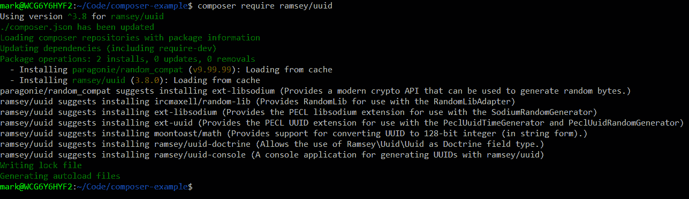

    图 9.17：要求包

1.  使用以下命令在你的 vendor 目录中列出包：

    ```php
    ls -lart vendor
    ```

    输出如下：

    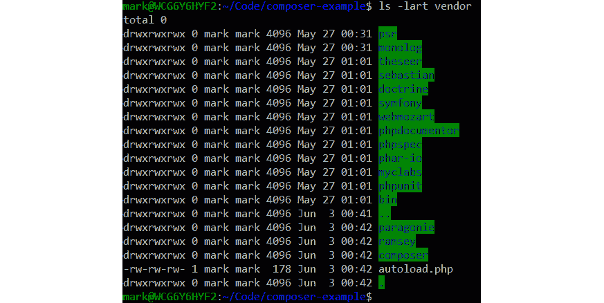

    图 9.18：列出包

1.  编辑`Example.php`文件，添加`use ramsey/uuid/uuid`语句，并添加一个类似于`printUuid()`的方法，如下所示：

    ```php
    Example.php
    1  <?php
    2 
    3  namespace Packt;
    4 
    5  use Monolog\Logger;
    6  use Ramsey\Uuid\Uuid;
    7 
    8  class Example
    9  {
    10     protected $logger;
    11     public function __construct(Logger $logger)
    12     {
    13         $this->logger = $logger;
    14     }
    https://packt.live/33Hk6Ev
    ```

1.  编辑你的`index.php`文件，添加对`printUuid()`的调用：

    ```php
    <?php
    require 'vendor/autoload.php';
    use Monolog\Logger;
    use Monolog\Handler\StreamHandler;
    use Packt\Example;
    $logger = new Logger('application_log');
    $logger->pushHandler(new StreamHandler('.logs/app.log', Logger::INFO));
    $e = new Example($logger);
    $e->doSomething();
    $e->printUuid();
    ```

1.  运行`php index.php`。生成的 UUID 将与截图中的不同，但应遵循类似的格式：


图 9.19：打印 UUID

# 10. 网络服务

## 活动 10.1：向 httpbin.org 发送自己的 POST 请求

**解决方案**

1.  在`guzzle-example`目录中创建一个`httpbin.php`文件。要求 Composer 自动加载文件并导入`Guzzle Client`类：

    ```php
    <?php
    require 'vendor/autoload.php';
    use GuzzleHttp\Client;
    ```

1.  通过传递`httpbin`地址来实例化一个新的`Guzzle Client`：

    ```php
    $client = new Client(['base_uri'=>'http://httpbin.org/']);
    ```

1.  在`try`…`catch`块中，向`/response-headers`端点发送一个`POST`请求。添加一个`Accept`头，设置为`application/json`，并设置两个查询参数键值对，其中`first`为`John`，`last`为`Doe`：

    ```php
    try
    {
        $response=$client->request('POST', '/response-headers',[
            'headers'=>[
                'Accept'=>'application-json'
            ]
            'query'=> [
                'first'=>'John',
                'last'=>'Doe'
            ]
        ]);
    ```

1.  检查 HTTP 状态码是否不是 200，如果是，则抛出异常：

    ```php
        if ($response->getStatusCode()!==200){
            throw new Exception("Status code was {$response->getStatusCode()},           not 200");
        }
    ```

1.  使用`json_decode()`将响应体解析为对象，并存储在一个变量中：

    ```php
        $responseObject=json_decode($response->getBody()->getContents());
    ```

1.  输出一个字符串，`The web service responded with`，与响应对象中的第一个和最后一个属性连接：

    ```php
        echo "The web service responded with {$responseObject->first}       {$responseObject->last}".PHP_EOL;
    }
    catch(Exception $ex)
    {
        echo "An error occurred: ".$ex->getMessage().PHP_EOL;
    }
    ```

1.  运行脚本并查看输出是否包含`John Doe`：


图 10.13：脚本的输出
