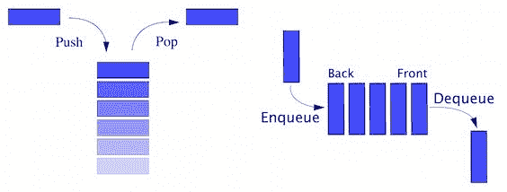
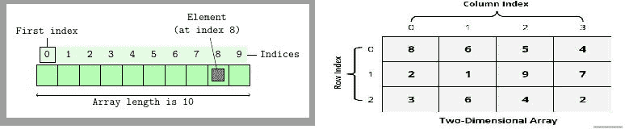
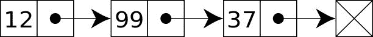
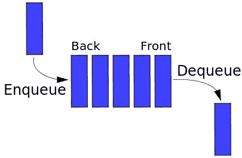
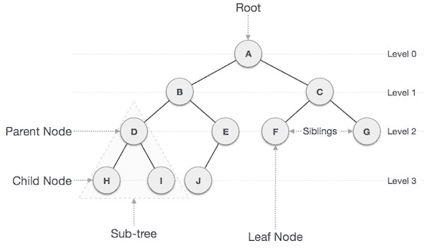
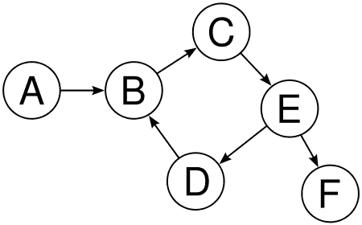
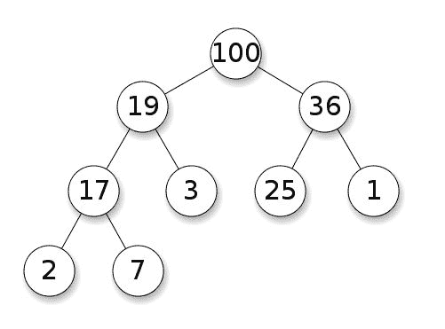
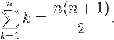

# 数据结构和算法简介

我们生活在一个数字时代。在我们生活和日常需求的每个领域，我们都有重要的技术应用。没有技术，世界将几乎停滞不前。你是否曾经尝试过准备简单的天气预报需要什么？大量的数据被分析以准备简单的信息，这些信息实时传递给我们。计算机是技术革命中最重要的发现，它们在过去几十年里彻底改变了世界。计算机处理这些大量的数据，并在每个依赖技术的任务和需求中帮助我们。为了使计算机操作高效，我们以不同的格式或不同的结构来表示数据，这就是所谓的数据结构。

数据结构是计算机和编程语言的非常重要的组成部分。除了数据结构之外，了解如何使用这些数据结构解决问题或找到解决方案也非常重要。从我们简单的手机联系人名单到复杂的 DNA 个人资料匹配系统，数据结构和算法的使用无处不在。

我们是否曾想过在超市排队结账可以代表数据结构？或者从一堆文件中取出一张账单可以是数据结构的另一种用途？事实上，我们几乎在生活中的每个地方都在遵循数据结构的概念。无论是管理支付账单的队列还是乘坐交通工具，或者为日常工作维护一堆书或文件的堆栈，数据结构无处不在，影响着我们的生活。

PHP 是一种非常流行的脚本语言，数十亿的网站和应用程序都是使用它构建的。人们使用**超文本预处理器**（**PHP**）来开发简单的应用程序到非常复杂的应用程序，有些应用程序非常数据密集。一个重要的问题是-我们是否应该为任何数据密集型应用程序或算法解决方案使用 PHP？当然应该。随着 PHP 7 的新版本发布，PHP 已经进入了高效和健壮应用程序开发的新可能性。我们的任务将是展示并准备自己了解使用 PHP 7 的数据结构和算法的力量，以便我们可以在我们的应用程序和程序中利用它。

# 数据结构和算法的重要性

如果我们考虑现实生活中与计算机的情况，我们也会使用不同的方式来安排我们的物品和数据，以便在需要时能够高效地使用它们或轻松找到它们。如果我们以随机顺序输入我们的电话联系人名单会怎么样？我们能轻松找到联系人吗？由于联系人没有按特定顺序排列，我们可能最终会在通讯录中搜索每个联系人。只需考虑以下两幅图像：


其中一幅图表明书籍是零散的，找到特定的书籍将需要时间，因为书籍没有组织。另一幅图表明书籍是按照堆栈组织的。第二幅图不仅显示我们聪明地利用了空间，而且书籍的搜索变得更容易了。

让我们考虑另一个例子。我们要为一场重要的足球比赛买票。成千上万的人在等待售票亭开放。票将按先到先得的原则分发。如果我们考虑以下两幅图像，哪一种是处理如此庞大人群的最佳方式？：


左边的图片清楚地显示了没有适当的顺序，也没有办法知道谁先来拿票。但是如果我们知道人们是按照有序的方式排队等候，那么处理人群将更容易，我们将把票交给先来的人。这是一个被称为*队列*的常见现象，在编程世界中被广泛使用。编程术语并不是从外部世界产生的。事实上，大多数数据结构都受到现实生活的启发，它们大多数时候使用相同的术语。无论我们是在准备任务清单、联系人清单、书堆、饮食图表、家谱，还是组织层次结构，我们基本上都在使用计算世界中被称为数据结构的不同排列技术。

到目前为止，我们已经谈到了一些数据结构，但是算法呢？我们日常生活中难道不使用任何算法吗？当然我们会。每当我们从旧电话簿中搜索联系人时，肯定不是从头开始搜索。如果我们要搜索*TOM*，我们不会搜索写有*A*、*B*或*C*的页面。我们直接去*T*页面，然后查找*TOM*是否在那里列出。或者，如果我们需要从电话簿中找到一位医生，我们肯定不会在食品部分搜索。如果我们把电话簿或电话目录视为数据结构，那么我们搜索特定信息的方式就被称为算法。数据结构帮助我们高效地使用数据，而算法帮助我们高效地对这些数据执行不同的操作。

例如，如果我们的电话目录中有 10 万条记录，从头开始搜索特定条目可能需要很长时间。但是，如果我们知道医生的名字在第 200 页到第 220 页，我们可以只搜索这些页面来节省时间，而不是搜索整个目录。

我们也可以考虑另一种寻找医生的方法。前面的段落是搜索目录中的特定部分，我们甚至可以按字母顺序在目录中搜索，就像我们在字典中搜索单词一样。这可能会减少我们搜索的时间和条目。寻找问题的解决方案可能有许多不同的方法，每种方法都可以称为算法。从前面的讨论中，我们可以说对于特定的问题或任务，可能有多种方法或算法可供执行。那么我们应该考虑使用哪一种？我们很快就会讨论这个问题。在讨论这一点之前，我们将专注于**PHP 数据类型**和**抽象数据类型**（**ADT**）。为了理解数据结构的概念，我们必须对 PHP 数据类型和 ADT 有深入的理解。

# 理解抽象数据类型（ADT）

PHP 有八种原始数据类型，分别是布尔值、整数、浮点数、字符串、数组、对象、资源和空值。此外，我们必须记住 PHP 是一种弱类型语言，我们在创建这些数据时不需要关心数据类型声明。虽然 PHP 具有一些静态类型特性，但 PHP 主要是一种动态类型语言，这意味着在使用变量之前不需要声明。我们可以为新变量赋值并立即使用它。

到目前为止我们讨论的数据结构的例子，我们可以使用原始数据类型中的任何一个来表示这些结构吗？也许可以，也许不行。我们的原始数据类型有一个特定的目标：存储数据。为了在这些数据上执行一些灵活的操作，我们需要以一种特定的方式使用数据类型，以便我们可以将它们用作特定的模型并执行一些操作。通过概念模型处理数据的这种特定方式被称为抽象数据类型，或 ADT。ADT 还定义了数据的一组可能操作。

我们需要理解 ADT 主要是理论概念，用于算法、数据结构和软件设计的设计和分析。相比之下，数据结构是具体的表示。为了实现 ADT，我们可能需要使用数据类型或数据结构，或者两者兼而有之。ADT 的最常见例子是栈和队列。



考虑栈作为 ADT，它不仅是数据的集合，还有两个重要的操作称为推入和弹出。通常，我们将一个新条目放在栈的顶部，这被称为*push*，当我们想要取一个项目时，我们从顶部取出，这也被称为*pop*。如果我们将 PHP 数组视为栈，我们将需要额外的功能来实现这些推入和弹出操作，以将其视为栈 ADT。同样，队列也是一个 ADT，有两个必需的操作：在队列的末尾添加一个项目，也称为*enqueue*，从队列的开头移除一个项目，也称为*dequeue*。两者听起来很相似，但如果我们仔细观察，我们会发现栈作为**后进先出**（**LIFO**）模型，而队列作为**先进先出**（**FIFO**）模型。这两种不同的数学模型使它们成为两种不同的 ADT。

以下是一些常见的 ADT：

+   列表

+   映射

+   集合

+   栈

+   队列

+   优先队列

+   图

+   树

在接下来的章节中，我们将探索更多的 ADT，并使用 PHP 将它们实现为数据结构。

# 不同的数据结构

我们可以将数据结构分类为两种不同的组：

+   线性数据结构

+   非线性数据结构

在线性数据结构中，项目以线性或顺序方式结构化。数组、列表、栈和队列是线性结构的例子。在非线性结构中，数据不是以顺序方式结构化的。图和树是非线性数据结构的最常见例子。

现在让我们以一种总结的方式探索数据结构的世界，包括不同类型的数据结构及其目的。稍后，我们将详细探索每种数据结构。

在编程世界中存在许多不同类型的数据结构。其中，以下是最常用的：

+   结构

+   数组

+   链表

+   双向链表

+   栈

+   队列

+   优先队列

+   集合

+   映射

+   树

+   图

+   堆

# 结构

通常，一个变量只能存储一个数据类型，一个标量数据类型只能存储一个值。有许多情况下，我们可能需要将一些数据类型组合在一起作为一个复杂的数据类型。例如，我们想要将一些学生信息一起存储在一个学生数据类型中。我们需要学生的姓名、地址、电话号码、电子邮件、出生日期、当前班级等信息。为了将每个学生记录存储到一个独特的学生数据类型中，我们将需要一个特殊的结构来允许我们这样做。这可以很容易地通过*struct*实现。换句话说，结构是一个值的容器，通常使用名称访问。虽然结构在 C 编程语言中非常流行，但我们也可以在 PHP 中使用类似的概念。我们将在接下来的章节中探索这一点。

# 数组

虽然数组被认为是 PHP 中的一种数据类型，但数组实际上是一种在所有编程平台上广泛使用的数据结构。在 PHP 中，数组实际上是一个有序映射（我们将在几节后了解映射）。我们可以将多个值存储在单个数组中作为单个变量。矩阵类型的数据在数组中易于存储，因此它在所有编程平台上被广泛使用。通常数组是一个固定大小的集合，通过顺序数字索引访问。在 PHP 中，数组的实现方式不同，您可以定义动态数组而不定义数组的固定大小。我们将在下一章中更多地探讨 PHP 数组。数组可以有不同的维度。如果一个数组只有一个索引来访问元素，我们称之为单维数组。但如果需要两个或更多索引来访问元素，我们分别称之为二维或多维数组。以下是两个数组数据结构的图示：



# 链表

链表是一种线性数据结构，是数据元素的集合，也称为节点，并且可以具有不同的大小。通常，列出的项目通过一个指针连接，称为链接，因此它被称为**链表**。在链表中，一个列表元素通过指针链接到下一个元素。从下图中，我们可以看到链表实际上维护了一个有序集合。链表是编程语言中使用的最常见和最简单的数据结构形式。在单链表中，我们只能向前移动。在第三章中，*使用链表*，我们将深入探讨链表的概念和实现：



# 双向链表

双向链表是一种特殊类型的链表，我们不仅存储下一个节点是什么，还在节点结构中存储了前一个节点。因此，它可以在列表内前后移动。它比单链表或链表具有更多的灵活性，因为它同时具有前一个和后一个指针。我们将在第三章中更多地探讨这些内容，*使用链表*。以下图示了双向链表：


# 堆栈

正如我们在前面的页面中讨论过的堆栈，我们已经知道堆栈是具有 LIFO 原则的线性数据结构。因此，堆栈只有一个端口用于添加新项目或移除项目。它是计算机技术中最古老和最常用的数据结构之一。我们总是使用名为*top*的单点从堆栈中添加或移除项目。术语 push 用于指示要添加到堆栈顶部的项目，pop 用于从顶部移除项目；这在下图中显示。我们将在第四章中更多地讨论堆栈和队列的内容。


# 队列

队列是另一种遵循 FIFO 原则的线性数据结构。队列允许对集合进行两种基本操作。第一种是*enqueue*，它允许我们将项目添加到队列的后面。第二种是*dequeue*，它允许我们从队列的前面移除项目。队列是计算机技术中最常用的数据结构之一。我们将在第四章中学习有关队列的详细信息，*构建堆栈和队列*。



# 集合

集合是一种抽象数据类型，用于存储特定的值。这些值不以任何特定顺序存储，但集合中不应该有重复的值。集合不像集合那样用于检索特定值；集合用于检查其中是否存在某个值。有时，集合数据结构可以被排序，我们称之为有序集。

# 映射

地图是一个键值对的集合，其中所有键都是唯一的。我们可以将地图视为一个关联数组，其中所有键都是唯一的。我们可以使用键和值对添加和删除，以及使用键更新和查找地图。事实上，PHP 数组是有序地图实现。我们将在下一章中探讨这一点。

# 树

树是计算世界中最广泛使用的非线性数据结构。它在分层数据结构中被广泛使用。树由节点组成，有一个特殊的节点被称为树的*根*，它开始了树结构。其他节点从根节点下降。树数据结构是递归的，这意味着树可以包含许多子树。节点通过边连接在一起。我们将在第六章中讨论不同类型的树，它们的操作和目的，*理解和实现树*。



# 图

图数据结构是一种特殊类型的非线性数据结构，由有限数量的顶点或节点和边或弧组成。图可以是有向的也可以是无向的。有向图清楚地指示边的方向，而无向图提到边，而不是方向。因此，在无向图中，边的两个方向被视为单个边。换句话说，我们可以说图是一对集合（*V，E*），其中*V*是顶点的集合，*E*是边的集合：

*V = {A, B, C, D, E, F}*

*E = {AB, BC, CE, ED, EF, DB}*

在有向图中，边*AB*与边*BA*不同，而在无向图中，*AB*和*BA*都是相同的。图在编程世界中解决许多复杂问题。我们将在第九章中继续讨论图数据结构，*将图形投入实践*。在下图中，我们有：



# 堆

堆是一种特殊的基于树的数据结构，满足堆属性。最大键是根，较小的键是叶子，这被称为**最大堆**。或者，最小键是根，较大的键是叶子，这被称为**最小堆**。尽管堆结构的根是树的最大或最小键，但它不一定是一个排序结构。堆用于以高效方式解决图算法以及排序。我们将在第十章中探讨堆数据结构，*理解和使用堆*。



# 解决问题 - 算法方法

到目前为止，我们已经讨论了不同类型的数据结构及其用途。但是，我们必须记住的一件事是，仅仅将数据放入适当的结构中可能并不能解决我们的问题。我们需要利用数据结构来解决问题，换句话说，我们将使用数据结构来解决问题。我们需要算法来解决问题。

算法是一种逐步过程，它定义了一组指令，按照特定顺序执行以获得期望的输出。一般来说，算法不限于任何编程语言或平台。它们独立于编程语言。算法必须具有以下特征：

+   **输入**：算法必须有明确定义的输入。可以是 0 个或多个输入。

+   **输出**：算法必须有明确定义的输出。它必须与期望的输出匹配。

+   **精确性**：所有步骤都被精确定义。

+   **有限性**：算法必须在一定数量的步骤之后停止。它不应该无限期运行。

+   **无歧义**：算法应该清晰，任何步骤都不应该有任何歧义。

+   **独立性**：算法应该独立于任何编程语言或平台。

现在让我们创建一个算法。但是为了做到这一点，我们需要一个问题陈述。所以让我们假设我们的图书馆有一批新书。有 1000 本书，它们没有按任何特定顺序排序。我们需要按照列表找到书，并将它们存放在指定的书架上。我们如何从一堆书中找到它们呢？

现在，我们可以以不同的方式解决问题。每种方式都有不同的解决问题的方法。我们称这些方法为算法。为了简洁明了地讨论，我们将只考虑两种解决问题的方法。我们知道还有其他几种方法，但为了简单起见，让我们只讨论一种算法。

我们将把书籍存放在一个简单的行中，以便我们可以看到书名。现在，我们将从列表中挑选一本书名，并从一端到另一端搜索，直到找到这本书。所以基本上，我们将为每本书进行顺序搜索。我们将重复这些步骤，直到将所有书放在指定的位置。

# 编写伪代码

计算机程序是为了机器阅读而编写的。我们必须以一定的格式编写它们，以便为机器理解而进行编译。但是，通常这些编写的代码对于程序员以外的人来说并不容易理解。为了以一种非正式的方式展示这些代码，以便人类也能理解，我们准备**伪代码**。虽然它不是实际的编程语言代码，但伪代码具有编程语言的类似结构约定。由于伪代码不能像真正的程序一样运行，因此没有标准的伪代码编写方式。我们可以按照自己的方式编写伪代码。

以下是我们用于查找书籍的算法的伪代码：

```php
Algorithm FindABook(L,book_name) 

  Input: list of Books L & name of the search book_name 

  Output: False if not found or position of the book we are looking for. 

  if L.size = 0 return null 

  found := false 

  for each item in L, do 

    if item = book_name, then 

      found := position of the item 

  return found 

```

现在让我们检查我们写的伪代码。我们提供了一份书籍清单和一个我们正在搜索的名字。我们正在运行一个`foreach`循环，以迭代每一本书，并与我们正在搜索的书名进行匹配。如果找到了，我们将返回我们找到它的位置，否则返回`false`。因此，我们编写了一份伪代码来查找书名。但是其他剩下的书呢？我们如何继续搜索，直到所有书都找到并放在正确的书架上呢？

```php
  Algorithm placeAllBooks 

    Input: list of Ordered Books OL, List of received books L 

    Output: nothing. 

    for each book_name in OL, do 

       if FindABook(L,book_name), then 

         remove the book from the list L 

         place it to the bookshelf 

```

现在我们有了解决书籍组织问题的算法的完整伪代码。在这里，我们正在浏览有序书籍列表，并在交付部分找到书籍。如果找到书籍，我们将其从列表中删除，并将其放到正确的书架上。

编写伪代码的这种简单方法可以帮助我们以结构化的方式解决更复杂的问题。由于伪代码独立于编程语言和平台，因此大多数时间算法都以伪代码的形式表达。

# 将伪代码转换为实际代码

现在我们将把我们的伪代码转换为实际的 PHP 7 代码，如下所示：

```php
function findABook(Array $bookList, String $bookName) { 

    $found = FALSE; 

    foreach($bookList as $index => $book) { 

        if($book === $bookName) { 

             $found = $index; 

             break; 

        } 

    } 

    return $found; 

} 

function placeAllBooks(Array $orderedBooks, Array &$bookList) { 

    foreach ($orderedBooks as $book) { 

    $bookFound = findABook($bookList, $book); 

    if($bookFound !== FALSE) { 

        array_splice($bookList, $bookFound, 1); 

    } 

  } 

} 

$bookList = ['PHP','MySQL','PGSQL','Oracle','Java']; 

$orderedBooks = ['MySQL','PGSQL','Java']; 

placeAllBooks($orderedBooks, $bookList);

echo implode(",", $bookList); 

```

现在让我们理解前面的代码发生了什么。首先，我们在代码开头定义了一个新函数`findABook`。该函数定义了两个参数。一个是`Array $bookList`，另一个是`String $bookName`。在函数的开头，我们将`$found`初始化为`FALSE`，这意味着还没有找到任何东西。`foreach`循环遍历书籍列表数组`$bookList`，对于每本书，它与我们提供的书名`$bookName`进行匹配。如果我们正在寻找的书名与`$bookList`中的书名匹配，我们将匹配的索引（我们找到匹配的地方）赋给我们的`$found`变量。既然我们找到了，继续循环就没有意义了。因此，我们使用`break`命令来跳出循环。刚刚跳出循环，我们返回我们的`$found`变量。如果找到了书，通常`$found`将返回大于 0 的任何整数值，否则将返回`false`：

```php
function placeAllBooks(Array $orderedBooks, Array &$bookList) { 

    foreach ($orderedBooks as $book) { 

    $bookFound = findABook($bookList, $book); 

    if($bookFound !== FALSE) { 

        array_splice($bookList, $bookFound, 1); 

    } 

  } 

} 

```

这个特定的函数`placeAllBooks`实际上遍历了我们的有序书籍`$orderedBooks`。我们正在遍历我们的有序书籍列表，并使用`findABook`函数在我们的交付列表中搜索每本书。如果在有序列表中找到了这本书（`$bookFound !== FALSE`），我们将使用 PHP 的`array_splice()`函数从交付书籍列表中移除该书：

```php
$bookList = ['PHP','MySQL','PGSQL','Oracle','Java'];

$orderedBooks = ['MySQL','PGSQL','Java'];

```

这两行实际上显示了两个 PHP 数组，用于我们收到的书籍列表`$bookList`和我们实际订购的书籍列表`$orderedBooks`。我们只是使用一些虚拟数据来测试我们实现的代码，如下所示：

```php
placeAllBooks($orderedBooks, $bookList);

```

我们的代码的最后一部分实际上调用函数`placeAllBooks`来执行整个操作，检查每本书在我们收到的书中的位置并将其移除，如果它在列表中。所以基本上，我们已经将我们的伪代码实现为实际的 PHP 代码，我们可以用它来解决我们的问题。

# 算法分析

我们在前一节完成了我们的算法。但我们还没有对我们的算法进行分析。在当前情况下一个有效的问题可能是，为什么我们真的需要对我们的算法进行分析？虽然我们已经编写了实现，但我们不确定我们编写的代码将利用多少资源。当我们说资源时，我们指的是运行应用程序所利用的时间和存储资源。我们编写算法来处理任何长度的输入。为了了解当输入增长时我们的算法的行为以及利用了多少资源，我们通常通过将输入长度与步骤数（时间复杂度）或存储空间（空间复杂度）相关联来衡量算法的效率。对于找到解决问题的最有效算法，进行算法分析非常重要。

我们可以在两个不同的阶段进行算法分析。一个是在实施之前完成的，另一个是在实施之后完成的。我们在实施之前进行的分析也被称为*理论分析*，我们假设其他因素如处理能力和空间将保持不变。实施后的分析被称为算法的*经验分析*，它可以因平台或语言而异。在经验分析中，我们可以从系统中获得关于时间和空间利用的可靠统计数据。

对于我们的放置书籍和从购买物品中找到书籍的算法，我们可以进行类似的分析。这次，我们将更关注时间复杂度而不是空间复杂度。我们将在接下来的章节中探讨空间复杂度。

# 计算复杂度

在算法分析中，我们测量两种复杂度：

+   **时间复杂度**：时间复杂度是算法中关键操作的数量。换句话说，时间复杂度量化了算法从开始到结束所花费的时间量。

+   **空间复杂度**：空间复杂度定义了算法在其生命周期中所需的空间（内存）量。它取决于数据结构和平台的选择。

现在让我们专注于我们实现的算法，并了解我们为算法执行的操作。在我们的`placeAllBooks`函数中，我们正在搜索我们的每一本订购的书。所以如果我们有 10 本书，我们会搜索 10 次。如果数量是 1000，我们会搜索 1000 次。所以简单地说，如果有*n*本书，我们将搜索*n*次。在算法分析中，输入数量通常用*n*表示。

对于我们有序书籍中的每一项，我们都在使用`findABook`函数进行搜索。在函数内部，我们再次搜索从`placeAllBooks`函数接收到的每一本书的名称。现在，如果我们足够幸运，我们可以在接收到的书籍列表的开头找到书的名称。在这种情况下，我们就不必搜索剩下的项目。但是如果我们非常不幸，我们搜索的书在列表的末尾怎么办？那么我们必须搜索每一本书，最后找到它。如果接收到的书籍数量也是*n*，那么我们必须进行*n*次比较。

如果我们假设其他操作是固定的，唯一的变量应该是输入大小。然后我们可以定义一个边界或数学方程来定义计算其运行时性能的情况。我们称之为*渐近分析*。渐近分析是输入边界，这意味着如果没有输入，其他因素是恒定的。我们使用渐近分析来找出算法的最佳情况、最坏情况和平均情况：

+   **最佳情况**：最佳情况表示执行程序所需的最短时间。对于我们的示例算法，最佳情况可能是，对于每本书，我们只搜索第一项。因此，我们最终搜索的时间非常短。我们使用**Ω**符号（Σ符号）来表示最佳情况。

+   **平均情况**：它表示执行程序所需的平均时间。对于我们的算法，平均情况将是大部分时间在列表中间找到书，或者一半时间在列表开头，剩下一半在列表末尾。

+   **最坏情况**：它表示程序的最大运行时间。最坏情况的例子将是一直在列表末尾找书。我们使用**O**（大 O）符号来描述最坏情况。对于我们的算法中的每本书搜索，它可能需要**O(n)**的运行时间。从现在开始，我们将使用这个符号来表示我们算法的复杂性。

# 理解大 O（大 O）符号

大 O 符号对于算法分析非常重要。我们需要对这个符号有扎实的理解，并且知道如何在将来使用它。我们将在本节中讨论大 O 符号。 

我们用于查找书籍并放置它们的算法有*n*个项目。对于第一本书的搜索，它将在最坏情况下比较*n*本书。如果我们说时间复杂度是*T*，那么对于第一本书，时间复杂度将是：

```php
T(1) = n

```

当我们从列表中删除找到的书时，列表的大小现在是*n-1*。对于第二本书的搜索，它将在最坏情况下比较*n-1*本书。然后对于第二本书，时间复杂度将是*n-1*。结合这两个时间复杂度，对于前两本书，它将是：

```php
T(2) = n + (n - 1)

```

如果我们像这样继续下去，经过*n-1*步后，最后一本书的搜索将只剩下*1*本书需要比较。因此，总复杂度看起来像：

```php
T(n) = n + (n - 1) + (n - 2) + . . . . . . .  . . . . + 3 + 2 + 1 

```

现在，如果我们看一下前面的系列，它不是很熟悉吗？它也被称为**n 个数字的和**方程，如下所示：



因此我们可以写成：

```php
T(n) = n(n + 1)/2 

```

或者：

```php
T(n) = n2/2 + n/2 

```

对于渐近分析，我们忽略低阶项和常数乘数。由于我们有*n2*，我们可以轻松地忽略这里的*n*。此外，1/2 的常数乘数也可以被忽略。现在我们可以用大 O 符号表示时间复杂度为*n*的平方：

```php
T(n) = O(n2) 

```

在整本书中，我们将使用这个大**O**符号来描述算法或操作的复杂性。以下是一些常见的大**O**符号：

| **类型** | **符号** |
| --- | --- |
| 常数 | **O (1)** |
| 线性 | **O (n)** |
| 对数 | **O (log n)** |
| n log n | **O (n log n)** |
| 二次 | **O (n² )** |
| 立方 | **O (n³ )** |
| 指数 | **O (2^n )** |

# 标准 PHP 库（SPL）和数据结构

**标准 PHP 库**（**SPL**）是 PHP 语言近年来可能的最佳功能之一。SPL 被创建用来解决 PHP 中缺乏的常见问题。SPL 在许多方面扩展了语言，但 SPL 引人注目的特点之一是它对数据结构的支持。虽然 SPL 用于许多其他目的，但我们将专注于 SPL 的数据结构部分。SPL 随着核心 PHP 安装而提供，并不需要任何扩展或更改配置来启用它。

SPL 通过 PHP 中的面向对象编程提供了一组标准数据结构。支持的数据结构有：

+   **双向链表**：它是在`SplDoublyLinkedList`中实现的。

+   **栈**：它是通过使用`SplDoublyLinkedList`在`SplStack`中实现的。

+   **队列**：它是通过使用`SplDoublyLinkedList`在`SplQueue`中实现的。

+   **堆**：它是在`SplHeap`中实现的。它还支持`SplMaxHeap`中的最大堆和`SplMinHeap`中的最小堆。

+   **优先队列**：它是通过使用`SplHeap`在`SplPriorityQueue`中实现的。

+   **数组**：它是在`SplFixedArray`中实现的，用于固定大小的数组。

+   **映射**：它是在`SplObjectStorage`中实现的。

在接下来的章节中，我们将探索 SPL 数据结构的每个实现，并了解它们的优缺点，以及与我们相应数据结构的实现的性能分析。但由于这些数据结构已经内置，我们可以用它们来快速实现功能和应用程序。

在 PHP 7 发布后，人们对 PHP 应用程序的性能提升感到高兴。在许多情况下，PHP SPL 并没有类似的性能提升，但我们将在即将到来的章节中对其进行分析。

# 摘要

在本章中，我们专注于基本数据结构及其名称的讨论。我们还学习了解决问题的定义步骤，即算法。我们还学习了分析算法和大**O**符号，以及如何计算复杂性。我们简要介绍了 PHP 中内置数据结构的 SPL 形式。

在下一章中，我们将专注于 PHP 数组，这是 PHP 中最强大、灵活的数据类型之一。我们将探索 PHP 数组的不同用途，以实现不同的数据结构，如哈希表、映射、结构等。
