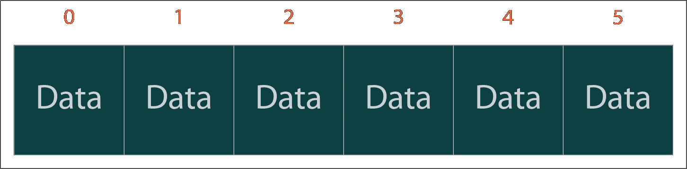
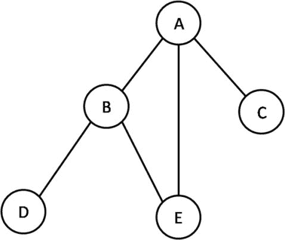
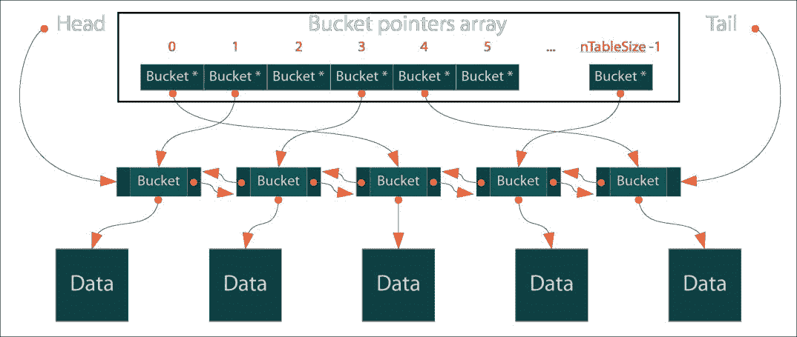
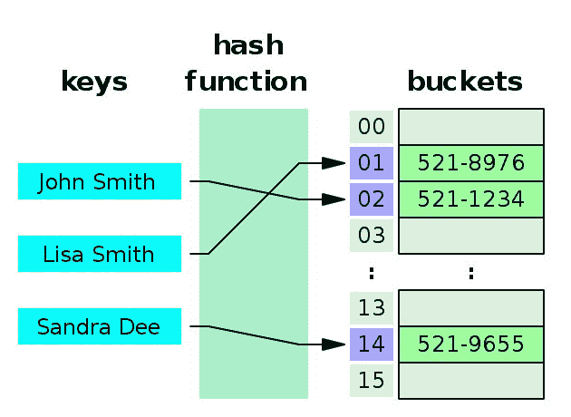

# 第二章：理解 PHP 数组

PHP 数组是 PHP 中最常用的数据类型之一。大多数时候，我们在不考虑 PHP 数组对我们开发的代码或应用程序的影响的情况下使用它。它非常易于使用和动态的；我们喜欢几乎可以用 PHP 数组来实现任何目的。有时，我们甚至不想探索是否有其他可用的解决方案可以代替 PHP 数组。在本章中，我们将探索 PHP 数组的优缺点，以及如何在不同的数据结构实现中使用数组以及提高性能。我们将从解释 PHP 中不同类型的数组开始，然后创建固定大小的数组。然后我们将看到 PHP 数组元素的内存占用情况，以及如何改进它们以及一些数据结构的实现。

# 更好地理解 PHP 数组

PHP 数组是如此动态和灵活，以至于我们必须考虑它是常规数组，关联数组还是多维数组，就像其他一些语言一样。我们不需要定义要使用的数组的大小和数据类型。PHP 如何做到这一点，而其他语言如 C 和 Java 却不能做到呢？答案很简单：PHP 中的数组概念实际上并不是真正的数组，它实际上是一个 HashMap。换句话说，PHP 数组不是我们从其他语言中得到的简单数组概念。一个简单的数组看起来像这样：



但是，我们绝对可以用 PHP 做到。让我们通过一个例子来检查：

```php
$array = [1,2,3,4,5];

```

这一行显示了典型数组的外观。类似类型的数据具有顺序索引（从 0 到 4），以访问值。那么谁说 PHP 数组不是典型数组呢？让我们探索更多的例子。考虑以下：

```php
$mixedArray = [];

$mixedArray[0] = 200;

$mixedArray['name'] = "Mixed array";

$mixedArray[1] = 10.65;

$mixedArray[2] = ['I', 'am', 'another', 'array'];

```

这是我们每天都在使用的 PHP 数组；我们不定义大小，我们存储整数、浮点数、字符串，甚至另一个数组。这听起来奇怪还是 PHP 的超能力？我们可以从[`php.net`](http://php.net)的定义中了解。

在 PHP 中，数组实际上是一个有序映射。映射是一种将值与键关联的类型。这种类型针对多种不同的用途进行了优化；它可以被视为数组、列表（向量）、哈希表（映射的一种实现）、字典、集合、栈、队列，可能还有更多。由于数组的值可以是其他数组，因此也可以存在树和多维数组。

因此，PHP 数组具有真正的超能力，可以用于所有可能的数据结构，如列表/向量、哈希表、字典、集合、栈、队列、双向链表等。看起来 PHP 数组是以这样一种方式构建的，要么对所有事情进行了优化，要么对任何事情都没有进行优化。我们将在本章中探索这一点。

如果我们想对数组进行分类，那么主要有三种类型的数组：

+   数字数组

+   关联数组

+   多维数组

我们将通过一些例子和解释来探索每种类型的数组。

# 数字数组

数字数组并不意味着它只包含数字数据。实际上，它意味着索引只能是数字。在 PHP 中，它们可以是顺序的或非顺序的，但它们必须是数字。在数字数组中，值以线性方式存储和访问。以下是一些 PHP 数字数组的例子：

```php
$array = [10,20,30,40,50]; 

$array[] = 70;  

$array[] = 80; 

$arraySize = count($array); 

for($i = 0;$i<$arraySize;$i++) { 

    echo "Position ".$i." holds the value ".$array[$i]."\n"; 

} 

```

这将产生以下输出：

```php
Position 0 holds the value 10 

Position 1 holds the value 20 

Position 2 holds the value 30 

Position 3 holds the value 40 

Position 4 holds the value 50 

Position 5 holds the value 70 

Position 6 holds the value 80 

```

这是一个非常简单的例子，我们定义了一个数组，并且索引是从 0 自动生成的，并且随着数组的值递增。当我们使用`$array[]`在数组中添加一个新元素时，它实际上会递增索引并将值分配给新索引。这就是为什么值 70 具有索引 5，80 具有索引 6。

如果我们的数据是连续的，我们总是可以使用`for`循环而不会出现任何问题。当我们说连续时，我们不仅仅是指 0,1,2,3....,*n*。它可以是 0,5,10,15,20,......,*n*，其中*n*是 5 的倍数。或者它可以是 1,3,5,7,9......,*n*，其中*n*是奇数。我们可以创建数百种这样的序列来使数组成为数字。

一个重要的问题可能是，如果索引不是连续的，我们不能构造一个数字数组吗？是的，我们肯定可以。我们只需要采用不同的迭代方式。考虑以下示例：

```php
$array = []; 

$array[10] = 100; 

$array[21] = 200; 

$array[29] = 300; 

$array[500] = 1000; 

$array[1001] = 10000; 

$array[71] = 1971; 

foreach($array as $index => $value) { 

    echo "Position ".$index." holds the value ".$value."\n"; 

} 

```

如果我们看索引，它们不是连续的。它们具有随机索引，例如`10`后面是`21`，`29`等等。甚至在最后，我们有索引`71`，它比之前的`1001`要小得多。所以，最后一个索引应该在 29 和 500 之间吗？以下是输出：

```php
Position 10 holds the value 100 

Position 21 holds the value 200 

Position 29 holds the value 300 

Position 500 holds the value 1000 

Position 1001 holds the value 10000 

Position 71 holds the value 1971 

```

这里有几件事情需要注意：

我们按照输入数据的方式迭代数组。索引没有任何内部排序，尽管它们都是数字。

另一个有趣的事实是数组`$array`的大小只有`6`。它不像 C++、Java 或其他语言中需要在使用之前预定义数组大小的`1002`，最大索引可以是*n-1*，其中*n*是数组的大小。

# 关联数组

关联数组是通过可以是任何字符串的键来访问的。在关联数组中，值存储在键而不是线性索引之间。我们可以使用关联数组来存储任何类型的数据，就像数字数组一样。让我们创建一个学生数组，我们将在其中存储学生信息：

```php
$studentInfo = []; 

$studentInfo['Name'] = "Adiyan"; 

$studentInfo['Age'] = 11; 

$studentInfo['Class'] = 6; 

$studentInfo['RollNumber'] = 71; 

$studentInfo['Contact'] = "info@adiyan.com"; 

foreach($studentInfo as $key => $value) { 

    echo $key.": ".$value."\n"; 

} 

```

以下是代码的输出：

```php
Name: Adiyan 

Age: 11 

Class: 6 

RollNumber: 71 

Contact: info@adiyan.com 

```

在这里，我们使用每个键来保存一条数据。我们可以根据需要添加任意多个键而不会出现任何问题。这使我们能够使用 PHP 关联数组来表示类似结构、映射和字典的数据结构。

# 多维数组

多维数组包含多个数组。换句话说，它是一个数组的数组。在本书中，我们将在不同的示例中使用多维数组，因为它们是存储图形和其他树状数据结构的数据的最流行和高效的方式之一。让我们使用一个示例来探索 PHP 多维数组：

```php
$players = [];

$players[] = ["Name" => "Ronaldo", "Age" => 31, "Country" => "Portugal", "Team" => "Real Madrid"];

$players[] = ["Name" => "Messi", "Age" => 27, "Country" => "Argentina", "Team" => "Barcelona"];

$players[] = ["Name" => "Neymar", "Age" => 24, "Country" => "Brazil", "Team" => "Barcelona"];

$players[] = ["Name" => "Rooney", "Age" => 30, "Country" => "England", "Team" => "Man United"];

foreach($players as $index => $playerInfo) { 

    echo "Info of player # ".($index+1)."\n";

    foreach($playerInfo as $key => $value) { 

        echo $key.": ".$value."\n";

    } 

    echo "\n";

} 

```

我们刚刚看到的示例是一个二维数组的示例。因此，我们使用两个`foreach`循环来迭代二维数组。以下是代码的输出：

```php
Info of player # 1 

Name: Ronaldo 

Age: 31 

Country: Portugal 

Team: Real Madrid 

Info of player # 2 

Name: Messi 

Age: 27 

Country: Argentina 

Team: Barcelona 

Info of player # 3 

Name: Neymar 

Age: 24 

Country: Brazil 

Team: Barcelona 

Info of player # 4 

Name: Rooney 

Age: 30 

Country: England 

Team: Man United  

```

我们可以根据需要使用 PHP 创建 n 维数组，但是我们必须记住一件事：我们添加的维度越多，结构就会变得越复杂。我们通常可以想象三维，所以为了拥有超过三维的数组，我们必须对多维数组的工作原理有扎实的理解。

我们可以在 PHP 中将数字数组和关联数组作为单个数组使用。但在这种情况下，我们必须非常谨慎地选择正确的方法来迭代数组元素。在这种情况下，`foreach`将比`for`或`while`循环更好。

# 使用数组作为灵活的存储

到目前为止，我们已经看到 PHP 数组作为一种动态的、混合的数据结构，用于存储任何类型的数据。这给了我们更多的自由度，可以将数组用作灵活的存储容器。我们可以在单个数组中混合不同的数据类型和不同维度的数据。我们甚至不必定义我们将要使用的数组的大小或类型。我们可以在需要时随时增加、缩小和修改数据到数组中。

PHP 不仅允许我们创建动态数组，而且还为数组提供了许多内置功能。例如：`array_intersect`，`array_merge`，`array_diff`，`array_push`，`array_pop`，`prev`，`next`，`current`，`end`等等。

# 使用多维数组表示数据结构

在接下来的章节中，我们将讨论许多不同的数据结构和算法。我们将重点讨论图形。我们已经知道图形数据结构的定义。大多数时候，我们将使用 PHP 多维数组来表示数据，作为邻接矩阵。让我们考虑以下图表：



现在，如果我们把图的每个节点看作是一个数组的值，我们可以表示节点为：

```php
$nodes = ['A', 'B', 'C', 'D', 'E'];

```

但这只会给我们节点名称。我们无法连接或创建节点之间的关系。为了做到这一点，我们需要构建一个二维数组，其中节点名称将是键，值将基于两个节点的互连性为 0 或 1。由于图中没有提供方向，我们不知道*A*是否连接到*C*或连接到*A*。所以我们假设两者彼此连接。

首先，我们需要为图创建一个数组，并将二维数组的每个节点初始化为 0。以下代码将确切地做到这一点：

```php
$graph = [];

$nodes = ['A', 'B', 'C', 'D', 'E'];

foreach ($nodes as $xNode) {

    foreach ($nodes as $yNode) {

        $graph[$xNode][$yNode] = 0;

    }

}

```

让我们使用以下代码打印数组，以便在定义节点之间的连接之前看到它的实际外观：

```php
foreach ($nodes as $xNode) {

    foreach ($nodes as $yNode) {

        echo $graph[$xNode][$yNode] . "\t";

    }

    echo "\n";

}

```

由于节点之间的连接未定义，所有单元格都显示为 0。因此输出看起来像这样：

```php
0       0       0       0       0

0       0       0       0       0

0       0       0       0       0

0       0       0       0       0

0       0       0       0       0

```

现在我们将定义节点之间的连接，使两个节点之间的连接表示为 1 的值，就像以下代码一样：

```php
$graph["A"]["B"] = 1;

$graph["B"]["A"] = 1;

$graph["A"]["C"] = 1;

$graph["C"]["A"] = 1;

$graph["A"]["E"] = 1;

$graph["E"]["A"] = 1;

$graph["B"]["E"] = 1;

$graph["E"]["B"] = 1;

$graph["B"]["D"] = 1;

$graph["D"]["B"] = 1;

```

由于图表中没有给出方向，我们将其视为无向图，因此我们为每个连接设置了两个值为 1。对于*A*和*B*之间的连接，我们将`$graph["A"]["B"]`和`$graph["B"]["A"]`都设置为`1`。我们将在后面的章节中了解更多关于定义节点之间连接的内容以及为什么我们这样做。现在我们只关注如何使用多维数组来表示数据结构。我们可以重新打印矩阵，这次输出看起来像这样：

```php
0       1       1       0       1

1       0       0       1       1

1       0       0       0       0

0       1       0       0       0

1       1       0       0       0

```

在第九章中，*将图形投入实践*，更有趣和有趣地了解图形及其操作。

# 使用 SplFixedArray 方法创建固定大小的数组

到目前为止，我们已经探讨了 PHP 数组，我们知道，我们不定义数组的大小。PHP 数组可以根据我们的需求增长或缩小。这种灵活性带来了关于内存使用的巨大不便。我们将在本节中探讨这一点。现在，让我们专注于使用 SPL 库创建固定大小的数组。

为什么我们需要一个固定大小的数组？它有什么额外的优势吗？答案是，当我们知道我们只需要数组中的一定数量的元素时，我们可以使用固定数组来减少内存使用。在进行内存使用分析之前，让我们举一些使用`SplFixedArray`方法的例子：

```php
$array = new SplFixedArray(10);

for ($i = 0; $i < 10; $i++)

    $array[$i] = $i;

for ($i = 0; $i < 10; $i++)

    echo $array[$i] . "\n";

```

首先，我们创建一个具有定义大小为 10 的新`SplFixedArray`对象。其余行实际上遵循我们在常规 PHP 数组值分配和检索中使用的相同原则。如果我们想访问超出范围的索引（这里是 10），它将抛出一个异常：

```php
PHP Fatal error:  Uncaught RuntimeException: Index invalid or out of range

```

PHP 数组和`SplFixedArray`之间的基本区别是：

+   `SplFixedArray`必须有一个固定的定义大小

+   `SplFixedArray`的索引必须是整数，并且在 0 到*n*的范围内，其中*n*是我们定义的数组的大小

当我们有许多已知大小的定义数组或数组的最大所需大小有一个上限时，`SplFixedArray`方法可能非常方便。但如果我们不知道数组的大小，那么最好使用 PHP 数组。

# 常规 PHP 数组和 SplFixedArray 之间的性能比较

在上一节中我们遇到的一个关键问题是，为什么我们应该使用`SplFixedArray`而不是 PHP 数组？我们现在准备探讨答案。我们发现 PHP 数组实际上不是数组，而是哈希映射。让我们在 PHP 5.x 版本中运行一个小例子代码，看看 PHP 数组的内存使用情况。

让我们创建一个包含 100,000 个唯一 PHP 整数的数组。由于我正在运行 64 位机器，我期望每个整数占用 8 个字节。因此，我们将为数组消耗大约 800,000 字节的内存。以下是代码：

```php
$startMemory = memory_get_usage();

$array = range(1,100000);

$endMemory = memory_get_usage();

echo ($endMemory - $startMemory)." bytes";

```

如果我们在命令提示符中运行这段代码，我们将看到一个输出为 14,649,040 字节。是的，没错。内存使用量几乎是我们计划的 18.5 倍。这意味着对于一个 PHP 数组中的每个元素，会有 144 字节（18 * 8 字节）的开销。那么，这额外的 144 字节是从哪里来的，为什么 PHP 为每个数组元素使用这么多额外的内存？以下是 PHP 数组使用的额外字节的解释：



这张图表展示了 PHP 数组的内部工作原理。它将数据存储在一个桶中，以避免冲突并容纳更多数据。为了管理这种动态性，它在数组的内部实现了双向链表和哈希表。最终，这将为数组中的每个单独元素消耗大量额外的内存空间。以下是基于 PHP 数组实现代码（C 代码）的每个元素的内存消耗的详细情况：

| | **32 位** | **64 位** |
| --- | --- | --- |
| zval | 16 字节 | 24 字节 |
| +循环 GC 信息 | 4 字节 | 8 字节 |
| +分配头 | 8 字节 | 16 字节 |
| zval（值）总计 | 28 字节 | 48 字节 |
| bucket | 36 字节 | 72 字节 |
| +分配头 | 8 字节 | 16 字节 |
| +指针 | 4 字节 | 8 字节 |
| bucket（数组元素）总计 | 48 字节 | 96 字节 |
| 总计（bucket+zval） | 76 字节 | 144 字节 |

为了理解 PHP 数组的内部结构，我们需要深入研究 PHP 内部。这超出了本书的范围。一个很好的推荐阅读是：[`nikic.github.io/2011/12/12/How-big-are-PHP-arrays-really-Hint-BIG.html`](https://nikic.github.io/2011/12/12/How-big-are-PHP-arrays-really-Hint-BIG.html)

在新的 PHP 7 版本中，PHP 数组的内部构造有了很大的改进。结果，每个元素的 144 字节的开销仅降至 36 字节。这是一个很大的改进，适用于 32 位和 64 位操作系统。下面是一个比较图表，包含一个包含 100,000 个项目的数组：

| **$array = Range(1,100000)** | **32 位** | **64 位** |
| --- | --- | --- |
| PHP 5.6 或更低 | 7.4 MB | 14 MB |
| PHP 7 | 3 MB | 4 MB |

换句话说，对于 32 位系统，PHP 7 的改进系数为 2.5 倍，对于 64 位系统为 3.5 倍。这是一个真正的改进。但这一切都是关于 PHP 数组的，那么`SplFixedArray`呢？让我们在 PHP 7 和 PHP 5.x 中使用`SplFixArray`运行相同的示例： 

```php
$items = 100000; 

$startMemory = memory_get_usage(); 

$array = new SplFixedArray($items); 

for ($i = 0; $i < $items; $i++) { 

    $array[$i] = $i; 

} 

$endMemory = memory_get_usage(); 

$memoryConsumed = ($endMemory - $startMemory) / (1024*1024); 

$memoryConsumed = ceil($memoryConsumed); 

echo "memory = {$memoryConsumed} MB\n"; 

```

我们在这里写了`SplFixedArray`的内存消耗功能。如果我们只是将行`$array = new SplFixedArray($items);`更改为`$array = [];`，我们将得到与 PHP 数组相同的代码运行。

基准测试结果可能因机器而异，因为可能有不同的操作系统、内存大小、调试器开/关等。建议在自己的机器上运行代码，以生成类似的基准测试进行比较。

以下是 64 位系统中包含 100,000 个整数的 PHP 数组和`SplFixedArray`的内存消耗比较：

| **100,000 个项目** | **使用 PHP 数组** | **SplFixedArray** |
| --- | --- | --- |
| PHP 5.6 或更低 | 14 MB | 6 MB |
| PHP 7 | 5 MB | 2 MB |

`SplFixedArray` 不仅在内存使用上更快，而且在执行速度上也比一般的 PHP 数组操作更快，比如访问值，赋值等等。

尽管我们可以像数组一样使用`SplFixedArray`对象，但 PHP 数组函数不适用于`SplFixedArray`。我们不能直接应用任何 PHP 数组函数，比如`array_sum`，`array_filter`等等。

# 使用 SplFixedArray 的更多示例

由于`SplFixedArray`具有良好的性能提升指标，我们可以在大多数数据结构和算法中利用它，而不是使用常规的 PHP 数组。现在我们将探讨在不同场景中使用`SplFixedArray`的更多示例。

# 从 PHP 数组转换为 SplFixedArray

我们已经看到了如何创建一个具有固定长度的`SplFixedArray`。如果我想在运行时创建一个`SplFixedArray`数组呢？以下代码块显示了如何实现：

```php
$array =[1 => 10, 2 => 100, 3 => 1000, 4 => 10000]; 

$splArray = SplFixedArray::fromArray($array); 

print_r($splArray); 

```

在这里，我们使用`SplFixedArray`类的静态方法`fromArray`从现有数组`$array`构造了一个`SplFixedArray`。然后我们使用 PHP 的`print_r`函数打印数组。它将显示如下输出：

```php
SplFixedArray Object 

( 

    [0] => 

    [1] => 10 

    [2] => 100 

    [3] => 1000 

    [4] => 10000 

) 

```

我们可以看到数组现在已经转换为`SplFixedArray`，并且它保持了与实际数组中完全相同的索引号。由于实际数组没有定义 0 索引，因此索引 0 保持为 null。但是，如果我们想忽略以前数组的索引并为它们分配新的索引，那么我们必须将上一个代码的第二行更改为这样：

```php
$splArray = SplFixedArray::fromArray($array,false); 

```

现在，如果我们再次打印数组，将会得到以下输出：

```php
SplFixedArray Object

( 

    [0] => 10

    [1] => 100

    [2] => 1000

    [3] => 10000

) 

```

如果我们想在运行时将数组转换为固定数组，最好是在不再使用常规 PHP 数组时取消它。如果数组很大，这将节省内存使用。

# 将 SplFixedArray 转换为 PHP 数组

我们可能还需要将`SplFixedArray`转换为常规 PHP 数组，以应用 PHP 中的一些预定义数组函数。与前面的示例一样，这也是一件非常简单的事情：

```php
$items = 5; 

$array = new SplFixedArray($items); 

for ($i = 0; $i < $items; $i++) { 

    $array[$i] = $i * 10; 

} 

$newArray = $array->toArray(); 

print_r($newArray); 

```

这将产生以下输出：

```php
Array 

( 

    [0] => 0 

    [1] => 10 

    [2] => 20 

    [3] => 30 

    [4] => 40 

) 

```

# 在声明后更改 SplFixedArray 大小

由于我们在开始时定义了数组大小，可能需要稍后更改大小。为了做到这一点，我们必须使用`SplFixedArray`类的`setSize()`方法。示例如下：

```php
$items = 5; 

$array = new SplFixedArray($items); 

for ($i = 0; $i < $items; $i++) { 

    $array[$i] = $i * 10; 

} 

$array->setSize(10); 

$array[7] = 100; 

```

# 使用 SplFixedArray 创建多维数组

我们可能还需要使用`SplFixedArray`创建两个或更多维数组。为了做到这一点，建议按照以下示例操作：

```php
$array = new SplFixedArray(100);

for ($i = 0; $i < 100; $i++) 

$array[$i] = new SplFixedArray(100);

```

实际上，我们在每个数组索引内部创建了另一个`SplFixedArray`。我们可以添加任意多的维度。但我们必须记住，随着维度的增加，数组的大小也会增加。因此，它可能会非常快速地变得非常大。

# 理解哈希表

在编程语言中，哈希表是一种数据结构，用于使数组成为关联数组。这意味着我们可以使用键来映射值，而不是使用索引。哈希表必须使用哈希函数来计算数组桶或槽的索引，从中可以找到所需的值：



正如我们已经多次提到的，PHP 数组实际上是一个哈希表，因此支持关联数组。我们需要记住一件事：对于关联数组实现，我们不需要定义哈希函数。PHP 会在内部为我们做这件事。因此，当我们在 PHP 中创建关联数组时，实际上是在创建一个哈希表。例如，以下代码可以被视为哈希表：

```php
$array = []; 

$array['Germany'] = "Position 1"; 

$array['Argentina'] = "Position 2"; 

$array['Portugal'] = "Position 6"; 

$array['Fifa_World_Cup'] = "2018 Russia";  

```

事实上，我们可以直接调用任何键，复杂度只有**O(1)**。键将始终引用桶内相同的索引，因为 PHP 将使用相同的哈希函数来计算索引。

# 使用 PHP 数组实现结构

正如我们已经知道的，结构是一种复杂的数据类型，我们在其中定义多个属性作为一组，以便我们可以将其用作单个数据类型。我们可以使用 PHP 数组和类来编写结构。以下是使用 PHP 数组编写结构的示例：

```php
$player = [ 

    "name" => "Ronaldo", 

    "country" => "Portugal", 

    "age" => 31, 

    "currentTeam" => "Real Madrid" 

]; 

```

它只是一个具有字符串键的关联数组。可以使用单个或多个结构来构造复杂的结构作为其属性。例如，使用 player 结构，我们可以使用 team 结构：

```php
$ronaldo = [ 

    "name" => "Ronaldo", 

    "country" => "Portugal", 

    "age" => 31, 

    "currentTeam" => "Real Madrid" 

]; 

$messi = [ 

    "name" => "Messi", 

    "country" => "Argentina", 

    "age" => 27, 

    "currentTeam" => "Barcelona" 

]; 

$team = [ 

    "player1" => $ronaldo, 

    "player2" => $messi 

]; 

The same thing we can achieve using PHP Class. The example will look like:  

Class Player { 

    public $name; 

    public $country; 

    public $age; 

    public $currentTeam; 

} 

$ronaldo = new Player; 

$ronaldo->name = "Ronaldo"; 

$ronaldo->country = "Portugal"; 

$ronaldo->age = 31; 

$ronaldo->currentTeam = "Real Madrid"; 

```

由于我们已经看到了定义结构的两种方式，我们必须选择其中一种来实现结构。虽然创建对象可能看起来更方便，但与数组实现相比，它的速度较慢。数组具有速度的优势，但它也有一个缺点，即它占用比对象更多的内存空间。现在我们必须根据自己的偏好做出决定。

# 使用 PHP 数组实现集合

集合只是一个没有特定顺序的值的集合。它可以包含任何数据类型，我们可以运行不同的集合操作，如并集、交集、补集等。由于集合只包含值，我们可以构建一个基本的 PHP 数组，并为其分配值，使其动态增长。以下示例显示了我们定义的两个集合；一个包含一些奇数，另一个包含一些质数：

```php
$odd = []; 

$odd[] = 1; 

$odd[] = 3; 

$odd[] = 5; 

$odd[] = 7; 

$odd[] = 9; 

$prime = []; 

$prime[] = 2; 

$prime[] = 3; 

$prime[] = 5; 

```

为了检查值在集合中的存在以及并集、交集和补集操作，我们可以使用以下示例：

```php
if (in_array(2, $prime)) { 

    echo "2 is a prime"; 

} 

$union = array_merge($prime, $odd); 

$intersection = array_intersect($prime, $odd); 

$compliment = array_diff($prime, $odd);  

```

PHP 有许多用于此类操作的内置函数，我们可以利用它们进行集合操作。但是我们必须考虑一个事实：由于集合没有以任何特定方式排序，使用`in_array()`函数进行搜索在最坏的情况下可能具有**O(n)**的复杂度。`array_merge()`函数也是如此，它将检查一个数组中的每个值与另一个数组。为了加快速度，我们可以稍微修改我们的代码，使其更加高效：

```php
$odd = []; 

$odd[1] = true; 

$odd[3] = true; 

$odd[5] = true; 

$odd[7] = true; 

$odd[9] = true; 

$prime = []; 

$prime[2] = true; 

$prime[3] = true; 

$prime[5] = true; 

if (isset($prime[2])) { 

    echo "2 is a prime"; 

} 

$union = $prime + $odd; 

$intersection = array_intersect_key($prime, $odd); 

$compliment = array_diff_key($prime, $odd); 

```

如果我们分析这段代码，我们可以看到我们使用索引或键来定义集合。由于 PHP 数组索引或键查找的复杂度为**O(1)**，这使得搜索速度更快。因此，所有查找、并集、交集和补集操作将比上一个示例花费更少的时间。

# PHP 数组的最佳用法

虽然 PHP 数组消耗更多内存，但使用 PHP 数组的灵活性对于许多数据结构来说更为重要。因此，我们将在许多数据结构实现和算法中使用 PHP 常规数组以及`SplFixedArray`。如果我们只将 PHP 数组视为我们数据的容器，那么我们将更容易地利用其在许多数据结构实现中的强大功能。除了内置函数，PHP 数组绝对是使用 PHP 进行编程和开发应用程序时必不可少的数据结构。

PHP 有一些用于数组的内置排序函数。它可以使用键和值进行排序，并在排序时保持关联。我们将在第七章中探索这些内置函数，*使用排序算法*。

# PHP 数组，它是性能杀手吗？

在本章中，我们已经看到 PHP 数组中的每个元素都具有非常大的内存开销。由于这是语言本身完成的，除了在适用的情况下使用`SplFixedArray`而不是常规数组之外，我们几乎无能为力。但是，如果我们从 PHP 5.x 版本迁移到新的 PHP 7，那么我们的应用程序将有巨大的改进，无论我们使用常规 PHP 数组还是`SplFixedArray`。

在 PHP 7 中，哈希表的内部实现发生了巨大的变化，它并不是为了效率而构建的。因此，每个元素的开销内存消耗显著减少。虽然我们可以争论较少的内存消耗并不会使代码更快，但我们可以反驳，如果我们有更少的内存来管理，我们可以更多地专注于执行而不是内存管理。因此，这对性能产生了一些影响。

从讨论中可以很容易地得出结论，PHP 7 中新改进的数组绝对是开发人员解决复杂和内存高效应用程序的推荐选择。

# 总结

在本章中，我们专注于讨论 PHP 数组以及使用 PHP 数组作为数据结构可以做什么。我们将在接下来的章节中继续探讨数组的特性。在下一章中，我们将专注于链表数据结构和不同变体的链表。我们还将探索关于链表及其最佳用法的不同类型的实际示例。
