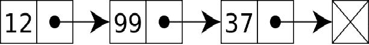
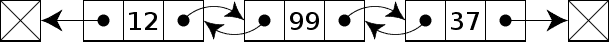
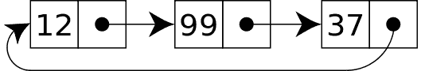
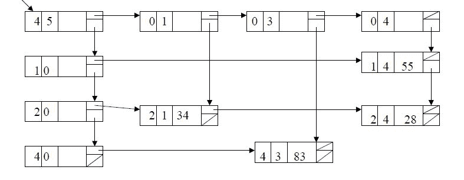
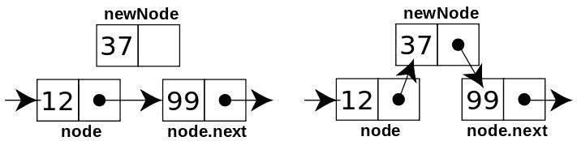
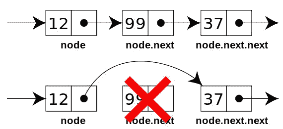

# 第三章：使用链表

我们已经对数组有了很多了解。现在，我们将把重点转移到一种称为*list*的新类型的数据结构上。它是编程世界中最常用的数据结构之一。在大多数编程语言中，数组是一个固定大小的结构。因此，它无法动态增长，从固定大小数组中缩小或删除项目也是有问题的，因为我们必须移动数组的项目来填补空白。因此，许多开发人员更喜欢使用列表而不是数组。考虑到每个数组元素可能有一些额外字节的开销，链表可以在内存效率是一个重要因素的情况下使用。在本章中，我们将探讨 PHP 中不同类型的链表及其实现。我们还将看看可以使用链表解决的现实世界问题。

# 什么是链表？

链表是一组称为节点的对象。每个节点都与下一个节点连接，连接是一个对象引用。如果我们考虑以下图像，每个框代表一个节点。箭头表示节点之间的链接。这是一个单向链表的示例。最后一个节点包含 NULL 的下一个链接，因此它标记了列表的结束：



节点是一个对象，意味着它可以存储任何数据类型，如字符串、整数、浮点数，或者复杂的数据类型，如数组、数组的数组、对象或对象数组。我们可以根据需要存储任何东西。

我们还可以在链表上执行各种操作，例如以下操作：

+   检查列表是否为空

+   显示列表中的所有项目

+   在列表中搜索项目

+   获取列表的大小

+   在列表的开头或结尾插入新项目

+   从列表的开头或结尾删除项目

+   在特定位置或在某个项目之前/之后插入新项目

+   反转列表

这些只是可以在链表上执行的一些操作。

让我们编写一个简单的链表来存储一些名称：

```php
class ListNode { 

    public $data = NULL; 

    public $next = NULL; 

    public function __construct(string $data = NULL) { 

        $this->data = $data; 

    } 

}

```

我们之前提到链表由节点组成。我们为我们的节点创建了一个简单的类。`ListNode`类有两个属性：一个用于存储数据，另一个用于称为`next`的链接。现在，我们将使用`ListNode`类实现一个链表。为简单起见，我们只有两个操作：`insert`和`display`：

```php
class LinkedList { 

    private $_firstNode = NULL; 

    private $_totalNodes = 0; 

    public function insert(string $data = NULL) { 

       $newNode = new ListNode($data); 

        if ($this->_firstNode === NULL) {           

            $this->_firstNode = &$newNode;             

        } else { 

            $currentNode = $this->_firstNode; 

            while ($currentNode->next !== NULL) { 

                $currentNode = $currentNode->next; 

            } 

            $currentNode->next = $newNode; 

        } 

       $this->_totalNode++; 

        return TRUE; 

    } 

    public function display() { 

      echo "Total book titles: ".$this->_totalNode."\n"; 

        $currentNode = $this->_firstNode; 

        while ($currentNode !== NULL) { 

            echo $currentNode->data . "\n"; 

            $currentNode = $currentNode->next; 

        } 

    } 

} 

```

前面的代码实际上实现了我们的两个基本操作`insert`和`display`节点。在`LinkedList`类中，我们有两个私有属性：`$_firstNode`和`$_totalNodes`。它们的默认值分别为`NULL`和`0`。我们需要标记头节点或第一个节点，以便我们始终知道从哪里开始。我们也可以称之为前节点。无论我们提供什么名称，它主要用于指示链表的开始。现在，让我们转到`insert`操作代码。

插入方法接受一个参数，即数据本身。我们将使用`ListNode`类使用数据创建一个新节点。在我们的链表中插入书名之前，我们必须考虑两种可能性：

+   列表为空，我们正在插入第一个标题

+   列表不为空，标题将被添加到末尾

为什么我们需要考虑两种情况？答案很简单。如果我们不知道列表是否为空，我们的操作可能会得到不同的结果。我们还可能在节点之间创建无效的链接。因此，如果列表为空，我们的插入项将成为列表的第一项。这是代码的第一部分在做的事情：

```php
$newNode = new ListNode($data); 

if ($this->_firstNode === NULL) {             

          $this->_firstNode = &$newNode; 

}

```

从上述代码片段中，我们可以看到我们正在创建一个带有数据的新节点，并将节点对象命名为`$newNode`。之后，它检查`$_firstNode`是否为`NULL`。如果是`NULL`，那么列表是空的。如果为空，那么我们将`$newNode`对象分配给`$_firstNode`属性。现在，`insert`方法的剩余部分代表了我们的第二个条件，即列表不为空，我们必须在列表的末尾添加新项目：

```php
$currentNode = $this->_firstNode;    

while ($currentNode->next !== NULL) { 

  $currentNode = $currentNode->next; 

} 

$currentNode->next = $newNode; 

```

在这里，我们从`$_firstNode`属性获取列表的第一个节点。现在，我们将从第一个节点迭代到列表的末尾。我们将通过检查当前节点的下一个链接是否为`NULL`来确保这一点。如果它是`NULL`，那么我们已经到达了列表的末尾。为了确保我们不会一直循环到同一个节点，我们在迭代过程中将下一个节点设置为当前节点的当前项。`while`循环代码实现了这个逻辑。一旦我们退出`while`循环，我们将链表的最后一个节点设置为`$currentNode`。现在，我们必须将当前最后一个节点的下一个链接分配给新创建的名为`$newNode`的节点，所以我们简单地将对象放到节点的下一个链接中。这个对象引用将作为两个节点对象之间的链接。最后，我们通过后增加`$_totalNode`属性来增加总节点计数值 1。

我们本可以轻松地为列表创建另一个属性，用于跟踪最后一个节点。这样可以避免在插入新节点时每次都循环整个列表。我们故意忽略了这个选项，以便通过对链表的基本理解来进行工作。在本章的后面，我们将实现这一点以实现更快的操作。

如果我们看看我们的`display`方法，我们会发现我们几乎使用了类似的逻辑来迭代每个节点并显示其内容。我们首先获取链表的头节点。然后，我们迭代列表直到列表项为 NULL。在循环内，我们通过显示其`$data`属性来显示节点数据。现在，我们有一个节点类`ListNode`来为链表创建单独的节点，还有一个`LinkedList`类来执行基本的`insert`和`display`操作。让我们编写一小段代码来利用`LinkedList`类来创建一个书名的链表：

```php
$BookTitles = new LinkedList(); 

$BookTitles->insert("Introduction to Algorithm"); 

$BookTitles->insert("Introduction to PHP and Data structures"); 

$BookTitles->insert("Programming Intelligence"); 

$BookTitles->display(); 

```

在这里，我们为`LinkedList`创建一个新对象，并将其命名为`$BookTitles`。然后，我们使用`insert`方法插入新的书籍项目。我们添加了三本书，然后使用`display`方法显示书名。如果我们运行上述代码，我们将看到以下输出：

```php
Total book titles: 3

Introduction to Algorithm

Introduction to PHP and Data structures

Programming Intelligence

```

正如我们所看到的，第一行有一个计数器，显示我们有三本书的标题，以及它们的名称。如果我们仔细看，我们会发现书名的显示方式与我们输入的方式相同。这意味着我们实现的链表实际上是保持顺序的。这是因为我们总是在列表的末尾输入新节点。如果我们愿意，我们可以以不同的方式做到这一点。作为我们的第一个例子，我们已经涵盖了很多关于链表以及如何构建它们的内容。在接下来的章节中，我们将更多地探索如何创建不同类型的链表，并且使用更复杂的例子。现在，我们将专注于不同类型的链表。

# 不同类型的链表

到目前为止，我们已经处理了一种称为单链表或线性链表的列表类型。然而，还有基于涉及的操作的几种不同类型的链表：

+   双向链表

+   循环链表

+   多链表

# 双向链表

在双向链表中，每个节点有两个链接：一个指向下一个节点，另一个指向前一个节点。单向链表是单向的，双向链表是双向的。我们可以在列表中前进或后退而不会出现任何问题。以下图片显示了一个示例双向链表。稍后，在*在 PHP 中实现双向链表*部分，我们将探讨如何实现双向链表：



# 循环链表

在单向或双向链表中，最后一个节点后面没有节点，因此最后一个节点没有任何后续节点可以迭代。如果允许最后一个节点指向第一个节点，我们就形成了一个循环。这样的链表称为循环链表。我们可以将单向链表和双向链表都作为循环链表。在本章中，我们还将实现一个循环链表。以下图片展示了一个循环链表：



# 多链表

多链表，或多重链表，是一种特殊类型的链表，每个节点与另一个节点有两个或更多个链接。它可以根据链表的目的多向增长。例如，如果我们以学生列表为例，每个学生都是一个具有姓名、年龄、性别、系别、专业等属性的节点，那么我们可以将每个学生的节点不仅与下一个和上一个节点链接，还与年龄、性别、系别和专业链接。尽管使用这样的链表需要对链表概念有很好的理解，但我们可以在需要时使用这样的特殊链表。以下图片展示了一个多链表：



# 插入、删除和搜索项目

到目前为止，我们只看到了插入节点和显示所有节点内容的操作。现在，我们将探索链表中的其他操作。我们主要关注以下操作：

+   在第一个节点插入

+   搜索节点

+   在特定节点之前插入

+   在特定节点之后插入

+   删除第一个节点

+   删除最后一个节点

+   搜索并删除一个节点

+   反转链表

+   获取第 N 个位置的元素

# 在第一个节点插入

当我们在前面或头部添加一个节点时，我们必须考虑两种简单的可能性。列表可能为空，因此新节点是头节点。这种可能性就是简单得不能再简单了。但是，如果列表已经有一个头节点，那么我们必须执行以下操作：

1.  创建新节点。

1.  将新节点作为第一个节点或头节点。

1.  将前一个头或第一个节点分配为新创建的第一个节点的下一个跟随节点。

以下是此代码：

```php
    public function insertAtFirst(string $data = NULL) { 

        $newNode = new ListNode($data); 

        if ($this->_firstNode === NULL) {             

            $this->_firstNode = &$newNode;             

        } else { 

            $currentFirstNode = $this->_firstNode; 

            $this->_firstNode = &$newNode; 

            $newNode->next = $currentFirstNode;            

        } 

        $this->_totalNode++; 

        return TRUE; 

    } 

```

# 搜索节点

搜索节点非常简单。我们需要遍历每个节点，并检查目标数据是否与节点数据匹配。如果找到数据，将返回节点；否则，返回`FALSE`。实现如下：

```php
    public function search(string $data = NULL) { 

        if ($this->_totalNode) { 

            $currentNode = $this->_firstNode; 

            while ($currentNode !== NULL) { 

                if ($currentNode->data === $data) { 

                    return $currentNode; 

                } 

                $currentNode = $currentNode->next; 

            } 

        } 

        return FALSE; 

    } 

```

# 在特定节点之前插入

这个过程类似于我们查看的第一个操作。主要区别在于我们需要找到特定节点，然后在其之前插入一个新节点。当找到目标节点时，我们可以更改下一个节点，使其指向新创建的节点，然后更改新创建节点后面的节点，使其指向我们搜索的节点。如下图所示：



以下是实现前面展示的逻辑的代码：

```php
public function insertBefore(string $data = NULL, string $query = NULL) { 

        $newNode = new ListNode($data); 

        if ($this->_firstNode) { 

            $previous = NULL; 

            $currentNode = $this->_firstNode; 

            while ($currentNode !== NULL) { 

                if ($currentNode->data === $query) { 

                    $newNode->next = $currentNode; 

                    $previous->next = $newNode; 

                    $this->_totalNode++; 

                    break; 

                } 

                $previous = $currentNode; 

                $currentNode = $currentNode->next; 

            } 

        } 

    } 

```

如果我们检查前面的代码，我们可以看到逻辑非常简单。在这个方法中有两个参数：一个是`data`，一个是`query`。我们遍历每个节点。在这样做的同时，我们还跟踪当前节点和前一个节点。跟踪前一个节点很重要，因为当找到目标节点时，我们将把前一个节点的下一个节点设置为新创建的节点。

# 在特定节点之后插入

这个过程类似于在目标节点之前插入一个节点。不同之处在于，我们需要在目标节点之后插入新节点。在这里，我们需要考虑目标节点以及它指向的下一个节点。当我们找到目标节点时，我们可以更改下一个节点，使其指向新创建的节点，然后我们可以更改紧随新创建节点的节点，使其指向目标节点之后的下一个节点。以下是用于实现此操作的代码：

```php
    public function insertAfter(string $data = NULL, string $query = 

      NULL) { 

        $newNode = new ListNode($data); 

        if ($this->_firstNode) { 

            $nextNode = NULL; 

            $currentNode = $this->_firstNode; 

            while ($currentNode !== NULL) { 

                if ($currentNode->data === $query) { 

                    if($nextNode !== NULL) { 

                        $newNode->next = $nextNode; 

                    } 

                    $currentNode->next = $newNode; 

                    $this->_totalNode++; 

                    break; 

                } 

                $currentNode = $currentNode->next; 

                $nextNode = $currentNode->next; 

            } 

        } 

    } 

```

# 删除第一个节点

删除节点只是意味着取出节点并重新排列前一个和后续节点的链接。如果我们只是删除一个节点并将前一个节点的下一个链接与删除节点后面的节点连接起来，我们就完成了删除操作。请看以下示例：



当我们删除第一个节点时，我们只需将第二个节点作为我们的头节点或第一个节点。我们可以通过以下代码轻松实现这一点：

```php
public function deleteFirst() { 

        if ($this->_firstNode !== NULL) { 

            if ($this->_firstNode->next !== NULL) { 

                $this->_firstNode = $this->_firstNode->next; 

            } else { 

                $this->_firstNode = NULL; 

            } 

            $this->_totalNode--; 

            return TRUE; 

        } 

        return FALSE; 

    } 

```

现在，我们必须考虑一个特殊情况，即将总节点数减少一个。

# 删除最后一个节点

删除最后一个节点将需要我们将倒数第二个节点的下一个链接指定为`NULL`。我们将迭代直到最后一个节点，并在迭代过程中跟踪前一个节点。一旦到达最后一个节点，下一个的前一个节点属性将被设置为`NULL`，如下例所示：

```php
    public function deleteLast() { 

        if ($this->_firstNode !== NULL) { 

            $currentNode = $this->_firstNode; 

            if ($currentNode->next === NULL) { 

                $this->_firstNode = NULL; 

            } else { 

                $previousNode = NULL; 

                while ($currentNode->next !== NULL) { 

                    $previousNode = $currentNode; 

                    $currentNode = $currentNode->next; 

                } 

                $previousNode->next = NULL; 

                $this->_totalNode--; 

                return TRUE; 

            } 

        } 

        return FALSE; 

    } 

```

首先，我们检查列表是否为空。之后，我们检查列表是否有多于一个节点。根据答案，我们迭代到最后一个节点并跟踪前一个节点。然后，我们将前一个节点的下一个链接指定为`NULL`，以便从列表中省略最后一个节点。

# 搜索并删除节点

我们可以使用搜索和删除操作从列表中删除任何节点。首先，我们从列表中搜索节点，然后通过删除节点的引用来删除节点。以下是实现此操作的代码：

```php
    public function delete(string $query = NULL) { 

        if ($this->_firstNode) { 

            $previous = NULL; 

            $currentNode = $this->_firstNode; 

            while ($currentNode !== NULL) { 

                if ($currentNode->data === $query) { 

                    if ($currentNode->next === NULL) { 

                        $previous->next = NULL; 

                    } else { 

                        $previous->next = $currentNode->next; 

                    } 

                    $this->_totalNode--; 

                    break; 

                } 

                $previous = $currentNode; 

                $currentNode = $currentNode->next; 

            } 

        } 

    } 

```

# 反转列表

有许多方法可以反转链表。我们将使用一种简单的方法来反转列表，即原地反转。我们遍历节点并将下一个节点更改为前一个节点，前一个节点更改为当前节点，当前节点更改为下一个节点。逻辑的伪算法如下所示：

```php
prev   = NULL; 

current = first_node; 

next = NULL; 

while (current != NULL) 

{ 

  next  = current->next;   

  current->next = prev;    

  prev = current; 

  current = next; 

} 

first_node = prev; 

```

如果我们根据这个伪代码实现我们的反转函数，它将如下所示：

```php
    public function reverse() { 

        if ($this->_firstNode !== NULL) { 

            if ($this->_firstNode->next !== NULL) { 

                $reversedList = NULL; 

                $next = NULL; 

                $currentNode = $this->_firstNode; 

                while ($currentNode !== NULL) { 

                    $next = $currentNode->next; 

                    $currentNode->next = $reversedList; 

                    $reversedList = $currentNode; 

                    $currentNode = $next; 

                } 

                $this->_firstNode = $reversedList; 

            } 

        } 

    } 

```

# 获取第 N 个位置的元素

由于列表与数组不同，直接从它们的位置获取元素并不容易。为了获取第 N 个位置的元素，我们必须迭代到该位置并获取元素。以下是此方法的代码示例：

```php
    public function getNthNode(int $n = 0) { 

        $count = 1; 

        if ($this->_firstNode !== NULL) { 

            $currentNode = $this->_firstNode; 

            while ($currentNode !== NULL) { 

                if ($count === $n) { 

                    return $currentNode; 

                } 

                $count++; 

                $currentNode = $currentNode->next; 

            } 

        } 

    } 

```

我们现在已经为我们的`LinkedList`类编写了所有必需的操作。现在，让我们用不同的操作运行程序。如果我们运行以下程序，我们将大多数覆盖我们已经编写的所有操作：

```php
$BookTitles = new LinkedList(); 

$BookTitles->insert("Introduction to Algorithm"); 

$BookTitles->insert("Introduction to PHP and Data structures"); 

$BookTitles->insert("Programming Intelligence"); 

$BookTitles->insertAtFirst("Mediawiki Administrative tutorial guide"); 

$BookTitles->insertBefore("Introduction to Calculus", "Programming Intelligence"); 

$BookTitles->insertAfter("Introduction to Calculus", "Programming Intelligence"); 

$BookTitles->display(); 

$BookTitles->deleteFirst(); 

$BookTitles->deleteLast(); 

$BookTitles->delete("Introduction to PHP and Data structures"); 

$BookTitles->reverse(); 

$BookTitles->display(); 

echo "2nd Item is: ".$BookTitles->getNthNode(2)->data; 

```

上述代码的输出将如下所示：

```php
Total book titles: 6

Mediawiki Administrative tutorial guide

Introduction to Algorithm

Introduction to PHP and Data structures

Introduction to Calculus

Programming Intelligence

Introduction to Calculus

Total book titles: 3

Programming Intelligence

Introduction to Calculus

Introduction to Algorithm

2nd Item is: Introduction to Calculus

```

现在我们已经使用 PHP 7 完整实现了一个链表。到目前为止，我们已经了解到，与数组的实现不同，我们必须通过编写代码手动执行许多操作。我们还必须记住一件事：这不是我们实现链表的唯一方式。许多人更喜欢跟踪列表的第一个和最后一个节点，以获得更好的插入操作。现在，我们将查看链表操作在平均和最坏情况下的复杂性。

# 理解链表的复杂性

以下是链表操作的最佳、最坏和平均情况复杂性：

| **操作** | **时间复杂度：最坏情况** | **时间复杂度：平均情况** |
| --- | --- | --- |
| 在开头或结尾插入 | `O(1)` | `O(1)` |
| 在开头或结尾删除 | `O(1)` | `O(1)` |
| 搜索 | `O(n)` | `O(n)` |
| 访问 | `O(n)` | `O(n)` |

我们可以通过跟踪最后一个节点来实现在链表末尾的`O(1)`插入复杂度，就像我们在示例中对第一个节点所做的那样。这将帮助我们直接跳转到链表的最后一个节点，而无需进行任何迭代。

# 将链表变成可迭代的

到目前为止，我们已经看到可以使用`while`循环在方法内部遍历链表的每个节点。如果我们需要从外部使用链表对象进行迭代，该怎么办？实现这一点是完全可能的。PHP 有一个非常直观的迭代器接口，允许任何外部迭代器在对象内部进行迭代。`Iterator`接口提供以下方法：

+   **Current**：返回当前元素

+   **Next**：向前移动到下一个元素

+   **Key**：返回当前元素的键

+   **Rewind**：将`Iterator`倒回到第一个元素

+   **Valid**：检查当前位置是否有效

现在，我们将在我们的`LinkedList`类中实现这些方法，使我们的对象可以直接通过节点进行迭代。为了在迭代期间跟踪当前节点和列表中的当前位置，我们需要为我们的`LinkedList`类添加两个新属性：

```php
private $_currentNode = NULL; 

private $_currentPosition = 0; 

```

`$_currentNode`属性将在迭代期间跟踪当前节点，`$_currentPosition`将在迭代期间跟踪当前位置。我们还需要确保我们的`LinkedList`类也实现了`Iterator`接口。代码如下：

```php
class LinkedList implements Iterator{ 

} 

```

现在，让我们实现这五个新方法，使我们的链表对象可迭代。这五个方法非常直接和简单。代码如下：

```php
    public function current() { 

        return $this->_currentNode->data; 

    } 

    public function next() { 

        $this->_currentPosition++; 

        $this->_currentNode = $this->_currentNode->next; 

    } 

    public function key() { 

        return $this->_currentPosition; 

    } 

    public function rewind() { 

        $this->_currentPosition = 0; 

        $this->_currentNode = $this->_firstNode; 

    } 

    public function valid() { 

        return $this->_currentNode !== NULL; 

    } 

```

现在，我们有一个可迭代的列表。这意味着现在我们可以使用`foreach`循环或任何其他迭代过程来遍历我们的链表对象。因此，如果我们编写以下代码，我们将看到所有的书名：

```php
foreach ($BookTitles as $title) { 

    echo $title . "\n"; 

}

```

另一种方法是使用可迭代接口的`rewind`、`valid`、`next`和`current`方法。它将产生与前面代码相同的输出：

```php
for ($BookTitles->rewind(); $BookTitles->valid(); 

  $BookTitles->next()) { 

    echo $BookTitles->current() . "\n"; 

}

```

# 构建循环链表

构建循环链表并不像名字听起来那么难。到目前为止，我们已经看到在末尾添加新节点非常简单；我们将最后一个节点的下一个引用设置为`NULL`。在循环链表中，最后一个节点的下一个引用实际上将指向第一个节点，从而创建一个循环列表。让我们编写一个简单的循环链表，其中节点将被插入到列表的末尾：

```php
class CircularLinkedList { 

    private $_firstNode = NULL; 

    private $_totalNode = 0; 

    public function insertAtEnd(string $data = NULL) { 

        $newNode = new ListNode($data); 

        if ($this->_firstNode === NULL) { 

            $this->_firstNode = &$newNode; 

        } else { 

            $currentNode = $this->_firstNode; 

            while ($currentNode->next !== $this->_firstNode) { 

                $currentNode = $currentNode->next; 

            } 

            $currentNode->next = $newNode; 

        } 

        $newNode->next = $this->_firstNode; 

        $this->_totalNode++; 

        return TRUE; 

    } 

}

```

如果我们仔细观察前面的代码，它看起来与我们的单向链表实现完全相同。唯一的区别是我们不检查列表的末尾，而是确保当前节点与第一个节点不同。此外，在以下行中，我们将新创建的节点的下一个引用分配给列表的第一个节点：

```php
$newNode->next = $this->_firstNode; 

```

在我们实现这一点的过程中，新节点被添加到列表的末尾。我们所需要做的就是将新节点的下一个引用设置为列表中的第一个节点。通过这样做，我们实际上创建了一个循环链表。我们必须确保不会陷入无限循环。这就是为什么我们要比较`$currentNode->next`和`$this->_firstNode`。当我们显示循环链表中的所有元素时，同样的原则也适用。我们需要确保在显示标题时不会陷入无限循环。以下是显示循环链表中所有标题的代码：

```php
    public function display() { 

        echo "Total book titles: " . $this->_totalNode . "\n"; 

        $currentNode = $this->_firstNode; 

        while ($currentNode->next !== $this->_firstNode) { 

            echo $currentNode->data . "\n"; 

            $currentNode = $currentNode->next; 

        } 

        if ($currentNode) { 

            echo $currentNode->data . "\n"; 

        } 

    }

```

到目前为止，我们已经构建了一个单向链表并实现了一个循环链表。现在，我们将使用 PHP 实现一个双向链表。

# 在 PHP 中实现双向链表

我们已经从双向链表的定义中知道，双向链表节点将有两个链接：一个指向下一个节点，另一个指向前一个节点。此外，当我们添加新节点或删除新节点时，我们需要为每个受影响的节点设置下一个和上一个引用。我们在单向链表实现中看到了一种不同的方法，我们没有跟踪最后一个节点，因此，我们每次都必须使用迭代器来到达最后一个节点。这一次，我们将跟踪最后一个节点，以及我们的插入和删除操作，以确保我们的插入、删除和结束操作具有`O(1)`复杂度。

以下是新节点类的外观，具有两个链接指针，后面是我们双向链表类的基本结构：

```php
class ListNode {

    public $data = NULL; 

    public $next = NULL; 

    public $prev = NULL; 

    public function __construct(string $data = NULL) {

        $this->data = $data;

    }

}

class DoublyLinkedList {

    private $_firstNode = NULL;

    private $_lastNode = NULL;

    private $_totalNode = 0;

}

```

在下一节中，我们将探讨双向链表的不同操作，以便我们了解单向链表和双向链表之间的基本区别。

# 双向链表操作

我们将在双向链表实现中探讨以下操作。虽然它们听起来与单向链表中使用的操作类似，但它们在实现上有一个重大区别：

+   在第一个节点插入

+   在最后一个节点插入

+   在特定节点之前插入

+   在特定节点之后插入

+   删除第一个节点

+   删除最后一个节点

+   搜索并删除一个节点

+   向前显示列表

+   向后显示列表

# 首先插入节点

当我们在前面或头部添加节点时，我们必须检查列表是否为空。如果列表为空，则第一个和最后一个节点将指向新创建的节点。但是，如果列表已经有一个头，则我们必须执行以下操作：

1.  创建新节点。

1.  将新节点作为第一个节点或头。

1.  将前一个头或第一个节点作为下一个，以跟随新创建的第一个节点。

1.  将前一个第一个节点的前链接指向新的第一个节点。

以下是代码：

```php
    public function insertAtFirst(string $data = NULL) {

        $newNode = new ListNode($data);

        if ($this->_firstNode === NULL) {

            $this->_firstNode = &$newNode;

            $this->_lastNode = $newNode; 

        } else {

            $currentFirstNode = $this->_firstNode; 

            $this->_firstNode = &$newNode; 

            $newNode->next = $currentFirstNode; 

            $currentFirstNode->prev = $newNode; 

        }

        $this->_totalNode++; 

        return TRUE;

    }

```

# 在最后一个节点插入

由于我们现在正在跟踪最后一个节点，因此在末尾插入新节点将更容易。首先，我们需要检查列表是否为空。如果为空，则新节点成为第一个和最后一个节点。但是，如果列表已经有最后一个节点，那么我们必须执行以下操作：

1.  创建新节点。

1.  将新节点作为最后一个节点。

1.  将前一个最后一个节点作为当前最后一个节点的前链接。

1.  将前一个最后一个节点的下一个链接指向新的最后一个节点的前链接。

以下是代码：

```php
    public function insertAtLast(string $data = NULL) { 

        $newNode = new ListNode($data);

        if ($this->_firstNode === NULL) {

            $this->_firstNode = &$newNode; 

            $this->_lastNode = $newNode; 

        } else {

            $currentNode = $this->_lastNode; 

            $currentNode->next = $newNode; 

            $newNode->prev = $currentNode; 

            $this->_lastNode = $newNode; 

        }

        $this->_totalNode++; 

        return TRUE;

    }

```

# 在特定节点之前插入

在特定节点之前插入需要我们先找到节点，然后根据其位置，我们需要改变新节点、目标节点和目标节点之前的节点的下一个和上一个节点，如下所示：

```php
    public function insertBefore(string $data = NULL, string $query =  

      NULL) {

        $newNode = new ListNode($data); 

        if ($this->_firstNode) { 

            $previous = NULL; 

            $currentNode = $this->_firstNode; 

            while ($currentNode !== NULL) { 

                if ($currentNode->data === $query) { 

                    $newNode->next = $currentNode; 

                    $currentNode->prev = $newNode; 

                    $previous->next = $newNode; 

                    $newNode->prev = $previous; 

                    $this->_totalNode++; 

                    break; 

                }

                $previous = $currentNode; 

                $currentNode = $currentNode->next; 

            }

        }

    }

```

# 在特定节点之后插入

在特定节点之后插入类似于我们刚刚讨论的方法。在这里，我们需要改变新节点、目标节点和目标节点后面的节点的下一个和上一个节点。以下是代码：

```php
    public function insertAfter(string $data = NULL, string $query = 

      NULL) { 

        $newNode = new ListNode($data);

        if ($this->_firstNode) { 

            $nextNode = NULL; 

            $currentNode = $this->_firstNode; 

            while ($currentNode !== NULL) { 

                if ($currentNode->data === $query) { 

                    if ($nextNode !== NULL) { 

                        $newNode->next = $nextNode; 

                    } 

                    if ($currentNode === $this->_lastNode) { 

                        $this->_lastNode = $newNode; 

                    } 

                    $currentNode->next = $newNode; 

                    $nextNode->prev = $newNode; 

                    $newNode->prev = $currentNode; 

                    $this->_totalNode++; 

                    break; 

                } 

                $currentNode = $currentNode->next; 

                $nextNode = $currentNode->next; 

            }

        }

    }

```

# 删除第一个节点

当我们从双向链表中删除第一个节点时，我们只需要将第二个节点设置为第一个节点。将新的第一个节点的前一个节点设置为`NULL`，并减少总节点数，就像以下代码一样：

```php
    public function deleteFirst() { 

        if ($this->_firstNode !== NULL) { 

            if ($this->_firstNode->next !== NULL) { 

                $this->_firstNode = $this->_firstNode->next; 

                $this->_firstNode->prev = NULL; 

            } else { 

                $this->_firstNode = NULL; 

            } 

            $this->_totalNode--; 

            return TRUE; 

        } 

        return FALSE; 

    }

```

# 删除最后一个节点

删除最后一个节点需要我们将倒数第二个节点设置为新的最后一个节点。此外，新创建的最后一个节点不应该有任何下一个引用。代码示例如下：

```php
    public function deleteLast() { 

        if ($this->_lastNode !== NULL) { 

            $currentNode = $this->_lastNode; 

            if ($currentNode->prev === NULL) { 

                $this->_firstNode = NULL; 

                $this->_lastNode = NULL; 

            } else { 

                $previousNode = $currentNode->prev; 

                $this->_lastNode = $previousNode; 

                $previousNode->next = NULL; 

                $this->_totalNode--; 

                return TRUE; 

            } 

        } 

        return FALSE; 

    }

```

# 搜索并删除一个节点

当我们从列表中间删除一个节点时，我们必须重新调整目标节点的前一个节点和后一个节点。首先，我们会找到目标节点。获取目标节点的前一个节点以及下一个节点。然后，将前一个节点后面的节点指向目标节点后面的节点，前一个节点同样也是如此。以下是代码：

```php
    public function delete(string $query = NULL) { 

        if ($this->_firstNode) { 

            $previous = NULL;

            $currentNode = $this->_firstNode; 

            while ($currentNode !== NULL) { 

                if ($currentNode->data === $query) { 

                    if ($currentNode->next === NULL) { 

                        $previous->next = NULL; 

                    } else { 

                        $previous->next = $currentNode->next; 

                        $currentNode->next->prev = $previous; 

                    }

                    $this->_totalNode--; 

                    break; 

                }

                $previous = $currentNode; 

                $currentNode = $currentNode->next; 

            }

        }

    }

```

# 显示列表向前

双向链表使我们有机会以两个方向显示列表。到目前为止，我们已经看到在单向链表中工作时可以以单向方式显示列表。现在，我们将从两个方向查看列表。以下是用于显示列表向前的代码：

```php
    public function displayForward() { 

        echo "Total book titles: " . $this->_totalNode . "\n"; 

        $currentNode = $this->_firstNode; 

        while ($currentNode !== NULL) { 

            echo $currentNode->data . "\n"; 

            $currentNode = $currentNode->next; 

        } 

    } 

```

# 显示列表向后

要显示列表向后，我们必须从最后一个节点开始，继续使用前一个链接向后移动，直到到达列表的末尾。这为我们在操作期间以任何方向移动提供了一种独特的方式。以下是代码：

```php
    public function displayBackward() { 

        echo "Total book titles: " . $this->_totalNode . "\n"; 

        $currentNode = $this->_lastNode; 

        while ($currentNode !== NULL) { 

            echo $currentNode->data . "\n"; 

            $currentNode = $currentNode->prev; 

        }

    }

```

# 双向链表的复杂性

以下是双向链表操作的最佳、最坏和平均情况复杂性。与单向链表操作类似：

| **操作** | **时间复杂度：最坏情况** | **时间复杂度：平均情况** |
| --- | --- | --- |
| 在开头或结尾插入 | `O(1)` | `O(1)` |
| 删除开头或结尾 | `O(1)` | `O(1)` |
| 搜索 | `O(n)` | `O(n)` |
| 访问 | `O(n)` | `O(n)` |

# 使用 PHP SplDoublyLinkedList

PHP **标准 PHP 库**（**SPL**）有一个双向链表的实现，称为`SplDoublyLinkedList`。如果我们使用内置类，就不需要自己实现双向链表。双向链表的实现实际上也可以作为堆栈和队列。PHP 实现的双向链表有许多额外的功能。以下是`SplDoublyLinkedList`的一些常见特性：

| **方法** | **描述** |
| --- | --- |
| `Add` | 在指定索引处添加一个新节点 |
| `Bottom` | 从列表开头窥视一个节点 |
| `Count` | 返回列表的大小 |
| `Current` | 返回当前节点 |
| `getIteratorMode` | 返回迭代模式 |
| `setIteratorMode` | 设置迭代模式。例如，LIFO，FIFO 等 |
| `Key` | 返回当前节点索引 |
| `next` | 移动到下一个节点 |
| `pop` | 从列表末尾弹出一个节点 |
| `prev` | 移动到前一个节点 |
| `push` | 在列表末尾添加一个新节点 |
| `rewind` | 将迭代器倒回顶部 |
| `shift` | 从链表开头移除一个节点 |
| `top` | 从列表末尾窥视一个节点 |
| `unshift` | 在列表中添加一个元素 |
| `valid` | 检查列表中是否还有节点 |

现在，让我们使用`SplDoublyLinkedList`为我们的书名应用程序编写一个小程序：

```php
$BookTitles = new SplDoublyLinkedList(); 

$BookTitles->push("Introduction to Algorithm");

$BookTitles->push("Introduction to PHP and Data structures"); 

$BookTitles->push("Programming Intelligence");

$BookTitles->push("Mediawiki Administrative tutorial guide"); 

$BookTitles->add(1,"Introduction to Calculus");

$BookTitles->add(3,"Introduction to Graph Theory");

for($BookTitles->rewind();$BookTitles->valid();$BookTitles->next()){    

    echo $BookTitles->current()."\n";

}

```

前面的代码将产生以下输出：

```php
Introduction to Algorithm

Introduction to Calculus

Introduction to PHP and Data structures

Introduction to Graph Theory

Programming Intelligence

Mediawiki Administrative tutorial guide

```

# 摘要

链表是最流行的数据结构之一，用于解决不同的问题。无论是关于堆栈、队列、优先队列，还是实现复杂的图算法，链表都是一个非常方便的数据结构，可以解决你可能遇到的任何问题。在本章中，我们探讨了关于单向链表、双向链表和循环链表的所有可能细节，以及它们的复杂性分析。在接下来的章节中，我们将利用链表来实现不同的数据结构和编写算法。
