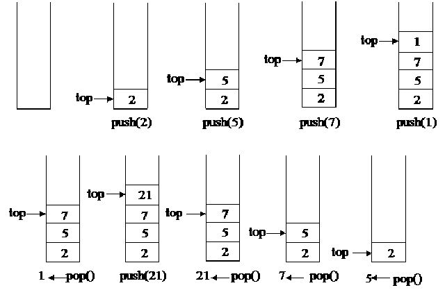
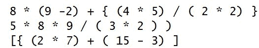
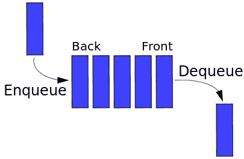
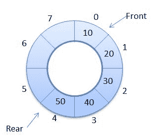
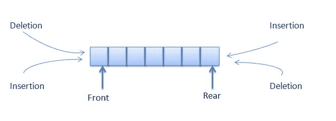

# 第四章：构建堆栈和队列

在日常生活中，我们使用两种最常见的数据结构。我们可以假设这些数据结构受到现实世界的启发，但它们在计算世界中有非常重要的影响。我们谈论的是堆栈和队列数据结构。我们每天都堆放我们的书籍、文件、盘子和衣服，而我们在售票处、公交车站和购物结账处维护队列。此外，我们已经听说过 PHP 中的消息队列，这是高端应用中最常用的功能之一。在本章中，我们将探索流行的堆栈和队列数据结构的不同实现。我们将学习关于队列、优先队列、循环队列和双端队列在 PHP 中的实现。

# 理解堆栈

堆栈是一种遵循**后进先出**（**LIFO**）原则的线性数据结构。这意味着堆栈只有一个端口，用于向结构中添加项目和移除项目。在堆栈中添加新项目称为推入（push），而在移除项目时称为弹出（pop）。由于我们只能操作一个端口，我们总是在该端口推入项目，当我们弹出时，该端口的最后一个项目将被弹出。堆栈中最顶部的元素也是堆栈端口的起始位置，称为顶部。如果我们考虑以下图像，我们可以看到在每次弹出和推入操作后，顶部都会改变。此外，我们在堆栈的顶部执行操作，而不是在堆栈的开始或中间。当堆栈为空时，弹出元素时，我们必须小心，以及当堆栈已满时推入元素。如果我们想要推入的元素超过其容量，可能会发生堆栈溢出。



根据我们之前的讨论，我们现在知道堆栈中有四种基本操作：

+   **推入**：在堆栈的顶部添加项目。

+   **弹出**：移除堆栈的顶部项目。

+   **顶部**：返回堆栈的顶部项目。它与弹出不同，因为它不会移除项目，它只是为我们获取值。

+   **isEmpty**：检查堆栈是否为空。

现在让我们以不同的方式使用 PHP 实现堆栈。首先，我们将尝试使用 PHP 的内置数组函数来实现堆栈。然后，我们将看看如何构建一个堆栈，而不使用 PHP 的内置函数，而是使用其他数据结构，如链表。

# 使用 PHP 数组实现堆栈

首先，我们将为堆栈创建一个接口，以便我们可以在不同的实现中使用它，并确保所有实现彼此相似。让我们为堆栈编写一个简单的接口：

```php
interface Stack { 

    public function push(string $item); 

    public function pop(); 

    public function top(); 

    public function isEmpty(); 

}

```

正如我们从前面的接口中看到的，我们将所有堆栈函数放在接口中，因为实现它的类必须具有所有这些提到的函数，否则在运行时会抛出致命错误。由于我们正在使用 PHP 数组实现堆栈，我们将使用一些现有的 PHP 函数来进行推入、弹出和顶部操作。我们将以这样的方式实现堆栈，以便我们可以定义堆栈的大小。如果数组中没有项目，但我们仍然想要弹出，它将抛出一个下溢异常，如果我们尝试推入的项目超过其容量允许的数量，那么将抛出一个溢出异常。以下是使用数组实现堆栈的代码：

```php
class Books implements Stack { 

    private $limit; 

    private $stack; 

    public function __construct(int $limit = 20) { 

      $this->limit = $limit; 

      $this->stack = []; 

    } 

    public function pop(): string { 

      if ($this->isEmpty()) { 

          throw new UnderflowException('Stack is empty'); 

      } else { 

          return array_pop($this->stack); 

      } 

    } 

    public function push(string $newItem) { 

      if (count($this->stack) < $this->limit) { 

          array_push($this->stack, $newItem); 

      } else { 

          throw new OverflowException('Stack is full'); 

      } 

    } 

    public function top(): string { 

      return end($this->stack); 

    } 

    public function isEmpty(): bool { 

      return empty($this->stack); 

    } 

}

```

现在让我们来看一下我们为堆栈编写的代码。我们将堆栈实现命名为`Books`，但只要是有效的类名，我们可以随意命名。首先，我们使用`__construct()`方法构建堆栈，并提供限制我们可以存储在堆栈中的项目数量的选项。默认值设置为`20`。下一个方法定义了弹出操作：

```php
public function pop():  string { 

  if ($this->isEmpty()) {

      throw new UnderflowException('Stack is empty');

  } else {

      return array_pop($this->stack);

  }

 }

```

如果堆栈不为空，`pop`方法将返回一个字符串。我们为此目的使用了我们在堆栈类中定义的 empty 方法。如果堆栈为空，我们从 SPL 中抛出`UnderFlowException`。如果没有要弹出的项目，我们可以阻止该操作发生。如果堆栈不为空，我们使用 PHP 的`array_pop`函数返回数组中的最后一个项目。

在推送方法中，我们做与弹出相反的操作。首先，我们检查堆栈是否已满。如果没有满，我们使用 PHP 的`array_push`函数将字符串项目添加到堆栈的末尾。如果堆栈已满，我们从 SPL 中抛出`OverFlowException`。`top`方法返回堆栈的顶部元素。`isEmpty`方法检查堆栈是否为空。

由于我们遵循 PHP 7，我们在方法级别使用标量类型声明和方法的返回类型。

为了使用我们刚刚实现的堆栈类，我们必须考虑一个示例，我们可以在其中使用所有这些操作。让我们编写一个小程序来创建一个书堆栈。以下是此代码：

```php
try { 

    $programmingBooks = new Books(10); 

    $programmingBooks->push("Introduction to PHP7"); 

    $programmingBooks->push("Mastering JavaScript"); 

    $programmingBooks->push("MySQL Workbench tutorial"); 

    echo $programmingBooks->pop()."\n"; 

    echo $programmingBooks->top()."\n"; 

} catch (Exception $e) { 

    echo $e->getMessage(); 

}

```

我们已经为我们的书堆栈创建了一个实例，并将我们的编程书籍标题放在其中。我们进行了三次推送操作。最后插入的书名是`"MySQL workbench tutorial"`。如果我们在三次推送操作后进行弹出，我们将得到这个标题名。之后，顶部将返回`"Mastering JavaScript"`，这将成为执行弹出操作后的顶部项目。我们将整个代码嵌套在`try...catch`块中，以便处理溢出和下溢抛出的异常。前面的代码将产生以下输出：

```php
MySQL Workbench tutorial

Mastering JavaScript

```

现在让我们专注于刚刚完成的不同堆栈操作的复杂性。

# 理解堆栈操作的复杂性

以下是不同堆栈操作的时间复杂度。对于最坏情况，堆栈操作的时间复杂度如下：

| **操作** | **时间复杂度** |
| --- | --- |
| pop | `O(1)` |
| 推送 | `O(1)` |
| top | `O(1)` |
| isEmpty | `O(1)` |

由于堆栈在一端操作，始终记住堆栈的顶部，如果我们要在堆栈中搜索项目，这意味着我们必须搜索整个列表。访问堆栈中的特定项目也是一样。虽然使用堆栈进行这些操作并不是一个好的做法，但如果我们想这样做，我们必须记住时间复杂度基于更多的一般堆栈操作。

| **操作** | **时间复杂度** |
| --- | --- |
| 访问 | `O(n)` |
| 搜索 | `O(n)` |

堆栈的空间复杂度始终为`O(n)`。

到目前为止，我们已经看到如何使用 PHP 数组和其内置函数`array_pop`和`array_push`来实现堆栈。但是我们可以忽略内置函数，使用手动数组操作来实现，或者我们可以使用`array_shift`和`array_unshift`内置函数。

# 使用链表实现堆栈

在第三章，*使用链表*中，我们学习了如何实现链表。我们看到在链表中，我们可以在末尾插入节点，从末尾删除节点，在列表中间插入节点，在开头插入节点等。如果我们考虑单链表数据结构的末尾插入和末尾删除操作，我们可以轻松地执行类似的操作。因此，让我们使用上一章的`LinkedList`类来实现堆栈。代码如下：

```php
class BookList implements Stack { 

    private $stack; 

    public function __construct() { 

      $this->stack = new LinkedList(); 

    }

    public function pop(): string { 

      if ($this->isEmpty()) { 

          throw new UnderflowException('Stack is empty'); 

      } else { 

          $lastItem = $this->top(); 

          $this->stack->deleteLast(); 

          return $lastItem; 

      } 

    } 

    public function push(string $newItem) { 

      $this->stack->insert($newItem); 

    } 

public function top(): string { 

  return $this->stack->getNthNode($this->stack->getSize())->data; 

} 

    public function isEmpty(): bool { 

      return $this->stack->getSize() == 0; 

    } 

}

```

让我们逐个查看每个代码块，以了解这里发生了什么。如果我们从顶部开始，我们可以看到在`constructor`方法中，我们创建了一个新的`LinkedList`对象，并将其分配给我们的堆栈属性，而不是上一个示例中的数组。我们假设`LinkedList`类是自动加载的，或者文件已经包含在脚本中。现在让我们专注于推入操作。推入操作就像它可以得到的那样简单。我们只需要在链表中插入一个新节点。由于链表没有任何大小限制，我们在这里不检查任何溢出。

在我们的链表实现中，没有显示最后一个节点的方法。我们已经插入了一个新的最后一个节点并删除了上一个最后一个节点，但是在这里，我们需要获取最后一个节点的值而不删除它。为了实现这个功能，这正是我们堆栈的顶部操作，我们可以利用`LinkedList`实现中的`getNthNode`方法以及`getSize`。这样，我们就可以得到节点。但是我们必须记住一件事：我们想要节点的字符串值，而不是完整的节点对象。这就是为什么我们返回返回的节点的数据属性。

与顶部操作类似，弹出操作在删除节点之前也需要返回最后一个节点的数据。为了实现这一点，我们使用`top()`方法，然后使用`LinkedList`类的`deleteLast()`方法。现在让我们运行一个使用这个新实现的`BookList`类进行堆栈操作的示例代码。以下是代码：

```php
try { 

    $programmingBooks = new BookList(); 

    $programmingBooks->push("Introduction to PHP7"); 

    $programmingBooks->push("Mastering JavaScript"); 

    $programmingBooks->push("MySQL Workbench tutorial"); 

    echo $programmingBooks->pop()."\n"; 

    echo $programmingBooks->pop()."\n"; 

    echo $programmingBooks->top()."\n"; 

} catch (Exception $e) { 

    echo $e->getMessage(); 

}

```

它看起来与我们上次运行的示例非常相似，但这里我们尝试执行两次弹出操作，然后是顶部操作。因此，输出将如下所示：

```php
MySQL Workbench tutorial

Mastering JavaScript

Introduction to PHP7

```

如果我们了解堆栈的基本行为以及如何实现它，我们可以使用数组、链表、双向链表来实现堆栈。由于我们已经看到了数组和链表的实现，现在我们将探索堆栈的 SPL 实现，它实际上使用了双向链表。

# 使用 SPL 中的 SplStack 类

如果我们不想实现自己的堆栈版本，可以使用现有的 SPL 堆栈实现。它非常容易使用，需要编写的代码很少。正如我们已经知道的，`SplStack`使用`SplDoublyLinkedList`。它具有所有可能的操作，如推入、弹出、向前移动、向后移动、移位、反移位等。为了实现我们之前看到的相同示例，我们必须编写以下行：

```php
$books = new SplStack(); 

$books->push("Introduction to PHP7"); 

$books->push("Mastering JavaScript"); 

$books->push("MySQL Workbench tutorial"); 

echo $books->pop() . "\n"; 

echo $books->top() . "\n"; 

```

是的，使用`SplStack`类构建堆栈就是这么简单。我们可以决定是否要使用 PHP 数组、链表或内置类（如`SplStack`）来实现它。

# 堆栈的现实生活用途

堆栈在现代应用程序中有许多用途。无论是在浏览器历史记录中还是在流行的开发术语堆栈跟踪中，堆栈都被广泛使用。现在我们将尝试使用堆栈解决一个现实世界的问题。

# 嵌套括号匹配

当我们解决数学表达式时，我们需要考虑的第一件事是嵌套括号的正确性。如果括号没有正确嵌套，那么计算可能不可能，或者可能是错误的。让我们看一些例子：



从前面的表达式中，只有第一个是正确的；其他两个是不正确的，因为括号没有正确嵌套。为了确定括号是否嵌套，我们可以使用堆栈来实现解决方案。以下是伪算法的实现：

```php
valid = true 

s = empty stack 

for (each character of the string) { 

   if(character = ( or { or [ ) 

       s.push(character) 

  else if (character = ) or } or ] ) { 

   if(s is empty) 

valid = false 

     last = s.pop() 

    if(last is not opening parentheses of character)  

         valid = false 

  } 

} 

if(s is not empty) 

valid = false

```

如果我们看伪代码，看起来非常简单。目标是忽略字符串中的任何数字、操作数或空格，并只考虑括号、大括号和方括号。如果它们是开放括号，我们将推入堆栈。如果它们是闭合括号，我们将弹出堆栈。如果弹出的括号不是我们要匹配的开放括号，则它是无效的。循环结束时，如果字符串有效，则堆栈应为空。但是如果堆栈不为空，则有额外的括号，因此字符串无效。现在让我们将其转换为程序：

```php
function expressionChecker(string $expression): bool { 

    $valid = TRUE; 

    $stack = new SplStack(); 

    for ($i = 0; $i < strlen($expression); $i++) { 

    $char = substr($expression, $i, 1); 

    switch ($char) { 

      case '(': 

      case '{': 

      case '[': 

      $stack->push($char); 

      break; 

      case ')': 

      case '}': 

      case ']': 

      if ($stack->isEmpty()) { 

          $valid = FALSE; 

      } else { 

        $last = $stack->pop(); 

        if (($char == ")" && $last != "(")  

          || ($char == "}" && $last != "{")  

          || ($char == "]" && $last != "[")) { 

      $valid = FALSE; 

        } 

    } 

    break; 

  } 

  if (!$valid) 

      break; 

    } 

    if (!$stack->isEmpty()) { 

    $valid = FALSE; 

    } 

    return $valid; 

}

```

现在让我们运行我们之前讨论的三个示例：

```php
$expressions = []; 

$expressions[] = "8 * (9 -2) + { (4 * 5) / ( 2 * 2) }"; 

$expressions[] = "5 * 8 * 9 / ( 3 * 2 ) )"; 

$expressions[] = "[{ (2 * 7) + ( 15 - 3) ]"; 

foreach ($expressions as $expression) { 

    $valid = expressionChecker($expression); 

    if ($valid) { 

    echo "Expression is valid \n"; 

    } else { 

    echo "Expression is not valid \n"; 

    } 

} 

```

这将产生我们想要的以下输出：

```php
Expression is valid

Expression is not valid

Expression is not valid

```

# 理解队列

队列是另一种遵循**先进先出**（**FIFO**）原则的特殊线性数据结构。操作有两端：一个用于向队列追加，一个用于从队列中移除。这与堆栈不同，堆栈中我们使用一个端口进行添加和移除操作。插入将始终在后部或后部进行。元素的移除将从前端进行。向队列添加新元素的过程称为入队，移除元素的过程称为出队。查看队列前端元素而不移除元素的过程称为 peek，类似于堆栈的 top 操作。以下图示表示队列的表示：



现在，如果我们为队列定义一个接口，它将如下所示：

```php
interface Queue { 

    public function enqueue(string $item); 

    public function dequeue(); 

    public function peek(); 

    public function isEmpty(); 

}

```

现在我们可以使用不同的方法实现队列，就像我们为堆栈所做的那样。首先，我们将使用 PHP 数组实现队列，然后是`LinkedList`，然后是`SplQueue`。

# 使用 PHP 数组实现队列

我们现在将使用 PHP 数组来实现队列数据结构。我们已经看到我们可以使用`array_push()`函数将元素添加到数组的末尾。为了删除数组的第一个元素，我们可以使用 PHP 的`array_shift()`函数，对于 peek 函数，我们可以使用 PHP 的`current()`函数。根据我们的讨论，代码将如下所示：

```php
class AgentQueue implements Queue {

    private $limit; 

    private $queue; 

    public function __construct(int $limit = 20) { 

      $this->limit = $limit; 

      $this->queue = []; 

    } 

    public function dequeue(): string { 

      if ($this->isEmpty()) { 

          throw new UnderflowException('Queue is empty'); 

      } else { 

          return array_shift($this->queue); 

      } 

    } 

    public function enqueue(string $newItem) { 

      if (count($this->queue) < $this->limit) { 

          array_push($this->queue, $newItem); 

      } else { 

          throw new OverflowException('Queue is full'); 

      } 

    } 

    public function peek(): string { 

      return current($this->queue); 

    } 

    public function isEmpty(): bool { 

      return empty($this->queue); 

    } 

}

```

在这里，我们保持了与堆栈相同的原则。我们希望定义一个固定大小的队列，并检查溢出和下溢。为了运行队列实现，我们可以考虑将其用作呼叫中心应用程序的代理队列。以下是利用我们的队列操作的代码：

```php
try { 

    $agents = new AgentQueue(10); 

    $agents->enqueue("Fred"); 

    $agents->enqueue("John"); 

    $agents->enqueue("Keith"); 

    $agents->enqueue("Adiyan"); 

    $agents->enqueue("Mikhael"); 

    echo $agents->dequeue()."\n"; 

    echo $agents->dequeue()."\n"; 

    echo $agents->peek()."\n"; 

} catch (Exception $e) { 

    echo $e->getMessage(); 

} 

```

这将产生以下输出：

```php
Fred

John

Keith

```

# 使用链表实现队列

与堆栈实现一样，我们将在第三章中使用我们的链表实现，*使用链表*，在这里实现队列。我们可以使用`insert()`方法来确保我们始终在末尾插入。我们可以使用`deleteFirst()`进行出队操作，使用`getNthNode()`进行查看操作。以下是使用链表实现队列的示例实现：

```php
class AgentQueue implements Queue { 

    private $limit; 

    private $queue; 

    public function __construct(int $limit = 20) { 

      $this->limit = $limit; 

      $this->queue = new LinkedList(); 

    } 

    public function dequeue(): string { 

      if ($this->isEmpty()) { 

          throw new UnderflowException('Queue is empty'); 

      } else { 

          $lastItem = $this->peek(); 

          $this->queue->deleteFirst(); 

          return $lastItem; 

      } 

    } 

    public function enqueue(string $newItem) { 

      if ($this->queue->getSize() < $this->limit) { 

          $this->queue->insert($newItem); 

      } else { 

          throw new OverflowException('Queue is full'); 

      } 

    } 

    public function peek(): string { 

      return $this->queue->getNthNode(1)->data; 

    } 

    public function isEmpty(): bool { 

      return $this->queue->getSize() == 0; 

    } 

}

```

# 使用 SPL 中的 SplQueue 类

如果我们不想费力实现队列功能，并且满意于内置解决方案，我们可以使用`SplQueue`类来满足我们的基本队列需求。我们必须记住一件事：`SplQueue`类中没有 peek 函数可用。我们必须使用`bottom()`函数来获取队列的第一个元素。以下是使用`SplQueue`为我们的`AgentQueue`实现的简单队列实现：

```php
$agents = new SplQueue(); 

$agents->enqueue("Fred"); 

$agents->enqueue("John"); 

$agents->enqueue("Keith"); 

$agents->enqueue("Adiyan"); 

$agents->enqueue("Mikhael"); 

echo $agents->dequeue()."\n"; 

echo $agents->dequeue()."\n"; 

echo $agents->bottom()."\n";

```

# 理解优先队列

优先级队列是一种特殊类型的队列，其中项目根据其优先级插入和移除。在编程世界中，优先级队列的使用是巨大的。例如，假设我们有一个非常庞大的电子邮件队列系统，我们通过队列系统发送月度通讯。如果我们需要使用相同的队列功能向用户发送紧急电子邮件，那么会发生什么？由于一般队列原则是在末尾添加项目，发送该消息的过程将被延迟很多。为了解决这个问题，我们可以使用优先级队列。在这种情况下，我们为每个节点分配一个优先级，并根据该优先级对它们进行排序。具有更高优先级的项目将排在列表顶部，并且将更早地出列。

我们可以采取两种方法来构建优先级队列。

# 有序序列

如果我们为优先级队列计划一个有序序列，它可以是升序或降序。有序序列的积极面是我们可以快速找到最大或删除最大优先级的项目，因为我们可以使用`O(1)`的复杂度找到它。但是插入会花费更多时间，因为我们必须检查队列中的每个元素，以根据其优先级将项目放在正确的位置。

# 无序序列

无序序列不需要我们遍历每个队列元素以放置新添加的元素。它总是作为一般队列原则添加到后面。因此，我们可以以`O(1)`的复杂度实现入队操作。但是，如果我们想要找到或删除最高优先级的元素，那么我们必须遍历每个元素以找到正确的元素。因此，它不太适合搜索。

现在我们将编写代码，使用有序序列和链表来实现优先级队列。

# 使用链表实现优先级队列

到目前为止，我们只看到了使用一个值的链表，即节点数据。现在我们需要传递另一个值，即优先级。为了实现这一点，我们需要改变我们的`ListNode`实现：

```php
class ListNode {

    public $data = NULL; 

    public $next = NULL;

    public $priority = NULL;

    public function __construct(string $data = NULL, int $priority = 

      NULL) { 

      $this->data = $data;

      $this->priority = $priority;

    }

}

```

现在我们的节点包含数据和优先级。为了在插入操作期间考虑这个优先级，我们还需要改变`LinkedList`类内的`insert()`实现。以下是修改后的实现：

```php
public function insert(string $data = NULL, int $priority = NULL) { 

  $newNode = new ListNode($data, $priority); 

  $this->_totalNode++; 

  if ($this->_firstNode === NULL) { 

      $this->_firstNode = &$newNode; 

  } else { 

      $previous = $this->_firstNode; 

      $currentNode = $this->_firstNode; 

      while ($currentNode !== NULL) { 

      if ($currentNode->priority < $priority) { 

         if ($currentNode == $this->_firstNode) { 

         $previous = $this->_firstNode; 

         $this->_firstNode = $newNode; 

         $newNode->next = $previous; 

         return; 

         } 

         $newNode->next = $currentNode; 

         $previous->next = $newNode; 

         return; 

    } 

    $previous = $currentNode; 

    $currentNode = $currentNode->next; 

    } 

  } 

  return TRUE; 

}

```

我们可以看到，我们的`insert`方法已经更改为在插入操作期间同时获取数据和优先级。通常情况下，第一个过程是创建一个新节点并增加节点计数。插入有三种可能性，如下所示：

+   列表为空，所以新节点是第一个节点。

+   列表不为空，但新项目具有最高优先级，所以。所以它成为第一个节点，之前的第一个节点跟随它。

+   列表不为空，优先级不是最高，所以将新节点插入列表内，或者可能在列表末尾。

在我们的实现中，我们考虑了所有三种可能性，三个事实。因此，我们始终将最高优先级的项目放在列表的开头。现在让我们使用新代码运行`AgentQueue`实现，如下例所示：

```php
try { 

    $agents = new AgentQueue(10); 

    $agents->enqueue("Fred", 1); 

    $agents->enqueue("John", 2); 

    $agents->enqueue("Keith", 3); 

    $agents->enqueue("Adiyan", 4); 

    $agents->enqueue("Mikhael", 2); 

    $agents->display(); 

    echo $agents->dequeue()."\n"; 

    echo $agents->dequeue()."\n"; 

} catch (Exception $e) { 

    echo $e->getMessage(); 

}

```

如果没有优先级，那么队列应该是`Fred`，`John`，`Keith`，`Adiyan`和`Mikhael`。但由于我们已经将优先级添加到列表中，输出结果是：

```php
Adiyan

Keith

John

Mikhael

Fred

```

由于`Adiyan`具有最高优先级，即使它是在队列的第四个位置插入的，它也被放在队列的开头。

# 使用 SplPriorityQueue 实现优先级队列

PHP 已经内置了使用 SPL 实现优先级队列的支持。我们可以使用`SplPriorityQueue`类来实现我们的优先级队列。以下是使用链表的示例之前的示例，但这次我们选择了 SPL：

```php
class MyPQ extends SplPriorityQueue { 

    public function compare($priority1, $priority2) { 

    return $priority1 <=> $priority2; 

    }

}

$agents = new MyPQ();

$agents->insert("Fred", 1); 

$agents->insert("John", 2);

$agents->insert("Keith", 3);

$agents->insert("Adiyan", 4);

$agents->insert("Mikhael", 2);

//mode of extraction

$agents->setExtractFlags(MyPQ::EXTR_BOTH); 

//Go to TOP

$agents->top();

while ($agents->valid()) {

    $current = $agents->current();

    echo $current['data'] . "\n";

    $agents->next();

}

```

这将产生与链表示例相同的结果。扩展到我们自己的`MyPQ`类的附加优势是，我们可以定义是否要按升序或降序对其进行排序。在这里，我们选择降序排序，使用 PHP 组合比较运算符或太空船运算符。

大多数情况下，优先队列是使用堆来实现的。当我们转到堆章节时，我们还将使用堆来实现优先队列。

# 实现循环队列

当我们使用标准队列时，每次出队一个项目，我们都必须重新缓冲整个队列。为了解决这个问题，我们可以使用循环队列，其中后端紧随前端，形成一个循环。这种特殊类型的队列需要对入队和出队操作进行特殊计算，考虑到队列的后端、前端和限制。循环队列始终是固定队列，也称为循环缓冲区或环形缓冲区。以下图示了循环队列的表示：



我们可以使用 PHP 数组来实现循环队列。由于我们必须计算后端和前端部分的位置，数组可以有效地用于此目的。以下是循环队列的示例：

```php
class CircularQueue implements Queue { 

    private $queue; 

    private $limit; 

    private $front = 0; 

    private $rear = 0; 

    public function __construct(int $limit = 5) { 

      $this->limit = $limit; 

      $this->queue = []; 

    } 

    public function size() { 

      if ($this->rear > $this->front) 

          return $this->rear - $this->front; 

      return $this->limit - $this->front + $this->rear; 

    } 

    public function isEmpty() { 

      return $this->rear == $this->front; 

    } 

    public function isFull() { 

      $diff = $this->rear - $this->front; 

      if ($diff == -1 || $diff == ($this->limit - 1)) 

          return true; 

      return false; 

    } 

    public function enqueue(string $item) { 

      if ($this->isFull()) { 

          throw new OverflowException("Queue is Full."); 

      } else { 

          $this->queue[$this->rear] = $item; 

          $this->rear = ($this->rear + 1) % $this->limit; 

      } 

    } 

    public function dequeue() { 

      $item = ""; 

      if ($this->isEmpty()) { 

          throw new UnderflowException("Queue is empty"); 

      } else { 

          $item = $this->queue[$this->front]; 

          $this->queue[$this->front] = NULL; 

          $this->front = ($this->front + 1) % $this->limit; 

      } 

      return $item; 

    } 

    public function peek() { 

      return $this->queue[$this->front]; 

    }

}

```

由于我们将`0`视为前端标记，队列的总大小将为`limit - 1`。

# 创建双端队列（deque）

到目前为止，我们已经实现了队列，其中一个端口用于入队，称为后端，另一个端口用于出队，称为前端。因此，通常每个端口都应该用于特定的目的。但是，如果我们需要从两端进行入队和出队操作怎么办？这可以通过使用一个称为双端队列或 deque 的概念来实现。在 deque 中，两端都可以用于入队和出队操作。如果我们查看使用链表的队列实现，我们会发现我们可以使用链表实现进行在末尾插入、在开头插入、在末尾删除和在开头删除。如果我们基于此实现一个新的 deque 类，我们可以轻松实现我们的目标。以下图示了一个双端队列：



这是一个双端队列的实现：

```php
class DeQueue { 

    private $limit; 

    private $queue; 

    public function __construct(int $limit = 20) { 

      $this->limit = $limit; 

      $this->queue = new LinkedList(); 

    } 

    public function dequeueFromFront(): string { 

      if ($this->isEmpty()) { 

          throw new UnderflowException('Queue is empty'); 

      } else { 

          $lastItem = $this->peekFront(); 

          $this->queue->deleteFirst(); 

          return $lastItem; 

      } 

    } 

    public function dequeueFromBack(): string { 

      if ($this->isEmpty()) { 

          throw new UnderflowException('Queue is empty'); 

      } else { 

          $lastItem = $this->peekBack(); 

          $this->queue->deleteLast(); 

          return $lastItem; 

      } 

    } 

    public function enqueueAtBack(string $newItem) { 

      if ($this->queue->getSize() < $this->limit) { 

          $this->queue->insert($newItem); 

      } else { 

          throw new OverflowException('Queue is full'); 

      } 

    } 

    public function enqueueAtFront(string $newItem) { 

      if ($this->queue->getSize() < $this->limit) { 

          $this->queue->insertAtFirst($newItem); 

      } else { 

          throw new OverflowException('Queue is full'); 

      } 

    } 

    public function peekFront(): string { 

      return $this->queue->getNthNode(1)->data; 

    } 

    public function peekBack(): string { 

      return $this->queue->getNthNode($this->queue->getSize())->data; 

    } 

    public function isEmpty(): bool { 

      return $this->queue->getSize() == 0; 

    } 

}

```

现在我们将使用这个类来检查双端队列的操作：

```php
try { 

    $agents = new DeQueue(10); 

    $agents->enqueueAtFront("Fred"); 

    $agents->enqueueAtFront("John"); 

    $agents->enqueueAtBack("Keith"); 

    $agents->enqueueAtBack("Adiyan"); 

    $agents->enqueueAtFront("Mikhael"); 

    echo $agents->dequeueFromBack() . "\n"; 

    echo $agents->dequeueFromFront() . "\n"; 

    echo $agents->peekFront() . "\n"; 

} catch (Exception $e) { 

    echo $e->getMessage(); 

}

```

如果我们查看前面的代码示例，首先我们在前端添加`Fred`，然后再次在前端添加`John`。所以现在的顺序是`John`，`Fred`。然后我们在后端添加`Keith`，然后是`Adiyan`。所以现在我们有顺序`John`，`Fred`，`Keith`，`Adiyan`。最后，我们在开头添加`Mikhael`。所以最终的顺序是`Mikhael`，`John`，`Fred`，`Keith`，`Adiyan`。

由于我们首先从后端进行出队操作，`Adiyan`将首先出队，然后是从前端的`Mikhael`。新的前端将是`John`。当您运行代码时，以下是输出：

```php
Adiyan

Mikhael

John

```

# 摘要

栈和队列是最常用的数据结构之一。在未来的算法和数据结构中，我们可以以不同的方式使用这些抽象数据类型。在本章中，我们学习了实现栈和队列的不同方法，以及不同类型的队列。在下一章中，我们将讨论递归-一种通过将大问题分解为较小实例来解决问题的特殊方法。
