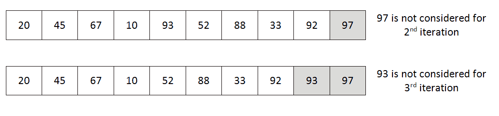
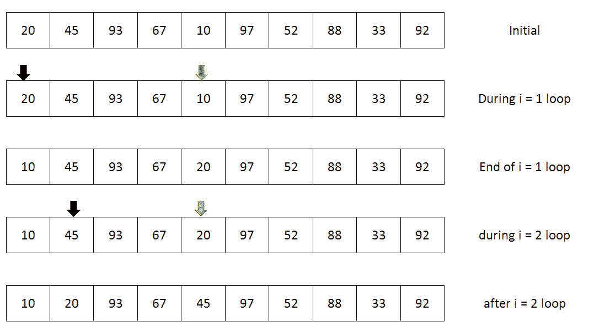
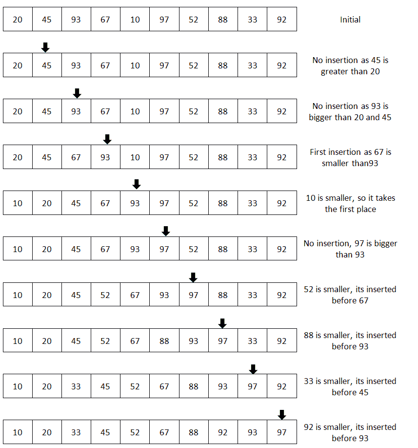
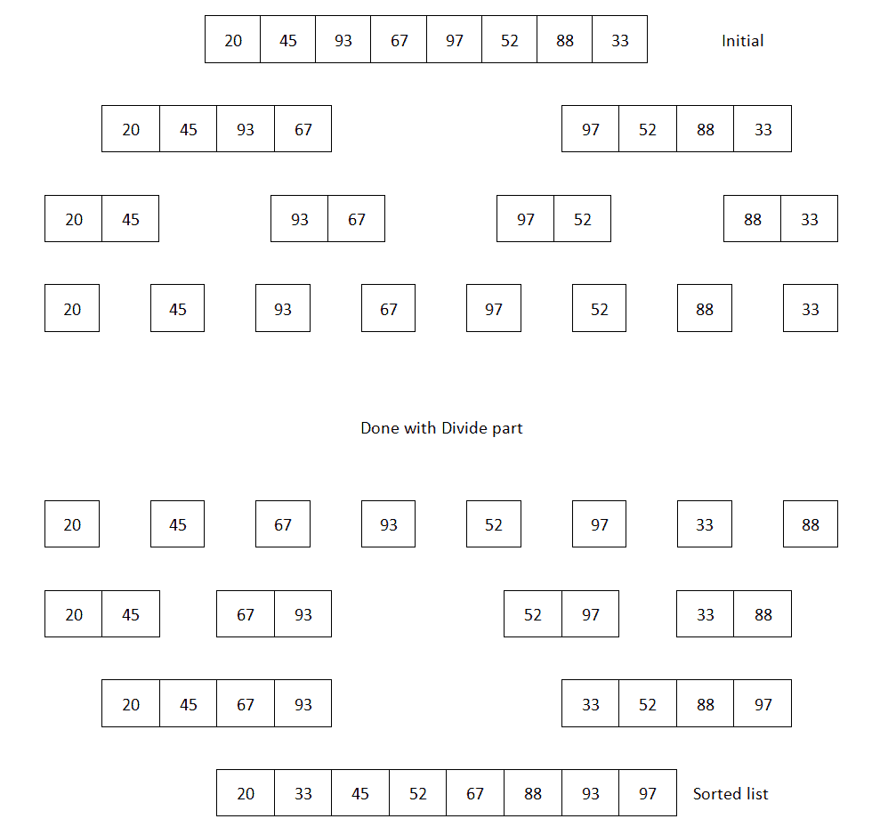
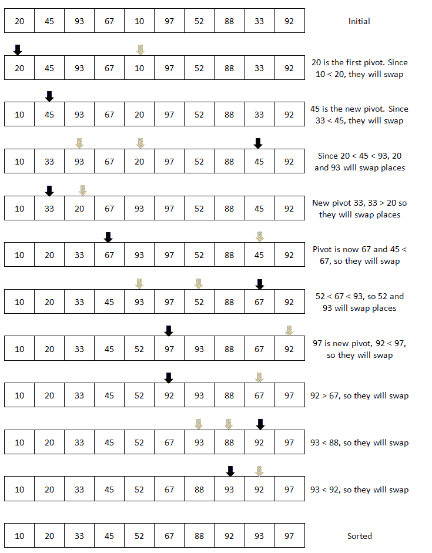

# 使用排序算法

排序是计算机编程中最常用的算法之一。即使在日常生活中，如果事物没有排序，我们也会遇到困难。排序可以为集合中的项目提供更快的搜索或排序方式。排序可以以许多不同的方式进行，例如按升序或降序进行。排序也可以基于数据类型进行。例如，对名称集合进行排序将需要按字典顺序排序而不是按数字排序。由于排序对其他数据结构及其效率起着重要作用，因此有许多不同的排序算法可供选择。在本章中，我们将探讨一些最流行的排序算法，以及它们的复杂性和用途。

# 理解排序及其类型

排序意味着数据的排序顺序。通常，我们的数据是未排序的，这意味着我们需要一种排序方式。通常，排序是通过将不同的元素进行比较并得出排名来完成的。在大多数情况下，如果没有比较，我们无法决定排序部分。比较之后，我们还需要交换元素，以便重新排序它们。一个好的排序算法具有最小数量的比较和交换的特点。还有一种非比较排序，它不需要比较就可以对项目列表进行排序。我们也将在本章中探讨这些算法。

根据数据集的类型、方向、计算复杂性、内存使用、空间使用等不同标准，排序可以分为不同类型。以下是本章中我们将探讨的一些排序算法：

+   冒泡排序

+   插入排序

+   选择排序

+   快速排序

+   归并排序

+   桶排序

我们将把讨论限制在上面的列表中，因为它们是最常用的排序算法，可以根据不同的标准进行分组和分类，比如简单排序、高效排序、分布排序等等。我们现在将探讨每种排序功能、它们的实现以及复杂性分析，以及它们的优缺点。让我们从最常用的排序算法——冒泡排序开始。

# 理解冒泡排序

冒泡排序是编程世界中最常用的排序算法。大多数程序员都是从这个算法开始学习排序的。它是一种基于比较的排序算法，通常被认为是最低效的排序算法之一。它需要最大数量的比较，平均情况和最坏情况的复杂性是相同的。

在冒泡排序中，列表的每个项目都与其余项目进行比较，并在需要时进行交换。这对列表中的每个项目都会继续进行。我们可以按升序或降序进行排序。以下是冒泡排序的伪算法：

```php
procedure bubbleSort( A : list of sortable items ) 

   n = length(A) 

   for i = 0 to n inclusive do  

     for j = 0 to n-1 inclusive do 

       if A[j] > A[j+1] then 

         swap( A[j], A[j+1] ) 

       end if 

     end for 

   end for 

end procedure

```

从上面的伪代码中可以看出，我们运行一个循环来确保迭代列表的每个项目。内部循环确保一旦我们指向一个项目，我们就会将该项目与列表中的其他项目进行比较。根据我们的偏好，我们可以交换这两个项目。以下图片显示了对列表中的一个项目进行排序的单次迭代。假设我们的列表包含以下项目：20，45，93，67，10，97，52，88，33，92。对于第一次通过（迭代）来排序第一个项目，将采取以下步骤：

（图片）

如果我们检查上面的图片，我们可以看到我们正在比较两个数字，然后决定是否要交换/交换项目。背景颜色的项目显示了我们正在比较的两个项目。正如我们所看到的，外部循环的第一次迭代导致将最顶部的项目存储在列表中的最顶部位置。这将持续进行，直到我们迭代列表中的每个项目。

现在让我们使用 PHP 来实现冒泡排序算法。

# 使用 PHP 实现冒泡排序

由于我们假设未排序的数字将在一个列表中，我们可以使用 PHP 数组来表示未排序数字的列表。由于数组既有索引又有值，我们可以利用数组来轻松地根据位置迭代每个项目，并在适用的情况下进行交换。根据我们的伪代码，代码将如下所示：

```php
function bubbleSort(array $arr): array { 

    $len = count($arr); 

    for ($i = 0; $i < $len; $i++) { 

      for ($j = 0; $j < $len - 1; $j++) { 

          if ($arr[$j] > $arr[$j + 1]) { 

            $tmp = $arr[$j + 1]; 

            $arr[$j + 1] = $arr[$j]; 

            $arr[$j] = $tmp; 

          } 

      } 

    }     

    return $arr; 

}

```

正如我们所看到的，我们使用两个`for`循环来迭代每个项目并与其余项目进行比较。交换是在以下行中完成的：

```php
$tmp = $arr[$j + 1];

$arr[$j + 1] = $arr[$j];

$arr[$j] = $tmp;

```

首先，我们将第二个值分配给名为`$tmp`的临时变量。然后，我们将第一个值分配给第二个值，并重新分配临时值给第一个值。这被称为使用第三个或临时变量交换两个变量。

只有在第一个值大于第二个值时才进行交换。否则，我们就忽略。图像右侧的注释显示了是否发生了交换。如果我们想按降序（较大的数字优先）对其进行排序，那么我们只需修改`if`条件如下：

```php
if ($arr[$j] < $arr[$j + 1]) {

}

```

现在，让我们按照以下方式运行代码：

```php
$arr = [20, 45, 93, 67, 10, 97, 52, 88, 33, 92]; 

$sortedArray = bubbleSort($arr); 

echo implode(",", $sortedArray); 

```

这将产生以下输出：

```php
10,20,33,45,52,67,88,92,93,97

```

因此，我们可以看到数组使用冒泡排序算法进行了排序。现在，让我们讨论算法的复杂性。

# 冒泡排序的复杂性

对于第一次通过，在最坏的情况下，我们必须进行*n-1*次比较和交换。对于第*n-1*次通过，在最坏的情况下，我们只需要进行一次比较和交换。因此，如果我们一步一步地写出来，我们会看到：

*复杂度= n - 1 + n - 2 + .......... + 2 + 1 = n * ( n - 1)/2 = O(n² )*

因此，冒泡排序的复杂度是`O(n² )`。然而，分配临时变量、交换、遍历内部循环等都需要一些常数时间。我们可以忽略它们，因为它们是常数。

这是冒泡排序的时间复杂度表，包括最佳情况、平均情况和最坏情况：

| 最佳时间复杂度 | `Ω(n)` |
| --- | --- |
| 最坏时间复杂度为`O(n² )` |
| 平均时间复杂度 | `Θ(n² )` |
| 空间复杂度（最坏情况） | `O(1)` |

尽管冒泡排序的时间复杂度为`O(n² )`，我们仍然可以应用一些改进来减少比较和交换的次数。现在让我们探讨这些选项。最佳时间为`Ω(n)`，因为我们至少需要一个内部循环来运行以找出数组已经排序。

# 改进冒泡排序算法

冒泡排序最重要的一个方面是，对于外部循环中的每次迭代，至少会有一次交换。如果没有交换，那么列表已经排序。我们可以利用这一改进在我们的伪代码中重新定义它：

```php
procedure bubbleSort( A : list of sortable items ) 

   n = length(A) 

   for i = 1 to n inclusive do  

     swapped = false 

     for j = 1 to n-1 inclusive do 

       if A[j] > A[j+1] then 

         swap( A[j], A[j+1] ) 

         swapped = true 

       end if 

     end for 

     if swapped is false 

        break 

     end if 

   end for 

end procedure

```

正如我们现在所看到的，我们现在为每次迭代设置了一个`false`标志，并且我们期望，在内部迭代中，标志将被设置为`true`。如果在内部循环完成后标志仍然为 false，则我们可以中断循环，以便标记列表为已排序。这是改进算法的实现：

```php
function bubbleSort(array $arr): array { 

    $len = count($arr); 

    for ($i = 0; $i < $len; $i++) { 

      $swapped = FALSE; 

      for ($j = 0; $j < $len - 1; $j++) { 

          if ($arr[$j] > $arr[$j + 1]) { 

            $tmp = $arr[$j + 1]; 

            $arr[$j + 1] = $arr[$j]; 

            $arr[$j] = $tmp; 

            $swapped = TRUE; 

          } 

      } 

         if(! $swapped) break; 

    }     

    return $arr; 

} 

```

另一个观察是，在第一次迭代中，顶部项目被放置在数组的右侧。在第二次循环中，第二个顶部项目将位于数组的右侧第二个位置。如果我们可以想象每次迭代后，第 i 个单元格已经存储了已排序的项目，那么就没有必要访问该索引并进行比较。因此，我们可以减少外部迭代次数和内部迭代次数，并大幅减少比较。这是我们提出的第二个改进的伪代码：

```php
procedure bubbleSort( A : list of sortable items ) 

   n = length(A) 

   for i = 1 to n inclusive do  

     swapped = false 

     for j = 1 to n-i-1 inclusive do 

       if A[j] > A[j+1] then 

         swap( A[j], A[j+1] ) 

         swapped = true 

       end if 

     end for 

     if swapped is false 

        break 

     end if 

   end for 

end procedure 

```

现在，让我们用 PHP 实现最终改进的版本：

```php
function bubbleSort(array $arr): array {

    $len = count($arr); 

    for ($i = 0; $i < $len; $i++) { 

      $swapped = FALSE; 

      for ($j = 0; $j < $len - $i - 1; $j++) { 

          if ($arr[$j] > $arr[$j + 1]) { 

            $tmp = $arr[$j + 1]; 

            $arr[$j + 1] = $arr[$j]; 

            $arr[$j] = $tmp; 

            $swapped = TRUE; 

          } 

      } 

      if(! $swapped) break; 

    }     

    return $arr; 

} 

```

如果我们看一下前面代码中的内部循环，唯一的区别是 `$j < $len - $i - 1` ；其他部分与第一次改进相同。所以，基本上，对于我们的 **20** , **45** , **93** , **67** , **10** , **97** , **52** , **88** , **33** , **92** 列表，我们可以很容易地说，在第一次迭代之后，顶部的数字 **97** 将不会被考虑进行第二次迭代比较。同样， **93** 也将不会被考虑进行第三次迭代，就像下面的图片一样：



如果我们看前面的图片，立即冒出的问题是“**92** 已经排序了吗？我们需要再次比较所有数字并标记 **92** 已经在其位置上排序了吗？”是的，我们是对的。这是一个有效的问题。这意味着我们可以知道，在内部循环中我们上次交换的位置；之后，数组已经排序。因此，我们可以为下一个循环设置一个边界，直到那时，只比较我们设置的边界之前的部分。以下是此操作的伪代码：

```php
procedure bubbleSort( A : list of sortable items )

   n = length(A)

   bound = n -1

   for i = 1 to n inclusive do

     swapped = false

     newbound = 0

     for j = 1 to bound inclusive do

       if A[j] > A[j+1] then

         swap( A[j], A[j+1] )

            swapped = true

            newbound = j

       end if

     end for

     bound = newbound

     if swapped is false

        break

     end if

   end for

end procedure

```

在这里，我们在每次内部循环完成后设置边界，并确保我们不会进行不必要的迭代。以下是使用前面伪代码的实际 PHP 代码：

```php
function bubbleSort(array $arr): array {

    $len = count($arr);

    $count = 0;

    $bound = $len-1;

    for ($i = 0; $i < $len; $i++) {

     $swapped = FALSE;

     $newBound = 0;

      for ($j = 0; $j < $bound; $j++) {

          $count++;

          if ($arr[$j] > $arr[$j + 1]) {

            $tmp = $arr[$j + 1];

            $arr[$j + 1] = $arr[$j];

            $arr[$j] = $tmp;

            $swapped = TRUE;

            $newBound = $j;

          }

      }

     $bound = $newBound;

     if(! $swapped) break;

    }

    echo $count."\n";

    return $arr;

}

```

我们已经看到了冒泡排序实现的不同变体，但输出始终相同：**10** , **20** , **33** , **45** , **52** , **67** , **88** , **92** , **93** , **97** 。如果是这种情况，那么我们如何确定我们的改进实际上对算法产生了一些影响呢？以下是我们的初始列表 20, 45, 93, 67, 10, 97, 52, 88, 33, 92 的所有四种实现的比较次数的一些统计数据：

| **解决方案** | **比较次数** |
| --- | --- |
| 常规冒泡排序 | 90 |
| 第一次改进后 | 63 |
| 第二次改进后 | 42 |
| 第三次改进后 | 38 |

正如我们所看到的，我们通过改进将比较次数从 **90** 减少到 **38** 。因此，我们可以肯定地通过一些改进来提高算法，以减少所需的比较次数。

# 理解选择排序

选择排序是另一种基于比较的排序算法，看起来类似于冒泡排序。最大的区别在于它进行的交换次数比冒泡排序少。在选择排序中，我们首先找到数组的最小/最大项，并将其放在第一个位置。如果我们按降序排序，那么我们将从数组中取得最大值。对于升序排序，我们将取得最小值。在第二次迭代中，我们将找到数组的第二大或第二小值，并将其放在第二个位置。这样一直进行，直到我们将每个数字放在正确排序的位置上。这就是选择排序。选择排序的伪代码如下所示：

```php
procedure selectionSort( A : list of sortable items )

   n = length(A)

   for i = 1 to n inclusive do

     min = i

     for j = i+1 to n inclusive do

       if A[j] < A[min] then

         min = j

       end if

     end for

     if min != i

        swap(a[i],a[min])

     end if

   end for

end procedure

```

如果我们看前面的算法，我们可以看到，在外部循环的第一次迭代之后，第一个最小项被存储在位置一。在第一次迭代中，我们选择了第一项，然后从剩余项（从 2 到 *n* ）中找到最小值。我们假设第一项是最小值。如果我们找到另一个最小值，我们会标记它的位置，直到我们扫描了剩余列表并找到了一个新的最小值。如果没有找到最小值，那么我们的假设是正确的，那确实是最小值。这里是一个图示，说明了我们的 **20** , **45** , **93** , **67** , **10** , **97** , **52** , **88** , **33** , **92** 数组在选择排序的前两个步骤中的情况：



如前面的图像所示，我们从列表中的第一个项目**20**开始。然后，我们从数组的其余部分找到最小值**10**。在第一次迭代结束时，我们只交换了两个位置的值（由箭头标记）。因此，在第一次迭代结束时，我们将数组的最小值存储在第一个位置。然后，我们指向下一个项目**45**，并开始从其位置右侧找到与**45**相比的下一个最小项目。我们从剩余项目中找到**20**（如两个箭头所示）。在第二次迭代结束时，我们只是将第二个位置的数字与列表剩余部分中新找到的最小数字进行交换。这将持续到最后一个元素，并且在过程结束时，我们将得到一个排序好的数组列表。现在让我们将伪代码转换为 PHP 代码。

# 实现选择排序

我们将采用与冒泡排序相同的方法，其中我们的实现将以数组作为参数并返回一个排序好的数组。以下是 PHP 中的实现：

```php
function selectionSort(array $arr): array {

    $len = count($arr);

    for ($i = 0; $i < $len; $i++) {

      $min = $i;

      for ($j = $i+1; $j < $len; $j++) {

          if ($arr[$j] < $arr[$min]) {

            $min = $j;

          }

      }

      if ($min != $i) {

          $tmp = $arr[$i];

          $arr[$i] = $arr[$min];

          $arr[$min] = $tmp;

      }

    }

    return $arr;

}

```

正如我们所看到的，这是按升序对数组进行排序的最简单方法。如果要按降序排序，我们只需要将比较`$arr[$j] < $arr[$min]`更改为`$arr[$j] > $arr[$min]`，并将`$min`替换为`$max`。

# 选择排序的复杂度

选择排序看起来也与冒泡排序相似，并且有两个 0 到*n*的`for`循环。冒泡排序和选择排序的基本区别在于，选择排序最多进行*n-1*次交换，而冒泡排序在最坏的情况下可能进行*n*n*次交换。然而，在选择排序中，最佳情况、最坏情况和平均情况的复杂度相似。以下是选择排序的复杂度图表：

| 最佳时间复杂度 | `Ω(n²)` |
| --- | --- |
| 最坏时间复杂度 | `O(n²)` |
| 平均时间复杂度 | `Θ(n²)` |
| 空间复杂度（最坏情况） | `O(1)` |

# 理解插入排序

到目前为止，我们已经看到了两种基于比较的排序算法。现在，我们将探讨另一种排序算法，与前两种相比效率要高一些。我们说的是插入排序。与我们刚刚看到的另外两种排序算法相比，它的实现最简单。如果项目数量较小，插入排序比冒泡排序和选择排序效果更好。如果数据集很大，那么它就会变得效率低下，就像冒泡排序一样。由于插入排序的交换几乎是线性的，建议您使用插入排序而不是冒泡排序和选择排序。

顾名思义，插入排序是根据将数字插入到左侧正确位置的原则工作的。它从数组的第二个项目开始，并检查左侧的项目是否小于当前值。如果是，它会移动项目并将较小的项目存储在其正确的位置。然后，它移动到下一个项目，并且相同的原则一直持续到整个数组排序完成。插入排序的伪代码如下：

```php
procedure insertionSort( A : list of sortable items )

   n = length(A)

   for i = 1 to n inclusive do

     key = A[i]

     j = i - 1

     while j >= 0 and A[j] > key   do

       A[j+1] = A[j]

       j--

     end while

     A[j+1] = key

   end for

end procedure

```

如果我们考虑我们之前用于冒泡排序和选择排序的数字列表，那么我们必须进行插入排序。

我们数组的元素是：**20**，**45**，**93**，**67**，**10**，**97**，**52**，**88**，**33**，**92**。

让我们从第二个项目开始，即**45**。现在，我们将从**45**左边的第一个项目开始，并转到数组的开头，看看左边是否有大于**45**的值。由于只有**20**，因此不需要插入，因为到目前为止的项目已经排序好了（**20**，**45**）。现在，我们将指针移动到**93**，并且再次开始，从数组的左边开始比较并搜索是否有更大的值。由于**45**不大于**93**，因此停在那里，就像之前一样，我们得出前两个项目已经排序好了的结论。现在，我们有前三个项目（**20**，**45**，**93**）排序好了。接下来是**67**，我们再次从左边的数字开始比较。左边的第一个数字是**93**，比较大，因此必须移动一个位置。我们将**93**移动到**67**的位置。然后，我们移动到左边的下一个项目，即**45**。**45**小于**67**，不需要进一步比较。现在，我们将**67**插入到**93**的位置，**93**将移动到**67**的位置。这将一直持续到整个数组排序好。这张图片说明了使用插入排序的完整排序过程的每一步：



# 实现插入排序

我们将以与其他两种排序类似的方式实现插入排序，但有细微差别。这次，我们将数组作为引用传递。通过这样做，我们将不需要从函数中返回任何值。如果需要的话，我们也可以按值传递参数并在函数结束时返回数组。以下是此代码：

```php
function insertionSort(array &$arr) { 

    $len = count($arr); 

    for ($i = 1; $i < $len; $i++) { 

      $key = $arr[$i]; 

      $j = $i - 1; 

      while($j >= 0 && $arr[$j] > $key) { 

          $arr[$j+1] = $arr[$j]; 

          $j--; 

      }      

      $arr[$j+1] = $key; 

    }     

}

```

参数数组通过引用（`&$arr`）传递给函数。因此，原始数组而不是副本将直接被修改。现在，我们想要运行代码并检查输出。为此，我们必须运行以下代码：

```php
$arr = [20, 45, 93, 67, 10, 97, 52, 88, 33, 92];

insertionSort($arr);

echo implode(",", $arr);

```

这将产生与前两种情况相同的输出。唯一的区别是我们不期望从函数中返回任何数组，并且不将其存储到任何新变量中。

如果我们通过引用传递数组，那么我们就不需要返回数组。传递的数组将在函数内部被修改。我们可以选择如何实现排序。

# 插入排序的复杂性

插入排序的复杂性类似于冒泡排序。与冒泡排序的基本区别在于交换的次数比冒泡排序要少得多。这是插入排序的复杂性：

| 最佳时间复杂度 | `Ω(n)` |
| --- | --- |
| 最坏时间复杂度 | `O(n²)` |
| 平均时间复杂度 | `Θ(n²)` |
| 空间复杂度（最坏情况） | `O(1)` |

# 理解用于排序的分治技术

到目前为止，我们已经探讨了使用完整数字列表的排序选项。结果，我们每次都有一个大的数字列表进行比较。如果我们可以以某种方式使列表变小，这个问题就可以解决。分治法对我们非常有帮助。通过这种方法，我们将问题分解为两个或更多的子问题或集合，然后解决较小的问题，然后将所有这些子问题的结果组合起来得到最终结果。这就是所谓的分治法。

分治法可以让我们有效地解决排序问题，并减少算法的复杂性。最流行的两种排序算法是归并排序和快速排序，它们应用分治算法来对项目列表进行排序，因此被认为是最好的排序算法。现在，我们将在下一节中探讨这两种算法。

# 理解归并排序

正如我们已经知道的，归并排序应用分而治之的方法来解决排序问题，我们需要找出两个过程来解决这个问题。第一个是将问题集分解成足够小的问题，然后合并这些结果。我们将在这里应用递归方法来进行分而治之。以下图像显示了如何采取分而治之的方法。我们现在将考虑一个较小的数字列表**20**，**45**，**93**，**67**，**97**，**52**，**88**，**33**来解释分而治之的部分：



根据前面的图像，我们现在可以开始准备我们的伪代码，它将有两部分 - 分割和征服。以下是实现这一点的伪代码

`func` mergesort ( A : sortable items 的数组):

```php

     n = length(A)      

     if ( n == 1 ) return a 

     var l1 as array = a[0] ... a[n/2] 

     var l2 as array = a[n/2+1] ... a[n] 

     l1 = mergesort( l1 ) 

     l2 = mergesort( l2 ) 

     return merge( l1, l2 ) 

end func

func merge( a: array, b : array )

     c = array

     while ( a and b have elements )

          if ( a[0] > b[0] )

               add b[0] to the end of c

               remove b[0] from b

          else

               add a[0] to the end of c

               remove a[0] from a

     end while

     while ( a has elements )

          add a[0] to the end of c

          remove a[0] from a

     end while

     while ( b has elements )

          add b[0] to the end of c

          remove b[0] from b

     return c

     end while

end func

```

我们伪代码的第一部分显示了分割过程。我们将数组分割直到达到大小为 1 的程度。然后，我们开始使用合并函数合并结果。在合并函数中，我们有一个数组来存储合并的结果。因此，归并排序实际上比我们迄今为止看到的其他算法具有更多的空间复杂度。现在，让我们开始编码并使用 PHP 实现这个伪代码。

# 实现归并排序

我们首先写出分割部分，然后是合并或征服部分。PHP 有一些内置函数可以拆分数组。我们将使用`array_slice`函数来进行拆分。以下是执行此操作的代码：

```php
function mergeSort(array $arr): array { 

    $len = count($arr); 

    $mid = (int) $len / 2; 

    if ($len == 1) 

         return $arr; 

    $left  = mergeSort(array_slice($arr, 0, $mid)); 

    $right = mergeSort(array_slice($arr, $mid)); 

    return merge($left, $right); 

}

```

从代码中可以看出，我们以递归的方式分割数组，直到数组大小变为 1。当数组大小为 1 时，我们开始向后合并，就像最后一个图像一样。以下是合并函数的代码，它将接受两个数组，并根据我们的伪代码将它们合并成一个：

```php
function merge(array $left, array $right): array { 

    $combined = []; 

    $countLeft = count($left); 

    $countRight = count($right); 

    $leftIndex = $rightIndex = 0; 

    while ($leftIndex < $countLeft && $rightIndex < $countRight) { 

      if ($left[$leftIndex] > $right[$rightIndex]) { 

          $combined[] = $right[$rightIndex]; 

          $rightIndex++; 

      } else { 

          $combined[] = $left[$leftIndex]; 

          $leftIndex++; 

      } 

    } 

    while ($leftIndex < $countLeft) { 

      $combined[] = $left[$leftIndex]; 

      $leftIndex++; 

    } 

    while ($rightIndex < $countRight) { 

      $combined[] = $right[$rightIndex]; 

      $rightIndex++; 

    } 

    return $combined;

}

```

现在代码已经完成，因为我们已经合并了两个提供的数组，并将合并的结果返回给`mergeSort`函数。我们刚刚以递归的方式解决了问题。如果你运行以下代码，你将得到一个按升序排列的项目列表：

```php
$arr = [20, 45, 93, 67, 10, 97, 52, 88, 33, 92];

$arr = mergeSort($arr);

echo implode(",", $arr);

```

现在，让我们探讨归并排序的复杂度。

# 归并排序的复杂度

由于归并排序遵循分而治之的方法，我们必须在这里解决两种复杂性。对于一个大小为 n 的数组，我们首先需要将数组分成两半，然后合并它们以获得一个大小为 n 的数组。这可以用`T(n)`来表示：

```php
T(n)     = T(n/2) + T(n/2) + n    , for N>1 with T(1) = 0 

         = 2 T(n/2)+n 

T(n)/n   = 2 T(n/2)/n + 1              // divide both side by n 

         = T(n/2)/(n/2)  + 1                  

         = T(n/4)/(n/4)  + 1+ 1        // telescoping 

         = T(n/8)/(n/8)  + 1+ 1 + 1      // again telescoping 

         = ...... 

         = T(n/n)/(n/n)  + 1 + 1 + 1 + ....... + 1 

         = log (n)                     // since T(1) = 0      

So T(n)  = n log (n)                   // multiply both side with n 

```

因此，归并排序的复杂度是`O(n log(n))`。以下是归并排序的复杂度图表：

| 最佳时间复杂度 | `Ω(nlog(n))` |
| --- | --- |
| 最坏时间复杂度 | `O(nlog(n))` |
| 平均时间复杂度 | `Θ(nlog(n))` |
| 空间复杂度（最坏情况） | `O(n)` |

# 理解快速排序

快速排序是另一种应用分而治之方法的高效排序算法。虽然它不像归并排序那样均等地分割，但它创建动态分区来对数据进行排序。这就是快速排序的工作原理：

1.  从数组中选择一个随机值，我们称之为枢轴。

1.  重新排列数组，使小于枢轴的项目移到它的左边，大于或等于枢轴的项目移到它的右边。这就是分区。

1.  递归调用*步骤 1*和*步骤 2*来解决两个子数组（枢轴的左边和右边）的问题，直到所有项目都排序完成。

从数组中选择一个枢轴的方法有很多种。我们可以选择数组的最左边的项目或最右边的项目。在这两种情况下，如果数组已经排序，它将达到最坏情况的复杂度。选择一个好的枢轴可以提高算法的效率。有一些不同的分区方法。我们将解释*Hoare Partition*，它比其他分区方法进行了更少的交换。以下是我们的快速排序的伪算法。我们将进行原地排序，因此不需要额外的空间：

```php
procedure Quicksort(A : array,p :int ,r: int)

    if (p < r)

       q = Partition(A,p,r)

       Quicksort(A,p,q)

       Quicksort(A,q+1,r)

    end if

end procedure

procedure Partition(A : array,p :int ,r: int)

    pivot = A[p]

    i = p-1

    j = r+1

    while (true)

           do

            i := i + 1

           while A[i] < pivot    

           do

             j := j - 1

           while A[j] > pivot

      if i < j then

          swap A[i] with A[j]

      else

          return j

      end if

   end while

end procedure

```

我们使用第一个项目作为枢轴元素。我们也可以选择最后一个项目或取中值来选择枢轴元素。现在让我们使用 PHP 来实现算法。

# 实现快速排序

如伪代码所示，我们将有两个函数来实现快速排序：一个函数用于执行快速排序本身，另一个用于分区。以下是执行快速排序的实现：

```php
function quickSort(array &$arr, int $p, int $r) {

  if($p < $r) {

    $q = partition($arr, $p, $r);

    quickSort($arr, $p, $q);

    quickSort($arr, $q+1, $r);

  }

}

```

以下是执行分区的实现：

```php
function partition(array &$arr, int $p, int $r){ 

  $pivot = $arr[$p]; 

  $i = $p-1; 

  $j = $r+1; 

  while(true) 

  { 

   do { 

    $i++; 

   } while($arr[$i] < $pivot && $arr[$i] != $pivot); 

   do { 

    $j--; 

   } while($arr[$j] > $pivot && $arr[$j] != $pivot); 

   if($i < $j) { 

    $temp = $arr[$i]; 

    $arr[$i] = $arr[$j]; 

    $arr[$j] = $temp; 

   } else { 

    return $j; 

      } 

  } 

}

 $arr = [20, 45, 93, 67, 10, 97, 52, 88, 33, 92]; 

quickSort($arr, 0, count($arr)-1); 

echo implode(",", $arr);

```

如果我们在分区中直观地说明枢轴和排序，我们可以看到以下图像。为简单起见，我们只显示了发生交换的步骤：



# 快速排序的复杂性

快速排序的最坏情况复杂度可能与冒泡排序的复杂度相似。实际上是由于枢轴的选择导致的。以下是快速排序的复杂性图表：

| 最佳时间复杂度 | `Ω(nlog(n))` |
| --- | --- |
| 最坏时间复杂度 | `O(n²)` |
| 平均时间复杂度 | `Θ(nlog(n))` |
| 空间复杂度（最坏情况） | `O(log(n))` |

# 理解桶排序

桶排序也被称为箱排序。桶排序是一种分布排序系统，其中数组元素被放置在不同的桶中。然后每个桶都单独排序，可以使用另一个排序算法，或者应用递归桶排序。使用 PHP 实现桶排序可能如下所示：

```php
function bucketSort(array &$data) { 

    $n = count($data); 

    if ($n <= 0) 

         return;                          

    $min = min($data); 

    $max = max($data); 

    $bucket = []; 

    $bLen = $max - $min + 1; 

    $bucket = array_fill(0, $bLen, []); 

    for ($i = 0; $i < $n; $i++) { 

         array_push($bucket[$data[$i] - $min], $data[$i]); 

    } 

    $k = 0; 

    for ($i = 0; $i < $bLen; $i++) {

         $bCount = count($bucket[$i]);

      for ($j = 0; $j < $bCount; $j++) { 

          $data[$k] = $bucket[$i][$j];

          $k++;

      }

    }

} 

```

桶排序的时间复杂度比其他基于比较的排序算法要好。以下是桶排序的复杂性：

| 最佳时间复杂度 | `Ω(n+k)` |
| --- | --- |
| 最坏时间复杂度 | `O(n²)` |
| 平均时间复杂度 | `Θ(n+k)` |
| 空间复杂度（最坏情况） | `O(n)` |

# 使用 PHP 的内置排序函数

PHP 具有丰富的预定义函数库，其中还包括不同的排序函数。它有不同的函数来按值或按键/索引对数组中的项目进行排序。在进行排序时，我们还可以保持数组值与其相应键的关联。PHP 的另一个重要函数是用于对多维数组进行排序的内置函数。以下是这些函数的摘要：

| **函数名称** | **目的** |
| --- | --- |
| `sort()` | 这将按升序对数组进行排序。不保留值/键关联。 |
| `rsort()` | 按照逆序/降序对数组进行排序。不保留索引/键关联。 |
| `asort()` | 在保持索引关联的同时对数组进行排序。 |
| `arsort()` | 以逆序排序数组并保持索引关联。 |
| `ksort()` | 按键对数组进行排序。它保持键与数据的关联。这主要适用于关联数组。 |
| `krsort()` | 按键以逆序排序数组。 |
| `natsort()` | 使用自然顺序算法对数组进行排序，并保持值/键关联。 |
| `natcasesort()` | 使用不区分大小写的“自然顺序”算法对数组进行排序，并保持值/键关联。 |

| `usort()` | 使用用户定义的比较函数按值对数组进行排序，并且不保持值/键关联。

第二个参数是一个可调用的比较函数。 |

| `uksort()` | 使用用户定义的比较函数按键对数组进行排序，并保持值/键关联。

第二个参数是一个可调用的比较函数。 |

| `uasort()` | 使用用户定义的比较函数按值对数组进行排序，并保持值/键关联。

第二个参数是一个可调用的比较函数。 |

对于`sort`，`rsort`，`ksort`，`krsort`，`asort`和`arsort`，可以使用以下排序标志：

+   **SORT_REGULAR**：按原样比较项目（不更改类型）

+   **SORT_NUMERIC**：按数字比较项目

+   **SORT_STRING**：将项目作为字符串进行比较

+   **SORT_LOCALE_STRING**：根据当前区域设置将项目作为字符串进行比较

+   **SORT_NATURAL**：使用“自然顺序”将项目比较为字符串

# 摘要

在本章中，您了解了不同的排序算法。排序是我们开发过程中的一个重要部分，了解不同的排序算法及其复杂性将帮助我们根据问题集选择最佳的排序算法。还有其他排序算法，可以在网上找到进行进一步研究。我们故意没有在本章中涵盖堆排序，因为我们将在*第十章*中讨论。在下一章中，我们将讨论另一个关于算法的重要主题 - 搜索。
