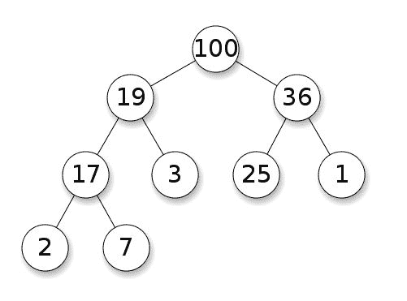

# 理解和使用堆

堆是一种基于树抽象数据类型的专门数据结构，用于许多算法和数据结构。可以使用堆构建的常见数据结构是优先队列。而基于堆数据结构的最流行和高效的排序算法之一是堆排序。在本章中，我们将讨论堆的属性、不同的堆变体和堆操作。随着我们在本章的进展，我们还将使用 SPL 实现堆。我们现在将在下一节探讨堆及其定义。

# 什么是堆？

根据定义，堆是一种支持堆属性的专门树数据结构。堆属性被定义为堆结构的根节点要么比其子节点小，要么比其子节点大。如果父节点大于子节点，则称为最大堆，如果父节点小于子节点，则称为最小堆。以下图显示了最大堆的示例：



如果我们看根节点，值**100**大于两个子节点**19**和**36**。同样对于**19**，该值大于**17**和**3**。对**36**和**17**也适用相同的规则。从树结构中可以看出，树并没有完全排序或有序。但重要的事实是我们总是可以在树的根部找到最大值或最小值，这对于许多用例来说非常高效。

堆结构有许多变体，如二叉堆、b-堆、斐波那契堆、三元堆、treap、弱堆等。二叉堆是堆实现中最流行的之一。二叉堆是一棵完全二叉树，其中树的所有内部级别都是完全填充的。最后一级可以完全填充或部分填充。由于我们考虑的是二叉堆，我们可以在对数时间内执行大多数操作。在本书中，我们将专注于二叉堆的实现和操作。

# 堆操作

正如我们已经多次提到的，堆是一种专门的树数据结构，我们必须确保首先从给定的项目列表构造一个堆。由于堆具有严格的堆属性，我们必须在每一步满足堆属性。以下是堆的一些核心操作：

+   创建堆

+   插入一个新值

+   从堆中提取最小值或最大值

+   删除一个值

+   交换

从给定的项目或数字列表创建堆需要我们确保满足堆属性和二叉树属性。这意味着父节点必须大于或小于子节点，并且对树中的所有节点都成立。而且树必须始终是一棵完全二叉树。在创建堆时，我们从一个节点开始，并将新节点插入堆中。

插入节点操作有一组定义的步骤。我们不能从任意节点开始。插入操作的步骤如下：

1.  在堆的底部插入新节点。

1.  检查新节点与父节点值是否按正确顺序。如果它们按正确顺序，则停在那里。

1.  如果它们不按正确顺序，交换它们并移动到上一步，检查新交换的节点与其父节点。这一步与前一步一起被称为 sift up 或 up-heap，或 bubble-up，或 heapify-up 等。

提取操作（最小或最大）从堆中取出根节点。之后，我们必须执行以下操作，以确保剩余堆的堆属性：

1.  将堆中的最后一个节点移动为新根。

1.  将新根节点与子节点进行比较，如果它们按正确顺序，则停止。

1.  如果不是，则将根节点与子节点交换（对于`MinHeap`来说是最小子节点，对于`MaxHeap`来说是最大子节点），并继续进行上一步。这一步和前一步被称为筛选或下沉，或冒泡下沉，或堆化下沉等等。

在堆中，交换是一个重要的操作。在许多情况下，我们必须交换两个节点的两个值，而不影响树的属性。现在我们将使用 PHP 7 实现二叉堆。

# 在 PHP 中实现二叉堆

实现二叉堆的最流行的方法之一是使用数组。由于堆是完全二叉树，因此可以很容易地使用数组实现。如果我们将根项目视为索引 1，则子项目将位于索引 2 和 3。我们可以将此表示为根为*i*，左子为*2*i*，右子为*2*i +1*。此外，我们将以我们的示例实现平均堆。因此，让我们从最小堆实现的类结构开始。

首先，我们将创建一个`MinHeap`类，它将具有两个属性，一个用于存储堆数组，另一个用于任何给定时刻堆中元素的数量。以下是该类的代码：

```php
class MinHeap { 

    public $heap; 

    public $count; 

    public function __construct(int $size) { 

        $this->heap = array_fill(0, $size + 1, 0); 

        $this->count = 0; 

    } 

}

```

如果我们看一下前面的代码，我们可以看到我们已经将堆数组初始化为从 0 索引到`$size + 1`的所有 0 值。由于我们考虑将根放在索引 1 处，我们将需要一个带有额外空间的数组。现在我们需要一种方法来从给定数组构建堆。由于我们必须满足堆属性，我们必须向堆中添加一个项目，并使用 C 步骤检查堆属性是否满足。以下是通过一次插入一个项目来创建堆的代码块，以及`siftUp`过程：

```php
public function create(array $arr = []) { 

    if ($arr) { 

        foreach ($arr as $val) { 

            $this->insert($val); 

        } 

    } 

} 

public function insert(int $i) { 

    if ($this->count == 0) { 

        $this->heap[1] = $i; 

        $this->count = 2; 

    } 

    else { 

        $this->heap[$this->count++] = $i; 

        $this->siftUp(); 

    } 

} 

public function siftUp() { 

    $tmpPos = $this->count - 1; 

    $tmp = intval($tmpPos / 2); 

    while ($tmpPos > 0 &&  

    $this->heap[$tmp] > $this->heap[$tmpPos]) { 

        $this->swap($tmpPos, $tmp); 

        $tmpPos = intval($tmpPos / 2); 

        $tmp = intval($tmpPos / 2); 

    } 

} 

```

首先，我们使用`create`方法从数组构建堆。对于数组中的每个元素，我们使用`insert`方法将其插入堆中。在`insert`方法中，我们检查堆的当前大小是否为 0。如果当前大小为 0，则将第一个项目添加到索引 1，并将下一个计数器设置为 2。如果堆已经有一个项目，我们将新项目存储在最后一个位置并增加计数器。我们还调用`siftUp()`方法来确保新插入的值满足堆属性。

在`siftUp`方法中，我们考虑最后一个位置及其父位置进行比较。如果子值小于父值，我们交换它们。我们继续这样做，直到达到顶部的根节点。这个方法确保了如果插入的值在最后是最小的，它将被筛选到树中。但如果不是，树将保持不变。虽然我们已经谈到了交换，但我们还没有看到实现。这里是实现：

```php
public function swap(int $a, int $b) { 

    $tmp = $this->heap[$a]; 

    $this->heap[$a] = $this->heap[$b]; 

    $this->heap[$b] = $tmp; 

}

```

由于根元素在堆中具有最小值（我们正在实现最小堆）。`extract`方法将始终返回当前堆的最小值：

```php
    public function extractMin() { 

        $min = $this->heap[1]; 

        $this->heap[1] = $this->heap[$this->count - 1]; 

        $this->heap[--$this->count] = 0; 

        $this->siftDown(1); 

        return $min; 

    }

```

`extractMin`方法返回数组的第一个索引，并用数组的最后一个项目替换它。之后，它对新放置的根进行`siftDown`检查，以确保堆属性。由于我们正在提取根值，我们将最后一个索引值替换为 0，这是我们用于初始化堆数组的值。现在我们将编写`extract`方法，我们称之为`siftDown`方法：

```php
public function siftDown(int $k) { 

    $smallest = $k; 

    $left = 2 * $k; 

    $right = 2 * $k + 1; 

    if ($left < $this->count &&  

    $this->heap[$smallest] > $this->heap[$left]) { 

        $smallest = $left; 

    } 

    if ($right < $this->count && $this->heap[$smallest] > $this-  

      >heap[$right]) { 

        $smallest = $right; 

    }

    if ($smallest != $k) {

        $this->swap($k, $smallest); 

        $this->siftDown($smallest); 

    }

} 

```

我们认为索引`$k`处的项目是最小值。然后我们将最小值与左右子节点进行比较。如果有更小的值可用，我们将最小值与根节点交换，直到树满足堆属性。这个函数每次需要交换时都会递归调用自己。现在我们需要另一个方法来将当前堆显示为字符串。为此，我们可以编写一个小方法如下：

```php
public function display() { 

    echo implode("\t", array_slice($this->heap, 1)) . "\n"; 

}

```

现在，如果我们把所有的部分放在一起，我们就有了一个坚实的最小堆实现。让我们现在运行一个测试，看看我们的实现是否满足最小堆的属性。这是我们可以运行的代码，来构建堆并多次从堆中提取最小值：

```php
$numbers = [37, 44, 34, 65, 26, 86, 129, 83, 9]; 

echo "Initial array \n" . implode("\t", $numbers) . "\n"; 

$heap = new MinHeap(count($numbers)); 

$heap->create($numbers); 

echo "Constructed Heap\n"; 

$heap->display(); 

echo "Min Extract: " . $heap->extractMin() . "\n"; 

$heap->display(); 

echo "Min Extract: " . $heap->extractMin() . "\n"; 

$heap->display(); 

echo "Min Extract: " . $heap->extractMin() . "\n"; 

$heap->display(); 

echo "Min Extract: " . $heap->extractMin() . "\n"; 

$heap->display(); 

echo "Min Extract: " . $heap->extractMin() . "\n"; 

$heap->display(); 

echo "Min Extract: " . $heap->extractMin() . "\n"; 

$heap->display(); 

```

如果我们运行这段代码，以下输出将显示在终端中：

```php
Initial array

37      44      34      65      26      86      129     83      9

Constructed Heap

9       26      37      34      44      86      129     83      65

Min Extract: 9

26      34      37      65      44      86      129     83      0

Min Extract: 26

34      44      37      65      83      86      129     0       0

Min Extract: 34

37      44      86      65      83      129     0       0       0

Min Extract: 37

44      65      86      129     83      0       0       0       0

Min Extract: 44

65      83      86      129     0       0       0       0       0

Min Extract: 65

83      129     86      0       0       0       0       0       0

```

从前面的输出中可以看到，当我们构建最小堆时，值为`9`的最小值在根中。然后我们提取了最小值，我们从堆中取出了`9`。然后根被下一个最小值`26`取代，然后是`34`，`37`，`44`和`65`。每次我们取出最小值时，堆都会重新构建以获取最小值。由于我们已经看到了堆数据结构的所有适用操作，现在我们将分析不同堆操作的复杂度。

# 分析堆操作的复杂度

由于堆实现有不同的变体，复杂度在不同的实现中也会有所不同。堆的一个关键事实是提取操作总是需要`O(1)`的时间来从堆中获取最大或最小值。由于我们专注于二叉堆实现，我们将看到二叉堆操作的分析：

| **操作** | **复杂度 - 平均** | **复杂度 - 最坏** |
| --- | --- | --- |
| 搜索 | `O(n)` | `O(n)` |
| 插入 | `O(1)` | `O(log n)` |
| 删除 | `O(log n)` | `O(log n)` |
| 提取 | `O(1)` | `O(1)` |
| 空间 | `O(n)` | `O(n)` |

由于堆不是完全排序的，搜索操作将比常规二叉搜索树需要更多时间。

# 使用堆作为优先队列

使用堆数据结构的主要方式之一是创建优先队列。正如我们在第四章中所见，*构建栈和队列*，优先队列是特殊的队列，其中 FIFO 行为取决于元素的优先级，而不是元素添加到队列的方式。我们已经看到了使用链表和 SPL 的实现。现在我们将探索使用堆和特别是最大堆实现优先队列。

现在我们将使用`MaxHeap`来实现优先队列。在这里，最大优先级的项目首先从队列中移除。我们的实现将类似于我们上次实现的`MinHeap`，只是有一点不同。我们希望从 0 开始而不是从 1 开始。因此，左右子节点的计算也会发生变化。这将帮助我们理解使用数组构建堆的两种方法。这是`MaxHeap`类的实现：

```php
class MaxHeap { 

    public $heap; 

    public $count; 

    public function __construct(int $size) { 

        $this->heap = array_fill(0, $size, 0); 

        $this->count = 0; 

    } 

    public function create(array $arr = []) { 

        if ($arr) { 

            foreach ($arr as $val) { 

                $this->insert($val); 

            } 

        } 

    } 

    public function display() { 

        echo implode("\t", array_slice($this->heap, 0)) . "\n"; 

    } 

    public function insert(int $i) { 

    if ($this->count == 0) { 

        $this->heap[0] = $i; 

        $this->count = 1; 

    } else { 

        $this->heap[$this->count++] = $i; 

        $this->siftUp(); 

    } 

    } 

public function siftUp() { 

    $tmpPos = $this->count - 1; 

    $tmp = intval($tmpPos / 2); 

    while ($tmpPos > 0 && $this->heap[$tmp] < $this->heap[$tmpPos]) { 

        $this->swap($tmpPos, $tmp); 

        $tmpPos = intval($tmpPos / 2); 

        $tmp = intval($tmpPos / 2); 

    } 

} 

public function extractMax() { 

    $min = $this->heap[0]; 

    $this->heap[0] = $this->heap[$this->count - 1]; 

    $this->heap[$this->count - 1] = 0; 

    $this->count--; 

    $this->siftDown(0); 

    return $min; 

} 

public function siftDown(int $k) { 

    $largest= $k; 

    $left = 2 * $k + 1; 

    $right = 2 * $k + 2; 

    if ($left < $this->count  

      && $this->heap[$largest] < $this->heap[$left]) { 

        $largest = $left; 

    } 

    if ($right < $this->count  

      && $this->heap[$largest] < $this->heap[$right]) { 

        $largest = $right; 

    } 

    if ($largest!= $k) { 

        $this->swap($k, $largest); 

        $this->siftDown($largest); 

    } 

} 

    public function swap(int $a, int $b) { 

      $temp = $this->heap[$a]; 

      $this->heap[$a] = $this->heap[$b]; 

      $this->heap[$b] = $temp; 

    }

}

```

让我们来看看`MaxHeap`类的实现。我们的`MaxHeap`实现与上一节的`MinHeap`实现有一些细微的差异。第一个区别是，对于`MaxHeap`，我们有一个大小为*n*的数组，而对于`MinHeap`，我们有一个大小为*n+1*的数组。这使得我们对`MaxHeap`的插入操作从索引 0 开始插入，而在`MinHeap`中，我们从索引 1 开始。`siftUp`功能只有在新插入项的值大于即时父值时才将值移至顶部。此外，`extractMax`方法返回数组中索引 0 的第一个值，即堆中的最大值。一旦我们提取了最大值，我们需要从剩余项中获取最大值并将其存储在索引 0 处。`siftDown`函数还用于检查左侧或右侧子值是否大于父节点值，并交换值以将最大值存储在父节点处。我们继续递归地执行此操作，以确保在函数调用结束时将最大值存储在根中。如果需要，可以将此`MaxHeap`实现用作独立的堆实现。由于我们计划使用堆来实现优先级队列，因此我们将添加另一个类来扩展`MaxHeap`类，以展示优先级队列的特性。让我们探索以下代码：

```php
class PriorityQ extends MaxHeap { 

    public function __construct(int $size) {  

        parent::__construct($size); 

    } 

    public function enqueue(int $val) { 

        parent::insert($val); 

    } 

    public function dequeue() { 

        return parent::extractMax(); 

    }

}

```

在这里，我们只是扩展了`MaxHeap`类，并添加了一个包装器，使用`insert`和`extractMax`进行`enqueue`和`dequeue`操作。现在让我们用与`MinHeap`相同的数字运行`PriorityQ`代码：

```php
$numbers = [37, 44, 34, 65, 26, 86, 129, 83, 9]; 

$pq = new PriorityQ(count($numbers)); 

foreach ($numbers as $number) { 

    $pq->enqueue($number); 

} 

echo "Constructed Heap\n"; 

$pq->display(); 

echo "DeQueued: " . $pq->dequeue() . "\n"; 

$pq->display(); 

echo "DeQueued: " . $pq->dequeue() . "\n"; 

$pq->display(); 

echo "DeQueued: " . $pq->dequeue() . "\n"; 

$pq->display(); 

echo "DeQueued: " . $pq->dequeue() . "\n"; 

$pq->display(); 

echo "DeQueued: " . $pq->dequeue() . "\n"; 

$pq->display(); 

echo "DeQueued: " . $pq->dequeue() . "\n"; 

$pq->display();

```

从前面的代码中可以看出，我们并不是直接从数组构建堆。我们使用优先级队列类将每个数字入队。此外，出队操作将从队列中获取优先级最高的项。如果从命令行运行此代码，将会得到以下输出：

```php
Constructed Heap

129     86      44      83      26      34      37      65      9

DeQueued: 129

86      83      44      65      26      34      37      9       0

DeQueued: 86

83      65      44      9       26      34      37      0       0

DeQueued: 83

65      37      44      9       26      34      0       0       0

DeQueued: 65

44      37      34      9       26      0       0       0       0

DeQueued: 44

37      26      34      9       0       0       0       0       0

DeQueued: 37

34      26      9       0       0       0       0       0       0

```

从输出中可以看出，`MaxHeap`实现帮助我们在每次出队操作时获取最大值项。这是实现优先级队列的一种方式。如果需要，我们还可以一次对整个堆进行排序，然后使用排序后的数组作为优先级队列。为此，我们可以实现一个称为堆排序的排序函数。这是计算机编程中最有效和最常用的排序机制之一。现在我们将在下一节中探索这一点。

# 使用堆排序

堆排序要求我们从给定的元素列表构建堆，然后不断检查堆属性，以使整个堆始终保持排序。与常规堆不同，常规堆在新插入值满足条件后停止检查堆属性，而在堆排序实现过程中，我们继续对下一个元素进行这样的操作。堆排序的伪代码如下：

```php
Heapsort(A as array) 

    BuildHeap(A) 

    for i = n-1 to 0 

        swap(A[0], A[i]) 

        n = n - 1 

        Heapify(A, 0) 

BuildHeap(A as array) 

    n = elements_in(A) 

    for i = floor(n/2) to 0 

        Heapify(A,i) 

Heapify(A as array, i as int) 

    left = 2i+1 

    right = 2i+2 

    max = i 

    if (left <= n) and (A[left] > A[i]) 

        max = left 

    if (right<=n) and (A[right] > A[max]) 

        max = right 

    if (max != i) 

        swap(A[i], A[max]) 

        Heapify(A, max) 

```

伪代码表明，每当我们尝试对一系列元素进行排序时，起始过程取决于构建堆。每次向堆中添加一个项时，我们都会通过`heapify`函数检查是否满足堆属性。构建好堆后，我们会检查所有元素的堆属性。现在让我们根据前面的伪代码实现堆排序：

```php
function heapSort(array &$a) { 

    $length = count($a); 

    buildHeap($a); 

    $heapSize = $length - 1; 

    for ($i = $heapSize; $i >= 0; $i--) { 

      $tmp = $a[0]; 

      $a[0] = $a[$heapSize]; 

      $a[$heapSize] = $tmp; 

      $heapSize--; 

      heapify($a, 0, $heapSize); 

    } 

} 

function buildHeap(array &$a) { 

    $length = count($a); 

    $heapSize = $length - 1; 

    for ($i = ($length / 2); $i >= 0; $i--) { 

        heapify($a, $i, $heapSize); 

    } 

} 

function heapify(array &$a, int $i, int $heapSize) { 

    $largest = $i; 

    $l = 2 * $i + 1; 

    $r = 2 * $i + 2; 

    if ($l <= $heapSize && $a[$l] > $a[$i]) { 

        $largest = $l; 

    } 

    if ($r <= $heapSize && $a[$r] > $a[$largest]) { 

        $largest = $r; 

    } 

    if ($largest != $i) { 

      $tmp = $a[$i]; 

      $a[$i] = $a[$largest]; 

      $a[$largest] = $tmp; 

      heapify($a, $largest, $heapSize); 

    } 

} 

```

现在让我们使用`heapSort`函数对数组进行排序。由于我们传递的参数是按引用传递的，因此我们不会从函数中返回任何内容。实际数组将在操作结束时排序：

```php
$numbers = [37, 44, 34, 65, 26, 86, 143, 129, 9]; 

heapSort($numbers); 

echo implode("\t", $numbers); 

```

如果运行此代码，将在命令行中输出以下内容：

```php
9       26      34      37      44      65      86      129     143

```

如果我们想要将排序改为降序，我们只需要在`heapify`函数中改变比较。如果我们考虑`heapSort`算法的时间和空间复杂度，我们会发现堆排序是排序算法中最好的复杂度：

| 最佳时间复杂度 | `Ω(nlog(n))` |
| --- | --- |
| 最坏时间复杂度 | `O(nlog(n))` |
| 平均时间复杂度 | `Θ(nlog(n))` |
| 空间复杂度（最坏情况） | `O(1)` |

与归并排序相比，堆排序具有更好的空间复杂度。因此，许多开发人员更喜欢使用堆排序来对项目列表进行排序。

# 使用 SplHeap、SplMaxHeap 和 SplMinHeap

如果我们不想实现自己的堆实现，我们可以使用标准 PHP 库（SPL）中的内置堆类。SPL 有三种不同的堆实现。一种是用于通用堆的`SplHeap`，一种是用于`MaxHeap`的`SplMaxHeap`，还有一种是用于`MinHeap`的`SplMinHeap`。重要的是要知道，SPL 类在 PHP 7 上运行时并不被认为是非常高效的。因此，我们不会在这里详细探讨它们。我们只会专注于一个示例，以便如果我们使用的是 PHP 7 之外的其他版本，我们可以使用这些内置类。让我们尝试使用`SplMaxHeap`的一个示例：

```php
$numbers = [37, 44, 34, 65, 26, 86, 143, 129, 9]; 

$heap = new SplMaxHeap; 

foreach ($numbers as $number) { 

    $heap->insert($number); 

} 

while (!$heap->isEmpty()) { 

    echo $heap->extract() . "\t"; 

}

```

由于我们使用了最大堆，我们期望输出是按降序排列的。以下是从命令行输出的结果：

```php
143     129     86      65      44      37      34      26      9

```

如果我们想以另一种方式进行排序，我们可以使用`SplMinHeap`。

# 摘要

在本章中，我们学习了另一种高效的数据结构，名为堆。当我们使用堆来实现优先队列时，它们被认为是最大效率的实现。我们还学习了另一种高效的排序方法，名为堆排序，可以通过堆数据结构实现。在这里，我们将总结本书关于数据结构的讨论。在剩下的章节中，我们将专注于高级算法，算法的内置函数和数据结构，以及最后的函数式数据结构。首先，我们将在下一章中探索动态规划的世界。
