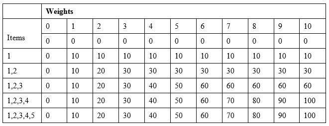
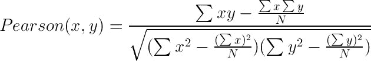

# 使用高级技术解决问题

到目前为止，我们在本书中已经探讨了不同的数据结构和算法。我们还没有探索一些最激动人心的算法领域。在计算机编程中有许多高效的方法。在本章中，我们将重点关注一些关键的高级技术和概念。这些主题非常重要，以至于可以单独写一本书来讨论它们。然而，我们将专注于对这些高级主题的基本理解。当我们说高级主题时，我们指的是记忆化、动态规划、贪婪算法、回溯、解谜、机器学习等。让我们在接下来的章节中学习一些新颖和激动人心的主题。

# 记忆化

记忆化是一种优化技术，我们在其中存储先前昂贵操作的结果，并在不重复操作的情况下使用它们。这有助于显著加快解决方案的速度。当我们遇到可以重复子问题的问题时，我们可以轻松地应用这种技术来存储这些结果，并在以后使用它们而不重复步骤。由于 PHP 对关联数组和动态数组属性有很好的支持，我们可以毫无问题地缓存结果。我们必须记住的一件事是，尽管我们通过缓存结果来节省时间，但我们需要更多的内存来存储这些结果。因此，我们必须在空间和内存之间进行权衡。现在，让我们重新访问第五章，*应用递归算法-递归*，以了解我们生成斐波那契数的递归示例。我们将只需修改该函数，添加一个计数器来知道函数被调用的次数以及函数运行时间来获取第 30 个斐波那契数。以下是此代码：

```php
$start Time = microtime(); 

$count = 0;

function fibonacci(int $n): int { 

    global $count; 

    $count++; 

    if ($n == 0) { 

        return 1; 

    } else if ($n == 1) { 

        return 1; 

    } else { 

        return fibonacci($n - 1) + fibonacci($n - 2); 

    } 

} 

echo fibonacci(30) . "\n"; 

echo "Function called: " . $count . "\n"; 

$endTime = microtime(); 

echo "time =" . ($endTime - $startTime) . "\n";

```

这将在命令行中产生以下输出。请注意，计时和结果可能会因系统不同或 PHP 版本不同而有所不同。这完全取决于程序运行的位置：

```php
1346269

Function called: 2692537

time =0.531349

```

第一个数字 1346269 是第 30 个斐波那契数，下一行显示在生成第 30 个数字时`fibonacci`函数被调用了 2692537 次。整个过程花了 0.5 秒（我们使用了 PHP 的`microtime`函数）。如果我们要生成第 50 个斐波那契数，函数调用次数将超过 400 亿次。这是一个非常大的数字。然而，我们知道根据斐波那契数列的公式，当我们计算 n 时，我们是通过 n-1 和 n-2 来计算的；这些在之前的步骤中已经计算过了。所以，我们在重复这些步骤，因此，这会浪费我们的时间和效率。现在，让我们将斐波那契结果存储在一个索引数组中，并检查我们要找的斐波那契数是否已经计算过。如果已经计算过，我们将使用它；否则，我们将计算并存储结果。以下是使用相同递归过程生成斐波那契数的修改后的代码，但是借助记忆化：

```php
$startTime = microtime(); 

$fibCache = []; 

$count = 0; 

function fibonacciMemoized(int $n): int { 

    global $fibCache; 

    global $count; 

    $count++; 

    if ($n == 0 || $n == 1) { 

        return 1; 

    } else {

    if (isset($fibCache[$n - 1])) { 

        $tmp = $fibCache[$n - 1]; 

    } else {

        $tmp = fibonacciMemoized($n - 1); 

        $fibCache[$n - 1] = $tmp; 

    } 

    if (isset($fibCache[$n - 2])) { 

        $tmp1 = $fibCache[$n - 2]; 

    } else { 

        $tmp1 = fibonacciMemoized($n - 2); 

        $fibCache[$n - 2] = $tmp1; 

    } 

    return $tmp + $tmp1; 

    } 

} 

echo fibonacciMemoized(30) . "\n"; 

echo "Function called: " . $count . "\n"; 

$endTime = microtime(); 

echo "time =" . ($endTime - $startTime) . "\n"; 

```

如前面的代码所示，我们引入了一个名为`$fibCache`的新全局变量，它将存储计算出的斐波那契数。我们还检查我们要查找的数字是否已经在数组中。如果数字已经存储在我们的缓存数组中，我们就不再计算斐波那契数。如果现在运行这段代码，我们将看到以下输出：

```php
1346269

Function called: 31

time =5.299999999997E-5

```

现在，让我们检查结果。第 30 个斐波那契数与上次相同。但是，看一下函数调用次数。只有 31 次，而不是 270 万次。现在，让我们看看时间。我们只用了 0.00005299 秒，比非记忆化版本快了 10000 倍。

通过一个简单的例子，我们可以看到我们可以通过利用适用的记忆化来优化我们的解决方案。我们必须记住的一件事是，记忆化将在我们有重复的子问题或者我们必须考虑以前的计算来计算当前或未来的计算的情况下更有效。尽管记忆化将占用额外的空间来存储部分计算的数据，但利用记忆化可以大幅提高性能

# 模式匹配算法

模式匹配是我们日常工作中执行的最常见任务之一。PHP 内置支持正则表达式，大多数情况下，我们依赖正则表达式和内置字符串函数来解决这类问题的常规需求。PHP 有一个名为`strops`的现成函数，它返回文本中字符串的第一次出现的位置。由于它只返回第一次出现的位置，我们可以尝试编写一个函数，它将返回所有可能的位置。我们首先将探讨蛮力方法，其中我们将检查实际字符串的每个字符与模式字符串的每个字符。以下是将为我们完成工作的函数：

```php
function strFindAll(string $pattern, string $txt): array { 

    $M = strlen($pattern); 

    $N = strlen($txt); 

    $positions = []; 

    for ($i = 0; $i <= $N - $M; $i++) { 

      for ($j = 0; $j < $M; $j++) 

          if ($txt[$i + $j] != $pattern[$j]) 

          break; 

      if ($j == $M) 

          $positions[] = $i; 

  }

    return $positions; 

} 

```

这种方法非常直接。我们从实际字符串的位置 0 开始，一直进行到`$N-$M`位置，其中`$M`是我们要查找的模式的长度。即使在最坏的情况下，模式没有匹配，我们也不需要搜索整个字符串。现在，让我们用一些参数调用函数：

```php
$txt = "AABAACAADAABABBBAABAA"; 

$pattern = "AABA"; 

$matches = strFindAll($pattern, $txt); 

if ($matches) { 

    foreach ($matches as $pos) { 

        echo "Pattern found at index : " . $pos . "\n"; 

    } 

} 

```

这将产生以下输出：

```php
Pattern found at index : 0

Pattern found at index : 9

Pattern found at index : 16

```

如果我们查看我们的`$txt`字符串，我们可以发现我们的模式`AABA`出现了三次。第一次是在开头，第二次是在中间，第三次是在字符串末尾附近。我们编写的算法将具有`O((N - M) * M)`的复杂度，其中 N 是文本的长度，M 是我们正在搜索的模式的长度。如果需要，我们可以使用一种称为**Knuth-Morris-Pratt**（**KMP**）字符串匹配算法的流行算法来提高这种匹配的效率。

# 实现 Knuth-Morris-Pratt 算法

Knuth-Morris-Pratt（KMP）字符串匹配算法与我们刚刚实现的朴素算法非常相似。基本区别在于 KMP 算法使用部分匹配的信息，并决定在任何不匹配时停止匹配。它还可以预先计算模式可能存在的位置，以便我们可以减少重复比较或错误检查的次数。KMP 算法预先计算了一个在搜索操作期间有助于提高效率的表。在实现 KMP 算法时，我们需要计算**最长适当前缀后缀**（**LPS**）。让我们检查生成 LPS 部分的函数：

```php
function ComputeLPS(string $pattern, array &$lps) { 

    $len = 0; 

    $i = 1; 

    $M = strlen($pattern); 

    $lps[0] = 0; 

    while ($i < $M) { 

    if ($pattern[$i] == $pattern[$len]) { 

        $len++; 

        $lps[$i] = $len; 

        $i++; 

    } else { 

        if ($len != 0) { 

          $len = $lps[$len - 1]; 

        } else { 

          $lps[$i] = 0; 

          $i++; 

        } 

    } 

    } 

}

```

对于我们之前例子中的模式 AABA，LPS 将是`[0,1,0,1]`；现在，让我们为我们的字符串/模式搜索问题编写 KMP 实现：

```php
function KMPStringMatching(string $str, string $pattern): array { 

    $matches = []; 

    $M = strlen($pattern); 

    $N = strlen($str); 

    $i = $j = 0; 

    $lps = []; 

    ComputeLPS($pattern, $lps); 

    while ($i < $N) { 

    if ($pattern[$j] == $str[$i]) { 

        $j++; 

        $i++; 

    } 

    if ($j == $M) { 

        array_push($matches, $i - $j); 

        $j = $lps[$j - 1]; 

    } else if ($i < $N && $pattern[$j] != $str[$i]) { 

        if ($j != 0) 

        $j = $lps[$j - 1]; 

        else 

        $i = $i + 1; 

    } 

    } 

    return $matches; 

} 

```

上述代码是 KMP 算法的实现。现在，让我们用我们实现的算法运行以下示例：

```php
$txt = "AABAACAADAABABBBAABAA"; 

$pattern = "AABA"; 

$matches = KMPStringMatching($txt, $pattern); 

if ($matches) { 

    foreach ($matches as $pos) { 

        echo "Pattern found at index : " . $pos . "\n"; 

    }

}

```

这将产生以下输出：

```php
Pattern found at index : 0

Pattern found at index : 9

Pattern found at index : 16

```

KMP 算法的复杂度是`O(N + M)`，比常规模式匹配要好得多。这里，`O(M)`是用于计算 LPS，`O(N)`是用于 KMP 算法本身。

可以在网上找到许多关于 KMP 算法的详细描述。

# 贪婪算法

尽管名为贪婪算法，但实际上它是一种专注于在给定时刻找到最佳解决方案的编程技术。这意味着贪婪算法在希望它将导致全局最优解的情况下做出局部最优选择。我们必须记住的一件事是，并非所有贪婪方法都会带我们到全局最优解。然而，贪婪算法仍然应用于许多问题解决领域。贪婪算法最常见的用途之一是哈夫曼编码，它用于对大文本进行编码并通过将其转换为不同的代码来压缩字符串。我们将在下一节中探讨哈夫曼编码的概念和实现。

# 实现哈夫曼编码算法

**哈夫曼编码**是一种压缩技术，用于减少发送或存储消息或字符串所需的位数。它基于这样一个想法，即频繁出现的字符将具有较短的位表示，而不太频繁的字符将具有较长的位表示。如果我们将哈夫曼编码视为树结构，则较不频繁的字符或项目将位于树的顶部，而更频繁的项目将位于树的底部或叶子中。哈夫曼编码在很大程度上依赖于优先级队列。哈夫曼编码可以通过首先创建节点树来计算。

创建节点树的过程：

1.  我们必须为每个符号创建一个叶节点并将其添加到优先级队列。

1.  当队列中有多个节点时，执行以下操作：

1. 两次删除优先级最高（概率/频率最低）的节点以获得两个节点。

2. 创建一个新的内部节点，将这两个节点作为子节点，并且概率/频率等于这两个节点概率/频率的总和。

3. 将新节点添加到队列中。

1.  剩下的节点是根节点，树是完整的。

然后，我们必须从根到叶遍历构建的二叉树，在每个节点分配和累积“0”和“1”。每个叶子处累积的零和一构成了这些符号和权重的哈夫曼编码。以下是使用 SPL 优先级队列实现的哈夫曼编码算法：

```php
function huffmanEncode(array $symbols): array { 

    $heap = new SplPriorityQueue; 

    $heap->setExtractFlags(SplPriorityQueue::EXTR_BOTH); 

    foreach ($symbols as $symbol => $weight) { 

        $heap->insert(array($symbol => ''), -$weight); 

    } 

    while ($heap->count() > 1) { 

    $low = $heap->extract(); 

    $high = $heap->extract(); 

    foreach ($low['data'] as &$x) 

        $x = '0' . $x; 

    foreach ($high['data'] as &$x) 

        $x = '1' . $x; 

    $heap->insert($low['data'] + $high['data'],  

            $low['priority'] + $high['priority']); 

    } 

    $result = $heap->extract(); 

    return $result['data']; 

} 

```

在这里，我们为每个符号构建了一个最小堆，并使用它们的权重来设置优先级。一旦堆构建完成，我们依次提取两个节点，并将它们的数据和优先级组合以将它们添加回堆中。这将继续，直到只剩下一个节点，即根节点。现在，让我们运行以下代码生成哈夫曼编码：

```php
$txt = 'PHP 7 Data structures and Algorithms'; 

$symbols = array_count_values(str_split($txt)); 

$codes = huffmanEncode($symbols); 

echo "Symbol\t\tWeight\t\tHuffman Code\n"; 

foreach ($codes as $sym => $code) { 

    echo "$sym\t\t$symbols[$sym]\t\t$code\n"; 

} 

```

在这里，我们使用`str_split`将字符串分割成数组，然后使用数组计数值将其转换为一个关联数组，其中字符将是键，字符串中出现的次数将是值。上述代码将产生以下输出：

```php
Symbol          Weight          Huffman Code

i               1               00000

D               1               00001

d               1               00010

A               1               00011

t               4               001

H               1               01000

m               1               01001

P               2               0101

g               1               01100

o               1               01101

e               1               01110

n               1               01111

7               1               10000

l               1               10001

u               2               1001

 5               101

h               1               11000

c               1               11001

a               3               1101

r               3               1110

s               3               1111

```

贪婪算法有许多其他实际用途。我们将使用贪婪算法解决作业调度问题。让我们考虑一个敏捷软件开发团队的例子，他们在两周的迭代或冲刺中工作。他们有一些用户故事要完成，这些故事有一些任务的截止日期（按日期）和与故事相关的速度（故事的大小）。团队的目标是在给定的截止日期内获得冲刺的最大速度。让我们考虑以下具有截止日期和速度的任务：

| **索引** | 1 | 2 | 3 | 4 | 5 | 6 |
| --- | --- | --- | --- | --- | --- | --- |
| **故事** | S1 | S2 | S3 | S4 | S5 | S6 |
| **截止日期** | 2 | 1 | 2 | 1 | 3 | 4 |
| **速度** | 95 | 32 | 47 | 42 | 28 | 64 |

从上表中可以看出，我们有六个用户故事，它们有四个不同的截止日期，从 1 到 4。我们必须在时间槽 1 完成用户故事**S2**或**S4**，因为任务的截止日期是 1。对于故事**S1**和**S3**也是一样，它们必须在时间槽**2**之前或之内完成。然而，由于我们有**S3**，而**S3**的速度大于**S2**和**S4**，所以**S3**将被贪婪地选择为时间槽 1。让我们为我们的速度计算编写贪婪代码：

```php
function velocityMagnifier(array $jobs) { 

     $n = count($jobs); 

    usort($jobs, function($opt1, $opt2) { 

        return $opt1['velocity'] < $opt2['velocity']; 

    }); 

    $dMax = max(array_column($jobs, "deadline")); 

    $slot = array_fill(1, $dMax, -1); 

    $filledTimeSlot = 0; 

    for ($i = 0; $i < $n; $i++) { 

    $k = min($dMax, $jobs[$i]['deadline']); 

    while ($k >= 1) { 

        if ($slot[$k] == -1) { 

          $slot[$k] = $i; 

          $filledTimeSlot++; 

          break; 

        } 

        $k--; 

    } 

      if ($filledTimeSlot == $dMax) { 

          break; 

      } 

    } 

    echo("Stories to Complete: "); 

    for ($i = 1; $i <= $dMax; $i++) { 

        echo $jobs[$slot[$i]]['id']; 

        if ($i < $dMax) { 

            echo "\t"; 

        } 

    } 

    $maxVelocity = 0; 

    for ($i = 1; $i <= $dMax; $i++) { 

        $maxVelocity += $jobs[$slot[$i]]['velocity']; 

    } 

    echo "\nMax Velocity: " . $maxVelocity; 

} 

```

在这里，我们得到了作业列表（用户故事 ID，截止日期和速度），我们将用它们来找到最大速度及其相应的用户故事 ID。首先，我们使用自定义用户排序函数`usort`对作业数组进行排序，并根据它们的速度按降序对数组进行排序。之后，我们计算从截止日期列中可用的最大时间槽数。然后，我们将时间槽数组初始化为-1，以保持已使用时间槽的标志。下一个代码块是遍历每个用户故事，并为用户故事找到合适的时间槽。如果可用的时间槽已满，我们就不再继续。现在，让我们使用以下代码块运行此代码：

```php
$jobs = [ 

    ["id" => "S1", "deadline" => 2, "velocity" => 95], 

    ["id" => "S2", "deadline" => 1, "velocity" => 32], 

    ["id" => "S3", "deadline" => 2, "velocity" => 47], 

    ["id" => "S4", "deadline" => 1, "velocity" => 42], 

    ["id" => "S5", "deadline" => 3, "velocity" => 28], 

    ["id" => "S6", "deadline" => 4, "velocity" => 64] 

]; 

velocityMagnifier($jobs); 

```

这将在命令行中产生以下输出：

```php
Stories to Complete: S3    S1    S5    S6

Max Velocity: 234

```

贪婪算法可以帮助解决诸如作业调度、网络流量控制、图算法等局部优化问题。然而，要获得全局优化的解决方案，我们需要关注算法的另一个方面，即动态规划。

# 理解动态规划

动态规划是通过将复杂问题分解为较小的子问题并找到这些子问题的解决方案来解决复杂问题的一种方法。我们累积子问题的解决方案以找到全局解决方案。动态规划的好处是通过存储它们的结果来减少子问题的重新计算。动态规划是优化的一个非常著名的方法。动态规划可以解决问题，如找零钱、找到最长公共子序列、找到最长递增序列、排序 DNA 字符串等。贪婪算法和动态规划的核心区别在于，动态规划总是更倾向于全局优化的解决方案。

如果问题具有最优子结构或重叠子问题，我们可以使用动态规划来解决问题。最优子结构意味着实际问题的优化可以使用其子问题的最优解的组合来解决。换句话说，如果问题对 n 进行了优化，那么对于小于 n 或大于 n 的任何大小，它都将被优化。重叠子问题表示较小的子问题将一遍又一遍地解决，因为它们彼此重叠。斐波那契数列是重叠子问题的一个很好的例子。因此，在这里基本的递归将一点帮助也没有。动态规划只解决每个子问题一次，并且不会尝试进一步解决任何问题。这可以通过自顶向下的方法或自底向上的方法来实现。

在自顶向下的方法中，我们从一个更大的问题开始，递归地解决较小的子问题。然而，我们必须使用记忆化技术来存储子问题的结果，以便将来不必重新计算该子问题。在自底向上的方法中，我们首先解决最小的子问题，然后再转向其他较小的子问题。通常，使用多维数组以表格格式存储子问题的结果。

现在，我们将探讨动态规划世界中的一些例子。有些可能在我们日常编程问题中听起来很熟悉。我们将从著名的背包问题开始。

# 0-1 背包

背包是一种带有肩带的袋子，通常由士兵携带，以帮助他们在旅途中携带必要的物品或贵重物品。每件物品都有一个价值和确定的重量。因此，士兵必须在其最大重量限制内选择最有价值的物品，因为他们无法把所有东西都放在包里。0/1 表示我们要么可以拿走它，要么留下它。我们不能部分拿走物品。这就是著名的 0-1 背包问题。我们将采用自底向上的方法来解决 0-1 背包问题。以下是解决方案的伪代码：

```php
Procedure knapsack(n, W, w1,...,wN, v1,...,vN) 

for w = 0 to W 

    M[0, w] = 0 

for i = 1 to n 

    for w = 0 to W 

    if wi > w : 

        M[i, w] = M[i-1, w] 

    else : 

        M[i, w] = max (M[i-1, w], vi + M[i-1, w-wi ]) 

return M[n, W] 

end procedure  

```

例如，如果我们有五个物品，`[1,2,3,4,5]`，它们的重量分别为 10,20,30,40,50，最大允许的重量为 10，将使用自底向上的方法产生以下表：



正如我们所看到的，我们从底部开始构建表格，从一个物品和一个重量开始，逐渐增加到我们想要的重量，并通过选择最佳可能的物品来最大化价值计数。最后，底部右下角的最后一个单元格是 0-1 背包问题的预期结果。以下是运行该函数的实现和代码：

```php
function knapSack(int $maxWeight, array $weights, array $values, int $n) { 

    $DP = []; 

    for ($i = 0; $i <= $n; $i++) { 

      for ($w = 0; $w <= $maxWeight; $w++) { 

          if ($i == 0 || $w == 0) 

          $DP[$i][$w] = 0; 

          else if ($weights[$i - 1] <= $w) 

          $DP[$i][$w] =  

            max($values[$i-1]+$DP[$i - 1][$w - $weights[$i-1]] 

            , $DP[$i - 1][$w]); 

          else 

          $DP[$i][$w] = $DP[$i - 1][$w]; 

        } 

    } 

    return $DP[$n][$maxWeight]; 

} 

$values = [10, 20, 30, 40, 50]; 

$weights = [1, 2, 3, 4, 5]; 

$maxWeight = 10; 

$n = count($values); 

echo knapSack($maxWeight, $weights, $values, $n); 

```

这将在命令行上显示 100，这实际上与我们从前面的表中预期的结果相匹配。该算法的复杂度为 O（*n* **W*），其中 n 是物品的数量，W 是目标重量。

# 查找最长公共子序列-LCS

使用动态规划解决的另一个非常流行的算法是找到两个字符串之间的最长公共子序列或 LCS。这个过程与解决背包问题的过程非常相似，我们有一个二维表格，从一个重量开始移动到我们的目标重量。在这里，我们将从第一个字符串的第一个字符开始，并横跨整个字符串以匹配字符。我们将继续进行，直到第一个字符串的所有字符都与第二个字符串的各个字符匹配。因此，当我们找到匹配时，我们会考虑匹配单元格的左上角单元格或对角线左侧单元格。让我们考虑以下两个表格，以了解匹配是如何发生的：

|

&#124;  &#124;  &#124; A &#124; B &#124;

&#124;  &#124; 0 &#124; 0 &#124; 0 &#124;

&#124; C &#124; 0 &#124; 0 &#124; 0 &#124;

&#124; B &#124; 0 &#124; 0 &#124; 1 &#124;

|

&#124;  &#124;  &#124; B &#124; D &#124;

&#124;  &#124; 0 &#124; 0 &#124; 0 &#124;

&#124; B &#124; 0 &#124; 1 &#124; 1 &#124;

&#124; D &#124; 0 &#124; 1 &#124; 2 &#124;

|

在左侧的表中，我们有两个字符串 AB 和 CB。当 B 在表中匹配 B 时，匹配单元格的值将是其对角线单元格的值加一。这就是为什么第一个表的深色背景单元格的值为 1，因为对角线左侧单元格的值为 0。出于同样的原因，右侧表格的右下角单元格的值为 2，因为对角线单元格的值为 1。以下是查找 LCS 长度的伪代码：

```php
function LCSLength(X[1..m], Y[1..n]) 

    C = array[m][n] 

    for i := 0..m 

       C[i,0] = 0 

    for j := 0..n 

       C[0,j] = 0 

    for i := 1..m 

        for j := 1..n 

            if(i = 0 or j = 0) 

                C[i,j] := 0 

            else if X[i] = Y[j] 

                C[i,j] := C[i-1,j-1] + 1 

            else 

                C[i,j] := max(C[i,j-1], C[i-1,j]) 

    return C[m,n] 

```

以下是我们的伪代码实现，用于查找 LCS 长度：

```php
function LCS(string $X, string $Y): int { 

    $M = strlen($X); 

    $N = strlen($Y); 

    $L = []; 

    for ($i = 0; $i <= $M; $i++) 

      $L[$i][0] = 0; 

    for ($j = 0; $j <= $N; $j++) 

      $L[0][$j] = 0; 

    for ($i = 0; $i <= $M; $i++) { 

      for ($j = 0; $j <= $N; $j++) {         

          if($i == 0 || $j == 0) 

          $L[$i][$j] = 0; 

          else if ($X[$i - 1] == $Y[$j - 1]) 

          $L[$i][$j] = $L[$i - 1][$j - 1] + 1; 

          else 

          $L[$i][$j] = max($L[$i - 1][$j], $L[$i][$j - 1]); 

      } 

    } 

    return $L[$M][$N]; 

} 

```

现在，让我们运行`LCS`函数与两个字符串，看看是否可以找到最长的公共子序列：

```php
$X = "AGGTAB"; 

$Y = "GGTXAYB"; 

echo "LCS Length:".LCS( $X, $Y ); 

```

这将在命令行中产生输出`LCS Length:5`。这似乎是正确的，因为两个字符串都有 GGTAB 作为公共子序列。

# 使用动态规划进行 DNA 测序

我们刚刚看到了如何找到最长公共子序列。使用相同的原理，我们可以实现 DNA 或蛋白质测序，这对我们解决生物信息学问题非常有帮助。为了对齐目的，我们将使用最流行的算法，即 Needleman-Wunsch 算法。它类似于我们的 LCS 算法，但得分系统不同。在这里，我们对匹配、不匹配和间隙进行不同的得分系统。算法有两部分：一部分是计算可能序列的矩阵，另一部分是回溯找到最佳序列。Needleman-Wunsch 算法为任何给定序列提供了最佳的全局对齐解决方案。由于算法本身有点复杂，加上得分系统的解释，我们可以在许多网站或书籍中找到，我们希望把重点放在算法的实现部分。我们将把问题分为两部分。首先，我们将使用动态规划生成计算表，然后我们将向后跟踪以生成实际的序列对齐。对于我们的实现，我们将使用 1 表示匹配，-1 表示间隙惩罚和不匹配得分。以下是我们实现的第一部分：

```php
define("GC", "-"); 

define("SP", 1); 

define("GP", -1); 

define("MS", -1); 

function NWSquencing(string $s1, string $s2) { 

    $grid = []; 

    $M = strlen($s1); 

    $N = strlen($s2); 

    for ($i = 0; $i <= $N; $i++) { 

    $grid[$i] = []; 

      for ($j = 0; $j <= $M; $j++) { 

          $grid[$i][$j] = null; 

      } 

    } 

    $grid[0][0] = 0; 

    for ($i = 1; $i <= $M; $i++) { 

        $grid[0][$i] = -1 * $i; 

    } 

    for ($i = 1; $i <= $N; $i++) { 

        $grid[$i][0] = -1 * $i; 

    } 

    for ($i = 1; $i <= $N; $i++) { 

      for ($j = 1; $j <= $M; $j++) { 

          $grid[$i][$j] = max( 

            $grid[$i - 1][$j - 1] + ($s2[$i - 1] === $s1[$j - 1] ? SP : 

              MS), $grid[$i - 1][$j] + GP, $grid[$i][$j - 1] + GP 

          ); 

      } 

    } 

    printSequence($grid, $s1, $s2, $M, $N); 

} 

```

在这里，我们创建了一个大小为 M，N 的二维数组，其中 M 是字符串#1 的大小，N 是字符串#2 的大小。我们将网格的第一行和第一列初始化为递减顺序的负值。我们将索引乘以���隙惩罚来实现这种行为。在这里，我们的常数 SP 表示匹配得分点，MS 表示不匹配得分，GP 表示间隙惩罚，GC 表示间隙字符，在序列打印时我们将使用它。在动态规划结束时，矩阵将被生成。让我们考虑以下两个字符串：

```php
$X = "GAATTCAGTTA"; 

$Y = "GGATCGA"; 

```

然后，运行 Needleman 算法后，我们的表将如下所示：

|  |  | G | A | A | T | T | C | A | G | T | T | A |
| --- | --- | --- | --- | --- | --- | --- | --- | --- | --- | --- | --- | --- |
|  | 0 | -1 | -2 | -3 | -4 | -5 | -6 | -7 | -8 | -9 | -10 | -11 |
| G | -1 | 1 | 0 | -1 | -2 | -3 | -4 | -5 | -6 | -7 | -8 | -9 |
| G | -2 | 0 | 0 | -1 | -2 | -3 | -4 | -5 | -4 | -5 | -6 | -7 |
| A | -3 | -1 | 1 | 1 | 0 | -1 | -2 | -3 | -4 | -5 | -6 | -5 |
| T | -4 | -2 | 0 | 0 | 2 | 1 | 0 | -1 | -2 | -3 | -4 | -5 |
| C | -5 | -3 | -1 | -1 | 1 | 1 | 2 | 1 | 0 | -1 | -2 | -3 |
| G | -6 | -4 | -2 | -2 | 0 | 0 | 1 | 1 | 2 | 1 | 0 | -1 |
| A | -7 | -5 | -3 | -1 | -1 | -1 | 0 | 2 | 1 | 1 | 0 | 1 |

现在，使用这个得分表，我们可以找出实际的序列。在这里，我们将从表中的右下角单元格开始，并考虑顶部单元格、左侧单元格和对角线单元格的值。如果三个单元格中的最大值是顶部单元格，则顶部字符串需要插入间隙字符(-)。如果最大值是对角线单元格，则匹配的可能性更大。因此，我们可以比较两个字符串的两个字符，如果它们匹配，则可以放置一条竖线或管字符来显示对齐。以下是序列函数的样子：

```php
function printSequence($grid, $s1, $s2, $j, $i) { 

    $sq1 = []; 

    $sq2 = []; 

    $sq3 = []; 

    do { 

    $t = $grid[$i - 1][$j]; 

    $d = $grid[$i - 1][$j - 1]; 

    $l = $grid[$i][$j - 1]; 

    $max = max($t, $d, $l); 

    switch ($max) { 

        case $d: 

        $j--; 

        $i--; 

          array_push($sq1, $s1[$j]); 

          array_push($sq2, $s2[$i]); 

          if ($s1[$j] == $s2[$i]) 

              array_push($sq3, "|"); 

          else 

              array_push($sq3, " "); 

        break; 

        case $t: 

        $i--; 

          array_push($sq1, GC); 

          array_push($sq2, $s2[$i]); 

          array_push($sq3, " "); 

        break; 

        case $l: 

          $j--; 

          array_push($sq1, $s1[$j]); 

          array_push($sq2, GC); 

          array_push($sq3, " "); 

        break; 

    } 

    } while ($i > 0 && $j > 0); 

    echo implode("", array_reverse($sq1)) . "\n"; 

    echo implode("", array_reverse($sq3)) . "\n"; 

    echo implode("", array_reverse($sq2)) . "\n"; 

} 

```

由于我们是从后往前开始，慢慢向前移动，我们使用数组推送来保持对齐顺序。然后，我们通过反转数组来打印数组。算法的复杂度为 O(M*N)。如果我们为我们的两个字符串`$X`和`$Y`调用`NWSquencing`，输出将如下所示：

```php
G-AATTCAGTTA

| | | | |  |

GGA-T-C-G--A

```

# 回溯解决难题问题

回溯是一种递归算法策略，当找不到结果时我们回溯并继续在其他可能的方式中搜索解决方案。回溯是解决许多著名问题的一种流行方式，尤其是国际象棋、数独、填字游戏等。由于递归是回溯的关键组成部分，我们需要确保我们的问题可以分解为子问题，并将递归应用到这些子问题中。在本节中，我们将使用回溯来解决最受欢迎的游戏之一，数独。

在数独中，我们有一个部分填充的盒子，大小为 3X3。游戏的规则是在每个单元格中放置 1 到 9 的数字，其中相同的数字不能存在于同一行或同一列。因此，在 9X9 单元格中，每个数字 1 到 9 将分别出现一次，每行和每列都是如此。

|  |  | 7 |  | 3 |  | 8 |  |  |
| --- | --- | --- | --- | --- | --- | --- | --- | --- |
|  |  |  | 2 |  | 5 |  |  |  |
| 4 |  |  | 9 |  | 6 |  |  | 1 |
|  | 4 | 3 |  |  |  | 2 | 1 |  |
| 1 |  |  |  |  |  |  |  | 5 |
|  | 5 | 8 |  |  |  | 6 | 7 |  |
| 5 |  |  | 1 |  | 8 |  |  | 9 |
|  |  |  | 5 |  | 3 |  |  |  |
|  |  | 2 |  | 9 |  | 5 |  |  |

例如，在前面的数独板中，第一列有 4、1、5，第一行有 7、3、8。因此，我们不能在左上角的第一个空单元格中使用这六个数字中的任何一个。因此，可能的数字可以是 2、6 和 9。我们不知道这些数字中的哪一个将满足解决方案。我们可以选择两个数字放在第一个单元格中，然后开始寻找其余空单元格的值。这将持续到所有单元格都填满，或者仍然有一种方法可以在空单元格中放置一个数字而不违反游戏原则。如果没有解决方案，我们将回溯并回到 2，再用下一个可能的选项 6 替换它，并运行相同的递归方式找到其他空单元格的数字。这将持续到解决数独。让我们写一些递归代码来解决数独：

```php
define("N", 9); 

define("UNASSIGNED", 0); 

function FindUnassignedLocation(array &$grid, int &$row,  

int &$col): bool { 

    for ($row = 0; $row < N; $row++) 

      for ($col = 0; $col < N; $col++) 

          if ($grid[$row][$col] == UNASSIGNED) 

          return true; 

    return false; 

} 

function UsedInRow(array &$grid, int $row, int $num): bool { 

    return in_array($num, $grid[$row]); 

} 

function UsedInColumn(array &$grid, int $col, int $num): bool { 

    return in_array($num, array_column($grid, $col)); 

} 

function UsedInBox(array &$grid, int $boxStartRow,  

int $boxStartCol, int $num): bool { 

    for ($row = 0; $row < 3; $row++) 

    for ($col = 0; $col < 3; $col++) 

if ($grid[$row + $boxStartRow][$col + $boxStartCol] == $num) 

        return true; 

    return false; 

} 

function isSafe(array $grid, int $row, int $col, int $num): bool { 

    return !UsedInRow($grid, $row, $num) && 

        !UsedInColumn($grid, $col, $num) && 

        !UsedInBox($grid, $row - $row % 3, $col - $col % 3, $num); 

} 

```

在这里，我们可以看到实现`Sudoku`函数所需的所有辅助函数。首先，我们定义了网格的最大大小以及未分配单元格指示符，在这种情况下为 0。我们的第一个函数是在 9X9 网格中查找任何未分配的位置，从左上角单元格开始，逐行搜索空单元格。然后，我们有三个函数来检查数字是否在特定行、列或 3X3 框中使用。如果数字在行、列或框中没有使用，我们可以将其用作单元格中的可能值，这就是为什么在`isSafe`函数检查中我们返回 true。如果它在这些地方的任何一个中使用，函数将返回 false。现在，我们准备实现解决数独的递归函数：

```php
function SolveSudoku(array &$grid): bool { 

    $row = $col = 0; 

    if (!FindUnassignedLocation($grid, $row, $col)) 

        return true; // success! no empty space 

    for ($num = 1; $num <= N; $num++) { 

      if (isSafe($grid, $row, $col, $num)) { 

          $grid[$row][$col] = $num; // make assignment 

          if (SolveSudoku($grid)) 

          return true;  // return, if success 

          $grid[$row][$col] = UNASSIGNED;  // failure 

      } 

    } 

    return false; // triggers backtracking 

} 

function printGrid(array $grid) { 

    foreach ($grid as $row) { 

        echo implode("", $row) . "\n"; 

    } 

}

```

`SolveSudoku`函数是不言自明的。在这里，我们访问了一个单元格，如果单元格是空的，就在单元格中放入一个临时数字，从 1 到 9 的任意数字。然后，我们检查数字是否在行、列或 3X3 矩阵中是多余的。如果不冲突，我们将数字保留在单元格中并移动到下一个空单元格。我们通过递归来做到这一点，这样如果需要的话，我们可以跟踪回来并在冲突的情况下更改单元格中的值。这将持续到找到解决方案为止。我们还添加了一个`printGrid`函数，在命令行中打印给定的网格。现在让我们用这个示例数独矩阵运行代码：

```php
$grid = [ 

    [0, 0, 7, 0, 3, 0, 8, 0, 0], 

    [0, 0, 0, 2, 0, 5, 0, 0, 0], 

    [4, 0, 0, 9, 0, 6, 0, 0, 1], 

    [0, 4, 3, 0, 0, 0, 2, 1, 0], 

    [1, 0, 0, 0, 0, 0, 0, 0, 5], 

    [0, 5, 8, 0, 0, 0, 6, 7, 0], 

    [5, 0, 0, 1, 0, 8, 0, 0, 9], 

    [0, 0, 0, 5, 0, 3, 0, 0, 0], 

    [0, 0, 2, 0, 9, 0, 5, 0, 0] 

]; 

if (SolveSudoku($grid) == true) 

    printGrid($grid); 

else 

    echo "No solution exists"; 

```

我们使用了一个二维数组来表示我们的数独矩阵。如果我们运行代码，它将在命令行中产生以下输出：

```php
297431856

361285497

485976321

743659218

126847935

958312674

534128769

879563142

612794583

```

或者，如果我们以一个漂亮的数独矩阵呈现，它将看起来像这样：

| 2 | 9 | 7 | 4 | 3 | 1 | 8 | 5 | 6 |
| --- | --- | --- | --- | --- | --- | --- | --- | --- |
| 3 | 6 | 1 | 2 | 8 | 5 | 4 | 9 | 7 |
| 4 | 8 | 5 | 9 | 7 | 6 | 3 | 2 | 1 |
| 7 | 4 | 3 | 6 | 5 | 9 | 2 | 1 | 8 |
| 1 | 2 | 6 | 8 | 4 | 7 | 9 | 3 | 5 |
| 9 | 5 | 8 | 3 | 1 | 2 | 6 | 7 | 4 |
| 5 | 3 | 4 | 1 | 2 | 8 | 7 | 6 | 9 |
| 8 | 7 | 9 | 5 | 6 | 3 | 1 | 4 | 2 |
| 6 | 1 | 2 | 7 | 9 | 4 | 5 | 8 | 3 |

回溯法可以非常有用地找到解决方案，找到路径或解决游戏问题。有许多关于回溯法的在线参考资料，对我们非常有用。

# 协同过滤推荐系统

推荐系统今天在互联网上随处可见。从电子商务网站到餐馆、酒店、门票、活动等等，都向我们推荐。我们是否曾经问过自己，他们是如何知道什么对我们最好？他们是如何计算出显示我们可能喜欢的物品的？答案是大多数网站使用协同过滤（CF）来推荐。协同过滤是通过分析其他用户的选择或偏好（协同）来自动预测（过滤）用户兴趣的过程。我们将使用皮尔逊相关方法构建一个简单的推荐系统，在这个方法中，计算两个人之间的相似度得分在-1 到+1 的范围内。如果相似度得分是+1，那么意味着两个人完全匹配。如果相似度得分是 0，那么意味着他们之间没有相似之处，如果得分是-1，那么他们是负相关的。通常，得分大多是分数形式。

皮尔逊相关是使用以下公式计算的：



这里，*x*表示第一个人的偏好，y 表示第二个人的偏好，N 表示偏好中的项目数，这些项目在*x*和*y*之间是共同的。现在让我们为达卡的餐馆实现一个样本评论系统。有一些评论者已经评论了一些餐馆。其中一些是共同的，一些不是。我们的工作将是根据其他人的评论为*X*找到一个推荐。我们的评论看起来像这样：

```php
$reviews = []; 

$reviews['Adiyan'] = ["McDonalds" => 5, "KFC" => 5, "Pizza Hut" => 4.5, "Burger King" => 4.7, "American Burger" => 3.5, "Pizza Roma" => 2.5]; 

$reviews['Mikhael'] = ["McDonalds" => 3, "KFC" => 4, "Pizza Hut" => 3.5, "Burger King" => 4, "American Burger" => 4, "Jafran" => 4]; 

$reviews['Zayeed'] = ["McDonalds" => 5, "KFC" => 4, "Pizza Hut" => 2.5, "Burger King" => 4.5, "American Burger" => 3.5, "Sbarro" => 2]; 

$reviews['Arush'] = ["KFC" => 4.5, "Pizza Hut" => 3, "Burger King" => 4, "American Burger" => 3, "Jafran" => 2.5, "FFC" => 3.5]; 

$reviews['Tajwar'] = ["Burger King" => 3, "American Burger" => 2, "KFC" => 2.5, "Pizza Hut" => 3, "Pizza Roma" => 2.5, "FFC" => 3]; 

$reviews['Aayan'] = [ "KFC" => 5, "Pizza Hut" => 4, "Pizza Roma" => 4.5, "FFC" => 4]; 

```

现在，基于这个结构，我们可以编写我们的皮尔逊相关计算器之间的计算。这是实现：

```php
function pearsonScore(array $reviews, string $person1, string $person2): float { 

$commonItems = array(); 

foreach ($reviews[$person1] as $restaurant1 => $rating) { 

    foreach ($reviews[$person2] as $restaurant2 => $rating) { 

        if ($restaurant1 == $restaurant2) { 

          $commonItems[$restaurant1] = 1; 

        } 

    } 

} 

$n = count($commonItems); 

if ($n == 0) 

    return 0.0; 

    $sum1 = 0; 

    $sum2 = 0; 

    $sqrSum1 = 0; 

    $sqrSum2 = 0; 

    $pSum = 0; 

    foreach ($commonItems as $restaurant => $common) { 

      $sum1 += $reviews[$person1][$restaurant]; 

      $sum2 += $reviews[$person2][$restaurant]; 

      $sqrSum1 += $reviews[$person1][$restaurant] ** 2; 

      $sqrSum2 += $reviews[$person2][$restaurant] ** 2; 

      $pSum += $reviews[$person1][$restaurant] *  

      $reviews[$person2][$restaurant]; 

    } 

    $num = $pSum - (($sum1 * $sum2) / $n); 

    $den = sqrt(($sqrSum1 - (($sum1 ** 2) / $n))  

      * ($sqrSum2 - (($sum2 ** 2) / $n))); 

    if ($den == 0) { 

      $pearsonCorrelation = 0; 

    } else { 

      $pearsonCorrelation = $num / $den; 

    } 

 return (float) $pearsonCorrelation; 

} 

```

在这里，我们刚刚实现了我们为皮尔逊相关计算器所展示的方程。现在，我们将根据皮尔逊得分编写推荐函数：

```php
function getRecommendations(array $reviews, string $person): array { 

    $calculation = []; 

    foreach ($reviews as $reviewer => $restaurants) { 

    $similarityScore = pearsonScore($reviews, $person, $reviewer); 

        if ($person == $reviewer || $similarityScore <= 0) { 

            continue; 

        } 

        foreach ($restaurants as $restaurant => $rating) { 

            if (!array_key_exists($restaurant, $reviews[$person])) { 

                if (!array_key_exists($restaurant, $calculation)) { 

                    $calculation[$restaurant] = []; 

                    $calculation[$restaurant]['Total'] = 0; 

                    $calculation[$restaurant]['SimilarityTotal'] = 0; 

                } 

            $calculation[$restaurant]['Total'] += $similarityScore * 

              $rating; 

            $calculation[$restaurant]['SimilarityTotal'] += 

              $similarityScore; 

            } 

        } 

    } 

    $recommendations = []; 

    foreach ($calculation as $restaurant => $values) { 

    $recommendations[$restaurant] = $calculation[$restaurant]['Total']  

      / $calculation[$restaurant]['SimilarityTotal']; 

    } 

    arsort($recommendations); 

    return $recommendations; 

} 

```

在前面的函数中，我们计算了每个评论者之间的相似度分数，并加权了他们的评论。基于最高分，我们展示了对评论者的推荐。让我们运行以下代码来获得一些推荐：

```php
$person = 'Arush'; 

echo 'Restaurant recommendations for ' . $person . "\n"; 

$recommendations = getRecommendations($reviews, $person); 

foreach ($recommendations as $restaturant => $score) { 

    echo $restaturant . " \n"; 

} 

```

这将产生以下输出：

```php
Restaurant recommendations for Arush

McDonalds

Pizza Roma

Sbarro

```

我们可以使用皮尔逊相关评分系统来推荐物品或向用户展示如何获得更好的评论。还有许多其他方法可以使协同过滤工作，但这超出了本书的范围。

# 使用布隆过滤器和稀疏矩��

稀疏矩阵可以用作高效的数据结构。稀疏矩阵的 0 值比实际值多。例如，一个 100 X 100 的矩阵可能有 10,000 个单元。现在，在这 10,000 个单元中，只有 100 个有值；其余都是 0。除了这 100 个值，其余的单元都被默认值 0 占据，并且它们占据相同的字节大小来存储值 0 以表示空单元。这是对空间的巨大浪费，我们可以使用稀疏矩阵来减少它。我们可以使用不同的技术将值存储到稀疏矩阵中的一个单独的矩阵中，这将非常精简并且不会占用任何不必要的空间。我们还可以使用链表来表示稀疏矩阵。这是稀疏矩阵的一个例子：

|

&#124; 0 &#124; 0 &#124; 0 &#124; 0 &#124; 0 &#124; 1 &#124; 0 &#124; 0 &#124; 0 &#124; 0 &#124;

&#124; 1 &#124; 0 &#124; 0 &#124; 0 &#124; 0 &#124; 0 &#124; 0 &#124; 0 &#124; 0 &#124; 0 &#124;

&#124; 0 &#124; 0 &#124; 0 &#124; 0 &#124; 2 &#124; 0 &#124; 0 &#124; 0 &#124; 0 &#124; 0 &#124;

&#124; 0 &#124; 0 &#124; 2 &#124; 0 &#124; 0 &#124; 0 &#124; 0 &#124; 0 &#124; 0 &#124; 0 &#124;

&#124; 0 &#124; 0 &#124; 0 &#124; 0 &#124; 0 &#124; 0 &#124; 1 &#124; 0 &#124; 0 &#124; 0 &#124;

&#124; 0 &#124; 0 &#124; 0 &#124; 0 &#124; 0 &#124; 0 &#124; 0 &#124; 2 &#124; 0 &#124; 0 &#124;

&#124; 0 &#124; 0 &#124; 0 &#124; 0 &#124; 0 &#124; 0 &#124; 1 &#124; 0 &#124; 0 &#124; 0 &#124;

&#124; 1 &#124; 0 &#124; 0 &#124; 0 &#124; 0 &#124; 0 &#124; 0 &#124; 0 &#124; 0 &#124; 0 &#124;

|

&#124; **行** &#124; **列** &#124; **值** &#124;

&#124; 0 &#124; 5 &#124; 1 &#124;

&#124; 1 &#124; 0 &#124; 1 &#124;

&#124; 2 &#124; 4 &#124; 2 &#124;

&#124; 3 &#124; 2 &#124; 2 &#124;

&#124; 4 &#124; 6 &#124; 1 &#124;

&#124; 5 &#124; 7 &#124; 2 &#124;

&#124; 6 &#124; 6 &#124; 1 &#124;

&#124; 7 &#124; 1 &#124; 1 &#124;

|

由于 PHP 数组的性质是动态的，因此在 PHP 中稀疏矩阵的最佳方法将只使用具有值的索引；其他索引根本不使用。当我们使用单元格时，我们可以检查单元格是否有任何值；否则，将使用默认值 0，就像下面的例子所示：

```php
$sparseArray = []; 

$sparseArray[0][5] = 1; 

$sparseArray[1][0] = 1; 

$sparseArray[2][4] = 2; 

$sparseArray[3][2] = 2; 

$sparseArray[4][6] = 1; 

$sparseArray[5][7] = 2; 

$sparseArray[6][6] = 1; 

$sparseArray[7][1] = 1; 

function getSparseValue(array $array, int $i, int $j): int { 

    if (isset($array[$i][$j])) 

        return $array[$i][$j]; 

    else 

        return 0; 

} 

echo getSparseValue($sparseArray, 0, 2) . "\n"; 

echo getSparseValue($sparseArray, 7, 1) . "\n"; 

echo getSparseValue($sparseArray, 8, 8) . "\n"; 

```

这将在命令行中产生以下输出：

```php
0

1

0

```

当我们有一个大型数据集时，在数据集中查找可能非常耗时和昂贵。假设我们有 1000 万个电话号码的数据集，我们想要搜索一个特定的电话号码。这可以很容易地通过数据库查询来完成。但是，如果是 10 亿个电话号码呢？从数据库中查找仍然会更快吗？这样一个庞大的数据库可能会导致性能下降的查找。为了解决这个问题，一个高效的方法可以是使用布隆过滤器。

布隆过滤器是一种高效的、概率性的数据结构，用于确定特定项是否属于集合。它返回两个值：“可能在集合中”和“绝对不在集合中”。如果一个项不属于集合，布隆过滤器返回 false。但是，如果返回 true，则该项可能在集合中，也可能不在集合中。这个原因在这里描述。

一般来说，布隆过滤器是一个大小为 m 的位数组，所有初始值都是 0。有 k 个不同的“哈希”函数，它将一个项转换为一个哈希整数值，该值被映射到位数组中。这个哈希值可以在 0 到 m 之间，因为 m 是位数组的最大大小。哈希函数类似于 md5，sha1，crc32 等，但它们非常快速和高效。通常在布隆过滤器 fnv，murmur，Siphash 等中使用哈希函数。让我们以初始值为 0 的 16（16+1 个单元）位布隆过滤器为例：

| &#124; 0 &#124; 0 &#124; 0 &#124; 0 &#124; 0 &#124; 0 &#124; 0 &#124; 0 &#124; 0 &#124; 0 &#124; 0 &#124; 0 &#124; 0 &#124; 0 &#124; 0 &#124; 0 &#124; |
| --- |

假设我们有两个哈希函数 k1 和 k2，将我们的项转换为 0 到 16 之间的整数值。让我们要存储在布隆过滤器中的第一个项是“PHP”。然后，我们的哈希函数将返回以下值：

```php
k1("PHP") = 5 

k2("PHP") = 9 

```

两个哈希函数返回了两个不同的值。现在我们可以在位数组中放置 1 来标记它。位数组现在看起来是这样的：

| &#124; 0 &#124; 0 &#124; 0 &#124; 0 &#124; 0 &#124; 1 &#124; 0 &#124; 0 &#124; 0 &#124; 1 &#124; 0 &#124; 0 &#124; 0 &#124; 0 &#124; 0 &#124; 0 &#124; |
| --- |

现在让我们在列表中添加另一个项，例如“algorithm”。假设我们的哈希函数将返回以下值：

```php
k1("algorithm") = 2 

k2("algorithm") = 5 

```

由于我们可以看到 5 已经被另一个项标记，我们不���再次标记它。现��，位数组将如下所示：

| &#124; 0 &#124; 0 &#124; 1 &#124; 0 &#124; 0 &#124; 1 &#124; 0 &#124; 0 &#124; 0 &#124; 1 &#124; 0 &#124; 0 &#124; 0 &#124; 0 &#124; 0 &#124; 0 &#124; |
| --- |

例如，现在，我们想要检查一个名为“error”的项，它被哈希为以下值：

```php
k1("error") = 2 

k2("error") = 9 

```

正如我们所看到的，我们的哈希函数 k1 和 k2 为字符串“error”返回了一个哈希值，而该值不在数组中。因此，这肯定是一个错误，如果我们���哈希函数只有少数，我们期望会有这样的错误。哈希函数越多，错误就越少，因为不同的哈希函数将返回不同的值。错误率、哈希函数的数量和布隆过滤器的大小之间存在关系。例如，一个包含 5000 个项和 0.0001 错误率的布隆过滤器将需要大约 14 个哈希函数和大约 96000 位。我们可以从在线布隆过滤器计算器（例如[`krisives.github.io/bloom-calculator/`](https://krisives.github.io/bloom-calculator/)）中获得这样的数字。

# 总结

在本章中，我们已经看到了许多先进的算法和技术，可以用来解决不同类型的问题。有许多好的资源可供学习这些主题。动态规划是一个如此重要的主题，可以在几章中进行介绍，或者有一个单独的书籍来介绍它。我们试图解释了一些主题，但还有更多可以探索的。您还学习了稀疏矩阵和布隆过滤器，它们可以用于大数据块的高效数据存储。我们可以在需要时使用这些数据结构概念。现在，随着我们接近本书的结尾，我们将用一些可用的库、函数和参考资料来总结我们关于 PHP 7 中数据结构和算法的讨论。
