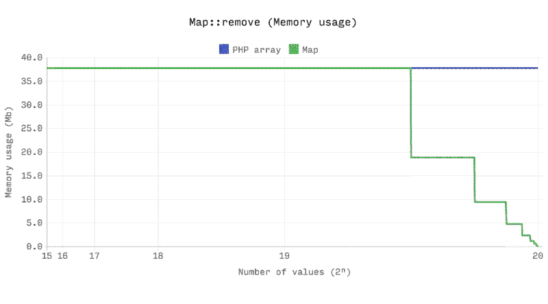
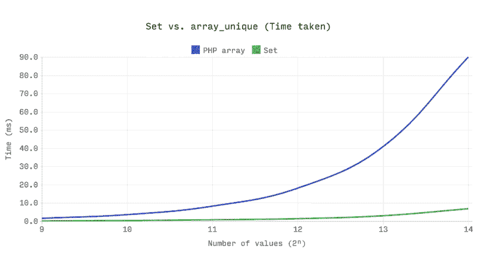
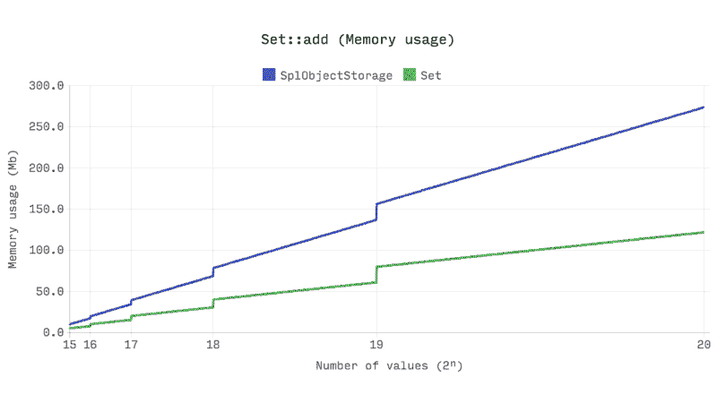
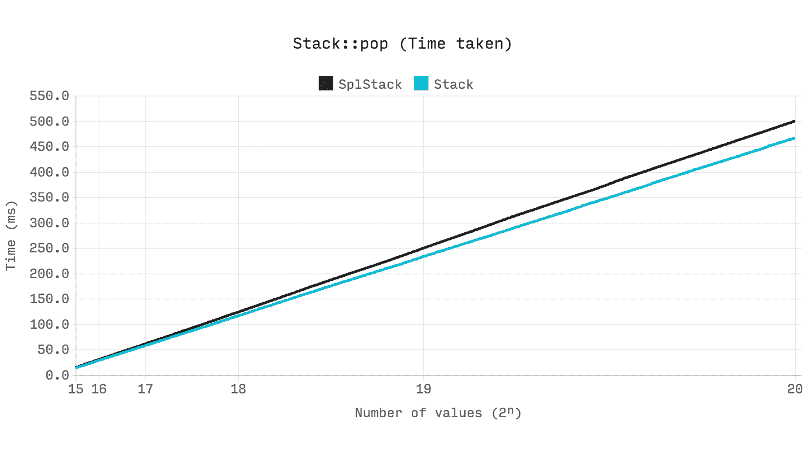
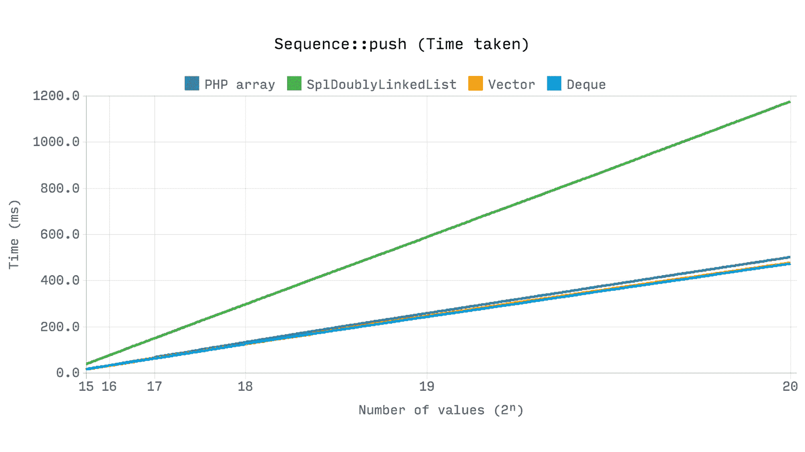
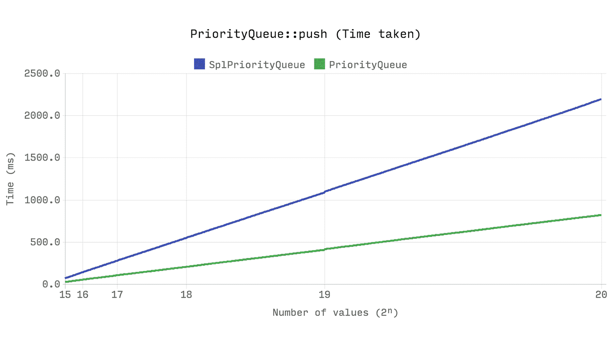

# 第十二章：PHP 内置对数据结构和算法的支持

PHP 是一种具有丰富预定义函数库的语言，同时也得到了社区的大力支持。无论是算法还是数据结构，PHP 已经为开发人员提供了坚实的内置支持。在本章中，我们将探讨一些内置函数和功能，我们可以在数据结构和算法实现中使用。现在让我们在 PHP 中探索这些功能。

# PHP 内置数据结构的功能

PHP 在标准 PHP 库 SPL 中拥有丰富的内置数据结构。在发布 PHP 7 之后，人们认为 SPL 数据结构的实现与旧版 PHP 相比并不是非常“高效”。因此，我们将讨论一个专门设计用于数据结构的新 PECL 扩展。我们还对 PHP 数组有很强的支持，可以用作集合、向量、映射、哈希表、堆栈、队列、集合、字典等等。与数组相比，SPL 相对较新，但仍然以内置功能的多样实现夺得了风头。自 PHP 5.0 以来，SPL 已经与核心 PHP 一起发布，因此不需要额外的扩展或构建。我们已经在第二章中探讨了 PHP 数组的动态特性，*理解 PHP 数组*。在本章中，我们将列举一些其他可用于 PHP 操作数据结构的有用函数。

# 使用 PHP 数组

PHP 数组具有更广泛的预定义函数集，使 PHP 数组成为 PHP 最常用的功能之一。我们不会讨论所有可用的 PHP 数组函数。我们将讨论一些对我们在数据结构操作中非常有用的函数。以下是 PHP 数组函数：

+   array_pop：这将弹出数组的最后一个元素，类似于堆栈弹出操作。数组作为引用传递给函数。它只接受一个参数，即数组的名称。

+   array_push：这将一个或多个元素推送到数组的末尾，就像堆栈推送操作一样。我们已经看到我们可以使用 push 一次推送一个元素。在 PHP 数组中，我们可以将多个值推送到当前数组的末尾。数组作为引用传递给函数，如下所示：

```php
$countries = []; 

array_push($countries, 'Bangladesh', 'Bhutan'); 

```

+   current：每个数组都有一个内部指针来标识它当前所在的位置。最初，它从数组的第一个元素开始。current 函数返回数组的当前指针，并返回当前位置的元素的值。如果我们将数组视为列表，这些内部指针功能将是必需的。

+   prev：`prev`函数将内部指针向后移动一步。PHP 数组可以作为双向链表工作，`prev`用于转到前一个指针。

+   next：`next`函数将内部指针移动到下一个元素。

+   end：`end`函数将内部数组指针移动到数组的末尾。

+   reset：`reset`函数将内部数组移动到数组的开头。

+   array_search：这是一个非常有用的函数，用于在数组中搜索元素。如果在数组中找到元素，则返回找到它的相应索引。如果找不到任何内容，它将返回 false。如果有多个具有相同搜索键的元素，则返回第一个出现的索引。我们必须小心，因为此函数在比较过程中也可能返回 0，如果元素在第一个索引中找到。因此，在比较过程中，我们必须使用严格的类型检查来检查布尔值 false。`array_search`函数接受两个必需的参数，needle 和 haystack。needle 是我们要查找的元素，haystack 是我们要查找元素的数组。例如，如果我们在字典中查找一个单词，那么我们可以将搜索词视为"needle"，"dictionary"视为 haystack。还有一个可选的第三个参数，它可以为元素启用严格的类型检查。因此，如果设置为 true，则它不仅按值搜索元素，还按类型搜索：

```php
$countries = ["Bangladesh", "Nepal", "Bhutan"]; 

$key = array_search("Bangladesh", $countries); 

if ($key !== FALSE) 

    echo "Found in: " . $key; 

else 

    echo "Not found"; 

```

这将产生以下输出：

```php
    Found in: 0

```

如果我们在`if`条件检查中使用!=，那么结果将显示`Not found`。

+   array_sum：这是另一个方便的 PHP 内置函数，用于获取给定数组的总和。它将返回一个单个的数值，即数组中所有元素的总和。它可以是整数或浮点数。

+   array_map：如果我们想要改变数组的元素具有某种类型的属性，这是一个非常有用的函数。例如，我们想要将数组中的所有文本都变成大写或小写。我们可以使用这个函数来做到这一点，而不是运行一个循环。`array_map`函数接受两个参数。第一个是可调用的函数，第二个是数组本身。该函数返回修改后的数组，如下所示：

```php
$countries = ["bangladesh", "nepal", "bhutan"]; 

$newCountries = array_map(function($country) { 

    return strtoupper($country); 

}, $countries); 

foreach ($newCountries as $country) 

    echo $country . "\n"; 

```

或者，我们可以简单地这样写：

```php
$countries = ["bangladesh", "nepal", "bhutan"]; 

$newCountries = array_map('strtoupper', $countries); 

foreach ($newCountries as $country) 

    echo $country . "\n"; 

```

上述代码对给定数组中的每个单词应用了`array_map`函数。这两个代码将产生以下输出：

```php
BANGLADESH

NEPAL

BHUTAN

```

+   array_rand：如果我们需要从给定数组中随机选择一个或多个项目，这个函数非常有用。返回项目数量的默认值为 1，但我们可以随时增加它。

+   array_shift：此函数从数组的开头移除一个元素，这与队列数据结构中的出队操作非常相似。从函数中返回移除的元素：

```php
$countries = ["bangladesh", "nepal", "bhutan"]; 

$top = array_shift($countries); 

echo $top; 

```

这将在命令行中显示输出`bangladesh`。`$countries`数组中将只有`nepal`和`bhutan`。

+   array_unshift：此函数在数组的开头添加一个或多个项目，并将现有项目向后移动。

+   shuffle：如果我们需要出于任何原因对数组进行洗牌，我们可以使用这个函数。这个函数对于随机化整个数组非常有用。

+   array_intersect：此函数将两个或多个数组作为参数，并返回第一个数组中的公共项，并查找其他数组中的存在。此函数还保留键。

+   array_diff：此函数计算数组与其他给定数组之间的差异。与`array_intersect`函数一样，此函数还接受多个数组作为参数，其中第一个参数是基本数组，其他参数用于与其进行区分。

PHP 中有许多有用的数组函数，它们解决了许多现有的数据结构和算法问题。我们可以在 PHP 文档中找到内置数组函数的列表。对于本书的目的，我们将在接下来的章节中探讨一些用于排序的数组函数。对于其他函数，建议进一步阅读 PHP .NET。

# SPL 类

毫无疑问，SPL 试图解决 PHP 程序员常见的数据结构实现问题。我们中的许多人在编程时要么害怕要么不愿意实现适当的数据结构。SPL 包含了所有基本数据结构的实现，因此，通过使用内置的类和方法，它使开发人员的生活变得更加轻松。由于 SPL 与 PHP 捆绑在一起，我们不需要单独安装它或为其启用任何扩展。在本节中，我们将简要讨论一些常见的 SPL 类：

+   SplDoublyLinkedList：这个类为我们提供了在不编写大量代码的情况下实现双向链表的选项。尽管它说是双向链表，但我们也可以利用这个类来实现堆栈和队列，方法是在`setIteratorMode`方法中设置迭代模式。

+   SplStack：`SplStack`类是`SplDoublyLinkedList`类的扩展版本，其中包括标准堆栈函数，实际上来自双向链表类。

+   SplQueue：`SplQueue`类是`SplDoublyLinkedList`类的扩展版本，其中包括标准队列函数，如`enqueue`，`dequeue`。但是，这些函数实际上来自双向链表类。

+   SplHeap：这是 PHP 的通用堆实现。`SplMaxHeap`和`SplMinHeap`是通用堆类的两种实现。

+   SplPriorityQueue：`SplPriorityQueue`是使用`SplMaxHeap`实现的，并提供了优先级队列的基本功能。

+   SplFixedArray：正如我们在第二章中所看到的，*了解 PHP 数组*，`SplFixedArray`可以非常方便地解决内存和性能问题。`SplFixedArray`以整数作为索引，因此，与通用 PHP 数组相比，它具有更快的读写操作。

+   SplObjectStorage：通常，我们使用整数或字符串键在数组中存储任何内容。这个 SPL 类为我们提供了一种方法，可以根据对象存储值。在对象存储中，我们可以直接使用对象作为映射的键。此外，我们还可以使用这个类来存储对象集合。

# 内置 PHP 算法

现在，我们将检查 PHP 的一些内置功能，这些功能解决了我们日常操作所需的许多算法实现。我们可以将这些函数分类为数学、字符串、加密和哈希、排序、搜索等。现在我们将探索基数转换算法：

+   base_convert：此函数用于对数字进行基数转换。基数范围限制为 2 到 36。由于基数可以是任何基数并包含字符，因此函数的第一个参数是字符串。以下是该函数的示例：

```php
$baseNumber = "123456754"; 

$newNumber = base_convert($baseNumber, 8, 16); 

echo $newNumber; 

```

这将产生以下输出：

```php
    14e5dec

```

+   bin2hex：这将二进制字符串转换为十六进制字符串。它只接受二进制字符串作为参数。

+   bindec：这将二进制字符串转换为十进制数。它只接受二进制字符串作为参数。

+   decbin：这将十进制数转换为二进制字符串。它只接受十进制值作为参数。

+   dechex：这将十进制数转换为十六进制字符串。它只接受十进制值作为参数。

+   decoct：这将十进制数转换为八进制字符串。它只接受十进制值作为参数。

+   hex2bin：这将十六进制字符串转换为二进制字符串。它只接受十六进制字符串作为参数。

+   hexdec：这将十六进制字符串转换为十进制数。它只接受十六进制字符串作为参数。

+   octdec：这将八进制字符串转换为十进制数。它只接受八进制字符串作为参数。

还有许多其他用于不同目的的内置函数。其中最重要的之一是在发送电子邮件或传输层时对文本字符串进行编码和解码。由于我们需要编码并具有解码选项，因此我们不使用单向加密函数。此外，还有许多有用的函数可用于不同的字符串操作。我们现在将探讨这些函数：

+   base64_encode：此函数使用 base64 mime 类型对数据进行编码。通常，编码后的字符串比实际字符串大，并且比实际字符串多占 33%的空间。有时，生成的字符串末尾会有一个或两个等号符号，表示字符串的输出填充。

+   base64_decode：此函数接受一个 base64 编码的字符串，并生成其中的实际字符串。它是我们之前讨论的函数的相反操作。

+   levenshtein：我们面临的最常见问题之一是找出两个文本之间的相似性，例如，用户输入的产品名称在列表中不存在。然而，快速检查显示文本中有拼写错误。为了显示哪个是最接近的匹配字符串或基于最小字符数添加、编辑或删除它们的正确字符串。我们将称之为编辑距离。`levenshtein`函数或 levenshtein 距离被定义为将第一个字符串转换为第二个字符串所需的最小字符数，包括替换、插入或删除。该函数的复杂度为`O(m*n)`，并且限制是每个字符串的长度必须小于 255 个字符。以下是一个例子：

```php
$inputStr = 'Bingo'; 

$fruites = ['Apple', 'Orange', 'Grapes', 'Banana', 'Water melon', 'Mango']; 

$matchScore = -1; 

$matchedStr = ''; 

foreach ($fruites as $fruit) { 

    $tmpScore = levenshtein($inputStr, $fruit); 

    if ($tmpScore == 0 || ($matchScore < 0 || $matchScore >

     $tmpScore)) { 

     $matchScore = $tmpScore; 

     $matchedStr = $fruit; 

    } 

} 

echo $matchScore == 0 ? 'Exact match found : ' . $matchedStr : 'Did you mean: ' . $matchedStr . '?\n'; 

```

这将产生以下输出：

```php
    Did you mean: Mango?

```

该函数的另一个变体通过额外的三个参数，我们可以提供插入、替换和删除操作的成本。这样，我们可以根据成本函数得到最佳结果。

+   similar_text：此函数计算两个字符串之间的相似度。它有一个选项以百分比方式返回相似度。该函数区分大小写，并根据匹配的字符返回相似度分数。以下是一个例子：

```php
$str1 = "Mango"; 

$str2 = "Tango"; 

echo "Match length: " . similar_text($str1, $str2) . "\n"; 

similar_text($str1, $str2, $percent); 

echo "Percentile match: " . $percent . "%"; 

```

上述代码将产生芒果和探戈之间的百分比匹配。输出如下：

```php
Match length: 4

Percentile match: 80%

```

+   soundex：这是一个有趣的函数，我们可以使用它找到给定字符串的 soundex 键。这个 soundex 键可以用来从集合中找到类似发音的单词，或者找出两个单词是否发音相似。soundex 键的长度为四个字符，第一个字符是字母，其余三个是数字。以下是一些熟悉单词的 soundex 键：

```php
$word1 = "Pray"; 

$word2 = "Prey"; 

echo $word1 . " = " . soundex($word1) . "\n"; 

echo $word2 . " = " . soundex($word2) . "\n"; 

$word3 = "There"; 

$word4 = "Their"; 

echo $word3 . " = " . soundex($word3) . "\n"; 

echo $word4 . " = " . soundex($word4) . "\n"; 

```

上述代码将产生以下输出：

```php
Pray = P600

Prey = P600

There = T600

Their = T600

```

从前面的输出中可以看到，`pray`和`prey`是不同的单词，但它们具有相似的 soundex 键。在不同的用例中，Soundex 可以非常有用地找出数据库中类似发音的单词。

+   metaphone：Metaphone 是另一个类似于 soundex 的函数，可以帮助我们找到类似发音的单词。两者之间的基本区别在于，metaphone 更准确，因为它考虑了基本的英语发音规则。该函数生成可变长度的 metaphone 键。我们还可以传递第二个参数来限制键的生成长度。以下是一个与 soundex 类似的例子：

```php
$word1 = "Pray"; 

$word2 = "Prey"; 

echo $word1 . " = " . metaphone($word1) . "\n"; 

echo $word2 . " = " . metaphone($word2) . "\n"; 

$word3 = "There"; 

$word4 = "Their"; 

echo $word3 . " = " . metaphone($word3) . "\n"; 

echo $word4 . " = " . metaphone($word4) . "\n"; 

```

以下是上述代码的输出：

```php
Pray = PR

Prey = PR

There = 0R

Their = 0R

```

# 哈希

哈希是现代编程中最重要的方面之一。在数据安全和隐私方面，哈希在计算机密码学中起着关键作用。我们不愿意让我们的数据不安全并对所有人开放。PHP 有几个内置的哈希函数。让我们快速浏览一下它们：

+   md5：这计算给定字符串的 md5 哈希。它将为每个提供的字符串生成 32 个字符的唯一哈希。哈希是单向的，这意味着没有函数可以将哈希字符串解密为实际字符串。

+   **sha1**：此函数计算给定字符串的 sha1 哈希。生成的哈希长度为 40 个字符。与 md5 一样，sha1 也是一种单向哈希。如果将第二个参数设置为 true，则函数将生成 20 个字符的原始输出哈希字符串。要记住的一件事是 sha1、sha256 和 md5 不足以用于密码哈希。由于它们非常快速和高效，黑客倾向于使用它们进行暴力攻击，并从生成的哈希中找到实际输入。

+   密码：此函数为给定的字符串生成一个单向哈希键，可选的盐字符串。如果您使用的是 PHP 7，则在函数调用期间未提供任何盐，该函数将产生一个`E_NOTICE`。对于哈希，该函数使用基于**UNIX DES**的算法或其他可用于哈希的算法。

+   **password_hash**：这是另一个有用的函数，用于为密码生成哈希。它需要两个参数，一个包括实际字符串，另一个是哈希算法。默认的哈希算法使用 bcrypt 算法，备选选项是 blowfish 算法。

+   **password_verify**：如果我们使用`password_hash`函数生成了密码，则可以使用此函数。函数的第一个参数是输入的密码，第二个参数是哈希字符串。该函数根据验证部分返回 true 或 false。

+   **hash_algos**：如果我们想知道系统中注册的哈希算法列表，可以使用此函数。这将列出当前系统中哈希算法的所有可能选项。

+   **hash**：此函数需要一个强制的哈希算法名称以及要进行哈希处理的字符串，以生成一个哈希键。还有一个可选参数，用于获取哈希的原始二进制输出。哈希键的长度将根据所选的算法而变化。

PHP 具有丰富的哈希和加密函数和库的集合。有关更多信息，请参阅 PHP.net 文档，以及下一节中提到的其他一些网站。

# 通过 PECL 内置支持

自 PHP 7.0 发布以来，开发人员关注的一个问题是 SPL 类的性能问题。PHP 7.0 对早期设计的 SPL 类没有带来任何改进，许多开发人员现在对进一步使用它持怀疑态度。许多开发人员已经为 PHP 编写了自定义库和扩展，以提高数据结构的效率。其中一个扩展就是 PHP DS，这是一个专门为 PHP 7 数据结构设计的扩展。该扩展由 Joe Watkins 和 Rudi Theunissen 编写。PHP DS 扩展的官方文档可以在 PHP 手册的[`php.net/manual/en/book.ds.php`](http://php.net/manual/en/book.ds.php)中找到。

该库可作为 PHP 数组的替代品，它是一种非常灵活、动态、混合的数据结构。此扩展提供了许多预构建的数据结构，如集合、映射、序列、集合、向量、堆栈、队列、优先队列等。我们将在接下来的几节中探讨它们。

# 安装

该库提供了不同的安装选项。最简单的方法是从 PECL（PHP 扩展的存储库）获取它：

```php
pecl install ds

```

如果需要，我们也可以下载源代码并编译库。为此，我们只需要从 GitHub 存储库获取代码并遵循 git 命令：

```php
clone https://github.com/php-ds/extension "php-ds"

cd php-ds

# Build and install the extension

phpize

./configure

make

make install

# Clean up the build files

make clean

phpize --clean

```

如果存在任何依赖性问题，我们还必须安装此软件包：

```php
sudo apt-get install git build-essential php7.0-dev

```

对于 Windows，可以从 PECL 网站下载 DLL。对于 Mac OS 用户，Homebrew 支持安装此扩展：

```php
brew install homebrew/php/php71-ds

```

安装完成后，我们必须将扩展添加到我们的主要`php.ini`文件中：

```php
extension=ds.so  #(php_ds.dll for windows)

```

如果扩展正确添加，所有预构建的类将通过`global \DS\ namespace`可用。

现在，让我们详细了解此扩展中预构建的 DS 类。我们将从所有类的基础，即集合接口开始。

# 接口

集合接口是 DS 库中所有类的基本接口。所有数据结构实现都默认实现了集合接口。集合接口确保所有类都具有类似的可遍历、可计数和 JSON 可序列化的行为。集合接口有四个抽象方法，它们是`clear`、`copy`、`isEmpty`和`toArray`。DS 类的所有数据结构实现都实现了该接口，我们将在探索这些数据结构时看到这些方法的运作。

数据结构库的另一个重要方面是使用对象作为键。这可以通过库的可哈希接口来实现。还有另一个重要的接口，允许在数据结构类中实现列表功能，并且确保比 SPL 双向链表和固定数组的性能更好。

# 向量

向量是一种线性数据结构，其中值按顺序存储，大小也会自动增长和缩小。向量是最有效的线性数据结构之一，因为值的索引直接映射到缓冲区的索引，并允许更快的访问。DS 向量类允许我们使用 PHP 数组语法进行操作，但在内部，它的内存消耗比 PHP 数组少。它具有常数时间的 push、pop、get 和 set 操作。以下是向量的一个示例：

```php
$vector = new \Ds\Vector(["a", "b", "c"]); 

echo $vector->get(1)."\n"; 

$vector[1] = "d"; 

echo $vector->get(1)."\n"; 

$vector->push('f'); 

echo "Size of vector: ".$vector->count(); 

```

从上面的代码可以看出，我们可以使用 PHP 数组语法来定义一个向量，并且也可以使用数组语法来获取或设置值。一个区别是我们不能使用 PHP 数组语法来添加一个新的索引。为此，我们必须使用向量类的 push 方法。尝试设置或获取不存在的索引将导致在运行时抛出`OutofRangeException`。以下是上述代码的输出：

```php
b

d

Size of vector: 4

```

### 映射

映射是键值对的顺序集合。映射类似于数组，键可以是字符串、整数等，但键必须是唯一的。在 DS 映射类中，键可以是任何类型，包括对象。它允许 PHP 数组语法进行操作，同时保留插入顺序。性能和内存效率也类似于 PHP 数组。当大小降低时，它还会自动释放内存。如果我们考虑下面的性能图表，我们可以看到 DS 库中的映射实现在从大数组中移除项目时比 PHP 数组快得多：



### 集合

集合也是一个序列，但集合只能包含唯一的值。集合可以存储任何值，包括对象，并且支持数组语法。它保留插入顺序，并且在大小降低时也会自动释放内存。我们可以在常数时间内实现添加、删除和包含操作。然而，这个集合类不支持 push、pop、shift、insert 和 unshift 函数。集合类内置了一些非常有用的集合操作函数，如 diff、intersect、union 等。以下是集合操作的一个示例：

```php
$set = new \Ds\Set(); 

$set->add(1); 

$set->add(1); 

$set->add("test"); 

$set->add(3); 

echo $set->get(1);

```

在前面的示例代码中，`1`的条目只会有一个，因为集合不能有重复的值。另外，当我们获取`1`的值时，这表示在索引`1`处的值。因此，输出将是前面示例的测试。这里可能会有一个问题，为什么我们不在这里使用`array_unique`来构建一个集合。下面的比较图表可能是我们正在寻找的答案：



从上面的图表可以看出，随着数组大小的增长，array_unique 函数的计算时间将比我们在 DS 库中的`set`类更长。此外，随着大小的增长，`set`类所占用的内存也比 PHP 数组少：



### 栈和队列

DS 库还实现了栈和队列数据结构。`DS\Stack` 内部使用 `DS\Vector`，`DS\Queue` 内部使用 `DS\Deque`。与 SPL 实现的栈和队列相比，这两种实现的性能相似。以下图表显示了这一点：



### 双端队列

双端队列（发音为 deck），或双端队列，用于`DS\Queue`内部实现。此软件包中的双端队列实现在内存使用上非常高效，并且在常数时间内执行 get、set、push、pop、shift 和 unshift 操作。然而，`DS\Deque`的一个缺点是插入或删除操作的复杂度为`O(n)`。以下是`DS\Deque`和 SPL 双向链表的性能比较：



### 优先队列

您已经了解到优先队列对于许多算法非常重要。拥有高效的优先队列对我们来说也非常重要。到目前为止，我们已经看到我们可以使用堆来实现自己的优先队列，或者使用 SPL 优先队列来解决问题。然而，`DS\PriorityQueue`比`SplPriorityQueue`快两倍以上，并且仅使用其内存的百分之五。这使得`DS\PriorityQueue`比`SplPriorityQueue`内存效率高 20 倍。以下图表显示了比较：



从我们在最近几节的讨论中，我们可以得出结论，DS 扩展对于数据结构来说非常高效，与 SPL 相比有着更好的性能。尽管基准测试可能会因平台和内部配置的不同而有所变化，但它表明新的 DS 扩展是有前途的，可能对开发人员非常有帮助。需要记住的一点是，该库尚未内置堆或树数据结构，因此我们无法从该库中获得内置的分层数据结构。

更多信息，请查看以下文章，比较图表来自这里：[`medium.com/@rtheunissen/efficient-data-structures-for-php-7-9dda7af674cd`](https://medium.com/@rtheunissen/efficient-data-structures-for-php-7-9dda7af674cd)

# 总结

PHP 拥有丰富的内置函数集，而且这个列表每天都在增长。在本章中，我们探讨了一些可以用于实现数据结构和算法的定义函数。还有许多其他外部库可供使用。我们可以根据自己的喜好选择任何内部或外部库。此外，还有许多在线资源可以了解数据结构和算法的概念。您还了解了 PHP 7 中 SPL 类的性能问题，并介绍了 PHP 7 数据结构的新库。我们必须记住，数据结构和算法并不是与语言无关的。我们可以使用不同的语言或同一语言的不同版本来实现相同的数据结构和算法。在下一章中，我们将探索编程的另一个领域，这在目前非常流行，即函数式编程。因此，接下来，我们将专注于 PHP 的函数式数据结构。
