# 第一章. 使用 PhpStorm 烹饪

在本章中，我们将介绍以下食谱：

+   显示/隐藏视图

+   自定义视图

+   访问任何项目文件

+   最大化视图和编辑器

+   返回上一个编辑器

+   返回上一个编辑位置

+   将视图链接到编辑器

+   创建一个键绑定

+   创建书签

+   恢复已删除的资源

+   使用 PhpStorm 进行自定义

+   添加一个包含路径

+   从索引中排除不需要的目录

+   使用代码补全

# 简介

最后，你的辛勤工作将产生一些结果——你现在编写 PHP 所需的汗水将减少。你无法爱上 PHP 作为编程语言的原因从来都不是微不足道的。没有强大的 IDE 处理 PHP 的工作并不比在关闭车灯的情况下夜间驾驶轻松。人们常说 PHP 是一种弱类型语言（上帝保佑那些这么说的人！），然而 PHP 错误是噩梦般的——所有那些神秘的 500 错误、403 错误等等。

但我们不要忘记，错误代码肯定有它的意义。Apache 服务器无法将 PHP 解释为这样的，因此它给你一个提示，可能作业是不完整的，你必须查看你的 PHP 代码并自己找到确切的错误。你就像在暴风雨中一艘漏水的船上漂泊... 很悲伤！

为了能够带着一艘漏水的船从这场暴风雨中出来，你肯定需要一些帮助：一个补丁，也许是一些更好的材料，比如一个带有真正智能的编辑器；这样的智能不仅会告诉你错误，还会在解决问题上给你很大的帮助。简而言之，你需要一个智能 IDE，比如 PhpStorm，来像编程世界中的其他生物一样编写 PHP。

PhpStorm 理解程序员不是机器人，因此它不遗余力地使编码对他们来说更容易——无论是美丽的语法高亮、代码格式化、语言注入、错误检查、标记代码行，还是所有可能的思维组合。是的，PhpStorm 有解决你所有编码问题的方案，并确保你可以爱上 PHP。

PhpStorm 由 **JetBrains** 创建和维护，这是一个在许多其他语言中也有许多类似产品的组织。JetBrains 的人尊重每一个程序员社区，因此他们为包括 Java 在内的许多编程语言提供了 IDE。PhpStorm 使用 Java 编程语言构建，并经过精心设计，能够支持几乎所有直接或间接提供编程辅助的常见和不常见工具。

### 小贴士

PhpStorm 是一个智能代码编辑器，它提供智能代码补全、语法高亮、扩展代码格式配置、即时错误检查、代码折叠、支持语言混合等功能。

# 显示/隐藏视图

**视图**，正如其名所示，是 PhpStorm 中一个视觉区域，它使您，PHP 程序员，能够看到代码的各个方面和/或视角。

这包括以下内容：

+   您辛勤劳作后的代码结构

+   您的收藏夹（或快速查看快捷键）

+   TODO 列表形式的未来计划

+   您整个 PHP 项目的鸟瞰图

+   代码在本地系统以及/或版本控制系统中的更改

## 如何操作...

执行以下步骤：

1.  PhpStorm 中的视图可以通过以下键盘快捷键以及一些导航菜单项以及一些鼠标点击来显示/隐藏：

    | 视图 | 快捷键 |
    | --- | --- |
    | 终端视图 | *Alt* + *F12* |
    | TODO 视图 | *Alt* + *6* |
    | 项目视图 | *Alt* + *1* |
    | 收藏夹视图 | *Alt* + *2* |
    | 结构视图 | *Alt* + *7* |

1.  访问这些功能的最佳快捷键位于 PhpStorm 的左下角，如下截图所示：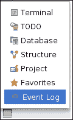

## 它是如何工作的...

让我们一次服务一个视图，以便它们可以热腾腾地上桌：

+   **终端视图**：PhpStorm 确保您不会因为任何原因而离开。如果您想进行一些命令行活动，例如运行一些 shell 命令、设置一些 cron 作业或任何其他操作，PhpStorm 内部有这个命令行终端。请记住键盘快捷键 *Alt* + *F12*。

+   **TODO 视图**：要过程序员的日常生活，您需要多个核心处理器来限制时间；无限的云存储空间，以便无论您听到什么都会被永远记录下来；以及 32 GB 的 RAM，以便没有上下文切换将活动进程推离内存到磁盘上。简而言之，您需要成为贾维斯（钢铁侠系列）。醒来！您仍然是一个有自然倾向开始做梦并因此偏离主题、忘记主要课程的人类。

    PhpStorm IDE 中的 TODO 视图是一个功能，您可以记录您未来计划对代码进行更改。这不仅帮助您（在大多数情况下）记住您的计划，而且当需要时可以搜索它们。TODO 功能就像一张实际上占据了您工作台所有空间的便利贴。请使用 *Alt* + *6* 在您的便利贴上。

+   **项目视图**：一个项目类似于机械师的工作室，在那里以不太引人注目的方式制造出伟大的事物。您的项目包含各种注释掉的代码、示例逻辑、测试逻辑和失败的算法，这确实会在您关闭电脑、下班回家时让您微笑。在 PhpStorm 中，项目视图是一个层次视图，显示您的代码的确切层次结构以及哪些文件位于树中的哪个节点。为了显示项目视图，请使用 *Alt* + *1*。

+   **收藏夹视图**：收藏夹是您需要相当频繁的项目或列表，因此 PhpStorm 提供了一种功能，可以非常容易地查找这些项目。默认情况下，PhpStorm 提供三个收藏夹：您的代码中的书签、您可能设置的代码调试器断点以及包含与您在 PhpStorm 中创建项目时相同名称的其他收藏夹项的列表。键盘快捷键是*Alt* + *2*。

+   **结构视图**：还有什么比看到整个代码以统一格式更令人心情舒畅和灵魂得到慰藉的呢？PhpStorm IDE 以这种方式提供代码的结构视图，使得所有方法都显示为列表形式。这使得您能够更好地控制您创建的任何类的成员，并防止命名空间冲突和方法重复。为了打开结构视图，您只需要记住键盘快捷键*Alt* + *7*。

+   **数据库视图**：尽管在编程世界中编写数据库是其中最令人畏惧的任务之一，但 PhpStorm 通过向系统中添加数据库视图来减轻这种压力。它允许您查看数据库表、存储在其中的存储过程、存储在其中的数据以及与数据库相关的许多一般性任务，否则可能需要其自己的专用应用程序。数据库视图可以通过简单的鼠标点击显示或隐藏，如下面的食谱所示。您有自由选择您喜欢的数据库服务器——它可以是运行在您本地系统上的服务器，也可以是运行在云上并通过 IP 地址和用户名密码保护的服务器。

# 自定义视图

在软件工程师的生活中，有时似乎一切都不顺利，因此唯一出现在脑海中的想法就是改变一切。

PhpStorm 同样负责这个时间段，并提供视图的自定义——您可以自定义视图的显示方式。

## 如何做到这一点...

有两条路可以带您进入定制的世界：

+   如下截图所示，位于单个视图右上角的**设置**按钮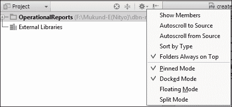

+   另一个非常简单且你最熟悉的选择是工具栏标题栏上的右键单击上下文菜单。

## 它是如何工作的...

通常，所有视图都可用一些上下文菜单选项，例如方向模式：浮动、停靠、固定和分割。视图可以处于以下状态：

+   **浮动模式**：视图可以自由地位于屏幕上的任何位置

+   **停靠模式**：视图在失去焦点时不会自动消失

+   **固定模式**：视图保持在同一位置，直到被更改

+   **分割模式**：您可以同时显示多个视图

**将视图显示为标签页**：此选项允许您根据各种标准过滤或分组您的任务，例如基于项目、基于当前正在编辑的以及基于范围。**移动**菜单允许您根据视图的当前方向将视图移动到顶部、右侧、左侧或底部。有选项可以拉伸或压缩窗口视图，以增加/减少视图窗口的大小。键盘快捷键是*Ctrl* + *Shift* + *向上* / *Ctrl* + *Shift* + *向下*以增加/减少大小。

视图有单独的选项可用。保持清醒，探索以下列表中显示的各个视图窗口的定制选项：

+   **终端视图**：根据您的需求，可以通过点击终端视图提供的**+**符号打开更多终端窗口。如果您觉得需要关闭活动终端窗口，可以非常容易地通过点击左侧的**-**符号来实现。此终端中可用的命令在底层操作系统上运行良好；例如，Linux 用户可以在此终端中输入 *Ctrl* + *D* 以退出终端，而 Windows 用户可以在此终端中输入他们喜欢的命令 `dir`。

+   **TODO 视图**：此视图可用的特殊菜单选项在此列出：

    +   **选择下一个标签页**：这显示了 TODO 视图内的下一个可用视图。

    +   **选择前一个标签页**：此选项用于切换回前一个视图。

    +   **显示标签页列表**：这显示了所有视图。这提供了一个下拉菜单，可以从 TODO 视图内可用的视图列表中进行选择，如以下截图所示：

    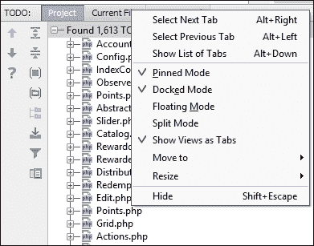

+   **项目视图**：如果您在 **项目视图** 窗口中，您应得的选项比一般选项更多。选项在此描述。保持关注并继续阅读。

    +   **选择下一个视图**：使用此选项可转到下一个视图标签。

    +   **选择前一个视图**；使用此选项可转到前一个视图标签。

    +   **显示视图列表**：使用此选项可从此窗口的可选视图列表中进行选择。

    +   **显示成员**：如果您在此处勾选，您将能够看到文件或代码中的成员函数和变量。

    +   **自动滚动到源代码**：此选项启用了一个非常有用的功能。如果您在此处选择一个文件，该文件将在编辑器中自动打开。

    +   **从源代码自动滚动**：这是一个与前面选项类似的功能。如果您在编辑器中选择一个文件，项目视图将自动显示在项目视图中选择的相同文件。

    +   **按类型排序**：虽然这个功能看似微不足道，但它可能在组织当前正在工作的项目中的文件和文件夹时非常有用。

    +   **文件夹始终在顶部**：您可以使用此功能让文件夹冒泡上升，文件将自动显示在文件夹列表下方。

    以下截图显示了项目视图的外观：

    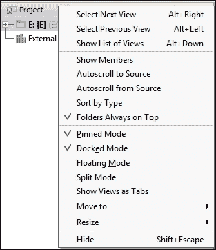

+   **收藏夹视图**: 这个视图部分提供了三个特殊功能：

    +   **显示成员**: 这个功能显示所选收藏夹中的成员列表

    +   **从源自动滚动**: 这与项目视图类似

    +   **自动滚动到源**: 这与项目视图类似

    **收藏夹**视图如下所示：

    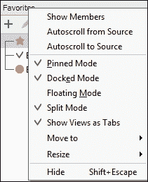

+   **结构视图**: 所有热情的程序员都应该养成使用这个功能的高强度习惯，因为这是一个更偏向于工程实践而不是 PHP 原则的功能。你应该始终将这个功能放在手边，因为当你感觉在辛苦的项目中迷失时，它绝对是你救星。所以检查你的安全带，准备开始这次信息之旅：

    +   **按可见性排序**: 使用此功能根据成员函数和变量的可见性对文件和文件夹进行排序。

    +   **按字母顺序排序**: 朋友们，请记住，这个功能只有在遵循规则书中的命名约定的情况下才会有用和有帮助。这个功能可以按字母顺序对成员函数和变量进行排序。这不是一个描述性的功能名称吗？

    +   **显示包含的文件**: 这个功能显示通过 PHP 代码程序化包含或要求的文件。

    +   **显示字段**: 这个功能显示类/文件中的字段。

    +   **显示常量**: 这个功能显示类/文件中的常量值。

    +   **显示继承的**: 这个功能显示具有继承关系的文件/类。

    +   **显示工具栏**: 这个功能以快速访问按钮的形式显示所讨论的功能，如下所示：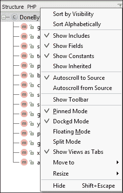

+   **数据库视图**: 大多数 PHP 程序员可能会问——为什么我需要在 PhpStorm 中拥有数据库视图？应该有一个类似于 SQLStorm 的 SQL 数据库工具。

    原因与可用性相关。在 PhpStorm 中添加 SQL 只是为了使一切都在一个屋檐下，并阻止程序员在 PhpStorm 和 SQLStorm 之间来回切换。此功能可用的右键单击上下文菜单选项包括：

    +   **扁平化模式**: 这个功能以一种相当扁平的方式显示数据库模式，而不是以树状结构显示。

    +   **按类型分组表**: 这个功能按类型对表进行分组。这有助于在数据库中搜索表，并增强了表的查看。

    +   **按名称排序列**: 这个功能按名称对所选数据库的列进行排序。

    **数据库**视图选项如下所示：

    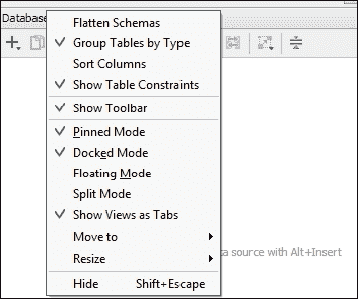

# 访问任何项目文件

软件工程有时更多地是关于调整而不是创造。在有些情况下，开发者别无选择，只能切换到之前创建的某个项目，并希望使用某些功能（不侵犯版权，也不进行法律诉讼）。

## 准备工作

如果您需要在 PhpStorm 中访问任何项目文件，可以做出一些决定。当您同时处理多个项目时，访问项目更为重要。

## 如何操作...

如果您对文件中的一些内容有模糊的记忆，您可以对项目进行全局搜索以找到目标文件。这让你想起了寻找干草堆里针的老故事吗？

1.  您可以打开一个文件夹，您的项目可能位于其中，如下面的截图所示。您可以通过导航到**文件** | **打开**来启动此过程。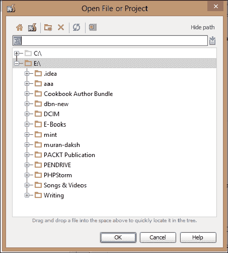

## 它是如何工作的…

即使文件夹不是 PhpStorm 项目，也不要担心。PhpStorm 足够智能，可以管理这一点。一旦打开，就可以在项目中搜索所需的文件/资源。PhpStorm 会将文件夹记住为项目，一旦索引，该文件夹的文件就可以像当前项目文件一样访问。

### 小贴士

您有一个热键可供使用：在需要的时候尝试*Ctrl* + *Shift* + *N*，并输入一些字母以获取匹配您输入字符串的文件名提示列表。

# 最大化视图和编辑器

虽然 IT 行业蓬勃发展，来自全球各地的候选人通过 IT 工作作为程序员谋生，但公司在提供基础设施和维护程序员适当的人体工程学方面仍然很吝啬。一个小型显示器就是这种人体工程学基础设施问题之一。PhpStorm 来拯救。

可以随意最大化视图或编辑器。视图可以通过右键单击上下文菜单中的调整大小选项或设置菜单中的选项来最大化（当处于停靠模式时）。为了更方便地操作，鼠标拖动也可以派上用场。只需单击并拖动所需的窗口即可调整大小。

良好的实践表明，编辑器应该是始终保持可见的唯一对象。其他视图应根据需要打开，并在任务完成后关闭。未停靠模式就是为了这个目的。视图根据需要出现，并在点击另一个视图或编辑器时消失。

PhpStorm 提供了一个出色的功能，通过提供全屏模式，让您可以专注于编码，只显示 PhpStorm 窗口。是的，您理解得正确。只有 PhpStorm 窗口可见，没有框架边框或操作系统项目可见。

## 如何操作...

要启用此功能，您需要执行以下步骤：

1.  转到**视图** | **进入全屏**。

1.  要关闭全屏，请转到**视图** | **退出全屏**。这难道不难吗？确实如此。

PhpStorm 提供的另一个更好的功能是演示模式。在这个模式下，你将只看到字体放大的编辑器窗口。所有其他功能都将可用，但仅按需使用。这是 IDE 提供的最佳查看选项，适用于小型或单显示器。尽管背后的动机是帮助程序员向观众展示一些编码，但本节中所述的使用方法也很实用。要打开此功能，请转到 **视图** | **进入演示模式**，要关闭，请转到 **视图** | **退出演示模式**。

# 返回上一个编辑器

强烈建议人类一次只执行一项任务。这是因为（大多数）人类不能多任务处理，因此如果他们尝试这样做，就会犯错误。对你来说也是一样。

## 准备工作

如果你必须处理一个需要你同时修改多个文件的项目，那么有很大可能性你会忘记你来自哪个编辑器，以及如果当前正在扫描的文件不是正确的副本，你应该去哪里。

## 如何操作...

在 PhpStorm 中，你可以通过记住（并且显然使用）快捷键来返回上一个编辑器、切换到下一个编辑器或从打开的编辑器列表中选择。为此，请执行以下步骤：

1.  使用 *Alt* + *左键* 切换到上一个编辑器。

1.  如果你想切换到下一个编辑器，请使用 *Alt* + *右键*。

## 更多内容...

PhpStorm 提供了一个允许你移动到代码的任何部分或任何打开项目中的任何类的功能。这个功能使你能够随机访问当前打开项目中任何类的任何部分或任何打开文件的任何部分，如下面的截图所示：

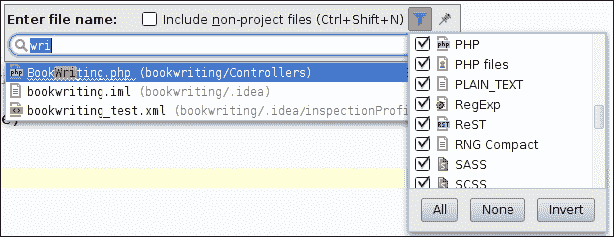

并且，像往常一样，在 PhpStorm 的行为中涉及一些自定义。有一个过滤器符号。点击过滤器符号，相当隐晦地，允许你过滤搜索条件。你可以通过简单地取消选中不需要的文件或资源类型来告诉 PhpStorm 不要在某个文件或资源类型中查找。请参考前面的截图以获得清晰度。

为了启用随机访问，每个项目都需要添加到索引中。现在你可以为 PhpStorm 开发团队开发这个强大的索引系统表示赞赏。

# 返回上一个编辑位置

你不仅可以切换到当前打开的编辑器之间，还可以导航到最后一次修改的文件。

## 准备工作

这在那些你似乎在经理分配给你的工作负担中迷失，并且希望在非常短的时间内完成的情况中尤其有用。世界上所有的程序员都有许多相同的烦恼和担忧。

## 如何操作...

为了访问上一个编辑位置，请使用 *Ctrl* + *Shift* + *E*，并从弹出的列表中选择所需的文件。理解其工作原理相当简单。让我们看看以下截图，解释如何返回上一个编辑器：

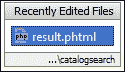

# 将视图链接到编辑器

有时候，名称本身就一目了然。有时候，句子中会有提示。如果你得到了提示，那么你一定已经理解了 PhpStorm 提供的这个功能是为了显示代码在项目层次结构中的确切位置。如果你没有得到提示，别担心——既然你读了这段文字，你现在就明白了。请继续关注更多美味的食谱。

PhpStorm 提供了两种在视图和编辑器之间链接的方式。PhpStorm 可以在项目视图中显示的项目树层次结构中突出显示你当前正在编辑的文件的位置。

## 如何操作...

当你在项目视图中选择文件时，PhpStorm 也可以立即在编辑器中打开该文件。执行以下步骤：

1.  要使用此功能，建议你阅读本章“自定义视图”食谱中提供的 *自动滚动到源* 的说明。

1.  这种链接系统也适用于类成员（函数和变量）。PhpStorm 可以在编辑器和视图之间自动滚动（或链接），从而减轻你肩上的一些开发压力。真兄弟！

# 创建键绑定

对于那些觉得键绑定难以可视化的所有人，键绑定意味着键盘快捷键，它们是程序员生活中的变速器。当你全神贯注于必须在规定时间内完成的项目时，你可以在这个世界上打赌任何一种方式或手段，以影响你的工作效率。赌键盘快捷键吧。你将站在胜利的一方。

PhpStorm 再次指定了一些默认的 **快捷键映射**。朋友们，别担心！你可以非常容易地自定义键盘快捷键以适应你的口味。

## 如何操作...

1.  使用键盘快捷键 *Ctrl* + *Alt* + *S* 或从 **文件** 菜单中选择。

1.  前往 **设置** 对话框，在顶部提供的搜索框中输入 `keymap`，PhpStorm 将为你突出显示目标。

1.  从以下截图所示的默认快捷键设置列表中选择，但迟做总比不做好。在跳转到更改快捷键之前，了解在 PhpStorm 中快捷键是如何工作的。PhpStorm 默认提供的快捷键映射不能直接编辑，因此为了自定义它们，你需要复制默认设置。听起来很复杂？PhpStorm 向导会为你创建副本。你的大脑会提出一个问题——我的设置在哪里保存？答案是——在基于 `*nix` 的系统下。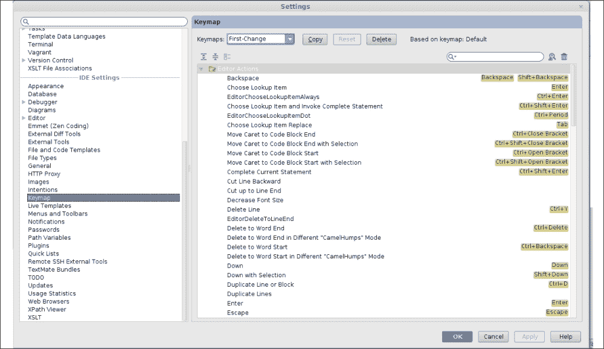

## 它是如何工作的...

PhpStorm 使用目录 `~/.WebIde70/config/keymaps` 来存储你创建的所有快捷键映射方案。仍然不自信？这里有一些行业技巧。

PhpStorm 会为您复制。它会要求您为此键映射方案命名。您指定的名称将被 PhpStorm 尊重。仔细观察后，您会发现 PhpStorm 会始终让您记住您的当前选择是基于 PhpStorm 提供的设置。在您完成选择并复制修改后，您所要做的就是按下**应用**按钮。恭喜！您刚刚创建了一个默认设置的副本，现在您可以按照自己的方式自定义 PhpStorm 的行为。

为了验证这一点，您可以转到`~/.WebIde70/config/keymaps`并查看 PhpStorm 刚刚为您创建了一个新的 XML 文件，其中包含您通过 PhpStorm GUI 创建的设置。每一个成功的客户端背后，都有一个同样强大的后端！

### 小贴士

如果您认为自己可以说 XML，您可以通过 GUI 创建一些设置，然后查看 XML 文件的内容以观察设置是如何保存的。您可以在稍后直接将项目添加到 XML 文件中。你这个淘气的黑客！控制你的笑容！

# 创建书签

书签非常实用。书签允许您在代码的某个位置放置一个标记，以便您可以通过快捷方式访问该代码。

PhpStorm 中的书签与书中读者通过放置一些纸张、翻页角或任何读者可以直接访问页面的方式所做的标记具有相同的意义。

## 如何操作...

PhpStorm 的书签创建起来非常简单。可以通过转到**导航** | **书签**来获得添加书签的选项。

这里解释了可用的三个选项：

+   **切换书签**：此功能允许您在代码的某些指定行创建书签（如果不存在的话），以及从某些代码行删除书签。

+   **使用记忆法切换书签**：此功能允许您使用记忆法切换书签，并附加了使用键盘快捷键访问该书签的能力。

    假设您选择的是字母数字**0**，如图所示，您将能够通过使用*Ctrl* + *0*来访问该书签。

    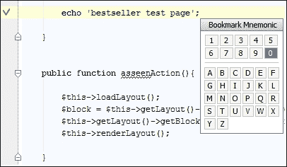

**显示书签**：这是一个相当简单的功能。它只是让您查看您为正在工作的项目创建的所有书签。

### 小贴士

**快速访问书签**

为了能够通过记忆法快速访问书签功能，您所要做的所有艰苦工作就是记住键盘快捷键*Ctrl* + *F11*。其余的将由 PhpStorm 自动处理。

# 恢复已删除的资源

人非圣贤，孰能无过。从错误中干净利落地恢复是 PhpStorm 的强项。你犯错误是完全可以接受的。你可能正在想你的前任或你的汇报经理对你施加的恶行，让你加班（而他自己却在社交媒体上忙得不亦乐乎），你不小心删除了一些代码行。你不知道自己做了什么，带着沉重的心情，你下班回家了。第二天早上，当你准备开始工作时，你突然意识到你删除了一些代码行，但你记不清楚是哪些了！这难道就像是烧伤后的盐吗？需要药膏吗？深呼吸，感谢 PhpStorm 的开发团队，他们知道你是一个容易犯这类极端错误的凡人。

## 准备工作

你可以恢复从你的代码中删除的行。是的，你理解得没错。PhpStorm 中有一个历史功能，它在提供视觉辅助以查找对代码发生的更改方面是同类产品中最好的之一——无论是本地更改，即你是臭名昭著的代码更改的罪魁祸首，还是团队更改，即别人的代码破坏了你的代码。PhpStorm 帮助你指出错误或错误，并帮助你快速解决问题。

## 如何操作...

PhpStorm 会保存你写的每一行代码的快照。每次你保存时，它都会更新。所以，如果你想恢复一段代码，你需要通过使用编辑文件的时光作为锚点，深入到历史中。只要你切换到另一个窗口，它就会自动保存文档……这难道不是很酷吗。执行以下步骤：

1.  **本地历史**选项在鼠标右键单击上下文菜单中可用。

1.  一旦你点击或选择一个特定的时间，PhpStorm 就会显示历史文件与当前文件之间的差异，如下面的截图所示：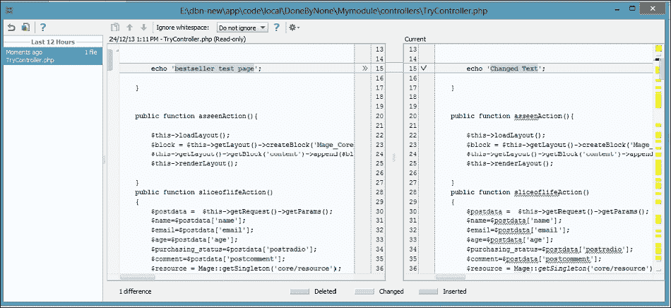

1.  你可以通过从右键单击上下文菜单中选择**还原**选项来恢复到（这个）特定的项目。完成！

1.  你也可以通过双击大于号（**>>**）逐行合并代码。

## 它是如何工作的...

如果你从 PhpStorm 中删除了一个文件，无论是故意还是无意，你都可以使用相同的特性来恢复你的删除文件。你需要从项目视图中选择目标文件夹或目录，访问右键单击上下文菜单，并选择**本地历史** | **显示历史**选项。PhpStorm 不仅会非常容易地显示你删除的所有文件，而且还会以分层的方式显示，如下面的截图所示：

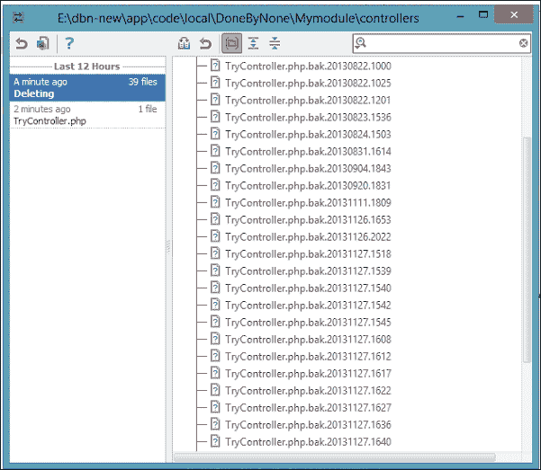

你需要做的就是访问你想要从列表中恢复的文件的右键单击上下文菜单，并选择**还原选择**选项。请不要再吸烟和喝咖啡了。你的头痛问题解决了。

# 使用 PhpStorm 进行自定义

有时候，思考得足够多还不够。有时候，做得足够多还不够。关键是，尽管学到了很多，您仍然有一种感觉，认为还可以进行更多的自定义。PhpStorm 就在您的身边。

## 准备工作

您能做的最好的事情就是使用 PhpStorm 处理您所承担的任何 PHP 项目。但问题就在这里。通过 Web 服务器执行 PHP 是可以的，但当脚本需要在后台运行时怎么办？如果您的报告经理要求您进行一些套接字编程，您该怎么办？您需要一个 PHP 的命令行解释器。震惊的沉默？是时候打破这种沉默了。感谢 PhpStorm，并将其与 PhpStorm 集成命令行 PHP 解释器。

## 如何操作...

只需要一小串快捷键就可以调用命令行 PHP。实际上有两条路，也就是说，前方有一个分岔口。从分岔口，您将看到两条路——左侧是*PhpStormish*方式，右侧是*操作系统 ish*方式。值得注意的一点是，两种方式都能带您到达同一个目的地。在目的地，您将实现目标，即能够使用 PhpStorm 处理每个 PHP 任务。

您将首先通过 PhpStorm 的方式来进行。这比较简单，所以您应该先尝试它。这被称为 PhpStormish，因为 PhpStorm 让您感觉您正在使用 PhpStorm 本身来运行您辛苦编写的 PHP 代码。执行以下步骤：

1.  为了以这种方式运行命令行 PHP，您需要转到**设置** | **PHP**，如图下所示：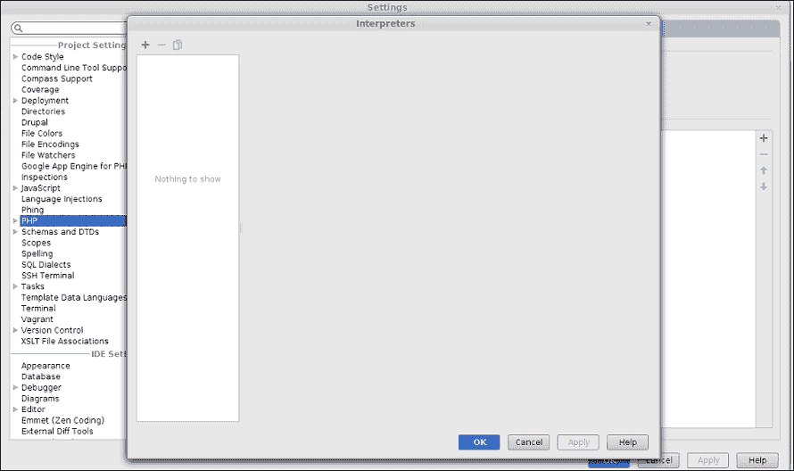

1.  这里有一个解释器下拉菜单。您需要添加一个解释器。您可以通过从 PHP 安装的`bin`文件夹中选择 PHP 解释器来实现。

1.  一旦选择，您需要通过提供各种参数来对其进行自定义，例如名称和配置选项。在应用更改后，PhpStorm 中的 PHP 环境将由您底层操作系统的 PHP 环境提供支持。

1.  这将使您能够使用默认的快捷键*Ctrl* + *Shift* + *F10*来测试和运行您的 PHP 脚本。

## 参见

### 注意

如果您安装了多个 PHP 版本，您可以添加更多解释器，并从中选择用于执行的解释器。

那做起来很简单，对吧？感觉很高兴？在这份快乐中，请不要忘记还有一条路，它在右边，而且又把我们带到了同一个目的地。PHP 脚本或代码可以在终端上运行。终端——这个词在你的脑海中响起铃声了吗？PhpStorm 为你提供了一个终端（模拟器），这样你就不必在心爱的 IDE（可能是 PhpStorm）和命令行终端之间来回切换。你可以再次使用这个功能来执行命令行 PHP 脚本。你只需要输入`php your-php-file.php`，如果你已经设置了 PHP 类路径，否则你需要添加一些额外的字母来使其变为`/path/to/installed-php/php your-php-file.php`。

以下截图显示了如何在 PhpStorm 中通过命令行运行 PHP：

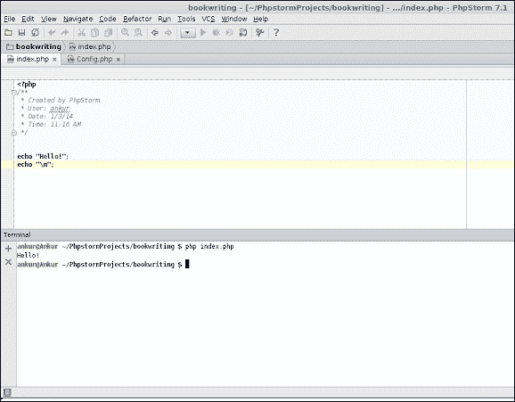

# 添加包含路径

软件工程的一个原则是组件应该是可重用的，也就是说，软件的结构应该是模块化的。这是一个全球范围内接受的实践，但这给翻译（解释器或编译器）带来了额外的开销，因为它需要先找到模块才能将它们链接在一起。PHP 也不例外。

## 准备工作

每次运行脚本时，PHP 解释器都必须搜索所需的文件/文件夹/资源。然而，PhpStorm 可以通过允许你设置包含路径来减少搜索文件/文件夹所需的时间。包含路径是在你的操作系统下包含所有依赖项的文件和文件夹的基目录。

## 如何操作...

你有在 PhpStorm 中设置这个的自由。转到**设置 | PHP | 包含路径**。选择新的路径。点击**应用**。完成！看看下面的截图，它说明了这个观点：

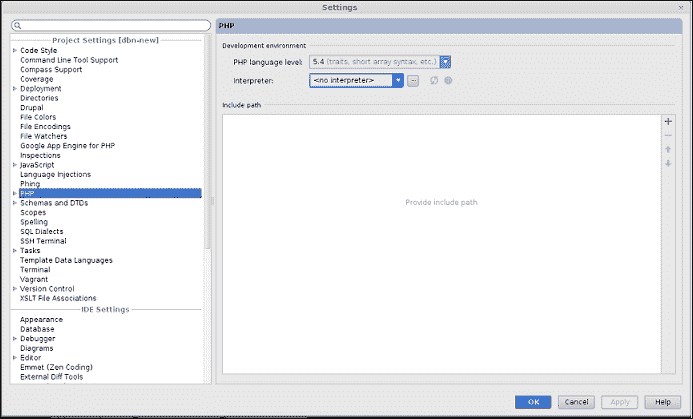

### 小贴士

你应该始终确保在事先计划如何组织你的文件和文件夹，这样就不需要设置太多的包含路径。

如果在包含路径中提供了文件夹，它将有助于`include()`、`require()`等自动完成。

# 从索引中排除不需要的目录

你尝试想象过为什么 PhpStorm 会知道你在项目目录结构中添加的所有文件的信息吗？PhpStorm 是如何通过添加图像、文本文件等来检测你对磁盘所做的更改，并设法在项目视图中显示它们的？是的，答案是索引。

## 准备工作

PhpStorm 对其遇到的所有内容进行索引。因此，它正确地记住了文件和文件夹。但这个系统中涉及一些开销。项目中的文件越多，创建的索引就越长。如果 PhpStorm 通过维护索引来减少搜索文件和文件夹的时间，那么当索引列表增加到非常大的规模时，它将如何管理在索引中进行搜索呢？

## 如何操作...

你可以通过以下步骤帮助 PhpStorm：

1.  前往**设置** | **目录**。

1.  选择一个目录，你从这里需要记住的只有三个键盘快捷键：*Alt* + *T*，*Alt* + *E*，和 *Alt* + *R*。请参考以下截图：

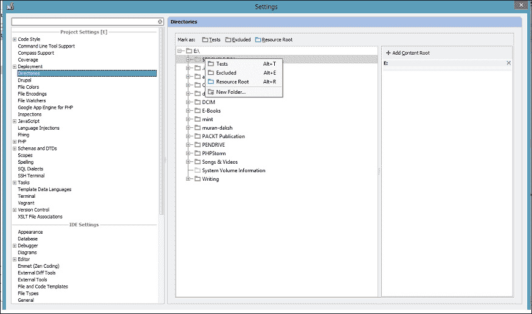

## 它是如何工作的…

*Alt* + *T* 将资源标记为测试资源，*E* 将其排除在索引之外，*R* 将其标记为内容根目录。对你来说，速度的提升将来自神奇的关键组合 *Alt* + *E*。对于那些你认为不足以被索引的目录，要足够无情地应用这个魔法。

### 注意

测试资源是一种资源类型，很可能是某些 PHP 脚本、某些目录或其他在测试过程中使用的文件类型。因此，一旦你知道它对测试目的有用，你就可以将资源标记为测试资源。

作为一款精心编写的软件，PhpStorm 使用索引维护了你项目中保存的所有文件的列表。因此，大量的文件意味着更长的索引，从而可能导致 PhpStorm 变慢。一个被排除的资源是你请求 PhpStorm 不要索引的某些文件或文件夹。

内容根目录是你正在工作的资源内容所在的文件夹或目录。你可能会很容易地问“它有什么作用？”答案相当简单：它为你维护一个干净的工作空间（生活中的一切都不必那么复杂）！

# 使用代码补全

使用 IDE 而不是标准编辑器的最佳例子是，IDE 理解你的代码，因此可以提供关于你可能正在编写或需要的代码的提示。

## 准备工作

标准编辑器最多只能提供基于各种关键字的基于基本文本着色。无论如何，不伤害编辑器的感情，PhpStorm 除了提供标准的代码补全系统外，还提供了额外的选项。

## 如何操作…

有智能类型补全功能，它不仅完成你的代码，还能找到并建议最适合你的代码的匹配项。通过“合适”的意思是，代码提示与当前上下文（调用对象）匹配。这在你需要坚持*软件工程继承原则*的情况下尤其有用。

在 PhpStorm 中，代码补全设置可在**文件** | **设置** | **编辑器** | **代码补全**中找到，如下截图所示：

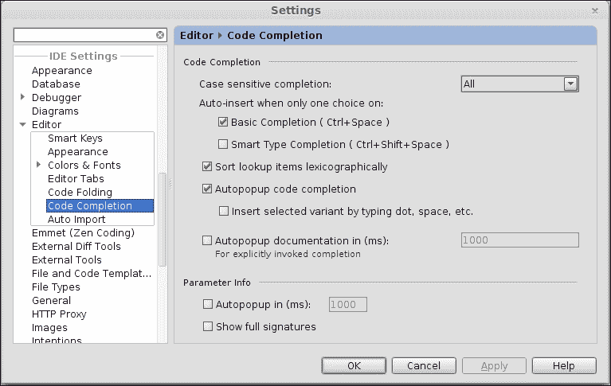

## 它是如何工作的...

如果你有很多项目需要 PhpStorm 查找，例如，你创建的类的成员，你可以让 PhpStorm 按字典顺序为你提供提示。

要启用此功能，您需要选择与**按字典顺序排序查找项**相邻的复选框。以下截图显示了代码补全功能：

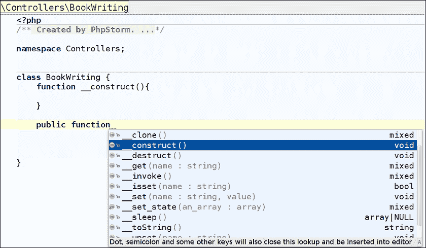

便捷的代码补全！希望这对你来说是有意义的。
