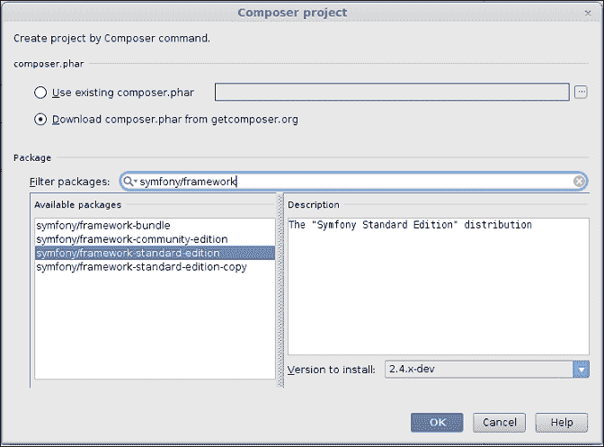
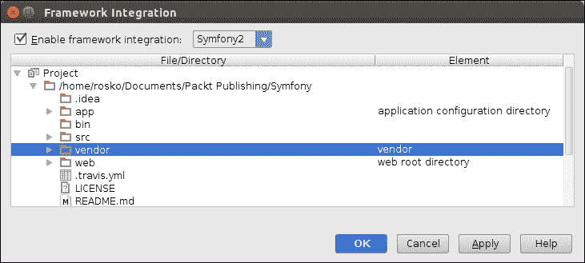

# 第四章：集成框架

在本章中，我们将涵盖以下主题：

+   使用 Symfony 进行烹饪

+   使用 Symfony 创建控制器

+   使用 Symfony 创建模型

+   使用 Symfony 创建视图

+   使用 Yii 框架创建模型

+   使用 Yii 框架创建控制器

+   使用 Yii 框架创建视图

+   使用 Zend 框架创建模型

+   使用 Zend 框架创建控制器

+   使用 Zend 框架创建视图

# 简介

在您开始之前，试着做一些自我反思作为作业。您相信重新发明轮子吗？您相信增加技术债务吗？如果您的回答是肯定的，您可能需要完全跳过这一章。在其他所有情况下，您应该使用框架。框架对您来说很好，它们有帮助，节省时间，节省精力。

让我们回到问题。什么是技术债务？它是指公司因技术架构设计得如此之差，以至于在将来维护系统需要更多的努力或人力（从而金钱）的金额。什么是重新发明轮子？它是指投入更多努力去完成过去已经完成过的任务的过程。

请您停止挠头？这并不是火箭科学。与软件工程的类比相当简单。您可能花费时间在编码琐碎的任务上，比如为每个创建的项目进行用户输入验证和密码验证。虽然这首先是一种任务的重复，但这是您代码中最脆弱的部分。这种脆弱性不仅来自一般的攻击者，还来自某些非常简单的错误，例如没有清理代码。

您需要策略性地采取行动。这种重新发明轮子的行为并非没有成本。您是一位高薪的开发者（因为您购买了 PhpStorm 许可证（有意为之）。您的计费机构将花钱让您完成工作。如果您做的工作容易出错，计费机构将不得不花费更多金钱来修复和/或维护同一项目。因此，该机构注定会在未来花钱，因此有技术债务。

请使用框架。您可以使用框架中的块和片段快速构建代码的块和片段，从而加快您的开发过程。您将接触到用于常见任务、数据库查询和输入清理等的函数库，仅举几例。然而，选择框架的决定需要深思熟虑。

仍然有一些悬而未决的问题浮现在脑海中。您需要坚持下去，并保持关注，以获取大量重要信息。PhpStorm 可以轻松嵌入三个框架：Symfony、Yii 和 Zend，按照它们名称的字典顺序排列。

# 使用 Symfony 进行烹饪

**Symfony** 是一个免费的 MVC Web 应用程序框架，用于 PHP，并遵循 MIT 许可证发布。

要开始使用 Symfony，您需要在您的本地机器（也称为您的本地服务器）上安装 Symfony。生活永远不会让您轻松呼吸。您必须从两个（或更多）路径中选择以继续。PhpStorm 也是如此。

## 准备工作

改变往往会导致混淆，因此最好在 Symfony 目录结构中做出少量更改，然后跳转到创建新的控制器。您在目录`<Project-Root>/src/Acme/DemoBundle/Controller`中创建一个新的控制器类。命名为`CookingController.php`。以下是一些需要遵循的规则：

+   默认情况下，您应该在名称中创建一个以`Controller`结尾的控制器

+   每个控制器都应该扩展在命名空间`Symfony\Bundle\FrameworkBundle\Controller\Controller`中定义的`Controller`类

+   控制器应在命名空间`Acme\DemoBundle\Controller`中定义

由于您将需要将方法的路由作为操作，因此您需要使用命名空间`Sensio\Bundle\FrameworkExtraBundle\Configuration\Route`。

您需要在配置文件（具有`.yml`扩展名的文件）中定义一个路由，以便 Symfony 确切知道您的控制器在哪里。

## 如何做到这一点...

要安装 Symfony，您可以从 Symfony 网站上的简单存档下载中选择，或者使用 Composer 进行安装。Composer？是的，它与第二章中描述的相同系统，*PHP 开发*，以及一些关键词来刷新您的记忆，如 composer.json、vendor 目录等。

执行以下步骤：

1.  如果您想从网站上下载安装 Symfony，您需要访问[`symfony.com/download`](http://symfony.com/download)，选择任何存档格式，并将存档下载到磁盘上。

1.  一旦将存档下载到磁盘上，您可以将解压缩的目录移动到您的 Web 服务器文档根目录内，并在 PhpStorm 中打开它。以下有两点需要注意：

    +   如果您不想将项目作为 Web 项目，则无需将其移动到 Web 服务器的文档根目录中。

    +   如果您想创建一个基于 Web 的项目，您也可以将解压缩文件夹放在任何地方。然后您可以在 Web 服务器文档根目录内创建一个符号链接，指向这个解压缩文件夹。这样做是为了保持系统整洁，您明白的。

要在 PhpStorm 中打开项目，您需要转到**文件** | **打开**并打开您保存 Symfony 目录的路径。

Composer 方法可能有点长，但仔细阅读 PhpStorm 食谱的读者不必担心，因为如何使用 Composer 的信息已在第二章中提供，*PHP 开发*。执行以下步骤：

1.  您需要指定`symfony/framework-standard-edition`作为包名，如下截图所示。PhpStorm 将显示具有相似名称的包列表。

1.  您需要指定版本号，PhpStorm 就会一切就绪。它会为您下载所需的依赖。

    ### 小贴士

    您应该确保有一个稳定的互联网连接。

    

1.  一旦框架下载完成，您可以重启您的 IDE（非强制要求），让 PhpStorm 在为您下载框架的重任之后轻松一下。一旦重启，PhpStorm 就能识别出需要集成的框架。PhpStorm 会引导您完成框架集成的过程。

1.  您可以通过提供详细信息来告诉 PhpStorm 目录及其包含的内容类型。您只需从下拉菜单中选择一些值，如下面的截图所示：

因此，您就可以使用 Symfony 了。在项目根目录提供了一个`readme.md`文件。鼓励您阅读它，并按照其中提供的清单进行操作。

## 它是如何工作的...

Symfony 框架遵循模型-视图-控制器框架。除了 MVC 带来的所有好处外，功能模块化也是一个主要优势。因此，您将所有数据库相关的功能放在模型中，所有业务逻辑放在控制器中，所有与展示相关的功能（生成 HTML）放在视图中。所以，为了深入了解 Symfony，您首先需要了解目录结构。

## 更多内容...

目录结构是项目的骨架，在开始之前了解目录结构非常重要。让我们看看 Symfony 的结构。

### Symfony 的目录结构

当您下载并安装 Symfony 时，您会默认获得一个目录结构。有五个可见的目录：`app`、`bin`、`src`、`vendor`和`web`目录。

`app`文件夹设计用来存放应用程序特定的资源。这些资源包括`config`目录中的数据库连接配置等。`logs`目录旨在存放 Symfony 框架应用程序需要写入的日志。缓存目录旨在存放运行应用程序所需的文件和资源的缓存版本。缓存版本比常规版本更快，且是只读保护的。资源目录设计用来存放如视图渲染页面等资源。

`bin`文件夹设计用来存放项目所需的二进制文件（如`.sh`文件）。由于这些文件的性质，它们需要可执行权限以便能够独立执行并完成预定的任务。在提供文件和文件夹的执行权限时，您需要小心。

`src` 文件夹被设计用来存放项目所需的 PHP 源代码。这些 PHP 源代码可以是任何东西：你的模板、类，以及你认为与你的项目相关的任何内容。

`web` 文件夹被设计用来保存所有需要在网络浏览器中渲染的内容。这些内容包括 HTML、JavaScript、CSS、图片、图标、精灵、`robots.txt` 等，根据项目需要随时使用。

`vendor` 目录被设计用来保存所有项目运行所需的第三方工具。这是一个非常出色的功能，因为它将第三方代码保存在一个独立的隔间中，从而保护它们免受意外编辑。

这里值得注意的是，一个框架为你设定了规则。如果你坚持这些规则，你将站在胜利的一方。一个例子是，假设你从互联网上下载了一个插件 `X`，你的代码的一部分依赖于它，项目整体有一个 `config` 目录。有很大可能性你可能会修改或覆盖 `config` 文件。框架将阻止你这样做。它是如何做到的？它会指示你，供应商目录内的配置不得被干扰。如果你仍然故意或无意地继续进行更改，每个保证都有其限制。

注意，"被设计用来存放"意味着这是默认的意图。你显然可以随意将你的类存储在任何地方。

在你设置好目录结构之后，是时候真正地动手了。朋友们，罗马人，同胞们！卷起袖子，并记住你所看到的一切。

在 `app` 文件夹内部，有一个 `cache` 文件夹。正如之前所述，它用于缓存一些预先准备好的内容，以便可以非常快速地渲染。缓存可以应用于常用的元素，例如图片、字符串、JavaScript、CSS 以及某些预处理数据。由于在 Web 服务器上执行的 PHP 会写入缓存，因此运行 Web 服务器（是的，你没听错）的用户需要写入 `cache` 文件夹的权限。对于日志目录也是如此。你需要将这两个文件夹的权限设置为 `777`。你可以做得更好。你可以更改这两个目录的所有权，使它们现在由 `www-data` 或 Apache 用户（Linux 环境下的用户名）拥有。尝试使用 `chown` 或 `chmod` 命令。无论你做什么，都要确保你做对了。所有权/权限更改是可能引起问题的行为，所以不要在感到困倦时进行更改。

你喜欢在泥潭中玩耍吗？还有更多的泥潭在等着你。

回想一下历史上的某个时刻，你非常饿，试图用一些奶酪、盐、辣椒和番茄（作为备用配料）烘焙披萨。还记得吗？那是一种自由式烹饪。如果你想在生活中有更多有纪律的冒险？尝试遵循 Symfony 的方式。

# 使用 Symfony 创建控制器

所以你首先需要创建一个新的控制器。这个控制器将负责决定你如何烹饪你的披萨。

改变往往会导致困惑，所以最好是只在 Symfony 目录结构中做少量更改，然后直接创建一个新的控制器。

## 如何做到这一点...

在目录`<Project-Root>/src/Acme/DemoBundle/Controller`中创建一个新的控制器类。命名为`CookingController.php`。有一些规则需要遵循：

+   默认情况下，你应该在名称中带有后缀`Controller`的控制器。

+   每个控制器都应该扩展在命名空间`Symfony\Bundle\FrameworkBundle\Controller\Controller`中定义的类`Controller`。

+   控制器应该定义在命名空间`Acme\DemoBundle\Controller`中。

+   由于你需要将方法作为操作进行路由，因此你需要使用命名空间`Sensio\Bundle\FrameworkExtraBundle\Configuration\Route`。

+   你需要在配置文件（一个以`.yml`扩展名结尾的文件）中定义一个路由，以便 Symfony 确切知道你的控制器在哪里。

    ### 小贴士

    你可以稍后定义路由。

所以，你的第一个控制器看起来像以下代码：

```php
namespace Acme\DemoBundle\Controller;
use Symfony\Bundle\FrameworkBundle\Controller\Controller;
use Sensio\Bundle\FrameworkExtraBundle\Configuration\Route;
use Sensio\Bundle\FrameworkExtraBundle\Configuration\Template;
class CookingController extends Controller {
  /**
    * @Route("/", name="_cooking")
    * @Template()
  */
  public function indexAction() {
    return array();
  }

  /**
    * @Route("/nameDish/{dishname}", name="_cook_dish")
    * @Template()
  */
  public function nameDishAction($dishname) {
  return array('name' => $dishname);
  }
}
```

并且 YML 文档的内容（位于`<Project-root>/src/Acme/DemoBundle/Resources/config/routing.yml`）将被（附加）：

```php
_cook:
resource: "@AcmeDemoBundle/Controller/CookingController.php"
type: annotation
prefix: /cook
```

## 它是如何工作的...

人类的大脑是一个非常懒惰的机器。它一看到任何技术细节，就会开始感到困惑。为了消除疑惑，这里将进行解释。请耐心等待。我们从源代码开始，因为 PHP 是你更熟悉的东西。以下是工作原理。

代码从声明一个命名空间开始，这意味着你为这个控制器的元素声明了一个虚拟区域或边界。技术上，这被称为命名空间。

代码通过包含这样的命名空间来继续，这些命名空间用于基本的`Controller`和路由系统（用`Route`表示）。

如果你想包含一些表示层模板，你也可以使用模板引擎的命名空间。在 Symfony 的默认安装中，默认的模板引擎被命名为 Twig。

在这里，控制器最重要的一个方面是`CookingController`是一个控制器，因此它必然要扩展`Controller`类。

在类内部有一些简单的公共访问方法。你说这是不安全的吗？不，亲爱的！由于它们将通过网络浏览器提供，访问级别必须是公共的。

实际的烹饪过程从给你的菜肴起一个名字开始。为此，`nameDishAction`方法将菜肴名称作为参数。到目前为止，一切都很正常。

有这样一个注解`@Route("/nameDish/{dishname}", name="_cook_dish")`，给故事增添了转折。`Route`在动作和 URL 之间创建了一个映射。这是另一种形式的依赖注入。所以，动作的名称`nameDish`与 Symfony 系统的名称`_cook_dish`相映射。如果你更仔细地看，你还会看到它还定义了你将如何使用这个控制器。括号中指定的值是传递给这个动作的参数的占位符。

关于 YML 内容，值得一提的是，YML 实际上是 YAML，发音为 yamel。这类似于任何具有键及其对应值的标记语言。所以，你的资源将指示你刚刚创建的控制器名称，你的控制器将被引用的类型，以及需要在控制器中定义的动作前添加的前缀。

你刚刚创建了一个新的 Symfony 控制器来启动烹饪。顺便问一下，你还记得你上次使用依赖注入这个术语吗？

# 使用 Symfony 创建模型

应用程序是如何记住事物的？持久性是任何应用程序维持其状态的名称。为了有持久性，你需要有数据结构。从典型的工程角度来看，你可以使用模型——MVC 模式中的 M。

## 准备工作

记住，你有一些配料以及一些需要添加到你的披萨菜肴中的配料。所以，通常，你需要一个数组来存储（表示）配料和配料。这是前进并使用模型的绿灯。但故事中还有转折。Symfony 没有默认的模型系统。糟糕的设计？也许不是。它最初被设计成一个请求-响应系统。Symfony 期望你来完成这个目的。你可以自由地创建模型。

## 如何做到...

1.  首先，在控制器同一级别创建一个新的目录。命名为`Model`。这是描述性命名，你看到了。

1.  在`Model`目录内，使用 PhpStorm 的新类向导创建一个新的类。命名为`CookingModel.php`。并不是说 Symfony 不会接受除了`/*Model$/`之外的其他类名。

1.  你被鼓励使用与默认 Symfony 名称相似的名字。你的模型将看起来像以下代码：

    ```php
    namespace Acme\DemoBundle\Model;
    use Doctrine\Common\CommonException;

    class CookingModel {
      /**
        * Get the ingredients that will be added to your dish
        * @return array Containing the list of ingredients
      */
      public function getIngredients(){
        $ingredients = array('salt','cheese','');
        $ingredientCount = 0;
        try {
          while ($ingredientCount < count($ingredients)) {
            if ($ingredients[$ingredientCount] == '') {
              throw new CommonException("\nYou have run out of capsicum.");
            }
            $ingredientCount++;
          }
        } catch (CommonException $e) {
          $ingredients[$ingredientCount] = 'tomato';
        }
        return $ingredients;
      }

      /**
        * Get the toppings that will be added to your dish
        * @return array Containing the list of toppings
      */

      public function getToppings(){
        return array('pepperoni','mushroom','onion','spinach');
      }
    }
    ```

1.  由于你刚刚创建了一个新的模型，除非它在控制器内部使用，否则模型将没有用处。回顾`CookingController`。它没有实际烹饪披萨的动作。`Acme\DemoBundle\Model\CookingModel`应该附加到控制器文件头部。当你添加所需动作时，你将做如下代码：

    ```php
    /**
      * @Route("/startCooking/{dishname}", name="_start_cooking_dish")
      * @Template()
      * @param string $dishname The name of the dish to be cooked.
    */
    public function startCookingAction($dishname){
      $items = new CookingModel();
      return array(
        'dishname' => $dishname,
        'ingredients' => $items->getIngredients(),
        'toppings' => $items->getToppings()
      );
    }
    ```

## 它是如何工作的...

现在你已经有一些烹饪经验了，模型类相当简单。如果你还记得，模型的内容只是从`PizzaDish`类中智能复制粘贴过来的。

`CommonException`类的命名空间被用来捕获在烹饪过程中可能发生的异常。这确实是一种安全的烹饪方式。

`getIngredients`方法处理可用的配料，并返回一个包含配料的数组。它还防止你的披萨在没有辣椒的情况下变得不好吃——它添加番茄作为后备配料。

`getToppings`方法的功能类似。它提供了一个你想要添加以使你的披萨更美味的配料列表。

在控制器内部，模型的使用就像任何其他类一样。在`startCookingAction`中，你所做的只是创建一个新的模型对象并从模型中获取值。

更简单！所以，你在 Symfony 中创建了一个新的模型。恭喜！你可以安全地享用你刚刚烤好的披萨（或者烹饪——请注意，你是一名工程师而不是厨师，所以烹饪和烘焙之间的区别不应该让你烦恼）。

# 使用 Symfony 创建视图

如果你计划使用 Symfony 创建命令行软件，你可以跳过这一部分。但如果你想编写需要展示美丽界面的软件，你需要非常仔细地遵循这一部分。应用程序的面孔被称为视图。

## 准备工作

如果你坚持默认的 Symfony 设置，你需要在一个特定的目录中创建视图。当前安装中目录的名称是`<Project-root>/symfony/src/Acme/DemoBundle/Resources/views`。你还必须创建一个包含控制器名称去掉`controller`单词的目录。因此，当你创建名为`CookingController`的控制器时，你会创建一个名为`Cooking`的目录。

## 如何操作...

在命名文件时，你必须记住，你将使用扩展名`.html.twig`命名视图文件，文件名将与动作名称相同，去掉`Action`，这将渲染视图。

所以，你可以有名为`index.html.twig`、`nameDish.html.twig`和`startCooking.html.twig`的视图，分别对应你创建的`indexAction`、`nameDishAction`和`startCookingAction`。

到目前为止，你可能想知道**TWIG**是什么鸟。你也可能正在想开始诅咒作者，因为他提供了如此多的信息。亲爱的，亲爱的，亲爱的。艺术是长久的，生命是短暂的。Twig 是一个用于 PHP 的模板引擎。它被设计用来将动态行为注入 HTML 页面。这对于对服务器端语言知之甚少的用户界面开发者来说特别有帮助，这些语言将 HTML 渲染到网页浏览器上。假设你必须创建一个视图，你将为`startCookingAction`做如下操作：

```php
<!DOCTYPE html>
<html>
<head>
<title>Let us cook {{ dishname }}</title>
<style type="text/css">
.align-center{
  text-align: center;
}
.heading{
  font-weight: bold;
  font-size: 40px;
}
.normal-text{
  font-size: 16px;
}
</style>
</head>
<body>
<div class="align-center heading">You are now cooking {{ dishname }}!</div>
<div class="align-center normal-text">By adding ingredients

| {{ ingredient }}

</div>
<div class="align-center normal-text">And toppings

| {{ topping }}

</div>
</body>
</html>
```

对你刚才所受的视觉伤害的即时补救措施是向你解释这段代码是如何工作的。这段代码的概述是它是为 HTML 页面而设计的。

## 它是如何工作的...

在 HTML 的`title`标签内，有`{{ dishname }}`，这是动态内容。如果你重新访问`CookingController`中的`startCookingAction`方法，你会注意到你返回了一个包含`dishname`索引的数组。占位符`dishname`从控制器动作中获取其值。如果你控制器返回一个数组，你显然需要迭代整个数组来在视图中使用这些值。for 循环以`for`开始，以`endfor`结束。因此，循环遍历控制器返回的数组（`$ingredients`和`$toppings`），数组索引作为键，数组值作为配料和配料分别。因此获得的价值（配料和配料分别）在视图中使用。

你刚刚使用新方法烤了披萨。你喜欢吗？这里没有双关语。

# 使用 Yii 框架创建模型

路线图从创建模型开始。然后创建控制器并使用你创建的模型。最后，通过创建视图给你的应用程序一个面孔。使用模型获取数据并将其传递到视图中。

## 如何做到...

创建一个新的模型非常简单。它与在 PhpStorm 中创建一个简单的 PHP 类没有区别。要创建一个新的模型，你需要在`<project-root>/app/models`中创建一个新的 PHP 类。你的模型看起来可能像以下代码：

```php
namespace app\models;
class Cooking {
  /**
    * Get the ingredients that will be added to your dish
    * @return array Containing the list of ingredients
  */
  public function getIngredients(){
    $ingredients = array('salt','cheese','');
    $ingredientCount = 0;
    try {
      while ($ingredientCount < count($ingredients)) {
        if ($ingredients[$ingredientCount] == '') {
          throw new \ErrorException("\nYou have run out of capsicum.");
        }
        $ingredientCount++;
      }
    } catch (\ErrorException $e) {
      $ingredients[$ingredientCount] = 'tomato';
    }
    return $ingredients;
  }
  public function getToppings(){
    return array('pepperoni','mushroom','onion','spinach');
  }
}
```

## 它是如何工作的...

这个模型与你创建的 Symfony 模型完全相同。记得吗？模型的命名空间被声明，以便任何其他类都能访问模型中定义的方法。

可用的异常在`ErrorException`类中定义，因此用于处理异常。

### 注意

正是因为他们说你的业务逻辑才是真正重要的。所以，无论框架如何，你的数据类（模型）保持不变。

# 使用 Yii 框架创建控制器

要创建一个新的控制器，请在控制器文件夹内创建一个新的 PHP 类。命名为`CookingController.php`。这样做的原因是什么？你现在已经这样做了一段时间了，所以你应该继续这样做，以免你的胃生气。继续烹饪，同志。

## 如何做到...

要创建一个新的控制器，前往一个新的 PHP 类。使用名称`CookingController.php`。请记住目录`<project-root>/app/controllers`。你的控制器看起来可能像以下代码：

```php
namespace app\controllers;

use app\models\Cooking;
use Yii;
use yii\web\Controller;

class CookingController extends Controller
{
  public function actionIndex(){
    $items = new Cooking();
    $dishname = 'pizza';
    $ingredients = $items->getIngredients();
    $toppings = $items->getToppings();
    return $this>render('index',array('dishname'=>$dishname,
    'ingredients'=>$ingredients,'toppings' => $toppings));
  }
}
```

## 它是如何工作的...

仔细检查控制器后，你会有复杂的感受。你会在代码中看到一些你熟悉的部分和一些新的元素。

控制器的命名空间声明为`app\controllers`。这意味着如果其他控制器需要使用在此控制器中定义的方法（动作），那么该控制器将必须使用此命名空间。

由于数据是从你创建的模型中获取的，为了使用模型的方法，你需要使用模型声明的命名空间。

您需要使用定义父控制器（由框架定义）的命名空间。

控制器包含一个名为 `actionIndex` 的动作。在 Yii 中，定义的动作遵循以下命名约定：以 `action` 开头，后跟动作的实际目的。因此，`actionIndex` 将是控制器的默认动作。

动作还需要一个视图。它通过 `render` 方法调用，第一个参数是视图的名称，另一个参数是从控制器传递到视图的值列表。

# 使用 Yii 框架创建视图

现在，创建一个视图以使您的应用程序完整。在创建新视图时，您需要小心。

## 如何做...

视图在项目中的适当位置是 `<project-root>/views/<控制器首字母>` 目录。因此，您需要在视图下创建一个新目录。创建一个名为 `cooking` 的新目录。在此目录内，创建一个名为 `index.php` 的新 PHP 文件。完成这些后，您需要编写一些基本的 HTML 代码来创建视图。您可能会编写如下代码：

```php
<?php
use yii\helpers\Html;
$this->title = 'Let us cook ';
?>
<!DOCTYPE html>
<html >
<head>
<head>
<meta charset="<?= Yii::$app->charset ?>"/>
<title><?= Html::encode($this->title).$dishname ?></title>
<style type="text/css">
.align-center{text-align: center;}
.heading {font-weight: bold;font-size: 40px;}
.normal-text {font-size: 16px;}
</style>
</head>
</head>
<body>

<div class="align-center heading">You are now cooking <?php echo $dishname; ?>!</div>
<div class="align-center normal-text">By adding ingredients
<?php
foreach($ingredients as $ingredient){
  ?> | <?php
  echo $ingredient;
}
?>
</div>
<div class="align-center normal-text">And toppings
<?php
foreach($toppings as $topping){
  ?> | <?php
  echo $topping;
}
?>
</div>
</body>
</html>
```

## 它是如何工作的...

代码中的 `html` 部分是标准的，不使用任何其他框架。CSS 也保持基本，以保持代码可读性和易于理解。当您使用命名空间 `YII/helpers/HTML` 时，它将 HTML 辅助类置于您的控制之下，该类执行基本的 HTML 操作，例如将可能包含特殊字符的输入编码为 HTML 实体等。框架设置网页上使用的字符集（字符集）。

您从控制器传递的数据现在在您的视图中可用。变量的名称是您传递的数组索引的名称，变量的值是在该数组索引处设置的数组值。因此，您将在视图中拥有 `$dishname`、`$ingredients` 和 `$toppings`。为了显示数组的内容，您只需要进行简单的 PHP `foreach` 循环来遍历数组，您的烹饪过程将完成。

### 小贴士

不仅 `foreach` 可以做到这一点——您可以使用您喜欢的任何循环控制结构。

# 使用 Zend 框架创建模型

您将需要一个新模型来使所有配料和配料可用。然后，您需要一个控制器，它将是您应用程序的入口点，并控制烹饪过程。为了总结，您需要一个视图，您将从中传递控制器中的数据，您的烹饪过程将结束。

## 如何做...

这次，创建新模型一点也不难。

您只需在 `<project-root>/module/Application/src/Application/Model` 目录中创建一个新的 PHP 类，就像您一直做的那样。

命名为 `Cooking`，并将命名空间设置为 `Application\Model`。您的模型类的目的是提供配料以方便烹饪过程。

你的模型将类似于以下代码：

```php
namespace Application\Model;
class Cooking {
  /**
    * Get the ingredients that will be added to your dish
    * @return array Containing the list of ingredients
  */
  public function getIngredients(){
    $ingredients = array( 'salt','cheese', '' );

    $ingredientCount = 0;
    try {
      while ($ingredientCount < count($ingredients)) {
        if ($ingredients[$ingredientCount] == '') {
          throw new \ErrorException("\nYou have run out of capsicum.");
        }
        $ingredientCount++;
      }
    } catch (\ErrorException $e) {
      $ingredients[$ingredientCount] = 'tomato';
    }
    return $ingredients;
  }
  public function getToppings(){
    return array( 'pepperoni', 'mushroom', 'onion', 'spinach' );
  }
}
```

## 它是如何工作的...

模型很容易理解，因为如果你足够细心并且有合理的记忆力，你将很容易回忆起模型确实是相同的。这里唯一的区别是异常处理类。Zend 提供了 `ErrorException` 来处理常见的异常。

到现在为止，因为你很容易就创建了一个模型，你应该感觉好多了。

# 使用 Zend 框架创建控制器

现在是时候创建一个新的控制器了。为此，你必须执行以下步骤：

1.  在 `<project root>/module/Application/src/Application/Controller` 中创建一个新的类。

1.  命名为 `CookingController`，并设置名字空间 `Application\Controller`。

1.  由于你需要在代码中使用模型的方法，所以使用模型的名字空间。

1.  由于你需要告诉 Zend 你的控制器是 `AbstractActionController`，所以使用 `AbstractActionController` 的名字空间。

1.  使用 `ViewModel` 的名字空间，因为当你运行代码时，你需要渲染一个视图。你的控制器将类似于以下代码：

    ```php
    namespace Application\Controller;

    use Application\Model\Cooking;
    use Zend\Mvc\Controller\AbstractActionController;
    use Zend\View\Model\ViewModel;
    class CookingController extends AbstractActionController {
      public function indexAction() {
        $dishname = 'Pizza';
        $items = new Cooking();
        $renderView = new ViewModel(
          array('dishname' => $dishname,'ingredients' => $items->getIngredients(),
        'toppings' => $items->getToppings()));
        $renderView->setTerminal(true);
        return $renderView;
      }
    }
    ```

## 它是如何工作的...

你刚才编写的代码是一个控制器类，它使用其他一些类来按照你的要求使事情正常工作。因此，你可能已经注意到的典型事情是 `ViewModel` 方法。实际上，`ViewModel` 方法是定义在 `Zend\View\Model\ViewModel` 命名空间中的 `ViewModel` 类的构造方法。这个方法的目的在于渲染视图，并在必要时从控制器传递一些值。属于 `ViewModel` 类的 `setTerminal` 方法防止在视图中渲染任何其他布局。如果没有这个方法，框架会在某个地方寻找 `layout.phtml` 文件，这将渲染视图组件的一般布局。因此，你的整个展示将位于你将要创建的 `index.phtml` 文件中。

# 使用 Zend 框架创建视图

在创建了控制器和模型之后，你可以继续创建视图，给你的应用程序一个外观。

## 如何做到这一点...

1.  进入 `<project-root>/module/Application/view/application/cooking` 目录，创建一个新的 PHP 文件，并将其命名为 `index.phtml`。

    Phtml 是在 Zend 框架中使用的特殊扩展名，它告诉 web 服务器文件中预期的内容将是更多 HTML 而不是 PHP。

    换句话说，这是一种告诉服务器该文件是一个视图组件的方式。就像你一直这样做来创建视图一样，这次你也将采取类似的行动。毕竟，视图就是视图。

1.  你将创建类似于以下代码的内容：

    ```php
    <?php echo $this->doctype(); ?>
    <html lang="en">
    <head>
    <?php echo $this->headTitle('Let us cook '.$dishname)->setSeparator(' - ')->setAutoEscape(false) ?>
    </head>
    ```

    现在我们已经定义了标题。让我们转到代码的其他部分，如下所示：

    ```php
    <style type="text/css">
    .align-center{ text-align: center; }
    .heading{ font-weight: bold; font-size: 40px; }
    .normal-text{ font-size: 16px; }
    </style>
    ```

1.  以下是一段简单易懂的 CSS 代码，用于装饰食谱：

    ```php
    <body>
    <div class="align-center heading">You are now cooking <?php echo $dishname; ?>!</div>
    <div class="align-center normal-text">By adding ingredients
    <?php
    foreach($ingredients as $ingredient){
      ?> | <?php
      echo $ingredient;
    }?>
    </div>
    <div class="align-center normal-text">and toppings
    <?php
    foreach($toppings as $topping){
      ?> | <?php
      echo $topping;
    }?>
    </div>
    </body>
    </html>
    ```

## 它是如何工作的...

HTML 部分相当简单。区别在于以下两点：

+   `$this->doctype()`: 这是 `Zend\View\Renderer\PhpRenderer` 类中的一个方法，用于设置 HTML 页面的 `doctype` 声明。

+   `$this->headTitle($title)`: 这是同一类中的一个方法，用于将页面的标题设置为 `$title`。在用法方面，剩余部分完全相同。

详细信息！雷鸣！您的披萨仍然没有做好。您需要在 Zend 框架中做更多的工作。现在是时候转到 *还有更多…* 部分来烘烤您的不完整的披萨了。

## 还有更多...

您需要创建与您的应用程序模块相关的配置。在 `<Project-root>/module/Application/config` 目录下，创建一个名为 `module.config.php` 的新 PHP 文件。您需要告诉 Zend 框架您将用于制作披萨的路由、控制器和视图。

您的努力可以呈现以下形式：

```php
return array('router' => array('routes' => array('home' => array('type' =>'Zend\Mvc\Router\Http\Literal', 'options' => array('route' => '/', 'defaults' => array('controller' => 'Application\Controller\Cooking', 'action' => 'index', ),),),),),
'controllers' => array( 'invokables' => array( 'Application\Controller\Cooking' =>'Application\Controller\CookingController'),),
'view_manager' => array( 'template_path_stack' => array( __DIR__ . '/../view',),),);
```

路由器包含路由。路由包含主页路由。主页路由包含路由类型和路由选项。路由选项包含路由和默认值，例如控制器名称和动作名称。因此，您希望您的 `CookingController` 默认激活，并且 `indexAction` 默认执行。

控制器包含您希望 Zend 通过其名称识别的名称。实际上，Zend 通过去除 `Controller` 单词来记住您的控制器名称。因此，Zend 将通过您指定的不可侵犯的设置来调用您的控制器。控制器包含您希望 Zend 通过其名称识别的名称。实际上，Zend 通过去除 `Controller` 单词来记住您的控制器名称。因此，Zend 将通过您指定的不可侵犯的设置来调用您的控制器。控制器包含您希望 Zend 通过其名称识别的名称。实际上，Zend 通过去除 `Controller` 单词来记住您的控制器名称。因此，Zend 将通过您指定的不可侵犯的设置来调用您的控制器。

创建了视图后，您将想要告诉 Zend 您的视图文件在哪里。在内部，`view_manager` 通过设置模板路径（`template_path_stack`）来完成同样的工作。

仍然还有一些工作要做。哦，上帝！披萨什么时候能做好？上帝说：“要有耐心，要诚实。你会享受的。”

您必须在 `<Project-root>/module/Application` 目录下创建一个新的 PHP 类（命名为 `Module`），这样您才能使用您模块的路由和相关设置。您的 `Module.php` 文件将看起来像以下代码：

```php
namespace Application;
class Module {
  public function getConfig(){
  return include __DIR__ . '/config/module.config.php';
}

public function getAutoloaderConfig() {
  return array(
    'Zend\Loader\StandardAutoloader' => array(
      'namespaces' => array(
      __NAMESPACE__ => __DIR__ . '/src/' . __NAMESPACE__,
),),);
  }
}
```

您需要坚持使用 Zend 系统，以确保事情正确且标准化。要使用特定模块的配置，您需要在 `getConfig` 方法内部使用设置。为了告诉 Zend 执行时需要包含的类，您需要使用 `getAutoloaderConfig`。

现在，您可以宣称您已经成功制作了披萨。您现在可以坐回沙发上，享受美味。如果您不太喜欢这个味道，总有下一次的机会！
