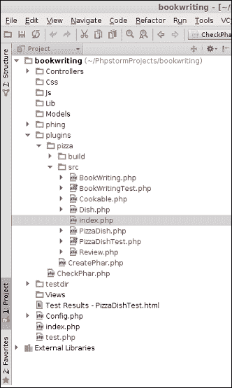
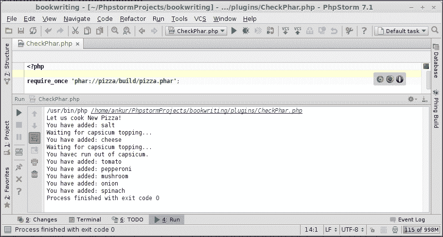

# 第八章. 烹饪库插件

在本章中，我们将涵盖以下主题：

+   创建库插件

+   精炼插件

+   使用 PhpStorm 配置插件

+   插件的代码提示

# 简介

想象一个世界，程序员就像你一样，只是喜欢编写代码。这个世界看起来很愉快，完美，首先非常适合你。然而，事实并非如此。在世界上，什么能让程序员比任何事情都更快乐和满足呢？那就是应用程序最终到达最终用户的情况。然而，如果程序员只是喜欢编写他们的代码，那么谁会确保代码被交付给最终用户呢？

最终用户可以是任何人——一个新手用户、专业用户，甚至是另一个程序员。所以，无论在什么情况下，场景或最终用户，作为程序员的你都必须小心谨慎，确保你编写的代码是（可）重用的。在你的整个软件工程生涯中，你被告知过，你也会被告知不要重复造轮子。如果你想使这个*枯燥*的原则保持活力，你必须让你的代码可使用和可重用。

另一个用例！假设你被要求在 PHP 中开发一个应用程序编程接口（API）。所以你手头的任务是编写代码。但对你来说还有一个（未说出的）任务是确保你编写的代码可以以最小的麻烦被包含。实现这一壮举的一个快速解决方案是将你的应用程序打包成一个存档，这样存档本身就可以在任何需要的地方被包含。请再次阅读！你需要有一个类似捆绑包的实体，你可以将其传递给测试团队以验证和确认。一个明智的程序员会建议使用 Phing 来一起构建文件。然而，这种情况的难点在于 Phing 会做你要求它做的事情。然而，你真的知道你要做什么吗？

你没有看错，你需要创建一个存档。这次，我们使用 PHP 存档，或者叫 phar，就像行业里称呼的那样（[`www.php.net/manual/en/book.phar.php`](http://www.php.net/manual/en/book.phar.php)）。Phar 对你来说不应该陌生。在你的软件工程生涯中，你一定多次使用过 phar。某个时候，一个 PhpStorm 食谱的作者可能指导过你如何获取 phar 并将其包含在 PhpStorm 库路径中。你能回忆起你曾经多么容易地找到在项目中添加 PHP 功能这个任务吗？如果可以，那么现在是时候转换角色了——从 phar 用户到 phar 创建者。如果不能，那么现在是学习如何创建 phars 的好时机。

### 注意

Phar 是 PHP 创建的存档文件。和其他存档一样，phar 也包含了许多文件和目录。为了能在你的应用程序代码中使用 phar，你只需要在代码中包含或引入 phar。就是这样！Phar 会表现得就像你包含了（或引入了）一个普通的 PHP 类。你将能够使用在 phar 内部声明的类、对应的方法和成员变量（当然，会尊重访问限定符）。

然而，拥有 PhpStorm 可以帮助你很多。你还可以将 phar 包含在项目的包含路径中，以便特定项目能够使用 phar 提供的功能。如果你需要将 PHP 功能提供给开发机器上的所有项目，考虑将 phar 添加到全局包含路径。

PHP 编程一直很有趣。然而，既然你是团队中的资深成员，强烈建议你在享受工作乐趣的同时，还要关注工作的实用性。

# 创建库插件

你有没有想过是什么构成了一个库？库就像一个图书库一样，是一个有用方法的集合。同样，应用程序库包含了许多有用的方法和元素。重点在于“有用”这个词，强调在库中不保留冗余的方法和元素的重要性。一段冗余的代码需要文档。当公司投入资源（本质上就是金钱）时，它永远不会希望拥有使用频率较低的实体。这是为什么？经济学的原则——任何公司的首要目标是最大化利润。无论如何！

## 准备工作

然而，不必担心，你不需要成为经济学诺贝尔奖得主才能停止在库中添加冗余元素。只需保持冷静，保持明智。制作插件涉及许多工程决策。其中一些决策可以是：

+   **决定让你编写库的原因**：你不会经常有创建库的任务。库是一系列你经常需要的方法的集合。因此，决定哪些方法是必需的，需要一定的成熟度。

+   **提前规划**：由于库是一种经常使用而很少修改的东西，你不会经常发布版本。由于版本发布得很少，如果在创建库的过程中出现了一个不正确的计划，那么你可能会很晚才发现你没有很大的错误空间。

+   **制作/重用决策**：你必须决定所需的库是否可以通过重用他人的代码，甚至是你为过去的项目创建的代码来构建。记住，你需要对此有敏锐的记忆。另一个需要决定的选项是是否从头开始创建一个库。

因此，本质上，所有规则都是为了方便创建包含 PHP 代码的*phar*。准备好享受这次旅程吧！

## 如何做到这一点...

1.  选择一个包含你想要包含在插件中的代码的目录。既然你一直在尝试制作披萨，你可以假设一个用例，即最终用户需要一个制作披萨的算法。在那里，你有需求！

1.  创建一个名为`src`的目录，其中将包含源 PHP 脚本。这将是库的源。

1.  创建一个名为`build`的目录，它将包含目标库，如下面的截图所示。这就是你一直渴望的库。

1.  你可能需要在`php.ini`文件中进行一些更改。要找出你的系统使用哪个`php.ini`，你可以在 PhpStorm 中输入`php-ini`（你还记得可以通过键盘快捷键*Ctrl* + *Shift* + *X*访问的命令窗口吗？）。你需要添加行`phar.readonly=0`以启用使用 PHP 创建 phar。

1.  你需要为库定义一个入口点。为什么需要这样做？这是 phar 的行为方式。默认情况下必须有一个`index.php`文件。你需要将它放在`src`（或源）目录的顶层。至少，它需要包含一个文件，该文件将提供对库中所需类的访问（当然，你可以将`index.php`的名称更改为另一个`file.php`，并使其作为入口点）。

    在当前场景中，你需要包含`PizzaDish.php`文件，这样你才能再次制作披萨——这次是通过库。所以，考虑到 PHP 代码，你将编写如下内容：

    ```php
    <?php
    require_once "PizzaDish.php";
    ?>
    ```

1.  由于 phar 是 PHP 功能，你需要编写代码来创建 phar 包。你将编写如下内容：

    ```php
    <?php
    $srcRoot = "src";
    $buildRoot = "build";
    $phar = new Phar ($buildRoot. "/pizza.phar", FilesystemIterator::CURRENT_AS_FILEINFO | FilesystemIterator::KEY_AS_FILENAME, "pizza.phar");
    $phar->startBuffering ();
    $phar->buildFromDirectory ($srcRoot);
    $phar->stopBuffering ();
    ?>
    ```

完成这些后，你可以坐下来，感到高兴，因为你已经创建了一个新的插件，你可以轻松地将其传递给测试和质量保证团队。

## 它是如何工作的…

是时候准备螺丝钉、润滑油和油腻的工作服了！

你可以看到你并没有做什么特别的事情：你只是写了一些非常简单和自然的 PHP 代码来生成一个可以作为插件使用的存档。你创建了目录来分别存放源文件和构建文件。这一步不是强制性的，但它确保了你的工作区域保持整洁。

`index.php`文件作为 phar 的入口点。因此，当你包含一个功能时，你需要涉及对该功能的引用。这就是你*包含*`PizzaDish.php`时所做的：

```php
$phar = new Phar($buildRoot . "/pizza.phar", FilesystemIterator::CURRENT_AS_FILEINFO | FilesystemIterator::KEY_AS_FILENAME, "pizza.phar");

```

当你编写这段代码时，你正在初始化创建 phar 的功能，它接受预期插件的名称（第一个参数），传递给父类`RecursiveDirectoryIterator`的标志（第二个参数），以及将作为其调用名称的存档名称。因此，你将创建一个库，其文件名为`pizza.phar`，当你通过`phar://`流访问时，它将被称为`pizza.phar`。

你需要开始缓冲以启动创建存档的过程。缓冲是将数据写入磁盘直到缓冲停止的过程。这是通过`$phar->startBuffering();`来完成的。

当你编写以下代码时，目录内的源文件被包含在你创建的插件中：

```php
$phar->buildFromDirectory($srcRoot);

```

将文件包含到存档中的过程会一直持续到你停止输出缓冲。你需要停止缓冲以完成将更改写入磁盘的过程。你编写的存档在你停止缓冲之前是不可见的。这是通过`$phar->stopBuffering();`完成的。

一旦你停止输出缓冲，输出（即存档文件）将显示给你。如何？以存档本身的形式！简单，不是吗？

# 插件的精炼

旁边有一个插件确实会鼓励你。然而，如果不对手头的插件应用软件工程原则，这种鼓励可能会导致一些严重的后果。这可能会让你成为一个退居二线的工程师！

软件工程是你在做任何事情时都不容易忘记的实体。你需要验证你创建的产品（这里，插件）是否工作正常。现在，这个“正确”有一个非常广泛的意义。简单来说，你只需要检查你创建的插件是否执行了预期的操作。另一方面是验证。在检查了预期的操作后，你需要检查执行的操作是否正确。这一点特别有用，因为实际的测试是根据这一现象在插件上进行的。

## 如何做…

你需要采取两个动作。两者都是强制性的。第一个是验证部分。你需要验证披萨烹饪插件是否工作。为此，你需要：

1.  创建一个新的 PHP 文件。

1.  在其中包含（或要求）你创建的插件。

1.  按照以下截图所示运行此文件。

    如果运行过程如所示完成，这意味着你的披萨正在被烹饪。

    

现在是验证部分。你可能需要验证你正在烹饪的实际上是披萨，否则你可能会破坏你的味蕾。为了验证这一点，这是一个相当模糊的步骤序列，并且可能会有不同的版本。步骤可以是：

1.  检查插件中的类是否可以自由访问。你需要创建对象的新实例。因此，像`$pizza = new PizzaDish('Mushroom', 'Dish')`这样的操作不应该产生错误。你应该能够像使用本地创建的类一样使用该对象和外部类中的成员。同样，像`echo $pizza->getDishName()`这样的操作不应该创建关于此函数不可用的错误，并且应该正确执行预期的活动。

1.  如果插件中出现了你认为不符合业务要求的问题，你需要（显然）快速修复它。所以，你可能需要再次遵循几个步骤：

    1.  在`src`目录中，找到文件（这里`PizzaDish.php`）。

    1.  识别创建错误（或行为不当）的行。

    1.  进行适当的更改。

    1.  使用更改后的源代码重新创建 phar。你可能想回顾一下“创建库插件”的配方。

1.  重复步骤 1-3，直到插件开始以预期的行为运行。

无论你做什么，你只需要有一个插件的精炼版本。

## 它是如何工作的...

验证过程的工作原理相当直观易懂。产品的验证检查你创建的插件是否实际上作为一个插件在工作。因此，你检查在作为系统使用插件的过程中可能出现的错误和问题。这就像说，“伙计，检查一下插件是否在工作”。你能想象是谁说的吗？是一个程序员对他的同行程序员说的！

验证过程需要理解。当你创建一个插件时，你不知道哪个代理会使用它——它可能是一个命令行用户、一个 IDE 或另一个更大的插件。因此，你需要确保你编写的插件是可用的。因此，当你创建一个新的对象时，你检查你打算在插件中提供的类是否存在。当你调用一个方法时，你检查插件内部定义的方法是否可访问，而且，没有不适当的访问修饰符限制你使用该方法。

插件的验证过程相当循环。由于确保插件正常工作是你的责任，你需要重复验证步骤，直到质量保证团队对插件完全满意。在这个过程中，如果你发现错误，你将不得不回到源代码中修复问题，并重新构建整个插件。

因此，这个过程对你来说继续进行。你编写代码。代码被测试。你修正代码。代码被测试。代码被测试。你创建一个插件。插件被测试。你回到正确的代码，并从那个点继续这个过程。循环，不是吗？

# 使用 PhpStorm 配置插件

当说到有一个插件时，可以假设必须有一个使用该插件的用户。既然你是 PhpStorm 的爱好者，你可以安全地假设 PhpStorm 可以是（其中之一）可能的插件用户。因此，你需要充当库插件的伪接收者并尝试使用库。通过配置，可以理解为在项目结构中进行必要的调整，以便可以使用库来为项目添加功能。你看到了，这是可重用性的古老实践在发挥作用。

与库插件相关的主要优势是将其包含到项目中的便利性。你只需利用这个优势。

## 如何做到这一点...

要使用 PhpStorm 配置插件，需要遵循以下步骤：

1.  从你想要的任何来源获取 phar。

1.  在你的项目中创建一个具有适当且描述性的目录。

1.  可以通过`require(_once) 'phar://name-of-phar.phar';`非常容易地使用插件。

完成了！如此简单——完全不像它看起来那样。这是 PHP 释放的力量。

## 还有更多...

然而，如果你认为你想用这个库做更多的事情，并且对通过调整内部类和/或包进行开发更感兴趣，你可能需要特别选择某些类。这是通过`require_once 'phar://pizza.phar/Dish.php';`来完成的。

## 它是如何工作的…

创建一个目录来存放库插件并不是什么高深的技术。这只是为了方便遵守软件工程规范。这里提到的开发者或插件用户。因此，当你创建一个新的目录时，你正在工作的项目的代码库保持模块化。所以，当你需要更改这个库时，你知道该去哪里。同样，当你需要从代码库中删除这个库时，你也知道该去哪里。如果你被问到何时需要添加一个具有类似功能的库或某些依赖项，你知道去哪里吗？

你使用库的方式取决于场景。回想一下，库插件包含两个文件：`PizzaDish.php`和`Dish.php`。如果你想使用基本功能——通过添加一些简单的配料和食材来烤披萨——整个 phar 的使用就足够了。如果你想使用特定的功能，指定相对于 phar（在 phar 内部）的文件名就足够了。

由于 phar 据说表现得和 PHP 文件一样，当你包含 phar 时，提示也开始。因此，当你写下`phar://pizza.phar/`并按下*Ctrl* + *Space*时，会显示给你一个包含在 phar 内部的所有文件的列表。你可以像使用常规 PHP 文件一样从列表中选择一个。

# 插件的代码提示

使用你创建的插件的 IDE 的实际效用现在显现出来了。开发者们普遍相信，IDE 无论在什么情况下都能提供自动补全功能。然而，在同一群开发者中，知道 IDE 如何提供自动补全功能的人却非常罕见。奶奶总是说“无知无回报”。没错！无知无回报（言外之意）。

可能会有一个疑问出现在你的脑海中。为什么你需要使用**自动补全**功能呢？这个答案可能不是外交辞令，但它是真实的。在大多数情况下，开发者们足够无知，以至于不会为他们的代码编写文档。因此，自动补全和/或代码提示成为了你提供的代码用户的救星。既然你自己也是程序员，你很容易就能理解使用代码提示功能的便捷性。

在当前上下文中，你需要有类似的设置，这样 PhpStorm 才能显示文档、方法使用和对于潜在的插件用户来说是必要的信息。

## 准备工作

为插件启用代码提示是一个单行操作。如果你真的想为 PhpStorm 配置代码提示，你需要更新 PhpStorm 尊重的包含路径。更新包含路径是通过打开项目视图并将 phar 的位置添加到项目的库列表中完成的。

## 如何做到这一点…

步骤如下：

1.  选择项目视图（*Alt* + *1*）。

1.  找到`外部库`目录。

1.  按*F4*。

1.  提供插件所在目录的位置。

1.  点击**应用**并按**确定**。

完成！深呼吸，并在需要为此插件激活代码提示时按*Ctrl* + *Space*。PhpStorm 再次为你服务！

## 它是如何工作的…

PhpStorm 会在项目可用的包含路径中进行查找，并提供当前上下文中可用的类和方法列表。系统范围内的包含路径（`/usr/share/php`，`/usr/share/pear`等）也会被查找。因此，当你将 phar 添加到包含路径时，PhpStorm 会得到一个额外的查找路径。

因此，在 phar 中可用的方法和类（你在`index.php`中包含的）将可用于代码提示。代码提示过程涵盖了文档、成员方法、成员变量以及你设计为可用的任何其他内容。

### 注意

值得注意的是，当你将库插件添加到包含路径中时，你将以与其他在包含路径中声明的类和库中可用的方法相同的方式开始获得提示，但有一个需要注意的区别。当你将库位置添加到包含路径中时，PhpStorm 能够为你提供**仅**代码提示。如果你想使用方法，你将无法做到。另一方面，当你需要使用插件，并且你`require`（`_once`）它时，代码提示也是可用的，但这次**仅**对当前脚本有效。

那么，区别在哪里呢？区别在于插件及其方法的使用和可用性。

总结一下，如果你想使用插件，你需要使用`include(_once)`或`require(_once)`，并且当你需要代码提示在整个项目中可用时，你需要将插件的位置添加到 PhpStorm 的包含路径中。
