# 第一章。phpMyAdmin 入门

# 那么，phpMyAdmin 是什么？

phpMyAdmin 是一个 PHP 应用程序，它提供了一个完整的界面来通过 Web 管理 MySQL 数据库。以下图像展示了产品的首页；主要部分——MySQL 和 Web 服务器——表明 phpMyAdmin 依赖于一个启用了 PHP 的 Web 服务器来向 MySQL 服务器发送命令并从服务器接收数据：

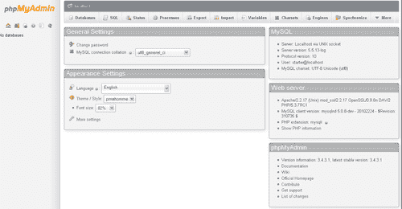

由于 MySQL 是网络上的数据库首选，PHP 是一种流行的网络脚本语言，因此网络托管提供商通常会为用户提供 phpMyAdmin，作为管理其数据库的事实上机制。

## 典型用户

phpMyAdmin 的用户可以分为以下几类：

+   网络开发者

+   数据库管理员

+   IT 学生和教师

其他网络应用程序的作者通常会建议管理员使用 phpMyAdmin，无论是用于最初填充所需的数据库，还是作为备份入口，以防他们从应用程序中被锁定。

## 可用功能

phpMyAdmin 提供了管理数据结构的面板：创建、编辑、删除各种元素，如数据库、表、列、索引、视图和外键（关系）。该软件还使您能够处理数据本身：插入、编辑和删除数据；排序；在表或数据库中进行搜索；导入和导出到各种文件格式。

系统管理员还可以使用 phpMyAdmin 获取 MySQL 服务器的状态信息；这些信息可用于微调服务器。此外，MySQL 用户名和权限的维护也是可用的。

高级功能包括：

+   生成系统文档，包括以图形形式显示表关系

+   转换数据（例如，显示存储为**BLOB**（二进制大对象）的图像的缩略图；见[`dev.mysql.com/doc/refman/5.5/en/blob.html`](http://dev.mysql.com/doc/refman/5.5/en/blob.html)）

+   跟踪结构和数据的变化

+   将常用查询保存为书签

+   维护用户对 phpMyAdmin 设置的偏好

+   在服务器之间同步数据库

世界各地的志愿者通过为界面提供多种语言的翻译来帮助开发团队。

# 安装

通过四个简单步骤，您就可以安装 phpMyAdmin 并在您的系统上设置它。

## 第 1 步——我需要什么？

在您安装 phpMyAdmin 之前，您需要检查您是否拥有以下列出的所有必需元素：

+   phpMyAdmin 需要一个支持 PHP 的 Web 服务器环境，例如 Apache ([`httpd.apache.org/`](http://httpd.apache.org/)) 或 IIS ([`www.iis.net/`](http://www.iis.net/))).

+   在 Web 服务器上至少有 25MB 的空闲（最小）磁盘空间。您将需要更多的空闲空间来存储 MySQL 中的数据。

+   phpMyAdmin 是用 PHP 脚本语言编写的。phpMyAdmin v 3.4.x 至少需要 PHP v5.2.0.0 版本才能运行。

+   最小支持的 MySQL 版本是 5.0.x。

+   您需要 MySQL 账户信息（用户名，密码）

## 第 2 步—下载 phpMyAdmin

推荐的下载 phpMyAdmin 的方式是从[`phpmyadmin.net/`](http://phpmyadmin.net/)作为压缩包下载。我们建议您下载最新的稳定版本。

选择一个您有相应提取程序的扩展名文件。此外，还有一些只包含英文消息文件的包，以及其他标记为`all-languages`的包，其中包含所有支持的语言。假设您下载了`phpMyAdmin-3.4.3.1-all-languages.zip`并将其保存到您的本地工作站。

下载并解压此存档后，您将留下一个名为`phpMyAdmin-3.4.3.1`的目录，其中包含多个文件和文件夹。

## 第 3 步—配置 phpMyAdmin

主要配置文件名为`config.inc.php`，其正常位置是顶级目录（其中包含`index.php`）。单个 phpMyAdmin 实例可以管理多个 MySQL 服务器；因此，此文件可以包含多个 MySQL 服务器的部分。它还可以包含控制界面行为的指令。所有这些指令都在`Documentation.html`中解释。

如果找不到此文件，phpMyAdmin 会假设您想要连接到`localhost`上的 MySQL 服务器——与网络服务器相同的宿主。这可能符合您的需求。

建议使用示例配置文件`config.sample.inc.php`，并将其复制到`config.inc.php`；然后，仔细阅读其中的示例。

## 第 4 步—上传到您的网络服务器

使用您的网络服务器上的上传机制，您现在应该将整个文件夹放置在您的网络服务器文档目录中，在这种情况下，工具将位于`http://yourwebserver.com/phpMyAdmin-3.4.3.1`。确切的地址和 URL 取决于您的主机策略。

您可以重命名文件夹；然而，最终的名称取决于多个因素：

+   服务器上是否安装了多个 phpMyAdmin 版本？

+   这是一个多用户安装，用户习惯于通过特殊 URL 如`http://yourwebserver.com/mysql?`来调用它吗？

以下示例将假设文件夹已被重命名为`phpMyAdmin`。

## 就这样！！

到目前为止，您应该有一个可以正常工作的 phpMyAdmin 安装，并且可以自由地探索它。

## 进一步配置

现在，文件夹已经放置在 Web 服务器上，您可以使用基于 Web 的设置脚本来细化您的配置。这种方式配置的优势在于所有指令都方便地按菜单和子菜单重新分组，例如**功能、导航框架和导入**。

**访问**[`yourwebserver.com/phpMyAdmin/setup`](http://yourwebserver.com/phpMyAdmin/setup)将显示以下初始屏幕：

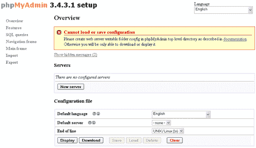

在这一点上，您可以使用各种菜单和按钮——特别是**新服务器**按钮——来探索配置可能性。您会注意到设置脚本目前无法加载或保存配置文件。这是因为存在一个保护机制。如果任何人都可以访问此 URL 并配置 phpMyAdmin，您的安装将面临风险。因此，您需要有权访问您安装 phpMyAdmin 的文件夹，以创建一个名为`config`的子文件夹，该文件夹可以在配置步骤期间临时使用。Web 服务器本身必须有权写入此文件夹。

当这个子文件夹创建完成后，重新加载页面；现在您可以使用**保存**按钮，这将在`config`子文件夹下创建一个`config.inc.php`文件。

配置完成后，您需要执行以下操作：

+   将新创建的`config.inc.php`复制到顶级目录，这样它就成为了有效的配置。

+   更改复制的`config.inc.php`的权限，以确保 Web 服务器无法写入它。

+   删除`config`目录（或者至少更改其权限以避免在其中写入）

# 快速入门——创建您的第一个表

phpMyAdmin 主要关于管理 MySQL 表，因此本节指导您创建一个数据库来存放您的新项目，然后创建两个表。

样本表的主题是一个杂货店，包括部门和商品。当然，一个真实杂货店的信息系统将包含许多更多描述员工、供应商和销售的表，但对我们来说两个表就足够了。

我们假设您的 MySQL 用户名是`sarah`，并且此账户允许使用前缀`sarah_`创建数据库。

## 第 1 步——创建数据库

MySQL 数据库是表的容器。新数据库将被命名为`sarah_grocery`，假设系统管理员强制执行所有数据库都必须以用户名作为前缀的政策。数据库名称的其余部分由项目名称组成，在这里是`grocery`。

目前您可能看到一个现有的数据库，`information_schema`。这不是一个真正的数据库，但它包含有关整个数据结构的元数据。

1.  通过 phpMyadmin 的登录面板以用户名**sarah**登录 MySQL。

1.  点击**数据库**菜单标签。

1.  将数据库名称从**sarah_...**更改为**sarah_grocery**。

1.  点击**创建**按钮。

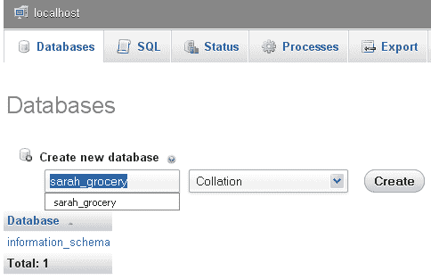

## 第 2 步——打开数据库

您现在必须告诉 phpMyAdmin 使用**sarah_grocery**作为当前数据库。这样，所有操作都将在这个数据库的上下文中进行。最简单的方法是通过点击导航面板（如果您使用的是从左到右的语言，如英语，它位于左侧）中的数据库名称来打开它。

## 第 3 步——创建第一个表

现在您已经有一个可以操作的数据库，是时候创建一个用于存储杂货部门描述的表格了。为了在后续任务中创建表间关系而不需要安装额外的 phpMyAdmin 组件，本练习中的所有表格都将使用 InnoDB 存储引擎——请参阅[`www.innodb.com 和 http://dev.mysql.com/doc/refman/5.5/en/innodb-storage-engine.html`](http://www.innodb.com)。

InnoDB 是一个不错的选择，因为它提供了稳定的性能、事务、引用完整性和崩溃恢复。

打开数据库时，默认进入其**结构**页面，您可以在此看到属于此数据库的现有表格和视图。现在使用**创建表格**初始对话框来指定表名和初始列数：

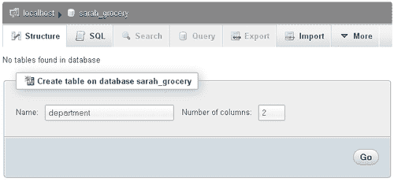

点击**Go**会弹出列面板，您将在其中创建两个列，`id`（一个整数列）和`description`（一个最大长度为 100 的可变长度字符列）。`id`列被标记为主键。

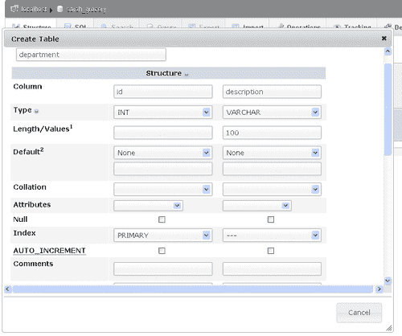

滚动到面板底部并点击**保存**创建表格。现在您会看到一个不同的**结构**面板，它显示了现有的表格**department**，您可以在其上应用操作，以及**创建表格**对话框以创建更多表格。

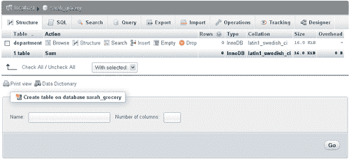

## 第 4 步——创建第二个表格

您现在将使用您创建表格的技能来创建`item`表格，包含以下列：

+   **id**（一个整数，主键）

+   **dept_id**（一个整数）

+   **description**（VARCHAR 100）

+   **weight**（一个整数）

您会注意到两个表格都有一个`id`列作为主键；然而，不会引起混淆，因为 SQL 要求在查询中使用表名，如下所示：

```php
SELECT id FROM item

```

## 第 5 步——填充表格

您需要一些示例数据来操作这些表格。向表格中插入数据有多种方式：

+   通过编程方式插入数据的应用程序

+   在 phpMyAdmin 的查询框中键入`INSERT`查询

+   通过 phpMyAdmin 的**导入**菜单进行导入操作

+   通过 phpMyAdmin 的**插入**菜单进行插入

在当前步骤中，您将使用**插入**菜单，它可以从数据库**结构**页面访问。让我们先插入新的部门；在部门表格的行上点击**插入**，这将打开插入面板。然后输入以下示例数据：


点击**Go**会生成以下查询，将其发送到 MySQL 服务器并在屏幕上显示——这既方便您确认操作，也可能帮助您学习 SQL。

```php
INSERT INTO `sarah_grocery`.`department` (`id` ,`description`
)
VALUES (
'1', 'Baby foods'
), (
'2', 'Frozen foods'
);

```

您还需要填充`item`表格。在这里，您在冷冻食品部门创建两个商品：

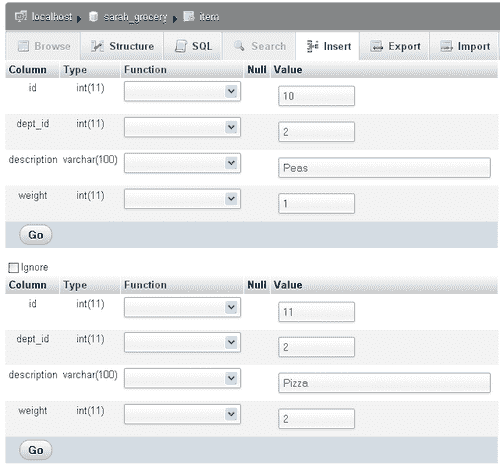

# 您可能想知道的顶级任务

当您开始使用 phpMyAdmin 时，您会意识到您可以用它做很多事情。本节将向您展示在 phpMyAdmin 中最常执行的任务以及如何执行它们。

## 任务 1—浏览数据

phpMyAdmin 最常见的用途可能是查看数据。事实上，这是如此常见，以至于在导航面板中点击表名时的默认操作是浏览此表。

让我们看看当您从导航（左侧）面板点击部门表时会出现什么：

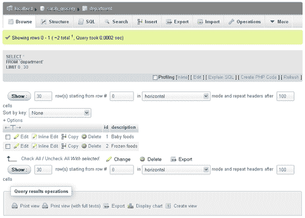

浏览模式下的屏幕可以分为多个部分，从上到下进行解释：

+   服务器/数据库/表定位器

+   表菜单，其中 **浏览** 被突出显示

+   **Showing rows** 行，指示您正在查看哪些行（第一行编号为 0）以及总行数

+   生成的查询 **SELECT * FROM `department` LIMIT 0,30**

+   一个导航行，您可以通过它指定要查看多少行以及起始行

+   一个 **按键排序** 选择器，包含此表的所有索引，从中选择排序

+   一个 **选项** 链接（关于此的更多信息见下文）

+   一个大写的 T，让您可以显示长列的完整文本

+   列名（可点击以按每列排序）

+   数据行，前面带有操作链接复选框 **编辑、行内编辑、复制** 和 **删除**

+   一条 **With selected** 行，允许对已标记复选框的行执行全局操作

+   **查询结果操作** 部分，您可以从其中生成表的 **打印视图**、**导出** 结果或从数据生成图表

点击 **选项** 会打开一个滑动部分，提供更多显示 BLOB 列、二进制列或关系信息的显示方式：


浏览不仅仅是查看原始数据；phpMyAdmin 还可以对这些数据进行排序。排序可以通过索引进行，使用 **按键排序** 选择器，或者简单地点击列标题。再次点击相同的标题会反转排序。您现在可以通过点击两次 **描述** 标题进行实验。

当有大量数据行时，它们会按页显示，您可以在这些页面之间导航。以下是一个具有不同表的导航控件示例，来自 MySQL 的 sakila 数据库 ([`dev.mysql.com/doc/sakila/en/sakila.html`](http://dev.mysql.com/doc/sakila/en/sakila.html))：

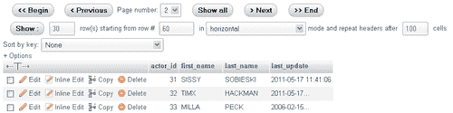

## 任务 2—搜索数据

对于像您的 `department` 和 `item` 表这样的小型表，通常浏览它们就足以掌握所有数据。然而，对于涉及许多表或许多数据行的较大项目，您必须依赖 phpMyAdmin 的搜索机制。

您可以一次性在单个表或多个表上搜索。让我们先检查单表情况，使用 `item` 表。

您可以使用以下任一方法进入表**搜索**页面：

+   在其**结构**页面上打开`sarah_grocery`数据库并点击对应于**项目**表的行上的**搜索**链接。

+   打开**项目**表并点击**搜索**菜单标签。

初始搜索页面看起来如下，其中仅显示最常用的**“示例查询”**部分：

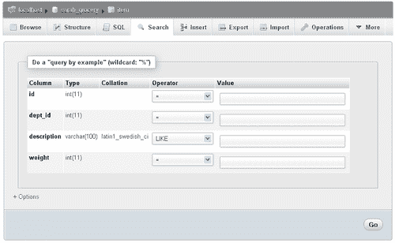

在示例查询搜索中，您填写一个或多个与您要查找的内容相对应的值。您还可以对一个值应用运算符以修改搜索行为。

让我们搜索一些披萨；为此，您只需在**description**旁边的值字段中输入**pizza**（小写**p**），然后点击**Go**，这将显示以下结果屏幕：

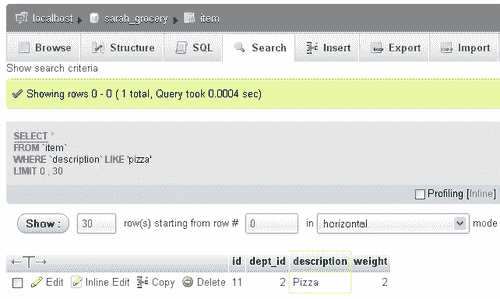

关于此屏幕的一些说明：

+   我们输入了**pizza**，但 MySQL 找到了**Pizza**；这是因为`description`列使用了其中一个不区分大小写的校对（`latin1_swedish_ci`，其中`ci`表示不区分大小写）。

+   结果中的**description**列用彩色边框突出显示。

+   我们现在处于一个正常的结果面板，所有与浏览相关的可能性都可用（页面导航、排序等）。

+   搜索条件面板已被隐藏，但可以通过位于菜单标签下方的**显示搜索条件**链接将其恢复。

为了练习使用搜索运算符：

1.  点击**显示搜索条件**。

1.  将**10**作为**id**的值输入。

1.  将**id**列的运算符更改为小于（<）。

1.  点击**Go**。

没有描述为 Pizza 且 id 小于 10 的项目，因此您会收到**MySQL 返回了一个空的结果集（即零行）**的消息。

搜索**选项**滑块包含控制哪些列将出现在结果中的控件，要求提供不同的结果，输入一个`WHERE`子句，指定每页的行数以及选择显示顺序。

现在，您将查看多表（或数据库）搜索机制。当您不确定确切哪个表包含您要查找的数据时，或者当同一数据（例如，城市名称）出现在多个表或多个列中时，这种方法很有用。

打开您的数据库并点击**搜索**按钮将显示数据库搜索面板。您首先尝试对所有表进行对数字 1 的精确搜索。为了完成此搜索：

1.  将**1**作为搜索值输入。

1.  点击**确切短语**旁边的单选按钮。

1.  点击**全选**以选择所有表。

1.  点击**Go**。

以下图像显示了启动搜索之前的搜索面板：

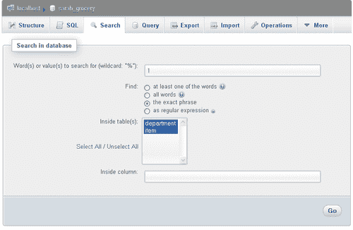

搜索结果首先概述了每个表的匹配数量，以及浏览或删除这些匹配项的链接：

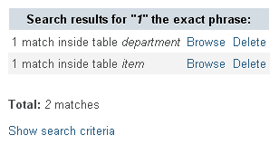

点击**浏览**可以获取特定表的搜索结果，同时保留屏幕顶部的全局搜索结果。

注意，**显示搜索条件**链接可用。现在点击此链接，将搜索模式（在**查找**对话框中）从**精确短语**更改为**至少包含一个单词**。点击**搜索**会显示包含两个匹配项的**项目表**中的不同全局搜索结果。这是因为生成的查询中在搜索值前后添加了通配符`%`字符，现在在查找数字 1 时匹配**项目表**的 id 10 和 11。

## 任务 3—更改数据和结构

赫拉克利特，一位希腊哲学家（也可能是数据库设计先驱）曾告诉我们：“除了变化，没有什么是永恒的”。在数据库领域，不仅数据值经常变化，而且它们的支持结构（列、表、视图和数据库定义）也会发生变化。

您将首先探索三种图形方法来编辑数据，然后继续讨论更改数据结构。

当您有一个结果页面（通过浏览表或在其中搜索生成）时，您会注意到对于每一行数据，都提供了**编辑**和**行内编辑**链接。此外，每行旁边都有一个复选框，允许您通过下方的**更改**链接选择要编辑的行。

让我们尝试**项目**表的**编辑**链接。浏览此表并点击**id 10**的**编辑**，将此行置于编辑模式。在这里，您已将**重量**值从 1 更改为 3，并即将点击**搜索**以保存更改：

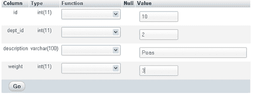

这是编辑行最传统的机制。使用复选框和**与所选内容一起更改**链接，您可以一次将多行置于编辑模式。以下是您可能想要这样做的一些原因：

+   在编辑时比较一行数据与另一行数据

+   要将数据从一行复制粘贴到另一行（例如，交换豌豆和披萨的重量值）

最近（在 phpMyAdmin 3.4.x 中），提供了行内编辑功能。尝试对**id 10**进行编辑会带您进入以下屏幕：

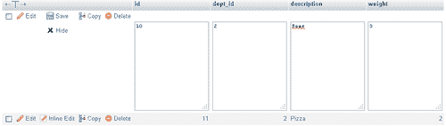

优点是您没有离开您所在的结果页面；因此，您可以密切关注其他行的数据，这有助于您决定要进行的更改。

直接进行更改并点击**保存**，或者决定**隐藏**行内编辑视图，因此不会保存您所做的任何更改。

我们现在将探讨如何修改数据结构。您首先在**结构**模式下打开**部门**表——这可以通过点击此表的**结构**完成，或者通过点击导航面板中此表名称旁边的图标来完成。

**结构**页面显示了大量的信息：

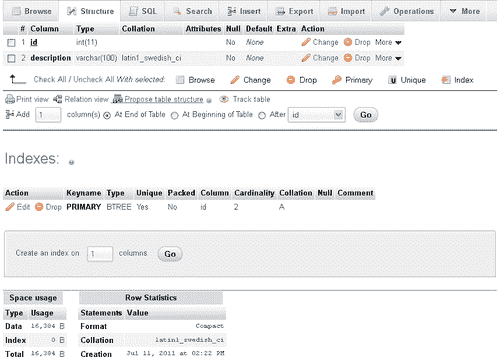

您可以看到三个主要部分：

+   当前列的列表，以及添加更多列的对话框

+   **索引**部分，您可以在此处编辑或删除索引

+   空间使用和行数的统计信息

在下一个练习中，您将添加一个用于记录该部门最后检查日期的列。在**添加 X 列**对话框中，您可以看到默认是在表的末尾添加一列；然后只需点击**Go**，这将弹出一个面板，您可以在其中输入新列的信息：

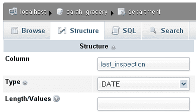

点击**保存**将此列添加到您的表中。现在您可以浏览**department**表，并注意有一个新的列，**last_inspection**，所有日期都设置为**0000-00-00**，因为我们没有设置任何默认日期。

编辑现有行会显示一个新图标：一个小日历。点击它将弹出一个标准日期选择器，如下所示：

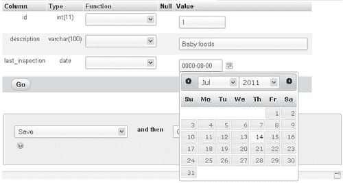

您还可以更改现有列的结构——例如，描述列变为`VARCHAR(110)`——但请注意更改列类型或大小的后果。可能会发生数据截断。

在**last_inspection**列上添加索引可以通过为每个列提供的**更多**菜单快速完成：

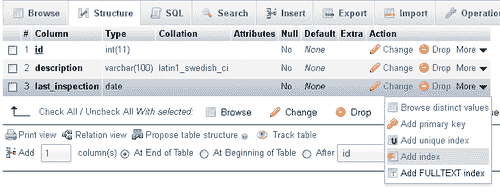

通过使用特定索引的**编辑**链接，通过**索引**部分进行索引的微调。在这里，您可以向索引中添加或删除列，甚至更改列在此索引中使用的字符数。

## 任务 4—导出到 Excel

Excel 的流行意味着许多人熟悉这个工具，并且他们更喜欢在其中进行大部分数据操作。本任务将描述提取数据以将其读回到 Microsoft Excel 中的过程。请注意，任何理解 CSV（逗号分隔值）格式的实用程序都可以用于读取在此任务中生成的文件。

您将首先练习快速模式下的导出，然后您将进入自定义模式以获取更多选项。

首先，打开**department**表并点击**导出**，这将弹出一个面板：

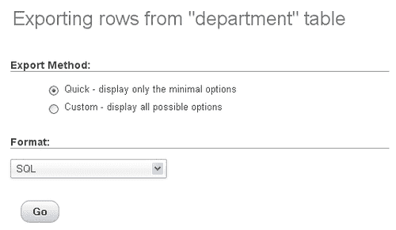

如所示，默认导出格式是**SQL**，因为它允许您快速生成表的完整结构和数据备份。然而，对于此任务，您需要将导出格式更改为 CSV 以用于 MS Excel。

一个纯 CSV 文件应使用**逗号分隔值**；然而，由于 Excel 使用分号来分隔每个值，phpMyAdmin 生成的文件包含分号。您可以通过在**格式**选择器中选择该格式并点击**Go**来尝试此格式。您的浏览器会提供保存文件或使用与`.csv`文件关联的默认程序打开文件（取决于您的工作站操作系统）。以下是使用 Excel 打开文件后您可以看到的内容：


注意，在此快速导出格式中，列名不会显示；您将使用自定义格式来修复此问题。

与快速导出格式相反，自定义格式提供了许多选项。其中一些选项**（行，输出）**对所有导出格式都是通用的，而一些选项是为每个格式定制的。

选择**CSV for MS Excel**，然后选择**Custom**会显示以下面板：

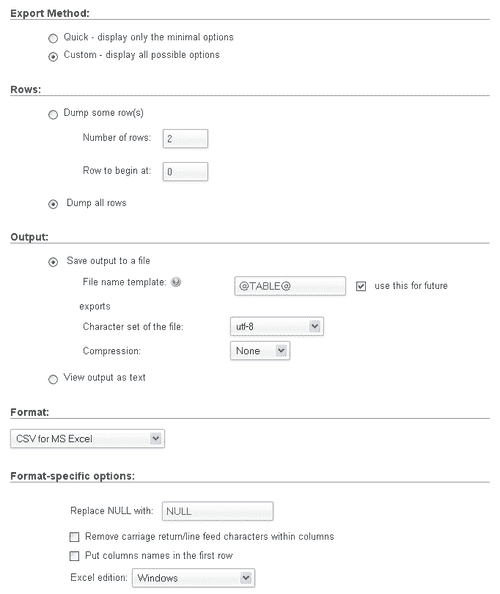

**行**部分允许您选择**导出**（导出）一些行（指定行数和起始行）或所有行。

**输出**部分允许您将输出保存到文件（可选择字符集和压缩）或以文本形式查看输出（这不会保存任何内容，但在输出格式可以解释为文本的情况下可能很有用——这适用于 CSV 格式）。

接下来，根据所选格式，格式特定的选项会有所不同。在这里，最可能被更改的选项是**将列名放在第一行**。这将帮助在 Excel 中打开 CSV 文件的人看到指示原始列名的列标题。

还有一个选择器可以用来选择此文件的**Excel 版本**（Windows，Mac）。

## 任务 5—创建关系

在表之间建立关系非常有用。让我们仅考虑通过 phpMyAdmin 操作表时定义关系的优势：

+   根据相关表选择一列值的可能

+   对表之间关系的更清晰描述

+   生成关系图的可能

在 MySQL 中定义关系的方式是通过`FOREIGN KEY`约束（更多详情请参阅[`dev.mysql.com/doc/refman/5.5/en/innodb-foreign-key-constraints.html)`](http://dev.mysql.com/doc/refman/5.5/en/innodb-foreign-key-constraints.html)）。这些约束与 InnoDB 存储引擎一起提供；这就是为什么我们在该引擎下创建表。

在这个任务中，您将开始探索仅使用 MySQL 提供的原生功能可以做什么，然后您将了解 phpMyAdmin 提供的附加可能性，这要归功于其配置存储机制。

此处的目标是建立`item`表中的`dept_id`列与`department`表中的`id`列之间的关系；这是因为在使用`item`表之前，应该先存在一个部门。在 InnoDB 术语中，`item.dept_id`的外键将是`department.id`。

您首先在其**结构**页上打开**item**表，然后点击**关系视图**。这将显示以下面板：

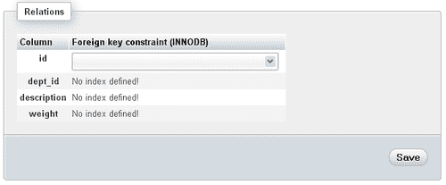

InnoDB 要求所有引用外键或被引用为外键的列都必须定义索引。因此，你必须返回到**结构**页面为**项目**，并为**dept_id**列使用**更多**选择器，选择**添加索引**：

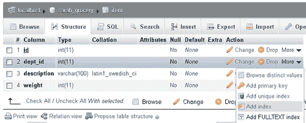

返回到**关系视图**，你现在可以为**dept_id**选择适当的列**department.id**。选择它会使其他选择器也出现：

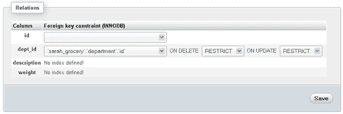

**ON DELETE**和**ON UPDATE**是外键选项；它们在上文提到的 MySQL 文档页面上有解释。现在你只需保留默认值并点击**保存**。

到目前为止，一切都很顺利，因为你的数据遵守了约束（部门 ID 存在于部门表中）。

你可以通过尝试**插入**一个新项目立即看到关系的优势；可能的部门 ID 会出现在下拉选择器中：

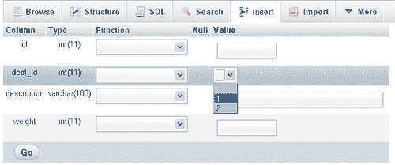

如果你的安装已部署 phpMyAdmin 配置存储，则可以提供更多选项。简而言之，这是一组特殊的表，包含有关各种配置元素的元数据。例如，当我们插入或编辑项目时，我们希望看到部门名称出现在下拉选择器中。因此，在 phpMyAdmin 配置存储中提供了名为 `display column` 的元数据，以保存最能描述每一行的列。有关安装配置存储的详细信息请参阅 `Documentation.html`。本任务的剩余部分假设配置存储已安装。

在此基础上，你可以在**结构**页面打开**部门**表，点击**关系视图**，并选择要显示的列，即**描述**：

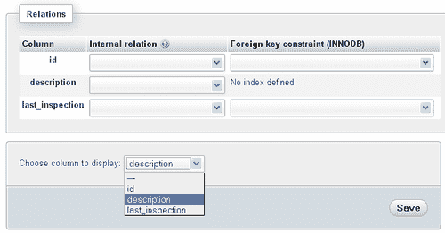

点击**保存**后，你现在可以以**插入**模式打开**项目**表，并看到以下差异：

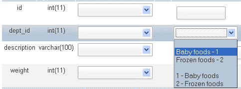

如果引用表中存在太多的行，则会提供一个图标而不是下拉选择器。此图标将打开一个不同的面板，可以选择值，具有分页和搜索功能。

配置存储提供的另一个实用功能是设计器。在这个面板中，可以从数据库菜单访问，你可以图形化地定义关系，在工作区中移动表，并保存它们的坐标以生成关系的 PDF 模式。以下是设计器工作区的图像：

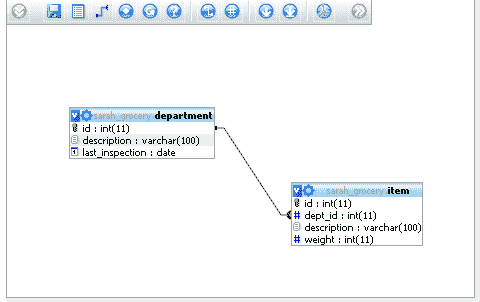

# 你应该了解的人和地点

如果你需要 phpMyAdmin 的帮助，以下是一些人和地点，它们将非常有价值。

## 官方网站

+   主页：[`phpmyadmin.net`](http://phpmyadmin.net)

+   手册和文档：[`phpmyadmin.net/documentation`](http://phpmyadmin.net/documentation)（此部分包含最新开发版本的文档；`Documentation.html`是您版本当前文档，包含在下载套件中）

+   Wiki：[`wiki.phpmyadmin.net`](http://wiki.phpmyadmin.net) 包含 phpMyAdmin 用户及其开发者的信息

+   博客：[`planet.phpmyadmin.net`](http://planet.phpmyadmin.net) 聚合了一些 phpMyAdmin 开发者的博客

+   源代码：phpMyAdmin 总是以源代码形式提供，但您可以在 [`www.phpmyadmin.net/home_page/improve.php`](http://www.phpmyadmin.net/home_page/improve.php) 找到更多关于仓库的信息

## 文章和教程

+   使用 phpMyAdmin 学习 SQL [`www.php-editors.com/articles/sql_phpmyadmin.php`](http://www.php-editors.com/articles/sql_phpmyadmin.php)

+   使用 phpMyAdmin 做更多（第一部分和第二部分）：[`www.devshed.com/c/a/PHP/Doing-More-With-phpMyAdmin-Part-1`](http://www.devshed.com/c/a/PHP/Doing-More-With-phpMyAdmin-Part-1)，[`www.devshed.com/c/a/PHP/Doing-More-with-phpMyAdmin-Part-2`](http://www.devshed.com/c/a/PHP/Doing-More-with-phpMyAdmin-Part-2)

## 社区

+   支持主页：[`www.phpmyadmin.net/home_page/support.php`](http://www.phpmyadmin.net/home_page/support.php)

+   官方邮件列表：用户：[`lists.sourceforge.net/lists/listinfo/phpmyadmin-users`](https://lists.sourceforge.net/lists/listinfo/phpmyadmin-users);

    phpMyAdmin 开发者：[`lists.sourceforge.net/lists/listinfo/phpmyadmin-devel`](https://lists.sourceforge.net/lists/listinfo/phpmyadmin-devel)

+   官方论坛：`https://sourceforge.net/projects/phpmyadmin/forums/forum/72909`

+   官方 IRC 频道：#phpmyadmin 在 [irc.freenode.net](http://irc.freenode.net)

+   微博：[`identi.ca/phpmyadmin`](http://identi.ca/phpmyadmin)，项目的官方微博网站

+   Facebook：`http://www.facebook.com/pages/PhpMyAdmin/157021164334486`

+   Ohloh：页面 [`www.ohloh.net/p/phpmyadmin`](http://www.ohloh.net/p/phpmyadmin) 跟踪 phpMyAdmin 在源代码变更方面的进展

## Twitter

+   生产流行的 XAMPP 系统，其中包含 phpMyAdmin：[`twitter.com/#!/apachefriends`](http://twitter.com/#!/apachefriends)

+   关于 phpMyAdmin 的快速新闻：[`twitter.com/#!/phpmya`](http://twitter.com/#!/phpmya)

+   对于开源新闻：[`twitter.com/PacktOpenSource`](http://twitter.com/PacktOpenSource)
