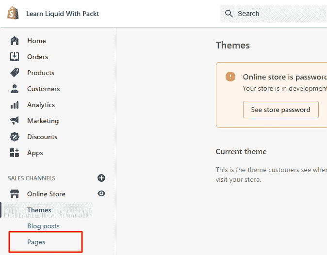
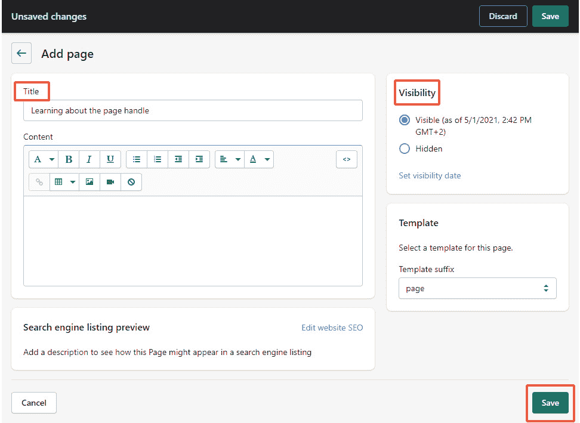
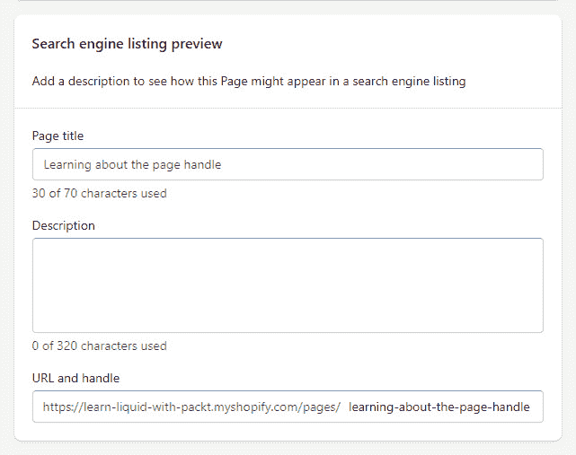

# 第二章：*第二章*：液体的基本流程

本章将帮助我们了解 Liquid 是什么，学习 Liquid 的基础知识，为我们提供掌握它所需的基本知识。我们将把本章分为以下主题：

+   什么是 Liquid？

+   理解 Liquid 及其定界符

+   学习比较运算符

+   使用逻辑运算符

+   理解数据类型

+   控制空白字符

到本章结束时，我们将对 Liquid 逻辑有更深入的理解，我们将使用哪些运算符来操作各种类型的数据，以及 Liquid 移除那些讨厌的空白字符的方式。通过学习如何使用逻辑运算符和操作处理属性，我们将获得有关生产各种动态功能的有价值知识，并将我们的技能引向编写高质量和复杂代码的正确路径。

# 技术要求

本章的代码可在 GitHub 上找到：[`github.com/PacktPublishing/Shopify-Theme-Customization-with-Liquid/tree/main/Chapter02`](https://github.com/PacktPublishing/Shopify-Theme-Customization-with-Liquid/tree/main/Chapter02)。

本章的“代码在行动”视频可以在这里找到：[`bit.ly/3ArKxia`](https://bit.ly/3ArKxia)

# 什么是 Liquid？

在上一章中，我们获得了对 Shopify 的初步了解。我们学习了 Shopify 是什么，如何创建 Shopify 合作伙伴账户，以及如何管理我们的主题。最后，我们学习了主题结构、它包含的目录以及我们 `Layout` 目录中的一些基本文件，这时我们可能会注意到我们的大部分文件都包含 `.liquid` 扩展名。*那么，Liquid 究竟是什么呢？*

Liquid 是由 Shopify 联合创始人兼首席执行官 Tobias Lütke 创建的开源项目。作为一个模板语言，Liquid 变量将 Shopify 商店的数据库连接到我们主题中的静态 HTML 内容，使我们能够将静态模板页面转变为一个完全动态且功能强大的电子商务商店，并产生令人印象深刻的成果。我们还可以将 Liquid 元素视为占位符，这些占位符只有在文件内的代码编译并发送到浏览器后才会填充适当的数据。

自 2006 年以来，Liquid 一直在发展和演变。如今，许多不同的网络应用程序都依赖于 Liquid，Shopify 就是其中之一，这表明对 Liquid 的需求一直在增长。学习 Liquid 是进一步扩展知识的好方法，并且凭借其易于学习的语法，我们将迅速掌握 Liquid 并能够创建复杂的功能。

# 理解 Liquid 及其定界符

我们可以区分液体文件的两个方法之一是通过扩展名 `.liquid`。作为一个模板语言，液体文件是静态内容和动态内容的组合：

+   我们在 HTML 中编写的元素被称为 **静态内容**，无论我们当前在哪个页面上，它们都保持不变。

+   另一方面，用 Liquid 编写的元素被称为**动态内容**元素，其内容会根据我们所在的页面而变化。

虽然我们的浏览器可以快速处理 HTML 代码，但它们不知道如何处理 Liquid 代码，因为它们不理解它。我们可以将提交 Shopify URL 到浏览器时发生的事情的流程分解为五个逻辑步骤：

1.  Shopify 服务器试图确定我们正在尝试访问哪个商店。

1.  根据我们当前请求信息的页面类型，Shopify 会尝试从活动主题目录中定位并选择合适的 Liquid 模板。

1.  在成功识别所需的 Liquid 模板后，Shopify 服务器开始用 Shopify 平台存储的实际数据替换占位符。

1.  一旦 Shopify 完成替换占位符和执行所选模板中定位的任何逻辑，我们的浏览器将接收到编译后的 HTML 文件。

1.  现在浏览器已经接收到 HTML 文件作为响应，浏览器开始处理文件并获取所有其他必需的资产，包括 JavaScript、样式表、图像等。

我们可以区分液体文件和代码的第二种方式是通过其两个定界符：

+   `{{ }}` 双大括号用于表示我们期望一个输出。以下是一个期望输出的 Liquid 代码示例：

    ```php
    Our collection name is {{ collection.title }}. As we can see, collection.title is encapsulated inside the double curly braces indicating that the result of the code will be output. After the Shopify server processes our Liquid code and returns us something that our browser can work with, we would receive the following string as a result:

    ```

    我们的收藏夹名称是冬季鞋子

    ```php

    ```

+   另一方面，如果我们想表示我们正在执行某种逻辑，则使用带有百分比的``大括号。

在我们最后的例子中，我们能够看到使用`{{ collection.title }}`恢复收藏夹名称的结果。现在，*如果我们想显示收藏夹描述，但出于某种原因，* `收藏夹描述` *字段没有返回任何内容？* 我们最终会得到一个不完整的信息：

```php
Our collection description is
```

为了确保这种情况不会发生，我们可以使用 Liquid 逻辑和比较操作符以及一些 Shopify 数据类型来检查数据值是否存在。

# 学习比较操作符

使用 Liquid，我们可以访问七个比较操作符，我们可以将它们组合起来创建任何类型的逻辑流程，我们的代码需要。让我们按以下方式回顾它们：

+   `==` 操作符允许我们检查我们正在比较的元素是否等于某个值：

    ```php
    {% if collection.title collection.title is strictly equal to our string of "Winter Shows", the logic returns true, and we will see our message shown. Otherwise, the logic returns false. Note that comparison will only return true if the string is an exact match, including the text case.
    ```

+   `!=` 操作符与前面的操作符类似。区别在于，这个操作符检查我们正在比较的元素是否不等于某个值：

    ```php
    {% if collection.title collection.title, but in this case, we will be checking whether the collection's name is not equal to the "Winter Shows" string. If the result is that collection.title is not the same as our string, the logic returns true, and we will see our message shown. Otherwise, the logic returns false, and the message will not be visible.
    ```

+   `>` 操作符允许我们检查比较值是否大于比较值：

    ```php
    {% if collection.all_products_count 25. If it is, the logic will return true, and we will see our message shown. Otherwise, the logic returns false, and the message will not be visible.
    ```

+   类似于前面的例子，我们将检查我们收藏夹中的产品数量，然而，在这种情况下，我们将使用`<`操作符，它仅在比较值小于被比较值时返回`true`：

    ```php
    {% if collection.all_products_count 25, the logic will return true, and we will see our message shown. Otherwise, the logic returns false, and the message will not be visible.We have a general understanding of how the `<` and `>` operators works, but what if we had the following example:

    ```

    {% if collection.all_products_count > operator 允许我们检查比较值是否大于比较值。如果是，逻辑返回 `true`，我们的消息将显示。然而，如果我们现在运行我们的代码，逻辑将返回 `false`，我们不会看到我们的消息。*为什么？*如果我们看我们的例子，我们会注意到我们有一个包含比较值的引号，这意味着我们的比较到的值是一个字符串，与我们的 `collection.all_products_count` 相比，它返回一个数字。正如我们之前提到的，比较运算符只有在满足运算符要求的精确条件时才会返回 `true`。在我们的当前例子中，为了使我们的消息可见，必须满足两个条件。第一个条件是两个值必须是相同的数据类型，这意味着我们不能像刚才那样混合两种数据类型。我们需要从我们的比较到的值中移除引号，从而将其从字符串转换为数字数据类型。第二个条件是我们的比较值大于比较到的值。一旦我们满足这两个条件，逻辑返回 `true`，我们的消息将显示。

    ```php

    ```

+   `>=` 运算符允许我们检查我们比较的元素是否大于或等于比较值：

    ```php
    {% if collection.all_products_count true, and we will see our message shown. Otherwise, the logic returns false, and the message will not be visible.
    ```

+   `<=` 运算符允许我们检查比较值是否小于或等于比较值：

    ```php
    {% if collection.all_products_count true, and our message will show. Otherwise, the logic will return false, and the message will not be visible.
    ```

# 使用逻辑运算符

除了比较运算符之外，我们还可以访问两个逻辑运算符，它们允许我们将多个条件组合起来创建复杂的语句。我们可以将它们分为以下两个组：

+   `or` 运算符允许我们设置多个条件，其中我们必须满足至少一个：

    ```php
    {% if collection.title == "Winter Shoes" Winter Shoes or if the collection contains more than 25 products. If we have met at least one of these two conditions, the logic will return true, and our message will be shown. Otherwise, the logic will return false, and the message will not be visible.
    ```

+   类似地，`and` 运算符允许我们设置多个条件。然而，要使此运算符返回 `true`，所有条件都必须满足：

    ```php
    {% if collection.title == "Winter Shoes" Winter Shoes and the collection contains more than 25 products. If we have met both of these conditions, the logic will return true, and the message will be shown. Otherwise, the logic will return false, and the message will not be visible.Important note:We can now create a conditional with multiple comparison values. However, we should note the order in which our conditional will perform the check is from the right side. We cannot change this order using the parentheses, as parentheses are invalid characters in Liquid and will break our code.
    ```

+   `contains` 是我们列表中的最后一个运算符。这个特定的运算符与之前的运算符不同，因为它不检查比较值是否等于比较到的值。相反，它允许我们检查一个字符串是否包含子字符串：

    ```php
    {% if collection.title collection.title, which returns a string, contains the word "Christmas", and if it does, it shows the message. Note that contains is case-sensitive and will only return true if the sub-string strictly matches the part of the string.Important note:We can use `contains` to search for the presence of a substring inside a string or even to check whether our string is a part of the array of strings. However, we cannot use it to check for the presence of an object inside the array of objects. We can only use `contains` to search for the presence of strings.
    ```

我们已经学习了关于使用逻辑和比较运算符的很多知识。然而，我们只学习了如何将一个值与另一个已知值进行比较。*那么我们如何检查一个比较值，例如一个集合描述，是否存在呢？* 由于 `collection.description` 返回我们不熟悉的内容，我们无法用我们目前的知识来进行这项检查。要执行此操作，我们首先需要了解我们可以与 Liquid 一起使用的不同类型的数据。

# 理解数据类型

到目前为止，我们已经提到了两种数据类型，**字符串**和**数字**。然而，在 Liquid 中，有六种不同的数据类型可供我们使用：

+   字符串

+   数字

+   布尔值

+   空值

+   数组

+   EmptyDrop

## 字符串

**字符串**是我们用来表示文本的数据类型。由于字符串可以是字母、数字或特殊字符的任意组合，我们应始终用引号将其括起来：

```php

  We have found a product that contains the word Book or    the product that contains the word 2021.

```

在上一个例子中，我们检查产品标题是否包含字符串`"Book"`或相同的标题包含字符串`"2021"`，如果是，我们的消息将显示。

## 数字

**数字**是一种不需要引号的数据类型，我们用它来表示以下两种数值数据：

+   **浮点数**是一个带有小数点的浮点数，这意味着数字包含小数点。

+   另一方面，**整数**或**int**是一个不带小数点的整数：

    ```php
    
      The number of products in a collection is greater    than 25, and the product's price is lower than 3500.
    
    ```

在这个例子中，我们检查产品价格是否大于`25`，同时，低于`and`比较器，两个条件都必须为真。如果其中任何一个返回`false`，我们的消息将不会显示。

注意，我们两个比较值`25`或`product.price`都不会返回。

## 布尔值

`true`或`false`：

```php

  The customer has signed up for our newsletter!

```

如我们从示例中看到的那样，与数字数据类型类似，布尔值不使用引号。如果`customer.accepts_marketing`已注册我们的通讯简报，对象将为真，我们的消息将可见。

## 无

**Nil**是一种在代码没有结果时返回空值的数据类型。由于`nil`不返回任何值，我们可以用它来检查语句的真实性。然而，我们应该注意，我们只能使用`nil`来检查值是否存在。我们不能使用`nil`来检查值的内 容：

```php

  Welcome {{ customer.name }}!

```

在上一个例子中，我们使用条件来检查访问我们商店的客户是否在我们的商店有账户，如果客户对象存在。请注意，我们没有在我们的客户对象后添加任何操作符或数据类型。原因是`nil`是一个特殊的空值。它不是一个包含文本`nil`的字符串或变量，因此不需要任何视觉表示。

我们可以将 Liquid 内部的值分为两类：

+   所有在条件中使用时默认为`true`的数据类型都被认为是**真值**。请注意，即使是空值，如字符串，也默认被认为是真值。

+   另一方面，所有返回`false`的数据类型默认被认为是`false`和`nil`。

由于`nil`被认为是假的，除非客户在我们的商店有账户，否则我们的消息不会显示。否则，条件将返回`true`，我们的消息将显示。

虽然`nil`非常有用，但它不能回答我们所有的问题。如果我们回想一下，在我们之前的某个例子中，我们使用了`collection.description`来查看描述集合的内容：

```php
Our collection description is {{ collection.description }}.
```

如果我们的集合描述中包含一些定义的内容，我们的消息将正确显示。然而，如果我们没有为我们的集合定义描述，那么`collection.description`将返回空，我们最终会得到一个不完整的信息：

```php
Out collection description is.
```

如我们所回忆的，我们只能使用 nil 来检查诸如对象之类的元素是否存在。它不能检查其内容，*但这究竟意味着什么？*

```php

  <h3>{{ collection.description }}</h3>

```

在这个例子中，我们使用 nil 数据类型在条件中包裹我们的元素，以检查`collection.description`实例是否存在。然而，正如我们所看到的，这不是我们希望得到的结果：

```php
<h3></h3>
```

由于 nil 只检查元素是否存在，在我们的情况下，我们的条件已经发现`collection.description`虽然为空，但确实存在。请记住，Liquid 中的所有值（除了 false 和 nil）默认都是真值，这意味着空字符串也被认为是真值。因此，尽管我们的`collection.description`实例为空并返回了一个空字符串（因为我们在一个条件中使用 nil），但结果是该值是真值。因此，条件内的代码是可见的。

为了解决这个问题，我们不应该检查值是否存在，而应该检查我们的值是否不为空：

```php

  <h3>The collection description element will show only if    its content is not empty.<h3>

```

在上一个例子中，我们使用不等于参数对`blank`进行检查，以查看我们的集合描述是否不为空。如果这个条件的结果是`collection.description`不为空，我们将显示定义的消息。否则，条件将返回`false`，并且条件内定义的消息将不会渲染。

## 数组

**数组**是一种包含元素列表的数据结构，通常元素类型相同。请注意，我们无法仅使用 Liquid 来初始化我们的数组，但我们可以将字符串分解为子字符串数组，我们可以使用这两种方法之一来访问这些数据：

+   访问数组内部数据的第一种方法是通过直接访问每个项目。

    由于，正如我们提到的，我们无法仅使用 Liquid 来初始化数组，因此在这个例子中，我们可以使用`product.tags`，这将返回一个字符串数组：

    ```php
    [] combined with product.tags and the index position to access each item individually:

    ```

    <p>{{ product.tags[0] }}</p>

    <p>{{ product.tags[1] }}</p>

    <p>{{ product.tags[2] }}</p>

    <p>{{ product.tags[3] }}</p>

    <p>{{ product.tags[4] }}</p>

    ```php

    Note that array indexing starts at `0`, so we use `product.tags[0]` to access the first element in our array. After submitting our code to the Liquid server, we receive the following list of strings:

    ```

    <p>learning</p>

    <p>with</p>

    <p>packt</p>

    <p>is</p>

    <p>awesome!</p>

    ```php

    While this method produces results, it is only applicable when we are entirely aware of the content of our array and the exact position of the element that we require. If, on the other hand, we are looking to output the entire content of an array without too much writing, we would need to use a different method.
    ```

+   要访问数组中的所有项目，我们需要遍历数组中的每个项目并输出它们的内 容：

    ```php
    
      <p>{{ tag }}</p>
    
    ```

    我们可以使用`for`标签重复执行代码块或遍历数组中的所有值并输出它们：

    ```php
    for loop are precisely the same as when we previously accessed each item individually.
    ```

虽然使用循环遍历数组来快速输出数组比逐个调用数组中的每个项目要容易，但我们必须意识到这两种方法，这将允许我们稍后创建一些复杂的功能。

## EmptyDrop

我们列表中的最后一个数据类型是 **EmptyDrop**，它将出现在我们尝试使用句柄访问之前已删除的对象或禁用的属性的情况下。

在我们学习最终数据类型之前，我们首先需要了解什么是句柄，以及如何找到它。

### 查找句柄

`-` 用于替换任何特殊字符和空格。类似于我们学习如何使用位置索引访问数组中的单个项目，我们也可以使用页面句柄来访问液态对象的属性。

我们现在理解了页面句柄是什么，但让我们通过在我们的商店中创建一个页面来尝试将其放入上下文中，看看我们刚刚学到了什么：

1.  要创建新页面，我们首先需要通过访问 [`www.my-store-name.myshopify.com/admin`](https://www.my-store-name.myshopify.com/admin) 并使用我们的 Shopify 合作伙伴凭据登录来导航到我们的商店。另一种方法是访问 Shopify 合作伙伴网站 [`www.shopify.com/partners`](https://www.shopify.com/partners)，并使用我们在上一章中创建的合作伙伴账户登录，然后在左侧侧边栏中点击 **商店** 按钮，然后通过点击商店名称旁边的 **登录** 按钮来登录我们的商店。

1.  在成功登录我们的商店后，在侧边栏中，在 **销售渠道** 下方点击 **在线商店** 以展开菜单的附加部分，然后点击 **页面** 链接，将我们重定向到商店的 **页面** 部分：

    图 2.1 – 访问页面部分

1.  一旦进入，由于我们的商店是新的且没有内容，我们唯一能看到的就是 **添加页面** 按钮。否则，我们会看到我们可以在商店中访问的所有页面的列表。要继续创建我们的第一个页面，请点击 **添加页面** 按钮。

1.  在初始化创建新页面的过程后，我们将看到可以定义新页面内容的页面，包括名称、描述、可见性和页面应使用的模板。对于我们的当前目的，我们只需要输入我们页面的标题，确保我们选择 `了解页面句柄` 作为标题。我们还确保选择了 **可见** 选项，所以剩下的就是点击 **保存** 按钮：

    图 2.2 – 在 Shopify 管理界面中创建和发布新页面

1.  现在我们已经创建了页面，我们可以通过点击窗口下方的 **编辑网站 SEO** 按钮来查看页面句柄，这将展开并显示我们页面的 SEO 信息，其中我们可以看到页面的句柄（以及其他选项）：



图 2.3 – 更新页面 URL 和句柄信息

如我们所回忆的，句柄是一个以小写字母书写的页面标题，其中特殊字符和空格由连字符（`-`）替换。在我们的例子中，我们页面的句柄是`learning-about-the-page-handle`。

重要提示：

如果由于某种原因，我们更改了我们现在创建的页面的标题，这将只会影响页面标题。句柄将保持不变，因为更改页面名称不会自动更新句柄。更改句柄的唯一方法是点击**编辑网站 SEO**，并在**URL 和句柄**字段中手动编辑句柄。

现在我们已经学习了页面句柄是什么以及如何管理它，我们可以从 EmptyDrop 数据类型离开的地方继续前进。

### EmptyDrop 数据类型

如我们所回忆的，EmptyDrop 是由于我们试图访问之前已删除或禁用的对象的属性而产生的。请注意，EmptyDrop，就像 nil 一样，不是一个包含文本`EmptyDrop`的字符串，也不是一个变量，因此它没有可视表示。

我们可以通过将我们要访问的对象的名称复数化，然后跟随一个方括号（`[]`）或点（`.`）表示法来使用句柄访问对象：

```php
<h1>{{ pages.learning-about-the-page-handle.title }}</h1> \
<h1>{{ pages["learning-about-the-page-handle"].title}}</h1>
```

无论我们选择哪种表示法，结果都将相同，但重要的是要提到两者，因为它们各自都有其目的，我们将在后面的章节中介绍：

```php
<h1>Learning about the page handle</h1>
<h1>Learning about the page handle</h1>
```

我们现在已经学会了如何通过页面句柄访问对象并读取其属性。然而，*如果我们回到我们的管理界面，通过将可见性选项切换到隐藏来禁用之前创建的页面，会发生什么？* 这样的操作结果将是 EmptyDrop：

```php
<h1></h1>
<h1></h1>
```

EmptyDrop 属性只有一个名为`empty?`的属性，它始终为真值。为了避免这个问题，我们可以创建一个条件语句来检查 EmptyDrop 是否为`empty`：

```php

  <div class="tester">{{ pages["learning-about-the-page-     handle"].title }}</div>

```

如果对象不等于空，对于 EmptyDrop 来说，这始终为真值，那么我们的条件内的代码将渲染。否则，如果代码等于空，我们正在寻找的对象是空的，代码将不会渲染。

# 控制空白

在前面的章节中，我们学习了如何使用变量数据类型的条件来确保我们始终收到正确的值。然而，即使有了我们的条件，相同的值也可能伴随着一些不需要的空白：

```php
Collection info:

  The collection's name is {{ collection.title }} !

```

在前面的例子中，我们创建了一个条件，如果我们的集合对象存在，它将返回`true`，确保我们的消息不会不完整。虽然我们的结果看起来是正确的，但如果我们要检查页面，我们会看到事情并不完美：

```php
Collection info:
  The collection's name is Winter Shoes !
```

如我们从先前的例子中可以看到的，我们已经成功恢复了集合信息。然而，我们可以看到我们的消息周围有大量的空格，这是由处理 Liquid 代码产生的。即使不是每个 Liquid 代码都会输出 HTML，默认情况下，每一行都会为每一行 Liquid 代码生成一行。

为了解决这个问题，我们可以在我们的语法标签内引入一个破折号，作为`{{- - }}`或``，这允许我们去除任何不需要的空白字符：

```php
Collection info:

  The collection's name is {{ collection.title -}} !

```

在引入之前代码块中看到的破折号后，我们成功移除了条件渲染的两个空行：

```php
Collection info:
The collection's name is Winter Shoes!
```

注意我们添加在条件两端的破折号如何移除了两边的空白字符。然而，我们只在`collection.title`的闭合括号上添加了一个破折号来移除其右侧的空格。如果我们同时在左侧也添加一个破折号，我们将移除分隔动词`"is"`和集合名称的空格。

# 摘要

在本章中，我们通过学习什么是 Liquid 以及如何通过学习阅读和编写其语法来了解 Liquid 的基础。我们已经理解了所有的 Liquid 逻辑和比较运算符，结合我们已覆盖的所有 Liquid 数据类型，这将帮助我们确保我们总是只接收我们期望的数据。随着我们进一步学习，这一点将变得越来越重要。

最后，我们学习了如何单独创建和访问每一页，这在下一章中对我们非常有用，我们将学习更多关于在本章中几次提到的一些对象。

# 习题

1.  如果我们期望得到一个输出结果，我们应该使用哪种类型的分隔符？

1.  以下条件的结果将是什么，原因是什么？

    ```php
    
      The number of products in a collection is greater    than 20!
    
    ```

1.  访问属性内的一项有哪些两种方法？

1.  使用其句柄访问对象的方法是什么？

1.  在以下代码块中存在哪两个问题？

    ```php
    
      Welcome {{- customer.name -}} !
    
    ```
