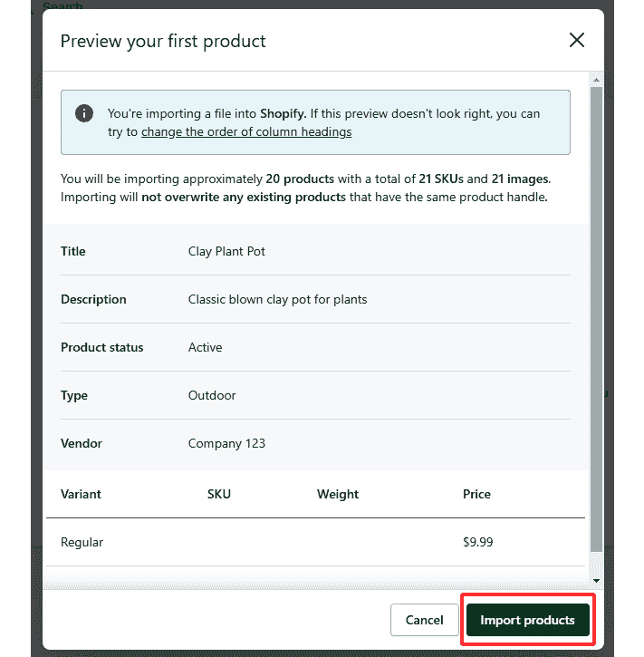
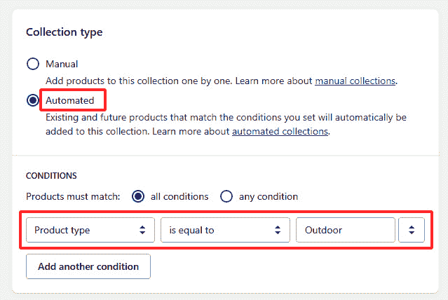
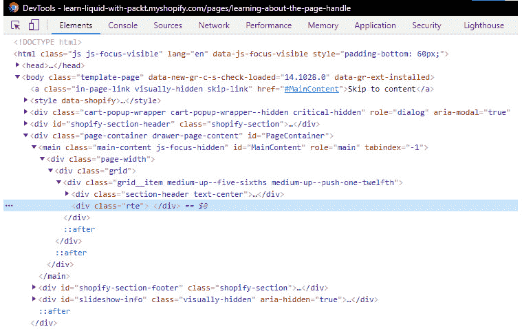
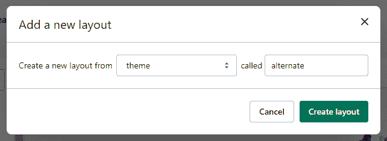
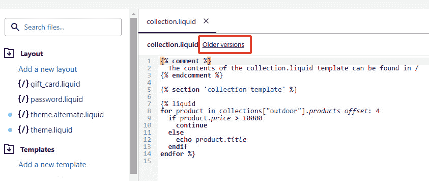

# 第三章：*第三章*: 使用标签深入 Liquid 核心

在前面的章节中，我们看到了一些 Liquid 标签的实际应用，例如控制流标签。在本章中，我们将学习更多关于我们可以用来动态修改页面内容的不同标签。我们将学习如何创建变量标签和主题标签以及最佳使用方法。

通过了解各种类型的迭代标签和参数，我们将获得执行代码块重复的能力，这将帮助我们编写更高质量的代码。最后，我们将提到一些已弃用的标签；它们仍然出现在一些较旧的主题中，因此了解它们的功能和使用方法至关重要。

本章涵盖了以下主题：

+   控制 Liquid 的流程（控制标签）

+   变量标签

+   迭代标签

+   主题标签

+   已弃用标签

在本章中，我们将通过探索 Liquid 编程逻辑来扩展我们对逻辑和比较运算符以及不同数据类型的知识。

# 技术要求

由于 Shopify 是一个托管服务，您需要互联网连接才能遵循本章中概述的步骤。

本章使用的`*.csv`格式的数据集可在 GitHub 上找到：[`github.com/PacktPublishing/Shopify-Theme-Customization-with-Liquid/blob/main/Product-data.csv`](https://github.com/PacktPublishing/Shopify-Theme-Customization-with-Liquid/blob/main/Product-data.csv).

本章的代码可在 GitHub 上找到：[`github.com/PacktPublishing/Shopify-Theme-Customization-with-Liquid/tree/main/Chapter03`](https://github.com/PacktPublishing/Shopify-Theme-Customization-with-Liquid/tree/main/Chapter03).

本章的“代码在行动”视频可以在这里找到：[`bit.ly/3nP8uwG`](https://bit.ly/3nP8uwG)

# 准备工作

在我们继续之前，我们需要先创建一些产品和收藏夹页面，这些页面将在接下来的练习中使用。

## 创建产品页面

通常，创建一个页面或产品页面是一个简单直观的过程：

1.  我们可以先通过导航到侧边栏中的**产品**部分并点击**添加产品**按钮开始，这将自动将我们重定向到定义我们的产品名称、描述、图片、价格和其他参数的页面。我们不会过多地介绍如何管理产品。然而，如果您想了解更多关于这个主题的信息，请参阅[`help.shopify.com/en/manual/products/add-update-products`](https://help.shopify.com/en/manual/products/add-update-products).

1.  为了避免手动创建大量我们以后需要的产品，我们将使用 GitHub 上已经创建的产品。为此目的，我们创建了一个`.csv`文件，使我们能够轻松地为我们的开发商店创建许多产品。我们唯一需要做的就是从[`github.com/PacktPublishing/Shopify-Theme-Customization-with-Liquid/blob/main/Product-data.csv`](https://github.com/PacktPublishing/Shopify-Theme-Customization-with-Liquid/blob/main/Product-data.csv)下载文件并将其导入到我们的商店中。

1.  下载文件后，点击侧边栏中的**产品**链接，这将自动定位到**所有产品**后展开。点击**导入**按钮以触发弹出窗口并开始进程：

    图 3.1 – 导入产品进程的示例

1.  选择`Product-data.csv`文件后，我们可以通过点击**上传并继续**按钮开始进程：

    图 3.2 – 选择并上传.csv 文件到商店

1.  几秒钟后，我们将看到一个弹出窗口预览我们即将导入的产品之一。确认字段包含正确的信息后，我们可以通过点击**导入产品**按钮来最终完成导入进程：



图 3.3 – 从.csv 文件上传产品到商店的最终过程

## 创建集合页面

现在我们已经用产品填充了商店，是时候创建一些集合页面了，然后我们可以用新产品填充它们。创建集合页面的过程与产品页面一样简单：

1.  我们可以通过点击侧边栏中的**产品**链接并随后点击扩展的**产品**菜单中的**集合**子链接来开始进程。

1.  进入后，点击**创建集合**按钮，自动将我们重定向到定义集合名称、描述、分配产品和其他参数的页面。

1.  考虑到我们有两种类型的产品，我们将创建两个集合，并将相同类型的产品分配给每个集合。点击“户外”作为集合名称，并将**集合类型**设置为**自动**，这样我们就不必手动分配每个产品。最后一步是设置**条件**，以确保只填充类型等于**户外**的产品：



图 3.4 – 创建集合并根据产品类型自动填充的示例

保存更改后，我们的收藏页面将立即创建并填充符合我们条件的商品。注意，在我们继续之前，我们应该为**室内**收藏重复前面的步骤，我们将在接下来的章节中使用它。如果您想了解更多关于管理收藏页面的信息，请参阅[`help.shopify.com/en/manual/products/collections`](https://help.shopify.com/en/manual/products/collections)。

## 更新导航菜单

为了更快的导航，我们可以在主菜单导航中包含我们两个收藏的链接：

1.  我们可以通过点击侧边栏中的**在线商店**来展开它，并随后点击**导航**链接来做到这一点。

1.  进入编辑器后，我们可以通过打开**主菜单**并点击**添加菜单项**来添加任意数量的链接。如果您想了解更多关于管理导航菜单的信息，请参阅[`help.shopify.com/en/manual/online-store/menus-and-links`](https://help.shopify.com/en/manual/online-store/menus-and-links)。

现在我们已经完成了产品页面和收藏页面设置，我们可以学习关于 Liquid 编程逻辑。

# 控制 Liquid 的流程

在前面的章节中，我们看到了一些控制流程标签，如`if`、`and`和`or`的实际应用；现在我们将进一步深入这个主题，并学习所有控制流程类型的标签以及如何使用它们。控制流程标签是一种 Liquid 编程逻辑，它通过允许我们在特定条件下有选择性地决定哪个代码块应该执行，来告诉我们的 Liquid 代码应该做什么。我们可以将控制流程标签分为四个不同的组：

+   `if/else/elsif`

+   `和/或`

+   `case/when`

+   `unless`

## if/else/elsif 标签

我们在前面的例子中已经愉快地看到了条件`if`语句，如果它被证明是真的，就会执行语句内的代码。让我们看看它是如何工作的。在上一章中，我们创建了**了解页面处理**页面。

然而，让我们尝试为这个练习创建一个新页面，以巩固我们的知识并使一切保持简洁：

1.  让我们从创建一个名为**控制 Liquid 的流程**的新页面开始，我们将继续使用它。假设我们需要提醒自己如何创建新页面，我们可以回顾前面的章节，并查阅位于**理解数据类型**部分下的**EmptyDrop**子部分，我们之前在那里概述了创建新页面的过程。

1.  在创建新页面后，是时候编辑我们新创建的页面模板文件了。我们需要导航到位于**在线商店**区域下的**主题**部分，点击我们创建的副本主题上的**操作**按钮，然后选择**编辑代码**选项，这将打开我们的代码编辑器。

1.  进入代码编辑器后，找到分配给我们的页面当前模板。在我们的例子中，模板名称是`page.liquid`，因此点击它。

1.  目前，我们的页面由两个 Liquid 元素组成：`{{ page.title }}`，它生成页面的标题，以及`{{ page.content }}`，它生成我们页面的内容，以及一些 HTML 元素。然而，*如果我们的* `{{ page.content }}` *为空怎么办？* 我们最终会得到一个空的`div`元素：



图 3.5 – 页面上空元素的示例

为了解决这个问题，我们可以在条件中包裹`{{ page.content }}`以及封装它的`div`，以检查页面内容是否为空：

```php

  <div class="rte">
    {{ page.content }}
  </div>

```

我们现在确信，在放置了条件之后，我们页面上不会出现任何额外的空字符串和元素。

现在我们尝试包含一些占位文本，并让访问我们页面的人知道我们将很快添加页面内容。这就是`else`和`elsif`语句帮助我们的时候。通过添加`else`和`elsif`，我们可以创建多个条件，以确保我们正确地执行我们的代码：

1.  让我们先在``之前添加`else`条件，以便在`{{ page.content }}`为空时执行不同的结果：

    ```php
    
      <div class="rte">
        {{ page.content }}
      </div>
    else condition in place, if someone accidentally visits our page, they won't think that we have a broken page, as we will have a message waiting for them:Figure 3.6 – Example of the else condition getting executed
    ```

1.  让我们尝试通过添加一个语句来检查我们是否已经开始编写页面内容，并相应地更新我们的通知消息来改进我们的页面。我们可以通过添加一个`elsif`语句来检查页面内容是否超过 100 个字符来实现这一点。然而，为了使这可行，我们还需要通过修改现有的`if`语句来改变现有的条件，以便在页面内容有`100`个或更多字符时显示页面内容：

    ```php
    100 characters. If it does, it will return true, and our page content will show. The second if statement, which checks whether the page content has less than 100 characters, will only happen if the first statement returns false. Important note:It is impossible to execute multiple statements on different lines within the same block, even if their result was true.
    ```

在放置了两个条件之后，我们的页面应该有足够的信息供任何访问者了解。然而，如果我们仔细查看我们的语句，我们会看到``语句永远不会执行，因为页面内容要么超过 100 个字符，要么少于 100 个字符。正如我们回忆的那样，我们只能在单个块中执行一个语句。为了解决这个问题，我们需要使用`and`运算符来确保我们代码块中的所有语句都正常工作。

## 和/或标签

正如我们在上一章中回忆的那样，`and`和`or`运算符允许我们在控制流标签中包含多个条件，从而允许我们创建复杂的条件。

使用`and`运算符，我们可以将另一个条件链接到现有语句，只有当语句的左右两边都为真时，它才会返回`true`。让我们在`elsif`语句中尝试包含另一个条件，该条件检查页面内容是否有内容：

```php

  <div class="rte">
    {{ page.content }}
  </div>

  <div class="rte">
    Our content writers are making final touches, and the       page content will be available shortly. 
  </div>

  <div class="rte">
    The page content is currently pending. Please check       again soon.
  </div>

```

通过添加第二个条件，我们确保了我们的控制流标签将正确执行。第一个语句将在页面内容超过`100`个字符时返回`true`，第二个语句将在页面内容少于`100`个字符且页面不为空时返回`true`。最后，如果前两个语句都返回`false`，则`else`语句中的代码将执行。

与`and`参数类似，`or`参数允许我们将另一个条件链接到标签上。然而，关键的区别在于，对于带有`and`参数的语句要返回`true`，条件表达式的左右两边都必须返回`true`。而使用`or`参数，我们只需要至少有一个条件返回`true`，这样该语句就会变为真值，并且代码块将执行。

## case/when 标签

与`if/elsif/else`条件一样，`case/when`是我们可以使用来创建`switch`语句的控制流标签，它允许我们仅在返回值与精确匹配时执行特定的代码块。我们可以使用`case`来初始化`switch`语句，并使用`when`来设置我们想要它们执行的特定顺序的条件。

让我们回到我们之前工作的`page.liquid`模板，并创建一个`switch`语句，该语句将检查页面内容的精确字符数，并根据哪个语句为真渲染相应的消息。我们可以在添加的第一个`if`语句之上包含此功能：

```php

  
    The page has only 150 characters, so this should not       take much time to read.
  
    We have bumped the page to 350 characters, but it       should not take that much time.
  
    We now have 1000 characters written, and it is going to       take a few minutes to read everything carefully.

```

在前面的示例中，我们使用`page.content.size`初始化了`case`标签，这使得我们可以使用`when`语句来检查页面内容的字符数是否严格等于我们的值。请注意，`when`语句没有比较变量。这是因为`when`语句只接受一个值作为参数，并且只有在值是精确匹配时才会返回`true`：

![Figure 3.7 – 执行 case/when 标签的示例

![Figure 3.07_B17606.jpg]

图 3.7 – 执行 case/when 标签的示例

在我们的控制流标签就位后，如果我们以`150`个字符作为页面内容，第一个`when`语句将返回`true`，因此我们可以看到我们的消息。相比之下，考虑到我们只能用它来匹配精确值，而不是`if/elsif/else`标签，这个标签可能看起来并不强大。然而，`case/when`标签是强大的编程逻辑的一部分；我们将在本书的后续章节中使用它们来创建复杂的功能。

正如我们所回忆的，直接添加到模板文件中的任何代码都会在所有使用该特定模板的页面上执行。由于我们已经将所有之前的代码添加到`page.liquid`模板中，我们应该确保我们只在对`unless`标签执行之前添加的代码。

## `unless`标签

与允许我们检查特定条件状态的`if`标签类似，`unless`标签允许我们检查是否未满足条件：

```php

  Unless the page title is Controlling the Flow of Liquid,     the code inside this conditional will not execute. 

```

我们可以在`case`标签的上方添加`unless`标签的打开语句，并在`if/elsif/else`标签的关闭语句下方添加关闭语句：


图 3.8 – 与 Liquid 控制流相关的整个代码示例

通过放置`unless`语句，我们确保所有代码只在这个特定的页面上执行，并且不会影响使用相同`page.liquid`模板文件的任何其他页面。

通过了解所有不同类型的控制流标签，我们在掌握 Liquid 编程逻辑方面又迈出了坚实的一步，这将为我们通往更多重要且复杂的事物奠定基石。

在上一章中，我们提到了各种数据类型，例如字符串、数字和布尔值，以及我们如何使用它们。然而，如果我们想保存这些数据类型并在多个位置重复使用它们，而不必手动更新每一行，那会怎样呢？这就是*变量*发挥作用的地方。

# 变量标签

我们可以将变量视为数据容器，以保存我们希望在代码中稍后使用或按需覆盖的各种类型的信息。除了保存信息以供以后使用外，变量还允许我们使用描述性文本作为标签，使我们能够理解特定变量包含的信息类型。我们可以将变量标签分为以下四组：

+   `assign`

+   `capture`

+   `increment`

+   `decrement`

## `assign`标签

`assign`标签允许我们声明一个变量，我们可以将字符串、数字或布尔数据分配给该变量。我们可以通过编写`assign`关键字后跟我们要声明的变量的名称，然后是等号和分配给该特定变量的数据，并将其封装在带有百分号符号的大括号定界符中来实现变量的声明：

```php



```

一旦我们声明了一个变量，我们就可以通过将变量的名称封装在双大括号定界符中来多次调用它：

```php
{{ stringVar }}
{{ numberVar }}
{{ booleanVar }}
```

调用我们的三个变量将生成与我们最初分配给每个变量的相同类型的数据：

```php
"This is a string!"
2021
true
```

注意，使用双大括号定界符调用变量时，当单独调用时将返回变量的值。如果我们想在`for`标签或`if`语句中使用变量，我们只需使用变量的名称调用变量，而不需要双大括号定界符：

```php

  The variable content is a string value!

  The variable content is a number value!

  The variable content is a boolean value!

```

我们在多个`if`语句中使用了之前声明的变量来确定变量的值。由于我们的变量值等于第一个语句的比较值，第一个语句将返回`true`。

到目前为止，我们已经学习了如何将单一类型的数据分配给一个变量，*但如果我们想创建一个可以存储字符串和变量组合的变量呢？* 要实现这一点，我们需要另一个类型的变量标签的帮助，称为 `capture`。

## `capture` 标签

与只允许我们捕获单个值的 `assign` 标签不同，`capture` 允许我们使用其起始和结束闭合标签捕获多个值。我们可以使用一组花括号定界符和围绕 `capture` 单词的百分号来声明 `capture` 变量，后面跟着我们声明的变量的名称：

```php



  If you order {{ deal }} books, you can receive up to a {{     percent }}% discount!

{{ promoMessage }}
```

在上一个例子中，我们最初使用 `assign` 标签定义了两个变量，一个包含数值，一个包含字符串。一旦我们声明了这两个变量，我们又使用 `capture` 标签声明了一个新变量。我们包含了一个包含先前定义的变量的字符串消息，最后，我们通过将 `promoMessage` 变量包裹在双花括号定界符中来调用它，以查看我们工作的结果：

```php
"If you order three or more books, you can receive up to a 15% discount!"
```

正如我们所见，使用 `capture` 标签，我们成功创建了一个复杂的字符串消息，随着我们进一步学习知识，这将非常有用。

重要提示：

虽然 `capture` 标签接受所有数据类型，正如我们在前面的例子中所看到的那样，调用 `capture` 变量将始终返回字符串数据。

使用 `assign` 标签，我们学习了如何创建新的变量，我们可以存储单一类型的数据。使用 `capture` 变量，我们学习了如何使用不同的变量创建复杂的字符串，*但我们应该如何创建一个内容为数值的变量，该数值充当计数器呢？*

## `increment` 标签

与 `assign` 和 `capture` 标签不同，`increment` 标签不需要先声明。相反，我们将在第一次调用它时自动创建变量。`increment` 标签允许我们自动创建变量，并在每次使用 `increment` 标签调用变量时增加它。我们可以使用一组花括号定界符和围绕 `increment` 单词的百分号来调用 `increment` 变量，后面跟着我们创建的变量的名称：

```php

```

使用 `increment` 标签创建的任何变量，包括这个变量的起始值，始终为零。

重要提示：

调用 `increment` 变量不仅会自动生成并增加从零开始的值，而且还会自动输出我们在模板中工作的变量的内容。

考虑到 `increment` 标签在标签被调用时自动输出值，它的用途相当有限。最常见的使用是自动生成 HTML 元素的唯一编号标识符：

```php
<div class="product-count">
  <div id="product-item-"></div>
  <div id="product-item-"></div>
  <div id="product-item-"></div>
</div>
```

我们之前示例的结果将使我们能够为每个 `div` 元素创建一个唯一的 ID，从 `increment` 标签首次出现时的零开始，每次后续出现时增加一：

```php
<div class="product-count">
  <div id="product-item-0"></div>
  <div id="product-item-1"></div>
  <div id="product-item-2"></div>
</div>
```

`increment` 标签的一个更关键方面是它独立于使用 `assign` 或 `capture` 标签创建的变量工作。让我们尝试使用 `assign` 标签创建一个变量，并看看当我们尝试增加它时会发生什么：

```php



{{ numberVar }}
```

最初，我们创建了变量并将其赋值为 `7`，之后我们使用 `increment` 标签两次调用具有相同名称的变量。最后，我们调用最初使用 `assign` 标签创建的变量：

```php
0
1
7
```

如我们从结果中看到的那样，尽管我们已使用 `assign` 标签声明了 `numberVar` 变量并将其赋值为 `7`，但 `increment` 标签从 `0` 开始增加值。它们可能具有相同的名称，但它们是完全不同的变量。`increment` 变量不会以任何方式影响最初创建的变量，反之亦然。

重要提示：

注意，使用 `increment` 标签创建的变量不能在没有 `increment` 标签或用作逻辑参数的情况下独立调用，这与 `assign` 和 `capture` 标签的情况不同。

我们现在已经学会了如何创建一个独立的变量标签，为任意数量的元素创建一个唯一的元素标识符。然而，假设由于某种原因，我们需要一个输出大量元素负值的变量。为此功能，我们需要使用不同类型的变量标签，名为 `decrement`。

## `decrement` 标签

除了使用 `decrement` 关键字初始化变量外，`decrement` 标签与 `increment` 标签在两个关键方面有所不同：

+   第一点是 `decrement` 允许我们每次出现时将变量值减少一。

+   第二点是初始值从负一开始。

在以下示例中，我们可以看到一个使用相同变量调用 `decrement` 标签三次的例子：

```php



```

在这个初始示例中，我们调用了 `decrement` 标签三次。由于 `decrement` 变量从负值开始，调用三次后，我们将收到以下值：

```php
-1
-2
-3
```

重要提示：

除了我们做出的两个不同之处，`decrement` 与 `increment` 标签共享所有规则和限制，这意味着 `decrement` 标签独立于使用 `assign` 和 `capture` 方法创建的变量工作。我们无法在不初始化 `decrement` 标签的情况下独立调用它。

变量是强大的工具，与迭代标签结合使用，将使我们更接近编写更简洁和可重用的代码。

# 迭代标签

**迭代标签**是不同的液态编程逻辑类型，允许我们重复运行代码块。使用迭代标签将节省我们手动执行每个发生时所需的时间；此外，它将使我们的代码更加简洁和易于阅读。为了保持主题简洁，我们只将提到一些最常用的迭代标签及其参数，这比列出所有标签更重要，因为它们都是使用类似的概念创建的。我们可以将迭代标签分为四个不同的组：

+   `for/else`

+   `跳转`语句

+   `for`参数

+   `cycle`

## for/else 标签

在上一章中，当我们解释了*理解数据类型*主题中的数组时，我们有机会在我们的示例中使用`for`循环。然而，我们还没有机会解释`for`循环给我们带来的所有可能性。`for`循环是一种液态编程逻辑，允许我们遍历任何代码块或数组，并将该循环的结果输出以供进一步使用。

之前，我们一直在处理`page.liquid`模板，但现在，我们将继续到`collection.liquid`模板。

让我们首先编写一个`for`循环标签，该标签将列出所有产品名称，并将它们放在``行下面：

```php

  {{ product.title }}

```

在上一个示例中，我们使用了一个`for`标签，后面跟着`product`变量，来遍历`collection.products`对象，并返回分配给我们的集合的产品名称，我们可以在我们的**室内**集合页面上看到这些名称：

![图 3.9 – 使用 for 循环列出产品名称的示例

![img/Figure_3.09_B17606.jpg]

图 3.9 – 使用 for 循环列出产品名称的示例

虽然我们的`for`循环确实使它工作，并且我们可以看到我们的产品名称列表，但这并没有什么用处，因为我们已经列出了相同的产品。让我们使用我们在上一章中学到的知识，当时我们在*EmptyDrop*子节中讨论了访问页面处理对象的不同方法，该子节位于*理解数据类型*部分。

使用我们当前的代码，我们正在读取我们当前访问的集合的产品。相反，让我们尝试访问位于我们名为`outdoor`的第二个集合中的产品：

```php

  {{ product.title }}

```

尽管我们目前正在预览`Indoor`集合，但我们现在已经获得了一个属于`Outdoor`集合的产品列表。

## 跳转语句

如其名所示，`跳转`语句允许我们设置条件，排除某些项目从我们的循环中，或者当我们遇到特定条件时停止我们的循环。我们可以将`跳转`语句分为以下两个组：

+   `continue`: `` 语句允许我们根据我们设定的条件跳过当前迭代。我们可以通过将其与 `if` 语句配对来使用它，仅接受价格低于 $100.00 的产品。否则，我们应该将产品排除在循环之外：

    ```php
    
      if statement in place, any product iteration whose price is higher than $100.00 will trigger our  jump statement, consequently excluding that product from our iteration. Otherwise, any product that fails that statement will render the product name on our page.
    ```

+   `break`: 与之相反，`` 语句允许我们在遇到特定条件时停止循环：

    ```php
    
      
         statement, the result we have received from our loop was that we had excluded any product whose price was lower than $100.00 from the loop result. However, in our latest example, instead of excluding the products that match our condition,  will cause the loop to stop and not perform any other iteration the moment it finds the first occurrence that matches our condition.
    ```

例如，使用 ``，我们的循环返回了六个符合我们条件的产品。然而，当我们用 `` 替换 `` 时，我们的循环返回了零结果。由于我们使用的 `Outdoor` 收藏中的第一个产品的价格为 $200.00，我们在第一次迭代就满足了我们的条件，这导致 `` 停止了迭代，防止了其他所有迭代。

## for 参数

除了 `jump` 语句之外，我们还有各种参数可以进一步定义循环的限制和工作流程。我们可以将可以与 `for` 循环一起使用的参数分为以下四个组：

+   `limit`

+   `offset`

+   `range`

+   `reversed`

### 限制

如其名所示，`limit` 参数限制了循环应执行的迭代次数。我们可以在打开的 `for` 循环标签末尾添加 `limit` 参数，后面跟着一个冒号，然后是一个数字值。

当我们要求进行特定次数的迭代而不实现任何条件时，我们通常使用 `limit` 参数。这是因为 `limit` 参数只衡量迭代次数，并不检查迭代次数是否与我们的语句匹配。

让我们从调整之前的例子开始，将 `` 替换为 ``，并添加 `limit` 参数，其值为 `4`，这是我们希望作为结果获取的最大产品数量：

```php

  
    
  
    {{ product.title }}
  

```

在我们之前的例子中，在添加 `limit` 参数之前，我们的 `for` 循环返回了六个产品迭代，其价格低于 $100.00。添加 `limit` 参数后，返回的迭代次数为 `3`，尽管我们将其限制设置为 `4`。*为什么？*

与我们之前提到的 `` 语句类似，`limit` 参数的目标是限制迭代次数到指定的值。让我们打开我们的 `Outdoor` 收藏，我们正在使用其句柄进行循环。我们会注意到该收藏中的第一个产品的价格为 $200.00，这触发了 `if` 语句，随后触发了 `` 语句，排除了第一个产品。

因此，我们的`for`循环没有打印出那个产品名称。然而，`limit`参数仍然将其计为一个迭代，这意味着它将执行另外三次迭代。由于接下来的三个产品的价格低于$100.00，我们的`for`循环在停止之前返回了这三个产品的名称。因此，`limit`参数通常只在没有其他语句的循环中使用。否则，我们可能会无法达到预期的迭代次数，甚至一个迭代都没有，因为如果没有匹配我们设置的语句，迭代次数也可能为零。

### 偏移参数

`offset`参数允许我们通过从特定索引开始循环来延迟`for`循环的开始。我们可以在打开的`for`循环标签的末尾添加一个`offset`参数，后面跟着一个冒号，然后是一个数字值。

让我们拿我们之前的例子，尝试用`offset`参数替换`limit`，并将其值设置为`4`：

```php

  
    
  
    {{ product.title }}
  

```

我们的`for`循环自动跳过了前四个产品迭代，并从索引号`5`开始迭代产品，导致我们的`for`循环返回三个产品迭代。*然而，如果我们也在* `offset` *参数之后包含* `limit` *参数并将其值设置为* `1`*，会怎样呢？*

```php

  
    
  
    {{ product.title }}
  

```

虽然一开始看起来前面的例子可能不会工作，但这实际上是一个完全功能的循环，具有有效的参数。正如我们之前提到的，`limit`参数允许我们将`for`循环限制在特定的迭代次数。添加两个参数后，我们的`for`循环将从索引`5`开始迭代。它将按照`limit`参数设置的值进行一次迭代，然后停止`for`循环，无论这次迭代是否成功通过了我们的`if`语句。

### 范围参数

`range`参数为我们提供了与`offset`参数类似的功能。关键的区别在于，使用`range`，我们可以分配起始和结束索引位置。我们可以在打开的`for`循环标签的末尾添加一个`range`参数，通过编写开括号分隔符，然后是起始值，接着是两个点，最后是结束值和闭括号分隔符：

```php

  {{ item }}

```

正如我们回忆的那样，`offset`参数不包括循环中的起始位置索引。相反，它从下一个位置开始循环，范围对于起始和结束位置值都是包含的。我们将`range`参数设置为`(3..5)`的`for`循环示例的结果如下：

```php
3 4 5
```

除了接受数字作为其值之外，正如我们在前面的例子中所能看到的，`range`还允许我们将变量和对象作为其起始和结束值：

```php


  {{ item }}

```

我们的 `for` 循环示例的结果将返回从索引 `3` 开始的所有迭代，一直到我们集合中的产品数量。有了分配变量和对象作为起始或结束点的功能，我们现在可以创建可重用的 `for` 循环，从而生成更简洁、质量更高的代码。

### `reversed` 参数

我们列表中的最后一个参数是 `reversed`，正如其名称所暗示的，它允许我们反转迭代的顺序。`reversed` 参数没有任何值表示，我们可以在 `for` 循环开标签的末尾包含它：

```php

  {{ item }}

```

在前面的例子中，我们已经将 `reversed` 参数作为次要参数添加到我们的 `range` 参数旁边，使得我们的标签以相反的顺序执行迭代：

```php
5 4 3 
```

正如我们有机会亲自看到的，参数是 `for` 标签的一个强大补充，我们可以使用它来实现所需的迭代类型，并只获取我们需要的成果。

## `cycle` 标签

`cycle` 是另一个强大的标签，我们只能与 `for` 标签结合使用，以遍历一组字符串并将它们按最初定义的顺序输出到每个迭代中。我们可以通过使用带有百分号的开花括号、跟随单词 `cycle`、然后是任意数量的用逗号分隔的字符串来定义 `cycle` 标签。最后，我们用闭合花括号和百分号关闭 `cycle` 标签：

```php

  <div class="product-item "></div>

```

在前面的例子中，我们在一个限制为四次迭代的 `for` 循环中包含了一个 `cycle` 标签，其中包含四个不同的字符串。通过实现 `cycle` 标签，我们确保了我们的第一个 `div` 元素将首先获得一个类，第四个元素将获得 `last` 类，而中间的两个元素将不会获得任何类，因为这些位置的两个字符串是空的：

```php
<div class="product-item first"></div>
<div class="product-item"></div>
<div class="product-item"></div>
<div class="product-item last"></div>
```

从我们的结果中，我们可以看到 `cycle` 标签是一个非常宝贵的工具，我们可以用它将数据按我们定义的顺序传递到循环中的特定迭代。*然而，如果我们从循环中移除限制或将其增加到九次迭代，会发生什么？*

```php

  <div class="product-item "></div>

```

在我们之前的例子中，迭代的次数与 `cycle` 标签内字符串的数量完全相同。在我们的最新例子中，迭代的次数超过了字符串的数量，这意味着循环将重置并再次按顺序应用字符串，直到所需的迭代次数：

```php
<div class="product-item first"></div>
<div class="product-item"></div>
<div class="product-item"></div>
<div class="product-item last"></div>
<div class="product-item first"></div>
<div class="product-item"></div>
<div class="product-item"></div>
<div class="product-item last"></div>
<div class="product-item first"></div>
```

到目前为止，我们已经学习了 `cycle` 标签的基本用法，以及该标签将尽可能继续输出字符串，这对于我们只有一个 `cycle` 标签时非常有帮助。*但是，如果我们有两个或更多 `cycle` 标签会怎样呢？*

```php

  <div class="product-item "></div>


  <div class="product-item "></div>

```

在前面的例子中，我们创建了两个独立的`for`循环，第一个循环限制为六次迭代，第二个循环限制为四次。正如我们刚刚学到的，无论我们在`cycle`标签内部定义了多少个字符串，标签将继续输出所需次数的字符串：

```php
<div class="product-item first"></div>
<div class="product-item"></div>
<div class="product-item"></div>
<div class="product-item last"></div>
<div class="product-item first"></div>
<div class="product-item"></div>
<div class="product-item"></div>
<div class="product-item last"></div>
<div class="product-item first"></div>
<div class="product-item"></div>
```

从结果中我们可以看到，第一个`for`循环按照我们预期的顺序创建了六个迭代。然而，第二个`for`循环没有产生相同的结果。相反，它继续从上一个`cycle`标签停止的确切位置输出字符串。

考虑到 Liquid 目前无法区分不同类型的`cycle`标签，这种行为是逻辑上的。然而，我们可以通过引入一个名为**cycle group**的参数来轻松解决这个问题。

周期组参数允许我们通过确保每个周期都将输出以位置一开头的字符串来分离`cycle`标签，无论我们是否已经在同一页上使用了`cycle`标签。在`cycle`关键字之后，我们可以通过添加括号内的字符串名称，后跟一个冒号来包含周期组参数：

```php

  <div class="product-item "></div>


  <div class="product-item "></div>

```

周期组参数的引入确保了每个`cycle`标签独立工作：

```php
<div class="product-item first"></div>
<div class="product-item"></div>
<div class="product-item"></div>
<div class="product-item last"></div>
<div class="product-item first"></div>
<div class="product-item"></div>
<div class="product-item first"></div>
<div class="product-item"></div>
<div class="product-item"></div>
<div class="product-item last"></div>
```

从我们的结果中我们可以看到，所有迭代都接收到了最初为它们设计的字符串，尽管我们有多于一个的`cycle`标签。

除了`for`和`cycle`标签之外，我们还有一种称为`tablerow`的迭代标签，它的工作方式与`for`标签类似。这两个标签之间的唯一区别是`tablerow`返回格式化为 HTML 表格的结果。为了使本书简明扼要，我们不会在本书中介绍`tablerow`标签及其参数。但是，如果您想了解更多关于它的信息，请参阅[`shopify.dev/docs/themes/liquid/reference/tags/iteration-tags`](https://shopify.dev/docs/themes/liquid/reference/tags/iteration-tags)。

# 主题标签

**主题标签**是一种特殊的标签，它让我们能够对**未渲染和已渲染的代码**进行特定控制。使用我们可用的各种类型的主题标签，我们可以为特定模板创建不同类型的 HTML 标记，这对于创建允许客户从我们的商店购买产品的表单至关重要。此外，它们允许我们为不同的页面选择不同的主题布局，定义我们可以用来创建可重用代码块的分区或片段文件，以及许多其他事情。我们可以将主题标签分为以下几组：

+   `layout`

+   `liquid` 和 `echo`

+   `form`

+   `paginate`

+   `render`

+   `raw`

+   `comment`

## 布局标签

如我们从第一章回忆的那样，在讨论`Layout`目录时，我们提到了`theme.liquid`文件的重要性，因为我们将在这个文件中渲染所有文件和模板。正是在这个文件中，我们安排了我们页面的通用布局。

我们当前的页面由三个关键元素组成：**页眉**、**主要内容**和**页脚**。假设我们想要从我们的产品页面上移除页眉和页脚部分，或者至少用一组不同的页眉和页脚来替换它们。*我们该如何操作？*

1.  实现这一目标的第一个步骤是创建一个替代布局文件，我们的主题产品页面将使用该文件。我们可以通过在代码编辑器中展开 **布局** 目录并点击 **添加新布局** 按钮，这将触发一个弹出窗口以选择我们想要创建的布局页面类型，并为我们的新页面选择名称。

1.  在下拉菜单中，我们将选择 `alternate` 作为我们的文件名。一旦我们完成选择布局文件类型和名称，点击 **创建布局** 按钮以完成此过程：



图 3.10 – 创建新布局文件的示例

通过这种方式，我们已经成功创建了一个名为 `theme.alternate.liquid` 的新布局文件。假设我们尝试将此文件与我们的原始 `theme.liquid` 文件进行比较；我们会发现它们完全相同。这是因为当我们创建一个新页面、布局或模板时，Shopify 不会完全创建一个新页面，而是会复制我们主题已经使用的默认页面。例如，如果我们展开 `page.liquid` 文件。

现在我们已经创建了一个新的布局文件，我们将将其分配给我们的产品页面。我们可以通过展开 `product.liquid` 文件来完成此操作，在那里我们可以定义此特定模板的布局，我们应该在文件的非常第一行包含它。我们可以使用一组带有百分号围绕 `layout` 单词的花括号定界符来定义 `layout` 标签，后跟布局文件的名称，该名称应包含在括号内：

```php

```

如果我们导航到 `` 和 ``，页眉和页脚部分将不再在我们的产品页面上可见。然而，它们仍然会在使用原始 `theme.liquid` 布局的页面上可见。

重要提示：

除了布局文件的名称外，`layout` 标签还接受 `none` 关键字作为其值，无需括号，在这种情况下，页面将不使用任何布局文件。在这种情况下，使用此特定模板的特定页面将无法访问任何代码或文件，包括 `.css`、`.js` 或其他我们最初通过 `theme.liquid` 文件加载的文件。

任何不包含 `layout` 标签的模板文件将默认使用原始的 `theme.liquid` 布局作为安全选项。

## 液体和回声标签

`liquid`标签是 Liquid 的最新补充之一，它相当强大，因为它允许我们在一组定界符内写入多个标签，使我们的代码更容易阅读和维护。我们可以使用花括号定界符和`liquid`一词左侧的百分号符号来定义`liquid`标签，然后跟随我们需要的任意多行`Liquid`代码。请注意，我们只需要定义一个开头的`liquid`标签，其中`liquid`闭合标签会自动关闭。

`echo`标签是`liquid`标签的一个补充，它允许我们输出最初必须用双花括号定界符包裹的表达式。我们可以通过简单地写一个`echo`关键字，然后跟随任何我们正在使用的表达式来定义`echo`标签。

让我们尝试使用我们的`liquid`和`echo`标签来重构我们在学习不同类型迭代时添加到收藏模板的代码。

这里，我们可以看到我们在收藏页面最初创建的代码：

```php

  
    
  
    {{ product.title }}
  

```

我们可以在以下示例中看到重构后使用`liquid`和`echo`标签的相同代码：

```php

```

在重构我们的代码后，我们可以看到我们已经删除了所有带有百分号的花括号定界符，并用`echo`标签替换了所有双花括号定界符。剩下的带有百分号符号的花括号定界符仅属于`liquid`标签，包围着整个代码。

重要提示：

虽然`liquid`和`echo`标签非常强大，但我们不应经常使用它们，因为虽然它们帮助我们在一组定界符内写入多个标签，但在处理字符串时并不那么友好。`echo`标签强制我们用括号包裹每个字符串，这使得在字符串中使用非字符串数据值变得几乎不可能。

## 表单标签

`form`标签允许我们根据我们调用的`form`标签的类型自动输出各种类型的 HTML `<form>`以及所需的`<input>`元素。我们可以在一对花括号定界符内定义`form`标签，然后是`form`关键字，接着是括号内的表单名称，最后是包围在带有百分号的花括号定界符中的`endfor`闭合标签：

```php


```

在上一个示例中，我们选择通过在括号内使用`product`关键字来生成产品表单标签。然而，请注意，在逗号之后，我们还有一个没有括号的`product`关键字。某些形式，例如我们目前使用的产品形式，需要我们传递一个参数来生成适当的内容。在这种情况下，该参数是`product`对象。

这最常见的使用是在产品页面上。然而，我们也可以在收藏页面或任何我们有权限访问`product`对象的地方使用`form`标签。让我们尝试在我们的收藏页面之前创建的循环中包含一个`form`标签。

由于我们将处理字符串和非字符串数据的混合，让我们首先撤销之前所做的`liquid`和`echo`更改。我们可以通过点击位于文件名和**删除文件**按钮之间的**旧版本**按钮来完成此操作：



图 3.11 – 文件中撤销更改的示例

点击**旧版本**按钮将显示下拉菜单，我们可以看到我们在这个特定文件中做出的所有更改的日期和时间。每个日期代表我们最后一次按下**保存**按钮以保存我们的更改。选择任何选项将自动将我们的代码回滚到那个特定点。

在撤销我们的更改后，我们就可以将`form`标签添加到我们的`for`循环中：

```php

  
    
  
    
      {{ product.title }}
    
  

```

通过在我们的`for`循环中引入`form`标签，我们已经生成了一个可以通过检查我们`Indoor`集合页面上的字符串元素看到的 HTML 表单标签。虽然`form`标签是功能性的，但我们仍然缺少一个关键成分来使我们的表单可用，我们将在下一章中学习这一点。

通过检查我们的集合页面，我们可以看到我们的`form`标签已经有相当多的属性。*但是，如果我们想添加一些自己的或修改现有的属性怎么办？* 我们可以通过简单地添加属性名，然后是逗号，然后是属性值来完成此操作：

```php

  
    
  
    productId-
    
      {{ product.title }}
    
  

```

在前面的示例中，我们使用字符串在我们的表单中包含了一个数据属性。然而，我们也使用先前定义的变量修改了现有的 ID 值。

注意，虽然我们可以在属性值中直接包含变量，但我们不能在`form`标签本身中将字符串和变量混合。因此，我们之前使用`capture`标签捕获了组合的字符串和`increment`标签，并使用变量名将其称为属性值。

除了可以将对象作为`form`参数传递的能力之外，`form`标签还为我们提供了一个名为`return_to`的特殊参数。默认情况下，当我们提交产品表单时，我们通常会被重定向到购物车页面。然而，使用`return_to`参数，我们可以选择在提交表单后应着陆的页面：

```php


```

在我们之前的示例中，我们将`back`值作为字符串分配给`return_to`参数，这将自动将我们返回到提交表单之前所在的同一页面。除了`back`字符串之外，我们还可以使用相对路径或`routes`属性生成一个动态 URL，以便在提交表单后到达该页面。

我们可以使用许多类型的表单标签。然而，由于它们都是使用相同的格式创建的，我们只会覆盖一个示例。有关不同类型的 `form` 标签及其参数的更多信息，请参阅 [`shopify.dev/docs/themes/liquid/reference/tags/theme-tags#form`](https://shopify.dev/docs/themes/liquid/reference/tags/theme-tags#form)。

## 分页标签

之前，我们已经学习了所有关于迭代标签的知识，我们可以使用它们来重复执行代码块。然而，迭代标签有一个限制，意味着它们每页只能输出最多 50 个结果。对于任何更高的迭代次数，我们需要使用 `paginate` 标签来将结果分散到多个页面。

`paginate` 标签必须始终围绕一个正在遍历数组的 `for` 标签来使用，以便能够将内容分成多个页面。我们在这里可以看到一个 `paginate` 标签围绕 `for` 循环的示例：

```php
 
  
  

```

从我们的示例中我们可以看到，`paginate` 标签包含 `paginate` 关键字，后面跟着返回产品数组的对象，然后是 `by` 参数和数值。根据我们与 `by` 参数一起包含的数值，这个数值可以从一到五十，`paginate` 标签将知道它应该每页显示的最大项目数。在 `paginate` 标签内部，我们可以访问 `paginate` 对象的属性。为了使本书简明扼要，我们不会详细介绍 `paginate` 对象。有关详细信息，请参阅 [`shopify.dev/docs/themes/liquid/reference/objects/paginate`](https://shopify.dev/docs/themes/liquid/reference/objects/paginate)。

## 渲染标签

`render` 标签允许我们将片段文件的内容渲染到我们选择的位置。正如我们回忆起 *第一章*，*开始使用 Shopify*，片段文件允许我们通过引用它们的名称在 **模板**/**部分**中重用重复的代码块：

```php

```

从我们的示例中我们可以看到，我们只需要使用 `render` 关键字，后面跟着片段文件的名称，我们就可以渲染片段文件中的任何内容。通过使用片段文件，我们不仅使我们的代码更易于阅读，而且通过重用相同的代码块，我们还使它更容易维护。

重要提示：

在渲染片段之后，我们不会自动访问在父元素中创建的变量。此外，父元素不能访问在片段中定义的变量。

让我们创建一个名为 `collection-form` 的新片段文件，我们将把 `else` 语句的整个内容从我们在集合页面内创建的 `for` 循环中移动过来：

```php

  
    
  
    
  

```

虽然前面的代码看起来是正确的，但如果我们尝试执行它，最终会出错。*为什么？*

正如我们所回忆的，代码片段文件无法访问父元素中定义的变量。在这种情况下，该变量是我们定义在`for`循环中的产品，我们在代码片段中将其称为`form`参数。为了解决这个问题，我们需要将变量作为参数传递给代码片段：

```php

  
    
  
    
  

```

我们创建了一个名为`product`的参数，并将其分配给最初创建的变量。我们本可以给我们的参数起任何我们喜欢的名字，例如`collection_product`。然而，在这种情况下，我们也必须更新`form`标签内的`product`参数，从`product`更改为`collection_product`，以及将`product.title`更改为`collection_product.title`，目前位于我们的代码片段文件中，以匹配新的对象关键字。

一旦我们通过参数将变量分配给代码片段，我们就可以独立于父模板中的值修改代码片段内的变量值。即使我们在代码片段内覆盖了变量值，该变量在父模板中仍将保持其值。请注意，我们可以使用其参数将所需数量的变量传递给我们的代码片段。*然而，如果我们想将一个对象传递给我们的代码片段怎么办呢？*

就像变量一样，我们可以使用`with`和`as`参数将对象传递给代码片段文件。然而，我们只能传递一个对象作为参数：

```php

```

在我们之前的例子中，我们使用了`render`参数将`collection`对象传递给代码片段文件，在那里我们可以使用`featured_collection`关键字访问它。

我们可以使用`render`标签的最后一个参数是`for`参数。使用`for`和`as`参数，我们可以为每个出现渲染一个代码片段。让我们尝试重构我们的集合页面上的代码，通过将其移动到`collection-form`代码片段内部，并使用`for`参数来渲染产品。然而，请注意，我们无法复制原始`for`标签上目前拥有的参数，因为`render`不接受额外的参数。此外，我们还需要从表单标签中删除`capture`和`productId`参数，因为`increment`标签与`render`参数不兼容。

我们需要做的第一件事是将`if`和`else`语句移动到代码片段文件中，并相应地放置它们：

```php

  

  
    {{ product.title }}
  

```

剩下的唯一事情就是向`render`标签添加额外的参数。在下面的例子中，我们包括了`for`和`as`参数与`render`标签一起，这使得我们能够迭代`collections["outdoor"].products`数组，并为我们的集合中的每个产品迭代渲染代码片段。此外，我们将`iteration`对象作为参数传递给我们的代码片段，我们可以在其中使用它：

```php

```

由于我们已经在我们的代码片段文件中使用了`product`关键字，我们成功地将对象传递给了产品表单参数和产品标题。如果我们现在运行我们的代码，我们会看到结果与之前完全相同，但我们的代码看起来要干净得多。

## 原始标签

`raw`标签允许我们直接在页面上输出未解析的 Liquid 代码。我们可以通过将需要未解析的内容包裹在`raw`和`endraw`标签中来使用`raw`标签：

```php

  The name of our collection is {{ collection.title }}.

```

在我们之前的例子中，我们创建了一条消息以动态更新收藏夹名称。然而，由于我们将整个消息包裹在`raw`标签中，Liquid 将不会处理它。相反，它会以完全相同的方式返回给我们：

```php
The name of our collection is {{ collection.title }}.
```

这种功能非常有用，尤其是在处理冲突的语法，如 Handlebars 时。

## 注释标签

如其名所示，`comment`标签允许我们在 Liquid 模板文件中留下注释。位于开闭注释标签之间的任何文本都不会在 Liquid 模板文件中渲染：

```php
We are currently learning about the comment tags.  Comment tags are a smart way to comment on our code. 
```

由于我们将消息的第二部分包裹在`comment`标签中，Liquid 只会渲染第一部分：

```php
We are currently learning about the comment tags.
```

注释标签非常有用，因为它们允许我们在文件中留下必要的信息，而不会用可见的注释污染 DOM。

# 已弃用的标签

**已弃用的标签**是被认为是过时的 Liquid 标签，我们不应再在我们的开发过程中使用它们。然而，我们可能在一些较旧的主题中遇到它们，因此识别它们并了解它们的功能是很重要的。

Shopify 弃用的唯一标签是`include`标签，它的工作方式与之前我们提到的`render`标签类似：

```php

```

两者之间唯一的区别在于，当使用`include`标签渲染代码片段时，我们的代码片段内部的代码可以自动访问和修改其父模板内的变量。这不仅会引发许多性能问题，还会使我们的代码更难以维护，这就是 Shopify 用`render`标签替换它的原因。

# 摘要

在本章的第三部分，我们学习了 Liquid 编程逻辑，它允许我们在特定条件下选择应该执行哪个代码块。我们了解了变量和迭代标签，以及如何将它们与不同的编程逻辑结合使用，以重复执行代码块并仅恢复特定结果。

最后，我们学习了不同类型的主题标签以及我们如何使用它们来输出特定模板的 HTML 标记。通过学习如何使用代码片段使我们的代码更易于阅读和维护，我们已经向前迈出了一步，以编写更高质量的代码。这将在下一章特别重要，我们将进一步深入了解 Liquid 核心，并学习更多关于 Liquid 对象及其属性的知识。

# 问题

1.  如果我们想在`for`循环中显示最多七次迭代，同时跳过前三次迭代，我们应该使用哪些参数？

1.  我们可以将哪些类型的数据分配给使用`capture`标签创建的变量？

1.  在以下代码块中存在哪两个问题？

    ```php
    Liquid for product in collections["outdoor"].products
      if product.price > 10000
        continue
      else
        product.title
      endif
    endfor
    ```

1.  我们应该采取什么方法来通过用字符串和变量的组合替换现有的类属性来修改由 HTML 生成的产品表单？

1.  如果我们想从父元素传递一个对象，应该使用哪个参数？
