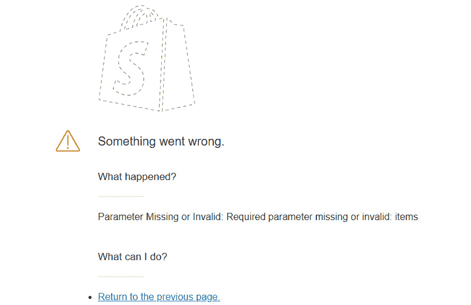
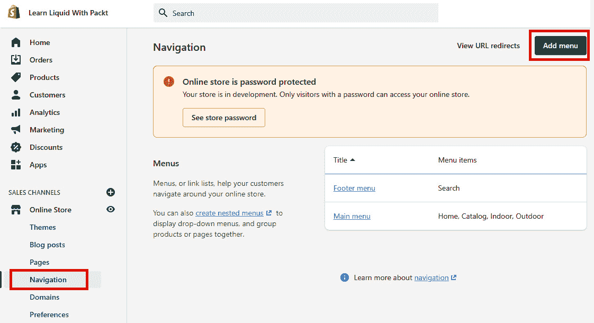
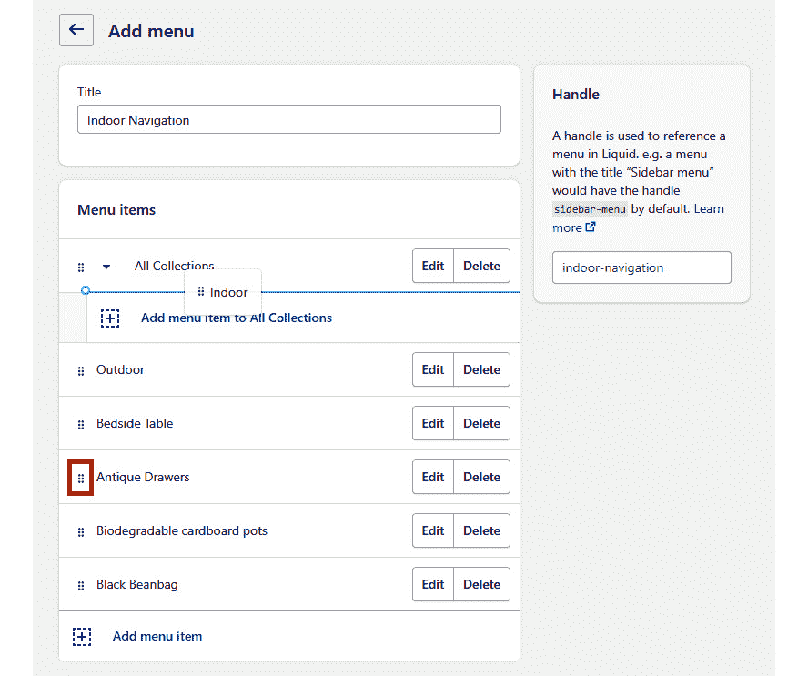
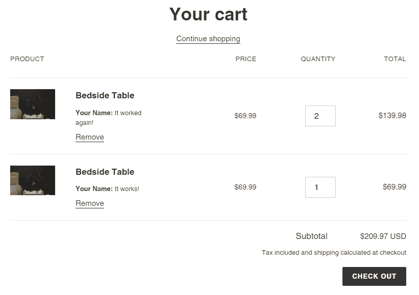
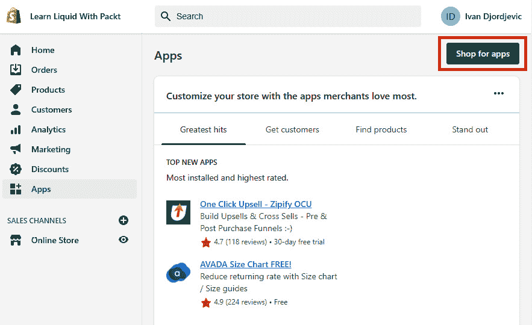
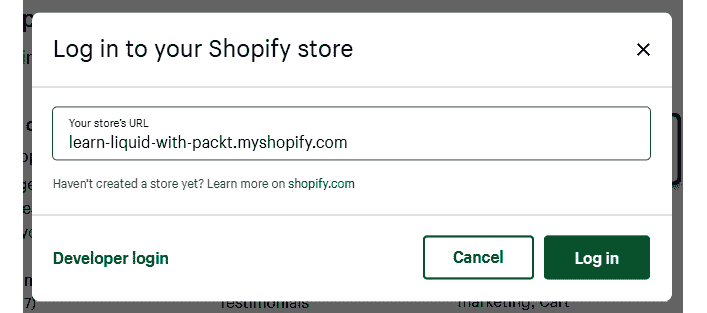
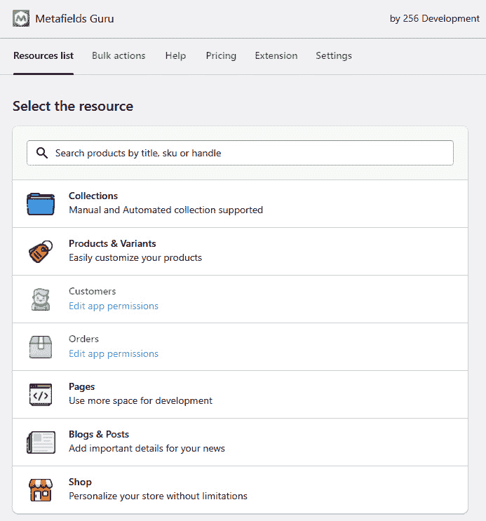
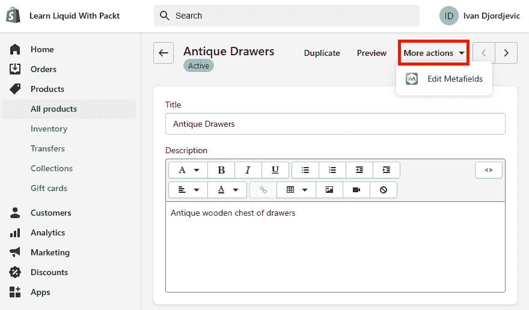
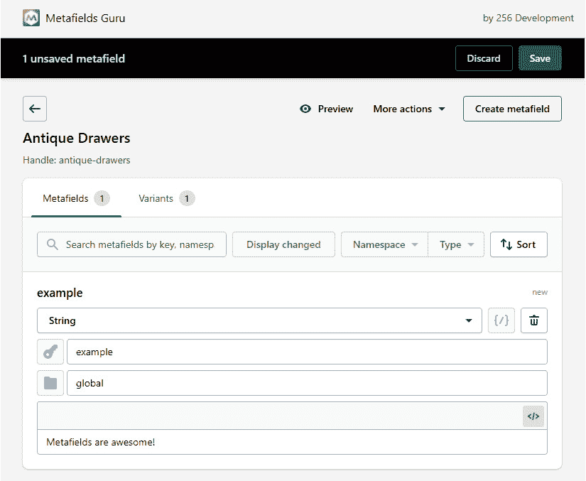

# 第四章：*第四章*：使用对象深入 Liquid 核心

在前三章中，我们已经提到了对象。然而，在本章中，我们将学习关于对象、它们的属性以及一些最佳使用方法。通过学习对象，我们将完成一些已经开始的项目，并着手新的项目以进一步发展我们的知识。

在本章中，我们将涵盖以下主题：

+   使用全局对象

+   使用元字段改进工作流程

+   内容和特殊对象

完成本章后，我们将了解内容对象是什么，为什么它们是必需的，以及如何使用它们，这是创建未来模板的第一步。我们还将了解更多关于我们迄今为止一直在引用的全局对象。

然而，由于它们提供了大量的全局对象和属性，我们不会涵盖所有这些。相反，我们只会解释一些基本的全局对象和属性，这将帮助我们正确理解对象。通过学习对象，我们还将学习理解元字段，这允许我们在我们的商店中存储和动态输出额外的数据。最后，我们将学习关于将帮助我们在我们的商店上输出一些有用功能的特殊对象。

# 技术要求

虽然我们将解释每个主题，并用相应的图形展示，但考虑到 Shopify 是一个托管服务，我们需要网络连接来跟随本章中概述的步骤。

本章的代码可在 GitHub 上找到，网址为 https://github.com/PacktPublishing/Shopify-Theme-Customization-with-Liquid/tree/main/Chapter04。

本章的“代码实战”视频可在此处找到：[`bit.ly/3u7hqyB`](https://bit.ly/3u7hqyB)

# 使用全局对象

在上一章中，我们提到了对象及其属性。*但对象究竟是什么呢？*

这些对象，或所谓的 `{{ collection.title }}`，其中 `collection` 关键字将作为我们的对象，而 `title` 将是属性。

我们可以直接访问我们想要恢复内容的页面，并调用对象，或者通过其 handle 手动调用特定页面的对象，并将其与变量标签结合，来在任意文件中引用这些全局对象。让我们看看实际操作。

如您从上一章中回忆的那样，当我们正在我们的室内集合页面上进行项目工作时，我们最初使用 `collection.title` 来恢复集合的名称：

```php
{{ collection.title }}
```

当在集合页面内部使用时，前面的代码将为我们提供我们所需的数据。然而，*如果我们想在访问户外集合页面时访问* `indoor` *集合对象，该怎么办呢？*

这是我们使用页面句柄访问页面对象的知识所在，我们在*第二章*“理解数据类型”部分的*EmptyDrop*子节中介绍了这个知识，它对我们有所帮助。

我们可以通过将我们要访问的对象的名称复数化，然后使用方括号`[]`或点`.`表示法来通过句柄访问对象：

```php


```

通过定义一个包含室内收藏对象的变量，我们可以通过简单地调用对象，然后是所需的属性，在任何页面上输出该收藏的数据：

```php
{{ customCollection.title }}
```

虽然我们的对象名称与原始对象名称不同，但它将允许我们输出与我们在收藏模板中使用`{{ collection.title }}`时相同的信息。

重要提示：

在上一个例子中，我们使用`customCollection`名称创建了一个变量。然而，请注意，您可以使用任何您选择的名称来创建这个变量，包括收藏本身。虽然`collection`关键字不是保留的，但我们应该在使用已经使用的关键字时格外小心，因为这可能会导致意外结果。

考虑到全局对象是一个广泛的话题，单独解释每个对象及其属性并不会很有成效。相反，我们将创建几个项目，以便亲自了解如何处理不同类型的对象及其返回的数据类型。

正如我们已经提到的，一个对象，结合属性，允许我们从管理员那里读取信息，并动态输出以创建各种功能。让我们首先熟悉一下收藏和产品对象，我们将使用这些对象来完成上一章中开始创建的`Custom collection`项目。

## 自定义收藏

在上一章中，我们创建了一个`for`循环，输出了户外收藏中价格低于$100.00 的产品名称。我们通过创建一个`collection-form`片段来实现这一点，我们使用`for`参数输出其内容，并结合`render`标签。我们将这个片段放置在我们的`collection.liquid`模板文件的底部：

```php

```

在我们的片段内部，我们添加了一个`if`语句来检查产品价格是否高于`10000`。如果是，我们应该输出产品`form`标签和产品标题：

```php

  

  
    {{ product.title }}
  

```

如果我们通过访问室内收藏页面来预览我们的代码，我们只会看到一系列的名称，所以让我们尝试通过编写一些代码来改进这个片段，使其输出整个产品块而不是仅输出产品的名称。

让我们从重构片段内部的代码开始，通过删除`continue`和`capture`标签，通过删除`else`语句来精炼我们的语句，将`{{ product.title }}`包裹起来，将其放置在产品表单上方，并最终从我们的产品`form`标签中删除额外的参数：

```php

  <p>{{ product.title }}</p>
  
  

```

新重构的代码将执行与之前相同的功能，但现在，它将更容易理解和维护。

让我们继续创建我们的产品块。目前，我们只有一个产品名称，所以让我们包括一个超链接，当我们点击产品名称时，它将重定向我们到实际的产品名称。

我们可以通过将`{{ product.title }}`包裹在超链接标签内，并设置其`href`属性为`{{ product.url }}`来实现这一点。这将返回相对路径：

```php

  <a href="{{ product.url }}">
    <p>{{ product.title }}</p>
  </a>
  
  

```

添加超链接确保了我们通过点击产品名称将被重定向到实际的产品页面。接下来，我们需要做的是包括我们每个产品的图片。

我们可以通过在超链接标签内创建一个图像 HTML 标签，位于产品标题上方，并将它的`src`属性设置为`{{ product | img_url }}`来实现这一点。这将返回一个字符串，指向 Shopify 的**内容分发网络**（**CDN**）上的产品图片位置：

```php

  <a href="{{ product.url }}">
    
    <p>{{ product.title }}</p>
  </a>
  
  

```

我们的产品块开始看起来好多了，但我们仍然需要显示产品的价格。我们可以通过将`{{ product.price | money }}`包裹在`p`HTML 标签内来包括产品价格：

```php

  <a href="{{ product.url }}">
    
    <p>{{ product.title }}</p>
    <p>{{ product.price | money }}</p>
  </a>
  
  

```

小贴士：

注意，我们在`image`和`price`对象之间通过管道字符添加了一个小的修改。这个修改被称为**过滤器**，它帮助我们修改我们本应从对象接收到的输出。

例如，如果我们调用具有`price`属性的`product`对象，我们会收到一个没有格式的数字值，例如`2599`。然而，通过将`money`过滤器应用于对象，我们自动将原本无意义的数字转换为字符串数据类型，并按照我们选择的货币格式进行格式化，结果是一个`$25.99`字符串。

我们现在不会过多地详细介绍过滤器，因为我们将在下一章学习它们。目前，关于过滤器的基本信息将足够。让我们回到我们的例子。

到目前为止，我们已经包括了产品名称、图片和价格，这些检查了展示产品所需的大部分必要框。然而，请注意，产品的`form`目前是空的。让我们通过引入一个`input`元素来改变这一点，使其为`submit`类型，这样我们就可以直接从收藏页面购买产品：

```php

  <a href="{{ product.url }}">
    
    <p>{{ product.title }}</p>
    <p>{{ product.price | money }}</p>
  </a>
  
    <input type="submit" value="Add to Cart"/>
  

```

通过添加**添加到购物车**按钮，我们创建了一个按钮，它应该允许我们直接从收藏页面购买产品，而无需导航到产品页面。然而，如果我们现在点击它，我们会遇到一个错误，指出**参数缺失或无效：缺少或无效的必需参数：items**：



图 4.1 – 缺少参数提交产品表单的结果

我们缺少的参数是我们想要购买的变体的 `id` 属性。

Shopify 上的每个产品最多可以有三种不同的选项集。例如，一个产品可以有多个尺寸、颜色和材料。这三个选择的每一种组合都会生成一个唯一的数字，称为变体 `id`，它告诉我们产品 `form` 应该将哪种选项组合放入购物车中。

注意，这些选项完全是可选的，因为我们甚至可以有一个没有任何变体选项的产品。然而，即使在这种情况下，我们仍然需要包含变体 `id`。我们应该将这个变体 `id` 作为 `hidden` HTML 输入元素的 `value` 属性，其 `id` 作为其 `name` 属性：

```php

  <a href="{{ product.url }}">
    
    <p>{{ product.title }}</p>
    <p>{{ product.price | money }}</p>
  </a>
  
    <input type="hidden" name="id" value="{{ product.first_available_variant.id }}" />
    <input type="submit" value="Add to Cart"/>
  

```

通过添加变体 `id`，我们现在拥有了一个完全功能的产品 `form`。通过点击 `id` 并将其添加到我们的购物车中。

注意，点击 **添加到购物车** 按钮后，我们也会自动重定向到购物车页面。这是我们可以在两种方式中纠正的默认行为。

第一种方法需要我们在产品 `form` 标签中添加 `return_to` 参数，这将允许我们设置在提交表单后应返回的页面。我们可以通过回到前面的章节并重新访问位于 *Theme tags* 部分的 *The form tag* 子部分来提醒自己如何使用 `return_to` 参数。另一种方法是使用 **Shopify Ajax API**，我们将在本书的后面部分学习。

让我们暂时回到室内集合。让我们查看整个集合页面，并将初始集合产品与底部的自定义集合进行比较。你会注意到，除了比我们的集合样式好得多之外，初始集合产品还包含一个红色销售徽章，以及常规和折扣价格。

在管理员中，每个产品都包含两个不同的价格字段，位于具有 `compare_at_price` 属性的 `product` 对象下。

让我们回到集合页面的代码，并对其进行修改，使其包括销售徽章和比较价格，以匹配初始集合。我们可以通过将 `{{ product.compare_at_price | money }}` 包裹在 `span` 元素中，并将其放置在 `{{ product.price | money }}` 之后来显示比较价格。此外，我们可以通过在 `span` 标签内创建一个简单的字符串消息并将其放置在 `price` 元素下方来实现销售徽章：

```php

  <a href="{{ product.url }}">
    
    <p>{{ product.title }}</p>
    <p>{{ product.price | money }}<span>{{         product.compare_at_price | money }}</span></p>
    <span>sale</span>
  </a>
  
    <input type="hidden" name="id" value="{{         product.first_available_variant.id }}" />
    <input type="submit" value="Add to Cart"/>
  

```

我们已经为 `Custom collection` 项包含了所有必要的元素。然而，相当多的产品没有显示其比较价格和销售徽章，这是由于我们第一行上的 `if` 语句导致的，以便显示具有定义的比较价格的产品：

```php

  <a href="{{ product.url }}">
    
    <p>{{ product.title }}</p>
    <p>{{ product.price | money }}<span>{{         product.compare_at_price | money }}</span></p>
      <span>sale</span>
  </a>
  
    <input type="hidden" name="id" value="{{         product.first_available_variant.id }}" />
    <input type="submit" value="Add to Cart"/>
  

```

通过修改`if`语句，我们确保只显示正在销售的产品，从而为我们的初始集合创建一个自定义的促销添加。剩下要做的就是更新 HTML 格式和添加一些 CSS 样式。虽然格式化和样式完全是可选的，但我们建议您使用相同的格式，这样在未来的更改中会更容易跟进。HTML 格式化代码和一些基本的 CSS 样式可以在以下 GitHub 链接中找到，位于`Learning Projects`目录下，名称为`Custom collection`：https://github.com/PacktPublishing/Shopify-Theme-Customization-with-Liquid/tree/main/Chapter04/Learning%20Projects/Custom%20collection。

这个 GitHub 仓库包含三个文件，每个文件都根据代码应包含的位置命名。

如果我们现在预览我们的室内集合，我们将看到与开始时相比有显著的改进：


图 4.2 – 完整自定义集合项目的示例

到目前为止，我们只提到了返回单个值的属性的对象，例如`product.price`、`product.title`或`product.first_available_variant.id`。然而，它们也可以返回数组，甚至可以作为我们编程逻辑的辅助工具。

返回数组的对象中最常用的是`linklist`对象。结合`link`对象，它将帮助我们读取导航管理员中的菜单数据，并帮助我们创建自定义导航菜单。

## 自定义导航

对于我们的下一个项目，我们将创建一个专门针对我们的集合页面的多级导航菜单。然而，在我们了解`linklist`和`link`对象之前，我们需要创建一个导航菜单。让我们开始吧：

1.  我们可以通过导航到管理员，点击**在线商店**以展开它，然后点击**导航**链接来创建一个新的导航菜单，我们可以通过点击**添加菜单**按钮来创建新菜单：

    图 4.3 – 访问导航菜单的示例

1.  点击**添加菜单**按钮后，将菜单的标题设置为**室内导航**。一旦我们设置了菜单的名称，页面的句柄将自动填充，因此无需手动修改。

1.  我们现在已准备好填充菜单。点击**添加菜单项**按钮，然后点击**链接**字段，这将自动显示一个下拉菜单。对于第一个菜单项，点击**集合**，然后点击**所有集合**，这将立即填充菜单项的名称和链接字段。点击**添加**按钮完成添加菜单项。

1.  通过创建两个名为并链接到两个集合**室内**和**室外**的菜单项，然后为我们的商店中的任意四个产品创建四个菜单项，重复执行前一个步骤六次。

1.  一旦我们创建了额外的菜单项，将**室内**和**室外**菜单项移动到**所有集合**菜单项下以创建嵌套菜单。我们可以通过点击菜单项名称前的六个点来完成此操作，然后按住并移动它们到**所有集合**菜单项上，直到缩进的蓝色线条出现，此时我们应该释放点击：

    图 4.4 – 在导航菜单内创建下拉菜单的示例

1.  重复前面的步骤，将两个产品菜单项移动到已经移动到**所有集合**菜单项下的**室内**集合菜单项下。对**室外**集合菜单项和剩余的两个产品菜单项重复相同的操作。

如果我们一切操作正确，最终应该得到一个包含单个菜单项的**室内导航**菜单，该菜单项包含**所有集合**，其中包含两个集合菜单项，每个集合菜单项包含两个产品菜单项。假设按照前面的步骤操作后，菜单格式看起来并不相同。在这种情况下，我们可以查阅 Shopify 关于嵌套菜单项的文档，在那里我们可以找到更详细的说明和关于此主题的 YouTube 链接。

关于创建嵌套导航的更多信息，请参阅 https://help.shopify.com/en/manual/online-store/menus-and-links/drop-down-menus。

重要提示：

在单个菜单内我们可以有的最大嵌套菜单项数是三个层级长。我们可以将我们之前创建的菜单视为一个三级导航菜单，这是极限。

现在我们已经成功创建了导航菜单，我们可以开始创建一个变量，我们将把`linklist`对象的值分配给这个变量，然后是我们要访问的导航的句柄。记住，当我们使用句柄访问对象时，我们需要通过在对象末尾添加字母`s`来使对象复数化：

```php

```

有了这个，我们已经成功将室内导航的对象保存到了`collection-menu`变量中。现在让我们在`collection.template`内部测试它。为此，我们将调用`collection-menu`对象，然后是`title`和`levels`属性，就在``上方，这样我们就可以看到我们的导航名称以及它包含的嵌套菜单数量：

```php

{{ collection-menu.title }} - {{ collection-menu.levels }}
```

如果我们预览我们的室内集合，我们将能够看到我们的导航名称以及导航菜单的嵌套层级数：

```php
Indoor Navigation - 3
```

现在我们已经确认我们已经恢复了正确的菜单对象，我们可以删除`collection-menu.title`和`collection-menu.levels`行。对于下一步，我们需要使用`for`标签遍历对象内部的链接数组，我们可以通过调用`collection-menu`对象，然后是`links`属性来恢复它：

```php

  
    {{ link.title }}
  
```

如果我们现在预览**室内**集合，我们会注意到页面上唯一可见的菜单项是第一级项，**所有集合**。假设我们想要遍历位于**所有集合**菜单项内部的额外嵌套菜单。在这种情况下，我们将在第一个循环内部创建第二个循环来恢复第二级的数据。

关键区别在于，我们不会使用`collection-menu`作为我们的对象。相反，我们将使用第一个`for`循环中的`link`对象，结合`links`属性，这将使我们能够访问`link`对象内部的链接数组：

```php


  {{ link.title }}
  
    {{ sub_link.title }}
  

```

通过遍历`link`对象，我们能够恢复嵌套在**所有集合**菜单项中的数组链接。使用同样的技术，我们可以遍历**室内**导航菜单最后一层的链接数组：

```php


  {{ link.title }}
  
    {{ sub_link.title }}
    
      {{ sub_sub_link.title }}
    
  

```

现在我们已经拥有了创建工作悬浮导航菜单所需的所有必要元素。唯一剩下的事情就是添加一些`HTML`标签并应用必要的样式来创建悬浮下拉效果。然而，在我们进行样式设计之前，让我们尝试变得更有创意。

注意，我们的菜单链接仅仅是链接。*但如果我们想通过在每个产品菜单项中显示图片来更有创意呢？*为了实现这一点，我们需要确定哪些菜单项指向产品，这可以通过使用`type`属性并比较返回值是否等于`product_link`字符串来完成。由于我们已经知道导航的第三级只包含产品菜单项，因此我们只将此功能包含在第三个`for`循环中：

```php


  {{ link.title }}
  
    {{ sub_link.title }}

      
        
      
{{ sub_sub_link.title }}
    
  

```

现在，这个方法应该能够工作，并且我们应该能够在导航菜单中看到我们产品的四张图片。然而，请注意，`sub_sub_link`仍然只是一个`link`对象，而`link`对象并没有附加图片。为了显示附加到产品上的图片，我们必须恢复链接指向的产品对象。

我们可以通过修改`IMG`标签内的`sub_sub_link`对象来实现这一点，使其包含`object`属性：

```php


  {{ link.title }}
  
    {{ sub_link.title }}

      
        | img_url:**
                "250x250" }}"/>**
**      **
**      {{ sub_sub_link.title }}**
**    **
  

```

**随着`object`属性的添加，我们现在可以访问整个产品对象，包括其标题、价格、图片以及所有其他数据。相比之下，`sub_sub_link.object.price`将返回与直接编写`product.price`相同的结果，这是我们之前在项目中用来显示`自定义集合`产品价格的方法。**

现在唯一剩下的事情就是为我们的代码提供一些 HTML 格式并应用必要的样式。HTML 格式的代码以及一些基本的 CSS 样式可以在以下 GitHub 链接中找到，名称为`Custom navigation`：

https://github.com/PacktPublishing/Shopify-Theme-Customization-with-Liquid/tree/main/Chapter04/Learning%20Projects/Custom%20Navigation.

这个 GitHub 仓库包含两个文件，每个文件都按照代码应包含的位置命名。

在进行这个项目时，我们能够创建一个基础版本的巨量菜单，使我们能够轻松输出我们页面上的任何图像。虽然它可能看起来并不令人印象深刻，但我们从这个项目中学到的知识教会了我们如何创建任何导航菜单，以及一个自定义子集合页面，我们可以输出其他集合。

到目前为止，我们所有的项目都与从我们的管理后台恢复预定义数据有关。*然而，如果我们需要捕获有关特定产品定制的相关数据，显示在购物车页面上，然后随订单转发捕获的数据呢？*

## 产品定制

在我们的下一个项目中，我们将在产品页面上创建一个自定义 HTML 输入，这将允许我们捕获客户可能输入的任何数据，并学习如何转发输入的值，包括订单本身。

为了实现这个功能，我们将使用`line_item`对象。`line_item`代表我们购物车中的每个项目。我们可以通过`cart`对象访问`line_item`对象，然后是`items`属性，这将为我们提供访问每个产品的`line_item`对象的权限。

在我们能够使用`line_item object`在购物车页面上输出数据之前，我们需要创建一个字段来捕获这些数据。让我们首先导航到我们的`product.liquid`模板，并找到`product`表单的起始标签。正如我们所见，`product`表单标签不在这个文件中，但我们确实有一个`section`标签，正如你可能从上一章回忆起来的，它允许我们渲染一个静态部分。

让我们通过导航到`product-template.liquid`部分文件来继续操作。我们可以通过悬停在部分标签的名称上并点击小箭头来访问它。或者，我们可以在`Sections`目录中找到它。在找到`product`表单标签后，我们可以通过添加一个`text`类型的 HTML 输入标签来开始创建定制功能，我们将使用它来捕获与每个特定产品相关的信息。我们可以在`product`表单标签的顶部添加此字段，就在第一个`unless`语句之上：

```php

            {{ form | payment_terms }}
            <input type="text" placeholder="Your Name"/>
            
```

如果我们尝试预览我们的产品页面，我们会看到一个带有**您的姓名**作为占位符的输入字段：

![图 4.5 – 产品页面上自定义字段的示例]

![Figure 4.05_B17606.jpg]

图 4.5 – 产品页面上自定义字段的示例

然而，如果我们填写输入，将产品添加到购物车，并通过点击右上角的购物车图标访问我们的购物车页面，我们会注意到我们没有成功捕获与产品相关的数据。为了保存`line_item`数据值，我们需要通过添加`name`属性以`name="properties[Your Name]"`格式修改 HTML 输入：

```php
<input type="text" name="properties[Your Name]" placeholder="Your Name"/>
```

`name`属性是一个预定义的属性，它允许我们捕获`input`元素的值，后面跟着一个强制性的关键字，称为`properties`，以及一对方括号。方括号内的任何值（在我们的情况下，**您的姓名**）将作为该属性名称。

在放置了`name`属性后，如果我们填写输入字段，点击`line_item`属性名称，名称和值就成功捕获并链接到每个产品。

当处理较新的主题，例如我们正在使用的主题时，这将是在每个产品中捕获自定义的最后一步。然而，对于一些仍然相当普遍的旧主题，我们可能需要编写一些代码来在购物页面上显示`line_item`属性。

在编写此代码之前，我们需要确定我们应该在哪里添加我们的代码。正如我们之前提到的，为了访问`line_item`对象，我们需要使用`cart.items`来恢复购物车中的产品数组，这些产品应该已经存在于我们的`cart.liquid`部分文件中：

```php


```

通过`cart.items`循环，我们获得了每个产品的对象，这与`product`对象类似，为我们提供了访问各种属性的能力，例如`product`对象的标题、价格以及我们添加到购物车中的数量，以及其属性。

我们可以通过使用`item`作为我们的对象，然后是`properties`属性来访问每个产品的属性。然而，由于我们可以为每个产品捕获多个属性，`item.properties`将返回一个数据数组，这意味着我们需要使用`for`标签：

```php

  {{ property }}

```

注意，`{{ property }}`被认为是一个数组数据类型，因为它包含`line_item`属性名称及其值。如果我们使用此代码在页面上输出`line_item`代码，我们最终会得到两个值粘在一起。由于使用另一个`for`标签遍历包含两个元素的数组会过于冗余，我们可以使用`first`和`last`过滤器来输出分割的值：

```php

  <span>{{ property.first }}</span>:<span>{{ property.last     }}</span>

```

`first`和`last`过滤器，正如其名称所暗示的，允许我们访问数组中的第一个和最后一个元素。然而，由于我们希望将我们的数组拆分为两个单独的元素，这非常完美，因为它帮助我们避免了编写另一个`for`循环。我们将在下一章中了解更多关于此和其他过滤器的内容。

重要提示：

将相同的产品变体多次添加到购物车中，并且具有不同的`line_item`属性值，不会覆盖我们之前添加到购物车中的产品，也不会影响其`line_item`属性值。相反，每个产品将位于新的一行上，就像它是不同的产品一样。

唯一一次我们可以在同一行包含同一产品的多个变体的情况是，如果产品变体包含相同的数据，包括`line_item`属性。以下是一个示例：



图 4.6 – 将行项目属性链接到不同产品变体的示例

如果我们点击`line_item`，那么在结账摘要中也会显示其值。请注意，如果我们通过我们的结账页面完成购买，相同的`line_item`属性将在订单管理界面中可见。

重要提示：

我们只能通过 Shopify 的默认结账来捕获`line_item`属性。如果我们通过任何其他结账完成支付，例如将`line_item`属性添加到我们的产品中，它们将不会在订单管理界面中可见。

有了这些，我们已经学会了如何为我们的每个产品捕获自定义数据并在购物车和结账页面上显示它们。然而，有时我们被迫恢复`line_item`数据，并从购物车和结账页面上视觉上隐藏它。我们可以很容易地使用一些 CSS 代码从购物车页面隐藏`line_item`数据，*但是考虑到我们没有访问结账页面的权限，我们应该如何修改代码呢？*

这就是下划线字符能帮到我们的地方。如果我们想要收集`line_items`并在我们的管理界面中看到它们，同时从结账页面视觉上隐藏`line_items`属性，我们需要修改`product.liquid`部分文件中的`name`属性，在方括号内包含下划线：

```php
<input type="text" name="properties[_Your Name]" placeholder="Your Name"/>
```

任何以下划线作为方括号内第一个字符的属性名在结账页面上将不可见。然而，一旦我们在管理界面收到订单，它仍然可见。

除了允许我们自动从结账页面隐藏`line_items`属性外，下划线字符还帮助我们创建一个更自动化的过程来隐藏购物车页面上的`line_items`属性，而无需为每个想要隐藏的`line_items`属性编写 CSS 代码。

随着下划线字符的引入，我们现在有一个独特的字符，我们可以用它来过滤我们想要显示和隐藏的`line_items`属性。

由于我们处理的是字符串类型的数据，我们可以使用`truncate`过滤器，正如其名称所暗示的，它允许我们截断字符串。`truncate`过滤器接受以下两个参数：

+   第一个参数是一个必需的数字值，它允许我们设置期望`truncate`过滤器返回的字符数。

+   第二个参数是一个可选参数，它允许我们设置要附加到每个返回字符串值上的特定字符串值。请注意，如果我们不包括第二个参数，默认情况下，`truncate`过滤器将在字符串末尾附加三个点，这将计入之前参数数值的`count`。

由于我们想要检查 `line_items` 键值是否以下划线字符作为字符串的第一个字符，我们可以应用 `truncate` 过滤器并将第一个参数设置为 `1`。然而，我们还需要包含第二个参数并将其设置为空字符串，以避免之前提到的省略号：

```php

  
  
    <span>{{ property.first }}</span>:<span>{{         property.last }}</span>
  

```

注意，在整个项目过程中，我们只使用了单个 `text` 输入类型。然而，我们可以自由使用任何可用的输入类型，包括 `date`、`color`、`radio` 和 `select` 输入。唯一的限制是不能使用 `file` 上传输入类型与 Ajax 一起使用。产品 `form` 标签还需要包含 `enctype="multipart/form-data"` 属性以捕获文件上传输入值。

通过这个项目，我们学习了如何创建一个有价值的特性，这将使我们能够为每个产品模板或每个单独的产品创建特定的定制。我们可以将其设计为一个简单的具有单个输入的功能，或者创建一个包含各种输入的完整表单，在购买产品之前填写。

我们还可以轻松地使用 `line_items` 并将其简单地粘贴到我们的产品模板中。我们可以在 https://ui-elements-generator.myshopify.com/pages/line-item-property 找到 Shopify UI 元素生成器。

假设我们想要保存我们管理中某些页面的页面特定数据。然而，如果我们导航到我们的管理界面并打开一个产品、收藏夹或任何其他页面，我们会注意到每个页面都包含预定义的一定数量的字段来存储数据。这就是元字段对象大显身手的地方。

# 使用元字段改进工作流程

**元字段**是全球对象，允许我们在管理界面中存储额外的数据并将其输出到店面。因此，它们是创建具有独特内容的复杂设计的强大且必要的工具。

元字段由三个必填元素组成：

+   **命名空间**，我们可以用它来分组不同的元字段，只要它们共享相同的命名空间。

+   `key` 属性，它允许我们访问特定的元字段。

+   一种 `json_string` 数据类型。

我们还可以使用 `description` 字段来为元字段的简短描述，与之前的三个相比，这是可选的。

元字段虽然功能强大，但有一个相当大的缺点，那就是它们只能通过第三方应用程序访问。然而，自从 Shopify Unite 2021 大会以来，元字段功能已经原生地集成在 Shopify 控制面板中，不仅如此，它还得到了相当大的升级！

在撰写本文时，`metafields` 功能虽然可用，但仅部分可用，因为我们只能访问产品和变体元字段。`page`、`blog`、`article`、`collection`、`order`、`customer` 和 `shop` 元字段尚未发布。因此，我们将学习如何通过第三方应用程序和 Shopify 控制面板来处理这些元字段。

考虑到今天的大多数主题仍然依赖于第三方应用来满足他们的 metafields 需求，让我们先学习如何利用 metafields 应用为我们页面创建自定义内容。

## 设置 metafields 应用

为了使用和访问 metafields 对象，我们需要安装一个应用或一个允许我们使用此功能的浏览器扩展。出于本书的目的，我们将通过安装一个应用来熟悉 Shopify 应用市场：

1.  要在我们的商店中安装应用，我们需要导航到我们的管理员界面，点击**Apps**，位于**Sales Channels**正上方。在**Apps**部分，我们将能够看到我们在商店上安装的所有应用的列表。然而，由于我们目前没有任何应用，列表是空的。让我们通过点击右上角的**Shop for apps**按钮来改变这种情况：

    图 4.7 – 开始应用安装过程的示例

1.  在搜索字段内点击`metafields`。

1.  提交搜索后，我们将收到大量我们可以使用的应用，其中大多数都提供免费计划。出于我们的目的，我们将使用**Metafields Guru**应用。虽然选择哪个应用完全取决于你，因为它们都提供相同的功能，但我们建议你在这里使用相同的应用，这样在未来的开发中跟进会更容易。点击应用后，你将被重定向到应用窗口。

1.  在打开应用的着陆页后，我们将能够看到有关页面的更多信息，我们应该始终阅读这些信息，以检查应用是否提供了我们需要的功能。让我们点击**Add app**按钮，它应该立即将我们重定向到我们的商店并开始应用安装过程。另一方面，如果我们没有登录，我们需要在弹出窗口内提交商店 URL 并点击**Log in**按钮，这将开始应用安装过程：

    图 4.8 – Shopify 应用商店中登录弹出窗口的示例

1.  在开始安装过程后，我们将看到一个最后的窗口，我们需要向应用提供请求的访问权限。由于我们正在开发商店上工作，我们可以立即通过点击**Install app**按钮来继续。然而，如果我们正在为客户管理一个商店，强烈建议我们永远不要在别人的商店上安装应用，即使他们要求我们这样做。商店所有者应该是在他们了解应用将收集的所有个人信息后安装任何必要的应用的人。否则，我们可能对任何可能的问题负责。

现在安装了**元字段大师**应用后，我们将在应用内看到第一个视图，其中我们可以看到我们可以为创建元字段的所有不同类型的页面：



图 4.9 – 我们可以使用元字段对象的不同页面类型

如前图所示，元字段是强大的工具，允许我们自定义我们商店的任何部分。因此，让我们从为产品页面创建元字段开始：

1.  我们需要做的第一件事是导航到我们的管理员中的**产品**部分，选择我们选择的任何产品，然后点击它。

1.  打开产品页面后，点击右上角的**更多操作**按钮，以显示**编辑元字段**按钮。点击它以启动**元字段大师**应用：

    图 4.10 – 为特定页面启动元字段大师应用的示例

1.  一旦进入应用，我们将能够看到所有针对此特定产品（或如果我们选择**变体**卡，甚至是变体）的元字段列表。然而，由于我们没有，屏幕是空的。让我们通过点击**创建元字段**按钮来创建我们的第一个元字段。

1.  在这个第一个字段中，我们可以选择我们将要保存在这个特定元字段中的数据类型。这就是我们将使用`key`、`namespace`和`metafield`值来填充其他三个字段的地方。在我们的示例中，我们可以选择`String`值，然后在`key`字段中输入单词`example`。

    `namespace`字段已经包含`global`关键字，但我们可以将任何类型的文本输入到最后一个字段中。例如，我们将使用`Metafields are awesome!`。填写完所有字段后，通过点击右上角的**保存**按钮保存您的更改：



图 4.11 – 创建产品元字段的示例

现在我们已经学习了如何创建元字段，是时候学习如何将之前保存的数据输出到我们的店面上了。

## 渲染元字段值

我们可以通过为我们创建元字段的页面对象访问`metafields`对象，然后是`metafields`对象，然后是`namespace`，然后是`key`：

```php
{{ product.metafields.global.example }}
```

我们可以在任何我们可以访问`product`对象的地方输入元字段代码。然而，出于我们的目的，我们应该将代码放置在`product.liquid`部分中，正好在我们之前项目中包含的`line_item`输入之上。

现在我们已经创建了产品元字段并且已经放置了元字段对象代码，我们所需做的只是测试它。然而，请记住，我们只为特定产品创建了一个元字段，这意味着我们只能在那个特定产品上预览它。如果我们预览为创建元字段的产品，我们将在页面上正确显示以下元字段字符串值：

```php
Metafields are awesome!
```

通过这样，我们已经成功创建并显示了一个单个元字段值。然而，*如果我们有更多类似的元字段怎么办？我们该如何输出所有这些字段呢？* 我们最初提到，只要它们共享相同的`namespace`，我们就可以使用`namespace`属性将不同的元字段分组在一起。使用`namespace`与`for`标签结合，我们可以遍历具有相同`namespace`的所有元字段并恢复它们的值：

```php

  {{ value }}

```

运行前面的代码将恢复任何具有`global`关键字作为其`namespace`的元字段。然而，由于这次我们没有使用`key`属性，我们将以数组格式接收结果：

```php
exampleMetafields are awesome!
```

为了分割数组，我们需要使用`first`和`last`过滤器，就像我们之前做的那样，来分割购物车页面上的`line_item`对象：

```php

  {{ value | first }}:{{ value | last }}

```

使用`first`和`last`过滤器，我们已经成功将数组分割成两个独立的元素，我们现在可以按需使用它们。

通过这样，我们已经通过第三方应用学习了如何输出单个和多个元字段值，迈出了重要的一步。

虽然有帮助，但通过第三方应用添加元字段需要相当多的硬编码，我们可以通过通过 Shopify 仪表板创建元字段来避免这一点。然而，尽管元字段得到了强大的升级，它们也有一个先决条件，我们之前已经了解过。因此，在接下来的章节中，我们将学习如何通过 Shopify 仪表板设置和处理元字段，以更好地理解这一点。

使用元字段，我们现在可以为每个页面添加组织良好、独特的内 容，甚至创建复杂的功能。例如，使用元字段，我们可以创建产品折叠面板，展示精选的推荐产品，并使用它们来显示每个产品/变体的预期交货时间和其他功能。我们只受限于我们的灵感。

到目前为止，我们涵盖的几个项目可能看起来与我们可以使用的不同类型的全局对象数量相比显得不足。然而，通过这些项目获得的知识已经让我们走上了完全理解对象的正确道路。我们的主要焦点不仅仅是列出对象及其属性，我们可以快速从 Shopify 文档中获得这些信息，而是学习如何通过我们明天将作为 Shopify 专家从事的实际项目来使用不同的对象和属性。

在我们可以说我们理解对象的工作原理之前，我们需要更多地了解内容对象，没有它们，我们就无法在我们的页面上输出任何内容。

# 内容和特殊对象

之前，我们学习了如何使用全局对象在模板和部分文件中输出管理员的数据。现在，是时候学习如何使用内容对象来输出模板和部分文件的内容，以及 Shopify 店铺运行所需的任何其他资产。我们可以将内容对象分为三个不同的组：`content_for_header`、`content_for_index` 和 `content_for_layout`。

所有三种内容对象都有描述性的名称，告诉我们它们的功能。然而，为了确保我们完全理解它们的重要性，我们将为每个对象提供简短的解释。

## content_for_header 对象

`content_for_header` 是位于 `theme.liquid` 布局文件内的一个强制对象——更具体地说，位于 HTML `<head>` 标签内：

```php
{{ content_for_header }}
```

这个对象的主要目的是动态地将 Shopify 所需的所有脚本加载到文档的头部。在这些脚本中，我们可以找到 Shopify 和 Google Analytics 脚本，甚至是一些 Shopify 应用所需的脚本。

## content_for_index 对象

`content_for_index` 是一个非强制对象，它位于 `index.liquid` 模板中，我们可以找到这个模板在 `Template` 目录下：

```php
{{ content_for_index }}
```

然而，这个对象允许我们动态地从主题编辑器输出动态部分，因此它是强制性的。没有它，我们就无法从我们的主题编辑器输出任何内容。

## content_for_layout 对象

`content_for_layout` 是位于 `theme.liquid` 布局文件内的最后一个强制对象。这个对象允许我们加载由其他模板（如 `index.liquid` 和 `collection.liquid`）动态生成的内容：

```php
{{ content_for_layout }}
```

注意，无法从它们各自的位置删除 `content_for_header` 和 `content_for_layout` 对象，所以我们不必过于担心它们。然而，了解每个内容对象的功能是至关重要的，因为尽管我们无法删除它们，但我们仍然可以取消注释它们，这可能会对我们的店面造成问题。

最后，除了全局和内容对象之外，我们还有另一组只能在特定情况下使用的对象。我们目前可用的唯一两个对象是 `additional_checkout_buttons` 和 `content_for_additional_checkout_buttons` 对象，它们将为我们提供一种动态生成一组按钮的方法，这些按钮可以链接到第三方支付提供商的结账页面。

然而，请注意，决定哪些按钮可见取决于我们在管理员中设置的支付方式以及一些其他参数。例如，为了让 **Apple Pay** 结账按钮可见，除了在管理员中启用支付方式外，客户还必须使用苹果设备才能看到它。

“额外结账按钮”对象允许我们检查商店是否提供使用第三方支付提供商（如 PayPal、Apple 等）的支付方式。假设我们已经为某些第三方支付提供商启用了支付网关，那么“额外结账按钮”对象与一个`if`语句结合，将返回`true`，这将允许我们使用我们的下一个特殊对象；即`content_for_additional_checkout_buttons`。

在确认我们已经与第三方启用了这些支付方式后，我们可以使用`content_for_additional_checkout_buttons`对象为那些支付提供商生成按钮：

```php

  {{ content_for_additional_checkout_buttons }}

```

虽然代码的位置完全是可选的，但它通常放置在购物页面上，紧邻默认的**结账**按钮旁边。

# 摘要

在本章中，我们在考虑各种项目的同时，学习了不同类型的对象。在我们的第一个项目“自定义集合”中，我们学会了如何通过创建一个功能齐全的产品表单来自定义集合功能，以访问“产品”对象中的单值属性。第二个项目“自定义导航”教会了我们如何访问和处理那些属性返回数组的对象。通过“产品定制”项目，我们了解了如何捕获多种数据类型，将它们与选定的变体链接起来，并在购物车和结账页面上输出相同的数据。

除了参与不同的项目，我们还很荣幸地学习了如何从商店安装新应用，以及如何使用第三方应用在我们的管理后台中创建额外的输入字段，这使我们能够访问“元字段”对象。

最后，我们学习了不同类型的内容和特殊对象，为什么有些是必需的，在哪里可以找到它们，以及我们如何使用其中一些将我们的商店连接到 Shopify 之外的各个支付提供商。

我们在本章中获得的知识将在下一章特别有用，在下一章中，我们将学习更多关于我们在项目中引用的过滤器。

# 问题

1.  在以下代码块中，我们缺少什么来使“表单”功能正常？

    ```php
    
      <input type="hidden" value="{{    product.first_available_variant.id }}" />
        <input type="submit" value="Add to Cart"/>
    
    ```

1.  我们如何通过管理导航中定义的链接来获取“产品”对象的访问权限？

1.  访问单值和多个“元字段”对象有哪些两种方法？

1.  如果我们想要捕获“行项目”值并在结账页面上隐藏它，我们需要对输入元素进行哪些调整？

    ```php
    <input type="text" name="properties[Your Name]" placeholder="Your Name"/>
    ```

# 熟能生巧

在上一章中，我们通过各种项目和实现一起工作。然而，只有通过亲自参与项目并强迫自己迈出下一步，我们才能获得正确的理解。到目前为止，我们还没有完成任何个人项目，因为我们还在学习基础知识。然而，随着我们对对象的理解，我们现在可以开始创建自己的解决方案了。

这里我们将涵盖的几个小型项目将帮助我们巩固我们从上一章中获得的一些知识。它还将通过迫使我们跳出思维定势并找到我们尚未遇到的问题的解决方案来挑战我们的极限。

每个项目都将包含关于我们需要做什么的详细信息，以帮助我们实现结果。

我们建议独立于前几章完成每个项目，因为这将确保我们真正理解了我们迄今为止所学的内容。

没有一个单独的项目有正确或错误的解决方案。然而，如果我们有任何困难，我们总是可以查阅本书末尾的项目解决方案。

## 项目 1

对于我们的第一个项目，我们将在一个通用页面上创建一个自定义收藏夹。然而，这个项目与我们之前工作的项目之间的区别在于，这个自定义收藏夹将是一个动态且可重用的代码块。根据页面名称，我们应该在特色收藏夹中看到不同的产品。

下面是资产步骤：

1.  创建一个名为 `featured-collection.liquid` 的新页面模板。

1.  创建一个新页面，将其命名为与我们商店中的某个收藏页面类似，并分配我们之前创建的新页面模板。

1.  在当前主菜单导航中创建一个新的菜单项，命名为“项目”，并将新创建的页面作为嵌套菜单添加到“项目”菜单项中。

1.  创建一个名为 `custom-collection` 的新片段文件。

下面是分配步骤：

1.  在 `featured-collection.liquid` 中包含 `custom-collection` 片段，并将 `collection` 作为参数。由于页面名称与我们的收藏夹相似，我们应该使用页面处理程序来创建 `collection` 对象。

1.  使用我们之前传递的 `collection` 对象，使用 `for` 标签创建一个自定义收藏夹，显示不超过四个产品。

1.  产品应包含图片、标题、供应商、常规价格、比较价格可见以及一个工作的产品表单。

1.  如果一个产品有多个变体，包括一个下拉菜单，以便我们可以选择我们想要选择的精确变体。

1.  在提交表单后，返回我们之前所在的页面。

1.  一旦完成，任何将 `featured-collection.liquid` 分配为其模板的页面都应该根据页面名称显示不同类型的产品；例如，室内或室外。

## 项目 2

对于我们的第二个项目，我们将创建一个子收藏模板页面，我们将能够输出不同的收藏页面。我们将创建的代码，类似于前一个项目，应该是可重用的。我们应该根据我们分配模板的页面名称以及分配给具有相同名称的导航菜单的收藏来获得不同的结果。

下面是资产步骤：

1.  创建一个名为 `page-subcollection.liquid` 的新页面模板。

1.  创建一个新页面并将其分配给我们之前创建的新页面模板。

1.  创建新的导航菜单，并给它起与我们之前创建的页面相同的名字。

1.  在新的导航菜单中，至少包含六个收藏菜单项。

1.  创建一个名为`custom-subcollection`的新片段文件。

这里是分配步骤：

1.  在`page-subcollection.liquid`中包含`custom-subcollection`片段，并将`subcollection`作为参数。由于页面名称与我们的导航菜单相似，我们应该使用页面处理程序来创建`subcollection`对象。

1.  使用我们之前传递的`subcollection`对象，使用`for`标签创建特定导航菜单内所有收藏页面的列表。

1.  收藏列表应包含一张图片和标题。

1.  如果该收藏没有分配图片，我们应该取该收藏中第一个产品的图片并将其作为收藏图片显示。

1.  完成后，任何被分配`custom-subcollection.liquid`作为模板的页面应根据其名称以及分配给具有相同名称导航菜单的收藏显示不同的结果。**
