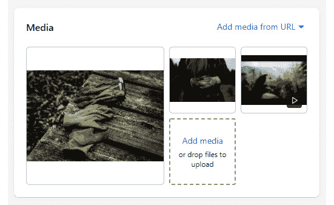
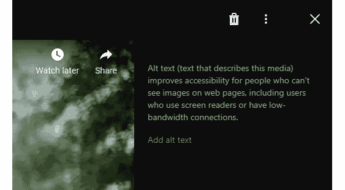
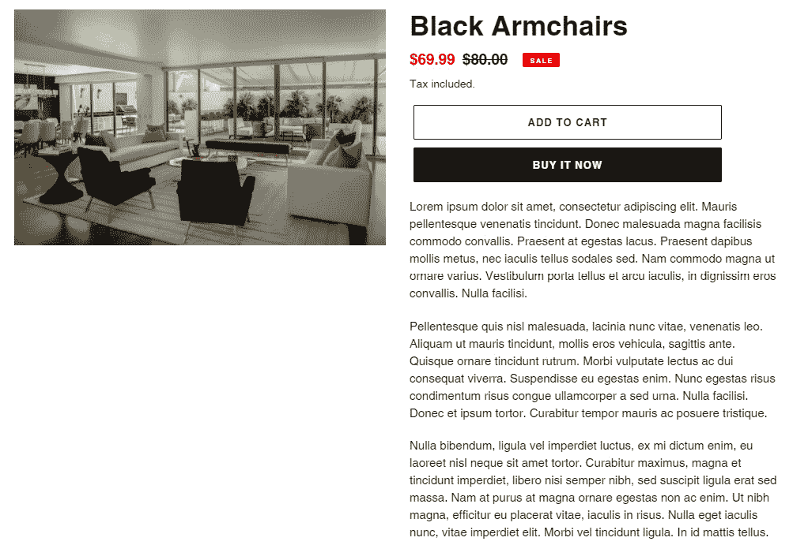
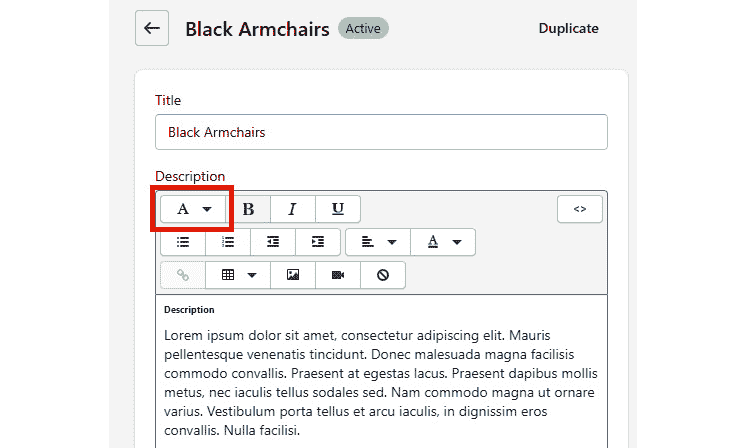

# 第五章：*第五章*: 深入了解带有过滤器的 Liquid 核心

在前两章中，我们学习了所有的不同 Liquid 标签和对象，现在，我们将关注 Liquid 核心功能的最后一部分，即 `|`，通过它可以操作不同的数据类型，包括字符串、数字、变量，甚至是对象，使其成为一个引人注目的功能。

我们可以将本章分为以下主题：

+   HTML 和 URL 过滤器

+   优化产品媒体库

+   构建产品折叠面板

+   数学和货币过滤器

+   探索附加过滤器

到我们完成这一章的时候，我们将精确地了解过滤器为我们提供了多少力量。同样地，就像上一章一样，我们不会简单地列出并逐一解释所有过滤器，而是通过一系列小项目来解释一些基本过滤器。

首先，我们将学习如何通过 **HTML 和 URL 过滤器** 生成 HTML 元素。其次，理解 **媒体过滤器** 将帮助我们处理产品媒体库，这是 Shopify 的最新功能之一，也是最受欢迎的功能之一。第三，通过在产品折叠面板项目中工作，我们将学习如何通过各自的过滤器操作字符串和数组类型的数据。最后，通过在产品价格折扣项目中工作，我们将获得必要的 **数学和货币过滤器** 知识。

# 技术要求

虽然我们将解释每个主题并附上相应的截图，但考虑到 Shopify 是一个托管服务，你需要一个互联网连接来跟随本章中概述的步骤。

本章的代码可在 GitHub 上找到：[`github.com/PacktPublishing/Shopify-Theme-Customization-with-Liquid/tree/main/Chapter05`](https://github.com/PacktPublishing/Shopify-Theme-Customization-with-Liquid/tree/main/Chapter05)。

本章的“代码在行动”视频可在此处找到：[`bit.ly/3zmum4j`](https://bit.ly/3zmum4j)

# 使用 HTML 和 URL 过滤器

在上一章中，当我们处理输出产品图片时，有机会看到一种 URL 过滤器，`{{ image | img_url: "400x400" }}`。*然而，URL 过滤器究竟是什么？*

`image` 标签，在其中我们可以添加特定资产的字符串路径作为 `href` 属性。或者，我们可以将 URL 过滤器与 **HTML 过滤器** 结合起来，自动生成必要的 HTML 元素及其属性。现在让我们看看它们在实际中的应用。

在*第一章* *Shopify 入门*中，我们学习了主题文件中的`Assets`目录以及它包含我们主题所需的所有内部资产，例如样式表、JavaScript 文件、字体文件和图像。然而，我们首先需要在主题中加载这些文件，按照以下步骤进行，因为它们不会自动在我们将它们上传到`Assets`目录后对我们可用：

1.  我们可以通过将文件名用引号括起来，然后跟一个管道符号，再跟`asset_url`过滤器，来检索`Assets`目录中文件的路径：

    ```php
    {{ "theme.css" | asset_url }}
    ```

1.  在之前的例子中，我们使用了存储中样式表文件的名称，结合`asset_url`，这将为我们提供指向此特定文件的字符串路径：[`cdn.shopify.com/s/files/1/0559/0089/7434/t/4/assets/theme.css?v=10188701410004355449`](https://cdn.shopify.com/s/files/1/0559/0089/7434/t/4/assets/theme.css?v=10188701410004355449)

1.  现在我们已经恢复了指向我们位置的路由，正如之前提到的，我们有两种选择。第一种选择是使用 HTML `link` 标签将 CSS 文件与我们的主题链接：

    ```php
    <link rel="stylesheet" href="theme.css file and its rules with the link tag in place:

    ```

    `<link rel="stylesheet" href="//cdn.shopify.com/s/files/1/0559/0089/7434/t/4/assets/theme.css?v=10188701410004355449">`

    ```php

    ```

1.  然而，正如我们之前提到的，除了使用 HTML `link` 标签外，我们还可以将 URL 过滤器与 HTML 过滤器结合使用，以生成必要的 HTML 属性：

    ```php
    {{ "theme.css" | asset_url | stylesheet_tag }}
    ```

在之前的例子中，我们使用了想要恢复路径的资产名称，然后跟`asset_url`过滤器，它通常会只返回字符串路径。然而，与`stylesheet_tag`结合使用时，它将自动生成带有所有必要属性的 HTML `link` 标签：

```php
<link href="//cdn.shopify.com/s/files/1/0559/0089/7434/t/4/assets/theme.css?v=10188701410004355449" rel="stylesheet" type="text/css" media="all">
```

除了更简洁之外，这两种方法的主要区别在于`stylesheet_tag` 不接受额外的参数。例如，如果我们想将`rel`属性更改为 preload，修改`media`属性，或者甚至包括`defer`属性，我们就必须使用第一种方法，并使用 HTML `link` 标签包含资产文件。

我们现在已经学会了如何将我们的主题文件与必要的样式表连接起来。然而，请注意，我们将根据我们想要访问的文件类型使用不同类型的 HTML 过滤器。

例如，如果我们想将`theme.js`文件的内容输出到我们的主题中，我们会使用类似的方法，主题文件名后跟`asset_url`以获取其路径，但我们将使用`script_tag`而不是`stylesheet_tag`：

```php
{{ "theme.js" | asset_url | script_tag }}
```

使用`script_tag`，我们将自动生成并包含我们的主题中的 HTML `script` 标签。然而，请注意，与`stylesheet_tag`类似，`script_tag`也不接受任何参数：

```php
<script src="img/theme.js?v=2017768116492187958" type="text/javascript"></script>
```

除了 `stylesheet_tag` 和 `script_tag` 之外，我们还可以访问 `img_tag`。使用 `asset_url` 后跟图像文件名，然后是 `img_tag`，可以在资产内访问图像文件：

```php
{{ "ajax-loader.gif" | asset_url | img_tag }}
```

`img_tag` 与前两个过滤器之间的关键区别在于 `img_tag` 接受额外的参数。

在*第四章*“使用对象深入液态核心”，我们有机会通过使用它来返回产品图像 URL 字符串，并将其与 HTML `img` 标签结合，将产品图像输出到我们的店面，来看到 `img_url` 过滤器的实际应用：

```php

```

注意，除了 `img_url` 过滤器外，我们还使用了 `size` 参数来设置图像的限制大小，这是我们可以在 `img_url` 和 `img_tag` 过滤器中使用的三种参数之一。然而，请注意，这两种类型的过滤器使用不同的参数，我们将在以下迷你项目中简要解释。

## 构建产品展示库

在这个迷你项目中，我们将学习如何输出产品展示库所需的所有元素：

1.  让我们从创建一个名为 `Product Gallery` 的新页面和一个名为 `product-gallery` 的新页面模板开始，我们将将其分配给之前创建的页面。

1.  一旦我们创建了页面并分配了适当的模板，我们应该确定一个具有多个图像的产品，并恢复其处理程序。我们将选择园艺手套，这是我们之前在*第三章*“使用标签深入液态核心”中从 `product-data.csv` 文件导入的产品之一。我们可以通过预览产品页面并从页面 URL 中复制页面处理程序来检索产品处理程序。或者，我们可以在管理部分导航到产品页面，并从页面底部的页面 URL 链接中复制页面处理程序。

1.  现在我们已经恢复了产品处理程序，让我们首先通过其处理程序创建一个产品对象并将其分配给一个变量。为了实现这一点，我们可以使用之前学到的通过其处理程序访问页面对象的方法。然而，与之前的章节相比，在那里我们学习了如何通过其集合访问产品对象，直接使用其处理程序访问产品对象略有不同。

    我们不会将产品对象名称复数化，而将使用一个全局对象标签 `all_products`，它为我们提供了访问我们商店中所有产品的权限。

    重要提示：

    虽然 `all_products` 是一种相当实用的方法，允许我们通过其处理程序直接访问任何产品，但它有一个限制，即我们只能在每页上运行它 20 次。这意味着如果我们需要在单页上恢复超过 20 个特定的产品，我们将需要通过遍历集合来恢复它们。

1.  我们可以通过使用`all_products`全局对象，然后是我们要访问的产品的句柄来通过句柄访问产品对象。在我们的例子中，我们将使用方括号`[]`。然而，我们也可以使用点(`.`)注解：

    ```php
    
    ```

1.  通过这种方式，我们现在可以访问园艺手套产品对象。要访问附加到产品上的所有图片，我们将使用`product_object`变量作为我们的对象，然后是`images`属性，以恢复特定产品的图片数组。由于我们正在处理一个数组，我们必须使用`for`标签来遍历它们：

    ```php
    
    
      
    
    ```

我们现在已经成功提取了一系列的产品图片，我们可以使用这些图片结合各种滑块插件来创建强大的相册。然而，请注意，我们店面上的图片尺寸相对较小。

这是因为如果没有引入`size`参数，Liquid 总是默认为`100x100`的大小。让我们通过将图像尺寸限制为宽 300 像素和高度 300 像素来引入`size`参数：

```php


  

```

注意，尽管我们指定了高度为 300 像素，但我们的图片现在宽度为 300 像素，高度仅为 200 像素。这是因为`size`参数只能通过减小图像大小来限制图像大小以匹配指定的值。它不能改变图像的宽高比，也不能将图像的大小增加到原始图像大小之外。

在上一个示例中，我们使用了`"300x300"`来限制产品图片的宽度和高度。然而，我们也可以只限制一边，使用`"300x"`将图片宽度设置为 300 像素或使用`"x300"`将高度限制为 300 像素。如果我们只指定这两个值中的一个，Shopify 将自动计算图像的尺寸，同时保持图像的宽高比。

我们可以使用与`img_url`过滤器配合的第二个参数是`crop`参数，它允许我们在与`size`参数结合时将图片裁剪到指定的大小。`crop`参数有五个不同的值：

+   `top`

+   `center`

+   `bottom`

+   `left`

+   `right`

使用正确的选项，我们可以指定我们想要裁剪图像的哪一侧。在我们的例子中，我们可以使用`center`选项来确保图像从每侧裁剪得一样：

```php


  

```

通过使用`crop`参数更改图像大小，我们也改变了图像的宽高比，因为所有图像的宽度和高度现在都是正好 300 像素。

我们可以使用与`img_url`过滤器配合的最后两个参数是`scale`，它允许我们使用`2`和`3`作为其选项值来指定图片的像素密度，以及`format`，这是一个相当有趣的参数，允许我们指定显示图片的格式。`format`参数的两个可接受值是`jpg`和`pjpg`。

使用 `pjpg`，我们可以将图像格式转换为**渐进式 JPEG**，自动加载全尺寸图像并逐渐提高其质量，而不是像传统 JPEG 那样从顶部到底部加载图像（我们可以在以下链接中了解更多关于渐进式 JPEG 的信息：[`en.wikipedia.org/wiki/JPEG#JPEG_compression`](https://en.wikipedia.org/wiki/JPEG#JPEG_compression)):

```php


  

```

现在我们已经熟悉了使用`img_url`过滤器可访问的参数，是时候了解`img_tag`过滤器可用的参数了。让我们从修改我们的最后一个示例开始，使用`img_tag`生成 HTML 标签：

```php


  {{ image_item | img_tag }}

```

注意，当我们第一次提到`img_tag`时，我们将其与`asset_url`结合使用来恢复`Assets`目录内图像位置的 URL 字符串。然而，由于我们不是访问`Assets`目录，而是访问产品图像，我们已经有从使用`product_object.images`获取的 URL 字符串数组，所以我们不需要使用除`img_tag`之外的任何其他过滤器。

通过查看结果，我们可以看到我们已经成功为图像数组中的每个图像创建了 HTML `img`标签。由于我们没有声明图像大小，Shopify 默认将我们的图像调整为`100x100`。

`img_tag`只接受三个参数。与只能应用所需参数的`img_url`不同，对于`img_tag`，我们需要按照特定顺序应用所有参数。这意味着如果我们想使用`class`和`alt`标签参数，我们首先必须使用其他参数。

由于我们需要按特定顺序添加所有参数，参数不需要表示。我们只需要分配它们的值。第一个值是 alt 文本，在其中我们可以使用固定字符串值或 Liquid 值，如`image_item.alt`，以恢复实际的图像 alt 文本。第二个参数我们可以用来为每个图像标签分配特定的类，而只有在第三个参数中我们可以分配大小值：

```php


  {{ image_item | img_tag: image_item.alt, "class1 class2",     "300x300" }}

```

正如我们所看到的，`image_url`和`img_tag`过滤器都有它们有用的参数，虽然`img_tag`更简洁，但它有局限性，因为我们包括在生成的 HTML `img`标签中的属性数量有限。

假设我们想要从`Assets`目录中提取一个图像文件，并应用适当的`size`参数以将其用作背景图像。我们不能使用`img_tag`，如前所述，因为这会返回一个 HTML `img`标签。我们也不能单独使用`asset_url`，因为`asset_url`不接受任何附加参数，包括`size`参数。

类似于`stylesheet_tag`和`script_tag`，我们有权限使用特殊的`asset_img_url`过滤器，它允许我们包含`size`参数以从`Assets`目录中恢复图像：

```php
{{ "ajax-loader.gif" | asset_img_url: "300x300", scale: 2,   crop: "center" }}
```

注意，`asset_img_url`允许我们包含`size`参数和其他之前通过`img_url`过滤器可用的参数，包括`size`、`crop`、`scale`和`format`。

到目前为止，我们已经学习了如何访问`Assets`目录中的不同类型的文件并为每个文件生成适当的 HTML 标签。我们还通过一个小项目学习了如何使用`img_url`过滤器，该项目涉及输出创建基本产品库所需的所有元素。虽然我们没有涵盖 Liquid 提供的所有 URL 和 HTML 过滤器，但我们现在已经为使用 HTML 和 URL 过滤器奠定了适当的基础，这种知识在 Liquid 中至关重要，并将对我们未来的工作大有裨益。

小贴士：

关于所有可用的 HTML 过滤器，我们可以参考[`shopify.dev/docs/themes/liquid/reference/filters/html-filters`](https://shopify.dev/docs/themes/liquid/reference/filters/html-filters)，关于可用的 URL 过滤器，我们可以参考[`shopify.dev/docs/themes/liquid/reference/filters/url-filters`](https://shopify.dev/docs/themes/liquid/reference/filters/html-filters)。

# 提升产品媒体库

在之前的练习中，我们学习了如何输出创建仅包含图像的基本产品库所需的图像元素。在接下来的项目中，我们将学习如何使用媒体对象和过滤器创建一个多功能库，该库将支持图像、3D 模型和 Shopify 上托管的内嵌视频。此外，我们还将嵌入一些最受欢迎的视频平台（Vimeo 和 YouTube）的外部视频链接，并为两者自动生成适当的视频播放器。

今天大多数最新的主题已经包含了产品媒体库。然而，许多商店仍在使用过时的主题文件，因此了解如何从头开始创建这个功能是至关重要的。

让我们从导航到我们在上一节*构建产品库*中创建的`产品库`页面开始，该页面位于*使用 HTML 和 URL 过滤器*部分之下，并修改之前包含的代码以接受除了图像之外的其他媒体类型：

```php


  {{ image_item | img_tag: image_item.alt, "class1 class2",     "300x300" }}

```

最初，我们使用`product_object`变量来捕获园艺手套产品的产品对象，之后我们使用`for`标签遍历从`product_object.images`接收到的图像数组。鉴于我们正在处理各种媒体类型，我们需要使用`media`属性来恢复媒体数组，并将`image_item`变量替换为`media`以保持一切的一致性：

```php


  {{ media | img_tag: media.alt, "class1 class2", "300x300" }}

```

使用`media`属性，我们现在已经恢复了一个包含所有不同媒体对象的数组，它可以包含以下媒体类型：

+   `图像`

+   `外部视频`

+   `视频`

+   `模型`

然而，拥有多种媒体类型也意味着我们现在有一个混合的对象数组，因此在我们做任何事情之前，我们需要过滤掉它们。

我们将使用`case/when`标签与`media_type`属性结合，这是媒体对象的一部分，它将允许我们创建一个`switch`语句来恢复特定类型的所有媒体。我们可以通过访问*控制 Liquid 流程*部分来提醒自己`case/when`标签，这部分我们可以在*第三章*，*深入 Liquid 核心与标签*中找到。

让我们创建一个`case`标签来过滤`media_type`，并为每个媒体类型编写一个`switch`语句：

```php


  
    
    
    
    
    
  
  {{ media | img_tag: media.alt, "class1 class2", "300x300" }}

```

在`case/when`标签就位后，我们已经成功过滤出媒体类型，并获得了访问每个媒体类型对象的权利，我们将需要输出媒体标签。

如果我们查看我们的代码，我们会注意到我们之前用于在先前的示例中输出图像的代码仍然存在。由于我们现在可以在第一个`switch`语句中访问`image`对象，我们可以简单地重新定位代码，这将是在输出图像媒体文件的第一步：

```php


  
    
      {{ media | img_tag: media.alt, "class1 class2",             "300x300" }}
    
    
    
    
  

```

在`img_tag`就位后，我们现在已经成功输出了我们产品的所有图像文件。然而，我们仍然缺少其他媒体类型的标签。所以，让我们继续处理外部视频。

`external_video`对象为我们提供了有关与特定产品相关联的 Vimeo 或 YouTube 视频的信息。同样，与图像对象一样，为了输出`external_video`媒体类型，我们需要使用`external_video_tag`来生成必要的`iframe`元素，无论是 Vimeo 还是 YouTube：

```php


  
    
      {{ media | img_tag: media.alt, "class1 class2",             "300x300"}}
    
      {{ media | external_video_tag }}
    
    
    
  

```

在`external_video_tag`就位后，我们将自动为每个`external_video`媒体类型生成一个包含所有必要属性的 iframe，所以让我们快速测试一下：

1.  为了测试`external_video_tag`是否工作，我们首先需要在我们的产品页面媒体中包含一个 Vimeo 或 YouTube 视频。

1.  我们需要点击我们的管理侧边栏中的**产品**部分，并导航到我们目前正在查看媒体文件的产品。在我们的例子中，这个产品是园艺手套。

1.  在打开特定的产品页面后，我们需要滚动到**媒体**部分，在右上角，我们会找到一个名为**从 URL 添加媒体**的下拉链接，我们应该点击以显示下拉选项。在下拉菜单中，我们会找到两个选项，第一个选项允许我们向产品添加外部图像，第二个选项允许我们嵌入 Vimeo 或 YouTube 视频。![Figure 5.1 – 将外部资产嵌入到产品媒体中的示例

    ![Figure 5.01_B17606.jpg]

    图 5.1 – 将外部资产嵌入到产品媒体中的示例

1.  我们应该通过点击**嵌入视频**来继续，这将触发一个弹出窗口，我们可以在这里包含 Vimeo 或 YouTube 视频的 URL。粘贴链接后，点击**嵌入视频**按钮来完成此过程。经过几秒钟的处理，媒体视频将在**媒体**部分可见。



图 5.2 – 产品管理页面上的各种媒体文件示例

视频现在已成功加载到产品媒体资源中，剩下要测试的是 `external_video_tag` 是否工作良好。

点击媒体视频资源，将触发一个弹出窗口，其中一侧显示预览，另一侧提供包含 alt 文本的选项。此外，在右上角，我们可以看到三个图标。第一个是一个垃圾桶图标，允许我们删除特定的媒体。中间的图标，由三个点表示，当点击时将显示一个包含 **替换缩略图** 选项的下拉菜单。

点击此选项将允许我们上传一个作为 iframe 视频海报图片的缩略图，避免视频的第一帧作为海报。请注意，用三个点表示的图标仅在视频资源上可见，在常规图像资源上不可见。



图 5.3 – 视频媒体资源弹出工具示例

预览 `iframe` 元素：

```php
<iframe frameborder="0" allow="accelerometer; autoplay; encrypted-media; gyroscope; picture-in-picture" allowfullscreen="allowfullscreen" src="img/neFK-pv2sKY?controls=1&amp;enablejsapi=1&amp;modestbranding=1&amp;origin=https%3A%2F%2Flearn-liquid-with-packt.myshopify.com&amp;playsinline=1&amp;rel=0" title="Gardening Gloves"></iframe>
```

如我们所见，默认情况下，我们的 YouTube 视频嵌入中包含了许多属性，例如可见控件和品牌。*但如果我们想修改这些属性或包含一些新的属性呢？*

要修改现有的外部视频属性或包含新的属性，我们需要引入一个新的媒体过滤器，`external_video_url`。通过包含 `external_video_url` 过滤器，结合 `external_video_tag`，我们将能够修改 YouTube 嵌入的任何属性：

```php


  
    
      {{ media | img_tag: media.alt, "class1 class2",             "300x300" }}
    
      {{ media | external_video_url: controls: 0, color:             "white" | external_video_tag }}
    
    
    
  

```

如我们所见，我们可以从官方 YouTube 文档中包含任意数量的属性。虽然这些属性对 YouTube 视频嵌入很有帮助，但当我们处理 Vimeo 视频时，这些属性将不会对我们有所帮助，因为 Vimeo 根据其自己的文档使用不同的属性。

为了区分哪个嵌入链接属于 YouTube，哪个属于 Vimeo，我们需要通过 `external_video` 对象引入 `host` 属性，该对象返回两个值之一：

+   `youtube`

+   `vimeo`

通过结合使用 `host` 属性和 `if` 语句，我们可以轻松地区分两个 `iframe` 元素，并将适当的属性应用于它们：

```php


  
    
      {{ media | img_tag: media.alt, "class1 class2",             "300x300" }}
    
      
        {{ media | external_video_url: controls: 0, color:                 "white" | external_video_tag }}
      
        {{ media | external_video_url: loop: 1, muted: 1 |                 external_video_tag }}
      
    
    
    
  

```

通过引入 `host` 属性，我们已经确保每种类型的外部视频嵌入都将根据其文档接收适当的属性。

小贴士：

关于 YouTube 视频的可用属性，请参阅 [`developers.google.com/youtube/player_parameters#Parameters`](https://developers.google.com/youtube/player_parameters#Parameters)。

关于 Vimeo 视频的可用属性，请参阅 [`vimeo.zendesk.com/hc/en-us/articles/360001494447-Using-Player-Parameters`](https://vimeo.zendesk.com/hc/en-us/articles/360001494447-Using-Player-Parameters)。

我们现在已经学会了如何包含两种类型的外部视频，并为每种类型包含任何属性。现在我们可以继续到下一个 `switch` 语句，学习如何输出托管在 Shopify 平台本身上的视频。

将视频作为产品媒体资产上传与上传图像相同。要上传视频，请点击管理侧边栏中的 **产品** 部分，并选择我们上传视频资产的产品。进入后，滚动到 **媒体** 部分，然后点击 **添加媒体** 按钮开始上传过程。

重要提示：

除了外部视频外，上传到 Shopify 平台的资产（包括图像和视频）都有特定的限制。除了我们可以使用的特定格式类型外，图像文件的大小不能超过 20 MP，20 MB，并且必须是 `.jpeg` 或 `.png` 格式，而视频文件的最大长度为 60 秒，大小为 20 MB，并且必须是 `.mp4` 或 `.mov` 视频格式。

一旦我们上传了视频，我们还可以通过包含替代文本和海报图像以与外部媒体相同的方式添加可选信息。

要输出上传到产品媒体文件的视频，我们需要使用 `video_tag`，通过 `video` 对象访问：

```php


  
    
      {{ media | img_tag: media.alt, "class1 class2",             "300x300" }}
    
      
        {{ media | external_video_url: controls: 0, color:                 "white" | external_video_tag }}
      
        {{ media | external_video_url: loop: 1, muted: 1 |                 external_video_tag }}
      
    
      {{ media | video_tag }}
    
    
  

```

通过预览 `video` 标签。然而，由于我们没有启用控件，它们默认被隐藏。此外，如果我们仔细观察，我们会注意到 HTML `video` 标签中 `poster` 属性的 URL 有一个小尺寸，这就是为什么店面上的图像也很小。

就像我们回忆起学习图像过滤器时一样，如果我们尝试输出未定义图像大小的图像，Shopify 会自动将图像大小调整为 `100x100`。

使用 `video_tag`，我们可以包含任何可以与常规 HTML `video` 标签一起使用的属性，包括 `image_size` 参数，允许我们修改视频 `poster` 属性的大小。让我们修改 `video_tag` 以使控件可见，设置海报图像大小，并将视频大小设置为 `300x` 以匹配海报大小：

```php


  
    
      {{ media | img_tag: media.alt, "class1 class2",             "300x300" }}
    
      
        {{ media | external_video_url: controls: 0, color:                 "white" | external_video_tag:                         class: "youtube_video" }}
      
        {{ media | external_video_url: loop: 1, muted: 1 |                 external_video_tag: class: "vimeo_video" }}
      
    
      {{ media | video_tag: controls: true, image_size:             "300x300", width: "300x" }}
    
    
  

```

包含了额外的属性后，我们现在已经成功生成了 HTML `video` 标签，同时保留了根据需要修改任何属性的能力。

我们需要关注的下一个媒体类型是 3D 模型，我们可以使用 `model_viewer_tag` 输出它，通过 `model` 对象访问。只需将 `model_viewer_tag` 与 `media` 对象一起包含，就会自动生成适当的模型查看器：

```php


  
    
      {{ media | img_tag: media.alt, "class1 class2",             "300x300" }}
    
      
        {{ media | external_video_url: controls: 0, color:                 "white" | external_video_tag:                         class: "youtube_video" }}
      
        {{ media | external_video_url: loop: 1, muted: 1 |                 external_video_tag: class: "vimeo_video" }}
      
    
      {{ media | video_tag: controls: true, image_size:             "300x300", width: "300x" }}
    
      {{ media | model_viewer_tag }}
    
  

```

注意，模型查看器将默认自动包含特定属性，就像之前的 `media` 标签一样。尽管如此，如果我们选择这样做，我们可以很容易地更新或包括新的属性，只需遵循之前 `media` 标签中提到的相同格式即可。

在`model_viewer_tag`到位的情况下，我们已经涵盖了所有四种媒体类型，并确保我们将每种媒体类型用适当的`media`标签表示。然而，请注意，我们仍然有一个没有`media`标签的最后的`switch`语句。

我们可以将最后的`switch`语句视为一种安全措施，以防万一之前的任何`switch`语句或媒体无法产生结果，我们将与`media_tag`一起使用它。

`media_tag`过滤器是一种特殊的过滤器，因为这个特定的过滤器将自动为之前提到的四种媒体类型中的任何一种生成适当的`media`标签。*所以，如果我们可以用* `media_tag` *自动生成所有* `media` *标签，* *为什么我们还要用* `media_tag` *来生成所有媒体文件呢？为什么我们到现在还要费心学习所有* `media` *标签呢？*

虽然`media_tag`确实会自动检测每种媒体类型并为其渲染适当的`media`标签，但通过使用`media_tag`，我们将失去为特定媒体类型分配自定义类名和属性的能力。因此，我们永远不应该将`media_tag`作为渲染媒体资产的主要选项。相反，我们应该将其用作后备方案，以确保在店面正确渲染媒体资产：

```php


  
    
      {{ media | img_tag: media.alt, "class1 class2",             "300x300" }}
    
      
        {{ media | external_video_url: controls: 0, color:                 "white" | external_video_tag:                         class: "youtube_video" }}
      
        {{ media | external_video_url: loop: 1, muted: 1 |                 external_video_tag: class: "vimeo_video" }}
      
    
      {{ media | video_tag: controls: true, image_size:             "300x300", width: "300x" }}
    
      {{ media | model_viewer_tag }}
    
    {{ media | media_tag }}
  

```

到目前为止，我们已经学习了如何输出图像类型的媒体文件，区分不同类型的外部媒体资产，渲染 Shopify 平台上的视频的媒体标签，并生成 3D 模型的适当媒体标签。最后，通过`media_tag`，我们涵盖了 Shopify 目前覆盖的所有媒体类型，并确保我们将在店面正确展示每个媒体资产。

现在我们已经拥有了创建媒体库所需的所有必要资源，接下来要做的就是通过添加一些 HTML 元素来正确格式化代码，从而进一步优化我们的代码。除了代码格式，我们还可以根据我们想要创建的画廊类型，使用一些滑动插件，例如**Slick**。为了保持内容简洁并直击要点，我们不会涵盖媒体库的样式和功能。然而，对于那些想要通过完成项目来测试自己技能的人来说，我们可以在以下 Shopify 文章中找到关于样式和功能的必要建议（[`shopify.dev/tutorials/add-theme-support-for-rich-media-3d-and-video`](https://shopify.dev/tutorials/add-theme-support-for-rich-media-3d-and-video)）。

在文章中，我们可以找到有关使用宽高比框创建响应性或回答一些关于功能性的常见问题解答的信息，例如将缩略图图像连接到主画廊或变体本身。

小贴士：

对于所有可用媒体过滤器的更多信息，我们可以参考[`shopify.dev/docs/themes/liquid/reference/filters/media-filters`](https://shopify.dev/docs/themes/liquid/reference/filters/media-filters)。

在进行这个项目的过程中，我们创建了一个产品媒体库的基本版本，这使得我们能够将任何类型的产品媒体输出到任何页面。虽然它可能看起来并不令人印象深刻，但通过这个项目我们学到的知识教会了我们如何创建今天最受欢迎的功能之一，并且随着我们知识的进一步增长，它将对我们创建更高级的功能大有裨益。

# 构建产品折叠面板

在以下项目中，我们将通过处理和创建产品折叠面板功能来学习字符串和数组过滤器。*但是，在我们继续项目之前，字符串和数组过滤器究竟做什么呢？*

**字符串过滤器**是允许我们操纵 Liquid 代码的输出或变量本身的方法，只要变量是字符串类型，而数组过滤器允许我们操纵数组的输出。

对于这个项目，我们首先需要找到一个具有冗长描述的产品。为了节省时间，我们已经在`product-data.csv`文件中包含了必要的描述，在*第三章* *深入 Liquid 核心标签*中。



图 5.4 – 长产品描述的示例

如我们从之前的屏幕截图中所见，拥有冗长的产品描述可能相当低效，因为它占据了大量的空间。虽然我们可以轻松地格式化产品描述代码，包括创建产品折叠面板所需的必要 HTML 标签，但手动调整每个产品的代码将是一个漫长的过程。维护它甚至更糟糕。幸运的是，通过使用字符串和数组过滤器，我们可以轻松地操纵产品描述输出，将其拆分并按任何我们需要的方式格式化：

1.  首先，让我们从识别渲染当前产品描述的代码片段开始。我们可以在`product-template.liquid`文件中找到产品描述，该文件位于`Sections`目录下，我们目前正在使用`product.description`来渲染它：

    ```php
    <div class="product-single__description rte">
      {{ product.description }}
    </div>
    ```

1.  由于我们希望创建可重用的代码，我们应该做的第一件事是创建一个变量来保存`product.description`的输出，这样我们就可以避免多次调用`product.description`：

    ```php
    <div class="product-single__description rte">
      
    </div>
    ```

现在我们已经设置了变量，我们应该概述我们试图实现的具体目标。再次查看当前的产品描述，我们可以清楚地看到我们有三个坚实的块，所以让我们说我们希望将整个产品描述分成三个甚至更多的独特的产品折叠面板。

现在我们知道了*什么*，我们需要考虑*如何*。虽然我们可以轻松地硬编码产品折叠面板的标题，例如**描述**、**成分**和**说明**，但我们希望创建一个动态功能，允许我们轻松地包括任意数量的产品折叠面板，而无需修改代码本身。我们将使用以下步骤来实现这一点：

+   首先，将`Description`、`Ingredients`和`Instructions`作为 h6 标题导航到每个文本块之前。为此，我们可以使用标题来包含任意数量的产品标签标题，并为以后设置适当的标记。

+   然后，我们可以通过简单地突出显示我们想要格式化的文本并点击**A**按钮来使用富文本编辑器应用标题，这将触发一个下拉菜单，我们可以从中选择所需的 h6 标题：



图 5.5 – 在产品描述中应用标题的示例

在设置好标题后，我们现在有了适当的标记，我们可以使用它来将文本块分隔成单独的块，这可以通过以下字符串过滤器`split`来实现。

## 分割过滤器

`split`过滤器使用一个单独的子字符串作为参数，它作为分隔符，将字符串分割成一个数组，我们可以稍后使用数组过滤器输出这些数组项。*但是它究竟是如何工作的呢？*

```php

```

在这个例子中，我们创建了一个名为`methods`的变量，并给它分配了一个字符串消息。现在让我们使用`split`过滤器将字符串消息分割成数组，并立即调用它以查看结果：

```php

{{ methods }}
StringsFilters
```

如我们所见，在应用`split`过滤器后，我们用作分隔符的子字符串被完全从初始字符串中移除，我们最终得到了一个数组结果。因此，分配给`split`过滤器子字符串参数的任何值不仅将作为标记分隔符，而且还将自动从字符串中删除任何子字符串值的出现。

在使用`split`过滤器后，我们现在已经将`methods`变量修改为数组。然而，这并不明显，因为我们还在分隔符内包含了空格，因此结果是我们两个单词紧挨着写在一起而没有空格。为了测试我们的`methods`变量是否为数组，我们需要使用`for`标签运行它。*但是如果我们只想避免使用循环，因为数组中只有两个项目呢？*

这就是`first`数组过滤器发挥作用的地方。正如我们回忆的那样，我们在上一章中提到过`first`和`last`过滤器，当时我们在进行`Product Customization`项目时。使用`first`或`last`过滤器将自动恢复数组中的第一个或最后一个元素。由于使用`split`过滤器后我们的数组只有两个元素，所以这是一个完美的匹配。否则，我们需要包含一个`for`标签来遍历数组以恢复正确的值。让我们通过只恢复分隔符之前的数据来观察它的实际效果：

```php

{{ methods }}
Strings
```

我们现在可以看到，我们已经成功地将初始的字符串类型变量修改为数组类型，并且已经成功恢复了数组的第一项。虽然这个具体的方法看起来可能并不重要，但我们所获得的知识将在我们未来的工作中非常有用。

在我们继续我们的项目之前，让我们再看一个例子：

```php

```

在这个例子中，我们在`message`变量中分配了一个简短的字符串。然后我们应用了`split`过滤器并将子字符串设置为空格值，这意味着我们正在寻找在每个空格出现时分割初始字符串。让我们创建一个简短的循环来确认`message`变量现在是一个数组类型：

```php


  {{ item }}

This
is
a
short
string
message.
```

如我们所见，通过引入`split`过滤器，我们已成功使用子字符串参数将初始字符串消息分割，并创建了一个数组，我们使用`for`标签进行了确认。现在让我们回到我们的项目，并使用我们新获得的知识将产品描述分成三个独立的块。

由于我们正在寻找创建一个动态功能，我们需要将子字符串参数设置为一个我们知道将在每个产品描述中出现的值。记住，我们之前已经添加了标题，使用了`h6`标题进行格式化。因此，让我们使用`split`过滤器并将子字符串值设置为开头的`h6`标题：

```php
<div class="product-single__description rte">
  
</div>
```

为了理解使用`h6`标题作为子字符串参数的意义，我们首先需要查看我们产品描述的当前 HTML 格式。如果我们在使用`split`过滤器之前检查产品描述，我们会注意到以下 HTML 格式：

```php
<h6>Description</h6>
<p>Lorem ipsum content<p>
<h6>Ingredients</h6>
<p>Lorem ipsum content<p>
<h6>Instructions</h6>
<p>Lorem ipsum content<p>
```

如标记所示，每个标题都位于文本块之上，提供了完美的标记。使用开头的`h6`标题作为分隔符，我们应该在数组中有四个项目。现在让我们看看当我们使用开头的`h6`标题作为分隔符应用`split`过滤器时会发生什么：

```php
<div class="product-single__description rte">
  

  <div class="product-single__description-item">
    {{ item }}
  </div>

</div>
```

根据我们的标记，在应用以开头的`h6`标题作为分隔符的`split`过滤器后，数组中的第一个项目应该是空的，因为没有内容在分隔符第一次出现之前。其他三个应该包含标题以及第一个和后续分隔符出现之间的任何内容：

```php
<div class="product-single__description-item"></div>
<div class="product-single__description-item">
<span>Description</span>
<p>Lorem ipsum content<p>
</div>
<div class="product-single__description-item">
<span>Ingredients</span>
<p>Lorem ipsum content<p>
</div>
<div class="product-single__description-item">
<span>Instructions</span>
<p>Lorem ipsum content<p>
</div>
```

检查结果，我们可以看到我们成功地提取了每个产品描述块。然而，还有一些事情需要讨论。例如，我们将有一个空的`div`，我们可以通过引入`offset`参数并将其值设置为`1`来快速解决，这样我们就可以在`for`循环中跳过第一次迭代。我们可以通过访问位于*第三章*的*迭代标签*部分来提醒自己`offset`参数，*深入 Liquid 核心使用标签*：

```php
<div class="product-single__description rte">
  

  <div class="product-single__description-item">
    {{ item }}
  </div>

</div>
```

将`offset`参数添加到`for`标签中将会跳过第一次迭代，否则将返回一个空值。此外，我们已经确保我们的数组只包含我们最初打算的三个产品描述块。然而，让我们更仔细地看看在应用了`offset`参数后的数组当前结果：

```php
<div class="product-single__description-item">
<span>Description</span>
<p>Lorem ipsum content<p>
</div>
<div class="product-single__description-item">
<span>Ingredients</span>
<p>Lorem ipsum content<p>
</div>
<div class="product-single__description-item">
<span>Instructions</span>
<p>Lorem ipsum content<p>
</div>
```

如我们所回忆的，通过使用打开的 `h6` 标题作为 `split` 过滤器的子字符串，我们将自动移除初始字符串中的任何打开的 `h6` 标题。然而，请注意，我们不仅移除了打开的 `h6` 标签，我们还移除了关闭的 `h6` 标签。

从技术上讲，关闭的 `h6` 标签仍然存在，位于关闭的 `span` 标签之后。然而，由于我们移除了打开的 `h6` 标签，浏览器将其解释为错误并自动移除了关闭的 `h6` 标签。因此，我们不要依赖浏览器来清理，而是使用关闭的 `h6` 标签进一步划分我们的三个块。

目前，`for` 循环内部的每个 `item` 变量都包含标题和内容文本。通过使用关闭的 `h6` 标题应用 `split` 过滤器，我们将 `item` 变量修改为一个包含标题和内容的数组。因此，我们不必使用另一个 `for` 循环来遍历这些内容，让我们回忆一下之前提到的 `first` 和 `last` 过滤器，并在这里使用它们来分别恢复每个值：

```php
<div class="product-single__description rte">
  

  <div class="product-single__description--item">
    <div class="product-single__description-title">
      {{ item | split: "</h6>" | first }}
    </div>
    <div class="product-single__description-content">
      {{ item | split: "</h6>" | last }}
    </div>
  </div>

</div>
```

通过再次应用 `split` 过滤器，我们移除了剩余的关闭 `h6` 标签。此外，我们更清晰地分离了内容，这使得我们可以更轻松地使用结果来完成我们的迷你项目。

到目前为止，我们已经拥有了完成产品折叠项目所需的所有必要元素。唯一剩下的事情就是添加一些样式并引入处理输入动画的脚本。为了保持简洁，我们不会在这个项目中涵盖样式和功能。然而，我们将提供最终期望，以帮助我们可视化一个清晰的目标，这将作为未来工作的优秀实践：

![图 5.6 – 完整产品折叠项目的示例

![图片 5.06 – Figure_5.06_B17606.jpg]

图 5.6 – 完整产品折叠项目的示例

到目前为止，我们已经学会了如何通过将字符串变量转换为数组类型变量并使用它们来创建产品折叠功能来操作字符串变量。此外，我们还了解了使用管道字符包含的 `split` 和 `first`/`last` 过滤器。然而，根据情况，特定的过滤器，如 `size`，可以与管道和点注释一起使用：

```php

{{ message | size }}

  This message contains more than 10 characters.

```

在上一个示例中，我们创建了一个 `message` 变量并将其分配了一个简短的字符串。使用 `size` 过滤器和 `message` 变量，我们将渲染消息字符串中的字符总数。然而，通过使用点注释的 `size`，我们获得了将 `size` 过滤器作为 Liquid 逻辑一部分的能力：

```php
31
This message contains more than 10 characters.
```

我们还可以使用 `size` 过滤器通过包含一个检查产品描述是否超过 `1` 个代码块的 `if` 语句来改进我们的产品折叠。如果没有，它应该简单地输出常规的产品描述：

```php
<div class="product-single__description rte">
  

  
    <div class="product-single__description--item">
      <div class="product-single__description-title">
        {{ item | split: "</h6>" | first }}
      </div>
      <div class="product-single__description-content">
        {{ item | split: "</h6>" | last }}
      </div>
    </div>
  

  <div class="rte">{{ product.description }}</div>

</div>
```

随着`size`过滤器的引入，我们使代码变得更加简洁和优化，因为我们不需要在数组类型变量中的单个项目上运行`for`循环。

如我们所见，仅通过使用日常过滤器，我们就可以显著提高我们的代码质量。例如，*如果我们想将产品描述拆分并渲染到各个地方，而不是一次性输出所有内容，那会怎么样？*为此，我们需要使用`split`、`first`/`last`和`index`过滤器的组合。我们已经涵盖了`split`和`first`/`last`过滤器，*但`index`过滤器究竟做什么呢？*

## 索引过滤器

正如其名称所暗示的，`index`过滤器允许我们通过其索引位置访问特定的数组，起始位置为 0。让我们尝试将索引位置应用于我们的产品折叠项目。请注意，我们将不再需要`for`标签，因为我们将通过`index`过滤器直接访问`productDescription`变量：

```php
<div class="product-single__description rte">
  
  <div class="product-single__description--item">
    <div class="product-single__description-title">
      {{ item[1] | split: "</h6>" | first }}
    </div>
    <div class="product-single__description-content">
      {{ item[1] | split: "</h6>" | last }}
    </div>
  </div>
</div>
```

之前的代码将返回产品描述中的第一个标题和文本块。然而，我们提到索引位置从`0`开始，*那么为什么位置`1`返回的是第一个块的输出结果？*

正如我们所回忆的，因为我们已经使用`h6`标签作为`split`过滤器的分隔符，所以我们的数组中的第一个项目是空的。之前我们通过包含`offset`参数来跳过数组中的第一个项目，而如今我们将简单地跳过*第一个索引位置*，即`0`。这种方法的不利之处在于，我们将不得不重复代码来分别恢复每个块。然而，从积极的一面来看，我们获得了在任意位置定位它们的灵活性，这在某些情况下可能是必要的。

小贴士：

如需了解所有可用的字符串过滤器信息，我们可以参考[`shopify.dev/docs/themes/liquid/reference/filters/string-filters`](https://shopify.dev/docs/themes/liquid/reference/filters/string-filters)。

如需了解所有可用的数组过滤器信息，我们可以参考[`shopify.dev/docs/themes/liquid/reference/filters/array-filters`](https://shopify.dev/docs/themes/liquid/reference/filters/array-filters)。

我们看到了一些看似微不足道的过滤器如何成为一个强大的工具，它将使我们能够创建商家经常寻求的复杂特征。通过这种学习过程，我们在实际项目上工作，获得了宝贵的经验教训，同时也学会了如何处理各种类型的过滤器，这比简单地列出它们要重要得多。

# 数学与货币过滤器

在上一章中，我们在`Custom collections`项目上工作时有机会看到货币过滤器在实际中的应用。**货币过滤器**是一种简单的过滤器类型，其唯一任务是根据货币格式化选项格式化数值，*但这究竟意味着什么？*

为了更好地理解，让我们导航到我们的管理页面，并点击左下角的**设置**按钮。随后，点击**常规**选项以打开我们将能够更新商店的基本信息。一旦进入，向下滚动直到你到达名为**商店货币**的部分。这就是我们可以更改商店默认货币的地方，我们的客户将使用它来购买商品。而不是更改商店货币，让我们点击**更改格式化**按钮。

![Figure 5.7 – 商店货币格式化的位置

![img/Figure_5.07_B17606.jpg]

图 5.7 – 商店货币格式化的位置

通过点击**更改格式化**按钮，我们将揭示额外的货币格式化选项，在这里我们可以定义全局标记，该标记将供货币过滤器稍后用于格式化任何数值。

如果我们将货币过滤器应用于任何数值，根据格式化设置，我们唯一会看到的变化是在价格前有一个美元符号，在价格后有一个 USD。所以，让我们尝试修改这两个字段以包含一些更有帮助的标记。

我们可以编辑名为`span`标签的`money`类的第一个两个字段。然而，请注意，在编写`money`类时，我们不应包括引号。否则，我们可能会破坏货币格式化。

![Figure 5.8 – 更新商店货币格式的示例

![img/Figure_5.08_B17606.jpg]

图 5.8 – 更新商店货币格式的示例

通过在货币格式化中包含带有`money`类的`span`标签，我们现在确保了我们的商店中的每个定价元素都将包含相同的选择器，这有助于我们在需要动态更新定价时。

另一方面，**数学过滤器**是自我解释的，因为它们允许我们执行特定的数学任务。同样，与字符串和数组过滤器一样，我们可以在一行中链式调用多个数学过滤器，在这种情况下，过滤器将按从左到右的顺序应用。

现在我们已经熟悉了货币和数学过滤器，让我们看看它们在实际中的应用，并开始我们的下一个迷你项目。

## 产品折扣价格

在以下项目中，我们将通过工作于我们在*第四章*中开始的项目之一，*使用对象深入 Liquid 核心*，来学习数学和货币过滤器，该项目是位于**全局对象**部分的**自定义收藏夹**。

我们的目标是创建产品折扣价格并更新销售徽章以显示实际百分比折扣。让我们首先导航到我们之前开发的代码位置。

我们通过在`Templates`目录下的`collection.liquid`文件中包含`collection-form.liquid`片段来创建`Custom collection`功能。在`collection-form.liquid`片段中，我们将看到以下代码：

```php

<div class="custom-collection--item">
  <a href="{{ product.url }}">
    
    <p class="h4 custom-collection--title">{{ product.title         }}</p>
    <p class="custom-collection--price">
      {{ product.price | money }}
      <span>{{ product.compare_at_price | money }}</span>
    </p>
    <span class="custom-collection--sale-badge">sale</span>
  </a>
  
    <input type="hidden" name="id" value="{{         product.first_available_variant.id }}" />
    <input type="submit" value="Add to Cart"/>
  
</div>

```

根据当前设置，我们同时显示正常价格和比较价格，所以让我们先修改比较价格，并用实际折扣价格替换它。要输出两个价格之间的折扣，应该相对简单，因为我们只需要从比较价格中减去正常价格。

要从比较价格中减去正常价格，我们需要使用`minus`数学过滤器：

```php
<p class="custom-collection--price">
  {{ product.price | money }}
  <span>{{ product.compare_at_price | minus: product.price     }}</span>
</p>
```

注意，随着`minus`过滤器的引入，我们必须完全删除`money`过滤器。如前所述，我们只能在所有值都是数值值的情况下使用数学过滤器。如果我们包含`money`过滤器，由于我们之前设置的货币格式化，这两个值都会变成字符串。

现在我们已经成功应用了`minus`过滤器，我们需要考虑如何包含`money`过滤器。根据当前设置，我们收到了一个没有货币格式的数值。然而，如前所述，如果我们对任何两个值应用`money`过滤器，即使是在`product.price`之后，`money`过滤器只会影响`product.price`，而不会影响最终结果。因此，数学过滤器将不再工作。

为了解决这个问题，我们需要使用`assign`或`capture`关键字引入一个变量来计算两个数字之间的差异，然后使用`money`过滤器调用该变量：

```php
<p class="custom-collection--price">
  {{ product.price | money }}
  
  <span>{{ discount-price | money }}</span>
</p>
```

如果我们现在预览我们的收藏页面，我们将看到我们已经正确执行了折扣价格计算和货币格式化。所以现在我们可以转到我们项目的第二部分，即用实际百分比值折扣替换销售徽章。

我们可以在同一个`collection-form.liquid`代码片段文件中找到销售徽章的 HTML 代码：

```php

<div class="custom-collection--item">
  <a href="{{ product.url }}">
    
    <p class="custom-collection--price">
      {{ product.price | money }}
      
      <span>Save {{ discount-price | money }}</span>
    </p>
    <span class="custom-collection--sale-badge">sale</span>
  </a>
  
    <input type="hidden" name="id" value="{{         product.first_available_variant.id }}" />
    <input type="submit" value="Add to Cart"/>
  
</div>

```

要计算折扣百分比，我们可以使用以下公式，该公式将返回折扣百分比：

```php
{{ product.compare_at_price | minus: product.price | times: 100 | divided_by: product.compare_at_price }}
```

在上一个例子中，我们必须在变量内包含计算，以便稍后可以应用`money`过滤器。然而，由于这次我们不需要货币，我们可以简单地包含计算，并在末尾添加百分比字符串。现在让我们把它全部放在一起：

```php

<div class="custom-collection--item">
  <a href="{{ product.url }}">
    
    <p class="h4 custom-collection--title">{{ product.title         }}</p>
    <p class="custom-collection--price">
      {{ product.price | money }}
      
      <span>Save {{ discount-price | money }}</span>
    </p>
    <span class="custom-collection--sale-badge">{{         product.compare_at_price | minus: product.price |                 times: 100 | divided_by: product.compare_                        at_price }}%</span>
  </a>
  
    <input type="hidden" name="id" value="{{         product.first_available_variant.id }}" />
    <input type="submit" value="Add to Cart"/>
  
</div>

```

正如我们所看到的，与字符串过滤器类似，我们可以轻松地链式调用多个数学过滤器以执行所需的计算。然而，值得注意的是，除了仅与数值值一起工作外，数学过滤器不接受任何类型的括号，我们通常使用括号来执行具有特定优先级的数学计算。

如果我们需要执行计算，我们有两个选择。第一个是我们让 Liquid 从左到右执行数学计算。另一方面，如果我们需要按照特定顺序执行计算，我们需要将公式拆分为多个变量，并在稍后组合结果。

小贴士：

关于所有可用数学过滤器的更多信息，我们可以参考[`shopify.dev/docs/themes/liquid/reference/filters/math-filters`](https://shopify.dev/docs/themes/liquid/reference/filters/math-filters)。

关于所有可用货币过滤器的更多信息，我们可以参考[`shopify.dev/docs/themes/liquid/reference/filters/money-filters`](https://shopify.dev/docs/themes/liquid/reference/filters/money-filters)。

虽然我们没有涵盖所有的数学和货币过滤器类型，但我们通过这个项目对数学和货币过滤器的工作原理有了坚实的理解。这种知识将作为我们在 Shopify 专家工作中将要开发的特性的垫脚石。

# 探索附加过滤器

**附加过滤器**是一组不属于任何其他过滤器组的过滤器。然而，这并不意味着它们不重要。虽然我们可以命名许多类型的过滤器，但我们将只提到其中三个最重要的，因为我们将经常使用它们。

## 默认过滤器

如其名所示，`nil`、`false`或一个空字符串。如果变量包含空白字符，我们将无法返回`default`值：

```php
Hello {{ customer.name | default: "customer" }}
```

通过在前面示例中引入`default`值，我们确保了即使客户没有提供他们的名字，我们也不会得到一个损坏的字符串。此外，我们还使我们的代码看起来更加整洁。如果没有`default`过滤器，我们就必须使用`if`语句来检查`customer.name`是否存在，并根据结果输出值。

## t（翻译）过滤器

`Locales`目录。如果我们导航到`Locales`目录，我们会注意到大量的文件。然而，其中之一将包含默认字符串，这是我们商店中当前活动的语言。

让我们回顾一下我们之前的一个项目，`自定义收藏夹`，我们在*第四章*，“使用对象深入液态核心”部分进行了工作，在*使用全局对象*部分，我们开发了一个提交按钮，其值我们硬编码为文本**添加到购物车**。这对于现在来说效果不错，*但如果我们更改了我们的商店语言呢？*我们就必须手动更新整个主题中**添加到购物车**字符串的任何出现。

使用`t`过滤器，我们可以通过更新单个值来更新整个主题中的任何字符串值。我们首先需要做的是，根据 Shopify 的命名和分组指南，在当前活动的语言文件中定义三级 JSON。由于我们正在修改产品的提交按钮，我们可以将第一级设置为产品，第二级设置为更具体的内容，即表单本身，最后，第三级指向我们要翻译的字符串：

```php
{
  "product": {
    "form": {
      "submit": "Add to Cart"
    }
  }
}
```

一旦我们在语言文件中成功创建了 JSON，剩下的就是使用 `t` 过滤器来读取翻译键值并将其渲染在店面上了：

```php
{{ product.form.submit | t }}
```

通过在所有产品表单上实现 `t` 过滤器，我们将获得自动翻译所有字符串的能力，而无需手动在文件中搜索它们。此外，在其它语言文件中使用相同的 JSON 命名和分组将允许我们通过简单地更改商店语言来快速翻译整个主题。

`t` 过滤器是一个强大的工具，它允许我们通过逗号分隔来传递多个参数并进行插值：

```php
{{ header.general.customer | t: customer: customer.name }}
```

在上一个示例中，我们试图访问语言文件中的客户字符串。然而，我们还将 `customer.name` 值作为参数传递，然后在语言 JSON 文件中进行了插值：

```php
{
  "header": {
    "general": {
      "customer": "Welcome {{ customer }}!"
    }
  }
}
```

除了提供变量插值的能力外，我们还可以转义翻译内容，将 HTML 包含在翻译键中，并对翻译键进行复数化，使其成为我们可用的相当强大的工具。

小贴士：

关于 `t` 过滤器命名和分组指南的更多信息，我们可以参考 [`shopify.dev/tutorials/develop-theme-localization-organize-translation-keys`](https://shopify.dev/tutorials/develop-theme-localization-organize-translation-keys)。

关于 `t` 过滤器所有可用参数的更多信息，我们可以参考 [`shopify.dev/tutorials/develop-theme-localization-use-translation-keys`](https://shopify.dev/tutorials/develop-theme-localization-use-translation-keys)。

一旦我们创建了必要的翻译键，我们也可以通过导航到我们的管理页面，点击侧边栏中展开的 **在线商店** 选项内的 **主题** 来更新翻译。点击主题文件上的 **操作** 按钮将触发一个下拉菜单，点击 **编辑语言** 将快速更新语言 JSON 文件中的任何翻译。

## JSON 过滤器

如其名称所示，JSON 过滤器允许我们将字符串转换为 JSON，更重要的是，它将使 Liquid 代码对 JavaScript 可读：

```php
var product_JSON = {{ product | json }};
var cart_JSON = {{ cart | json }};
```

注意，当在 Liquid 输出中使用 JSON 过滤器时，无需包含引号，因为 JSON 过滤器会自动包含它们。然而，请注意，特定的值，例如 `inventory_quantity` 和 `inventory_policy` 字段，不是我们可以通过 JSON 返回的内容，因为 Shopify 由于安全原因已弃用这些字段。

小贴士：

关于所有可用附加过滤器的更多信息，我们可以参考 [`shopify.dev/docs/themes/liquid/reference/filters/additional-filters`](https://shopify.dev/docs/themes/liquid/reference/filters/additional-filters)。

# 摘要

在本章中，我们学习了如何使用一些琐碎的东西，如过滤器来操作不同的数据类型，从而创建强大的功能。我们学习了如何使用 URL 和 HTML 过滤器为我们提供访问 Shopify 中各种类型资产的方法，并帮助我们使用相应的 HTML 标签在店面中生成它们。

在产品媒体画廊项目中工作，使我们更深入地理解了媒体对象和过滤器，这是每个开发者都需要熟悉的。产品折叠面板项目教会了我们如何使用字符串和数组过滤器轻松地操作数据，以创建独特且易于维护的页面内容元素。继续到数学和货币过滤器，我们获得了通过 Shopify 执行复杂计算以及根据我们店铺中设置的货币格式化价格所需的重要见解。

最后，我们学习了额外的过滤器，这些过滤器为我们提供了如何使用没有指定值的默认值变量以及如何使 Liquid 代码可通过 JavaScript 读取的基本知识。通过理解如何使用翻译键，我们现在拥有了快速更新主题中任何值所需的知识，而无需手动更新每个值。

通过本章所学到的知识，在下一章中我们将学习更多关于 JSON 设置以及如何使用它们来创建商家可以通过主题编辑器访问的设置时，将特别有用。

# 问题

1.  假设我们有一个名为 `product_handles` 的数组，包含 30 个产品的处理程序。以下代码中的哪个问题会阻止我们成功输出所有 30 个产品的图片？

    ```php
    
      
      
        
      
    
    ```

1.  为什么不建议在创建产品媒体画廊时仅使用 `model_viewer_tag` 标签？

    ```php
    
      
        {{ media | model_viewer_tag }}
      
    
    ```

1.  如果我们想要访问数组中的特定位置的项，可以使用哪个过滤器？

1.  我们可以使用哪个过滤器来快速更新主题文件中任何字符串值的出现？

# 熟能生巧

## 项目 3

在我们之前的练习中，我们学习了如何通过输出所有类型的商品媒体类型来创建基本和复杂的产品画廊。*然而，如果我们一次只需要输出与特定变体相关的几个图片呢？*

在我们的第三个项目中，我们将致力于渲染一个具有独特标记的产品媒体画廊，这将使我们能够仅显示当前所选变体的缩略图。

以下是资产的说明：

1.  使用名称为 `variant-thumbnails.liquid` 的新页面模板。

1.  创建一个名为 `Product Variant Thumbnails` 的新页面。

1.  使用名称为 `alternate.liquid` 的新布局文件。

1.  创建至少包含三种颜色变体的新产品，并为每个变体上传至少三种媒体资产。在创建新产品时，我们应该将产品状态设置为“活动”，而不是将其保留为“草稿”。否则，我们以后将无法访问它。

1.  创建两个新的资产文件，一个名为 `custom.css` 的样式表文件和一个名为 `script.js` 的脚本文件。

1.  创建一个名为 `custom-media` 的新代码片段文件。

以下是为任务分配的步骤：

1.  通过包含我们在此项目中所使用的两个资产文件来编辑新的布局文件。

1.  将布局文件包含到之前创建的页面模板中，并将新的页面模板分配给新创建的页面。

1.  导航到 `red_This` 是一个图像描述。为所有图像重复此过程。请注意，每个变体至少应有三个图像。

1.  在 `variant-thumbnails.liquid` 内部，创建一个变量，我们将使用该变量通过产品处理来访问之前创建的产品对象。

1.  使用 `for` 循环访问产品媒体对象，并将媒体对象作为参数传递到 `custom-media` 代码片段中。

1.  在代码片段内部，使用情况控制流标签和作为参数传递的对象，编写代码以输出每种媒体文件类型。

1.  编辑每个 `media` 标签，包括三个属性。第一个属性，`data-variant`，将包含下划线之前媒体 alt 文本的第一个部分。第二个属性，`alt`，将包含媒体 alt 文本的第二个部分。最后，第三个属性，命名为 `index`，将包含媒体文件的索引位置值。如果我们直接在代码片段内部调用 `forloop` 对象的索引值有困难，我们可能需要通过代码片段将其作为参数传递。

在设置好属性后，我们应该拥有过滤产品媒体文件并仅使用 `data-variant` 属性值显示与当前所选颜色变体相关的缩略图所需的所有必要元素。

对于那些想要完成项目的人来说，请遵循以下步骤：

1.  在 `custom.css` 中应用必要的样式，并在 `script.js` 中应用必要的脚本，以隐藏或仅显示具有正确 `data-attribute` 值的媒体文件。

1.  此外，我们可以创建一个新的 `for` 循环，作为主要媒体库使用。

1.  包含任何类型的滑块插件，例如 Slick 滑块，并将其连接到主要媒体库。

1.  点击缩略图媒体资产应自动使主滑块滚动到所选资产。
