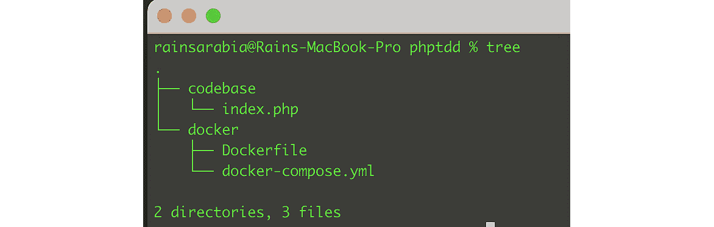
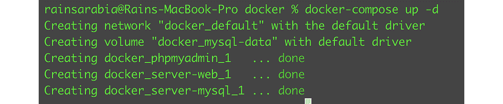
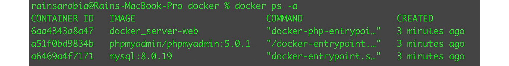
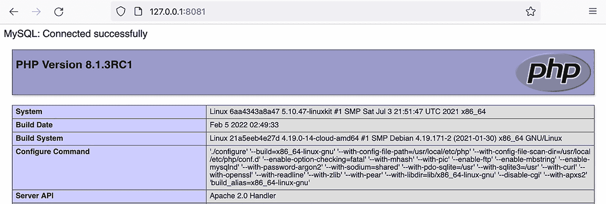
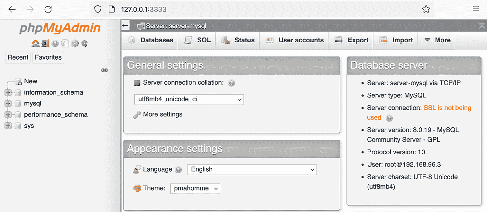

# 第三章：使用 Docker 容器设置我们的开发环境

“*在我的机器上它运行正常*”这句话你可能作为软件开发者已经听过了；你可能甚至自己也说过。我确信我也有过！公平地说，我的同事本·汉森，当时是我们的测试自动化工程师，也指出他也可以对我们开发者说，“*在我的机器上它不运行正常*”。作为一名开发者，我自己也经历过由于在不同环境中运行相同的 PHP 应用程序，服务器设置不一致而导致的许多令人沮丧的经历。在我的职业生涯中，我有时很难在我的本地开发机器上复制一些生产环境中的错误。我们会发现，我们正在开发的 PHP 应用程序将被部署在不同的操作系统上，安装了各种库，这些库与开发者的开发环境设置不同步。这是一场噩梦！

当我们开发 PHP 应用程序时，我们需要确保我们开发的程序在不同部署环境（如预发布或生产环境）中表现一致。此外，当一位新开发者加入您的团队时，如果他们能够轻松快速地在他们的开发机器上设置本地开发环境，那就太好了。**容器**可以帮助解决这些挑战。

在我们的示例项目中，我们需要一个开发环境来一致地运行我们的 PHP 应用程序，无论我们在哪里部署它。如果我们的 PHP 测试和应用程序在我们的本地机器上通过并正确运行，那么当我们部署它们时，它们也应该通过并正确运行。

我们将介绍容器概念，并定义它们是什么。我们将学习如何创建 Docker 镜像并运行 Docker 容器。Docker 容器将帮助我们轻松打包我们的应用程序，使其在其他服务器环境中更一致地运行。

在本章中，我们将定义并涵盖以下内容：

+   什么是容器？

+   设置我们的 PHP 开发容器

+   运行 Docker 容器

# 技术要求

本章要求您能够访问*Bash*。如果您使用的是 Mac 或 Linux 操作系统，您可以直接使用*终端*。如果您使用的是 Windows 操作系统，您将需要安装第三方 Bash 程序。

对于本章中定义的说明，您可以在*第三章* Git 仓库中找到的完整 Docker 设置进行实验，该仓库位于[`github.com/PacktPublishing/Test-Driven-Development-with-PHP-8/tree/main/Chapter%203`](https://github.com/PacktPublishing/Test-Driven-Development-with-PHP-8/tree/main/Chapter%203)。

## 快速设置

要使用 Docker 容器运行本章的完整开发设置，在 macOS 开发机器上，请遵循本章中的说明安装 Docker Desktop，然后只需从您的终端运行以下命令：

```php
curl -Lo phptdd.zip "https://github.com/PacktPublishing/Test-Driven-Development-with-PHP-8/tree/main/Chapter%203.zip" && unzip -o phptdd.zip && cd complete && ./demoSetup.sh
```

# 什么是容器？

容器是一种打包解决方案，它将包含应用程序运行正确所需的全部软件依赖项。不同的容器平台可供选择，但在这本书中我们将使用 Docker。我们将使用 Docker 为我们的示例项目构建和运行容器。

Docker 是一种开源的容器化解决方案，它将使我们能够打包我们的 PHP 解决方案，并在不同的开发机器和部署环境中运行，包括我们的 **持续集成 (CI) 解决方案**，这将在 *第九章* *持续集成* 中进一步讨论。

现在我们已经定义了容器是什么以及我们将为我们的项目使用的容器化解决方案，让我们开始设置我们的开发容器。

# 设置我们的 PHP 开发容器

我们需要一个 PHP 应用程序的开发环境。我们将把我们的开发环境结构分为两个主要部分：Docker 容器（服务器）和 PHP 应用程序。

`docker` 目录将包含以下内容：

+   `Dockerfile`

+   `docker-compose.yml`

+   服务器配置

`codebase` 目录将作为以下用途：

+   PHP 应用程序的根目录

+   composer 包的供应商目录

现在，让我们设置我们的 PHP 开发容器：

1.  在您的机器上创建以下目录结构：


图 3.1 – 基础树

1.  运行以下命令：

    ```php
    $ mkdir -p ~/phptdd/docker
    ```

    ```php
    $ mkdir -p ~/phptdd/codebase
    ```

1.  安装 **Docker Desktop**。在我们创建所需的 Docker 文件之前，我们需要下载并安装 Docker Desktop。

对于 **macOS** 用户，可以从 [`docs.docker.com/desktop/mac/install/`](https://docs.docker.com/desktop/mac/install/) 下载 Docker。

对于 **Windows** 用户，下载链接是 https://docs.docker.com/desktop/windows/install/。

一旦 Docker Desktop 已安装在您的 macOS 机器上，我们现在可以组织我们的开发目录。

1.  我们需要在 `phptdd/docker/` 目录内创建一个 `Dockerfile`。创建一个 `phptdd/docker/Dockerfile` 文件，如下所示：

    ```php
    FROM php:8.1.3RC1-apache-buster
    ```

    ```php
    RUN docker-php-ext-install mysqli pdo pdo_mysql
    ```

我们使用 `FROM` 关键字在第一行声明基本 Docker 镜像。每个 `Dockerfile` 都必须以这个关键字开始。第二行是运行在当前镜像之上的指令。由于我们还需要为我们的项目安装数据库，我们可以安装所需的 **MySQL** 扩展。

对于我们的示例项目，我们需要的不仅仅是 PHP：我们还需要数据库、Web 服务器和其他工具。因此，我们需要一种方式来运行和组织多个容器。让我们看看如何做到这一点。

## 创建多个容器

要运行多个容器，我们可以使用在安装 Docker Desktop 时预先安装的 Compose 工具。

创建一个 `phptdd/docker/docker-compose.yml` 文件，如下所示：

```php
version: "3.7"
services:
  # Web Server
  server-web:
    build:
      dockerfile: ./Dockerfile
      context: .
    restart: always
    volumes:
      - "../codebase/:/var/www/html/"
    ports:
      - "8081:80"
  # MySQL Database
  server-mysql:
    image: mysql:8.0.19
    restart: always
    environment:
      MYSQL_ROOT_PASSWORD: mypassword
    volumes:
      - mysql-data:/var/lib/mysql
  # Optional MySQL Management Tool
  phpmyadmin:
    image: phpmyadmin/phpmyadmin:5.0.1
    restart: always
    environment:
      PMA_HOST: server-mysql
      PMA_USER: root
      PMA_PASSWORD: mypassword
    ports:
      - "3333:80"
volumes:
  mysql-data:
```

在我们的 `docker-compose.yml` 文件中，我们声明并配置了三个主要容器，它们都可以通过不同的端口访问：

+   `server-web`

+   `server-mysql`

+   `app-phpmyadmin`

我们能够安装 Docker Desktop 并创建所需的 `Dockerfile` 和 `docker-compose.yml` 文件，其中包含构建我们容器的模板。让我们尝试运行所有容器，并确保它们配置正确且可以相互通信。

# 运行 Docker 容器

现在我们已经有了所需的两个基础 Docker 文件，让我们创建一个示例 PHP 程序，以确保我们的容器按预期工作。

创建一个 `phptdd/codebase/index.php` PHP 文件，如下所示：

```php
<?php
$dbHost         = "server-mysql";
$dbUsername     = "root";
$dbPassword     = "mypassword";
$dbName         = "mysql";
try {
    $conn = new PDO("mysql:host=$dbHost;dbname=$dbName", 
        $dbUsername, $dbPassword);
    $conn->setAttribute(PDO::ATTR_ERRMODE, PDO::
        ERRMODE_EXCEPTION);
    echo "MySQL: Connected successfully";
} catch(PDOException $e) {
    echo "Connection failed: " . $e->getMessage();
}
// Show PHP info:
phpinfo();
?>
```

在这个阶段，我们已经创建了三个文件，并具有以下目录结构：



图 3.2 – 基础文件

让我们逐层查看这个目录结构：

+   `Dockerfile`：声明我们使用哪个基础 Docker 镜像的文件，并添加了安装 MySQL 扩展的指令

+   `docker-compose.yml`：添加了配置的文件，我们希望运行的三个基础容器将作为我们的 **Linux Apache MySQL PHP** （**LAMP**）堆栈

+   `index.php`：我们创建的测试 PHP 文件，用于测试 PHP 应用程序是否能够连接到 MySQL 容器并显示一些关于 PHP 服务器的详细信息

在能够运行我们的容器之前，我们需要首先构建运行容器所需的主要镜像。

## 构建 Docker 镜像和运行容器

运行以下命令以下载基础镜像并构建我们的 Docker 镜像：

```php
$ cd ~/phptdd/docker
$ docker-compose build
```

第一次运行可能需要几分钟。该命令将从 Docker 仓库中拉取我们在 `Dockerfile` 内声明的基镜像，并执行我们在 `Dockerfile` 第二行添加的 `RUN` 命令。

构建完成后，我们可以使用 `docker-compose.yml` 文件运行我们配置的三个容器：

```php
$ docker-compose up -d
```

运行命令后，你应该会看到所有三个容器被创建：



图 3.3 – 创建的容器

现在，让我们看看容器是否正常运行；运行以下命令：

```php
$ docker ps -a
```

你应该会看到我们创建的三个容器，状态应指示它们正在运行：



图 3.4 – 容器正在运行

从图 3.4 的列表中我们可以看到容器正在运行。

现在，让我们尝试运行我们编写的 PHP 测试程序：打开一个网页浏览器并尝试访问 [`127.0.0.1:8081`](http://127.0.0.1:8081)。如果你检查 `docker-compose.yml` 文件，你会看到我们已声明希望将主机机的端口 `8081` 路由到容器的端口 `80`。你还可以使用 `docker ps -a` 命令查看运行容器的端口路由。

你应该会看到一个 `server-web` 容器连接到 `server-mysql` 容器：



图 3.5 – 测试脚本：成功的 PHP 到 MySQL 连接和 PHP 信息

我们还配置了第三个容器来为我们提供 `phpMyAdmin` 应用程序；这完全是可选的。使用您的网络浏览器，访问 `http://127.0.0.1:3333`：



图 3.6 – phpMyAdmin 屏幕

你现在应该能看到 **phpMyAdmin** 的主仪表板，默认数据库列在左侧列中。

目前看起来一切都很顺利。我们配置的三个容器正在正确运行，并且能够相互通信和链接。我们现在已经拥有了一个基本的 PHP 应用程序的开发环境。接下来，让我们尝试停止这些容器。

## 停止容器

有时候你需要停止容器，比如当你想要重新加载新的配置，或者只是想要停止不再需要的容器。

要停止正在运行的容器以及删除它们的配置，请运行以下命令：

```php
$ docker-compose down
```

现在，如果你尝试通过运行 `docker ps` 来检查容器的状态，你会发现我们的三个容器已经从列表中消失了。你也可以使用 `docker kill <container_name>` 来停止特定的容器。

# 摘要

在本章中，我们介绍了 Docker 并使用它来创建和运行容器。容器是打包应用程序的实例。虽然我们已经看到容器是打包和隔离的，但它们也可以相互通信。例如，我们的示例 PHP 程序正在 `server-web` 容器中运行，然后连接到运行我们的 MySQL 服务器的 `server-mysql` 容器。

我们已经看到了启动容器是多么简单。我们有两个正在运行的 PHP 容器（`server-web` 和 `app-phpmyadmin`）和一个数据库容器（`server-mysql`），如果需要的话，我们还可以运行更多的容器。我们将使用我们创建的基础容器来构建我们的 PHP 项目；我们将继续修改我们的容器，并在过程中安装更多的库和工具。

在下一章中，我们将开始构建我们的基础 PHP 应用程序。我们将尝试解释为什么我们最初选择使用 PHP 的功能和原因。我们将安装 **Laravel 框架**来简化编写解决方案的过程，这样我们就可以更多地关注 **测试驱动开发**（**TDD**）本身，而不是编写大量的引导代码。
