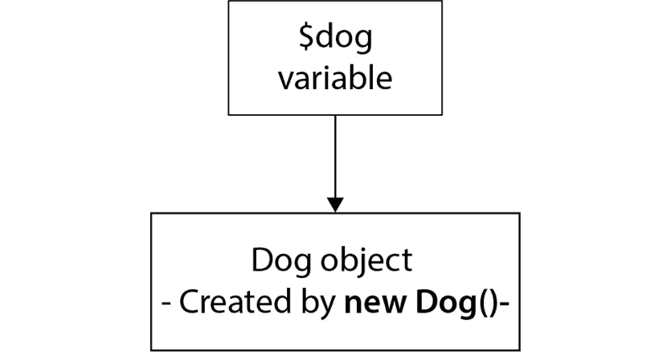
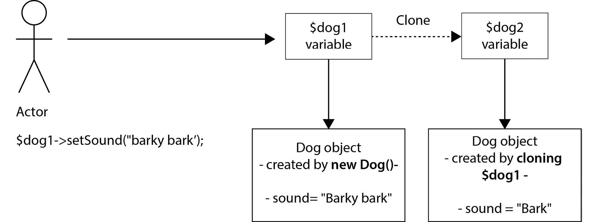
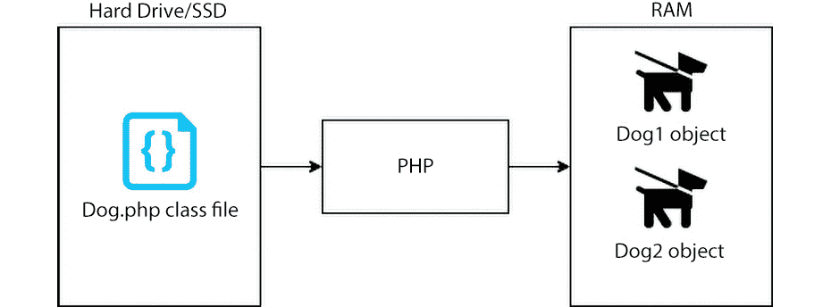
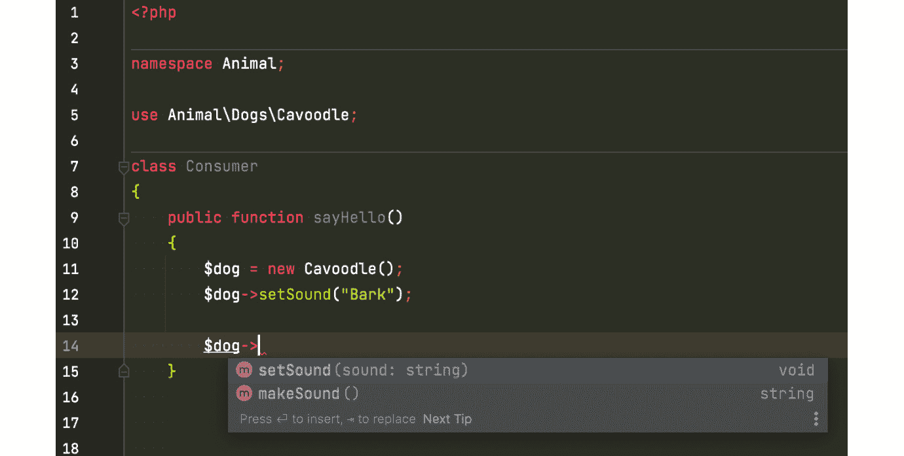
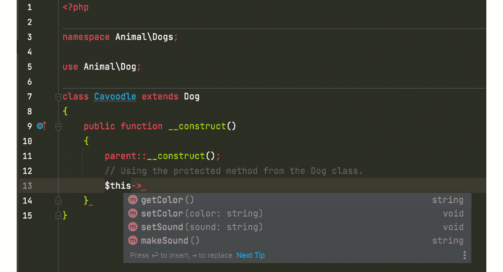

# 第四章：在 PHP 中使用面向对象编程

PHP 是一种自 PHP 5 以来就支持**面向对象编程**（**OOP**）功能的开源脚本编程语言。PHP 易于学习，非常灵活。难怪它如此普遍。网上有大量的开源 PHP 学习资料，以及开源库和框架。如果你计划构建一个 Web 应用程序，那么很可能会有一些可以下载的 PHP 库和框架，它们将基本满足你的需求。如果你需要 PHP 开发者来参与你的项目，你可能会很高兴地知道，实际上有很多 PHP 开发者。

作为一名 PHP 开发者，我参与了许多 PHP 项目，从小型 Web 应用程序到企业应用程序都有。我见过许多不同公司和团队开发的 PHP 应用程序。我亲眼所见并参与的一些应用程序是按照最佳实践和行业标准正确构建的，但也有一些是由胶带粘合在一起的意大利面式的混乱。尽管如此，有一点是共同的；软件写得是否好并不重要；成功的软件将需要更新。新的特性和错误修复将需要。软件越成功，用户使用软件的越多，提交的功能请求就越多，发现的错误就越多。这是一个循环，但一开始就有一个很好的问题。

没有人希望看到由新特性和错误修复引入的回归，但这种情况确实会发生。有时，如果没有适当的发展或发布流程，回归就会频繁发生。发布后可能会引入新的错误和问题，这非常令人沮丧。企业也会失去发布更多错误修复或新特性的信心。对于开发者和企业来说，发布代码应该是一种积极的体验，而不是焦虑的原因。

将 OOP 和**测试驱动开发**（**TDD**）结合使用，通过确保大多数函数和对象是可测试的、可维护的、可重用的和可模拟的，有助于提高代码质量。模拟将在*第八章*中更详细地讨论，即*使用 TDD 与 SOLID 原则*。

在本章中，我们将探讨 PHP 中面向对象编程的定义和意义。我们将介绍面向对象编程的四大支柱：抽象、封装、继承和多态。我们将尝试使用示例代码来解释面向对象的概念，这些概念将作为我们稍后为示例项目编写的测试驱动开发代码的基础。

在本章中，我们将介绍以下内容：

+   理解 PHP 中的面向对象编程

+   类与对象

+   面向对象编程中的抽象

+   面向对象编程中的封装

+   面向对象编程中的继承

+   面向对象编程中的多态

+   **PHP 标准** **建议**（**PSRs**）

# 技术要求

用户应至少具备 PHP 或其他面向对象编程语言（如 Java 或 C#）的基本知识。我在整本书中都在使用 PHPStorm **集成开发环境**（**IDE**），这可以在截图里看到。

# 在 PHP 中理解面向对象编程

我可以使用 PHP 进行测试驱动开发（TDD）吗？当然可以——而且得益于 PHP 的面向对象能力，它与 TDD 配合得很好。我们之前已经解释过，TDD 是一个过程；它不是你可以安装的软件。你可以安装或下载工具来实现 TDD，而且对于其他编程语言也有许多不同的工具可用。

自从 2000 年代初 PHP 5 发布以来，类和对象得到了支持，使得 OOP 可以在 PHP 中使用。如果读者对 OOP 有很好的理解并且参与过 PHP 面向对象编程项目，这将是一个优势；如果没有，我会尽我所能向您介绍 OOP，因为它是一种编写软件的有效且高效的方法。我们还将使用 OOP 在我们的示例项目中，因此我们需要确保读者理解 OOP。

## 面向对象编程（OOP）究竟是什么呢？

面向对象编程（OOP）是一种基于类和对象概念的编程风格。其目标之一是让软件开发者能够编写可重用和可扩展的代码。

面向对象编程（OOP）侧重于将行为、逻辑和属性打包成可重用的对象。这些对象是类的实例，而这些类是我们软件开发者必须编写的文件，用于包含逻辑、例程和属性。由于对象基于类，我们可以使用单个类创建许多对象的实例。我们还可以使用面向对象编程的继承特性来创建一个具有其父类能力的对象。在本章的后面部分，我们将讨论面向对象编程中类和对象之间的区别。

回到我还是初级开发者的时候，我的一个朋友，他是 JavaScript 开发者，曾经告诉我，他很难理解面向对象编程（OOP），因为他读过一些使用车辆和动物比喻的 OOP 解释。他说他不知道这些如何与他自己正在编写的实际软件相关联，所以为了我们年轻的自己，如果我有机会回到过去，我会尝试像从未使用过 OOP 一样向像我朋友和我这样的初级开发者解释 OOP。我意识到，至少对我来说，如果我理解了问题和解决方案的目的，我就能更容易地理解概念。

我看到许多开发者在这个概念上挣扎，并未能充分利用其惊人的力量。我在大学时使用 Java 和 C++学习 OOP，并在毕业后作为 C#开发者专业工作。当时，我认为 OOP 无处不在，是专业软件开发世界中编写代码的通常方式，但当我开始我的第一个专业 PHP 职位时，我在一个没有 OOP 代码的 PHP 应用程序上工作。使用 PHP，开发者可以创建一个 PHP 文件，并直接从 CLI 或网页浏览器中执行函数和代码。这太容易了！然而，这是一个滑梯。

我记得自己对自己说：“我讨厌 OOP，它太复杂了；为什么我要在 Java 和 C#中浪费时间学习 OOP，而只是为了在网页上返回文本就要写这么多代码？”果然，我最终写了很多文件，里面有很多数据库查询和很多交织在一起的业务逻辑。我基本上在一个文件中写了用户界面、业务逻辑和持久化代码。这听起来熟悉吗？如果你是那些可能从我十多年前继承下来的糟糕代码的人之一，我真诚地道歉。我用 OOP 和没有 OOP 在不同的语言中写了意大利面式的代码。OOP 并不是停止混乱的意大利面式代码的万能子弹，但 OOP 确实有帮助。它不是工具；而是你如何使用它。

我感到的兴奋并没有持续很长时间。当时作为一个初级 PHP 开发者，我写了如此多的 PHP 文件，里面充满了随机的函数。维护起来是一场噩梦，我甚至无法在其他地方重用我自己的代码！我告诉自己，如果我当时只使用了 OOP，至少可以轻松地借用或重用一些现有的代码，即使我有意大利面式的代码。现在，想象一下在一个团队中共同构建软件，你无法轻松地重用彼此的代码。我当时讨厌 PHP，但结果证明，我没有正确地使用 PHP。我不知道我可以用 PHP 来实现 OOP。我认为任何其他编程语言也是如此。语言的好坏并不重要；项目的成功取决于软件工程师、开发人员和架构师自己。你可以在任何语言中使用 OOP，仍然会产生意大利面式的代码。在这本书中，我们将使用 TDD 和软件开发最佳实践来帮助我们写出更好、更不混乱的代码。我们将讨论一些软件开发原则，这些原则将极大地帮助我们写出更好的代码，在*第八章*中，我们将讨论*使用 TDD 与 SOLID 原则*。

在真正理解面向对象编程（OOP）的真正好处之前，我花了一些时间。在网上阅读有关车辆和动物的 OOP 解释是有帮助的，但真正帮助我明白其中的奥妙的是在实际项目中工作，并体验不使用 OOP 的痛苦。

使用 OOP，开发者可以写出其他开发者（包括你自己）可以轻松借用或使用的代码。

在接下来的章节中，我们将介绍面向对象编程的基本概念 – 抽象、封装、继承和多态 – 但在那之前，我们需要开始定义类和对象是什么，以及它们的区别以及如何区分它们。

在以下示例中，我们不会使用 TDD。我们将只关注面向对象编程本身。我们将关注 PHP 面向对象编程的具体实现。

# 类与对象

PHP 类是一个包含代码的文件。你的类是一个实际存在于你的驱动器上的文件。如果你关闭计算机并重新启动它，类文件仍然在那里。它包含的代码是在执行期间创建对象的模板。类文件可以包含属性和行为。一旦类被实例化，属性将能够在内存中保存数据。行为将由方法或函数处理。你可以使用访问器和修改器方法来更改类的属性值。

Dog.php 类文件

```php
<?php
namespace Animal;
class Dog
{
    public function returnSound(): string
    {
        return "Bark";
    }
}
```

上述示例类是一个包含命名空间声明、类名和单个方法或函数 `returnSound()` 的 PHP 文件，该方法返回一个 `"Bark"` 字符串。

另一方面，对象是类文件的实例。对象在计算机的 RAM 中物理存在，RAM 是易失性内存。这意味着如果你关闭计算机或停止程序，你会丢失对象。只有当你运行程序时，对象才会被创建。

在 PHP 中，当你执行程序时，类文件将从你的硬盘加载到 PHP，以创建一个临时存在于你的 RAM 中的对象实例。类实际上是 PHP 在程序运行时创建对象的模板。

我们将使用一个消费者类来利用或消费 `Dog.php` 类，并使用一个变量来保存类的实例，即一个对象：

Display.php 类文件

```php
<?php
namespace Animal;
class Display
{
    public function outputSound()
    {
        $dog = new Dog();
        echo $dog->returnSound();
    }
}
```

`Display` 类是另一个类；你可以将其视为消费者类或示例程序的起点。在这个类中，我们有一个 `outputSound()` 方法，它回显对象 `returnSound()` 方法的值。在 `outputSound()` 方法内部，我们为 PHP 编写了使用 `new` 关键字创建 `Dog` 类实例的指令：



图 4.1 – 将 Dog 对象分配给 $dog 变量

当 PHP 执行 `outputSound()` 方法时，它将在您的计算机驱动器中创建一个基于存储在您的计算机驱动器中的 `Dog.php` 类文件的对象，然后它将在您的计算机内存中临时存储该实例或对象。`$dog` 变量将与 `Dog` 类实例或对象映射。每次您使用对象的方法或属性时，您实际上是在从您的计算机内存中访问对象，而不是从 `Dog.php` 类文件中。为了进一步理解这一点，我们需要讨论 PHP 中的 *引用*，这将在下一个子节中介绍。

现在，由于我们已经创建了一个新的 `Dog.php` 类实例并将其赋值给 `$dog` 变量，我们将能够访问 `Dog` 对象的方法或函数，或者属性，这取决于它们的 *可见性*。我们将在本章的 *面向对象编程中的封装* 部分讨论可见性。由于在我们的示例中，我们将 `Dog.php` 类的 `returnSound()` 方法定义为 `public`，我们现在可以通过以下方式从 `Display.php` 类的 `outputSound()` 方法访问此方法：`$dog->returnSound();`。

## PHP 中的引用和对象

那么，引用究竟是什么呢？好吧，在 PHP 中，它是一个别名或一种方式，允许一个或多个变量指向特定的内容。从之前的 `Dog` 对象示例中，我们已经创建了一个 `Dog.php` 类的实例并将其赋值给 `$dog` 变量。`$dog` 变量本身并不真正包含 `Dog` 对象或实例的内存地址；它仅仅包含一个标识符，以便它可以指向存储在内存中的 `Dog` 对象。这意味着您可以有指向同一对象的 `$dog1` 和 `$dog2` 变量。让我们修改 `Dog.php` 和 `Display.php` 类来演示这个概念。

我们将按如下方式修改 `Dog.php` 类：

```php
<?php
namespace Animal;
class Dog
{
    private string $sound;
    public function __construct()
    {
        $this->setSound("Bark");
    }
    public function returnSound(): string
    {
        return $this->getSound();
    }
    /**
     * @return string
     */
    public function getSound(): string
    {
        return $this->sound;
    }
    /**
     * @param string $sound
     */
    public function setSound(string $sound): void
    {
        $this->sound = $sound;
    }
}
```

我们将按如下方式修改 `Display.php` 类：

```php
<?php
namespace Animal;
class Display
{
    public function outputSound()
    {
        $dog1 = new Dog();
        $dog2 = $dog1;
        $dog1->setSound("Barky Bark");
        // Will return "Barky Bark" which was set to $dog1.
        echo $dog2->returnSound();
    }
}
```

我们已经修改了 `Dog.php` 类，以便我们可以在实例化后更改它返回的声音。在 `Display.php` 类中，您会注意到我们引入了一个新的变量 `$dog2`，并将其赋值给 `$dog1`。我们只有一个 `Dog` 对象的实例，而 `$dog1` 和 `$dog2` 变量具有相同的标识符，并且它们引用的是同一事物。以下是表示这个概念的图示：


图 4.2 – `$dog1` 的属性发生的变化也会影响到 `$dog2`

因此，如果我们运行 `$dog2->returnSound()`，即使在我们将 `$dog1` 赋值给 `$dog2` 之后修改了 `$sound` 属性，它也会返回我们在 `$dog1` 中设置的更新后的字符串。

好吧，如果您不希望 `$dog2` 受 `$dog1` 属性变化的影响，但仍然想创建该对象的副本或复制品，您可以使用 PHP 的 `clone` 关键字，如下所示：

Display.php 类

```php
<?php
namespace Animal;
class Display
{
    public function outputSound()
    {
        $dog1 = new Dog();
        $dog2 = clone $dog1;
        $dog1->setSound("Barky Bark");
        // Will return "Bark".
        echo $dog2->returnSound();
    }
}
```

这次，`$dog2` 将返回原始的 `Bark` 字符串值，这是由其构造函数分配给 `$dog1` 的 `$sound` 属性。以下是一个图表，供你参考以理解这一点：



图 4.3 – 克隆对象

由于在演员修改 `$dog1` 的 `$sound` 属性之前，`$dog2` 已经被克隆，所以 `$dog2` 将保留旧值。无论 `$dog1` 发生什么变化，都不会自动发生在 `$dog2` 上，因为它们不再引用内存中的同一对象：



图 4.4 – 类与对象

总结来说，PHP 类是一个包含 PHP 能够创建对象的模板的文件。当使用 `new` 关键字并执行时，PHP 会取用类文件，生成类文件的实例，并将其存储在计算机的内存中，这就是我们所说的对象。

现在我们已经澄清并解释了 PHP 中对象与类之间的区别，我们可以现在讨论面向对象的四个支柱，从抽象开始。

# 面向对象编程中的抽象

面向对象编程中的抽象是隐藏复杂性的概念，从应用程序、用户或开发者那里隐藏。你可以将一组复杂的代码或指令包装在一个函数中。该函数的名称应使用动词，这将使其更容易理解函数内部复杂指令的确切作用。

例如，你可以有一个名为 `computeTotal($a, $b, $c)` 的函数，它包含根据需求计算总和的逻辑或步骤。作为一个开发者，你只需使用 `computeTotal` 方法，无需考虑实际计算总和所涉及的复杂操作，但如果需要修复错误或理解发生了什么，那么你可以检查 `computeTotal` 函数内部的执行情况：

```php
public function computeTotal(int $a, int $b, int $c): int
{
    if ($c > 1) {
        $total = $a + $b;
    } else if ($c < 1) {
        $total = $a - $b;
    } else {
        $total = 0;
    }
    return $total;
}
```

使用这个概念有什么好处？使用前面的例子，开发者无需担心函数内部获取总和的确切步骤顺序。开发者只需要知道有一个可用的 `computeTotal` 函数可以用来，以及数百或数千个其他函数，每个函数内部都有复杂的步骤指令。开发者可以专注于解决方案，无需担心每个函数内部的细节。

抽象类是实现类抽象的一种方式，是一种不能实例化的类，需要至少声明一个抽象方法。抽象类旨在被其他相关类扩展：

```php
<?php
abstract class AbstractPrinter
{
    abstract protected function print(string $message): 
        bool;
}
class ConsolePrinter extends AbstractPrinter
{
    protected function print(string $message): bool
    {
        // TODO: Implement print() method.
    }
}
class PdfPrinter extends AbstractPrinter
{
    protected function print(string $message): bool
    {
        // TODO: Implement print() method.
    }
}
```

在 `AbstractPrinter` 中声明的 `abstract` 方法也必须在扩展此方法的类中存在。现在，每个扩展 `AbstractPrinter` 抽象类的类都可以有自己的 `print` 方法的特定操作。在抽象类中声明的 `abstract` 方法只能声明方法的可见性、参数和返回值。它不能有自己的实现。

# 面向对象的封装

封装是一个概念，其中访问和修改此数据的数据和方法被封装在一个单一的单位，如胶囊中。在 PHP 中，这个胶囊是对象或类。

胶囊或对象将能够使用可见性概念来保护其数据不被读取或操作。

## PHP 中的可见性

要能够在 PHP 中控制开发者可以访问或使用对象中的哪些数据或函数，可以在函数声明或属性名声明之前使用`public`、`protected`和`private`关键字：

+   `private` – 只有对象内部的代码可以访问此函数或属性

+   `protected` – 任何扩展此类的对象都将允许访问该函数或属性

+   `public` – 任何对象用户都可以访问属性或方法

那么，我们开发者能从这得到什么好处呢？我们将在稍后了解这一点。

让我们修改前面示例中的`Dog.php`类，如下所示：

```php
<?php
namespace Animal;
class Dog
{
    private string $sound;
    private string $color;
    public function __construct()
    {
        $this->setSound("Bark");
        $this->setColor("Black");
    }
    public function makeSound(): string
    {
        $prefix = "Hello ";
        $suffix = " World";
        return $prefix . $this->getSound() . $suffix;
    }
    /**
     * @return string
     */
    private function getSound(): string
    {
        return $this->sound;
    }
    /**
     * @param string $sound
     */
    public function setSound(string $sound): void
    {
        $this->sound = $sound . ", my color is: " . 
            $this->getColor();
    }
    /**
     * @return string
     */
    protected function getColor(): string
    {
        return $this->color;
    }
    /**
     * @param string $color
     */
    protected function setColor(string $color): void
    {
        $this->color = $color;
    }
}
```

创建一个`Cavoodle.php`类：

```php
<?php
namespace Animal\Dogs;
use Animal\Dog;
class Cavoodle extends Dog
{
    public function __construct()
    {
        parent::__construct();
        // Using the protected method from the Dog class.
        $this->setColor("Chocolate");
    }
}
```

按如下方式修改`Consumer.php`类：

```php
<?php
namespace Animal;
use Animal\Dogs\Cavoodle;
class Consumer
{
    public function sayHello()
    {
        $dog = new Dog();
        $dog->setSound("Wooooof!");
        // Will output Hello Wooooof!, my color is: Black
        $dog->makeSound();
    }
    public function sayHelloCavoodle()
    {
        $cavoodle = new Cavoodle();
        $cavoodle->setSound("Bark Bark!");
        // Will output Hello Bark Bark!!, my color is: 
            Chocolate
        $cavoodle->makeSound();
    }
}
```

在这个`Dog.php`示例类中，我们声明了以下内容：

+   私有：

    +   `$``sound`

    +   `$``color`

+   受保护的：

    +   `getColor()`

    +   `setColor()`

+   公共：

    +   `makeSound()`

    +   `setSound($sound)`

通过这样做，我们已经保护了`Dog`对象`$sound`和`$color`属性值不被对象消费者直接修改。只有`Dog`对象可以直接修改这些值。存储在`$sound`属性中的值可以通过使用`$dog->setSound($sound)`方法从对象消费者端进行修改，但无论对象消费者在`$dog->setSound($sound)`方法中设置什么，存储在`Dog`对象`$sound`属性中的数据都将始终附加`$color`属性的值。对象消费者无法做任何事情来改变这一点；只有对象本身可以改变其自身属性值。

以下是对`Consumer.php`类的截图，当我修改它时，我的 PHPStorm IDE 会自动建议`Cavoodle`对象可用的方法：



图 4.5 – Dog 可用的公共函数

你会注意到在`Consumer`类中，我们只有两个可用的函数。`setSound()`和`makeSound()`函数是我们声明为公开可见的函数。我们已经成功限制了或保护了`Cavoodle`（`Dog`类的一个实例）对象的其它函数和属性。

以下截图显示，当我们处于`Cavoodle.php`类内部时，我的 IDE 会通过使用`$``this`键自动建议`Cavoodle`类本身可用的方法：



图 4.6 – Cavoodle 本身可以访问比 Consumer 类更多的函数

在 `Cavoodle.php` 类内部，你会注意到这个 `Cavoodle` 对象可以访问 `getColor()` 和 `setColor()` 方法。为什么是这样？这是因为 `Cavoodle` 类扩展了 `Dog.php` 类，继承了 `Dog.php` 类的非私有方法——并且由于我们已将 `getColor` 和 `setColor` 函数声明为具有受保护的可见性，这些方法对 `Cavoodle` 类是可用的。

## 访问器和修改器

由于我们已经将 `$sound` 和 `$color` 属性设置为 `private`，我们如何让消费者访问这些属性？对于读取数据，我们可以编写名为访问器的函数，返回存储在属性中的数据。要更改属性的值，我们可以创建名为修改器的函数来修改属性中的数据。

要访问 `Dog.php` 类中的 `$sound` 和 `$color` 属性，我们需要以下 *访问器*：

+   `getSound`

+   `getColor`

要更改 `Dog.php` 类中 `$sound` 和 `$color` 属性的值，我们需要以下 *修改器*：

+   `setSound`

+   `setColor`

这些函数在 `Dog.php` 类中声明——因为这些是函数，你可以在将值存储到属性或返回给用户之前添加额外的验证或逻辑更改。

在编写属性或函数时，一个好的做法是将它们的可见性声明得尽可能严格。从 `private` 开始，然后如果你认为子对象需要访问函数或属性，则将可见性设置为 `protected`。这样，你最终会有更少的公开方法属性。

这将只允许你和其他使用你的类的开发者看到应该对消费者可用的函数。我曾编写并看到过包含许多方法的类，但后来发现它们并不是打算由除了主对象本身之外的其他对象使用。这也有助于通过防止消费者直接修改属性来保护对象的数据完整性。如果你需要让消费者操作对象属性中存储的数据，用户可以使用修改器方法。要让他们从属性中读取数据，他们可以使用访问器。

# 面向对象编程中的继承

面向对象编程中的继承是一个概念，其中一个对象可以获取另一个对象的方法和属性。

继承可以帮助开发者为非常相关的对象重用函数。你可能听说过 **不要重复自己** （**DRY**）原则；继承也有助于编写更少的代码和更少的重复，以帮助你重用代码。

`Cavoodle`和`Dog`这样的对象是相关的——我们知道`Cavoodle`是`Dog`的一种类型。`Dog`和`Cavoodle`可用的函数应该关注`Dog`和`Cavoodle`应该能够做什么。例如，如果您有一个`Dog`对象并且它有一个`computeTax`函数，那么这个函数与`Dog`对象无关，您可能做错了什么——它具有低内聚性。具有高内聚性意味着您的类专注于做它真正应该做的事情。通过具有高内聚性，更容易决定一个对象是否应该是一个可以继承的对象，就像`Dog`和`Cavoodle`对象一样。如果`Cavoodle`类扩展了`JetEngine`类，这就不合理了，但`Cavoodle`类扩展`Dog`类是完全合理的：

Cavoodle.php

```php
<?php
namespace Animal\Dogs;
use Animal\Dog;
class Cavoodle extends Dog
{
    public function __construct()
    {
        parent::__construct();
        // Using the protected method from the Dog class.
        $this->setColor("Chocolate");
    }
}
```

要在消费者类中使用`Cavoodle`类的方法，创建一个新的`Cavoodle`类实例：

```php
public function sayHelloCavoodle()
{
    $cavoodle = new Cavoodle();
    $cavoodle->setSound("Bark Bark!");
    // Will output Hello Bark Bark!!, my color is: 
           Chocolate
    $cavoodle->makeSound();
}
```

`Cavoodle`对象使用了`extends`关键字继承了`Dog`对象。这意味着`Dog`中的任何`public`或`protected`函数现在都对`Cavoodle`对象可用。您会注意到在`Cavoodle.php`类中没有声明`makeSound`函数，但我们仍然能够使用`$cavoodle->makeSound();`方法，仅仅是因为`Cavoodle`对象从`Dog`对象继承了`makeSound`函数。

# 面向对象中的多态

多态意味着许多形状或许多形式。多态是通过继承*PHP 抽象类*以及实现*PHP 接口*来实现的。

多态帮助您创建一个格式或标准，以编程方式解决特定问题，而不是仅仅关注解决方案的单个实现。

我们如何在 PHP 中应用这个功能以及使用这个功能我们能获得什么好处？让我们以下面的子节中的示例代码为例，从 PHP 抽象类开始。

## PHP 抽象类中的多态

在 PHP 中使用抽象类时，我们可以通过使用抽象函数来实现多态。以下是一个 PHP 抽象类的示例：

AbstractAnimal.php

```php
<?php
namespace Animals\Polymorphism\AbstractExample;
abstract class AbstractAnimal
{
    abstract public function makeSound();
}
```

每个 PHP 抽象类理想情况下都应该以`Abstract`前缀开始，后面跟着根据 PSR 标准建议的抽象类名称。PSR 标准将在本章后面的*PHP 标准建议（PSR）*部分进行讨论。

抽象类至少需要声明一个函数作为*抽象*。这可以通过在函数的访问修饰符或可见性声明之前添加`abstract`关键字来实现，例如`abstract public function makeSound()`。现在，我们可能会注意到抽象类中的`makeSound()`方法没有实际的动作或逻辑，正如我们之前解释的，我们不能实例化抽象类。我们需要子类来扩展抽象类，在那里我们可以声明子类要执行的具体动作或逻辑。

以下是一个子`Cat.php`类的示例：

Cat.php

```php
<?php
namespace Animals\Polymorphism\AbstractExample;
class Cat extends AbstractAnimal
{
    public function makeSound(): string
    {
        return "meow!";
    }
}
```

以下是一个子`Cow.php`类的示例：

Cow.php

```php
<?php
namespace Animals\Polymorphism\AbstractExample;
class Cow extends AbstractAnimal
{
    public function makeSound(): string
    {
        return "mooo!";
    }
}
```

这两个类都继承了`AbstractAnimal.php`类，由于我们已经将`makeSound()`函数声明为`abstract`方法，因此`Cat.php`和`Cow.php`类也必须具有这些相同的方法，但不需要`abstract`关键字。你会注意到`Cat`对象的`makeSound`函数返回一个`meow`字符串，而`Cow`对象类似的`makeSound`函数返回一个`moo`字符串。在这里，我们通过一个函数签名实现多态，并且该函数签名由子类独特地实现。

接下来，我们将探讨使用 PHP 接口实现多态性。

# PHP 接口的多态

PHP 接口是 PHP 抽象类的一个简化版本。接口不能像普通类那样有属性，它只能包含公开可见的函数。接口中的每个方法都必须由使用该接口的任何类实现，但不需要添加`abstract`关键字。因此，我们在向接口声明函数时必须非常小心。很容易最终得到一个包含太多函数的接口，这些函数对于每个实现类来说都没有意义。这就是*接口分离原则*发挥作用的地方，这将在*第八章*，*使用 SOLID 原则进行 TDD*中进一步讨论。

想象一下，你需要一个程序以不同的格式返回结果，并且你还希望能够隔离逻辑和依赖关系，以得出所需的结果。你可以使用接口来设置一个合约，该合约将由你的对象遵循。例如，有不同方式和格式可以返回输出，在以下示例中，我们将返回 XML 和 JSON。

我们将创建一个 PHP 接口，该接口将作为 JSON 和 XML 类都将实现的合约。该接口将有一个单一的通用打印函数，该函数接受一个字符串参数，并返回一个字符串：

PrinterInterface.php

```php
<?php
namespace Polymorphism\InterfaceExample;
interface PrinterInterface
{
    public function print(string $message): string;
}
```

然后，我们将创建`PrinterInterface`的第一个具体实现，它必须有一个具体的`print`函数实现，以返回一个 JSON 格式的字符串：

Json.php

```php
<?php
namespace Polymorphism\InterfaceExample;
class Json implements PrinterInterface
{
    public function print(string $message): string
    {
        return json_encode(['hello' => $message]);
    }
}
```

`PrinterInterface`的第二个具体实现是`Xml`类——它也必须包含一个`print`函数，该函数返回一个字符串，但这次字符串将被格式化为 XML：

Xml.php

```php
<?php
namespace Polymorphism\InterfaceExample;
class Xml implements PrinterInterface
{
    public function print(string $message): string
    {
        return "<message>Hello " . $message . "</message>";
    }
}
```

我们在`PrinterInterface`中声明了一个`public print(string $message): string`方法签名，并且由于`Xml.php`和`Json.php`类在类名声明后使用了`implements`关键字实现了`PrinterInterface`，因此现在`Xml.php`和`Json.php`都必须遵守这个契约。它们必须拥有`public print(string $message): string`函数。每个实现类都将有其自己独特的返回输出的方式。一个返回 XML，另一个返回 JSON——同一个方法，但不同的形式或形状。这就是使用 PHP 接口实现多态的方法。

然而，使用多态的优势在哪里呢？让我们以这个消费者类为例：

Display.php

```php
<?php
namespace Polymorphism\InterfaceExample;
class Display
{
    /**
     * @var PrinterInterface
     */
    private $printer;
    public function __construct(PrinterInterface $printer)
    {
        $this->setPrinter($printer);
    }
    /**
     * @param string $message
     * @return string
     */
    public function displayOutput(string $message): string
    {
        // Do some additional logic if needed:
        $printerOutput = $this->getPrinter()->print
            ($message);
        $displayOutput = "My Output is: " . $printerOutput;
        return $displayOutput;
    }
    /**
     * @return PrinterInterface
     */
    public function getPrinter(): PrinterInterface
    {
        return $this->printer;
    }
    /**
     * @param PrinterInterface $printer
     */
    public function setPrinter(PrinterInterface $printer): 
        void
    {
        $this->printer = $printer;
    }
}
```

在`Display.php`类中，我们有一个`displayOutput`方法，它使用必须实现`PrinterInterface`的对象。`displayOutput`方法从实现`PrinterInterface`的对象（我们不知道是哪个对象）获取结果，并将其作为后缀附加到一个字符串之前返回。

现在，这是重要的一点——`Display.php`类并不知道实现`PrinterInterface`的对象是如何生成实际的 XML 或 JSON 格式的。`Display.php`类并不关心也不担心这一点。我们已经将责任交给了实现`PrinterInterface`的对象。因此，我们不是使用一个包含所有返回 JSON 或 XML 输出逻辑的上帝类，从而造成一团糟，而是使用其他实现我们需要的接口的对象。`Display.php`类甚至不知道正在使用哪个类——它只知道它正在使用一个实现了`PrinterInterface`的对象。我们现在已经成功地将`Display.php`类从格式化 XML、JSON 或其他格式的任务中解耦到其他对象。

既然我们已经了解了 PHP 中 OOP 的基础知识，让我们来看看一些关于如何编写 PHP 代码的指南或标准。这些指南不是构建或运行 PHP 程序所必需的，但它们将帮助开发者编写更好、更易读、更易于共享的代码。以下关于如何编写 PHP 代码的标准在构建企业级应用程序时非常重要，尤其是当你需要与其他许多开发者一起开发代码时，你的代码可能会被期望使用多年。最终接管你项目的未来开发者应该能够轻松理解、阅读和重用你的代码。以下标准将帮助你和你团队实现这一点。

# PHP 标准建议（PSRs）

如前所述，有很多为 PHP 构建的开源库和框架。每个开发者都会有自己的代码编写风格偏好，每个框架或库都可以有自己的标准或做事方式。这可能会对 PHP 开发者造成问题，因为我们倾向于使用很多不同的库和框架。

例如，从一个框架切换到另一个框架，结果却需要使用不同类型的服务容器，这会迫使你改变组织应用程序依赖项的方式，因此引入了 PSR-11。服务容器是管理对象实例化及其依赖项的应用程序——在实现依赖注入或 DI 时非常方便，这在*第八章**，使用 SOLID 原则进行 TDD*中有所讨论。这是为什么遵循某些特定指南或标准很重要，尽管不是必需的，以及 PSR 的作用所在。

## 什么是 PSR？

PSR 由**PHP 框架互操作性小组**（**PHP-FIG**）推荐。他们是一群非常友好的开发者，帮助我们使 PHP 编码生活更加有序。你可以在[`www.php-fig.org/`](https://www.php-fig.org/)了解更多关于 PHP-FIG 的信息。

以下是目前接受的 PSR：

+   PSR-1: 基本编码标准

+   PSR-3: 记录器接口

+   PSR-4: 自动加载标准

+   PSR-6: 缓存接口

+   PSR-7: HTTP 消息接口

+   PSR-11: 容器接口

+   PSR-12: 扩展编码风格指南（已弃用 PSR-2）

+   PSR-13: 超媒体链接

+   PSR-14: 事件调度器

+   PSR-15: HTTP 处理器

+   PSR-16: 简单缓存

+   PSR-17: HTTP 工厂

+   PSR18: HTTP 客户端

你可以在[`www.php-fig.org/psr/`](https://www.php-fig.org/psr/)找到所有目前接受的 PSR。最初，需要熟悉的最重要 PSR 是 PSR-1、PSR-12 和 PSR-4。这有助于我们以更一致的风格编写代码，尤其是在从一个框架切换到另一个框架时。我曾经有一个“最喜欢的”PHP MVC 框架，认为我会一直使用这个框架直到我变老——就像往常一样，我错了。我最终使用了这么多不同的框架，以至于我不再关心我使用的是哪个框架。现在，我对每个具体的工作都有“最喜欢的”。

PSR 只是“建议”。它们不像需要遵循的实际法律，但如果你认真对待编写 PHP 和提升你自己的代码质量，那么我强烈建议你遵循它们。很多人已经体验过不遵循标准的痛苦。我曾经自己编写了一个依赖注入容器，结果导致我们团队的其他开发者后来在使用它时感到困惑。我只是以错误的方式重新发明了轮子。我多么希望有一个我可以遵循的标准啊！哦，对了，现在有 PSR-11 了。

# 摘要

在本章中，我们定义了什么是面向对象编程（OOP），以及为什么我们要利用它。然后，我们明确地定义了 PHP 中的类和对象。然后，我们针对面向对象编程的四个支柱（抽象、封装、继承和多态）中的每一个都进行了示例讲解。我们学习了抽象、封装、继承和多态是什么，以及它们在 PHP 中的工作原理。我们还简要地介绍了 PSR，因为我们不希望只是继续发明标准并开始编写代码——我们希望编写易于理解和维护的干净 PHP 代码，尤其是在企业环境中，您可能会与许多其他开发者一起工作，并且您的代码将需要在未来多年内非常易于阅读和维护。

本章应该已经为您准备好开始编写实际的面向对象 PHP 代码——在我们的 TDD 示例项目中，我们将利用 PHP 的面向对象功能。

在下一章中，我们将讨论单元测试。我们将定义什么是单元测试，以及单元测试在 TDD 中的应用。我们还将介绍不同类型的自动化测试。在了解单元测试的定义后，我们将开始编写我们的第一个单元测试，并开始执行这些单元测试。

# 第二部分 - 在 PHP 项目中实现测试驱动开发

在本书的这一部分，您将获得利用测试驱动开发、行为开发和自动化测试构建 PHP 应用程序所需的知识。

本节包括以下章节：

+   *第五章*, *单元测试*

+   *第六章*, *应用行为驱动开发*

+   *第七章*, *使用 BDD 和 TDD 构建解决方案代码*

+   *第八章*, *使用 SOLID 原则进行 TDD*
