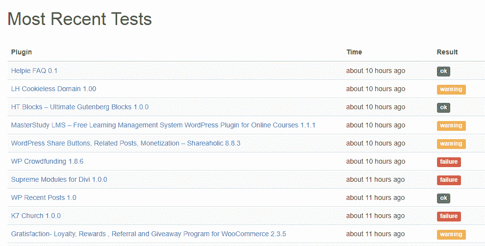
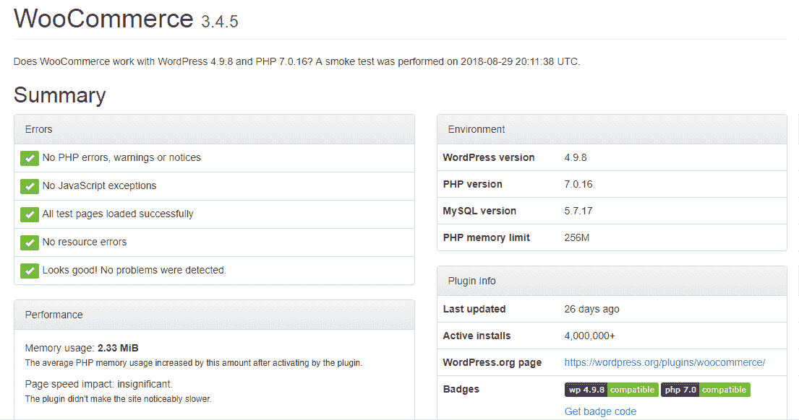
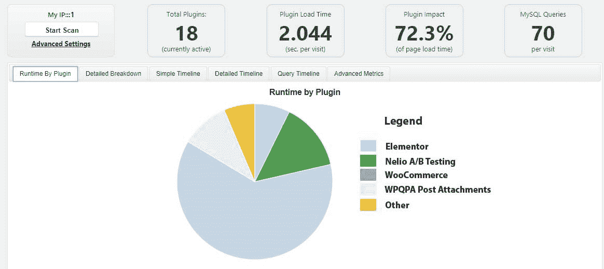
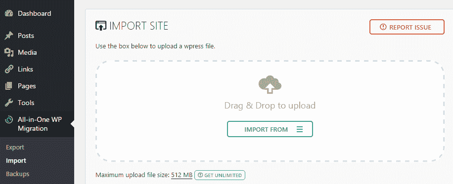

# 第九章：提升安全性、性能和维护

到目前为止，我们探讨了使用现有功能以及自定义功能开发 WordPress 站点。作为开发者，我们可以使用最新的趋势技术、现代开发技术，并构建具有惊人界面的站点。然而，如可利用的代码、性能不佳、维护限制和迁移困难等原因可能会破坏具有所有功能和技术的站点。非功能性方面，如安全性、性能、代码质量和维护，在幕后起着重要作用。因此，了解使用现有工具和服务来处理这些开发领域是非常重要的。

我们从理解测试的重要性开始本章。我们将讨论不同类型的测试，包括单元测试、代码质量和性能，以及使用必要的工具。然后，我们将探讨保护您的 WordPress 站点的技术。接下来，我们将查看使用必要工具将站点从测试服务器迁移到实时服务器的流程。最后，我们将学习维护站点所需的各个方面。

在本章中，我们将涵盖以下主题：

+   测试简介

+   单元和集成测试

+   代码质量和性能测试

+   保护 WordPress 站点

+   迁移 WordPress 站点

+   维护 WordPress 站点

到本章结束时，您应该能够构建安全且易于维护的站点，同时优化功能性能。

# 测试简介

测试网站和代码的功能过程对于构建成功的网站或应用程序至关重要。这个过程使我们能够在将网站发布到实时环境之前检测到任何缺陷。在 Web 开发中使用了多种类型的测试，其中一些测试与其他测试相比起着非常重要的作用。我们可以使用这些测试类型测试 WordPress 站点的功能和非功能性方面。在本节中，我们将简要介绍最重要的功能性和非功能性测试类型。

# 单元和集成测试

单元测试用于测试每个小组件，使其独立于其他组件，而集成测试用于测试应用程序与所有模块的组合。这两个测试都属于功能性类别，因为我们正在检查代码的功能和逻辑。与其他流行的框架相比，WordPress 代码不是最容易测试的。然而，我们可以使用**PHPUnit**对 WordPress 中的主题以及插件进行测试。安装和实现 PHPUnit 测试用例超出了本章的范围。您可以在[`make.wordpress.org/core/handbook/automated-testing/`](http://make.wordpress.org/core/handbook/automated-testing/)找到使用 PHPUnit 的指南。

WordPress 提供了一套用于测试主要功能的测试用例。许多开发者对现有的测试用例了解有限，因为它们不在核心中可用。你可以在[`unit-tests.svn.wordpress.org/trunk/tests/`](http://unit-tests.svn.wordpress.org/trunk/tests/)访问完整的测试用例列表。确保通过查看现有的测试用例来获取有关测试 WordPress 的知识。然后，你可以为你的插件和主题编写测试用例，用于单元测试目的。

# 代码质量测试

代码质量测试属于非功能性类别。这是测试最重要的方面之一，因为最终用户并不知道代码的质量。因此，你可以很容易地使用低质量代码的插件来构建网站。然而，在后期阶段，当你使用不同版本的 WordPress 或使用与你的代码冲突的插件时，这将会成为问题。

在 WordPress 网站上，我们可以构建自己的插件，也可以使用现有的插件。我们可以通过审查代码并修复代码质量问题来测试我们的解决方案。然而，当使用具有数千行代码的现有插件时，这可能并不实用。因此，我们需要一个允许我们自动测试代码并提供包含可能问题的报告的解决方案。不幸的是，目录中没有更新插件允许我们检查其他插件的代码。所以，自动化代码测试过程的唯一方法是通过使用第三方服务来检查代码并提供报告。

不幸的是，用于测试插件代码的服务也不多。有一个名为**PluginTests**的服务，位于[`plugintests.com`](https://plugintests.com)，用于测试 WordPress 插件的编码错误。然而，它仅限于 WordPress 插件目录中的插件。因此，你将无法使用此服务测试自定义插件或付费插件。在开发过程中，我们使用来自 WordPress 插件存储库的许多插件。此外，只要源代码是开放的，我们还可以将自定义插件添加到存储库中。因此，我们将研究如何使用此服务快速测试存储库中的插件并查找错误，在决定使用它们之前。

# 使用 PluginTests 服务

一旦你访问了[`plugintests.com`](https://plugintests.com)，你将获得一个搜索部分来检查存储库中的任何插件。你还会看到两个其他部分，列出流行的插件和最近测试的插件。如果期望的插件在这些列表中，你只需点击即可立即获得该插件的报告。让我们考虑以下最近测试的插件的截图：

我们在列表中可以看到插件名称、最后一次测试的时间和结果。你可以看到不同结果的可用性，例如**ok**、**warning**和**failure**。**ok**状态表示插件测试成功，没有问题。**warning**和**failure**状态表示插件代码存在问题。通常，我们会得到带有**warning**状态的轻微 JavaScript 或 PHP 错误。然而，**failure**状态意味着服务无法激活插件或插件代码中存在致命错误。因此，我们可以通过查看列表中的状态来简要了解插件的质量。

当插件未列在热门或最新部分时，你可以使用名称或短码搜索插件，并点击搜索按钮来加载结果。以下屏幕显示了热门 WooCommerce 插件生成的结果：

这些不同的部分意味着：

+   **错误**：本节充满了绿色的勾选标记，意味着插件没有可识别的编码错误。

+   **环境**：本节显示了用于测试的 WordPress、PHP 和 MySQL 版本，以及服务器的内存限制。

+   **性能**：本节简要总结了使用的资源以及插件是否对性能有任何影响。正如你所见，WooCommerce 使用的内存非常有限，影响微乎其微，这意味着我们可以使用该插件而不必过于担心性能。

+   **插件信息**：本节显示了插件信息，例如最后更新日期、活跃安装和来自[thewordpress.org](http://thewordpress.org)插件页面的 URL。这些徽章直接给出了与最新 WordPress 和 PHP 版本兼容性的直观想法。WooCommerce 与所有最新版本兼容。当存在不兼容性时，你会看到带有红色徽章的插件，特别是与 PHP 7 的不兼容性。

在这些部分之后，你将看到插件的一个列表测试屏幕，包括 HTTP 状态、加载时间、内存使用、JavaScript 和 PHP 错误。这些屏幕将帮助你识别单个功能中的错误。PHP 错误日志位于此报告的底部。你可以检查错误日志并修复影响网站功能的任何编码问题，或者决定不使用具有大量错误的第三方插件。

除了这些功能之外，我们还可以获得有关插件的有用信息，如下所示：

+   **角色和权限**：了解第三方插件创建的角色和权限很重要，因为这些权限可能与某些其他第三方插件不兼容。

+   **小工具和自定义文章类型**：此外，你还将了解通过插件注册的自定义文章类型和小工具。

+   **自定义表格**：这也很重要，因为我们需要了解第三方插件如何以及在哪里存储数据。此外，了解自定义表格的使用对于迁移需要备份的网站也很重要。

+   **资源使用**：本节显示了插件激活和未激活时常见 WordPress 管理界面和前端屏幕的资源使用情况。因此，您可以决定哪些区域最易受插件使用的影响。

总体而言，这是一个跟踪插件中编码错误以及了解每个插件如何影响您的数据库和网站功能的优秀服务。

# 性能测试

在过去，我们拥有缓慢的互联网连接，用户愿意等待结果。如今，我们有了超高速的互联网连接和超忙碌的日程安排。因此，当使用网站或应用程序时，用户期望即时结果。即使是几秒钟的延迟也可能导致用户转向其他网站。因此，性能已成为网站开发中的一个非常重要的因素。因此，我们需要考虑所有可能提高应用程序性能的行动。

通常，提高性能需要我们减少加载或执行网站功能所需的时间，同时减少请求使用的带宽。因此，我们希望网站尽可能快地提供结果，同时使用最少的数据量，尤其是对于基于移动端的用户。

让我们找出提高 WordPress 网站性能的可能方法：

+   **缓存应用程序数据**：缓存允许我们在不连接到数据库或执行复杂且耗时的逻辑的情况下向用户提供网站页面。它主要适用于不经常更改的网站。

+   **压缩和最小化文件**：通常，响应中发送的数据量会影响加载或执行时间。随着数据量的减少，应用程序可以更快地提供结果。压缩和最小化 CSS、JavaScript 和图像等文件可以显著减少响应的大小。您可以在应用程序中找到许多用于压缩和最小化文件的插件。

+   **从快速 CDN 加载第三方文件**：通常，我们在开发应用程序时至少使用几个开源库。jQuery 是这类库中最常见的一个。我们将在 WordPress 文件中加载 jQuery 以保持一致性并防止重复。然而，通过**内容分发网络**（**CDN**）加载此类文件可以提高这些文件的加载时间。

+   **移除低质量插件**：我们在网站开发中倾向于使用许多插件，有时由于时间限制，我们无法检查我们使用的每个插件的代码质量。因此，一些代码质量低或实现不当的插件可能会在我们的网站上造成严重的性能问题。因此，我们需要检查每个插件对网站性能的影响，并用替代品替换低质量插件。

+   **限制数据库查询数量**：我们在网络开发中使用了众多插件，每个插件都会使用大量的数据库查询。在大多数情况下，这些查询可能会在不为我们所知的情况下减慢应用程序的速度。此外，还可能有许多可以转换为单个查询的重复查询。因此，检查应用程序的数据库查询使用情况并将其尽可能限制在最低限度是很重要的。

+   **优化现有查询**：有时，当这些功能可以通过优化的 WordPress 函数实现时，开发者倾向于使用自己的查询。此外，由于缺乏知识，开发者可能会给查询添加不必要的复杂性。因此，识别对性能影响最大的数据库查询并对其进行优化是很重要的。

这些是影响网站性能的一些主要标准。还有许多其他这样的标准可以用来提高网站的性能。我们使用现有的插件/服务来衡量开发中的性能并确定可能的改进。WordPress 插件目录中有许多现有的插件可以用来衡量性能。我们将查看其中之一，因为我们已经在第一章，*WordPress 开发简介*中设置开发环境时查看了一些插件。

# P3 - 插件性能分析插件

尽管这个插件已经有一段时间没有更新了，但它仍然是检查单个插件性能的流行解决方案。我们可以用它来测量任何给定页面中每个激活的插件的影响。您可以从[`wordpress.org/plugins/p3-profiler`](https://wordpress.org/plugins/p3-profiler)下载并安装此插件。一旦插件被激活，您可以在工具菜单中点击 P3 插件分析器菜单项来加载扫描功能。然后，您可以点击开始扫描按钮，您将看到一个类似于以下屏幕截图的界面：

我们可以使用自动扫描或手动扫描选项来开始扫描网站。自动扫描选项会随机扫描您网站的不同内容并生成报告。另一方面，手动扫描允许我们通过点击网站的链接来仅访问我们偏好的内容。一旦生成结果，您将看到一个类似于以下屏幕的界面，其中包含各种详细信息：

我们可以在可用的标签页中看到插件加载时间、插件影响以及每次访问的 MySQL 查询量，并伴随着各种图表。这使我们能够直接看到影响性能最大的插件。在这种情况下，WooCommerce 插件的影响最大。之前，我们使用了 PluginTest 服务，并确定了 WooCommerce 的资源使用量微不足道。因此，我们可以考虑这两个结果，并得出结论，这个网站没有使用影响性能的插件，因为 WooCommerce 是影响最大的插件。如果其他插件有更大的影响，我们可以查看代码并使用其他工具来识别插件中是否存在对性能产生重大影响的重大问题。在完成此类验证后，我们可以保留插件或用替代插件替换它们，以减少插件对我们网站的影响。

# 保护 WordPress 网站

在使用 WordPress 开发网站或应用程序时，网站的安全性是主要关注点之一。开源代码和保持向后兼容性的旧编码技术是这些安全担忧的两个原因。然而，主要威胁来自于第三方插件和主题的使用，因为在很多情况下，对这些插件的质量没有保证。因此，尽可能确保 WordPress 网站的安全，以防止通过插件、主题或已知的网络安全问题进行攻击。

WordPress 编码手册提供了一个名为**强化 WordPress**的独立部分，用于定义必要的安全约束。您可以在[`codex.wordpress.org/Hardening_WordPress`](http://codex.wordpress.org/Hardening_WordPress)上阅读此安全指南。让我们找出 WordPress 漏洞的常见原因和基本预防措施：

+   **管理员用户名**：这是 WordPress 网站漏洞的最基本和最根本的原因之一。许多新手客户和开发者将**admin**作为网站管理员的用户名。因此，黑客攻击的过程变得简单，攻击者只需要找到密码。所以，必须将其更改为一个包含字母、数字，甚至可能包含一些字符的高级用户名。

+   **WordPress 核心更新**：由于它是开源的，社区非常大，因此每个 WordPress 发布都存在很大可能性有人发现一个错误，或者利用它来攻击现有的 WordPress 网站。然而，这些问题被非常快速地识别出来，并立即发布更新版本以防止问题。许多 WordPress 网站由没有开发者支持的普通管理员维护。因此，这些管理员没有更新 WordPress 的知识，或者他们害怕更新会破坏网站。攻击者可以轻易利用旧 WordPress 版本中的问题并加以利用。

+   **插件和主题更新**：这比 WordPress 更新更成问题。许多 WordPress 网站是由第三方一次性开发者完成的。因此，插件或主题的质量是可疑的，因为它们只关注在估算的成本内完成功能。所以，有很多插件和主题存在可利用的代码，其中许多甚至没有积极维护。因此，我们不能期望每次都有一个新版本来修复错误。此外，这些网站使用数十个 WordPress 插件开发，因此许多管理员不倾向于手动更新每个插件的版本。因此，这些插件和主题的过时版本可能造成重大的安全威胁。作为解决方案，您可以通过使用`auto_update_plugin`和`auto_update_theme`过滤器来启用基于 WordPress.org 的插件和主题的自动更新，并将值返回为`__return_true`。然而，某些插件或主题的更新可能会在其他插件中引起冲突。因此，在使用自动更新时，您需要密切关注网站的功能。

+   **配置文件位置**：默认情况下，配置文件位于 WordPress 安装的根目录中，并包含最重要的数据库登录详细信息。因此，攻击者知道文件位置，这更容易。因此，我们需要通过将文件位置更改为 WordPress 网站中的私有目录来保护此文件。

+   **用户角色和权限**：有五个内置的用户角色，具有不同的能力。在大多数网站上，有两人或更多人编辑内容和管理网站。因此，通过使用用户角色和能力仅给予这些用户必要的功能，同时防止访问 WordPress 网站的重要部分，这是非常重要的。

+   **登录表单安全**：默认的 WordPress 登录功能是安全的。然而，攻击者可能会使用工具猜测密码并获取对网站的访问权限。因此，我们需要在 WordPress 登录上实施额外的安全措施。我们可以通过实施限制失败的登录尝试、使用双因素认证、限制到某些 IP 地址等功能来保护登录。我们可以轻松地找到现有的插件来实现这些功能。

+   **后端文件编辑**：如果攻击者以某种方式获得了对网站的访问权限，他可以使用主题或插件编辑器来修改文件，添加恶意代码，或者通过删除数据和文件来完全破坏网站。因此，我们需要在配置文件中使用`define( 'DISALLOW_FILE_EDIT', true )`来移除所有用户的文件编辑能力，或者通过自定义代码有条件地为某些用户使用它。

+   **密码复杂性**：这是任何网站的基本关注点之一，不仅限于 WordPress。大多数管理员倾向于使用易于记忆的简单密码，这使得攻击者可以猜出它们。因此，密码需要足够长，以便网站能够防止攻击。

这些只是保护 WordPress 网站的一些基本预防措施。对于具有敏感数据和功能性的网站，我们需要使用高级安全功能，以及这些功能。除非你的意图是构建一个安全插件，否则不可能在开发中使用这些高级安全功能。因此，我们必须使用一个或多个顶级安全插件或服务来保护网站。以下是在 WordPress 插件目录中提供的最受欢迎的安全插件列表：

+   **iThemes Security**: [`wordpress.org/plugins/better-wp-security/`](http://wordpress.org/plugins/better-wp-security/)

+   **BulletProof Security**: [`wordpress.org/plugins/bulletproof-security/`](http://wordpress.org/plugins/bulletproof-security/)

+   **All In One WP Security & Firewall** : [`wordpress.org/plugins/all-in-one-wp-security-and-firewall/`](https://wordpress.org/plugins/all-in-one-wp-security-and-firewall/)

我们可以根据特定网站所需的网络安全功能选择这些插件之一。使用多个安全插件提供不同的安全功能是可能的。然而，它们之间可能存在冲突的风险，因此选择一个高质量的插件是理想的。

# WordPress 网站迁移

通常，我们在迁移到实际服务器之前在预发布服务器上开发网站。在大多数情况下，手动迁移网站的过程并不实用，因为我们必须手动备份数据库、文件、上传的媒体，并通过 FTP 上传到另一个服务器。因此，我们需要使用一个工具，允许我们通过平滑迁移自动化这个过程。有一些插件允许你分别备份数据库、文件和媒体，然后手动导入到实际服务器。

我们将查看一个提供所有这些功能的同一插件，使迁移变得超级简单。你可以找到一个名为 All-in-One WP Migration 的插件。这个插件可以在[`wordpress.org/plugins/all-in-one-wp-migration/`](https://wordpress.org/plugins/all-in-one-wp-migration/)找到。一旦激活，你可以在左侧菜单的 All-In-One WP Migration 菜单项中点击导出项目。你将看到一个类似于以下屏幕的界面：

导出功能从数据库替换功能开始。我们可以使用这个功能在数据库中查找并替换任何内容。这对于将自定义数据的 URL 更改为与实际网站 URL 匹配非常有用。接下来，我们可以从“导出到”设置中选择文件选项，插件将生成一个以`wpress`为扩展名的单个文件作为网站的备份。我们可以将备份下载到本地机器。

现在，我们必须前往实际网站并安装相同的插件。这次，我们必须使用导入部分，如下面的截图所示：

我们可以点击“从导入”按钮，并添加上一节中生成的导出 `wpress` 文件。然后，插件将在几分钟内迁移整个网站，使其成为一个超级简单的解决方案。与其他框架不同，我们可以在几分钟内完全迁移一个 WordPress 网站。

导出的 `wpress` 文件存储在您的服务器 `/wpcontent/ai1wm-backups` 文件夹中。即使对于基本网站，这些文件也可能非常大。因此，您必须确保删除不必要的备份，以防止占用大量服务器空间。

我们可以在插件的“备份”菜单中找到所有已导出和可用的备份文件。因此，我们可以通过单次点击轻松地将网站恢复到之前的状态。这是目前最好的网站迁移插件之一。您还可以考虑以下插件作为网站迁移的替代方案：

+   **Duplicator**：[`wordpress.org/plugins/duplicator/`](https://wordpress.org/plugins/duplicator/)

+   **WP Staging—DB & File Duplicator & Migration**：[`wordpress.org/plugins/wp-staging/`](https://wordpress.org/plugins/wp-staging/)

+   **XCloner**：备份和恢复—[`wordpress.org/plugins/xcloner-backup-and-restore/`](https://wordpress.org/plugins/xcloner-backup-and-restore/)

这些插件中的每一个都提供了不同的迁移功能，包括导出到 Google Drive 和其他第三方服务。因此，您将不得不尝试这些插件，并选择迁移网站最简单的插件，同时确保它与您的托管提供商兼容。

# 维护 WordPress 网站

维护网站的过程是 WordPress 开发中的另一个问题领域。许多网站是由没有开发者的非技术客户构建的，因此他们不了解维护网站的常规任务。一旦出现问题，这些客户就会寻找开发者来修复，而没有必要的流程和资源。因此，作为开发者，保持网站可维护性并将维护流程的知识传授给客户非常重要，以防你不再负责该网站。在本节中，我们将探讨维护 WordPress 网站的主要任务以及如何实施这些任务：

# 备份文件和数据库

这是在维护中必须完成的任务之一，许多非技术性的网站所有者都将其排除在外。WordPress 控制着超过 25% 的网络，因此针对 WordPress 网站的攻击数量同样很高。因此，我们需要定期备份文件和数据库，以便在类似情况下使用。不幸的是，许多网站所有者没有适当的备份流程，其中一些人认为这是由托管服务器自动完成的。

有一些托管提供商和功能可以从服务器端自动化备份流程。然而，最好使用手动流程或现有插件来拥有我们自己的备份。有许多插件允许我们安排网站的备份，如下所示：

+   `UpdraftPlus`: 这是最受欢迎的备份插件之一，具有广泛的文件和数据库备份以及恢复功能。您可以在[`wordpress.org/plugins/updraftplus/`](https://wordpress.org/plugins/updraftplus/)找到所有功能。

+   `BackUpWordPress`: 允许您为文件和数据库安排备份。您可以在[`wordpress.org/plugins/backupwordpress/`](https://wordpress.org/plugins/backupwordpress/)找到所有功能。

我们已经讨论了使用**All-In-One WP Migration**插件迁移 WordPress 站点的用法。我们还可以使用此类插件作为同一站点的备份和恢复机制。因此，使用这些备份插件并安排您站点的备份是必须的。

# 更新 WordPress 插件和主题

在前面的章节中，我们已经讨论了更新 WordPress 核心、插件和主题以提升网站安全性的必要性。此外，这也是维护工作的重要组成部分，因为一些插件和主题可能无法与较旧或较新的 WordPress 版本兼容。因此，您需要跟踪插件和主题的更新，以及每个版本中可能的错误修复。否则，您将不得不使用自定义代码来自动化更新过程，或者使用像**自动插件更新**（[`wordpress.org/plugins/automatic-plugin-updates/`](https://wordpress.org/plugins/automatic-plugin-updates/))这样的插件来仅对某些插件进行自动化更新。

# 优化数据库表

这是在维护工作中许多网站所有者没有考虑到的另一个方面。我们在 WordPress 站点中使用了许多具有不同数据需求的插件。许多这些插件在现有的数据库表中工作，因此很难追踪哪个插件负责核心表中的某些数据。一些这些插件提供了高质量的停用或删除过程，从数据库中删除所有与插件相关的数据。然而，许多插件没有这样的过程，即使删除了插件，我们仍然可以在数据库中找到许多未使用的数据。此外，WordPress 核心功能，如修订、瞬态、缓存等，都会在核心表中加载大量不必要的数据。

因此，我们需要定期通过删除这些不必要的数据来优化数据库。第一步是仅选择在卸载时删除其数据的插件。然后，我们可以选择一个数据库优化插件，如下所示：

+   **WP-Optimize**: [`wordpress.org/plugins/wp-optimize/`](https://wordpress.org/plugins/wp-optimize/)

+   **WP-Sweep**: [`wordpress.org/plugins/wp-sweep/`](https://wordpress.org/plugins/wp-sweep/)

+   **高级数据库清理器**: [`wordpress.org/plugins/advanced-database-cleaner/`](https://wordpress.org/plugins/advanced-database-cleaner/)

这些插件的一些常见功能包括删除修订、自动草稿、具有特定状态的评论以及重复和孤立的元数据。我们必须使用这样的插件之一，通过删除未使用的数据来保持数据库的清洁。

# 检查请求错误和断链

在开发网站时，我们会使用许多来自外部网站的第三方库和资源。因此，这些资源通过外部 URL 加载。有时，我们可能会注意到由于服务器不可用或其他错误，这些文件不可用。因此，某些文件的不可用可能会在我们的网站功能中造成冲突。此外，我们可能会链接到不再可用的内容，导致 404 错误。因此，我们需要跟踪这些问题，并解决它们，以保持我们网站功能的连贯性。

我们可以使用像**断链检查器**（[`wordpress.org/plugins/broken-link-checker/`](https://wordpress.org/plugins/broken-link-checker/))）这样的插件来识别我们网站上的断链帖子、页面或屏幕。此外，如果您使用像**Google Analytics**这样的分析工具，我们可以检查对 404 页面的请求，并追踪回找到导致问题的链接。

我们在前面几节讨论了性能测量插件。这些插件会向您显示一个加载时间列表的已加载文件，以及来自外部源的错误加载文件列表。最常见的问题是外部源中 CSS 或 JavaScript 文件的不可用。因此，我们可以使用这样的插件来识别这些文件，并更新 URL，或者下载并在插件中本地包含这些文件。

# 检查错误日志

一旦在实时环境中关闭调试模式，我们就不会在该网站上看到任何生成的错误。许多第三方低质量插件会产生轻微和严重的错误。因此，我们需要有一个错误日志来定期检查网站上的错误，以及当您的网站上出现问题时，确定原因。托管提供商也在服务器上提供错误日志功能。然而，我们应该通过使用 WordPress 的核心错误日志功能，或者使用像**错误日志监控器**（[`wordpress.org/plugins/error-log-monitor/`](https://wordpress.org/plugins/error-log-monitor/))）这样的插件来跟踪现有错误，并尽快修复它们。

这些是维护网站的一些主要任务。您可以找到更多维护网站的小任务和插件。作为一名开发者，您应该根据每个网站的功能制定适当的维护常规。

# 摘要

在网站开发中，我们主要关注功能方面，因为客户或最终用户将直接参与功能。然而，我们必须给予非功能方面同等的重要性。这些非功能方面可能决定网站的成功或失败，因为这些因素是使用或离开网站的关键。

我们从理解测试的重要性开始本章。我们借助**P3 插件分析器**等工具和**PluginTest**等服务，探讨了多种功能性测试和非功能性测试。然后，我们在确定处理高级安全措施的插件时，讨论了实施关键安全预防措施的必要性。接下来，我们探讨了使用**All-in-One WP Migration 插件**自动化网站迁移过程的重要性。最后，我们在探索现有基于插件的维护解决方案的同时，审视了正确维护 WordPress 网站的重要任务。

我们这本书的开篇是向您介绍 WordPress 的核心功能、概念和数据使用。然后，我们通过使用核心功能、扩展核心功能以及构建定制解决方案来开发各种功能。最后，我们通过审视网站的重要非功能性需求来完成这本书。现在，这取决于你了！
