# 第一章：准备本地开发环境

我们在本章中将涵盖以下主题：

+   在您的计算机上安装 Web 服务器

+   下载和配置本地 WordPress 安装

+   在本地 Subversion 仓库中创建

+   将初始文件导入到本地 Subversion 仓库

+   从 Subversion 仓库检出文件

+   将更改提交到 Subversion 仓库

+   安装专门的代码/文本编辑器

# 简介

在我们开始编写第一个 WordPress 插件之前，拥有一个良好的工具集非常重要，这将使您能够在本地计算机上工作并提高工作效率。虽然使用操作系统提供的内置工具执行一些开发任务是可能的，但创建一个稳固的本地开发环境将帮助您快速开发插件，并能够完全控制服务器设置以测试不同的配置。

本章提出了一套免费工具，可以轻松安装在您的计算机上，无论您首选的操作系统是什么，以方便您开发未来的 WordPress 插件。这些工具包括一个本地 Web 服务器，以加快页面访问速度并避免不断将文件发送到远程服务器，一个版本控制系统以保留您工作的增量备份，以及一个代码编辑器以增强您的编辑能力。除了安装和学习如何使用这些工具外，本章还展示了如何在本地 Web 服务器上下载和配置本地 WordPress 安装。

# 在您的计算机上安装 Web 服务器

配置本地开发环境的第一个步骤是在您的计算机上安装一个本地 Web 服务器。这将使您的计算机成为一个能够显示网页并执行与本地渲染 WordPress 网站相关的所有任务的系统。

拥有本地 Web 服务器有许多好处，如下所示：

+   由于所有信息都是本地处理的，因此它提供了对频繁页面刷新的快速响应，这些刷新是在编写、测试和改进插件代码时进行的

+   它消除了不断将新的插件文件版本上传到远程 Web 服务器以验证代码更改的需求

+   它允许在没有互联网连接的情况下进行开发（例如，在乘坐飞机旅行时）

+   它提供了一个无忧的编程环境，您不会因为编程错误或无限循环而使实时网站崩溃

在线有许多免费包，包含运行 WordPress 安装所需的所有 Web 服务器组件。本食谱向您展示了如何轻松安装这些包之一。

# 如何操作...

1.  访问 XAMPP 网站([`www.apachefriends.org/`](https://www.apachefriends.org/))并下载适用于您的计算机的相应 XAMPP 包。

XAMPP 适用于 Windows、macOS 和 Linux 平台。本食谱中的截图是在 Windows 10 上的 XAMPP 版本 5.6.30 中拍摄的。安装步骤和确切对话框内容可能因您选择的平台而异。

1.  在 Windows 上可选：禁用 Windows 用户访问控制（UAC）功能，以便 XAMPP 可以完全权限安装到您的系统上（在您喜欢的搜索引擎中查找执行此步骤的步骤）。

1.  启动 XAMPP 安装程序（Windows 平台上的`xampp-win32-5.6.30-0-VC11-installer.exe`）。

1.  确认关于**用户访问控制**（**UAC**）的警告信息，然后点击“下一步”以开始安装过程。

1.  在下一个屏幕上，列出了所有可以安装的组件，取消选中 FileZilla FTP 服务器、Mercury 邮件服务器、Tomcat、Perl 和 Webalizer 的复选框，然后点击“下一步”：

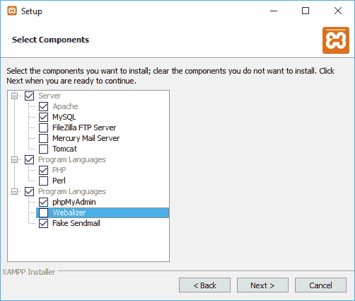

1.  在安装文件夹屏幕上，如果可能，保留默认的安装目录值（`c:\xampp`），因为本书中会引用此文件夹，然后点击“下一步”。

1.  点击“下一步”按钮以继续进行 Web 服务器的安装。

1.  确保已勾选启动控制面板的选项，并在安装完成后点击“完成”。

1.  选择您首选的语言用于 XAMPP 控制面板，然后点击“保存”以启动应用程序。

1.  点击 Apache 和 MySQL 的“启动”按钮以启动这些模块。一旦成功启动，它们的名称将如以下截图所示变为绿色高亮：

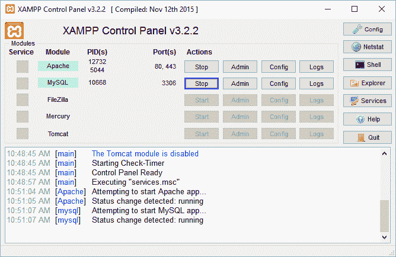

1.  打开一个网页浏览器，导航到地址`http://localhost`以显示您本地 Web 服务器的欢迎页面：

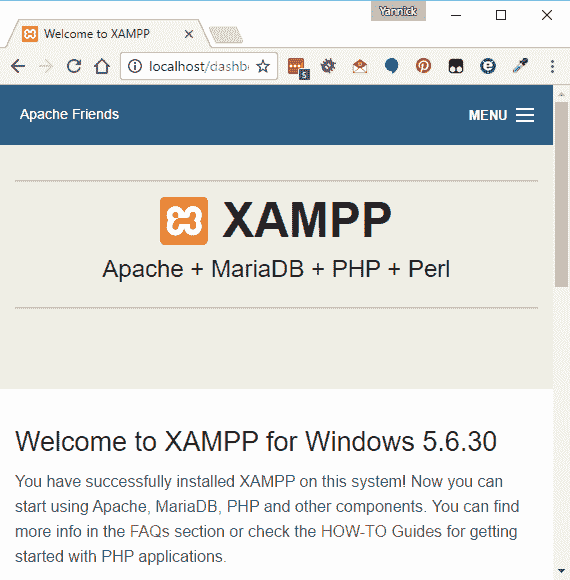

1.  在文本编辑器中打开`c:\xampp\apache\conf\httpd.conf`文件（例如，记事本）。

1.  搜索`DocumentRoot`配置选项，并将其值更改为磁盘上的不同位置，以避免将项目文件保留在原始安装目录下。例如，您可以将其设置为一个新的目录，用于存放您的本地 WordPress 开发安装，如`DocumentRoot "C:/WPDev"`。

注意在这个路径中使用的是正斜杠。如果您从文件资源管理器窗口复制粘贴路径，请务必小心。

1.  搜索`Directory`选项，并将其更改为与`DocumentRoot`相同的路径，即`<Directory "C:/WPDev">`。

1.  保存并关闭`httpd.conf`文件。

1.  如果指定的目录`DocumentRoot`在您的计算机上不存在，请创建该目录。

1.  打开 XAMPP 控制面板。

1.  停止并重新启动 Apache 服务，以便新配置生效。

在执行步骤 14 至 20 之后，尝试访问本地 Web 服务器的欢迎页面将不再工作，因为新指定的目录目前是空的。这将在下一个食谱中纠正。

# 它是如何工作的...

XAMPP 软件包包含运行 Web 服务器所需的所有组件，该服务器可以在您的计算机上托管 WordPress 网站。这些组件包括：

+   Apache Web 服务器

+   PHP 解释器

+   MySQL 数据库服务器

+   phpMyAdmin 数据库管理界面

XAMPP 软件包还包括其他组件，这些组件不是运行本地 WordPress 开发站点所必需的。

一旦 XAMPP 安装并启动，我们在网页浏览器中输入的`localhost`关键字就会被操作系统识别为与本地计算机上的 Web 服务器进行通信的请求，Apache Web 服务器会显示其文档中的欢迎页面。

XAMPP 文档是一组位于 Windows 平台`c:\xampp\htdocs`目录中的平面 HTML 文件。这是 Web 服务器的默认工作目录。

该指南的最后几个步骤指示 Apache Web 服务器在新的目录中查找本地网站的文件内容。这是一个安全预防措施，以确保在 XAMPP 卸载时不会意外删除网站文件。它还可以帮助在单台计算机上管理多个网站。

# 更多内容...

虽然 XAMPP 是一个功能齐全的本地 Web 服务器软件包，并且可在三大操作系统上使用，但网上还有许多其他软件包。大多数这些软件包将直接在计算机上运行所需的 Web 服务，而更高级的软件包，如**Varying Vagrant Vagrants**（**VVV**），将在您的计算机上虚拟化基于 Linux 的 Web 服务器，以创建一个针对 WordPress 优化的最终部署环境的更精确副本。以下是其中一些最受欢迎的本地 Web 服务器软件包列表：

对于 Windows 系统：

+   WampServer ([`www.wampserver.com/en/`](http://www.wampserver.com/en/))

+   EasyPHP ([`www.easyphp.org/`](http://www.easyphp.org/))

对于 macOS X：

+   MAMP ([`www.mamp.info/en`](https://www.mamp.info/en))

对于 Windows、Mac 或 Linux 系统：

+   Varying Vagrant Vagrants ([`varyingvagrantvagrants.org`](https://varyingvagrantvagrants.org))

要获取更完整的 Web 服务器软件包列表，请访问[`en.wikipedia.org/wiki/List_of_AMP_packages`](https://en.wikipedia.org/wiki/List_of_AMP_packages)。

# 创建远程 Web 开发环境

如果您无法设置本地 Web 服务器来开发 WordPress 插件，或者您计划与一或多人共享开发任务，那么设置本地 Web 服务器的替代方案是创建一个远程开发环境。

假设您已经设置了 Web 托管账户，创建主域名的子域是创建此类环境的最简单方法。这将允许您创建一个独立的 WordPress 测试安装，同时仍然可以保护实时站点不受影响，但不会带来本地安装的其他好处。

# 参见

+   *下载和配置本地 WordPress 安装*指南

# 下载和配置本地 WordPress 安装

我们本地开发环境的下一个组件是在您的本地网络服务器上安装 WordPress，以运行一个完全工作的网站，并且所有文件都本地托管。

WordPress 一直以其简单的五分钟安装过程而自豪。在本地网络服务器上安装它甚至比在实时远程服务器上安装还要简单快捷。本配方涵盖了创建 MySQL 数据库以存储与我们的新 WordPress 安装相关的所有数据的步骤，以及实际的设置过程。

# 准备工作

此配方假设您已经在计算机上安装了本地网络服务器。这个网络服务器可以是使用之前的配方执行的新安装，也可以是从之前的安装中来的。以下章节中的步骤是针对新本地网络服务器编写的。如果您为访问 MySQL 数据库创建了新账户或更改了 root 用户的密码，一些步骤会有所变化。如果您使用的是不同于 XAMPP 的其他网络服务器，phpMyAdmin 工具的位置也可能不同。您应该参考您的网络服务器文档以找出该地址。

# 如何操作...

1.  在网络浏览器中，导航到地址 `http://localhost/phpmyadmin/` 以访问您的网络服务器数据库管理工具。

1.  在 phpMyAdmin 中点击“数据库”标签页。

1.  在“创建数据库”一词后面的空白字段中输入要创建的新数据库的名称。在本例中，我们将使用名称 `wordpressdev`：

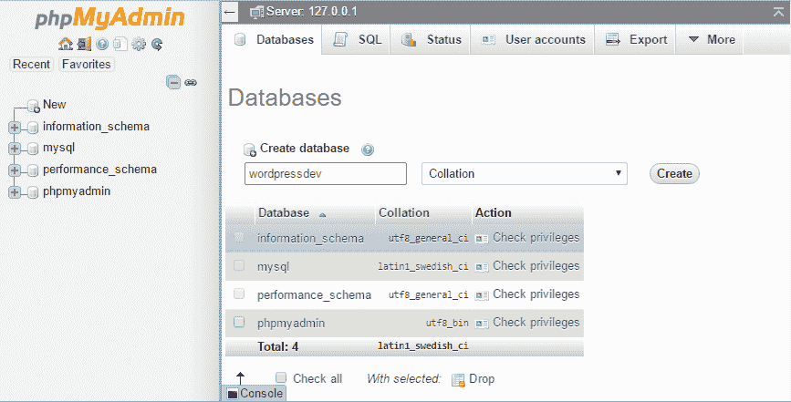

1.  点击“创建”按钮以完成数据库创建过程。

1.  从官方 WordPress 网站下载最新的 WordPress 安装包（[`wordpress.org`](https://wordpress.org)）。下载链接可以在网站的首页找到，下载包可以在任何网络服务器上运行，无论是本地还是远程。

以下说明已在 WordPress 版本 4.8 上进行了测试。虽然安装过程在不同版本之间通常变化不大，但在较新版本中，这些步骤可能会有细微差异。

1.  使用您喜欢的文件归档实用程序或操作系统的内置功能提取 WordPress 归档文件的内容。

1.  将生成的 `wordpress` 文件夹的内容复制到您的本地网络服务器的网络内容目录（如果您遵循了之前的配方，则为 `c:\WPDev`）。除非您想使您的 WordPress 网站地址为 `http://localhost/wordpress`，否则您不应该复制 `wordpress` 文件夹本身。

1.  将您的网络浏览器指向 `http://localhost` 以启动 WordPress 安装过程。

1.  选择您首选的语言并点击继续。

1.  在下一页，点击“让我们开始”按钮以启动您开发网站的配置。

1.  更新数据库名称字段以反映我们新创建的数据库的名称（`wordpressdev`）。

1.  将 MySQL 用户名设置为 `root`。

1.  将 MySQL 密码中的所有字符删除，使其为空，因为本地 MySQL 服务器 root 账户通常配置为没有任何密码。

1.  保持数据库主机字段使用其默认值（`localhost`）。

1.  将表前缀字段从其默认值更改为`wpdev_`：

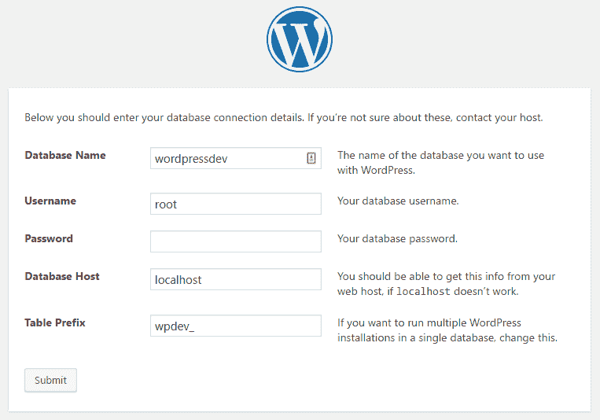

1.  点击“提交”按钮以验证输入的信息。如果任何参数输入不正确，或者 WordPress 安装过程无法正确访问您的数据库服务器，它将显示错误页面，并给您机会进行更正。

1.  点击“运行安装”按钮以创建在指定 MySQL 数据库中的所需表结构。

1.  指定站点标题（例如，`开发站点`）。

1.  为管理员用户设置用户名。为了提高安全性，最好选择一个人们难以轻易猜到的用户名。应避免使用明显的名称，如 admin 或 administrator。

1.  可选地，使用您自己的选择更改随机生成的密码。如果 WordPress 确定您的新密码较弱，您需要勾选出现的附加复选框以确认您想要使用弱密码。

1.  在相应的字段中输入您的电子邮件地址（尽管在大多数本地开发安装中实际上不会发送电子邮件）。

1.  如果您正在配置实时外部开发服务器，请勾选“阻止搜索引擎索引此站点”选项，因为我们不希望此开发站点出现在任何地方。

1.  点击“安装 WordPress”以完成安装，您将自动登录到站点的 WordPress 仪表板。

1.  在仪表板管理员栏中点击“开发站点”链接，以查看您的新站点：

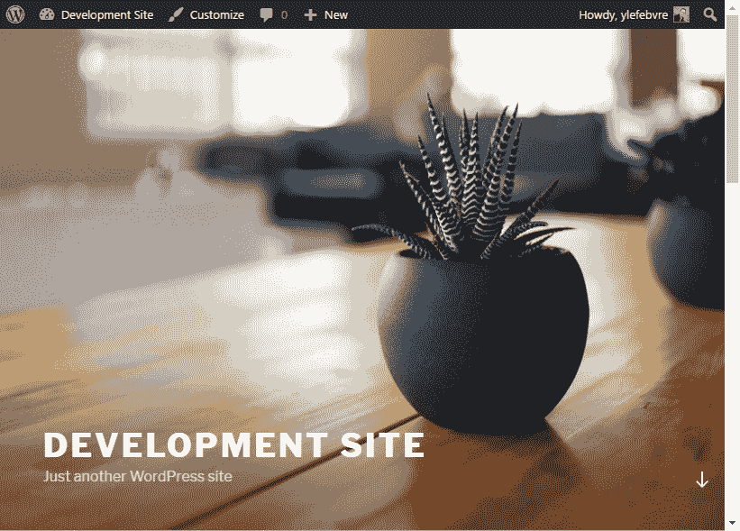

# 它是如何工作的...

在前几个步骤中，使用 phpMyAdmin 界面在本地 MySQL 服务器上创建数据库。这个基于 Web 的数据库管理工具与 XAMPP 和其他大多数 Web 服务器捆绑在一起。`http://localhost/phpmyadmin`地址将始终带您到数据库管理工具，即使您已根据前一个食谱中的说明移动了 Web 服务器的文档根目录。

一旦创建数据库并将 WordPress 文件复制到正确的位置，将浏览器指向本地 Web 服务器，它将搜索文档根目录以查找要发送回浏览器的 HTML 文件或要执行的 PHP 文件。在 WordPress 的情况下，Web 服务器找到`index.php`文件，并使用其 PHP 解释器执行它。当 WordPress 代码执行时，它会检查是否存在配置文件，如果找不到，则会启动安装过程。WordPress 代码在我们运行的本地 Web 服务器和任何在线可访问的远程实时 Web 服务器之间看不到任何区别。

虽然我们在安装过程中指定了管理员的电子邮件地址，但许多本地 Web 服务器未配置为发送电子邮件消息，因此在这些情况下我们永远不会收到任何电子邮件通信。在插件开发和测试电子邮件功能时，使用远程服务器更为可取。

一旦完成这个菜谱，你将拥有一个功能齐全的 WordPress 安装。

# 创建本地 Subversion 仓库

版本控制是任何代码开发项目的重要组成部分，用于跟踪项目的历史，拥有完整和有序的备份，以及能够轻松回滚更改以恢复到已知的工作状态。版本控制也是团队环境中开发项目时共享代码和其他文件的最佳和最高效的方式。除了是一个易于使用和配置的出色版本控制系统外，Subversion（通常称为 SVN）还是管理官方 WordPress 插件目录上所有提交的技术。因此，在初始插件开发过程中设置并使用本地 Subversion 仓库，你将立即准备好与社区分享你的创作。

# 如何操作...

1.  访问 **TortoiseSVN** 网站 ([`tortoisesvn.net/downloads.html`](https://tortoisesvn.net/downloads.html)) 并下载适用于你 Windows 版本（32 位或 64 位）的免费 Subversion 客户端。

虽然这个菜谱主要关注在 Windows 平台上创建本地仓库，但在菜谱步骤之后，在 *还有更多...* 部分讨论了其他平台的等效工具。

1.  启动 TortoiseSVN 安装程序，并使用所有默认安装选项进行安装。

1.  在你的硬盘上创建一个新的文件夹，该文件夹将托管本地 Subversion 仓库（例如，`c:\WPSVN`）。

1.  右键单击新文件夹，选择 TortoiseSVN | 在此处创建仓库菜单项，然后点击启动 Repobrowser。TortoiseSVN 将在目标目录中创建所需的文件结构，并显示仓库的内容，目前为空：

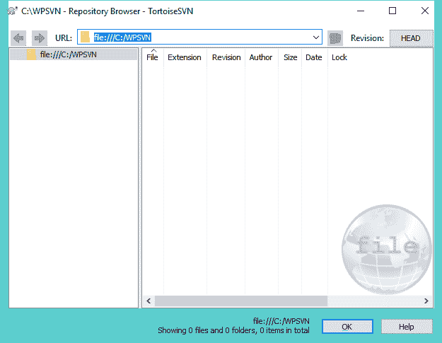

# 工作原理...

Subversion 是一个免费的开源版本控制系统，旨在在项目开发过程中保持文件修订的有序和备份，并提供在任何时候访问所有文件的旧版本。如果你曾经发现自己复制电脑上的目录，并为每个副本赋予连续编号的名称或添加日期到它们的名称，那么你会认识到版本控制实际上只是实现相同目标的更组织和高效的方法，即保持已知工作版本的代码文件的备份，并能够访问文件的任何旧版本。

虽然默认的 Subversion 界面是一套命令行工具，但 TortoiseSVN 和其他许多客户端应用程序提供了图形工具来创建、访问和管理本地和远程仓库。

除了熟悉这个系统以便以后在[wordpress.org](http://wordpress.org)上使用外，使用本地 Subversion 仓库将确保您始终可以轻松访问旧版本的插件，以防您执行的代码更改破坏了您的工作，并且您无法找出如何恢复到工作状态。

# 更多...

虽然网上有许多 Subversion 客户端可以与仓库交互，但并非所有客户端都包含创建仓库所需的必要管理工具，正如本指南中所示。您在寻找非 Windows 平台的 Subversion 客户端时，应寻找这些管理功能。

在 macOS X 上，versions（[`versionsapp.com/`](http://versionsapp.com/））和 Cornerstone（[https://www.zennaware.com/cornerstone](https://www.zennaware.com/cornerstone)）提供类似的功能，但都是付费应用程序。

在 Linux 上，PagaVCS 是免费的 TortoiseSVN 克隆版（[`code.google.com/p/pagavcs/`](https://code.google.com/p/pagavcs/）），而 SmartSVN（[http://smartsvn.com](http://smartsvn.com)）是一个付费的 SVN 客户端。

# 手动创建仓库

如果您的 Subversion 客户端不提供创建本地仓库的功能，您可以从官方 Subversion 网站（[`subversion.apache.org/packages.html`](https://subversion.apache.org/packages.html)）下载 Subversion 命令行工具，并按照在线 Subversion 参考手册（[`svnbook.red-bean.com/`](http://svnbook.red-bean.com/））中的说明手动创建仓库。

# 其他版本控制系统

虽然 Subversion 易于学习，并且是 WordPress 在其官方插件仓库中使用的系统，但其他版本控制系统，如 Git（[https://git-scm.com/](https://git-scm.com/））和 Mercurial（[https://mercurial-scm.org/](https://mercurial-scm.org/）），在开源开发社区中越来越受欢迎，也可以考虑用于管理您的插件代码。

# 参见

+   *将初始文件导入本地 Subversion 仓库*指南

# 将初始文件导入本地 Subversion 仓库

一旦您已经设置好本地仓库，本指南将描述添加文件并开始跟踪其随时间变化的修订版本的步骤。为了在无需担心逐个将它们添加到仓库的情况下，灵活地创建多个插件，正如本指南中讨论的那样，我们将把整个 WordPress 插件目录添加到您的本地仓库中。

# 准备工作

您应该已经在您的计算机上安装了 Subversion 客户端并创建了本地仓库，如“创建本地 Subversion 仓库”食谱中所述。这些步骤将根据您选择的 Subversion 客户端和操作系统略有不同。

# 如何操作...

1.  使用文件资源管理器导航到您的本地 WordPress 安装的 `wp-content/plugins` 目录（例如，如果遵循了前面的食谱，则为 `c:\WPDev\wp-content\plugins`）。

1.  右键单击文件夹并选择 TortoiseSVN | 导入菜单项。

1.  在仓库 URL 字段中输入您的本地 Subversion 仓库的文件位置（例如，`file:///c:/WPSVN`），如果尚未指定。

1.  在导入消息字段中写一条消息，概述将要导入到仓库中的文件：

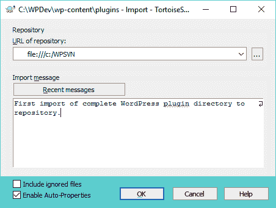

1.  点击“确定”按钮以完成导入过程。

一旦开始导入操作，TortoiseSVN 将所有选定的文件发送到仓库，并在过程中显示每个文件的名称。导入操作结束时，它还会显示分配给这组第一个文件的修订号。

# 工作原理...

使用导入 Subversion 功能将所有选定的文件复制到仓库中。除了存储文件本身外，Subversion 还使用修订号和导入消息标识每个文件。修订号由 Subversion 生成，并在添加一组文件时递增。当搜索文件历史时特别有用。

导入消息由用户指定，实际上是可选的。尽管如此，当向仓库添加文件时设置有意义的导入消息很重要，因为它将使您在未来的搜索中更容易识别这些文件，了解它们的状态以及它们被添加到仓库的原因。

虽然这些步骤已经导致成功导入，您可能想知道为什么插件目录中没有发生变化。原因是导入过程仅将选定的文件复制到 Subversion 仓库中。还需要一个额外的步骤，称为检出过程，以开始跟踪更改和文件历史。

# 相关内容

+   “从 Subversion 仓库检出文件”食谱

# 从 Subversion 仓库检出文件

在将文件初步导入到 Subversion 仓库之后，需要将这些文件检出才能真正开始在版本控制环境中工作。本食谱解释了如何从您的本地仓库检出文件以及结果文件结构将发生哪些变化。

# 准备工作

在遵循此食谱之前，您应该已经安装了 Subversion 客户端，创建了本地仓库，并导入了文件。这些步骤将根据您选择的 Subversion 客户端和所使用的操作系统略有不同。

# 如何做到这一点...

1.  如果你还没有在文件资源管理器中导航到本地安装的 WordPress 插件目录，请导航到该目录。

1.  在目录窗口的空白处右键单击，并选择“SVN 检出...”菜单项。

1.  如果尚未指定，请在仓库 URL 字段中输入本地 Subversion 仓库的文件位置（例如，`file:///c:/WPSVN`）。

1.  将检出目录设置为本地 WordPress 安装的插件文件夹（例如，`C:\WPDev\wp-content\plugins`）。

默认情况下，TortoiseSVN 客户端在执行检出时会在路径末尾添加单词`WPSVN`。请确保删除路径的最后一部分，以便所有检出的文件都进入正确的位置。

1.  在询问是否应将文件检入非空文件夹的对话框中点击“是”。此时，TortoiseSVN 将检索所有添加到仓库的文件并将它们复制到本地。

1.  一旦操作完成，请查看`plugins`目录中的文件列表，以查看它是否已从其先前状态发生变化：

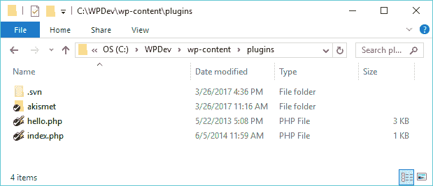

# 它是如何工作的...

执行检出操作会从仓库复制所有文件并将它们放置在目标目录中。它还在文件层次结构的顶级创建一个`.svn`目录来存储支持版本控制功能的文件。

默认情况下，大多数操作系统不会显示名称以点开头的文件夹，因为这通常表示隐藏文件和目录。要在 Windows 10 平台上显示隐藏文件夹，请执行以下步骤：

1.  打开 Windows 资源管理器。

1.  点击“查看”选项卡，并勾选名为“隐藏项”的选项。

`.svn`目录包含与当前文件夹中文件相关联的仓库地址信息。它还包含每个已检出文件的原始版本。这些原始文件用于 Subversion 确定每个文件相对于检出或更新时的状态何时发生变化。虽然当我们的仓库是本地托管时，`.svn`文件夹中所有文件的原始副本可能看起来有点冗余，但这种功能允许 Subversion 在远程仓库（如官方 WordPress 插件服务器）上工作时识别文件更改，即使你的计算机未连接到互联网。

# 还有更多...

当你使用 Subversion 和 TortoiseSVN 工作时，你创建、修改和删除的文件将经历多个不同的状态。以下部分解释了每个状态代表什么。

# Subversion 文件状态

在每个文件图标上显示的绿色勾选标记指示器，在执行此配方后，表明我们的文件和目录自上次签出或更新以来没有被修改。随着我们开始修改现有文件和创建新文件，这些指示器会随时间而改变。以下是在您对一个项目进行工作时，文件可能具有的最常见状态列表，以及它们相关的 TortoiseSVN 图标：

+   **正常**（绿色勾选标记）：文件或目录处于正常状态，自上次签出或更新以来没有发生变化。

+   **已修改**（红色感叹号）：文件或目录自上次签出或更新以来已被修改。

+   **非版本化**（蓝色问号）：文件或目录不在版本控制之下。

+   **已添加**（蓝色加号）：文件或目录是新的，并已标记为在下次提交操作中提交到仓库。

+   **已删除**（红色叉号图标）：目录已被删除，将在下一次提交操作中从仓库中移除。

+   **忽略**（灰色禁止符号）：此文件或目录永远不会被发送到仓库，Subversion 应停止检查更改。此状态对于将私人文件，如个人文档或待办事项列表，保留在插件相同的目录中但不上传到仓库并跟踪其历史记录非常有用。

+   **冲突**（黄色感叹号）：此图标出现在冲突情况下，通常当多个人在同一仓库上工作，并且多个用户对同一文件进行了更改时。虽然 Subversion 客户端通常会尝试合并这些更改以创建单个文件，但冲突状态表明系统无法自动合并这些更改。冲突文件需要手动合并，或者用户需要指示文件是否优先于当前存储在仓库中的版本。

# 参见

+   **将更改提交到 Subversion 仓库**配方

# 将更改提交到 Subversion 仓库

在项目过程中，通常会创建、修改或删除插件文件。这些更改应定期传输到 Subversion 仓库，以便对项目中的所有文件进行适当的备份。一个好的做法是每天至少提交一次更改，在实现插件功能的具体里程碑达到时，进行更频繁的提交操作。

此配方指示如何管理文件创建、修改和删除操作，以保持一切井然有序并在 Subversion 仓库中镜像。

# 准备工作

在执行此配方中的步骤之前，您应该已经安装了 Subversion 客户端，创建了本地仓库，并导入了签出的文件。这些步骤将根据您选择的 Subversion 客户端和所使用的操作系统略有不同。

# 如何操作...

1.  如果您还没有在文件资源管理器中导航到本地安装的 WordPress 插件目录，请导航到该目录。

1.  在文本编辑器中打开 `hello.php` 文件。

1.  在第 7 行编辑插件名称，将其从 `Plugin Name: Hello Dolly` 更改为 `Plugin Name: Goodbye Dolly`。

1.  保存并关闭文件。你现在应该会注意到修改过的文件在文件资源管理器中被一个红色感叹号图标标识，表示它已被修改。

1.  在 `plugins` 目录中创建一个名为 `chapter1` 的新文件夹。

1.  右键点击新文件夹，选择 TortoiseSVN | 添加... 菜单项以打开添加对话框。

1.  点击 OK 按钮，将文件排队以便在下次提交更改时添加到仓库。你将看到文件夹名称上方出现一个蓝色加号，表示它将在下一次代码提交时被添加到仓库中。

1.  导航到 `chapter1` 目录并创建一个名为 `example.txt` 的新文本文件。

1.  返回到 `plugins` 目录。

1.  右键点击 `index.php` 文件，并选择 TortoiseSVN | 删除菜单项。选定的文件将被立即删除并从文件资源管理器中消失。

1.  在 `plugins` 目录的空白部分右键点击，并选择 SVN 提交... 菜单项。这一步将显示提交对话框，顶部区域用于写入详细说明正在提交的更改的消息，底部区域包含文件列表。注意，除了一个文件外，所有文件旁边都有勾选标记，因为它们已被 Subversion 客户端识别为已更改，或者已通过 TortoiseSVN 界面添加或删除。没有勾选标记的文件是创建但未标记为在下一个提交操作中包含到 TortoiseSVN 快捷菜单中的文本文件：

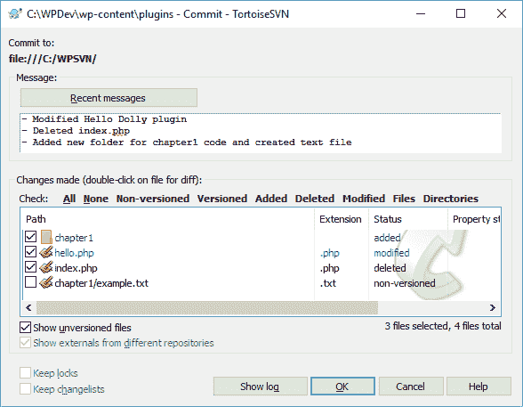

1.  在适当的字段中输入操作的原因。

1.  右键点击 `chapter1/example.txt` 文件，并选择添加菜单项以将其添加到操作中。

1.  点击 OK 按钮，将所有更改发送到 Subversion 仓库。

# 它是如何工作的...

使用存储在 `.svn` 文件夹中的本地数据，Subversion 客户端能够分析目录内容，并识别自上次检出或更新操作以来新创建的、已修改的或缺失的所有文件，然后生成这些更改的列表。

当执行提交操作时，新文件会被添加到仓库中，修改过的文件会被上传并存储在其前一个版本旁边，而删除的文件会被标记为不再属于当前项目版本。虽然这些行为可能看起来有些奇怪，但正是通过保留文件的前一个版本，甚至保留不再属于项目的文件，Subversion 才能让我们浏览整个项目的历史。

虽然使用 TortoiseSVN 菜单标记文件和目录以添加以及删除不再需要的项目是首选的，但在提交即将发生时也可以执行这些操作，正如我们在配方步骤中看到的。

# 更多...

在文件提交到仓库之前，许多程序员和开发者都想查看对修改文件的更改，尤其是在一个在提交代码更改之前促进同行评审的环境中。

# 查看修改文件的差异

通过在提交对话框中右键单击任何已修改的文件并选择“差异”菜单项，TortoiseSVN 客户端将显示其内置的文件差异查看器工具，突出显示仓库中文件的最后一个版本和当前版本之间的不同部分。这使用户可以一目了然地看到更改了什么，并确保没有意外修改代码。

# 将文件更新到最新仓库版本

如果你是你唯一提交文件到仓库的人，并且你在一台计算机上工作，那么你永远不会需要使用 SVN 更新菜单项。此功能旨在比较你的本地文件与仓库，并检查仓库中是否有新文件或新版本，这些文件或版本在本地不存在。然后，它将应用所有必要的更改到这些文件的本地版本。记住，如果你在一个团队环境中工作或跨多台计算机开发项目，请定期使用 TortoiseSVN 中的 SVN 更新选项。

# 回滚未提交的文件更改

在将文件提交到仓库之前，可以使用 TortoiseSVN 菜单中的“回滚”项撤销自上次签出、更新或提交以来对该文件所做的所有更改。如果你对代码进行了更改，导致其功能损坏，并希望恢复到一个已知的好状态，这可能会很有用。

# 查看文件历史记录

随着时间推移，文件的不同版本被提交到仓库中，Subversion 会跟踪这些文件的每个版本以及与每个提交操作相关的消息。从 TortoiseSVN 菜单可访问的“显示日志”工具允许您查看对一个或多个文件所做的更改的完整历史记录，使用差异查看器查看每个文件的先前版本和当前版本之间的更改，并轻松恢复这些文件的特定版本。

# 安装专门的代码编辑器/文本编辑器

大多数操作系统都提供内置的文本编辑器。虽然可以使用这样的简单工具创建 WordPress 插件，但强烈建议在您的计算机上安装专门的代码编辑器，以简化插件开发工作。

# 准备工作

当然，并非所有代码编辑器都相同。在选择代码编辑应用程序时，以下是一些你应该寻找的功能：

+   PHP 语法高亮

+   完成 PHP 函数名

+   能够同时搜索多个文件

+   能够突出显示搜索关键字（词）或所选文本的所有实例

+   行号

+   能够调整编辑器文本大小或指定替换字体

+   同时打开多个文件的可能性

以下编辑器包含大多数或所有这些关键功能。大多数是免费工具，但有些是付费应用程序：

在 Windows 平台：

+   Programmer's Notepad ([`www.pnotepad.org`](http://www.pnotepad.org))

+   Notepad++ ([`notepad-plus-plus.org/`](https://notepad-plus-plus.org/))

+   Visual Studio Code ([`code.visualstudio.com`](https://code.visualstudio.com))

在 Mac 平台：

+   TextMate ([`macromates.com`](https://macromates.com))

+   TextWrangler ([`www.barebones.com/products/TextWrangler`](https://www.barebones.com/products/TextWrangler))

在 Linux 平台：

+   Screem ([`www.screem.org/`](http://www.screem.org/))

跨平台：

+   Sublime Text ([`www.sublimetext.com`](https://www.sublimetext.com))

本食谱解释了如何安装专门的代码编辑器，并展示了基本的编辑器操作。它提供了使用 Windows 的 Programmer's Notepad 的详细步骤。

# 如何操作...

1.  下载之前列出的文本编辑器之一的安装包。

1.  运行编辑器的安装程序并选择默认设置。

1.  启动文本编辑器。

1.  从您本地 WordPress 安装的`plugin`目录中打开`hello.php`文件。您会看到代码的不同部分根据代码类型以不同的颜色显示。

1.  双击一个单词以选择它。您将在文件内容中看到该单词的其他任何实例都被突出显示：

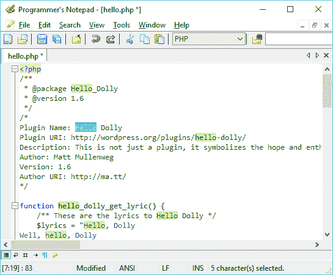

1.  选择视图 | 行号菜单项（或根据您选择的文本编辑器命名的类似项）以在编辑器中显示行号。

# 它是如何工作的...

代码编辑器内置了解析器，使它们能够识别代码中的注释、PHP 语言函数、文本字符串以及各种其他元素。在屏幕上对这些元素进行着色使得阅读代码变得容易得多，可以快速看到函数名拼写错误，或者快速识别注释。

在为 WordPress 开发插件时，另一个至关重要的功能是能够在编辑器中看到行号。这个功能非常有用，尤其是在 PHP 代码出现错误时，因为通常会在错误发生时显示文件名和代码行。在大多数代码编辑器中，开发者可以滚动到特定的行或在一个快速转到对话框中输入行号，立即跳转到该行。
