# 第三章：用户设置和管理页面

本章专注于设置页面，使用户能够配置插件设置。它涵盖了以下主题：

+   在插件初始化时创建默认用户设置

+   使用数组存储用户设置

+   删除时移除插件数据

+   在设置菜单中创建管理页面菜单项

+   创建多级管理菜单

+   添加指向外部页面的菜单项

+   隐藏用户不应访问的默认菜单项

+   使用 HTML 渲染管理页面内容

+   处理和存储插件配置数据

+   保存选项时显示确认消息

+   添加自定义帮助页面

+   使用设置 API 渲染管理页面内容

+   从操作和过滤器钩子访问用户设置

+   使用元框格式化管理页面

+   将管理代码从主插件文件中分离出来以优化站点性能

+   将样式表数据存储在用户设置中

+   从单个管理页面管理多套用户设置

+   创建具有管理页面的网络级插件

# 简介

正如我们在第二章“插件框架基础”中看到的，插件注册自定义函数与操作和过滤器钩子以改变或增强 WordPress 渲染网页的方式是非常容易的。尽管如此，第二章“插件框架基础”中的一些示例在处理自定义用户信息时存在局限性，例如无法轻松指定一个 Google Analytics 账户号码。

为了使插件对广泛用户群易于使用，通常很重要的一点是创建一个或多个管理页面，用户可以在其中提供特定于其安装的详细信息，输入外部账户信息，并自定义插件功能的一些方面。例如，默认 WordPress 安装中提供的 Akismet 插件提供了一个配置页面，可以在设置 | Akismet 配置菜单下找到。幸运的是，WordPress 有一套丰富的函数，允许插件开发者轻松地组合配置页面，使其与行政面板的其他部分无缝融合。

本章介绍了如何使用 WordPress 选项**应用程序****编程****接口**（**API**）函数在站点数据库中存储和访问用户选项。然后继续解释如何创建自定义对话框，使用户能够完全控制你创建的插件的配置。

# 在插件初始化时创建默认用户设置

大多数用户可配置插件的典型第一步是在插件激活时为所有选项创建一组默认值。这些默认选项随后将被用于在站点管理员访问插件设置页面时填充插件设置页面。本菜谱展示了如何注册一个在插件激活时被调用的函数，以及如何将选项数据存储在站点数据库中。

# 如何操作...

1.  导航到你的开发安装的 WordPress 插件目录。

1.  创建一个名为 `ch3-individual-options` 的新目录。

1.  导航到该目录并创建一个名为 `ch3-individual-options.php` 的新文本文件。

1.  在代码编辑器中打开新文件，并在插件文件顶部添加一个适当的标题，将插件命名为 `第三章 - 单个选项`。

1.  添加以下代码行以注册一个在插件激活时执行的功能，无论是初始安装后还是升级后：

```php
register_activation_hook( __FILE__, 'ch3io_set_default_options' );
```

1.  将以下代码段添加到提供 `ch3io_set_default_options` 函数实现的区域：

```php
function ch3io_set_default_options() {
    if ( false === get_option( 'ch3io_ga_account_name' ) ) {
        add_option( 'ch3io_ga_account_name', 'UA-0000000-0' );  
    }
}
```

1.  保存并关闭插件文件。通过点击此 `第三章 - 单个选项` 插件的“激活”选项来执行刚刚添加的激活函数。

1.  在你的 Web 服务器 MySQL 数据库管理工具中，选择你的 WordPress 数据库（如果你遵循了 第一章，*准备本地开发环境*中的说明，则为 `wordpressdev`），然后选择 `wpdev_options` 表。点击 SQL 选项卡，将默认查询替换为以下语句，然后点击“执行”：

```php
select * from wpdev_options where option_name = 'ch3io_ga_account_name'
```

1.  你的查询应返回一个包含分配给新选项的默认值的单行：

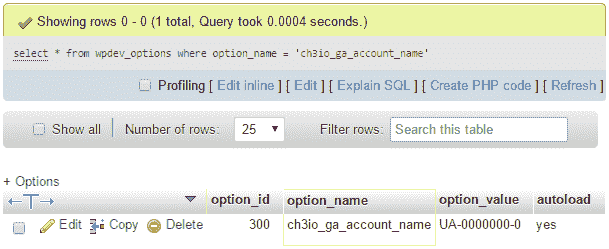

# 工作原理...

`register_activation_hook` 函数用于向 WordPress 指示在激活插件时应调用的函数名称。与其他钩子不同，此函数需要将主插件代码文件的名称作为其第一个参数发送，以及关联函数的名称。为了轻松做到这一点，我们可以利用 PHP 的 `__FILE__` 常量作为第一个参数，这将解析为文件名。

当回调函数被调用时，我们可以使用选项 API 在网站的 MySQL 数据库的选项表中创建、更新或删除设置。在这个特定例子中，我们使用 `add_option` 函数轻松创建一个名为 `ch3io_ga_account_name` 的选项，其默认值为 `UA-0000000-0`。

就像函数名称一样，在命名插件选项时应该小心，以避免与其他插件冲突。一个好的做法是在每个变量名开头添加一个唯一的前缀。

在调用创建新选项之前，激活函数会使用`get_option`函数检查选项是否存在于 WordPress 选项表中。如果返回值是 false，表示未找到该选项，则可以创建一个新的默认选项。任何其他结果都表明该插件之前已在网站上激活，并且选项可能已经从默认值更改。在编写此代码时，重要的是要记住，插件每次使用 WordPress 更新工具更新时都会被停用和重新激活，这会导致调用其激活函数。也有可能用户暂时停用插件以调试网站问题，然后在稍后时间将其恢复，这也可能导致激活函数被调用。

最后，需要注意的是，如果需要实现插件所需的功能而需要多个选项，则可以多次调用`add_option`函数。尽管如此，没有必要验证所有选项的存在，因为检查单个选项就足以表明它们之前已经被设置。

# 更多内容...

除了为插件创建默认值之外，激活钩子还可以用来执行更高级的任务，例如与自定义数据库表交互或进行数据初始化，这将在后续章节中看到。相比之下，类似的停用功能钩子在大多数插件的创建中并没有实际用途。

# 停用函数

与我们在本食谱中使用的激活函数类似，WordPress 提供了一种注册停用函数的方法（使用`register_deactivation_hook`）。虽然使用此函数删除插件创建的选项可能很有吸引力，但无法知道激活函数被调用的原因。可能触发此调用的三种情况是插件升级、暂时停用以调试网站问题或插件即将被删除。由于在第一种和第二种情况下最好保留用户选项，因此任何清理和数据删除代码应放置在插件卸载文件中，如后续食谱中所述。

# 参见

+   *删除插件数据时的操作*食谱

# 使用数组存储用户设置

而在之前的食谱中，虽然很好地在网站的选项表中为每个单独的插件选项创建了条目，但管理用户设置的另一种方法是将其作为数组存储在数据库中。

此食谱创建与之前相同的选项，但还添加了第二个选项，并使用数组而不是单个选项来存储它们。它还结合了升级策略来处理插件随时间发展而创建的附加选项。

# 准备工作

您应该已经遵循了第二章中名为*使用插件过滤器在页面主体中插入链接统计跟踪代码*的食谱，以获得本食谱的起点。或者，您可以从 Packt 网站下载的代码包（[`www.packtpub.com/support`](https://www.packtpub.com/support)）中获取结果代码（`Chapter 2/ch2-page-header-output/ch2-page-header-output-v2.php`），并将文件重命名为`ch2-page-header-output.php`。

# 如何操作...

1.  导航到您开发安装中 WordPress 插件目录的`ch2-page-header-output`文件夹。

1.  在代码编辑器中打开文件`ch2-page-header-output.php`。

1.  添加以下代码行以注册在插件激活时调用的函数：

```php
register_activation_hook( __FILE__, 
                          'ch2pho_set_default_options_array' );
```

1.  添加以下代码段以提供`ch2pho_set_default_options_array`函数的实现：

```php
function ch2pho_set_default_options_array() {
    ch2pho_get_options();
}
```

1.  添加以下代码以提供`ch2pho_get_options`函数的实现：

```php
function ch2pho_get_options() {
    $options = get_option( 'ch2pho_options', array() );

    $new_options['ga_account_name'] = 'UA-0000000-0';
    $new_options['track_outgoing_links'] = false;

    $merged_options = wp_parse_args( $options, $new_options );

    $compare_options = array_diff_key( $new_options, $options );
    if ( empty( $options ) || !empty( $compare_options ) ) {
        update_option( 'ch2pho_options', $merged_options );
    }
    return $merged_options;
}
```

1.  保存并关闭插件文件。

1.  前往管理界面的插件部分。

1.  点击`Chapter 2 - Page Header Output`插件的“停用”链接，然后点击“激活”链接以执行刚刚添加的激活函数。

1.  使用您的 Web 服务器 MySQL 数据库管理工具，查询 WordPress 安装中的`wpdev_options`表，查找名为`ch2pho_options`的选项：

```php
select * from wpdev_options where option_name = 'ch2pho_options'
```

1.  您的查询应返回一行，其中包含表示数组中所有字段的序列化数据集：

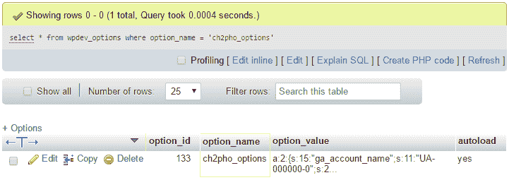

# 它是如何工作的...

`add_option`、`get_option`和`update_option`函数接受单个变量或数据数组作为值。当给定一个数组时，它们将接收到的信息转换为序列化数组，该数组被存储在网站数据库中。使用数组而不是多个选项的主要优势是，所有信息都可以通过单个函数调用检索，从而优化对 MySQL 数据库的访问并简化您的插件代码。这对于您的插件选项需要在每次渲染网站页面时查询尤为重要。

当然，这个优势只有在您需要同时使用大多数插件选项时才是真实的。否则，您的代码将无端地管理大量数据。

使用数组而不是单个选项的另一个好处是，每个选项的名称可以更短、更简单，因为您只需要担心在顶级选项名称级别避免命名冲突，而不是数组的每个键。最后，将所有选项存储在单个数组中，使得批量删除这些选项比它们分别存储要容易得多，正如我们将在下一个食谱中看到的那样。

这个配方的大部分代码定义了一个名为`ch2pho_get_options`的实用函数，该函数用于确保我们在检索选项时始终得到良好的值，即使我们的插件第一次运行或通过升级引入了新的选项。作为这个实用函数的一部分，我们使用`wp_parse_args`函数快速比较由`get_option`函数检索到的现有选项集与由`$new_options`数组指定的当前插件默认选项集。对于在现有选项中找不到的每个数组元素，`wp_parse_args`将简单地将其合并到最终数组中，该数组在函数结束时返回。我们选项检索函数的最后部分检查前一个选项数组是否为空或是否向新数组中添加了任何新键，使用 PHP 的`array_diff_key`函数。在这两种情况下，它将保存更新后的选项数组回站点数据库。

最后需要注意的是，虽然`ch2pho_get_options`函数返回所有站点选项的数组，但我们实际上在这个配方中并没有使用这个返回值；我们将在本章后面的配方中使用它。

# 参见

+   第二章中*插件框架基础*的*使用插件动作向页面标题添加输出内容*配方

+   第二章中*插件框架基础*的*在页面主体中使用插件过滤器插入链接统计跟踪代码*配方

+   *删除时移除插件数据*配方

# 删除时移除插件数据

就像任何软件一样，用户可能会决定从他们的 WordPress 安装中移除插件，如果他们不再需要它提供的功能，或者他们找到了他们更喜欢的替代方案。

当这种情况发生时，插件作者必须决定是否应该将存储在站点数据库中的所有配置数据保留在原位，以便将来更容易重新安装插件，或者移除所有这些信息，留下一个干净的数据库。

这个配方展示了如何创建一个卸载函数，该函数将从站点的数据库中移除选项数据。

# 准备工作

您应该已经遵循了*使用数组存储用户设置*的配方，以便为删除准备选项数据，并且生成的插件在您的开发站点中仍然处于活动状态。或者，您可以从下载的代码包中获取生成的代码（`第三章/ch2-page-header-output/ch2-page-header-output-v3.php`）。您应该将文件`ch2-page-header-output-v3.php`重命名为`ch2-page-header-output.php`，并在开始此配方之前激活插件一次。

# 如何操作...

1.  导航到您的开发安装的 WordPress 插件目录中的`ch2-page-header-output`文件夹。

1.  创建一个名为`uninstall.php`的新文件。

1.  在文本编辑器中打开新文件，并添加以下代码：

```php
<?php
// Check that code was called from WordPress with
// uninstallation constant declared
if ( !defined( 'WP_UNINSTALL_PLUGIN' ) ) {
    exit;
}

// Check if options exist and delete them if present
if ( false != get_option( 'ch2pho_options' ) ) {
    delete_option( 'ch2pho_options' );
}
```

1.  保存并关闭插件文件。

1.  导航到您开发 WordPress 安装的管理页面。

1.  在左侧导航菜单中点击插件。

1.  禁用`第二章 - 页面标题输出`插件。

1.  在以下步骤中删除插件时，为了防止丢失，请复制您的插件和卸载文件。副本应移动到`plugins`文件夹之外，以避免 WordPress 看到两个插件副本。

1.  在`第二章 - 页面标题输出`插件下点击删除链接。

1.  点击确定按钮以删除所有插件文件。

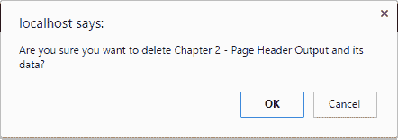

根据您开发站点的配置，在 WordPress 能够删除插件文件之前，您可能需要提供 FTP 凭据。

1.  使用您的 Web 服务器的 MySQL 数据库管理工具，查询您的 WordPress 安装中的`wpdev_options`表，查找名为`ch2pho_options`的选项，以查看该选项是否已被删除：

```php
select * from wpdev_options where option_name = 'ch2pho_options'
```

# 它是如何工作的...

当插件处于非活动状态且网站管理员点击其删除链接时，WordPress 会检查插件目录中是否存在名为`uninstall.php`的文件。如果文件存在且用户点击确定按钮以删除，WordPress 将进行所有插件文件的删除并执行`uninstall.php`文件的内容。此文件应包含直接删除所有插件选项和插件代码创建的任何其他内容的 PHP 代码。一旦执行，卸载脚本将与文件一起被删除。

查看卸载脚本的内容，前几行代码检查 WordPress 在调用脚本之前是否设置了某个常量。如果不存在，出于安全考虑，脚本将立即中止。这确保了知道已安装某个插件的外部访客无法尝试删除它。一旦验证了意图，其余的代码将检查之前配方中创建的`ch2pho_options`数组是否存在，并将其删除。如果您创建了多个选项来存储配置数据，您将需要使用`delete_option`函数的单独调用删除每个选项。

# 参见

+   *使用数组存储用户设置*的配方

# 在设置菜单中创建管理页面菜单项

在为插件配置选项定义默认值之后，下一步是创建一个用户可以查看和更改这些值的地方。通过使用 WordPress API，我们能够创建新的项目在管理菜单中，这将允许我们创建自定义插件配置页面。本配方展示了如何创建一个新菜单项，该菜单项将出现在管理菜单的设置子菜单下。

# 准备工作

您应该已经遵循了*使用数组存储用户设置*的菜谱，以便有选项数据可供管理。或者，您可以从下载的代码包中获取结果代码（`第三章/ch2-page-header-output/ch2-page-header-output-v3.php`）。在开始此菜谱之前，您应将文件`ch2-page-header-output-v3.php`重命名为`ch2-page-header-output.php`。

# 如何做到这一点...

1.  导航到您 WordPress 开发安装的根目录。

1.  在文本编辑器中打开`wp-config.php`文件。

1.  将`WP_DEBUG`变量设置为`true`：

```php
define('WP_DEBUG', true);
```

1.  保存配置文件。

1.  导航到您开发安装的 WordPress 插件目录中的`ch2-page-header-output`文件夹。

1.  在文本编辑器中打开`ch2-page-header-output.php`文件。

1.  添加以下代码行以注册一个在 WordPress 构建管理页面菜单时被调用的函数：

```php
add_action( 'admin_menu', 'ch2pho_settings_menu' );
```

1.  将以下代码段添加到为`ch2pho_settings_menu`函数提供实现的代码：

```php
function ch2pho_settings_menu() {
    add_options_page( 'My Google Analytics Configuration',
                      'My Google Analytics', 'manage_options',
                      'ch2pho-my-google-analytics', 
                      'ch2pho_config_page' );
}
```

1.  保存并关闭插件文件。

1.  导航到您开发 WordPress 安装的管理页面。

1.  如果您在遵循上一个菜谱后未激活`第二章 - 页面标题输出`插件，请激活它。

1.  点击左侧导航菜单中的设置部分以展开它。您将在树中看到一个名为“我的谷歌分析”的新菜单项，它是由刚刚添加到插件中的代码创建的。

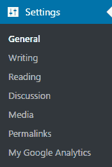

1.  点击“我的谷歌分析”菜单项。您将看到一个错误消息显示，因为 WordPress 找不到用于填充配置页面的函数。一旦您执行了名为*使用 HTML 渲染管理页面内容*的菜谱，此错误将消失。

1.  在`wp-config.php`文件中，将`WP_DEBUG`变量恢复到其默认值`false`：

```php
define('WP_DEBUG', false);
```

1.  保存并关闭配置文件。

如果您在菜谱开始时没有将`WP_DEBUG`变量设置为`true`，那么在执行步骤 13 后，WordPress 将只显示一个空白页面，而不是显示错误消息。

# 它是如何工作的...

此菜谱的第一行代码注册了一个在 WordPress 构建管理菜单时被调用的函数。当它执行时，我们创建的自定义函数调用`add_options_page`函数向设置菜单添加一个项目。此函数有几个参数，我们将按以下方式查看：

```php
add_options_page( $page_title, $menu_title, $capability,
                  $menu_slug, $function );
```

前两个参数是文本字符串，将供网站管理员可见，第一个将出现在浏览器标题栏或标签页标题中，第二个是将在设置菜单下出现的子菜单项的文本。

第三个参数稍微复杂一些，指的是能够查看和访问此菜单项所需的**用户能力**。在 WordPress 安装中创建用户时，每个用户都被分配了五个默认用户角色之一（订阅者、管理员、编辑器、作者或贡献者）。这些角色中的每一个都映射到一组权限，这些权限决定了具有此角色的用户可以执行的操作。有关角色及其关联权限的完整列表，请参阅 WordPress Codex 页面上的相关主题（[`codex.wordpress.org/Roles_and_Capabilities`](https://codex.wordpress.org/Roles_and_Capabilities)）。在此示例中，我们使用了用户能力`manage_options`，它分配给具有站点管理权限的用户以及在网络上工作时的超级管理员。

第四个菜单项，`menu_slug`，是一个将被 WordPress 内部使用的文本字符串，用于标识菜单项。此字符串应该是唯一的，以避免与其他插件发生冲突。

`menu_slug`名称应全部小写，以确保更高级的功能，如 WordPress 元框，能够正常工作。

最后一个参数指定当点击子菜单项时调用以显示配置页面内容的函数名称。

设置菜单是只要求单个配置页面的插件的理想位置，正如您在安装其他插件时所见，而需要多个菜单部分的更复杂插件应使用下一道菜谱中所示的技术。

# 还有更多...

虽然新项目始终位于 WordPress 创建的默认设置菜单项（一般、写作、阅读等）之下，但插件开发者确实可以控制他们的插件在列表中的位置。

# 设置钩子优先级以确定菜单顺序

如前一章所述，当动作钩子首次引入时，`add_action`函数的第三个参数用于指示已注册的回调函数相对于为同一钩子（在这种情况下，`admin_menu`钩子）注册的其他函数的优先级。为了确保新创建的菜单项在菜单中尽可能高，可以设置注册函数的优先级为`1`：

```php
add_action( 'admin_menu', 'ch2pho_settings_menu', 1 );
```

应注意，其他插件也可以将它们的回调设置为这个优先级。在这种情况下，字母顺序优先级和激活顺序是确定**永久链接**之后哪个菜单项首先显示的其他因素。

# 参见

+   *使用数组存储用户设置*的菜谱

# 创建多级管理菜单

当插件变得复杂时，它们的配置选项数量通常会增长，这使用户在选择插件在其网站上如何表现时具有很高的灵活性。虽然可以在单个长配置页面上显示所有插件选项，但创建一个包含多个部分的新顶级菜单项可以帮助将参数组织成逻辑分组，使用户能够更快地找到他们想要的内容。

此食谱展示了如何在管理菜单中创建一个带有相关子菜单项的新顶级菜单项。

# 如何做到...

1.  导航到你的开发安装的 WordPress 插件目录。

1.  创建一个名为 `ch3-multi-level-menu` 的新目录。

1.  导航到该目录并创建一个名为 `ch3-multi-level-menu.php` 的新文本文件。

1.  在代码编辑器中打开新文件，并在插件文件顶部添加一个适当的标题，将插件命名为 `第三章 - 多级菜单`。

1.  添加以下代码行以注册一个在 WordPress 准备显示网站管理菜单数据时将被调用的函数：

```php
add_action( 'admin_menu', 'ch3mlm_admin_menu' );
```

1.  将以下代码部分添加到为 `ch3mlm_admin_menu` 函数提供实现的代码段：

```php
function ch3mlm_admin_menu() {
    // Create top-level menu item
    add_menu_page( 'My Complex Plugin Configuration Page',
                   'My Complex Plugin', 'manage_options',
                   'ch3mlm-main-menu', 'ch3mlm_my_complex_main',
                   plugins_url( 'myplugin.png', __FILE__ ) );

    // Create a sub-menu under the top-level menu
    add_submenu_page( 'ch3mlm-main-menu',
                      'My Complex Menu Sub-Config Page', 
                      'Sub-Config Page',
                      'manage_options', 'ch3mlm-sub-menu',
                      'ch3mlm_my_complex_submenu' );
}
```

1.  保存并关闭插件文件。

1.  从网站，如 IconArchive ([`www.iconarchive.com`](http://www.iconarchive.com))，找到一个 PNG 格式 24 x 24 像素的图标，将其调整大小为 20 x 20 像素，并将其保存为 `myplugin.png` 在插件目录中。

1.  导航到你的网站管理区域的插件部分。

1.  激活你的新插件。

1.  你现在将在管理菜单中看到一个新菜单项。

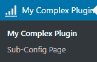

1.  展开顶级新菜单项以查看子菜单项。

与前面的食谱类似，点击菜单项将显示错误，因为我们尚未实现为这些菜单项生成实际内容的函数。我们不会为这两个菜单项创建页面，但你可以使用与 *使用 HTML 渲染管理页面内容* 食谱中所示类似的技术来创建自己的 `ch3mlm_my_complex_main` 和 `ch3mlm_my_complex_submenu` 函数。

# 它是如何工作的...

`add_menu_page` 函数与前面食谱中看到的 `add_options_page` 函数非常相似，其前五个参数是相同的：

```php
add_menu_page( $page_title, $menu_title, $capability,
               $menu_slug, $function, $icon_url, $position );
```

最后两项是针对此功能的特定内容，第一项允许我们在菜单中显示自定义图标，位于我们的新顶级项旁边，第二项指定新菜单应在管理菜单中的位置。

虽然使用 `add_menu_page` 函数的 `position` 参数指定新菜单项的确切位置可能看起来很有趣，但这样做是危险的，因为如果两个插件创建具有相同 `position` 值的条目，则只会显示一个菜单项。如果没有指定 `position` 参数，新菜单项将出现在菜单结构的底部，这在大多数情况下应该是可以的。

一旦创建了第一个菜单项，就可以使用`add_submenu_page`函数来附加子菜单项。以下是其参数，它们与`add_options_page`函数几乎相同，除了第一个参数，它应该是要附加子菜单项的顶级菜单项的唯一字符串标识符：

```php
add_submenu_page( $parent_slug, $page_title, $menu_title,
                  $capability, $menu_slug, $function );
```

虽然可以使用此技术为具有单个配置页面的插件创建顶级菜单项，但这些更简单的扩展应该在设置菜单下创建单个条目，如前一个配方中所示。

# 相关内容

+   *在设置菜单中创建管理页面菜单项*的配方

# 添加指向外部页面的菜单项

虽然 WordPress 插件库在每个插件页面上提供许多有用的部分来托管重要信息，包括其描述、常见问题解答、截图和支持论坛，但许多开发者更喜欢将文档、常见问题解答甚至支持转移到他们自己的网站。这使他们能够为这些部分创建更多功能丰富的内容，并创建一个更定制的品牌体验，尤其是在提供免费和付费版本的插件的情况下。

本配方展示了如何添加将引导用户到外部网页的菜单项。

# 准备工作

您应该已经遵循了*创建多级管理菜单*的配方，以便在管理界面中设置多级菜单，并且生成的插件仍然处于活动状态。或者，您可以从下载的代码包中获取生成的代码（`第三章/ch3-multi-level-menu/ch3-multi-level-menu.php`）。

# 如何做到的...

1.  导航到您开发安装的 WordPress 插件目录中的`ch3-multi-level-menu`文件夹。

1.  在文本编辑器中打开`ch3-multi-level-menu.php`文件。

1.  在`add_submenu_page`的两个调用之后，在`ch3mlm_admin_menu`函数的末尾添加以下代码行：

```php
   global $submenu;
   $url = 'https://www.packtpub.com/books/info/packt/faq';
   $submenu['ch3mlm-main-menu'][] = array( 'FAQ', 'manage_options', $url );
```

1.  保存并关闭插件文件。

1.  刷新您开发 WordPress 安装的管理页面，以查看“我的复杂插件”菜单下的新子菜单项：

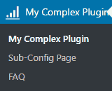

# 它是如何工作的...

由于核心 WordPress 代码和所有活动插件都会调用菜单创建函数，系统会构建一个数组，包含将根据当前用户的访问级别显示的所有项目。本配方的代码访问包含此数组的 WordPress 全局变量，并在上一个配方中创建的`ch3mlm-main-menu`父菜单下简单地插入一个额外元素。添加的数据是一个包含三个元素的数组：菜单项的标签、查看项所需的权限以及将分配给新菜单链接的 URL。

尽管此代码在当前版本的 WordPress 中有效，并且对许多版本都有效，但如果 WordPress 更改构建菜单的方式，它可能在某个时候不再有效。话虽如此，如果对菜单构建方式进行了更改，很可能会引入新的 API 来重现此功能，因为它被广泛使用。

# 参见

+   *创建多级管理菜单*的配方

# 隐藏用户不应访问的默认菜单项

许多用户称赞 WordPress 易于使用和简化的管理界面。尽管如此，几乎每个将其部署给新用户的用户都指示他们避免某些菜单项，因为他们不需要进入这些部分，如果他们修改这些区域的设置，可能会引入网站故障。

比通过培训预防更好的解决方案是使用几个简单的 API 函数来隐藏不需要的菜单项。本配方展示了如何使用这些函数来移除评论编辑器和永久链接设置菜单项。

# 如何操作...

1.  导航到您的开发安装的 WordPress 插件目录。

1.  创建一个名为`ch3-hide-menu-item`的新目录。

1.  导航到该目录并创建一个名为`ch3-hide-menu-item.php`的新文本文件。

1.  在代码编辑器中打开新文件，并在插件文件顶部添加一个适当的标题，将插件命名为`第三章 - 隐藏菜单项`。

1.  添加以下代码行以注册一个在 WordPress 准备显示网站导航菜单数据时将被调用的函数：

```php
add_action( 'admin_menu', 'ch3hmi_hide_menu_item' );
```

1.  将以下代码段添加到提供`ch3hmi_hide_menu_item`函数实现的实现中，隐藏评论菜单项：

```php
function ch3hmi_hide_menu_item() {
    remove_menu_page( 'edit-comments.php' );
}
```

1.  向`ch3hmi_hide_menu_item`函数添加额外的函数调用，以隐藏设置菜单下找到的永久链接子菜单项：

```php
remove_submenu_page( 'options-general.php',
                     'options-permalink.php' );
```

1.  保存并关闭插件文件。

1.  导航到管理界面的插件部分。

1.  激活您的新插件。

1.  查看管理菜单以确认评论菜单不再可见：

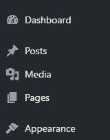

1.  展开设置菜单以查看永久链接子菜单项也不可见。

# 它是如何工作的...

默认的 WordPress 管理菜单使用用于渲染每个部分的 PHP 代码文件的名称作为它们的唯一标识符。快速找到菜单项标识符的一种方法是在网页浏览器中将鼠标悬停在其上，并查看链接指向的地址。就评论菜单项而言，URL 是`http://localhost/wp-admin/edit-comments.php`；因此，在`remove_menu_page`调用中使用`edit-comments.php`。

确定传递给`remove_submenu_page`函数的参数时使用了类似的技巧，确定设置部分有`http://localhost/wp-admin/options-general.php`的 URL，而永久链接部分有`http://localhost/wp-admin/options-permalink.php`的地址。

# 使用 HTML 渲染管理页面内容

一旦创建了一个自定义菜单项，WordPress 在访问它时会调用与其关联的函数。分配给该函数的主要目的是渲染一个包含所有用户可用选项的配置页面，并将捕获的数据发送回 WordPress 进行处理。

可以使用两种主要方法来渲染插件配置页面：直接 HTML 和设置 API。本食谱探讨了使用 HTML 创建配置面板的方法，而后续的食谱将展示如何使用设置 API 来准备页面输出。

# 准备工作

你应该已经遵循了*在设置菜单中创建管理页面菜单项*的食谱，并且生成的插件在你的开发站点上仍然处于活动状态。或者，你可以从下载的代码包中获取生成的代码（`第三章/ch2-page-header-output/ch2-page-header-output-v4.php`）。在开始本食谱之前，你应该将文件`ch2-page-header-output-v4.php`重命名为`ch2-page-header-output.php`。

# 如何操作...

1.  导航到你的开发安装的 WordPress 插件目录中的`ch2-page-header-output`文件夹。

1.  在文本编辑器中打开`ch2-page-header-output.php`文件。

1.  将以下代码行添加到实现插件选项页面渲染代码中：

```php
function ch2pho_config_page() {
    // Retrieve plugin configuration options from database
    $options = ch2pho_get_options();
    ?>

    <div id="ch2pho-general" class="wrap">
    <h2>My Google Analytics</h2><br />

    <form method="post" action="admin-post.php"> 
    <input type="hidden" name="action"
           value="save_ch2pho_options" />

    <!-- Adding security through hidden referrer field -->
    <?php wp_nonce_field( 'ch2pho' ); ?>
    Account Name: <input type="text" name="ga_account_name"
     value="<?php echo esc_html( $options['ga_account_name'] );
     ?>"/><br />
    Track Outgoing Links: <input type="checkbox"
     name="track_outgoing_links"
     <?php checked( $options['track_outgoing_links'] ); ?>/>
    <br /><br />
    <input type="submit" value="Submit" class="button-primary"/>
    </form>
    </div>
<?php }
```

1.  保存并关闭插件文件。

1.  点击管理页面中的“设置”部分。

1.  点击“我的 Google Analytics”菜单项以显示插件配置页面。

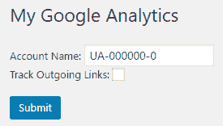

# 它是如何工作的...

在配置页面实现函数内生成的任何输出都将被发送到浏览器，并包含在 WordPress 管理界面布局中。在本食谱的代码中，我们首先使用我们在此章中定义的`ch2pho_get_options`函数来检索插件的所有选项，方便地组织在一个数组中，我们可以将其存储在一个单独的变量中。

然后我们使用一个闭合的 PHP 括号来能够为函数体的其余部分编写直接的 HTML 代码，并将此内容直接发送到浏览器。HTML 代码负责创建一个标准表单，渲染一个文本字段以显示并接受新的 Google Analytics 账户号码值，以及一个复选框供用户指定是否应跟踪出站链接。最后，HTML 代码添加了一个提交按钮，允许用户提交对插件配置所做的任何更改。

仔细查看代码，它还包含了一些小的 PHP 代码片段，当显示选项页面时显示当前的配置值，并使用`checked` WordPress 实用函数在传递的参数为真时输出正确的 HTML 代码。

使用纯 HTML 渲染插件配置页面的最大优点是，它允许创建复杂的布局来向最终用户展示所有选项。这与我们在后面的菜谱中将要看到的使用设置 API 形成鲜明对比。HTML 对于许多网页设计师来说也比处理复杂函数更容易理解。

应该注意的是，由于我们没有实现处理提交数据并将其存储回`options`数据库表的代码，因此在此状态下提交的任何更改都不会被保存。这将在下一个菜谱中介绍。

# 还有更多...

一旦用户提交处理开始发挥作用，考虑安全性就变得非常重要，以确保避免最常见的应用程序安全风险（[`www.owasp.org/index.php/Top_10_2017-Top_10`](https://www.owasp.org/index.php/Top_10_2017-Top_10)）。在这个菜谱中创建的表单也不例外。

# wp_nonce_field

在这个菜谱中使用的`wp_nonce_field`函数是确保要提交的数据来自 WordPress 管理页面而不是外部来源的安全措施的一部分。通过添加此函数调用，将在插件配置表单中添加一个隐藏的文本字段，当接收到帖子数据时将检查其中的信息。

虽然这是可选的，但函数的第一个参数是一个唯一标识符，应始终设置以确保更好的安全性。如果没有设置，将使用默认值，这可能会促进安全漏洞。该函数还有许多其他可选参数，如下所示：

```php
wp_nonce_field( [$action], [$name], [$referer], [$echo] );
```

其他三个参数用于指定 nonce 的名称，该名称需要在接收端进行匹配，一个布尔变量用于指示是否应设置 referer 字段以进行验证，以及另一个布尔参数用于确定是否应立即显示隐藏的表单字段或返回。

# 参见

+   在设置菜单中创建一个管理页面菜单项的菜谱

+   使用数组存储用户设置的菜谱

# 处理和存储插件配置数据

在配置页面就绪后，插件用户将能够修改配置选项并将它们提交以存储在 WordPress 数据库中。目前缺失的链接是创建一个数据处理函数，该函数将接收用户发布的数据并将其存储在网站的`options`表中。

这个菜谱描述了如何实现一个数据处理函数，以验证要存储的信息是合法的，并将信息存储在选项数组中。

# 准备工作

您应该已经遵循了“使用 HTML 渲染管理页面内容”的菜谱，并且生成的插件仍然在您的开发站点中激活。或者，您可以从下载的代码包中获取生成的代码（`第三章/ch2-page-header-output/ch2-page-header-output-v5.php`）。在开始此菜谱之前，您应该将文件 `ch2-page-header-output-v5.php` 重命名为 `ch2-page-header-output.php`。

# 如何操作...

1.  导航到您开发安装的 WordPress 插件目录中的 `ch2-page-header-output` 文件夹。

1.  在文本编辑器中打开 `ch2-page-header-output.php` 文件。

1.  添加以下代码行以注册一个在 WordPress 首次识别请求的页面是管理页面时被调用的函数：

```php
add_action( 'admin_init', 'ch2pho_admin_init' );
```

1.  将以下代码段添加到提供 `ch2pho_admin_init` 函数实现的步骤中：

```php
function ch2pho_admin_init() {
    add_action( 'admin_post_save_ch2pho_options',
                'process_ch2pho_options' );
}
```

1.  将以下代码段添加到提供 `process_ch2pho_options` 函数实现的步骤中，该函数在之前的步骤中已声明：

```php
function process_ch2pho_options() { 
    // Check that user has proper security level
    if ( !current_user_can( 'manage_options' ) ) {
        wp_die( 'Not allowed' );
    }

    // Check if nonce field configuration form is present
    check_admin_referer( 'ch2pho' );

    // Retrieve original plugin options array
    $options = ch2pho_get_options();

    // Cycle through all text form fields and store their values
    // in the options array
    foreach ( array( 'ga_account_name' ) as $option_name ) {
        if ( isset( $_POST[$option_name] ) ) {
            $options[$option_name] =
                sanitize_text_field( $_POST[$option_name] );
        }
    }

    // Cycle through all check box form fields and set the options
    // array to true or false values based on presence of variables
    foreach ( array( 'track_outgoing_links' ) as $option_name ) {
        if ( isset( $_POST[$option_name] ) ) {
            $options[$option_name] = true;
        } else {
            $options[$option_name] = false;
        }
    }

    // Store updated options array to database
    update_option( 'ch2pho_options', $options );

    // Redirect the page to the configuration form
    wp_redirect( add_query_arg( 'page', 
                                'ch2pho-my-google-analytics',
                            admin_url( 'options-general.php' ) ) );
    exit;
}
```

1.  保存并关闭插件文件。

1.  点击管理菜单中的设置部分。

1.  点击“我的 Google Analytics”菜单项以显示配置页面。

1.  更改其中一个字段的值并点击提交按钮。

1.  当页面刷新时，您将看到显示的值反映了提交的值。

# 它是如何工作的...

这个菜谱是第一个介绍具有变量名称的动作钩子的菜谱。在调用 `add_action` 时，不是编写特定的动作钩子名称，而是以单词 `admin_post_` 开头，后跟它期望与隐藏表单字段匹配的动作名称。在这种情况下，动作名称是 `save_ch2pho_options`。回到之前的菜谱，您可以看到这段文本与放置在名为 `action` 的隐藏表单字段中的文本相同：

```php
<input type="hidden" name="action" value="save_ch2pho_options" />
```

当配置页面表单提交时，它将所有数据发送到 `admin-post.php` 脚本，该脚本检查 `action` 字段，然后将它接收到的数据发送到关联的函数（如果存在）。

一旦执行了处理函数，对 `current_user_can` 和 `check_admin_referer` 的调用是安全措施，其中我们检查当前登录的用户是否具有管理权限，以及表单的一部分是否包含 nonce 字段。这些权限检查中的错误将导致特定的错误消息，告知用户他没有执行此操作的权限，而 nonce 检查将显示一个模糊的错误消息以迷惑潜在的攻击者：


函数的其余部分专注于使用`ch2pho_get_options`函数检索当前插件选项集，处理提交的字段，并将更新的值存储回站点数据库。虽然使用`foreach`循环来存储两个简单的数据字段可能看起来有些过度，但这种方法可以轻松扩展以支持大量的配置字段。

最后一步是调用`wp_redirect`函数，在所有数据存储完毕后将浏览器重定向回插件选项页面。在调用`wp_redirect`之后始终调用`exit` PHP 函数非常重要，如本配方中所示。

# 另请参阅

+   使用 HTML 渲染管理页面内容的配方

# 在保存选项时显示确认消息

任何用户界面的一个重要可用性方面是在用户成功完成任务后显示确认消息。正如你可能在前一个配方中注意到的，WordPress 在将配置数据保存到选项表后默认不提供任何用户反馈。

本配方解释了如何在用户更新插件配置选项后在配置页面上显示确认消息。

# 准备工作

你应该已经遵循了*处理和存储插件配置数据*配方，并且生成的插件仍然在你的开发站点中处于活动状态。或者，你可以从下载的代码包中获取生成的代码（`Chapter 3/ch2-page-header-output/ch2-page-header-output-v6.php`）。在开始本配方之前，你应该将文件`ch2-page-header-output-v6.php`重命名为`ch2-page-header-output.php`。

# 如何做...

1.  导航到开发安装的 WordPress 插件目录中的`ch2-page-header-output`文件夹。

1.  在文本编辑器中打开`ch2-page-header-output.php`文件。

1.  修改`process_ch2pho_options`函数末尾对`wp_redirect`的调用，如下所示，加粗部分表示修改：

```php
wp_redirect( add_query_arg(
                 array( 'page' => 'ch2pho-my-google-analytics',
 'message' => '1' ),
 admin_url( 'options-general.php' ) ) );
```

1.  在`ch2pho_config_page`函数中配置页面标题之后添加以下代码（加粗）：

```php
<h2>My Google Analytics</h2><br />

<?php if ( isset( $_GET['message'] ) &&
           $_GET['message'] == '1' ) { ?>
 <div id='message' class='updated fade'>
    <p><strong>Settings Saved</strong></p></div> <?php } ?>
```

1.  保存并关闭插件文件。

1.  点击管理菜单中的设置部分。

1.  点击“我的谷歌分析”菜单项。

1.  更改其中一个字段的值并点击提交按钮，以查看新创建的消息，指示已保存设置。

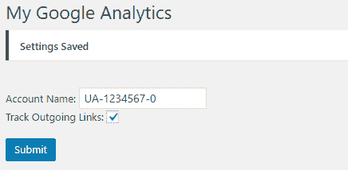

# 工作原理...

当执行重定向调用时，用户提交的字段和 PHP 变量不会传递到目标页面。因此，我们需要使用另一种方法，即查询参数，来确定应该显示确认消息。

配方的第一部分稍微修改了现有的`wp_redirect`调用，添加了一个名为`message`的新查询变量，并将其设置为值`1`。

一旦接收到这个变量，负责渲染选项页面的代码可以显示一条消息，遵循标准的 WordPress 样式。

同样的机制可以用来根据选项存储的结果显示不同的消息。例如，如果某些字段需要以某种方式格式化接收数据，`process_ch2pho_options`函数可以根据数据处理操作的成功或失败设置不同的消息值。

# 参见

+   **处理和存储插件配置数据**的配方

# 添加自定义帮助页面

尽管字段标签可以尽可能详细，但一个好的插件总是需要一套文档来帮助用户快速了解如何激活插件并执行正确的步骤以获得预期的结果。虽然`ReadMe`文件通常是开发者首先想到要生产的，但用户几乎从不阅读外部文件或官方 WordPress 插件页面上的说明，他们只是安装插件并试图自己弄清楚。

为了解决这个问题，WordPress 引入了在插件管理页面中创建详细的多节帮助页面的能力，使用户能够快速找到问题的答案。这个配方展示了如何注册适当的回调函数，将帮助部分添加到你的插件配置页面，包含多个信息标签页。

# 准备工作

你应该已经遵循了**保存选项时显示确认消息**的配方，并且生成的插件仍然在你的开发站点上处于活动状态。或者，你可以从下载的代码包中获取生成的代码（`Chapter 3/ch2-page-header-output/ch2-page-header-output-v7.php`）。在开始此配方之前，你应该将文件`ch2-page-header-output-v7.php`重命名为`ch2-page-header-output.php`。

# 如何做到...

1.  导航到你的开发安装的 WordPress 插件目录中的`ch2-page-header-output`文件夹。

1.  在文本编辑器中打开`ch2-page-header-output.php`文件。

1.  在现有代码中找到`ch2pho_settings_menu`函数。

1.  修改代码以将`add_options_page`函数调用的返回值存储到变量中：

```php
$options_page = 
    add_options_page( 'My Google Analytics Configuration', 
                      'My Google Analytics',
                      'manage_options',
                      'ch2pho-my-google-analytics',
                      'ch2pho_config_page' );
```

1.  将以下代码块添加到`ch2pho_settings_menu`函数中，以注册一个在插件选项页加载时将被调用的操作：

```php
if ( !empty( $options_page ) ) {
    add_action( 'load-' . $options_page, 'ch2pho_help_tabs' );
}
```

1.  在插件文件末尾添加以下代码以实现新声明的`ch2pho_help_tabs`函数：

```php
function ch2pho_help_tabs() {
    $screen = get_current_screen();
    $screen->add_help_tab( array(
            'id'       => 'ch2pho-plugin-help-instructions',
            'title'    => 'Instructions',
            'callback' => 'ch2pho_plugin_help_instructions',
        ) );

    $screen->add_help_tab( array(
             'id'       => 'ch2pho-plugin-help-faq',
             'title'    => 'FAQ',
             'callback' => 'ch2pho_plugin_help_faq',
        ) );

    $screen->set_help_sidebar( '<p>This is the sidebar
        content</p>' );
}
```

1.  将以下代码段添加到提供`ch2pho_plugin_help_instructions`函数实现的代码中：

```php
function ch2pho_plugin_help_instructions() { ?>
    <p>These are instructions explaining how to use this 
       plugin.</p>
<?php }
```

1.  将以下代码段添加到提供`ch2pho_plugin_help_faq`函数实现的代码中：

```php
function ch2pho_plugin_help_faq() { ?>
    <p>These are the most frequently asked questions on the use of
       this plugin.</p>
<?php }
```

1.  保存并关闭插件文件。

1.  点击管理菜单中的“设置”部分。

1.  点击“我的 Google Analytics”菜单以显示插件配置页面。现在你将在页面的右上角看到一个帮助标签。

1.  点击帮助标签以查看已添加到插件的所有帮助内容。

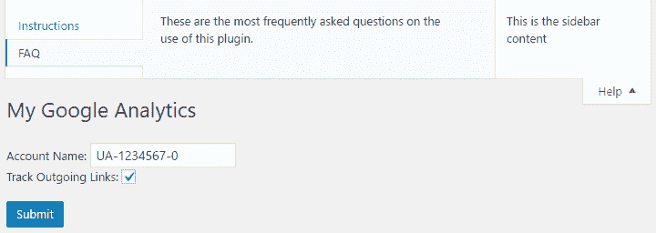

# 它是如何工作的...

如在 *处理和存储插件配置数据* 食谱中首次讨论的那样，一些 WordPress 动作钩子的名称包含一个变量元素，允许插件开发者获取在渲染特定页面或提交特定表单数据时执行的代码。在这个例子中，`load-<pagename>` 钩子用于注册一个函数，当用户访问特定的管理页面时，该函数将被执行。

一旦回调发生，函数的代码会检索 WordPress 屏幕对象的引用，该对象包含有关当前显示的屏幕的数据，以及一些用于操作和向页面添加内容的实用函数。食谱中的代码随后继续注册函数，使用 `add_help_tab` 函数渲染帮助标签中两个部分的内容。

`add_help_tab` 函数与我们之前看到的函数略有不同，它期望一个包含单个选项数组的参数。这些选项指示菜单部分的唯一标识符、每个标签上显示的标题以及将渲染标签内容的函数的名称。还可以用名为 content 的参数替换回调参数，它将直接包含要在帮助标签中显示的 HTML 代码。有了这些信息，WordPress 能够在渲染选项页面界面时集成提供的 HTML 代码，包括所有必要的包装代码，以便帮助标签可以打开和关闭，并允许用户在不同部分之间切换。

在这个食谱中使用的另一个功能 `set_help_sidebar` 比使用 `add_help_tab` 的功能还要简单，它只需要一个参数来指示要在帮助部分右侧显示的 HTML 内容。

# 参见

+   *使用 HTML 渲染管理页面内容* 的食谱

# 使用设置 API 渲染管理页面内容

除了通过 HTML 代码创建管理页面之外，WordPress 还提供了一套称为设置 API 的函数，可用于自动化创建复杂的配置页面。虽然将这种渲染技术应用于仅有一小部分选项的插件可能有些过度，但如果您要处理数十或数百个配置字段，这无疑非常有用，因为它简化了为每个单独的项目编写 HTML 代码的任务，只需调用每个项目的单个函数即可。它还提供了一些关于插件配置数据处理和存储的自动化功能。

这个食谱解释了如何使用设置 API 指定配置页面的内容，以及如何为配置页面中最常用的表单字段类型提供渲染函数。它使用了本章中其他食谱相同的配置选项集，以展示两种技术的比较。

# 如何做到...

1.  导航到您的开发安装的 WordPress 插件目录。

1.  创建一个名为`ch3-settings-api`的新目录。

1.  导航到该目录并创建一个名为`ch3-settings-api.php`的新文本文件。

1.  在代码编辑器中打开新文件，并在插件文件顶部添加一个适当的标题，将插件命名为“第三章 - 设置 API”。

1.  添加以下代码行以注册一个函数，该函数将在 WordPress 激活插件时被调用：

```php
register_activation_hook( __FILE__, 
                          'ch3sapi_set_default_options' );
```

1.  将以下代码段添加到提供`ch3sapi_set_default_options`函数实现的代码中，以设置默认插件选项：

```php
function ch3sapi_set_default_options() {
    ch3sapi_get_options();
}
```

1.  添加以下代码以提供`ch3sapi_get_options`函数的实现：

```php
function ch3sapi_get_options() {
    $options = get_option( 'ch3sapi_options', array() );

    $new_options['ga_account_name'] = 'UA-0000000-0';
    $new_options['track_outgoing_links'] = false;

    $merged_options = wp_parse_args( $options, $new_options );

    $compare_options = array_diff_key( $new_options, $options );
    if ( empty( $options ) || !empty( $compare_options ) ) {
        update_option( 'ch3sapi_options', $merged_options );
    }
    return $merged_options;
}
```

1.  添加以下注册函数以将回调与`admin_init`动作钩子相关联：

```php
add_action( 'admin_init', 'ch3sapi_admin_init' );
```

1.  为`ch3sapi_admin_init`函数添加实现，创建插件的设置组并定义其内容：

```php
function ch3sapi_admin_init() {
    // Register a setting group with a validation function
    // so that post data handling is done automatically for us 
    register_setting( 'ch3sapi_settings',
        'ch3sapi_options', 'ch3sapi_validate_options' );

    // Add a new settings section within the group
    add_settings_section( 'ch3sapi_main_section', 'Main Settings',
        'ch3sapi_main_setting_section_callback',
        'ch3sapi_settings_section' );

    // Add each field with its name and function to use for
    // our new settings, put them in our new section 
    add_settings_field( 'ga_account_name', 'Account Name',
        'ch3sapi_display_text_field', 'ch3sapi_settings_section',
        'ch3sapi_main_section',
        array( 'name' => 'ga_account_name' ) );

    add_settings_field( 'track_outgoing_links',
        'Track Outgoing Links', 'ch3sapi_display_check_box',
        'ch3sapi_settings_section', 'ch3sapi_main_section',
        array( 'name' => 'track_outgoing_links' ) );
}
```

1.  声明`ch3sapi_validate_options`函数的主体，该函数在上一节注册设置时声明：

```php
function ch3sapi_validate_options( $input ) {
    foreach ( array( 'ga_account_name' ) as $option_name ) { 
        if ( isset( $input[$option_name] ) ) { 
            $input[$option_name] = 
                sanitize_text_field( $input[$option_name] ); 
        } 
    } 

    foreach ( array( 'track_outgoing_links' ) as $option_name ) { 
        if ( isset( $input[$option_name] ) ) { 
            $input[$option_name] = true; 
        } else { 
            $input[$option_name] = false; 
        } 
    }
    return $input;  
}
```

1.  声明`ch3sapi_main_setting_section_callback`函数的主体，该函数在创建设置部分时声明：

```php
function ch3sapi_main_setting_section_callback() { ?>
    <p>This is the main configuration section.</p>
<?php }
```

1.  为在设置部分添加文本字段时声明的`ch3sapi_display_text_field`函数提供实现：

```php
function ch3sapi_display_text_field( $data = array() ) {
    extract( $data );
    $options = ch3sapi_get_options();
    ?>
    <input type="text" name="ch3sapi_options[<?php echo $name; ?>]"
           value="<?php echo esc_html( $options[$name] ); ?>"/>
    <br />
<?php }
```

1.  声明并定义`ch3sapi_display_check_box`函数，当在设置部分添加复选框时声明：

```php
function ch3sapi_display_check_box( $data = array() ) {
    extract ( $data );
    $options = ch3sapi_get_options();
    ?>
    <input type="checkbox" 
           name="ch3sapi_options[<?php echo $name;  ?>]"
           <?php checked( $options[$name] ); ?>/>
<?php }
```

1.  添加以下代码行以注册一个函数，该函数将在 WordPress 准备数据以显示站点管理菜单时被调用：

```php
add_action( 'admin_menu', 'ch3sapi_settings_menu' );
```

1.  为`ch3sapi_settings_menu`函数的实现提供代码：

```php
function ch3sapi_settings_menu() {
    add_options_page( 'My Google Analytics Configuration',
        'My Google Analytics - Settings API', 'manage_options',
        'ch3sapi-my-google-analytics', 'ch3sapi_config_page' );
}
```

1.  为在声明新选项页面时定义的`ch3sapi_config_page`函数添加定义：

```php
function ch3sapi_config_page() { ?>
    <div id="ch3sapi-general" class="wrap">
    <h2>My Google Analytics - Settings API</h2>

    <form name="ch3sapi_options_form_settings_api" method="post"
          action="options.php">

    <?php settings_fields( 'ch3sapi_settings' ); ?>
    <?php do_settings_sections( 'ch3sapi_settings_section' ); ?>

    <input type="submit" value="Submit" class="button-primary" />
    </form></div>
<?php }
```

1.  保存并关闭插件文件。

1.  导航到管理区域的插件菜单。

1.  激活您的新插件。

1.  导航到设置菜单并点击“我的谷歌分析 - 设置 API”菜单项，以查看此插件的配置页面。

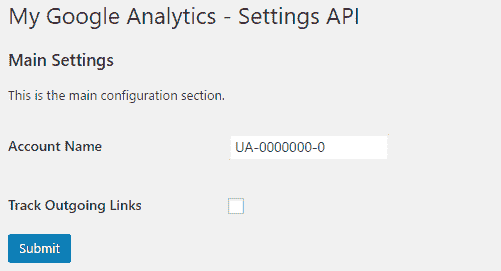

1.  对选项进行修改并提交，以查看 WordPress 是否能够自动处理这些选项，而无需编写保存选项的显式代码。

# 它是如何工作的...

设置 API 是一个复杂的回调系列，允许插件开发者简化管理页面的创建，并自动存储用户选项。

这个自包含的插件配方从创建一组新的默认选项开始，以避免意外删除先前配方中的选项。

代码继续注册一个函数，当使用`admin_init`动作钩子准备显示管理页面时将被调用。在调用时，回调函数负责注册一个新的设置组、属于此组的设置节段以及将在节段内显示所需选项的两个字段。如本代码所示，注册了额外的函数以验证用户提交的数据、在节段开头显示自定义文本以及显示捕获和显示用户输入所需的不同类型的字段。

仔细查看刚刚使用的每个函数，第一个函数有三个参数，如下所示：

```php
register_setting( $option_group, $option_name, $sanitize_callback );
```

在这些参数中，第一个选项是设置组的唯一标识符，第二个是用于在站点数据库中存储配置数据的选项数组的名称，而第三个是用于接收用户输入进行验证的回调函数的名称。

接下来是本例中使用的第二个函数`add_settings_section`，它所需的四个参数分别表示节段的唯一标识符、在渲染节段时显示的标题字符串、用于为节段显示描述的回调函数，以及最后用于在插件代码中渲染所有类似函数的页面标识符：

```php
add_settings_section( $id, $title, $callback, $page );
```

在本食谱中使用的 Settings API 的第三个函数`add_settings_field`被多次调用，以定义构成每个节段的字段：

```php
add_settings_field( $id, $title, $callback, $page, $section, [$args] );
```

与其他函数类似，第一个参数是字段的唯一标识符，第二个参数是将在字段旁边显示的标签，第三个参数是执行以输出显示字段的必要 HTML 代码的回调函数。接下来的三个参数表示字段所属的页面、包含字段的节段，以及可选的数组，其中包含要发送到回调函数的额外数据。如本食谱的其余部分所示，我们利用这个可选的额外数据参数将数据发送到字段处理函数，使它们更加通用。

当访问配置页面时，使用常规 HTML 代码创建顶级表单，将操作设置为`options.php`。此脚本负责自动化处理用户数据。表单的其余部分相当简单，因为它是由`settings_fields`和`do_settings_sections`函数生成的。

当它们被调用时，将渲染之前创建的设置组，然后调用设计用于绘制它包含的所有节段以及这些节段中注册的所有字段的函数。

虽然设置 API 提供了对表单字段布局的完全控制，但其使用决定了配置页面的总体布局，创建了一个包含每个字段标签的第一列和由插件的回调函数生成的代码的第二列的两列表格。当调用每种类型字段的函数时，它们会接收到与每个字段相关联的数组数据，并使用它来检索当前字段的值，并指定每个字段在用户输入后要存储的名称。

最后一个拼图是当设置组首次创建时注册的验证函数。此函数的目的是允许插件开发者在使用表单提交用户数据时执行数据类型或内容验证，类似于我们在*处理和存储插件配置数据*配方中验证用户提交数据的方式。

# 更多...

虽然这个配方展示了如何为两种数据字段创建渲染函数，但你可能需要为你的插件提供其他类型的选项。以下是一些代码示例，展示了如何处理在插件选项中使用的最典型数据类型。

# 渲染下拉列表设置字段

在添加选择列表本身之前，我们首先会在`ch3sapi_get_options`函数中添加一行来初始化`select_list`选项，如果未在从数据库检索的选项中找到：`$new_options['select_list'] = 'First';`

渲染下拉列表的下一步是提供所有可能的选项列表，包括选项名称，在可选的字段数据数组中。以下是一个调用`add_settings_field`函数的示例，其中包含此类列表：

```php
add_settings_field( 'select_list', 'Select List',
    'ch3sapi_select_list', 'ch3sapi_settings_section',
    'ch3sapi_main_section',
    array( 'name' => 'select_list',
           'choices' => array( 'First', 'Second', 'Third' ) ) );
```

使用这些信息，我们可以为`ch3sapi_select_list`函数提供一个实现，该函数将能够使用`choices`数组来渲染 HTML 选择元素：

```php
function ch3sapi_select_list( $data = array() ) {
    extract ( $data );
    $options = ch3sapi_get_options();
    ?>
    <select name="ch3sapi_options[<?php echo $name; ?>]">
        <?php foreach( $choices as $item ) { ?>
        <option value="<?php echo $item; ?>"
        <?php selected( $options[$name] == $item ); ?>>
        <?php echo $item; ?></option>;
    <?php } ?>
    </select>
<?php }
```

# 渲染文本区域设置字段

配置页面中常用的另一种字段类型是多行文本区域。同样，如果未找到此新选项的默认值，我们需要更新`ch3sapi_get_options`函数。完成此操作后，`add_settings_field`函数与配方中显示的文本和复选框示例相同，而字段渲染代码如下：

```php
function ch3sapi_display_text_area( $data = array() ) {
    extract ( $data );
    $options = ch3sapi_get_options();
    ?>
    <textarea type="text" name="ch3sapi_options[<?php echo $name; ?>]"
              rows="5" cols="30">
        <?php echo esc_html ( $options[$name] ); ?></textarea>
<?php }
```

# 参见

+   使用 HTML 渲染管理页面内容的配方

+   处理和存储插件配置数据的配方

# 从操作和过滤器钩子访问用户设置

在为我们的插件配置创建默认值集并创建一个界面以允许用户修改和更新这些值之后，我们现在可以开始使用这些选项在页面使用我们的附加插件功能渲染时使用。回到在第二章中创建的 Google Analytics 示例，*插件框架基础*，这个做法展示了如何使用熟悉的函数访问插件选项数据，从而使现有代码更加灵活。

# 准备工作

您应该已经遵循了*添加自定义帮助页面*的做法，并且生成的插件应在您的开发站点中处于活动状态。或者，您可以从下载的代码包中获取生成的代码（`Chapter 3/ch2-page-header-output/ch2-page-header-output-v8.php`）。在开始此做法之前，您应将文件`ch2-page-header-output-v8.php`重命名为`ch2-page-header-output.php`。

# 如何做到这一点...

1.  导航到您开发安装的 WordPress 插件目录中的`ch2-page-header-output`文件夹。

1.  在文本编辑器中打开`ch2-page-header-output.php`文件。

1.  修改`ch2pho_page_header_output`函数的实现以检索插件选项数组并使用存储的账户号码将其嵌入页面页眉代码中。新的部分以粗体显示：

```php
function ch2pho_page_header_output() {
    $options = ch2pho_get_options();
    ?>
    <script>
        (function(i,s,o,g,r,a,m){i['GoogleAnalyticsObject']=r;
        i[r]=i[r]||function(){
        (i[r].q=i[r].q||[]).push(arguments)},i[r].l=1*new Date();
        a=s.createElement(o),
        m=s.getElementsByTagName(o)[0];a.async=1;a.src=g;
        m.parentNode.insertBefore(a,m)})(window,document,'script',
        'https://www.google-analytics.com/analytics.js','ga');

        ga( 'create', '<?php echo $options['ga_account_name']; ?>',
            'auto' );
        ga('send', 'pageview');
    </script>
<?php }
```

1.  在注册动作钩子以过滤所有帖子内容和页面内容之前，添加代码以检查是否应该进行出站代码跟踪，其中所做的更改以粗体显示：

```php
$options = ch2pho_get_options();

if ( true == $options['track_outgoing_links'] ) {
    add_filter( 'the_content','ch2lfa_link_filter_analytics' );
}
```

1.  使用相同的检查来确定是否应该添加页面页脚代码以提供出站链接跟踪所需的 JavaScript，其中所做的更改以粗体显示：

```php
if ( true == $options['track_outgoing_links'] ) { 
    add_action( 'wp_footer', 'ch2lfa_footer_analytics_code' ); 
}
```

1.  保存并关闭插件文件。

1.  访问网站并查看页面源代码，以查看之前的`UA-0000000-0`已被插件配置页面中保存的最后一个值所替换。您还可以通过更改跟踪出站链接选项来设置是否显示链接跟踪代码。

# 它是如何工作的...

如本章前面所述，在创建管理页面时，我们的自定义`ch2pho_get_options`函数可以查询网站的数据库并返回它包含的插件配置数据。这些数据可以是以单个变量或信息数组的形式。在这种情况下，根据本章前面找到的*使用数组存储用户设置*的做法，使用了一个数组并访问它，在调用页眉和页脚动作钩子以及页面内容正在被过滤时注入值。

# 参见

+   使用数组存储用户设置的做法

# 使用元框格式化管理页面

随着插件的管理页面变得越来越长和复杂，将其内容分成多个部分变得很重要。虽然标准的 HTML 标题或`fieldset`标签可以用于此任务，但它们缺乏元框的实用性和美观的视觉表现。元框是出现在大多数默认 WordPress 内容编辑器和主管理仪表板页面上的容器。

除了视觉组织内容外，元框非常强大，因为它们允许网站管理员折叠他们不使用的配置部分，根据他们的需求重新排序部分，甚至隐藏他们不使用的元素。

本食谱解释了如何将本章早期创建的基于 HTML 的配置页面转换为使用内置元框系统。

# 准备工作

你应该已经遵循了“从动作和过滤器钩子访问用户设置”的食谱。或者，你可以从下载的代码包中获取结果代码（`第三章/ch2-page-header-output/ch2-page-header-output-v9.php`）。在开始食谱之前，你应该将文件`ch2-page-header-output-v9.php`重命名为`ch2-page-header-output.php`。

# 如何操作...

1.  浏览到您网站管理区域的插件部分，并停用`第二章 - 页面头部输出`插件。

1.  导航到您开发安装的 WordPress 插件目录中的`ch2-page-header-output`文件夹。

1.  将文件`ch2-page-header-output.php`复制到`ch2-page-header-output-metaboxes.php`。

1.  在文本编辑器中打开`ch2-page-header-output-metaboxes.php`文件。

1.  将标题中的插件名称从`第二章 - 页面头部输出`更改为`第二章 - 页面头部输出元框`。

1.  在顶部插件注释下方，添加一行代码来声明一个全局变量以保存选项页的标识符：

```php
global $options_page;
```

1.  在现有代码中找到`ch2pho_settings_menu`函数。

1.  在函数顶部添加一行以指向全局选项页面变量：

```php
global $options_page;
```

1.  在插件代码中找到`ch2pho_help_tabs`函数。

1.  在函数体末尾添加以下代码块以创建要在屏幕上绘制的元框，并指定填充这些框的函数：

```php
global $options_page;

add_meta_box( 'ch2pho_general_meta_box', 'General Settings',
              'ch2pho_plugin_meta_box', $options_page,   
              'normal', 'core' );

add_meta_box( 'ch2pho_second_meta_box', 'Second Settings Section',
              'ch2pho_second_meta_box', $options_page, 
              'normal', 'core' );
```

1.  在插件代码文件末尾添加一行代码，以注册一个当管理页面样式被放入队列时调用的函数：

```php
add_action( 'admin_enqueue_scripts', 'ch2pho_load_admin_scripts' );
```

1.  插入以下代码段以提供`ch2pho_load_admin_scripts`函数的实现：

```php
function ch2pho_load_admin_scripts() {
    global $current_screen;
    global $options_page;

    if ( $current_screen->id == $options_page ) {
        wp_enqueue_script( 'common' );
        wp_enqueue_script( 'wp-lists' );
        wp_enqueue_script( 'postbox' );
    }
}
```

1.  创建一个新的函数来实现之前声明过的`ch2pho_plugin_meta_box`函数。注意，函数体是直接复制粘贴之前用于渲染“账户名称”和“跟踪外链”字段的代码：

```php
function ch2pho_plugin_meta_box( $options ) { ?>
    Account Name: <input type="text" name="ga_account_name"
        value="<?php echo esc_html( $options['ga_account_name'] );
        ?>"/><br />

    Track Outgoing Links <input type="checkbox"
        name="track_outgoing_links" 
        <?php checked( $options['track_outgoing_links'] ); ?>/>
        <br /> 
<?php }
```

1.  添加以下代码以提供 `ch2pho_second_meta_box` 函数的实现来显示第二个元框。这个第二个框将没有任何实际内容。它仅用于说明一些元框功能：

```php
function ch2pho_second_meta_box( $options ) { ?>
    <p>This is the content of the second metabox.</p>
<?php }
```

1.  在你的代码中找到 `ch2pho_config_page` 函数的代码，并按以下代码进行修改，其中所有新的代码段都加粗。删除渲染 `ga_account_name` 和 `track_outgoing_links` 字段的原始代码：

```php
function ch2pho_config_page() {
    // Retrieve plugin configuration options from database
    $options = ch2pho_get_options();
    global $options_page;
    ?>

    <div id="ch2pho-general" class="wrap">
    <h2>My Google Analytics</h2><br />

    <?php if ( isset( $_GET['message'] ) && 
               $_GET['message'] == '1' ) { ?>
        <div id='message' class='updated fade'>
        <p><strong>Settings Saved</strong></p>
        </div>
    <?php } ?>

    <form action="admin-post.php" method="post">
    <input type="hidden" name="action"
           value="save_ch2pho_options" />

    <!-- Adding security through hidden referrer field -->
    <?php wp_nonce_field( 'ch2pho' ); ?>

    <!-- Security fields for meta box save processing -->
 <?php wp_nonce_field( 'closedpostboxes',                          'closedpostboxesnonce', false ); ?>
 <?php wp_nonce_field( 'meta-box-order', 'meta-box-order-nonce', false ); ?>

    <div id="poststuff" class="metabox-holder">
 <div id="post-body">
 <div id="post-body-content">
 <?php do_meta_boxes( $options_page, 'normal', 
                                                $options ); ?>
            <input type="submit" value="Submit"
                   class="button-primary"/>
            </div>
 </div>
 <br class="clear"/>
 </div>
    </form>
    </div>

    <script type="text/javascript">
 //<![CDATA[
 jQuery( document ).ready( function( $ ) {
 // close postboxes that should be closed
 $( '.if-js-closed' ) .removeClass( 'if-js-closed' ).
 addClass( 'closed' );

 // postboxes setup
 postboxes.add_postbox_toggles(
            '<?php echo $options_page; ?>' );
 });

 //]]>
 </script>
<?php }
```

1.  保存并关闭插件文件。

1.  激活你的新插件。

1.  点击左侧导航菜单中的设置部分以展开它。

1.  在树中点击“我的 Google Analytics”，以显示重新设计的管理页面。

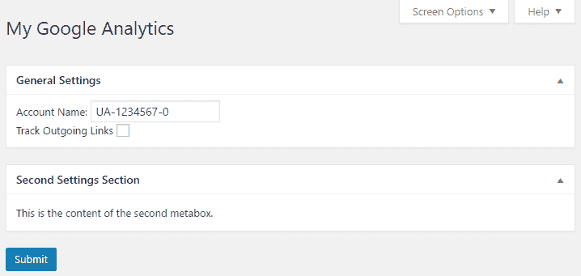

1.  拖放其中一个元框以重新排序它们。

1.  点击其中一个元框标题以折叠该部分。

1.  点击右上角的屏幕选项菜单以打开一个菜单来控制所有元框的可见性。

1.  将鼠标移至管理菜单的另一部分，然后返回到“我的 Google Analytics”部分，你会看到对配置页面布局所做的所有更改都已保留。

# 它是如何工作的...

元框功能设置是在 `load-<pagename>` 回调函数中完成的，通过多次调用 `add_meta_box` 函数，根据屏幕上要显示的框的数量。

函数接受多个参数，如下所示：

```php
add_meta_box( $id, $title, $callback, [$page], [$context], [$priority],
              [$callback_args] );
```

在此函数中查看参数，第一个是元框的唯一标识符，第二个是作为框本身标题显示的字符串，也是将在屏幕选项配置标签中显示的名称。第三个参数是要调用的函数名称，用于渲染元框的内容。第四个参数标识将渲染元框的页面。在这种情况下，我们使用全局变量 `$options_page` 的值作为此参数，以确保它将分配正确的页面标识符。全局 PHP 变量是强大的工具，可以帮助我们在插件中的函数之间共享数据。通过在变量名称前使用关键字 `global`，网站的 PHP 解释器将知道它必须访问公共内存空间以存储和访问信息。

第五个参数是一个任意名称，表示应该显示框的章节名称。当向 WordPress 发送请求以渲染属于特定章节的所有元框时，将使用此名称。为此功能正确工作，唯一的要求是在调用 `do_meta_boxes` 函数时使用相同的名称。

第六个参数表示注册的元框在其所属部分内的优先级，相对于其他元框。如果所有框具有相同的优先级，则调用`add_meta_box`函数的顺序将决定它们的原始绘制顺序。当然，正如在这个食谱中所看到的，这个顺序可以通过用户的简单拖放操作来覆盖。最后一个参数是可选的，可以用来向将渲染元框内容的函数发送信息。

虽然实际上可以从其他动作钩子回调中调用`add_meta_box`，但只有在一个`load-<pagename>`回调期间注册的元框会显示在屏幕选项列表中，以便用户控制它们的可见性。您可能故意在动作钩子之外创建元框，以确保重要的框总是显示出来，并为所有用户提供标准化的用户体验。

除了调用`add_meta_box`之外，我们还需要在页面加载函数中多次调用`wp_enqueue_script`，以请求在渲染我们的配置页面时加载三个 JavaScript 脚本。这些脚本提供了在食谱末尾展示的拖放、最小化和隐藏功能，只需要从我们的代码中通过 JavaScript 函数执行少量初始化调用。

一旦创建了元框，大部分工作都是在选项页面渲染函数中完成的。正如我们在修改后的代码中所看到的，首先要做的是创建新的 nonce 字段。这些唯一的数字将作为页面中的隐藏数据生成，并将用于在配置页面中保存布局更改的认证。接下来，我们创建了一系列具有特定`id`名称的`div`部分，其中包含对`do_meta_boxes`函数的嵌套调用。这些 div 标签用于确保元框使用 WordPress 管理页面样式表进行样式化。

一旦调用，`do_meta_boxes`函数将负责绘制为给定页面（在第一个参数中指定）和给定部分（第二个参数中指定）创建的所有元框。它还将任何在第三个函数参数中指定的数据传递给与每个框关联的函数。

页面渲染函数的其余更改是一段 JavaScript 代码，负责关闭用户在之前访问页面时关闭的任何元框部分。它还分配 jQuery 回调到元框上，以便任何用户与它们的交互都会通过向 Web 服务器发送 AJAX 请求保存到网站数据库中。

最后但同样重要的是，元框渲染函数负责渲染每个元框内的内容。它们可以通过输出纯 HTML 来实现这一点。通过将这些函数的完整选项数组传递给这些函数，它们包含的代码可以与之前完全相同，以渲染各种选项字段。

# 参见

+   *使用 HTML 渲染管理页面内容*配方

# 将管理代码从主插件文件中分离出来以优化网站性能

如第二章中所述，*插件框架基础*，WordPress 插件的主代码文件的内容在网站上渲染任何页面时都会被评估，无论是面向访客的页面还是后端管理页面。这意味着大量的 PHP 代码可能会在每次迭代中解析，即使当常规访客浏览网站时，其中一些代码也永远不会激活，这会浪费网站服务器的处理能力。

这方面的一个典型例子就是我们在本章中构建的所有代码示例。虽然这些代码对于网站管理员非常有用，但在常规页面显示时，没有理由让 Web 服务器解析和验证这些代码。因此，最好将这些代码隔离到单独的文件中，只有当有人访问网站仪表板时才会加载和解析。以下配方展示了如何将不太经常需要的代码隔离到单独的文件中，并且只在用户访问网站管理部分时加载它。

# 准备工作

你应该已经遵循了*从默认菜单中隐藏用户不应访问的项目*配方，以便为本配方提供一个起点，并且生成的插件仍然在你的开发网站上处于活动状态。或者，你可以从下载的代码包中获取生成的代码（`Chapter 3/ch3-hide-menu-item/ch3-hide-menu-item.php`）。

# 如何操作...

1.  导航到你的开发安装的 WordPress 插件目录中的`ch3-hide-menu-item`文件夹。

1.  在文本编辑器中打开`ch3-hide-menu-item.php`文件。

1.  在同一目录下创建一个新的 PHP 代码文件，命名为`ch3-hide-menu-item-admin-functions.php`，并在文本编辑器中打开它。

1.  将对`add_action`函数的调用和`ch3hmi_hide_menu_item`函数的定义移动到新文件中，在标准 PHP 开放标签之前，并检查常量的定义：

```php
<?php

if ( !defined( 'ch3hmi' ) ) {
    exit;
}
```

1.  在主插件代码文件（`ch3-hide-menu-item.php`）中，添加代码以定义一个常量并检查当前正在渲染的页面是否为管理页面，如果是，则继续加载管理函数：

```php
define( 'ch3hmi', 1 );

if ( is_admin() ) {
    require plugin_dir_path( __FILE__ ) .
        'ch3-hide-menu-item-admin-functions.php';
}
```

1.  保存并关闭插件文件。

1.  虽然插件将继续像以前一样工作，但动作钩子注册代码只有在显示管理页面时才会被处理。

# 它是如何工作的...

`is_admin` 函数用于快速判断当前正在渲染的页面是否为管理页面。如果是，我们的插件代码使用标准的 PHP `include` 函数来加载和执行一个单独文件的内容。在这种情况下，该文件是位于插件目录中的第二个 PHP 文件。为了使插件文件的位置更加灵活，我们使用 WordPress 的 `plugin_dir_path` 函数构建包含管理功能的文件路径。

虽然将如此少的代码放在单独的文件中的好处很小，但这种方法在处理较大的管理面板时对性能的影响更大。除了不需要在每次页面加载时注册动作钩子外，PHP 解释器在渲染面向前端的页面时也不必确保该第二个文件内容的语法有效。

# 参见

+   *隐藏用户不应从默认菜单访问的项目* 菜谱

# 在用户设置中存储样式表数据

虽然大多数常见的插件选项通常以简单的文本框、复选框或下拉列表的形式呈现给用户，但在某些情况下，需要存储更多文本以供用户设置。一个很好的例子是插件特定的样式表，它允许用户更改插件输出的视觉外观。虽然在本章的 *将样式表加载到格式化插件输出* 菜谱中加载单独的样式表文件效果很好，但这种方法并没有给用户太多自由来更改这些样式规则以更好地与他们的站点设计配合，因为用户对样式表所做的任何更改都会在通过 WordPress 插件升级过程更新插件时被覆盖。

解决这个问题的方法是将样式表数据与配置选项的其他部分一起存储在站点数据库中。这样，在升级时信息将保持完整。本菜谱展示了如何将上一章创建的插件更改为使用外部文件初始化插件选项，如何创建一个管理面板允许用户修改或重置样式表，以及如何使用新数据将样式信息输出到页面标题。本章学到的许多经验都将用于创建最终结果。

# 准备工作

你应该已经遵循了上一章中的 *将样式表加载到格式化插件输出* 菜谱，以便为本菜谱提供一个起点。或者，你可以在开始菜谱之前，从下载的代码包中获取结果代码（`第二章/ch2-private-item-text/ch2-private-item-text-v2.php`），并将文件重命名为 `ch2-private-item-text.php`。

# 如何做到这一点...

1.  导航到你的开发安装的 WordPress 插件目录中的 `ch2-private-item-text` 文件夹。

1.  在文本编辑器中打开 `ch2-private-item-text.php` 文件。

1.  添加以下代码行以实现激活回调，初始化插件选项，当它被安装或升级时：

```php
register_activation_hook( __FILE__, 'ch2pit_get_options' );

function ch2pit_get_options() {
    $options = get_option( 'ch2pit_options', array() );

    $stylesheet_location = plugin_dir_path( __FILE__ ) . 
                               'stylesheet.css';
    $new_options['stylesheet'] = 
        file_get_contents( $stylesheet_location );

    $merged_options = wp_parse_args( $options, $new_options );
    $compare_options = array_diff_key( $new_options, $options );
    if ( empty( $options ) || !empty( $compare_options ) ) {
        update_option( 'ch2pit_options', $merged_options );
    }
    return $merged_options;
}
```

1.  将以下代码段添加以注册一个在构建菜单时被调用的函数，以便在设置菜单下添加一个附加项：

```php
add_action( 'admin_menu', 'ch2pit_settings_menu' );

function ch2pit_settings_menu() {
    add_options_page( 'Private Item Text Configuration',
         'Private Item Text', 'manage_options',
         'ch2pit-private-item-text', 'ch2pit_config_page' );
}
```

1.  插入以下代码以渲染选项页面。

打印样式表的文本区域应该从新的一行开始，以避免样式表编辑器开头有额外的空格。此外，如果你从这本书的数字副本中复制代码，请确保不要丢失`font-family`中的连字符。

```php
function ch2pit_config_page() {
    // Retrieve plugin configuration options from database
    $options = ch2pit_get_options(); ?>

    <div id="ch2pit-general" class="wrap">
    <h2>Private Item Text</h2>

    <!-- Code to display confirmation messages when settings
         are saved or reset -->
    <?php if ( isset( $_GET['message'] ) &&
               $_GET['message'] == '1' ) { ?>
        <div id='message' class='updated fade'><p>
            <strong>Settings Saved</strong></p></div>
    <?php } elseif ( isset( $_GET['message'] )
                     && $_GET['message'] == '2' ) { ?>
        <div id='message' class='updated fade'><p>
        <strong>Stylesheet reverted to original</strong></p></div>
    <?php } ?>

    <form name="ch2pit_options_form" method="post"
          action="admin-post.php"> 
    <input type="hidden" name="action"
           value="save_ch2pit_options" />
    <?php wp_nonce_field( 'ch2pit' ); ?>

    Stylesheet<br />
<textarea name="stylesheet" rows="10" cols="40" style="font-family:Consolas,Monaco,monospace"><?php echo esc_html ( $options['stylesheet'] ); ?></textarea><br />
    <input type="submit" value="Submit" class="button-primary" />
    <input type="submit" value="Reset" name="resetstyle"
           class="button-primary" />
    </form>
    </div>
<?php }
```

1.  添加以下代码块以注册一个在用户选项保存时被调用的函数，并为该函数提供一个实现：

```php
add_action( 'admin_init', 'ch2pit_admin_init' );

function ch2pit_admin_init() {
    add_action( 'admin_post_save_ch2pit_options',
                'process_ch2pit_options' );
}

function process_ch2pit_options() {
    // Check that user has proper security level
    if ( !current_user_can( 'manage_options' ) ) {
        wp_die( 'Not allowed' );
    }

    // Check if nonce field is present
    check_admin_referer( 'ch2pit' );

    // Retrieve original plugin options array
    $options = ch2pit_get_options();

    if ( isset( $_POST['resetstyle'] ) ) {
        $stylesheet_location = plugin_dir_path( __FILE__ ) . 
                                   'stylesheet.css';
        $options['stylesheet'] =
            file_get_contents( $stylesheet_location ); 
        $message = 2;
    } else {
        // Cycle through all fields and store their values
        // in the options array
        foreach ( array( 'stylesheet' ) as $option_name ) {
            if ( isset( $_POST[$option_name] ) ) {
                $options[$option_name] = $_POST[$option_name];
            }
        } 
        $message = 1;
    }

    // Store updated options array to database
    update_option( 'ch2pit_options', $options );

    // Redirect the page to the configuration form
    wp_redirect( add_query_arg(
                     array(
                         'page' => 'ch2pit-private-item-text',
                         'message' => $message ),
                         admin_url( 'options-general.php' ) ) );
    exit;
}
```

1.  删除与函数`ch2pit_queue_stylesheet`关联的`add_action`函数调用，以及`ch2pit_queue_stylesheet`函数本身。

1.  添加以下代码以将用户可修改的样式表代码添加到页面标题中：

```php
add_action( 'wp_head', 'ch2pit_page_header_output' );

function ch2pit_page_header_output() { ?>
    <style type='text/css'>
    <?php
        $options = ch2pit_get_options();
        echo $options['stylesheet'];
    ?>
    </style>
<?php }
```

1.  保存并关闭插件文件。

1.  从管理界面停用并重新激活“第二章 - 私有项目文本”插件。

1.  导航到设置菜单并选择“私有项目文本”子菜单项，以查看新创建的配置面板，其中包含提交更改到样式表或将其重置为其初始状态的功能，如下面的截图所示：

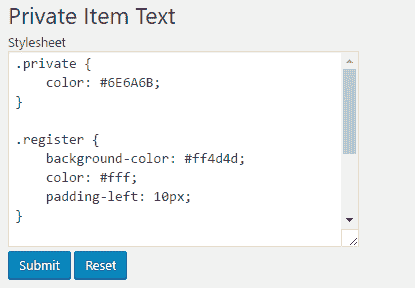

1.  访问网站并查看页面源代码，以查看在配置页面中输入的样式表数据出现在 HTML 头中：

```php
<style type='text/css'>
.private {
    color: #6E6A6B;
}

.register {
    background-color: #ff4d4d;
    color: #fff;
    padding-left: 10px;
}
</style>
```

# 它是如何工作的...

重新使用本章中涵盖的许多元素，这个配方创建了一个简单而有效的配置界面，允许用户更改用于在帖子中突出显示私有文本的颜色，而不是将此颜色硬编码在插件文件中。

话虽如此，这个配方确实引入了两个新概念。第一个是通过从文件中读取数据来初始化插件选项，而不是将所有这些信息存储在 PHP 代码中。当处理具有大量内容（如样式表）的选项时，这种技术很有用。

下一个感兴趣的部分是在数据处理函数中，代码检查在重置样式表和提交用户更改以存储在网站数据库之间的哪个按钮被按下。根据结果，处理代码将要么从文件中读取初始样式表，要么使用用户提交的数据来更新配置数据。

除了这两个新概念之外，另一个主要变化是对输出引用外部样式表文件的头部代码的代码进行了修改。在这个新版本中，对直接将存储在选项表中的样式表内容输出到浏览器的内容进行了更改。

应该注意的是，本配方在将 CSS 代码添加到页面标题之前不会检查用户是否输入了有效的 CSS 代码，因为验证这一点目前可能过于复杂。可以根据需要使用库，如 CSSTidy（[`csstidy.sourceforge.net/`](http://csstidy.sourceforge.net/））来完成此任务。

# 参见

+   在第二章中，*创建* *一个* *新的* *包围* *短代码*的配方，*插件框架基础*

+   在第二章中，*加载样式表以格式化插件输出*的配方，*插件框架基础*

# 从单个管理页面管理多套用户设置

在本章中，您已经学习了如何创建配置页面来管理我们插件的单套配置选项。在某些情况下，仅能指定单套选项可能不足以满足需求。例如，回顾上一章中创建的 Twitter 嵌入短代码插件，单个配置面板只会允许用户指定一套选项，例如所需的 Twitter 流尺寸或要显示的推文数量。

一个更灵活的解决方案是允许用户指定多套配置选项，然后可以通过额外的短代码参数（例如，`[twitterfeed user_name="WordPress" option_id="2"]`）调用它们。

当您首先想到配置此类插件时，可能会想到创建一个具有子菜单的多级菜单项来存储多个不同的设置，但这种方法将为用户导航产生一个非常不自然的界面。更好的方法是使用单个面板，但给用户一个选择多个要修改的选项集的方法。

在本配方中，您将学习如何增强之前创建的 Twitter 流短代码插件，使其能够从插件配置面板控制嵌入流的宽度和要显示的推文数量，并使用户能够指定多个显示尺寸。

# 准备工作

您应该已经遵循了上一章中的*创建带参数的新短代码*配方，以便为本配方提供一个起点。或者，您可以从下载的代码包中获取结果代码（`Chapter 2/ch2-twitter-embed/ch2-twitter-embed.php`）。

# 如何操作...

1.  导航到您开发安装的 WordPress 插件目录中的`ch2-twitter-embed`文件夹。

1.  在文本编辑器中打开`ch2-twitter-embed.php`文件。

1.  添加以下代码行以实现激活回调，以便在安装或升级时初始化插件选项：

```php
register_activation_hook( __FILE__, 
                          'ch2te_set_default_options_array' );

function ch2te_set_default_options_array() {
    ch2te_get_options();
}

function ch2te_get_options( $id = 1 ) {
    $options = get_option( 'ch2te_options_' . $id, array() );

    $new_options['setting_name'] = 'Default';
    $new_options['width'] = 560;
    $new_options['number_of_tweets'] = 3;

    $merged_options = wp_parse_args( $options, $new_options );
    $compare_options = array_diff_key( $new_options, $options );
    if ( empty( $options ) || !empty( $compare_options ) ) {
        update_option( 'ch2te_options_' . $id, $merged_options );
    }
    return $merged_options;
}
```

1.  插入以下代码段以注册一个在组装管理菜单时被调用的函数。当发生这种情况时，回调函数会将一个项目添加到设置菜单，并指定用于渲染配置页面的函数：

```php
// Assign function to be called when admin menu is constructed
add_action( 'admin_menu', 'ch2te_settings_menu' );

// Function to add item to Settings menu and
// specify function to display options page content
function ch2te_settings_menu() {
    add_options_page( 'Twitter Embed Configuration',
                      'Twitter Embed', 'manage_options',
                      'ch2te-twitter-embed', 'ch2te_config_page' );
}
```

1.  将以下代码添加以实现配置页面渲染函数：

```php
// Function to display options page content 
function ch2te_config_page() { 
    // Retrieve plugin configuration options from database 
    if ( isset( $_GET['option_id'] ) ) {
        $option_id = intval( $_GET['option_id'] ); 
    } elseif ( isset( $_POST['option_id'] ) ) {
        $option_id = intval( $_POST['option_id'] ); 
    } else {
        $option_id = 1;
    }

    $options = ch2te_get_options( $option_id ); ?>  

    <div id="ch2te-general" class="wrap"> 
    <h2>Twitter Embed</h2> 

    <!-- Display message when settings are saved -->
    <?php if ( isset( $_GET['message'] ) &&
               $_GET['message'] == '1' ) { ?>
        <div id='message' class='updated fade'>
            <p><strong>Settings Saved</strong></p></div>
    <?php } ?>

    <!-- Option selector -->
    <div id="icon-themes" class="icon32"><br></div>
    <h2 class="nav-tab-wrapper">
    <?php for ( $counter = 1; $counter <= 5; $counter++ ) {
        $temp_options = ch2te_get_options( $counter ); 
        $class = ( $counter == $option_id ) ?
                 ' nav-tab-active' : ''; ?> 

    <a class="nav-tab<?php echo $class; ?>" href="<?php echo 
      add_query_arg( array( 'page' => 'ch2te-twitter-embed', 'option_id' => $counter ), admin_url(  'options-general.php' ) ); ?>"><?php echo $counter; ?><?php if ( $temp_options !== false ) echo ' (' .  $temp_options['setting_name'] . ')'; else echo ' (Empty)'; ?></a>
    <?php } ?>
    </h2><br />    

    <!-- Main options form --> 
    <form name="ch2te_options_form" method="post" 
          action="admin-post.php">     
    <input type="hidden" name="action"
           value="save_ch2te_options" /> 
    <input type="hidden" name="option_id" 
                         value="<?php echo $option_id; ?>" /> 
    <?php wp_nonce_field( 'ch2te' ); ?> 
    <table> 
        <tr><td>Setting name</td> 
            <td><input type="text" name="setting_name" 
      value="<?php echo esc_html( $options['setting_name'] ); ?>"/>
            </td>
        </tr> 
        <tr><td>Feed width</td> 
            <td><input type="text" name="width"
        value="<?php echo esc_html( $options['width'] ); ?>"/></td>
        </tr> 
        <tr><td>Number of Tweets to display</td> 
            <td><input type="text" name="number_of_tweets" value=
        "<?php echo esc_html( $options['number_of_tweets'] ); ?>"
            /></td>
        </tr>        
    </table><br /> 
    <input type="submit" value="Submit" class="button-primary" /> 
    </form> 
    </div> 
<?php }
```

1.  将以下代码块添加到注册一个函数，该函数将在提交到网站时处理用户选项：

```php
add_action( 'admin_init', 'ch2te_admin_init' ); 

function ch2te_admin_init() { 
    add_action( 'admin_post_save_ch2te_options',
                'process_ch2te_options' ); 
}
```

1.  将以下代码添加以实现之前代码块中声明的`process_ch2te_options`函数：

```php
// Function to process user data submission 
function process_ch2te_options() { 
    // Check that user has proper security level 
    if ( !current_user_can( 'manage_options' ) ) {
        wp_die( 'Not allowed' ); 
    }

    // Check that nonce field is present 
    check_admin_referer( 'ch2te' );

    // Check if option_id field was present  
    if ( isset( $_POST['option_id'] ) ) {
        $option_id = intval( $_POST['option_id'] ); 
    } else {
        $option_id = 1; 
    }

    // Build option name and retrieve options 
    $options = ch2te_get_options( $option_id ); 

    // Cycle through all text fields and store their values 
    foreach ( array( 'setting_name' ) as $param_name ) { 
        if ( isset( $_POST[$param_name] ) ) { 
            $options[$param_name] = sanitize_text_field(
                                        $_POST[$param_name] ); 
        } 
    }

    // Cycle through all numeric fields, convert to int and store
    foreach( array( 'width', 
                    'number_of_tweets' ) as $param_name ) { 
        if ( isset( $_POST[$param_name] ) ) { 
            $options[$param_name] = intval( $_POST[$param_name] ); 
        } 
    }

    // Store updated options array to database 
    $options_name = 'ch2te_options_' . $option_id; 
    update_option( $options_name, $options );

    $clean_address = add_query_arg( array( 'message' => 1,  
                         'option_id' => $option_id, 
                         'page' => 'ch2te-twitter-embed' ), 
                         admin_url( 'options-general.php' ) );
    wp_redirect( $clean_address ); 
    exit; 
}
```

1.  找到`ch2te_twitter_embed_shortcode`函数，并按以下方式修改它以接受新的`option_id`参数并加载插件选项以生成所需的输出。配方中的更改以粗体显示：

```php
function ch2te_twitter_embed_shortcode( $atts ) { 
    extract( shortcode_atts( array( 
                'user_name' => 'ylefebvre', 
                'option_id' => '1' 
           ), $atts ) );

 if ( intval( $option_id ) < 1 || intval( $option_id ) > 5 ) { 
 $option_id = 1; 
 }
    $options = ch2te_get_options( $option_id );    if ( !empty( $user_name ) ) {
        $output = '<a class="twitter-timeline" href="'; 
        $output .= esc_url( 'https://twitter.com/' . $user_name );
 $output .= '" data-width="' . $options['width'] . '" ';
 $output .= 'data-tweet-limit="';
        $output .= $options['number_of_tweets'];
        $output .= '">Tweets by ' . esc_html( $user_name );
        $output .= '</a><script async ';
        $output .= 'src="img/"';
        $output .= ' charset="utf-8"></script>';
    } else {
        $output = '';
    }
    return $output; 
}
```

1.  保存并关闭插件文件。

1.  从管理界面停用然后激活`第二章 - Twitter 嵌入`插件以执行其激活函数并创建默认设置。

1.  导航到设置菜单并选择 Twitter 嵌入子菜单项，以查看新创建的配置面板，其中显示第一组选项，并且更多选项可通过页面顶部的下拉列表访问。

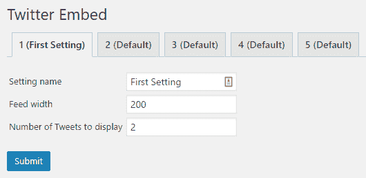

1.  要选择要使用的选项集，请将`option_id`参数添加到用于显示 Twitter 流的短代码中，如下所示：

```php
[twitterfeed user_name="WordPress" option_id="1"]
```

# 它是如何工作的...

此配方展示了我们如何利用`options`数组通过动态创建`options`数组的名称来创建多组选项。在`get_option`函数调用的第一个参数中，我们不是使用特定的选项名称，而是创建一个带有选项 ID 的字符串。此 ID 作为配置页面上的 URL 参数和当处理表单数据时的隐藏文本字段发送。

代码的其余部分与我们在本章中看到的其他示例非常相似，因为访问数组元素的方式保持不变。

# 相关内容

+   使用 HTML 渲染管理页面内容的配方

# 创建网络级别的管理页面

WordPress 的一个非常强大的功能是它能够从单个平台安装中运行多个网站。每个网站都可以有自己的内容和视觉标识，而管理员可以从一个仪表板管理所有网站。当您以多站网络运行 WordPress 时，它会在仪表板中添加一个额外的部分，用于网络级别管理。我们在此章中创建的所有插件都提供网站级别的配置面板，允许按站点定制配置选项。虽然这将是大多数插件所期望的行为，但对于某些配置元素可能更倾向于由网络级别管理员在单一位置设置并应用于网络中的所有网站。

在此配方中，您将学习如何修改我们的 Google Analytics 插件，使其在多站安装上以网络级别配置，在常规 WordPress 配置上以站点级别配置。

# 准备工作

你应该已经遵循了*从操作和过滤器钩子访问用户设置*的配方，并且生成的插件应该在你的开发站点中处于激活状态。或者，你可以从下载的代码包中获取生成的代码（`Chapter 3/ch2-page-header-output/ch2-page-header-output-v9.php`），在开始此配方之前将文件`ch2-page-header-output-v9.php`重命名为`ch2-page-header-output.php`。你还应该能够访问配置为网络模式的 WordPress 安装。你可以在[`codex.wordpress.org/Create_A_Network`](https://codex.wordpress.org/Create_A_Network)上了解更多关于配置 WordPress 以运行多站点的步骤。

# 如何做到这一点...

1.  导航到你的开发安装的 WordPress 插件目录中的`ch2-page-header-output`文件夹。

1.  在文本编辑器中打开`ch2-page-header-output.php`文件。

1.  修改`ch2pho_get_options`函数的实现，用网络级别的版本替换两个选项函数。代码部分显示了需要更改的带有粗体显示的两行：

```php
$options = get_site_option( 'ch2pho_options', array() );
 update_site_option( 'ch2pho_options', $merged_options );
```

1.  定位到添加回调以填充管理菜单的`add_action`函数调用，并在注册回调之前添加代码以检查安装是单站点还是多站点。以下代码显示了带有粗体的新元素：

```php
if ( is_multisite() ) {
 add_action( 'network_admin_menu', 'ch2pho_settings_menu' );
} else {
    add_action( 'admin_menu', 'ch2pho_settings_menu' );
}
```

1.  修改`ch2pho_settings_menu`函数，根据网站是普通站点还是带有以下粗体显示的新部分的 multisite，向不同的菜单中添加新项目：

```php
function ch2pho_settings_menu() {
 if ( is_multisite() ) {
 $options_page = add_submenu_page( 'settings.php',
 'My Google Analytics Configuration', 
            'My Google Analytics',
 'manage_options', 'ch2pho-my-google-analytics',
            'ch2pho_config_page' );
 } else {
 $options_page = add_submenu_page( 'options-general.php',
 'My Google Analytics Configuration',
            'My Google Analytics',
 'manage_options', 'ch2pho-my-google-analytics',   
            'ch2pho_config_page' );
 } 
    if ( !empty( $options_page ) ) {
        add_action( 'load-' . $options_page, 'ch2pho_help_tabs' ); 
    }
}
```

1.  在`process_ch2pho_options`函数中，将`update_option`的调用替换为`update_site_option`的调用：

```php
update_site_option( 'ch2pho_options', $options ); 
```

1.  仍然在`process_ch2pho_options`函数中，在`wp_redirect`函数调用周围进行以下更改，带有以下粗体显示的新元素：

```php
if ( is_multisite() ) {
 $redirect_page = '/network/settings.php';
} else {
 $redirect_page = 'options-general.php';
} 
wp_redirect( add_query_arg( 
             array( 'page' => 'ch2pho-my-google-analytics', 
                    'message' => '1' ), 
             admin_url( $redirect_page ) ) );
```

1.  修改`ch2pho_config`页面函数，以修改表单操作，使其在多站点安装中找到带有以下粗体显示的新代码的`admin-post.php`：

```php
<form method="post"
      action="<?php echo admin_url( 'admin-post.php' ); ?>">
```

1.  保存并关闭插件文件。

1.  在 WordPress 的网络安装中，访问网络管理中的插件部分。

1.  网络激活`Chapter 2 - Page Header Output`插件。你会看到现在在设置菜单下有一个新项目可用。

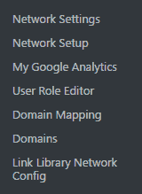

1.  访问网络中的任何站点，查看页面源代码以查看 Google Analytics 代码是否已添加到页面标题中，并且用户账户已配置在我们的管理页面上。

# 它是如何工作的...

当创建网络级别的插件时，`is_multisite`函数非常有用，可以确定站点是否配置为多站点。在配方中，我们使用它来注册在构建不同菜单时（常规单站点管理菜单和网络管理菜单）要调用的回调。我们还使用`is_multisite`函数来注册实际的菜单项，并确定在保存选项后用户应重定向到何处。

这些修改中其他有用的功能包括 `get_site_option` 和 `update_site_option`。当在多站点配置中调用时，这些函数将从数据库中检索网络级别的选项。或者，当在常规的单站点上运行时，它们将默认访问站点级别的选项。通过在我们的更新代码中使用这些函数，我们使所有与站点选项的交互都兼容单站点和多站点安装。

这个菜谱的最后一个元素与我们在网络级别激活此插件的方式有关。这意味着它将在网络中创建的所有站点中都是活跃的。更具体地说，在我们的插件案例中，这意味着所有站点都将输出谷歌分析代码到它们的头部，相关账户在网络上配置时指定一次。

# 参见

+   *从操作和过滤器钩子访问用户设置* 菜谱
