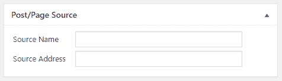
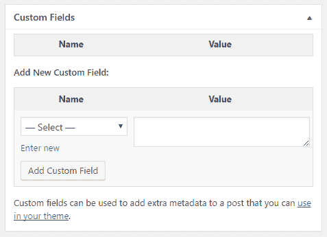
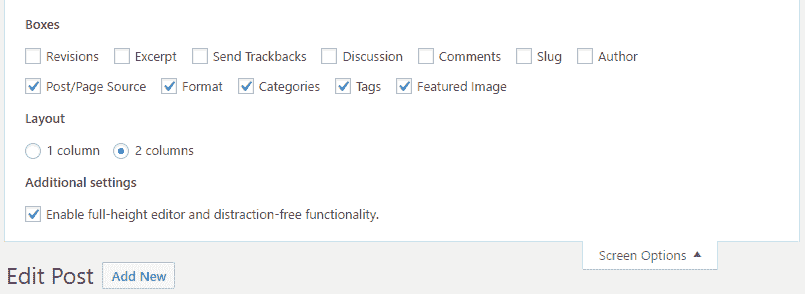
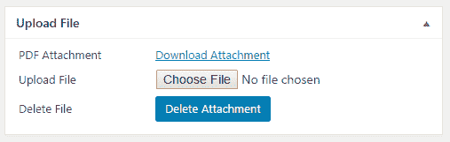
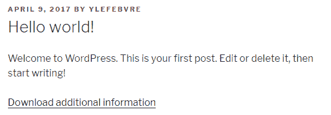

# 第五章：自定义帖子和页面编辑器

在本章中，您将通过以下食谱学习如何通过以下方法自定义核心帖子和页面编辑器：

+   使用自定义元框捕获和显示信息

+   通过过滤器函数显示自定义帖子数据

+   在帖子编辑器中隐藏自定义字段部分

+   扩展帖子编辑器以允许用户直接上传文件

# 简介

在最后几章中，您学习了如何创建自定义插件配置面板和如何设置自定义帖子类型。掌握这些知识后，我们现在将看到如何使用元框自定义帖子和页面编辑器。

元框是创建 WordPress 插件的一个非常有用的工具。它们最初用于将大型管理面板组织成可管理的部分，如第三章中所述，*用户设置和管理页面*，然后继续成为第四章中创建定制界面以编辑自定义帖子类型的关键元素，*自定义帖子类型的威力*。

本章探讨了如何使用元框来增强默认帖子和页面编辑器的功能。虽然 WordPress 的帖子和页面在默认安装中已经提供了很多功能，但自定义数据输入字段在制作比使用自定义字段编辑器更流畅的用户体验方面发挥了重要作用。这些额外字段可以用来存储任何内容。例如，它们可以用来指定博客条目的替代语言链接或将弹出对话框分配给网站上特定的文章。

# 使用自定义元框捕获和显示信息

WordPress 的帖子和页面编辑器组织成一系列可折叠的带有标题的元框。虽然 WordPress 主要负责用所有适当元素填充这些容器，但插件开发者可以通过注册用户元框来插入自己的部分。

为了展示这一功能，本食谱展示了如何添加一个自定义元框，该元框将用于显示和捕获在撰写新帖子或页面条目时使用的源材料的名称和网页地址。

# 准备工作

您应该能够访问一个 WordPress 开发环境，无论是在您的本地计算机上还是在远程服务器上，您将能够加载您的新插件文件。

# 如何操作...

1.  导航到您的开发安装的 WordPress 插件目录。

1.  创建一个名为`ch5-post-source-link`的新目录。

1.  导航到目录并创建一个名为`ch5-post-source-link.php`的文本文件。

1.  在代码编辑器中打开新文件，并在插件文件顶部添加一个适当的标题，将插件命名为`第五章 - 帖子源链接`。

1.  添加以下代码行以注册一个函数，该函数将在 WordPress 准备所有管理区域元框列表时执行：

```php
add_action( 'add_meta_boxes', 'ch5_psl_register_meta_box' );
```

1.  添加以下代码段以提供`ch5_psl_register_meta_box`函数的实现：

```php
function ch5_psl_register_meta_box() { 
    add_meta_box( 'ch5_psl_source_meta_box', 'Post/Page Source',
                  'ch5_psl_source_meta_box', 'post', 'normal'); 
    add_meta_box( 'ch5_psl_source_meta_box', 'Post/Page Source',
                  'ch5_psl_source_meta_box', 'page', 'normal'); 
} 
```

1.  插入以下代码以提供`ch5_psl_source_meta_box`函数的实现，该函数负责渲染元框内容：

```php
function ch5_psl_source_meta_box( $post ) {  
    // Retrieve current source name and address for post 
    $post_source_name =
        esc_html( get_post_meta( $post->ID, 'post_source_name',
                                 true ) ); 
    $post_source_address =
        esc_html( get_post_meta( $post->ID, 
                                 'post_source_address', 
                                 true ) ); 
    ?> 
    <!-- Display fields to enter source name and address --> 
    <table> 
        <tr> 
            <td style="width: 100px">Source Name</td> 
            <td> 
                <input type="text" size="40" 
                       name="post_source_name"
                       value="<?php echo $post_source_name; ?>" /> 
            </td> 
        </tr> 
        <tr> 
            <td>Source Address</td> 
            <td> 
                <input type="text" size="40" 
                       name="post_source_address"
                       value="<?php echo $post_source_address; ?>"
                /> 
            </td> 
        </tr> 
    </table> 
<?php } 
```

1.  插入以下代码块以注册一个函数，该函数将在任何类型的帖子保存时被调用：

```php
add_action( 'save_post', 'ch5_psl_save_source_data', 10, 2 ); 
```

1.  添加以下代码段以提供`ch5_psl_save_source_data`函数的实现：

```php
function ch5_psl_save_source_data( $post_id = false,  
                                   $post = false ) { 
    // Check post type for posts or pages 
    if ( 'post' == $post->post_type || 
         'page' == $post->post_type ) { 
        // Store data in post meta table if present in post data 
        if ( isset( $_POST['post_source_name'] ) ) {
            update_post_meta( $post_id, 'post_source_name', 
                sanitize_text_field(
                    $_POST['post_source_name'] ) ); 
        }

        if ( isset( $_POST['post_source_address'] ) ) {
            update_post_meta( $post_id, 'post_source_address', 
                esc_url( $_POST['post_source_address'] ) ); 
        }
    } 
} 
```

1.  保存并关闭插件文件。

1.  导航到插件管理页面并激活“第五章 - 帖子源链接”插件。

1.  前往管理后台的“帖子”部分，点击其中一个条目以打开帖子编辑器，并查看新的“帖子/页面源”元框：



# 它是如何工作的...

每当管理员或内容经理访问平台的后端时，WordPress 都会使用我们在前两章中看到的`add_meta_box`函数为所有内部编辑器（帖子、页面、链接等）创建多个元框。

在这个菜谱中，我们将使用两次`add_meta_box`函数来将新框关联到页面和帖子编辑器，由于我们希望在这两个地方都有相同的功能，因此两次调用都注册了相同的回调函数。由于 WordPress 将帖子存储在同一个数据库表中，它将自动确保两种类型的条目之间具有唯一的 ID。 

我们之前看到的另一个函数是`get_post_meta`，它用于检索与帖子条目关联的自定义元数据。

元框本身的内容使用标准 HTML 显示。由于此框将是更大编辑器的一部分，因此无需担心在此框中声明表单。

一旦创建新的对话框部分，接下来的任务就是通过使用`save_post`动作来存储从附加字段提交的数据。当保存任何类型的帖子时，与该钩子相关联的函数会被调用。当执行时，相关的函数会从 WordPress 接收两个参数，包含正在保存的帖子的 ID 以及迄今为止已处理并准备保存的所有数据的副本。回调函数还可以访问从用户那里接收到的所有服务器帖子数据，并使用`sanitize_text_field`和`esc_url`函数来确保没有接收到恶意内容。

如前一章所述，对于接收多个参数的操作和过滤器，设置`add_action`调用的第四个参数——即`accepted_args`——非常重要。如果没有指定，这些额外的参数将不可用于接收钩子函数。

假设元框只添加到帖子编辑器和页面编辑器中，`ch5_psl_save_source_data`函数中的代码首先检查帖子类型是否设置为帖子或页面。如果是这两种类型之一，它将继续检查源名称和地址字段是否存在帖子数据。如果找到，则对每个字段调用一次`update_post_meta`来将新信息存储在与其所属帖子关联的网站数据库中。调用`update_post_meta`函数实际上会更新帖子自定义字段数据（如果存在）或在新帖子或页面条目中创建它。

# 更多内容...

虽然这个配方专门为帖子编辑器和页面编辑器添加了一个新部分，但可能希望将新字段提供给所有帖子类型，包括自定义类型。

# 向所有帖子类型（包括自定义类型）添加新的元框

这个配方对注册元框调用了两次函数，用于注册帖子编辑器和页面编辑器。由于其他插件创建的自定义类型是未知的，因此这个概念不适合注册所有帖子类型的自定义部分。幸运的是，有一个简单的方法可以通过快速`foreach`循环获取所有帖子类型的数组，以便将新元框与所有帖子编辑器关联起来。

以下代码展示了如何重写`ch5_psl_register_meta_box`函数，以便将新框与所有帖子类型关联：

```php
function ch5_psl_register_meta_box() { 
    $post_types = get_post_types( array(), 'objects' ); 
    foreach ( $post_types as $post_type ) { 
        add_meta_box( 'ch5_psl_post_source_meta_box', 
                      'Post/Page Source', 
                      'ch5_psl_source_meta_box', 
                      $post_type->name, 'normal' );  
    } 
} 
```

# 使用过滤器函数显示自定义帖子数据

一旦我们在帖子编辑器中捕获了额外的数据，下一步逻辑上将是添加代码，以便在访客查看帖子时显示它。在我们的源链接数据的情况下，最合理的地方是在每篇帖子内容之后显示此链接，这可以通过将函数分配给过滤器`the_content`轻松实现。

这个配方解释了如何创建一个过滤器函数，以显示与帖子或页面项关联的源数据，并以干净的链接形式显示。

# 准备工作

你应该已经遵循了*使用自定义元框捕获和显示信息*配方，以便为这个配方提供一个起点，并且生成的插件仍然在你的开发站点中处于活动状态。或者，你可以从 Packt Publishing 网站下载的代码包（[`www.packtpub.com/support`](https://www.packtpub.com/support)）中获取生成的代码（`Chapter 5/ch5-post-source-link/ch5-post-source-link-v1.php`），并将文件重命名为`ch5-post-source-link.php`。

# 如何操作...

1.  导航到你的开发安装的 WordPress 插件目录中的`ch5-post-source-link`文件夹。

1.  在代码编辑器中打开`ch5-post-source-link.php`文件。

1.  添加以下代码行以注册一个在准备显示帖子内容时调用的过滤器函数：

```php
add_filter( 'the_content', 'ch5_psl_display_source_link' );
```

1.  将以下代码段添加到为`ch5_psl_display_source_link`函数提供实现的区域：

```php
function ch5_psl_display_source_link ( $content ) { 
    $post_id = get_the_ID();

    if ( !empty( $post_id ) ) {
        if ( 'post' == get_post_type( $post_id ) ||
             'page' == get_post_type( $post_id ) ) {

            // Retrieve current source name and address for post 
            $post_source_name =
                get_post_meta( $post_id, 'post_source_name', 
                               true ); 
            $post_source_address =
                get_post_meta( $post_id, 'post_source_address', 
                               true ); 

            // Output information to browser 
            if ( !empty( $post_source_name ) && 
                 !empty( $post_source_address ) ) { 
                $content .= '<div class="source_link">Source: '; 
                $content .= '<a href="';
                $content .= esc_url( $post_source_address ); 
                $content .= '">' . esc_html( $post_source_name );
                $content .= '</a></div>';
            } 
        }
    }
    return $content;
} 
```

1.  保存并关闭插件文件。

1.  将源数据添加到您网站上的一个帖子中，并查看它以查看页面上显示的新源链接。


# 它是如何工作的...

类似于在第二章，“插件框架基础”中，在“使用插件过滤器在每个项目内容后添加文本”配方中执行的操作，这个配方使用`the_content`过滤器钩子注册了一个回调，这允许我们在每个已填写源名称和源地址字段的帖子或页面后添加一个额外的链接。我们在回调中使用`get_post_type`函数首先检查显示的项目是否属于这两个类别之一。然后，我们使用`get_post_meta`检索信息，如果两个字段都包含信息，则显示源链接。

我们还使用`esc_url`和`esc_html`函数作为预防措施，确保存储在这两个帖子元字段中的数据是干净的。

# 参见

+   *使用自定义元框捕获和显示信息*配方

# 在帖子编辑器中隐藏自定义字段部分

在完全控制创建自定义帖子类型编辑控件和组合插件配置页面时显示哪些元框之后，当涉及到更改基本帖子编辑器时，事情就有些不同了。更具体地说，不是选择要显示哪些元框，而是需要删除 WordPress 创建的编辑器部分，以定制用户体验。

这个配方展示了如何从帖子编辑器中删除自定义字段元框：



# 准备工作

您应该能够访问一个 WordPress 开发环境，无论是在您的本地计算机上还是在远程服务器上，您将能够加载您的新插件文件。

# 如何操作...

1.  导航到您开发安装的 WordPress 插件目录。

1.  创建一个名为`ch5-hide-custom-fields`的新目录。

1.  导航到这个目录并创建一个名为`ch5-hide-custom-fields.php`的新文本文件。

1.  在代码编辑器中打开新文件，并在插件文件顶部添加一个适当的标题，将插件命名为`第五章 - 隐藏自定义字段`。

1.  将以下代码行添加到注册一个函数中，该函数将在 WordPress 准备所有管理区域元框列表时执行：

```php
add_action( 'add_meta_boxes', 
            'ch5_hcf_remove_custom_fields_metabox' ); 
```

1.  将以下代码段添加到为`ch5_hcf_remove_custom_fields_metabox`函数提供一个实现：

```php
function ch5_hcf_remove_custom_fields_metabox() { 
    remove_meta_box( 'postcustom', 'post', 'normal' ); 
    remove_meta_box( 'postcustom', 'page', 'normal' ); 
} 
```

1.  保存并关闭插件文件。

1.  导航到插件管理页面并激活`第五章 - 隐藏自定义字段`插件。

1.  前往管理后台的帖子部分，点击其中一个条目以打开帖子编辑器。您将看到编辑器中不再可见自定义字段部分，也不会在屏幕选项配置标签中显示：



# 它是如何工作的...

本简短食谱仅包含几行代码，这些代码注册了一个在 WordPress 准备所有管理部分的元框时要调用的函数，然后是实现此函数。该函数本身对`remove_meta_box`函数进行了两次调用，以从帖子编辑器和页面编辑器中删除自定义字段部分。此函数需要三个参数：

```php
remove_meta_box( $id, $page, $context );  
```

第一个参数是在首次创建时使用的元框标识符。虽然您可能不知道给定元框的创建代码位于 WordPress 源代码的何处，但快速查看浏览器页面源中的框的`div id`可以揭示其名称。在这种情况下，`id`是`postcustom`。其他两个参数表示要从哪个编辑器中删除元框的名称以及元框的上下文（`normal`、`advanced`或`side`）。

一旦插件被激活，指定的框会立即从界面中消失。

# 扩展帖子编辑器以允许用户直接上传文件

WordPress 提供了一个非常完整的媒体上传对话框。然而，一些项目可能需要用户能够直接从帖子编辑器中附加文件。本食谱展示了如何修改帖子编辑器表单以能够将文件附加到文章中，以及如何在文件上传后存储这些文件。虽然可以使用此技术附加任何类型的文件，但代码将编写为仅接受具有 PDF 文件扩展名的项目。

# 准备工作

您应该能够访问一个 WordPress 开发环境，无论是在您的本地计算机上还是在远程服务器上，您将能够加载您的新插件文件。

# 如何操作...

1.  导航到您开发安装的 WordPress 插件目录。

1.  创建一个名为`ch5-custom-file-uploader`的新目录。

1.  导航到该目录并创建一个名为`ch5-custom-file-uploader.php`的新文本文件。

1.  在代码编辑器中打开新文件，并在插件文件顶部添加一个适当的标题，命名为“第五章 - 自定义文件上传器”。

1.  添加以下行代码以注册一个在 WordPress 渲染帖子编辑器表单开头 HTML 代码时要执行的函数：

```php
add_action( 'post_edit_form_tag', 'ch5_cfu_form_add_enctype' ); 
```

1.  添加以下代码段以提供`ch5_cfu_form_add_enctype`函数的实现：

```php
function ch5_cfu_form_add_enctype() {   
    echo ' enctype="multipart/form-data"';   
} 
```

1.  插入以下行代码以注册一个在 WordPress 准备所有管理部分的元框时要调用的函数：

```php
add_action( 'add_meta_boxes', 'ch5_cfu_register_meta_box' ); 
```

1.  添加以下代码块以实现`ch5_cfu_register_meta_box`函数：

```php
function ch5_cfu_register_meta_box() { 
    add_meta_box( 'ch5_cfu_upload_file', 'Upload File', 
                  'ch5_cfu_upload_meta_box', 'post', 'normal' ); 
    add_meta_box( 'ch5_cfu_upload_file', 'Upload File', 
                  'ch5_cfu_upload_meta_box', 'page', 'normal' ); 
} 
```

1.  使用以下代码实现负责渲染元框内容的函数，`ch5_cfu_upload_meta_box`：

```php
function ch5_cfu_upload_meta_box( $post ) { ?> 
    <table> 
        <tr> 
            <td style="width: 150px">PDF Attachment</td> 
            <td> 
            <?php 
            // Retrieve attachment data for post 
            $attachment_data = get_post_meta( $post->ID, 
                                              'attach_data', 
                                              true ); 

            // Display post link if data is present 
            if ( empty ( $attachment_data ) ) { 
                echo 'No Attachment Present'; 
            } else { 
                echo '<a target="_blank" href="'; 
                echo esc_url( $attachment_data['url'] ); 
                echo '">' . 'Download Attachment</a>'; 
            }                 
            ?> 
            </td> 
        </tr> 
        <tr> 
            <td>Upload File</td> 
            <td><input name="upload_pdf" type="file" /></td> 
        </tr> 
        <tr> 
            <td>Delete File</td> 
            <td><input type="submit" name="delete_attachment" 
                       class="button-primary"
                       id="delete_attachment" 
                       value="Delete Attachment" /></td> 
        </tr> 
    </table> 
<?php } 
```

1.  添加以下行代码，该代码调用`add_action`函数以注册在处理要保存的帖子数据时要执行的回调：

```php
add_action( 'save_post', 'ch5_cfu_save_uploaded_file', 10, 2 ); 
```

1.  使用以下代码实现`ch5_cfu_save_uploaded_file`：

```php
function ch5_cfu_save_uploaded_file( $post_id = false,  
                                     $post = false ) { 
    if ( isset($_POST['delete_attachment'] ) ) { 
        $attach_data = get_post_meta( $post_id, 'attach_data', 
                                      true ); 

        if ( !empty( $attach_data ) ) { 
            unlink( $attach_data['file'] ); 
            delete_post_meta( $post_id, 'attach_data' ); 
        } 
    } elseif ( 'post' == $post->post_type ||
               'page' == $post->post_type ) { 

        // Look to see if file has been uploaded by user 
        if( array_key_exists( 'upload_pdf', $_FILES ) && 
            !$_FILES['upload_pdf']['error'] ) { 

            // Retrieve file type and store lower-case version 
            $file_type_array = wp_check_filetype( basename( 
                 $_FILES['upload_pdf']['name'] ) );            
            $file_ext = strtolower( $file_type_array['ext'] );  

            // Display error message if file is not a PDF 
            if ( 'pdf' != $file_ext ) { 
                wp_die( 'Only files of PDF type are allowed.' ); 
                exit; 
            } else { 
                // Send uploaded file data to upload directory  
                $upload_return = wp_upload_bits( 
                    $_FILES['upload_pdf']['name'], null, 
                    file_get_contents( 
                    $_FILES['upload_pdf']['tmp_name'] ) ); 

                // Replace backslashes with slashes for Windows
                // web servers
                $upload_return['file'] =  
                    str_replace( '\\', '/', 
                                 $upload_return['file'] ); 

                // Set upload path data if successful. 
                if ( isset( $upload_return['error'] ) && 
                            $upload_return['error'] != 0 ) { 
                    $errormsg = 'There was an error uploading'; 
                    $errormsg .= 'your file. The error is: '; 
                    $errormsg .= $upload_return['error']; 
                    wp_die( $errormsg );   
                    exit; 
                } else { 
                    $attach_data = get_post_meta( $post_id,
                                                  'attach_data', 
                                                  true ); 

                    if ( !empty( $attach_data ) ) {
                        unlink( $attach_data['file'] ); 
                    } 
                    update_post_meta( $post_id, 'attach_data', 
                                      $upload_return ); 
                }  
            } 
        } 
    } 
} 
```

1.  添加以下代码行以注册一个过滤器函数，当帖子内容和页面内容准备显示时将被调用：

```php
add_filter( 'the_content', 'ch5_cfu_display_pdf_link' );
```

1.  插入以下代码以提供`ch5_cfu_display_pdf_link`函数的实现：

```php
function ch5_cfu_display_pdf_link ( $content ) { 
    $post_id = get_the_ID();

    if ( !empty( $post_id ) ) {
        if ( 'post' == get_post_type( $post_id ) ||
             'page' == get_post_type( $post_id ) ) {

            $attachment_data =
                get_post_meta( $post_id, 'attach_data', true ); 

            if ( !empty( $attachment_data ) ) { 
                $content .= '<div class="file_attachment">';
                $content .= '<a target="_blank" href="'; 
                $content .= esc_url( $attachment_data['url'] ); 
                $content .= '">' . 'Download additional '; 
                $content .= 'information</a></div>'; 
            } 
        }
    }
    return $content;
} 
```

1.  保存并关闭插件文件。

1.  导航到插件管理页面并激活第五章 - 自定义文件上传插件。

1.  编辑您网站上任何帖子以查看新的上传文件元框，然后点击更新以保存帖子并将选定的 PDF 文件上传并关联到项目：



1.  查看帖子以查看下载附件文件的链接：



# 它是如何工作的...

默认的 WordPress 帖子编辑器声明了一个没有定义编码类型的简单表单，因此只能接受常规文本输入。幸运的是，我们有访问动作钩子来注册一个回调函数，该函数将在表单创建时输出额外的代码，允许我们上传文件。此回调在此菜谱的第一部分实现。

下一个代码部分注册了一个元框，正如我们在许多先前的菜谱中看到的那样，用于显示一个新编辑器部分，该部分将显示一个指向附件文件的链接（如果存在），一个文件选择框用于上传新文件，以及一个按钮用于请求删除附件。

接下来，我们将转到负责处理帖子数据的函数，菜谱的代码首先检查用户是否请求删除与帖子关联的文件。如果是这种情况，它将进行文件删除并移除相关的帖子元数据。在其他情况下，如果项目的帖子类型是帖子或页面，插件将开始搜索用户在 PHP 全局`$_FILES`数组中上传的文件。此数组包含有关作为表单帖子数据处理部分的任何上传的信息。如果找到条目，我们将使用`wp_check_filetype`函数检索有关文件类型的信息，并继续将生成的扩展名转换为小写字符串，以便比较更容易。

由于此示例仅期望接收 PDF 文件，因此代码会检查文件扩展名是否正确，以决定是否使用`wp_die`函数显示错误消息，或者使用`wp_upload_bits`函数将文件从 Web 服务器的临时目录移动到 WordPress 中的`wp-content/uploads`目录。在后一种情况下，它还会将生成的文件路径和 URL 存储在帖子自定义字段表中。

完成此操作后，此菜谱实现了`the_content`的过滤器函数，用于在帖子下面和页面下面显示关联的 PDF 附件链接。

# 参见

+   *使用自定义元框添加额外字段到帖子编辑器*的菜谱
