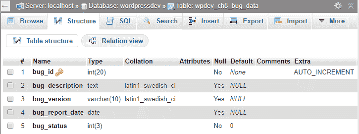
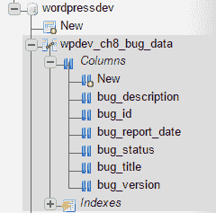
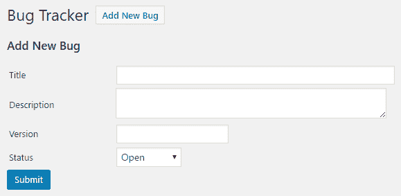
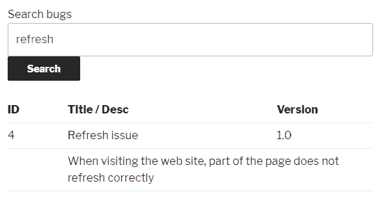

# 第八章：创建自定义 MySQL 数据库表

在本章中，我们将围绕创建自定义数据库表涵盖以下主题：

+   创建新的数据库表

+   在插件移除时删除自定义表

+   在插件升级时更新自定义表结构

+   在管理页面上显示自定义表数据

+   在自定义表中插入和更新记录

+   从自定义表中删除记录

+   在短代码中显示自定义数据库表数据

+   实现一个搜索功能以检索自定义表数据

+   从用户文件导入数据到自定义表中

# 简介

如第四章《自定义文章类型的威力》中所述，自定义文章类型提供了一种非常强大且简单的方法来在 WordPress 安装中创建和管理自定义内容。话虽如此，如果您希望创建的新项目不受益于内置文本编辑器的访问，并且有大量需要存储在系统中的数据字段，那么使用自定义文章类型来存储它们实际上可能会变得繁琐。更具体地说，每个自定义字段都需要一个单独的函数调用与自定义文章相关联。此外，自定义字段的功能有限，因为它们将所有信息存储在简单的文本字段中，这使得根据特殊数据类型（如日期）执行有序查询变得困难。

管理自定义内容的一个替代方案是在网站的数据库中创建新表，并提供一个自定义界面来管理这些新项目。

虽然直接与网站数据库打交道听起来可能是一项艰巨的任务，并且实际上只有在自定义文章类型无法按预期工作的情况下才应该这样做，但 WordPress 实际上提供了一个实用工具类，它使得创建新数据库表、在这些新结构中存储信息以及执行数据检索查询变得非常容易。虽然具备基本的**结构化查询语言**（**SQL**）知识将有助于我们创建错误跟踪系统时理解本章中的所有食谱，但每个食谱都详细解释了每个命令如何工作以产生最终结果。

# 创建新的数据库表

将要存储在自定义数据库表中的自定义数据元素的创建的第一步是创建该表本身。这是通过准备一个标准的 SQL 命令来完成的，该命令指定了表名及其所需的结构，然后让 WordPress 在网站数据库上执行它。

本食谱展示了如何准备和执行一个查询，创建一个用于存储错误报告的表。

# 准备工作

您应该能够访问 WordPress 开发环境，无论是在您的本地计算机上还是在远程服务器上，您将能够加载您的新插件文件。

# 如何做到这一点...

1.  导航到您开发安装的 WordPress 插件目录。

1.  创建一个名为 `ch8-bug-tracker` 的新目录。

1.  导航到目录并创建一个名为 `ch8-bug-tracker.php` 的文本文件。

1.  在代码编辑器中打开新文件，并在插件文件顶部添加一个合适的标题，将插件命名为“第八章 - Bug Tracker”。

1.  添加以下代码行以注册一个在插件激活时被调用的函数：

```php
register_activation_hook( __FILE__, 'ch8bt_activation' ); 
```

1.  添加以下代码段以提供`ch8bt_activation`函数的实现：

```php
function ch8bt_activation() { 
    // Get access to global database access class 
    global $wpdb; 

    // Create table on main blog in network mode or single blog 
    ch8bt_create_table( $wpdb->get_blog_prefix() ); 
} 
```

1.  插入以下代码以提供`ch8bt_create_table`函数的实现，该函数负责实际创建表：

```php
function ch8bt_create_table( $prefix ) { 
    // Prepare SQL query to create database table 
    // using function parameter 

    $creation_query = 'CREATE TABLE IF NOT EXISTS ' . 
                      $prefix . 'ch8_bug_data ( 
                      `bug_id` int(20) NOT NULL AUTO_INCREMENT, 
                      `bug_description` text, 
                      `bug_version` varchar(10) DEFAULT NULL, 
                      `bug_report_date` date DEFAULT NULL, 
                      `bug_status` int(3) NOT NULL DEFAULT 0, 
                      PRIMARY KEY (`bug_id`) 
                      );'; 

    global $wpdb; 
    $wpdb->query( $creation_query ); 
} 
```

1.  保存并关闭插件文件。

1.  导航到插件管理页面，并激活“第八章 - Bug Tracker”插件。

1.  使用`phpMyAdmin`连接到您的 MySQL 数据库，以查看在插件激活时是否创建了一个新表：


# 它是如何工作的...

与我们在第三章“创建默认用户设置”菜谱中提到的创建配置选项类似，当在 WordPress 安装中激活插件时，通常会创建自定义数据库表。通过使用激活钩子，我们注册代码以便在插件首次激活和升级时执行。当回调函数执行时，我们将首次接触到全局的`wpdb`类。这个实用类由 WordPress 实例化，并为我们提供了访问一系列方法，这些方法可以用来与底层的 MySQL 网站数据库进行交互，同时也有助于防止数据相关的安全风险。这些方法在复杂度上有所不同，从快速插入或更新记录的简单调用到需要了解 SQL 命令以产生预期结果的更复杂成员函数。

在调用创建实际表之前，激活函数调用`wpdb`类的`get_blog_prefix`方法来检索与网站关联的表前缀（在默认安装中设置为`wp_`）。在检索后，这个前缀立即发送到`ch8bt_create_table`函数，以构建一个用于创建新表的 SQL 命令。

虽然 SQL 命令有多个行，但如果我们将其分解成小部分，我们会发现它实际上相当简单。命令的第一行指定如果服务器上尚未存在，则应创建一个名为`<prefix>ch8_bug_data`的新表。如果创建发生，接下来的五行指定每个字段的名称和数据类型，以及指示字段是否可以包含`NULL`值以及在某些情况下默认值应该是什么的信息。还有一个与`bug_id`字段相关的特殊命令，称为`AUTO_INCREMENT`命令，它告诉系统在向表中添加新记录时自动用自增值填充此字段。最后，但同样重要的是，代码的最后一行指示表的键是`bug_id`字段。

一旦查询准备就绪，它就会被存储在一个变量中，并通过调用`wpdb`对象的`query`方法来执行。此方法在网站数据库上执行任何 SQL 命令，并返回一个数值，表示查询影响了多少行。

# 还有更多...

虽然之前的代码相对容易管理，但在处理大量字段或网络 WordPress 安装时，事情可能会变得稍微复杂一些。

# 使用 phpMyAdmin 简化代码创建

而不是从头开始编写表创建代码，`phpMyAdmin`数据库管理工具可以派上用场来准备此代码：



例如，要创建本食谱中使用的表，请按照以下步骤操作：

1.  在`phpMyAdmin`中选择`wordpressdev`数据库。

1.  在“创建表”部分，在名称字段中输入`wpdev_ch8_bug_data`，在字段数量中输入数字`5`。

1.  点击“Go”按钮。

1.  在显示的表创建网格中，根据上一张截图中的列名设置每个字段的名称。

1.  根据上一张截图中的类型列设置每个字段的类型。

1.  对于在其类型旁边有括号的值，使用数值来表示这些项的长度/值。

1.  根据上一张截图设置每个字段的默认值。对于具有`NULL`默认值的项，可以从下拉列表中选择 NULL。对于具有特定值的项，在下拉列表中选择“按定义：”，并在相邻字段中指示该值。

1.  对于允许有`NULL`值的项（在上一张截图中以“是”显示），请确保已勾选“Null”框。

1.  在“索引”下拉列表中选择`bug_id`字段下的“PRIMARY”，以表示它将是表的键。然后，点击出现的索引创建弹出对话框中的“Go”。

1.  对于 bug_id 字段，勾选 A_I 框以指示在表中插入新值时应自动递增。

1.  点击“保存”按钮以完成表创建过程。

在此时刻，phpMyAdmin 将在服务器上创建表。要访问创建表的 SQL 命令，请点击导出标签，然后点击转到下载包含 SQL 代码的文本文件。虽然导出文件将包含一些额外信息，但重要部分是实际的 CREATE TABLE 部分，正如你将看到的，它看起来与这个配方中编写的代码非常相似。

# 在网络安装中创建表

WordPress 的许多优点之一是能够从单个安装中创建和管理多个网站。在这些情况下，每个网站在 MySQL 数据库中都有自己的表集。因此，当准备一个可能用于网络安装的创建自定义表的插件时，必须在每个网站的架构下放置额外的代码来创建新表。

首先在`ch8bt_activation`函数中进行更改，检查我们是否正在处理多站点安装。如果是这种情况，我们将遍历每个现有网站，并调用创建新表，就像我们在主要配方代码中所看到的那样：

```php
function ch8bt_activation() { 
    // Get access to global database access class 
    global $wpdb; 

    // Check to see if WordPress installation is a network 
    if ( is_multisite() ) { 
        // If it is, cycle through all blogs, switch to them 
        // and call function to create plugin table 
        if ( !empty( $_GET['networkwide'] ) ) { 
            $start_blog = $wpdb->blogid; 
            $blog_list =
                $wpdb->get_col( 'SELECT blog_id FROM ' . $wpdb->blogs );
            foreach ( $blog_list as $blog ) {
                switch_to_blog( $blog ); 
                // Send blog table prefix to creation function
                ch8bt_create_table( $wpdb->get_blog_prefix() );
            } 
            switch_to_blog( $start_blog );
            return;
        }
    }

    // Create table on main blog in network mode or single blog
    ch8bt_create_table( $wpdb->get_blog_prefix() );
} 
```

虽然这将处理在插件激活时在所有现有网络网站上创建自定义表，但还需要放置额外的代码来在创建新网站时创建额外的表：

```php
// Register function to be called when new blogs are added
// to a network site 
add_action( 'wpmu_new_blog', 'ch8bt_new_network_site' );

function ch8bt_new_network_site( $blog_id ) {  
    global $wpdb; 

    // Check if this plugin is active when new blog is created
    // Include plugin functions if it is
    if ( !function_exists( 'is_plugin_active_for_network' ) ) {
        require_once( ABSPATH . '/wp-admin/includes/plugin.php' ); 
    }

    // Select current blog, create new table and switch back
    if ( is_plugin_active_for_network( plugin_basename( __FILE__ ) ) ) {
        $start_blog = $wpdb->blogid; 
        switch_to_blog( $blog_id ); 

        // Send blog table prefix to table creation function 
        ch8bt_create_table( $wpdb->get_blog_prefix() ); 
        switch_to_blog( $start_blog ); 
    } 
} 
```

`ch8bt_create_table`函数本身不需要任何修改，因为它已经被设计为从其他函数接收表前缀并使用它来构建查询。

# 在插件移除时删除自定义表

对于插件来说，提供一个卸载程序以删除它们添加到网站数据库或文件系统中的内容，始终是一个好的做法。当处理自定义数据库表时，当网站管理员决定删除插件时，所有记录都应该与表本身一起删除。

这个配方展示了如何实现一个数据删除脚本，以删除在先前的配方中创建的错误存储表。

# 准备工作

你应该已经遵循了*创建新的数据库表*的步骤，以便有一个现有的表可以删除。或者，你可以从代码包中获取结果代码（`第八章/ch8-bug-tracker/ch8-bug-tracker-v1-1.php`），并将文件重命名为`ch8-bug-tracker.php`。

# 如何做到这一点...

1.  导航到你的开发安装的 WordPress 插件目录。

1.  在`ch8-bug-tracker`目录中创建一个名为`uninstall.php`的文本文件，并在代码编辑器中打开它。

1.  以标准的`<?php`打开标签开始新的脚本。

1.  通过向文件中添加以下代码来实现一个名为`ch8bt_drop_table`的新函数：

```php
function ch8bt_drop_table( $prefix ) { 
    global $wpdb;     
    $wpdb->query( 'DROP TABLE ' . $prefix . 'ch8_bug_data' );     
} 
```

1.  添加以下代码以执行从单个或网络 WordPress 安装中存储错误创建的表的删除：

```php
// Check that file was called from WordPress admin 
if( !defined( 'WP_UNINSTALL_PLUGIN' ) ) {
    exit();
}

global $wpdb; 

// Check if site is configured for network installation 
if ( is_multisite() ) { 
    if ( !empty( $_GET['networkwide'] ) ) { 
        // Get blog list and cycle through all blogs 
        $start_blog = $wpdb->blogid; 
        $blog_list = $wpdb->get_col( 'SELECT blog_id FROM ' .
                                     $wpdb->blogs ); 
        foreach ( $blog_list as $blog ) { 
            switch_to_blog( $blog ); 
            // Call function to delete bug table with prefix 
            ch8bt_drop_table( $wpdb->get_blog_prefix() ); 
        } 
        switch_to_blog( $start_blog ); 
        return; 
    }     
}  

ch8bt_drop_table( $wpdb->prefix ); 
```

1.  保存并关闭代码文件。

1.  导航到插件管理页面并停用第八章 - Bug Tracker 插件。

1.  在执行下一步之前，请复制整个插件目录，以避免删除所有工作。

1.  点击插件上的删除链接，然后在确认删除插件及其数据的对话框中点击确定。

1.  使用`phpMyAdmin`连接到你的 MySQL 数据库以验证错误数据表已被删除。

# 它是如何工作的...

正如我们在第二章中看到的，*插件框架基础*，一个名为`uninstall.php`的文件中包含的所有代码在删除插件时都会被执行。在这种情况下，我们代码的主要目的是对网站数据库运行查询以删除错误表。

在这样做之前，文件的最初几行会检查一个变量（`WP_UNINSTALL_PLUGIN`）的存在，以确认代码是作为插件删除过程的一部分被调用的，而不是由外部用户调用的。

一旦确认了执行的合法性，运行的代码类似于表创建代码，我们首先获取对 WordPress 数据库管理类的访问权限，然后检查 WordPress 安装是单个站点还是网络安装。在前一种情况下，我们调用一次`ch8bt_drop_table`函数来删除错误表，而在网络环境下，我们对每个现有站点多次调用该函数。

删除表的查询实际上非常简单，通过调用`wpdb`类的`query`方法来执行`DROP TABLE` SQL 命令。

# 参考以下

+   *创建新的数据库表*配方

# 在插件升级时更新自定义表结构

在插件的生命周期中，随着它扩展以提供额外的功能，可能需要在自定义数据库表中存储比最初打算存储更多的数据。正如你所知，WordPress 本身在升级过程中会对其数据库结构进行定期更改以存储新信息。为此，它使用一个简单的函数`dbDelta`，我们也可以从我们的插件代码中访问它。

这个配方展示了如何修改之前的表创建代码，以加载 WordPress 升级 API 并使用数据库升级功能向现有的错误存储表添加额外字段。

# 准备工作

你应该已经遵循了*创建新的数据库表*的配方，以便修改创建代码。或者，你也可以从代码包中获取结果代码（`Chapter 8/ch8-bug-tracker/ch8-bug-tracker-v1-1.php`），并将文件重命名为`ch8-bug-tracker.php`。

# 如何操作...

1.  导航到你的开发安装的 WordPress 插件目录。

1.  导航到`ch8-bug-tracker`目录并编辑`ch8-bug-tracker.php`。

1.  定位到`ch8bt_create_table`函数。

1.  在表创建查询的第一行删除`IF NOT EXISTS`文本。

1.  在表创建代码中添加一行额外的代码以添加一个字段来存储错误标题，如下所示（粗体）：

```php
$creation_query = 'CREATE TABLE ' . $prefix . 
                  'ch8_bug_data ( 
                  `bug_id` int(20) NOT NULL AUTO_INCREMENT, 
                  `bug_description` text, 
                  `bug_version` varchar(10) DEFAULT NULL, 
                  `bug_report_date` date DEFAULT NULL, 
                  `bug_status` int(3) NOT NULL DEFAULT 0, 
                  `bug_title` VARCHAR( 128 ) NULL, 
                  PRIMARY KEY (`bug_id`) 
                  );'; 
```

1.  定位以下代码行：

```php
global $wpdb; 
wpdb->query( $creation_query ); 
```

应将其替换为以下代码行：

```php
require_once( ABSPATH . 'wp-admin/includes/upgrade.php' ); 
dbDelta( $creation_query ); 
```

1.  保存并关闭插件文件。

1.  导航到插件管理页面。

1.  禁用并重新激活第八章 - Bug Tracker 插件。

1.  使用 phpMyAdmin 连接到您的 MySQL 数据库，查看新添加的 `bug_title` 字段是否已添加到错误存储表中：



# 它是如何工作的...

`dbDelta` 函数是 WordPress 在执行版本升级时调用的实用函数之一。当被调用时，它会解析它接收到的表创建 SQL 命令，并确定它所描述的表结构与当前表之间的差异（如果表存在的话）。一旦确定了这种差异，它就会执行必要的更改以使两个结构对齐。

如果两个结构完全相同，它将保持表不变。采用这种方法，任何对结构的变化都可以通过更改表创建查询简单地实现。因此，`dbDelta` 函数实际上可以从插件的第一版本开始使用，以确保升级路径简单易行。

# 参见

+   *创建新的数据库表* 菜谱

# 在管理页面上显示自定义表数据

在创建一个或多个自定义数据库表以存储数据后，创建自定义项目管理系统下一步是构建一个界面来填充它们。虽然自定义帖子类型有一个非常有序的结构来编辑条目，但创建自定义表界面与创建插件配置面板非常相似，正如我们在第三章用户设置和管理页面中看到的。

这个菜谱展示了如何创建一个界面，该界面将显示系统中存储的错误列表，提供一个创建新条目的链接，并提供编辑现有条目的方法。

# 准备中

您应该已经遵循了 *在插件升级时更新自定义表结构* 的菜谱，以便有一个具有所需结构的自定义表。或者，您可以从代码包中获取结果代码（`Chapter 8/ch8-bug-tracker/ch8-bug-tracker-v2.php`），并将文件重命名为 `ch8-bug-tracker.php`。

# 如何做...

1.  导航到您的开发安装的 WordPress 插件目录。

1.  导航到 `ch8-bug-tracker` 目录并编辑 `ch8-bug-tracker.php`。

1.  在构建管理菜单时注册要调用的函数，请插入以下代码行：

```php
add_action( 'admin_menu', 'ch8bt_settings_menu' ); 
```

1.  添加以下代码以提供 `ch8bt_settings_menu` 函数的实现：

```php
function ch8bt_settings_menu() { 
    add_options_page( 'Bug Tracker Data Management',   
                      'Bug Tracker',
                      'manage_options', 'ch8bt-bug-tracker',
                      'ch8bt_config_page' ); 
} 
```

1.  将以下代码块附加到为负责渲染配置页面的 `ch8bt_config_page` 函数提供实现的代码：

```php
function ch8bt_config_page() { 
    global $wpdb;  
    ?> 

    <!-- Top-level menu --> 
    <div id="ch8bt-general" class="wrap"> 
    <h2>Bug Tracker <a class="add-new-h2" href="<?php echo 
         add_query_arg( array( 'page' => 'ch8bt-bug-tracker', 
                               'id' => 'new' ),  
                        admin_url('options-general.php') ); ?>"> 
    Add New Bug</a></h2> 

    <!-- Display bug list if no parameter sent in URL --> 
    <?php if ( empty( $_GET['id'] ) ) { 
        $bug_query = 'select * from ' . $wpdb->get_blog_prefix();
        $bug_query .= 'ch8_bug_data ORDER by bug_report_date DESC';
        $bug_items = $wpdb->get_results( $bug_query, ARRAY_A );
    ?> 

    <h3>Manage Bug Entries</h3> 

    <table class="wp-list-table widefat fixed"> 
    <thead><tr><th style="width: 80px">ID</th> 
    <th style="width: 300px">Title</th>
    <th>Version</th></tr></thead>

    <?php  
        // Display bugs if query returned results 
        if ( $bug_items ) {             
            foreach ( $bug_items as $bug_item ) { 
                echo '<tr style="background: #FFF">'; 
                echo '<td>' . $bug_item['bug_id'] . '</td>';
                echo '<td><a href="'; 
                echo add_query_arg( array(  
                    'page' => 'ch8bt-bug-tracker', 
                    'id' => $bug_item['bug_id'] ), 
                    admin_url( 'options-general.php' ) ); 
                echo '">' . $bug_item['bug_title'] . '</a></td>'; 
                echo '<td>' . $bug_item['bug_version'];
                echo '</td></tr>';                     
            } 
        } else {
            echo '<tr style="background: #FFF">'; 
            echo '<td colspan="3">No Bug Found</td></tr>'; 
        }        
    ?> 
    </table><br /> 
    <?php } ?> 
    </div> 
<?php } 
```

1.  保存并关闭插件文件。

1.  导航到管理页面设置菜单下的新 Bug Tracker 项目，以查看新创建的页面，显示系统中目前没有存储任何错误：


# 它是如何工作的...

菜谱的前几个步骤使用了在第三章（0346c3c6-27ee-45fb-bfd6-df398e04b2b4.xhtml），*用户设置和管理页面*中之前介绍过的函数，来注册一个回调函数，该回调函数将添加到管理菜单的设置部分。当访问新的菜单页面时，`ch8bt_config_page` 函数会被调用以渲染页面内容，使用 HTML 和 PHP 代码的混合。

在渲染页面标题以及用于创建新错误的链接之后，页面显示代码会检查页面地址是否包含一个名为 `id` 的变量。这个 ID 将在后续的菜谱中用来指示用户是想创建还是编辑错误。当访客点击错误跟踪器菜单项时，不会设置此 ID，从而导致当前菜谱代码被调用。

下一个部分使用 `wpdb` 数据库管理类的 `get_results` 方法从数据库中检索信息。在这个调用中，第一个参数是一个 SQL 查询，而第二个参数指示返回数据所使用的期望格式。虽然我们指定了在这种情况下我们想要一个关联数组，但其他选项包括返回一个数字索引数组（`ARRAY_N`）、一个对象（`OBJECT`）或一个对象数组（`OBJECT_K`）。

查询中的 `SELECT *` 命令表示我们想要返回表中的所有字段，而 `ORDER` 命令指定了用于排序结果的字段以及排序方向（`ASC` 或 `DESC`）。

一旦执行了 `get_results` 方法，我们将检查是否从数据库中检索到了任何数据，如果找到数据，我们将通过一个 `foreach` 循环遍历所有记录，并在标准 HTML 表格中显示它们。如果查询没有返回任何记录，我们将显示一条简短的消息，表明没有找到错误。

# 相关内容

+   在第三章，*用户设置和管理页面*中的*在设置菜单中创建管理页面菜单项*菜谱

+   在第三章，*用户设置和管理页面*中的*使用 HTML 渲染管理页面内容*菜谱

# 在自定义表中插入和更新记录

现在我们已经建立了一个基本的基础设施来显示现有的错误，下一步的逻辑步骤是创建一个表单，该表单将被用来在自定义表中插入和更新记录。

这个菜谱展示了当用户在错误跟踪列表中选择一个条目或通过适当的链接表示他们想要创建一个新条目时，如何添加一个表单来管理错误。

# 准备工作

你应该已经遵循了*在管理页面中显示自定义表数据*菜谱，以建立一个现有的框架。或者，你也可以从代码包中获取结果代码（`Chapter 8/ch8-bug-tracker/ch8-bug-tracker-v3.php`）并将文件重命名为 `ch8-bug-tracker.php`。

# 如何操作...

1.  导航到你的开发安装的 WordPress 插件目录。

1.  导航到`ch8-bug-tracker`目录并编辑`ch8-bug-tracker.php`。

1.  找到`ch8bt_config_page`函数并定位其主体末尾关闭`if`语句的括号（`<?php } ?>`）。

1.  在上一步中识别出的`if`语句的关闭括号之前插入以下代码块：

```php
<?php } elseif ( isset( $_GET['id'] ) &&
                 ( 'new' == $_GET['id'] ||  
                   is_numeric( $_GET['id'] ) ) ) {                  
    $bug_id = intval( $_GET['id'] ); 
    $mode = 'new'; 

    // Query database if numeric id is present 
    if ( $bug_id > 0 ) { 
        $bug_query = 'select * from ' . $wpdb->get_blog_prefix(); 
        $bug_query .= 'ch8_bug_data where bug_id = %d'; 

        $bug_data =
            $wpdb->get_row( $wpdb->prepare( $bug_query, $bug_id ), 
                            ARRAY_A ); 

        // Set variable to indicate page mode 
        if ( $bug_data ) {
            $mode = 'edit'; 
        }
    } 

    if ( 'new' == $mode ) {
        $bug_data = array(
            'bug_title' => '', 'bug_description' => '',
            'bug_version' => '', 'bug_status' => ''
        ); 
    }

    // Display title based on current mode 
    if ( 'new' == $mode ) { 
        echo '<h3>Add New Bug</h3>'; 
    } elseif ( 'edit' == $mode ) { 
        echo '<h3>Edit Bug #' . $bug_data['bug_id'] . ' - '; 
        echo $bug_data['bug_title'] . '</h3>'; 
    } 
    ?> 

    <form method="post"  
          action="<?php echo admin_url( 'admin-post.php' ); ?>"> 
    <input type="hidden" name="action" value="save_ch8bt_bug" /> 
    <input type="hidden" name="bug_id" 
           value="<?php echo $bug_id; ?>" /> 

    <!-- Adding security through hidden referrer field --> 
    <?php wp_nonce_field( 'ch8bt_add_edit' ); ?> 

    <!-- Display bug editing form --> 
    <table> 
        <tr> 
            <td style="width: 150px">Title</td> 
            <td><input type="text" name="bug_title" size="60"
                       value="<?php echo esc_html( 
                       $bug_data['bug_title'] ); ?>"/></td> 
        </tr> 
        <tr> 
            <td>Description</td> 
            <td><textarea name="bug_description"  
            cols="60"><?php echo
esc_textarea( $bug_data['bug_description'] ); ?></textarea></td> 
        </tr> 
        <tr> 
            <td>Version</td> 
            <td><input type="text" name="bug_version" 
                       value="<?php echo esc_html( 
                       $bug_data['bug_version'] ); ?>" /></td> 
        </tr> 
        <tr> 
            <td>Status</td> 
            <td> 
                <select name="bug_status"> 
                <?php  
                // Display drop-down list of bug statuses
                $bug_statuses = array( 0 => 'Open', 1 => 'Closed',
                                       2 => 'Not-a-Bug' );
                foreach( $bug_statuses as $status_id => $status ) { 
                    // Add selected tag when entry matches 
                    echo '<option value="' . $status_id . '" '; 
                    selected( $bug_data['bug_status'], 
                              $status_id ); 
                    echo '>' . $status; 
                } 
                ?> 
                </select> 
            </td> 
        </tr> 
    </table> 
    <input type="submit" value="Submit" class="button-primary" /> 
</form> 
```

1.  添加以下代码行以注册一个在初始化管理页面时被调用的函数：

```php
add_action( 'admin_init', 'ch8bt_admin_init' ); 
```

1.  在插件文件末尾添加以下代码块以注册一个在创建或更新错误时被调用的函数：

```php
function ch8bt_admin_init() { 
    add_action( 'admin_post_save_ch8bt_bug', 'process_ch8bt_bug' ); 
} 
```

1.  将以下代码块附加以处理用户提交的数据并将其存储在网站数据库中：

```php
function process_ch8bt_bug() {  
    if ( !current_user_can( 'manage_options' ) ) {
        wp_die( 'Not allowed' );
    }

    // Check if nonce field is present for security 
    check_admin_referer( 'ch8bt_add_edit' ); 
    global $wpdb;

    // Place all user submitted values in an array (or empty 
    // strings if no value was sent) 
    $bug_data = array(); 
    $bug_data['bug_title'] = ( isset( $_POST['bug_title'] ) ?
        sanitize_text_field( $_POST['bug_title'] ) : '' ); 

    $bug_data['bug_description'] =
        ( isset( $_POST['bug_description'] ) ? 
          sanitize_text_field( $_POST['bug_description'] ) : '' ); 

    $bug_data['bug_version'] = ( isset( $_POST['bug_version'] ) ? 
        sanitize_text_field( $_POST['bug_version'] ) : '' ); 

    // Set bug report date as current date 
    $bug_data['bug_report_date'] = date( 'Y-m-d' ); 

    // Set status of all new bugs to 0 (Open) 
    $bug_data['bug_status'] = ( isset( $_POST['bug_status'] ) ? 
        intval( $_POST['bug_status'] ) : 0 ); 

    // Call the wpdb insert or update method based on value 
    // of hidden bug_id field 
    if ( isset( $_POST['bug_id'] ) && 0 == $_POST['bug_id'] ) { 
        $wpdb->insert( $wpdb->get_blog_prefix() . 'ch8_bug_data', 
                       $bug_data ); 
    } elseif ( isset( $_POST['bug_id'] ) && 
               $_POST['bug_id'] > 0 ) { 
        $wpdb->update( $wpdb->get_blog_prefix() . 'ch8_bug_data',  
            $bug_data, 
            array( 'bug_id' => intval( $_POST['bug_id'] ) ) ); 
    } 

    // Redirect the page to the user submission form
    wp_redirect( add_query_arg( 'page', 'ch8bt-bug-tracker', 
                     admin_url( 'options-general.php' ) ) ); 
    exit; 
} 
```

1.  保存并关闭插件文件。

1.  导航到管理页面设置菜单下的新错误跟踪器项目，并点击“添加新错误”链接以创建条目：



1.  点击提交以将新错误存储在网站数据库中。新创建的错误将出现在上一步中创建的错误列表中。

1.  点击新条目的名称以查看其信息和更新它。

# 它是如何工作的...

如果你尝试点击上一步中创建的“添加新错误”链接，你会看到一个只包含面板标题的页面。这是由于我们没有实现当网站地址中存在`id`变量时显示错误创建和编辑表单的代码。

本食谱的前几个步骤旨在通过检查页面 URL 中是否存在名为`id`的变量，其值设置为文本`new`或数值，来纠正这个问题。

虽然这两种情况都会显示错误编辑表单，但第二种情况首先使用`wpdb`对象的`get_row`方法执行数据库查询，尝试检索具有指定 ID 的错误。`get_row`方法类似于之前食谱中使用的`get_results`方法，但即使查询找到多个结果，也只会返回单行。作为我们的`get_row`调用的一部分，我们还使用了`$wpdb`类的 prepare 方法。此方法将解析它接收的第二个参数以进行安全性检查，然后使用它来替换查询中的占位符。如果查询成功，检索到的值将用于自定义表单标题并设置初始字段值。

表单本身是一个标准的 HTML 表单，包括我们在之前的食谱中看到的一些元素，例如调用`wp_nonce_field`以提供外部攻击的安全性。我们还添加了一个包含在页面 URL 中找到的错误 ID 的隐藏字段，以便在提交错误时方便数据处理。

一旦表单就位，我们调用`add_action`来注册一个回调，该回调将在新创建的表单提交时执行。

回调函数名为`process_ch8bt_bug`，首先进行一些验证。具体来说，它检查当前用户是否有管理权限，以及是否在表单数据中存在应该包含的 nonce 字段。如果这两个条件都满足，则从用户帖子数据、当前系统日期和硬编码的状态值创建一个数据数组。

结果数组使用两种`wpdb`对象方法之一存储在网站数据库中，即`insert`或`update`，这取决于隐藏的`bug_id`字段中找到的值。这两种方法都期望接收目标表名，以及包含每个要存储的表字段名称和值的关联数组。此外，`update`方法需要一个第三个参数，该参数指示用于定位要更新的字段的字段名称和值。在两种情况下，您都会注意到`bug_id`字段没有指定在新值数组中，因为它由数据库服务器自动设置为增量值。

此函数的最后一个步骤是构建一个指向插件配置页面的干净 URL，并在`wp_redirect`调用中使用该地址。

# 参见

+   *在管理页面中显示自定义表数据*的配方

# 从自定义表中删除记录

在向自定义表中添加数据后，网站管理员可能会在将来删除这些条目中的一些。由于我们一直在构建一个用于查看、创建和修改数据库条目的界面，因此选择要删除的项目的工作也落在了我们的责任之下。幸运的是，我们可以轻松地扩展现有的错误显示列表，添加用于选择的复选框和用于触发实际删除的按钮。

这个配方展示了如何为我们的错误跟踪系统添加删除功能。

# 准备工作

您应该已经遵循了*在自定义表中插入和更新记录*的配方，以有一个现有的框架来增强。或者，您可以从代码包中获取结果代码（`第八章/ch8-bug-tracker/ch8-bug-tracker-v4.php`），并将文件重命名为`ch8-bug-tracker.php`。

# 如何做到这一点...

1.  导航到您的开发安装的 WordPress 插件目录。

1.  导航到`ch8-bug-tracker`目录并编辑`ch8-bug-tracker.php`。

1.  找到`ch8bt_config_page`函数，并定位其内容中的`管理错误条目 h3`标题。

1.  在标题之后立即插入以下突出显示的代码行以创建一个表单：

```php
<h3>Manage Bug Entries</h3> 

<form method="post"
      action="<?php echo admin_url( 'admin-post.php' ); ?>"> 
<input type="hidden" name="action" value="delete_ch8bt_bug" />  
<!-- Adding security through hidden referrer field --> 
<?php wp_nonce_field( 'ch8bt_deletion' ); ?> 
```

1.  在下面几行中，在`ID`字段之前，在表头中添加一个空列，如以下代码行所示：

```php
<thead><tr><th style="width: 50px"></th>
       <th style='width: 80px'>ID</th>
```

1.  在主错误列表显示循环中，插入以下突出显示的代码段，在每个项目前添加一个复选框：

```php
echo '<tr style="background: #FFF">'; 
echo '<td><input type="checkbox" name="bugs[]" value="'; 
echo intval( $bug_item['bug_id'] ) . '" /></td>'; 
echo '<td>' . $bug_item['bug_id'] . '</td>';
```

1.  在下面几行中，将`colspan`表格行参数的值从`3`更改为`4`：

```php
echo '<td colspan="4">No Bug Found</td></tr>'; 
```

1.  在`table`关闭标签之后附加以下突出显示的代码行，以显示删除按钮并结束表单部分：

```php
</table><br /> 

<input type="submit" value="Delete Selected" 
 class="button-primary"/> 
</form> 
```

1.  找到`ch8bt_admin_init`函数，并在其体末尾添加以下函数调用：

```php
add_action( 'admin_post_delete_ch8bt_bug', 'delete_ch8bt_bug' ); 
```

1.  导航到文件底部，并添加以下代码块，以提供处理由新表单生成的删除请求的`delete_ch8bt_bug`函数的实现：

```php
function delete_ch8bt_bug() { 
    // Check that user has proper security level 
    if ( !current_user_can( 'manage_options' ) ) {
        wp_die( 'Not allowed' );
    }

    // Check if nonce field is present 
    check_admin_referer( 'ch8bt_deletion' );

    // If bugs are present, cycle through array and call SQL 
    // command to delete entries one by one
    if ( !empty( $_POST['bugs'] ) ) { 
        // Retrieve array of bugs IDs to be deleted 
        $bugs_to_delete = $_POST['bugs'];         
        global $wpdb;

        foreach ( $bugs_to_delete as $bug_to_delete ) { 
            $query = 'DELETE from ' . $wpdb->get_blog_prefix(); 
            $query .= 'ch8_bug_data WHERE bug_id = %d'; 
            $wpdb->query( $wpdb->prepare( $query,
                          intval( $bug_to_delete ) ) ); 
        }         
    }

    // Redirect the page to the user submission form 
    wp_redirect( add_query_arg( 'page', 'ch8bt-bug-tracker', 
                 admin_url( 'options-general.php' ) ) ); 
    exit;   
} 
```

1.  保存并关闭插件文件。

1.  导航到管理页面设置菜单下的新 Bug Tracker 项，以查看添加到 bug 列表中的新界面元素。

# 它是如何工作的...

虽然从我们的自定义表中实际删除数据可以通过运行`DELETE` SQL 命令的单个调用完成，但我们首先需要用户指出哪些条目需要被删除。这个选择界面可以很容易地添加到之前菜谱中创建的现有 bug 列表。

这个菜谱从创建一个标准的 HTML 表单开始，用于包围原始的 bug 列表。除了 bug 列表外，表单还包括一个隐藏字段，用于指示当用户提交表单时要调用的操作名称，以及一个 nonce 字段以确保删除过程的访问安全。

在此初始代码的基础上，菜谱的下一部分修改了原始表列表，为每一行前面添加一个复选框。从代码中可以看出，复选框的`name`属性与常规 HTML 语法略有不同，以两个方括号结尾。这种语法与每个项目的`bug_id`结合使用，结果是在提交时创建一个已选项目数组和 ID 数字数组，这些数组被发送到表单处理函数。

在 bug 列表显示代码中进行的最后一个更改是添加一个删除按钮并关闭表单。

为了将回调与新建的表单关联，菜谱接下来的添加是一个对`add_action`的调用，将`admin_post_<actionname>`变量操作名称与`delete_ch8bt_bug`函数关联。

当被调用时，bug 删除函数，就像我们之前创建的大多数其他提交处理代码一样，首先进行一些验证，以确保用户具有适当的权限，并且表单中放置的隐藏安全字段存在。当这两项正式程序都得到确认后，代码将继续检查 bug 数组的存在，并在找到的情况下遍历所有条目。在那个循环中，我们获得对全局`wpdb`类的访问权限，并可以使用它构建和执行 SQL 查询，每次使用提交的`bug_id`数字删除单个数据库行。

作为额外的安全措施，请注意在`$bug_to_delete`变量前面使用`intval`函数，以确保没有人试图处理外部命令，试图破坏或劫持数据库。

# 参见

+   *在自定义表中插入和更新记录*的菜谱

# 在短代码中显示自定义数据库表数据

创建自定义表的目的通常是存储与网站访客共享的信息。因此，为用户提供在他们的网站上轻松显示存储在自定义表中的新内容的能力是很重要的。实现这一目标的最直接方法是创建一个或多个短代码，可以在任何帖子或页面上插入以呈现所需的信息。

本食谱展示了如何实现一个新的短代码，该短代码将用于在页面上显示虫子列表。

# 准备工作

您应该已经遵循了 *从自定义表中删除记录* 的食谱，以便有一个现有的框架来增强。或者，您可以从代码包中获取结果代码（`第八章/ch8-bug-tracker/ch8-bug-tracker-v5.php`）并将文件重命名为 `ch8-bug-tracker.php`。

# 如何实现...

1.  导航到您的开发安装的 WordPress 插件目录。

1.  导航到 `ch8-bug-tracker` 目录并编辑 `ch8-bug-tracker.php`。

1.  在文件底部添加以下代码行以声明一个新的短代码及其关联的显示函数：

```php
add_shortcode( 'bug-tracker-list', 'ch8bt_shortcode_list' ); 
```

1.  在部分标题之后立即插入以下代码块以实现负责显示虫子列表的`ch8bt_shortcode_list`函数：

```php
function ch8bt_shortcode_list() { 
    global $wpdb;

    // Prepare query to retrieve bugs from database 
    $bug_query = 'select * from ' . $wpdb->get_blog_prefix();
    $bug_query .= 'ch8_bug_data ';
    $bug_query .= 'ORDER by bug_id DESC';                
    $bug_items = $wpdb->get_results( $bug_query, ARRAY_A );

    // Prepare output to be returned to replace shortcode
    $output = '';
    $output .= '<div class="bug-tracker-list"><table>';

    // Check if any bugs were found 
    if ( !empty( $bug_items ) ) { 
        $output .= '<tr><th style="width: 80px">ID</th>'; 
        $output .= '<th style="width: 300px">Title / Desc</th>'; 
        $output .= '<th>Version</th></tr>';

        // Create row in table for each bug 
        foreach ( $bug_items as $bug_item ) { 
            $output .= '<tr style="background: #FFF">'; 
            $output .= '<td>' . $bug_item['bug_id'] . '</td>'; 
            $output .= '<td>' . $bug_item['bug_title'] . '</td>'; 
            $output .= '<td>' . $bug_item['bug_version'] . '</td>'; 
            $output .= '</tr><tr><td></td><td colspan="2">'; 
            $output .= $bug_item['bug_description']; 
            $output .= '</td></tr>'; 
        } 
    } else { 
        // Message displayed if no bugs are found 
        $output .= '<tr style="background: #FFF">'; 
        $output .= '<td colspan="3">No Bugs to Display</td>'; 
    }             
    $output .= '</table></div>';

    // Return data prepared to replace shortcode on page/post 
    return $output; 
} 
```

1.  保存并关闭插件文件。

1.  创建一个新页面，并在页面正文中插入新创建的短代码 `[bug-tracker-list]`。

1.  查看页面以查看存储在系统中的虫子列表：


# 工作原理...

以与之前食谱非常相似的方式创建用于显示自定义表数据的新的短代码。首先，我们声明新的代码，以及当在帖子或页面中找到时将被调用的函数名称来生成文本替换它。然后，我们创建一个显示函数来准备所有输出并将其返回给 WordPress。

这里的唯一区别在于我们查询信息的方式。本食谱使用 `wpdb` 类的 `get_results` 方法，通过 `SELECT` SQL 命令查询存在于自定义数据库表中的所有虫子。在此调用执行后，所有找到的项目都返回一个关联数组，可以很容易地使用 `foreach` 循环以表格形式显示。

如果没有找到条目，本食谱将显示一条简单消息通知访客。

# 相关内容

+   *从自定义表中删除记录* 的食谱

# 实现搜索功能以检索自定义表数据

虽然使用自定义帖子类型创建的内容可以自动由内置的 WordPress 搜索引擎搜索，但自定义数据库表则没有同样的待遇。相反，选择此机制来存储信息的插件开发者必须构建自己的搜索功能。

本食谱展示了如何在上一节创建的虫子列表中添加搜索框，以及如何使用生成的查询数据来缩小显示的虫子列表。

# 准备工作

您应该已经遵循了名为*在短代码中显示自定义数据库表数据*的配方，以便有一个现有的框架进行增强。或者，您可以从代码包中获取结果代码（`第八章/ch8-bug-tracker/ch8-bug-tracker-v6.php`），并将文件重命名为`ch8-bug-tracker.php`。

# 如何操作...

1.  导航到您的开发安装的 WordPress 插件目录。

1.  导航到`ch8-bug-tracker`目录并编辑`ch8-bug-tracker.php`。

1.  找到`ch8bt_shortcode_list`函数，并在初始`global $wpdb`调用之后添加以下突出显示的代码，以检查是否有访客输入了搜索字符串：

```php
global $wpdb; 

if ( !empty( $_GET['searchbt'] ) ) { 
 $search_string = sanitize_text_field( $_GET['searchbt'] ); 
 $search_mode = true; 
} else { 
 $search_string = "Search..."; 
 $search_mode = false; 
} 
```

1.  如果有用户搜索文本，在现有查询字符串的中间插入以下突出显示的代码行以添加`where`参数：

```php
$bug_query = 'select * from ' . $wpdb->get_blog_prefix(); 
$bug_query .= 'ch8_bug_data ';

// Add search string in query if present 
if ( $search_mode ) { 
 $search_term = '%'. $search_string . '%'; 
 $bug_query .= "where bug_title like '%s' "; 
 $bug_query .= "or bug_description like '%s' "; 
} else { 
 $search_term = ''; 
} $bug_query .= 'ORDER by bug_id DESC'; 
```

1.  定位以下代码行：

```php
$bug_items = $wpdb->get_results( $bug_query, ARRAY_A );
```

将其替换为以下代码：

```php
if ( $search_mode ) {
    $bug_items = $wpdb->get_results( $wpdb->prepare(  
                     $bug_query, $search_term, $search_term ), 
                     ARRAY_A );
} else {
    $bug_items = $wpdb->get_results( $bug_query, ARRAY_A );
}
```

1.  在表格开始渲染之前添加以下代码块，以显示简单的搜索表单：

```php
$output = '';

$output .= '<div class="ch8_bt_search">';
$output .= '<form method="get" id="ch8_bt_search">'; 
$output .= '<div>Search bugs '; 
$output .= '<input type="text" onfocus="this.value=\'\'" '; 
$output .= 'value="' . esc_html( $search_string ) . '" '; 
$output .= 'name="searchbt" />'; 
$output .= '<input type="submit" value="Search" />'; 
$output .= '</div>'; 
$output .= '</form></div>'; 

$output .= '<div class="bug-tracker-list"><table>'; 
```

1.  保存并关闭插件文件。

1.  访问之前创建的 bug 显示页面，查看新的搜索表单。输入搜索字符串并点击搜索按钮，查看结果列表：



# 它是如何工作的...

此配方通过显示简短表单并使用标准的 HTML `GET`方法捕获用户搜索字符串来实现一个简单的搜索引擎。如果页面地址中找到搜索字符串，我们将修改现有的 bug 检索查询，通过添加一个`where`子句来查找搜索字符串在`bug_title`或`bug_description`字段中的任何位置。

虽然直接在查询中插入搜索字符串并执行它可能看起来很自然，但我们使用`wpdb`类的`prepare`方法来组装查询并验证搜索字符串以避免恶意意图。这种方法与标准的 PHP `sprintf`函数非常相似，使用占位符来表示变量应该被替换的位置。

短代码显示函数的其余部分保持不变，显示的列表长度根据搜索字符串的存在和匹配查询的条目数量而变化。

# 参见

+   *在短代码中显示自定义数据库表数据*配方

# 从用户文件导入自定义表中的数据

为了避免长时间的数据输入会话，对系统的一个很好的补充，例如我们在本章中设置的 Bug Tracker，就是提供用户一次性从外部文件导入大量条目的能力。为了完成这个任务，逗号分隔值（**CSV**）文件格式非常方便，因为它可以被大多数电子表格编辑器编辑，并且可以使用标准的 PHP 函数调用读取。

此配方在我们的 bug 跟踪系统中实现了基于 CSV 的导入功能。

# 准备工作

您应该已经遵循了*实现一个搜索函数以检索自定义表数据*配方，以有一个现有的框架进行增强。或者，您可以从代码包中获取结果代码（`第八章/ch8-bug-tracker/ch8-bug-tracker-v7.php`）并将文件重命名为`ch8-bug-tracker.php`。

# 如何操作...

1.  导航到您的开发安装的 WordPress 插件目录。

1.  导航到`ch8-bug-tracker`目录并编辑`ch8-bug-tracker.php`。

1.  找到`ch8bt_config_page`函数，并在现有删除表单之后，在错误列表部分的末尾添加以下高亮代码块：

```php
<input type="submit" value="Delete Selected"
       class="button-primary"/> 
</form>

<!-- Form to upload new bugs in csv format --> 
<form method="post" 
 action="<?php echo admin_url( 'admin-post.php' ); ?>" 
 enctype="multipart/form-data">  <input type="hidden" name="action" value="import_ch8bt_bug" />   
<!-- Adding security through hidden referrer field --> 
<?php wp_nonce_field( 'ch8bt_import' ); ?> <h3>Import Bugs</h3> 
<div class="import_data">Import Bugs from CSV File 
 (<a href="<?php echo plugins_url( 'importtemplate.csv', 
                                      __FILE__ ); ?>">Template</a>) 
 <input name="import_bugs_file" type="file" /></div> 
<input type="submit" value="Import" class="button-primary"/> 
</form> 
```

1.  定位到`ch8bt_admin_init`函数，并在其主体末尾添加以下代码行以注册处理错误导入表单提交的函数：

```php
add_action( 'admin_post_import_ch8bt_bug', 'import_ch8bt_bug' );
```

1.  插入以下代码块以提供`import_ch8bt_bug`函数的实现：

```php
function import_ch8bt_bug() { 
    // Check that user has proper security level 
    if ( !current_user_can( 'manage_options' ) ) {
        wp_die( 'Not allowed' );
    }

    // Check if nonce field is present 
    check_admin_referer( 'ch8bt_import' );

    // Check if file has been uploaded 
    if( array_key_exists( 'import_bugs_file', $_FILES ) ) { 
        // If file exists, open it in read mode 
        $handle =
            fopen( $_FILES['import_bugs_file']['tmp_name'], 'r' );

        // If file is successfully open, extract a row of data 
        // based on comma separator, and store in $data array 
        if ( $handle ) { 
            while ( FALSE !== 
                    ( $data = fgetcsv( $handle, 5000, ',' ) ) ) { 
                $row += 1;

                // If row count is ok and row is not header row 
                // Create array and insert in database 
                if ( count( $data ) == 4 && $row != 1 ) { 
                    $new_bug = array( 
                        'bug_title' => $data[0], 
                        'bug_description' => $data[1], 
                        'bug_version' => $data[2], 
                        'bug_status' => $data[3], 
                        'bug_report_date' => date( 'Y-m-d' ) );

                    global $wpdb;         
                    $wpdb->insert( $wpdb->get_blog_prefix() . 
                                   'ch8_bug_data', $new_bug ); 
                } 
            } 
        } 
    }

    // Redirect the page to the user submission form 
    wp_redirect( add_query_arg( 'page', 'ch8bt-bug-tracker', 
                     admin_url( 'options-general.php' ) ) ); 
    exit; 
} 
```

1.  保存并关闭插件文件。

1.  在插件目录中创建一个名为`importtemplate.csv`的新文本文件，并在文本编辑器中打开它。

1.  在新创建的文件中插入以下文本，以提供一个示例错误导入：

```php
"Title","Description","Version","Status"
"Test Import Bug","This is a test import bug","1.0","0"
```

1.  保存并关闭 CSV 文本文件。

1.  导航到管理页面设置菜单下的新错误跟踪器项目，以查看新的导入错误部分。

1.  使用文件导入对话框定位到`importtemplate.csv`。

1.  导入系统中的错误列表，以查看其内容添加到数据库中：


# 工作原理...

此配方在错误跟踪器管理页面上创建了一个小型表单，该表单仅负责将一个或多个错误上传到数据库。通过编辑`importtemplate.csv`文件内容并在导入对话框中选择它，用户可以通过直接将数据加载到插件首次安装时创建的自定义数据库表来快速填充系统。

除了文件上传字段外，表单还包含通常的隐藏 nonce 和动作名称字段。它还具备`enctype`属性，允许上传文件。

当用户提交要上传的文件时，注册的回调函数首先检查提交的用户是否有适当的权限，以及 nonce 安全字段是否作为帖子数据的一部分存在。如果这两个条件都满足，则继续检查是否已正确上传文件到网络服务器，使用`array_key_exists`函数通过标准 PHP`$_FILES`全局变量进行搜索。如您所见，它搜索的文本是表单中文件上传字段的名称。

如果已上传文件，`fopen` 函数会打开它，并将指向该文件的指针存储在一个局部变量中。在快速验证指针存在之后，代码将移动到一个 `while` 循环中，使用 `fgetcsv` 函数处理传入文件的每一行。此函数一次读取文件的一行，分析其内容以找到所有存在的逗号分隔字段，并将结果数据存储在一个数字数组中。

`import` 函数的其余部分创建一个包含导入数据的数组，并使用 `wpdb` 类的 `insert` 方法将其存储在数据库中，正如我们在之前的菜谱中看到的。

# 参见

+   *在自定义表中插入和更新记录* 的菜谱
