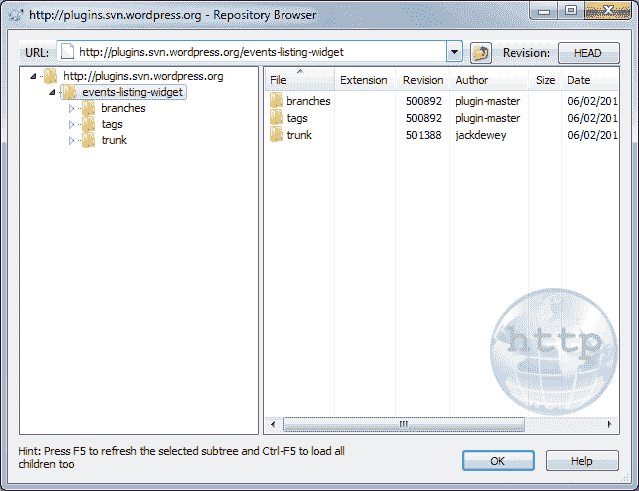
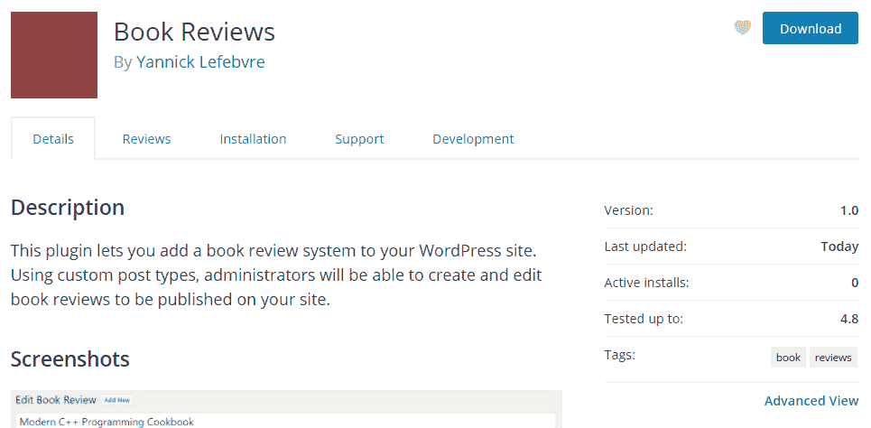

# 第十二章：在 wordpress.org 上分发您的插件

在本章中，我们将讨论如何分发您的作品，包括以下主题：

+   为您的插件创建一个 readme 文件

+   申请将您的插件托管在 wordpress.org 上

+   使用 Subversion 上传您的插件

+   为您的插件提供横幅和缩略图图像

# 简介

一旦您的插件版本准备好向大众分发，您需要决定您是加入官方 WordPress 插件仓库还是自行发布。

在大多数情况下，首选的选项是将您的新扩展添加到官方 WordPress 插件仓库，在那里您有很多好处，包括免费托管、内置的新更新通知以及用户可以在[`wordpress.org`](https://wordpress.org)或从他们网站管理页面的插件部分访问的强大搜索引擎。在官方仓库托管的其他好处包括下载统计和创建一个免费论坛，以促进用户支持。为了符合这种托管资格，您的工作必须是免费和开源的，并且必须遵守 GNU 通用公共许可证，版本 2（也称为 GPL v2），这是一种常见的开源软件许可证，WordPress 本身也使用。

这包括您编写的任何代码，以及您在作品中包含的任何第三方 PHP 或 JavaScript 库。要了解更多关于 GPL v2 许可证的信息，请访问[`www.gnu.org/licenses/gpl-2.0.html`](https://www.gnu.org/licenses/gpl-2.0.html)。您也可以在官方仓库发布带有付费高级功能的插件，但您不能随着时间的推移将免费功能放在付费墙后面。

相比之下，自行托管让您对定价、分发许可证和作品的一般展示有完全的控制权，但它使得人们更难找到您的插件，并且需要您自己实现定制的更新通知机制，使用第三方库添加等效功能，或者当可用时让用户手动下载更新。还有一些流行的插件数字市场可以帮助缓解这些缺点，但您的工作在官方仓库上的可见性仍然较低。

在将您的插件公开之前，您还应该确保您已准备好处理用户反馈和问题。一旦您的作品可供下载，WordPress 网站管理员会迅速下载、安装它，并可能发现您的工作覆盖了大部分但不是所有他们的需求。当这种情况发生时，您将开始收到添加功能的要求。与用户的这种互动通常是一次很好的体验，可以带来新的想法，从而增强您的工作，但您也应该准备好接受批评，并在修复问题和实现新功能上投入时间。您还需要考虑测试您的扩展程序与 WordPress 新版本的时间，这些新版本通常每年发布两到三次。

本章解释了如何准备您的工作以便上传到官方插件存储库，包括申请账户、使用 Subversion 实际提交代码以及如何自定义插件页面以使其具有独特的外观。

# 为您的插件创建一个 README 文件

如果您查看官方 WordPress 存储库中的任何插件，您将看到它们的页面包含大量信息，包括扩展的描述、常见问题列表和安装说明。如您所注意到的，我们迄今为止所做的工作，这些数据并不位于主插件的代码文件中。相反，官方 WordPress 存储库在插件中寻找这些信息，这些信息需要包含在一个特别格式化的`readme.txt`文件中。

本食谱展示了如何为我们在*第四章*，“自定义帖子类型的威力”中创建的图书评论插件创建一个`readme.txt`文件。

# 准备工作

您应该已经遵循了来自*第四章*，“自定义帖子类型的威力”中的*更新页面标题以包含自定义帖子数据使用插件过滤器*食谱，以便为本食谱提供一个起点。或者，您可以从代码包中获取该食谱的结果代码（`Chapter 4/ch4-book-reviews/ch4-book-reviews-v11.php`）。

# 如何做...

1.  导航到您的 WordPress 插件目录中的`ch4-book-reviews`文件夹。

1.  创建一个名为`readme.txt`的新文本文件，并在代码编辑器中打开它。

1.  在文件中插入以下文本：

```php
=== Book Reviews === 
Contributors: ylefebvre 
Donate link: http://ylefebvre.ca/wordpress-plugins/book-reviews 
Tags: book, reviews 
Requires at least: 4.0
Tested up to: 4.8
Stable tag: trunk
License: GPLv2 or later
License URI: https://www.gnu.org/licenses/gpl-2.0.html

Create your own book review web site! 

== Description == 

This plugin lets you add a book review system to your WordPress site. Using custom post types, administrators will be able to create and edit book reviews to be published on your site. 

== Installation == 

1\. Download the plugin 
1\. Upload the book-reviews folder to your site's wp-content/plugins directory 
1\. Activate the plugin in the WordPress Admin Panel 
1\. Start creating new book reviews! 
1\. Use the [book-review-list] shortcode to list reviews on a page. 

== Changelog == 

= 1.0 = 
* First version of the plugin. 

== Frequently Asked Questions == 

There are currently no FAQs at this time. 

== Screenshots == 

1\. The review edition page 
```

1.  保存并关闭文本文件。

1.  导航到图书评论版页面，并使用第三方屏幕截图工具或操作系统内置功能进行截图。

1.  将生成的图像保存为`screenshot-1.jpg`在插件目录中。

# 它是如何工作的...

`readme.txt`文件使用类似 wiki 的语法，其中等号(`=`)的数量表示每个部分标题的级别。最重要的部分是标题，其中包含重要信息，例如插件名称、作者的[`wordpress.org`](https://wordpress.org)用户名、捐赠链接、搜索标签、支持的版本，以及对其功能的一行描述。这个最后的项目将始终可见，因为用户在浏览你的插件页面时。

初始标题之后是多个部分，这些部分对应于插件显示页面中的各种部分。更具体地说，这些部分包含扩展功能的完整描述、安装和使用你作品的分步指南、包含所有版本列表及其更改摘要的变更日志、常见问题解答和截图。插件作者还可以使用相同的语法创建他们自己的任意部分。

与标准的 wiki 语法一样，每个安装步骤前面的重复`1.`在系统使用有序列表在实时网站上显示这些项目时将被转换为递增值。最后，如果`readme.txt`文件中列出了截图，[`wordpress.org`](https://wordpress.org)网站将搜索以关键字`screenshot-`开头的文件，后面跟着与截图部分中列出的值相对应的数字，并将它们与相关的文本一起作为图例显示。在拍摄插件操作截图时，请确保它们清晰且具有意义，因为访客通常会根据这些图像决定是否下载你的作品。

你可以在插件手册中找到关于`readme.txt`文件格式的更多详细信息：[`wordpress.org`](https://wordpress.org) ([`developer.wordpress.org/plugins/wordpress-org/how-your-readme-txt-works/`](https://developer.wordpress.org/plugins/wordpress-org/how-your-readme-txt-works/))。

# 还有更多...

为了使插件代码文件更有条理，并对发布有完全的控制，你应该考虑使用 Subversion 标签。

# 使用标签发布特定的插件版本

标签是 Subversion 的概念，允许开发者在特定时间点识别一组文件，并用名称标记它们。这个名称可以用来指定[`wordpress.org`](https://wordpress.org)访客将能够下载的插件版本。虽然这个配方指定了`trunk`作为`Stable Tag`的值，表示将发布上传到插件`trunk`文件夹的最新版本的文件，但在这个字段中可以指定任何其他标签名称。除了使你的工作更有条理之外，使用标签允许你将部分实现的新插件功能提交到你的存储库，而无需它们自动对所有用户可用。

# 申请在 WordPress.org 上托管您的插件

在为您的创作创建适当的文档之后，将其发布到官方插件存储库的下一步是申请托管。这很简单，只需在[`wordpress.org`](http://wordpress.org)的开发者中心部分提交一个请求表单即可。

这个配方展示了如何申请插件托管，并提供了一些快速接受的建议。

# 如何操作...

1.  创建一个包含您整个插件目录的 ZIP 存档，包括在先前的配方中创建的`readme.txt`文件。

1.  使用插件提交页面顶部的表单，用您的现有凭据登录[`wordpress.org`](https://wordpress.org)网站，或者如果您目前没有账户，创建一个新账户。

1.  将您的网络浏览器指向插件托管请求表单页面，该页面可在[`wordpress.org/plugins/developers/add/`](https://wordpress.org/plugins/developers/add/)找到。

1.  选择您的 ZIP 文件并将其上传到网站。

# 工作原理...

插件提交是一个相对简单的流程，它为开发者提供了访问 Subversion 存储库的权限，他们可以使用它上传他们的作品并与社区分享。

在提交您的插件之前，您应该搜索现有插件以确保您没有选择一个在存储库中已经存在的名称，因为这将导致您的请求被拒绝。您可以通过使用网站的搜索引擎以及尝试访问基于您的插件名称的地址来完成此操作。例如，根据我们的“图书评论”插件示例，您可以检查地址[`wordpress.org/plugins/book-reviews`](https://wordpress.org/plugins/book-reviews)是否存在。

应该注意的是，当您申请在存储库中列出您的插件时，您的插件需要是可用的。一旦您的插件获得批准，您将获得访问托管 Subversion 版本控制存储库的权限，以便在开发过程中轻松备份所有版本的您的工作，并轻松发布您的工作。如果您与一个人或多个人一起工作在插件上，这个基础设施将使所有贡献者之间的代码交换变得非常容易。

# 参见

+   为您的插件创建 README 文件的配方

# 使用 Subversion 上传您的插件

如果您认为在“第一章”，“准备本地开发环境”的配方中使用 Subversion 是过度杀鸡用牛刀，那么您将看到，一旦您的托管请求被 WordPress 团队批准，这项知识将非常有用，因为系统的后端依赖于这个版本控制系统。

这个配方展示了如何在为您创建存储库后，将您的创作提交到[`wordpress.org`](https://wordpress.org)网站。

# 准备工作

您应该已经遵循了 *在 WordPress.org 上托管您的插件的申请* 食谱，以在官方网站上获得批准的仓库。您还应该已经安装了 Subversion 客户端，如 *第一章* 中 *准备本地开发环境* 食谱中所示。最后，您应该有准备上传的插件文件。

# 如何操作...

1.  右键单击文件资源管理器并选择 TortoiseSVN | 仓库浏览器菜单。

1.  输入您新仓库的地址，如您的托管批准电子邮件中所示。例如，对于名为 Book Reviews 的插件，地址将是 `http://plugins.svn.wordpress.org/book-reviews`：



1.  右键单击左侧树视图中的插件名称并选择检出选项。

1.  选择您的计算机上的一个本地文件夹作为检出目录。

1.  点击“确定”以创建具有伴随版本控制数据的本地服务器结构副本。

1.  如果结果目录结构为空，将您的插件文件复制到 `trunk` 文件夹中，或者如果您在提交后继续工作，则使用较新版本更新现有文件。

1.  如果您添加了任何新文件，右键单击它们，并选择 TortoiseSVN | 添加... 菜单。

1.  右键单击 `trunk` 文件夹并选择 SVN 提交... 菜单选项。

1.  输入一条消息，说明您正在上传新文件到插件仓库以及所做的更改。

1.  点击“确定”将您的文件上传到官方仓库。

1.  当提示进行身份验证时，使用您的 [`wordpress.org`](https://wordpress.org) 用户名和密码。点击“保存身份验证”复选框以避免每次都提供这些凭据。

1.  提交文件后，您将收到一封确认邮件，告知文件已上传到仓库，并附带对每个文件所做的更改信息。然后您将能够访问您的插件页面并下载它。对于我们的示例，Book Reviews 插件，页面的地址将是 [`wordpress.org/plugins/book-reviews`](https://wordpress.org/plugins/book-reviews/)：



# 它是如何工作的...

官方的 WordPress 插件仓库使用 Subversion 来管理所有代码文件，为开发者提供版本控制服务，并为扩展页面提供信息。当您的新的仓库创建时，它包含三个主要目录：`trunk`、`tags` 和 `branches`。

`trunk` 目录通常是放置您插件文件最新版本的默认位置。按照食谱中的步骤，我们将文件复制到这个位置并将它们提交到服务器。一旦上传，WordPress.org 服务器将负责创建您工作的压缩副本。

`tags`目录旨在随着时间的推移保存对您的作品的各个版本的指针，如*为您的插件创建 README 文件*配方中所述。此功能与您的插件`readme.txt`文件的稳定标签字段结合使用，允许您在提交和测试可能不稳定的作品到`trunk`的同时，将用户重定向到已知的工作版本。新标签是通过使用 TortoiseSVN 菜单中的分支/标签项并关联一个名称到特定修订版来创建的。`branches`目录与`tags`具有类似的功能，但更专注于创建插件或包含特定功能的开发修订版的替代版本。

# 更多内容...

如果您想在编写插件代码时在本地 WordPress 开发安装中执行它，以下部分将向您展示如何管理您的代码。

# 将插件检出到您的开发安装

当检查完整的插件目录时，您最终会得到一个不能直接在 WordPress 本地开发安装中进行测试和开发的结构。而不是检查整个目录结构，您可以限制您的选择到`trunk`目录。这将只复制该特定文件夹的内容到您的系统，并且您可以设置目标文件夹位于插件目录下。

# 参见

+   为您的插件创建 README 文件的配方

+   在第一章，*准备本地开发环境*中的*从 Subversion 仓库检出文件*配方

+   在第一章，*准备本地开发环境*中的*向 Subversion 仓库提交更改*配方

# 提供插件横幅和缩略图图像

虽然通过创建`readme.txt`文件并将其上传到官方插件仓库来实现的插件列表是功能齐全的，但它并没有在网站上众多扩展程序中脱颖而出。幸运的是，[`wordpress.org`](https://wordpress.org)引入了一种机制，允许插件开发者向他们的列表添加横幅图片。这张图片可以是任何从简单图片到复杂图形，以宣传您的作品。

此配方解释了如何为您的插件准备图像以及如何将它们上传到您的仓库。

# 准备工作

您应该已经遵循了*申请在 wordpress.org 托管您的插件*和*使用 Subversion 上传您的插件*配方，以便在官方仓库中有一个批准的仓库，并将插件文件上传到服务器。

# 如何操作...

1.  创建一个精确为 772 x 250 像素的新图像。

1.  将图像保存为名为`banner-772x250.png`的 PNG 文件。

1.  右键单击文件资源管理器并选择 TortoiseSVN | Repo-Browser 菜单。

1.  输入您的插件仓库地址。例如，对于一个名为 Book Reviews 的插件，地址将是`http://plugins.svn.wordpress.org/book-reviews`。

1.  在与`trunk`、`tags`和`branches`相同的级别创建一个名为`assets`的新顶级目录。

1.  选择`assets`目录，然后将新图像文件拖放到文件夹中上传到服务器。

1.  在弹出的对话框中指定一个日志消息，以解释为什么文件正在上传。

1.  创建大小正好为 256 x 256 像素和 128 x 128 像素的小图像，并将文件分别命名为`icon-256x256.png`和`icon-128x128.png`。较大的图标应该是较小图标内容的更高分辨率版本，因为它将在高 DPI 显示上替换较小的图标。

1.  重复步骤 6 和 7，将两个图标上传到`assets`目录。

1.  访问您插件在[`wordpress.org`](https://wordpress.org)上的页面，查看图像是否正确显示：


1.  通过[`wordpress.org/plugins`](https://wordpress.org/plugins)页面或 WordPress 插件管理界面的“添加新插件”部分搜索您的插件，以查看图标和简短插件描述的使用方式：


# 它是如何工作的...

当文件上传到插件仓库时，[`wordpress.org`](https://wordpress.org)网站会检查是否存在特定名称的特定图像文件，用于插件横幅和图标。如果这些文件存在，它将更改插件页面的布局以包含这些图像。在创建插件横幅和图标时，尊重图像格式和指定尺寸非常重要，以确保它们在网站上正确显示。

# 参见

+   *使用 Subversion 上传您的插件*的步骤
