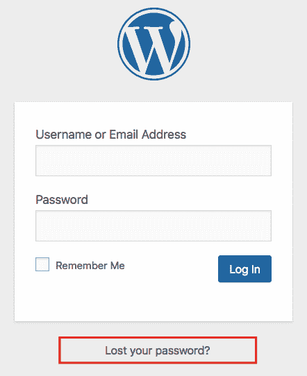

# 第二章：WordPress 入门

本章将指导你完成设置 WordPress 和自定义其基本功能的过程。你可以选择几个关于你的 WordPress 网站将驻留的选项。WordPress 是一个相对较小的软件包（小于 10 MB），同时易于安装和管理。

这里有一些重要的信息：

+   WordPress 可以在[`wordpress.org/download/`](https://wordpress.org/download/)以易于下载的格式获得

+   WordPress 是一个免费的开源应用程序，并且根据 GNU **通用公共许可证**（**GPL**）发布，[`en.wikipedia.org/wiki/GNU_General_Public_License`](https://en.wikipedia.org/wiki/GNU_General_Public_License)

这意味着任何生产软件修改版本的人都必须维护 GPL 提供的相同自由，然后购买或使用该软件的人也可以修改和重新分发它。因此，WordPress 和其他在 GPL 下发布的软件被维护为开源。

在本章中，你将学习以下内容：

+   在外部网络主机上设置 WordPress

+   手动安装 WordPress——在外部主机上以及本地开发和测试

+   在 WordPress 管理面板（`wp-admin`）中执行基本设置任务

这些是你的绝对 WordPress 基础。学习这一章的内容将为你进入 WordPress 世界提供一个良好的开端。

# 构建你的 WordPress 网站——从这里开始

你必须做出的第一个决定是你的博客将放在哪里。创建网站时，你有两个基本选项：

+   要么去[WordPress.com](http://WordPress.com)并注册一个免费（或付费）网站（这样，网站会为你安装）

+   或者，前往 WordPress.org 并使用 WordPress 的开源版本——通过在你的服务器或第三方托管公司的服务器上安装它

让我们来看看这两种选项各自的优缺点。

# WordPress 的两个世界——WordPress.com 和 WordPress.org 之间的区别

WordPress 生态系统的这个方面有点令人困惑，但基本上有 WordPress 的两个版本可供选择。为了使这更简单，让我直接使用你可以找到它们的网站地址：

+   WordPress.com ([`wordpress.com/`](https://wordpress.com/))

+   WordPress.org ([`wordpress.org/`](https://wordpress.org/))

惊讶的是，这两个网站并不指向同一个地方。实际上，它们指向两个完全不同的地方：

+   WordPress.com 是一个商业网站建设解决方案。你可以去那里，注册一个账户，然后根据可用的设置和设计配置你的网站。

+   WordPress.org 是一个开源网站软件。要使用它，你首先需要获取对网络服务器的访问权限——要么从托管公司租用它，要么在本地机器上设置一个服务器——然后你可以在其上安装 WordPress。

本书纯粹关于可以从 WordPress.org 获得的 WordPress 软件。我们不详细讨论 WordPress.com，因为它是一个功能不那么全面的商业服务。

# 优缺点

尽管 WordPress.org 是本书的主题，但仍有一些合理的理由让一些用户可能对 WordPress.com 感兴趣。使用 WordPress.com([`wordpress.com/`](https://wordpress.com/))的主要优势是，它负责为你处理所有技术细节。你只需负责管理你的内容。一个主要的缺点是你无法完全控制你的网站。其他优势和劣势如下：

+   WordPress.com 不允许你上传或编辑自己的主题，尽管它允许你（付费）编辑已存在的主题的层叠样式表（CSS）。

+   WordPress.com 不允许你上传或管理插件。一些插件默认安装（最著名的是用于垃圾邮件拦截的 Akismet，以及支持 Google Sitemaps、缓存、轮播幻灯片、图片库、投票、网站统计和一些社交媒体按钮的插件），但你既不能卸载它们，也不能安装其他插件。额外功能需要付费。

+   与 WordPress.org 的软件合作的一个主要优势是，*你可以控制一切*。你可以添加和编辑主题，添加和删除插件，如果你愿意，甚至可以自己编辑 WordPress 应用程序文件（然而，除非你对自己的 WordPress 技能有信心，否则不要这样做）。

+   WordPress.org 的缺点是你必须自己保持 WordPress 软件的更新，在某些情况下还需要自己安装它，但这相对简单，我们将在本章中介绍。

# 哪个更适合使用

以下表格简要概述了使用 WordPress.com 与从 WordPress.org 下载包然后在自己的服务器上安装之间的基本差异：

|  | **WordPress.com（在线平台/服务）** | **WordPress.org（开源软件）** |
| --- | --- | --- |
| **安装** | 无需安装任何东西；只需注册即可。 | 你可以自己安装 WordPress，无论是手动还是通过你的主机控制面板。 |
| **主题** | 使用 WordPress.com 提供的主题([`wordpress.com/`](https://wordpress.com/))。 | 使用任何地方可用的主题，由任何人（甚至你自己）编写。 |
| **插件** | 无法添加第三方插件。 | 使用任何地方可用的插件，由任何人（甚至你自己）编写。 |
| **升级** | WordPress.com 提供自动升级。 | 当有升级可用时，你必须自己升级。 |
| **小工具** | 小工具的可用性取决于可用的主题。 | 你可以自己将任何主题小工具化。 |
| **维护** | 你不需要进行任何维护。 | 你负责你网站的维护。 |
| **广告** | 不允许你自己的广告。然而，WordPress.com 有时会在你的网站上运行广告。 | 你可以自由地做任何广告，数量也由你决定。 |
| **所有权** | 即使内容属于你，WordPress.com 也可以随时认为内容不适当而关闭你的博客。 | 你对你的网站有完全的控制权，没有人可以强迫你关闭它。 |
| **域名** | 默认情况下，你的网站可以作为`.wordpress.com`下的子域名使用，但你也可以升级到付费套餐并使用你自己手动注册的域名。 | 你可以使用任何手动注册的域名。 |

总体而言，WordPress.org 对于那些想要了解 WordPress 平台的工作原理以及如何用它来构建优化和多功能网站的人来说是一个更好的选择。WordPress.com 可能更适合那些只需要快速建立网站的人。

# 获取并安装 WordPress

我们将介绍三种不同的安装 WordPress 的方法。

# 通过网络主机安装 WordPress

在大多数情况下，用户都会想在实时网站上安装并使用 WordPress——即公开可见的网站。最简单的方法是去一家流行的主机公司，从他们那里租用一些服务器空间，然后在该服务器上安装 WordPress。尽管一开始这可能听起来有些吓人，但实际上这个过程非常简单，在大多数情况下，主机公司会负责所有技术步骤。

这种方法的主要优势是，你实际上可以摆脱担心服务器配置的烦恼，而可以迅速开始使用你的 WordPress 网站。缺点——如果我们能称之为缺点的话——是，你无法从手动安装 WordPress 中获得教育价值。

# 如何选择 WordPress 的网站主机

有许多主机公司将自己标榜为某种形式的“WordPress 专用”。根据你手头的预算，你可以以每月 3-4 美元的价格获得优化的主机配置。在另一端，也有每月 100 美元或更多的先进配置。在选择适合你需求的公司时，考虑以下因素：

+   你的预算——如前一段所述

+   你想要同时托管多少个网站——可能只有一个

+   你预计网站会有多少流量——如果你刚开始，可能每月少于 5,000 位访客

+   你想要与之合作的公司的声誉——这可以通过像 ReviewSignal（[`reviewsignal.com/webhosting`](https://reviewsignal.com/webhosting)）这样的网站来检查

# 完成安装过程

为了展示安装过程是如何进行的，我们需要选择一个我们将用作示例的主机。查看 ReviewSignal 的评分，SiteGround 似乎位居榜首，在共享主机平台中拥有最好的用户评分。我们将选择这个作为我们的示例。请记住，这与其他大多数主机的工作方式相似，所以如果你选择不同的主机，你应该不会看到显著的差异。

要开始，请访问[`www.siteground.com/wordpress-hosting.htm`](https://www.siteground.com/wordpress-hosting.htm)：

1.  一旦进入，你可以点击下一个截图中最便宜的计划下面的注册按钮：

1.  在下一步中，你将能够为你的网站注册一个新的域名，或者如果你已经有了，可以连接现有的域名：

1.  下一步是输入你的个人信息并完成购买。有几件事情你可能需要特别注意——所有这些都在下一个截图中可见——是你的服务器位置和 SiteGround 提供的某些额外选项。

+   关于服务器位置，最好选择离你最近的位置。

+   对于额外选项，是否需要取决于你——它们不是强制性的。

一旦你完成这个设置，你将拥有一个准备就绪的新托管账户。现在唯一剩下的事情就是在这个账户上安装 WordPress。SiteGround 的好处是他们将为你处理整个安装过程。当你第一次登录到 SiteGround 的用户面板时，你会看到一个提示，询问你是否需要安装任何流行的网站平台——WordPress 是其中的一个选项。

在这里你需要做的只是向 SiteGround 提供你想要的 WordPress 登录详细信息，然后点击“确认”按钮。就这么多。完成这一步后，你将在 SiteGround 用户面板中看到一个新的 WordPress 实例。如果你点击“转到管理面板”，你将被重定向到主要的 WordPress 仪表板：

# 手动安装 WordPress

WordPress 可以通过多种不同的方式安装，如果你不想使用之前描述的“通过主机”方法，你可能对手动安装 WordPress 感兴趣。

手动安装可能有多个原因。首先，你可能想在本地服务器上使用 WordPress。其次，即使你在远程服务器上，那个服务器可能没有任何自动安装功能可用。这就是手动安装发挥作用的地方。

# 准备环境

一个好的第一步是确保您有一个为 WordPress 准备好的环境。这意味着您需要确保服务器满足最低要求，并且您的数据库已经就绪。为了 WordPress 能够运行，您的网络主机必须提供满足以下要求的服务器：

+   支持 PHP 版本 5.2.4 或更高版本（建议使用 PHP 7.2+）

+   提供版本 5.6 或更高版本的 MySQL 数据库（完全访问权限）（或者，MariaDB 版本 10.0 或更高版本）

这些最低要求有时会发生变化。最新的要求始终可以在 [`wordpress.org/about/requirements/`](https://wordpress.org/about/requirements/) 找到。

您可以通过联系您的网络主机提供商的支持团队来确定您的托管服务是否满足这两个要求。如果满足，您就可以继续进行下一步了。

# 本地安装 WordPress

为了测试 WordPress，您实际上并不需要访问一个实时网络服务器。您也可以在本地服务器上进行测试，并在需要时仅将您的网站部署到公共领域。与本地 WordPress 一起工作的最常见方式是在 XAMPP 服务器上安装它。XAMPP 可用于 Windows、Mac 和 Linux，并且是免费的。您可以从 [`www.apachefriends.org/index.html`](https://www.apachefriends.org/index.html) 获取它。

XAMPP 的官方网站提供了一些关于如何设置服务器的指南，但如果您需要更详细的教程，请参阅 [`themeisle.com/blog/install-xampp-and-wordpress-locally/`](https://themeisle.com/blog/install-xampp-and-wordpress-locally/)。

# 下载 WordPress

一旦您检查了您的环境，您需要从 [`wordpress.org/download/`](https://wordpress.org/download/) 下载 WordPress。那里有一个显眼的蓝色下载按钮，很难错过。点击它后，您将获得最新版本的 WordPress 软件的 `.zip` 归档。将此归档提取到您的桌面上将为您提供一个名为 `wordpress` 的目录。这个目录本身作为一个独立的东西并不是很有用。为了使其工作，您需要以某种方式将其上传到您的网络服务器。这将在本章的下一部分中介绍。

如果您正在本地服务器上设置，您只需将那个 WordPress 目录复制到本地服务器运行的地方即可。如果您正在远程服务器上工作，您将需要使用第三方工具上传 WordPress。我将在下一部分向您展示如何操作。

# 上传文件

我们需要使用任何 **文件传输协议**（**FTP**）客户端将所有 WordPress 文件上传到我们的网络服务器。互联网上有几个 FTP 客户端可供选择，它们要么是免费软件（无成本）要么需要少量费用。如果您还没有 FTP 客户端，可以尝试以下之一：

+   **Filezilla**：[`filezilla-project.org/download.php?type=client`](https://filezilla-project.org/download.php?type=client)（适用于 Mac、Windows 或 Linux）

+   **Fetch**：[`fetchsoftworks.com/`](https://fetchsoftworks.com/)（仅适用于 Mac）

+   **SmartFTP**：[`www.smartftp.com/`](https://www.smartftp.com/)（仅适用于 Windows）

关于安全性的说明

在可能的情况下，你应该使用**安全 FTP**（**sFTP**）而不是普通 FTP。如果你使用 sFTP，所有发送和接收的数据都是加密的。使用 FTP 时，数据以纯文本形式发送，很容易被黑客截获。检查你的 FTP 软件和托管选项，如果可用，请选择 sFTP。

下面是使用 FTP 安装 WordPress 的过程：

1.  使用你的 FTP 客户端，通过服务器地址、用户名和密码连接到 FTP 服务器，这些信息由你的托管商提供。（如果你不确定这些是什么，你总是可以联系你的网络托管商支持，并要求支持代理提供这些详细信息。）

1.  接下来，打开你希望 WordPress 存在的文件夹。你可能想在根目录中安装 WordPress，这意味着访问你的主 URL 时，访客将看到你的 WordPress 网站主页——例如，`http://yoursite.com`。或者，你可能想在子文件夹中安装 WordPress，例如，`http://yoursite.com/blog/`。请参考以下截图：

1.  在左侧，你会看到你本地文件夹中的文件，在右侧，你会看到你的远程文件夹。（请注意，你使用的 FTP 客户端可能会有略微不同的布局，但这是一个大致的概念。）

1.  现在从左侧选择你本地机器上的所有 WordPress 文件，并将它们拖到右侧面板。你可以看到你的 FTP 客户端逐个上传文件，它们出现在右侧面板上。这可能需要几分钟，所以请耐心等待。

1.  如果你是在本地服务器上安装 WordPress，只需确保将 WordPress 文件放置在电脑上正确的`webroot`目录中。

一旦所有文件都已上传，你就可以开始安装了。

# 完成 WordPress 的屏幕设置

到这一步，就到了进行著名的 5 分钟 WordPress 安装的时候了。（WordPress 可以在 5 分钟或更短的时间内安装的事实在官方 WordPress 网站上广泛宣传。）

1.  如果你通过网页浏览器访问你新 WordPress 网站的主网站 URL，你会看到一个简短的介绍信息，指导你选择你想要进行安装的语言：

1.  之后，你将看到一个屏幕，告诉你完成安装所需的所有详细信息。目前，这些详细信息如下：

    +   数据库名称：例如，这可以是`wptestblog`。

    +   数据库用户名：例如，这可以是`localdbuser`。

    +   数据库密码：例如，`62dcx%^_0hnm`——密码越复杂越好。

    +   数据库主机：这是您网络服务器数据库的主机地址。如果您在本地运行服务器，这将将是`localhost`。如果您尝试在第三方网络主机上运行 WordPress，这将是指向该主机数据库服务器的地址。

因此，最大的问题是哪里可以获取所有这些信息。答案是您的网络主机。大多数大型网络主机都提供了一种通过在线控制面板创建您自己的数据库的方式，您可以选择用户名和密码。如果您不确定如何操作，只需发送电子邮件或打电话给您的托管提供商寻求帮助。专业的支持团队将乐意帮助您。

1.  一旦您有了这四个参数，您可以按下“让我们开始！”按钮，进入安装的下一步。以下是一个主要设置表单的截图：

如您所见，这些细节与之前截图中的相同。当然，您的细节可能会有所不同。另外，还有一个需要注意的重要点是，有一个额外的字段标记为“表前缀”。这是您数据库中每个表名称之前默认的前缀。该字段的默认值是`wp_`。建议您将其更改为您选择的两个或三个字母的单词，并以下划线（`_`）结尾，作为防止对已知 WordPress 表的标准数据库攻击的安全预防措施。

1.  点击“提交”按钮后，您将被重定向到最后确认页面。在这里，您只需点击“运行安装”按钮。在线安装进行顺利的最佳迹象是以下屏幕的出现：

1.  这是最后的设置页面。在这里，您设置您新站点的核心细节。现在，填写安装表单（您稍后可以更改所有这些，所以不必过于担心被锁定在您的选择中）：

    +   网站标题：填写您博客的名称（可以是简单的名称，例如*每日烹饪*）。

    +   用户名：选择一个不明显用户名对您最有利。例如，如果您选择*admin*，那么对于可能想要黑入您博客的人来说，这将非常容易猜测。还有一点值得指出的是，这个账户是管理员账户，它拥有对网站所有区域的最高权限和访问权限。选择一个难以猜测的，例如*Site-Master-45*，并且不用担心，愚蠢是好的。

    +   密码：选择一个安全的密码，它应该包含大小写字母、数字以及一些标点符号。WordPress 在这里为你提供了一些选项。

    +   您的电子邮件：请确保这是正确的。这是 WordPress 将用来联系您关于博客、评论等的电子邮件地址。如果您在安装 WordPress 后不久没有收到电子邮件，请检查您的垃圾邮件文件夹。

    +   搜索引擎可见性：这是列表中的最后一个复选框，但可能是最重要的设置之一。如果您不勾选它（推荐），您的网站将通过 Google 和其他搜索引擎访问。勾选它意味着禁止搜索引擎访问您的网站。

1.  现在，点击“安装 WordPress”。

安装完成！WordPress 将现在通过主登录页面欢迎您 - 这就是您访问网站主管理面板的地方（也称为 `wp-admin`）。或者，您也可以通过将浏览器指向 `http://yoursite.com/wp-admin` 来进入管理面板。如果您尚未登录，此 URL 将将您重定向到登录页面。

# 学习更多

如果您想查看更详细的分步指南以进行手动安装，请查看 WordPress 代码库中的此页面：[`codex.wordpress.org/Installing_WordPress`](https://codex.wordpress.org/Installing_WordPress)。

此外，如果您访问 [`codex.wordpress.org/Getting_Started_with_WordPress#Installation`](https://codex.wordpress.org/Getting_Started_with_WordPress#Installation)，您将找到额外的安装说明以及更改文件权限、使用 FTP、从其他博客引擎导入等方面的具体信息。

# 通过自动安装脚本安装 WordPress

一些网络托管商为他们的客户提供访问各种自动安装脚本的权限，包括 WordPress。这些自动安装器中的大多数功能相当相似，安装新 WordPress 网站的实际过程也相似。在这里，我们将关注这些脚本中的一个，**Softaculous** ([`www.softaculous.com/`](https://www.softaculous.com/))。

这又是安装 WordPress 网站的一种方式，我们在这里介绍它是为了使这本书尽可能完整。然而，如果您已经使用前面描述的方法成功安装了您的网站，那么这个部分在这一点上对您来说将没有任何用处。

Softaculous 是许多专业开发人员和博客作者的 WordPress 安装首选方法。在某些情况下，当处理由新网络托管商维护的全新托管账户时，它可能是最快的方法。Softaculous 可用于运行在许多管理平台上的托管账户，例如 *cPanel*、*Plesk*、*DirectAdmin*、*InterWorx* 和 *H-Sphere*。很可能，您的托管账户正在使用这些平台之一。以下截图显示了 cPanel，这是最受欢迎的平台之一：

尽管不同平台有不同的用户界面，但从用户的角度来看，核心功能基本上保持不变。要访问 Softaculous，只需向下滚动，直到您看到标有 Softaculous 的主要部分（或图标）。一旦到达那里，您可以在其他图标中看到 WordPress 图标：

使用此脚本的整个想法是使事情更快、更无烦恼，这样您就不必手动创建数据库或设置配置文件。Softaculous 将为您处理所有这些。以下是为创建网站表单：

请记住，这些界面可能会不时更改，所以根据您阅读这本书的时间，您的 Softaculous 面板可能看起来不同。不过别担心，它肯定同样容易理解。以下是对您可能看到的所有字段及其应包含的详细信息的说明：

+   选择协议：您可以保留默认值 `http://` 或如果可用，更改为 `https://`。

+   选择域名：如果您有多个域名分配给您的托管账户，那么您可以选择在这里使用哪一个。对于单域名账户（很可能是这种情况），此下拉字段只有一个选项。

+   在目录中：如果您想在子目录下安装 WordPress 网站，那么在这里输入其名称（只需名称）。如果您想将网站安装到主目录（`http://yoursite.com/`），那么请确保该字段为空。

+   数据库名称：您可以放心地使用默认值。

+   表前缀：如本章前面所讨论的，您可以将其更改为唯一的名称（在我的例子中，是 `wp_`）。

+   网站名称：这是您网站的名称（在本例中，为“我的博客”）。

+   网站描述：这是标语（在本例中，为“我的 WordPress 博客”）。

+   启用多站点（WPMU）：除非您是计划启动多站点安装的高级用户，否则请保持此选项未选中。

+   管理员用户名、管理员密码和管理员邮箱：这些是管理员账户的详细信息，类似于我们在手动 WordPress 安装期间必须提供的那些。

+   选择语言：WordPress 有多个本地化版本的平台，不仅仅是英语，您可以选择其中一个。

点击“安装”按钮开始安装过程。该过程本身不需要监督，大约 1 到 2 分钟后安装完成，您就可以访问您的网站。您可以通过标准 URL `http://yoursite.com/` 和 `http://yoursite.com/wp-admin/` 来检查安装是否成功。换句话说，这是通过 Softaculous 完成的安装过程的结束。如您所见，它比手动安装简单得多，也快得多。此外，Softaculous 总是安装 WordPress 的最新版本，因此您不必担心得到过时的东西。

您也可能遇到其他自动安装脚本，它们与 Softaculous 类似，例如 *Fantastico*、*Installatron*、*MOJO* 和 *SimpleScripts*。

# wp-admin 面板

WordPress 安装了一个强大且灵活的管理区域，你可以管理你网站的所有内容以及更多。在整个书中，这将被简称为**wp-admin**、**WP Admin**，在某些情况下称为**WordPress 仪表板**。

现在你已经成功安装了 WordPress，是时候看看`wp-admin`了。有一些立即的基本更改建议，以确保你的安装设置正确。

你可以通过访问`http://yoursite.com/wp-admin/`（这个 URL 也是我们称之为`wp-admin`的原因）始终进入`wp-admin`。如果你是第一次去那里，你将被重定向到登录页面。将来，WordPress 将检查你是否已经登录，如果是的话，你将跳过登录页面。

要登录，只需输入你在安装过程中选择的用户名和密码。然后，点击“登录”。

每次你登录时，你都会直接进入`wp-admin`的仪表板部分。以下是你登录后立即看到的`wp-admin`的截图：

你会看到很多信息和选项，我们将在整本书中探讨这些内容。现在，我们将专注于成功安装后需要考虑的项目。首先，让我们简要了解一下`wp-admin`和主要仪表板部分。最上面的栏，被称为*顶部栏*或*管理栏*，主要是深灰色，包含以下内容：

+   一个悬停时出现的下拉菜单，通过悬停在左上角的 WordPress 标志上触发，包含一组链接到关于 WordPress（关于当前 WordPress 安装的一些细节）、WordPress.org、文档、支持论坛和反馈

+   一个链接到你的 WordPress 网站首页（在这个例子中，整个站点的标题是*每日烹饪*），可点击的*房子*图标

+   包含指向最新评论或挂起更新的更新和活动部分

+   一个悬停时出现的带有便捷链接的新帖子、新媒体、新页面和新用户的滚动下拉菜单，由悬停在*加号*图标上触发

+   最后，在最右边，是你的用户链接到你的个人资料，这是一个包含一个标记为“编辑我的个人资料”的链接的另一个下拉菜单，最后是登出链接

你还会注意到“屏幕选项”标签，它在`wp-admin`中的许多屏幕上都会出现。如果你点击它，它将滑动展开页面上的项目清单，以显示或隐藏。这将在每个页面上有所不同。我鼓励你通过检查和取消选中项目来尝试这个元素，以确定你是否需要它们：

在“屏幕选项”标签旁边，您将找到“帮助”标签。就像“屏幕选项”标签一样，这个标签出现在`wp-admin`中的许多屏幕上。无论何时您对某个特定屏幕有疑问，您都可以始终检查“帮助”标签以获取说明。访问“帮助”标签总是比在网上搜索解决方案更快，在大多数情况下也更有效。

屏幕左侧是主菜单：

您可以点击主菜单中的任何单词，即可跳转到该部分的专用页面，或者将鼠标悬停在某个链接上，查看您可以访问的所有可能的子部分。例如，如果您将鼠标悬停在“设置”上，您将看到“设置”部分的子页面，此时，您可以点击任何一个子页面或主“设置”链接本身：

顶部菜单和主菜单存在于`wp-admin`中的每一页。右侧的主要部分包含您当前所在页面的信息。在这种情况下，我们处于“仪表板”部分。它包含有关您的博客以及 WordPress 一般信息的框。

在 WordPress 的新版本中，当您第一次登录时，您将看到一个欢迎信息，类似于以下内容：

简而言之，欢迎面板允许您只需单击一下即可访问`wp-admin`的一些关键部分。一旦您点击“忽略”链接，登录后该面板将不再显示。在其当前版本中，该面板允许您执行以下操作（从左上角到底右角）：

+   定制当前主题，但前提是主题提供一些定制功能（并非所有主题都提供）

+   将当前主题更改为新的主题

+   编辑首页

+   创建新页面

+   写您的第一篇博客文章

+   查看您的网站

+   管理菜单和小工具

+   开启或关闭评论（默认情况下是开启的）

+   了解如何开始使用 WordPress 的更多信息，这是一个指向[`codex.wordpress.org/First_Steps_With_WordPress`](https://codex.wordpress.org/First_Steps_With_WordPress)的外部链接

在本章和接下来的章节中，我们将了解管理 WordPress 网站的所有关键方法，一旦我们积累了一些经验，随着时间的推移，这个欢迎面板可以使我们的日常工作变得更加快捷。因此，让我们直接进入一般网站设置部分。

在这本书中，所有关于在`wp-admin`中导航到哪个页面的说明都由短语如“导航到设置 | 一般”或“导航到文章 | 添加新文章”来表示。这总是描述了您应该通过主菜单采取的路径。

# 更改一般博客信息

在成功安装后，你可能需要更改或添加一些一般博客信息（例如博客标题或一句话描述），以便正确设置和运行你的网站。要开始这一过程，请导航到主菜单中的“设置”：

在这里你可以设置许多选项，其中大多数都是不言自明的。我们将查看最重要的几个。显然，你可以更改博客的标题。例如，我的博客叫做“每日烹饪”。你也可以更改博客描述，这在大多数主题中用作博客的副标题，就像一本书的副标题一样。默认描述是“*又一个 WordPress 网站*”。你可能想更改它。让我们将其更改为“`探索每周每一天的烹饪`”：

在这个页面上，你可能想查看的一个选项是时区设置。无论你是否有一个带有每篇帖子时间戳的博客，WordPress 知道你所在的时区都是很重要的。尤其是当你想要为未来安排页面或帖子、显示用户准确的时间戳，或者只是确保电子邮件通知正确的时间戳时。此外，如果你计划在国际上发布内容，意味着你的目标受众位于完全不同的地理位置，将时区设置为代表你的目标受众而不是你自己是很好的。

下拉菜单将显示不同的 UTC 设置，以及世界上最大的城市。只需选择你喜欢的时区中的一个城市。保存更改后，页面下方（在“时间格式”旁边）显示的时间将更改为你选择的时间，这样你可以检查并确保它是正确的。

页面上另一个值得考虑的功能是是否允许用户在你的网站上注册。对于大多数网站来说，这并不是特别有用，但如果你计划使网站成为社区驱动的或利用某种形式的众包，那么这可能值得考虑。在这种情况下，不建议给新用户分配高于“订阅者”（默认值）的用户角色。

当你完成对这个页面的更改后，务必点击页面底部的“保存更改”按钮。

最后，在发布任何内容之前，您应该在您的新网站设置中调整最后一个组件：永久链接。正如 WordPress 所定义的，*永久链接*是您各个页面、博客文章、分类和标签的永久 URL。默认情况下，WordPress 使用一个高度未优化的 URL 结构来链接您的新帖子。例如，如果您创建了一个标题为*如何烹饪史上最美味的餐点*的文章，WordPress 将链接为`http://yoursite.com/?p=123`（或类似的内容）。这种结构的主要问题是它没有表明页面内容。您的访客和谷歌都无法猜测。在谷歌的情况下，这种结构也可能对您的未来搜索引擎排名产生重大影响。因此，为了设置一个更优化的结构，您可以前往设置 | 永久链接。以下是可用的设置：

从访客和谷歌的角度来看，最佳设置是标记为“Post name”的选项。回到*如何烹饪史上最美味的餐点*文章的例子，如果您将永久链接设置为“Post name”，则该文章的 URL 将是`http://yoursite.com/how-to-cook-the-best-meal-ever/`，这要清晰得多，也更可预测。您可以在任何时候随时在[`codex.wordpress.org/Using_Permalinks`](https://codex.wordpress.org/Using_Permalinks)上查看有关永久链接的官方信息。

页面下方还有可选的设置，用于“Category base”和“Tag base”。默认情况下，“Category base”设置为`category`。例如，如果您有一个名为*recipes*的分类，那么您可以在`http://yoursite.com/category/recipes`下查看该分类下的所有文章。

一些网站所有者更喜欢将其更改为更用户友好的名称，例如，`topics`。尽管这传达了相同的信息，但对于不太熟悉网络内容发布标准的访客来说，这可能更容易理解。最终，您的分类基础完全取决于您的决定。另一方面，标签基础很少需要任何调整。

# 恢复丢失的密码

如果您丢失了密码并且无法进入您的`wp-admin`面板，您可以通过点击登录页面上的“Lost your password?”链接轻松找回它。新生成的密码将通过您在安装过程中提供的电子邮件地址发送给您。这就是为什么您需要确保输入一个有效的电子邮件地址。否则，您将无法找回您的密码。

# 获取 Gravatar

本章最后一点值得讨论的是 WordPress 头像的问题。尽管 WordPress 在这个领域提供了一些可能性，但最受欢迎的一个是围绕一个外部服务，即**全球认可的头像**（**Gravatar**）。Gravatar 最初是一个旨在让人们在整个网络中使用相同的个人资料图片（头像）的工具。

用通俗易懂的话来说，这意味着每次你注册一个网络服务，如果这个服务是 Gravatar 兼容的，那么它将自动从 Gravatar 获取你的个人资料图片，而不是强迫你从电脑上手动上传。除了个人资料图片外，Gravatar 还为你提供了一个个人在线资料，任何人都可以在点击你的（Gravatar）个人资料图片或称为悬停卡的东西时看到。现在，这一切与 WordPress 有什么关系呢？好吧，WordPress 是那些广泛支持 Gravatar 在平台所有可能领域的服务和工具之一。例如，如果你创建了一个新的博客并使用了一个与 Gravatar 连接的管理员电子邮件地址，你的 WordPress 个人资料图片将立即被 Gravatar 提供的图片所替换。此外，如果你用 Gravatar 电子邮件地址在任何 WordPress 博客上评论，你的个人资料图片将被设置为评论本身的头像。

要设置自己的 Gravatar，只需访问[`en.gravatar.com/`](https://en.gravatar.com/)并点击“创建您的 Gravatar”按钮。你将看到一个 Gravatar 的注册表单。由于 Gravatar 是 WordPress.com 的一部分，如果你已经有了 WordPress.com 账户，你可以登录。如果没有，你可以创建一个新的账户。字段相当标准，系统会提示你输入你的电子邮件地址、你首选的用户名和密码。

一旦你完成了注册过程，你就可以最终设置你的 Gravatar。在主“管理 Gravatar”页面（可通过顶部菜单访问），有一个标记为“添加新图片”的链接——这就是你可以上传 Gravatar 的地方。Gravatar 的好处是你可以选择从哪里获取图片。你可以从电脑上传，从网络上的其他地方获取（例如，从指向你的 Facebook 个人资料图片的直接链接），或者使用你之前作为 Gravatar 上传的图片。

在下一步中，Gravatar 允许您裁剪和调整您的图像。当您对最终结果满意时，您可以点击大按钮并进入您图像的评分设置。每个 Gravatar 都可以分类为**G 级**、**PG 级**、**R 级**或**X 级**。事实上，如果您选择除**G 级**之外的内容，您的 Gravatar 不会在所有网站上显示。因此，只上传合适的图像是一个好习惯。完成这一步后，从现在开始，您的 Gravatar 已经设置好并准备好使用。Gravatar 还允许您将多个电子邮件地址关联到单个账户，以及使用多个图像。这实际上是一个很棒的功能，因为您只需一个 Gravatar 账户就可以管理您每个电子邮件地址和在线身份的每一种形式。

现在，您可以回到您的 WordPress 博客并检查您的新 Gravatar 是否已出现在 `wp-admin` 中的个人资料部分（前提是您已使用相同的电子邮件地址为账户设置）。

# 摘要

您在本章中学到了很多。您现在知道如何在远程服务器以及本地服务器上安装 WordPress，然后更改您网站的常规设置。您还对如何通过 Gravatar 处理您的在线形象或品牌有了基本了解。

在下一章中，您将学习如何创建您的第一篇博客文章和其他类型的内容，如何处理评论和调节讨论，以及博客/网站管理的其他关键方面。
