# 第五章：插件——它们是什么以及为什么您需要它们

插件的作用在近年来增长了很多。如今，很难想象任何 WordPress 网站能够在没有至少安装一些（基本）插件的情况下运行。

在本章中，您将了解插件是什么，为什么需要使用它们，如何使用它们，在哪里获取它们，以及如何跟上任何新发布的对社区有用的插件。我们还将讨论 WordPress 世界中一些最基本和最受欢迎的插件，以及为什么拥有它们可能是个好主意。好，让我们开始吧！

让我们看看本章将涵盖的主题：

+   拆解插件

+   安装插件

+   必备插件包

# 拆解插件——它们是什么？

简而言之，插件是小型脚本（包含可执行 PHP 代码的文件），允许您在 WordPress 网站上包含新的功能——这些功能默认情况下不可用或未启用。WordPress 最好的优点之一是它是一个非常优化的平台。它使您的网站加载速度快，不包含很多冗余代码。然而，WordPress 本身只提供绝对必要的功能范围——对每个人有用的功能。同时，该平台通过引入插件，提供了一种简单直接的方式来扩展您网站的能力。想法很简单——如果您希望您的网站能够处理特定的新的任务，那么肯定有一个插件可以做到这一点。就像在苹果世界和流行的表达，“有应用可以做到这一点”一样。

# 为什么使用插件？

插件最好的地方在于您不需要任何特定的编程知识就能使用它们。本质上，它们就像 iOS 或 Android 的标准应用程序——您可以安装它们并享受它们提供的东西，而不必了解里面的情况。话虽如此，并非所有插件在数据安全或代码质量方面都是安全的。我们将在本章后面讨论这个话题。

此外，合适的插件组合可以使您的网站更加优化，更加用户友好，更加吸引人，更加适合社交媒体，得到适当的备份，防止垃圾邮件，最终，更加独特。插件确实是 WordPress 最好的特性之一。

在像 WordPress 这样的内容管理系统流行之前，网站所有者没有简单的方法向他们的网站引入新的功能。这样做总是需要雇佣专业程序员并投资整个开发过程。如今，这种情况已经不再存在，几乎任何人都可以拥有一个令人印象深刻的网站，而不会损失太多。

# 哪里可以获取插件？

WordPress 插件背后的社区规模庞大。并没有一个中心化的插件开发公司。全世界的开发者都在创建插件，然后通过互联网进行分发。而且，他们中的很多人根本得不到任何直接的报酬。访问 WordPress 插件的最佳和最安全的地方是官方目录，网址为 [`wordpress.org/plugins/`](https://wordpress.org/plugins/):

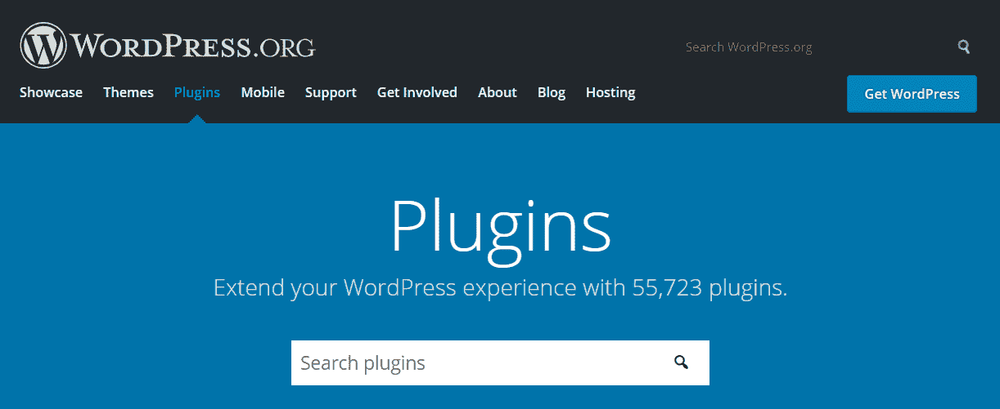

在撰写本书时，官方目录中已有超过 55,000 个不同的插件可供选择，而且这个数字还在不断增长，每周大约有 100+ 个新插件被添加。这真的很令人印象深刻，因为其中许多插件都是非常先进的网络软件，而不仅仅是简单的单脚本插件。

在官方目录的页面中心有一个搜索框（如前一张截图所示），允许您通过主题和标签搜索插件。您还可以查看最受欢迎的插件以及特色插件。简而言之，当您寻找插件时，官方插件目录应该是您首先考虑的地方。同时，养成检查您感兴趣的插件受欢迎程度的好习惯。下载已经有大量满意用户证明的插件，将提高您获得一个您会喜欢使用的优质产品的机会。这非常重要，因为您的网站安全绝不能被低估。通过从官方 WordPress 目录获取插件，您至少可以确信这些插件在没有任何恶意的方式下。我们将在下一章中更多地讨论网站安全。

在寻找特定任务的插件时，您还可以进行 Google 搜索。我建议搜索您试图解决的问题，看看其他用户推荐了哪些插件以及为什么推荐。通常，多个插件执行类似的功能，您会发现其他 WordPress 用户提供的反馈在选择它们之间非常有价值。然而，在这样做的时候，务必留意可能破坏您的网站或允许他人入侵的恶意或编码不良的插件。在安装没有用户评论、评论或反馈的新插件时，要小心，尤其是那些在互联网上有负面反馈的插件。

为了更深入地了解您为网站考虑的插件，您还可以查看每个插件的变更日志和支持论坛（官方 `plugin` 目录中的每个插件页面都有一个名为“支持”的标签）。这应该能给您一个关于特定插件编码、支持等方面做得好或不好的概念。

除了免费插件，还有一大套付费插件（付费插件）。然而，您在官方目录中找不到它们。这些插件中的大多数都有自己的网站来处理销售、客户支持和使用教程。如果您感兴趣，可以找到一些更受欢迎的付费插件目录，例如[`codecanyon.net/category/wordpress`](https://codecanyon.net/category/wordpress)。

# 发现新插件

一般而言，如果一个插件证明它是一个高质量的解决方案并获得了某些知名度，它将在官方目录的首页“特色插件”部分展示。但如果你想要随时了解最新动态，你可以关注[`wordpress.org/plugins/browse/new/`](https://wordpress.org/plugins/browse/new/)上的动态。

此外，发现新插件的一个好方法是成为 WordPress 流行博客的常客。尽管这些博客不是官方作品（它们由独立所有者运营），但它们确实提供了一系列令人印象深刻的提示和建议，不仅限于插件，还包括与 WordPress 相关的其他方面。以下是一些博客列表：

+   [`wptavern.com/`](https://wptavern.com/)

+   [`codeinwp.com/blog/`](https://codeinwp.com/blog/)

+   [`themeisle.com/blog/`](https://themeisle.com/blog/)

+   [`www.wpbeginner.com/`](http://www.wpbeginner.com/)

# 安装插件——如何进行

安装插件的步骤很简单：

1.  找到您的插件

1.  将它下载到您的 WordPress 站点，无论是手动还是通过自动安装器

1.  安装并激活它

1.  （如果需要）配置它

将插件添加到您的 WordPress 安装中有两种方式：

+   手动安装它

+   直接从`wp-admin`内部安装

第一个选项——手动安装插件——通常比第二个选项需要更多的努力，但有时这是与某些插件（大多是付费插件）工作的唯一方式。第二个选项——在`wp-admin`内部安装——通常更快更简单，但并非所有情况下都可行。您需要在一个配置正确的服务器上，以便 WordPress 能够添加文件（我们已经在第二章*，WordPress 入门指南*）中讨论了安装 WordPress 和服务器配置）。此外，您想要安装的插件必须可在 WordPress 插件仓库中找到，即官方插件目录。

在接下来的部分，我们将首先介绍自动安装（因为它更容易操作），然后处理手动方法。

# 自动安装

如果您想安装的插件可在官方插件目录[`wordpress.org/plugins/`](https://wordpress.org/plugins/)中找到，那么您可以在`wp-admin`内部搜索并安装该插件。只需导航到插件 | 添加新插件。您将在右上角找到一个搜索框。在那里输入您想要的插件名称（如下面的截图所示）：

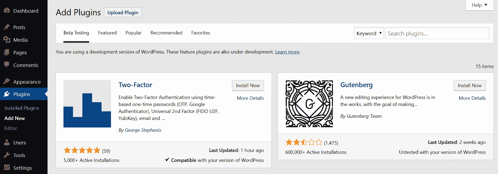

一旦您看到您的插件，点击“更多详情”链接以查看有关其提供的功能的更多信息：

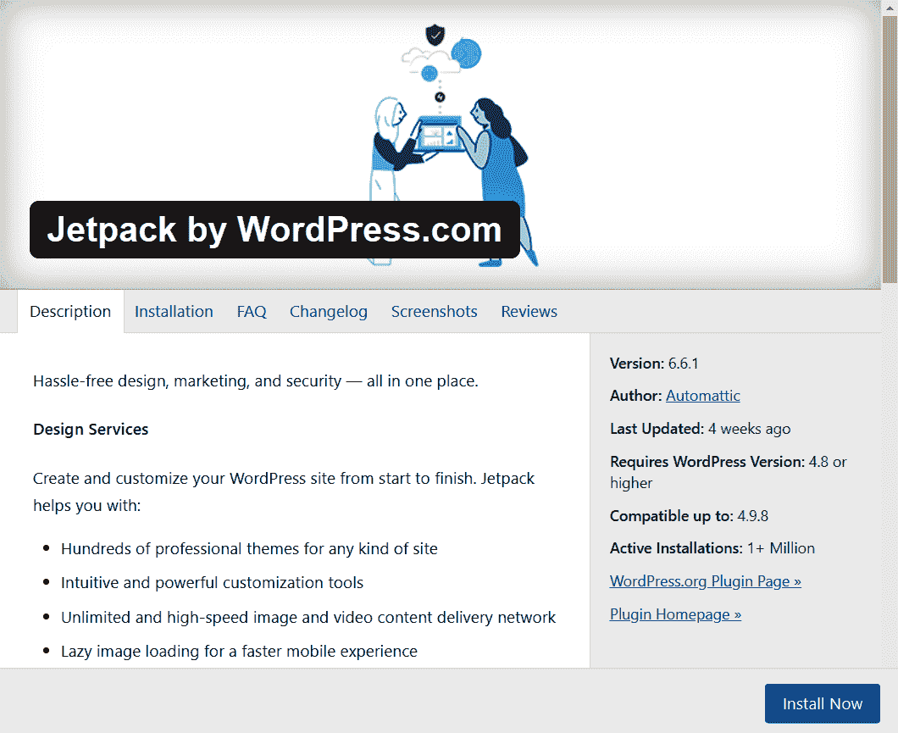

我建议您始终仔细查看这些信息。务必注意版本兼容性。在插件详情中列出了一个名为“兼容至”的参数。在某些情况下，您可以冒险安装稍微过时的插件，但您应该谨慎行事。查看插件下载次数也是一个好主意。下载次数越多，就有越多的人有机会查看插件并评估其质量。

安装后，您需要仔细测试插件并验证其是否运行正确。大多数时候，如果“兼容至”参数指示较旧的 WordPress 版本，这并不一定意味着插件将无法与较新版本一起工作。这只意味着它尚未经过彻底测试，因此进行自己的测试很重要。然而，我强烈建议不要安装超过两年未更新的任何插件。幸运的是，无论何时遇到这样的插件，WordPress 本身都会通过官方插件页面上的消息警告您，如下面的截图所示，或者在`wp-admin`的插件详情部分，将有一个标记为“最后更新”的参数：

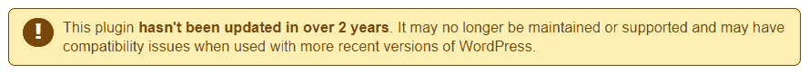

如果一切正常，您可以点击“立即安装”按钮继续。几秒钟后，您将能够激活插件。您会看到一个出现的“激活”按钮。请参考以下截图：

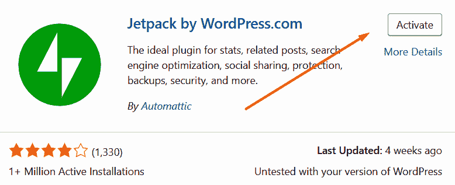

到目前为止，插件已安装并激活。换句话说，它应该完全可用。

# 手动插件安装

以下步骤允许您安装您能找到的任何 WordPress 插件，无论它来自 WordPress.org 的官方目录([`wordpress.org/`](https://wordpress.org/))还是其他地方。

要手动安装插件，您必须首先从官方目录[`wordpress.org/plugins/`](https://wordpress.org/plugins/)或从另一个网站或来源（通常在处理付费插件时）下载插件存档。

在这种情况下，Jetpack 插件可在官方目录[`wordpress.org/plugins/jetpack/`](https://wordpress.org/plugins/jetpack/)中找到：

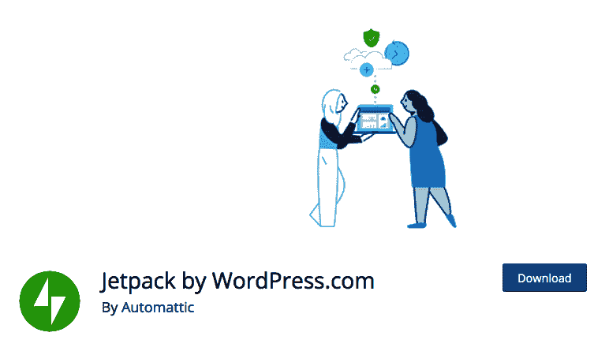

只需点击蓝色的“下载”按钮，并将生成的 ZIP 文件保存在你容易找到的地方。一旦你下载了插件，如果你的服务器设置正确，你应该可以直接通过“插件 | 添加新插件”页面上传 ZIP 文件。转到该页面，点击顶部的“上传插件”按钮，并选择插件的 ZIP 文件，如下面的截图所示：

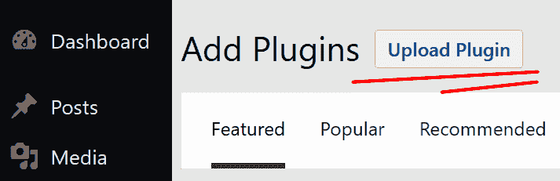

如果这个自动上传器对你不起作用，你可以用老式的方法来做。首先解压缩，也就是说，提取你下载的 ZIP 文件，使其成为一个目录，可能命名为`jetpack`（至少在这个情况下）。然后，使用你的 FTP 客户端，将这个目录上传到你的 WordPress 安装的`wp-content/plugins/`目录内。你也会看到那个目录中 WordPress 自带的两款插件——`akismet`和`hello.php`。

如果你需要任何关于 FTP 软件的帮助，请查看第二章*，WordPress 入门*，其中我们讨论了安装 WordPress 的主题。

上传完成后，你将能够激活插件。这是有效开启插件所必需的。这可以通过点击“激活插件”按钮来完成，如下面的截图所示。到此为止，你就完成了，Jetpack 插件正在运行：

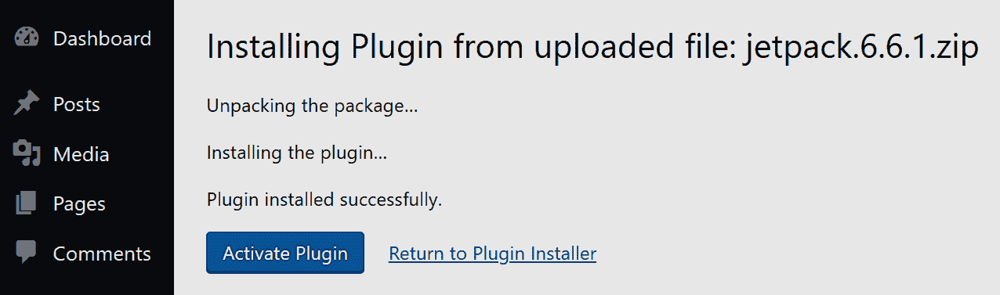

# 插件安装后要做什么

在你的插件安装并准备就绪后，你可能还想做一件事。虽然一些插件在激活后就能完美运行，但其他插件可能需要一些额外的调整。以下是最可能出现的四种情况：

+   你可能不需要做任何事情。一些插件只是改变了 WordPress 执行某些事情的方式，激活它们就是你所要做的全部。

+   在插件开始工作之前，你可能需要对其进行配置。一些插件需要你做出选择并设置新的设置。

+   你也可能获得一组短代码或其他元素，你可以使用它们在你的帖子或页面中包含插件提供的额外内容。

+   可能没有配置页面，但你可能需要在你主题的某个模板文件中添加一些代码。

如果你不确定上传和激活插件后要做什么，请务必阅读插件可能附带的 README 文件，或者查看插件网站上的常见问题解答。

许多插件作者接受捐赠。我强烈建议向那些你认为有用的插件作者捐赠。这有助于鼓励社区中的每个人继续编写大家都能使用的优秀插件。即使你只能捐赠一小笔金额，这也会有所贡献。想想看，你节省了多少时间，多亏了你最喜欢的插件开发者。如果这很显著，也许你真的应该考虑捐赠。

# 必备的插件包

尽管官方目录中有超过 55,000 个插件，但你肯定不需要在 WordPress 网站上同时使用它们所有。有一小部分我们可以称之为“必备包”。我的必备插件列表可能与下一个人的不同，所以请将以下信息视为指导，而不是刻在石头上的必要性。话虽如此，如果我是诚实的，尽管我的某些博客同时运行着超过 25 个插件，但基本的必备列表仅包括七个插件。所有这些插件都处理特定任务，旨在使 WordPress 网站更好、更实用。

# 备份

备份可能是任何网站所有者最重要的任务，我非常认真地这么说。例如，你能想象一个整夜失去整个网站，而且无法恢复的情况吗？现在这听起来可能有点难以置信，但这种情况确实发生过。如果你运营的是一个个人博客，那可能并不那么悲惨。但对于一个商业网站来说，那完全是另一回事。

因此，备份的主要问题之一是，只有定期进行才有效。换句话说，你需要经常创建备份并将它们保存在安全的地方。虽然这一切听起来都很不错，但谁有那么多时间去手动做这些呢？没有人，老实说。这就是为什么我们将使用一个插件，它在后台进行魔法般的操作，而无需我们任何监督——介绍 **UpdraftPlus**——一个可在 [`wordpress.org/plugins/updraftplus/`](https://wordpress.org/plugins/updraftplus/) 找到的 WordPress 备份插件：

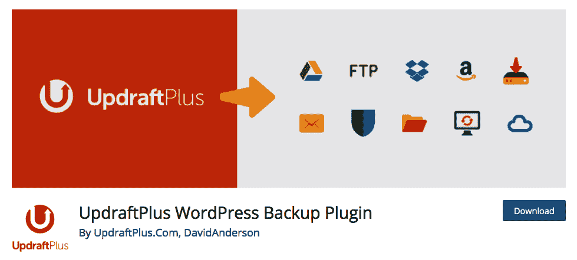

此插件允许你以简单易懂且无烦恼的方式处理网站备份。它连接到你的远程存储账户，例如 Dropbox（但这里还有更多选择），然后自动定期备份你的网站。它只需要最少的初始设置。

如果你还没有账户，你可以在 [`www.dropbox.com/`](https://www.dropbox.com/) 免费注册 Dropbox。作为免费套餐的一部分，你将获得 2 GB 的磁盘空间，这足以保持你的网站备份。

这里是整合 UpdraftPlus 与 Dropbox 所必需的步骤。在安装并激活插件后，导航到你的 `wp-admin` 中的设置 | UpdraftPlus 备份，然后切换到设置标签页。在那里，点击 Dropbox 标志：

点击标志后，向下滚动并点击主要的保存更改按钮。这将重新加载页面，你会看到一个通知，表明需要与 Dropbox 进行额外的授权，如下所示：

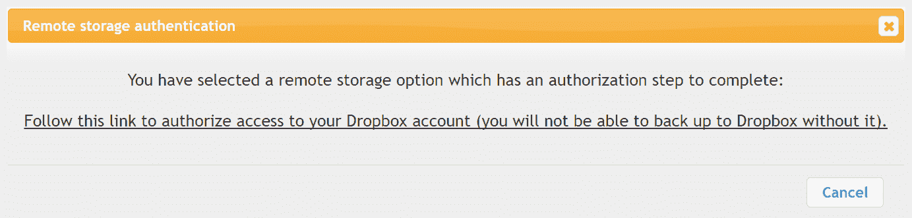

只需点击通知中的链接，您就会被带到 Dropbox 授权页面。要继续，您需要登录您的 Dropbox 账户并确认授权。几秒钟后，您将被重定向回您的网站，您的设置将就绪。在这个阶段，您已经将插件与 Dropbox 集成。现在需要做的就是告诉插件自动备份您的网站。

返回插件的设置选项卡。现在要注意的两个字段如下：

+   文件备份计划

+   数据库备份计划

这取决于您的个人喜好，但对于每天不发布多个条目的网站，将前者设置为每周，后者设置为每日将恰到好处，如下所示：

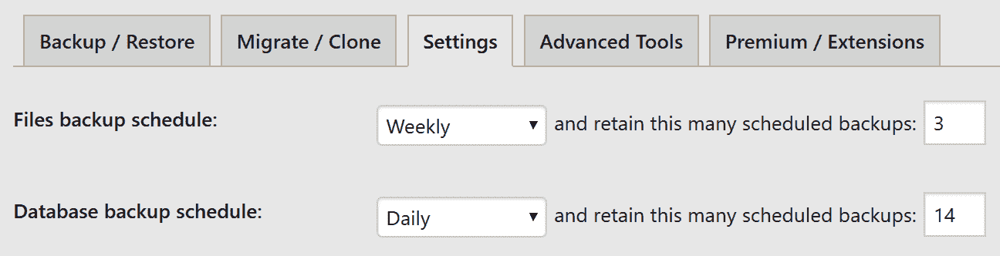

使用此插件，您还可以手动触发备份（除了备份计划功能之外）。当您首次安装插件时，这样做是个好主意，只是为了检查一切是否运行正常，并完成初始备份。您可以在设置中启动备份 | UpdraftPlus 备份。您将看到以下屏幕：

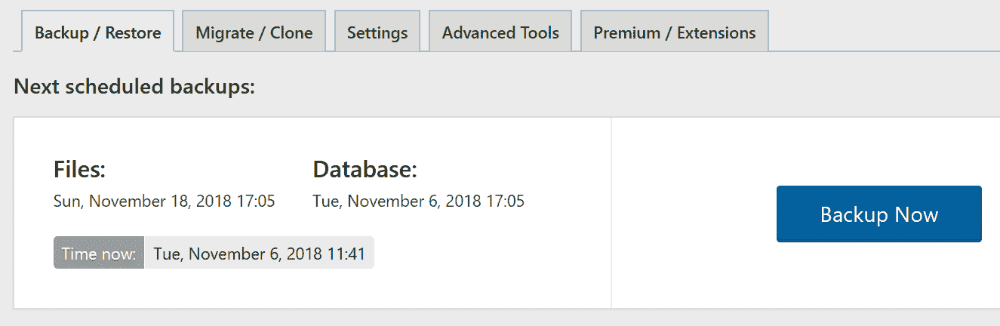

您需要做的只是点击大型的“立即备份”按钮。

# 启用 Google Analytics

Google Analytics 是一个非常受欢迎的网站统计和分析解决方案。它是免费的，对于初学者来说易于使用，并且对于任何愿意深入了解的人来说都非常强大。简而言之，Google Analytics 让您了解有关您网站所获得的网站流量的统计数据和数据，包括精确的访问者数量（每日、每月等）、流量来源、您最受欢迎的内容以及无数其他统计数据。Google Analytics 可在[`www.google.com/analytics/`](https://www.google.com/analytics/)获取。

要在您的网站上启用 Google Analytics，您首先需要注册一个 Google 账户，启用分析，然后在控制面板中添加您的网站（所有这些都在官方 Google Analytics 页面上，包括详细的教程文档）。接下来，获取 Google 提供的跟踪代码并将其包含在您的网站上。这一步是 MonsterInsights 插件在 WordPress 中实现 Google Analytics 并使整个过程变得简单的地方。您可以在[`wordpress.org/plugins/google-analytics-for-wordpress/`](https://wordpress.org/plugins/google-analytics-for-wordpress/)获取它：

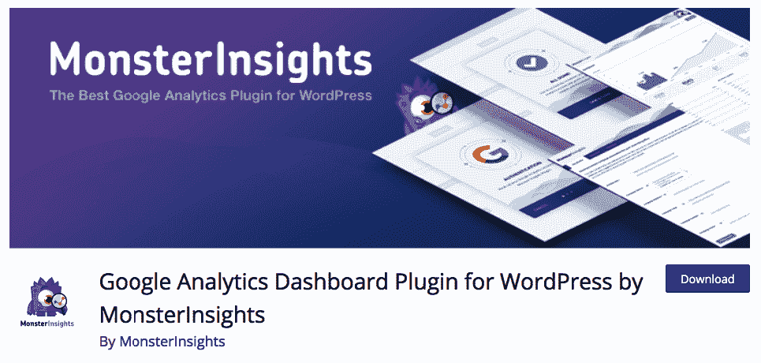

下载并激活它后，转到洞察 | 设置。尽管插件有很多设置，但您必须做的唯一一件事是验证插件，以便您能够启用与您的 Google Analytics 账户的连接。只需点击“使用您的 Google 账户进行验证”按钮：

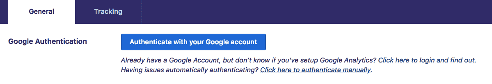

这将带您转到 Google 上的一个页面，在那里您需要点击另一个按钮，授权访问，然后您将被带回到您的`wp-admin`页面。现在，您可以选择所谓的*用户代理配置文件*，这就是您想要用于监控网站的内容。如果您在使用这种半自动认证方式时遇到问题，您可以简单地手动输入您的 Google Analytics 代码（称为 UA 代码）。此代码在 Google Analytics 的您的个人资料中可见（通常以`UA-`开头，后跟九位数字）。

一旦您完成认证过程，您的网站就完全连接到 Google Analytics，并且流量统计数据正在收集。过了一段时间后，您可以导航到 Google Analytics 中的您的个人资料，看看您的网站在访客受欢迎程度方面表现如何。此外，为了更立即地了解跟踪代码是否设置正确，您可以导航到 Google Analytics 中的实时流量部分。

# 缓存

老实说，缓存是一个相当复杂的概念。如果您说的是*工程学*，那么这里是对它的定义：*在计算机科学中，缓存是一个透明地存储数据的组件，以便未来对该数据的请求可以更快地提供服务*。用简单的话来说，如果您在网站上启用了缓存，它将加载得更快，并且对您的观众/访客来说将更加易于访问。幸运的是，尽管这个概念本身并不那么直接，但使您能够*缓存*的插件却是。目前，最顶尖的插件被称为**W3 Total Cache**，可在[`wordpress.org/plugins/w3-total-cache/`](https://wordpress.org/plugins/w3-total-cache/)找到：

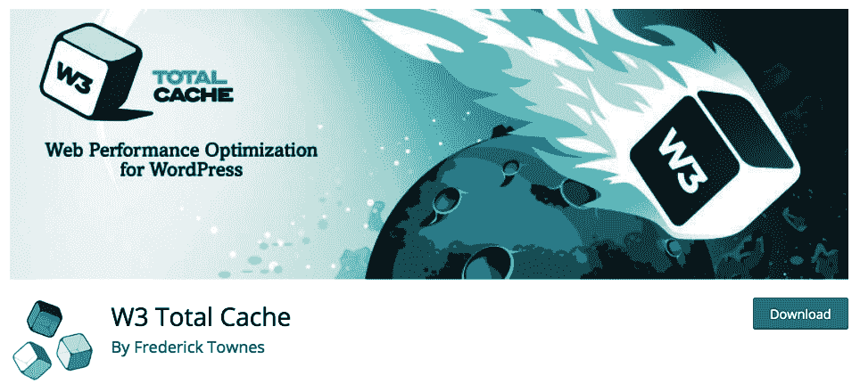

并不只是我在推荐它。实际上，许多主要的托管公司和专家表示，它提供了快速优化您网站的方法。不仅如此，该插件还在网络上的一些主要博客中使用。

安装过程与任何 WordPress 插件相同。但就在您激活它之后，您会发现使用方式相当不同。首先，它通过左侧边栏中的一个全新的部分进行访问。它被标记为性能，位于设置下方。点击它不到一秒钟后，您就会意识到这个插件非常庞大。它可能有一本完全独立的书籍来专门介绍它。因此，在这里，我将只提供一个快速入门指南。

前往性能 | 常规设置，浏览页面。有许多标记为启用的复选框。为了开始使用这个插件，我建议您启用（勾选以下复选框）以下块：

+   页面缓存

+   数据库缓存

+   对象缓存

+   浏览器缓存

然后，点击任何“保存所有设置”按钮。从现在开始，你的网站将完全启用缓存，你的访客应该会立即开始体验到性能的提升。显然，我们只是触及了这款插件带来的可能性和自定义选项，所以我鼓励你在空闲时间更仔细地研究它。

# 搜索引擎优化

**搜索引擎优化**（**SEO**）是网上最受欢迎的话题之一（至少在网站所有者中）。简单地说，如果你正确地优化你网站的 SEO，这将提高你在搜索引擎（如 Google）中的排名，并且每天都会吸引更多的访客。从理论上讲，这个概念相当简单，但要实现这一目标的工作可能会变成一份全职工作。如果你不打算花大量时间在 SEO 上，那么至少，获取**Yoast SEO**插件，可在[`wordpress.org/plugins/wordpress-seo/`](https://wordpress.org/plugins/wordpress-seo/)找到，并处理基本设置。这个插件在博客圈中非常受欢迎，它被用于一些最受欢迎的博客中：

与之前的插件 W3 Total Cache 类似，这个插件在`wp-admin`中也有一个自定义部分。它位于设置下方，被称为 SEO。了解这个插件核心设置的最好方法是使用配置向导。你会在访问`wp-admin`中的插件部分 SEO 后看到指向它的链接：

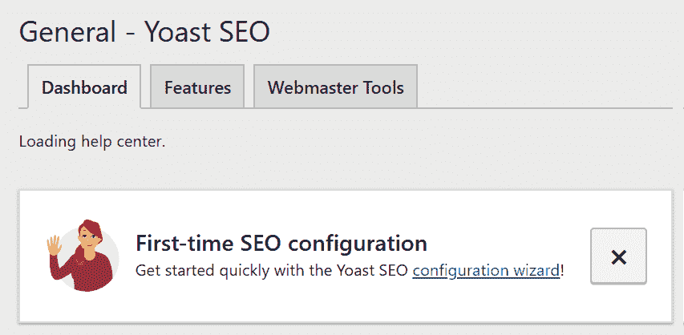

这个向导做得非常好，它会一步一步地引导你完成插件的整个配置阶段，包括其最基本的设置和功能。我强烈建议你花些时间用这个插件优化你的网站，因为这项工作肯定会在长期内带来回报，也许甚至更快：

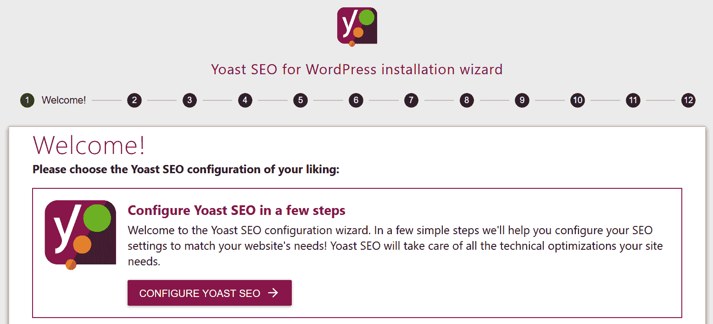

WordPress SEO 插件的作者 Joost de Valk 发布了一个单独的资源。这是你获取有关如何设置插件以及你可以做些什么来使你的网站 SEO 友好更深入信息的最佳去处。你可以在[`yoast.com/wordpress-seo/`](https://yoast.com/wordpress-seo/)找到它。

# 社交媒体集成

社交媒体已经席卷了网络空间，如今，我们几乎无法想象一个网站在没有至少一些社交媒体集成的情况下存在。这种集成的益处显而易见。有了 WordPress 的良好社交媒体插件，你将能够将你的帖子分享给你的朋友和家人在所有最流行的社交平台上。不仅如此，你的读者也能这样做，从而有效地扩大你的受众群体，使你的网站更加受欢迎。最终，在社交媒体上发布病毒式内容可以迅速增加你的流量，让你的网站每周甚至每天都能被成千上万的新人看到。

因此，我们将通过在你的网站上显示一些社交媒体按钮来使你的读者（以及你）更容易分享你的内容，更准确地说，是在你的网站包含的每个帖子或页面上。

名为“Simple Social Media Share Buttons”的社交媒体插件是一个出色的免费解决方案，它提供了所需的功能。它可在[`wordpress.org/plugins/simple-social-buttons/`](https://wordpress.org/plugins/simple-social-buttons/)找到[:](https://wordpress.org/plugins/simple-social-buttons/)

安装并激活后，你可以转到“社交按钮”|“设置”中的插件设置部分。在那里，你可以查看插件自带的一些默认设置。好消息是，如果你不想处理任何这些设置，你可以保持原样——所有设置都是可选的。然而，如果你想进行一些调整，你还可以更改关于如何在你的网站上展示社交媒体按钮的许多事情：

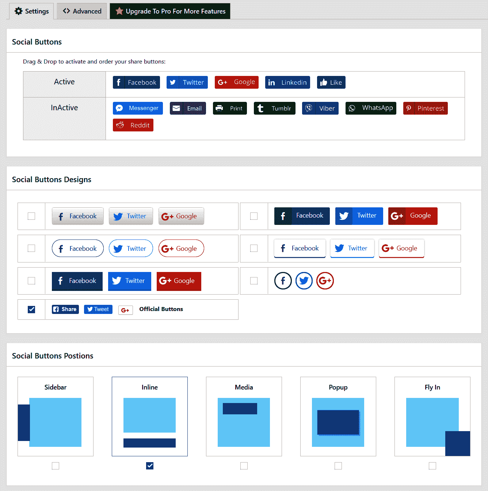

如你所见，界面非常易于理解，让你可以从一系列不同的社交网络中进行选择，同时也提供了一些基本的定制选项（例如更改按钮的大小、它们在页面上的位置，以及是否显示分享计数器）。当你完成设置实验后，点击保存更改。

例如，我在设置中选择的设置仅包括 Facebook、Twitter 和 LinkedIn 按钮，以及一个简洁的极简主题，使这些按钮更加突出。以下是它们在博客帖子中的样子：

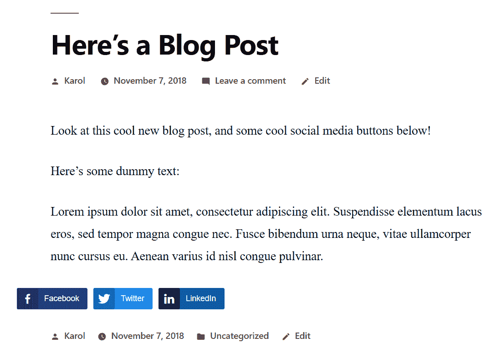

# Jetpack

这个神秘的名字正是当今最受欢迎的插件之一的名字。由 WordPress.com 背后的团队开发的 Jetpack，提供了一系列真正卓越的功能和功能。该插件由多个模块组成，可以逐个启用或禁用。这让你可以完全控制你想要使用和不想使用的功能。Jetpack 可在[`wordpress.org/plugins/jetpack/`](https://wordpress.org/plugins/jetpack/)找到：

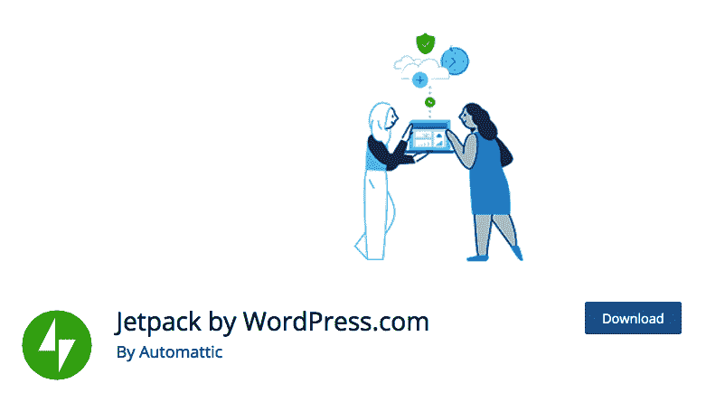

下载并激活它后，你会在 `wp-admin` 中看到一个新部分，但这次，它位于仪表板下方，如下面的截图所示：

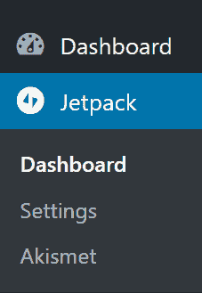

在内部，你可以看到所有可用的模块和功能。首先，你应该导航到 Jetpack | 设置来启用或禁用你需要的/不需要的模块。那里有超过 30 个模块，所以你有很多选择。幸运的是，它们已经被分成了几个类别：

+   写作：使内容创作更轻松的一切，以及网站加速的设置

+   分享：一些额外的社交媒体集成

+   讨论：帮助读者讨论和互动你内容的工具

+   流量：帮助你监控网站流量的工具和设置

+   安全：备份、增加的安全性和垃圾邮件保护

我不会在这里详细说明每个模块，因为这可能需要单独的一章。相反，我鼓励你点击你想要了解的每个模块的名称，自己获取所有信息。一般来说，每个模块都非常用户友好，所以你在安装或之后使用它们时不应遇到任何麻烦。

# 评论垃圾邮件

对于在线出版商来说，如果你遇到的是评论垃圾邮件，这可能是最令人烦恼的事情之一。基本上，垃圾邮件评论是为了将链接回退到特定网站而提交的评论。人们提交垃圾邮件评论的主要原因是为了 SEO。一般来说，在 SEO 方面，指向网站的链接数量是一个已知的排名因素，全球的网站所有者都在尽其所能获取尽可能多的链接。不幸的是，对我们来说，有时这意味着使用各种垃圾邮件方法。

WordPress 默认设置的评论方式使得任何人只需提交评论并在其中一个评论字段中输入网站地址，就能从你的网站获得链接。如果他们这样做，并且评论被批准，那么在评论的“名称”字段中输入的内容将成为链接的文本，而“网站”字段则成为链接的目标。

关于评论垃圾邮件最糟糕的是，一旦你的网站变得稍微有点受欢迎，你每天可能会开始收到数百条垃圾邮件评论；因此，手动处理它们几乎变得不可能。

不幸的是，与 WordPress 默认集成的功能中并没有包含打击评论垃圾邮件的功能。这意味着你必须安装一些插件来启用此功能。目前，让我们专注于最受欢迎的垃圾邮件保护插件——Akismet。好事是，它直接包含在标准的 WordPress 安装中，所以你应该能在你的 `wp-admin` 中的“插件”部分找到它。你需要做的只是激活它。

# 使用 Akismet

在激活插件后，您将在 `wp-admin` 的顶部区域看到一个提示。点击其中的大按钮：

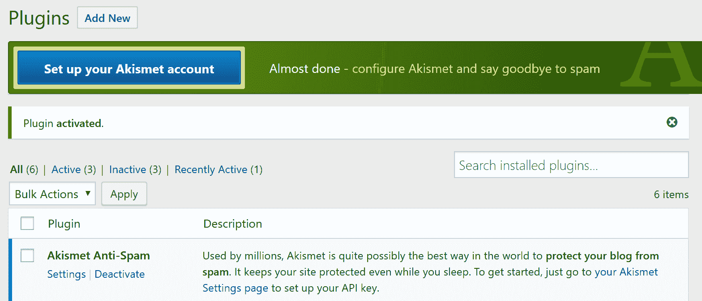

Akismet 插件要求您拥有一个特殊的 API 密钥。获取这个 API 密钥并不特别困难，但我们仍然需要经过几个步骤。首先，点击“获取您的 API 密钥”按钮：

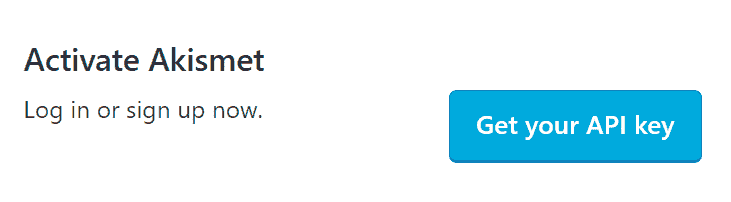

您将被重定向到 akismet.com ([`akismet.com/`](https://akismet.com/))，在那里您将能够完成整个过程。屏幕上的说明非常清晰，并一步一步地引导您完成所有步骤。要开始，您首先需要一个 WordPress.com 个人资料账户。如果您还没有，系统会提示您创建一个。注册时不需要任何花哨的东西——只需提供标准信息即可。我们已经在之前的章节中讨论过这一点。

一旦您有了账户并开始设置 Akismet，您应该特别注意您将要选择的特定订阅计划。在撰写本文时，有三个可供选择：基本（免费）、增值（5 美元）和企业（50 美元）。为了获得标准的垃圾邮件保护，您可以放心地选择基本计划，如下面的截图所示：

现在，这是一个有点棘手的问题。您选择的计划基于自愿捐赠。如果您不愿意花钱，只需将中间的滑块向左滑动，直到 $0.00/yr：

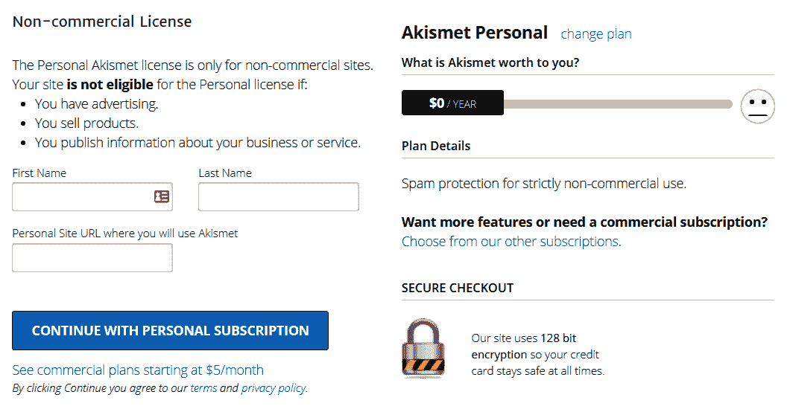

点击最后的激活链接后，您将被重定向回您的 WordPress 网站，API 密钥将已经在 Akismet 设置的正确字段中。

如果您感到自信，可以勾选“静默丢弃最糟糕和最普遍的垃圾邮件，这样我就永远不会看到它”的复选框。Akismet 在识别哪些评论实际上是垃圾邮件方面相对较好，勾选此复选框将使这些评论消失。然而，如果您担心 Akismet 误识别评论，请保持此选项未勾选。您只需点击“保存更改”按钮，您的博客现在就受到评论垃圾邮件的保护！这如下面的截图所示：

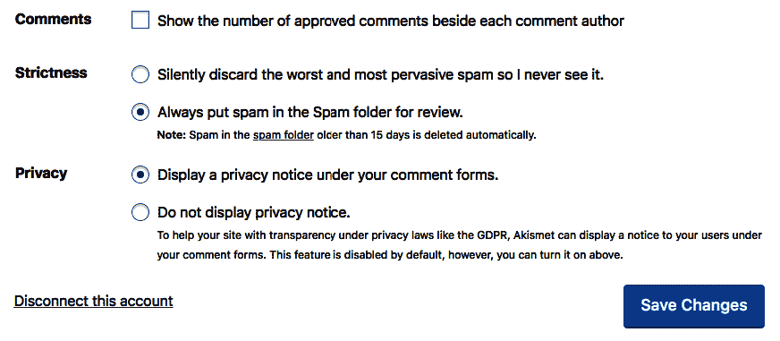

# 摘要

本章主要介绍了如何在不接触任何源代码的情况下扩展您网站上的功能，并使您的内容更具吸引力。基本上，这就是插件背后的整个理念。

一些开发者可能不需要插件，因为他们可以自己编写代码。然而，对于其他人来说，插件是使 WordPress 对每个人来说都易于使用和吸引人的关键。

到目前为止，我们知道了如何控制我们 WordPress 网站的内容，但这只是开始。在下一章中，我们将学习如何处理基本网站安全，并防止黑客接管我们的网站。
