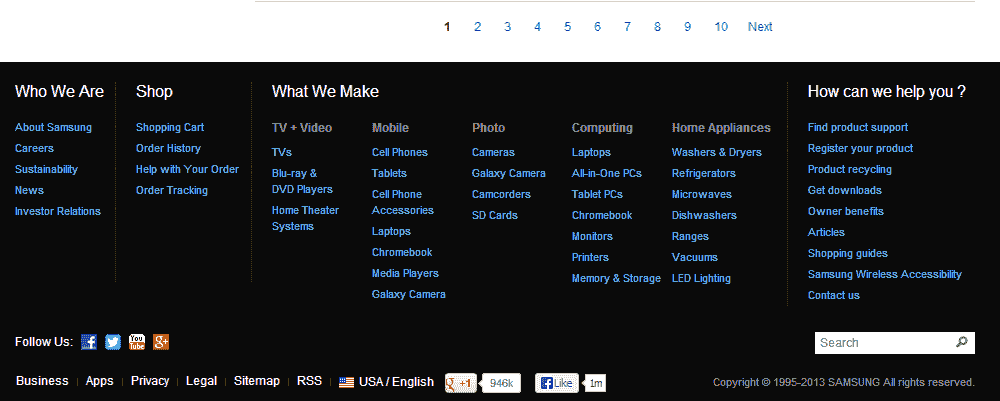
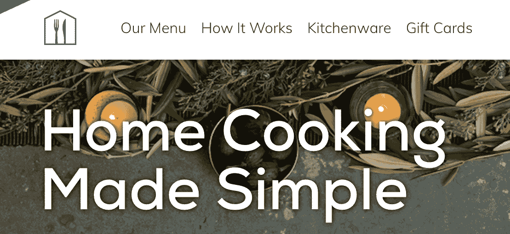
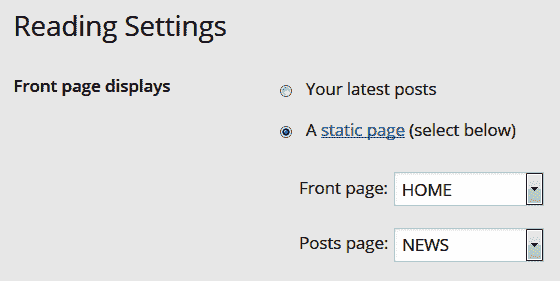
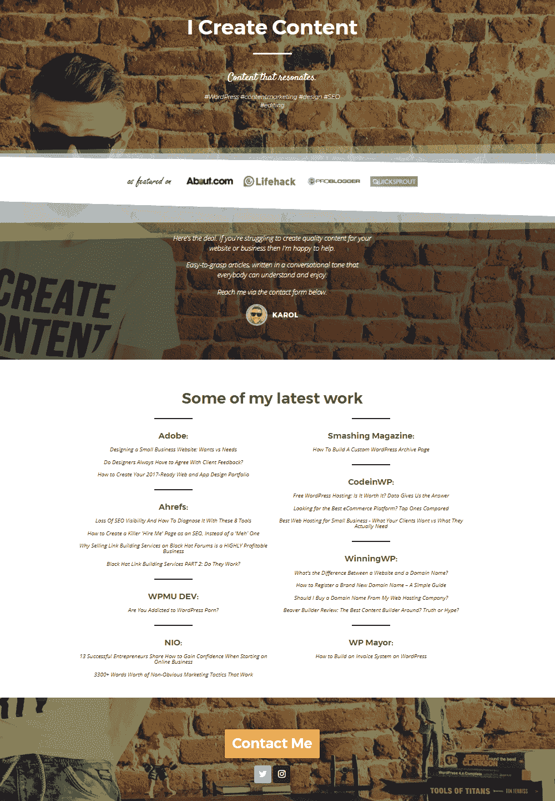

# 第十二章：创建非博客网站第一部分 - 基础

正如您在阅读这本书时所看到的，WordPress 完全配备了支持博客的功能，包括处理帖子、分类、按时间顺序显示等博客特有的特定要求。然而，为博客提供动力并不是 WordPress 的唯一目的。不再是了。事实上，现在有数百万个网站正在运行 WordPress，但其中博客并不是网站的主要焦点。我自己也构建了许多这样的网站。

为了给您一个大致的概念，以下是一些使用 WordPress 可以构建和发布的流行非博客类型网站的列表（我们将在本章和下一章中更详细地介绍其中的一些）：

+   **静态网站**：这类网站只有少数静态子页面，通常不经常更新；此外，主要内容也不是按时间顺序组织，就像博客文章一样。

+   **企业或商业网站**：这类网站与上一类相似，但通常规模更大，子页面数量也更多；此外，对于大多数商业网站，其设计看起来非常正式，色调也较为低调。

+   **单页网站**：这类网站只有一页内容；主要用于名片类型的网站，或者用于那些没有很多内容在网站上展示的企业。尽管整个网站只由一页组成，但设计通常很吸引人，有很多动态过渡效果和视差滚动背景。

+   **电子商务商店**：这些网站任何人都可以浏览多种产品，然后使用购物车进行购买。除了购物车功能外，还有在线支付集成，通常还有一个后端库存管理系统。

+   **会员网站**：这类网站的一些内容仅对那些注册了会员并（通常）为此特权支付了少量费用的用户开放；这些仅限会员的区域可以包含网站所有者认为合适的任何类型的内容——WordPress 在这方面没有任何限制。

+   **视频博客**：这就像一个标准博客，只是博主发布的是视频帖子，而不是基于文本的帖子。

+   **照片博客**：这些博客就像视频博客一样，只是围绕照片展开；它们是摄影师、平面设计师和其他类似职业人士非常常见的一种博客类型。

+   **产品网站**：简而言之，这是一种与电子商务商店非常相似的网站类型，只是这次我们通常只处理销售的单个产品。它是一种非常流行的网站类型，适用于各种网络、iOS 和 Android 应用程序。

+   **社交网络**：就像 Facebook 一样，只是这些是在 WordPress 上运行的。

+   **细分市场商业网站**：这类网站的例子包括当地餐厅网站、酒店网站、咖啡店网站、个人作品集网站、艺术画廊网站等等。

再次强调，如果我要简要地解释一般非博客网站是什么，我会说它是一种博客不是网站所有者使用的主要功能的任何类型的网站。当然，非博客网站构成了整个互联网的绝大多数。然而，由于我们在这里讨论的是 WordPress，许多人仍然认为它只是一种博客系统，我想向您保证这已经不再是事实。如今，WordPress 几乎可以用于任何事情。

在本章和下一章中，我们将探讨我们刚才提到的某些网站类型，并展示如何使用 WordPress 有效地构建它们。我们还将使用在前几章中获得的知识，因此最好您熟悉到目前为止所发生的一切，然后再阅读以下页面中的信息。

下面是我们将要深入探讨的网站类型：

+   静态网站

+   企业或商业网站

+   单页网站

+   电子商务商店

+   视频博客和照片博客

+   社交网络

此外，还有一些新的功能特性，我们在前面的章节中没有探讨过，这是我们将会关注的重点。这些包括以下内容：

+   创建具有自定义分类法的自定义文章类型

+   在`wp-admin`中更改自定义文章类型显示

让我们开始吧！

# 必须完成的任务

尽管可以使用 WordPress 构建许多不同类型的网站，但有一些步骤对所有网站都是强制性的。

例如，无论您想推出哪种类型的网站，您都必须首先正确安装 WordPress。这正是我们在第二章“WordPress 入门”中讨论的内容。实际上，这一点并没有什么不同。安装过程是相同的，所有步骤都是相同的，最终结果也是相同的——您将得到一个干净、空白的 WordPress 安装。此外，在安装特定主题和插件时，请确保遵循我们在第五章“插件——它们是什么以及为什么您需要它们”和第七章“选择和安装主题”中讨论的相同指南。

最后但同样重要的是，为了确保您的网站安全并且具有良好的用户管理结构，您必须牢记围绕用户账户和编辑工作流程（发布新内容）的所有最佳实践。

基本上，在构建非博客网站时，唯一不同的元素是选择主题和选择网站插件的流程。此外，如果您想将其提升到下一个层次，您将不得不手动实现各种功能，或者由专业人士为您定制解决方案。

幸运的是，这个过程本身并不比使用标准博客更困难。所以，一旦你在 WordPress 上积累了一些经验，你就能快速完成它。

# 静态网站

让我们从静态网站开始，因为它们是最简单的非博客网站类型，也是最容易创建的（这不应该令人惊讶）。

静态网站最好的部分是构建它们不需要任何特定的主题或插件。秘密在于开发者的心态。本质上，为了有效地完成这项工作，你需要做的只有以下几件事：

1.  利用 WordPress 中的页面功能

1.  调整默认的主页以创建更静态的体验

# 流程

首先，让我们解决一个常见的误解。静态网站的目的并不是将内容硬编码到 HTML 或 PHP 文件中。真正的目的是放弃内容的标准时间顺序组织（放弃博客功能）并专注于构建一个页面独立存在的网站，彼此之间相互独立。因此，最终我们仍然可以通过`wp-admin`轻松编辑一切，唯一的区别是我们没有使用标准的 WordPress 帖子来做任何事情。相反，我们专注于 WordPress 页面。

在设置一个优秀的静态页面的过程中，你必须做以下几件事：

1.  选择一个符合你的目标和针对你特定项目的吸引人的 WordPress 主题（我们在[第七章](https://cdp.packtpub.com/wordpress_complete___7th_edition/wp-admin/post.php?post=35&action=edit#post_30)，*选择和安装主题*）中讨论过）；这是所有类型非博客网站的一个强制性步骤。简单地说，并不是每个主题都适合所有类型的网站。所以，每次选择一个特定的主题时，请记住你打算如何使用这个网站——这将使你作为开发者的工作更容易，一旦网站上线，也会使网站对未来的访客来说更好。

1.  创建一个包含你想要将它们作为网站一部分的所有静态页面的列表。例如，对于一个本地的宠物美容服务，页面可以包括画廊、优惠和定价、客户评价、联系页面和地图。

1.  在`wp-admin`中创建每个页面（通过页面 | 添加新页面）。

1.  创建一个额外的页面，命名为 HOME，并调整它以提供良好的主页体验。例如，首先关注初访客可能会认为在主页上有用的元素。一个好的主页应该回答问题：*这个网站是关于什么的？*

1.  创建易于理解的菜单，使导航变得轻松愉快。

步骤 1 到 3 相当直接，所以我们只需关注最后两个步骤。

# 构建你的主页

默认情况下，WordPress 会将主要博客列表（按时间顺序排列的帖子列表）用作主页。在我们的情况下，这不是我们想要的，因为没有帖子。我们将要做的是创建一个自定义页面，然后将其用作静态主页（主页）。

我们在第四章详细讨论了如何做这件事，*页面、媒体和导入/导出内容*。因此，让我们在这里只关注一个基本的概述，但请随时回到[第四章](https://cdp.packtpub.com/wordpress_complete___7th_edition/wp-admin/post.php?post=35&action=edit#post_27)，*页面、媒体和导入/导出内容*，以获取更实用的教程。

要创建一个新的主页，请转到“页面”|“添加新页面”，并像处理任何其他页面一样进行操作。你可以将其命名为“HOME”，以便清楚地表明其用途。你在这个页面上放置的内容由你自己决定。本质上，主页应该是任何第一次访问给定网站的访客的一个很好的起点。例如，你可以选择一个简短的介绍信息，列出你网站上的一些热门文章，使用 Contact Form 7 插件提供的联系表单，以及一个由*Google Maps*提供的交互式地图。你可以使用 WordPress 中的新块编辑器放置所有这些元素。

一旦你的页面准备就绪，你唯一要做的就是将其指定为*主页*。这可以在“设置”|“阅读”中进行，如第四章[讨论的](https://cdp.packtpub.com/wordpress_complete___7th_edition/wp-admin/post.php?post=35&action=edit#post_27)，*页面、媒体和导入/导出内容*。

如果你想要让你的主页更加精美，你可以创建一个自定义页面模板（在第九章描述，*开发你自己的主题*），这将允许你包含你可能需要的任何设计元素，以及丰富的自定义功能。同样，这完全取决于项目。

# 创建易于理解的菜单

静态网站拼图中的最后一个元素是一个合适的菜单（或多个菜单）。因为我们的主页就像你可以在 WordPress 中创建的任何其他页面一样，它将出现在默认页面菜单（页面小工具）中，这并不是最优化的情况。

因此，每次与静态网站一起工作时，请确保只使用在“外观”|“菜单”中创建的自定义菜单。这让你可以完全控制在页眉、侧边栏以及网站上的任何其他位置显示的内容。

# 企业或商业网站

当我们审视企业或商业网站的主要目的时，很明显它们的构建与静态网站非常相似。唯一的区别是它们要大得多（有更多页面和更多内容），并且设计看起来更加正式。此外，大多数企业喜欢发布一些偶尔的公告，因此也需要类似博客的功能（但它仍然不会是网站上的主要元素）。

从本质上讲，使用 WordPress 创建一个高质量的企业的关键是选择（或构建）正确的主题。如果你在网上做一点快速的研究，你会发现大多数企业网站（至少是好的那些）几乎没有任何设计。使它们脱颖而出的东西是他们非常微妙的品牌（通过某种颜色方案或巧妙的标志使用），以及出色的导航布局。

这意味着用 WordPress 构建一个优秀的企业的最简单方法是做以下几步：

+   选择一个简洁的主题，具有良好的内容组织和几乎没有任何设计花哨的功能

+   包含特定的品牌元素并选择正确的颜色方案

+   通过自定义菜单构建一个用户友好的导航结构

+   构建一个自定义的主页

+   添加一个视觉元素，如主页滑块，使网站看起来更生动（可选）

让我们逐个检查这个列表。

# 选择一个简洁的主题

这是我们之前章节中讨论过的话题，所以让我只指向一些你可以快速获取 WordPress 主题的顶级地方。它们如下：

+   官方目录([`wordpress.org/themes/`](https://wordpress.org/themes/))

+   ThemeIsle ([`themeisle.com/`](https://themeisle.com/))

+   Elegant Themes ([`www.elegantthemes.com/`](https://www.elegantthemes.com/))

+   ThemeForest ([`themeforest.net/category/wordpress`](https://themeforest.net/category/wordpress))

需要注意的是，直接浏览主题目录中的与企业相关的部分。例如，在 ThemeForest 上，直接访问[`themeforest.net/category/wordpress/corporate`](https://themeforest.net/category/wordpress/corporate)。这将使选择过程更快。

请记住，如果你在寻找免费的主题，你应该始终从官方目录中获取（我们在第七章中讨论过，*选择和安装主题*）。

在一个高质量的企业主题中要寻找的功能包括以下：

+   一种简约的设计，让你可以包含品牌元素

+   一种简单的方法来添加标志和其他图形

+   自定义页眉功能

+   支持网站图标（Favicon）

+   响应式布局（这意味着它在台式电脑和手机上都具有相同的吸引力）

+   可定制的侧边栏

+   可定制的布局（例如，全宽，1 侧边栏，2 侧边栏等）

+   多作者支持（通常有很多人同时负责一个企业网站）

+   内置颜色方案可供选择

+   准备好 SEO

+   为主页、联系页面、常见问题解答、优惠、画廊、团队、客户评价、404 错误、作品集等提供自定义页面模板

+   兼容多种浏览器

你的主题不需要做所有这些事情，但这个列表应该是一个很好的基准，用来确定你即将选择的主题在运行企业网站方面的适用性。

# 品牌元素

从商业角度来看，品牌是可识别网站最重要的参数。因此，请确保公司的标志和企业形象与主题的色彩方案相匹配。此外，正如我在上一节中提到的，一个好的主题应该允许你从预定义的色彩方案中选择。

最后，将标志转换为 favicon 并将其上传到网站上（这可以通过主题内置的 favicon 功能或通过插件完成，例如在[`wordpress.org/plugins/all-in-one-favicon/`](https://wordpress.org/plugins/all-in-one-favicon/)可用的 All In One Favicon 插件）。这将使网站在书签菜单中具有额外的可见性（如果访问者选择将其添加到书签的话）。

# 良好的导航

在构建企业网站时，这可能是最困难的部分，主要是因为我们永远无法确定网站最终将包含多少内容。总有可能我们的导航对于少数几页内容来说太多，而对于数百页内容来说又太少。然而，有一些良好的实践你可以遵循：

+   专注于在页脚提供广泛的菜单。这将确保每位访问者都能在滚动到页面底部时找到他们想要的东西。这可以通过页脚小工具区域轻松实现，每个好的企业主题都应该为你提供。以下截图展示了三星的一个示例：

+   创建一个顶部菜单，只包含几个最重要的页面。有时，只需要四个链接就足够了。例如，以下截图展示了 Home Chef 是如何做到这一点的：

+   创建一个侧边栏菜单，链接到网站的重要区域，例如特定类别、产品、公告或其他普通访问者可能感兴趣的内容。

+   使用面包屑导航：面包屑是展示访问者相对于主页路径的小链接。大多数主题默认提供此功能。最好将它们放置在标题下方。这样，读者可以轻松地回到更通用的页面。以下截图展示了这一点的示例：

+   显示一个可见的搜索字段。许多访问企业网站的人都在寻找特定的信息，所以他们自然会立即开始寻找搜索字段。使他们的生活更轻松是一个非常不错的想法。搜索字段的一个很好的位置是在页眉和主要侧边栏（侧边栏菜单）中，以便有良好的可见性。

# 定制主页

就像静态网站一样，默认的博客列表很少能成为企业网站的好首页。采用自定义首页始终是更好的策略，并且为我们提供了一个更优化的方式来展示公司、其目标和专业领域。要创建这样的首页，您可以安全地遵循本章前面给出的说明，当时我们正在讨论静态网站。

现在，就像我说的，将默认博客列表作为首页在这里不是一个好的方法。然而，我们仍然应该至少提供与网站博客部分的一些集成。两个最合理的解决方案是，要么在首页的一个可见位置链接到博客列表页面，要么在首页的一个可用小工具区域中包含一个简化的列表作为小工具。

后者可以通过 WordPress 默认提供的“近期文章”小工具来完成（我们在第五章，*插件 – 它们是什么以及为什么你需要它们*）中介绍了小工具及其使用方法。前者可以按照以下步骤完成：

1.  创建一个新页面（页面 | 添加新页面）并命名为新闻。页面不必包含任何内容。它只需要有一个独特的名称。我建议使用新闻，因为它清楚地表明了正在发生的事情。

1.  导航到设置 | 阅读并设置您的新页面为默认帖子页面，如下面的截图所示：

1.  正如您所看到的，还有一个旧的首页，目前被设置为前台首页；我们将保持它这样。

1.  在顶部菜单（最好是）中放置新博客部分（新闻）的链接。您可以在外观 | 菜单中完成此操作。

1.  现在，如果您导航到您的新新闻页面（例如使用`http://yoursite.com/news`），您将看到默认的博客列表，公司（或网站的拥有者）可以使用它来发布各种公告，或者他们认为合适的内容。

# 滑块（可选）

值得讨论的最后一个元素是首页滑块。尽管大多数企业网站不涉及图形，但这个单一的视觉元素经常被添加。动画滑块可以使任何网站看起来更加生动，对访客更具吸引力。对于企业网站，滑块可以展示活动照片、个人公告、产品优惠或联系详情，以及许多其他内容。

一些主题从一开始就内置了滑块功能。如果没有，您始终可以获取一个插件来处理这项工作。唯一的缺点是大多数滑块插件都不是免费的。在免费插件中，我可以指出以下两个，如下所示：

+   **Master 滑块**：[`wordpress.org/plugins/master-slider/`](https://wordpress.org/plugins/master-slider/)

+   **Nivo 滑块**：[`wordpress.org/plugins/nivo-slider-lite/`](https://wordpress.org/plugins/nivo-slider-lite/)

通常，滑块并不是企业网站必须的元素，但它们可能会改善用户体验，所以它们可能值得一试。

# 一页网站

一页网站是网络世界中的相对较新发明。几年前，网站管理员并不热衷于只用一个页面来构建整个网站。这看起来像是没有足够努力提升网站的存在感。然而，如今，情况已经改变。这不再受到贬低。事实上，单页网站已成为新趋势。

在某种程度上，单页或单一页面网站类似于静态网站。您主要与 WordPress 页面而不是其博客功能一起工作，一旦设置了该页面，它可能会保持较长时间不变——也就是说，它会保持静态。然而，在单页网站上，您只需与一个页面而不是多个页面一起工作。

只为了给您一个关于单页网站外观的一般概述，请访问[`karol.cc/`](http://karol.cc/)。这是我的个人网站，我使用它来推广我的自由写作服务，以下截图可以查看：

如您所见，该网站仅由一个页面——主页组成。然而，这个页面上的每个区块都从视觉上与前一个和后一个区块分开。这种视觉分离是单页网站最重要的方面之一。因此，就像许多类型的网站一样，创建一个真正看起来很棒的单一页面网站，就是选择正确的主题——这是您的目标受众会喜欢并欣赏的。在 WordPress 上构建一个出色的单一页面网站的最简单方法就是做以下几步：

+   选择一个明确宣传为单页主题且设计简洁、主页内容区块看起来很棒的主题

+   包含特定的品牌元素并选择合适的配色方案

+   确保准备一些高质量图片，您可以在背景中使用它们

让我们逐个检查这个列表。

# 选择单页主题

就像大多数其他类别一样，单页主题现在在网上的主题商店中非常受欢迎。寻找它们的最佳地点包括，再次，官方目录([`wordpress.org/themes/`](https://wordpress.org/themes/))、ThemeIsle([`themeisle.com/`](https://themeisle.com/))和 ThemeForest([`themeforest.net/category/wordpress`](https://themeforest.net/category/wordpress))。然而，并非所有这些都提供针对单页主题的专用类别，因此您可能需要使用搜索选项来找到有趣的内容。搜索诸如“单页”或“一页”之类的术语应该会给出很好的结果。

在优质单页主题中要寻找的功能如下：

+   一种让您能够包含品牌元素的最小化设计

+   添加标志和其他图形的简单方法

+   定制页眉功能

+   一个视差滚动选项（背景图像看起来比前景移动得更慢）

+   一个响应式布局（这意味着它在台式电脑和手机上都会同样吸引人）

+   内置配色方案可供选择

+   SEO 优化就绪

+   兼容所有浏览器

你的主题包含越多的这些先前的特性，就越好。如果缺少任何东西，你总能找到一个插件来填补空白。毕竟，有插件可以解决所有问题，记得吗？

# 品牌元素

对于单一页面网站来说，品牌元素尤其重要，因为按照定义，你在线上可利用的空间并不多，所以从这个意义上说，如果网站上只有一页，你需要确保它尽可能与你的品牌和身份相匹配。因此，一个好的主题应该允许你将元素，如自己的标志、社交媒体链接和自定义图形，放置在页眉、页脚和背景等位置。幸运的是，这类特性在现代 WordPress 主题中被认为是标准配置，所以你可能根本不必担心这一点。

# 高质量图片

单一页面主题的一个主要缺陷是它们通常非常依赖良好的视觉和高质量图片。设计通常是简单且非常简约的，它们的吸引力基于网站背景中使用的图片。不幸的是，找到这样的图片完全取决于你。主题很少附带独特的图片，你将能够在你的网站上使用。

如何获取这些图片？你可以在像[`www.istockphoto.com/`](https://www.istockphoto.com/)这样的地方购买，这是一个解决方案。但你也可以在像[`unsplash.com/`](https://unsplash.com/)这样的地方免费获得很多优秀的图片。最后一个解决方案当然是拍摄你自己的照片并在你的网站上使用它们。

作为例子，我将从 WordPress 目录中当前最受欢迎的单一页面主题之一——**Hestia**（可在[`wordpress.org/themes/hestia/`](https://wordpress.org/themes/hestia/)找到），对其进行一些基本的调整，以展示单一页面主题是如何工作的。

在下载并激活主题（这是标准流程；参见第七章，*选择和安装主题*，了解如何操作）后，你可以直接前往 WordPress 定制器，在“外观”|“定制”中。你将看到一个大的定制面板。利用它，我可以更改网站上的主要标题、按钮、单个块的外观，以及整个网站背景图片，如下面的屏幕截图所示：

经过一番调整，我最终得到了一个看起来很棒的单一页面网站。您可以在下面的屏幕截图中看到我的最终页眉是什么样的：

当谈到使用 WordPress 启动一个漂亮的单页网站时，基本上就是这样了。这里最引人注目的是，实际上做这件事是多么容易。想象一下，从头开始创建这样东西需要多少时间，或者设置它需要多少成本。WordPress 现在提供的可能性真的是令人难以置信。

# 摘要

在本章中，我们涵盖了大量的优秀内容。我们首先列出了一些流行的非博客网站类型，您可以使用 WordPress 成功构建这些网站。然后，我们逐一分析了这些网站，并讨论了为了确保最终产品质量需要关注的特定元素。

下一章是我们创建非博客网站指南的第二部分。在这一章中，我们将探讨一些更以用户为中心的网站类型，例如电子商务商店、照片和视频博客，以及最终构建您自己的社交网络。
