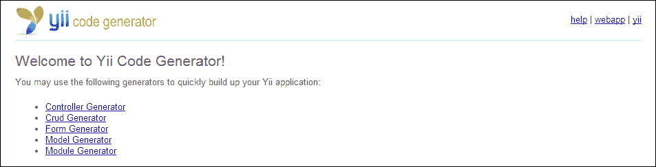

# 第一章. 任务管理应用

在开始使用 Yii 框架的最佳方式之一是制作有用的应用。本书将首先介绍一个简单的任务管理应用。在本章中，我们将涵盖这个项目的开发规划、开发应用以及创建我们将在后续章节中重用的有用组件。

# 描述项目

开始一个新项目最重要的步骤之一是规划它。在我们开始编程之前规划项目，我们可以轻松地确定应用将使用的大多数（如果不是所有）模型，我们需要实现的关键功能，以及可能在我们开发应用时引起问题的任何区域。在项目开始之前进行分解也有助于我们估计开发应用每个部分以及整个应用所需的时间。虽然我们应用的需求和期望在开发过程中很可能会发生变化，但确定应用的核心组件将有助于确保我们的应用核心功能按预期工作。

对于我们的任务管理应用，有两个主要组件：任务和项目。让我们分别分析这些组件。

## 任务

我们应用的第一部分是任务。任务是我们用户需要完成的项，通常包括一个简短、简洁的标题，以及完成任务所需完成的描述。有时，任务会关联一个截止日期或时间，这让我们知道任务需要在何时完成。任务还需要表明它们是否已经完成。最后，任务通常与一个包含类似或相关任务的组或项目相关联。

## 项目

我们应用的第二部分是项目。项目将相关任务分组，通常与它们相关联一个描述性的名称。项目也可能有一个截止日期或时间与之相关联，这表明项目中的所有任务需要在何时完成。我们还需要能够表明项目是否已完成。

## 用户

通过分解我们的项目，我们还确定了应用的一个第三部分：用户。在我们的应用中，用户将能够创建和管理项目以及任务，同时查看任何给定任务的状况和截止日期。虽然这个应用组件可能看起来很明显，但尽早确定它可以帮助我们更好地理解用户将如何与我们的应用的各种组件进行交互。

# 数据库

在确定了我们应用的核心组件后，我们现在可以开始思考我们的数据库将是什么样子了。让我们从两个数据库表开始。

## 任务表

通过查看我们的需求，我们可以确定`tasks`表的几个列和数据类型。一般来说，我们创建的每个任务都将有一个与之关联的唯一递增 ID。我们可以快速识别的其他列包括任务名称、任务描述、截止日期以及任务是否已完成。我们还知道每个任务都将与一个项目相关联，这意味着我们需要在我们的表中引用该项目。

还有一些列我们可以识别，但并不那么明显。两个最有用的列没有明确标识的是任务的创建日期和最后更新日期的时间戳。通过添加这两个列，我们可以获得关于我们应用程序使用的有用见解。可能在未来，我们的假设客户可能想知道未解决的任务开放了多久，以及如果它已经几天没有更新，是否需要额外的关注。

在确定了表的列和数据类型后，我们用通用 SQL 数据类型编写的`tasks`表将如下所示：

```php
ID INTEGER PRIMARY KEY
name TEXT
description TEXT
completed BOOLEAN
project_id INTEGER
due_date TIMESTAMP
created TIMESTAMP
updated TIMESTAMP
```

## 项目表

通过查看我们对项目的需求，我们可以轻松地挑选出`projects`表的主要列：一个描述性的名称，项目是否已完成，以及项目截止日期。我们还从`tasks`表中得知，每个项目都需要一个唯一的 ID 以便任务引用。当到了在应用中创建模型的时候，我们将明确定义任何给定项目与其所属的多个任务之间的多对一关系。如果我们保留创建和更新列，我们用通用 SQL 编写的`projects`表将如下所示：

```php
ID INTEGER PRIMARY KEY
name TEXT
completed BOOLEAN
due_date TIMESTAMP
created TIMESTAMP
updated TIMESTAMP
```

### 小贴士

**下载示例代码**

您可以从您在[`www.packtpub.com`](http://www.packtpub.com)的账户下载您购买的所有 Packt 书籍的示例代码文件。如果您在其他地方购买了这本书，您可以访问[`www.packtpub.com/support`](http://www.packtpub.com/support)并注册，以便将文件直接通过电子邮件发送给您。

## 用户

我们的应用需求还显示，我们需要在某个地方存储用户信息。对于这个应用，我们将把我们的用户存储在一个平面文件数据库中。在第三章“计划提醒”中，我们将进一步扩展并将在自己的数据库表中存储用户。

## 选择数据库技术

现在我们已经决定了数据库的外观，是时候开始考虑我们将把信息存储在哪里了。为了帮助您熟悉 Yii 原生支持的不同数据库适配器，对于这个项目，我们将使用 SQLite。既然我们现在知道了我们将存储数据的位置，我们可以确定数据库表的所有正确数据类型。

### 任务表

由于 SQLite 只支持五种基本数据类型(`NULL`、`INTEGER`、`REAL`、`TEXT` 和 `BLOB`)，我们需要将我们最初为该表识别的一些数据类型转换为 SQLite 支持的类型。由于 SQLite 不支持布尔值或时间戳，我们需要找到另一种方式使用 SQLite 支持的数据类型来表示这些数据。我们可以将布尔值表示为整数，要么是 0（false），要么是 1（true）。我们还可以通过将当前日期转换为 Unix 时间戳来将所有时间戳列表示为整数。

在确定了最终的数据类型后，我们的 `tasks` 表现在将看起来像这样：

```php
ID INTEGER PRIMARY KEY
name TEXT
description TEXT
completed INTEGER
project_id INTEGER
due_date INTEGER
created INTEGER
updated INTEGER
```

### 项目表

通过将相同的逻辑应用到我们的 `projects` 表，我们可以推导出该表的以下结构：

```php
ID INTEGER PRIMARY KEY
name TEXT
completed INTEGER
due_date INTEGER
created INTEGER
updated INTEGER
```

## 数据库概览

通过事先花几分钟思考我们的应用程序，我们已经成功识别了应用程序的所有表，它们如何相互交互，以及应用程序将使用的所有列名和数据类型。我们在不写一行代码的情况下已经对我们的应用程序做了很多工作。通过这项前期工作，我们还减少了一些在创建模型时需要做的后续工作。

# 初始化项目

在确定了最终的数据库结构后，我们现在可以开始编写代码。使用官方指南([`www.yiiframework.com/doc/guide/`](http://www.yiiframework.com/doc/guide/))中的说明，下载并安装 Yii 框架。一旦安装了 Yii，导航到您的 `webroot` 目录，并创建一个名为 `tasks` 的新文件夹。接下来，导航到 `tasks` 文件夹内部，创建以下文件夹结构，作为我们应用程序的骨架：

```php
tasks/
    assets/
    protected/
              commands/
              components/
              config/
              controllers/
              data/
              migrations/
              models/
              runtime/
              views/
                    layouts/
                    projects/
                    tasks/
                    site/
```

### 小贴士

Yii 拥有一个内置工具名为 `yiic`，它可以自动生成一个项目骨架。有关更多详细信息，请参阅快速入门指南([`www.yiiframework.com/doc/guide/1.1/en/quickstart.first-app`](http://www.yiiframework.com/doc/guide/1.1/en/quickstart.first-app))。

根据您使用的 Web 服务器，您可能还需要在 `tasks` 文件夹的根目录中创建一个 `.htaccess` 文件。有关如何为您的 Web 服务器设置应用程序的信息，请参阅快速入门指南([`www.yiiframework.com/doc/guide/1.1/en/quickstart.apache-nginx-config`](http://www.yiiframework.com/doc/guide/1.1/en/quickstart.apache-nginx-config))。

在设置好骨架结构后，我们首先创建位于 `protected/config/main.php` 的配置文件。我们的配置文件是应用程序中最重要的文件之一，因为它为 Yii 提供了加载和配置应用程序所需的所有关键信息。配置文件通知 Yii 哪些文件将由 Yii 的内置自动加载器预加载，要加载的模块，要注册的组件，以及我们想要传递给应用程序的任何其他配置选项。

对于这个应用程序，我们将启用 Gii 模块，这将允许我们根据数据库结构创建模型。我们还将启用两个组件，`urlManager`和`db`，这将允许我们设置自定义路由并访问我们的 SQLite 数据库。请看以下代码片段：

```php
<?php
return array(
   'basePath'=>dirname(__FILE__).DIRECTORY_SEPARATOR.'..',
   'name'=>'Task Application',
   'import'=>array(
        'application.models.*',
        'application.components.*',
    ),
    'modules'=>array(
        // Include the Gii Module so that we can
//generate models and controllers for our application
        'gii'=>array(
            'class'=>'system.gii.GiiModule',
            'password'=>false,
            'ipFilters'=>false
        ),
    ),
    'components'=>array(
        'urlManager'=>array(
            'urlFormat'=>'path',
            'showScriptName'=>false,
            'rules'=>array(
                '<controller:\w+>/<id:\d+>'=>'<controller>/view',
                '<controller:\w+>/<action:\w+>/<id:\d+>'=>'<controller>/<action>',
                '<controller:\w+>/<action:\w+>'=>'<controller>/<action>',
            ),
        ),
        // Define where our SQLite database is going to be
        // stored, relative to our config file
        'db'=>array(
            'connectionString' => 'sqlite:'.dirname(__FILE__).'/../data/tasks.db',
        )
    )
);
```

接下来，我们可以创建我们的`index.php`文件，如下所示，这将成为我们 Web 应用程序的启动端点：

```php
<?php
// change the following paths if necessary
$yii='/opt/frameworks/php/yii/framework/yii.php';
$config=dirname(__FILE__).'/protected/config/main.php';

// remove the following lines when in production mode
defined('YII_DEBUG') or define('YII_DEBUG',true);
// specify how many levels of call stack should be shown in each log message
defined('YII_TRACE_LEVEL') or define('YII_TRACE_LEVEL',3);

require_once($yii);
Yii::createWebApplication($config)->run();
```

最后，我们可以在`protected/yiic.php`中创建我们的应用程序`yiic`文件，如下所示，这将允许我们从应用程序中运行 Yii 的本地控制台命令：

```php
<?php
// change the following paths if necessary
$config=dirname(__FILE__).'/config/main.php';
$config = require($config);
require_once('/opt/frameworks/php/yii/framework/yiic.php');
```

# 使用迁移创建数据库

现在我们已经能够启动应用程序，我们可以创建我们的数据库。为此，我们将创建一个迁移。迁移是 Yii 的一个特性，它允许数据库的创建和修改成为应用程序的一部分。我们不需要在纯 SQL 中创建模式修改，而可以使用迁移来将数据库的增长作为应用程序的一部分。除了作为数据库模式的修订系统外，迁移还有额外的优势，即允许我们与应用程序一起传输数据库，而无需担心共享数据库中存储的数据。

要创建我们的数据库，请打开您选择的命令行界面，导航到您的任务目录，并运行以下命令：

```php
$ php protected/yiic.php migrate create tasks

```

`yiic`命令将提示您确认创建新的迁移：

```php
Yii Migration Tool v1.0 (based on Yii v1.1.14)

Create new migration '/var/www/tasks/protected/migrations/m131213_013354_tasks.php'? (yes|no) [no]:yes
New migration created successfully.

```

### 小贴士

为了防止与迁移的命名冲突，`yiic`将使用以下命名结构创建迁移：`m<timestamp>_<name>`。这还有一个额外的优势，即允许我们根据它们添加的顺序顺序应用或删除特定的迁移。您的迁移的确切名称将与前面命令中列出的名称略有不同。

在确认创建迁移后，将在应用程序的`protected/migrations`文件夹中创建一个新文件。打开该文件，并在`up`方法中添加以下内容：

```php
$this->createTable('tasks', array(
   'id' => 'INTEGER PRIMARY KEY',
   'title' => 'TEXT',
   'data' => 'TEXT',
   'project_id' => 'INTEGER',
   'completed' => 'INTEGER',
   'due_date' => 'INTEGER',
   'created' => 'INTEGER',
   'updated' => 'INTEGER'
));

$this->createTable('projects', array(
   'id' => 'INTEGER PRIMARY KEY',
   'name' => 'TEXT',
   'completed' => 'INTEGER',
   'due_date' => 'INTEGER',
   'created' => 'INTEGER',
   'updated' => 'INTEGER'
));
```

注意，我们的数据库结构与我们之前在章节中确定的模式相匹配。

接下来，用从`yiic`命令调用`migrate down`时删除数据库表的说明替换`down`方法的内容。请看以下代码：

```php
$this->dropTable('projects');
$this->dropTable('tasks');
```

现在迁移已经创建，请在命令行中运行`migrate up`以创建数据库并应用迁移。运行以下命令：

```php
$ php protected/yiic.php migrate up
Yii Migration Tool v1.0 (based on Yii v1.1.14)
Total 1 new migration to be applied:
 m131213_013354_tasks

Apply the above migration? (yes|no) [no]:yes
*** applying m131213_013354_tasks
*** applied m131213_013354_tasks (time: 0.009s)
Migrated up successfully.

```

现在，如果您导航到`protected/data/`，您将看到一个名为`tasks.db`的新文件，这是我们迁移创建的 SQLite 数据库。

### 小贴士

迁移命令可以通过在`migrate`命令后附加`--interactive=0`来非交互式地运行。如果您想自动化代码的远程系统部署，或者通过自动化测试服务运行代码，这可能很有用。

# 使用 Gii 创建模型

现在我们已经创建了数据库，我们可以为我们的数据库表创建模型。为了创建我们的模型，我们将使用 Gii，Yii 内置的代码生成器。

打开您的网络浏览器，导航到 `http://localhost/gii`（在这本书中，我们将始终使用 `localhost` 作为我们工作项目的操作主机名。如果您使用的是不同的主机名，请将 `localhost` 替换为您自己的）。一旦加载，您应该看到 **Yii 代码生成器**，如下面的截图所示：



### 小贴士

如果您无法访问 Gii，请确认您的 Web 服务器已启用重写功能。有关如何为 Yii 正确配置 Web 服务器的信息，可以在 [`www.yiiframework.com/doc/guide/1.1/en/quickstart.apache-nginx-config`](http://www.yiiframework.com/doc/guide/1.1/en/quickstart.apache-nginx-config) 找到。

点击标题为 **模型生成器** 的链接，然后在出现的页面上填写表单。表名应设置为 `tasks`。模型名称应预先填充。如果没有，将模型名称设置为 `Tasks`，然后点击预览。一旦页面重新加载，您可以在点击 **生成** 按钮将新模型写入您的 `protected/models/` 目录之前预览模型的外观。一旦您为 `tasks` 生成了模型，重复此过程为 `projects` 创建模型。

## 增强模型

现在我们已经创建了模型，有几个部分应该进行修改。

### 更新默认验证规则

我们需要修改模型的第一部分是验证规则。在 Yii 中，验证规则存储在模型的 `rules()` 方法中，并在调用模型的 `validate()` 方法时执行。从我们的 `tasks` 模型开始，我们可以看到 Gii 已经根据我们的数据库预先填充了我们的验证规则。

我们希望这个模型的一些字段始终被设置，特别是 `project_id`、`title`、任务本身以及它是否已完成。我们可以通过在我们的规则部分添加一个新的数组来使这些字段在模型中成为必需的，如下所示：

```php
array('project_id, title, data, completed', 'required')
```

通过使这些字段在模型中成为必需的，当我们开始制作表单时，客户端和服务器端的验证将变得更加容易。我们为这个模型提供的最终方法如下：

```php
public function rules()
{
        return array(
            array('project_id, completed, due_date, created, updated', 'numerical', 'integerOnly'=>true),
		   array('project_id, title, data, completed', 'required'),
            array('title, data', 'safe'),
            array('id, title, data, project_id, completed, due_date, created, updated', 'safe', 'on'=>'search'),
        );
}
```

我们的项目模型也应进行更改，以便项目名称及其完成状态是必需的。我们可以通过向我们的验证规则数组中添加以下内容来实现这一点：

```php
array('name, completed', 'required')
```

### 小贴士

在 Yii wiki [`www.yiiframework.com/wiki/56/`](http://www.yiiframework.com/wiki/56/) 可以找到额外的验证规则。

### 定义关系

我们应该更改的模型另一个组件是 `relations()` 方法。通过在 Yii 中声明模型关系，我们可以利用 ActiveRecords 自动将多个相关模型连接起来并从中检索数据的能力，而无需显式调用该模型的数据。

例如，一旦我们设置了模型关系，我们就能从 Tasks 模型中检索项目名称，如下所示：

```php
Tasks::model()->findByPk($id)->project->name;
```

在我们声明关系之前，我们需要确定关系实际上是什么。由于 SQLite 不支持外键关系，Gii 无法自动为我们确定关系。

在 Yii 中，有四种类型的关系：`BELONGS_TO`、`HAS_MANY`、`HAS_ONE` 和 `MANY_MANY`。确定关系类型可以通过查看表的外键并根据表将存储的数据选择最适合的关系类型来完成。对于这个应用程序，这个问题可以这样回答：

+   任务属于单一项目

+   一个项目有一个或多个任务

现在我们已经确定了两个表之间的关系类型，我们可以编写关系。从 `tasks` 表开始，将 `relations()` 方法替换为以下内容：

```php
public function relations()
{
return array(
        'tasks' => array(self::HAS_MANY, 'Task', 'project_id')
    );
}
```

关系数组的语法如下所示：

```php
'var_name'=>array('relationship_type', 'foreign_model', 'foreign_key', [... other options ..])
```

对于我们的项目模型，我们的 `relations()` 方法如下所示：

```php
public function relations()
{
    return array(
        'tasks' => array(self::HAS_MANY, 'Tasks', 'project_id')
    );
}
```

### 当项目被删除时移除任务

在我们模型当前的状态下，每当一个项目被删除时，与之关联的所有任务都会变成孤儿。处理这种边缘情况的一种方法就是简单地删除与项目关联的所有任务。而不是在控制器中编写代码来处理这个问题，我们可以通过引用项目模型中的 `beforeDelete()` 方法来让模型为我们处理，如下所示：

```php
public function beforeDelete()
{
    Tasks::model()->deleteAllByAttributes(array('project_id' => $this->id));
    return parent::beforeDelete();
}
```

### 检索项目元数据

关于项目，还有一些我们无法直接从 `projects` 数据库表中获取的元数据。这些数据包括项目拥有的任务数量，以及项目完成的任务数量。我们可以通过在项目的模型中创建两个新方法来获取这些数据，如下所示：

```php
public function getNumberOfTasks()
{
    return Tasks::model()->countByAttributes(array('project_id' => $this->id));
}

public function getNumberOfCompletedTasks()
{
     return Tasks::model()->countByAttributes(array('project_id' => $this->id, 'completed' => 1));
}
```

此外，我们可以通过获取已完成任务数与总任务数的百分比来确定项目的进度，如下所示：

```php
public function getPercentComplete()
{
    $numberOfTasks = $this->getNumberOfTasks();
    $numberOfCompletedTasks = $this->getNumberOfCompletedTasks();

    if ($numberOfTasks == 0)
        return 100;
    return ($numberOfCompletedTasks / $numberOfTasks) * 100;
}
```

### 自动设置创建和更新时间

需要对模型进行的最后更改是使它们能够在每次模型保存时自动在数据库中设置创建和更新时间戳。通过将此逻辑移动到模型中，我们可以避免在提交数据的表单或处理此数据的控制器中管理它。此更改可以通过向两个模型添加以下内容来实现：

```php
public function beforeSave()
{
    if ($this->isNewRecord)
         $this->created = time();

    $this->updated = time();

    return parent::beforeSave();
}
```

在 `beforeSave()` 方法中，每次模型被保存时，更新属性总是被设置，而创建属性只有在 ActiveRecord 认为这是一个新记录时才会被设置。这是通过检查模型的 `isNewRecord` 属性来实现的。此外，这两个属性都被设置为 `time()`，这是 PHP 中用于获取当前 Unix 时间戳的函数。

在这个方法中重要的最后一行代码是 `return parent::beforeSave();`。当调用 Yii 的 `save()` 方法时，它会检查 `beforeSave()` 是否返回 true，然后再将数据保存到数据库中。虽然我们可以让这个方法返回 true，但让它返回父模型（在这个案例中是 `CActiveRecord`）返回的值更简单。这也确保了任何对父模型所做的更改都会传递到模型中。

### 小贴士

由于 `beforeSave()` 方法对两个模型都是相同的，我们也可以创建一个新的模型，该模型只扩展 `CActiveRecord` 并只实现此方法。然后，任务和项目模型将扩展该模型而不是 `CActiveRecord`，并将继承此功能。将共享功能移动到共享位置减少了需要编写代码的地方数量，从而减少了错误出现的地方数量。

# 创建表现层

到目前为止，所编写的所有代码都是后端代码，最终用户将无法看到。在本节中，我们将创建我们应用程序的表现层。我们应用程序的表现层由三个组件组成：控制器、布局和视图。在下一节中，我们将创建所有三个组件。

作为开发者，我们有几种创建表现层的方法。我们可以创建表现层的一种方法是通过 Gii。Gii 有几个内置工具可以帮助你创建新的控制器、视图的表单，甚至为我们应用程序创建完整的创建、读取、更新和删除（CRUD）框架。或者，我们也可以手动编写一切。

## 管理项目

我们将要工作的表现层的第一部分是项目部分。首先，在 `protected/controllers/` 中创建一个名为 `ProjectControllerProjectController.php` 的新文件，该文件具有以下类签名：

```php
<?php
class ProjectControllerProjectController extends CController {}
```

对于我们的控制器，我们将扩展 Yii 的基类 `CController`。在未来的章节中，我们将创建自己的控制器并从它们扩展。

在我们可以开始显示新动作的内容之前，我们需要为我们的内容创建一个布局。为了指定我们的布局，创建一个公共属性 `$layout`，并将其值设置为 `'main'`：

```php
public $layout = 'main';
```

接下来，让我们创建我们的第一个动作以确保一切正常工作：

```php
public function actionIndex()
{
    echo "Hello!";
}
```

现在，我们应该能够从我们的网络浏览器访问 `http://localhost/projects/index` 并在屏幕上看到打印的文本 `Hello`。在我们继续定义我们的动作之前，让我们创建一个布局，以帮助我们的应用程序看起来更好。

### 创建布局

我们指定的布局引用了位于 `protected/views/layouts/main.php` 的文件。创建此文件并打开它进行编辑。然后，添加以下基本的 HTML5 标记：

```php
<!DOCTYPE html>
<html>
   <head>
   	</head>
   <body>
   </body>
</html>
```

然后在 `<head>` 标签内添加一个标题，该标题将显示我们在 `protected/config/main.php` 中定义的应用程序名称：

```php
<title><?php echo Yii::app()->name; ?></title>
```

接下来，让我们添加一些元标签、CSS 和脚本。为了减少需要下载的文件数量，我们将从公开可用的**内容分发网络**（**CDN**）中包含样式和脚本。而不是为这些元素编写标记，我们将使用`CClientScript`，这是一个用于管理视图中的 JavaScript、CSS 和元标签的类。

对于这个应用程序，我们将使用一个名为**Twitter Bootstrap**的前端框架。这个框架将为我们的应用程序使用的大多数常见 HTML 标签提供样式，使其整体看起来更干净。

### 提示

当你准备好将应用程序上线时，你应该考虑将你使用的静态资源移动到 CDN 上，从公开可用的 CDN 引用流行的库，如 Twitter Bootstrap 和 jQuery。CDN 可以通过减少服务器需要用于发送文件所需的带宽来帮助降低托管成本。使用 CDN 还可以加快你的网站速度，因为它们通常比你的主服务器地理位置更靠近你的用户。

首先，我们将调用`CClientScript`，如下所示：

```php
<?php $cs = Yii::app()->clientScript; ?>
```

其次，我们将`Content-Type`设置为`text/html`，字符集为`UTF-8`，如下所示：

```php
<?php $cs->registerMetaTag('text/html; charset=UTF-8', 'Content-Type'); ?>
```

接下来，我们将从流行的 CDN 注册 Twitter Bootstrap 3 的 CSS，如下所示：

```php
<?php $cs->registerCssFile( '//netdna.bootstrapcdn.com/bootstrap/3.0.3/css/bootstrap.min.css' ); ?>
```

然后我们将注册 Twitter Bootstrap 的 JavaScript 库：

```php
<?php $cs->registerScriptFile( '//netdna.bootstrapcdn.com/bootstrap/3.0.3/js/bootstrap.min.js' ); ?>
```

最后，我们将注册 jQuery 2.0 并将 Yii 放置在`<body>`标签的末尾，如下所示：

```php
<?php $cs->registerScriptFile( '//code.jquery.com/jquery.js', CClientScript::POS_END ); ?>
```

`CClientScript`也支持方法链，因此你也可以将前面的代码更改为以下内容：

```php
<?php Yii::app()->clientScript
        	->registerMetaTag('text/html; charset=UTF-8', 'Content-Type')
        	->registerCssFile( '//netdna.bootstrapcdn.com/bootstrap/3.0.3/css/bootstrap.min.css'
        	->registerScriptFile( '//netdna.bootstrapcdn.com/bootstrap/3.0.3/js/bootstrap.min.js' )
        	->registerScriptFile( 'https://code.jquery.com/jquery.js' , CClientScript::POS_END); ?>
```

对于布局的最后部分，让我们在`<body>`标签内添加一个基本的标题，这将有助于导航，如下所示：

```php
<div class="row">
    <div class="container">
        <nav class="navbar navbar-default navbar-fixed-top" role="navigation">
            <div class="navbar-header">
                <a class="navbar-brand" href="/"><?php echo CHtml::encode(Yii::app()->name); ?></a>
             </div>
        </nav>
    </div>
   </div>
```

在`</div>`标签关闭后，添加以下内容：

```php
<div class="row" style="margin-top: 100px;">
    <div class="container">
        <?php echo $content; ?>
    </div>
</div>
```

我们添加到布局中的`$content`变量是一个特殊变量，它包含来自我们视图文件的所有渲染的 HTML 标记，并由`CController`类在`render()`方法中定义。每当我们在控制器内部调用`render()`方法时，Yii 都会自动为我们填充这个变量。

### 创建项目索引动作

我们的布局定义完成后，我们可以回到创建动作。让我们首先修改我们的`actionIndex()`方法，使其渲染一个视图。

首先，创建一个变量来存储我们模型的可搜索副本。看看以下代码：

```php
$model = new Projects('search');
```

接下来，渲染一个名为`index`的视图，它引用`protected/views/projects/index.php`，并将我们创建的模型传递给此视图，如下所示：

```php
$this->render('index', array('model' => $model));
```

现在，在`protected/views/projects/index.php`中创建视图文件并打开它进行编辑。首先，在视图中添加一个按钮，如下所示，它将引用我们稍后创建的`save`动作：

```php
<?php echo CHtml::link('Create New Project', $this->createUrl('/projects/save'), array('class' => 'btn btn-primary pull-right')); ?>
<div class="clearfix"></div>
```

然后添加一个描述性的标题，这样我们就能知道我们在哪个页面。看看以下代码行：

```php
<h1>Projects</h1>
```

最后，创建一个新的小部件，它使用`CListView`，这是一个用于显示`CActiveDataProvider`数据的内置 Yii 小部件。在 Yii 中，小部件是前端组件，帮助我们快速生成常用代码，通常用于展示目的。这个小部件将根据需要自动生成分页，并允许我们的每个项目看起来都一样。请看以下代码：

```php
<?php $this->widget('zii.widgets.CListView', array(
    'dataProvider'=>$model->search(),
    'itemView'=>'_project',
)); ?>
```

我们创建的新小部件由两部分组成。第一部分是`dataProvider`，它为小部件提供数据。这些数据来自我们项目模型的`search()`方法，这是 Gii 自动生成的一段代码。

小部件的第二部分是`itemView`，它引用了我们的项目将被渲染的具体视图文件。在这种情况下，视图引用了`protected/views/projects`目录中的同一文件名为`_project.php`的文件。创建此文件，然后向其中添加以下代码：

```php
<div>
    <div class="pull-left">
        <p><strong><?php echo CHtml::link(CHtml::encode($data->name), $this->createUrl('/projects/tasks', array('id' => $data->id))); ?></strong></p>
        <p>Due on <?php echo date('m/d/Y', $data->due_date); ?></p>
<?php if ($data->completed): ?>
            Completed
        <?php else: ?>
            <?php if ($data->numberOfTasks == 0): ?>
                <p>No Tasks</p>
            <?php else: ?>
                <p><?php echo $data->getPercentComplete(); ?>% Completed</p>
            <?php endif; ?>
        <?php endif; ?>
    </div>
    <div class="pull-right">
        <?php echo CHtml::link(NULL, $this->createUrl('/projects/save', array('id' => $data->id)), array('title' => 'edit', 'class' => 'glyphicon glyphicon-pencil')); ?>
        <?php echo CHtml::link(NULL, $this->createUrl('/projects/complete', array('id' => $data->id)), array('title' => $data->completed == 1 ? 'uncomplete' : 'complete', 'class' => 'glyphicon glyphicon-check')); ?>
        <?php echo CHtml::link(NULL, $this->createUrl('/projects/delete', array('id' => $data->id)), array('title' => 'delete', 'class' => 'glyphicon glyphicon-remove')); ?>
    </div>
    <div class="clearfix"></div>
</div>
<hr/>
```

如果我们现在刷新浏览器页面，我们的视图将显示没有找到结果。在我们能够看到数据之前，我们需要创建一个动作和视图来创建和更新它。在我们开始创建新记录之前，让我们创建两个其他动作，这些动作在我们项目的视图中已经概述过：完成和删除。

### 更改项目的完成状态

首先，让我们创建一个动作来标记项目为完成或未完成。这个动作将只负责将项目表中的完成字段更改为 0 或 1，具体取决于其当前状态。为了简单起见，我们可以通过异或 1 来更改字段并保存模型。请看以下代码：

```php
public function actionComplete($id)
{
    $model = $this->loadModel($id);
    $model->completed ^= 1;
    $model->save();
    $this->redirect($this->createUrl('/projects'));
}
```

此外，我们还将创建另一个名为`loadModel()`的私有方法，它将为我们加载适当的模型，如果找不到模型，将抛出一个错误。对于这个方法，我们将使用`CHttpException`，如果找不到具有指定 ID 的模型，它将创建一个带有我们提供的错误消息的 HTTP 异常。请看以下代码：

```php
private function loadModel($id)
{
    $model = Projects::model()->findByPk($id);
    if ($model == NULL)
        throw new CHttpException('404', 'No model with that ID could be found.');
    return $model;
}
```

### 删除项目

接下来，我们将创建一个删除项目的函数。这个函数将使用我们之前定义的`loadModel()`方法。另外，如果在删除模型时遇到错误，我们将抛出一个 HTTP 异常，以便用户知道出了些问题。以下是我们的操作步骤：

```php
public function actionDelete($id)
{
    $model = $this->loadModel($id);

    if ($model->delete())
        $this->redirect($this->createUrl('/projects'));

    throw new CHttpException('500', 'There was an error deleting the model.');
}
```

### 创建和更新项目

定义了这两个其他方法之后，我们现在可以开始创建和更新项目。我们不会创建两个动作来处理这两个任务，而是创建一个动作，这个动作知道如何通过检查我们作为`GET`参数传递的 ID 来处理这两个任务。我们可以通过定义一个新的动作来实现这一点，如下所示：

```php
public function actionSave($id=NULL) {
```

然后，我们可以根据用户是否提供了 ID 来创建一个新的项目或更新一个项目。通过利用`loadModel()`，我们还处理了如果提供了 ID 但该项目不存在时可能发生的任何错误。请看以下代码：

```php
if ($id == NULL)
    $model = new Projects;
else
    $model = $this->loadModel($id);
```

接下来，我们可以通过检查 `$_POST` 变量中是否存在名为 `Projects` 的数组来检测用户是否提交了数据。如果该数组已定义，我们将将其分配给我们的 `$model->attributes` 对象。然而，在保存模型之前，我们希望将用户输入的内容转换为 Unix 时间戳。请看以下代码：

```php
if (isset($_POST['Projects']))
{
    $model->attributes = $_POST['Projects'];
    $model->due_date = strtotime($_POST['Projects']['due_date']);
    $model->save();
}
```

最后，我们将渲染视图并将模型传递给它，如下所示：

```php
$this->render('save', array('model' => $model));
```

在 `protected/views/projects/` 中创建一个名为 `save.php` 的新文件并打开它进行编辑。首先添加一个标题，让我们知道我们是在编辑项目还是创建一个新的项目，如下所示：

```php
<h1><?php echo $model->isNewRecord ? 'Create New' : 'Update'; ?> Project</h1>
```

接下来，我们将使用 `CActiveForm` 创建一个新的小部件，该小部件将负责在视图文件中创建和插入表单字段（例如，表单字段的名称和 ID）的困难任务：

```php
<?php $form=$this->beginWidget('CActiveForm', array(
    'id'=>'project-form',
    'htmlOptions' => array(
        'class' => 'form-horizontal',
        'role' => 'form'
    )
)); ?>
<?php $this->endWidget(); ?>
```

在 `beginWidget` 和 `endWidget` 调用之间，如果用户遇到错误，请添加一个错误摘要：

```php
<?php echo $form->errorSummary($model); ?>
```

然后，在错误摘要之后，添加表单字段及其相关样式，如下所示：

```php
<div class="form-group">
    <?php echo $form->labelEx($model,'name', array('class' => 'col-sm-2 control-label')); ?>
    <div class="col-sm-10">
        <?php echo $form->textField($model,'name', array('class' => 'form-control')); ?>
    </div>
</div>

<div class="form-group">
    <?php echo $form->labelEx($model,'completed', array('class' => 'col-sm-2 control-label')); ?>
    <div class="col-sm-10">
        <?php echo $form->dropDownList($model,'completed', array('0' => 'No','1' => 'Yes'), array('class' => 'form-control')); ?>
    </div>
</div>

<div class="form-group">
    <?php echo $form->labelEx($model,'due_date', array('class' => 'col-sm-2 control-label')); ?>
    <div class="col-sm-10">
        <div class="input-append date">
MM/DD/YYYY
            <?php $this->widget('zii.widgets.jui.CJuiDatePicker', array(
                    'model' => $model,
                    'attribute' => 'due_date',
                    'htmlOptions' => array(
                        'size' => '10',
                        'maxlength' => '10',
                        'class' => 'form-control',
                        'value' => $model->due_date == "" ? "" : date("m/d/Y", $model->due_date)
                    ),
                )); ?>		
</div>
    </div>
</div>

<div class="row buttons">
    <?php echo CHtml::submitButton($model->isNewRecord ? 'Create' : 'Save', array('class' => 'btn btn-primary pull-right')); ?>
</div>
```

### 注意

你注意到我们是如何利用 Yii 小部件 `CJuiDatePicker` 吗？这个小部件将为我们提供一个干净的界面，用于从日历视图中选择日期，而不是要求我们的最终用户手动输入日期并按照我们请求的格式输入。

现在，我们可以创建、更新、查看和删除项目。此外，我们还创建了一个简单的操作来标记它们为完成。在我们完成这个控制器之前，我们需要添加一个允许我们查看项目中任务的操作。

### 查看任务

此控制器的 `tasks` 操作将与我们的 `index` 操作以相同的方式工作，但将使用名为 `tasks` 的视图：

```php
public function actionTasks($id=NULL)
{
    if ($id == NULL)
        throw new CHttpException(400, 'Missing ID');

    $project = $this->loadModel($id);
    if ($project === NULL)
        throw new CHttpException(400, 'No project with that ID exists');

    $model = new Tasks('search');
    $model->attributes = array('project_id' => $id);

    $this->render('tasks', array('model' => $model, 'project' => $project));
}
```

在 `protected/views/projects/tasks.php` 中的 `tasks.php` 视图将如下所示：

```php
<?php echo CHtml::link('Create New Task', $this->createUrl('/tasks/save?Tasks[project_id]=' . $project->id), array('class' => 'btn btn-primary pull-right')); ?>
<div class="clearfix"></div>
<h1>View Tasks for Project: <?php echo $project->name; ?></h1>
<?php $this->widget('zii.widgets.CListView', array(
    'dataProvider'=>$model->search(),
    'itemView'=>'_tasks',
));
?>
```

在 `protected/views/projects/tasks.php` 中的 `_tasks.php` 项目视图将如下所示：

```php
<div>
    <div class="pull-left">
        <p><strong><?php echo CHtml::link(CHtml::encode($data->title), $this->createUrl('/tasks/save', array('id' => $data->id))); ?></strong></p>
        <p>Due on <?php echo date('m/d/Y', $data->due_date); ?></p>
    </div>
    <div class="pull-right">
        <?php echo CHtml::link(NULL, $this->createUrl('/tasks/save', array('id' => $data->id)), array('class' => 'glyphicon glyphicon-pencil')); ?>
        <?php echo CHtml::link(NULL, $this->createUrl('/tasks/complete', array('id' => $data->id)), array('title' => $data->completed == 1 ? 'uncomplete' : 'complete', 'class' => 'glyphicon glyphicon-check')); ?>
        <?php echo CHtml::link(NULL, $this->createUrl('/tasks/delete', array('id' => $data->id)), array('class' => 'glyphicon glyphicon-remove')); ?>
    </div>
    <div class="clearfix"></div>
</div>
<hr/>
```

## 管理任务

现在我们能够管理项目了，让我们来管理任务。我们的 `TasksController` 将几乎与项目控制器相同，只有一些差异。首先，在 `protected/controllers` 中创建一个名为 `TasksController.php` 的新文件，其签名如下：

```php
<?php class TasksController extends CController {}
```

通过对我们的 `loadModel()` 方法进行小小的修改，我们可以重用项目控制器中的删除和完成操作，如下所示：

```php
private function loadModel($id)
{
    $model = Tasks::model()->findByPk($id);
    if ($model == NULL)
        throw new CHttpException('404', 'No model with that ID could be found.');
    return $model;
}
```

我们的 `save` 操作几乎与项目的 `save` 操作相同。请看以下代码：

```php
public function actionSave($id=NULL)
{
    if ($id == NULL)
        $model = new Tasks;
    else
        $model = $this->loadModel($id);

    if (isset($_GET['Tasks']))
        $model->attributes = $_GET['Tasks'];

    if (isset($_POST['Tasks']))
    {
        $model->attributes = $_POST['Tasks'];
        $model->due_date = strtotime($_POST['Tasks']['due_date']);
        $model->save();
    }

    $this->render('save', array('model' => $model));
}
```

此操作的视图文件几乎与之前相同。如果您还没有创建，请在 `protected/views/tasks/` 中创建一个名为 `save.php` 的文件，然后添加以下代码行以完成视图：

```php
<ol class="breadcrumb">
  <li><?php echo CHtml::link('Project', $this->createUrl('/projects')); ?></li>
  <li class="active"><?php echo $model->isNewRecord ? 'Create New' : 'Update'; ?> Task</li>
</ol>
<hr />
<h1><?php echo $model->isNewRecord ? 'Create New' : 'Update'; ?> Task</h1>
<?php $form=$this->beginWidget('CActiveForm', array(
    'id'=>'project-form',
    'htmlOptions' => array(
        'class' => 'form-horizontal',
        'role' => 'form'
    )
)); ?>
    <?php echo $form->errorSummary($model); ?>

    <div class="form-group">
        <?php echo $form->labelEx($model,'title', array('class' => 'col-sm-2 control-label')); ?>
        <div class="col-sm-10">
            <?php echo $form->textField($model,'title', array('class' => 'form-control')); ?>
        </div>
    </div>

    <div class="form-group">
        <?php echo $form->labelEx($model,'data', array('class' => 'col-sm-2 control-label')); ?>
        <div class="col-sm-10">
            <?php echo $form->textArea($model,'data', array('class' => 'form-control')); ?>
        </div>
    </div>

    <div class="form-group">
        <?php echo $form->labelEx($model,'project_id', array('class' => 'col-sm-2 control-label')); ?>
        <div class="col-sm-10">
            <?php echo $form->dropDownList($model,'project_id', CHtml::listData(Projects::model()->findAll(), 'id', 'name'), array('empty'=>'Select Project', 'class' => 'form-control')); ?>
        </div>
    </div>

    <div class="form-group">
        <?php echo $form->labelEx($model,'completed', array('class' => 'col-sm-2 control-label')); ?>
        <div class="col-sm-10">
            <?php echo $form->dropDownList($model,'completed', array('0' => 'No','1' => 'Yes'), array('class' => 'form-control')); ?>
        </div>
    </div>

    <div class="form-group">
        <?php echo $form->labelEx($model,'due_date', array('class' => 'col-sm-2 control-label')); ?>
        <div class="col-sm-10">
            <div class="input-append date">
                <?php $this->widget('zii.widgets.jui.CJuiDatePicker', array(
                    'model' => $model,
                    'attribute' => 'due_date',
                    'htmlOptions' => array(
                       'size' => '10',
                       'maxlength' => '10',
                        'class' => 'form-control',
                       'value' => $model->due_date == "" ? "" : date("m/d/Y", $model->due_date)
                    ),
                )); ?>			</div>
        </div>
    </div>

    <div class="row buttons">
        <?php echo CHtml::submitButton($model->isNewRecord ? 'Create' : 'Save', array('class' => 'btn btn-primary pull-right')); ?>
    </div>

<?php $this->endWidget(); ?>
```

## 防止未经授权访问我们的应用程序

我们的任务应用程序现在可以完成我们在需求中定义的所有内容。然而，它是面向世界的。任何想要编辑我们的任务的人都可以简单地访问我们的网站并随意更改，而不需要我们的知识。在完成之前，让我们创建一个简单的身份验证系统来保护我们的数据。

### 使用过滤器和访问规则要求认证

保护我们的应用程序的第一步是确保只有授权的人可以访问我们的应用程序。我们可以通过向我们的控制器添加一个名为`accessControl`的过滤器并定义访问规则来访问我们的内容来实现这一点。

过滤器是一段在控制器动作运行之前（和/或之后）执行的代码，这意味着用户在访问我们的内容之前必须进行认证。要添加`accessControl`过滤器，请将以下内容添加到`TasksController`和`ProjectsController`中：

```php
public function filters()
{
    return array(
        'accessControl',
    );
}
```

接下来，创建一个名为`accessRules()`的新方法，该方法将定义用户可以访问我们的应用程序的内容。对于我们的应用程序，我们希望拒绝未认证的任何人的访问。看看以下代码片段：

```php
public function accessRules()
{
    return array(
        array('allow',
            'users'=>array('@'),
        ),
        array('deny',  // deny all users
            'users'=>array('*'),
         ),
    );
}
```

在前面的数组中，`@`是对认证用户的简写引用。现在如果我们尝试访问我们的网页，我们将被重定向到`/site/login`，这是 Yii 的默认`login`动作。

### 为认证创建控制器

在`protected/controllers`中创建一个名为`SiteController.php`的文件，然后创建`login`和`logout`动作，如下所示：

```php
<?php
class SiteController extends CController
{
    public $layout = 'signin';

    public function actionLogin()
    {
        $model = new LoginForm;

        if (isset($_POST['LoginForm']))
        {
            $model->attributes = $_POST['LoginForm'];
            if ($model->login())
                $this->redirect($this->createUrl('/projects'));
        }
        $this->render('login', array('model' => $model));
    }

    public function actionLogout()
    {
        Yii::app()->user->logout();
        $this->redirect($this->createUrl('/site/login'));
    }
}
```

### 创建登录布局

对于这个控制器，我们将在`protected/views/layouts`中创建一个新的布局，名为`login.php`。将`protected/views/layouts/main.php`中的标记复制到我们的新布局中，并用以下内容替换`<body>`标签的内容：

```php
<div class="row">
    <div class="container">
        <?php echo $content; ?>
    </div>
</div>
```

为了使我们的登录页面看起来更像一个登录页面，请将以下 CSS 添加到布局中，无论是作为内联样式还是作为`/css/signup.css`中的单独文件：

```php
body {
  padding-top: 40px;
  padding-bottom: 40px;
  background-color: #eee;
}

.form-signin {
  max-width: 330px;
  padding: 15px;
  margin: 0 auto;
}
.form-signin .form-signin-heading,
.form-signin .checkbox {
  margin-bottom: 10px;
}
.form-signin .checkbox {
  font-weight: normal;
}
.form-signin .form-control {
  position: relative;
  font-size: 16px;
  height: auto;
  padding: 10px;
  -webkit-box-sizing: border-box;
     -moz-box-sizing: border-box;
          box-sizing: border-box;
}
.form-signin .form-control:focus {
  z-index: 2;
}
.form-signin input[type="text"] {
  margin-bottom: -1px;
  border-bottom-left-radius: 0;
  border-bottom-right-radius: 0;
}
.form-signin input[type="password"] {
  margin-bottom: 10px;
  border-top-left-radius: 0;
  border-top-right-radius: 0;
}
```

### 创建登录视图

在`protected/views/site/login.php`中创建一个新的表单，该表单将包含我们的登录模型，如下所示：

```php
<?php $form=$this->beginWidget('CActiveForm', array(
    'id'=>'login-form',
    'enableClientValidation'=>true,
    'htmlOptions' => array(
            'class' => 'form-signin',
            'role' => 'form'
    ),
    'clientOptions'=>array(
        'validateOnSubmit'=>true,
    ),
)); ?>

    <?php if (!Yii::app()->user->isGuest): ?>
        <h2 class="form-signin-heading">You are already signed in! Please <?php echo CHtml::link('logout', $this->createUrl('/site/logout')); ?> first.</h2>
    <?php else: ?>
        <h2 class="form-signin-heading">Please sign in</h2>
        <?php echo $form->errorSummary($model); ?>
        <?php echo $form->textField($model,'username', array('class' => 'form-control', 'placeholder' => 'Username')); ?>
        <?php echo $form->passwordField($model,'password', array('class' => 'form-control', 'placeholder' => 'Password')); ?>
        <?php echo CHtml::tag('button', array('class' => 'btn btn-lg btn-primary btn-block'), 'Submit'); ?>
    <?php endif; ?>
<?php $this->endWidget(); ?>
```

### 使用 UserIdentity CUserIdentity 类识别我们的用户

在我们创建登录模型之前，我们需要创建一种识别我们用户的方法。幸运的是，Yii 有一个内置的类来处理这个任务，称为`CUserIdentity`。通过简单地扩展`CUserIdentity`，我们可以创建一个键值登录对，这将确保只有经过认证的用户才能登录到我们的应用程序。

在`/components`中创建一个名为`UserIdentity.php`的新文件，并添加以下内容：

```php
<?php
class UserIdentity extends CUserIdentity
{
    public function authenticate()
    {
        $users=array(
            'demo'=>'demo',
            'admin'=>'admin',
        );
        if(!isset($users[$this->username]))
            $this->errorCode=self::ERROR_USERNAME_INVALID;
        elseif($users[$this->username]!==$this->password)
            $this->errorCode=self::ERROR_PASSWORD_INVALID;
        else
            $this->errorCode=self::ERROR_NONE;
        return !$this->errorCode;
    }
}
```

`UserIdentity`的`authenticate()`方法是我们在登录模型中使用的，以确保我们有有效的凭据。在这个类中，我们只是检查将被我们的登录模型发送到这个类的`username`是否与它关联的键匹配。如果用户的密码与我们的`$users`数组中的键不匹配，或者如果用户未定义在我们的`$users`数组中，我们返回一个错误代码。

### 创建登录模型

我们需要创建的最后组件是创建一个通用的模型来验证用户。首先，在`protected/models`中创建一个名为`LoginForm.php`的新文件。这个类将扩展 Yii 中用于表单的通用模型`CFormModel`，如下所示：

```php
<?php class LoginForm extends CFormModel {
```

由于 `CFormModel` 不连接到数据库，我们定义属性为公共属性，如下所示：

```php
public $username;
public $password;
private $_identity;
```

我们的模式还需要验证规则来验证我们有一个有效的用户。除了确保提供了 `username` 和 `password`，我们还将提供一个额外的验证规则，称为 `authenticate`，它将验证我们有一个有效的用户名和密码。请看以下代码行：

```php
public function rules()
{
    return array(
        array('username, password', 'required'),
        array('password', 'authenticate'),
    );
}
```

因为我们的 `authenticate()` 方法是一个自定义验证器，它的方法签名有两个参数，`$attribute` 和 `$params`，它们包含有关属性和可能从验证器传递过来的参数的信息。此方法将确定我们的凭证是否有效。请看以下代码：

```php
public function authenticate($attribute,$params)
{
    if(!$this->hasErrors())
    {
        $this->_identity=new UserIdentity($this->username,$this->password);
        if(!$this->_identity->authenticate())
            $this->addError('password','Incorrect username or password.');
    }
}
```

最后，我们将创建 `login()` 方法，这是我们的 `SiteController` 调用的。除了验证我们的凭证外，它还将为用户创建会话的重任。请看以下代码：

```php
public function login()
{
    if (!$this->validate())
        return false;

    if ($this->_identity===null)
    {
        $this->_identity=new UserIdentity($this->username,$this->password);
        $this->_identity->authenticate();
    }

    if ($this->_identity->errorCode===UserIdentity::ERROR_NONE)
    {
        $duration = 3600*24*30;
        Yii::app()->user->login($this->_identity,$duration);
        return true;
    }
    else
        return false;
}
```

现在，您可以使用我们 `UserIdentity.php` 文件中提供的凭证访问我们的网站并登录。

# 完成细节

在完成我们的项目之前，我们需要在我们的 `protected/config/main.php` 文件中处理一些事情，以增强我们应用程序的安全性并使我们的应用程序更容易使用。

如果能添加一些最终应用程序的图片那就更好了。

## 禁用 Gii

在我们项目的开始阶段，我们启用了 Gii 模块来帮助我们创建应用程序的模型。由于 Gii 有能力将新文件写入我们的项目，我们应该从我们的 `config` 文件中删除以下部分：

```php
'gii'=>array(
    'class'=>'system.gii.GiiModule',
    'password'=>false,
    'ipFilters' => false
),
```

## 定义默认路由

目前，如果我们尝试访问我们应用程序的根 URL，我们会看到一个错误。为了避免这种情况，我们可以在我们 URL 管理组件的路由数组中添加一个路由。有了这个添加，每次我们访问我们应用程序的根 URL 时，我们都会看到项目的控制器中的 `index` 动作。请看以下代码：

```php
'components'=>array(
    [...]
    'urlManager'=>array(
        [...]
        'rules'=>array(
            [...]
            '/' => 'projects/index'
        ),
    )
)
```

## 添加额外路由

最后，将两个额外的路由添加到我们的 URL 管理器路由数组中。这些路由将帮助我们更容易地访问我们网站的 `login` 和 `logout` 动作。请看以下代码：

```php
'login' => 'site/login',
'logout' => 'site/logout'
```

# 摘要

在本章中，我们涵盖了大量的信息。我们创建了一种自动创建和分发我们数据库、表示数据库表中表的模式以及一些用于管理和交互数据的控制器的方法。我们还创建了一个简单的键值认证系统来保护我们的数据。我们在本章中使用的大多数方法和我们编写的代码都可以在后面的章节中重用和扩展。在继续之前，请务必查看我们在章节中引用的所有类，在官方 Yii 文档中，以便更好地理解它们。
